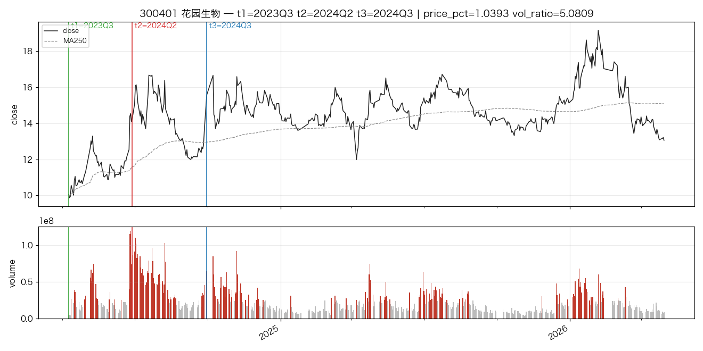

# Rat-Trader 候选报告 — 20260501

- 候选数 (strict_bcd=True): **1**
- 诊断股票数 (A 段进入 BCD 的): **6**

## 最终候选 (B∧C∧D)
|   code | name   | t1     | t2     | t3     | B    | C    | D    |   price_pct |   vol_ratio | post_ret_60d   |
|-------:|:-------|:-------|:-------|:-------|:-----|:-----|:-----|------------:|------------:|:---------------|
| 300401 | 花园生物   | 2023Q3 | 2024Q2 | 2024Q3 | True | True | True |      1.0393 |      5.0809 |                |

### 300401 K 线 + 成交量

## 全部诊断（A 段命中股的 BCD 数值）

### 002276 
- A=True BCD=False triples=1 monotonic_up=False

| t1     | t2     | t3     | B     | C     | D     | price_pct   | vol_ratio   | post_ret_60d   |
|:-------|:-------|:-------|:------|:------|:------|:------------|:------------|:---------------|
| 2022Q3 | 2022Q4 | 2023Q1 | False | False | False |             |             |                |

### 002434 
- A=True BCD=False triples=2 monotonic_up=False

| t1     | t2     | t3     | B     | C     | D     |   price_pct |   vol_ratio | post_ret_60d   |
|:-------|:-------|:-------|:------|:------|:------|------------:|------------:|:---------------|
| 2022Q3 | 2022Q4 | 2023Q1 | False | False | False |    nan      |    nan      |                |
| 2023Q2 | 2024Q2 | 2024Q3 | False | True  | True  |      0.6426 |      0.8549 |                |

### 300352 
- A=False BCD=False triples=0 monotonic_up=False

### 300369 
- A=True BCD=False triples=1 monotonic_up=False

| t1     | t2     | t3     | B     | C    | D    |   price_pct |   vol_ratio | post_ret_60d   |
|:-------|:-------|:-------|:------|:-----|:-----|------------:|------------:|:---------------|
| 2023Q3 | 2023Q4 | 2024Q1 | False | True | True |      0.5677 |      0.6277 |                |

### 300401 
- A=True BCD=True triples=5 monotonic_up=False

| t1     | t2     | t3     | B     | C     | D    |   price_pct |   vol_ratio |   post_ret_60d |
|:-------|:-------|:-------|:------|:------|:-----|------------:|------------:|---------------:|
| 2022Q3 | 2023Q1 | 2023Q3 | False | True  | True |      0.7643 |      0.7438 |         0.0068 |
| 2022Q3 | 2023Q2 | 2023Q3 | False | True  | True |      0.6563 |      0.3374 |       nan      |
| 2023Q3 | 2023Q4 | 2024Q3 | False | True  | True |      0.6412 |      0.862  |        -0.0112 |
| 2023Q3 | 2024Q1 | 2024Q3 | False | False | True |      0.7432 |      1.1409 |         0.5151 |
| 2023Q3 | 2024Q2 | 2024Q3 | True  | True  | True |      1.0393 |      5.0809 |       nan      |

### 688408 
- A=True BCD=False triples=2 monotonic_up=False

| t1     | t2     | t3     | B     | C    | D    |   price_pct |   vol_ratio |   post_ret_60d |
|:-------|:-------|:-------|:------|:-----|:-----|------------:|------------:|---------------:|
| 2023Q2 | 2023Q3 | 2024Q1 | False | True | True |      0.7387 |      0.7367 |         0.0513 |
| 2023Q2 | 2023Q4 | 2024Q1 | False | True | True |      0.6899 |      0.6456 |       nan      |
