# Rat-Trader 候选报告 — 20260502

- 候选数 (strict_bcd=True): **28**
- 诊断股票数 (A 段进入 BCD 的): **850**
- 港中结数据截止: **2024-08-16**
  ⚠️ **数据已过期 624 天** — akshare 港中结数据截止约 2024-08-16，建议关注官方渠道更新（FB-015）
- 筛选漏斗: HKSCC 候选 **850** → K 线覆盖 **1087** → A 段命中 **850** → BCD 命中 **28**

## 最终候选 (B∧C∧D)
|   code | name   |   quarters_held |   latest_mcap_亿 | t1     | t2     | t3     | B    | C    | D    |   price_pct |   vol_ratio |   post_ret_60d |   bcd_score |
|-------:|:-------|----------------:|----------------:|:-------|:-------|:-------|:-----|:-----|:-----|------------:|------------:|---------------:|------------:|
| 603258 | 电魂网络   |              11 |            0.39 | 2023Q1 | 2023Q2 | 2023Q4 | True | True | True |      1.9232 |      5.9015 |        -0.0999 |        90.6 |
| 603960 | 克来机电   |              11 |            0.51 | 2023Q4 | 2024Q1 | 2024Q2 | True | True | True |      1.9595 |      6.8018 |       nan      |        84.6 |
| 300002 | 神州泰岳   |              11 |            3.51 | 2023Q1 | 2023Q2 | 2023Q3 | True | True | True |      1.6469 |      4.2537 |       nan      |        73.2 |
| 300303 | 聚飞光电   |              11 |            1.78 | 2023Q1 | 2023Q2 | 2023Q3 | True | True | True |      1.3086 |      5.9227 |       nan      |        71.9 |
| 002605 | 姚记科技   |              11 |            0.53 | 2022Q4 | 2023Q2 | 2023Q3 | True | True | True |      1.8084 |      2.8116 |       nan      |        66.8 |
| 002351 | 漫步者    |              11 |            0.74 | 2023Q1 | 2023Q2 | 2023Q3 | True | True | True |      1.3738 |      3.7416 |       nan      |        65.1 |
| 002239 | 奥特佳    |              11 |            0.57 | 2023Q2 | 2023Q4 | 2024Q1 | True | True | True |      1.3225 |      4.0029 |       nan      |        63.9 |
| 605555 | 德昌股份   |               7 |            1.35 | 2023Q3 | 2023Q4 | 2024Q2 | True | True | True |      1.2377 |      2.3987 |        -0.0377 |        62.8 |
| 002947 | 恒铭达    |              11 |            0.85 | 2023Q3 | 2023Q4 | 2024Q1 | True | True | True |      1.3786 |      3.0087 |       nan      |        62   |
| 002641 | 公元股份   |              11 |            0.89 | 2023Q4 | 2024Q1 | 2024Q3 | True | True | True |      1.1738 |      3.5146 |         0.0216 |        62   |
| 300098 | 高新兴    |               7 |            0.36 | 2023Q2 | 2023Q4 | 2024Q1 | True | True | True |      1.2506 |      3.6635 |       nan      |        59.1 |
| 600864 | 哈投股份   |               7 |            0.41 | 2023Q2 | 2023Q3 | 2024Q1 | True | True | True |      1.3009 |      3.1367 |         0.0841 |        57.8 |
| 600621 | 华鑫股份   |              11 |            1.18 | 2023Q4 | 2024Q1 | 2024Q3 | True | True | True |      1.1669 |      3.1001 |         0.0381 |        57.6 |
| 688177 | 百奥泰    |               6 |            0.75 | 2023Q3 | 2023Q4 | 2024Q1 | True | True | True |      1.3801 |      1.8501 |       nan      |        56.9 |
| 300457 | 赢合科技   |              11 |            0.98 | 2023Q2 | 2023Q3 | 2024Q2 | True | True | True |      0.9416 |      3.9694 |        -0.0262 |        56.2 |
| 301015 | 百洋医药   |              10 |            0.81 | 2023Q2 | 2023Q4 | 2024Q1 | True | True | True |      1.3665 |      1.8078 |       nan      |        56.1 |
| 300401 | 花园生物   |              11 |            0.66 | 2023Q3 | 2024Q2 | 2024Q3 | True | True | True |      1.0393 |      5.0809 |       nan      |        55.7 |
| 000030 | 富奥股份   |              11 |            0.54 | 2023Q3 | 2023Q4 | 2024Q2 | True | True | True |      1.1103 |      2.2168 |         0.006  |        55.3 |
| 000712 | 锦龙股份   |               7 |            0.89 | 2023Q3 | 2023Q4 | 2024Q1 | True | True | True |      1.0591 |      4.6374 |       nan      |        54.6 |
| 300075 | 数字政通   |              11 |            0.5  | 2022Q4 | 2023Q2 | 2024Q1 | True | True | True |      1.2655 |      1.6431 |         0.0466 |        54.5 |
| 000099 | 中信海直   |              11 |            1.65 | 2023Q1 | 2023Q2 | 2023Q3 | True | True | True |      1.2581 |      2.5253 |       nan      |        54.3 |
| 603013 | 亚普股份   |              11 |            0.42 | 2023Q3 | 2023Q4 | 2024Q1 | True | True | True |      1.254  |      2.5387 |       nan      |        54.2 |
| 000681 | 视觉中国   |              11 |            1.04 | 2023Q1 | 2023Q2 | 2023Q3 | True | True | True |      1.2468 |      2.5765 |       nan      |        54   |
| 688062 | 迈威生物   |               7 |            2.12 | 2023Q3 | 2023Q4 | 2024Q1 | True | True | True |      1.3469 |      1.5052 |       nan      |        53.9 |
| 300045 | 华力创通   |               7 |            0.69 | 2023Q3 | 2023Q4 | 2024Q2 | True | True | True |      1.2131 |      2.4483 |         0.0686 |        52.8 |
| 300492 | 华图山鼎   |               6 |            0.39 | 2023Q4 | 2024Q1 | 2024Q2 | True | True | True |      1.2823 |      1.6925 |       nan      |        51.7 |
| 688076 | ST诺泰   |               7 |            1.98 | 2023Q3 | 2023Q4 | 2024Q1 | True | True | True |      1.2808 |      1.6001 |       nan      |        51.2 |
| 002003 | 伟星股份   |              11 |            2.18 | 2024Q1 | 2024Q2 | 2024Q3 | True | True | True |      1.2699 |      1.6368 |       nan      |        50.9 |

### 603258 电魂网络 K 线 + 成交量
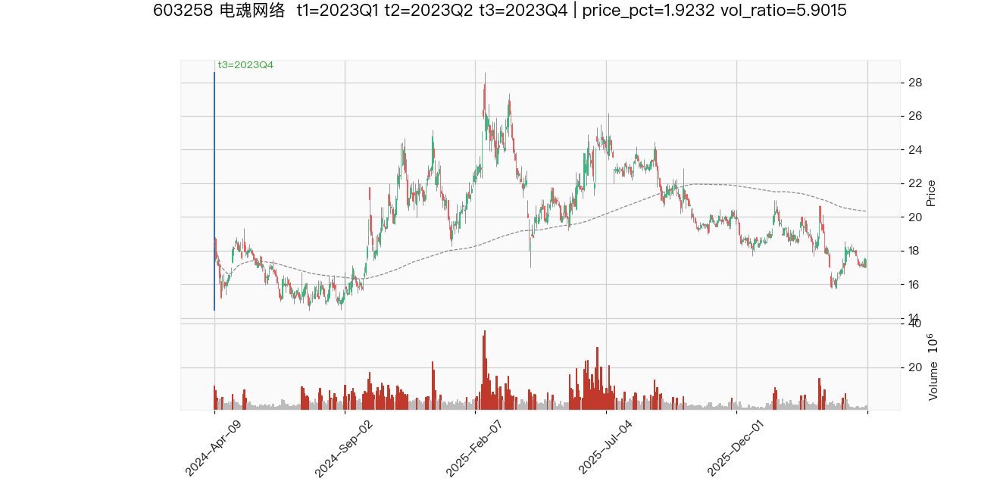

#### 🔍 检测依据 — 603258 电魂网络
> 最佳 triple: **2023Q1 → 2023Q2 → 2023Q4** ｜ B 触发: price_pct=1.92 vol_ratio=5.90 ｜ t2 后 60 日收益: -10.0% ｜ 评分分解: price=30.0 + vol=20.6 + c=20.0 + bonus=20 = **90.6** ｜ 候选 triple 数: 1

#### 📊 港中结持仓节奏 — 603258 电魂网络

| 季度     |   持股市值(亿) | 环比   | 信号       |
|:-------|----------:|:-----|:---------|
| 2022Q1 |      0.65 |      |          |
| 2022Q2 |      0.55 | ↓    |          |
| 2022Q3 |      0.54 |      |          |
| 2022Q4 |      0.68 | ↑    |          |
| 2023Q1 |      3.38 | ↑    | ▲ t1 加仓  |
| 2023Q2 |      2.27 | ↓    | ▼ t2 减仓  |
| 2023Q3 |      1.43 | ↓    |          |
| 2023Q4 |      1.48 |      | ▲ t3 再加仓 |
| 2024Q1 |      1.48 |      |          |
| 2024Q2 |      0.38 | ↓    |          |
| 2024Q3 |      0.39 |      |          |

#### ✍️ 人工复盘 — 603258 电魂网络

| 检查项 | 结果 |
|--------|------|
| t2 季度价格在近 250 日高位区间（视觉） | ⬜ |
| t2 季度出现明显放量 bar（红色高量） | ⬜ |
| t3 季度买回后股价未大幅上涨（非卖飞） | ⬜ |
| t1→t2→t3 三段节奏符合「建仓→出货→再建仓」 | ⬜ |

**决策**: ⬜ PASS（纳入关注名单）　⬜ REJECT（假信号）

**备注**: _（人工填写）_

### 603960 克来机电 K 线 + 成交量
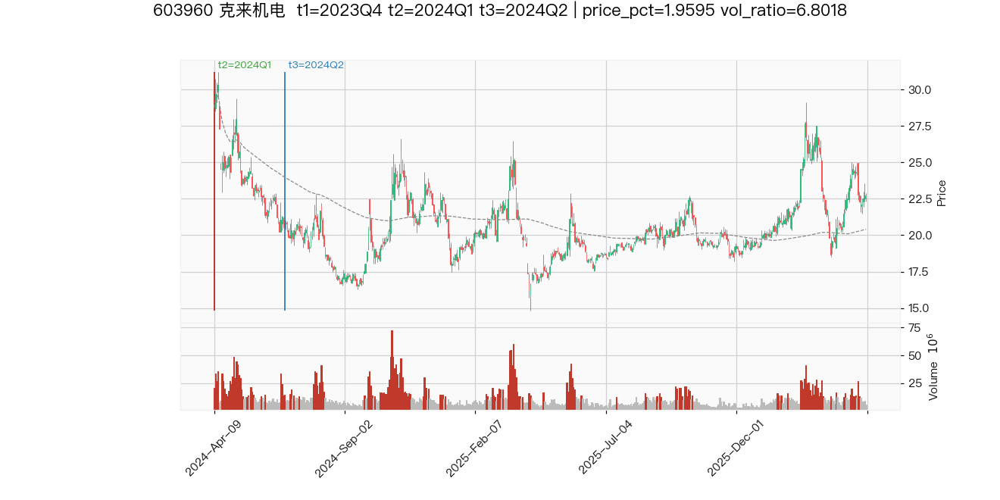

#### 🔍 检测依据 — 603960 克来机电
> 最佳 triple: **2023Q4 → 2024Q1 → 2024Q2** ｜ B 触发: price_pct=1.96 vol_ratio=6.80 ｜ 评分分解: price=30.0 + vol=24.6 + c=10.0 + bonus=20 = **84.6** ｜ 候选 triple 数: 2

#### 📊 港中结持仓节奏 — 603960 克来机电

| 季度     |   持股市值(亿) | 环比   | 信号       |
|:-------|----------:|:-----|:---------|
| 2022Q1 |      3.02 |      |          |
| 2022Q2 |      2.41 | ↓    |          |
| 2022Q3 |      1.48 | ↓    |          |
| 2022Q4 |      0.83 | ↓    |          |
| 2023Q1 |      1.15 | ↑    |          |
| 2023Q2 |      1.9  | ↑    |          |
| 2023Q3 |      0.98 | ↓    |          |
| 2023Q4 |      1.26 | ↑    | ▲ t1 加仓  |
| 2024Q1 |      0.59 | ↓    | ▼ t2 减仓  |
| 2024Q2 |      1.17 | ↑    | ▲ t3 再加仓 |
| 2024Q3 |      0.51 | ↓    |          |

#### ✍️ 人工复盘 — 603960 克来机电

| 检查项 | 结果 |
|--------|------|
| t2 季度价格在近 250 日高位区间（视觉） | ⬜ |
| t2 季度出现明显放量 bar（红色高量） | ⬜ |
| t3 季度买回后股价未大幅上涨（非卖飞） | ⬜ |
| t1→t2→t3 三段节奏符合「建仓→出货→再建仓」 | ⬜ |

**决策**: ⬜ PASS（纳入关注名单）　⬜ REJECT（假信号）

**备注**: _（人工填写）_

### 300002 神州泰岳 K 线 + 成交量
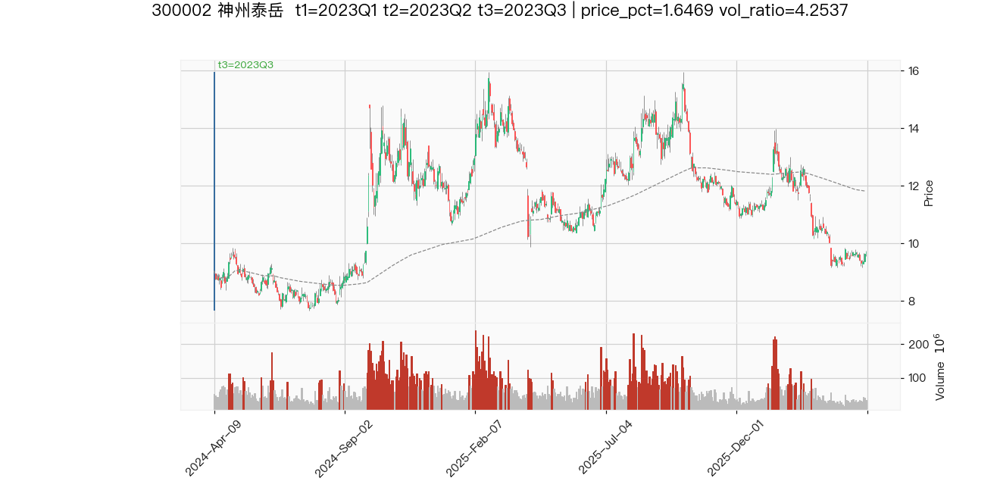

#### 🔍 检测依据 — 300002 神州泰岳
> 最佳 triple: **2023Q1 → 2023Q2 → 2023Q3** ｜ B 触发: price_pct=1.65 vol_ratio=4.25 ｜ 评分分解: price=30.0 + vol=13.2 + c=10.0 + bonus=20 = **73.2** ｜ 候选 triple 数: 2

#### 📊 港中结持仓节奏 — 300002 神州泰岳

| 季度     |   持股市值(亿) | 环比   | 信号       |
|:-------|----------:|:-----|:---------|
| 2022Q1 |      1.16 |      |          |
| 2022Q2 |      0.59 | ↓    |          |
| 2022Q3 |      0.61 |      |          |
| 2022Q4 |      4.77 | ↑    |          |
| 2023Q1 |     11.89 | ↑    | ▲ t1 加仓  |
| 2023Q2 |     14.95 | ↑    | ▼ t2 减仓  |
| 2023Q3 |     13.13 | ↓    | ▲ t3 再加仓 |
| 2023Q4 |      8.91 | ↓    |          |
| 2024Q1 |      7.73 | ↓    |          |
| 2024Q2 |      1.45 | ↓    |          |
| 2024Q3 |      3.51 | ↑    |          |

#### ✍️ 人工复盘 — 300002 神州泰岳

| 检查项 | 结果 |
|--------|------|
| t2 季度价格在近 250 日高位区间（视觉） | ⬜ |
| t2 季度出现明显放量 bar（红色高量） | ⬜ |
| t3 季度买回后股价未大幅上涨（非卖飞） | ⬜ |
| t1→t2→t3 三段节奏符合「建仓→出货→再建仓」 | ⬜ |

**决策**: ⬜ PASS（纳入关注名单）　⬜ REJECT（假信号）

**备注**: _（人工填写）_

### 300303 聚飞光电 K 线 + 成交量
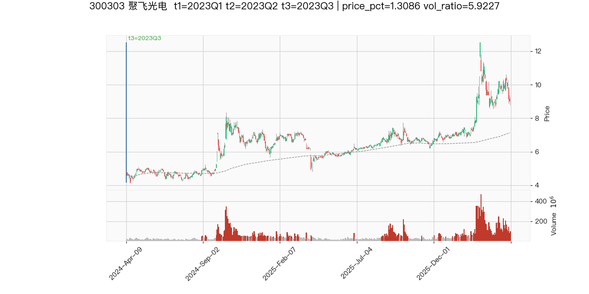

#### 🔍 检测依据 — 300303 聚飞光电
> 最佳 triple: **2023Q1 → 2023Q2 → 2023Q3** ｜ B 触发: price_pct=1.31 vol_ratio=5.92 ｜ 评分分解: price=21.2 + vol=20.7 + c=10.0 + bonus=20 = **71.9** ｜ 候选 triple 数: 4

#### 📊 港中结持仓节奏 — 300303 聚飞光电

| 季度     |   持股市值(亿) | 环比   | 信号       |
|:-------|----------:|:-----|:---------|
| 2022Q1 |      0.13 |      |          |
| 2022Q2 |      0.34 | ↑    |          |
| 2022Q3 |      0.19 | ↓    |          |
| 2022Q4 |      0.2  |      |          |
| 2023Q1 |      0.44 | ↑    | ▲ t1 加仓  |
| 2023Q2 |      0.33 | ↓    | ▼ t2 减仓  |
| 2023Q3 |      0.62 | ↑    | ▲ t3 再加仓 |
| 2023Q4 |      0.61 |      |          |
| 2024Q1 |      0.77 | ↑    |          |
| 2024Q2 |      0.62 | ↓    |          |
| 2024Q3 |      1.78 | ↑    |          |

#### ✍️ 人工复盘 — 300303 聚飞光电

| 检查项 | 结果 |
|--------|------|
| t2 季度价格在近 250 日高位区间（视觉） | ⬜ |
| t2 季度出现明显放量 bar（红色高量） | ⬜ |
| t3 季度买回后股价未大幅上涨（非卖飞） | ⬜ |
| t1→t2→t3 三段节奏符合「建仓→出货→再建仓」 | ⬜ |

**决策**: ⬜ PASS（纳入关注名单）　⬜ REJECT（假信号）

**备注**: _（人工填写）_

### 002605 姚记科技 K 线 + 成交量
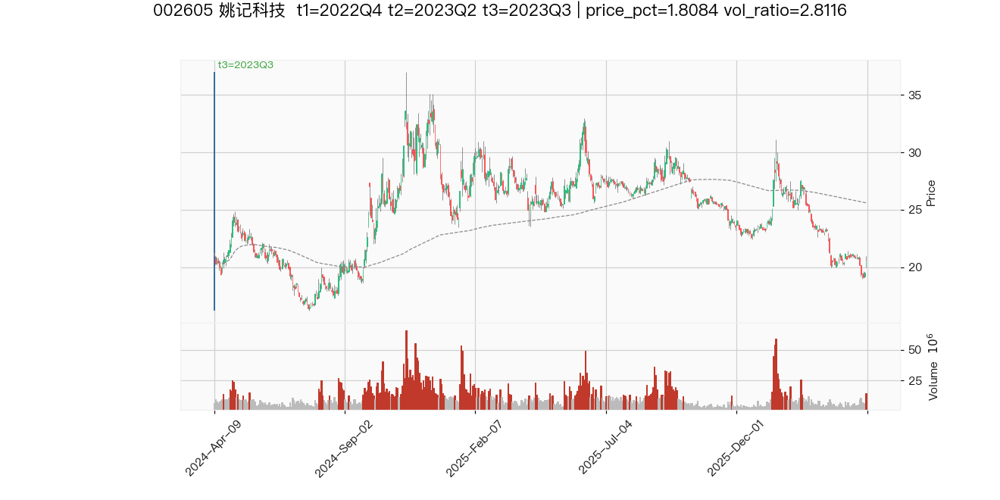

#### 🔍 检测依据 — 002605 姚记科技
> 最佳 triple: **2022Q4 → 2023Q2 → 2023Q3** ｜ B 触发: price_pct=1.81 vol_ratio=2.81 ｜ 评分分解: price=30.0 + vol=6.8 + c=10.0 + bonus=20 = **66.8** ｜ 候选 triple 数: 2

#### 📊 港中结持仓节奏 — 002605 姚记科技

| 季度     |   持股市值(亿) | 环比   | 信号       |
|:-------|----------:|:-----|:---------|
| 2022Q1 |      0.77 |      |          |
| 2022Q2 |      0.86 | ↑    |          |
| 2022Q3 |      1.12 | ↑    |          |
| 2022Q4 |      1.33 | ↑    | ▲ t1 加仓  |
| 2023Q1 |      2.44 | ↑    |          |
| 2023Q2 |      1.82 | ↓    | ▼ t2 减仓  |
| 2023Q3 |      5.59 | ↑    | ▲ t3 再加仓 |
| 2023Q4 |      2.52 | ↓    |          |
| 2024Q1 |      0.68 | ↓    |          |
| 2024Q2 |      0.43 | ↓    |          |
| 2024Q3 |      0.53 | ↑    |          |

#### ✍️ 人工复盘 — 002605 姚记科技

| 检查项 | 结果 |
|--------|------|
| t2 季度价格在近 250 日高位区间（视觉） | ⬜ |
| t2 季度出现明显放量 bar（红色高量） | ⬜ |
| t3 季度买回后股价未大幅上涨（非卖飞） | ⬜ |
| t1→t2→t3 三段节奏符合「建仓→出货→再建仓」 | ⬜ |

**决策**: ⬜ PASS（纳入关注名单）　⬜ REJECT（假信号）

**备注**: _（人工填写）_

### 002351 漫步者 K 线 + 成交量
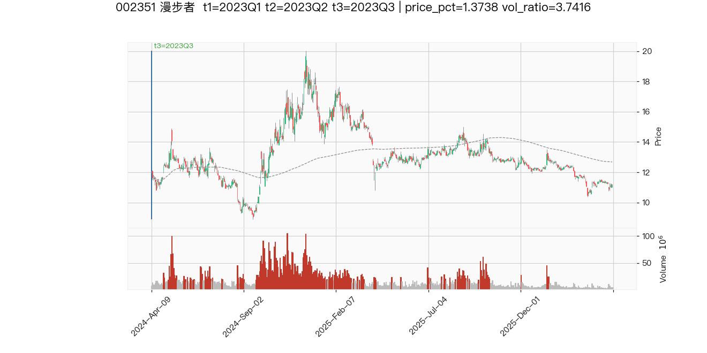

#### 🔍 检测依据 — 002351 漫步者
> 最佳 triple: **2023Q1 → 2023Q2 → 2023Q3** ｜ B 触发: price_pct=1.37 vol_ratio=3.74 ｜ 评分分解: price=24.2 + vol=10.9 + c=10.0 + bonus=20 = **65.1** ｜ 候选 triple 数: 3

#### 📊 港中结持仓节奏 — 002351 漫步者

| 季度     |   持股市值(亿) | 环比   | 信号       |
|:-------|----------:|:-----|:---------|
| 2022Q1 |      0.44 |      |          |
| 2022Q2 |      0.52 | ↑    |          |
| 2022Q3 |      0.64 | ↑    |          |
| 2022Q4 |      0.52 | ↓    |          |
| 2023Q1 |      1.98 | ↑    | ▲ t1 加仓  |
| 2023Q2 |      2.08 | ↑    | ▼ t2 减仓  |
| 2023Q3 |      2.13 |      | ▲ t3 再加仓 |
| 2023Q4 |      2.13 |      |          |
| 2024Q1 |      2.52 | ↑    |          |
| 2024Q2 |      1.18 | ↓    |          |
| 2024Q3 |      0.74 | ↓    |          |

#### ✍️ 人工复盘 — 002351 漫步者

| 检查项 | 结果 |
|--------|------|
| t2 季度价格在近 250 日高位区间（视觉） | ⬜ |
| t2 季度出现明显放量 bar（红色高量） | ⬜ |
| t3 季度买回后股价未大幅上涨（非卖飞） | ⬜ |
| t1→t2→t3 三段节奏符合「建仓→出货→再建仓」 | ⬜ |

**决策**: ⬜ PASS（纳入关注名单）　⬜ REJECT（假信号）

**备注**: _（人工填写）_

### 002239 奥特佳 K 线 + 成交量
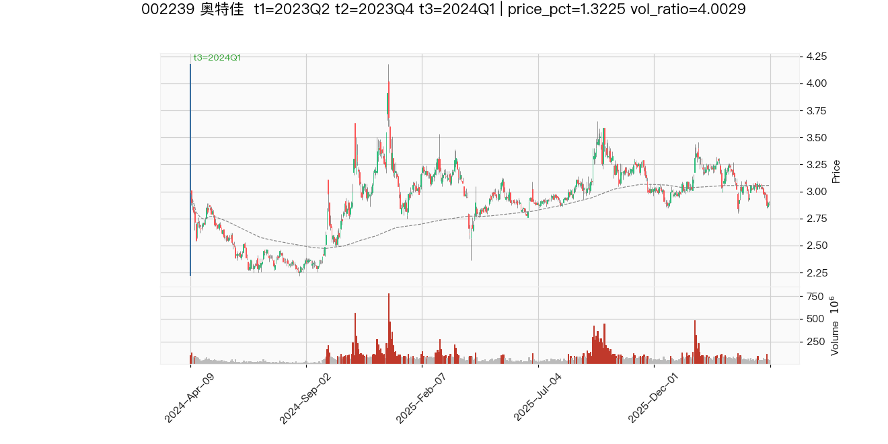

#### 🔍 检测依据 — 002239 奥特佳
> 最佳 triple: **2023Q2 → 2023Q4 → 2024Q1** ｜ B 触发: price_pct=1.32 vol_ratio=4.00 ｜ 评分分解: price=21.8 + vol=12.1 + c=10.0 + bonus=20 = **63.9** ｜ 候选 triple 数: 1

#### 📊 港中结持仓节奏 — 002239 奥特佳

| 季度     |   持股市值(亿) | 环比   | 信号       |
|:-------|----------:|:-----|:---------|
| 2022Q1 |      0.78 |      |          |
| 2022Q2 |      0.57 | ↓    |          |
| 2022Q3 |      0.58 |      |          |
| 2022Q4 |      0.62 | ↑    |          |
| 2023Q1 |      0.96 | ↑    |          |
| 2023Q2 |      1.27 | ↑    | ▲ t1 加仓  |
| 2023Q3 |      0.88 | ↓    |          |
| 2023Q4 |      0.7  | ↓    | ▼ t2 减仓  |
| 2024Q1 |      0.7  |      | ▲ t3 再加仓 |
| 2024Q2 |      0.53 | ↓    |          |
| 2024Q3 |      0.57 | ↑    |          |

#### ✍️ 人工复盘 — 002239 奥特佳

| 检查项 | 结果 |
|--------|------|
| t2 季度价格在近 250 日高位区间（视觉） | ⬜ |
| t2 季度出现明显放量 bar（红色高量） | ⬜ |
| t3 季度买回后股价未大幅上涨（非卖飞） | ⬜ |
| t1→t2→t3 三段节奏符合「建仓→出货→再建仓」 | ⬜ |

**决策**: ⬜ PASS（纳入关注名单）　⬜ REJECT（假信号）

**备注**: _（人工填写）_

### 605555 德昌股份 K 线 + 成交量
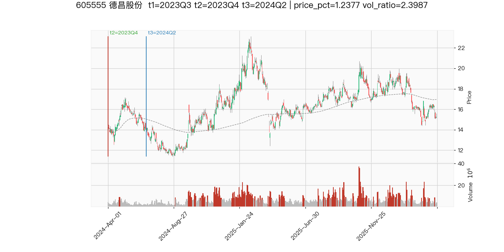

#### 🔍 检测依据 — 605555 德昌股份
> 最佳 triple: **2023Q3 → 2023Q4 → 2024Q2** ｜ B 触发: price_pct=1.24 vol_ratio=2.40 ｜ t2 后 60 日收益: -3.8% ｜ 评分分解: price=17.9 + vol=4.9 + c=20.0 + bonus=20 = **62.8** ｜ 候选 triple 数: 2

#### 📊 港中结持仓节奏 — 605555 德昌股份

| 季度     |   持股市值(亿) | 环比   | 信号       |
|:-------|----------:|:-----|:---------|
| 2023Q1 |      0.05 |      |          |
| 2023Q2 |      0.14 | ↑    |          |
| 2023Q3 |      1.52 | ↑    | ▲ t1 加仓  |
| 2023Q4 |      1.77 | ↑    | ▼ t2 减仓  |
| 2024Q1 |      1.23 | ↓    |          |
| 2024Q2 |      2.21 | ↑    | ▲ t3 再加仓 |
| 2024Q3 |      1.35 | ↓    |          |

#### ✍️ 人工复盘 — 605555 德昌股份

| 检查项 | 结果 |
|--------|------|
| t2 季度价格在近 250 日高位区间（视觉） | ⬜ |
| t2 季度出现明显放量 bar（红色高量） | ⬜ |
| t3 季度买回后股价未大幅上涨（非卖飞） | ⬜ |
| t1→t2→t3 三段节奏符合「建仓→出货→再建仓」 | ⬜ |

**决策**: ⬜ PASS（纳入关注名单）　⬜ REJECT（假信号）

**备注**: _（人工填写）_

### 002947 恒铭达 K 线 + 成交量
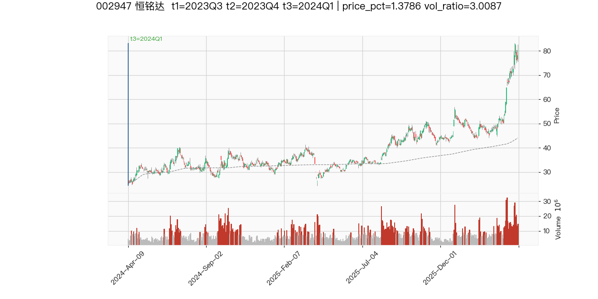

#### 🔍 检测依据 — 002947 恒铭达
> 最佳 triple: **2023Q3 → 2023Q4 → 2024Q1** ｜ B 触发: price_pct=1.38 vol_ratio=3.01 ｜ 评分分解: price=24.4 + vol=7.7 + c=10.0 + bonus=20 = **62.0** ｜ 候选 triple 数: 2

#### 📊 港中结持仓节奏 — 002947 恒铭达

| 季度     |   持股市值(亿) | 环比   | 信号       |
|:-------|----------:|:-----|:---------|
| 2022Q1 |      0.02 |      |          |
| 2022Q2 |      0.02 | ↓    |          |
| 2022Q3 |      0.01 | ↓    |          |
| 2022Q4 |      0.01 |      |          |
| 2023Q1 |      0.02 | ↑    |          |
| 2023Q2 |      0.24 | ↑    |          |
| 2023Q3 |      0.44 | ↑    | ▲ t1 加仓  |
| 2023Q4 |      0.65 | ↑    | ▼ t2 减仓  |
| 2024Q1 |      0.93 | ↑    | ▲ t3 再加仓 |
| 2024Q2 |      0.76 | ↓    |          |
| 2024Q3 |      0.85 | ↑    |          |

#### ✍️ 人工复盘 — 002947 恒铭达

| 检查项 | 结果 |
|--------|------|
| t2 季度价格在近 250 日高位区间（视觉） | ⬜ |
| t2 季度出现明显放量 bar（红色高量） | ⬜ |
| t3 季度买回后股价未大幅上涨（非卖飞） | ⬜ |
| t1→t2→t3 三段节奏符合「建仓→出货→再建仓」 | ⬜ |

**决策**: ⬜ PASS（纳入关注名单）　⬜ REJECT（假信号）

**备注**: _（人工填写）_

### 002641 公元股份 K 线 + 成交量
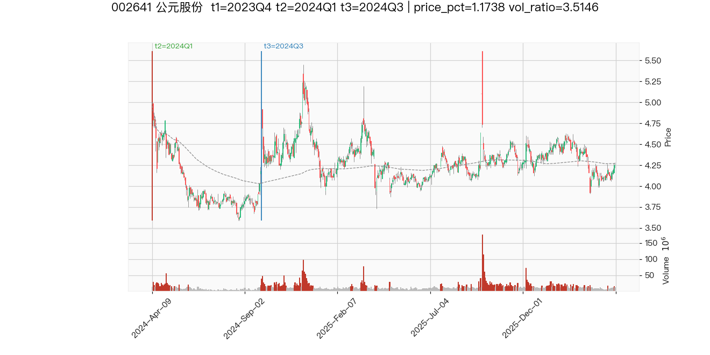

#### 🔍 检测依据 — 002641 公元股份
> 最佳 triple: **2023Q4 → 2024Q1 → 2024Q3** ｜ B 触发: price_pct=1.17 vol_ratio=3.51 ｜ t2 后 60 日收益: 2.2% ｜ 评分分解: price=14.9 + vol=9.9 + c=17.1 + bonus=20 = **62.0** ｜ 候选 triple 数: 2

#### 📊 港中结持仓节奏 — 002641 公元股份

| 季度     |   持股市值(亿) | 环比   | 信号       |
|:-------|----------:|:-----|:---------|
| 2022Q1 |      1.92 |      |          |
| 2022Q2 |      1.82 | ↓    |          |
| 2022Q3 |      2.42 | ↑    |          |
| 2022Q4 |      1.31 | ↓    |          |
| 2023Q1 |      1.55 | ↑    |          |
| 2023Q2 |      2.84 | ↑    |          |
| 2023Q3 |      3.38 | ↑    |          |
| 2023Q4 |      3.34 |      | ▲ t1 加仓  |
| 2024Q1 |      1.2  | ↓    | ▼ t2 减仓  |
| 2024Q2 |      0.85 | ↓    |          |
| 2024Q3 |      0.89 |      | ▲ t3 再加仓 |

#### ✍️ 人工复盘 — 002641 公元股份

| 检查项 | 结果 |
|--------|------|
| t2 季度价格在近 250 日高位区间（视觉） | ⬜ |
| t2 季度出现明显放量 bar（红色高量） | ⬜ |
| t3 季度买回后股价未大幅上涨（非卖飞） | ⬜ |
| t1→t2→t3 三段节奏符合「建仓→出货→再建仓」 | ⬜ |

**决策**: ⬜ PASS（纳入关注名单）　⬜ REJECT（假信号）

**备注**: _（人工填写）_

### 300098 高新兴 K 线 + 成交量
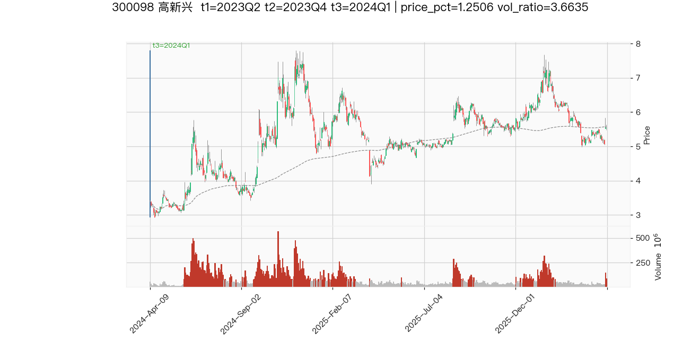

#### 🔍 检测依据 — 300098 高新兴
> 最佳 triple: **2023Q2 → 2023Q4 → 2024Q1** ｜ B 触发: price_pct=1.25 vol_ratio=3.66 ｜ 评分分解: price=18.5 + vol=10.6 + c=10.0 + bonus=20 = **59.1** ｜ 候选 triple 数: 2

#### 📊 港中结持仓节奏 — 300098 高新兴

| 季度     |   持股市值(亿) | 环比   | 信号       |
|:-------|----------:|:-----|:---------|
| 2023Q1 |      0.56 |      |          |
| 2023Q2 |      0.89 | ↑    | ▲ t1 加仓  |
| 2023Q3 |      0.41 | ↓    |          |
| 2023Q4 |      0.32 | ↓    | ▼ t2 减仓  |
| 2024Q1 |      0.53 | ↑    | ▲ t3 再加仓 |
| 2024Q2 |      0.76 | ↑    |          |
| 2024Q3 |      0.36 | ↓    |          |

#### ✍️ 人工复盘 — 300098 高新兴

| 检查项 | 结果 |
|--------|------|
| t2 季度价格在近 250 日高位区间（视觉） | ⬜ |
| t2 季度出现明显放量 bar（红色高量） | ⬜ |
| t3 季度买回后股价未大幅上涨（非卖飞） | ⬜ |
| t1→t2→t3 三段节奏符合「建仓→出货→再建仓」 | ⬜ |

**决策**: ⬜ PASS（纳入关注名单）　⬜ REJECT（假信号）

**备注**: _（人工填写）_

### 600864 哈投股份 K 线 + 成交量
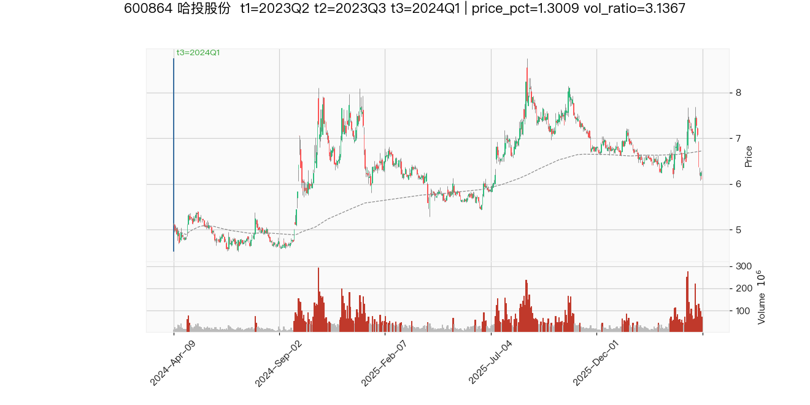

#### 🔍 检测依据 — 600864 哈投股份
> 最佳 triple: **2023Q2 → 2023Q3 → 2024Q1** ｜ B 触发: price_pct=1.30 vol_ratio=3.14 ｜ t2 后 60 日收益: 8.4% ｜ 评分分解: price=20.8 + vol=8.2 + c=8.8 + bonus=20 = **57.8** ｜ 候选 triple 数: 3

#### 📊 港中结持仓节奏 — 600864 哈投股份

| 季度     |   持股市值(亿) | 环比   | 信号       |
|:-------|----------:|:-----|:---------|
| 2023Q1 |      0.05 |      |          |
| 2023Q2 |      0.47 | ↑    | ▲ t1 加仓  |
| 2023Q3 |      0.27 | ↓    | ▼ t2 减仓  |
| 2023Q4 |      0.15 | ↓    |          |
| 2024Q1 |      0.38 | ↑    | ▲ t3 再加仓 |
| 2024Q2 |      0.27 | ↓    |          |
| 2024Q3 |      0.41 | ↑    |          |

#### ✍️ 人工复盘 — 600864 哈投股份

| 检查项 | 结果 |
|--------|------|
| t2 季度价格在近 250 日高位区间（视觉） | ⬜ |
| t2 季度出现明显放量 bar（红色高量） | ⬜ |
| t3 季度买回后股价未大幅上涨（非卖飞） | ⬜ |
| t1→t2→t3 三段节奏符合「建仓→出货→再建仓」 | ⬜ |

**决策**: ⬜ PASS（纳入关注名单）　⬜ REJECT（假信号）

**备注**: _（人工填写）_

### 600621 华鑫股份 K 线 + 成交量
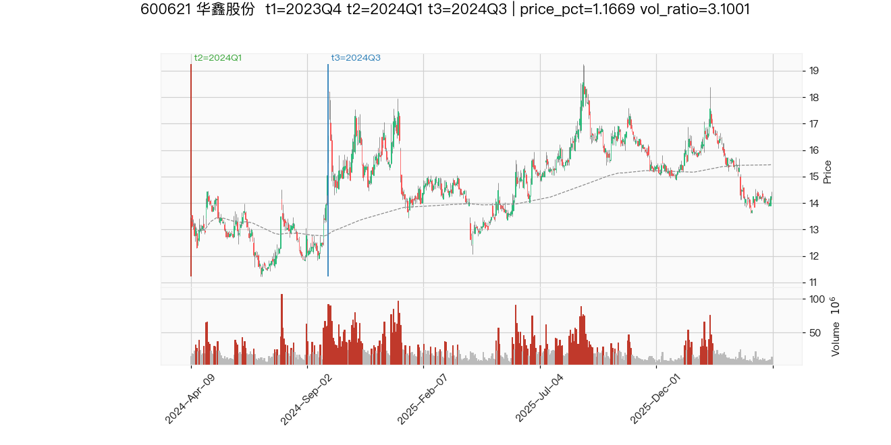

#### 🔍 检测依据 — 600621 华鑫股份
> 最佳 triple: **2023Q4 → 2024Q1 → 2024Q3** ｜ B 触发: price_pct=1.17 vol_ratio=3.10 ｜ t2 后 60 日收益: 3.8% ｜ 评分分解: price=14.6 + vol=8.1 + c=14.9 + bonus=20 = **57.6** ｜ 候选 triple 数: 2

#### 📊 港中结持仓节奏 — 600621 华鑫股份

| 季度     |   持股市值(亿) | 环比   | 信号       |
|:-------|----------:|:-----|:---------|
| 2022Q1 |      0.55 |      |          |
| 2022Q2 |      0.46 | ↓    |          |
| 2022Q3 |      0.19 | ↓    |          |
| 2022Q4 |      0.15 | ↓    |          |
| 2023Q1 |      0.49 | ↑    |          |
| 2023Q2 |      0.3  | ↓    |          |
| 2023Q3 |      0.74 | ↑    |          |
| 2023Q4 |      1.63 | ↑    | ▲ t1 加仓  |
| 2024Q1 |      0.74 | ↓    | ▼ t2 减仓  |
| 2024Q2 |      0.65 | ↓    |          |
| 2024Q3 |      1.18 | ↑    | ▲ t3 再加仓 |

#### ✍️ 人工复盘 — 600621 华鑫股份

| 检查项 | 结果 |
|--------|------|
| t2 季度价格在近 250 日高位区间（视觉） | ⬜ |
| t2 季度出现明显放量 bar（红色高量） | ⬜ |
| t3 季度买回后股价未大幅上涨（非卖飞） | ⬜ |
| t1→t2→t3 三段节奏符合「建仓→出货→再建仓」 | ⬜ |

**决策**: ⬜ PASS（纳入关注名单）　⬜ REJECT（假信号）

**备注**: _（人工填写）_

### 688177 百奥泰 K 线 + 成交量
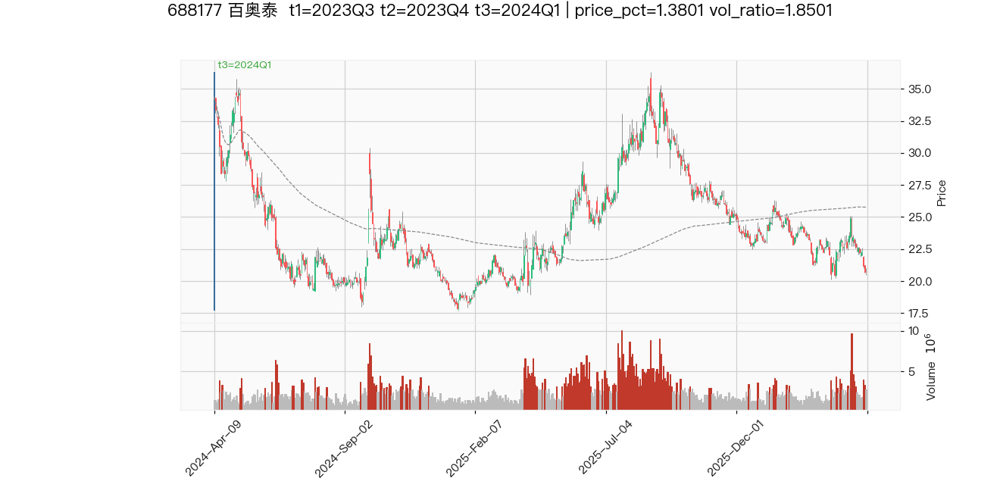

#### 🔍 检测依据 — 688177 百奥泰
> 最佳 triple: **2023Q3 → 2023Q4 → 2024Q1** ｜ B 触发: price_pct=1.38 vol_ratio=1.85 ｜ 评分分解: price=24.5 + vol=2.5 + c=10.0 + bonus=20 = **56.9** ｜ 候选 triple 数: 1

#### 📊 港中结持仓节奏 — 688177 百奥泰

| 季度     |   持股市值(亿) | 环比   | 信号       |
|:-------|----------:|:-----|:---------|
| 2023Q2 |      0.02 |      |          |
| 2023Q3 |      0.61 | ↑    | ▲ t1 加仓  |
| 2023Q4 |      0.49 | ↓    | ▼ t2 减仓  |
| 2024Q1 |      0.6  | ↑    | ▲ t3 再加仓 |
| 2024Q2 |      0.58 |      |          |
| 2024Q3 |      0.75 | ↑    |          |

#### ✍️ 人工复盘 — 688177 百奥泰

| 检查项 | 结果 |
|--------|------|
| t2 季度价格在近 250 日高位区间（视觉） | ⬜ |
| t2 季度出现明显放量 bar（红色高量） | ⬜ |
| t3 季度买回后股价未大幅上涨（非卖飞） | ⬜ |
| t1→t2→t3 三段节奏符合「建仓→出货→再建仓」 | ⬜ |

**决策**: ⬜ PASS（纳入关注名单）　⬜ REJECT（假信号）

**备注**: _（人工填写）_

### 300457 赢合科技 K 线 + 成交量
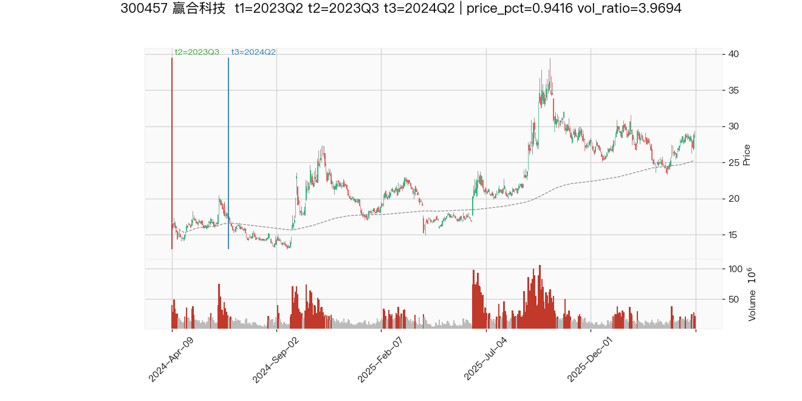

#### 🔍 检测依据 — 300457 赢合科技
> 最佳 triple: **2023Q2 → 2023Q3 → 2024Q2** ｜ B 触发: price_pct=0.94 vol_ratio=3.97 ｜ t2 后 60 日收益: -2.6% ｜ 评分分解: price=4.2 + vol=12.0 + c=20.0 + bonus=20 = **56.2** ｜ 候选 triple 数: 4

#### 📊 港中结持仓节奏 — 300457 赢合科技

| 季度     |   持股市值(亿) | 环比   | 信号       |
|:-------|----------:|:-----|:---------|
| 2022Q1 |      7.58 |      |          |
| 2022Q2 |      9.8  | ↑    |          |
| 2022Q3 |      6.67 | ↓    |          |
| 2022Q4 |      2.46 | ↓    |          |
| 2023Q1 |      1.07 | ↓    |          |
| 2023Q2 |      1.63 | ↑    | ▲ t1 加仓  |
| 2023Q3 |      1.9  | ↑    | ▼ t2 减仓  |
| 2023Q4 |      1.33 | ↓    |          |
| 2024Q1 |      0.98 | ↓    |          |
| 2024Q2 |      2.23 | ↑    | ▲ t3 再加仓 |
| 2024Q3 |      0.98 | ↓    |          |

#### ✍️ 人工复盘 — 300457 赢合科技

| 检查项 | 结果 |
|--------|------|
| t2 季度价格在近 250 日高位区间（视觉） | ⬜ |
| t2 季度出现明显放量 bar（红色高量） | ⬜ |
| t3 季度买回后股价未大幅上涨（非卖飞） | ⬜ |
| t1→t2→t3 三段节奏符合「建仓→出货→再建仓」 | ⬜ |

**决策**: ⬜ PASS（纳入关注名单）　⬜ REJECT（假信号）

**备注**: _（人工填写）_

### 301015 百洋医药 K 线 + 成交量
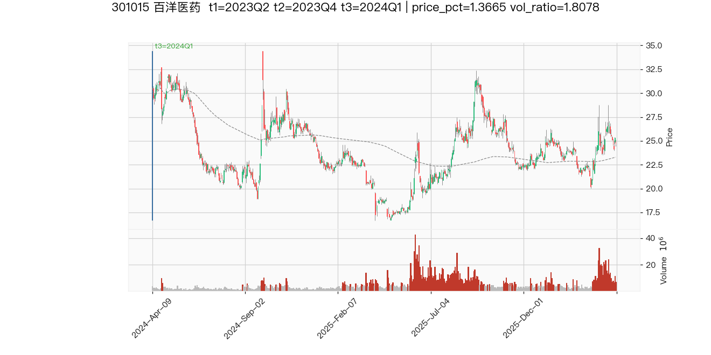

#### 🔍 检测依据 — 301015 百洋医药
> 最佳 triple: **2023Q2 → 2023Q4 → 2024Q1** ｜ B 触发: price_pct=1.37 vol_ratio=1.81 ｜ 评分分解: price=23.8 + vol=2.3 + c=10.0 + bonus=20 = **56.1** ｜ 候选 triple 数: 2

#### 📊 港中结持仓节奏 — 301015 百洋医药

| 季度     |   持股市值(亿) | 环比   | 信号       |
|:-------|----------:|:-----|:---------|
| 2022Q2 |      0.02 |      |          |
| 2022Q3 |      0.03 | ↑    |          |
| 2022Q4 |      0.17 | ↑    |          |
| 2023Q1 |      0.26 | ↑    |          |
| 2023Q2 |      1.8  | ↑    | ▲ t1 加仓  |
| 2023Q3 |      0.96 | ↓    |          |
| 2023Q4 |      1.02 | ↑    | ▼ t2 减仓  |
| 2024Q1 |      1.2  | ↑    | ▲ t3 再加仓 |
| 2024Q2 |      1    | ↓    |          |
| 2024Q3 |      0.81 | ↓    |          |

#### ✍️ 人工复盘 — 301015 百洋医药

| 检查项 | 结果 |
|--------|------|
| t2 季度价格在近 250 日高位区间（视觉） | ⬜ |
| t2 季度出现明显放量 bar（红色高量） | ⬜ |
| t3 季度买回后股价未大幅上涨（非卖飞） | ⬜ |
| t1→t2→t3 三段节奏符合「建仓→出货→再建仓」 | ⬜ |

**决策**: ⬜ PASS（纳入关注名单）　⬜ REJECT（假信号）

**备注**: _（人工填写）_

### 300401 花园生物 K 线 + 成交量

#### 🔍 检测依据 — 300401 花园生物
> 最佳 triple: **2023Q3 → 2024Q2 → 2024Q3** ｜ B 触发: price_pct=1.04 vol_ratio=5.08 ｜ 评分分解: price=8.7 + vol=16.9 + c=10.0 + bonus=20 = **55.7** ｜ 候选 triple 数: 5

#### 📊 港中结持仓节奏 — 300401 花园生物

| 季度     |   持股市值(亿) | 环比   | 信号       |
|:-------|----------:|:-----|:---------|
| 2022Q1 |      1.14 |      |          |
| 2022Q2 |      2.32 | ↑    |          |
| 2022Q3 |      3.36 | ↑    |          |
| 2022Q4 |      2.48 | ↓    |          |
| 2023Q1 |      0.87 | ↓    |          |
| 2023Q2 |      0.42 | ↓    |          |
| 2023Q3 |      0.86 | ↑    | ▲ t1 加仓  |
| 2023Q4 |      0.49 | ↓    |          |
| 2024Q1 |      0.33 | ↓    |          |
| 2024Q2 |      0.35 | ↑    | ▼ t2 减仓  |
| 2024Q3 |      0.66 | ↑    | ▲ t3 再加仓 |

#### ✍️ 人工复盘 — 300401 花园生物

| 检查项 | 结果 |
|--------|------|
| t2 季度价格在近 250 日高位区间（视觉） | ⬜ |
| t2 季度出现明显放量 bar（红色高量） | ⬜ |
| t3 季度买回后股价未大幅上涨（非卖飞） | ⬜ |
| t1→t2→t3 三段节奏符合「建仓→出货→再建仓」 | ⬜ |

**决策**: ⬜ PASS（纳入关注名单）　⬜ REJECT（假信号）

**备注**: _（人工填写）_

### 000030 富奥股份 K 线 + 成交量
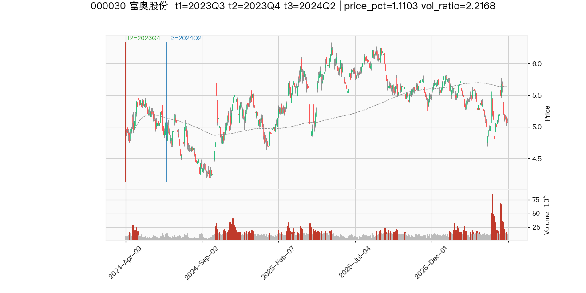

#### 🔍 检测依据 — 000030 富奥股份
> 最佳 triple: **2023Q3 → 2023Q4 → 2024Q2** ｜ B 触发: price_pct=1.11 vol_ratio=2.22 ｜ t2 后 60 日收益: 0.6% ｜ 评分分解: price=12.0 + vol=4.1 + c=19.2 + bonus=20 = **55.3** ｜ 候选 triple 数: 2

#### 📊 港中结持仓节奏 — 000030 富奥股份

| 季度     |   持股市值(亿) | 环比   | 信号       |
|:-------|----------:|:-----|:---------|
| 2022Q1 |      0.35 |      |          |
| 2022Q2 |      0.4  | ↑    |          |
| 2022Q3 |      0.45 | ↑    |          |
| 2022Q4 |      0.49 | ↑    |          |
| 2023Q1 |      0.91 | ↑    |          |
| 2023Q2 |      1.15 | ↑    |          |
| 2023Q3 |      1.54 | ↑    | ▲ t1 加仓  |
| 2023Q4 |      1.32 | ↓    | ▼ t2 减仓  |
| 2024Q1 |      0.98 | ↓    |          |
| 2024Q2 |      1.24 | ↑    | ▲ t3 再加仓 |
| 2024Q3 |      0.54 | ↓    |          |

#### ✍️ 人工复盘 — 000030 富奥股份

| 检查项 | 结果 |
|--------|------|
| t2 季度价格在近 250 日高位区间（视觉） | ⬜ |
| t2 季度出现明显放量 bar（红色高量） | ⬜ |
| t3 季度买回后股价未大幅上涨（非卖飞） | ⬜ |
| t1→t2→t3 三段节奏符合「建仓→出货→再建仓」 | ⬜ |

**决策**: ⬜ PASS（纳入关注名单）　⬜ REJECT（假信号）

**备注**: _（人工填写）_

### 000712 锦龙股份 K 线 + 成交量
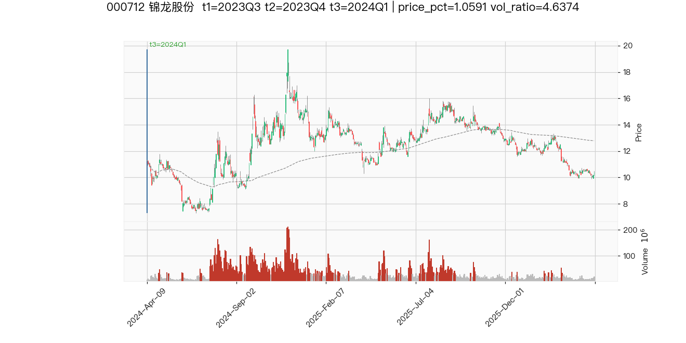

#### 🔍 检测依据 — 000712 锦龙股份
> 最佳 triple: **2023Q3 → 2023Q4 → 2024Q1** ｜ B 触发: price_pct=1.06 vol_ratio=4.64 ｜ 评分分解: price=9.7 + vol=14.9 + c=10.0 + bonus=20 = **54.6** ｜ 候选 triple 数: 1

#### 📊 港中结持仓节奏 — 000712 锦龙股份

| 季度     |   持股市值(亿) | 环比   | 信号       |
|:-------|----------:|:-----|:---------|
| 2023Q1 |      0.75 |      |          |
| 2023Q2 |      0.62 | ↓    |          |
| 2023Q3 |      1.07 | ↑    | ▲ t1 加仓  |
| 2023Q4 |      0.66 | ↓    | ▼ t2 减仓  |
| 2024Q1 |      0.57 | ↓    | ▲ t3 再加仓 |
| 2024Q2 |      0.83 | ↑    |          |
| 2024Q3 |      0.89 | ↑    |          |

#### ✍️ 人工复盘 — 000712 锦龙股份

| 检查项 | 结果 |
|--------|------|
| t2 季度价格在近 250 日高位区间（视觉） | ⬜ |
| t2 季度出现明显放量 bar（红色高量） | ⬜ |
| t3 季度买回后股价未大幅上涨（非卖飞） | ⬜ |
| t1→t2→t3 三段节奏符合「建仓→出货→再建仓」 | ⬜ |

**决策**: ⬜ PASS（纳入关注名单）　⬜ REJECT（假信号）

**备注**: _（人工填写）_

### 300075 数字政通 K 线 + 成交量
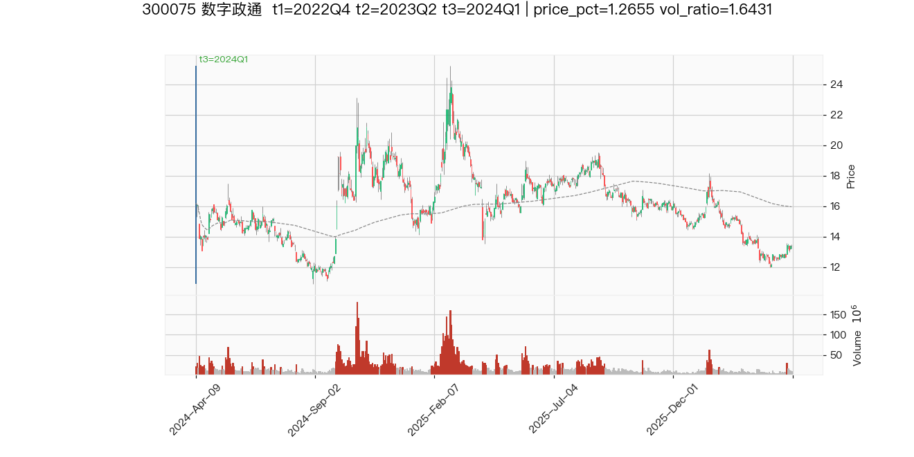

#### 🔍 检测依据 — 300075 数字政通
> 最佳 triple: **2022Q4 → 2023Q2 → 2024Q1** ｜ B 触发: price_pct=1.27 vol_ratio=1.64 ｜ t2 后 60 日收益: 4.7% ｜ 评分分解: price=19.2 + vol=1.5 + c=13.8 + bonus=20 = **54.5** ｜ 候选 triple 数: 5

#### 📊 港中结持仓节奏 — 300075 数字政通

| 季度     |   持股市值(亿) | 环比   | 信号       |
|:-------|----------:|:-----|:---------|
| 2022Q1 |      0.08 |      |          |
| 2022Q2 |      0.27 | ↑    |          |
| 2022Q3 |      0.25 | ↓    |          |
| 2022Q4 |      1.28 | ↑    | ▲ t1 加仓  |
| 2023Q1 |      0.87 | ↓    |          |
| 2023Q2 |      0.74 | ↓    | ▼ t2 减仓  |
| 2023Q3 |      0.52 | ↓    |          |
| 2023Q4 |      0.36 | ↓    |          |
| 2024Q1 |      0.57 | ↑    | ▲ t3 再加仓 |
| 2024Q2 |      0.39 | ↓    |          |
| 2024Q3 |      0.5  | ↑    |          |

#### ✍️ 人工复盘 — 300075 数字政通

| 检查项 | 结果 |
|--------|------|
| t2 季度价格在近 250 日高位区间（视觉） | ⬜ |
| t2 季度出现明显放量 bar（红色高量） | ⬜ |
| t3 季度买回后股价未大幅上涨（非卖飞） | ⬜ |
| t1→t2→t3 三段节奏符合「建仓→出货→再建仓」 | ⬜ |

**决策**: ⬜ PASS（纳入关注名单）　⬜ REJECT（假信号）

**备注**: _（人工填写）_

### 000099 中信海直 K 线 + 成交量
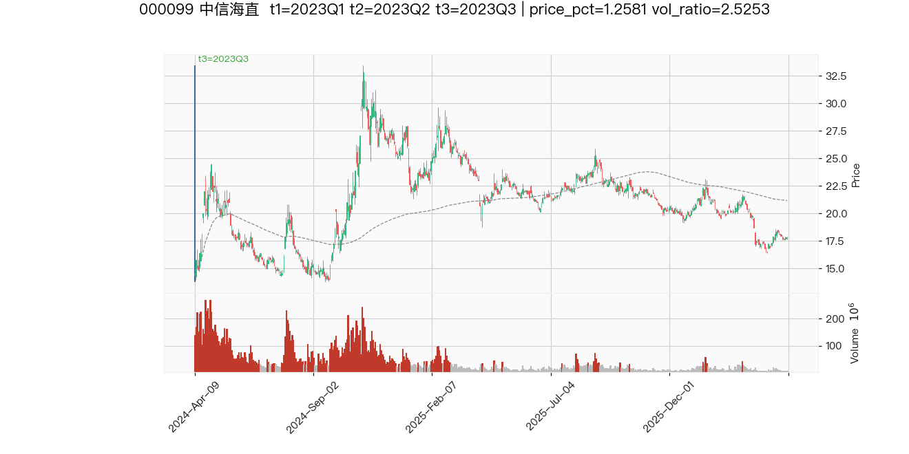

#### 🔍 检测依据 — 000099 中信海直
> 最佳 triple: **2023Q1 → 2023Q2 → 2023Q3** ｜ B 触发: price_pct=1.26 vol_ratio=2.53 ｜ 评分分解: price=18.8 + vol=5.5 + c=10.0 + bonus=20 = **54.3** ｜ 候选 triple 数: 2

#### 📊 港中结持仓节奏 — 000099 中信海直

| 季度     |   持股市值(亿) | 环比   | 信号       |
|:-------|----------:|:-----|:---------|
| 2022Q1 |      0.3  |      |          |
| 2022Q2 |      0.34 | ↑    |          |
| 2022Q3 |      0.3  | ↓    |          |
| 2022Q4 |      0.32 | ↑    |          |
| 2023Q1 |      0.5  | ↑    | ▲ t1 加仓  |
| 2023Q2 |      0.48 |      | ▼ t2 减仓  |
| 2023Q3 |      0.87 | ↑    | ▲ t3 再加仓 |
| 2023Q4 |      0.52 | ↓    |          |
| 2024Q1 |      1.12 | ↑    |          |
| 2024Q2 |      2.08 | ↑    |          |
| 2024Q3 |      1.65 | ↓    |          |

#### ✍️ 人工复盘 — 000099 中信海直

| 检查项 | 结果 |
|--------|------|
| t2 季度价格在近 250 日高位区间（视觉） | ⬜ |
| t2 季度出现明显放量 bar（红色高量） | ⬜ |
| t3 季度买回后股价未大幅上涨（非卖飞） | ⬜ |
| t1→t2→t3 三段节奏符合「建仓→出货→再建仓」 | ⬜ |

**决策**: ⬜ PASS（纳入关注名单）　⬜ REJECT（假信号）

**备注**: _（人工填写）_

### 603013 亚普股份 K 线 + 成交量
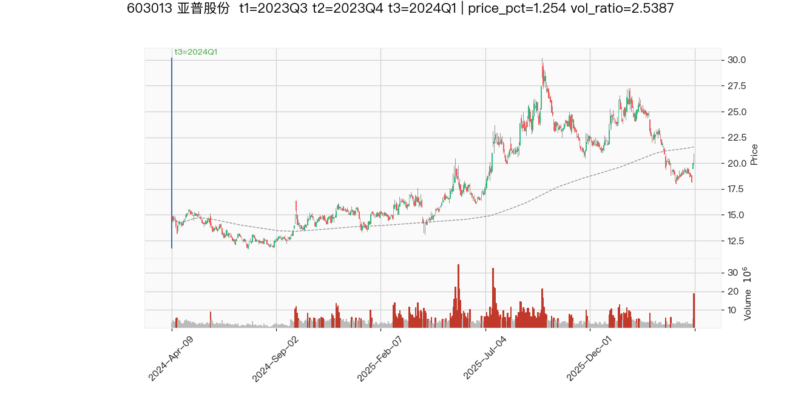

#### 🔍 检测依据 — 603013 亚普股份
> 最佳 triple: **2023Q3 → 2023Q4 → 2024Q1** ｜ B 触发: price_pct=1.25 vol_ratio=2.54 ｜ 评分分解: price=18.6 + vol=5.5 + c=10.0 + bonus=20 = **54.2** ｜ 候选 triple 数: 1

#### 📊 港中结持仓节奏 — 603013 亚普股份

| 季度     |   持股市值(亿) | 环比   | 信号       |
|:-------|----------:|:-----|:---------|
| 2022Q1 |      0    |      |          |
| 2022Q2 |      0    | ↓    |          |
| 2022Q3 |      0    | ↓    |          |
| 2022Q4 |      0    | ↑    |          |
| 2023Q1 |      0    | ↑    |          |
| 2023Q2 |      0.33 | ↑    |          |
| 2023Q3 |      0.61 | ↑    | ▲ t1 加仓  |
| 2023Q4 |      0.53 | ↓    | ▼ t2 减仓  |
| 2024Q1 |      0.67 | ↑    | ▲ t3 再加仓 |
| 2024Q2 |      0.43 | ↓    |          |
| 2024Q3 |      0.42 |      |          |

#### ✍️ 人工复盘 — 603013 亚普股份

| 检查项 | 结果 |
|--------|------|
| t2 季度价格在近 250 日高位区间（视觉） | ⬜ |
| t2 季度出现明显放量 bar（红色高量） | ⬜ |
| t3 季度买回后股价未大幅上涨（非卖飞） | ⬜ |
| t1→t2→t3 三段节奏符合「建仓→出货→再建仓」 | ⬜ |

**决策**: ⬜ PASS（纳入关注名单）　⬜ REJECT（假信号）

**备注**: _（人工填写）_

### 000681 视觉中国 K 线 + 成交量
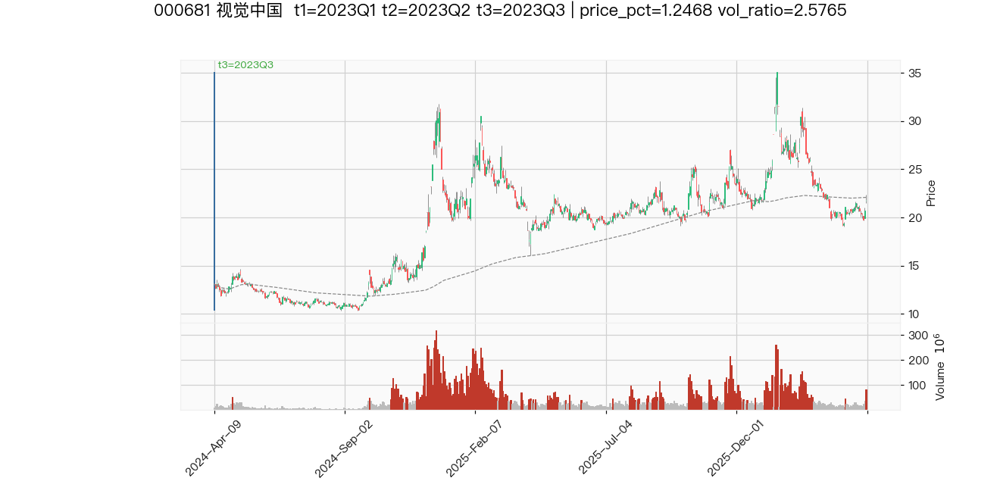

#### 🔍 检测依据 — 000681 视觉中国
> 最佳 triple: **2023Q1 → 2023Q2 → 2023Q3** ｜ B 触发: price_pct=1.25 vol_ratio=2.58 ｜ 评分分解: price=18.3 + vol=5.7 + c=10.0 + bonus=20 = **54.0** ｜ 候选 triple 数: 2

#### 📊 港中结持仓节奏 — 000681 视觉中国

| 季度     |   持股市值(亿) | 环比   | 信号       |
|:-------|----------:|:-----|:---------|
| 2022Q1 |      0.75 |      |          |
| 2022Q2 |      0.65 | ↓    |          |
| 2022Q3 |      0.5  | ↓    |          |
| 2022Q4 |      0.75 | ↑    |          |
| 2023Q1 |      3.31 | ↑    | ▲ t1 加仓  |
| 2023Q2 |      1.68 | ↓    | ▼ t2 减仓  |
| 2023Q3 |      1.45 | ↓    | ▲ t3 再加仓 |
| 2023Q4 |      2.08 | ↑    |          |
| 2024Q1 |      1.22 | ↓    |          |
| 2024Q2 |      0.97 | ↓    |          |
| 2024Q3 |      1.04 | ↑    |          |

#### ✍️ 人工复盘 — 000681 视觉中国

| 检查项 | 结果 |
|--------|------|
| t2 季度价格在近 250 日高位区间（视觉） | ⬜ |
| t2 季度出现明显放量 bar（红色高量） | ⬜ |
| t3 季度买回后股价未大幅上涨（非卖飞） | ⬜ |
| t1→t2→t3 三段节奏符合「建仓→出货→再建仓」 | ⬜ |

**决策**: ⬜ PASS（纳入关注名单）　⬜ REJECT（假信号）

**备注**: _（人工填写）_

### 688062 迈威生物 K 线 + 成交量
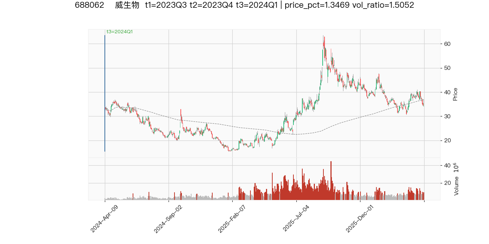

#### 🔍 检测依据 — 688062 迈威生物
> 最佳 triple: **2023Q3 → 2023Q4 → 2024Q1** ｜ B 触发: price_pct=1.35 vol_ratio=1.51 ｜ 评分分解: price=22.9 + vol=0.9 + c=10.0 + bonus=20 = **53.9** ｜ 候选 triple 数: 1

#### 📊 港中结持仓节奏 — 688062 迈威生物

| 季度     |   持股市值(亿) | 环比   | 信号       |
|:-------|----------:|:-----|:---------|
| 2023Q1 |      0.07 |      |          |
| 2023Q2 |      0.16 | ↑    |          |
| 2023Q3 |      0.92 | ↑    | ▲ t1 加仓  |
| 2023Q4 |      0.37 | ↓    | ▼ t2 减仓  |
| 2024Q1 |      1.09 | ↑    | ▲ t3 再加仓 |
| 2024Q2 |      1.27 | ↑    |          |
| 2024Q3 |      2.12 | ↑    |          |

#### ✍️ 人工复盘 — 688062 迈威生物

| 检查项 | 结果 |
|--------|------|
| t2 季度价格在近 250 日高位区间（视觉） | ⬜ |
| t2 季度出现明显放量 bar（红色高量） | ⬜ |
| t3 季度买回后股价未大幅上涨（非卖飞） | ⬜ |
| t1→t2→t3 三段节奏符合「建仓→出货→再建仓」 | ⬜ |

**决策**: ⬜ PASS（纳入关注名单）　⬜ REJECT（假信号）

**备注**: _（人工填写）_

### 300045 华力创通 K 线 + 成交量
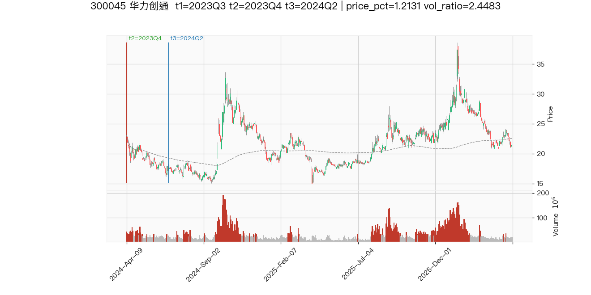

#### 🔍 检测依据 — 300045 华力创通
> 最佳 triple: **2023Q3 → 2023Q4 → 2024Q2** ｜ B 触发: price_pct=1.21 vol_ratio=2.45 ｜ t2 后 60 日收益: 6.9% ｜ 评分分解: price=16.8 + vol=5.1 + c=10.9 + bonus=20 = **52.8** ｜ 候选 triple 数: 2

#### 📊 港中结持仓节奏 — 300045 华力创通

| 季度     |   持股市值(亿) | 环比   | 信号       |
|:-------|----------:|:-----|:---------|
| 2023Q1 |      0    |      |          |
| 2023Q2 |      0.48 | ↑    |          |
| 2023Q3 |      1.51 | ↑    | ▲ t1 加仓  |
| 2023Q4 |      1.01 | ↓    | ▼ t2 减仓  |
| 2024Q1 |      0.84 | ↓    |          |
| 2024Q2 |      1.14 | ↑    | ▲ t3 再加仓 |
| 2024Q3 |      0.69 | ↓    |          |

#### ✍️ 人工复盘 — 300045 华力创通

| 检查项 | 结果 |
|--------|------|
| t2 季度价格在近 250 日高位区间（视觉） | ⬜ |
| t2 季度出现明显放量 bar（红色高量） | ⬜ |
| t3 季度买回后股价未大幅上涨（非卖飞） | ⬜ |
| t1→t2→t3 三段节奏符合「建仓→出货→再建仓」 | ⬜ |

**决策**: ⬜ PASS（纳入关注名单）　⬜ REJECT（假信号）

**备注**: _（人工填写）_

### 300492 华图山鼎 K 线 + 成交量
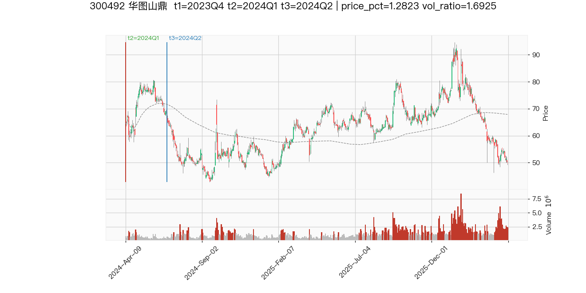

#### 🔍 检测依据 — 300492 华图山鼎
> 最佳 triple: **2023Q4 → 2024Q1 → 2024Q2** ｜ B 触发: price_pct=1.28 vol_ratio=1.69 ｜ 评分分解: price=20.0 + vol=1.8 + c=10.0 + bonus=20 = **51.7** ｜ 候选 triple 数: 1

#### 📊 港中结持仓节奏 — 300492 华图山鼎

| 季度     |   持股市值(亿) | 环比   | 信号       |
|:-------|----------:|:-----|:---------|
| 2023Q2 |      0.02 |      |          |
| 2023Q3 |      0.09 | ↑    |          |
| 2023Q4 |      0.3  | ↑    | ▲ t1 加仓  |
| 2024Q1 |      0.28 | ↓    | ▼ t2 减仓  |
| 2024Q2 |      1.02 | ↑    | ▲ t3 再加仓 |
| 2024Q3 |      0.39 | ↓    |          |

#### ✍️ 人工复盘 — 300492 华图山鼎

| 检查项 | 结果 |
|--------|------|
| t2 季度价格在近 250 日高位区间（视觉） | ⬜ |
| t2 季度出现明显放量 bar（红色高量） | ⬜ |
| t3 季度买回后股价未大幅上涨（非卖飞） | ⬜ |
| t1→t2→t3 三段节奏符合「建仓→出货→再建仓」 | ⬜ |

**决策**: ⬜ PASS（纳入关注名单）　⬜ REJECT（假信号）

**备注**: _（人工填写）_

### 688076 ST诺泰 K 线 + 成交量
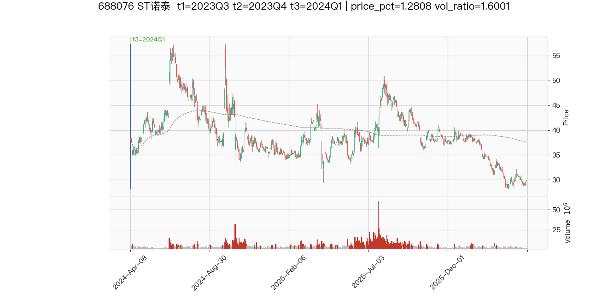

#### 🔍 检测依据 — 688076 ST诺泰
> 最佳 triple: **2023Q3 → 2023Q4 → 2024Q1** ｜ B 触发: price_pct=1.28 vol_ratio=1.60 ｜ 评分分解: price=19.9 + vol=1.3 + c=10.0 + bonus=20 = **51.2** ｜ 候选 triple 数: 1

#### 📊 港中结持仓节奏 — 688076 ST诺泰

| 季度     |   持股市值(亿) | 环比   | 信号       |
|:-------|----------:|:-----|:---------|
| 2023Q1 |      0.05 |      |          |
| 2023Q2 |      0.09 | ↑    |          |
| 2023Q3 |      1.43 | ↑    | ▲ t1 加仓  |
| 2023Q4 |      0.79 | ↓    | ▼ t2 减仓  |
| 2024Q1 |      1.77 | ↑    | ▲ t3 再加仓 |
| 2024Q2 |      3.05 | ↑    |          |
| 2024Q3 |      1.98 | ↓    |          |

#### ✍️ 人工复盘 — 688076 ST诺泰

| 检查项 | 结果 |
|--------|------|
| t2 季度价格在近 250 日高位区间（视觉） | ⬜ |
| t2 季度出现明显放量 bar（红色高量） | ⬜ |
| t3 季度买回后股价未大幅上涨（非卖飞） | ⬜ |
| t1→t2→t3 三段节奏符合「建仓→出货→再建仓」 | ⬜ |

**决策**: ⬜ PASS（纳入关注名单）　⬜ REJECT（假信号）

**备注**: _（人工填写）_

### 002003 伟星股份 K 线 + 成交量
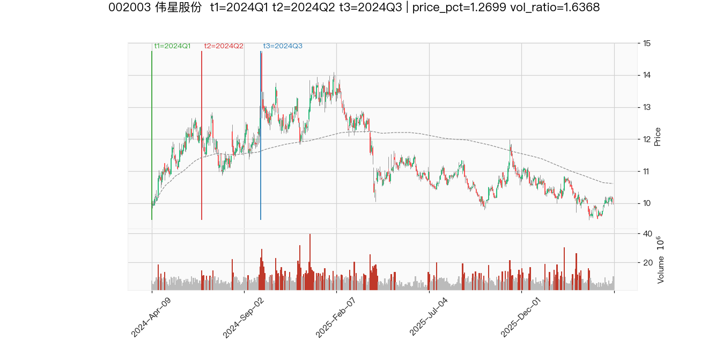

#### 🔍 检测依据 — 002003 伟星股份
> 最佳 triple: **2024Q1 → 2024Q2 → 2024Q3** ｜ B 触发: price_pct=1.27 vol_ratio=1.64 ｜ 评分分解: price=19.4 + vol=1.5 + c=10.0 + bonus=20 = **50.9** ｜ 候选 triple 数: 3

#### 📊 港中结持仓节奏 — 002003 伟星股份

| 季度     |   持股市值(亿) | 环比   | 信号       |
|:-------|----------:|:-----|:---------|
| 2022Q1 |      0    |      |          |
| 2022Q2 |      0.17 | ↑    |          |
| 2022Q3 |      1.55 | ↑    |          |
| 2022Q4 |      2.02 | ↑    |          |
| 2023Q1 |      1.69 | ↓    |          |
| 2023Q2 |      0.86 | ↓    |          |
| 2023Q3 |      1.35 | ↑    |          |
| 2023Q4 |      1.83 | ↑    |          |
| 2024Q1 |      1.81 |      | ▲ t1 加仓  |
| 2024Q2 |      1.67 | ↓    | ▼ t2 减仓  |
| 2024Q3 |      2.18 | ↑    | ▲ t3 再加仓 |

#### ✍️ 人工复盘 — 002003 伟星股份

| 检查项 | 结果 |
|--------|------|
| t2 季度价格在近 250 日高位区间（视觉） | ⬜ |
| t2 季度出现明显放量 bar（红色高量） | ⬜ |
| t3 季度买回后股价未大幅上涨（非卖飞） | ⬜ |
| t1→t2→t3 三段节奏符合「建仓→出货→再建仓」 | ⬜ |

**决策**: ⬜ PASS（纳入关注名单）　⬜ REJECT（假信号）

**备注**: _（人工填写）_

## 全部诊断（A 段命中股的 BCD 数值）

### 000008 
- A=False BCD=False triples=0 monotonic_up=False

### 000012 
- A=True BCD=True triples=2 monotonic_up=False

| t1     | t2     | t3     | B     | C    | D    |   price_pct |   vol_ratio | post_ret_60d   |
|:-------|:-------|:-------|:------|:-----|:-----|------------:|------------:|:---------------|
| 2023Q2 | 2023Q3 | 2023Q4 | False | True | True |      0.8227 |      0.321  |                |
| 2023Q4 | 2024Q2 | 2024Q3 | True  | True | True |      0.8665 |      1.1818 |                |

### 000016 
- A=True BCD=True triples=1 monotonic_up=False

| t1     | t2     | t3     | B    | C    | D    |   price_pct |   vol_ratio | post_ret_60d   |
|:-------|:-------|:-------|:-----|:-----|:-----|------------:|------------:|:---------------|
| 2023Q4 | 2024Q1 | 2024Q2 | True | True | True |      0.7523 |      2.3642 |                |

### 000030 
- A=True BCD=True triples=2 monotonic_up=False

| t1     | t2     | t3     | B    | C    | D    |   price_pct |   vol_ratio |   post_ret_60d |
|:-------|:-------|:-------|:-----|:-----|:-----|------------:|------------:|---------------:|
| 2023Q3 | 2023Q4 | 2024Q2 | True | True | True |      1.1103 |      2.2168 |          0.006 |
| 2023Q3 | 2024Q1 | 2024Q2 | True | True | True |      0.8711 |      1.2904 |        nan     |

### 000031 
- A=True BCD=False triples=1 monotonic_up=False

| t1     | t2     | t3     | B     | C    | D    |   price_pct |   vol_ratio |   post_ret_60d |
|:-------|:-------|:-------|:------|:-----|:-----|------------:|------------:|---------------:|
| 2023Q3 | 2023Q4 | 2024Q2 | False | True | True |      0.7714 |      0.7565 |         0.0337 |

### 000048 
- A=True BCD=True triples=3 monotonic_up=False

| t1     | t2     | t3     | B     | C    | D    |   price_pct |   vol_ratio |   post_ret_60d |
|:-------|:-------|:-------|:------|:-----|:-----|------------:|------------:|---------------:|
| 2023Q1 | 2023Q2 | 2023Q3 | True  | True | True |      1.0344 |      1.2331 |       nan      |
| 2023Q3 | 2023Q4 | 2024Q2 | True  | True | True |      0.8637 |      1.0263 |         0.0176 |
| 2023Q3 | 2024Q1 | 2024Q2 | False | True | True |      0.7688 |      1.089  |       nan      |

### 000049 
- A=True BCD=False triples=3 monotonic_up=False

| t1     | t2     | t3     | B     | C     | D    |   price_pct |   vol_ratio |   post_ret_60d |
|:-------|:-------|:-------|:------|:------|:-----|------------:|------------:|---------------:|
| 2022Q3 | 2022Q4 | 2023Q2 | True  | False | True |      0.9097 |      0.9679 |         0.1725 |
| 2022Q3 | 2023Q1 | 2023Q2 | False | True  | True |      0.8072 |      0.7066 |       nan      |
| 2023Q2 | 2023Q3 | 2023Q4 | False | True  | True |      0.577  |      0.2662 |       nan      |

### 000050 
- A=True BCD=False triples=2 monotonic_up=False

| t1     | t2     | t3     | B     | C    | D     |   price_pct |   vol_ratio | post_ret_60d   |
|:-------|:-------|:-------|:------|:-----|:------|------------:|------------:|:---------------|
| 2023Q2 | 2023Q3 | 2023Q4 | True  | True | False |      0.8685 |      0.7769 |                |
| 2023Q4 | 2024Q2 | 2024Q3 | False | True | True  |      0.7946 |      1.0791 |                |

### 000059 
- A=True BCD=True triples=3 monotonic_up=False

| t1     | t2     | t3     | B     | C    | D    |   price_pct |   vol_ratio | post_ret_60d   |
|:-------|:-------|:-------|:------|:-----|:-----|------------:|------------:|:---------------|
| 2022Q3 | 2022Q4 | 2023Q1 | True  | True | True |      1.0525 |      1.2393 |                |
| 2023Q1 | 2023Q3 | 2023Q4 | False | True | True |      0.7633 |      0.3407 |                |
| 2024Q1 | 2024Q2 | 2024Q3 | True  | True | True |      0.716  |      2.1272 |                |

### 000061 
- A=True BCD=True triples=3 monotonic_up=False

| t1     | t2     | t3     | B     | C     | D    |   price_pct |   vol_ratio |   post_ret_60d |
|:-------|:-------|:-------|:------|:------|:-----|------------:|------------:|---------------:|
| 2022Q4 | 2023Q1 | 2024Q1 | False | False | True |      0.8285 |      0.4334 |         0.1646 |
| 2022Q4 | 2023Q2 | 2023Q4 | True  | False | True |      0.936  |      0.8664 |         0.2069 |
| 2022Q4 | 2023Q3 | 2023Q4 | True  | True  | True |      1.087  |      1.1587 |       nan      |

### 000065 
- A=True BCD=True triples=1 monotonic_up=False

| t1     | t2     | t3     | B    | C    | D    |   price_pct |   vol_ratio | post_ret_60d   |
|:-------|:-------|:-------|:-----|:-----|:-----|------------:|------------:|:---------------|
| 2022Q2 | 2022Q3 | 2022Q4 | True | True | True |      1.1508 |      1.2964 |                |

### 000069 
- A=False BCD=False triples=0 monotonic_up=False

### 000078 
- A=True BCD=True triples=2 monotonic_up=False

| t1     | t2     | t3     | B     | C    | D    |   price_pct |   vol_ratio |   post_ret_60d |
|:-------|:-------|:-------|:------|:-----|:-----|------------:|------------:|---------------:|
| 2023Q2 | 2024Q1 | 2024Q3 | True  | True | True |      0.9887 |      1.8231 |         0.0412 |
| 2023Q2 | 2024Q2 | 2024Q3 | False | True | True |      0.7208 |      0.9026 |       nan      |

### 000088 
- A=True BCD=True triples=2 monotonic_up=False

| t1     | t2     | t3     | B    | C    | D    |   price_pct |   vol_ratio | post_ret_60d   |
|:-------|:-------|:-------|:-----|:-----|:-----|------------:|------------:|:---------------|
| 2022Q4 | 2023Q1 | 2023Q2 | True | True | True |      0.8964 |      0.6449 |                |
| 2023Q3 | 2024Q1 | 2024Q2 | True | True | True |      0.9069 |      1.5759 |                |

### 000089 
- A=True BCD=True triples=1 monotonic_up=False

| t1     | t2     | t3     | B    | C    | D    |   price_pct |   vol_ratio | post_ret_60d   |
|:-------|:-------|:-------|:-----|:-----|:-----|------------:|------------:|:---------------|
| 2023Q1 | 2024Q1 | 2024Q2 | True | True | True |      0.8497 |      1.4804 |                |

### 000090 
- A=True BCD=False triples=2 monotonic_up=False

| t1     | t2     | t3     | B     | C    | D    |   price_pct |   vol_ratio | post_ret_60d   |
|:-------|:-------|:-------|:------|:-----|:-----|------------:|------------:|:---------------|
| 2022Q4 | 2023Q2 | 2023Q3 | False | True | True |      0.7581 |      0.5452 |                |
| 2023Q3 | 2024Q2 | 2024Q3 | False | True | True |      0.6792 |      0.8898 |                |

### 000096 
- A=False BCD=False triples=0 monotonic_up=False

### 000099 
- A=True BCD=True triples=2 monotonic_up=False

| t1     | t2     | t3     | B     | C    | D    |   price_pct |   vol_ratio | post_ret_60d   |
|:-------|:-------|:-------|:------|:-----|:-----|------------:|------------:|:---------------|
| 2023Q1 | 2023Q2 | 2023Q3 | True  | True | True |      1.2581 |      2.5253 |                |
| 2023Q3 | 2023Q4 | 2024Q1 | False | True | True |      0.8292 |      0.7072 |                |

### 000156 
- A=True BCD=True triples=2 monotonic_up=False

| t1     | t2     | t3     | B     | C    | D    |   price_pct |   vol_ratio |   post_ret_60d |
|:-------|:-------|:-------|:------|:-----|:-----|------------:|------------:|---------------:|
| 2022Q2 | 2022Q3 | 2022Q4 | False | True | True |      0.8433 |      0.4141 |       nan      |
| 2023Q1 | 2024Q1 | 2024Q3 | True  | True | True |      0.8354 |      1.5015 |        -0.0088 |

### 000401 
- A=True BCD=False triples=1 monotonic_up=False

| t1     | t2     | t3     | B     | C    | D    |   price_pct |   vol_ratio | post_ret_60d   |
|:-------|:-------|:-------|:------|:-----|:-----|------------:|------------:|:---------------|
| 2023Q3 | 2024Q2 | 2024Q3 | False | True | True |      0.6132 |      1.2035 |                |

### 000402 
- A=True BCD=False triples=1 monotonic_up=False

| t1     | t2     | t3     | B     | C    | D    |   price_pct |   vol_ratio | post_ret_60d   |
|:-------|:-------|:-------|:------|:-----|:-----|------------:|------------:|:---------------|
| 2023Q4 | 2024Q1 | 2024Q2 | False | True | True |      0.6673 |      1.2831 |                |

### 000403 
- A=True BCD=True triples=3 monotonic_up=False

| t1     | t2     | t3     | B     | C     | D    |   price_pct |   vol_ratio |   post_ret_60d |
|:-------|:-------|:-------|:------|:------|:-----|------------:|------------:|---------------:|
| 2022Q2 | 2022Q3 | 2023Q1 | False | False | True |      0.8046 |      1.0947 |         0.3713 |
| 2023Q1 | 2023Q2 | 2023Q4 | True  | True  | True |      1.0242 |      0.6804 |         0.0344 |
| 2023Q1 | 2023Q3 | 2023Q4 | False | True  | True |      0.8304 |      0.5755 |       nan      |

### 000410 
- A=False BCD=False triples=0 monotonic_up=False

### 000420 
- A=True BCD=True triples=2 monotonic_up=False

| t1     | t2     | t3     | B    | C    | D    |   price_pct |   vol_ratio |   post_ret_60d |
|:-------|:-------|:-------|:-----|:-----|:-----|------------:|------------:|---------------:|
| 2023Q4 | 2024Q1 | 2024Q3 | True | True | True |      0.7717 |      2.4706 |         0.1257 |
| 2023Q4 | 2024Q2 | 2024Q3 | True | True | True |      0.9663 |      3.4113 |       nan      |

### 000498 
- A=True BCD=False triples=3 monotonic_up=False

| t1     | t2     | t3     | B     | C    | D     |   price_pct |   vol_ratio |   post_ret_60d |
|:-------|:-------|:-------|:------|:-----|:------|------------:|------------:|---------------:|
| 2022Q2 | 2022Q4 | 2023Q1 | False | True | False |      0.7521 |      0.5178 |       nan      |
| 2023Q1 | 2023Q2 | 2023Q3 | False | True | True  |      0.701  |      0.5079 |       nan      |
| 2023Q3 | 2023Q4 | 2024Q2 | False | True | True  |      0.7547 |      0.513  |         0.0019 |

### 000501 
- A=True BCD=True triples=3 monotonic_up=False

| t1     | t2     | t3     | B     | C    | D    |   price_pct |   vol_ratio |   post_ret_60d |
|:-------|:-------|:-------|:------|:-----|:-----|------------:|------------:|---------------:|
| 2022Q2 | 2022Q3 | 2022Q4 | True  | True | True |      1.0047 |      0.7493 |       nan      |
| 2023Q1 | 2023Q3 | 2024Q1 | True  | True | True |      0.8592 |      0.7193 |        -0.0046 |
| 2023Q1 | 2023Q4 | 2024Q1 | False | True | True |      0.7702 |      0.8896 |       nan      |

### 000516 
- A=True BCD=False triples=1 monotonic_up=False

| t1     | t2     | t3     | B     | C    | D    |   price_pct |   vol_ratio | post_ret_60d   |
|:-------|:-------|:-------|:------|:-----|:-----|------------:|------------:|:---------------|
| 2023Q3 | 2024Q1 | 2024Q2 | False | True | True |      0.6365 |      0.9773 |                |

### 000517 
- A=True BCD=False triples=1 monotonic_up=False

| t1     | t2     | t3     | B     | C    | D    |   price_pct |   vol_ratio | post_ret_60d   |
|:-------|:-------|:-------|:------|:-----|:-----|------------:|------------:|:---------------|
| 2023Q1 | 2023Q2 | 2023Q3 | False | True | True |      0.8188 |       0.411 |                |

### 000541 
- A=True BCD=False triples=1 monotonic_up=False

| t1     | t2     | t3     | B     | C    | D     |   price_pct |   vol_ratio | post_ret_60d   |
|:-------|:-------|:-------|:------|:-----|:------|------------:|------------:|:---------------|
| 2023Q2 | 2023Q3 | 2023Q4 | False | True | False |      0.7323 |       0.475 |                |

### 000543 
- A=True BCD=True triples=3 monotonic_up=False

| t1     | t2     | t3     | B    | C     | D    |   price_pct |   vol_ratio |   post_ret_60d |
|:-------|:-------|:-------|:-----|:------|:-----|------------:|------------:|---------------:|
| 2022Q3 | 2023Q1 | 2023Q4 | True | False | True |      0.9241 |      0.6852 |         0.4825 |
| 2022Q3 | 2023Q2 | 2023Q3 | True | True  | True |      1.2743 |      1.3423 |       nan      |
| 2023Q4 | 2024Q1 | 2024Q2 | True | True  | True |      1.1464 |      1.0691 |       nan      |

### 000546 
- A=True BCD=False triples=1 monotonic_up=False

| t1     | t2     | t3     | B     | C    | D    |   price_pct |   vol_ratio | post_ret_60d   |
|:-------|:-------|:-------|:------|:-----|:-----|------------:|------------:|:---------------|
| 2024Q1 | 2024Q2 | 2024Q3 | False | True | True |      0.6051 |      0.6731 |                |

### 000552 
- A=False BCD=False triples=0 monotonic_up=False

### 000553 
- A=True BCD=False triples=1 monotonic_up=False

| t1     | t2     | t3     | B     | C    | D    |   price_pct |   vol_ratio | post_ret_60d   |
|:-------|:-------|:-------|:------|:-----|:-----|------------:|------------:|:---------------|
| 2023Q4 | 2024Q1 | 2024Q2 | False | True | True |      0.6657 |      1.2598 |                |

### 000555 
- A=True BCD=False triples=2 monotonic_up=False

| t1     | t2     | t3     | B     | C    | D     |   price_pct |   vol_ratio | post_ret_60d   |
|:-------|:-------|:-------|:------|:-----|:------|------------:|------------:|:---------------|
| 2023Q1 | 2023Q3 | 2023Q4 | False | True | True  |      0.8422 |      0.8766 |                |
| 2023Q4 | 2024Q1 | 2024Q2 | True  | True | False |      0.8567 |      1.4398 |                |

### 000557 
- A=True BCD=False triples=1 monotonic_up=False

| t1     | t2     | t3     | B     | C    | D    |   price_pct |   vol_ratio | post_ret_60d   |
|:-------|:-------|:-------|:------|:-----|:-----|------------:|------------:|:---------------|
| 2023Q3 | 2023Q4 | 2024Q1 | False | True | True |      0.8408 |      0.9527 |                |

### 000560 
- A=True BCD=True triples=3 monotonic_up=False

| t1     | t2     | t3     | B     | C    | D    |   price_pct |   vol_ratio |   post_ret_60d |
|:-------|:-------|:-------|:------|:-----|:-----|------------:|------------:|---------------:|
| 2023Q2 | 2023Q3 | 2024Q2 | True  | True | True |      0.9477 |      1.5982 |         0.0039 |
| 2023Q2 | 2023Q4 | 2024Q2 | False | True | True |      0.708  |      0.5856 |         0.0044 |
| 2023Q2 | 2024Q1 | 2024Q2 | False | True | True |      0.6226 |      1.0011 |       nan      |

### 000563 
- A=True BCD=True triples=2 monotonic_up=False

| t1     | t2     | t3     | B    | C    | D    |   price_pct |   vol_ratio |   post_ret_60d |
|:-------|:-------|:-------|:-----|:-----|:-----|------------:|------------:|---------------:|
| 2023Q1 | 2023Q2 | 2023Q4 | True | True | True |      1.0157 |      1.1677 |         0.1484 |
| 2023Q4 | 2024Q1 | 2024Q2 | True | True | True |      0.9077 |      1.5332 |       nan      |

### 000567 
- A=True BCD=False triples=4 monotonic_up=False

| t1     | t2     | t3     | B    | C    | D     |   price_pct |   vol_ratio |   post_ret_60d |
|:-------|:-------|:-------|:-----|:-----|:------|------------:|------------:|---------------:|
| 2022Q2 | 2022Q3 | 2023Q1 | True | True | False |      1.0689 |      1.5078 |         0.1338 |
| 2022Q2 | 2022Q4 | 2023Q1 | True | True | False |      0.9101 |      0.7422 |       nan      |
| 2023Q1 | 2023Q2 | 2023Q4 | True | True | False |      1.0886 |      0.9341 |         0.0521 |
| 2023Q1 | 2023Q3 | 2023Q4 | True | True | False |      0.99   |      0.8808 |       nan      |

### 000572 
- A=True BCD=False triples=1 monotonic_up=False

| t1     | t2     | t3     | B     | C    | D    |   price_pct |   vol_ratio | post_ret_60d   |
|:-------|:-------|:-------|:------|:-----|:-----|------------:|------------:|:---------------|
| 2023Q4 | 2024Q2 | 2024Q3 | False | True | True |      0.6895 |      0.4429 |                |

### 000589 
- A=True BCD=True triples=1 monotonic_up=False

| t1     | t2     | t3     | B    | C    | D    |   price_pct |   vol_ratio | post_ret_60d   |
|:-------|:-------|:-------|:-----|:-----|:-----|------------:|------------:|:---------------|
| 2023Q4 | 2024Q1 | 2024Q2 | True | True | True |      0.8314 |       1.368 |                |

### 000597 
- A=True BCD=True triples=2 monotonic_up=False

| t1     | t2     | t3     | B     | C    | D    |   price_pct |   vol_ratio | post_ret_60d   |
|:-------|:-------|:-------|:------|:-----|:-----|------------:|------------:|:---------------|
| 2023Q1 | 2023Q2 | 2023Q3 | False | True | True |      0.6671 |      0.4558 |                |
| 2023Q4 | 2024Q2 | 2024Q3 | True  | True | True |      0.8712 |      1.032  |                |

### 000600 
- A=True BCD=True triples=3 monotonic_up=False

| t1     | t2     | t3     | B     | C    | D     |   price_pct |   vol_ratio | post_ret_60d   |
|:-------|:-------|:-------|:------|:-----|:------|------------:|------------:|:---------------|
| 2022Q3 | 2022Q4 | 2023Q1 | True  | True | False |      0.9788 |      1.8105 |                |
| 2023Q2 | 2023Q3 | 2023Q4 | True  | True | True  |      0.9743 |      0.4991 |                |
| 2023Q4 | 2024Q1 | 2024Q2 | False | True | True  |      0.8203 |      0.9282 |                |

### 000601 
- A=False BCD=False triples=0 monotonic_up=False

### 000612 
- A=True BCD=False triples=2 monotonic_up=False

| t1     | t2     | t3     | B     | C    | D     |   price_pct |   vol_ratio | post_ret_60d   |
|:-------|:-------|:-------|:------|:-----|:------|------------:|------------:|:---------------|
| 2023Q1 | 2023Q2 | 2023Q3 | False | True | True  |      0.8424 |      0.4661 |                |
| 2023Q4 | 2024Q1 | 2024Q2 | True  | True | False |      0.9947 |      1.7469 |                |

### 000628 
- A=False BCD=False triples=0 monotonic_up=False

### 000650 
- A=True BCD=True triples=3 monotonic_up=False

| t1     | t2     | t3     | B     | C    | D    |   price_pct |   vol_ratio |   post_ret_60d |
|:-------|:-------|:-------|:------|:-----|:-----|------------:|------------:|---------------:|
| 2022Q3 | 2022Q4 | 2023Q3 | True  | True | True |      0.8473 |      3.3926 |         0.0887 |
| 2022Q3 | 2023Q1 | 2023Q3 | False | True | True |      0.6792 |      0.817  |         0.0659 |
| 2023Q3 | 2024Q2 | 2024Q3 | True  | True | True |      1.0281 |      1.0004 |       nan      |

### 000676 
- A=True BCD=False triples=1 monotonic_up=False

| t1     | t2     | t3     | B     | C    | D     |   price_pct |   vol_ratio | post_ret_60d   |
|:-------|:-------|:-------|:------|:-----|:------|------------:|------------:|:---------------|
| 2024Q1 | 2024Q2 | 2024Q3 | False | True | False |       0.748 |      0.5348 |                |

### 000680 
- A=True BCD=True triples=3 monotonic_up=False

| t1     | t2     | t3     | B    | C    | D     |   price_pct |   vol_ratio |   post_ret_60d |
|:-------|:-------|:-------|:-----|:-----|:------|------------:|------------:|---------------:|
| 2023Q2 | 2023Q3 | 2024Q1 | True | True | True  |      1      |      0.593  |         0.1352 |
| 2023Q2 | 2023Q4 | 2024Q1 | True | True | True  |      0.9396 |      1.1111 |       nan      |
| 2024Q1 | 2024Q2 | 2024Q3 | True | True | False |      1.1395 |      1.306  |       nan      |

### 000681 
- A=True BCD=True triples=2 monotonic_up=False

| t1     | t2     | t3     | B     | C    | D    |   price_pct |   vol_ratio |   post_ret_60d |
|:-------|:-------|:-------|:------|:-----|:-----|------------:|------------:|---------------:|
| 2023Q1 | 2023Q2 | 2023Q3 | True  | True | True |      1.2468 |      2.5765 |       nan      |
| 2023Q4 | 2024Q1 | 2024Q3 | False | True | True |      0.6489 |      0.527  |         0.0424 |

### 000682 
- A=True BCD=True triples=1 monotonic_up=False

| t1     | t2     | t3     | B    | C    | D    |   price_pct |   vol_ratio | post_ret_60d   |
|:-------|:-------|:-------|:-----|:-----|:-----|------------:|------------:|:---------------|
| 2023Q2 | 2023Q3 | 2023Q4 | True | True | True |      1.0189 |      0.5632 |                |

### 000685 
- A=True BCD=True triples=2 monotonic_up=False

| t1     | t2     | t3     | B     | C    | D    |   price_pct |   vol_ratio |   post_ret_60d |
|:-------|:-------|:-------|:------|:-----|:-----|------------:|------------:|---------------:|
| 2022Q2 | 2022Q3 | 2023Q2 | True  | True | True |      0.8758 |      0.7717 |         0.1229 |
| 2022Q2 | 2023Q1 | 2023Q2 | False | True | True |      0.8476 |      0.8301 |       nan      |

### 000690 
- A=True BCD=True triples=4 monotonic_up=False

| t1     | t2     | t3     | B    | C     | D    |   price_pct |   vol_ratio |   post_ret_60d |
|:-------|:-------|:-------|:-----|:------|:-----|------------:|------------:|---------------:|
| 2022Q4 | 2023Q1 | 2023Q3 | True | False | True |      1.01   |      0.7598 |         0.2967 |
| 2022Q4 | 2023Q2 | 2023Q3 | True | True  | True |      1.1664 |      1.4285 |       nan      |
| 2023Q3 | 2023Q4 | 2024Q2 | True | False | True |      0.6949 |      1.3125 |         0.1617 |
| 2023Q3 | 2024Q1 | 2024Q2 | True | True  | True |      0.6596 |      1.5227 |       nan      |

### 000712 
- A=True BCD=True triples=1 monotonic_up=False

| t1     | t2     | t3     | B    | C    | D    |   price_pct |   vol_ratio | post_ret_60d   |
|:-------|:-------|:-------|:-----|:-----|:-----|------------:|------------:|:---------------|
| 2023Q3 | 2023Q4 | 2024Q1 | True | True | True |      1.0591 |      4.6374 |                |

### 000718 
- A=True BCD=True triples=3 monotonic_up=False

| t1     | t2     | t3     | B     | C    | D    |   price_pct |   vol_ratio |   post_ret_60d |
|:-------|:-------|:-------|:------|:-----|:-----|------------:|------------:|---------------:|
| 2022Q4 | 2023Q1 | 2023Q3 | False | True | True |       0.709 |      0.5126 |         0.0182 |
| 2022Q4 | 2023Q2 | 2023Q3 | False | True | True |       0.678 |      0.498  |       nan      |
| 2023Q3 | 2023Q4 | 2024Q2 | True  | True | True |       0.877 |      0.8787 |         0.0207 |

### 000719 
- A=True BCD=True triples=2 monotonic_up=False

| t1     | t2     | t3     | B     | C    | D     |   price_pct |   vol_ratio | post_ret_60d   |
|:-------|:-------|:-------|:------|:-----|:------|------------:|------------:|:---------------|
| 2023Q2 | 2023Q4 | 2024Q1 | False | True | False |      0.7996 |      0.9591 |                |
| 2024Q1 | 2024Q2 | 2024Q3 | True  | True | True  |      0.8605 |      0.6337 |                |

### 000723 
- A=False BCD=False triples=0 monotonic_up=False

### 000727 
- A=False BCD=False triples=0 monotonic_up=False

### 000735 
- A=True BCD=False triples=1 monotonic_up=False

| t1     | t2     | t3     | B     | C    | D    |   price_pct |   vol_ratio | post_ret_60d   |
|:-------|:-------|:-------|:------|:-----|:-----|------------:|------------:|:---------------|
| 2022Q4 | 2023Q3 | 2023Q4 | False | True | True |      0.8239 |      0.5663 |                |

### 000778 
- A=True BCD=True triples=2 monotonic_up=False

| t1     | t2     | t3     | B    | C    | D    |   price_pct |   vol_ratio | post_ret_60d   |
|:-------|:-------|:-------|:-----|:-----|:-----|------------:|------------:|:---------------|
| 2023Q1 | 2023Q2 | 2023Q3 | True | True | True |      0.9185 |      0.9255 |                |
| 2023Q3 | 2023Q4 | 2024Q1 | True | True | True |      0.9268 |      1.0434 |                |

### 000785 
- A=True BCD=True triples=2 monotonic_up=False

| t1     | t2     | t3     | B    | C    | D    |   price_pct |   vol_ratio |   post_ret_60d |
|:-------|:-------|:-------|:-----|:-----|:-----|------------:|------------:|---------------:|
| 2022Q3 | 2023Q1 | 2023Q2 | True | True | True |      0.9112 |      1.63   |            nan |
| 2023Q2 | 2023Q3 | 2024Q3 | True | True | True |      0.9954 |      1.5182 |              0 |

### 000789 
- A=False BCD=False triples=0 monotonic_up=False

### 000791 
- A=True BCD=True triples=3 monotonic_up=False

| t1     | t2     | t3     | B     | C    | D    |   price_pct |   vol_ratio |   post_ret_60d |
|:-------|:-------|:-------|:------|:-----|:-----|------------:|------------:|---------------:|
| 2022Q3 | 2022Q4 | 2023Q2 | False | True | True |      0.7709 |      0.3591 |         0.0401 |
| 2022Q3 | 2023Q1 | 2023Q2 | False | True | True |      0.7621 |      0.3863 |       nan      |
| 2023Q4 | 2024Q1 | 2024Q2 | True  | True | True |      1.0601 |      1.6865 |       nan      |

### 000795 
- A=True BCD=True triples=3 monotonic_up=False

| t1     | t2     | t3     | B     | C    | D    |   price_pct |   vol_ratio | post_ret_60d   |
|:-------|:-------|:-------|:------|:-----|:-----|------------:|------------:|:---------------|
| 2022Q2 | 2022Q3 | 2022Q4 | True  | True | True |      0.9858 |      0.8381 |                |
| 2023Q1 | 2023Q2 | 2023Q3 | True  | True | True |      0.8858 |      0.5167 |                |
| 2023Q4 | 2024Q1 | 2024Q2 | False | True | True |      0.7703 |      0.7595 |                |

### 000799 
- A=True BCD=False triples=4 monotonic_up=False

| t1     | t2     | t3     | B     | C     | D    |   price_pct |   vol_ratio |   post_ret_60d |
|:-------|:-------|:-------|:------|:------|:-----|------------:|------------:|---------------:|
| 2022Q2 | 2022Q4 | 2023Q2 | False | False | True |      0.6995 |      1.2775 |         0.1899 |
| 2022Q2 | 2023Q1 | 2023Q2 | False | True  | True |      0.7889 |      1.149  |       nan      |
| 2023Q2 | 2023Q3 | 2023Q4 | False | True  | True |      0.5774 |      0.9223 |       nan      |
| 2023Q4 | 2024Q2 | 2024Q3 | False | True  | True |      0.461  |      1.034  |       nan      |

### 000801 
- A=True BCD=True triples=3 monotonic_up=False

| t1     | t2     | t3     | B    | C     | D     |   price_pct |   vol_ratio |   post_ret_60d |
|:-------|:-------|:-------|:-----|:------|:------|------------:|------------:|---------------:|
| 2022Q2 | 2022Q3 | 2022Q4 | True | True  | True  |      0.8754 |      2.6858 |       nan      |
| 2023Q1 | 2023Q2 | 2023Q4 | True | False | True  |      0.8784 |      0.6104 |         0.1949 |
| 2023Q4 | 2024Q1 | 2024Q2 | True | True  | False |      1.6059 |      2.8852 |       nan      |

### 000810 
- A=True BCD=True triples=3 monotonic_up=False

| t1     | t2     | t3     | B     | C     | D    |   price_pct |   vol_ratio |   post_ret_60d |
|:-------|:-------|:-------|:------|:------|:-----|------------:|------------:|---------------:|
| 2022Q3 | 2022Q4 | 2023Q1 | False | True  | True |      0.7064 |      0.778  |       nan      |
| 2023Q1 | 2023Q2 | 2024Q1 | True  | True  | True |      0.8459 |      1.4424 |        -0.0197 |
| 2023Q1 | 2023Q3 | 2024Q1 | False | False | True |      0.6207 |      0.3704 |         0.1521 |

### 000818 
- A=True BCD=False triples=1 monotonic_up=False

| t1     | t2     | t3     | B     | C     | D    |   price_pct |   vol_ratio |   post_ret_60d |
|:-------|:-------|:-------|:------|:------|:-----|------------:|------------:|---------------:|
| 2023Q2 | 2023Q3 | 2024Q1 | False | False | True |      0.7941 |      0.7564 |          0.194 |

### 000821 
- A=True BCD=False triples=3 monotonic_up=False

| t1     | t2     | t3     | B     | C    | D     |   price_pct |   vol_ratio |   post_ret_60d |
|:-------|:-------|:-------|:------|:-----|:------|------------:|------------:|---------------:|
| 2023Q2 | 2023Q3 | 2023Q4 | False | True | False |      0.7996 |      0.3538 |       nan      |
| 2023Q4 | 2024Q1 | 2024Q3 | False | True | True  |      0.6507 |      1.1954 |         0.1045 |
| 2023Q4 | 2024Q2 | 2024Q3 | False | True | True  |      0.6198 |      0.7248 |       nan      |

### 000823 
- A=True BCD=True triples=2 monotonic_up=False

| t1     | t2     | t3     | B     | C    | D    |   price_pct |   vol_ratio | post_ret_60d   |
|:-------|:-------|:-------|:------|:-----|:-----|------------:|------------:|:---------------|
| 2022Q3 | 2022Q4 | 2023Q1 | False | True | True |      0.7381 |      0.5286 |                |
| 2023Q4 | 2024Q1 | 2024Q2 | True  | True | True |      0.8383 |      1.3199 |                |

### 000828 
- A=True BCD=False triples=1 monotonic_up=False

| t1     | t2     | t3     | B     | C    | D    |   price_pct |   vol_ratio | post_ret_60d   |
|:-------|:-------|:-------|:------|:-----|:-----|------------:|------------:|:---------------|
| 2023Q4 | 2024Q2 | 2024Q3 | False | True | True |      0.7608 |       0.785 |                |

### 000837 
- A=True BCD=True triples=1 monotonic_up=False

| t1     | t2     | t3     | B    | C    | D    |   price_pct |   vol_ratio | post_ret_60d   |
|:-------|:-------|:-------|:-----|:-----|:-----|------------:|------------:|:---------------|
| 2023Q2 | 2023Q3 | 2023Q4 | True | True | True |      0.9422 |      0.8942 |                |

### 000848 
- A=True BCD=True triples=2 monotonic_up=False

| t1     | t2     | t3     | B    | C    | D    |   price_pct |   vol_ratio | post_ret_60d   |
|:-------|:-------|:-------|:-----|:-----|:-----|------------:|------------:|:---------------|
| 2023Q1 | 2023Q2 | 2023Q3 | True | True | True |      1.031  |      1.1702 |                |
| 2023Q4 | 2024Q1 | 2024Q2 | True | True | True |      0.8786 |      0.7147 |                |

### 000860 
- A=True BCD=True triples=1 monotonic_up=False

| t1     | t2     | t3     | B    | C    | D    |   price_pct |   vol_ratio | post_ret_60d   |
|:-------|:-------|:-------|:-----|:-----|:-----|------------:|------------:|:---------------|
| 2024Q1 | 2024Q2 | 2024Q3 | True | True | True |      0.5767 |      1.3872 |                |

### 000881 
- A=True BCD=True triples=2 monotonic_up=False

| t1     | t2     | t3     | B    | C    | D    |   price_pct |   vol_ratio |   post_ret_60d |
|:-------|:-------|:-------|:-----|:-----|:-----|------------:|------------:|---------------:|
| 2023Q4 | 2024Q1 | 2024Q3 | True | True | True |      0.8677 |      1.6699 |         0.0682 |
| 2023Q4 | 2024Q2 | 2024Q3 | True | True | True |      0.847  |      2.0614 |       nan      |

### 000885 
- A=True BCD=True triples=4 monotonic_up=False

| t1     | t2     | t3     | B     | C     | D    |   price_pct |   vol_ratio |   post_ret_60d |
|:-------|:-------|:-------|:------|:------|:-----|------------:|------------:|---------------:|
| 2022Q3 | 2022Q4 | 2023Q2 | True  | False | True |      0.9405 |      0.8363 |         0.1919 |
| 2022Q3 | 2023Q1 | 2023Q2 | True  | True  | True |      0.8902 |      0.6825 |       nan      |
| 2023Q2 | 2023Q4 | 2024Q1 | False | True  | True |      0.7591 |      0.5813 |       nan      |
| 2024Q1 | 2024Q2 | 2024Q3 | True  | True  | True |      0.8961 |      0.9073 |       nan      |

### 000888 
- A=False BCD=False triples=0 monotonic_up=False

### 000898 
- A=False BCD=False triples=0 monotonic_up=False

### 000899 
- A=True BCD=False triples=2 monotonic_up=False

| t1     | t2     | t3     | B     | C    | D     |   price_pct |   vol_ratio | post_ret_60d   |
|:-------|:-------|:-------|:------|:-----|:------|------------:|------------:|:---------------|
| 2023Q1 | 2023Q2 | 2023Q3 | False | True | True  |      0.5759 |      0.4125 |                |
| 2023Q4 | 2024Q1 | 2024Q2 | False | True | False |      0.7749 |      1.1552 |                |

### 000900 
- A=True BCD=True triples=1 monotonic_up=False

| t1     | t2     | t3     | B    | C    | D    |   price_pct |   vol_ratio | post_ret_60d   |
|:-------|:-------|:-------|:-----|:-----|:-----|------------:|------------:|:---------------|
| 2023Q3 | 2023Q4 | 2024Q1 | True | True | True |      0.9274 |      0.7786 |                |

### 000901 
- A=True BCD=True triples=3 monotonic_up=False

| t1     | t2     | t3     | B     | C    | D    |   price_pct |   vol_ratio |   post_ret_60d |
|:-------|:-------|:-------|:------|:-----|:-----|------------:|------------:|---------------:|
| 2023Q2 | 2023Q3 | 2023Q4 | True  | True | True |      0.9644 |      0.6042 |       nan      |
| 2023Q4 | 2024Q1 | 2024Q3 | False | True | True |      0.8461 |      0.739  |         0.1245 |
| 2023Q4 | 2024Q2 | 2024Q3 | True  | True | True |      0.8579 |      1.74   |       nan      |

### 000902 
- A=True BCD=False triples=3 monotonic_up=False

| t1     | t2     | t3     | B     | C    | D    |   price_pct |   vol_ratio |   post_ret_60d |
|:-------|:-------|:-------|:------|:-----|:-----|------------:|------------:|---------------:|
| 2022Q3 | 2022Q4 | 2023Q4 | False | True | True |      0.6924 |      1.0196 |         0.0981 |
| 2022Q3 | 2023Q1 | 2023Q4 | False | True | True |      0.6527 |      0.9712 |         0.0764 |
| 2022Q3 | 2023Q2 | 2023Q4 | False | True | True |      0.5971 |      0.7127 |         0.1283 |

### 000906 
- A=False BCD=False triples=0 monotonic_up=False

### 000913 
- A=True BCD=True triples=3 monotonic_up=False

| t1     | t2     | t3     | B     | C    | D    |   price_pct |   vol_ratio |   post_ret_60d |
|:-------|:-------|:-------|:------|:-----|:-----|------------:|------------:|---------------:|
| 2022Q4 | 2023Q1 | 2023Q2 | True  | True | True |      1.0051 |      1.0516 |       nan      |
| 2023Q2 | 2023Q3 | 2024Q2 | False | True | True |      0.653  |      0.9778 |         0.0226 |
| 2023Q2 | 2023Q4 | 2024Q1 | False | True | True |      0.5167 |      0.9914 |       nan      |

### 000915 
- A=True BCD=False triples=2 monotonic_up=False

| t1     | t2     | t3     | B     | C    | D    |   price_pct |   vol_ratio |   post_ret_60d |
|:-------|:-------|:-------|:------|:-----|:-----|------------:|------------:|---------------:|
| 2023Q1 | 2023Q2 | 2023Q4 | False | True | True |      0.787  |      0.8946 |         0.0298 |
| 2023Q1 | 2023Q3 | 2023Q4 | False | True | True |      0.7436 |      0.6062 |       nan      |

### 000922 
- A=True BCD=True triples=2 monotonic_up=False

| t1     | t2     | t3     | B     | C    | D    |   price_pct |   vol_ratio |   post_ret_60d |
|:-------|:-------|:-------|:------|:-----|:-----|------------:|------------:|---------------:|
| 2023Q2 | 2023Q3 | 2024Q1 | True  | True | True |      1.0289 |      0.5272 |         0.0075 |
| 2023Q2 | 2023Q4 | 2024Q1 | False | True | True |      0.7707 |      1.1079 |       nan      |

### 000949 
- A=True BCD=False triples=1 monotonic_up=False

| t1     | t2     | t3     | B    | C    | D     |   price_pct |   vol_ratio | post_ret_60d   |
|:-------|:-------|:-------|:-----|:-----|:------|------------:|------------:|:---------------|
| 2023Q4 | 2024Q1 | 2024Q2 | True | True | False |      0.8665 |       1.552 |                |

### 000950 
- A=True BCD=False triples=2 monotonic_up=False

| t1     | t2     | t3     | B     | C    | D     |   price_pct |   vol_ratio | post_ret_60d   |
|:-------|:-------|:-------|:------|:-----|:------|------------:|------------:|:---------------|
| 2022Q4 | 2023Q1 | 2023Q2 | True  | True | False |      0.9058 |      0.5944 |                |
| 2023Q2 | 2024Q1 | 2024Q2 | False | True | False |      0.6671 |      0.6793 |                |

### 000957 
- A=True BCD=True triples=2 monotonic_up=False

| t1     | t2     | t3     | B     | C    | D    |   price_pct |   vol_ratio | post_ret_60d   |
|:-------|:-------|:-------|:------|:-----|:-----|------------:|------------:|:---------------|
| 2023Q1 | 2023Q3 | 2023Q4 | False | True | True |      0.5201 |      0.7468 |                |
| 2024Q1 | 2024Q2 | 2024Q3 | True  | True | True |      0.898  |      1.5246 |                |

### 000968 
- A=True BCD=False triples=3 monotonic_up=False

| t1     | t2     | t3     | B     | C    | D    |   price_pct |   vol_ratio |   post_ret_60d |
|:-------|:-------|:-------|:------|:-----|:-----|------------:|------------:|---------------:|
| 2022Q3 | 2022Q4 | 2023Q1 | False | True | True |      0.7735 |      0.4191 |        nan     |
| 2023Q3 | 2023Q4 | 2024Q3 | False | True | True |      0.8165 |      1.1733 |          0.016 |
| 2023Q3 | 2024Q1 | 2024Q2 | False | True | True |      0.7952 |      1.0733 |        nan     |

### 000970 
- A=True BCD=False triples=4 monotonic_up=False

| t1     | t2     | t3     | B     | C    | D    |   price_pct |   vol_ratio |   post_ret_60d |
|:-------|:-------|:-------|:------|:-----|:-----|------------:|------------:|---------------:|
| 2022Q3 | 2023Q1 | 2024Q2 | False | True | True |      0.727  |      0.8596 |         0.0318 |
| 2022Q3 | 2023Q2 | 2024Q2 | False | True | True |      0.6348 |      0.3872 |         0.0393 |
| 2022Q3 | 2023Q3 | 2023Q4 | False | True | True |      0.631  |      0.2818 |       nan      |
| 2023Q4 | 2024Q1 | 2024Q2 | False | True | True |      0.673  |      0.6988 |       nan      |

### 000990 
- A=True BCD=False triples=1 monotonic_up=False

| t1     | t2     | t3     | B     | C    | D    |   price_pct |   vol_ratio |   post_ret_60d |
|:-------|:-------|:-------|:------|:-----|:-----|------------:|------------:|---------------:|
| 2022Q2 | 2022Q3 | 2023Q1 | False | True | True |      0.6873 |      0.6435 |         0.0645 |

### 000998 
- A=True BCD=False triples=1 monotonic_up=False

| t1     | t2     | t3     | B     | C    | D    |   price_pct |   vol_ratio |   post_ret_60d |
|:-------|:-------|:-------|:------|:-----|:-----|------------:|------------:|---------------:|
| 2023Q1 | 2024Q1 | 2024Q3 | False | True | True |      0.7546 |      1.0234 |         0.0094 |

### 001227 
- A=True BCD=False triples=1 monotonic_up=False

| t1     | t2     | t3     | B     | C    | D    |   price_pct |   vol_ratio | post_ret_60d   |
|:-------|:-------|:-------|:------|:-----|:-----|------------:|------------:|:---------------|
| 2023Q4 | 2024Q1 | 2024Q2 | False | True | True |      0.7267 |      1.0807 |                |

### 001269 
- A=True BCD=False triples=1 monotonic_up=False

| t1     | t2     | t3     | B    | C    | D     |   price_pct |   vol_ratio | post_ret_60d   |
|:-------|:-------|:-------|:-----|:-----|:------|------------:|------------:|:---------------|
| 2023Q2 | 2024Q1 | 2024Q2 | True | True | False |      0.5961 |      2.0795 |                |

### 001301 
- A=True BCD=True triples=1 monotonic_up=False

| t1     | t2     | t3     | B    | C    | D    |   price_pct |   vol_ratio | post_ret_60d   |
|:-------|:-------|:-------|:-----|:-----|:-----|------------:|------------:|:---------------|
| 2024Q1 | 2024Q2 | 2024Q3 | True | True | True |       0.652 |      2.4196 |                |

### 001338 
- A=True BCD=False triples=1 monotonic_up=False

| t1     | t2     | t3     | B     | C    | D    |   price_pct |   vol_ratio | post_ret_60d   |
|:-------|:-------|:-------|:------|:-----|:-----|------------:|------------:|:---------------|
| 2024Q1 | 2024Q2 | 2024Q3 | False | True | True |      0.5777 |      1.0724 |                |

### 001339 
- A=True BCD=False triples=1 monotonic_up=False

| t1     | t2     | t3     | B     | C    | D     |   price_pct |   vol_ratio | post_ret_60d   |
|:-------|:-------|:-------|:------|:-----|:------|------------:|------------:|:---------------|
| 2024Q1 | 2024Q2 | 2024Q3 | False | True | False |      0.7597 |      1.0593 |                |

### 001696 
- A=True BCD=True triples=5 monotonic_up=False

| t1     | t2     | t3     | B    | C     | D    |   price_pct |   vol_ratio |   post_ret_60d |
|:-------|:-------|:-------|:-----|:------|:-----|------------:|------------:|---------------:|
| 2022Q2 | 2022Q3 | 2023Q1 | True | True  | True |      1.0343 |      3.3519 |         0.1431 |
| 2022Q2 | 2022Q4 | 2023Q1 | True | True  | True |      0.9207 |      0.663  |       nan      |
| 2023Q1 | 2023Q2 | 2023Q3 | True | True  | True |      0.9914 |      0.7256 |       nan      |
| 2023Q3 | 2023Q4 | 2024Q3 | True | False | True |      0.9601 |      1.1968 |         0.3401 |
| 2023Q3 | 2024Q1 | 2024Q3 | True | False | True |      1.1239 |      2.3148 |         0.6857 |

### 001914 
- A=False BCD=False triples=0 monotonic_up=False

### 002003 
- A=True BCD=True triples=3 monotonic_up=False

| t1     | t2     | t3     | B     | C    | D     |   price_pct |   vol_ratio |   post_ret_60d |
|:-------|:-------|:-------|:------|:-----|:------|------------:|------------:|---------------:|
| 2022Q4 | 2023Q1 | 2024Q3 | True  | True | False |      0.8687 |      0.8858 |         0.0485 |
| 2022Q4 | 2023Q2 | 2023Q3 | False | True | False |      0.7612 |      0.7119 |       nan      |
| 2024Q1 | 2024Q2 | 2024Q3 | True  | True | True  |      1.2699 |      1.6368 |       nan      |

### 002004 
- A=True BCD=True triples=3 monotonic_up=False

| t1     | t2     | t3     | B     | C    | D    |   price_pct |   vol_ratio | post_ret_60d   |
|:-------|:-------|:-------|:------|:-----|:-----|------------:|------------:|:---------------|
| 2022Q3 | 2022Q4 | 2023Q1 | False | True | True |      0.8269 |      1.2181 |                |
| 2023Q1 | 2023Q2 | 2023Q3 | True  | True | True |      0.9242 |      0.6527 |                |
| 2023Q3 | 2023Q4 | 2024Q1 | True  | True | True |      0.9041 |      0.7186 |                |

### 002010 
- A=True BCD=True triples=3 monotonic_up=False

| t1     | t2     | t3     | B     | C    | D    |   price_pct |   vol_ratio | post_ret_60d   |
|:-------|:-------|:-------|:------|:-----|:-----|------------:|------------:|:---------------|
| 2022Q3 | 2023Q2 | 2023Q3 | True  | True | True |      0.906  |      0.5705 |                |
| 2023Q3 | 2023Q4 | 2024Q1 | True  | True | True |      0.8503 |      0.5515 |                |
| 2024Q1 | 2024Q2 | 2024Q3 | False | True | True |      0.7682 |      1.2155 |                |

### 002011 
- A=True BCD=False triples=1 monotonic_up=False

| t1     | t2     | t3     | B     | C    | D    |   price_pct |   vol_ratio | post_ret_60d   |
|:-------|:-------|:-------|:------|:-----|:-----|------------:|------------:|:---------------|
| 2023Q2 | 2023Q4 | 2024Q1 | False | True | True |      0.8456 |      0.6493 |                |

### 002014 
- A=True BCD=True triples=1 monotonic_up=False

| t1     | t2     | t3     | B    | C    | D    |   price_pct |   vol_ratio | post_ret_60d   |
|:-------|:-------|:-------|:-----|:-----|:-----|------------:|------------:|:---------------|
| 2023Q3 | 2024Q1 | 2024Q2 | True | True | True |      1.1366 |       1.703 |                |

### 002016 
- A=True BCD=True triples=1 monotonic_up=False

| t1     | t2     | t3     | B    | C    | D    |   price_pct |   vol_ratio | post_ret_60d   |
|:-------|:-------|:-------|:-----|:-----|:-----|------------:|------------:|:---------------|
| 2024Q1 | 2024Q2 | 2024Q3 | True | True | True |      0.9563 |      1.3531 |                |

### 002034 
- A=True BCD=True triples=4 monotonic_up=False

| t1     | t2     | t3     | B     | C    | D    |   price_pct |   vol_ratio |   post_ret_60d |
|:-------|:-------|:-------|:------|:-----|:-----|------------:|------------:|---------------:|
| 2022Q3 | 2022Q4 | 2023Q1 | False | True | True |      0.7811 |      0.736  |       nan      |
| 2023Q1 | 2023Q2 | 2023Q3 | False | True | True |      0.7043 |      0.58   |       nan      |
| 2023Q3 | 2023Q4 | 2024Q2 | False | True | True |      0.828  |      0.8566 |         0.0538 |
| 2023Q3 | 2024Q1 | 2024Q2 | True  | True | True |      0.8687 |      1.4497 |       nan      |

### 002036 
- A=True BCD=False triples=1 monotonic_up=False

| t1     | t2     | t3     | B     | C    | D    |   price_pct |   vol_ratio | post_ret_60d   |
|:-------|:-------|:-------|:------|:-----|:-----|------------:|------------:|:---------------|
| 2023Q3 | 2024Q1 | 2024Q2 | False | True | True |      0.7227 |      1.0028 |                |

### 002039 
- A=True BCD=True triples=2 monotonic_up=False

| t1     | t2     | t3     | B    | C     | D    |   price_pct |   vol_ratio |   post_ret_60d |
|:-------|:-------|:-------|:-----|:------|:-----|------------:|------------:|---------------:|
| 2023Q2 | 2023Q3 | 2023Q4 | True | True  | True |      0.8615 |      0.287  |       nan      |
| 2023Q4 | 2024Q1 | 2024Q3 | True | False | True |      1.0246 |      1.5162 |         0.1701 |

### 002041 
- A=True BCD=False triples=2 monotonic_up=False

| t1     | t2     | t3     | B     | C    | D    |   price_pct |   vol_ratio | post_ret_60d   |
|:-------|:-------|:-------|:------|:-----|:-----|------------:|------------:|:---------------|
| 2022Q4 | 2023Q1 | 2023Q2 | False | True | True |      0.8116 |      0.4342 |                |
| 2023Q2 | 2023Q3 | 2023Q4 | False | True | True |      0.7091 |      0.6227 |                |

### 002042 
- A=True BCD=False triples=1 monotonic_up=False

| t1     | t2     | t3     | B    | C    | D     |   price_pct |   vol_ratio | post_ret_60d   |
|:-------|:-------|:-------|:-----|:-----|:------|------------:|------------:|:---------------|
| 2023Q4 | 2024Q2 | 2024Q3 | True | True | False |      0.9026 |       1.029 |                |

### 002043 
- A=True BCD=False triples=3 monotonic_up=False

| t1     | t2     | t3     | B     | C    | D     |   price_pct |   vol_ratio | post_ret_60d   |
|:-------|:-------|:-------|:------|:-----|:------|------------:|------------:|:---------------|
| 2022Q2 | 2022Q3 | 2022Q4 | True  | True | False |      0.9282 |      0.7725 |                |
| 2023Q1 | 2023Q2 | 2023Q3 | False | True | False |      0.7249 |      0.8515 |                |
| 2023Q3 | 2023Q4 | 2024Q1 | False | True | True  |      0.6015 |      0.3393 |                |

### 002045 
- A=True BCD=False triples=1 monotonic_up=False

| t1     | t2     | t3     | B     | C    | D    |   price_pct |   vol_ratio | post_ret_60d   |
|:-------|:-------|:-------|:------|:-----|:-----|------------:|------------:|:---------------|
| 2023Q3 | 2023Q4 | 2024Q1 | False | True | True |      0.8062 |      0.9414 |                |

### 002048 
- A=True BCD=True triples=2 monotonic_up=False

| t1     | t2     | t3     | B     | C    | D    |   price_pct |   vol_ratio |   post_ret_60d |
|:-------|:-------|:-------|:------|:-----|:-----|------------:|------------:|---------------:|
| 2023Q2 | 2023Q4 | 2024Q2 | True  | True | True |      0.9211 |      1.3307 |         0.0149 |
| 2023Q2 | 2024Q1 | 2024Q2 | False | True | True |      0.8435 |      0.829  |       nan      |

### 002051 
- A=True BCD=False triples=3 monotonic_up=False

| t1     | t2     | t3     | B     | C    | D     |   price_pct |   vol_ratio | post_ret_60d   |
|:-------|:-------|:-------|:------|:-----|:------|------------:|------------:|:---------------|
| 2022Q4 | 2023Q1 | 2023Q2 | True  | True | False |      1.2266 |      1.2002 |                |
| 2023Q2 | 2023Q3 | 2023Q4 | False | True | False |      0.818  |      0.6958 |                |
| 2023Q4 | 2024Q2 | 2024Q3 | False | True | True  |      0.5412 |      0.4979 |                |

### 002053 
- A=True BCD=False triples=1 monotonic_up=False

| t1     | t2     | t3     | B     | C    | D    |   price_pct |   vol_ratio | post_ret_60d   |
|:-------|:-------|:-------|:------|:-----|:-----|------------:|------------:|:---------------|
| 2023Q2 | 2023Q3 | 2023Q4 | False | True | True |      0.8299 |      0.8125 |                |

### 002055 
- A=True BCD=True triples=1 monotonic_up=False

| t1     | t2     | t3     | B    | C    | D    |   price_pct |   vol_ratio | post_ret_60d   |
|:-------|:-------|:-------|:-----|:-----|:-----|------------:|------------:|:---------------|
| 2023Q4 | 2024Q1 | 2024Q2 | True | True | True |      0.9061 |      1.8501 |                |

### 002060 
- A=False BCD=False triples=0 monotonic_up=False

### 002061 
- A=True BCD=True triples=1 monotonic_up=False

| t1     | t2     | t3     | B    | C    | D    |   price_pct |   vol_ratio | post_ret_60d   |
|:-------|:-------|:-------|:-----|:-----|:-----|------------:|------------:|:---------------|
| 2023Q3 | 2023Q4 | 2024Q1 | True | True | True |      0.8607 |      0.4975 |                |

### 002063 
- A=True BCD=True triples=2 monotonic_up=False

| t1     | t2     | t3     | B    | C    | D     |   price_pct |   vol_ratio | post_ret_60d   |
|:-------|:-------|:-------|:-----|:-----|:------|------------:|------------:|:---------------|
| 2022Q2 | 2022Q3 | 2022Q4 | True | True | False |      0.8654 |      1.4964 |                |
| 2023Q1 | 2023Q3 | 2023Q4 | True | True | True  |      0.8571 |      0.5705 |                |

### 002068 
- A=True BCD=False triples=1 monotonic_up=False

| t1     | t2     | t3     | B     | C    | D    |   price_pct |   vol_ratio | post_ret_60d   |
|:-------|:-------|:-------|:------|:-----|:-----|------------:|------------:|:---------------|
| 2023Q3 | 2023Q4 | 2024Q1 | False | True | True |      0.6754 |      0.8955 |                |

### 002073 
- A=True BCD=False triples=1 monotonic_up=False

| t1     | t2     | t3     | B     | C    | D    |   price_pct |   vol_ratio | post_ret_60d   |
|:-------|:-------|:-------|:------|:-----|:-----|------------:|------------:|:---------------|
| 2023Q2 | 2023Q3 | 2023Q4 | False | True | True |      0.8144 |      0.6285 |                |

### 002075 
- A=True BCD=True triples=1 monotonic_up=False

| t1     | t2     | t3     | B    | C    | D    |   price_pct |   vol_ratio | post_ret_60d   |
|:-------|:-------|:-------|:-----|:-----|:-----|------------:|------------:|:---------------|
| 2024Q1 | 2024Q2 | 2024Q3 | True | True | True |      0.9957 |      1.8295 |                |

### 002079 
- A=True BCD=True triples=4 monotonic_up=False

| t1     | t2     | t3     | B     | C    | D    |   price_pct |   vol_ratio |   post_ret_60d |
|:-------|:-------|:-------|:------|:-----|:-----|------------:|------------:|---------------:|
| 2022Q2 | 2022Q4 | 2023Q1 | True  | True | True |      0.8829 |      1.6652 |       nan      |
| 2023Q1 | 2023Q2 | 2023Q4 | True  | True | True |      0.9112 |      0.742  |        -0.0021 |
| 2023Q1 | 2023Q3 | 2023Q4 | False | True | True |      0.803  |      0.3696 |       nan      |
| 2024Q1 | 2024Q2 | 2024Q3 | False | True | True |      0.595  |      0.6956 |       nan      |

### 002081 
- A=True BCD=False triples=2 monotonic_up=False

| t1     | t2     | t3     | B     | C    | D    |   price_pct |   vol_ratio | post_ret_60d   |
|:-------|:-------|:-------|:------|:-----|:-----|------------:|------------:|:---------------|
| 2022Q4 | 2023Q4 | 2024Q1 | False | True | True |      0.7901 |      0.92   |                |
| 2024Q1 | 2024Q2 | 2024Q3 | False | True | True |      0.7104 |      1.2037 |                |

### 002091 
- A=False BCD=False triples=0 monotonic_up=False

### 002093 
- A=True BCD=False triples=3 monotonic_up=False

| t1     | t2     | t3     | B     | C     | D     |   price_pct |   vol_ratio |   post_ret_60d |
|:-------|:-------|:-------|:------|:------|:------|------------:|------------:|---------------:|
| 2022Q2 | 2022Q3 | 2023Q1 | False | False | False |      0.8077 |      0.406  |          1.172 |
| 2022Q2 | 2022Q4 | 2023Q1 | True  | True  | False |      1.4149 |      5.6774 |        nan     |
| 2023Q2 | 2023Q3 | 2023Q4 | False | True  | True  |      0.8025 |      0.3144 |        nan     |

### 002096 
- A=False BCD=False triples=0 monotonic_up=False

### 002097 
- A=True BCD=False triples=1 monotonic_up=False

| t1     | t2     | t3     | B    | C    | D     |   price_pct |   vol_ratio |   post_ret_60d |
|:-------|:-------|:-------|:-----|:-----|:------|------------:|------------:|---------------:|
| 2023Q2 | 2023Q3 | 2024Q2 | True | True | False |       0.924 |      0.9007 |         0.1032 |

### 002099 
- A=True BCD=True triples=2 monotonic_up=False

| t1     | t2     | t3     | B    | C     | D    |   price_pct |   vol_ratio |   post_ret_60d |
|:-------|:-------|:-------|:-----|:------|:-----|------------:|------------:|---------------:|
| 2023Q2 | 2023Q3 | 2024Q1 | True | False | True |      0.9198 |      0.6224 |         0.1512 |
| 2023Q2 | 2023Q4 | 2024Q1 | True | True  | True |      1.0588 |      2.0615 |       nan      |

### 002100 
- A=False BCD=False triples=0 monotonic_up=False

### 002101 
- A=True BCD=False triples=1 monotonic_up=False

| t1     | t2     | t3     | B     | C    | D    |   price_pct |   vol_ratio | post_ret_60d   |
|:-------|:-------|:-------|:------|:-----|:-----|------------:|------------:|:---------------|
| 2023Q2 | 2023Q3 | 2023Q4 | False | True | True |      0.5851 |      0.5837 |                |

### 002108 
- A=True BCD=False triples=2 monotonic_up=False

| t1     | t2     | t3     | B     | C    | D    |   price_pct |   vol_ratio | post_ret_60d   |
|:-------|:-------|:-------|:------|:-----|:-----|------------:|------------:|:---------------|
| 2022Q4 | 2023Q1 | 2023Q2 | False | True | True |      0.6387 |      0.6902 |                |
| 2023Q3 | 2024Q1 | 2024Q2 | False | True | True |      0.8344 |      1.1328 |                |

### 002110 
- A=False BCD=False triples=0 monotonic_up=False

### 002111 
- A=True BCD=True triples=2 monotonic_up=False

| t1     | t2     | t3     | B    | C     | D    |   price_pct |   vol_ratio |   post_ret_60d |
|:-------|:-------|:-------|:-----|:------|:-----|------------:|------------:|---------------:|
| 2023Q3 | 2023Q4 | 2024Q2 | True | False | True |      0.8689 |      0.5792 |         0.2107 |
| 2023Q3 | 2024Q1 | 2024Q2 | True | True  | True |      0.9815 |      1.8651 |       nan      |

### 002117 
- A=True BCD=False triples=1 monotonic_up=False

| t1     | t2     | t3     | B     | C    | D    |   price_pct |   vol_ratio | post_ret_60d   |
|:-------|:-------|:-------|:------|:-----|:-----|------------:|------------:|:---------------|
| 2024Q1 | 2024Q2 | 2024Q3 | False | True | True |      0.7175 |      0.4249 |                |

### 002121 
- A=False BCD=False triples=0 monotonic_up=False

### 002122 
- A=True BCD=False triples=2 monotonic_up=False

| t1     | t2     | t3     | B     | C    | D     |   price_pct |   vol_ratio | post_ret_60d   |
|:-------|:-------|:-------|:------|:-----|:------|------------:|------------:|:---------------|
| 2023Q2 | 2023Q3 | 2023Q4 | False | True | False |       0.819 |      0.9243 |                |
| 2023Q4 | 2024Q1 | 2024Q2 | False | True | True  |       0.819 |      0.7996 |                |

### 002123 
- A=True BCD=False triples=2 monotonic_up=False

| t1     | t2     | t3     | B     | C     | D     |   price_pct |   vol_ratio |   post_ret_60d |
|:-------|:-------|:-------|:------|:------|:------|------------:|------------:|---------------:|
| 2022Q3 | 2022Q4 | 2023Q2 | False | False | False |      0.7044 |      0.7623 |         0.4223 |
| 2023Q2 | 2023Q3 | 2023Q4 | True  | True  | False |      0.9088 |      1.3013 |       nan      |

### 002125 
- A=True BCD=False triples=1 monotonic_up=False

| t1     | t2     | t3     | B     | C    | D    |   price_pct |   vol_ratio | post_ret_60d   |
|:-------|:-------|:-------|:------|:-----|:-----|------------:|------------:|:---------------|
| 2023Q4 | 2024Q1 | 2024Q2 | False | True | True |      0.6193 |      0.8391 |                |

### 002139 
- A=True BCD=False triples=2 monotonic_up=False

| t1     | t2     | t3     | B     | C    | D    |   price_pct |   vol_ratio |   post_ret_60d |
|:-------|:-------|:-------|:------|:-----|:-----|------------:|------------:|---------------:|
| 2023Q1 | 2023Q4 | 2024Q2 | False | True | True |      0.8185 |      0.8406 |        -0.0124 |
| 2023Q1 | 2024Q1 | 2024Q2 | False | True | True |      0.7244 |      0.9651 |       nan      |

### 002145 
- A=True BCD=True triples=3 monotonic_up=False

| t1     | t2     | t3     | B     | C    | D    |   price_pct |   vol_ratio |   post_ret_60d |
|:-------|:-------|:-------|:------|:-----|:-----|------------:|------------:|---------------:|
| 2023Q1 | 2023Q2 | 2023Q3 | False | True | True |      0.6624 |      0.4018 |       nan      |
| 2023Q3 | 2023Q4 | 2024Q2 | True  | True | True |      0.6266 |      1.6473 |         0.0045 |
| 2023Q3 | 2024Q1 | 2024Q2 | False | True | True |      0.562  |      1.1283 |       nan      |

### 002146 
- A=True BCD=False triples=2 monotonic_up=False

| t1     | t2     | t3     | B     | C    | D    |   price_pct |   vol_ratio |   post_ret_60d |
|:-------|:-------|:-------|:------|:-----|:-----|------------:|------------:|---------------:|
| 2023Q3 | 2023Q4 | 2024Q2 | False | True | True |      0.6941 |      1.0375 |        -0.0117 |
| 2023Q3 | 2024Q1 | 2024Q2 | False | True | True |      0.5559 |      0.5622 |       nan      |

### 002151 
- A=True BCD=True triples=3 monotonic_up=False

| t1     | t2     | t3     | B     | C     | D    |   price_pct |   vol_ratio |   post_ret_60d |
|:-------|:-------|:-------|:------|:------|:-----|------------:|------------:|---------------:|
| 2023Q2 | 2023Q3 | 2024Q2 | True  | False | True |      0.9285 |      1.113  |         0.2374 |
| 2023Q2 | 2023Q4 | 2024Q2 | True  | True  | True |      0.9764 |      1.4283 |         0.0548 |
| 2023Q2 | 2024Q1 | 2024Q2 | False | True  | True |      0.8488 |      1.2083 |       nan      |

### 002153 
- A=True BCD=False triples=2 monotonic_up=False

| t1     | t2     | t3     | B    | C     | D     |   price_pct |   vol_ratio |   post_ret_60d |
|:-------|:-------|:-------|:-----|:------|:------|------------:|------------:|---------------:|
| 2022Q2 | 2022Q4 | 2023Q3 | True | False | True  |      0.6816 |      2.0678 |         0.8217 |
| 2022Q2 | 2023Q1 | 2023Q2 | True | True  | False |      1.0897 |      1.8526 |       nan      |

### 002154 
- A=False BCD=False triples=0 monotonic_up=False

### 002163 
- A=False BCD=False triples=0 monotonic_up=False

### 002167 
- A=True BCD=False triples=1 monotonic_up=False

| t1     | t2     | t3     | B     | C    | D     |   price_pct |   vol_ratio | post_ret_60d   |
|:-------|:-------|:-------|:------|:-----|:------|------------:|------------:|:---------------|
| 2023Q4 | 2024Q1 | 2024Q2 | False | True | False |      0.6807 |      0.7798 |                |

### 002170 
- A=True BCD=True triples=3 monotonic_up=False

| t1     | t2     | t3     | B     | C    | D    |   price_pct |   vol_ratio |   post_ret_60d |
|:-------|:-------|:-------|:------|:-----|:-----|------------:|------------:|---------------:|
| 2023Q2 | 2023Q3 | 2024Q1 | True  | True | True |      0.9711 |      0.5601 |          0.047 |
| 2023Q2 | 2023Q4 | 2024Q1 | False | True | True |      0.832  |      0.6233 |        nan     |
| 2024Q1 | 2024Q2 | 2024Q3 | True  | True | True |      0.9471 |      1.3235 |        nan     |

### 002171 
- A=True BCD=True triples=3 monotonic_up=False

| t1     | t2     | t3     | B     | C    | D    |   price_pct |   vol_ratio | post_ret_60d   |
|:-------|:-------|:-------|:------|:-----|:-----|------------:|------------:|:---------------|
| 2022Q2 | 2022Q4 | 2023Q1 | False | True | True |      0.7407 |      0.929  |                |
| 2023Q1 | 2023Q2 | 2023Q3 | False | True | True |      0.69   |      0.5277 |                |
| 2023Q4 | 2024Q1 | 2024Q2 | True  | True | True |      1.0262 |      2.1957 |                |

### 002182 
- A=True BCD=False triples=2 monotonic_up=False

| t1     | t2     | t3     | B     | C    | D    |   price_pct |   vol_ratio | post_ret_60d   |
|:-------|:-------|:-------|:------|:-----|:-----|------------:|------------:|:---------------|
| 2023Q2 | 2023Q3 | 2023Q4 | False | True | True |      0.7727 |      0.323  |                |
| 2023Q4 | 2024Q1 | 2024Q2 | False | True | True |      0.7461 |      1.0442 |                |

### 002183 
- A=True BCD=False triples=3 monotonic_up=False

| t1     | t2     | t3     | B     | C    | D    |   price_pct |   vol_ratio |   post_ret_60d |
|:-------|:-------|:-------|:------|:-----|:-----|------------:|------------:|---------------:|
| 2023Q1 | 2023Q2 | 2024Q1 | False | True | True |      0.6222 |      0.2278 |         0.0572 |
| 2023Q1 | 2023Q3 | 2023Q4 | False | True | True |      0.7507 |      0.5183 |       nan      |
| 2024Q1 | 2024Q2 | 2024Q3 | False | True | True |      0.6444 |      0.8811 |       nan      |

### 002190 
- A=True BCD=False triples=3 monotonic_up=False

| t1     | t2     | t3     | B     | C    | D    |   price_pct |   vol_ratio | post_ret_60d   |
|:-------|:-------|:-------|:------|:-----|:-----|------------:|------------:|:---------------|
| 2022Q2 | 2022Q3 | 2022Q4 | False | True | True |      0.8211 |      0.7176 |                |
| 2023Q2 | 2023Q3 | 2023Q4 | False | True | True |      0.719  |      0.4689 |                |
| 2023Q4 | 2024Q1 | 2024Q2 | False | True | True |      0.6062 |      0.7249 |                |

### 002191 
- A=True BCD=False triples=2 monotonic_up=False

| t1     | t2     | t3     | B     | C    | D    |   price_pct |   vol_ratio |   post_ret_60d |
|:-------|:-------|:-------|:------|:-----|:-----|------------:|------------:|---------------:|
| 2022Q4 | 2023Q2 | 2023Q4 | False | True | True |      0.5443 |      0.3676 |         0.1469 |
| 2022Q4 | 2023Q3 | 2023Q4 | False | True | True |      0.6435 |      0.5886 |       nan      |

### 002194 
- A=True BCD=True triples=5 monotonic_up=False

| t1     | t2     | t3     | B     | C    | D    |   price_pct |   vol_ratio |   post_ret_60d |
|:-------|:-------|:-------|:------|:-----|:-----|------------:|------------:|---------------:|
| 2022Q2 | 2022Q3 | 2022Q4 | False | True | True |      0.8324 |      1.1093 |       nan      |
| 2023Q1 | 2023Q2 | 2023Q4 | True  | True | True |      0.881  |      1.0471 |         0.0959 |
| 2023Q1 | 2023Q3 | 2023Q4 | True  | True | True |      1.0129 |      0.9164 |       nan      |
| 2023Q4 | 2024Q1 | 2024Q3 | False | True | True |      0.8045 |      1.0262 |         0.0765 |
| 2023Q4 | 2024Q2 | 2024Q3 | False | True | True |      0.8498 |      0.7454 |       nan      |

### 002204 
- A=True BCD=True triples=4 monotonic_up=False

| t1     | t2     | t3     | B     | C    | D    |   price_pct |   vol_ratio |   post_ret_60d |
|:-------|:-------|:-------|:------|:-----|:-----|------------:|------------:|---------------:|
| 2022Q4 | 2023Q1 | 2024Q1 | False | True | True |      0.6212 |      0.3974 |         0.0375 |
| 2022Q4 | 2023Q2 | 2024Q1 | False | True | True |      0.5644 |      0.2498 |         0.0119 |
| 2022Q4 | 2023Q3 | 2023Q4 | False | True | True |      0.5461 |      0.1629 |       nan      |
| 2024Q1 | 2024Q2 | 2024Q3 | True  | True | True |      0.9125 |      1.2231 |       nan      |

### 002206 
- A=True BCD=False triples=1 monotonic_up=False

| t1     | t2     | t3     | B     | C    | D    |   price_pct |   vol_ratio | post_ret_60d   |
|:-------|:-------|:-------|:------|:-----|:-----|------------:|------------:|:---------------|
| 2022Q4 | 2023Q1 | 2023Q2 | False | True | True |      0.7822 |      0.7558 |                |

### 002212 
- A=True BCD=True triples=1 monotonic_up=False

| t1     | t2     | t3     | B    | C    | D    |   price_pct |   vol_ratio | post_ret_60d   |
|:-------|:-------|:-------|:-----|:-----|:-----|------------:|------------:|:---------------|
| 2024Q1 | 2024Q2 | 2024Q3 | True | True | True |      0.5423 |       1.378 |                |

### 002214 
- A=True BCD=True triples=3 monotonic_up=False

| t1     | t2     | t3     | B     | C    | D    |   price_pct |   vol_ratio |   post_ret_60d |
|:-------|:-------|:-------|:------|:-----|:-----|------------:|------------:|---------------:|
| 2023Q1 | 2023Q2 | 2023Q4 | True  | True | True |      0.9415 |      0.8081 |         0.0066 |
| 2023Q1 | 2023Q3 | 2023Q4 | False | True | True |      0.8341 |      0.5741 |       nan      |
| 2023Q4 | 2024Q1 | 2024Q2 | True  | True | True |      0.985  |      2.446  |       nan      |

### 002215 
- A=True BCD=True triples=1 monotonic_up=False

| t1     | t2     | t3     | B    | C    | D    |   price_pct |   vol_ratio | post_ret_60d   |
|:-------|:-------|:-------|:-----|:-----|:-----|------------:|------------:|:---------------|
| 2023Q4 | 2024Q2 | 2024Q3 | True | True | True |      0.9376 |      1.2155 |                |

### 002216 
- A=False BCD=False triples=0 monotonic_up=False

### 002219 
- A=False BCD=False triples=0 monotonic_up=False

### 002226 
- A=True BCD=True triples=2 monotonic_up=False

| t1     | t2     | t3     | B     | C    | D    |   price_pct |   vol_ratio |   post_ret_60d |
|:-------|:-------|:-------|:------|:-----|:-----|------------:|------------:|---------------:|
| 2023Q1 | 2023Q2 | 2023Q3 | True  | True | True |      0.8504 |      0.5944 |       nan      |
| 2023Q3 | 2023Q4 | 2024Q2 | False | True | True |      0.8471 |      0.94   |         0.0845 |

### 002229 
- A=False BCD=False triples=0 monotonic_up=True

### 002232 
- A=True BCD=False triples=2 monotonic_up=False

| t1     | t2     | t3     | B     | C    | D     |   price_pct |   vol_ratio | post_ret_60d   |
|:-------|:-------|:-------|:------|:-----|:------|------------:|------------:|:---------------|
| 2023Q2 | 2023Q3 | 2023Q4 | True  | True | False |      0.89   |      0.8069 |                |
| 2023Q4 | 2024Q2 | 2024Q3 | False | True | False |      0.7145 |      0.5894 |                |

### 002237 
- A=True BCD=True triples=3 monotonic_up=False

| t1     | t2     | t3     | B    | C    | D    |   price_pct |   vol_ratio |   post_ret_60d |
|:-------|:-------|:-------|:-----|:-----|:-----|------------:|------------:|---------------:|
| 2022Q4 | 2023Q1 | 2024Q2 | True | True | True |      0.9975 |      1.1425 |         0.1382 |
| 2022Q4 | 2023Q2 | 2023Q3 | True | True | True |      1.0717 |      1.1647 |       nan      |
| 2023Q3 | 2023Q4 | 2024Q1 | True | True | True |      0.9178 |      0.5783 |       nan      |

### 002238 
- A=True BCD=True triples=3 monotonic_up=False

| t1     | t2     | t3     | B     | C    | D     |   price_pct |   vol_ratio |   post_ret_60d |
|:-------|:-------|:-------|:------|:-----|:------|------------:|------------:|---------------:|
| 2023Q1 | 2023Q2 | 2023Q4 | False | True | False |      0.8419 |      0.7755 |         0.0352 |
| 2023Q1 | 2023Q3 | 2023Q4 | False | True | False |      0.7429 |      0.322  |       nan      |
| 2023Q4 | 2024Q1 | 2024Q2 | True  | True | True  |      0.788  |      1.716  |       nan      |

### 002239 
- A=True BCD=True triples=1 monotonic_up=False

| t1     | t2     | t3     | B    | C    | D    |   price_pct |   vol_ratio | post_ret_60d   |
|:-------|:-------|:-------|:-----|:-----|:-----|------------:|------------:|:---------------|
| 2023Q2 | 2023Q4 | 2024Q1 | True | True | True |      1.3225 |      4.0029 |                |

### 002242 
- A=False BCD=False triples=0 monotonic_up=False

### 002243 
- A=True BCD=True triples=2 monotonic_up=False

| t1     | t2     | t3     | B     | C    | D    |   price_pct |   vol_ratio | post_ret_60d   |
|:-------|:-------|:-------|:------|:-----|:-----|------------:|------------:|:---------------|
| 2023Q2 | 2023Q4 | 2024Q1 | True  | True | True |      0.8906 |      1.1143 |                |
| 2024Q1 | 2024Q2 | 2024Q3 | False | True | True |      0.7307 |      1.0914 |                |

### 002254 
- A=True BCD=True triples=3 monotonic_up=False

| t1     | t2     | t3     | B     | C    | D    |   price_pct |   vol_ratio | post_ret_60d   |
|:-------|:-------|:-------|:------|:-----|:-----|------------:|------------:|:---------------|
| 2023Q1 | 2023Q2 | 2023Q3 | True  | True | True |      0.9    |      0.7466 |                |
| 2023Q3 | 2023Q4 | 2024Q1 | False | True | True |      0.6128 |      0.7578 |                |
| 2024Q1 | 2024Q2 | 2024Q3 | True  | True | True |      0.512  |      2.1284 |                |

### 002258 
- A=True BCD=True triples=2 monotonic_up=False

| t1     | t2     | t3     | B     | C    | D    |   price_pct |   vol_ratio | post_ret_60d   |
|:-------|:-------|:-------|:------|:-----|:-----|------------:|------------:|:---------------|
| 2023Q2 | 2023Q3 | 2023Q4 | False | True | True |      0.6094 |      0.5684 |                |
| 2023Q4 | 2024Q2 | 2024Q3 | True  | True | True |      0.5992 |      1.5422 |                |

### 002267 
- A=True BCD=True triples=2 monotonic_up=False

| t1     | t2     | t3     | B    | C    | D    |   price_pct |   vol_ratio |   post_ret_60d |
|:-------|:-------|:-------|:-----|:-----|:-----|------------:|------------:|---------------:|
| 2023Q2 | 2023Q3 | 2024Q1 | True | True | True |      0.9469 |      0.7108 |         0.0626 |
| 2023Q2 | 2023Q4 | 2024Q1 | True | True | True |      0.9482 |      0.7142 |       nan      |

### 002268 
- A=True BCD=False triples=1 monotonic_up=False

| t1     | t2     | t3     | B     | C    | D     |   price_pct |   vol_ratio |   post_ret_60d |
|:-------|:-------|:-------|:------|:-----|:------|------------:|------------:|---------------:|
| 2023Q2 | 2024Q1 | 2024Q3 | False | True | False |      0.5126 |      0.7851 |          0.049 |

### 002275 
- A=True BCD=True triples=1 monotonic_up=False

| t1     | t2     | t3     | B    | C    | D    |   price_pct |   vol_ratio | post_ret_60d   |
|:-------|:-------|:-------|:-----|:-----|:-----|------------:|------------:|:---------------|
| 2023Q3 | 2023Q4 | 2024Q1 | True | True | True |      0.8724 |      1.5753 |                |

### 002276 
- A=True BCD=True triples=1 monotonic_up=False

| t1     | t2     | t3     | B    | C    | D    |   price_pct |   vol_ratio | post_ret_60d   |
|:-------|:-------|:-------|:-----|:-----|:-----|------------:|------------:|:---------------|
| 2022Q3 | 2022Q4 | 2023Q1 | True | True | True |      0.8909 |      0.8635 |                |

### 002279 
- A=True BCD=False triples=1 monotonic_up=False

| t1     | t2     | t3     | B     | C    | D     |   price_pct |   vol_ratio | post_ret_60d   |
|:-------|:-------|:-------|:------|:-----|:------|------------:|------------:|:---------------|
| 2023Q2 | 2023Q3 | 2023Q4 | False | True | False |      0.8109 |      0.9362 |                |

### 002283 
- A=True BCD=False triples=2 monotonic_up=False

| t1     | t2     | t3     | B     | C    | D    |   price_pct |   vol_ratio | post_ret_60d   |
|:-------|:-------|:-------|:------|:-----|:-----|------------:|------------:|:---------------|
| 2022Q2 | 2022Q3 | 2022Q4 | False | True | True |      0.7126 |      0.8964 |                |
| 2023Q3 | 2024Q2 | 2024Q3 | False | True | True |      0.79   |      0.9097 |                |

### 002285 
- A=True BCD=True triples=1 monotonic_up=False

| t1     | t2     | t3     | B    | C    | D    |   price_pct |   vol_ratio | post_ret_60d   |
|:-------|:-------|:-------|:-----|:-----|:-----|------------:|------------:|:---------------|
| 2023Q3 | 2024Q2 | 2024Q3 | True | True | True |      0.7812 |      1.8559 |                |

### 002287 
- A=True BCD=True triples=4 monotonic_up=False

| t1     | t2     | t3     | B     | C    | D    |   price_pct |   vol_ratio |   post_ret_60d |
|:-------|:-------|:-------|:------|:-----|:-----|------------:|------------:|---------------:|
| 2022Q2 | 2022Q3 | 2022Q4 | False | True | True |      0.8323 |      0.2718 |       nan      |
| 2022Q4 | 2023Q1 | 2023Q4 | True  | True | True |      0.8715 |      0.7574 |         0.066  |
| 2022Q4 | 2023Q2 | 2023Q4 | True  | True | True |      0.8995 |      1.2339 |         0.0795 |
| 2023Q4 | 2024Q1 | 2024Q3 | True  | True | True |      0.8542 |      0.8582 |         0.0734 |

### 002291 
- A=True BCD=True triples=1 monotonic_up=False

| t1     | t2     | t3     | B    | C    | D    |   price_pct |   vol_ratio | post_ret_60d   |
|:-------|:-------|:-------|:-----|:-----|:-----|------------:|------------:|:---------------|
| 2023Q3 | 2023Q4 | 2024Q1 | True | True | True |      0.5276 |      1.6013 |                |

### 002292 
- A=True BCD=False triples=2 monotonic_up=False

| t1     | t2     | t3     | B     | C    | D    |   price_pct |   vol_ratio | post_ret_60d   |
|:-------|:-------|:-------|:------|:-----|:-----|------------:|------------:|:---------------|
| 2023Q3 | 2023Q4 | 2024Q1 | False | True | True |      0.8439 |      1.2444 |                |
| 2024Q1 | 2024Q2 | 2024Q3 | False | True | True |      0.6114 |      0.3663 |                |

### 002302 
- A=True BCD=True triples=4 monotonic_up=False

| t1     | t2     | t3     | B     | C     | D    |   price_pct |   vol_ratio |   post_ret_60d |
|:-------|:-------|:-------|:------|:------|:-----|------------:|------------:|---------------:|
| 2022Q3 | 2022Q4 | 2024Q1 | False | False | True |      0.7991 |      0.6792 |         0.1752 |
| 2022Q3 | 2023Q2 | 2023Q3 | True  | True  | True |      0.933  |      1.1115 |       nan      |
| 2023Q3 | 2023Q4 | 2024Q1 | False | True  | True |      0.8041 |      0.5351 |       nan      |
| 2024Q1 | 2024Q2 | 2024Q3 | False | True  | True |      0.7517 |      1.0052 |       nan      |

### 002303 
- A=True BCD=True triples=1 monotonic_up=False

| t1     | t2     | t3     | B    | C    | D    |   price_pct |   vol_ratio |   post_ret_60d |
|:-------|:-------|:-------|:-----|:-----|:-----|------------:|------------:|---------------:|
| 2023Q4 | 2024Q1 | 2024Q3 | True | True | True |      0.9118 |      1.8112 |         0.0622 |

### 002314 
- A=True BCD=False triples=1 monotonic_up=False

| t1     | t2     | t3     | B     | C    | D    |   price_pct |   vol_ratio | post_ret_60d   |
|:-------|:-------|:-------|:------|:-----|:-----|------------:|------------:|:---------------|
| 2024Q1 | 2024Q2 | 2024Q3 | False | True | True |      0.6658 |      1.0446 |                |

### 002315 
- A=True BCD=False triples=1 monotonic_up=False

| t1     | t2     | t3     | B     | C    | D    |   price_pct |   vol_ratio | post_ret_60d   |
|:-------|:-------|:-------|:------|:-----|:-----|------------:|------------:|:---------------|
| 2023Q3 | 2023Q4 | 2024Q1 | False | True | True |      0.7936 |       0.699 |                |

### 002317 
- A=True BCD=False triples=2 monotonic_up=False

| t1     | t2     | t3     | B     | C    | D     |   price_pct |   vol_ratio | post_ret_60d   |
|:-------|:-------|:-------|:------|:-----|:------|------------:|------------:|:---------------|
| 2022Q4 | 2023Q2 | 2023Q3 | False | True | False |      0.569  |      0.7731 |                |
| 2023Q3 | 2023Q4 | 2024Q1 | False | True | True  |      0.5126 |      0.8692 |                |

### 002320 
- A=True BCD=True triples=3 monotonic_up=False

| t1     | t2     | t3     | B     | C     | D     |   price_pct |   vol_ratio |   post_ret_60d |
|:-------|:-------|:-------|:------|:------|:------|------------:|------------:|---------------:|
| 2022Q2 | 2022Q3 | 2022Q4 | False | True  | False |      0.8401 |      0.7367 |       nan      |
| 2023Q3 | 2023Q4 | 2024Q2 | False | False | True  |      0.813  |      0.7567 |         0.1558 |
| 2023Q3 | 2024Q1 | 2024Q2 | True  | True  | True  |      0.9044 |      1.3729 |       nan      |

### 002324 
- A=True BCD=True triples=3 monotonic_up=False

| t1     | t2     | t3     | B     | C     | D    |   price_pct |   vol_ratio |   post_ret_60d |
|:-------|:-------|:-------|:------|:------|:-----|------------:|------------:|---------------:|
| 2022Q3 | 2022Q4 | 2023Q1 | True  | True  | True |      0.8662 |      0.812  |       nan      |
| 2023Q1 | 2023Q2 | 2024Q1 | False | True  | True |      0.7461 |      0.8662 |         0.0341 |
| 2023Q1 | 2023Q3 | 2024Q1 | False | False | True |      0.7142 |      0.7203 |         0.1667 |

### 002326 
- A=True BCD=True triples=1 monotonic_up=False

| t1     | t2     | t3     | B    | C    | D    |   price_pct |   vol_ratio | post_ret_60d   |
|:-------|:-------|:-------|:-----|:-----|:-----|------------:|------------:|:---------------|
| 2023Q4 | 2024Q1 | 2024Q2 | True | True | True |      0.5021 |      1.4559 |                |

### 002327 
- A=False BCD=False triples=0 monotonic_up=False

### 002345 
- A=True BCD=True triples=1 monotonic_up=False

| t1     | t2     | t3     | B    | C    | D    |   price_pct |   vol_ratio | post_ret_60d   |
|:-------|:-------|:-------|:-----|:-----|:-----|------------:|------------:|:---------------|
| 2023Q4 | 2024Q1 | 2024Q2 | True | True | True |       0.892 |      0.8153 |                |

### 002349 
- A=True BCD=False triples=3 monotonic_up=False

| t1     | t2     | t3     | B     | C    | D    |   price_pct |   vol_ratio |   post_ret_60d |
|:-------|:-------|:-------|:------|:-----|:-----|------------:|------------:|---------------:|
| 2022Q4 | 2023Q1 | 2023Q3 | False | True | True |      0.4966 |      0.2789 |         0.0251 |
| 2022Q4 | 2023Q2 | 2023Q3 | False | True | True |      0.4207 |      0.3448 |       nan      |
| 2023Q3 | 2023Q4 | 2024Q1 | False | True | True |      0.6037 |      0.5991 |       nan      |

### 002351 
- A=True BCD=True triples=3 monotonic_up=False

| t1     | t2     | t3     | B     | C    | D    |   price_pct |   vol_ratio | post_ret_60d   |
|:-------|:-------|:-------|:------|:-----|:-----|------------:|------------:|:---------------|
| 2022Q3 | 2022Q4 | 2023Q1 | False | True | True |      0.7919 |      1.1514 |                |
| 2023Q1 | 2023Q2 | 2023Q3 | True  | True | True |      1.3738 |      3.7416 |                |
| 2023Q3 | 2023Q4 | 2024Q1 | True  | True | True |      0.924  |      1.0989 |                |

### 002354 
- A=True BCD=False triples=1 monotonic_up=False

| t1     | t2     | t3     | B     | C    | D    |   price_pct |   vol_ratio | post_ret_60d   |
|:-------|:-------|:-------|:------|:-----|:-----|------------:|------------:|:---------------|
| 2023Q3 | 2023Q4 | 2024Q1 | False | True | True |      0.7976 |      0.7789 |                |

### 002362 
- A=True BCD=False triples=2 monotonic_up=False

| t1     | t2     | t3     | B     | C    | D    |   price_pct |   vol_ratio | post_ret_60d   |
|:-------|:-------|:-------|:------|:-----|:-----|------------:|------------:|:---------------|
| 2023Q3 | 2023Q4 | 2024Q1 | False | True | True |      0.7576 |      0.7875 |                |
| 2024Q1 | 2024Q2 | 2024Q3 | False | True | True |      0.6228 |      0.3326 |                |

### 002366 
- A=True BCD=False triples=1 monotonic_up=False

| t1     | t2     | t3     | B     | C    | D    |   price_pct |   vol_ratio | post_ret_60d   |
|:-------|:-------|:-------|:------|:-----|:-----|------------:|------------:|:---------------|
| 2023Q3 | 2024Q1 | 2024Q2 | False | True | True |       0.717 |         1.3 |                |

### 002368 
- A=True BCD=False triples=6 monotonic_up=False

| t1     | t2     | t3     | B     | C     | D     |   price_pct |   vol_ratio |   post_ret_60d |
|:-------|:-------|:-------|:------|:------|:------|------------:|------------:|---------------:|
| 2022Q2 | 2022Q3 | 2022Q4 | False | True  | False |      0.7255 |      0.7479 |       nan      |
| 2022Q4 | 2023Q1 | 2023Q3 | True  | False | False |      1.4632 |      2.5587 |         0.2083 |
| 2022Q4 | 2023Q2 | 2023Q3 | True  | True  | False |      1.0776 |      1.6059 |       nan      |
| 2023Q3 | 2023Q4 | 2024Q3 | False | True  | True  |      0.634  |      0.6329 |        -0.0158 |
| 2023Q3 | 2024Q1 | 2024Q3 | False | True  | True  |      0.5725 |      0.9803 |         0.0313 |
| 2023Q3 | 2024Q2 | 2024Q3 | False | True  | True  |      0.4993 |      0.6218 |       nan      |

### 002375 
- A=True BCD=True triples=3 monotonic_up=False

| t1     | t2     | t3     | B     | C     | D    |   price_pct |   vol_ratio |   post_ret_60d |
|:-------|:-------|:-------|:------|:------|:-----|------------:|------------:|---------------:|
| 2022Q2 | 2022Q3 | 2023Q4 | False | True  | True |      0.7608 |      1.2679 |         0.1171 |
| 2022Q2 | 2023Q2 | 2023Q4 | True  | False | True |      0.8612 |      1.1045 |         0.1842 |
| 2022Q2 | 2023Q3 | 2023Q4 | True  | True  | True |      0.9698 |      1.4945 |       nan      |

### 002376 
- A=False BCD=False triples=0 monotonic_up=False

### 002382 
- A=True BCD=True triples=1 monotonic_up=False

| t1     | t2     | t3     | B    | C    | D    |   price_pct |   vol_ratio | post_ret_60d   |
|:-------|:-------|:-------|:-----|:-----|:-----|------------:|------------:|:---------------|
| 2023Q4 | 2024Q1 | 2024Q2 | True | True | True |      0.8516 |      1.6213 |                |

### 002385 
- A=False BCD=False triples=0 monotonic_up=False

### 002386 
- A=True BCD=True triples=4 monotonic_up=False

| t1     | t2     | t3     | B     | C    | D    |   price_pct |   vol_ratio |   post_ret_60d |
|:-------|:-------|:-------|:------|:-----|:-----|------------:|------------:|---------------:|
| 2022Q3 | 2023Q1 | 2023Q4 | False | True | True |      0.8136 |      0.5595 |         0.0058 |
| 2022Q3 | 2023Q2 | 2023Q4 | False | True | True |      0.7127 |      0.3275 |         0.0276 |
| 2022Q3 | 2023Q3 | 2023Q4 | False | True | True |      0.6529 |      0.3396 |       nan      |
| 2023Q4 | 2024Q2 | 2024Q3 | True  | True | True |      0.6845 |      1.5944 |       nan      |

### 002387 
- A=False BCD=False triples=0 monotonic_up=False

### 002390 
- A=True BCD=False triples=2 monotonic_up=False

| t1     | t2     | t3     | B     | C    | D    |   price_pct |   vol_ratio | post_ret_60d   |
|:-------|:-------|:-------|:------|:-----|:-----|------------:|------------:|:---------------|
| 2023Q1 | 2023Q2 | 2023Q3 | False | True | True |      0.7182 |      0.5001 |                |
| 2023Q4 | 2024Q2 | 2024Q3 | False | True | True |      0.7907 |      0.8915 |                |

### 002396 
- A=True BCD=False triples=4 monotonic_up=False

| t1     | t2     | t3     | B     | C    | D     |   price_pct |   vol_ratio |   post_ret_60d |
|:-------|:-------|:-------|:------|:-----|:------|------------:|------------:|---------------:|
| 2022Q2 | 2022Q3 | 2022Q4 | False | True | True  |      0.8436 |      0.4958 |       nan      |
| 2023Q2 | 2023Q3 | 2024Q1 | True  | True | False |      0.9008 |      0.814  |         0.0138 |
| 2023Q2 | 2023Q4 | 2024Q1 | False | True | False |      0.7662 |      0.4296 |       nan      |
| 2024Q1 | 2024Q2 | 2024Q3 | False | True | True  |      0.6802 |      0.5718 |       nan      |

### 002399 
- A=False BCD=False triples=0 monotonic_up=False

### 002400 
- A=True BCD=True triples=2 monotonic_up=False

| t1     | t2     | t3     | B    | C    | D    |   price_pct |   vol_ratio | post_ret_60d   |
|:-------|:-------|:-------|:-----|:-----|:-----|------------:|------------:|:---------------|
| 2022Q4 | 2023Q1 | 2023Q2 | True | True | True |      0.951  |      1.5408 |                |
| 2023Q2 | 2023Q3 | 2023Q4 | True | True | True |      1.0989 |      2.5218 |                |

### 002408 
- A=True BCD=False triples=1 monotonic_up=False

| t1     | t2     | t3     | B     | C    | D    |   price_pct |   vol_ratio | post_ret_60d   |
|:-------|:-------|:-------|:------|:-----|:-----|------------:|------------:|:---------------|
| 2023Q1 | 2023Q2 | 2023Q3 | False | True | True |      0.8191 |      0.5376 |                |

### 002416 
- A=True BCD=True triples=2 monotonic_up=False

| t1     | t2     | t3     | B     | C    | D    |   price_pct |   vol_ratio |   post_ret_60d |
|:-------|:-------|:-------|:------|:-----|:-----|------------:|------------:|---------------:|
| 2023Q1 | 2023Q2 | 2023Q4 | True  | True | True |      0.8678 |      0.7077 |         0.0811 |
| 2023Q1 | 2023Q3 | 2023Q4 | False | True | True |      0.7814 |      0.6884 |       nan      |

### 002419 
- A=True BCD=False triples=1 monotonic_up=False

| t1     | t2     | t3     | B     | C    | D     |   price_pct |   vol_ratio | post_ret_60d   |
|:-------|:-------|:-------|:------|:-----|:------|------------:|------------:|:---------------|
| 2022Q2 | 2022Q3 | 2022Q4 | False | True | False |      0.8363 |      0.5732 |                |

### 002421 
- A=True BCD=False triples=2 monotonic_up=False

| t1     | t2     | t3     | B     | C    | D    |   price_pct |   vol_ratio | post_ret_60d   |
|:-------|:-------|:-------|:------|:-----|:-----|------------:|------------:|:---------------|
| 2023Q1 | 2023Q4 | 2024Q1 | False | True | True |      0.7986 |      0.8865 |                |
| 2024Q1 | 2024Q2 | 2024Q3 | False | True | True |      0.6979 |      0.5938 |                |

### 002434 
- A=True BCD=False triples=2 monotonic_up=False

| t1     | t2     | t3     | B     | C    | D    |   price_pct |   vol_ratio | post_ret_60d   |
|:-------|:-------|:-------|:------|:-----|:-----|------------:|------------:|:---------------|
| 2022Q3 | 2022Q4 | 2023Q1 | False | True | True |      0.6242 |      0.4985 |                |
| 2023Q2 | 2024Q2 | 2024Q3 | False | True | True |      0.6426 |      0.8549 |                |

### 002437 
- A=True BCD=False triples=2 monotonic_up=False

| t1     | t2     | t3     | B     | C    | D     |   price_pct |   vol_ratio |   post_ret_60d |
|:-------|:-------|:-------|:------|:-----|:------|------------:|------------:|---------------:|
| 2023Q4 | 2024Q1 | 2024Q3 | True  | True | False |      0.8707 |      1.0502 |         0.0234 |
| 2023Q4 | 2024Q2 | 2024Q3 | False | True | False |      0.7449 |      0.5892 |       nan      |

### 002438 
- A=True BCD=False triples=2 monotonic_up=False

| t1     | t2     | t3     | B     | C    | D    |   price_pct |   vol_ratio |   post_ret_60d |
|:-------|:-------|:-------|:------|:-----|:-----|------------:|------------:|---------------:|
| 2023Q2 | 2023Q3 | 2024Q1 | False | True | True |      0.7699 |      0.676  |         0.1335 |
| 2023Q2 | 2023Q4 | 2024Q1 | False | True | True |      0.8434 |      0.9114 |       nan      |

### 002440 
- A=True BCD=True triples=4 monotonic_up=False

| t1     | t2     | t3     | B     | C    | D    |   price_pct |   vol_ratio |   post_ret_60d |
|:-------|:-------|:-------|:------|:-----|:-----|------------:|------------:|---------------:|
| 2022Q3 | 2023Q1 | 2023Q3 | False | True | True |      0.8337 |      0.5714 |         0.0042 |
| 2022Q3 | 2023Q2 | 2023Q3 | True  | True | True |      0.8775 |      0.5812 |       nan      |
| 2023Q3 | 2023Q4 | 2024Q2 | True  | True | True |      0.8584 |      0.9486 |         0.0223 |
| 2023Q3 | 2024Q1 | 2024Q2 | False | True | True |      0.8087 |      1.1777 |       nan      |

### 002446 
- A=True BCD=False triples=1 monotonic_up=False

| t1     | t2     | t3     | B     | C     | D    |   price_pct |   vol_ratio |   post_ret_60d |
|:-------|:-------|:-------|:------|:------|:-----|------------:|------------:|---------------:|
| 2023Q2 | 2023Q3 | 2024Q1 | False | False | True |      0.8244 |       0.803 |         0.1704 |

### 002449 
- A=True BCD=False triples=2 monotonic_up=False

| t1     | t2     | t3     | B    | C    | D     |   price_pct |   vol_ratio |   post_ret_60d |
|:-------|:-------|:-------|:-----|:-----|:------|------------:|------------:|---------------:|
| 2023Q2 | 2023Q3 | 2024Q1 | True | True | False |      0.8954 |      0.4306 |         0.1363 |
| 2023Q2 | 2023Q4 | 2024Q1 | True | True | False |      0.9679 |      0.9743 |       nan      |

### 002455 
- A=True BCD=False triples=1 monotonic_up=False

| t1     | t2     | t3     | B     | C    | D    |   price_pct |   vol_ratio | post_ret_60d   |
|:-------|:-------|:-------|:------|:-----|:-----|------------:|------------:|:---------------|
| 2023Q2 | 2023Q3 | 2023Q4 | False | True | True |      0.5757 |      0.6114 |                |

### 002458 
- A=True BCD=True triples=5 monotonic_up=False

| t1     | t2     | t3     | B     | C    | D    |   price_pct |   vol_ratio |   post_ret_60d |
|:-------|:-------|:-------|:------|:-----|:-----|------------:|------------:|---------------:|
| 2022Q2 | 2022Q3 | 2022Q4 | True  | True | True |      0.8989 |      0.7649 |       nan      |
| 2022Q4 | 2023Q1 | 2023Q2 | True  | True | True |      0.9444 |      1.1531 |       nan      |
| 2023Q2 | 2023Q3 | 2024Q3 | False | True | True |      0.8081 |      0.5721 |         0.0472 |
| 2023Q2 | 2023Q4 | 2024Q1 | False | True | True |      0.6779 |      0.7692 |       nan      |
| 2024Q1 | 2024Q2 | 2024Q3 | False | True | True |      0.6813 |      0.8266 |       nan      |

### 002467 
- A=True BCD=False triples=1 monotonic_up=False

| t1     | t2     | t3     | B     | C    | D    |   price_pct |   vol_ratio | post_ret_60d   |
|:-------|:-------|:-------|:------|:-----|:-----|------------:|------------:|:---------------|
| 2023Q3 | 2023Q4 | 2024Q1 | False | True | True |      0.7533 |       0.347 |                |

### 002488 
- A=True BCD=False triples=1 monotonic_up=False

| t1     | t2     | t3     | B     | C    | D    |   price_pct |   vol_ratio | post_ret_60d   |
|:-------|:-------|:-------|:------|:-----|:-----|------------:|------------:|:---------------|
| 2022Q3 | 2022Q4 | 2023Q1 | False | True | True |      0.7646 |      0.6908 |                |

### 002491 
- A=True BCD=False triples=1 monotonic_up=False

| t1     | t2     | t3     | B     | C    | D    |   price_pct |   vol_ratio |   post_ret_60d |
|:-------|:-------|:-------|:------|:-----|:-----|------------:|------------:|---------------:|
| 2023Q3 | 2024Q1 | 2024Q3 | False | True | True |      0.7102 |      0.5573 |         0.0279 |

### 002511 
- A=True BCD=False triples=1 monotonic_up=False

| t1     | t2     | t3     | B     | C    | D    |   price_pct |   vol_ratio | post_ret_60d   |
|:-------|:-------|:-------|:------|:-----|:-----|------------:|------------:|:---------------|
| 2023Q1 | 2023Q3 | 2023Q4 | False | True | True |      0.8045 |      0.5714 |                |

### 002519 
- A=True BCD=False triples=2 monotonic_up=False

| t1     | t2     | t3     | B    | C    | D     |   price_pct |   vol_ratio | post_ret_60d   |
|:-------|:-------|:-------|:-----|:-----|:------|------------:|------------:|:---------------|
| 2023Q1 | 2023Q2 | 2023Q3 | True | True | False |      1.2003 |      2.0799 |                |
| 2023Q3 | 2023Q4 | 2024Q1 | True | True | False |      0.9058 |      1.0154 |                |

### 002534 
- A=True BCD=False triples=1 monotonic_up=False

| t1     | t2     | t3     | B     | C    | D    |   price_pct |   vol_ratio | post_ret_60d   |
|:-------|:-------|:-------|:------|:-----|:-----|------------:|------------:|:---------------|
| 2023Q1 | 2023Q3 | 2023Q4 | False | True | True |        0.67 |       0.291 |                |

### 002537 
- A=True BCD=False triples=1 monotonic_up=False

| t1     | t2     | t3     | B     | C    | D    |   price_pct |   vol_ratio | post_ret_60d   |
|:-------|:-------|:-------|:------|:-----|:-----|------------:|------------:|:---------------|
| 2023Q3 | 2023Q4 | 2024Q1 | False | True | True |      0.7468 |      0.3958 |                |

### 002538 
- A=True BCD=True triples=1 monotonic_up=False

| t1     | t2     | t3     | B    | C    | D    |   price_pct |   vol_ratio | post_ret_60d   |
|:-------|:-------|:-------|:-----|:-----|:-----|------------:|------------:|:---------------|
| 2024Q1 | 2024Q2 | 2024Q3 | True | True | True |      0.7086 |      2.3687 |                |

### 002539 
- A=True BCD=False triples=1 monotonic_up=False

| t1     | t2     | t3     | B     | C    | D    |   price_pct |   vol_ratio | post_ret_60d   |
|:-------|:-------|:-------|:------|:-----|:-----|------------:|------------:|:---------------|
| 2022Q3 | 2022Q4 | 2023Q1 | False | True | True |      0.6996 |      0.4309 |                |

### 002540 
- A=True BCD=True triples=1 monotonic_up=False

| t1     | t2     | t3     | B    | C    | D    |   price_pct |   vol_ratio | post_ret_60d   |
|:-------|:-------|:-------|:-----|:-----|:-----|------------:|------------:|:---------------|
| 2023Q3 | 2024Q1 | 2024Q2 | True | True | True |      1.0051 |      1.9091 |                |

### 002541 
- A=False BCD=False triples=0 monotonic_up=False

### 002543 
- A=True BCD=False triples=1 monotonic_up=False

| t1     | t2     | t3     | B     | C    | D    |   price_pct |   vol_ratio | post_ret_60d   |
|:-------|:-------|:-------|:------|:-----|:-----|------------:|------------:|:---------------|
| 2023Q1 | 2023Q2 | 2023Q3 | False | True | True |      0.6006 |       0.245 |                |

### 002544 
- A=True BCD=True triples=2 monotonic_up=False

| t1     | t2     | t3     | B    | C    | D    |   price_pct |   vol_ratio |   post_ret_60d |
|:-------|:-------|:-------|:-----|:-----|:-----|------------:|------------:|---------------:|
| 2022Q4 | 2023Q1 | 2023Q3 | True | True | True |      0.9382 |      1.2445 |          0.042 |
| 2023Q3 | 2024Q1 | 2024Q2 | True | True | True |      1.0024 |      1.8778 |        nan     |

### 002547 
- A=True BCD=True triples=1 monotonic_up=False

| t1     | t2     | t3     | B    | C    | D    |   price_pct |   vol_ratio | post_ret_60d   |
|:-------|:-------|:-------|:-----|:-----|:-----|------------:|------------:|:---------------|
| 2023Q2 | 2023Q4 | 2024Q1 | True | True | True |      0.9213 |      1.4021 |                |

### 002550 
- A=True BCD=False triples=1 monotonic_up=False

| t1     | t2     | t3     | B     | C    | D    |   price_pct |   vol_ratio | post_ret_60d   |
|:-------|:-------|:-------|:------|:-----|:-----|------------:|------------:|:---------------|
| 2023Q3 | 2023Q4 | 2024Q1 | False | True | True |      0.7197 |      0.7402 |                |

### 002556 
- A=True BCD=True triples=4 monotonic_up=False

| t1     | t2     | t3     | B     | C    | D    |   price_pct |   vol_ratio |   post_ret_60d |
|:-------|:-------|:-------|:------|:-----|:-----|------------:|------------:|---------------:|
| 2022Q2 | 2022Q4 | 2023Q3 | True  | True | True |      0.8314 |      2.4351 |         0.0578 |
| 2022Q2 | 2023Q1 | 2023Q3 | False | True | True |      0.7303 |      0.6164 |        -0.004  |
| 2022Q2 | 2023Q2 | 2023Q3 | False | True | True |      0.6931 |      0.5189 |       nan      |
| 2023Q4 | 2024Q1 | 2024Q2 | True  | True | True |      0.6622 |      1.5648 |       nan      |

### 002567 
- A=True BCD=False triples=1 monotonic_up=False

| t1     | t2     | t3     | B     | C    | D    |   price_pct |   vol_ratio | post_ret_60d   |
|:-------|:-------|:-------|:------|:-----|:-----|------------:|------------:|:---------------|
| 2023Q4 | 2024Q1 | 2024Q2 | False | True | True |      0.8444 |      1.0893 |                |

### 002568 
- A=True BCD=True triples=2 monotonic_up=False

| t1     | t2     | t3     | B     | C    | D    |   price_pct |   vol_ratio | post_ret_60d   |
|:-------|:-------|:-------|:------|:-----|:-----|------------:|------------:|:---------------|
| 2023Q3 | 2023Q4 | 2024Q1 | False | True | True |      0.6595 |      0.794  |                |
| 2024Q1 | 2024Q2 | 2024Q3 | True  | True | True |      0.5431 |      1.8736 |                |

### 002583 
- A=True BCD=True triples=3 monotonic_up=False

| t1     | t2     | t3     | B    | C    | D    |   price_pct |   vol_ratio |   post_ret_60d |
|:-------|:-------|:-------|:-----|:-----|:-----|------------:|------------:|---------------:|
| 2023Q2 | 2023Q3 | 2024Q1 | True | True | True |      0.9589 |      1.3366 |         0.1153 |
| 2023Q2 | 2023Q4 | 2024Q1 | True | True | True |      1.0088 |      2.2662 |       nan      |
| 2024Q1 | 2024Q2 | 2024Q3 | True | True | True |      0.7162 |      1.5671 |       nan      |

### 002585 
- A=True BCD=False triples=3 monotonic_up=False

| t1     | t2     | t3     | B     | C     | D     |   price_pct |   vol_ratio |   post_ret_60d |
|:-------|:-------|:-------|:------|:------|:------|------------:|------------:|---------------:|
| 2022Q3 | 2022Q4 | 2023Q3 | True  | False | False |      0.5785 |      1.552  |         0.1961 |
| 2022Q3 | 2023Q1 | 2023Q3 | False | True  | False |      0.5447 |      0.6111 |         0.0065 |
| 2023Q3 | 2023Q4 | 2024Q1 | False | True  | True  |      0.5569 |      0.4064 |       nan      |

### 002588 
- A=True BCD=True triples=2 monotonic_up=False

| t1     | t2     | t3     | B    | C    | D    |   price_pct |   vol_ratio | post_ret_60d   |
|:-------|:-------|:-------|:-----|:-----|:-----|------------:|------------:|:---------------|
| 2023Q2 | 2023Q3 | 2023Q4 | True | True | True |      0.8615 |      0.9742 |                |
| 2023Q4 | 2024Q1 | 2024Q2 | True | True | True |      1.0114 |      1.4849 |                |

### 002589 
- A=True BCD=False triples=3 monotonic_up=False

| t1     | t2     | t3     | B     | C    | D    |   price_pct |   vol_ratio |   post_ret_60d |
|:-------|:-------|:-------|:------|:-----|:-----|------------:|------------:|---------------:|
| 2023Q1 | 2023Q2 | 2023Q3 | False | True | True |      0.6323 |      0.209  |         nan    |
| 2023Q4 | 2024Q1 | 2024Q3 | False | True | True |      0.7303 |      1.2098 |           0.02 |
| 2023Q4 | 2024Q2 | 2024Q3 | False | True | True |      0.7612 |      1.2055 |         nan    |

### 002590 
- A=False BCD=False triples=0 monotonic_up=False

### 002597 
- A=True BCD=True triples=2 monotonic_up=False

| t1     | t2     | t3     | B     | C    | D    |   price_pct |   vol_ratio | post_ret_60d   |
|:-------|:-------|:-------|:------|:-----|:-----|------------:|------------:|:---------------|
| 2022Q2 | 2022Q3 | 2022Q4 | True  | True | True |      0.9945 |      1.0245 |                |
| 2022Q4 | 2023Q1 | 2023Q2 | False | True | True |      0.7344 |      1.1736 |                |

### 002605 
- A=True BCD=True triples=2 monotonic_up=False

| t1     | t2     | t3     | B     | C    | D    |   price_pct |   vol_ratio | post_ret_60d   |
|:-------|:-------|:-------|:------|:-----|:-----|------------:|------------:|:---------------|
| 2022Q4 | 2023Q2 | 2023Q3 | True  | True | True |      1.8084 |      2.8116 |                |
| 2023Q3 | 2024Q2 | 2024Q3 | False | True | True |      0.5467 |      0.4433 |                |

### 002607 
- A=False BCD=False triples=0 monotonic_up=False

### 002609 
- A=True BCD=True triples=2 monotonic_up=False

| t1     | t2     | t3     | B     | C    | D    |   price_pct |   vol_ratio | post_ret_60d   |
|:-------|:-------|:-------|:------|:-----|:-----|------------:|------------:|:---------------|
| 2023Q3 | 2023Q4 | 2024Q1 | True  | True | True |      1.1468 |      1.798  |                |
| 2024Q1 | 2024Q2 | 2024Q3 | False | True | True |      0.6851 |      0.8256 |                |

### 002617 
- A=True BCD=False triples=2 monotonic_up=False

| t1     | t2     | t3     | B     | C    | D    |   price_pct |   vol_ratio |   post_ret_60d |
|:-------|:-------|:-------|:------|:-----|:-----|------------:|------------:|---------------:|
| 2023Q2 | 2023Q3 | 2024Q1 | False | True | True |      0.5212 |      0.599  |         0.0246 |
| 2024Q1 | 2024Q2 | 2024Q3 | False | True | True |      0.6329 |      0.6896 |       nan      |

### 002626 
- A=True BCD=True triples=2 monotonic_up=False

| t1     | t2     | t3     | B    | C    | D    |   price_pct |   vol_ratio | post_ret_60d   |
|:-------|:-------|:-------|:-----|:-----|:-----|------------:|------------:|:---------------|
| 2022Q4 | 2023Q1 | 2023Q2 | True | True | True |      0.8044 |      2.7601 |                |
| 2024Q1 | 2024Q2 | 2024Q3 | True | True | True |      0.706  |      2.2011 |                |

### 002641 
- A=True BCD=True triples=2 monotonic_up=False

| t1     | t2     | t3     | B     | C    | D    |   price_pct |   vol_ratio |   post_ret_60d |
|:-------|:-------|:-------|:------|:-----|:-----|------------:|------------:|---------------:|
| 2023Q4 | 2024Q1 | 2024Q3 | True  | True | True |      1.1738 |      3.5146 |         0.0216 |
| 2023Q4 | 2024Q2 | 2024Q3 | False | True | True |      0.7562 |      0.8004 |       nan      |

### 002643 
- A=True BCD=True triples=4 monotonic_up=False

| t1     | t2     | t3     | B    | C    | D    |   price_pct |   vol_ratio |   post_ret_60d |
|:-------|:-------|:-------|:-----|:-----|:-----|------------:|------------:|---------------:|
| 2022Q3 | 2022Q4 | 2023Q1 | True | True | True |      0.7156 |      1.7916 |       nan      |
| 2023Q1 | 2023Q2 | 2023Q4 | True | True | True |      0.8736 |      0.6715 |         0.078  |
| 2023Q4 | 2024Q1 | 2024Q3 | True | True | True |      0.8749 |      1.2136 |         0.0413 |
| 2023Q4 | 2024Q2 | 2024Q3 | True | True | True |      0.7383 |      2.5669 |       nan      |

### 002645 
- A=True BCD=False triples=2 monotonic_up=False

| t1     | t2     | t3     | B     | C     | D    |   price_pct |   vol_ratio |   post_ret_60d |
|:-------|:-------|:-------|:------|:------|:-----|------------:|------------:|---------------:|
| 2023Q2 | 2023Q3 | 2024Q1 | False | False | True |      0.515  |      0.6417 |         0.2073 |
| 2023Q2 | 2023Q4 | 2024Q1 | False | True  | True |      0.5611 |      0.9683 |       nan      |

### 002646 
- A=True BCD=True triples=4 monotonic_up=False

| t1     | t2     | t3     | B     | C    | D    |   price_pct |   vol_ratio |   post_ret_60d |
|:-------|:-------|:-------|:------|:-----|:-----|------------:|------------:|---------------:|
| 2022Q2 | 2022Q3 | 2022Q4 | True  | True | True |      0.8688 |      0.4334 |       nan      |
| 2022Q4 | 2023Q1 | 2023Q3 | True  | True | True |      0.7821 |      1.5292 |         0.0222 |
| 2022Q4 | 2023Q2 | 2023Q3 | False | True | True |      0.8184 |      0.4578 |       nan      |
| 2023Q4 | 2024Q1 | 2024Q2 | False | True | True |      0.7789 |      0.7062 |       nan      |

### 002649 
- A=False BCD=False triples=0 monotonic_up=False

### 002651 
- A=True BCD=True triples=2 monotonic_up=False

| t1     | t2     | t3     | B    | C    | D    |   price_pct |   vol_ratio | post_ret_60d   |
|:-------|:-------|:-------|:-----|:-----|:-----|------------:|------------:|:---------------|
| 2023Q2 | 2023Q3 | 2023Q4 | True | True | True |      0.8735 |      0.6229 |                |
| 2023Q4 | 2024Q2 | 2024Q3 | True | True | True |      0.7936 |      1.4386 |                |

### 002654 
- A=False BCD=False triples=0 monotonic_up=False

### 002657 
- A=True BCD=False triples=2 monotonic_up=False

| t1     | t2     | t3     | B     | C    | D     |   price_pct |   vol_ratio |   post_ret_60d |
|:-------|:-------|:-------|:------|:-----|:------|------------:|------------:|---------------:|
| 2023Q4 | 2024Q1 | 2024Q3 | False | True | False |      0.735  |      1.1884 |         0.0138 |
| 2023Q4 | 2024Q2 | 2024Q3 | False | True | False |      0.6244 |      0.4329 |       nan      |

### 002662 
- A=True BCD=True triples=1 monotonic_up=False

| t1     | t2     | t3     | B    | C    | D    |   price_pct |   vol_ratio | post_ret_60d   |
|:-------|:-------|:-------|:-----|:-----|:-----|------------:|------------:|:---------------|
| 2023Q3 | 2024Q1 | 2024Q2 | True | True | True |      0.9059 |      1.4164 |                |

### 002664 
- A=True BCD=True triples=2 monotonic_up=False

| t1     | t2     | t3     | B    | C     | D    |   price_pct |   vol_ratio |   post_ret_60d |
|:-------|:-------|:-------|:-----|:------|:-----|------------:|------------:|---------------:|
| 2022Q2 | 2022Q3 | 2023Q1 | True | False | True |      0.9374 |      1.1113 |         0.1584 |
| 2023Q2 | 2023Q3 | 2023Q4 | True | True  | True |      0.8669 |      1.1857 |       nan      |

### 002675 
- A=True BCD=True triples=2 monotonic_up=False

| t1     | t2     | t3     | B    | C    | D     |   price_pct |   vol_ratio | post_ret_60d   |
|:-------|:-------|:-------|:-----|:-----|:------|------------:|------------:|:---------------|
| 2022Q4 | 2023Q2 | 2023Q3 | True | True | False |      0.8612 |      1.1116 |                |
| 2024Q1 | 2024Q2 | 2024Q3 | True | True | True  |      0.753  |      1.335  |                |

### 002677 
- A=True BCD=False triples=1 monotonic_up=False

| t1     | t2     | t3     | B     | C    | D    |   price_pct |   vol_ratio | post_ret_60d   |
|:-------|:-------|:-------|:------|:-----|:-----|------------:|------------:|:---------------|
| 2023Q1 | 2023Q2 | 2023Q3 | False | True | True |      0.8481 |      0.9496 |                |

### 002681 
- A=True BCD=False triples=1 monotonic_up=False

| t1     | t2     | t3     | B     | C    | D    |   price_pct |   vol_ratio |   post_ret_60d |
|:-------|:-------|:-------|:------|:-----|:-----|------------:|------------:|---------------:|
| 2023Q4 | 2024Q1 | 2024Q3 | False | True | True |      0.7747 |      0.6095 |         0.0167 |

### 002698 
- A=True BCD=True triples=4 monotonic_up=False

| t1     | t2     | t3     | B     | C     | D    |   price_pct |   vol_ratio |   post_ret_60d |
|:-------|:-------|:-------|:------|:------|:-----|------------:|------------:|---------------:|
| 2022Q3 | 2022Q4 | 2023Q1 | True  | True  | True |      0.9891 |      1.3067 |        nan     |
| 2023Q2 | 2023Q3 | 2024Q2 | True  | True  | True |      1.1109 |      1.5735 |          0     |
| 2023Q2 | 2023Q4 | 2024Q2 | False | False | True |      0.8163 |      1.2932 |          0.279 |
| 2023Q2 | 2024Q1 | 2024Q2 | True  | True  | True |      0.99   |      2.0385 |        nan     |

### 002701 
- A=True BCD=True triples=2 monotonic_up=False

| t1     | t2     | t3     | B    | C    | D    |   price_pct |   vol_ratio | post_ret_60d   |
|:-------|:-------|:-------|:-----|:-----|:-----|------------:|------------:|:---------------|
| 2023Q3 | 2023Q4 | 2024Q1 | True | True | True |      0.8968 |      1.1137 |                |
| 2024Q1 | 2024Q2 | 2024Q3 | True | True | True |      0.9501 |      1.2006 |                |

### 002706 
- A=True BCD=True triples=1 monotonic_up=False

| t1     | t2     | t3     | B    | C    | D    |   price_pct |   vol_ratio | post_ret_60d   |
|:-------|:-------|:-------|:-----|:-----|:-----|------------:|------------:|:---------------|
| 2023Q3 | 2024Q1 | 2024Q2 | True | True | True |      0.5889 |      2.7594 |                |

### 002707 
- A=True BCD=False triples=2 monotonic_up=False

| t1     | t2     | t3     | B     | C    | D     |   price_pct |   vol_ratio | post_ret_60d   |
|:-------|:-------|:-------|:------|:-----|:------|------------:|------------:|:---------------|
| 2023Q2 | 2023Q3 | 2023Q4 | False | True | False |      0.7925 |      0.5782 |                |
| 2024Q1 | 2024Q2 | 2024Q3 | False | True | True  |      0.7045 |      0.9268 |                |

### 002726 
- A=True BCD=True triples=1 monotonic_up=False

| t1     | t2     | t3     | B    | C    | D    |   price_pct |   vol_ratio |   post_ret_60d |
|:-------|:-------|:-------|:-----|:-----|:-----|------------:|------------:|---------------:|
| 2023Q4 | 2024Q1 | 2024Q3 | True | True | True |      0.8785 |      1.4754 |         0.0901 |

### 002727 
- A=True BCD=True triples=2 monotonic_up=False

| t1     | t2     | t3     | B     | C    | D    |   price_pct |   vol_ratio | post_ret_60d   |
|:-------|:-------|:-------|:------|:-----|:-----|------------:|------------:|:---------------|
| 2022Q4 | 2023Q1 | 2023Q2 | True  | True | True |      0.9281 |      0.7431 |                |
| 2023Q2 | 2024Q2 | 2024Q3 | False | True | True |      0.6606 |      1.1777 |                |

### 002737 
- A=True BCD=True triples=3 monotonic_up=False

| t1     | t2     | t3     | B    | C    | D     |   price_pct |   vol_ratio | post_ret_60d   |
|:-------|:-------|:-------|:-----|:-----|:------|------------:|------------:|:---------------|
| 2022Q4 | 2023Q1 | 2023Q2 | True | True | False |      0.8544 |      0.8107 |                |
| 2023Q2 | 2023Q4 | 2024Q1 | True | True | False |      0.9548 |      0.7559 |                |
| 2024Q1 | 2024Q2 | 2024Q3 | True | True | True  |      1.0747 |      1.0506 |                |

### 002741 
- A=True BCD=True triples=1 monotonic_up=False

| t1     | t2     | t3     | B    | C    | D    |   price_pct |   vol_ratio | post_ret_60d   |
|:-------|:-------|:-------|:-----|:-----|:-----|------------:|------------:|:---------------|
| 2023Q4 | 2024Q1 | 2024Q2 | True | True | True |       0.649 |      1.7131 |                |

### 002745 
- A=True BCD=True triples=4 monotonic_up=False

| t1     | t2     | t3     | B     | C    | D    |   price_pct |   vol_ratio |   post_ret_60d |
|:-------|:-------|:-------|:------|:-----|:-----|------------:|------------:|---------------:|
| 2022Q2 | 2022Q3 | 2023Q1 | True  | True | True |      0.823  |      1.6892 |         0.0959 |
| 2022Q2 | 2022Q4 | 2023Q1 | False | True | True |      0.602  |      0.679  |       nan      |
| 2023Q1 | 2023Q2 | 2023Q3 | False | True | True |      0.7956 |      0.7434 |       nan      |
| 2023Q4 | 2024Q1 | 2024Q2 | True  | True | True |      0.8849 |      1.2817 |       nan      |

### 002752 
- A=True BCD=True triples=1 monotonic_up=False

| t1     | t2     | t3     | B    | C    | D    |   price_pct |   vol_ratio | post_ret_60d   |
|:-------|:-------|:-------|:-----|:-----|:-----|------------:|------------:|:---------------|
| 2023Q4 | 2024Q1 | 2024Q2 | True | True | True |      0.9159 |      1.1958 |                |

### 002755 
- A=True BCD=True triples=2 monotonic_up=False

| t1     | t2     | t3     | B    | C    | D    |   price_pct |   vol_ratio | post_ret_60d   |
|:-------|:-------|:-------|:-----|:-----|:-----|------------:|------------:|:---------------|
| 2023Q3 | 2023Q4 | 2024Q1 | True | True | True |      1.0249 |      1.4196 |                |
| 2024Q1 | 2024Q2 | 2024Q3 | True | True | True |      0.9572 |      0.848  |                |

### 002777 
- A=True BCD=False triples=3 monotonic_up=False

| t1     | t2     | t3     | B     | C    | D     |   price_pct |   vol_ratio | post_ret_60d   |
|:-------|:-------|:-------|:------|:-----|:------|------------:|------------:|:---------------|
| 2022Q3 | 2022Q4 | 2023Q1 | True  | True | False |      0.888  |      4.9026 |                |
| 2023Q1 | 2023Q2 | 2023Q3 | True  | True | False |      1.4661 |      2.8907 |                |
| 2023Q3 | 2023Q4 | 2024Q1 | False | True | True  |      0.6909 |      0.6871 |                |

### 002782 
- A=True BCD=True triples=2 monotonic_up=False

| t1     | t2     | t3     | B     | C    | D     |   price_pct |   vol_ratio | post_ret_60d   |
|:-------|:-------|:-------|:------|:-----|:------|------------:|------------:|:---------------|
| 2022Q3 | 2022Q4 | 2023Q1 | False | True | False |      0.837  |      1.1858 |                |
| 2023Q3 | 2023Q4 | 2024Q1 | True  | True | True  |      0.6884 |      2.465  |                |

### 002791 
- A=True BCD=False triples=1 monotonic_up=False

| t1     | t2     | t3     | B     | C    | D    |   price_pct |   vol_ratio | post_ret_60d   |
|:-------|:-------|:-------|:------|:-----|:-----|------------:|------------:|:---------------|
| 2023Q1 | 2023Q3 | 2023Q4 | False | True | True |      0.5163 |      1.0492 |                |

### 002792 
- A=True BCD=False triples=1 monotonic_up=False

| t1     | t2     | t3     | B    | C    | D     |   price_pct |   vol_ratio | post_ret_60d   |
|:-------|:-------|:-------|:-----|:-----|:------|------------:|------------:|:---------------|
| 2023Q2 | 2024Q1 | 2024Q2 | True | True | False |      0.8535 |      0.7105 |                |

### 002803 
- A=True BCD=True triples=2 monotonic_up=False

| t1     | t2     | t3     | B     | C    | D    |   price_pct |   vol_ratio | post_ret_60d   |
|:-------|:-------|:-------|:------|:-----|:-----|------------:|------------:|:---------------|
| 2023Q1 | 2023Q2 | 2023Q3 | True  | True | True |      0.9834 |      2.1113 |                |
| 2023Q4 | 2024Q2 | 2024Q3 | False | True | True |      0.7061 |      0.4382 |                |

### 002807 
- A=True BCD=True triples=2 monotonic_up=False

| t1     | t2     | t3     | B    | C    | D    |   price_pct |   vol_ratio | post_ret_60d   |
|:-------|:-------|:-------|:-----|:-----|:-----|------------:|------------:|:---------------|
| 2022Q4 | 2023Q2 | 2023Q3 | True | True | True |      0.8602 |      0.8497 |                |
| 2023Q3 | 2023Q4 | 2024Q1 | True | True | True |      0.866  |      0.6061 |                |

### 002810 
- A=True BCD=True triples=2 monotonic_up=False

| t1     | t2     | t3     | B     | C    | D    |   price_pct |   vol_ratio | post_ret_60d   |
|:-------|:-------|:-------|:------|:-----|:-----|------------:|------------:|:---------------|
| 2022Q3 | 2023Q3 | 2023Q4 | False | True | True |      0.437  |      0.4838 |                |
| 2023Q4 | 2024Q2 | 2024Q3 | True  | True | True |      0.7385 |      1.5428 |                |

### 002815 
- A=True BCD=True triples=2 monotonic_up=False

| t1     | t2     | t3     | B    | C    | D    |   price_pct |   vol_ratio | post_ret_60d   |
|:-------|:-------|:-------|:-----|:-----|:-----|------------:|------------:|:---------------|
| 2023Q2 | 2023Q3 | 2023Q4 | True | True | True |      0.9599 |      0.686  |                |
| 2023Q4 | 2024Q2 | 2024Q3 | True | True | True |      0.7471 |      2.1772 |                |

### 002818 
- A=True BCD=True triples=1 monotonic_up=False

| t1     | t2     | t3     | B    | C    | D    |   price_pct |   vol_ratio | post_ret_60d   |
|:-------|:-------|:-------|:-----|:-----|:-----|------------:|------------:|:---------------|
| 2023Q1 | 2023Q3 | 2023Q4 | True | True | True |      1.1168 |      0.9026 |                |

### 002832 
- A=True BCD=True triples=4 monotonic_up=False

| t1     | t2     | t3     | B    | C     | D    |   price_pct |   vol_ratio |   post_ret_60d |
|:-------|:-------|:-------|:-----|:------|:-----|------------:|------------:|---------------:|
| 2022Q2 | 2022Q3 | 2023Q2 | True | False | True |      0.9391 |      1.0363 |         0.1774 |
| 2022Q2 | 2022Q4 | 2023Q2 | True | False | True |      0.9797 |      0.9666 |         0.2728 |
| 2022Q2 | 2023Q1 | 2023Q2 | True | True  | True |      1.2322 |      0.9705 |       nan      |
| 2023Q2 | 2024Q2 | 2024Q3 | True | True  | True |      0.8721 |      1.5489 |       nan      |

### 002833 
- A=True BCD=True triples=4 monotonic_up=False

| t1     | t2     | t3     | B     | C     | D    |   price_pct |   vol_ratio |   post_ret_60d |
|:-------|:-------|:-------|:------|:------|:-----|------------:|------------:|---------------:|
| 2022Q2 | 2022Q3 | 2023Q3 | True  | False | True |      0.757  |      1.3561 |         0.2392 |
| 2022Q2 | 2022Q4 | 2023Q3 | False | False | True |      0.7037 |      1.1669 |         0.5174 |
| 2022Q2 | 2023Q1 | 2023Q2 | True  | True  | True |      0.8268 |      2.5886 |       nan      |
| 2023Q3 | 2023Q4 | 2024Q1 | True  | True  | True |      0.9262 |      0.6441 |       nan      |

### 002838 
- A=True BCD=True triples=3 monotonic_up=False

| t1     | t2     | t3     | B     | C    | D    |   price_pct |   vol_ratio |   post_ret_60d |
|:-------|:-------|:-------|:------|:-----|:-----|------------:|------------:|---------------:|
| 2022Q3 | 2022Q4 | 2023Q2 | False | True | True |      0.8362 |      1.1267 |         0.0905 |
| 2022Q3 | 2023Q1 | 2023Q2 | False | True | True |      0.6538 |      0.841  |       nan      |
| 2023Q4 | 2024Q2 | 2024Q3 | True  | True | True |      0.6635 |      1.4593 |       nan      |

### 002839 
- A=True BCD=True triples=2 monotonic_up=False

| t1     | t2     | t3     | B    | C    | D    |   price_pct |   vol_ratio | post_ret_60d   |
|:-------|:-------|:-------|:-----|:-----|:-----|------------:|------------:|:---------------|
| 2022Q4 | 2023Q2 | 2023Q3 | True | True | True |      0.8556 |      0.7465 |                |
| 2023Q3 | 2023Q4 | 2024Q1 | True | True | True |      0.936  |      0.8499 |                |

### 002840 
- A=True BCD=True triples=1 monotonic_up=False

| t1     | t2     | t3     | B    | C    | D    |   price_pct |   vol_ratio | post_ret_60d   |
|:-------|:-------|:-------|:-----|:-----|:-----|------------:|------------:|:---------------|
| 2024Q1 | 2024Q2 | 2024Q3 | True | True | True |      1.1364 |      1.2858 |                |

### 002847 
- A=True BCD=True triples=3 monotonic_up=False

| t1     | t2     | t3     | B    | C    | D    |   price_pct |   vol_ratio |   post_ret_60d |
|:-------|:-------|:-------|:-----|:-----|:-----|------------:|------------:|---------------:|
| 2022Q3 | 2022Q4 | 2023Q1 | True | True | True |      1.1253 |      1.0006 |       nan      |
| 2023Q1 | 2023Q2 | 2023Q3 | True | True | True |      1.0206 |      1.0074 |       nan      |
| 2023Q3 | 2023Q4 | 2024Q2 | True | True | True |      0.9209 |      1.2052 |         0.0954 |

### 002855 
- A=False BCD=False triples=0 monotonic_up=False

### 002865 
- A=True BCD=False triples=1 monotonic_up=False

| t1     | t2     | t3     | B     | C    | D    |   price_pct |   vol_ratio | post_ret_60d   |
|:-------|:-------|:-------|:------|:-----|:-----|------------:|------------:|:---------------|
| 2023Q4 | 2024Q2 | 2024Q3 | False | True | True |      0.4368 |      0.9683 |                |

### 002866 
- A=False BCD=False triples=0 monotonic_up=False

### 002867 
- A=True BCD=True triples=2 monotonic_up=False

| t1     | t2     | t3     | B    | C    | D    |   price_pct |   vol_ratio | post_ret_60d   |
|:-------|:-------|:-------|:-----|:-----|:-----|------------:|------------:|:---------------|
| 2023Q1 | 2023Q2 | 2023Q3 | True | True | True |      1.1175 |      1.1718 |                |
| 2023Q3 | 2023Q4 | 2024Q1 | True | True | True |      0.966  |      0.8672 |                |

### 002876 
- A=True BCD=False triples=4 monotonic_up=False

| t1     | t2     | t3     | B     | C     | D    |   price_pct |   vol_ratio |   post_ret_60d |
|:-------|:-------|:-------|:------|:------|:-----|------------:|------------:|---------------:|
| 2022Q3 | 2022Q4 | 2023Q4 | False | False | True |      0.6389 |      1.0491 |         0.3655 |
| 2022Q3 | 2023Q1 | 2023Q4 | False | True  | True |      0.708  |      0.9057 |         0.0141 |
| 2022Q3 | 2023Q2 | 2023Q3 | False | True  | True |      0.6843 |      0.9558 |       nan      |
| 2023Q4 | 2024Q1 | 2024Q2 | False | True  | True |      0.7254 |      0.9446 |       nan      |

### 002891 
- A=True BCD=True triples=2 monotonic_up=False

| t1     | t2     | t3     | B     | C    | D    |   price_pct |   vol_ratio |   post_ret_60d |
|:-------|:-------|:-------|:------|:-----|:-----|------------:|------------:|---------------:|
| 2022Q3 | 2022Q4 | 2023Q2 | True  | True | True |      1.0148 |      1.9278 |         0.1492 |
| 2023Q2 | 2023Q3 | 2023Q4 | False | True | True |      0.8416 |      0.7161 |       nan      |

### 002897 
- A=True BCD=False triples=1 monotonic_up=False

| t1     | t2     | t3     | B     | C    | D    |   price_pct |   vol_ratio | post_ret_60d   |
|:-------|:-------|:-------|:------|:-----|:-----|------------:|------------:|:---------------|
| 2023Q4 | 2024Q1 | 2024Q2 | False | True | True |      0.5878 |       1.218 |                |

### 002901 
- A=True BCD=False triples=3 monotonic_up=False

| t1     | t2     | t3     | B     | C    | D     |   price_pct |   vol_ratio | post_ret_60d   |
|:-------|:-------|:-------|:------|:-----|:------|------------:|------------:|:---------------|
| 2022Q4 | 2023Q1 | 2023Q2 | False | True | False |      0.7529 |      1.1267 |                |
| 2023Q2 | 2023Q3 | 2023Q4 | False | True | True  |      0.7141 |      0.4453 |                |
| 2023Q4 | 2024Q2 | 2024Q3 | False | True | True  |      0.7954 |      0.9067 |                |

### 002906 
- A=True BCD=False triples=1 monotonic_up=False

| t1     | t2     | t3     | B     | C    | D    |   price_pct |   vol_ratio |   post_ret_60d |
|:-------|:-------|:-------|:------|:-----|:-----|------------:|------------:|---------------:|
| 2022Q2 | 2023Q1 | 2023Q3 | False | True | True |      0.6544 |      0.9411 |         0.0351 |

### 002907 
- A=True BCD=True triples=1 monotonic_up=False

| t1     | t2     | t3     | B    | C    | D    |   price_pct |   vol_ratio | post_ret_60d   |
|:-------|:-------|:-------|:-----|:-----|:-----|------------:|------------:|:---------------|
| 2023Q2 | 2023Q3 | 2023Q4 | True | True | True |      0.5628 |      1.3867 |                |

### 002911 
- A=True BCD=True triples=3 monotonic_up=False

| t1     | t2     | t3     | B     | C     | D     |   price_pct |   vol_ratio |   post_ret_60d |
|:-------|:-------|:-------|:------|:------|:------|------------:|------------:|---------------:|
| 2022Q3 | 2022Q4 | 2023Q4 | True  | False | False |      0.8443 |      1.379  |         0.1682 |
| 2022Q3 | 2023Q1 | 2023Q2 | False | True  | False |      0.7844 |      0.6932 |       nan      |
| 2023Q4 | 2024Q1 | 2024Q2 | True  | True  | True  |      1.0087 |      1.0295 |       nan      |

### 002913 
- A=True BCD=True triples=2 monotonic_up=False

| t1     | t2     | t3     | B    | C    | D    |   price_pct |   vol_ratio | post_ret_60d   |
|:-------|:-------|:-------|:-----|:-----|:-----|------------:|------------:|:---------------|
| 2022Q2 | 2022Q3 | 2022Q4 | True | True | True |      0.8693 |      1.8067 |                |
| 2023Q3 | 2024Q1 | 2024Q2 | True | True | True |      0.6908 |      1.3238 |                |

### 002922 
- A=True BCD=False triples=1 monotonic_up=False

| t1     | t2     | t3     | B     | C    | D    |   price_pct |   vol_ratio | post_ret_60d   |
|:-------|:-------|:-------|:------|:-----|:-----|------------:|------------:|:---------------|
| 2023Q2 | 2023Q3 | 2023Q4 | False | True | True |      0.7456 |      0.8615 |                |

### 002925 
- A=True BCD=True triples=3 monotonic_up=False

| t1     | t2     | t3     | B     | C    | D     |   price_pct |   vol_ratio | post_ret_60d   |
|:-------|:-------|:-------|:------|:-----|:------|------------:|------------:|:---------------|
| 2022Q2 | 2022Q4 | 2023Q1 | False | True | True  |      0.5948 |      0.9973 |                |
| 2023Q2 | 2023Q3 | 2023Q4 | False | True | False |      0.8123 |      0.5985 |                |
| 2023Q4 | 2024Q1 | 2024Q2 | True  | True | True  |      0.9661 |      1.179  |                |

### 002928 
- A=True BCD=True triples=2 monotonic_up=False

| t1     | t2     | t3     | B    | C    | D    |   price_pct |   vol_ratio |   post_ret_60d |
|:-------|:-------|:-------|:-----|:-----|:-----|------------:|------------:|---------------:|
| 2023Q2 | 2023Q3 | 2024Q1 | True | True | True |      0.6662 |      1.9324 |         0.1411 |
| 2024Q1 | 2024Q2 | 2024Q3 | True | True | True |      0.6455 |      1.8384 |       nan      |

### 002929 
- A=True BCD=True triples=4 monotonic_up=False

| t1     | t2     | t3     | B    | C     | D    |   price_pct |   vol_ratio |   post_ret_60d |
|:-------|:-------|:-------|:-----|:------|:-----|------------:|------------:|---------------:|
| 2022Q3 | 2022Q4 | 2023Q2 | True | False | True |      0.9832 |      0.7086 |         0.3702 |
| 2022Q3 | 2023Q1 | 2023Q2 | True | True  | True |      1.3472 |      1.2262 |       nan      |
| 2023Q2 | 2023Q3 | 2023Q4 | True | True  | True |      0.8136 |      2.6336 |       nan      |
| 2023Q4 | 2024Q1 | 2024Q2 | True | True  | True |      0.8753 |      1.6984 |       nan      |

### 002930 
- A=False BCD=False triples=0 monotonic_up=False

### 002937 
- A=False BCD=False triples=0 monotonic_up=False

### 002941 
- A=True BCD=False triples=3 monotonic_up=False

| t1     | t2     | t3     | B     | C    | D     |   price_pct |   vol_ratio | post_ret_60d   |
|:-------|:-------|:-------|:------|:-----|:------|------------:|------------:|:---------------|
| 2022Q3 | 2022Q4 | 2023Q1 | False | True | True  |      0.755  |      0.3386 |                |
| 2023Q2 | 2023Q3 | 2023Q4 | True  | True | False |      0.9023 |      1.8528 |                |
| 2023Q4 | 2024Q2 | 2024Q3 | False | True | True  |      0.5467 |      0.3483 |                |

### 002947 
- A=True BCD=True triples=2 monotonic_up=False

| t1     | t2     | t3     | B    | C    | D    |   price_pct |   vol_ratio | post_ret_60d   |
|:-------|:-------|:-------|:-----|:-----|:-----|------------:|------------:|:---------------|
| 2023Q3 | 2023Q4 | 2024Q1 | True | True | True |      1.3786 |      3.0087 |                |
| 2024Q1 | 2024Q2 | 2024Q3 | True | True | True |      1.0602 |      1.1985 |                |

### 002948 
- A=True BCD=True triples=4 monotonic_up=False

| t1     | t2     | t3     | B     | C    | D    |   price_pct |   vol_ratio |   post_ret_60d |
|:-------|:-------|:-------|:------|:-----|:-----|------------:|------------:|---------------:|
| 2022Q3 | 2022Q4 | 2023Q3 | True  | True | True |      0.9019 |      1.8745 |         0.0407 |
| 2022Q3 | 2023Q1 | 2023Q2 | False | True | True |      0.8143 |      0.9591 |       nan      |
| 2023Q3 | 2023Q4 | 2024Q2 | True  | True | True |      0.9529 |      0.8131 |         0.0851 |
| 2023Q3 | 2024Q1 | 2024Q2 | True  | True | True |      0.9358 |      1.3465 |       nan      |

### 002950 
- A=True BCD=False triples=2 monotonic_up=False

| t1     | t2     | t3     | B     | C    | D    |   price_pct |   vol_ratio |   post_ret_60d |
|:-------|:-------|:-------|:------|:-----|:-----|------------:|------------:|---------------:|
| 2022Q2 | 2022Q3 | 2022Q4 | False | True | True |      0.7215 |      0.859  |        nan     |
| 2023Q1 | 2023Q2 | 2023Q4 | False | True | True |      0.8407 |      0.4672 |          0.036 |

### 002955 
- A=True BCD=False triples=1 monotonic_up=False

| t1     | t2     | t3     | B     | C    | D    |   price_pct |   vol_ratio | post_ret_60d   |
|:-------|:-------|:-------|:------|:-----|:-----|------------:|------------:|:---------------|
| 2023Q1 | 2023Q2 | 2023Q3 | False | True | True |      0.7954 |      0.9696 |                |

### 002958 
- A=True BCD=True triples=1 monotonic_up=False

| t1     | t2     | t3     | B    | C    | D    |   price_pct |   vol_ratio | post_ret_60d   |
|:-------|:-------|:-------|:-----|:-----|:-----|------------:|------------:|:---------------|
| 2023Q3 | 2023Q4 | 2024Q1 | True | True | True |      0.8924 |      0.9035 |                |

### 002959 
- A=True BCD=True triples=1 monotonic_up=False

| t1     | t2     | t3     | B    | C    | D    |   price_pct |   vol_ratio | post_ret_60d   |
|:-------|:-------|:-------|:-----|:-----|:-----|------------:|------------:|:---------------|
| 2022Q4 | 2024Q1 | 2024Q2 | True | True | True |      0.6184 |      1.3501 |                |

### 002960 
- A=True BCD=True triples=2 monotonic_up=False

| t1     | t2     | t3     | B     | C    | D    |   price_pct |   vol_ratio | post_ret_60d   |
|:-------|:-------|:-------|:------|:-----|:-----|------------:|------------:|:---------------|
| 2023Q2 | 2023Q3 | 2023Q4 | False | True | True |      0.7288 |      0.878  |                |
| 2023Q4 | 2024Q1 | 2024Q2 | True  | True | True |      0.6395 |      2.6984 |                |

### 002967 
- A=True BCD=True triples=1 monotonic_up=False

| t1     | t2     | t3     | B    | C    | D    |   price_pct |   vol_ratio | post_ret_60d   |
|:-------|:-------|:-------|:-----|:-----|:-----|------------:|------------:|:---------------|
| 2023Q1 | 2024Q1 | 2024Q2 | True | True | True |       0.696 |      2.5491 |                |

### 002970 
- A=False BCD=False triples=0 monotonic_up=False

### 002975 
- A=True BCD=True triples=1 monotonic_up=False

| t1     | t2     | t3     | B    | C    | D    |   price_pct |   vol_ratio | post_ret_60d   |
|:-------|:-------|:-------|:-----|:-----|:-----|------------:|------------:|:---------------|
| 2023Q3 | 2023Q4 | 2024Q1 | True | True | True |      0.7751 |      1.4666 |                |

### 002978 
- A=True BCD=False triples=1 monotonic_up=False

| t1     | t2     | t3     | B     | C    | D    |   price_pct |   vol_ratio | post_ret_60d   |
|:-------|:-------|:-------|:------|:-----|:-----|------------:|------------:|:---------------|
| 2023Q4 | 2024Q1 | 2024Q2 | False | True | True |      0.7811 |      1.1543 |                |

### 002987 
- A=True BCD=True triples=4 monotonic_up=False

| t1     | t2     | t3     | B     | C    | D    |   price_pct |   vol_ratio |   post_ret_60d |
|:-------|:-------|:-------|:------|:-----|:-----|------------:|------------:|---------------:|
| 2022Q3 | 2022Q4 | 2023Q1 | True  | True | True |      1.0033 |      1.4714 |       nan      |
| 2023Q2 | 2023Q3 | 2024Q1 | True  | True | True |      0.8584 |      0.5003 |         0.0787 |
| 2023Q2 | 2023Q4 | 2024Q1 | False | True | True |      0.7891 |      0.5155 |       nan      |
| 2024Q1 | 2024Q2 | 2024Q3 | True  | True | True |      0.6879 |      1.5211 |       nan      |

### 002992 
- A=True BCD=True triples=1 monotonic_up=False

| t1     | t2     | t3     | B    | C    | D    |   price_pct |   vol_ratio | post_ret_60d   |
|:-------|:-------|:-------|:-----|:-----|:-----|------------:|------------:|:---------------|
| 2023Q2 | 2023Q3 | 2023Q4 | True | True | True |       1.038 |      0.4859 |                |

### 002993 
- A=True BCD=True triples=4 monotonic_up=False

| t1     | t2     | t3     | B     | C    | D     |   price_pct |   vol_ratio | post_ret_60d   |
|:-------|:-------|:-------|:------|:-----|:------|------------:|------------:|:---------------|
| 2022Q3 | 2022Q4 | 2023Q1 | False | True | False |      0.7905 |      0.7825 |                |
| 2023Q1 | 2023Q2 | 2023Q3 | True  | True | True  |      0.6325 |      1.5752 |                |
| 2023Q3 | 2023Q4 | 2024Q1 | True  | True | False |      1.001  |      1.1051 |                |
| 2024Q1 | 2024Q2 | 2024Q3 | True  | True | False |      0.8745 |      0.8391 |                |

### 002997 
- A=True BCD=False triples=1 monotonic_up=False

| t1     | t2     | t3     | B     | C    | D    |   price_pct |   vol_ratio | post_ret_60d   |
|:-------|:-------|:-------|:------|:-----|:-----|------------:|------------:|:---------------|
| 2024Q1 | 2024Q2 | 2024Q3 | False | True | True |      0.6559 |      0.9524 |                |

### 003000 
- A=False BCD=False triples=0 monotonic_up=False

### 003006 
- A=True BCD=False triples=3 monotonic_up=False

| t1     | t2     | t3     | B    | C    | D     |   price_pct |   vol_ratio |   post_ret_60d |
|:-------|:-------|:-------|:-----|:-----|:------|------------:|------------:|---------------:|
| 2022Q3 | 2022Q4 | 2023Q1 | True | True | False |      0.8012 |      2.3523 |       nan      |
| 2023Q3 | 2023Q4 | 2024Q2 | True | True | False |      0.8954 |      0.6375 |         0.1297 |
| 2023Q3 | 2024Q1 | 2024Q2 | True | True | False |      0.8699 |      0.8133 |       nan      |

### 003012 
- A=True BCD=True triples=2 monotonic_up=False

| t1     | t2     | t3     | B    | C    | D     |   price_pct |   vol_ratio | post_ret_60d   |
|:-------|:-------|:-------|:-----|:-----|:------|------------:|------------:|:---------------|
| 2022Q2 | 2022Q3 | 2022Q4 | True | True | True  |      0.5936 |      1.4133 |                |
| 2022Q4 | 2023Q2 | 2023Q3 | True | True | False |      0.8948 |      0.607  |                |

### 300002 
- A=True BCD=True triples=2 monotonic_up=False

| t1     | t2     | t3     | B     | C    | D    |   price_pct |   vol_ratio | post_ret_60d   |
|:-------|:-------|:-------|:------|:-----|:-----|------------:|------------:|:---------------|
| 2023Q1 | 2023Q2 | 2023Q3 | True  | True | True |      1.6469 |      4.2537 |                |
| 2023Q3 | 2024Q2 | 2024Q3 | False | True | True |      0.6308 |      0.5027 |                |

### 300005 
- A=True BCD=True triples=2 monotonic_up=False

| t1     | t2     | t3     | B    | C    | D    |   price_pct |   vol_ratio |   post_ret_60d |
|:-------|:-------|:-------|:-----|:-----|:-----|------------:|------------:|---------------:|
| 2023Q2 | 2023Q3 | 2024Q1 | True | True | True |      1.0112 |      1.7296 |         0.0483 |
| 2023Q2 | 2023Q4 | 2024Q1 | True | True | True |      0.9156 |      1.504  |       nan      |

### 300009 
- A=True BCD=True triples=2 monotonic_up=False

| t1     | t2     | t3     | B    | C    | D    |   price_pct |   vol_ratio |   post_ret_60d |
|:-------|:-------|:-------|:-----|:-----|:-----|------------:|------------:|---------------:|
| 2023Q1 | 2023Q2 | 2023Q4 | True | True | True |      1.0333 |      0.7821 |          0.056 |
| 2023Q1 | 2023Q3 | 2023Q4 | True | True | True |      0.8952 |      0.5844 |        nan     |

### 300026 
- A=True BCD=False triples=3 monotonic_up=False

| t1     | t2     | t3     | B     | C    | D    |   price_pct |   vol_ratio | post_ret_60d   |
|:-------|:-------|:-------|:------|:-----|:-----|------------:|------------:|:---------------|
| 2022Q3 | 2022Q4 | 2023Q1 | False | True | True |      0.7954 |      0.7193 |                |
| 2023Q1 | 2023Q2 | 2023Q3 | False | True | True |      0.7744 |      0.4663 |                |
| 2023Q3 | 2023Q4 | 2024Q1 | False | True | True |      0.662  |      0.8133 |                |

### 300031 
- A=True BCD=False triples=2 monotonic_up=False

| t1     | t2     | t3     | B     | C    | D    |   price_pct |   vol_ratio |   post_ret_60d |
|:-------|:-------|:-------|:------|:-----|:-----|------------:|------------:|---------------:|
| 2023Q3 | 2023Q4 | 2024Q3 | False | True | True |      0.7399 |      1.0789 |        -0.0169 |
| 2023Q3 | 2024Q2 | 2024Q3 | False | True | True |      0.4903 |      0.5438 |       nan      |

### 300034 
- A=True BCD=True triples=2 monotonic_up=False

| t1     | t2     | t3     | B     | C    | D    |   price_pct |   vol_ratio | post_ret_60d   |
|:-------|:-------|:-------|:------|:-----|:-----|------------:|------------:|:---------------|
| 2023Q1 | 2023Q2 | 2023Q3 | False | True | True |      0.6948 |      0.6369 |                |
| 2023Q3 | 2023Q4 | 2024Q1 | True  | True | True |      0.6922 |      1.7419 |                |

### 300036 
- A=True BCD=False triples=2 monotonic_up=False

| t1     | t2     | t3     | B     | C    | D    |   price_pct |   vol_ratio |   post_ret_60d |
|:-------|:-------|:-------|:------|:-----|:-----|------------:|------------:|---------------:|
| 2022Q4 | 2024Q1 | 2024Q3 | False | True | True |      0.7837 |      1.2099 |         0.0124 |
| 2022Q4 | 2024Q2 | 2024Q3 | False | True | True |      0.7252 |      0.9663 |       nan      |

### 300039 
- A=True BCD=False triples=4 monotonic_up=False

| t1     | t2     | t3     | B     | C    | D    |   price_pct |   vol_ratio |   post_ret_60d |
|:-------|:-------|:-------|:------|:-----|:-----|------------:|------------:|---------------:|
| 2022Q4 | 2023Q1 | 2023Q3 | False | True | True |      0.7176 |      0.9037 |         0.0923 |
| 2022Q4 | 2023Q2 | 2023Q3 | False | True | True |      0.6412 |      0.7742 |       nan      |
| 2023Q3 | 2023Q4 | 2024Q1 | False | True | True |      0.6117 |      0.5414 |       nan      |
| 2024Q1 | 2024Q2 | 2024Q3 | False | True | True |      0.79   |      0.4279 |       nan      |

### 300045 
- A=True BCD=True triples=2 monotonic_up=False

| t1     | t2     | t3     | B     | C    | D    |   price_pct |   vol_ratio |   post_ret_60d |
|:-------|:-------|:-------|:------|:-----|:-----|------------:|------------:|---------------:|
| 2023Q3 | 2023Q4 | 2024Q2 | True  | True | True |      1.2131 |      2.4483 |         0.0686 |
| 2023Q3 | 2024Q1 | 2024Q2 | False | True | True |      0.732  |      1.2012 |       nan      |

### 300049 
- A=True BCD=False triples=2 monotonic_up=False

| t1     | t2     | t3     | B    | C    | D     |   price_pct |   vol_ratio | post_ret_60d   |
|:-------|:-------|:-------|:-----|:-----|:------|------------:|------------:|:---------------|
| 2023Q3 | 2023Q4 | 2024Q1 | True | True | False |      1.2708 |      1.203  |                |
| 2024Q1 | 2024Q2 | 2024Q3 | True | True | False |      0.9808 |      0.5981 |                |

### 300053 
- A=True BCD=False triples=1 monotonic_up=False

| t1     | t2     | t3     | B     | C    | D    |   price_pct |   vol_ratio | post_ret_60d   |
|:-------|:-------|:-------|:------|:-----|:-----|------------:|------------:|:---------------|
| 2023Q3 | 2024Q2 | 2024Q3 | False | True | True |      0.7639 |      0.7155 |                |

### 300065 
- A=True BCD=False triples=1 monotonic_up=False

| t1     | t2     | t3     | B     | C    | D    |   price_pct |   vol_ratio | post_ret_60d   |
|:-------|:-------|:-------|:------|:-----|:-----|------------:|------------:|:---------------|
| 2023Q3 | 2023Q4 | 2024Q1 | False | True | True |      0.6168 |       0.836 |                |

### 300068 
- A=True BCD=False triples=1 monotonic_up=False

| t1     | t2     | t3     | B    | C     | D     |   price_pct |   vol_ratio |   post_ret_60d |
|:-------|:-------|:-------|:-----|:------|:------|------------:|------------:|---------------:|
| 2022Q3 | 2022Q4 | 2023Q2 | True | False | False |      0.8014 |      1.3182 |         0.2753 |

### 300072 
- A=True BCD=True triples=3 monotonic_up=False

| t1     | t2     | t3     | B     | C    | D    |   price_pct |   vol_ratio |   post_ret_60d |
|:-------|:-------|:-------|:------|:-----|:-----|------------:|------------:|---------------:|
| 2023Q2 | 2023Q3 | 2024Q1 | False | True | True |      0.6667 |      0.6771 |         0.1206 |
| 2023Q2 | 2023Q4 | 2024Q1 | False | True | True |      0.8411 |      1.0021 |       nan      |
| 2024Q1 | 2024Q2 | 2024Q3 | True  | True | True |      0.6627 |      1.5272 |       nan      |

### 300075 
- A=True BCD=True triples=5 monotonic_up=False

| t1     | t2     | t3     | B     | C     | D    |   price_pct |   vol_ratio |   post_ret_60d |
|:-------|:-------|:-------|:------|:------|:-----|------------:|------------:|---------------:|
| 2022Q4 | 2023Q1 | 2024Q3 | True  | False | True |      0.8516 |      1.0964 |         0.3357 |
| 2022Q4 | 2023Q2 | 2024Q1 | True  | True  | True |      1.2655 |      1.6431 |         0.0466 |
| 2022Q4 | 2023Q3 | 2024Q1 | False | True  | True |      0.8143 |      0.6778 |         0.0469 |
| 2022Q4 | 2023Q4 | 2024Q1 | False | True  | True |      0.7589 |      0.4486 |       nan      |
| 2024Q1 | 2024Q2 | 2024Q3 | False | True  | True |      0.6611 |      0.8336 |       nan      |

### 300077 
- A=True BCD=False triples=2 monotonic_up=False

| t1     | t2     | t3     | B     | C    | D    |   price_pct |   vol_ratio |   post_ret_60d |
|:-------|:-------|:-------|:------|:-----|:-----|------------:|------------:|---------------:|
| 2023Q3 | 2023Q4 | 2024Q2 | False | True | True |      0.6611 |      0.5892 |         0.0142 |
| 2023Q3 | 2024Q1 | 2024Q2 | False | True | True |      0.5933 |      1.0427 |       nan      |

### 300083 
- A=True BCD=True triples=2 monotonic_up=False

| t1     | t2     | t3     | B     | C    | D    |   price_pct |   vol_ratio |   post_ret_60d |
|:-------|:-------|:-------|:------|:-----|:-----|------------:|------------:|---------------:|
| 2023Q2 | 2023Q3 | 2023Q4 | False | True | True |      0.5846 |      0.6967 |       nan      |
| 2023Q4 | 2024Q1 | 2024Q3 | True  | True | True |      0.7609 |      1.6446 |         0.0264 |

### 300088 
- A=True BCD=True triples=2 monotonic_up=False

| t1     | t2     | t3     | B     | C    | D    |   price_pct |   vol_ratio | post_ret_60d   |
|:-------|:-------|:-------|:------|:-----|:-----|------------:|------------:|:---------------|
| 2023Q1 | 2023Q2 | 2023Q3 | False | True | True |      0.8492 |      0.5988 |                |
| 2023Q4 | 2024Q1 | 2024Q2 | True  | True | True |      0.8353 |      1.3461 |                |

### 300098 
- A=True BCD=True triples=2 monotonic_up=False

| t1     | t2     | t3     | B    | C     | D    |   price_pct |   vol_ratio |   post_ret_60d |
|:-------|:-------|:-------|:-----|:------|:-----|------------:|------------:|---------------:|
| 2023Q2 | 2023Q3 | 2024Q1 | True | False | True |      0.8844 |      1.2848 |         0.3523 |
| 2023Q2 | 2023Q4 | 2024Q1 | True | True  | True |      1.2506 |      3.6635 |       nan      |

### 300101 
- A=True BCD=False triples=2 monotonic_up=False

| t1     | t2     | t3     | B     | C    | D     |   price_pct |   vol_ratio | post_ret_60d   |
|:-------|:-------|:-------|:------|:-----|:------|------------:|------------:|:---------------|
| 2023Q2 | 2023Q3 | 2023Q4 | False | True | False |      0.7319 |      1.0071 |                |
| 2024Q1 | 2024Q2 | 2024Q3 | False | True | True  |      0.5934 |      0.9064 |                |

### 300113 
- A=True BCD=False triples=2 monotonic_up=False

| t1     | t2     | t3     | B     | C    | D     |   price_pct |   vol_ratio | post_ret_60d   |
|:-------|:-------|:-------|:------|:-----|:------|------------:|------------:|:---------------|
| 2022Q4 | 2023Q1 | 2023Q2 | True  | True | False |      0.9911 |      2.228  |                |
| 2024Q1 | 2024Q2 | 2024Q3 | False | True | True  |      0.622  |      0.4492 |                |

### 300118 
- A=True BCD=False triples=2 monotonic_up=False

| t1     | t2     | t3     | B     | C    | D     |   price_pct |   vol_ratio |   post_ret_60d |
|:-------|:-------|:-------|:------|:-----|:------|------------:|------------:|---------------:|
| 2022Q2 | 2022Q3 | 2023Q1 | True  | True | False |      1.1495 |      0.9459 |            0.1 |
| 2023Q1 | 2023Q2 | 2023Q3 | False | True | False |      0.7786 |      0.7364 |          nan   |

### 300119 
- A=True BCD=True triples=1 monotonic_up=False

| t1     | t2     | t3     | B    | C    | D    |   price_pct |   vol_ratio | post_ret_60d   |
|:-------|:-------|:-------|:-----|:-----|:-----|------------:|------------:|:---------------|
| 2023Q1 | 2023Q2 | 2023Q3 | True | True | True |      1.0099 |      1.0815 |                |

### 300130 
- A=True BCD=True triples=3 monotonic_up=False

| t1     | t2     | t3     | B     | C    | D    |   price_pct |   vol_ratio | post_ret_60d   |
|:-------|:-------|:-------|:------|:-----|:-----|------------:|------------:|:---------------|
| 2022Q3 | 2022Q4 | 2023Q1 | True  | True | True |      0.8529 |      0.7897 |                |
| 2023Q3 | 2023Q4 | 2024Q1 | True  | True | True |      0.8618 |      0.527  |                |
| 2024Q1 | 2024Q2 | 2024Q3 | False | True | True |      0.7383 |      0.4804 |                |

### 300133 
- A=True BCD=False triples=3 monotonic_up=False

| t1     | t2     | t3     | B    | C     | D     |   price_pct |   vol_ratio |   post_ret_60d |
|:-------|:-------|:-------|:-----|:------|:------|------------:|------------:|---------------:|
| 2022Q4 | 2023Q1 | 2023Q2 | True | True  | False |      1.0936 |      1.2305 |       nan      |
| 2023Q2 | 2023Q4 | 2024Q2 | True | False | False |      0.7555 |      1.374  |         0.8847 |
| 2023Q2 | 2024Q1 | 2024Q2 | True | True  | False |      1.1538 |      1.7927 |       nan      |

### 300134 
- A=True BCD=False triples=2 monotonic_up=False

| t1     | t2     | t3     | B     | C    | D     |   price_pct |   vol_ratio | post_ret_60d   |
|:-------|:-------|:-------|:------|:-----|:------|------------:|------------:|:---------------|
| 2023Q2 | 2023Q3 | 2023Q4 | True  | True | False |      1.0115 |      1.3937 |                |
| 2023Q4 | 2024Q1 | 2024Q2 | False | True | False |      0.714  |      0.828  |                |

### 300143 
- A=True BCD=False triples=1 monotonic_up=False

| t1     | t2     | t3     | B     | C    | D    |   price_pct |   vol_ratio | post_ret_60d   |
|:-------|:-------|:-------|:------|:-----|:-----|------------:|------------:|:---------------|
| 2023Q3 | 2024Q2 | 2024Q3 | False | True | True |      0.7062 |      0.7843 |                |

### 300146 
- A=False BCD=False triples=0 monotonic_up=False

### 300166 
- A=True BCD=False triples=2 monotonic_up=False

| t1     | t2     | t3     | B     | C    | D     |   price_pct |   vol_ratio | post_ret_60d   |
|:-------|:-------|:-------|:------|:-----|:------|------------:|------------:|:---------------|
| 2023Q2 | 2023Q3 | 2023Q4 | False | True | False |      0.7315 |      0.9605 |                |
| 2023Q4 | 2024Q1 | 2024Q2 | False | True | True  |      0.5986 |      0.6424 |                |

### 300168 
- A=True BCD=False triples=1 monotonic_up=False

| t1     | t2     | t3     | B     | C    | D     |   price_pct |   vol_ratio | post_ret_60d   |
|:-------|:-------|:-------|:------|:-----|:------|------------:|------------:|:---------------|
| 2023Q2 | 2023Q4 | 2024Q1 | False | True | False |      0.6211 |      0.6344 |                |

### 300170 
- A=True BCD=False triples=4 monotonic_up=False

| t1     | t2     | t3     | B     | C    | D     |   price_pct |   vol_ratio |   post_ret_60d |
|:-------|:-------|:-------|:------|:-----|:------|------------:|------------:|---------------:|
| 2022Q2 | 2022Q3 | 2022Q4 | True  | True | False |      0.9849 |      0.8057 |       nan      |
| 2022Q4 | 2023Q1 | 2024Q2 | True  | True | False |      1.6211 |      2.4928 |         0.0136 |
| 2022Q4 | 2023Q4 | 2024Q2 | False | True | False |      0.6521 |      0.5419 |        -0.0121 |
| 2022Q4 | 2024Q1 | 2024Q2 | False | True | False |      0.5418 |      0.5877 |       nan      |

### 300171 
- A=False BCD=False triples=0 monotonic_up=False

### 300180 
- A=False BCD=False triples=0 monotonic_up=False

### 300181 
- A=True BCD=True triples=1 monotonic_up=False

| t1     | t2     | t3     | B    | C    | D    |   price_pct |   vol_ratio | post_ret_60d   |
|:-------|:-------|:-------|:-----|:-----|:-----|------------:|------------:|:---------------|
| 2023Q2 | 2024Q1 | 2024Q2 | True | True | True |       0.889 |      1.2163 |                |

### 300182 
- A=True BCD=False triples=2 monotonic_up=False

| t1     | t2     | t3     | B     | C     | D    |   price_pct |   vol_ratio |   post_ret_60d |
|:-------|:-------|:-------|:------|:------|:-----|------------:|------------:|---------------:|
| 2023Q2 | 2023Q3 | 2024Q2 | False | False | True |      0.7771 |      0.5307 |         0.1654 |
| 2023Q2 | 2024Q1 | 2024Q2 | False | True  | True |      0.8219 |      1.0912 |       nan      |

### 300183 
- A=True BCD=False triples=3 monotonic_up=False

| t1     | t2     | t3     | B     | C    | D     |   price_pct |   vol_ratio |   post_ret_60d |
|:-------|:-------|:-------|:------|:-----|:------|------------:|------------:|---------------:|
| 2023Q2 | 2023Q3 | 2024Q2 | False | True | False |      0.8165 |      0.5629 |         0.0677 |
| 2023Q2 | 2023Q4 | 2024Q2 | False | True | False |      0.8272 |      1.0302 |        -0.0007 |
| 2023Q2 | 2024Q1 | 2024Q2 | False | True | False |      0.764  |      0.9868 |       nan      |

### 300184 
- A=True BCD=False triples=2 monotonic_up=False

| t1     | t2     | t3     | B     | C    | D     |   price_pct |   vol_ratio | post_ret_60d   |
|:-------|:-------|:-------|:------|:-----|:------|------------:|------------:|:---------------|
| 2023Q2 | 2023Q3 | 2023Q4 | True  | True | False |      1.1322 |      2.5966 |                |
| 2023Q4 | 2024Q1 | 2024Q2 | False | True | True  |      0.7812 |      1.2023 |                |

### 300185 
- A=True BCD=True triples=4 monotonic_up=False

| t1     | t2     | t3     | B     | C    | D    |   price_pct |   vol_ratio |   post_ret_60d |
|:-------|:-------|:-------|:------|:-----|:-----|------------:|------------:|---------------:|
| 2022Q2 | 2022Q4 | 2023Q2 | False | True | True |      0.7393 |      0.4964 |         0.1159 |
| 2022Q2 | 2023Q1 | 2023Q2 | False | True | True |      0.745  |      0.6044 |       nan      |
| 2023Q2 | 2024Q1 | 2024Q3 | True  | True | True |      0.8691 |      1.0032 |         0.0352 |
| 2023Q2 | 2024Q2 | 2024Q3 | True  | True | True |      0.8545 |      0.9381 |       nan      |

### 300199 
- A=True BCD=True triples=1 monotonic_up=False

| t1     | t2     | t3     | B    | C    | D    |   price_pct |   vol_ratio | post_ret_60d   |
|:-------|:-------|:-------|:-----|:-----|:-----|------------:|------------:|:---------------|
| 2023Q3 | 2023Q4 | 2024Q1 | True | True | True |      0.8353 |      1.9238 |                |

### 300203 
- A=True BCD=False triples=1 monotonic_up=False

| t1     | t2     | t3     | B     | C    | D    |   price_pct |   vol_ratio | post_ret_60d   |
|:-------|:-------|:-------|:------|:-----|:-----|------------:|------------:|:---------------|
| 2023Q2 | 2023Q4 | 2024Q1 | False | True | True |       0.473 |      1.0032 |                |

### 300212 
- A=False BCD=False triples=0 monotonic_up=False

### 300224 
- A=True BCD=True triples=4 monotonic_up=False

| t1     | t2     | t3     | B     | C    | D    |   price_pct |   vol_ratio | post_ret_60d   |
|:-------|:-------|:-------|:------|:-----|:-----|------------:|------------:|:---------------|
| 2022Q2 | 2022Q3 | 2022Q4 | True  | True | True |      1.0886 |      0.9687 |                |
| 2022Q4 | 2023Q1 | 2023Q2 | False | True | True |      0.7811 |      0.5241 |                |
| 2023Q2 | 2023Q3 | 2023Q4 | False | True | True |      0.7742 |      0.7943 |                |
| 2023Q4 | 2024Q1 | 2024Q2 | False | True | True |      0.8313 |      1.0279 |                |

### 300229 
- A=True BCD=False triples=3 monotonic_up=False

| t1     | t2     | t3     | B     | C    | D     |   price_pct |   vol_ratio | post_ret_60d   |
|:-------|:-------|:-------|:------|:-----|:------|------------:|------------:|:---------------|
| 2022Q3 | 2022Q4 | 2023Q1 | True  | True | False |      0.9232 |      1.314  |                |
| 2023Q1 | 2023Q2 | 2023Q3 | True  | True | False |      1.0679 |      2.7008 |                |
| 2023Q3 | 2023Q4 | 2024Q1 | False | True | True  |      0.5917 |      0.5499 |                |

### 300232 
- A=True BCD=True triples=3 monotonic_up=False

| t1     | t2     | t3     | B     | C    | D    |   price_pct |   vol_ratio | post_ret_60d   |
|:-------|:-------|:-------|:------|:-----|:-----|------------:|------------:|:---------------|
| 2022Q2 | 2022Q3 | 2022Q4 | False | True | True |      0.7188 |      0.727  |                |
| 2023Q3 | 2023Q4 | 2024Q1 | True  | True | True |      0.879  |      1.5927 |                |
| 2024Q1 | 2024Q2 | 2024Q3 | False | True | True |      0.6632 |      0.6813 |                |

### 300233 
- A=True BCD=False triples=2 monotonic_up=False

| t1     | t2     | t3     | B     | C    | D    |   price_pct |   vol_ratio |   post_ret_60d |
|:-------|:-------|:-------|:------|:-----|:-----|------------:|------------:|---------------:|
| 2022Q2 | 2022Q3 | 2023Q1 | False | True | True |      0.7777 |      0.4364 |         0.1464 |
| 2023Q1 | 2023Q2 | 2023Q3 | False | True | True |      0.5429 |      0.4419 |       nan      |

### 300244 
- A=True BCD=True triples=1 monotonic_up=False

| t1     | t2     | t3     | B    | C    | D    |   price_pct |   vol_ratio | post_ret_60d   |
|:-------|:-------|:-------|:-----|:-----|:-----|------------:|------------:|:---------------|
| 2023Q4 | 2024Q1 | 2024Q2 | True | True | True |      0.7786 |      1.7062 |                |

### 300253 
- A=False BCD=False triples=0 monotonic_up=False

### 300260 
- A=True BCD=True triples=2 monotonic_up=False

| t1     | t2     | t3     | B    | C    | D     |   price_pct |   vol_ratio | post_ret_60d   |
|:-------|:-------|:-------|:-----|:-----|:------|------------:|------------:|:---------------|
| 2022Q4 | 2023Q1 | 2023Q2 | True | True | False |      0.7964 |      2.1383 |                |
| 2023Q4 | 2024Q1 | 2024Q2 | True | True | True  |      0.6278 |      1.5257 |                |

### 300267 
- A=True BCD=True triples=2 monotonic_up=False

| t1     | t2     | t3     | B     | C    | D    |   price_pct |   vol_ratio | post_ret_60d   |
|:-------|:-------|:-------|:------|:-----|:-----|------------:|------------:|:---------------|
| 2023Q3 | 2023Q4 | 2024Q1 | True  | True | True |      0.9462 |      1.249  |                |
| 2024Q1 | 2024Q2 | 2024Q3 | False | True | True |      0.7751 |      1.1898 |                |

### 300284 
- A=True BCD=False triples=3 monotonic_up=False

| t1     | t2     | t3     | B     | C     | D     |   price_pct |   vol_ratio |   post_ret_60d |
|:-------|:-------|:-------|:------|:------|:------|------------:|------------:|---------------:|
| 2022Q3 | 2022Q4 | 2023Q1 | False | True  | True  |      0.7306 |      0.3457 |       nan      |
| 2023Q3 | 2023Q4 | 2024Q2 | False | False | False |      0.836  |      0.4668 |         0.1566 |
| 2023Q3 | 2024Q1 | 2024Q2 | True  | True  | False |      0.8975 |      0.9719 |       nan      |

### 300292 
- A=True BCD=False triples=1 monotonic_up=False

| t1     | t2     | t3     | B    | C    | D     |   price_pct |   vol_ratio | post_ret_60d   |
|:-------|:-------|:-------|:-----|:-----|:------|------------:|------------:|:---------------|
| 2023Q4 | 2024Q1 | 2024Q2 | True | True | False |      0.9129 |       1.048 |                |

### 300296 
- A=True BCD=True triples=2 monotonic_up=False

| t1     | t2     | t3     | B    | C    | D    |   price_pct |   vol_ratio | post_ret_60d   |
|:-------|:-------|:-------|:-----|:-----|:-----|------------:|------------:|:---------------|
| 2023Q1 | 2023Q2 | 2023Q3 | True | True | True |      0.9557 |      1.2951 |                |
| 2023Q3 | 2023Q4 | 2024Q1 | True | True | True |      0.9392 |      0.9056 |                |

### 300302 
- A=True BCD=False triples=1 monotonic_up=False

| t1     | t2     | t3     | B     | C    | D    |   price_pct |   vol_ratio | post_ret_60d   |
|:-------|:-------|:-------|:------|:-----|:-----|------------:|------------:|:---------------|
| 2024Q1 | 2024Q2 | 2024Q3 | False | True | True |      0.7487 |       0.417 |                |

### 300303 
- A=True BCD=True triples=4 monotonic_up=False

| t1     | t2     | t3     | B     | C    | D     |   price_pct |   vol_ratio | post_ret_60d   |
|:-------|:-------|:-------|:------|:-----|:------|------------:|------------:|:---------------|
| 2022Q2 | 2022Q3 | 2022Q4 | False | True | True  |      0.8167 |      1.0429 |                |
| 2023Q1 | 2023Q2 | 2023Q3 | True  | True | True  |      1.3086 |      5.9227 |                |
| 2023Q3 | 2023Q4 | 2024Q1 | True  | True | False |      0.9096 |      0.9449 |                |
| 2024Q1 | 2024Q2 | 2024Q3 | False | True | False |      0.7795 |      0.477  |                |

### 300315 
- A=True BCD=False triples=1 monotonic_up=False

| t1     | t2     | t3     | B    | C    | D     |   price_pct |   vol_ratio |   post_ret_60d |
|:-------|:-------|:-------|:-----|:-----|:------|------------:|------------:|---------------:|
| 2023Q3 | 2024Q1 | 2024Q3 | True | True | False |       0.798 |      1.3886 |         0.0236 |

### 300319 
- A=True BCD=True triples=3 monotonic_up=False

| t1     | t2     | t3     | B     | C     | D     |   price_pct |   vol_ratio |   post_ret_60d |
|:-------|:-------|:-------|:------|:------|:------|------------:|------------:|---------------:|
| 2022Q2 | 2022Q3 | 2023Q1 | False | False | True  |      0.7844 |      1.0842 |         0.2419 |
| 2023Q1 | 2023Q2 | 2023Q3 | True  | True  | True  |      0.9311 |      0.944  |       nan      |
| 2023Q4 | 2024Q2 | 2024Q3 | False | True  | False |      0.8054 |      1.284  |       nan      |

### 300323 
- A=False BCD=False triples=0 monotonic_up=False

### 300324 
- A=True BCD=True triples=1 monotonic_up=False

| t1     | t2     | t3     | B    | C    | D    |   price_pct |   vol_ratio | post_ret_60d   |
|:-------|:-------|:-------|:-----|:-----|:-----|------------:|------------:|:---------------|
| 2023Q2 | 2023Q3 | 2023Q4 | True | True | True |        0.85 |      1.1463 |                |

### 300327 
- A=True BCD=False triples=1 monotonic_up=False

| t1     | t2     | t3     | B     | C    | D    |   price_pct |   vol_ratio | post_ret_60d   |
|:-------|:-------|:-------|:------|:-----|:-----|------------:|------------:|:---------------|
| 2023Q2 | 2023Q3 | 2023Q4 | False | True | True |      0.5982 |      0.6026 |                |

### 300331 
- A=True BCD=False triples=1 monotonic_up=False

| t1     | t2     | t3     | B    | C    | D     |   price_pct |   vol_ratio | post_ret_60d   |
|:-------|:-------|:-------|:-----|:-----|:------|------------:|------------:|:---------------|
| 2023Q2 | 2023Q3 | 2023Q4 | True | True | False |      1.1785 |      1.8987 |                |

### 300337 
- A=True BCD=False triples=4 monotonic_up=False

| t1     | t2     | t3     | B     | C    | D    |   price_pct |   vol_ratio |   post_ret_60d |
|:-------|:-------|:-------|:------|:-----|:-----|------------:|------------:|---------------:|
| 2022Q4 | 2023Q1 | 2023Q2 | False | True | True |      0.5998 |      0.5888 |       nan      |
| 2023Q2 | 2023Q3 | 2023Q4 | False | True | True |      0.4359 |      0.544  |       nan      |
| 2023Q4 | 2024Q1 | 2024Q3 | False | True | True |      0.6898 |      1.055  |         0.1331 |
| 2023Q4 | 2024Q2 | 2024Q3 | False | True | True |      0.701  |      1.2251 |       nan      |

### 300348 
- A=True BCD=True triples=2 monotonic_up=False

| t1     | t2     | t3     | B     | C    | D    |   price_pct |   vol_ratio |   post_ret_60d |
|:-------|:-------|:-------|:------|:-----|:-----|------------:|------------:|---------------:|
| 2023Q1 | 2023Q2 | 2023Q4 | True  | True | True |      1.1084 |      1.4486 |         0.0836 |
| 2023Q1 | 2023Q3 | 2023Q4 | False | True | True |      0.7259 |      0.6477 |       nan      |

### 300349 
- A=False BCD=False triples=0 monotonic_up=False

### 300352 
- A=False BCD=False triples=0 monotonic_up=False

### 300357 
- A=True BCD=True triples=1 monotonic_up=False

| t1     | t2     | t3     | B    | C    | D    |   price_pct |   vol_ratio | post_ret_60d   |
|:-------|:-------|:-------|:-----|:-----|:-----|------------:|------------:|:---------------|
| 2023Q2 | 2024Q1 | 2024Q2 | True | True | True |      0.5047 |      1.4662 |                |

### 300360 
- A=False BCD=False triples=0 monotonic_up=False

### 300363 
- A=True BCD=False triples=3 monotonic_up=False

| t1     | t2     | t3     | B     | C    | D    |   price_pct |   vol_ratio |   post_ret_60d |
|:-------|:-------|:-------|:------|:-----|:-----|------------:|------------:|---------------:|
| 2022Q4 | 2023Q1 | 2023Q2 | False | True | True |      0.5155 |      1.1699 |       nan      |
| 2023Q3 | 2023Q4 | 2024Q2 | False | True | True |      0.6306 |      1.0455 |        -0.0246 |
| 2023Q3 | 2024Q1 | 2024Q2 | False | True | True |      0.4961 |      1.0062 |       nan      |

### 300364 
- A=True BCD=True triples=1 monotonic_up=False

| t1     | t2     | t3     | B    | C    | D    |   price_pct |   vol_ratio | post_ret_60d   |
|:-------|:-------|:-------|:-----|:-----|:-----|------------:|------------:|:---------------|
| 2023Q4 | 2024Q1 | 2024Q2 | True | True | True |      1.0056 |      1.4577 |                |

### 300369 
- A=True BCD=False triples=1 monotonic_up=False

| t1     | t2     | t3     | B     | C    | D    |   price_pct |   vol_ratio | post_ret_60d   |
|:-------|:-------|:-------|:------|:-----|:-----|------------:|------------:|:---------------|
| 2023Q3 | 2023Q4 | 2024Q1 | False | True | True |      0.5677 |      0.7038 |                |

### 300378 
- A=True BCD=False triples=2 monotonic_up=False

| t1     | t2     | t3     | B     | C    | D     |   price_pct |   vol_ratio | post_ret_60d   |
|:-------|:-------|:-------|:------|:-----|:------|------------:|------------:|:---------------|
| 2023Q2 | 2023Q3 | 2023Q4 | True  | True | False |      1.0367 |      2.341  |                |
| 2023Q4 | 2024Q1 | 2024Q2 | False | True | True  |      0.5849 |      0.8324 |                |

### 300379 
- A=True BCD=False triples=2 monotonic_up=False

| t1     | t2     | t3     |
|:-------|:-------|:-------|
| 2023Q2 | 2023Q3 | 2024Q1 |
| 2023Q2 | 2023Q4 | 2024Q1 |

### 300401 
- A=True BCD=True triples=5 monotonic_up=False

| t1     | t2     | t3     | B     | C     | D    |   price_pct |   vol_ratio |   post_ret_60d |
|:-------|:-------|:-------|:------|:------|:-----|------------:|------------:|---------------:|
| 2022Q3 | 2023Q1 | 2023Q3 | False | True  | True |      0.7643 |      0.7438 |         0.0068 |
| 2022Q3 | 2023Q2 | 2023Q3 | False | True  | True |      0.6563 |      0.3374 |       nan      |
| 2023Q3 | 2023Q4 | 2024Q3 | False | True  | True |      0.6412 |      0.862  |        -0.0112 |
| 2023Q3 | 2024Q1 | 2024Q3 | False | False | True |      0.7432 |      1.1409 |         0.5151 |
| 2023Q3 | 2024Q2 | 2024Q3 | True  | True  | True |      1.0393 |      5.0809 |       nan      |

### 300406 
- A=True BCD=True triples=1 monotonic_up=False

| t1     | t2     | t3     | B    | C    | D    |   price_pct |   vol_ratio | post_ret_60d   |
|:-------|:-------|:-------|:-----|:-----|:-----|------------:|------------:|:---------------|
| 2023Q1 | 2023Q2 | 2023Q3 | True | True | True |      1.1726 |        0.86 |                |

### 300409 
- A=True BCD=False triples=3 monotonic_up=False

| t1     | t2     | t3     | B     | C    | D    |   price_pct |   vol_ratio | post_ret_60d   |
|:-------|:-------|:-------|:------|:-----|:-----|------------:|------------:|:---------------|
| 2022Q2 | 2022Q4 | 2023Q1 | False | True | True |      0.6456 |      0.9426 |                |
| 2023Q2 | 2023Q3 | 2023Q4 | False | True | True |      0.4825 |      0.402  |                |
| 2023Q4 | 2024Q1 | 2024Q2 | False | True | True |      0.6433 |      1.2138 |                |

### 300415 
- A=False BCD=False triples=0 monotonic_up=False

### 300416 
- A=True BCD=False triples=2 monotonic_up=False

| t1     | t2     | t3     | B     | C     | D    |   price_pct |   vol_ratio |   post_ret_60d |
|:-------|:-------|:-------|:------|:------|:-----|------------:|------------:|---------------:|
| 2023Q2 | 2023Q3 | 2024Q2 | True  | False | True |      0.7889 |      1.535  |         0.1554 |
| 2023Q2 | 2023Q4 | 2024Q1 | False | True  | True |      0.7096 |      1.2485 |       nan      |

### 300428 
- A=True BCD=False triples=2 monotonic_up=False

| t1     | t2     | t3     | B     | C    | D     |   price_pct |   vol_ratio | post_ret_60d   |
|:-------|:-------|:-------|:------|:-----|:------|------------:|------------:|:---------------|
| 2022Q3 | 2022Q4 | 2023Q1 | False | True | False |      0.7473 |      0.6095 |                |
| 2023Q1 | 2024Q2 | 2024Q3 | False | True | True  |      0.8059 |      1.2945 |                |

### 300455 
- A=True BCD=True triples=3 monotonic_up=False

| t1     | t2     | t3     | B    | C    | D     |   price_pct |   vol_ratio | post_ret_60d   |
|:-------|:-------|:-------|:-----|:-----|:------|------------:|------------:|:---------------|
| 2022Q2 | 2022Q3 | 2022Q4 | True | True | True  |      0.8711 |      0.9623 |                |
| 2023Q2 | 2023Q3 | 2023Q4 | True | True | False |      1.2284 |      2.5129 |                |
| 2024Q1 | 2024Q2 | 2024Q3 | True | True | True  |      0.8933 |      1.2911 |                |

### 300457 
- A=True BCD=True triples=4 monotonic_up=False

| t1     | t2     | t3     | B     | C    | D     |   price_pct |   vol_ratio |   post_ret_60d |
|:-------|:-------|:-------|:------|:-----|:------|------------:|------------:|---------------:|
| 2022Q2 | 2023Q1 | 2023Q2 | False | True | False |      0.6472 |      0.9024 |       nan      |
| 2023Q2 | 2023Q3 | 2024Q2 | True  | True | True  |      0.9416 |      3.9694 |        -0.0262 |
| 2023Q2 | 2023Q4 | 2024Q2 | False | True | True  |      0.7391 |      1.2952 |         0.0275 |
| 2023Q2 | 2024Q1 | 2024Q2 | False | True | True  |      0.6184 |      0.8577 |       nan      |

### 300459 
- A=True BCD=False triples=2 monotonic_up=False

| t1     | t2     | t3     | B     | C    | D    |   price_pct |   vol_ratio |   post_ret_60d |
|:-------|:-------|:-------|:------|:-----|:-----|------------:|------------:|---------------:|
| 2023Q2 | 2023Q4 | 2024Q3 | False | True | True |      0.651  |      0.7658 |         0.0223 |
| 2023Q2 | 2024Q1 | 2024Q3 | False | True | True |      0.5407 |      0.6624 |         0.0243 |

### 300482 
- A=True BCD=False triples=2 monotonic_up=False

| t1     | t2     | t3     | B     | C    | D    |   price_pct |   vol_ratio |   post_ret_60d |
|:-------|:-------|:-------|:------|:-----|:-----|------------:|------------:|---------------:|
| 2022Q4 | 2023Q1 | 2023Q3 | False | True | True |      0.5761 |      0.4529 |         0.0189 |
| 2022Q4 | 2023Q2 | 2023Q3 | False | True | True |      0.6102 |      0.2973 |       nan      |

### 300492 
- A=True BCD=True triples=1 monotonic_up=False

| t1     | t2     | t3     | B    | C    | D    |   price_pct |   vol_ratio | post_ret_60d   |
|:-------|:-------|:-------|:-----|:-----|:-----|------------:|------------:|:---------------|
| 2023Q4 | 2024Q1 | 2024Q2 | True | True | True |      1.2823 |      1.6925 |                |

### 300494 
- A=True BCD=True triples=2 monotonic_up=False

| t1     | t2     | t3     | B     | C    | D    |   price_pct |   vol_ratio |   post_ret_60d |
|:-------|:-------|:-------|:------|:-----|:-----|------------:|------------:|---------------:|
| 2023Q3 | 2024Q1 | 2024Q3 | True  | True | True |      0.65   |      2.1003 |         0.0405 |
| 2023Q3 | 2024Q2 | 2024Q3 | False | True | True |      0.5805 |      0.5692 |       nan      |

### 300525 
- A=True BCD=False triples=2 monotonic_up=False

| t1     | t2     | t3     | B     | C    | D    |   price_pct |   vol_ratio | post_ret_60d   |
|:-------|:-------|:-------|:------|:-----|:-----|------------:|------------:|:---------------|
| 2023Q1 | 2023Q3 | 2023Q4 | False | True | True |      0.7996 |      0.7987 |                |
| 2023Q4 | 2024Q2 | 2024Q3 | False | True | True |      0.6331 |      0.781  |                |

### 300552 
- A=False BCD=False triples=0 monotonic_up=False

### 300568 
- A=False BCD=False triples=0 monotonic_up=False

### 300576 
- A=True BCD=False triples=4 monotonic_up=False

| t1     | t2     | t3     | B     | C     | D     |   price_pct |   vol_ratio |   post_ret_60d |
|:-------|:-------|:-------|:------|:------|:------|------------:|------------:|---------------:|
| 2022Q3 | 2022Q4 | 2023Q2 | False | False | False |      0.7949 |      0.9224 |         0.9383 |
| 2022Q3 | 2023Q1 | 2023Q2 | True  | True  | False |      1.2305 |      2.8118 |       nan      |
| 2023Q3 | 2023Q4 | 2024Q2 | True  | True  | False |      0.912  |      0.9483 |         0.0958 |
| 2023Q3 | 2024Q1 | 2024Q2 | False | True  | False |      0.8056 |      0.7184 |       nan      |

### 300590 
- A=True BCD=True triples=5 monotonic_up=False

| t1     | t2     | t3     | B     | C     | D    |   price_pct |   vol_ratio |   post_ret_60d |
|:-------|:-------|:-------|:------|:------|:-----|------------:|------------:|---------------:|
| 2022Q3 | 2022Q4 | 2023Q2 | False | False | True |      0.5948 |      1.0752 |         0.3847 |
| 2022Q3 | 2023Q1 | 2023Q2 | True  | True  | True |      0.6486 |      2.3912 |       nan      |
| 2023Q2 | 2023Q3 | 2024Q3 | False | True  | True |      0.8368 |      0.6495 |         0.0805 |
| 2023Q2 | 2023Q4 | 2024Q1 | True  | True  | True |      0.876  |      0.7928 |       nan      |
| 2024Q1 | 2024Q2 | 2024Q3 | True  | True  | True |      0.8921 |      2.2435 |       nan      |

### 300593 
- A=True BCD=True triples=3 monotonic_up=False

| t1     | t2     | t3     | B    | C    | D    |   price_pct |   vol_ratio |   post_ret_60d |
|:-------|:-------|:-------|:-----|:-----|:-----|------------:|------------:|---------------:|
| 2023Q1 | 2023Q2 | 2024Q1 | True | True | True |      0.5982 |      2.191  |        -0.0119 |
| 2023Q1 | 2023Q3 | 2023Q4 | True | True | True |      0.5503 |      1.5421 |       nan      |
| 2024Q1 | 2024Q2 | 2024Q3 | True | True | True |      0.4818 |      1.9629 |       nan      |

### 300595 
- A=True BCD=False triples=2 monotonic_up=False

| t1     | t2     | t3     | B     | C    | D    |   price_pct |   vol_ratio |   post_ret_60d |
|:-------|:-------|:-------|:------|:-----|:-----|------------:|------------:|---------------:|
| 2022Q3 | 2023Q2 | 2023Q4 | False | True | True |      0.6312 |      0.7281 |         0.1379 |
| 2023Q4 | 2024Q1 | 2024Q2 | False | True | True |      0.5712 |      1.078  |       nan      |

### 300596 
- A=False BCD=False triples=0 monotonic_up=False

### 300598 
- A=True BCD=True triples=3 monotonic_up=False

| t1     | t2     | t3     | B     | C    | D    |   price_pct |   vol_ratio |   post_ret_60d |
|:-------|:-------|:-------|:------|:-----|:-----|------------:|------------:|---------------:|
| 2022Q2 | 2022Q3 | 2022Q4 | False | True | True |      0.7557 |      1.1137 |        nan     |
| 2022Q4 | 2023Q1 | 2023Q3 | True  | True | True |      0.9384 |      1.2744 |          0.084 |
| 2023Q3 | 2023Q4 | 2024Q1 | False | True | True |      0.793  |      0.7461 |        nan     |

### 300601 
- A=True BCD=False triples=2 monotonic_up=False

| t1     | t2     | t3     | B    | C     | D     |   price_pct |   vol_ratio |   post_ret_60d |
|:-------|:-------|:-------|:-----|:------|:------|------------:|------------:|---------------:|
| 2022Q2 | 2022Q3 | 2023Q1 | True | False | False |      0.7749 |      1.3131 |         0.2518 |
| 2022Q2 | 2022Q4 | 2023Q1 | True | True  | False |      0.6354 |      1.4339 |       nan      |

### 300602 
- A=True BCD=False triples=2 monotonic_up=False

| t1     | t2     | t3     | B    | C    | D     |   price_pct |   vol_ratio |   post_ret_60d |
|:-------|:-------|:-------|:-----|:-----|:------|------------:|------------:|---------------:|
| 2023Q2 | 2023Q3 | 2024Q1 | True | True | False |      0.8905 |      1.5903 |         0.0764 |
| 2023Q2 | 2023Q4 | 2024Q1 | True | True | False |      0.9329 |      1.588  |       nan      |

### 300618 
- A=True BCD=False triples=3 monotonic_up=False

| t1     | t2     | t3     | B     | C    | D    |   price_pct |   vol_ratio | post_ret_60d   |
|:-------|:-------|:-------|:------|:-----|:-----|------------:|------------:|:---------------|
| 2022Q2 | 2022Q3 | 2022Q4 | False | True | True |      0.82   |      1.1156 |                |
| 2022Q4 | 2023Q1 | 2023Q2 | False | True | True |      0.5795 |      0.7243 |                |
| 2023Q2 | 2023Q3 | 2023Q4 | False | True | True |      0.5394 |      0.7208 |                |

### 300624 
- A=True BCD=False triples=1 monotonic_up=False

| t1     | t2     | t3     | B     | C    | D    |   price_pct |   vol_ratio | post_ret_60d   |
|:-------|:-------|:-------|:------|:-----|:-----|------------:|------------:|:---------------|
| 2023Q3 | 2023Q4 | 2024Q1 | False | True | True |      0.6654 |      1.0358 |                |

### 300630 
- A=True BCD=False triples=1 monotonic_up=False

| t1     | t2     | t3     |
|:-------|:-------|:-------|
| 2023Q4 | 2024Q1 | 2024Q2 |

### 300633 
- A=True BCD=True triples=3 monotonic_up=False

| t1     | t2     | t3     | B    | C    | D     |   price_pct |   vol_ratio |   post_ret_60d |
|:-------|:-------|:-------|:-----|:-----|:------|------------:|------------:|---------------:|
| 2022Q3 | 2022Q4 | 2023Q1 | True | True | False |      1.3165 |      1.7933 |       nan      |
| 2023Q1 | 2023Q2 | 2023Q4 | True | True | True  |      1.0035 |      0.7882 |        -0.0186 |
| 2023Q1 | 2023Q3 | 2023Q4 | True | True | True  |      0.8772 |      0.7655 |       nan      |

### 300634 
- A=True BCD=False triples=3 monotonic_up=False

| t1     | t2     | t3     | B     | C    | D     |   price_pct |   vol_ratio | post_ret_60d   |
|:-------|:-------|:-------|:------|:-----|:------|------------:|------------:|:---------------|
| 2022Q4 | 2023Q1 | 2023Q2 | True  | True | False |      1.5666 |      2.7463 |                |
| 2023Q3 | 2023Q4 | 2024Q1 | False | True | False |      0.769  |      0.954  |                |
| 2024Q1 | 2024Q2 | 2024Q3 | False | True | True  |      0.6136 |      0.6379 |                |

### 300638 
- A=True BCD=False triples=1 monotonic_up=False

| t1     | t2     | t3     | B     | C    | D    |   price_pct |   vol_ratio | post_ret_60d   |
|:-------|:-------|:-------|:------|:-----|:-----|------------:|------------:|:---------------|
| 2022Q3 | 2022Q4 | 2023Q1 | False | True | True |      0.6043 |      1.2007 |                |

### 300657 
- A=True BCD=False triples=1 monotonic_up=False

| t1     | t2     | t3     | B    | C    | D     |   price_pct |   vol_ratio | post_ret_60d   |
|:-------|:-------|:-------|:-----|:-----|:------|------------:|------------:|:---------------|
| 2023Q2 | 2023Q3 | 2023Q4 | True | True | False |      0.9567 |      1.8776 |                |

### 300671 
- A=True BCD=False triples=2 monotonic_up=False

| t1     | t2     | t3     | B     | C    | D    |   price_pct |   vol_ratio |   post_ret_60d |
|:-------|:-------|:-------|:------|:-----|:-----|------------:|------------:|---------------:|
| 2023Q3 | 2023Q4 | 2024Q3 | False | True | True |      0.6164 |      0.4842 |        -0.0189 |
| 2023Q3 | 2024Q1 | 2024Q2 | False | True | True |      0.5252 |      1.0498 |       nan      |

### 300674 
- A=True BCD=False triples=2 monotonic_up=False

| t1     | t2     | t3     | B     | C    | D     |   price_pct |   vol_ratio |   post_ret_60d |
|:-------|:-------|:-------|:------|:-----|:------|------------:|------------:|---------------:|
| 2023Q2 | 2024Q1 | 2024Q3 | False | True | False |      0.7335 |       0.619 |         0.0464 |
| 2023Q2 | 2024Q2 | 2024Q3 | False | True | False |      0.6349 |       0.449 |       nan      |

### 300678 
- A=True BCD=False triples=1 monotonic_up=False

| t1     | t2     | t3     | B     | C    | D    |   price_pct |   vol_ratio | post_ret_60d   |
|:-------|:-------|:-------|:------|:-----|:-----|------------:|------------:|:---------------|
| 2023Q3 | 2023Q4 | 2024Q1 | False | True | True |      0.5789 |      0.7962 |                |

### 300679 
- A=True BCD=True triples=3 monotonic_up=False

| t1     | t2     | t3     | B     | C     | D    |   price_pct |   vol_ratio |   post_ret_60d |
|:-------|:-------|:-------|:------|:------|:-----|------------:|------------:|---------------:|
| 2023Q1 | 2023Q2 | 2024Q2 | False | False | True |      0.6721 |      1.1403 |         0.1604 |
| 2023Q1 | 2023Q3 | 2024Q1 | False | False | True |      0.7006 |      1.0408 |         0.1822 |
| 2023Q1 | 2023Q4 | 2024Q1 | True  | True  | True |      0.9852 |      0.984  |       nan      |

### 300682 
- A=False BCD=False triples=0 monotonic_up=False

### 300684 
- A=True BCD=False triples=1 monotonic_up=False

| t1     | t2     | t3     | B     | C    | D    |   price_pct |   vol_ratio | post_ret_60d   |
|:-------|:-------|:-------|:------|:-----|:-----|------------:|------------:|:---------------|
| 2023Q3 | 2023Q4 | 2024Q1 | False | True | True |      0.6862 |      0.9219 |                |

### 300687 
- A=True BCD=False triples=3 monotonic_up=False

| t1     | t2     | t3     | B     | C    | D     |   price_pct |   vol_ratio | post_ret_60d   |
|:-------|:-------|:-------|:------|:-----|:------|------------:|------------:|:---------------|
| 2022Q4 | 2023Q1 | 2023Q2 | True  | True | False |      1.2685 |      2.7332 |                |
| 2023Q2 | 2023Q3 | 2023Q4 | True  | True | False |      0.6595 |      1.4197 |                |
| 2023Q4 | 2024Q1 | 2024Q2 | False | True | True  |      0.5024 |      1.0088 |                |

### 300693 
- A=True BCD=True triples=1 monotonic_up=False

| t1     | t2     | t3     | B    | C    | D    |   price_pct |   vol_ratio | post_ret_60d   |
|:-------|:-------|:-------|:-----|:-----|:-----|------------:|------------:|:---------------|
| 2023Q3 | 2024Q1 | 2024Q2 | True | True | True |      0.6692 |      1.3662 |                |

### 300702 
- A=True BCD=False triples=1 monotonic_up=False

| t1     | t2     | t3     | B     | C     | D    |   price_pct |   vol_ratio |   post_ret_60d |
|:-------|:-------|:-------|:------|:------|:-----|------------:|------------:|---------------:|
| 2022Q4 | 2023Q1 | 2023Q3 | False | False | True |      0.4659 |      0.7054 |         0.2197 |

### 300705 
- A=True BCD=True triples=2 monotonic_up=False

| t1     | t2     | t3     | B    | C    | D    |   price_pct |   vol_ratio | post_ret_60d   |
|:-------|:-------|:-------|:-----|:-----|:-----|------------:|------------:|:---------------|
| 2023Q2 | 2023Q3 | 2023Q4 | True | True | True |      0.884  |      0.9938 |                |
| 2023Q4 | 2024Q1 | 2024Q2 | True | True | True |      1.0511 |      0.7833 |                |

### 300708 
- A=True BCD=True triples=1 monotonic_up=False

| t1     | t2     | t3     | B    | C    | D    |   price_pct |   vol_ratio | post_ret_60d   |
|:-------|:-------|:-------|:-----|:-----|:-----|------------:|------------:|:---------------|
| 2023Q4 | 2024Q1 | 2024Q2 | True | True | True |      0.9675 |       1.541 |                |

### 300709 
- A=True BCD=True triples=4 monotonic_up=False

| t1     | t2     | t3     | B     | C    | D     |   price_pct |   vol_ratio |   post_ret_60d |
|:-------|:-------|:-------|:------|:-----|:------|------------:|------------:|---------------:|
| 2022Q2 | 2022Q3 | 2023Q2 | True  | True | True  |      0.7911 |      1.8977 |         0.1126 |
| 2022Q2 | 2022Q4 | 2023Q1 | False | True | True  |      0.6321 |      0.9575 |       nan      |
| 2023Q2 | 2023Q3 | 2023Q4 | False | True | False |      0.7009 |      0.7798 |       nan      |
| 2023Q4 | 2024Q1 | 2024Q2 | True  | True | False |      1.164  |      1.5698 |       nan      |

### 300725 
- A=True BCD=True triples=4 monotonic_up=False

| t1     | t2     | t3     | B     | C    | D    |   price_pct |   vol_ratio |   post_ret_60d |
|:-------|:-------|:-------|:------|:-----|:-----|------------:|------------:|---------------:|
| 2022Q4 | 2023Q1 | 2023Q3 | False | True | True |      0.7282 |      1.0701 |         0.0853 |
| 2022Q4 | 2023Q2 | 2023Q3 | True  | True | True |      0.7191 |      1.3065 |       nan      |
| 2023Q3 | 2023Q4 | 2024Q2 | False | True | True |      0.5248 |      1.0201 |         0.07   |
| 2023Q3 | 2024Q1 | 2024Q2 | True  | True | True |      0.463  |      1.7763 |       nan      |

### 300735 
- A=True BCD=False triples=5 monotonic_up=False

| t1     | t2     | t3     | B     | C     | D     |   price_pct |   vol_ratio |   post_ret_60d |
|:-------|:-------|:-------|:------|:------|:------|------------:|------------:|---------------:|
| 2022Q2 | 2022Q3 | 2023Q2 | True  | True  | False |      0.9965 |      3.0042 |         0.0707 |
| 2022Q2 | 2022Q4 | 2023Q2 | False | False | False |      0.6947 |      0.5609 |         0.3388 |
| 2022Q2 | 2023Q1 | 2023Q2 | False | True  | False |      0.7942 |      1.1806 |       nan      |
| 2023Q2 | 2023Q3 | 2023Q4 | True  | True  | False |      1.1493 |      1.6274 |       nan      |
| 2023Q4 | 2024Q1 | 2024Q2 | True  | True  | False |      0.9355 |      2.0571 |       nan      |

### 300747 
- A=True BCD=False triples=1 monotonic_up=False

| t1     | t2     | t3     | B     | C    | D    |   price_pct |   vol_ratio | post_ret_60d   |
|:-------|:-------|:-------|:------|:-----|:-----|------------:|------------:|:---------------|
| 2022Q3 | 2022Q4 | 2023Q1 | False | True | True |      0.6661 |      1.2838 |                |

### 300755 
- A=True BCD=False triples=2 monotonic_up=False

| t1     | t2     | t3     | B     | C    | D    |   price_pct |   vol_ratio | post_ret_60d   |
|:-------|:-------|:-------|:------|:-----|:-----|------------:|------------:|:---------------|
| 2023Q1 | 2023Q2 | 2023Q3 | False | True | True |      0.6792 |      0.6349 |                |
| 2023Q4 | 2024Q2 | 2024Q3 | False | True | True |      0.6026 |      0.7767 |                |

### 300761 
- A=True BCD=True triples=2 monotonic_up=False

| t1     | t2     | t3     | B    | C    | D     |   price_pct |   vol_ratio | post_ret_60d   |
|:-------|:-------|:-------|:-----|:-----|:------|------------:|------------:|:---------------|
| 2022Q2 | 2022Q3 | 2022Q4 | True | True | False |      1.135  |      1.1299 |                |
| 2022Q4 | 2023Q1 | 2023Q2 | True | True | True  |      0.8513 |      1.0162 |                |

### 300766 
- A=True BCD=False triples=1 monotonic_up=False

| t1     | t2     | t3     | B     | C    | D     |   price_pct |   vol_ratio | post_ret_60d   |
|:-------|:-------|:-------|:------|:-----|:------|------------:|------------:|:---------------|
| 2023Q2 | 2023Q3 | 2023Q4 | False | True | False |      0.7235 |       1.143 |                |

### 300768 
- A=True BCD=False triples=2 monotonic_up=False

| t1     | t2     | t3     | B    | C    | D     |   price_pct |   vol_ratio | post_ret_60d   |
|:-------|:-------|:-------|:-----|:-----|:------|------------:|------------:|:---------------|
| 2022Q4 | 2023Q1 | 2023Q2 | True | True | False |      0.721  |      1.4757 |                |
| 2023Q2 | 2024Q2 | 2024Q3 | True | True | False |      0.6501 |      1.456  |                |

### 300769 
- A=True BCD=True triples=1 monotonic_up=False

| t1     | t2     | t3     | B    | C    | D    |   price_pct |   vol_ratio | post_ret_60d   |
|:-------|:-------|:-------|:-----|:-----|:-----|------------:|------------:|:---------------|
| 2023Q2 | 2023Q3 | 2023Q4 | True | True | True |      0.5059 |      1.5831 |                |

### 300770 
- A=True BCD=False triples=1 monotonic_up=False

| t1     | t2     | t3     | B     | C    | D    |   price_pct |   vol_ratio | post_ret_60d   |
|:-------|:-------|:-------|:------|:-----|:-----|------------:|------------:|:---------------|
| 2023Q3 | 2024Q2 | 2024Q3 | False | True | True |      0.7558 |      0.6102 |                |

### 300772 
- A=True BCD=False triples=2 monotonic_up=False

| t1     | t2     | t3     | B     | C    | D    |   price_pct |   vol_ratio | post_ret_60d   |
|:-------|:-------|:-------|:------|:-----|:-----|------------:|------------:|:---------------|
| 2022Q4 | 2023Q1 | 2023Q2 | False | True | True |      0.6313 |      0.6859 |                |
| 2023Q2 | 2023Q4 | 2024Q1 | False | True | True |      0.5572 |      0.5866 |                |

### 300773 
- A=True BCD=False triples=4 monotonic_up=False

| t1     | t2     | t3     | B     | C    | D     |   price_pct |   vol_ratio |   post_ret_60d |
|:-------|:-------|:-------|:------|:-----|:------|------------:|------------:|---------------:|
| 2022Q3 | 2022Q4 | 2023Q1 | False | True | True  |      0.5582 |      1.1408 |       nan      |
| 2023Q2 | 2023Q3 | 2024Q1 | True  | True | False |      0.9676 |      1.1217 |         0.0214 |
| 2023Q2 | 2023Q4 | 2024Q1 | False | True | False |      0.8453 |      0.5146 |       nan      |
| 2024Q1 | 2024Q2 | 2024Q3 | False | True | True  |      0.6827 |      0.537  |       nan      |

### 300775 
- A=True BCD=True triples=3 monotonic_up=False

| t1     | t2     | t3     | B     | C    | D    |   price_pct |   vol_ratio |   post_ret_60d |
|:-------|:-------|:-------|:------|:-----|:-----|------------:|------------:|---------------:|
| 2022Q3 | 2022Q4 | 2024Q2 | True  | True | True |      0.9119 |      1.0518 |         0.0361 |
| 2022Q3 | 2023Q1 | 2023Q2 | False | True | True |      0.7671 |      0.9891 |       nan      |
| 2023Q3 | 2023Q4 | 2024Q1 | False | True | True |      0.6809 |      0.9155 |       nan      |

### 300776 
- A=True BCD=True triples=2 monotonic_up=False

| t1     | t2     | t3     | B    | C    | D     |   price_pct |   vol_ratio | post_ret_60d   |
|:-------|:-------|:-------|:-----|:-----|:------|------------:|------------:|:---------------|
| 2022Q3 | 2022Q4 | 2023Q1 | True | True | False |      0.7568 |      1.9595 |                |
| 2023Q2 | 2023Q3 | 2023Q4 | True | True | True  |      0.4726 |      1.9479 |                |

### 300777 
- A=True BCD=True triples=2 monotonic_up=False

| t1     | t2     | t3     | B     | C    | D     |   price_pct |   vol_ratio | post_ret_60d   |
|:-------|:-------|:-------|:------|:-----|:------|------------:|------------:|:---------------|
| 2022Q2 | 2022Q3 | 2022Q4 | False | True | False |      0.8307 |      1.1462 |                |
| 2023Q4 | 2024Q1 | 2024Q2 | True  | True | True  |      0.5549 |      2.1252 |                |

### 300779 
- A=False BCD=False triples=0 monotonic_up=True

### 300785 
- A=True BCD=True triples=2 monotonic_up=False

| t1     | t2     | t3     | B     | C    | D    |   price_pct |   vol_ratio |   post_ret_60d |
|:-------|:-------|:-------|:------|:-----|:-----|------------:|------------:|---------------:|
| 2023Q3 | 2023Q4 | 2024Q2 | True  | True | True |      0.6696 |      1.5359 |         0.1107 |
| 2023Q3 | 2024Q1 | 2024Q2 | False | True | True |      0.62   |      1.1939 |       nan      |

### 300790 
- A=True BCD=True triples=2 monotonic_up=False

| t1     | t2     | t3     | B     | C    | D     |   price_pct |   vol_ratio | post_ret_60d   |
|:-------|:-------|:-------|:------|:-----|:------|------------:|------------:|:---------------|
| 2023Q2 | 2023Q3 | 2023Q4 | False | True | False |      0.7462 |      1.2757 |                |
| 2024Q1 | 2024Q2 | 2024Q3 | True  | True | True  |      0.7802 |      1.8551 |                |

### 300791 
- A=True BCD=True triples=3 monotonic_up=False

| t1     | t2     | t3     | B     | C    | D    |   price_pct |   vol_ratio | post_ret_60d   |
|:-------|:-------|:-------|:------|:-----|:-----|------------:|------------:|:---------------|
| 2022Q2 | 2022Q3 | 2022Q4 | False | True | True |      0.7466 |      1.1485 |                |
| 2023Q2 | 2023Q3 | 2023Q4 | False | True | True |      0.7726 |      0.5522 |                |
| 2023Q4 | 2024Q1 | 2024Q2 | True  | True | True |      0.9352 |      0.9251 |                |

### 300821 
- A=False BCD=False triples=0 monotonic_up=False

### 300827 
- A=True BCD=False triples=2 monotonic_up=False

| t1     | t2     | t3     | B     | C    | D     |   price_pct |   vol_ratio | post_ret_60d   |
|:-------|:-------|:-------|:------|:-----|:------|------------:|------------:|:---------------|
| 2022Q4 | 2023Q1 | 2023Q2 | True  | True | False |      0.9593 |      0.8738 |                |
| 2023Q2 | 2024Q1 | 2024Q2 | False | True | True  |      0.5712 |      1.0852 |                |

### 300833 
- A=False BCD=False triples=0 monotonic_up=True

### 300841 
- A=True BCD=True triples=1 monotonic_up=False

| t1     | t2     | t3     | B    | C    | D    |   price_pct |   vol_ratio | post_ret_60d   |
|:-------|:-------|:-------|:-----|:-----|:-----|------------:|------------:|:---------------|
| 2023Q2 | 2023Q3 | 2023Q4 | True | True | True |       0.578 |      1.9702 |                |

### 300850 
- A=True BCD=False triples=1 monotonic_up=False

| t1     | t2     | t3     | B     | C    | D    |   price_pct |   vol_ratio | post_ret_60d   |
|:-------|:-------|:-------|:------|:-----|:-----|------------:|------------:|:---------------|
| 2022Q3 | 2024Q1 | 2024Q2 | False | True | True |       0.491 |      0.9739 |                |

### 300855 
- A=True BCD=True triples=3 monotonic_up=False

| t1     | t2     | t3     | B     | C    | D    |   price_pct |   vol_ratio |   post_ret_60d |
|:-------|:-------|:-------|:------|:-----|:-----|------------:|------------:|---------------:|
| 2022Q4 | 2023Q1 | 2023Q2 | True  | True | True |      0.9136 |      0.9621 |       nan      |
| 2023Q2 | 2023Q3 | 2024Q2 | True  | True | True |      0.9045 |      1.0994 |         0.0046 |
| 2023Q2 | 2024Q1 | 2024Q2 | False | True | True |      0.7934 |      1.2131 |       nan      |

### 300861 
- A=True BCD=False triples=2 monotonic_up=False

| t1     | t2     | t3     | B     | C    | D    |   price_pct |   vol_ratio | post_ret_60d   |
|:-------|:-------|:-------|:------|:-----|:-----|------------:|------------:|:---------------|
| 2022Q3 | 2022Q4 | 2023Q1 | False | True | True |      0.7415 |      1.2453 |                |
| 2023Q1 | 2023Q3 | 2023Q4 | False | True | True |      0.5682 |      0.5305 |                |

### 300873 
- A=True BCD=True triples=1 monotonic_up=False

| t1     | t2     | t3     | B    | C    | D    |   price_pct |   vol_ratio | post_ret_60d   |
|:-------|:-------|:-------|:-----|:-----|:-----|------------:|------------:|:---------------|
| 2023Q3 | 2023Q4 | 2024Q1 | True | True | True |      0.7621 |      3.9096 |                |

### 300888 
- A=True BCD=True triples=2 monotonic_up=False

| t1     | t2     | t3     | B     | C    | D    |   price_pct |   vol_ratio | post_ret_60d   |
|:-------|:-------|:-------|:------|:-----|:-----|------------:|------------:|:---------------|
| 2023Q1 | 2023Q2 | 2023Q3 | False | True | True |      0.8098 |      0.8643 |                |
| 2023Q3 | 2024Q1 | 2024Q2 | True  | True | True |      0.7305 |      2.0472 |                |

### 300894 
- A=True BCD=True triples=2 monotonic_up=False

| t1     | t2     | t3     | B     | C    | D    |   price_pct |   vol_ratio | post_ret_60d   |
|:-------|:-------|:-------|:------|:-----|:-----|------------:|------------:|:---------------|
| 2023Q3 | 2023Q4 | 2024Q1 | False | True | True |      0.5715 |      1.1474 |                |
| 2024Q1 | 2024Q2 | 2024Q3 | True  | True | True |      0.6554 |      5.6877 |                |

### 300900 
- A=True BCD=True triples=5 monotonic_up=False

| t1     | t2     | t3     | B     | C     | D     |   price_pct |   vol_ratio |   post_ret_60d |
|:-------|:-------|:-------|:------|:------|:------|------------:|------------:|---------------:|
| 2022Q2 | 2022Q3 | 2024Q2 | True  | False | False |      0.865  |      1.2061 |         0.2565 |
| 2022Q2 | 2022Q4 | 2023Q2 | True  | False | True  |      0.8849 |      0.9421 |         0.2171 |
| 2022Q2 | 2023Q1 | 2023Q2 | True  | True  | True  |      0.9813 |      0.972  |       nan      |
| 2023Q2 | 2023Q3 | 2023Q4 | False | True  | True  |      0.8406 |      0.493  |       nan      |
| 2023Q4 | 2024Q1 | 2024Q2 | True  | True  | False |      0.8455 |      2.2341 |       nan      |

### 300973 
- A=True BCD=True triples=1 monotonic_up=False

| t1     | t2     | t3     | B    | C    | D    |   price_pct |   vol_ratio | post_ret_60d   |
|:-------|:-------|:-------|:-----|:-----|:-----|------------:|------------:|:---------------|
| 2023Q4 | 2024Q1 | 2024Q2 | True | True | True |      0.4615 |       1.836 |                |

### 300997 
- A=False BCD=False triples=0 monotonic_up=False

### 301015 
- A=True BCD=True triples=2 monotonic_up=False

| t1     | t2     | t3     | B    | C     | D    |   price_pct |   vol_ratio |   post_ret_60d |
|:-------|:-------|:-------|:-----|:------|:-----|------------:|------------:|---------------:|
| 2023Q2 | 2023Q3 | 2024Q2 | True | False | True |      0.9648 |      1.0254 |         0.6795 |
| 2023Q2 | 2023Q4 | 2024Q1 | True | True  | True |      1.3665 |      1.8078 |       nan      |

### 301029 
- A=True BCD=True triples=1 monotonic_up=False

| t1     | t2     | t3     | B    | C    | D    |   price_pct |   vol_ratio | post_ret_60d   |
|:-------|:-------|:-------|:-----|:-----|:-----|------------:|------------:|:---------------|
| 2023Q2 | 2024Q1 | 2024Q2 | True | True | True |       0.525 |       4.318 |                |

### 301039 
- A=False BCD=False triples=0 monotonic_up=False

### 301047 
- A=True BCD=False triples=2 monotonic_up=False

| t1     | t2     | t3     | B     | C    | D    |   price_pct |   vol_ratio | post_ret_60d   |
|:-------|:-------|:-------|:------|:-----|:-----|------------:|------------:|:---------------|
| 2023Q2 | 2023Q3 | 2023Q4 | False | True | True |      0.6992 |      0.6687 |                |
| 2023Q4 | 2024Q1 | 2024Q2 | False | True | True |      0.6962 |      1.0451 |                |

### 301050 
- A=True BCD=True triples=3 monotonic_up=False

| t1     | t2     | t3     | B     | C    | D    |   price_pct |   vol_ratio |   post_ret_60d |
|:-------|:-------|:-------|:------|:-----|:-----|------------:|------------:|---------------:|
| 2022Q3 | 2022Q4 | 2024Q1 | True  | True | True |      0.6632 |      2.0629 |         0.1392 |
| 2022Q3 | 2023Q1 | 2023Q2 | True  | True | True |      0.651  |      1.8789 |       nan      |
| 2023Q2 | 2023Q4 | 2024Q1 | False | True | True |      0.7582 |      1.1752 |       nan      |

### 301061 
- A=False BCD=False triples=0 monotonic_up=False

### 301078 
- A=True BCD=False triples=2 monotonic_up=False

| t1     | t2     | t3     | B     | C    | D    |   price_pct |   vol_ratio | post_ret_60d   |
|:-------|:-------|:-------|:------|:-----|:-----|------------:|------------:|:---------------|
| 2023Q2 | 2023Q3 | 2023Q4 | False | True | True |      0.7134 |      0.7268 |                |
| 2024Q1 | 2024Q2 | 2024Q3 | False | True | True |      0.5034 |      0.7266 |                |

### 301080 
- A=True BCD=True triples=2 monotonic_up=False

| t1     | t2     | t3     | B     | C    | D    |   price_pct |   vol_ratio | post_ret_60d   |
|:-------|:-------|:-------|:------|:-----|:-----|------------:|------------:|:---------------|
| 2023Q2 | 2023Q4 | 2024Q1 | False | True | True |      0.7994 |      1.2083 |                |
| 2024Q1 | 2024Q2 | 2024Q3 | True  | True | True |      0.6203 |      2.1101 |                |

### 301096 
- A=True BCD=True triples=3 monotonic_up=False

| t1     | t2     | t3     | B    | C     | D    |   price_pct |   vol_ratio |   post_ret_60d |
|:-------|:-------|:-------|:-----|:------|:-----|------------:|------------:|---------------:|
| 2023Q3 | 2023Q4 | 2024Q3 | True | False | True |      0.8701 |      0.924  |         0.1596 |
| 2023Q3 | 2024Q1 | 2024Q3 | True | True  | True |      0.9667 |      1.0943 |         0.0309 |
| 2023Q3 | 2024Q2 | 2024Q3 | True | True  | True |      1.0309 |      0.9414 |       nan      |

### 301153 
- A=True BCD=True triples=1 monotonic_up=False

| t1     | t2     | t3     | B    | C    | D    |   price_pct |   vol_ratio | post_ret_60d   |
|:-------|:-------|:-------|:-----|:-----|:-----|------------:|------------:|:---------------|
| 2023Q3 | 2023Q4 | 2024Q1 | True | True | True |      0.8921 |       0.808 |                |

### 301155 
- A=False BCD=False triples=0 monotonic_up=False

### 301171 
- A=True BCD=True triples=1 monotonic_up=False

| t1     | t2     | t3     | B    | C    | D    |   price_pct |   vol_ratio |   post_ret_60d |
|:-------|:-------|:-------|:-----|:-----|:-----|------------:|------------:|---------------:|
| 2023Q3 | 2023Q4 | 2024Q2 | True | True | True |      0.6854 |      2.0557 |         0.0925 |

### 301207 
- A=False BCD=False triples=0 monotonic_up=False

### 301219 
- A=True BCD=False triples=1 monotonic_up=False

| t1     | t2     | t3     | B     | C    | D     |   price_pct |   vol_ratio | post_ret_60d   |
|:-------|:-------|:-------|:------|:-----|:------|------------:|------------:|:---------------|
| 2023Q4 | 2024Q1 | 2024Q2 | False | True | False |      0.7031 |      1.2549 |                |

### 301238 
- A=True BCD=False triples=1 monotonic_up=False

| t1     | t2     | t3     | B    | C    | D     |   price_pct |   vol_ratio | post_ret_60d   |
|:-------|:-------|:-------|:-----|:-----|:------|------------:|------------:|:---------------|
| 2023Q4 | 2024Q1 | 2024Q2 | True | True | False |      0.6873 |      2.3098 |                |

### 301239 
- A=False BCD=False triples=0 monotonic_up=False

### 301267 
- A=True BCD=True triples=2 monotonic_up=False

| t1     | t2     | t3     | B    | C    | D     |   price_pct |   vol_ratio |   post_ret_60d |
|:-------|:-------|:-------|:-----|:-----|:------|------------:|------------:|---------------:|
| 2023Q2 | 2023Q3 | 2023Q4 | True | True | False |      0.7283 |      1.3369 |       nan      |
| 2023Q4 | 2024Q1 | 2024Q3 | True | True | True  |      0.4994 |      1.9975 |         0.0557 |

### 301293 
- A=True BCD=False triples=1 monotonic_up=False

| t1     | t2     | t3     | B     | C    | D    |   price_pct |   vol_ratio | post_ret_60d   |
|:-------|:-------|:-------|:------|:-----|:-----|------------:|------------:|:---------------|
| 2023Q4 | 2024Q1 | 2024Q2 | False | True | True |      0.6296 |      0.8956 |                |

### 301327 
- A=True BCD=False triples=2 monotonic_up=False

| t1     | t2     | t3     | B     | C     | D    |   price_pct |   vol_ratio |   post_ret_60d |
|:-------|:-------|:-------|:------|:------|:-----|------------:|------------:|---------------:|
| 2023Q2 | 2023Q3 | 2024Q1 | False | False | True |      0.3953 |      0.8101 |         0.1789 |
| 2023Q2 | 2023Q4 | 2024Q1 | False | True  | True |      0.3696 |      0.696  |       nan      |

### 301345 
- A=True BCD=True triples=1 monotonic_up=False

| t1     | t2     | t3     | B    | C    | D    |   price_pct |   vol_ratio | post_ret_60d   |
|:-------|:-------|:-------|:-----|:-----|:-----|------------:|------------:|:---------------|
| 2023Q3 | 2023Q4 | 2024Q1 | True | True | True |      1.0703 |      0.8253 |                |

### 301363 
- A=True BCD=False triples=1 monotonic_up=False

| t1     | t2     | t3     | B     | C    | D    |   price_pct |   vol_ratio | post_ret_60d   |
|:-------|:-------|:-------|:------|:-----|:-----|------------:|------------:|:---------------|
| 2024Q1 | 2024Q2 | 2024Q3 | False | True | True |       0.624 |      1.1689 |                |

### 301367 
- A=True BCD=False triples=2 monotonic_up=False

| t1     | t2     | t3     | B     | C    | D    |   price_pct |   vol_ratio |   post_ret_60d |
|:-------|:-------|:-------|:------|:-----|:-----|------------:|------------:|---------------:|
| 2023Q3 | 2023Q4 | 2024Q2 | False | True | True |      0.3981 |      0.7855 |        -0.0308 |
| 2023Q3 | 2024Q1 | 2024Q2 | False | True | True |      0.4384 |      0.9025 |       nan      |

### 301376 
- A=False BCD=False triples=0 monotonic_up=False

### 301389 
- A=True BCD=True triples=1 monotonic_up=False

| t1     | t2     | t3     | B    | C    | D    |   price_pct |   vol_ratio | post_ret_60d   |
|:-------|:-------|:-------|:-----|:-----|:-----|------------:|------------:|:---------------|
| 2023Q4 | 2024Q1 | 2024Q2 | True | True | True |      0.8846 |      1.7899 |                |

### 301498 
- A=True BCD=False triples=1 monotonic_up=False

| t1     | t2     | t3     | B     | C    | D    |   price_pct |   vol_ratio | post_ret_60d   |
|:-------|:-------|:-------|:------|:-----|:-----|------------:|------------:|:---------------|
| 2023Q4 | 2024Q1 | 2024Q2 | False | True | True |      0.7538 |      0.4768 |                |

### 600006 
- A=True BCD=False triples=1 monotonic_up=False

| t1     | t2     | t3     | B     | C    | D    |   price_pct |   vol_ratio | post_ret_60d   |
|:-------|:-------|:-------|:------|:-----|:-----|------------:|------------:|:---------------|
| 2023Q2 | 2023Q3 | 2023Q4 | False | True | True |       0.741 |      0.6735 |                |

### 600017 
- A=True BCD=True triples=1 monotonic_up=False

| t1     | t2     | t3     | B    | C    | D    |   price_pct |   vol_ratio | post_ret_60d   |
|:-------|:-------|:-------|:-----|:-----|:-----|------------:|------------:|:---------------|
| 2023Q3 | 2023Q4 | 2024Q1 | True | True | True |      0.8864 |      0.8037 |                |

### 600020 
- A=True BCD=True triples=1 monotonic_up=False

| t1     | t2     | t3     | B    | C    | D    |   price_pct |   vol_ratio | post_ret_60d   |
|:-------|:-------|:-------|:-----|:-----|:-----|------------:|------------:|:---------------|
| 2024Q1 | 2024Q2 | 2024Q3 | True | True | True |      0.9946 |      1.0743 |                |

### 600022 
- A=True BCD=True triples=1 monotonic_up=False

| t1     | t2     | t3     | B    | C    | D    |   price_pct |   vol_ratio | post_ret_60d   |
|:-------|:-------|:-------|:-----|:-----|:-----|------------:|------------:|:---------------|
| 2023Q3 | 2023Q4 | 2024Q1 | True | True | True |      0.8896 |      0.7549 |                |

### 600033 
- A=False BCD=False triples=0 monotonic_up=True

### 600035 
- A=True BCD=True triples=1 monotonic_up=False

| t1     | t2     | t3     | B    | C    | D    |   price_pct |   vol_ratio | post_ret_60d   |
|:-------|:-------|:-------|:-----|:-----|:-----|------------:|------------:|:---------------|
| 2024Q1 | 2024Q2 | 2024Q3 | True | True | True |      1.0511 |      0.9357 |                |

### 600037 
- A=True BCD=True triples=4 monotonic_up=False

| t1     | t2     | t3     | B     | C    | D    |   price_pct |   vol_ratio |   post_ret_60d |
|:-------|:-------|:-------|:------|:-----|:-----|------------:|------------:|---------------:|
| 2023Q1 | 2023Q2 | 2023Q4 | True  | True | True |      1.0706 |      1.5773 |         0.0425 |
| 2023Q1 | 2023Q3 | 2023Q4 | False | True | True |      0.8089 |      0.5175 |       nan      |
| 2023Q4 | 2024Q1 | 2024Q3 | False | True | True |      0.7279 |      0.7357 |         0.0323 |
| 2023Q4 | 2024Q2 | 2024Q3 | False | True | True |      0.6629 |      0.5267 |       nan      |

### 600054 
- A=True BCD=True triples=2 monotonic_up=False

| t1     | t2     | t3     | B    | C    | D    |   price_pct |   vol_ratio | post_ret_60d   |
|:-------|:-------|:-------|:-----|:-----|:-----|------------:|------------:|:---------------|
| 2023Q1 | 2023Q2 | 2023Q3 | True | True | True |      1.0204 |      1.2652 |                |
| 2023Q4 | 2024Q2 | 2024Q3 | True | True | True |      0.9421 |      1.3373 |                |

### 600055 
- A=False BCD=False triples=0 monotonic_up=True

### 600057 
- A=True BCD=False triples=3 monotonic_up=False

| t1     | t2     | t3     | B     | C    | D     |   price_pct |   vol_ratio |   post_ret_60d |
|:-------|:-------|:-------|:------|:-----|:------|------------:|------------:|---------------:|
| 2022Q4 | 2023Q1 | 2023Q2 | True  | True | False |      0.9581 |      0.5296 |       nan      |
| 2023Q2 | 2023Q3 | 2024Q2 | False | True | True  |      0.7257 |      0.9348 |         0.0386 |
| 2023Q2 | 2023Q4 | 2024Q1 | False | True | True  |      0.6152 |      0.8299 |       nan      |

### 600058 
- A=False BCD=False triples=0 monotonic_up=False

### 600059 
- A=True BCD=True triples=2 monotonic_up=False

| t1     | t2     | t3     | B     | C    | D    |   price_pct |   vol_ratio | post_ret_60d   |
|:-------|:-------|:-------|:------|:-----|:-----|------------:|------------:|:---------------|
| 2023Q1 | 2023Q2 | 2023Q3 | True  | True | True |      1.0341 |      0.9043 |                |
| 2024Q1 | 2024Q2 | 2024Q3 | False | True | True |      0.8093 |      0.8754 |                |

### 600062 
- A=True BCD=False triples=2 monotonic_up=False

| t1     | t2     | t3     | B     | C    | D     |   price_pct |   vol_ratio | post_ret_60d   |
|:-------|:-------|:-------|:------|:-----|:------|------------:|------------:|:---------------|
| 2022Q3 | 2022Q4 | 2023Q1 | False | True | False |      0.7235 |      1.0268 |                |
| 2023Q1 | 2023Q2 | 2023Q3 | False | True | True  |      0.641  |      0.4299 |                |

### 600064 
- A=True BCD=True triples=5 monotonic_up=False

| t1     | t2     | t3     | B    | C    | D    |   price_pct |   vol_ratio |   post_ret_60d |
|:-------|:-------|:-------|:-----|:-----|:-----|------------:|------------:|---------------:|
| 2022Q3 | 2022Q4 | 2024Q1 | True | True | True |      0.9832 |      0.9113 |         0.0668 |
| 2022Q3 | 2023Q1 | 2023Q3 | True | True | True |      0.9296 |      0.8519 |         0.0981 |
| 2022Q3 | 2023Q2 | 2023Q3 | True | True | True |      0.9602 |      1.0465 |       nan      |
| 2023Q3 | 2023Q4 | 2024Q1 | True | True | True |      0.8949 |      0.7701 |       nan      |
| 2024Q1 | 2024Q2 | 2024Q3 | True | True | True |      0.9722 |      1.3753 |       nan      |

### 600073 
- A=True BCD=True triples=3 monotonic_up=False

| t1     | t2     | t3     | B     | C    | D    |   price_pct |   vol_ratio | post_ret_60d   |
|:-------|:-------|:-------|:------|:-----|:-----|------------:|------------:|:---------------|
| 2022Q3 | 2023Q1 | 2023Q2 | True  | True | True |      1.0441 |      1.3946 |                |
| 2023Q2 | 2023Q4 | 2024Q1 | False | True | True |      0.8188 |      0.6745 |                |
| 2024Q1 | 2024Q2 | 2024Q3 | False | True | True |      0.748  |      0.9069 |                |

### 600088 
- A=False BCD=False triples=0 monotonic_up=False

### 600106 
- A=False BCD=False triples=0 monotonic_up=False

### 600108 
- A=True BCD=True triples=2 monotonic_up=False

| t1     | t2     | t3     | B    | C    | D    |   price_pct |   vol_ratio |   post_ret_60d |
|:-------|:-------|:-------|:-----|:-----|:-----|------------:|------------:|---------------:|
| 2023Q3 | 2023Q4 | 2024Q2 | True | True | True |      0.9215 |      0.8549 |         0.0253 |
| 2023Q3 | 2024Q1 | 2024Q2 | True | True | True |      0.858  |      1.1074 |       nan      |

### 600110 
- A=False BCD=False triples=0 monotonic_up=False

### 600116 
- A=True BCD=True triples=2 monotonic_up=False

| t1     | t2     | t3     | B     | C    | D    |   price_pct |   vol_ratio | post_ret_60d   |
|:-------|:-------|:-------|:------|:-----|:-----|------------:|------------:|:---------------|
| 2023Q2 | 2023Q3 | 2023Q4 | False | True | True |      0.7475 |      0.4778 |                |
| 2024Q1 | 2024Q2 | 2024Q3 | True  | True | True |      0.7978 |      1.7216 |                |

### 600120 
- A=True BCD=True triples=3 monotonic_up=False

| t1     | t2     | t3     | B    | C    | D    |   price_pct |   vol_ratio |   post_ret_60d |
|:-------|:-------|:-------|:-----|:-----|:-----|------------:|------------:|---------------:|
| 2023Q3 | 2023Q4 | 2024Q3 | True | True | True |      0.875  |      0.7325 |         0.0751 |
| 2023Q3 | 2024Q1 | 2024Q3 | True | True | True |      0.8918 |      1.297  |         0.0861 |
| 2023Q3 | 2024Q2 | 2024Q3 | True | True | True |      0.9399 |      0.8782 |       nan      |

### 600125 
- A=True BCD=True triples=2 monotonic_up=False

| t1     | t2     | t3     | B    | C    | D    |   price_pct |   vol_ratio |   post_ret_60d |
|:-------|:-------|:-------|:-----|:-----|:-----|------------:|------------:|---------------:|
| 2022Q3 | 2023Q3 | 2024Q1 | True | True | True |      0.8805 |      0.6117 |         0.0489 |
| 2022Q3 | 2023Q4 | 2024Q1 | True | True | True |      0.9067 |      0.8463 |       nan      |

### 600129 
- A=True BCD=True triples=2 monotonic_up=False

| t1     | t2     | t3     | B     | C    | D    |   price_pct |   vol_ratio |   post_ret_60d |
|:-------|:-------|:-------|:------|:-----|:-----|------------:|------------:|---------------:|
| 2023Q3 | 2023Q4 | 2024Q3 | True  | True | True |      0.7666 |      1.3626 |         0.0549 |
| 2023Q3 | 2024Q2 | 2024Q3 | False | True | True |      0.6153 |      1.2018 |       nan      |

### 600133 
- A=True BCD=True triples=1 monotonic_up=False

| t1     | t2     | t3     | B    | C    | D    |   price_pct |   vol_ratio | post_ret_60d   |
|:-------|:-------|:-------|:-----|:-----|:-----|------------:|------------:|:---------------|
| 2024Q1 | 2024Q2 | 2024Q3 | True | True | True |      0.9064 |      0.7556 |                |

### 600138 
- A=True BCD=False triples=2 monotonic_up=False

| t1     | t2     | t3     | B     | C    | D    |   price_pct |   vol_ratio | post_ret_60d   |
|:-------|:-------|:-------|:------|:-----|:-----|------------:|------------:|:---------------|
| 2023Q2 | 2023Q3 | 2023Q4 | False | True | True |      0.8309 |      0.5681 |                |
| 2024Q1 | 2024Q2 | 2024Q3 | False | True | True |      0.7455 |      1.2718 |                |

### 600158 
- A=True BCD=False triples=2 monotonic_up=False

| t1     | t2     | t3     | B     | C    | D    |   price_pct |   vol_ratio | post_ret_60d   |
|:-------|:-------|:-------|:------|:-----|:-----|------------:|------------:|:---------------|
| 2023Q2 | 2023Q3 | 2023Q4 | False | True | True |      0.8368 |      0.6042 |                |
| 2024Q1 | 2024Q2 | 2024Q3 | False | True | True |      0.7577 |      0.9106 |                |

### 600162 
- A=False BCD=False triples=0 monotonic_up=False

### 600163 
- A=False BCD=False triples=0 monotonic_up=True

### 600167 
- A=True BCD=True triples=5 monotonic_up=False

| t1     | t2     | t3     | B     | C    | D    |   price_pct |   vol_ratio |   post_ret_60d |
|:-------|:-------|:-------|:------|:-----|:-----|------------:|------------:|---------------:|
| 2022Q2 | 2022Q3 | 2022Q4 | True  | True | True |      0.9107 |      1.1598 |       nan      |
| 2022Q4 | 2023Q1 | 2023Q2 | False | True | True |      0.7547 |      0.609  |       nan      |
| 2023Q2 | 2023Q3 | 2024Q2 | True  | True | True |      0.8743 |      1.0416 |        -0.0126 |
| 2023Q2 | 2023Q4 | 2024Q2 | True  | True | True |      0.8589 |      0.8821 |         0.0793 |
| 2023Q2 | 2024Q1 | 2024Q2 | True  | True | True |      0.8746 |      1.6666 |       nan      |

### 600179 
- A=True BCD=True triples=1 monotonic_up=False

| t1     | t2     | t3     | B    | C    | D    |   price_pct |   vol_ratio | post_ret_60d   |
|:-------|:-------|:-------|:-----|:-----|:-----|------------:|------------:|:---------------|
| 2023Q3 | 2023Q4 | 2024Q1 | True | True | True |      0.7028 |      1.3279 |                |

### 600185 
- A=True BCD=False triples=1 monotonic_up=False

| t1     | t2     | t3     | B     | C    | D    |   price_pct |   vol_ratio | post_ret_60d   |
|:-------|:-------|:-------|:------|:-----|:-----|------------:|------------:|:---------------|
| 2023Q2 | 2023Q4 | 2024Q1 | False | True | True |      0.6414 |       0.652 |                |

### 600186 
- A=False BCD=False triples=0 monotonic_up=False

### 600195 
- A=True BCD=True triples=1 monotonic_up=False

| t1     | t2     | t3     | B    | C    | D    |   price_pct |   vol_ratio | post_ret_60d   |
|:-------|:-------|:-------|:-----|:-----|:-----|------------:|------------:|:---------------|
| 2024Q1 | 2024Q2 | 2024Q3 | True | True | True |      0.6644 |      1.3507 |                |

### 600198 
- A=True BCD=True triples=2 monotonic_up=False

| t1     | t2     | t3     | B    | C    | D    |   price_pct |   vol_ratio |   post_ret_60d |
|:-------|:-------|:-------|:-----|:-----|:-----|------------:|------------:|---------------:|
| 2023Q3 | 2023Q4 | 2024Q3 | True | True | True |      0.9726 |      1.668  |         0.0974 |
| 2023Q3 | 2024Q1 | 2024Q2 | True | True | True |      0.8979 |      1.2512 |       nan      |

### 600199 
- A=False BCD=False triples=0 monotonic_up=False

### 600200 
- A=True BCD=False triples=1 monotonic_up=False

| t1     | t2     | t3     |
|:-------|:-------|:-------|
| 2023Q4 | 2024Q1 | 2024Q2 |

### 600201 
- A=False BCD=False triples=0 monotonic_up=False

### 600210 
- A=True BCD=True triples=3 monotonic_up=False

| t1     | t2     | t3     | B    | C    | D    |   price_pct |   vol_ratio |   post_ret_60d |
|:-------|:-------|:-------|:-----|:-----|:-----|------------:|------------:|---------------:|
| 2023Q1 | 2023Q2 | 2023Q3 | True | True | True |      0.8574 |      0.4142 |       nan      |
| 2023Q3 | 2023Q4 | 2024Q2 | True | True | True |      0.9121 |      0.9947 |         0.1332 |
| 2023Q3 | 2024Q1 | 2024Q2 | True | True | True |      0.9065 |      1.0288 |       nan      |

### 600211 
- A=True BCD=True triples=4 monotonic_up=False

| t1     | t2     | t3     | B     | C     | D    |   price_pct |   vol_ratio |   post_ret_60d |
|:-------|:-------|:-------|:------|:------|:-----|------------:|------------:|---------------:|
| 2022Q2 | 2022Q3 | 2023Q1 | False | False | True |      0.7769 |      0.5182 |         0.3169 |
| 2023Q1 | 2023Q2 | 2023Q3 | True  | True  | True |      1.0692 |      1.3137 |       nan      |
| 2023Q3 | 2023Q4 | 2024Q2 | True  | True  | True |      0.8516 |      0.7238 |         0.0052 |
| 2023Q3 | 2024Q1 | 2024Q2 | False | True  | True |      0.7868 |      0.6807 |       nan      |

### 600217 
- A=True BCD=True triples=2 monotonic_up=False

| t1     | t2     | t3     | B     | C    | D    |   price_pct |   vol_ratio |   post_ret_60d |
|:-------|:-------|:-------|:------|:-----|:-----|------------:|------------:|---------------:|
| 2023Q3 | 2023Q4 | 2024Q2 | False | True | True |      0.8372 |      0.3892 |         0.1356 |
| 2023Q3 | 2024Q1 | 2024Q2 | True  | True | True |      0.9427 |      2.3968 |       nan      |

### 600229 
- A=True BCD=True triples=2 monotonic_up=False

| t1     | t2     | t3     | B    | C     | D    |   price_pct |   vol_ratio |   post_ret_60d |
|:-------|:-------|:-------|:-----|:------|:-----|------------:|------------:|---------------:|
| 2023Q3 | 2023Q4 | 2024Q3 | True | False | True |      0.8562 |      1.7831 |         0.1939 |
| 2023Q3 | 2024Q1 | 2024Q2 | True | True  | True |      0.8152 |      2.0067 |       nan      |

### 600248 
- A=True BCD=False triples=2 monotonic_up=False

| t1     | t2     | t3     | B     | C    | D     |   price_pct |   vol_ratio | post_ret_60d   |
|:-------|:-------|:-------|:------|:-----|:------|------------:|------------:|:---------------|
| 2022Q2 | 2022Q4 | 2023Q1 | False | True | False |      0.683  |      0.3687 |                |
| 2023Q2 | 2023Q4 | 2024Q1 | False | True | False |      0.6163 |      0.4911 |                |

### 600252 
- A=True BCD=True triples=2 monotonic_up=False

| t1     | t2     | t3     | B     | C    | D    |   price_pct |   vol_ratio | post_ret_60d   |
|:-------|:-------|:-------|:------|:-----|:-----|------------:|------------:|:---------------|
| 2023Q1 | 2023Q2 | 2023Q3 | False | True | True |      0.7717 |      0.6594 |                |
| 2023Q3 | 2024Q1 | 2024Q2 | True  | True | True |      0.9203 |      1.4448 |                |

### 600258 
- A=True BCD=True triples=1 monotonic_up=False

| t1     | t2     | t3     | B    | C    | D    |   price_pct |   vol_ratio |   post_ret_60d |
|:-------|:-------|:-------|:-----|:-----|:-----|------------:|------------:|---------------:|
| 2022Q4 | 2023Q2 | 2023Q4 | True | True | True |      0.9782 |      1.1292 |         0.1092 |

### 600266 
- A=False BCD=False triples=0 monotonic_up=False

### 600267 
- A=True BCD=True triples=2 monotonic_up=False

| t1     | t2     | t3     | B     | C    | D    |   price_pct |   vol_ratio | post_ret_60d   |
|:-------|:-------|:-------|:------|:-----|:-----|------------:|------------:|:---------------|
| 2023Q3 | 2023Q4 | 2024Q1 | True  | True | True |      0.8712 |      1.2094 |                |
| 2024Q1 | 2024Q2 | 2024Q3 | False | True | True |      0.6677 |      0.6928 |                |

### 600269 
- A=False BCD=False triples=0 monotonic_up=False

### 600271 
- A=True BCD=False triples=1 monotonic_up=False

| t1     | t2     | t3     | B     | C    | D    |   price_pct |   vol_ratio | post_ret_60d   |
|:-------|:-------|:-------|:------|:-----|:-----|------------:|------------:|:---------------|
| 2023Q2 | 2024Q2 | 2024Q3 | False | True | True |       0.601 |      0.8222 |                |

### 600273 
- A=True BCD=True triples=3 monotonic_up=False

| t1     | t2     | t3     | B     | C    | D    |   price_pct |   vol_ratio |   post_ret_60d |
|:-------|:-------|:-------|:------|:-----|:-----|------------:|------------:|---------------:|
| 2022Q2 | 2023Q2 | 2024Q1 | True  | True | True |      0.9225 |      1.0226 |         0.0731 |
| 2022Q2 | 2023Q4 | 2024Q1 | True  | True | True |      0.905  |      1.0251 |       nan      |
| 2024Q1 | 2024Q2 | 2024Q3 | False | True | True |      0.8291 |      0.9946 |       nan      |

### 600284 
- A=True BCD=False triples=1 monotonic_up=False

| t1     | t2     | t3     | B     | C    | D    |   price_pct |   vol_ratio | post_ret_60d   |
|:-------|:-------|:-------|:------|:-----|:-----|------------:|------------:|:---------------|
| 2023Q1 | 2023Q2 | 2023Q3 | False | True | True |      0.8113 |      0.4279 |                |

### 600285 
- A=True BCD=False triples=2 monotonic_up=False

| t1     | t2     | t3     | B     | C     | D     |   price_pct |   vol_ratio |   post_ret_60d |
|:-------|:-------|:-------|:------|:------|:------|------------:|------------:|---------------:|
| 2022Q2 | 2022Q3 | 2022Q4 | False | True  | False |      0.7845 |      0.7388 |       nan      |
| 2022Q4 | 2024Q1 | 2024Q3 | True  | False | False |      1.1978 |      1.0499 |         0.2472 |

### 600300 
- A=True BCD=True triples=1 monotonic_up=False

| t1     | t2     | t3     | B    | C    | D    |   price_pct |   vol_ratio | post_ret_60d   |
|:-------|:-------|:-------|:-----|:-----|:-----|------------:|------------:|:---------------|
| 2023Q4 | 2024Q1 | 2024Q2 | True | True | True |      0.8955 |      1.4484 |                |

### 600315 
- A=True BCD=False triples=1 monotonic_up=False

| t1     | t2     | t3     | B     | C    | D    |   price_pct |   vol_ratio | post_ret_60d   |
|:-------|:-------|:-------|:------|:-----|:-----|------------:|------------:|:---------------|
| 2023Q1 | 2023Q2 | 2023Q3 | False | True | True |      0.7197 |      0.8387 |                |

### 600325 
- A=True BCD=False triples=2 monotonic_up=False

| t1     | t2     | t3     | B    | C    | D     |   price_pct |   vol_ratio | post_ret_60d   |
|:-------|:-------|:-------|:-----|:-----|:------|------------:|------------:|:---------------|
| 2022Q2 | 2022Q3 | 2022Q4 | True | True | False |      1.3665 |      1.0384 |                |
| 2022Q4 | 2023Q1 | 2023Q2 | True | True | False |      1.0267 |      0.6824 |                |

### 600326 
- A=True BCD=True triples=2 monotonic_up=False

| t1     | t2     | t3     | B    | C    | D    |   price_pct |   vol_ratio | post_ret_60d   |
|:-------|:-------|:-------|:-----|:-----|:-----|------------:|------------:|:---------------|
| 2023Q3 | 2023Q4 | 2024Q1 | True | True | True |      1.0444 |      2.3138 |                |
| 2024Q1 | 2024Q2 | 2024Q3 | True | True | True |      0.8232 |      1.4538 |                |

### 600335 
- A=True BCD=False triples=1 monotonic_up=False

| t1     | t2     | t3     | B    | C    | D     |   price_pct |   vol_ratio | post_ret_60d   |
|:-------|:-------|:-------|:-----|:-----|:------|------------:|------------:|:---------------|
| 2023Q3 | 2023Q4 | 2024Q1 | True | True | False |      0.8293 |      1.7735 |                |

### 600361 
- A=True BCD=False triples=1 monotonic_up=False

| t1     | t2     | t3     | B     | C    | D    |   price_pct |   vol_ratio | post_ret_60d   |
|:-------|:-------|:-------|:------|:-----|:-----|------------:|------------:|:---------------|
| 2023Q3 | 2023Q4 | 2024Q1 | False | True | True |        0.74 |       0.786 |                |

### 600366 
- A=False BCD=False triples=0 monotonic_up=False

### 600368 
- A=True BCD=True triples=1 monotonic_up=False

| t1     | t2     | t3     | B    | C    | D    |   price_pct |   vol_ratio |   post_ret_60d |
|:-------|:-------|:-------|:-----|:-----|:-----|------------:|------------:|---------------:|
| 2023Q2 | 2023Q4 | 2024Q2 | True | True | True |      1.0574 |      1.4263 |         0.0694 |

### 600376 
- A=False BCD=False triples=0 monotonic_up=False

### 600383 
- A=True BCD=True triples=3 monotonic_up=False

| t1     | t2     | t3     | B     | C     | D    |   price_pct |   vol_ratio |   post_ret_60d |
|:-------|:-------|:-------|:------|:------|:-----|------------:|------------:|---------------:|
| 2022Q4 | 2023Q2 | 2023Q4 | False | False | True |      0.6254 |      0.9065 |         0.2156 |
| 2022Q4 | 2023Q3 | 2023Q4 | True  | True  | True |      0.6889 |      1.4629 |       nan      |
| 2023Q4 | 2024Q2 | 2024Q3 | True  | True  | True |      0.6068 |      2.0304 |       nan      |

### 600389 
- A=True BCD=True triples=1 monotonic_up=False

| t1     | t2     | t3     | B    | C    | D    |   price_pct |   vol_ratio | post_ret_60d   |
|:-------|:-------|:-------|:-----|:-----|:-----|------------:|------------:|:---------------|
| 2024Q1 | 2024Q2 | 2024Q3 | True | True | True |      0.6292 |      2.7364 |                |

### 600391 
- A=True BCD=True triples=1 monotonic_up=False

| t1     | t2     | t3     | B    | C    | D    |   price_pct |   vol_ratio |   post_ret_60d |
|:-------|:-------|:-------|:-----|:-----|:-----|------------:|------------:|---------------:|
| 2023Q2 | 2023Q3 | 2024Q2 | True | True | True |      0.9906 |       0.612 |          0.008 |

### 600395 
- A=True BCD=True triples=2 monotonic_up=False

| t1     | t2     | t3     | B     | C    | D    |   price_pct |   vol_ratio | post_ret_60d   |
|:-------|:-------|:-------|:------|:-----|:-----|------------:|------------:|:---------------|
| 2022Q3 | 2023Q2 | 2023Q3 | False | True | True |      0.7297 |      0.4998 |                |
| 2023Q4 | 2024Q1 | 2024Q2 | True  | True | True |      0.9    |      1.4501 |                |

### 600399 
- A=True BCD=False triples=1 monotonic_up=False

| t1     | t2     | t3     | B     | C    | D    |   price_pct |   vol_ratio | post_ret_60d   |
|:-------|:-------|:-------|:------|:-----|:-----|------------:|------------:|:---------------|
| 2023Q2 | 2023Q3 | 2023Q4 | False | True | True |      0.5548 |      1.0715 |                |

### 600409 
- A=True BCD=False triples=2 monotonic_up=False

| t1     | t2     | t3     | B     | C     | D    |   price_pct |   vol_ratio |   post_ret_60d |
|:-------|:-------|:-------|:------|:------|:-----|------------:|------------:|---------------:|
| 2022Q4 | 2023Q2 | 2024Q2 | False | False | True |      0.7607 |      0.5722 |         0.1591 |
| 2022Q4 | 2023Q3 | 2023Q4 | False | True  | True |      0.7747 |      1.1771 |       nan      |

### 600416 
- A=False BCD=False triples=0 monotonic_up=True

### 600420 
- A=True BCD=False triples=1 monotonic_up=False

| t1     | t2     | t3     | B     | C    | D    |   price_pct |   vol_ratio |   post_ret_60d |
|:-------|:-------|:-------|:------|:-----|:-----|------------:|------------:|---------------:|
| 2023Q2 | 2023Q3 | 2024Q1 | False | True | True |      0.7886 |      0.8373 |         0.0193 |

### 600422 
- A=True BCD=True triples=3 monotonic_up=False

| t1     | t2     | t3     | B     | C    | D     |   price_pct |   vol_ratio |   post_ret_60d |
|:-------|:-------|:-------|:------|:-----|:------|------------:|------------:|---------------:|
| 2022Q4 | 2023Q1 | 2023Q2 | True  | True | False |      1.2446 |      0.6595 |       nan      |
| 2023Q2 | 2023Q3 | 2024Q3 | False | True | True  |      0.7806 |      1.1553 |         0.1483 |
| 2023Q2 | 2023Q4 | 2024Q1 | True  | True | True  |      0.8949 |      0.8646 |       nan      |

### 600446 
- A=True BCD=True triples=2 monotonic_up=False

| t1     | t2     | t3     | B     | C    | D     |   price_pct |   vol_ratio | post_ret_60d   |
|:-------|:-------|:-------|:------|:-----|:------|------------:|------------:|:---------------|
| 2023Q2 | 2023Q3 | 2023Q4 | False | True | False |      0.8346 |      0.9623 |                |
| 2023Q4 | 2024Q1 | 2024Q2 | True  | True | True  |      0.7181 |      1.4439 |                |

### 600449 
- A=True BCD=True triples=2 monotonic_up=False

| t1     | t2     | t3     | B     | C    | D     |   price_pct |   vol_ratio | post_ret_60d   |
|:-------|:-------|:-------|:------|:-----|:------|------------:|------------:|:---------------|
| 2023Q1 | 2023Q2 | 2023Q3 | True  | True | True  |      0.9676 |      1.1058 |                |
| 2023Q4 | 2024Q2 | 2024Q3 | False | True | False |      0.7599 |      0.3965 |                |

### 600452 
- A=True BCD=True triples=3 monotonic_up=False

| t1     | t2     | t3     | B     | C     | D    |   price_pct |   vol_ratio |   post_ret_60d |
|:-------|:-------|:-------|:------|:------|:-----|------------:|------------:|---------------:|
| 2022Q4 | 2023Q1 | 2024Q3 | True  | False | True |      1.2405 |      1.2204 |         0.1537 |
| 2022Q4 | 2023Q2 | 2023Q3 | True  | True  | True |      1.085  |      0.8628 |       nan      |
| 2023Q3 | 2024Q1 | 2024Q2 | False | True  | True |      0.7097 |      1.0631 |       nan      |

### 600456 
- A=False BCD=False triples=0 monotonic_up=False

### 600458 
- A=True BCD=True triples=2 monotonic_up=False

| t1     | t2     | t3     | B    | C    | D    |   price_pct |   vol_ratio | post_ret_60d   |
|:-------|:-------|:-------|:-----|:-----|:-----|------------:|------------:|:---------------|
| 2023Q2 | 2023Q3 | 2023Q4 | True | True | True |      0.9196 |      0.495  |                |
| 2023Q4 | 2024Q1 | 2024Q2 | True | True | True |      0.98   |      1.3447 |                |

### 600461 
- A=False BCD=False triples=0 monotonic_up=False

### 600475 
- A=True BCD=True triples=1 monotonic_up=False

| t1     | t2     | t3     | B    | C    | D    |   price_pct |   vol_ratio | post_ret_60d   |
|:-------|:-------|:-------|:-----|:-----|:-----|------------:|------------:|:---------------|
| 2023Q2 | 2023Q3 | 2023Q4 | True | True | True |      0.9393 |       0.652 |                |

### 600477 
- A=True BCD=False triples=4 monotonic_up=False

| t1     | t2     | t3     | B     | C    | D     |   price_pct |   vol_ratio |   post_ret_60d |
|:-------|:-------|:-------|:------|:-----|:------|------------:|------------:|---------------:|
| 2022Q2 | 2022Q3 | 2023Q1 | True  | True | False |      1.3356 |      2.5633 |         0.1253 |
| 2022Q2 | 2022Q4 | 2023Q1 | False | True | False |      0.7317 |      0.6564 |       nan      |
| 2023Q1 | 2023Q3 | 2023Q4 | False | True | False |      0.6808 |      0.2495 |       nan      |
| 2023Q4 | 2024Q1 | 2024Q3 | False | True | True  |      0.5475 |      0.435  |         0.0458 |

### 600480 
- A=True BCD=False triples=1 monotonic_up=False

| t1     | t2     | t3     | B    | C    | D     |   price_pct |   vol_ratio | post_ret_60d   |
|:-------|:-------|:-------|:-----|:-----|:------|------------:|------------:|:---------------|
| 2023Q3 | 2024Q1 | 2024Q2 | True | True | False |      1.0246 |      2.5496 |                |

### 600481 
- A=True BCD=False triples=3 monotonic_up=False

| t1     | t2     | t3     | B     | C    | D    |   price_pct |   vol_ratio | post_ret_60d   |
|:-------|:-------|:-------|:------|:-----|:-----|------------:|------------:|:---------------|
| 2022Q4 | 2023Q1 | 2023Q2 | False | True | True |      0.7974 |      1.2375 |                |
| 2023Q2 | 2023Q3 | 2023Q4 | False | True | True |      0.7172 |      0.6748 |                |
| 2023Q4 | 2024Q1 | 2024Q2 | False | True | True |      0.5459 |      1.2052 |                |

### 600488 
- A=True BCD=False triples=1 monotonic_up=False

| t1     | t2     | t3     | B     | C    | D    |   price_pct |   vol_ratio | post_ret_60d   |
|:-------|:-------|:-------|:------|:-----|:-----|------------:|------------:|:---------------|
| 2024Q1 | 2024Q2 | 2024Q3 | False | True | True |      0.7192 |      0.7929 |                |

### 600490 
- A=True BCD=False triples=1 monotonic_up=False

| t1     | t2     | t3     | B     | C    | D    |   price_pct |   vol_ratio | post_ret_60d   |
|:-------|:-------|:-------|:------|:-----|:-----|------------:|------------:|:---------------|
| 2023Q3 | 2023Q4 | 2024Q1 | False | True | True |      0.7578 |      0.6771 |                |

### 600496 
- A=True BCD=False triples=1 monotonic_up=False

| t1     | t2     | t3     | B     | C    | D    |   price_pct |   vol_ratio |   post_ret_60d |
|:-------|:-------|:-------|:------|:-----|:-----|------------:|------------:|---------------:|
| 2023Q3 | 2023Q4 | 2024Q2 | False | True | True |      0.8115 |      0.7187 |         0.0069 |

### 600507 
- A=True BCD=True triples=1 monotonic_up=False

| t1     | t2     | t3     | B    | C    | D    |   price_pct |   vol_ratio |   post_ret_60d |
|:-------|:-------|:-------|:-----|:-----|:-----|------------:|------------:|---------------:|
| 2023Q4 | 2024Q1 | 2024Q3 | True | True | True |      0.7289 |      1.4226 |         0.0442 |

### 600508 
- A=True BCD=True triples=2 monotonic_up=False

| t1     | t2     | t3     | B    | C     | D    |   price_pct |   vol_ratio |   post_ret_60d |
|:-------|:-------|:-------|:-----|:------|:-----|------------:|------------:|---------------:|
| 2023Q3 | 2023Q4 | 2024Q2 | True | False | True |      0.8803 |      0.6209 |          0.175 |
| 2023Q3 | 2024Q1 | 2024Q2 | True | True  | True |      1.0801 |      2.1095 |        nan     |

### 600523 
- A=True BCD=True triples=2 monotonic_up=False

| t1     | t2     | t3     | B    | C    | D    |   price_pct |   vol_ratio |   post_ret_60d |
|:-------|:-------|:-------|:-----|:-----|:-----|------------:|------------:|---------------:|
| 2023Q3 | 2023Q4 | 2024Q2 | True | True | True |      0.8685 |      2.4578 |         0.0044 |
| 2023Q3 | 2024Q1 | 2024Q2 | True | True | True |      0.6922 |      1.3924 |       nan      |

### 600525 
- A=True BCD=True triples=2 monotonic_up=False

| t1     | t2     | t3     | B    | C    | D    |   price_pct |   vol_ratio |   post_ret_60d |
|:-------|:-------|:-------|:-----|:-----|:-----|------------:|------------:|---------------:|
| 2023Q2 | 2023Q4 | 2024Q2 | True | True | True |      0.9481 |      1.5643 |         0.0093 |
| 2023Q2 | 2024Q1 | 2024Q2 | True | True | True |      0.9045 |      0.8227 |       nan      |

### 600531 
- A=True BCD=True triples=3 monotonic_up=False

| t1     | t2     | t3     | B     | C    | D     |   price_pct |   vol_ratio |   post_ret_60d |
|:-------|:-------|:-------|:------|:-----|:------|------------:|------------:|---------------:|
| 2022Q2 | 2022Q3 | 2022Q4 | True  | True | False |      0.9982 |      1.1311 |       nan      |
| 2023Q1 | 2023Q2 | 2023Q3 | True  | True | True  |      1.0594 |      1.4026 |       nan      |
| 2023Q3 | 2023Q4 | 2024Q2 | False | True | True  |      0.8089 |      0.6763 |         0.0976 |

### 600551 
- A=True BCD=True triples=1 monotonic_up=False

| t1     | t2     | t3     | B    | C    | D    |   price_pct |   vol_ratio | post_ret_60d   |
|:-------|:-------|:-------|:-----|:-----|:-----|------------:|------------:|:---------------|
| 2023Q4 | 2024Q1 | 2024Q2 | True | True | True |      0.9269 |      2.5824 |                |

### 600552 
- A=True BCD=True triples=2 monotonic_up=False

| t1     | t2     | t3     | B    | C    | D    |   price_pct |   vol_ratio | post_ret_60d   |
|:-------|:-------|:-------|:-----|:-----|:-----|------------:|------------:|:---------------|
| 2023Q2 | 2023Q3 | 2023Q4 | True | True | True |      0.8814 |      0.7523 |                |
| 2023Q4 | 2024Q1 | 2024Q2 | True | True | True |      0.9465 |      1.0479 |                |

### 600556 
- A=True BCD=False triples=1 monotonic_up=False

| t1     | t2     | t3     | B     | C    | D    |   price_pct |   vol_ratio | post_ret_60d   |
|:-------|:-------|:-------|:------|:-----|:-----|------------:|------------:|:---------------|
| 2023Q1 | 2023Q3 | 2023Q4 | False | True | True |       0.736 |      0.5865 |                |

### 600557 
- A=True BCD=False triples=1 monotonic_up=False

| t1     | t2     | t3     | B     | C    | D    |   price_pct |   vol_ratio | post_ret_60d   |
|:-------|:-------|:-------|:------|:-----|:-----|------------:|------------:|:---------------|
| 2023Q3 | 2023Q4 | 2024Q1 | False | True | True |      0.6535 |      1.0401 |                |

### 600559 
- A=True BCD=True triples=3 monotonic_up=False

| t1     | t2     | t3     | B     | C     | D    |   price_pct |   vol_ratio |   post_ret_60d |
|:-------|:-------|:-------|:------|:------|:-----|------------:|------------:|---------------:|
| 2022Q2 | 2022Q3 | 2022Q4 | True  | True  | True |      0.9877 |      0.6612 |       nan      |
| 2022Q4 | 2023Q2 | 2024Q1 | True  | False | True |      0.9927 |      0.7687 |         0.1575 |
| 2022Q4 | 2023Q3 | 2023Q4 | False | True  | True |      0.7492 |      1.1023 |       nan      |

### 600572 
- A=True BCD=False triples=1 monotonic_up=False

| t1     | t2     | t3     | B     | C    | D    |   price_pct |   vol_ratio | post_ret_60d   |
|:-------|:-------|:-------|:------|:-----|:-----|------------:|------------:|:---------------|
| 2023Q3 | 2024Q1 | 2024Q2 | False | True | True |      0.7239 |      0.7938 |                |

### 600575 
- A=True BCD=True triples=2 monotonic_up=False

| t1     | t2     | t3     | B    | C    | D    |   price_pct |   vol_ratio | post_ret_60d   |
|:-------|:-------|:-------|:-----|:-----|:-----|------------:|------------:|:---------------|
| 2023Q3 | 2023Q4 | 2024Q1 | True | True | True |      0.9579 |      0.9123 |                |
| 2024Q1 | 2024Q2 | 2024Q3 | True | True | True |      1.3649 |      2.0383 |                |

### 600586 
- A=True BCD=False triples=3 monotonic_up=False

| t1     | t2     | t3     | B     | C    | D    |   price_pct |   vol_ratio |   post_ret_60d |
|:-------|:-------|:-------|:------|:-----|:-----|------------:|------------:|---------------:|
| 2022Q4 | 2023Q3 | 2023Q4 | False | True | True |      0.68   |      0.3425 |       nan      |
| 2023Q4 | 2024Q1 | 2024Q3 | False | True | True |      0.5673 |      0.7855 |         0.1382 |
| 2023Q4 | 2024Q2 | 2024Q3 | False | True | True |      0.7094 |      0.749  |       nan      |

### 600587 
- A=True BCD=False triples=1 monotonic_up=False

| t1     | t2     | t3     | B     | C    | D    |   price_pct |   vol_ratio | post_ret_60d   |
|:-------|:-------|:-------|:------|:-----|:-----|------------:|------------:|:---------------|
| 2023Q3 | 2023Q4 | 2024Q1 | False | True | True |      0.7505 |      0.9887 |                |

### 600596 
- A=True BCD=True triples=3 monotonic_up=False

| t1     | t2     | t3     | B     | C    | D    |   price_pct |   vol_ratio |   post_ret_60d |
|:-------|:-------|:-------|:------|:-----|:-----|------------:|------------:|---------------:|
| 2022Q2 | 2022Q3 | 2022Q4 | True  | True | True |      0.9865 |      0.7314 |       nan      |
| 2022Q4 | 2023Q1 | 2023Q3 | False | True | True |      0.6883 |      0.3679 |         0.0065 |
| 2022Q4 | 2023Q2 | 2023Q3 | False | True | True |      0.626  |      0.3825 |       nan      |

### 600597 
- A=True BCD=True triples=4 monotonic_up=False

| t1     | t2     | t3     | B     | C    | D    |   price_pct |   vol_ratio | post_ret_60d   |
|:-------|:-------|:-------|:------|:-----|:-----|------------:|------------:|:---------------|
| 2022Q2 | 2022Q3 | 2022Q4 | True  | True | True |      0.8586 |      1.0312 |                |
| 2022Q4 | 2023Q1 | 2023Q2 | False | True | True |      0.7514 |      0.7863 |                |
| 2023Q2 | 2023Q4 | 2024Q1 | True  | True | True |      0.8978 |      0.8443 |                |
| 2024Q1 | 2024Q2 | 2024Q3 | False | True | True |      0.8287 |      1.0815 |                |

### 600618 
- A=False BCD=False triples=0 monotonic_up=True

### 600619 
- A=False BCD=False triples=0 monotonic_up=False

### 600621 
- A=True BCD=True triples=2 monotonic_up=False

| t1     | t2     | t3     | B     | C    | D    |   price_pct |   vol_ratio |   post_ret_60d |
|:-------|:-------|:-------|:------|:-----|:-----|------------:|------------:|---------------:|
| 2023Q1 | 2023Q2 | 2023Q3 | False | True | True |      0.838  |      0.428  |       nan      |
| 2023Q4 | 2024Q1 | 2024Q3 | True  | True | True |      1.1669 |      3.1001 |         0.0381 |

### 600633 
- A=True BCD=False triples=1 monotonic_up=False

| t1     | t2     | t3     | B     | C    | D    |   price_pct |   vol_ratio | post_ret_60d   |
|:-------|:-------|:-------|:------|:-----|:-----|------------:|------------:|:---------------|
| 2023Q2 | 2024Q1 | 2024Q2 | False | True | True |      0.6981 |      0.7204 |                |

### 600635 
- A=True BCD=True triples=3 monotonic_up=False

| t1     | t2     | t3     | B     | C    | D     |   price_pct |   vol_ratio | post_ret_60d   |
|:-------|:-------|:-------|:------|:-----|:------|------------:|------------:|:---------------|
| 2022Q3 | 2022Q4 | 2023Q1 | False | True | True  |      0.8209 |      0.7079 |                |
| 2023Q3 | 2023Q4 | 2024Q1 | True  | True | True  |      0.9191 |      1.519  |                |
| 2024Q1 | 2024Q2 | 2024Q3 | True  | True | False |      0.8642 |      0.9312 |                |

### 600645 
- A=False BCD=False triples=0 monotonic_up=False

### 600649 
- A=True BCD=True triples=2 monotonic_up=False

| t1     | t2     | t3     | B     | C    | D    |   price_pct |   vol_ratio |   post_ret_60d |
|:-------|:-------|:-------|:------|:-----|:-----|------------:|------------:|---------------:|
| 2023Q3 | 2023Q4 | 2024Q2 | True  | True | True |      0.8669 |      0.9267 |         0.0776 |
| 2023Q3 | 2024Q1 | 2024Q2 | False | True | True |      0.8087 |      1.1903 |       nan      |

### 600657 
- A=True BCD=False triples=1 monotonic_up=False

| t1     | t2     | t3     | B     | C    | D    |   price_pct |   vol_ratio | post_ret_60d   |
|:-------|:-------|:-------|:------|:-----|:-----|------------:|------------:|:---------------|
| 2023Q3 | 2023Q4 | 2024Q1 | False | True | True |      0.6406 |      0.5737 |                |

### 600662 
- A=True BCD=True triples=2 monotonic_up=False

| t1     | t2     | t3     | B     | C    | D    |   price_pct |   vol_ratio |   post_ret_60d |
|:-------|:-------|:-------|:------|:-----|:-----|------------:|------------:|---------------:|
| 2023Q1 | 2023Q3 | 2024Q1 | True  | True | True |      0.9245 |      0.6983 |        -0.0098 |
| 2023Q1 | 2023Q4 | 2024Q1 | False | True | True |      0.8259 |      0.8118 |       nan      |

### 600675 
- A=True BCD=False triples=2 monotonic_up=False

| t1     | t2     | t3     | B     | C    | D     |   price_pct |   vol_ratio | post_ret_60d   |
|:-------|:-------|:-------|:------|:-----|:------|------------:|------------:|:---------------|
| 2023Q1 | 2023Q2 | 2023Q3 | False | True | False |      0.6674 |      0.5417 |                |
| 2023Q3 | 2023Q4 | 2024Q1 | True  | True | False |      0.867  |      0.8591 |                |

### 600682 
- A=True BCD=True triples=2 monotonic_up=False

| t1     | t2     | t3     | B     | C    | D    |   price_pct |   vol_ratio |   post_ret_60d |
|:-------|:-------|:-------|:------|:-----|:-----|------------:|------------:|---------------:|
| 2023Q1 | 2023Q2 | 2024Q1 | False | True | True |      0.8298 |      0.8635 |         0.1376 |
| 2023Q1 | 2023Q4 | 2024Q1 | True  | True | True |      0.868  |      1.3288 |       nan      |

### 600686 
- A=False BCD=False triples=0 monotonic_up=False

### 600694 
- A=False BCD=False triples=0 monotonic_up=False

### 600702 
- A=True BCD=False triples=2 monotonic_up=False

| t1     | t2     | t3     | B     | C    | D    |   price_pct |   vol_ratio | post_ret_60d   |
|:-------|:-------|:-------|:------|:-----|:-----|------------:|------------:|:---------------|
| 2023Q2 | 2023Q3 | 2023Q4 | False | True | True |      0.7481 |      1.1377 |                |
| 2023Q4 | 2024Q2 | 2024Q3 | False | True | True |      0.4084 |      0.8915 |                |

### 600710 
- A=True BCD=False triples=1 monotonic_up=False

| t1     | t2     | t3     | B     | C    | D    |   price_pct |   vol_ratio | post_ret_60d   |
|:-------|:-------|:-------|:------|:-----|:-----|------------:|------------:|:---------------|
| 2023Q3 | 2023Q4 | 2024Q1 | False | True | True |      0.8319 |      0.5065 |                |

### 600713 
- A=True BCD=True triples=2 monotonic_up=False

| t1     | t2     | t3     | B    | C    | D    |   price_pct |   vol_ratio |   post_ret_60d |
|:-------|:-------|:-------|:-----|:-----|:-----|------------:|------------:|---------------:|
| 2023Q2 | 2023Q3 | 2024Q1 | True | True | True |      0.9293 |      0.6675 |          0.058 |
| 2023Q2 | 2023Q4 | 2024Q1 | True | True | True |      0.9028 |      0.8748 |        nan     |

### 600717 
- A=True BCD=True triples=1 monotonic_up=False

| t1     | t2     | t3     | B    | C    | D    |   price_pct |   vol_ratio | post_ret_60d   |
|:-------|:-------|:-------|:-----|:-----|:-----|------------:|------------:|:---------------|
| 2023Q3 | 2023Q4 | 2024Q1 | True | True | True |      0.8779 |      0.6359 |                |

### 600718 
- A=True BCD=False triples=1 monotonic_up=False

| t1     | t2     | t3     | B     | C    | D     |   price_pct |   vol_ratio | post_ret_60d   |
|:-------|:-------|:-------|:------|:-----|:------|------------:|------------:|:---------------|
| 2023Q2 | 2023Q3 | 2023Q4 | False | True | False |      0.8365 |      0.7119 |                |

### 600728 
- A=True BCD=True triples=4 monotonic_up=False

| t1     | t2     | t3     | B     | C    | D    |   price_pct |   vol_ratio |   post_ret_60d |
|:-------|:-------|:-------|:------|:-----|:-----|------------:|------------:|---------------:|
| 2022Q2 | 2022Q3 | 2023Q1 | False | True | True |      0.7717 |      0.8411 |         0.1248 |
| 2023Q2 | 2023Q3 | 2024Q1 | True  | True | True |      0.8802 |      1.1188 |         0.0799 |
| 2023Q2 | 2023Q4 | 2024Q1 | False | True | True |      0.7917 |      1.1068 |       nan      |
| 2024Q1 | 2024Q2 | 2024Q3 | False | True | True |      0.6745 |      0.5533 |       nan      |

### 600729 
- A=True BCD=True triples=2 monotonic_up=False

| t1     | t2     | t3     | B    | C    | D    |   price_pct |   vol_ratio | post_ret_60d   |
|:-------|:-------|:-------|:-----|:-----|:-----|------------:|------------:|:---------------|
| 2022Q3 | 2022Q4 | 2023Q1 | True | True | True |      0.9332 |      1.005  |                |
| 2023Q1 | 2023Q2 | 2023Q3 | True | True | True |      1.1868 |      0.8077 |                |

### 600739 
- A=False BCD=False triples=0 monotonic_up=False

### 600740 
- A=True BCD=True triples=2 monotonic_up=False

| t1     | t2     | t3     | B     | C    | D    |   price_pct |   vol_ratio |   post_ret_60d |
|:-------|:-------|:-------|:------|:-----|:-----|------------:|------------:|---------------:|
| 2022Q3 | 2022Q4 | 2023Q3 | False | True | True |      0.8395 |      0.3607 |          0.092 |
| 2023Q3 | 2024Q1 | 2024Q2 | True  | True | True |      0.9229 |      1.1138 |        nan     |

### 600742 
- A=True BCD=True triples=1 monotonic_up=False

| t1     | t2     | t3     | B    | C    | D    |   price_pct |   vol_ratio | post_ret_60d   |
|:-------|:-------|:-------|:-----|:-----|:-----|------------:|------------:|:---------------|
| 2023Q1 | 2023Q2 | 2023Q3 | True | True | True |      0.8666 |      0.5526 |                |

### 600755 
- A=True BCD=True triples=3 monotonic_up=False

| t1     | t2     | t3     | B    | C    | D    |   price_pct |   vol_ratio | post_ret_60d   |
|:-------|:-------|:-------|:-----|:-----|:-----|------------:|------------:|:---------------|
| 2022Q2 | 2022Q3 | 2022Q4 | True | True | True |      0.9727 |      0.4043 |                |
| 2022Q4 | 2023Q1 | 2023Q2 | True | True | True |      1.0988 |      0.6945 |                |
| 2023Q2 | 2024Q2 | 2024Q3 | True | True | True |      0.9228 |      1.0101 |                |

### 600757 
- A=True BCD=False triples=1 monotonic_up=False

| t1     | t2     | t3     | B     | C    | D    |   price_pct |   vol_ratio | post_ret_60d   |
|:-------|:-------|:-------|:------|:-----|:-----|------------:|------------:|:---------------|
| 2023Q4 | 2024Q2 | 2024Q3 | False | True | True |      0.7184 |        0.69 |                |

### 600761 
- A=False BCD=False triples=0 monotonic_up=False

### 600763 
- A=True BCD=False triples=3 monotonic_up=False

| t1     | t2     | t3     | B     | C    | D    |   price_pct |   vol_ratio |   post_ret_60d |
|:-------|:-------|:-------|:------|:-----|:-----|------------:|------------:|---------------:|
| 2022Q4 | 2023Q2 | 2023Q3 | False | True | True |      0.7234 |      0.6937 |        nan     |
| 2023Q3 | 2023Q4 | 2024Q3 | False | True | True |      0.5318 |      0.7961 |         -0.034 |
| 2023Q3 | 2024Q2 | 2024Q3 | False | True | True |      0.5037 |      1.1344 |        nan     |

### 600770 
- A=False BCD=False triples=0 monotonic_up=False

### 600771 
- A=True BCD=False triples=1 monotonic_up=False

| t1     | t2     | t3     | B     | C    | D    |   price_pct |   vol_ratio |   post_ret_60d |
|:-------|:-------|:-------|:------|:-----|:-----|------------:|------------:|---------------:|
| 2023Q3 | 2023Q4 | 2024Q2 | False | True | True |      0.7596 |      0.6621 |         0.0056 |

### 600779 
- A=True BCD=False triples=3 monotonic_up=False

| t1     | t2     | t3     | B     | C     | D    |   price_pct |   vol_ratio |   post_ret_60d |
|:-------|:-------|:-------|:------|:------|:-----|------------:|------------:|---------------:|
| 2022Q4 | 2023Q2 | 2024Q1 | False | False | True |      0.8295 |      0.6499 |         0.277  |
| 2022Q4 | 2023Q3 | 2024Q1 | False | True  | True |      0.8195 |      0.8555 |         0.0222 |
| 2022Q4 | 2023Q4 | 2024Q1 | False | True  | True |      0.6927 |      0.6266 |       nan      |

### 600780 
- A=True BCD=False triples=1 monotonic_up=False

| t1     | t2     | t3     | B     | C    | D    |   price_pct |   vol_ratio | post_ret_60d   |
|:-------|:-------|:-------|:------|:-----|:-----|------------:|------------:|:---------------|
| 2023Q4 | 2024Q2 | 2024Q3 | False | True | True |      0.6492 |      0.8678 |                |

### 600782 
- A=True BCD=False triples=1 monotonic_up=False

| t1     | t2     | t3     | B     | C    | D    |   price_pct |   vol_ratio | post_ret_60d   |
|:-------|:-------|:-------|:------|:-----|:-----|------------:|------------:|:---------------|
| 2022Q4 | 2023Q2 | 2023Q3 | False | True | True |      0.7158 |      0.5635 |                |

### 600787 
- A=True BCD=True triples=2 monotonic_up=False

| t1     | t2     | t3     | B    | C    | D    |   price_pct |   vol_ratio |   post_ret_60d |
|:-------|:-------|:-------|:-----|:-----|:-----|------------:|------------:|---------------:|
| 2022Q3 | 2022Q4 | 2023Q1 | True | True | True |      0.8835 |      0.6632 |        nan     |
| 2023Q1 | 2023Q3 | 2024Q1 | True | True | True |      0.9422 |      0.4817 |          0.002 |

### 600789 
- A=True BCD=True triples=1 monotonic_up=False

| t1     | t2     | t3     | B    | C    | D    |   price_pct |   vol_ratio | post_ret_60d   |
|:-------|:-------|:-------|:-----|:-----|:-----|------------:|------------:|:---------------|
| 2023Q3 | 2023Q4 | 2024Q1 | True | True | True |       1.107 |      2.4907 |                |

### 600810 
- A=True BCD=True triples=1 monotonic_up=False

| t1     | t2     | t3     | B    | C    | D    |   price_pct |   vol_ratio | post_ret_60d   |
|:-------|:-------|:-------|:-----|:-----|:-----|------------:|------------:|:---------------|
| 2023Q4 | 2024Q1 | 2024Q2 | True | True | True |      0.9158 |      1.4406 |                |

### 600821 
- A=True BCD=True triples=2 monotonic_up=False

| t1     | t2     | t3     | B     | C    | D    |   price_pct |   vol_ratio |   post_ret_60d |
|:-------|:-------|:-------|:------|:-----|:-----|------------:|------------:|---------------:|
| 2023Q4 | 2024Q1 | 2024Q3 | False | True | True |      0.7905 |      0.8229 |         0.0369 |
| 2023Q4 | 2024Q2 | 2024Q3 | True  | True | True |      0.858  |      0.914  |       nan      |

### 600827 
- A=True BCD=True triples=1 monotonic_up=False

| t1     | t2     | t3     | B    | C    | D    |   price_pct |   vol_ratio | post_ret_60d   |
|:-------|:-------|:-------|:-----|:-----|:-----|------------:|------------:|:---------------|
| 2023Q1 | 2023Q2 | 2023Q3 | True | True | True |      1.0408 |      1.0941 |                |

### 600846 
- A=True BCD=True triples=2 monotonic_up=False

| t1     | t2     | t3     | B     | C    | D    |   price_pct |   vol_ratio | post_ret_60d   |
|:-------|:-------|:-------|:------|:-----|:-----|------------:|------------:|:---------------|
| 2022Q2 | 2022Q3 | 2022Q4 | True  | True | True |      1.0038 |      1.0234 |                |
| 2022Q4 | 2024Q2 | 2024Q3 | False | True | True |      0.74   |      0.4204 |                |

### 600850 
- A=True BCD=True triples=3 monotonic_up=False

| t1     | t2     | t3     | B     | C    | D    |   price_pct |   vol_ratio | post_ret_60d   |
|:-------|:-------|:-------|:------|:-----|:-----|------------:|------------:|:---------------|
| 2022Q2 | 2022Q3 | 2022Q4 | False | True | True |      0.759  |      0.8736 |                |
| 2022Q4 | 2023Q1 | 2023Q2 | True  | True | True |      1.0389 |      2.0028 |                |
| 2023Q2 | 2023Q3 | 2023Q4 | True  | True | True |      0.9674 |      1.0575 |                |

### 600855 
- A=True BCD=True triples=2 monotonic_up=False

| t1     | t2     | t3     | B    | C    | D    |   price_pct |   vol_ratio | post_ret_60d   |
|:-------|:-------|:-------|:-----|:-----|:-----|------------:|------------:|:---------------|
| 2023Q2 | 2023Q3 | 2023Q4 | True | True | True |      0.9271 |      0.3399 |                |
| 2024Q1 | 2024Q2 | 2024Q3 | True | True | True |      0.7555 |      3.6583 |                |

### 600859 
- A=True BCD=False triples=1 monotonic_up=False

| t1     | t2     | t3     | B     | C    | D    |   price_pct |   vol_ratio | post_ret_60d   |
|:-------|:-------|:-------|:------|:-----|:-----|------------:|------------:|:---------------|
| 2023Q1 | 2023Q2 | 2023Q3 | False | True | True |      0.8017 |      0.6046 |                |

### 600864 
- A=True BCD=True triples=3 monotonic_up=False

| t1     | t2     | t3     | B     | C    | D    |   price_pct |   vol_ratio |   post_ret_60d |
|:-------|:-------|:-------|:------|:-----|:-----|------------:|------------:|---------------:|
| 2023Q2 | 2023Q3 | 2024Q1 | True  | True | True |      1.3009 |      3.1367 |         0.0841 |
| 2023Q2 | 2023Q4 | 2024Q1 | True  | True | True |      0.8422 |      1.3865 |       nan      |
| 2024Q1 | 2024Q2 | 2024Q3 | False | True | True |      0.7293 |      0.4915 |       nan      |

### 600866 
- A=True BCD=False triples=1 monotonic_up=False

| t1     | t2     | t3     | B     | C    | D    |   price_pct |   vol_ratio | post_ret_60d   |
|:-------|:-------|:-------|:------|:-----|:-----|------------:|------------:|:---------------|
| 2023Q4 | 2024Q1 | 2024Q2 | False | True | True |      0.7167 |      1.2646 |                |

### 600874 
- A=True BCD=True triples=2 monotonic_up=False

| t1     | t2     | t3     | B     | C    | D    |   price_pct |   vol_ratio |   post_ret_60d |
|:-------|:-------|:-------|:------|:-----|:-----|------------:|------------:|---------------:|
| 2022Q3 | 2023Q1 | 2024Q2 | False | True | True |      0.8234 |      0.4231 |         0.0535 |
| 2022Q3 | 2023Q4 | 2024Q2 | True  | True | True |      0.9008 |      0.8973 |         0.0153 |

### 600877 
- A=True BCD=True triples=1 monotonic_up=False

| t1     | t2     | t3     | B    | C    | D    |   price_pct |   vol_ratio | post_ret_60d   |
|:-------|:-------|:-------|:-----|:-----|:-----|------------:|------------:|:---------------|
| 2023Q2 | 2023Q3 | 2023Q4 | True | True | True |      0.8834 |      0.8608 |                |

### 600882 
- A=True BCD=False triples=2 monotonic_up=False

| t1     | t2     | t3     | B     | C    | D    |   price_pct |   vol_ratio |   post_ret_60d |
|:-------|:-------|:-------|:------|:-----|:-----|------------:|------------:|---------------:|
| 2023Q2 | 2023Q3 | 2024Q1 | False | True | True |       0.488 |      0.7372 |         0.0431 |
| 2023Q2 | 2023Q4 | 2024Q1 | False | True | True |       0.475 |      0.6273 |       nan      |

### 600888 
- A=True BCD=True triples=2 monotonic_up=False

| t1     | t2     | t3     | B     | C    | D    |   price_pct |   vol_ratio | post_ret_60d   |
|:-------|:-------|:-------|:------|:-----|:-----|------------:|------------:|:---------------|
| 2023Q1 | 2023Q2 | 2023Q3 | False | True | True |      0.8178 |      0.4434 |                |
| 2023Q3 | 2023Q4 | 2024Q1 | True  | True | True |      0.9051 |      0.6405 |                |

### 600894 
- A=False BCD=False triples=0 monotonic_up=False

### 600906 
- A=True BCD=False triples=2 monotonic_up=False

| t1     | t2     | t3     | B     | C    | D    |   price_pct |   vol_ratio |   post_ret_60d |
|:-------|:-------|:-------|:------|:-----|:-----|------------:|------------:|---------------:|
| 2022Q4 | 2023Q1 | 2023Q3 | False | True | True |      0.7288 |      0.7766 |         0.0329 |
| 2023Q3 | 2023Q4 | 2024Q2 | False | True | True |      0.8267 |      0.8052 |         0.0608 |

### 600933 
- A=True BCD=False triples=2 monotonic_up=False

| t1     | t2     | t3     | B    | C    | D     |   price_pct |   vol_ratio |   post_ret_60d |
|:-------|:-------|:-------|:-----|:-----|:------|------------:|------------:|---------------:|
| 2023Q1 | 2023Q3 | 2024Q2 | True | True | False |      0.9808 |      0.5481 |         0.0314 |
| 2023Q1 | 2024Q1 | 2024Q2 | True | True | False |      0.8518 |      0.8838 |       nan      |

### 600959 
- A=True BCD=True triples=3 monotonic_up=False

| t1     | t2     | t3     | B     | C    | D    |   price_pct |   vol_ratio |   post_ret_60d |
|:-------|:-------|:-------|:------|:-----|:-----|------------:|------------:|---------------:|
| 2023Q2 | 2023Q3 | 2023Q4 | True  | True | True |      0.8813 |      0.7264 |       nan      |
| 2023Q4 | 2024Q1 | 2024Q3 | False | True | True |      0.8131 |      0.932  |         0.0162 |
| 2023Q4 | 2024Q2 | 2024Q3 | False | True | True |      0.7904 |      0.6272 |       nan      |

### 600961 
- A=True BCD=False triples=2 monotonic_up=False

| t1     | t2     | t3     | B    | C     | D     |   price_pct |   vol_ratio |   post_ret_60d |
|:-------|:-------|:-------|:-----|:------|:------|------------:|------------:|---------------:|
| 2023Q3 | 2023Q4 | 2024Q2 | True | False | False |      0.8782 |      1.6191 |         0.4234 |
| 2023Q3 | 2024Q1 | 2024Q2 | True | True  | False |      1.25   |      2.3409 |       nan      |

### 600975 
- A=True BCD=True triples=2 monotonic_up=False

| t1     | t2     | t3     | B     | C    | D    |   price_pct |   vol_ratio |   post_ret_60d |
|:-------|:-------|:-------|:------|:-----|:-----|------------:|------------:|---------------:|
| 2023Q2 | 2023Q3 | 2023Q4 | False | True | True |      0.8076 |      0.8405 |       nan      |
| 2023Q4 | 2024Q1 | 2024Q3 | True  | True | True |      0.855  |      1.0882 |         0.0642 |

### 600976 
- A=True BCD=False triples=2 monotonic_up=False

| t1     | t2     | t3     | B     | C     | D    |   price_pct |   vol_ratio |   post_ret_60d |
|:-------|:-------|:-------|:------|:------|:-----|------------:|------------:|---------------:|
| 2023Q3 | 2024Q1 | 2024Q3 | False | False | True |      0.8435 |      1.0984 |         0.1673 |
| 2023Q3 | 2024Q2 | 2024Q3 | False | True  | True |      0.8427 |      0.9818 |       nan      |

### 600986 
- A=True BCD=False triples=2 monotonic_up=False

| t1     | t2     | t3     | B     | C    | D    |   price_pct |   vol_ratio | post_ret_60d   |
|:-------|:-------|:-------|:------|:-----|:-----|------------:|------------:|:---------------|
| 2023Q2 | 2023Q3 | 2023Q4 | False | True | True |      0.7982 |      0.5907 |                |
| 2023Q4 | 2024Q2 | 2024Q3 | False | True | True |      0.7024 |      0.7623 |                |

### 600987 
- A=True BCD=True triples=1 monotonic_up=False

| t1     | t2     | t3     | B    | C    | D    |   price_pct |   vol_ratio | post_ret_60d   |
|:-------|:-------|:-------|:-----|:-----|:-----|------------:|------------:|:---------------|
| 2023Q2 | 2023Q3 | 2023Q4 | True | True | True |       1.005 |      0.6112 |                |

### 600990 
- A=True BCD=True triples=2 monotonic_up=False

| t1     | t2     | t3     | B     | C    | D    |   price_pct |   vol_ratio |   post_ret_60d |
|:-------|:-------|:-------|:------|:-----|:-----|------------:|------------:|---------------:|
| 2023Q3 | 2023Q4 | 2024Q2 | False | True | True |      0.8397 |      1.2743 |          0.002 |
| 2023Q3 | 2024Q1 | 2024Q2 | True  | True | True |      0.7444 |      3.303  |        nan     |

### 600993 
- A=True BCD=True triples=4 monotonic_up=False

| t1     | t2     | t3     | B     | C     | D     |   price_pct |   vol_ratio |   post_ret_60d |
|:-------|:-------|:-------|:------|:------|:------|------------:|------------:|---------------:|
| 2022Q2 | 2022Q4 | 2024Q3 | True  | False | True  |      0.8619 |      1.047  |         0.2345 |
| 2022Q2 | 2023Q1 | 2023Q2 | True  | True  | True  |      0.9772 |      0.9044 |       nan      |
| 2023Q2 | 2023Q3 | 2023Q4 | True  | True  | True  |      0.8811 |      0.8109 |       nan      |
| 2023Q4 | 2024Q1 | 2024Q2 | False | True  | False |      0.8043 |      0.7445 |       nan      |

### 600996 
- A=False BCD=False triples=0 monotonic_up=False

### 600997 
- A=True BCD=True triples=1 monotonic_up=False

| t1     | t2     | t3     | B    | C    | D    |   price_pct |   vol_ratio | post_ret_60d   |
|:-------|:-------|:-------|:-----|:-----|:-----|------------:|------------:|:---------------|
| 2023Q3 | 2023Q4 | 2024Q1 | True | True | True |      1.0826 |      1.1351 |                |

### 601005 
- A=True BCD=False triples=1 monotonic_up=False

| t1     | t2     | t3     | B     | C    | D    |   price_pct |   vol_ratio | post_ret_60d   |
|:-------|:-------|:-------|:------|:-----|:-----|------------:|------------:|:---------------|
| 2023Q4 | 2024Q1 | 2024Q2 | False | True | True |       0.733 |      0.7993 |                |

### 601028 
- A=True BCD=False triples=1 monotonic_up=False

| t1     | t2     | t3     |
|:-------|:-------|:-------|
| 2023Q3 | 2023Q4 | 2024Q1 |

### 601101 
- A=False BCD=False triples=0 monotonic_up=False

### 601107 
- A=False BCD=False triples=0 monotonic_up=False

### 601137 
- A=False BCD=False triples=0 monotonic_up=False

### 601139 
- A=True BCD=True triples=3 monotonic_up=False

| t1     | t2     | t3     | B     | C    | D    |   price_pct |   vol_ratio |   post_ret_60d |
|:-------|:-------|:-------|:------|:-----|:-----|------------:|------------:|---------------:|
| 2022Q2 | 2022Q4 | 2023Q1 | False | True | True |      0.8213 |      0.8349 |       nan      |
| 2023Q1 | 2023Q3 | 2024Q2 | True  | True | True |      0.9263 |      0.9199 |         0.0612 |
| 2023Q1 | 2023Q4 | 2024Q1 | True  | True | True |      0.9366 |      1.0898 |       nan      |

### 601163 
- A=False BCD=False triples=0 monotonic_up=False

### 601200 
- A=True BCD=True triples=4 monotonic_up=False

| t1     | t2     | t3     | B     | C    | D    |   price_pct |   vol_ratio |   post_ret_60d |
|:-------|:-------|:-------|:------|:-----|:-----|------------:|------------:|---------------:|
| 2022Q2 | 2022Q3 | 2023Q3 | False | True | True |      0.8158 |      0.7827 |         0.0558 |
| 2022Q2 | 2022Q4 | 2023Q3 | False | True | True |      0.7378 |      0.8345 |         0.0765 |
| 2022Q2 | 2023Q1 | 2023Q2 | False | True | True |      0.7544 |      0.8229 |       nan      |
| 2023Q3 | 2023Q4 | 2024Q1 | True  | True | True |      0.9548 |      0.7285 |       nan      |

### 601222 
- A=True BCD=True triples=3 monotonic_up=False

| t1     | t2     | t3     | B     | C    | D    |   price_pct |   vol_ratio | post_ret_60d   |
|:-------|:-------|:-------|:------|:-----|:-----|------------:|------------:|:---------------|
| 2022Q2 | 2022Q3 | 2022Q4 | True  | True | True |      0.885  |      1.9768 |                |
| 2022Q4 | 2023Q1 | 2023Q2 | False | True | True |      0.8048 |      0.6366 |                |
| 2023Q2 | 2023Q4 | 2024Q1 | False | True | True |      0.7593 |      0.5428 |                |

### 601311 
- A=True BCD=True triples=3 monotonic_up=False

| t1     | t2     | t3     | B     | C    | D    |   price_pct |   vol_ratio |   post_ret_60d |
|:-------|:-------|:-------|:------|:-----|:-----|------------:|------------:|---------------:|
| 2022Q2 | 2022Q4 | 2023Q1 | False | True | True |      0.6297 |      0.6405 |       nan      |
| 2023Q2 | 2023Q3 | 2024Q1 | False | True | True |      0.7405 |      0.5363 |         0.0155 |
| 2023Q2 | 2023Q4 | 2024Q1 | True  | True | True |      0.8746 |      0.6834 |       nan      |

### 601326 
- A=True BCD=False triples=2 monotonic_up=False

| t1     | t2     | t3     | B     | C    | D     |   price_pct |   vol_ratio |   post_ret_60d |
|:-------|:-------|:-------|:------|:-----|:------|------------:|------------:|---------------:|
| 2023Q2 | 2023Q3 | 2024Q2 | False | True | False |      0.7534 |      0.9333 |        -0.0162 |
| 2023Q2 | 2023Q4 | 2024Q2 | False | True | False |      0.6918 |      0.5633 |         0.1476 |

### 601339 
- A=True BCD=True triples=2 monotonic_up=False

| t1     | t2     | t3     | B    | C    | D    |   price_pct |   vol_ratio | post_ret_60d   |
|:-------|:-------|:-------|:-----|:-----|:-----|------------:|------------:|:---------------|
| 2023Q1 | 2023Q2 | 2023Q3 | True | True | True |      0.9201 |      0.6377 |                |
| 2023Q4 | 2024Q1 | 2024Q2 | True | True | True |      0.8386 |      1.353  |                |

### 601369 
- A=True BCD=False triples=1 monotonic_up=False

| t1     | t2     | t3     | B     | C    | D    |   price_pct |   vol_ratio |   post_ret_60d |
|:-------|:-------|:-------|:------|:-----|:-----|------------:|------------:|---------------:|
| 2023Q2 | 2023Q3 | 2024Q1 | False | True | True |      0.6978 |      0.4912 |         0.0386 |

### 601375 
- A=True BCD=True triples=4 monotonic_up=False

| t1     | t2     | t3     | B     | C    | D    |   price_pct |   vol_ratio |   post_ret_60d |
|:-------|:-------|:-------|:------|:-----|:-----|------------:|------------:|---------------:|
| 2022Q4 | 2023Q1 | 2023Q3 | False | True | True |      0.7387 |      0.5737 |         0.0954 |
| 2022Q4 | 2023Q2 | 2023Q3 | True  | True | True |      0.872  |      0.8408 |       nan      |
| 2023Q3 | 2023Q4 | 2024Q3 | False | True | True |      0.8499 |      0.7631 |         0.0106 |
| 2023Q3 | 2024Q1 | 2024Q2 | False | True | True |      0.8097 |      0.7747 |       nan      |

### 601500 
- A=True BCD=True triples=1 monotonic_up=False

| t1     | t2     | t3     | B    | C    | D    |   price_pct |   vol_ratio | post_ret_60d   |
|:-------|:-------|:-------|:-----|:-----|:-----|------------:|------------:|:---------------|
| 2023Q3 | 2023Q4 | 2024Q1 | True | True | True |      0.9105 |      2.4295 |                |

### 601515 
- A=False BCD=False triples=0 monotonic_up=False

### 601528 
- A=True BCD=True triples=2 monotonic_up=False

| t1     | t2     | t3     | B    | C    | D    |   price_pct |   vol_ratio |   post_ret_60d |
|:-------|:-------|:-------|:-----|:-----|:-----|------------:|------------:|---------------:|
| 2023Q3 | 2023Q4 | 2024Q2 | True | True | True |      0.9231 |      1.0441 |         0.1046 |
| 2023Q3 | 2024Q1 | 2024Q2 | True | True | True |      0.8864 |      1.7765 |       nan      |

### 601566 
- A=True BCD=False triples=1 monotonic_up=False

| t1     | t2     | t3     | B     | C    | D    |   price_pct |   vol_ratio | post_ret_60d   |
|:-------|:-------|:-------|:------|:-----|:-----|------------:|------------:|:---------------|
| 2023Q3 | 2023Q4 | 2024Q1 | False | True | True |       0.775 |      0.3008 |                |

### 601568 
- A=False BCD=False triples=0 monotonic_up=True

### 601595 
- A=True BCD=True triples=2 monotonic_up=False

| t1     | t2     | t3     | B    | C    | D     |   price_pct |   vol_ratio | post_ret_60d   |
|:-------|:-------|:-------|:-----|:-----|:------|------------:|------------:|:---------------|
| 2023Q2 | 2023Q3 | 2023Q4 | True | True | False |      0.711  |      1.373  |                |
| 2023Q4 | 2024Q1 | 2024Q2 | True | True | True  |      0.8516 |      1.2737 |                |

### 601609 
- A=False BCD=False triples=0 monotonic_up=False

### 601619 
- A=True BCD=False triples=1 monotonic_up=False

| t1     | t2     | t3     | B     | C    | D    |   price_pct |   vol_ratio | post_ret_60d   |
|:-------|:-------|:-------|:------|:-----|:-----|------------:|------------:|:---------------|
| 2023Q2 | 2024Q1 | 2024Q2 | False | True | True |      0.7333 |      0.9861 |                |

### 601636 
- A=True BCD=False triples=1 monotonic_up=False

| t1     | t2     | t3     | B     | C    | D    |   price_pct |   vol_ratio | post_ret_60d   |
|:-------|:-------|:-------|:------|:-----|:-----|------------:|------------:|:---------------|
| 2023Q2 | 2024Q1 | 2024Q2 | False | True | True |      0.6105 |      1.1098 |                |

### 601678 
- A=True BCD=False triples=1 monotonic_up=False

| t1     | t2     | t3     | B     | C    | D    |   price_pct |   vol_ratio | post_ret_60d   |
|:-------|:-------|:-------|:------|:-----|:-----|------------:|------------:|:---------------|
| 2023Q1 | 2023Q2 | 2023Q3 | False | True | True |      0.8384 |      0.4635 |                |

### 601702 
- A=True BCD=False triples=2 monotonic_up=False

| t1     | t2     | t3     | B     | C     | D    |   price_pct |   vol_ratio |   post_ret_60d |
|:-------|:-------|:-------|:------|:------|:-----|------------:|------------:|---------------:|
| 2022Q4 | 2023Q1 | 2023Q4 | False | False | True |      0.7262 |      0.6563 |         0.1828 |
| 2022Q4 | 2023Q2 | 2023Q4 | False | False | True |      0.6252 |      0.8588 |         0.2026 |

### 601718 
- A=True BCD=True triples=2 monotonic_up=False

| t1     | t2     | t3     | B    | C    | D    |   price_pct |   vol_ratio | post_ret_60d   |
|:-------|:-------|:-------|:-----|:-----|:-----|------------:|------------:|:---------------|
| 2023Q1 | 2023Q3 | 2023Q4 | True | True | True |      0.879  |      0.571  |                |
| 2024Q1 | 2024Q2 | 2024Q3 | True | True | True |      0.8988 |      0.9402 |                |

### 601801 
- A=True BCD=False triples=1 monotonic_up=False

| t1     | t2     | t3     | B     | C    | D    |   price_pct |   vol_ratio | post_ret_60d   |
|:-------|:-------|:-------|:------|:-----|:-----|------------:|------------:|:---------------|
| 2023Q3 | 2024Q2 | 2024Q3 | False | True | True |      0.7427 |      0.4537 |                |

### 601811 
- A=True BCD=False triples=2 monotonic_up=False

| t1     | t2     | t3     | B     | C    | D    |   price_pct |   vol_ratio |   post_ret_60d |
|:-------|:-------|:-------|:------|:-----|:-----|------------:|------------:|---------------:|
| 2023Q3 | 2023Q4 | 2024Q2 | False | True | True |      0.727  |      0.6693 |         0.1337 |
| 2023Q3 | 2024Q1 | 2024Q2 | False | True | True |      0.7407 |      0.6913 |       nan      |

### 601827 
- A=True BCD=True triples=1 monotonic_up=False

| t1     | t2     | t3     | B    | C    | D    |   price_pct |   vol_ratio | post_ret_60d   |
|:-------|:-------|:-------|:-----|:-----|:-----|------------:|------------:|:---------------|
| 2023Q2 | 2023Q3 | 2023Q4 | True | True | True |      0.9825 |      1.0131 |                |

### 601828 
- A=False BCD=False triples=0 monotonic_up=False

### 601860 
- A=True BCD=False triples=1 monotonic_up=False

| t1     | t2     | t3     | B     | C    | D    |   price_pct |   vol_ratio | post_ret_60d   |
|:-------|:-------|:-------|:------|:-----|:-----|------------:|------------:|:---------------|
| 2023Q3 | 2023Q4 | 2024Q1 | False | True | True |      0.8379 |      0.6702 |                |

### 601886 
- A=True BCD=True triples=2 monotonic_up=False

| t1     | t2     | t3     | B     | C    | D    |   price_pct |   vol_ratio | post_ret_60d   |
|:-------|:-------|:-------|:------|:-----|:-----|------------:|------------:|:---------------|
| 2023Q1 | 2023Q2 | 2023Q3 | True  | True | True |      0.8865 |      0.5302 |                |
| 2023Q3 | 2023Q4 | 2024Q1 | False | True | True |      0.7855 |      0.8525 |                |

### 601890 
- A=True BCD=False triples=3 monotonic_up=False

| t1     | t2     | t3     | B     | C    | D     |   price_pct |   vol_ratio |   post_ret_60d |
|:-------|:-------|:-------|:------|:-----|:------|------------:|------------:|---------------:|
| 2023Q2 | 2023Q3 | 2024Q1 | True  | True | False |      0.9921 |      0.4597 |         0.0322 |
| 2023Q2 | 2023Q4 | 2024Q1 | False | True | False |      0.8437 |      0.4018 |       nan      |
| 2024Q1 | 2024Q2 | 2024Q3 | False | True | False |      0.7182 |      0.825  |       nan      |

### 601900 
- A=True BCD=False triples=1 monotonic_up=False

| t1     | t2     | t3     | B     | C    | D    |   price_pct |   vol_ratio | post_ret_60d   |
|:-------|:-------|:-------|:------|:-----|:-----|------------:|------------:|:---------------|
| 2023Q3 | 2024Q2 | 2024Q3 | False | True | True |      0.5958 |      0.4383 |                |

### 601908 
- A=True BCD=False triples=3 monotonic_up=False

| t1     | t2     | t3     | B     | C    | D    |   price_pct |   vol_ratio |   post_ret_60d |
|:-------|:-------|:-------|:------|:-----|:-----|------------:|------------:|---------------:|
| 2022Q3 | 2023Q1 | 2023Q4 | False | True | True |      0.6935 |      0.3865 |         0.0183 |
| 2022Q3 | 2023Q3 | 2023Q4 | False | True | True |      0.59   |      0.4004 |       nan      |
| 2023Q4 | 2024Q2 | 2024Q3 | False | True | True |      0.5841 |      1.2    |       nan      |

### 601921 
- A=True BCD=True triples=1 monotonic_up=False

| t1     | t2     | t3     | B    | C    | D    |   price_pct |   vol_ratio | post_ret_60d   |
|:-------|:-------|:-------|:-----|:-----|:-----|------------:|------------:|:---------------|
| 2024Q1 | 2024Q2 | 2024Q3 | True | True | True |      0.8882 |      0.7702 |                |

### 601952 
- A=True BCD=False triples=1 monotonic_up=False

| t1     | t2     | t3     | B     | C    | D    |   price_pct |   vol_ratio |   post_ret_60d |
|:-------|:-------|:-------|:------|:-----|:-----|------------:|------------:|---------------:|
| 2022Q3 | 2022Q4 | 2023Q4 | False | True | True |      0.7905 |      0.4734 |         0.0722 |

### 601992 
- A=True BCD=False triples=1 monotonic_up=False

| t1     | t2     | t3     | B     | C    | D    |   price_pct |   vol_ratio | post_ret_60d   |
|:-------|:-------|:-------|:------|:-----|:-----|------------:|------------:|:---------------|
| 2023Q1 | 2023Q4 | 2024Q1 | False | True | True |      0.8193 |      0.9267 |                |

### 603008 
- A=False BCD=False triples=0 monotonic_up=False

### 603013 
- A=True BCD=True triples=1 monotonic_up=False

| t1     | t2     | t3     | B    | C    | D    |   price_pct |   vol_ratio | post_ret_60d   |
|:-------|:-------|:-------|:-----|:-----|:-----|------------:|------------:|:---------------|
| 2023Q3 | 2023Q4 | 2024Q1 | True | True | True |       1.254 |      2.5387 |                |

### 603018 
- A=True BCD=True triples=2 monotonic_up=False

| t1     | t2     | t3     | B    | C     | D    |   price_pct |   vol_ratio |   post_ret_60d |
|:-------|:-------|:-------|:-----|:------|:-----|------------:|------------:|---------------:|
| 2022Q3 | 2023Q1 | 2023Q3 | True | False | True |      0.9958 |      0.9389 |         0.2671 |
| 2022Q3 | 2023Q2 | 2023Q3 | True | True  | True |      1.1409 |      1.7401 |       nan      |

### 603025 
- A=True BCD=True triples=1 monotonic_up=False

| t1     | t2     | t3     | B    | C    | D    |   price_pct |   vol_ratio | post_ret_60d   |
|:-------|:-------|:-------|:-----|:-----|:-----|------------:|------------:|:---------------|
| 2023Q4 | 2024Q2 | 2024Q3 | True | True | True |      0.9153 |      1.3468 |                |

### 603027 
- A=False BCD=False triples=0 monotonic_up=False

### 603033 
- A=True BCD=False triples=1 monotonic_up=False

| t1     | t2     | t3     | B     | C    | D    |   price_pct |   vol_ratio | post_ret_60d   |
|:-------|:-------|:-------|:------|:-----|:-----|------------:|------------:|:---------------|
| 2024Q1 | 2024Q2 | 2024Q3 | False | True | True |      0.8337 |      1.0125 |                |

### 603035 
- A=True BCD=True triples=3 monotonic_up=False

| t1     | t2     | t3     | B     | C    | D    |   price_pct |   vol_ratio |   post_ret_60d |
|:-------|:-------|:-------|:------|:-----|:-----|------------:|------------:|---------------:|
| 2023Q2 | 2023Q3 | 2024Q3 | True  | True | True |      0.8623 |      0.6915 |         0.0715 |
| 2023Q2 | 2023Q4 | 2024Q3 | False | True | True |      0.8442 |      0.7558 |        -0.0269 |
| 2023Q2 | 2024Q2 | 2024Q3 | False | True | True |      0.7635 |      0.8829 |       nan      |

### 603039 
- A=True BCD=False triples=1 monotonic_up=False

| t1     | t2     | t3     | B     | C    | D    |   price_pct |   vol_ratio | post_ret_60d   |
|:-------|:-------|:-------|:------|:-----|:-----|------------:|------------:|:---------------|
| 2023Q3 | 2023Q4 | 2024Q1 | False | True | True |      0.5978 |      0.8939 |                |

### 603043 
- A=False BCD=False triples=0 monotonic_up=False

### 603053 
- A=False BCD=False triples=0 monotonic_up=False

### 603055 
- A=True BCD=False triples=1 monotonic_up=False

| t1     | t2     | t3     | B     | C    | D    |   price_pct |   vol_ratio | post_ret_60d   |
|:-------|:-------|:-------|:------|:-----|:-----|------------:|------------:|:---------------|
| 2023Q2 | 2023Q3 | 2023Q4 | False | True | True |      0.7248 |      0.5161 |                |

### 603056 
- A=True BCD=False triples=3 monotonic_up=False

| t1     | t2     | t3     |
|:-------|:-------|:-------|
| 2022Q2 | 2022Q4 | 2023Q1 |
| 2023Q1 | 2023Q2 | 2024Q2 |
| 2023Q1 | 2023Q3 | 2023Q4 |

### 603060 
- A=True BCD=True triples=1 monotonic_up=False

| t1     | t2     | t3     | B    | C    | D    |   price_pct |   vol_ratio |   post_ret_60d |
|:-------|:-------|:-------|:-----|:-----|:-----|------------:|------------:|---------------:|
| 2022Q4 | 2023Q1 | 2023Q3 | True | True | True |      0.8502 |      0.8414 |        -0.0116 |

### 603071 
- A=False BCD=False triples=0 monotonic_up=False

### 603093 
- A=False BCD=False triples=0 monotonic_up=False

### 603100 
- A=True BCD=True triples=2 monotonic_up=False

| t1     | t2     | t3     | B     | C    | D    |   price_pct |   vol_ratio | post_ret_60d   |
|:-------|:-------|:-------|:------|:-----|:-----|------------:|------------:|:---------------|
| 2023Q3 | 2023Q4 | 2024Q1 | False | True | True |      0.751  |      0.5648 |                |
| 2024Q1 | 2024Q2 | 2024Q3 | True  | True | True |      0.6859 |      1.489  |                |

### 603113 
- A=True BCD=True triples=3 monotonic_up=False

| t1     | t2     | t3     | B     | C    | D    |   price_pct |   vol_ratio | post_ret_60d   |
|:-------|:-------|:-------|:------|:-----|:-----|------------:|------------:|:---------------|
| 2022Q3 | 2022Q4 | 2023Q1 | False | True | True |      0.6266 |      0.4672 |                |
| 2023Q1 | 2023Q2 | 2023Q3 | False | True | True |      0.8106 |      0.6104 |                |
| 2023Q4 | 2024Q1 | 2024Q2 | True  | True | True |      0.7918 |      1.4755 |                |

### 603118 
- A=True BCD=True triples=3 monotonic_up=False

| t1     | t2     | t3     | B    | C    | D    |   price_pct |   vol_ratio |   post_ret_60d |
|:-------|:-------|:-------|:-----|:-----|:-----|------------:|------------:|---------------:|
| 2022Q3 | 2022Q4 | 2023Q1 | True | True | True |      0.9623 |      1.2454 |       nan      |
| 2023Q1 | 2023Q3 | 2024Q2 | True | True | True |      1.0651 |      2.447  |         0.0486 |
| 2023Q1 | 2023Q4 | 2024Q1 | True | True | True |      0.8684 |      1.4115 |       nan      |

### 603128 
- A=True BCD=True triples=4 monotonic_up=False

| t1     | t2     | t3     | B     | C    | D     |   price_pct |   vol_ratio |   post_ret_60d |
|:-------|:-------|:-------|:------|:-----|:------|------------:|------------:|---------------:|
| 2022Q2 | 2022Q3 | 2022Q4 | True  | True | False |      0.7945 |      1.3863 |       nan      |
| 2022Q4 | 2023Q1 | 2023Q4 | False | True | False |      0.8065 |      0.7825 |         0.0977 |
| 2022Q4 | 2023Q2 | 2023Q3 | False | True | False |      0.806  |      0.8503 |       nan      |
| 2023Q4 | 2024Q1 | 2024Q2 | True  | True | True  |      0.7536 |      1.5525 |       nan      |

### 603169 
- A=True BCD=True triples=3 monotonic_up=False

| t1     | t2     | t3     | B     | C    | D    |   price_pct |   vol_ratio |   post_ret_60d |
|:-------|:-------|:-------|:------|:-----|:-----|------------:|------------:|---------------:|
| 2023Q2 | 2023Q3 | 2024Q1 | True  | True | True |      0.9211 |      0.4856 |         0.0015 |
| 2023Q2 | 2023Q4 | 2024Q1 | False | True | True |      0.7778 |      0.5444 |       nan      |
| 2024Q1 | 2024Q2 | 2024Q3 | False | True | True |      0.6631 |      0.512  |       nan      |

### 603185 
- A=True BCD=True triples=2 monotonic_up=False

| t1     | t2     | t3     | B     | C    | D    |   price_pct |   vol_ratio |   post_ret_60d |
|:-------|:-------|:-------|:------|:-----|:-----|------------:|------------:|---------------:|
| 2022Q4 | 2023Q1 | 2023Q2 | False | True | True |      0.6535 |      0.7773 |       nan      |
| 2023Q4 | 2024Q1 | 2024Q3 | True  | True | True |      0.4051 |      1.5887 |         0.0557 |

### 603220 
- A=True BCD=False triples=1 monotonic_up=False

| t1     | t2     | t3     | B    | C    | D     |   price_pct |   vol_ratio | post_ret_60d   |
|:-------|:-------|:-------|:-----|:-----|:------|------------:|------------:|:---------------|
| 2023Q4 | 2024Q1 | 2024Q2 | True | True | False |       0.752 |      1.4755 |                |

### 603223 
- A=True BCD=False triples=2 monotonic_up=False

| t1     | t2     | t3     | B     | C    | D    |   price_pct |   vol_ratio |   post_ret_60d |
|:-------|:-------|:-------|:------|:-----|:-----|------------:|------------:|---------------:|
| 2023Q4 | 2024Q1 | 2024Q3 | False | True | True |      0.6088 |      0.9153 |         0.0551 |
| 2023Q4 | 2024Q2 | 2024Q3 | False | True | True |      0.5716 |      0.7517 |       nan      |

### 603227 
- A=True BCD=False triples=3 monotonic_up=False

| t1     | t2     | t3     | B     | C    | D    |   price_pct |   vol_ratio |   post_ret_60d |
|:-------|:-------|:-------|:------|:-----|:-----|------------:|------------:|---------------:|
| 2023Q2 | 2023Q3 | 2023Q4 | False | True | True |      0.7407 |      0.3929 |       nan      |
| 2023Q4 | 2024Q1 | 2024Q3 | False | True | True |      0.7177 |      1.0004 |         0.0472 |
| 2023Q4 | 2024Q2 | 2024Q3 | False | True | True |      0.7342 |      1.2761 |       nan      |

### 603229 
- A=True BCD=False triples=3 monotonic_up=False

| t1     | t2     | t3     | B     | C     | D    |   price_pct |   vol_ratio |   post_ret_60d |
|:-------|:-------|:-------|:------|:------|:-----|------------:|------------:|---------------:|
| 2022Q3 | 2022Q4 | 2023Q2 | False | False | True |      0.4941 |      1.0189 |         0.2042 |
| 2022Q3 | 2023Q1 | 2023Q2 | False | True  | True |      0.4644 |      0.3978 |       nan      |
| 2024Q1 | 2024Q2 | 2024Q3 | False | True  | True |      0.7022 |      1.0021 |       nan      |

### 603236 
- A=True BCD=False triples=1 monotonic_up=False

| t1     | t2     | t3     | B    | C     | D     |   price_pct |   vol_ratio |   post_ret_60d |
|:-------|:-------|:-------|:-----|:------|:------|------------:|------------:|---------------:|
| 2022Q3 | 2022Q4 | 2023Q2 | True | False | False |      0.7049 |      2.0386 |         0.2651 |

### 603258 
- A=True BCD=True triples=1 monotonic_up=False

| t1     | t2     | t3     | B    | C    | D    |   price_pct |   vol_ratio |   post_ret_60d |
|:-------|:-------|:-------|:-----|:-----|:-----|------------:|------------:|---------------:|
| 2023Q1 | 2023Q2 | 2023Q4 | True | True | True |      1.9232 |      5.9015 |        -0.0999 |

### 603267 
- A=True BCD=True triples=2 monotonic_up=False

| t1     | t2     | t3     | B    | C    | D    |   price_pct |   vol_ratio |   post_ret_60d |
|:-------|:-------|:-------|:-----|:-----|:-----|------------:|------------:|---------------:|
| 2023Q1 | 2023Q2 | 2024Q1 | True | True | True |      0.5771 |      2.0479 |         0.0639 |
| 2023Q1 | 2023Q3 | 2023Q4 | True | True | True |      0.4979 |      2.5394 |       nan      |

### 603279 
- A=True BCD=True triples=2 monotonic_up=False

| t1     | t2     | t3     | B    | C    | D     |   price_pct |   vol_ratio | post_ret_60d   |
|:-------|:-------|:-------|:-----|:-----|:------|------------:|------------:|:---------------|
| 2022Q2 | 2022Q3 | 2022Q4 | True | True | False |      1.1401 |      1.9021 |                |
| 2023Q2 | 2024Q1 | 2024Q2 | True | True | True  |      0.6998 |      2.3736 |                |

### 603283 
- A=True BCD=True triples=1 monotonic_up=False

| t1     | t2     | t3     | B    | C    | D    |   price_pct |   vol_ratio | post_ret_60d   |
|:-------|:-------|:-------|:-----|:-----|:-----|------------:|------------:|:---------------|
| 2023Q2 | 2023Q3 | 2023Q4 | True | True | True |      0.9231 |      0.6425 |                |

### 603297 
- A=True BCD=True triples=1 monotonic_up=False

| t1     | t2     | t3     | B    | C    | D    |   price_pct |   vol_ratio | post_ret_60d   |
|:-------|:-------|:-------|:-----|:-----|:-----|------------:|------------:|:---------------|
| 2023Q4 | 2024Q1 | 2024Q2 | True | True | True |      0.9221 |      1.1573 |                |

### 603299 
- A=True BCD=False triples=1 monotonic_up=False

| t1     | t2     | t3     | B     | C    | D    |   price_pct |   vol_ratio |   post_ret_60d |
|:-------|:-------|:-------|:------|:-----|:-----|------------:|------------:|---------------:|
| 2023Q3 | 2023Q4 | 2024Q2 | False | True | True |      0.7966 |       0.476 |         0.0476 |

### 603303 
- A=True BCD=False triples=2 monotonic_up=False

| t1     | t2     | t3     | B     | C    | D    |   price_pct |   vol_ratio |   post_ret_60d |
|:-------|:-------|:-------|:------|:-----|:-----|------------:|------------:|---------------:|
| 2023Q2 | 2023Q3 | 2024Q1 | False | True | True |      0.7194 |      0.512  |         0.0141 |
| 2023Q2 | 2023Q4 | 2024Q1 | False | True | True |      0.6819 |      0.8014 |       nan      |

### 603305 
- A=True BCD=True triples=5 monotonic_up=False

| t1     | t2     | t3     | B     | C     | D     |   price_pct |   vol_ratio |   post_ret_60d |
|:-------|:-------|:-------|:------|:------|:------|------------:|------------:|---------------:|
| 2022Q3 | 2022Q4 | 2023Q2 | True  | False | False |      0.9503 |      1.004  |         0.3275 |
| 2022Q3 | 2023Q1 | 2023Q2 | True  | True  | False |      0.9144 |      1.0779 |       nan      |
| 2023Q2 | 2023Q3 | 2024Q1 | False | True  | True  |      0.848  |      0.9654 |         0.0129 |
| 2023Q2 | 2023Q4 | 2024Q1 | True  | True  | True  |      0.7517 |      1.6342 |       nan      |
| 2024Q1 | 2024Q2 | 2024Q3 | False | True  | True  |      0.4858 |      0.8836 |       nan      |

### 603317 
- A=True BCD=False triples=1 monotonic_up=False

| t1     | t2     | t3     | B     | C    | D    |   price_pct |   vol_ratio | post_ret_60d   |
|:-------|:-------|:-------|:------|:-----|:-----|------------:|------------:|:---------------|
| 2023Q1 | 2023Q3 | 2023Q4 | False | True | True |      0.7203 |      0.7266 |                |

### 603327 
- A=True BCD=False triples=4 monotonic_up=False

| t1     | t2     | t3     | B     | C    | D     |   price_pct |   vol_ratio |   post_ret_60d |
|:-------|:-------|:-------|:------|:-----|:------|------------:|------------:|---------------:|
| 2022Q3 | 2022Q4 | 2023Q2 | True  | True | False |      0.7276 |      1.3433 |         0.0805 |
| 2022Q3 | 2023Q1 | 2023Q2 | False | True | False |      0.7113 |      0.8713 |       nan      |
| 2023Q2 | 2023Q3 | 2023Q4 | False | True | True  |      0.7015 |      0.8057 |       nan      |
| 2023Q4 | 2024Q1 | 2024Q2 | True  | True | False |      1.4163 |      4.8241 |       nan      |

### 603328 
- A=True BCD=True triples=2 monotonic_up=False

| t1     | t2     | t3     | B    | C    | D    |   price_pct |   vol_ratio | post_ret_60d   |
|:-------|:-------|:-------|:-----|:-----|:-----|------------:|------------:|:---------------|
| 2023Q2 | 2023Q3 | 2023Q4 | True | True | True |      1.0192 |      0.9618 |                |
| 2023Q4 | 2024Q1 | 2024Q2 | True | True | True |      0.9688 |      1.0844 |                |

### 603348 
- A=True BCD=True triples=3 monotonic_up=False

| t1     | t2     | t3     | B     | C     | D     |   price_pct |   vol_ratio |   post_ret_60d |
|:-------|:-------|:-------|:------|:------|:------|------------:|------------:|---------------:|
| 2022Q3 | 2022Q4 | 2023Q2 | False | False | False |      0.8383 |      0.8807 |         0.1847 |
| 2022Q3 | 2023Q1 | 2023Q2 | False | True  | False |      0.7028 |      1.0768 |       nan      |
| 2023Q2 | 2023Q3 | 2023Q4 | True  | True  | True  |      0.5821 |      1.4082 |       nan      |

### 603355 
- A=False BCD=False triples=0 monotonic_up=False

### 603357 
- A=False BCD=False triples=0 monotonic_up=False

### 603368 
- A=True BCD=True triples=1 monotonic_up=False

| t1     | t2     | t3     | B    | C    | D    |   price_pct |   vol_ratio | post_ret_60d   |
|:-------|:-------|:-------|:-----|:-----|:-----|------------:|------------:|:---------------|
| 2023Q2 | 2023Q3 | 2023Q4 | True | True | True |      0.9582 |      0.9144 |                |

### 603383 
- A=True BCD=True triples=1 monotonic_up=False

| t1     | t2     | t3     | B    | C    | D    |   price_pct |   vol_ratio | post_ret_60d   |
|:-------|:-------|:-------|:-----|:-----|:-----|------------:|------------:|:---------------|
| 2023Q4 | 2024Q2 | 2024Q3 | True | True | True |       0.614 |      1.7689 |                |

### 603393 
- A=True BCD=True triples=2 monotonic_up=False

| t1     | t2     | t3     | B    | C    | D    |   price_pct |   vol_ratio |   post_ret_60d |
|:-------|:-------|:-------|:-----|:-----|:-----|------------:|------------:|---------------:|
| 2023Q2 | 2023Q4 | 2024Q2 | True | True | True |      1.0706 |      0.8961 |         0.0201 |
| 2023Q2 | 2024Q1 | 2024Q2 | True | True | True |      0.9757 |      0.775  |       nan      |

### 603396 
- A=True BCD=False triples=3 monotonic_up=False

| t1     | t2     | t3     | B     | C    | D    |   price_pct |   vol_ratio |   post_ret_60d |
|:-------|:-------|:-------|:------|:-----|:-----|------------:|------------:|---------------:|
| 2023Q2 | 2023Q3 | 2024Q1 | False | True | True |      0.4701 |      0.3949 |         0.0674 |
| 2023Q2 | 2023Q4 | 2024Q1 | False | True | True |      0.4956 |      0.5243 |       nan      |
| 2024Q1 | 2024Q2 | 2024Q3 | False | True | True |      0.6093 |      0.843  |       nan      |

### 603416 
- A=True BCD=False triples=2 monotonic_up=False

| t1     | t2     | t3     | B     | C    | D    |   price_pct |   vol_ratio |   post_ret_60d |
|:-------|:-------|:-------|:------|:-----|:-----|------------:|------------:|---------------:|
| 2023Q2 | 2023Q3 | 2024Q1 | False | True | True |      0.7827 |      0.9016 |        -0.0174 |
| 2024Q1 | 2024Q2 | 2024Q3 | False | True | True |      0.7416 |      1.0505 |       nan      |

### 603439 
- A=True BCD=False triples=1 monotonic_up=False

| t1     | t2     | t3     | B     | C    | D    |   price_pct |   vol_ratio | post_ret_60d   |
|:-------|:-------|:-------|:------|:-----|:-----|------------:|------------:|:---------------|
| 2023Q3 | 2024Q2 | 2024Q3 | False | True | True |      0.8172 |       0.631 |                |

### 603456 
- A=True BCD=True triples=3 monotonic_up=False

| t1     | t2     | t3     | B     | C    | D    |   price_pct |   vol_ratio | post_ret_60d   |
|:-------|:-------|:-------|:------|:-----|:-----|------------:|------------:|:---------------|
| 2022Q2 | 2022Q3 | 2022Q4 | True  | True | True |      1.0686 |      0.768  |                |
| 2022Q4 | 2023Q4 | 2024Q1 | False | True | True |      0.6521 |      1.2423 |                |
| 2024Q1 | 2024Q2 | 2024Q3 | True  | True | True |      0.4858 |      1.6796 |                |

### 603477 
- A=True BCD=True triples=1 monotonic_up=False

| t1     | t2     | t3     | B    | C    | D    |   price_pct |   vol_ratio | post_ret_60d   |
|:-------|:-------|:-------|:-----|:-----|:-----|------------:|------------:|:---------------|
| 2024Q1 | 2024Q2 | 2024Q3 | True | True | True |      0.9721 |      0.7759 |                |

### 603489 
- A=True BCD=True triples=5 monotonic_up=False

| t1     | t2     | t3     | B     | C     | D    |   price_pct |   vol_ratio |   post_ret_60d |
|:-------|:-------|:-------|:------|:------|:-----|------------:|------------:|---------------:|
| 2022Q2 | 2022Q3 | 2023Q3 | True  | True  | True |      0.8555 |      1.3354 |         0.0932 |
| 2022Q2 | 2022Q4 | 2023Q2 | True  | False | True |      0.5567 |      1.9146 |         0.259  |
| 2022Q2 | 2023Q1 | 2023Q2 | True  | True  | True |      0.5839 |      1.5058 |       nan      |
| 2023Q3 | 2023Q4 | 2024Q1 | True  | True  | True |      0.6464 |      1.9896 |       nan      |
| 2024Q1 | 2024Q2 | 2024Q3 | False | True  | True |      0.5059 |      1.1053 |       nan      |

### 603496 
- A=False BCD=False triples=0 monotonic_up=False

### 603505 
- A=True BCD=False triples=3 monotonic_up=False

| t1     | t2     | t3     | B     | C    | D     |   price_pct |   vol_ratio | post_ret_60d   |
|:-------|:-------|:-------|:------|:-----|:------|------------:|------------:|:---------------|
| 2022Q2 | 2022Q3 | 2022Q4 | True  | True | False |      1.3548 |      1.273  |                |
| 2022Q4 | 2023Q1 | 2023Q2 | True  | True | False |      0.8734 |      0.659  |                |
| 2023Q2 | 2023Q3 | 2023Q4 | False | True | True  |      0.8137 |      0.9283 |                |

### 603515 
- A=True BCD=False triples=1 monotonic_up=False

| t1     | t2     | t3     | B     | C    | D    |   price_pct |   vol_ratio | post_ret_60d   |
|:-------|:-------|:-------|:------|:-----|:-----|------------:|------------:|:---------------|
| 2022Q2 | 2022Q3 | 2022Q4 | False | True | True |      0.8261 |      0.8236 |                |

### 603520 
- A=True BCD=True triples=3 monotonic_up=False

| t1     | t2     | t3     | B     | C    | D    |   price_pct |   vol_ratio |   post_ret_60d |
|:-------|:-------|:-------|:------|:-----|:-----|------------:|------------:|---------------:|
| 2022Q3 | 2022Q4 | 2023Q1 | True  | True | True |      0.4832 |      2.1276 |       nan      |
| 2023Q1 | 2023Q2 | 2023Q3 | False | True | True |      0.4392 |      0.5508 |       nan      |
| 2023Q3 | 2024Q1 | 2024Q3 | True  | True | True |      0.617  |      1.4271 |         0.0873 |

### 603533 
- A=True BCD=True triples=2 monotonic_up=False

| t1     | t2     | t3     | B    | C     | D    |   price_pct |   vol_ratio |   post_ret_60d |
|:-------|:-------|:-------|:-----|:------|:-----|------------:|------------:|---------------:|
| 2023Q3 | 2023Q4 | 2024Q2 | True | False | True |      0.7344 |      1.6479 |         0.6344 |
| 2023Q3 | 2024Q1 | 2024Q2 | True | True  | True |      0.8849 |      1.6721 |       nan      |

### 603567 
- A=True BCD=False triples=1 monotonic_up=False

| t1     | t2     | t3     | B     | C    | D    |   price_pct |   vol_ratio | post_ret_60d   |
|:-------|:-------|:-------|:------|:-----|:-----|------------:|------------:|:---------------|
| 2023Q3 | 2024Q1 | 2024Q2 | False | True | True |      0.7029 |      0.6154 |                |

### 603595 
- A=True BCD=True triples=3 monotonic_up=False

| t1     | t2     | t3     | B     | C     | D    |   price_pct |   vol_ratio |   post_ret_60d |
|:-------|:-------|:-------|:------|:------|:-----|------------:|------------:|---------------:|
| 2023Q2 | 2023Q3 | 2024Q1 | False | False | True |      0.5626 |      0.4701 |         0.2588 |
| 2023Q2 | 2023Q4 | 2024Q1 | True  | True  | True |      0.5181 |      1.3741 |       nan      |
| 2024Q1 | 2024Q2 | 2024Q3 | True  | True  | True |      0.4494 |      1.4139 |       nan      |

### 603599 
- A=True BCD=True triples=2 monotonic_up=False

| t1     | t2     | t3     | B     | C    | D    |   price_pct |   vol_ratio | post_ret_60d   |
|:-------|:-------|:-------|:------|:-----|:-----|------------:|------------:|:---------------|
| 2022Q2 | 2023Q2 | 2023Q3 | True  | True | True |      0.9571 |      0.9255 |                |
| 2023Q3 | 2024Q2 | 2024Q3 | False | True | True |      0.689  |      1.293  |                |

### 603609 
- A=True BCD=False triples=1 monotonic_up=False

| t1     | t2     | t3     | B     | C    | D    |   price_pct |   vol_ratio | post_ret_60d   |
|:-------|:-------|:-------|:------|:-----|:-----|------------:|------------:|:---------------|
| 2023Q4 | 2024Q1 | 2024Q2 | False | True | True |      0.6826 |      1.0166 |                |

### 603610 
- A=True BCD=True triples=3 monotonic_up=False

| t1     | t2     | t3     | B     | C    | D    |   price_pct |   vol_ratio |   post_ret_60d |
|:-------|:-------|:-------|:------|:-----|:-----|------------:|------------:|---------------:|
| 2023Q1 | 2023Q2 | 2023Q3 | False | True | True |      0.8145 |      0.5413 |       nan      |
| 2023Q3 | 2023Q4 | 2024Q3 | False | True | True |      0.8152 |      0.8629 |         0.1419 |
| 2023Q3 | 2024Q1 | 2024Q2 | True  | True | True |      0.9928 |      2.317  |       nan      |

### 603612 
- A=True BCD=False triples=2 monotonic_up=False

| t1     | t2     | t3     | B     | C    | D    |   price_pct |   vol_ratio | post_ret_60d   |
|:-------|:-------|:-------|:------|:-----|:-----|------------:|------------:|:---------------|
| 2023Q2 | 2023Q3 | 2023Q4 | False | True | True |      0.4058 |      0.5262 |                |
| 2023Q4 | 2024Q1 | 2024Q2 | False | True | True |      0.5459 |      1.0331 |                |

### 603613 
- A=True BCD=True triples=2 monotonic_up=False

| t1     | t2     | t3     | B    | C    | D    |   price_pct |   vol_ratio | post_ret_60d   |
|:-------|:-------|:-------|:-----|:-----|:-----|------------:|------------:|:---------------|
| 2022Q4 | 2023Q3 | 2023Q4 | True | True | True |      0.4671 |      1.7751 |                |
| 2023Q4 | 2024Q2 | 2024Q3 | True | True | True |      0.4659 |      1.5341 |                |

### 603619 
- A=True BCD=True triples=1 monotonic_up=False

| t1     | t2     | t3     | B    | C    | D    |   price_pct |   vol_ratio | post_ret_60d   |
|:-------|:-------|:-------|:-----|:-----|:-----|------------:|------------:|:---------------|
| 2023Q3 | 2024Q1 | 2024Q2 | True | True | True |      1.0762 |      1.1719 |                |

### 603638 
- A=True BCD=True triples=3 monotonic_up=False

| t1     | t2     | t3     | B    | C    | D    |   price_pct |   vol_ratio | post_ret_60d   |
|:-------|:-------|:-------|:-----|:-----|:-----|------------:|------------:|:---------------|
| 2022Q2 | 2022Q3 | 2022Q4 | True | True | True |      0.7033 |      1.7212 |                |
| 2022Q4 | 2023Q1 | 2023Q2 | True | True | True |      0.6593 |      1.877  |                |
| 2023Q2 | 2023Q3 | 2023Q4 | True | True | True |      0.8736 |      0.7489 |                |

### 603662 
- A=True BCD=True triples=1 monotonic_up=False

| t1     | t2     | t3     | B    | C    | D    |   price_pct |   vol_ratio | post_ret_60d   |
|:-------|:-------|:-------|:-----|:-----|:-----|------------:|------------:|:---------------|
| 2023Q4 | 2024Q1 | 2024Q2 | True | True | True |      0.8989 |      1.1125 |                |

### 603707 
- A=True BCD=True triples=2 monotonic_up=False

| t1     | t2     | t3     | B     | C    | D    |   price_pct |   vol_ratio |   post_ret_60d |
|:-------|:-------|:-------|:------|:-----|:-----|------------:|------------:|---------------:|
| 2022Q3 | 2022Q4 | 2023Q3 | True  | True | True |      0.6402 |      1.4878 |         0.0967 |
| 2022Q3 | 2023Q1 | 2023Q3 | False | True | True |      0.6697 |      0.9531 |         0.039  |

### 603711 
- A=True BCD=True triples=1 monotonic_up=False

| t1     | t2     | t3     | B    | C    | D    |   price_pct |   vol_ratio | post_ret_60d   |
|:-------|:-------|:-------|:-----|:-----|:-----|------------:|------------:|:---------------|
| 2023Q3 | 2024Q1 | 2024Q2 | True | True | True |      0.7584 |      1.3312 |                |

### 603712 
- A=True BCD=True triples=2 monotonic_up=False

| t1     | t2     | t3     | B    | C    | D    |   price_pct |   vol_ratio |   post_ret_60d |
|:-------|:-------|:-------|:-----|:-----|:-----|------------:|------------:|---------------:|
| 2022Q2 | 2022Q3 | 2022Q4 | True | True | True |      0.8803 |      1.3648 |       nan      |
| 2023Q1 | 2023Q2 | 2023Q4 | True | True | True |      0.8586 |      1.2049 |         0.0166 |

### 603719 
- A=True BCD=False triples=2 monotonic_up=False

| t1     | t2     | t3     | B     | C    | D    |   price_pct |   vol_ratio |   post_ret_60d |
|:-------|:-------|:-------|:------|:-----|:-----|------------:|------------:|---------------:|
| 2023Q2 | 2023Q3 | 2024Q1 | False | True | True |      0.6659 |      1.0905 |         0.0747 |
| 2024Q1 | 2024Q2 | 2024Q3 | False | True | True |      0.4753 |      0.9809 |       nan      |

### 603733 
- A=True BCD=True triples=1 monotonic_up=False

| t1     | t2     | t3     | B    | C    | D    |   price_pct |   vol_ratio | post_ret_60d   |
|:-------|:-------|:-------|:-----|:-----|:-----|------------:|------------:|:---------------|
| 2022Q3 | 2024Q1 | 2024Q2 | True | True | True |      0.5679 |      1.4094 |                |

### 603801 
- A=True BCD=False triples=1 monotonic_up=False

| t1     | t2     | t3     | B    | C    | D     |   price_pct |   vol_ratio | post_ret_60d   |
|:-------|:-------|:-------|:-----|:-----|:------|------------:|------------:|:---------------|
| 2023Q1 | 2023Q2 | 2023Q3 | True | True | False |      1.0441 |      1.0794 |                |

### 603855 
- A=True BCD=True triples=2 monotonic_up=False

| t1     | t2     | t3     | B    | C    | D    |   price_pct |   vol_ratio |   post_ret_60d |
|:-------|:-------|:-------|:-----|:-----|:-----|------------:|------------:|---------------:|
| 2023Q2 | 2023Q4 | 2024Q2 | True | True | True |      0.7383 |      1.8571 |         0.0908 |
| 2023Q2 | 2024Q1 | 2024Q2 | True | True | True |      0.7598 |      1.3475 |       nan      |

### 603858 
- A=True BCD=False triples=2 monotonic_up=False

| t1     | t2     | t3     | B     | C    | D     |   price_pct |   vol_ratio | post_ret_60d   |
|:-------|:-------|:-------|:------|:-----|:------|------------:|------------:|:---------------|
| 2022Q2 | 2022Q3 | 2022Q4 | False | True | False |      0.75   |      0.2911 |                |
| 2023Q1 | 2024Q2 | 2024Q3 | False | True | True  |      0.7947 |      0.824  |                |

### 603863 
- A=False BCD=False triples=0 monotonic_up=False

### 603866 
- A=True BCD=True triples=2 monotonic_up=False

| t1     | t2     | t3     | B    | C     | D    |   price_pct |   vol_ratio |   post_ret_60d |
|:-------|:-------|:-------|:-----|:------|:-----|------------:|------------:|---------------:|
| 2022Q2 | 2022Q3 | 2023Q1 | True | False | True |      0.8597 |      1.165  |          0.266 |
| 2022Q2 | 2022Q4 | 2023Q1 | True | True  | True |      0.8497 |      1.3793 |        nan     |

### 603868 
- A=True BCD=False triples=1 monotonic_up=False

| t1     | t2     | t3     | B     | C    | D    |   price_pct |   vol_ratio |   post_ret_60d |
|:-------|:-------|:-------|:------|:-----|:-----|------------:|------------:|---------------:|
| 2022Q4 | 2023Q4 | 2024Q2 | False | True | True |      0.7614 |      0.9158 |         0.0054 |

### 603871 
- A=False BCD=False triples=0 monotonic_up=False

### 603877 
- A=True BCD=False triples=1 monotonic_up=False

| t1     | t2     | t3     | B     | C    | D    |   price_pct |   vol_ratio | post_ret_60d   |
|:-------|:-------|:-------|:------|:-----|:-----|------------:|------------:|:---------------|
| 2022Q3 | 2023Q1 | 2023Q2 | False | True | True |       0.803 |      0.8507 |                |

### 603888 
- A=True BCD=False triples=2 monotonic_up=False

| t1     | t2     | t3     | B    | C    | D     |   price_pct |   vol_ratio | post_ret_60d   |
|:-------|:-------|:-------|:-----|:-----|:------|------------:|------------:|:---------------|
| 2022Q4 | 2023Q1 | 2023Q2 | True | True | False |      1.1218 |      2.6268 |                |
| 2023Q2 | 2023Q3 | 2023Q4 | True | True | False |      0.9268 |      1.6156 |                |

### 603906 
- A=False BCD=False triples=0 monotonic_up=False

### 603915 
- A=True BCD=True triples=3 monotonic_up=False

| t1     | t2     | t3     | B    | C    | D    |   price_pct |   vol_ratio |   post_ret_60d |
|:-------|:-------|:-------|:-----|:-----|:-----|------------:|------------:|---------------:|
| 2022Q3 | 2022Q4 | 2023Q1 | True | True | True |      0.8659 |      1.0171 |       nan      |
| 2023Q1 | 2023Q2 | 2023Q4 | True | True | True |      0.9006 |      1.2507 |        -0.0241 |
| 2023Q1 | 2023Q3 | 2023Q4 | True | True | True |      0.8677 |      0.7287 |       nan      |

### 603918 
- A=False BCD=False triples=0 monotonic_up=False

### 603919 
- A=True BCD=True triples=1 monotonic_up=False

| t1     | t2     | t3     | B    | C    | D    |   price_pct |   vol_ratio | post_ret_60d   |
|:-------|:-------|:-------|:-----|:-----|:-----|------------:|------------:|:---------------|
| 2023Q3 | 2023Q4 | 2024Q1 | True | True | True |      0.9448 |      0.5727 |                |

### 603927 
- A=True BCD=True triples=3 monotonic_up=False

| t1     | t2     | t3     | B     | C    | D    |   price_pct |   vol_ratio | post_ret_60d   |
|:-------|:-------|:-------|:------|:-----|:-----|------------:|------------:|:---------------|
| 2022Q3 | 2022Q4 | 2023Q1 | True  | True | True |      1.038  |      1.2638 |                |
| 2023Q1 | 2023Q2 | 2023Q3 | True  | True | True |      1.1892 |      1.8388 |                |
| 2023Q3 | 2024Q2 | 2024Q3 | False | True | True |      0.6691 |      1.0706 |                |

### 603960 
- A=True BCD=True triples=2 monotonic_up=False

| t1     | t2     | t3     | B     | C    | D    |   price_pct |   vol_ratio | post_ret_60d   |
|:-------|:-------|:-------|:------|:-----|:-----|------------:|------------:|:---------------|
| 2023Q2 | 2023Q3 | 2023Q4 | False | True | True |      0.7288 |      0.998  |                |
| 2023Q4 | 2024Q1 | 2024Q2 | True  | True | True |      1.9595 |      6.8018 |                |

### 603983 
- A=True BCD=True triples=2 monotonic_up=False

| t1     | t2     | t3     | B     | C     | D    |   price_pct |   vol_ratio |   post_ret_60d |
|:-------|:-------|:-------|:------|:------|:-----|------------:|------------:|---------------:|
| 2023Q1 | 2023Q2 | 2023Q3 | True  | True  | True |      0.9754 |      0.6984 |       nan      |
| 2023Q3 | 2023Q4 | 2024Q2 | False | False | True |      0.6685 |      0.7619 |         0.2753 |

### 603985 
- A=True BCD=True triples=1 monotonic_up=False

| t1     | t2     | t3     | B    | C    | D    |   price_pct |   vol_ratio | post_ret_60d   |
|:-------|:-------|:-------|:-----|:-----|:-----|------------:|------------:|:---------------|
| 2023Q3 | 2024Q1 | 2024Q2 | True | True | True |      0.4971 |      1.7427 |                |

### 603989 
- A=True BCD=True triples=3 monotonic_up=False

| t1     | t2     | t3     | B     | C    | D    |   price_pct |   vol_ratio |   post_ret_60d |
|:-------|:-------|:-------|:------|:-----|:-----|------------:|------------:|---------------:|
| 2023Q1 | 2023Q2 | 2023Q4 | True  | True | True |      0.8592 |      0.9417 |         0.1066 |
| 2023Q1 | 2023Q3 | 2023Q4 | False | True | True |      0.783  |      0.8438 |       nan      |
| 2023Q4 | 2024Q1 | 2024Q2 | True  | True | True |      0.7684 |      1.6347 |       nan      |

### 603995 
- A=False BCD=False triples=0 monotonic_up=False

### 603997 
- A=True BCD=True triples=1 monotonic_up=False

| t1     | t2     | t3     | B    | C    | D    |   price_pct |   vol_ratio | post_ret_60d   |
|:-------|:-------|:-------|:-----|:-----|:-----|------------:|------------:|:---------------|
| 2023Q2 | 2023Q3 | 2023Q4 | True | True | True |      0.9165 |       0.622 |                |

### 605009 
- A=True BCD=True triples=3 monotonic_up=False

| t1     | t2     | t3     | B     | C    | D    |   price_pct |   vol_ratio |   post_ret_60d |
|:-------|:-------|:-------|:------|:-----|:-----|------------:|------------:|---------------:|
| 2023Q1 | 2023Q2 | 2024Q2 | True  | True | True |      1.1074 |      1.2369 |         0.0113 |
| 2023Q1 | 2023Q3 | 2024Q1 | False | True | True |      0.8449 |      0.5781 |        -0.0035 |
| 2023Q1 | 2023Q4 | 2024Q1 | False | True | True |      0.7416 |      0.4916 |       nan      |

### 605108 
- A=True BCD=False triples=1 monotonic_up=False

| t1     | t2     | t3     | B     | C    | D    |   price_pct |   vol_ratio | post_ret_60d   |
|:-------|:-------|:-------|:------|:-----|:-----|------------:|------------:|:---------------|
| 2023Q3 | 2023Q4 | 2024Q1 | False | True | True |      0.8291 |      0.3019 |                |

### 605111 
- A=True BCD=True triples=2 monotonic_up=False

| t1     | t2     | t3     | B     | C    | D    |   price_pct |   vol_ratio | post_ret_60d   |
|:-------|:-------|:-------|:------|:-----|:-----|------------:|------------:|:---------------|
| 2022Q4 | 2023Q1 | 2023Q2 | False | True | True |      0.6716 |      0.7855 |                |
| 2023Q3 | 2023Q4 | 2024Q1 | True  | True | True |      0.6641 |      2.0012 |                |

### 605116 
- A=False BCD=False triples=0 monotonic_up=False

### 605118 
- A=True BCD=False triples=1 monotonic_up=False

| t1     | t2     | t3     | B    | C    | D     |   price_pct |   vol_ratio | post_ret_60d   |
|:-------|:-------|:-------|:-----|:-----|:------|------------:|------------:|:---------------|
| 2023Q3 | 2023Q4 | 2024Q1 | True | True | False |      1.1115 |      1.9949 |                |

### 605168 
- A=True BCD=True triples=4 monotonic_up=False

| t1     | t2     | t3     | B     | C    | D    |   price_pct |   vol_ratio |   post_ret_60d |
|:-------|:-------|:-------|:------|:-----|:-----|------------:|------------:|---------------:|
| 2022Q2 | 2022Q3 | 2022Q4 | False | True | True |      0.7326 |      0.8954 |        nan     |
| 2023Q2 | 2023Q3 | 2024Q1 | False | True | True |      0.7153 |      0.9893 |          0.126 |
| 2023Q2 | 2023Q4 | 2024Q1 | True  | True | True |      0.6579 |      1.5192 |        nan     |
| 2024Q1 | 2024Q2 | 2024Q3 | False | True | True |      0.5541 |      1.03   |        nan     |

### 605222 
- A=True BCD=False triples=3 monotonic_up=False

| t1     | t2     | t3     | B     | C    | D    |   price_pct |   vol_ratio |   post_ret_60d |
|:-------|:-------|:-------|:------|:-----|:-----|------------:|------------:|---------------:|
| 2023Q2 | 2023Q3 | 2024Q2 | False | True | True |      0.6801 |      0.534  |         0.1367 |
| 2023Q2 | 2023Q4 | 2024Q2 | False | True | True |      0.6595 |      0.7389 |         0.0068 |
| 2023Q2 | 2024Q1 | 2024Q2 | False | True | True |      0.6283 |      1.2102 |       nan      |

### 605333 
- A=True BCD=True triples=1 monotonic_up=False

| t1     | t2     | t3     | B    | C    | D    |   price_pct |   vol_ratio | post_ret_60d   |
|:-------|:-------|:-------|:-----|:-----|:-----|------------:|------------:|:---------------|
| 2023Q2 | 2023Q3 | 2023Q4 | True | True | True |      0.5347 |      2.6639 |                |

### 605365 
- A=False BCD=False triples=0 monotonic_up=False

### 605368 
- A=True BCD=True triples=2 monotonic_up=False

| t1     | t2     | t3     | B    | C    | D    |   price_pct |   vol_ratio | post_ret_60d   |
|:-------|:-------|:-------|:-----|:-----|:-----|------------:|------------:|:---------------|
| 2023Q2 | 2023Q3 | 2023Q4 | True | True | True |      1.0701 |      1.3188 |                |
| 2023Q4 | 2024Q1 | 2024Q2 | True | True | True |      1.1969 |      1.5066 |                |

### 605555 
- A=True BCD=True triples=2 monotonic_up=False

| t1     | t2     | t3     | B    | C    | D    |   price_pct |   vol_ratio |   post_ret_60d |
|:-------|:-------|:-------|:-----|:-----|:-----|------------:|------------:|---------------:|
| 2023Q3 | 2023Q4 | 2024Q2 | True | True | True |      1.2377 |      2.3987 |        -0.0377 |
| 2023Q3 | 2024Q1 | 2024Q2 | True | True | True |      0.8813 |      1.314  |       nan      |

### 605577 
- A=False BCD=False triples=0 monotonic_up=False

### 605599 
- A=False BCD=False triples=0 monotonic_up=False

### 688006 
- A=True BCD=True triples=2 monotonic_up=False

| t1     | t2     | t3     | B     | C     | D    |   price_pct |   vol_ratio |   post_ret_60d |
|:-------|:-------|:-------|:------|:------|:-----|------------:|------------:|---------------:|
| 2022Q3 | 2022Q4 | 2023Q2 | False | False | True |      0.5387 |      0.9503 |         0.3306 |
| 2022Q3 | 2023Q1 | 2023Q2 | True  | True  | True |      0.5581 |      1.3569 |       nan      |

### 688016 
- A=True BCD=False triples=3 monotonic_up=False

| t1     | t2     | t3     | B     | C    | D     |   price_pct |   vol_ratio |   post_ret_60d |
|:-------|:-------|:-------|:------|:-----|:------|------------:|------------:|---------------:|
| 2022Q2 | 2022Q3 | 2022Q4 | True  | True | False |      0.8703 |      1.7625 |       nan      |
| 2023Q1 | 2023Q2 | 2023Q3 | False | True | True  |      0.7621 |      0.6616 |       nan      |
| 2023Q3 | 2023Q4 | 2024Q2 | False | True | True  |      0.8394 |      0.7328 |        -0.0081 |

### 688029 
- A=False BCD=False triples=0 monotonic_up=True

### 688032 
- A=True BCD=True triples=1 monotonic_up=False

| t1     | t2     | t3     | B    | C    | D    |   price_pct |   vol_ratio | post_ret_60d   |
|:-------|:-------|:-------|:-----|:-----|:-----|------------:|------------:|:---------------|
| 2023Q2 | 2023Q3 | 2023Q4 | True | True | True |      0.4794 |      1.4492 |                |

### 688062 
- A=True BCD=True triples=1 monotonic_up=False

| t1     | t2     | t3     | B    | C    | D    |   price_pct |   vol_ratio | post_ret_60d   |
|:-------|:-------|:-------|:-----|:-----|:-----|------------:|------------:|:---------------|
| 2023Q3 | 2023Q4 | 2024Q1 | True | True | True |      1.3469 |      1.5052 |                |

### 688063 
- A=True BCD=False triples=3 monotonic_up=False

| t1     | t2     | t3     | B     | C    | D    |   price_pct |   vol_ratio |   post_ret_60d |
|:-------|:-------|:-------|:------|:-----|:-----|------------:|------------:|---------------:|
| 2023Q1 | 2023Q2 | 2024Q1 | False | True | True |      0.5492 |      1.2765 |         0.0567 |
| 2023Q1 | 2023Q3 | 2024Q1 | False | True | True |      0.4241 |      0.8504 |         0.0071 |
| 2023Q1 | 2023Q4 | 2024Q1 | False | True | True |      0.3072 |      1.0281 |       nan      |

### 688066 
- A=True BCD=True triples=1 monotonic_up=False

| t1     | t2     | t3     | B    | C    | D    |   price_pct |   vol_ratio | post_ret_60d   |
|:-------|:-------|:-------|:-----|:-----|:-----|------------:|------------:|:---------------|
| 2024Q1 | 2024Q2 | 2024Q3 | True | True | True |       0.357 |      2.4724 |                |

### 688076 
- A=True BCD=True triples=1 monotonic_up=False

| t1     | t2     | t3     | B    | C    | D    |   price_pct |   vol_ratio | post_ret_60d   |
|:-------|:-------|:-------|:-----|:-----|:-----|------------:|------------:|:---------------|
| 2023Q3 | 2023Q4 | 2024Q1 | True | True | True |      1.2808 |      1.6001 |                |

### 688083 
- A=True BCD=False triples=2 monotonic_up=False

| t1     | t2     | t3     | B     | C    | D     |   price_pct |   vol_ratio | post_ret_60d   |
|:-------|:-------|:-------|:------|:-----|:------|------------:|------------:|:---------------|
| 2022Q3 | 2022Q4 | 2023Q1 | True  | True | False |      0.9123 |      1.6062 |                |
| 2023Q4 | 2024Q2 | 2024Q3 | False | True | True  |      0.4671 |      1.0053 |                |

### 688088 
- A=True BCD=True triples=2 monotonic_up=False

| t1     | t2     | t3     | B     | C    | D    |   price_pct |   vol_ratio | post_ret_60d   |
|:-------|:-------|:-------|:------|:-----|:-----|------------:|------------:|:---------------|
| 2023Q3 | 2023Q4 | 2024Q1 | True  | True | True |       0.863 |      0.7134 |                |
| 2024Q1 | 2024Q2 | 2024Q3 | False | True | True |       0.672 |      0.5916 |                |

### 688095 
- A=True BCD=False triples=1 monotonic_up=False

| t1     | t2     | t3     | B     | C    | D    |   price_pct |   vol_ratio | post_ret_60d   |
|:-------|:-------|:-------|:------|:-----|:-----|------------:|------------:|:---------------|
| 2024Q1 | 2024Q2 | 2024Q3 | False | True | True |      0.4138 |      0.7999 |                |

### 688100 
- A=True BCD=True triples=1 monotonic_up=False

| t1     | t2     | t3     | B    | C    | D    |   price_pct |   vol_ratio | post_ret_60d   |
|:-------|:-------|:-------|:-----|:-----|:-----|------------:|------------:|:---------------|
| 2023Q2 | 2023Q3 | 2023Q4 | True | True | True |      0.9353 |      0.7129 |                |

### 688105 
- A=True BCD=False triples=1 monotonic_up=False

| t1     | t2     | t3     | B     | C    | D    |   price_pct |   vol_ratio | post_ret_60d   |
|:-------|:-------|:-------|:------|:-----|:-----|------------:|------------:|:---------------|
| 2023Q3 | 2023Q4 | 2024Q1 | False | True | True |      0.5502 |      1.2542 |                |

### 688116 
- A=True BCD=True triples=4 monotonic_up=False

| t1     | t2     | t3     | B    | C     | D    |   price_pct |   vol_ratio |   post_ret_60d |
|:-------|:-------|:-------|:-----|:------|:-----|------------:|------------:|---------------:|
| 2022Q4 | 2023Q1 | 2023Q2 | True | True  | True |      0.4815 |      1.3912 |       nan      |
| 2023Q2 | 2023Q3 | 2024Q2 | True | False | True |      0.2534 |      1.3805 |         0.1833 |
| 2023Q2 | 2023Q4 | 2024Q2 | True | True  | True |      0.3817 |      1.5102 |        -0.0199 |
| 2023Q2 | 2024Q1 | 2024Q2 | True | True  | True |      0.4844 |      1.5946 |       nan      |

### 688123 
- A=False BCD=False triples=0 monotonic_up=False

### 688131 
- A=False BCD=False triples=0 monotonic_up=False

### 688138 
- A=False BCD=False triples=0 monotonic_up=False

### 688139 
- A=True BCD=True triples=1 monotonic_up=False

| t1     | t2     | t3     | B    | C    | D    |   price_pct |   vol_ratio | post_ret_60d   |
|:-------|:-------|:-------|:-----|:-----|:-----|------------:|------------:|:---------------|
| 2023Q1 | 2024Q1 | 2024Q2 | True | True | True |       0.532 |      1.3373 |                |

### 688153 
- A=False BCD=False triples=0 monotonic_up=False

### 688161 
- A=True BCD=False triples=1 monotonic_up=False

| t1     | t2     | t3     | B     | C    | D    |   price_pct |   vol_ratio | post_ret_60d   |
|:-------|:-------|:-------|:------|:-----|:-----|------------:|------------:|:---------------|
| 2024Q1 | 2024Q2 | 2024Q3 | False | True | True |      0.4466 |      1.2849 |                |

### 688177 
- A=True BCD=True triples=1 monotonic_up=False

| t1     | t2     | t3     | B    | C    | D    |   price_pct |   vol_ratio | post_ret_60d   |
|:-------|:-------|:-------|:-----|:-----|:-----|------------:|------------:|:---------------|
| 2023Q3 | 2023Q4 | 2024Q1 | True | True | True |      1.3801 |      1.8501 |                |

### 688202 
- A=True BCD=False triples=1 monotonic_up=False

| t1     | t2     | t3     | B     | C    | D    |   price_pct |   vol_ratio | post_ret_60d   |
|:-------|:-------|:-------|:------|:-----|:-----|------------:|------------:|:---------------|
| 2023Q3 | 2023Q4 | 2024Q1 | False | True | True |      0.4096 |      1.2552 |                |

### 688206 
- A=True BCD=True triples=1 monotonic_up=False

| t1     | t2     | t3     | B    | C    | D    |   price_pct |   vol_ratio | post_ret_60d   |
|:-------|:-------|:-------|:-----|:-----|:-----|------------:|------------:|:---------------|
| 2024Q1 | 2024Q2 | 2024Q3 | True | True | True |      0.4477 |      1.4599 |                |

### 688212 
- A=True BCD=True triples=2 monotonic_up=False

| t1     | t2     | t3     | B     | C    | D    |   price_pct |   vol_ratio | post_ret_60d   |
|:-------|:-------|:-------|:------|:-----|:-----|------------:|------------:|:---------------|
| 2023Q2 | 2023Q3 | 2023Q4 | True  | True | True |      0.8511 |      1.1964 |                |
| 2023Q4 | 2024Q1 | 2024Q2 | False | True | True |      0.8167 |      0.7523 |                |

### 688222 
- A=True BCD=True triples=1 monotonic_up=False

| t1     | t2     | t3     | B    | C    | D    |   price_pct |   vol_ratio | post_ret_60d   |
|:-------|:-------|:-------|:-----|:-----|:-----|------------:|------------:|:---------------|
| 2023Q4 | 2024Q1 | 2024Q2 | True | True | True |      0.7121 |      1.5747 |                |

### 688232 
- A=False BCD=False triples=0 monotonic_up=False

### 688236 
- A=True BCD=True triples=1 monotonic_up=False

| t1     | t2     | t3     | B    | C    | D    |   price_pct |   vol_ratio | post_ret_60d   |
|:-------|:-------|:-------|:-----|:-----|:-----|------------:|------------:|:---------------|
| 2024Q1 | 2024Q2 | 2024Q3 | True | True | True |      0.6253 |      1.5891 |                |

### 688262 
- A=True BCD=False triples=1 monotonic_up=False

| t1     | t2     | t3     | B     | C    | D    |   price_pct |   vol_ratio | post_ret_60d   |
|:-------|:-------|:-------|:------|:-----|:-----|------------:|------------:|:---------------|
| 2023Q3 | 2023Q4 | 2024Q1 | False | True | True |      0.6264 |      1.2839 |                |

### 688289 
- A=True BCD=False triples=3 monotonic_up=False

| t1     | t2     | t3     | B     | C    | D    |   price_pct |   vol_ratio |   post_ret_60d |
|:-------|:-------|:-------|:------|:-----|:-----|------------:|------------:|---------------:|
| 2022Q4 | 2023Q1 | 2024Q2 | False | True | True |      0.4914 |      0.7728 |         0.0258 |
| 2022Q4 | 2023Q2 | 2023Q3 | False | True | True |      0.7294 |      0.8349 |       nan      |
| 2023Q3 | 2023Q4 | 2024Q1 | False | True | True |      0.7622 |      1.2257 |       nan      |

### 688298 
- A=True BCD=False triples=1 monotonic_up=False

| t1     | t2     | t3     | B     | C    | D    |   price_pct |   vol_ratio | post_ret_60d   |
|:-------|:-------|:-------|:------|:-----|:-----|------------:|------------:|:---------------|
| 2023Q3 | 2024Q2 | 2024Q3 | False | True | True |      0.6149 |      0.9311 |                |

### 688321 
- A=True BCD=False triples=1 monotonic_up=False

| t1     | t2     | t3     | B     | C    | D    |   price_pct |   vol_ratio | post_ret_60d   |
|:-------|:-------|:-------|:------|:-----|:-----|------------:|------------:|:---------------|
| 2023Q3 | 2023Q4 | 2024Q1 | False | True | True |      0.7989 |      1.1354 |                |

### 688337 
- A=False BCD=False triples=0 monotonic_up=False

### 688348 
- A=True BCD=False triples=1 monotonic_up=False

| t1     | t2     | t3     | B     | C    | D    |   price_pct |   vol_ratio | post_ret_60d   |
|:-------|:-------|:-------|:------|:-----|:-----|------------:|------------:|:---------------|
| 2024Q1 | 2024Q2 | 2024Q3 | False | True | True |      0.3093 |       0.873 |                |

### 688366 
- A=True BCD=True triples=3 monotonic_up=False

| t1     | t2     | t3     | B     | C    | D    |   price_pct |   vol_ratio | post_ret_60d   |
|:-------|:-------|:-------|:------|:-----|:-----|------------:|------------:|:---------------|
| 2022Q2 | 2022Q3 | 2022Q4 | False | True | True |      0.831  |      0.8273 |                |
| 2023Q1 | 2023Q4 | 2024Q1 | True  | True | True |      0.9215 |      0.7574 |                |
| 2024Q1 | 2024Q2 | 2024Q3 | True  | True | True |      0.8557 |      0.693  |                |

### 688378 
- A=True BCD=True triples=2 monotonic_up=False

| t1     | t2     | t3     | B    | C    | D    |   price_pct |   vol_ratio |   post_ret_60d |
|:-------|:-------|:-------|:-----|:-----|:-----|------------:|------------:|---------------:|
| 2023Q3 | 2023Q4 | 2024Q2 | True | True | True |      0.9643 |      1.3977 |         0.0162 |
| 2023Q3 | 2024Q1 | 2024Q2 | True | True | True |      0.9223 |      1.2175 |       nan      |

### 688408 
- A=True BCD=False triples=2 monotonic_up=False

| t1     | t2     | t3     | B     | C    | D    |   price_pct |   vol_ratio |   post_ret_60d |
|:-------|:-------|:-------|:------|:-----|:-----|------------:|------------:|---------------:|
| 2023Q2 | 2023Q3 | 2024Q1 | False | True | True |      0.5432 |      0.6418 |         0.0513 |
| 2023Q2 | 2023Q4 | 2024Q1 | False | True | True |      0.6063 |      0.6029 |       nan      |

### 688439 
- A=False BCD=False triples=0 monotonic_up=False

### 688520 
- A=True BCD=False triples=1 monotonic_up=False

| t1     | t2     | t3     | B     | C    | D    |   price_pct |   vol_ratio | post_ret_60d   |
|:-------|:-------|:-------|:------|:-----|:-----|------------:|------------:|:---------------|
| 2023Q3 | 2023Q4 | 2024Q1 | False | True | True |       0.594 |      0.9955 |                |

### 688556 
- A=True BCD=True triples=3 monotonic_up=False

| t1     | t2     | t3     | B     | C    | D    |   price_pct |   vol_ratio |   post_ret_60d |
|:-------|:-------|:-------|:------|:-----|:-----|------------:|------------:|---------------:|
| 2023Q1 | 2023Q2 | 2023Q4 | True  | True | True |      0.7344 |      1.6532 |         0.0225 |
| 2023Q1 | 2023Q3 | 2023Q4 | False | True | True |      0.7485 |      0.9705 |       nan      |
| 2023Q4 | 2024Q1 | 2024Q2 | True  | True | True |      0.6574 |      1.5613 |       nan      |

### 688567 
- A=False BCD=False triples=0 monotonic_up=False

### 688575 
- A=True BCD=True triples=2 monotonic_up=False

| t1     | t2     | t3     | B    | C    | D    |   price_pct |   vol_ratio | post_ret_60d   |
|:-------|:-------|:-------|:-----|:-----|:-----|------------:|------------:|:---------------|
| 2023Q2 | 2023Q4 | 2024Q1 | True | True | True |      0.9275 |      0.635  |                |
| 2024Q1 | 2024Q2 | 2024Q3 | True | True | True |      0.9781 |      0.9915 |                |

### 688595 
- A=True BCD=True triples=1 monotonic_up=False

| t1     | t2     | t3     | B    | C    | D    |   price_pct |   vol_ratio | post_ret_60d   |
|:-------|:-------|:-------|:-----|:-----|:-----|------------:|------------:|:---------------|
| 2023Q3 | 2023Q4 | 2024Q1 | True | True | True |      0.8919 |      2.1224 |                |

### 688596 
- A=False BCD=False triples=0 monotonic_up=False

### 688598 
- A=True BCD=True triples=4 monotonic_up=False

| t1     | t2     | t3     | B     | C    | D    |   price_pct |   vol_ratio |   post_ret_60d |
|:-------|:-------|:-------|:------|:-----|:-----|------------:|------------:|---------------:|
| 2022Q2 | 2022Q3 | 2022Q4 | True  | True | True |      1.0688 |      1.0041 |       nan      |
| 2022Q4 | 2023Q1 | 2023Q3 | False | True | True |      0.6597 |      0.7217 |         0.0479 |
| 2023Q3 | 2023Q4 | 2024Q2 | True  | True | True |      0.4261 |      1.7892 |        -0.0206 |
| 2023Q3 | 2024Q1 | 2024Q2 | True  | True | True |      0.4024 |      2.0694 |       nan      |

### 688601 
- A=False BCD=False triples=0 monotonic_up=False

### 688606 
- A=True BCD=True triples=1 monotonic_up=False

| t1     | t2     | t3     | B    | C    | D    |   price_pct |   vol_ratio | post_ret_60d   |
|:-------|:-------|:-------|:-----|:-----|:-----|------------:|------------:|:---------------|
| 2024Q1 | 2024Q2 | 2024Q3 | True | True | True |      0.9398 |      1.1026 |                |

### 688609 
- A=False BCD=False triples=0 monotonic_up=False

### 688626 
- A=False BCD=False triples=0 monotonic_up=False

### 688639 
- A=True BCD=True triples=3 monotonic_up=False

| t1     | t2     | t3     | B     | C     | D    |   price_pct |   vol_ratio |   post_ret_60d |
|:-------|:-------|:-------|:------|:------|:-----|------------:|------------:|---------------:|
| 2023Q2 | 2023Q3 | 2024Q1 | False | False | True |      0.8203 |      1.0112 |         0.2329 |
| 2023Q2 | 2023Q4 | 2024Q1 | True  | True  | True |      0.9956 |      0.8048 |       nan      |
| 2024Q1 | 2024Q2 | 2024Q3 | True  | True  | True |      1.0042 |      1.5866 |       nan      |

### 688658 
- A=True BCD=True triples=2 monotonic_up=False

| t1     | t2     | t3     | B     | C    | D    |   price_pct |   vol_ratio |   post_ret_60d |
|:-------|:-------|:-------|:------|:-----|:-----|------------:|------------:|---------------:|
| 2023Q3 | 2023Q4 | 2024Q3 | True  | True | True |      0.8828 |      1.361  |         0.0058 |
| 2023Q3 | 2024Q1 | 2024Q2 | False | True | True |      0.7958 |      0.6156 |       nan      |

### 688677 
- A=True BCD=False triples=2 monotonic_up=False

| t1     | t2     | t3     | B     | C    | D    |   price_pct |   vol_ratio | post_ret_60d   |
|:-------|:-------|:-------|:------|:-----|:-----|------------:|------------:|:---------------|
| 2023Q2 | 2023Q3 | 2023Q4 | False | True | True |      0.5755 |      1.0819 |                |
| 2023Q4 | 2024Q1 | 2024Q2 | False | True | True |      0.6459 |      0.9232 |                |

### 688686 
- A=False BCD=False triples=0 monotonic_up=True

### 688690 
- A=True BCD=False triples=2 monotonic_up=False

| t1     | t2     | t3     | B     | C    | D    |   price_pct |   vol_ratio | post_ret_60d   |
|:-------|:-------|:-------|:------|:-----|:-----|------------:|------------:|:---------------|
| 2023Q1 | 2023Q2 | 2023Q3 | False | True | True |      0.6353 |      1.2398 |                |
| 2023Q3 | 2023Q4 | 2024Q1 | False | True | True |      0.4434 |      0.9392 |                |

### 688700 
- A=True BCD=True triples=2 monotonic_up=False

| t1     | t2     | t3     | B     | C    | D    |   price_pct |   vol_ratio | post_ret_60d   |
|:-------|:-------|:-------|:------|:-----|:-----|------------:|------------:|:---------------|
| 2023Q1 | 2023Q2 | 2023Q3 | True  | True | True |      0.8247 |      2.4984 |                |
| 2023Q3 | 2023Q4 | 2024Q1 | False | True | True |      0.568  |      1.1617 |                |

### 688739 
- A=True BCD=True triples=2 monotonic_up=False

| t1     | t2     | t3     | B     | C    | D    |   price_pct |   vol_ratio |   post_ret_60d |
|:-------|:-------|:-------|:------|:-----|:-----|------------:|------------:|---------------:|
| 2023Q3 | 2023Q4 | 2024Q3 | False | True | True |      0.7803 |      0.7583 |        -0.0023 |
| 2023Q3 | 2024Q1 | 2024Q2 | True  | True | True |      0.9171 |      0.9691 |       nan      |

### 688772 
- A=False BCD=False triples=0 monotonic_up=False

### 688776 
- A=True BCD=True triples=1 monotonic_up=False

| t1     | t2     | t3     | B    | C    | D    |   price_pct |   vol_ratio | post_ret_60d   |
|:-------|:-------|:-------|:-----|:-----|:-----|------------:|------------:|:---------------|
| 2023Q3 | 2023Q4 | 2024Q1 | True | True | True |      0.5823 |      1.9623 |                |

### 688789 
- A=False BCD=False triples=0 monotonic_up=False

### 688798 
- A=False BCD=False triples=0 monotonic_up=False
