# Rat-Trader 候选报告 — 20260502

- 候选数 (strict_bcd=True): **402**
- 诊断股票数 (A 段进入 BCD 的): **850**
- 港中结数据截止: **2024-08-16**
  ⚠️ **数据已过期 624 天** — akshare 港中结数据截止约 2024-08-16，建议关注官方渠道更新（FB-015）
- 筛选漏斗: HKSCC 候选 **850** → K 线覆盖 **1087** → A 段命中 **850** → BCD 命中 **402**

## 最终候选 (B∧C∧D)
|   code | name   | t1     | t2     | t3     | B    | C    | D    |   price_pct |   vol_ratio |   post_ret_60d |   bcd_score |
|-------:|:-------|:-------|:-------|:-------|:-----|:-----|:-----|------------:|------------:|---------------:|------------:|
| 603258 | 电魂网络   | 2023Q1 | 2023Q2 | 2023Q4 | True | True | True |      1.9232 |      5.9015 |        -0.0999 |        90.6 |
| 603960 | 克来机电   | 2023Q4 | 2024Q1 | 2024Q2 | True | True | True |      1.9595 |      6.8018 |       nan      |        84.6 |
| 300002 | 神州泰岳   | 2023Q1 | 2023Q2 | 2023Q3 | True | True | True |      1.6469 |      4.2537 |       nan      |        73.2 |
| 300303 | 聚飞光电   | 2023Q1 | 2023Q2 | 2023Q3 | True | True | True |      1.3086 |      5.9227 |       nan      |        71.9 |
| 002605 | 姚记科技   | 2022Q4 | 2023Q2 | 2023Q3 | True | True | True |      1.8084 |      2.8116 |       nan      |        66.8 |
| 002351 | 漫步者    | 2023Q1 | 2023Q2 | 2023Q3 | True | True | True |      1.3738 |      3.7416 |       nan      |        65.1 |
| 002239 | 奥特佳    | 2023Q2 | 2023Q4 | 2024Q1 | True | True | True |      1.3225 |      4.0029 |       nan      |        63.9 |
| 605555 | 德昌股份   | 2023Q3 | 2023Q4 | 2024Q2 | True | True | True |      1.2377 |      2.3987 |        -0.0377 |        62.8 |
| 002947 | 恒铭达    | 2023Q3 | 2023Q4 | 2024Q1 | True | True | True |      1.3786 |      3.0087 |       nan      |        62   |
| 002641 | 公元股份   | 2023Q4 | 2024Q1 | 2024Q3 | True | True | True |      1.1738 |      3.5146 |         0.0216 |        62   |
| 300098 | 高新兴    | 2023Q2 | 2023Q4 | 2024Q1 | True | True | True |      1.2506 |      3.6635 |       nan      |        59.1 |
| 600864 | 哈投股份   | 2023Q2 | 2023Q3 | 2024Q1 | True | True | True |      1.3009 |      3.1367 |         0.0841 |        57.8 |
| 600621 | 华鑫股份   | 2023Q4 | 2024Q1 | 2024Q3 | True | True | True |      1.1669 |      3.1001 |         0.0381 |        57.6 |
| 688177 | 百奥泰    | 2023Q3 | 2023Q4 | 2024Q1 | True | True | True |      1.3801 |      1.8501 |       nan      |        56.9 |
| 300457 | 赢合科技   | 2023Q2 | 2023Q3 | 2024Q2 | True | True | True |      0.9416 |      3.9694 |        -0.0262 |        56.2 |
| 301015 | 百洋医药   | 2023Q2 | 2023Q4 | 2024Q1 | True | True | True |      1.3665 |      1.8078 |       nan      |        56.1 |
| 300401 | 花园生物   | 2023Q3 | 2024Q2 | 2024Q3 | True | True | True |      1.0393 |      5.0809 |       nan      |        55.7 |
| 000030 | 富奥股份   | 2023Q3 | 2023Q4 | 2024Q2 | True | True | True |      1.1103 |      2.2168 |         0.006  |        55.3 |
| 000712 | 锦龙股份   | 2023Q3 | 2023Q4 | 2024Q1 | True | True | True |      1.0591 |      4.6374 |       nan      |        54.6 |
| 300075 | 数字政通   | 2022Q4 | 2023Q2 | 2024Q1 | True | True | True |      1.2655 |      1.6431 |         0.0466 |        54.5 |
| 000099 | 中信海直   | 2023Q1 | 2023Q2 | 2023Q3 | True | True | True |      1.2581 |      2.5253 |       nan      |        54.3 |
| 603013 | 亚普股份   | 2023Q3 | 2023Q4 | 2024Q1 | True | True | True |      1.254  |      2.5387 |       nan      |        54.2 |
| 000681 | 视觉中国   | 2023Q1 | 2023Q2 | 2023Q3 | True | True | True |      1.2468 |      2.5765 |       nan      |        54   |
| 688062 | 迈威生物   | 2023Q3 | 2023Q4 | 2024Q1 | True | True | True |      1.3469 |      1.5052 |       nan      |        53.9 |
| 300045 | 华力创通   | 2023Q3 | 2023Q4 | 2024Q2 | True | True | True |      1.2131 |      2.4483 |         0.0686 |        52.8 |
| 300492 | 华图山鼎   | 2023Q4 | 2024Q1 | 2024Q2 | True | True | True |      1.2823 |      1.6925 |       nan      |        51.7 |
| 688076 | ST诺泰   | 2023Q3 | 2023Q4 | 2024Q1 | True | True | True |      1.2808 |      1.6001 |       nan      |        51.2 |
| 002003 | 伟星股份   | 2024Q1 | 2024Q2 | 2024Q3 | True | True | True |      1.2699 |      1.6368 |       nan      |        50.9 |
| 000543 | 皖能电力   | 2022Q3 | 2023Q2 | 2023Q3 | True | True | True |      1.2743 |      1.3423 |       nan      |        49.8 |
| 600789 | 鲁抗医药   | 2023Q3 | 2023Q4 | 2024Q1 | True | True | True |      1.107  |      2.4907 |       nan      |        47.2 |
| 002609 | 捷顺科技   | 2023Q3 | 2023Q4 | 2024Q1 | True | True | True |      1.1468 |      1.798  |       nan      |        45.9 |
| 600037 | 歌华有线   | 2023Q1 | 2023Q2 | 2023Q4 | True | True | True |      1.0706 |      1.5773 |         0.0425 |        45.8 |
| 600523 | 贵航股份   | 2023Q3 | 2023Q4 | 2024Q2 | True | True | True |      0.8685 |      2.4578 |         0.0044 |        45.5 |
| 603018 | 华设集团   | 2022Q3 | 2023Q2 | 2023Q3 | True | True | True |      1.1409 |      1.7401 |       nan      |        45.4 |
| 000560 | 我爱我家   | 2023Q2 | 2023Q3 | 2024Q2 | True | True | True |      0.9477 |      1.5982 |         0.0039 |        45.3 |
| 000690 | 宝新能源   | 2022Q4 | 2023Q2 | 2023Q3 | True | True | True |      1.1664 |      1.4285 |       nan      |        45.2 |
| 002014 | 永新股份   | 2023Q3 | 2024Q1 | 2024Q2 | True | True | True |      1.1366 |      1.703  |       nan      |        45   |
| 600525 | ST长园   | 2023Q2 | 2023Q4 | 2024Q2 | True | True | True |      0.9481 |      1.5643 |         0.0093 |        44.5 |
| 600508 | 上海能源   | 2023Q3 | 2024Q1 | 2024Q2 | True | True | True |      1.0801 |      2.1095 |       nan      |        44.2 |
| 688378 | 奥来德    | 2023Q3 | 2023Q4 | 2024Q2 | True | True | True |      0.9643 |      1.3977 |         0.0162 |        43.6 |
| 600326 | 西藏天路   | 2023Q3 | 2023Q4 | 2024Q1 | True | True | True |      1.0444 |      2.3138 |       nan      |        43.5 |
| 000078 | 海王生物   | 2023Q2 | 2024Q1 | 2024Q3 | True | True | True |      0.9887 |      1.8231 |         0.0412 |        43.3 |
| 002099 | 海翔药业   | 2023Q2 | 2023Q4 | 2024Q1 | True | True | True |      1.0588 |      2.0615 |       nan      |        43   |
| 300005 | 探路者    | 2023Q2 | 2023Q3 | 2024Q1 | True | True | True |      1.0112 |      1.7296 |         0.0483 |        42.9 |
| 002171 | 楚江新材   | 2023Q4 | 2024Q1 | 2024Q2 | True | True | True |      1.0262 |      2.1957 |       nan      |        42.1 |
| 600850 | 电科数字   | 2022Q4 | 2023Q1 | 2023Q2 | True | True | True |      1.0389 |      2.0028 |       nan      |        41.9 |
| 300348 | 长亮科技   | 2023Q1 | 2023Q2 | 2023Q4 | True | True | True |      1.1084 |      1.4486 |         0.0836 |        41.4 |
| 000791 | 甘肃能源   | 2023Q4 | 2024Q1 | 2024Q2 | True | True | True |      1.0601 |      1.6865 |       nan      |        41.4 |
| 002048 | 宁波华翔   | 2023Q2 | 2023Q4 | 2024Q2 | True | True | True |      0.9211 |      1.3307 |         0.0149 |        41.4 |
| 603610 | 麒盛科技   | 2023Q3 | 2024Q1 | 2024Q2 | True | True | True |      0.9928 |      2.317  |       nan      |        41.1 |
| 688658 | 悦康药业   | 2023Q3 | 2023Q4 | 2024Q3 | True | True | True |      0.8828 |      1.361  |         0.0058 |        41   |
| 600368 | 五洲交通   | 2023Q2 | 2023Q4 | 2024Q2 | True | True | True |      1.0574 |      1.4263 |         0.0694 |        40.9 |
| 605368 | 蓝天燃气   | 2023Q2 | 2023Q3 | 2023Q4 | True | True | True |      1.0701 |      1.3188 |       nan      |        40.2 |
| 600211 | 西藏药业   | 2023Q1 | 2023Q2 | 2023Q3 | True | True | True |      1.0692 |      1.3137 |       nan      |        40.2 |
| 600531 | 豫光金铅   | 2023Q1 | 2023Q2 | 2023Q3 | True | True | True |      1.0594 |      1.4026 |       nan      |        40.1 |
| 002540 | 亚太科技   | 2023Q3 | 2024Q1 | 2024Q2 | True | True | True |      1.0051 |      1.9091 |       nan      |        39.9 |
| 002803 | 吉宏股份   | 2023Q1 | 2023Q2 | 2023Q3 | True | True | True |      0.9834 |      2.1113 |       nan      |        39.8 |
| 002948 | 青岛银行   | 2022Q3 | 2022Q4 | 2023Q3 | True | True | True |      0.9019 |      1.8745 |         0.0407 |        39.5 |
| 600073 | 光明肉业   | 2022Q3 | 2023Q1 | 2023Q2 | True | True | True |      1.0441 |      1.3946 |       nan      |        39.4 |
| 600551 | 时代出版   | 2023Q4 | 2024Q1 | 2024Q2 | True | True | True |      0.9269 |      2.5824 |       nan      |        39.3 |
| 600217 | 中再资环   | 2023Q3 | 2024Q1 | 2024Q2 | True | True | True |      0.9427 |      2.3968 |       nan      |        39.2 |
| 002075 | 沙钢股份   | 2024Q1 | 2024Q2 | 2024Q3 | True | True | True |      0.9957 |      1.8295 |       nan      |        39.1 |
| 002151 | 北斗星通   | 2023Q2 | 2023Q4 | 2024Q2 | True | True | True |      0.9764 |      1.4283 |         0.0548 |        39.1 |
| 002755 | 奥赛康    | 2023Q3 | 2023Q4 | 2024Q1 | True | True | True |      1.0249 |      1.4196 |       nan      |        38.6 |
| 001696 | 宗申动力   | 2022Q2 | 2022Q3 | 2023Q1 | True | True | True |      1.0343 |      3.3519 |         0.1431 |        38.6 |
| 002111 | 威海广泰   | 2023Q3 | 2024Q1 | 2024Q2 | True | True | True |      0.9815 |      1.8651 |       nan      |        38.6 |
| 300364 | 中文在线   | 2023Q4 | 2024Q1 | 2024Q2 | True | True | True |      1.0056 |      1.4577 |       nan      |        37.9 |
| 601500 | 通用股份   | 2023Q3 | 2023Q4 | 2024Q1 | True | True | True |      0.9105 |      2.4295 |       nan      |        37.8 |
| 002987 | 京北方    | 2022Q3 | 2022Q4 | 2023Q1 | True | True | True |      1.0033 |      1.4714 |       nan      |        37.8 |
| 000801 | 四川九洲   | 2022Q2 | 2022Q3 | 2022Q4 | True | True | True |      0.8754 |      2.6858 |       nan      |        37.4 |
| 002303 | 美盈森    | 2023Q4 | 2024Q1 | 2024Q3 | True | True | True |      0.9118 |      1.8112 |         0.0622 |        36.8 |
| 300708 | 聚灿光电   | 2023Q4 | 2024Q1 | 2024Q2 | True | True | True |      0.9675 |      1.541  |       nan      |        36.5 |
| 002698 | 博实股份   | 2022Q3 | 2022Q4 | 2023Q1 | True | True | True |      0.9891 |      1.3067 |       nan      |        36.5 |
| 002375 | 亚厦股份   | 2022Q2 | 2023Q3 | 2023Q4 | True | True | True |      0.9698 |      1.4945 |       nan      |        36.4 |
| 002400 | 省广集团   | 2022Q4 | 2023Q1 | 2023Q2 | True | True | True |      0.951  |      1.5408 |       nan      |        35.7 |
| 688595 | 芯海科技   | 2023Q3 | 2023Q4 | 2024Q1 | True | True | True |      0.8919 |      2.1224 |       nan      |        35.6 |
| 002016 | 世荣兆业   | 2024Q1 | 2024Q2 | 2024Q3 | True | True | True |      0.9563 |      1.3531 |       nan      |        35.1 |
| 002055 | ST得润   | 2023Q4 | 2024Q1 | 2024Q2 | True | True | True |      0.9061 |      1.8501 |       nan      |        35.1 |
| 601222 | 林洋能源   | 2022Q2 | 2022Q3 | 2022Q4 | True | True | True |      0.885  |      1.9768 |       nan      |        34.6 |
| 000785 | 居然智家   | 2022Q3 | 2023Q1 | 2023Q2 | True | True | True |      0.9112 |      1.63   |       nan      |        34.3 |
| 600198 | 大唐电信   | 2023Q3 | 2023Q4 | 2024Q3 | True | True | True |      0.9726 |      1.668  |         0.0974 |        34.3 |
| 600635 | 大众公用   | 2023Q3 | 2023Q4 | 2024Q1 | True | True | True |      0.9191 |      1.519  |       nan      |        34.2 |
| 600252 | 中恒集团   | 2023Q3 | 2024Q1 | 2024Q2 | True | True | True |      0.9203 |      1.4448 |       nan      |        33.9 |
| 301389 | 隆扬电子   | 2023Q4 | 2024Q1 | 2024Q2 | True | True | True |      0.8846 |      1.7899 |       nan      |        33.8 |
| 600810 | 神马股份   | 2023Q4 | 2024Q1 | 2024Q2 | True | True | True |      0.9158 |      1.4406 |       nan      |        33.7 |
| 002547 | 春兴精工   | 2023Q2 | 2023Q4 | 2024Q1 | True | True | True |      0.9213 |      1.4021 |       nan      |        33.7 |
| 000881 | 中广核技   | 2023Q4 | 2024Q1 | 2024Q3 | True | True | True |      0.8677 |      1.6699 |         0.0682 |        33.4 |
| 603533 | 掌阅科技   | 2023Q3 | 2024Q1 | 2024Q2 | True | True | True |      0.8849 |      1.6721 |       nan      |        33.3 |
| 603025 | 大豪科技   | 2023Q4 | 2024Q2 | 2024Q3 | True | True | True |      0.9153 |      1.3468 |       nan      |        33.2 |
| 002079 | 苏州固锝   | 2022Q2 | 2022Q4 | 2023Q1 | True | True | True |      0.8829 |      1.6652 |       nan      |        33.2 |
| 002913 | 奥士康    | 2022Q2 | 2022Q3 | 2022Q4 | True | True | True |      0.8693 |      1.8067 |       nan      |        33.2 |
| 000957 | 中通客车   | 2024Q1 | 2024Q2 | 2024Q3 | True | True | True |      0.898  |      1.5246 |       nan      |        33.2 |
| 002662 | 峰璟股份   | 2023Q3 | 2024Q1 | 2024Q2 | True | True | True |      0.9059 |      1.4164 |       nan      |        33.1 |
| 600395 | 盘江股份   | 2023Q4 | 2024Q1 | 2024Q2 | True | True | True |      0.9    |      1.4501 |       nan      |        33   |
| 002929 | 润建股份   | 2022Q3 | 2023Q1 | 2023Q2 | True | True | True |      1.3472 |      1.2262 |       nan      |        32.9 |
| 002320 | 海峡股份   | 2023Q3 | 2024Q1 | 2024Q2 | True | True | True |      0.9044 |      1.3729 |       nan      |        32.8 |
| 600300 | 维维股份   | 2023Q4 | 2024Q1 | 2024Q2 | True | True | True |      0.8955 |      1.4484 |       nan      |        32.8 |
| 300232 | 洲明科技   | 2023Q3 | 2023Q4 | 2024Q1 | True | True | True |      0.879  |      1.5927 |       nan      |        32.6 |
| 002275 | 桂林三金   | 2023Q3 | 2023Q4 | 2024Q1 | True | True | True |      0.8724 |      1.5753 |       nan      |        32.3 |
| 603712 | 七一二    | 2022Q2 | 2022Q3 | 2022Q4 | True | True | True |      0.8803 |      1.3648 |       nan      |        31.7 |
| 002034 | 旺能环境   | 2023Q3 | 2024Q1 | 2024Q2 | True | True | True |      0.8687 |      1.4497 |       nan      |        31.5 |
| 002382 | 蓝帆医疗   | 2023Q4 | 2024Q1 | 2024Q2 | True | True | True |      0.8516 |      1.6213 |       nan      |        31.5 |
| 600682 | 南京新百   | 2023Q1 | 2023Q4 | 2024Q1 | True | True | True |      0.868  |      1.3288 |       nan      |        31   |
| 002891 | 中宠股份   | 2022Q3 | 2022Q4 | 2023Q2 | True | True | True |      1.0148 |      1.9278 |         0.1492 |        30.5 |
| 605009 | 豪悦护理   | 2023Q1 | 2023Q2 | 2024Q2 | True | True | True |      1.1074 |      1.2369 |         0.0113 |        30.4 |
| 002726 | 龙大美食   | 2023Q4 | 2024Q1 | 2024Q3 | True | True | True |      0.8785 |      1.4754 |         0.0901 |        30.1 |
| 002583 | 海能达    | 2023Q2 | 2023Q3 | 2024Q1 | True | True | True |      0.9589 |      1.3366 |         0.1153 |        29.8 |
| 300894 | 火星人    | 2024Q1 | 2024Q2 | 2024Q3 | True | True | True |      0.6554 |      5.6877 |       nan      |        29.6 |
| 603489 | 八方股份   | 2022Q2 | 2022Q3 | 2023Q3 | True | True | True |      0.8555 |      1.3354 |         0.0932 |        28   |
| 002832 | 比音勒芬   | 2022Q2 | 2023Q1 | 2023Q2 | True | True | True |      1.2322 |      0.9705 |       nan      |        27.6 |
| 603393 | 新天然气   | 2023Q2 | 2023Q4 | 2024Q2 | True | True | True |      1.0706 |      0.8961 |         0.0201 |        27.5 |
| 000922 | 佳电股份   | 2023Q2 | 2023Q3 | 2024Q1 | True | True | True |      1.0289 |      0.5272 |         0.0075 |        27.3 |
| 300633 | 开立医疗   | 2023Q1 | 2023Q2 | 2023Q4 | True | True | True |      1.0035 |      0.7882 |        -0.0186 |        27.1 |
| 600391 | 航发科技   | 2023Q2 | 2023Q3 | 2024Q2 | True | True | True |      0.9906 |      0.612  |         0.008  |        25.4 |
| 300406 | 九强生物   | 2023Q1 | 2023Q2 | 2023Q3 | True | True | True |      1.1726 |      0.86   |       nan      |        24.9 |
| 300593 | 新雷能    | 2023Q1 | 2023Q2 | 2024Q1 | True | True | True |      0.5982 |      2.191  |        -0.0119 |        24   |
| 000065 | 北方国际   | 2022Q2 | 2022Q3 | 2022Q4 | True | True | True |      1.1508 |      1.2964 |       nan      |        23.9 |
| 301029 | 怡合达    | 2023Q2 | 2024Q1 | 2024Q2 | True | True | True |      0.525  |      4.318  |       nan      |        23.5 |
| 000403 | 派林生物   | 2023Q1 | 2023Q2 | 2023Q4 | True | True | True |      1.0242 |      0.6804 |         0.0344 |        23.5 |
| 600662 | 外服控股   | 2023Q1 | 2023Q3 | 2024Q1 | True | True | True |      0.9245 |      0.6983 |        -0.0098 |        23.4 |
| 002214 | *ST大立  | 2023Q1 | 2023Q2 | 2023Q4 | True | True | True |      0.9415 |      0.8081 |         0.0066 |        23.3 |
| 002840 | 华统股份   | 2024Q1 | 2024Q2 | 2024Q3 | True | True | True |      1.1364 |      1.2858 |       nan      |        23.2 |
| 603169 | 兰石重装   | 2023Q2 | 2023Q3 | 2024Q1 | True | True | True |      0.9211 |      0.4856 |         0.0015 |        23.1 |
| 002847 | 盐津铺子   | 2022Q3 | 2022Q4 | 2023Q1 | True | True | True |      1.1253 |      1.0006 |       nan      |        22.7 |
| 002867 | 周大生    | 2023Q1 | 2023Q2 | 2023Q3 | True | True | True |      1.1175 |      1.1718 |       nan      |        22.3 |
| 002818 | 富森美    | 2023Q1 | 2023Q3 | 2023Q4 | True | True | True |      1.1168 |      0.9026 |       nan      |        22.3 |
| 300873 | 海晨股份   | 2023Q3 | 2023Q4 | 2024Q1 | True | True | True |      0.7621 |      3.9096 |       nan      |        21.7 |
| 301096 | 百诚医药   | 2023Q3 | 2024Q1 | 2024Q3 | True | True | True |      0.9667 |      1.0943 |         0.0309 |        21.3 |
| 002145 | 钛能化学   | 2023Q3 | 2023Q4 | 2024Q2 | True | True | True |      0.6266 |      1.6473 |         0.0045 |        21   |
| 300224 | 正海磁材   | 2022Q2 | 2022Q3 | 2022Q4 | True | True | True |      1.0886 |      0.9687 |       nan      |        21   |
| 300009 | 安科生物   | 2023Q1 | 2023Q2 | 2023Q4 | True | True | True |      1.0333 |      0.7821 |         0.056  |        21   |
| 000156 | 华数传媒   | 2023Q1 | 2024Q1 | 2024Q3 | True | True | True |      0.8354 |      1.5015 |        -0.0088 |        20.9 |
| 000061 | 农产品    | 2022Q4 | 2023Q3 | 2023Q4 | True | True | True |      1.087  |      1.1587 |       nan      |        20.9 |
| 600452 | 涪陵电力   | 2022Q4 | 2023Q2 | 2023Q3 | True | True | True |      1.085  |      0.8628 |       nan      |        20.8 |
| 600997 | 开滦股份   | 2023Q3 | 2023Q4 | 2024Q1 | True | True | True |      1.0826 |      1.1351 |       nan      |        20.7 |
| 000810 | 创维数字   | 2023Q1 | 2023Q2 | 2024Q1 | True | True | True |      0.8459 |      1.4424 |        -0.0197 |        20.6 |
| 002737 | 葵花药业   | 2024Q1 | 2024Q2 | 2024Q3 | True | True | True |      1.0747 |      1.0506 |       nan      |        20.4 |
| 603619 | 中曼石油   | 2023Q3 | 2024Q1 | 2024Q2 | True | True | True |      1.0762 |      1.1719 |       nan      |        20.4 |
| 600874 | 创业环保   | 2022Q3 | 2023Q4 | 2024Q2 | True | True | True |      0.9008 |      0.8973 |         0.0153 |        20.3 |
| 301345 | 涛涛车业   | 2023Q3 | 2023Q4 | 2024Q1 | True | True | True |      1.0703 |      0.8253 |       nan      |        20.2 |
| 603456 | 九洲药业   | 2022Q2 | 2022Q3 | 2022Q4 | True | True | True |      1.0686 |      0.768  |       nan      |        20.1 |
| 688598 | 金博股份   | 2022Q2 | 2022Q3 | 2022Q4 | True | True | True |      1.0688 |      1.0041 |       nan      |        20.1 |
| 603060 | 国检集团   | 2022Q4 | 2023Q1 | 2023Q3 | True | True | True |      0.8502 |      0.8414 |        -0.0116 |        20   |
| 600108 | 亚盛集团   | 2023Q3 | 2023Q4 | 2024Q2 | True | True | True |      0.9215 |      0.8549 |         0.0253 |        19.9 |
| 000059 | 华锦股份   | 2022Q3 | 2022Q4 | 2023Q1 | True | True | True |      1.0525 |      1.2393 |       nan      |        19.3 |
| 600035 | 楚天高速   | 2024Q1 | 2024Q2 | 2024Q3 | True | True | True |      1.0511 |      0.9357 |       nan      |        19.3 |
| 002170 | 芭田股份   | 2023Q2 | 2023Q3 | 2024Q1 | True | True | True |      0.9711 |      0.5601 |         0.047  |        19.3 |
| 600990 | 四创电子   | 2023Q3 | 2024Q1 | 2024Q2 | True | True | True |      0.7444 |      3.303  |       nan      |        19   |
| 600827 | 百联股份   | 2023Q1 | 2023Q2 | 2023Q3 | True | True | True |      1.0408 |      1.0941 |       nan      |        18.8 |
| 002992 | 宝明科技   | 2023Q2 | 2023Q3 | 2023Q4 | True | True | True |      1.038  |      0.4859 |       nan      |        18.7 |
| 603927 | 中科软    | 2022Q3 | 2022Q4 | 2023Q1 | True | True | True |      1.038  |      1.2638 |       nan      |        18.7 |
| 688556 | 高测股份   | 2023Q1 | 2023Q2 | 2023Q4 | True | True | True |      0.7344 |      1.6532 |         0.0225 |        18.6 |
| 000048 | 京基智农   | 2023Q1 | 2023Q2 | 2023Q3 | True | True | True |      1.0344 |      1.2331 |       nan      |        18.5 |
| 000718 | 苏宁环球   | 2023Q3 | 2023Q4 | 2024Q2 | True | True | True |      0.877  |      0.8787 |         0.0207 |        18.5 |
| 002544 | 普天科技   | 2022Q4 | 2023Q1 | 2023Q3 | True | True | True |      0.9382 |      1.2445 |         0.042  |        18.5 |
| 600059 | 古越龙山   | 2023Q1 | 2023Q2 | 2023Q3 | True | True | True |      1.0341 |      0.9043 |       nan      |        18.5 |
| 000848 | 承德露露   | 2023Q1 | 2023Q2 | 2023Q3 | True | True | True |      1.031  |      1.1702 |       nan      |        18.4 |
| 300494 | 盛天网络   | 2023Q3 | 2024Q1 | 2024Q3 | True | True | True |      0.65   |      2.1003 |         0.0405 |        18.2 |
| 300775 | 三角防务   | 2022Q3 | 2022Q4 | 2024Q2 | True | True | True |      0.9119 |      1.0518 |         0.0361 |        18   |
| 300083 | 创世纪    | 2023Q4 | 2024Q1 | 2024Q3 | True | True | True |      0.7609 |      1.6446 |         0.0264 |        18   |
| 600054 | 黄山旅游   | 2023Q1 | 2023Q2 | 2023Q3 | True | True | True |      1.0204 |      1.2652 |       nan      |        17.9 |
| 000682 | 东方电子   | 2023Q2 | 2023Q3 | 2023Q4 | True | True | True |      1.0189 |      0.5632 |       nan      |        17.8 |
| 603328 | 依顿电子   | 2023Q2 | 2023Q3 | 2023Q4 | True | True | True |      1.0192 |      0.9618 |       nan      |        17.8 |
| 000650 | 仁和药业   | 2022Q3 | 2022Q4 | 2023Q3 | True | True | True |      0.8473 |      3.3926 |         0.0887 |        17.5 |
| 002556 | 辉隆股份   | 2022Q2 | 2022Q4 | 2023Q3 | True | True | True |      0.8314 |      2.4351 |         0.0578 |        17.4 |
| 300119 | 瑞普生物   | 2023Q1 | 2023Q2 | 2023Q3 | True | True | True |      1.0099 |      1.0815 |       nan      |        17.4 |
| 002911 | 佛燃能源   | 2023Q4 | 2024Q1 | 2024Q2 | True | True | True |      1.0087 |      1.0295 |       nan      |        17.3 |
| 000913 | 钱江摩托   | 2022Q4 | 2023Q1 | 2023Q2 | True | True | True |      1.0051 |      1.0516 |       nan      |        17.2 |
| 600987 | 航民股份   | 2023Q2 | 2023Q3 | 2023Q4 | True | True | True |      1.005  |      0.6112 |       nan      |        17.2 |
| 600064 | 南京高科   | 2022Q3 | 2022Q4 | 2024Q1 | True | True | True |      0.9832 |      0.9113 |         0.0668 |        17.2 |
| 600846 | 同济科技   | 2022Q2 | 2022Q3 | 2022Q4 | True | True | True |      1.0038 |      1.0234 |       nan      |        17.1 |
| 000501 | 武商集团   | 2022Q2 | 2022Q3 | 2022Q4 | True | True | True |      1.0047 |      0.7493 |       nan      |        17.1 |
| 688639 | 华恒生物   | 2023Q2 | 2023Q4 | 2024Q1 | True | True | True |      0.9956 |      0.8048 |       nan      |        16.7 |
| 002597 | 金禾实业   | 2022Q2 | 2022Q3 | 2022Q4 | True | True | True |      0.9945 |      1.0245 |       nan      |        16.7 |
| 600020 | 中原高速   | 2024Q1 | 2024Q2 | 2024Q3 | True | True | True |      0.9946 |      1.0743 |       nan      |        16.7 |
| 002706 | 良信股份   | 2023Q3 | 2024Q1 | 2024Q2 | True | True | True |      0.5889 |      2.7594 |       nan      |        16.5 |
| 002626 | 金达威    | 2022Q4 | 2023Q1 | 2023Q2 | True | True | True |      0.8044 |      2.7601 |       nan      |        16.5 |
| 600559 | 老白干酒   | 2022Q2 | 2022Q3 | 2022Q4 | True | True | True |      0.9877 |      0.6612 |       nan      |        16.4 |
| 600389 | 江山股份   | 2024Q1 | 2024Q2 | 2024Q3 | True | True | True |      0.6292 |      2.7364 |       nan      |        16.4 |
| 000795 | 英洛华    | 2022Q2 | 2022Q3 | 2022Q4 | True | True | True |      0.9858 |      0.8381 |       nan      |        16.3 |
| 600596 | 新安股份   | 2022Q2 | 2022Q3 | 2022Q4 | True | True | True |      0.9865 |      0.7314 |       nan      |        16.3 |
| 002960 | 青鸟消防   | 2023Q4 | 2024Q1 | 2024Q2 | True | True | True |      0.6395 |      2.6984 |       nan      |        16.3 |
| 300185 | 通裕重工   | 2023Q2 | 2024Q1 | 2024Q3 | True | True | True |      0.8691 |      1.0032 |         0.0352 |        16.2 |
| 300679 | 电连技术   | 2023Q1 | 2023Q4 | 2024Q1 | True | True | True |      0.9852 |      0.984  |       nan      |        16.2 |
| 605333 | 沪光股份   | 2023Q2 | 2023Q3 | 2023Q4 | True | True | True |      0.5347 |      2.6639 |       nan      |        16.1 |
| 002267 | 陕天然气   | 2023Q2 | 2023Q3 | 2024Q1 | True | True | True |      0.9469 |      0.7108 |         0.0626 |        16.1 |
| 601827 | 三峰环境   | 2023Q2 | 2023Q3 | 2023Q4 | True | True | True |      0.9825 |      1.0131 |       nan      |        16.1 |
| 300900 | 广联航空   | 2022Q2 | 2023Q1 | 2023Q2 | True | True | True |      0.9813 |      0.972  |       nan      |        16.1 |
| 600713 | 南京医药   | 2023Q2 | 2023Q3 | 2024Q1 | True | True | True |      0.9293 |      0.6675 |         0.058  |        15.9 |
| 600993 | 马应龙    | 2022Q2 | 2023Q1 | 2023Q2 | True | True | True |      0.9772 |      0.9044 |       nan      |        15.9 |
| 603983 | 丸美生物   | 2023Q1 | 2023Q2 | 2023Q3 | True | True | True |      0.9754 |      0.6984 |       nan      |        15.8 |
| 002833 | 弘亚数控   | 2022Q2 | 2023Q1 | 2023Q2 | True | True | True |      0.8268 |      2.5886 |       nan      |        15.8 |
| 301267 | 华厦眼科   | 2023Q4 | 2024Q1 | 2024Q3 | True | True | True |      0.4994 |      1.9975 |         0.0557 |        15.7 |
| 600755 | 厦门国贸   | 2022Q2 | 2022Q3 | 2022Q4 | True | True | True |      0.9727 |      0.4043 |       nan      |        15.7 |
| 000600 | 建投能源   | 2023Q2 | 2023Q3 | 2023Q4 | True | True | True |      0.9743 |      0.4991 |       nan      |        15.7 |
| 002967 | 广电计量   | 2023Q1 | 2024Q1 | 2024Q2 | True | True | True |      0.696  |      2.5491 |       nan      |        15.6 |
| 603477 | 巨星农牧   | 2024Q1 | 2024Q2 | 2024Q3 | True | True | True |      0.9721 |      0.7759 |       nan      |        15.6 |
| 601139 | 深圳燃气   | 2023Q1 | 2023Q3 | 2024Q2 | True | True | True |      0.9263 |      0.9199 |         0.0612 |        15.4 |
| 600449 | 宁夏建材   | 2023Q1 | 2023Q2 | 2023Q3 | True | True | True |      0.9676 |      1.1058 |       nan      |        15.4 |
| 002925 | 盈趣科技   | 2023Q4 | 2024Q1 | 2024Q2 | True | True | True |      0.9661 |      1.179  |       nan      |        15.4 |
| 688700 | 东威科技   | 2023Q1 | 2023Q2 | 2023Q3 | True | True | True |      0.8247 |      2.4984 |       nan      |        15.4 |
| 000901 | 航天科技   | 2023Q2 | 2023Q3 | 2023Q4 | True | True | True |      0.9644 |      0.6042 |       nan      |        15.3 |
| 002782 | 可立克    | 2023Q3 | 2023Q4 | 2024Q1 | True | True | True |      0.6884 |      2.465  |       nan      |        15.2 |
| 603118 | 共进股份   | 2022Q3 | 2022Q4 | 2023Q1 | True | True | True |      0.9623 |      1.2454 |       nan      |        15.2 |
| 688066 | 航天宏图   | 2024Q1 | 2024Q2 | 2024Q3 | True | True | True |      0.357  |      2.4724 |       nan      |        15.2 |
| 002815 | 崇达技术   | 2023Q2 | 2023Q3 | 2023Q4 | True | True | True |      0.9599 |      0.686  |       nan      |        15.1 |
| 603368 | 柳药集团   | 2023Q2 | 2023Q3 | 2023Q4 | True | True | True |      0.9582 |      0.9144 |       nan      |        15   |
| 001301 | 尚太科技   | 2024Q1 | 2024Q2 | 2024Q3 | True | True | True |      0.652  |      2.4196 |       nan      |        15   |
| 600575 | 淮河能源   | 2023Q3 | 2023Q4 | 2024Q1 | True | True | True |      0.9579 |      0.9123 |       nan      |        15   |
| 603599 | 广信股份   | 2022Q2 | 2023Q2 | 2023Q3 | True | True | True |      0.9571 |      0.9255 |       nan      |        14.9 |
| 300590 | 移为通信   | 2022Q3 | 2023Q1 | 2023Q2 | True | True | True |      0.6486 |      2.3912 |       nan      |        14.9 |
| 600125 | 铁龙物流   | 2022Q3 | 2023Q3 | 2024Q1 | True | True | True |      0.8805 |      0.6117 |         0.0489 |        14.9 |
| 300296 | 利亚德    | 2023Q1 | 2023Q2 | 2023Q3 | True | True | True |      0.9557 |      1.2951 |       nan      |        14.9 |
| 603267 | 鸿远电子   | 2023Q1 | 2023Q2 | 2024Q1 | True | True | True |      0.5771 |      2.0479 |         0.0639 |        14.8 |
| 601200 | 上海环境   | 2023Q3 | 2023Q4 | 2024Q1 | True | True | True |      0.9548 |      0.7285 |       nan      |        14.8 |
| 603279 | 景津装备   | 2023Q2 | 2024Q1 | 2024Q2 | True | True | True |      0.6998 |      2.3736 |       nan      |        14.8 |
| 002538 | 司尔特    | 2024Q1 | 2024Q2 | 2024Q3 | True | True | True |      0.7086 |      2.3687 |       nan      |        14.8 |
| 000016 | 深康佳A   | 2023Q4 | 2024Q1 | 2024Q2 | True | True | True |      0.7523 |      2.3642 |       nan      |        14.8 |
| 600507 | 方大特钢   | 2023Q4 | 2024Q1 | 2024Q3 | True | True | True |      0.7289 |      1.4226 |         0.0442 |        14.7 |
| 300267 | 尔康制药   | 2023Q3 | 2023Q4 | 2024Q1 | True | True | True |      0.9462 |      1.249  |       nan      |        14.4 |
| 603919 | 金徽酒    | 2023Q3 | 2023Q4 | 2024Q1 | True | True | True |      0.9448 |      0.5727 |       nan      |        14.4 |
| 000837 | 秦川机床   | 2023Q2 | 2023Q3 | 2023Q4 | True | True | True |      0.9422 |      0.8942 |       nan      |        14.3 |
| 600475 | 华光环能   | 2023Q2 | 2023Q3 | 2023Q4 | True | True | True |      0.9393 |      0.652  |       nan      |        14.1 |
| 688606 | 奥泰生物   | 2024Q1 | 2024Q2 | 2024Q3 | True | True | True |      0.9398 |      1.1026 |       nan      |        14.1 |
| 002215 | 诺普信    | 2023Q4 | 2024Q2 | 2024Q3 | True | True | True |      0.9376 |      1.2155 |       nan      |        14   |
| 300791 | 仙乐健康   | 2023Q4 | 2024Q1 | 2024Q2 | True | True | True |      0.9352 |      0.9251 |       nan      |        13.9 |
| 603185 | 弘元绿能   | 2023Q4 | 2024Q1 | 2024Q3 | True | True | True |      0.4051 |      1.5887 |         0.0557 |        13.9 |
| 688100 | 威胜信息   | 2023Q2 | 2023Q3 | 2023Q4 | True | True | True |      0.9353 |      0.7129 |       nan      |        13.9 |
| 600729 | 重庆百货   | 2022Q3 | 2022Q4 | 2023Q1 | True | True | True |      0.9332 |      1.005  |       nan      |        13.8 |
| 002302 | 西部建设   | 2022Q3 | 2023Q2 | 2023Q3 | True | True | True |      0.933  |      1.1115 |       nan      |        13.8 |
| 300319 | 麦捷科技   | 2023Q1 | 2023Q2 | 2023Q3 | True | True | True |      0.9311 |      0.944  |       nan      |        13.7 |
| 300777 | 中简科技   | 2023Q4 | 2024Q1 | 2024Q2 | True | True | True |      0.5549 |      2.1252 |       nan      |        13.7 |
| 603520 | 司太立    | 2022Q3 | 2022Q4 | 2023Q1 | True | True | True |      0.4832 |      2.1276 |       nan      |        13.7 |
| 002727 | 一心堂    | 2022Q4 | 2023Q1 | 2023Q2 | True | True | True |      0.9281 |      0.7431 |       nan      |        13.6 |
| 000900 | 现代投资   | 2023Q3 | 2023Q4 | 2024Q1 | True | True | True |      0.9274 |      0.7786 |       nan      |        13.6 |
| 600273 | 嘉化能源   | 2022Q2 | 2023Q2 | 2024Q1 | True | True | True |      0.9225 |      1.0226 |         0.0731 |        13.6 |
| 301080 | 百普赛斯   | 2024Q1 | 2024Q2 | 2024Q3 | True | True | True |      0.6203 |      2.1101 |       nan      |        13.6 |
| 600855 | 航天长峰   | 2023Q2 | 2023Q3 | 2023Q4 | True | True | True |      0.9271 |      0.3399 |       nan      |        13.6 |
| 688575 | 亚辉龙    | 2023Q2 | 2023Q4 | 2024Q1 | True | True | True |      0.9275 |      0.635  |       nan      |        13.6 |
| 002004 | 华邦健康   | 2023Q1 | 2023Q2 | 2023Q3 | True | True | True |      0.9242 |      0.6527 |       nan      |        13.4 |
| 603283 | 赛腾股份   | 2023Q2 | 2023Q3 | 2023Q4 | True | True | True |      0.9231 |      0.6425 |       nan      |        13.4 |
| 600740 | 山西焦化   | 2023Q3 | 2024Q1 | 2024Q2 | True | True | True |      0.9229 |      1.1138 |       nan      |        13.4 |
| 688366 | 昊海生科   | 2023Q1 | 2023Q4 | 2024Q1 | True | True | True |      0.9215 |      0.7574 |       nan      |        13.3 |
| 300888 | 稳健医疗   | 2023Q3 | 2024Q1 | 2024Q2 | True | True | True |      0.7305 |      2.0472 |       nan      |        13.3 |
| 603297 | 永新光学   | 2023Q4 | 2024Q1 | 2024Q2 | True | True | True |      0.9221 |      1.1573 |       nan      |        13.3 |
| 600229 | 城市传媒   | 2023Q3 | 2024Q1 | 2024Q2 | True | True | True |      0.8152 |      2.0067 |       nan      |        13.2 |
| 600458 | 时代新材   | 2023Q2 | 2023Q3 | 2023Q4 | True | True | True |      0.9196 |      0.495  |       nan      |        13.2 |
| 601339 | 百隆东方   | 2023Q1 | 2023Q2 | 2023Q3 | True | True | True |      0.9201 |      0.6377 |       nan      |        13.2 |
| 000778 | 新兴铸管   | 2023Q1 | 2023Q2 | 2023Q3 | True | True | True |      0.9185 |      0.9255 |       nan      |        13.2 |
| 603997 | 继峰股份   | 2023Q2 | 2023Q3 | 2023Q4 | True | True | True |      0.9165 |      0.622  |       nan      |        13.1 |
| 605111 | 新洁能    | 2023Q3 | 2023Q4 | 2024Q1 | True | True | True |      0.6641 |      2.0012 |       nan      |        13.1 |
| 688739 | 成大生物   | 2023Q3 | 2024Q1 | 2024Q2 | True | True | True |      0.9171 |      0.9691 |       nan      |        13.1 |
| 688776 | 国光电气   | 2023Q3 | 2023Q4 | 2024Q1 | True | True | True |      0.5823 |      1.9623 |       nan      |        13   |
| 600129 | 太极集团   | 2023Q3 | 2023Q4 | 2024Q3 | True | True | True |      0.7666 |      1.3626 |         0.0549 |        13   |
| 300841 | 康华生物   | 2023Q2 | 2023Q3 | 2023Q4 | True | True | True |      0.578  |      1.9702 |       nan      |        13   |
| 002752 | 昇兴股份   | 2023Q4 | 2024Q1 | 2024Q2 | True | True | True |      0.9159 |      1.1958 |       nan      |        13   |
| 002204 | 大连重工   | 2024Q1 | 2024Q2 | 2024Q3 | True | True | True |      0.9125 |      1.2231 |       nan      |        12.9 |
| 300776 | 帝尔激光   | 2023Q2 | 2023Q3 | 2023Q4 | True | True | True |      0.4726 |      1.9479 |       nan      |        12.9 |
| 300855 | 图南股份   | 2022Q4 | 2023Q1 | 2023Q2 | True | True | True |      0.9136 |      0.9621 |       nan      |        12.9 |
| 300598 | 诚迈科技   | 2022Q4 | 2023Q1 | 2023Q3 | True | True | True |      0.9384 |      1.2744 |         0.084  |        12.9 |
| 600167 | 联美控股   | 2022Q2 | 2022Q3 | 2022Q4 | True | True | True |      0.9107 |      1.1598 |       nan      |        12.8 |
| 300199 | 翰宇药业   | 2023Q3 | 2023Q4 | 2024Q1 | True | True | True |      0.8353 |      1.9238 |       nan      |        12.8 |
| 002568 | 百润股份   | 2024Q1 | 2024Q2 | 2024Q3 | True | True | True |      0.5431 |      1.8736 |       nan      |        12.6 |
| 600133 | 东湖高新   | 2024Q1 | 2024Q2 | 2024Q3 | True | True | True |      0.9064 |      0.7556 |       nan      |        12.6 |
| 002010 | 传化智联   | 2022Q3 | 2023Q2 | 2023Q3 | True | True | True |      0.906  |      0.5705 |       nan      |        12.6 |
| 600888 | 新疆众和   | 2023Q3 | 2023Q4 | 2024Q1 | True | True | True |      0.9051 |      0.6405 |       nan      |        12.5 |
| 300790 | 宇瞳光学   | 2024Q1 | 2024Q2 | 2024Q3 | True | True | True |      0.7802 |      1.8551 |       nan      |        12.5 |
| 002285 | 世联行    | 2023Q3 | 2024Q2 | 2024Q3 | True | True | True |      0.7812 |      1.8559 |       nan      |        12.5 |
| 300973 | 立高食品   | 2023Q4 | 2024Q1 | 2024Q2 | True | True | True |      0.4615 |      1.836  |       nan      |        12.4 |
| 002458 | 益生股份   | 2022Q2 | 2022Q3 | 2022Q4 | True | True | True |      0.8989 |      0.7649 |       nan      |        12.3 |
| 603662 | 柯力传感   | 2023Q4 | 2024Q1 | 2024Q2 | True | True | True |      0.8989 |      1.1125 |       nan      |        12.3 |
| 002254 | 泰和新材   | 2023Q1 | 2023Q2 | 2023Q3 | True | True | True |      0.9    |      0.7466 |       nan      |        12.3 |
| 002643 | 万润股份   | 2022Q3 | 2022Q4 | 2023Q1 | True | True | True |      0.7156 |      1.7916 |       nan      |        12.2 |
| 002701 | 奥瑞金    | 2023Q3 | 2023Q4 | 2024Q1 | True | True | True |      0.8968 |      1.1137 |       nan      |        12.2 |
| 002287 | 奇正藏药   | 2022Q4 | 2023Q1 | 2023Q4 | True | True | True |      0.8715 |      0.7574 |         0.066  |        12.2 |
| 603383 | 顶点软件   | 2023Q4 | 2024Q2 | 2024Q3 | True | True | True |      0.614  |      1.7689 |       nan      |        12.1 |
| 600422 | 昆药集团   | 2023Q2 | 2023Q4 | 2024Q1 | True | True | True |      0.8949 |      0.8646 |       nan      |        12.1 |
| 000088 | 盐田港    | 2022Q4 | 2023Q1 | 2023Q2 | True | True | True |      0.8964 |      0.6449 |       nan      |        12.1 |
| 603613 | 国联股份   | 2022Q4 | 2023Q3 | 2023Q4 | True | True | True |      0.4671 |      1.7751 |       nan      |        12.1 |
| 603985 | 恒润股份   | 2023Q3 | 2024Q1 | 2024Q2 | True | True | True |      0.4971 |      1.7427 |       nan      |        12   |
| 300034 | 钢研高纳   | 2023Q3 | 2023Q4 | 2024Q1 | True | True | True |      0.6922 |      1.7419 |       nan      |        12   |
| 002958 | 青农商行   | 2023Q3 | 2023Q4 | 2024Q1 | True | True | True |      0.8924 |      0.9035 |       nan      |        12   |
| 600116 | 三峡水利   | 2024Q1 | 2024Q2 | 2024Q3 | True | True | True |      0.7978 |      1.7216 |       nan      |        11.9 |
| 301153 | 中科江南   | 2023Q3 | 2023Q4 | 2024Q1 | True | True | True |      0.8921 |      0.808  |       nan      |        11.9 |
| 603638 | 艾迪精密   | 2022Q2 | 2022Q3 | 2022Q4 | True | True | True |      0.7033 |      1.7212 |       nan      |        11.9 |
| 000885 | 城发环境   | 2022Q3 | 2023Q1 | 2023Q2 | True | True | True |      0.8902 |      0.6825 |       nan      |        11.9 |
| 002276 | 万马股份   | 2022Q3 | 2022Q4 | 2023Q1 | True | True | True |      0.8909 |      0.8635 |       nan      |        11.9 |
| 002345 | 潮宏基    | 2023Q4 | 2024Q1 | 2024Q2 | True | True | True |      0.892  |      0.8153 |       nan      |        11.9 |
| 002238 | 天威视讯   | 2023Q4 | 2024Q1 | 2024Q2 | True | True | True |      0.788  |      1.716  |       nan      |        11.9 |
| 002243 | 力合科创   | 2023Q2 | 2023Q4 | 2024Q1 | True | True | True |      0.8906 |      1.1143 |       nan      |        11.9 |
| 002741 | 光华科技   | 2023Q4 | 2024Q1 | 2024Q2 | True | True | True |      0.649  |      1.7131 |       nan      |        11.8 |
| 601921 | 浙版传媒   | 2024Q1 | 2024Q2 | 2024Q3 | True | True | True |      0.8882 |      0.7702 |       nan      |        11.8 |
| 300181 | 佐力药业   | 2023Q2 | 2024Q1 | 2024Q2 | True | True | True |      0.889  |      1.2163 |       nan      |        11.8 |
| 300244 | 迪安诊断   | 2023Q4 | 2024Q1 | 2024Q2 | True | True | True |      0.7786 |      1.7062 |       nan      |        11.8 |
| 600022 | 山东钢铁   | 2023Q3 | 2023Q4 | 2024Q1 | True | True | True |      0.8896 |      0.7549 |       nan      |        11.8 |
| 600017 | 日照港    | 2023Q3 | 2023Q4 | 2024Q1 | True | True | True |      0.8864 |      0.8037 |       nan      |        11.7 |
| 601886 | 江河集团   | 2023Q1 | 2023Q2 | 2023Q3 | True | True | True |      0.8865 |      0.5302 |       nan      |        11.7 |
| 600975 | 新五丰    | 2023Q4 | 2024Q1 | 2024Q3 | True | True | True |      0.855  |      1.0882 |         0.0642 |        11.7 |
| 300705 | 九典制药   | 2023Q2 | 2023Q3 | 2023Q4 | True | True | True |      0.884  |      0.9938 |       nan      |        11.6 |
| 600877 | 电科芯片   | 2023Q2 | 2023Q3 | 2023Q4 | True | True | True |      0.8834 |      0.8608 |       nan      |        11.5 |
| 600787 | 中储股份   | 2022Q3 | 2022Q4 | 2023Q1 | True | True | True |      0.8835 |      0.6632 |       nan      |        11.5 |
| 603305 | 旭升集团   | 2023Q2 | 2023Q4 | 2024Q1 | True | True | True |      0.7517 |      1.6342 |       nan      |        11.5 |
| 600959 | 江苏有线   | 2023Q2 | 2023Q3 | 2023Q4 | True | True | True |      0.8813 |      0.7264 |       nan      |        11.4 |
| 600552 | 凯盛科技   | 2023Q2 | 2023Q3 | 2023Q4 | True | True | True |      0.8814 |      0.7523 |       nan      |        11.4 |
| 600258 | 首旅酒店   | 2022Q4 | 2023Q2 | 2023Q4 | True | True | True |      0.9782 |      1.1292 |         0.1092 |        11.4 |
| 300769 | 德方纳米   | 2023Q2 | 2023Q3 | 2023Q4 | True | True | True |      0.5059 |      1.5831 |       nan      |        11.3 |
| 002440 | 闰土股份   | 2022Q3 | 2023Q2 | 2023Q3 | True | True | True |      0.8775 |      0.5812 |       nan      |        11.3 |
| 688236 | 春立医疗   | 2024Q1 | 2024Q2 | 2024Q3 | True | True | True |      0.6253 |      1.5891 |       nan      |        11.3 |
| 002386 | 天原股份   | 2023Q4 | 2024Q2 | 2024Q3 | True | True | True |      0.6845 |      1.5944 |       nan      |        11.3 |
| 002291 | 遥望科技   | 2023Q3 | 2023Q4 | 2024Q1 | True | True | True |      0.5276 |      1.6013 |       nan      |        11.3 |
| 601718 | 际华集团   | 2023Q1 | 2023Q3 | 2023Q4 | True | True | True |      0.879  |      0.571  |       nan      |        11.3 |
| 600717 | 天津港    | 2023Q3 | 2023Q4 | 2024Q1 | True | True | True |      0.8779 |      0.6359 |       nan      |        11.3 |
| 688222 | 成都先导   | 2023Q4 | 2024Q1 | 2024Q2 | True | True | True |      0.7121 |      1.5747 |       nan      |        11.2 |
| 002993 | 奥海科技   | 2023Q1 | 2023Q2 | 2023Q3 | True | True | True |      0.6325 |      1.5752 |       nan      |        11.2 |
| 002810 | 山东赫达   | 2023Q4 | 2024Q2 | 2024Q3 | True | True | True |      0.7385 |      1.5428 |       nan      |        11.1 |
| 002651 | 利君股份   | 2023Q2 | 2023Q3 | 2023Q4 | True | True | True |      0.8735 |      0.6229 |       nan      |        11.1 |
| 603128 | 华贸物流   | 2023Q4 | 2024Q1 | 2024Q2 | True | True | True |      0.7536 |      1.5525 |       nan      |        11.1 |
| 601311 | 骆驼股份   | 2023Q2 | 2023Q4 | 2024Q1 | True | True | True |      0.8746 |      0.6834 |       nan      |        11.1 |
| 002258 | 利尔化学   | 2023Q4 | 2024Q2 | 2024Q3 | True | True | True |      0.5992 |      1.5422 |       nan      |        11.1 |
| 301171 | 易点天下   | 2023Q3 | 2023Q4 | 2024Q2 | True | True | True |      0.6854 |      2.0557 |         0.0925 |        11.1 |
| 600120 | 浙江东方   | 2023Q3 | 2023Q4 | 2024Q3 | True | True | True |      0.875  |      0.7325 |         0.0751 |        11.1 |
| 603035 | 常熟汽饰   | 2023Q2 | 2023Q3 | 2024Q3 | True | True | True |      0.8623 |      0.6915 |         0.0715 |        11   |
| 601375 | 中原证券   | 2022Q4 | 2023Q2 | 2023Q3 | True | True | True |      0.872  |      0.8408 |       nan      |        11   |
| 300072 | 海新能科   | 2024Q1 | 2024Q2 | 2024Q3 | True | True | True |      0.6627 |      1.5272 |       nan      |        11   |
| 600267 | 海正药业   | 2023Q3 | 2023Q4 | 2024Q1 | True | True | True |      0.8712 |      1.2094 |       nan      |        11   |
| 300455 | 航天智装   | 2022Q2 | 2022Q3 | 2022Q4 | True | True | True |      0.8711 |      0.9623 |       nan      |        11   |
| 300260 | 新莱应材   | 2023Q4 | 2024Q1 | 2024Q2 | True | True | True |      0.6278 |      1.5257 |       nan      |        11   |
| 605168 | 三人行    | 2023Q2 | 2023Q4 | 2024Q1 | True | True | True |      0.6579 |      1.5192 |       nan      |        11   |
| 000597 | 东北制药   | 2023Q4 | 2024Q2 | 2024Q3 | True | True | True |      0.8712 |      1.032  |       nan      |        11   |
| 002646 | 天佑德酒   | 2022Q2 | 2022Q3 | 2022Q4 | True | True | True |      0.8688 |      0.4334 |       nan      |        10.9 |
| 000012 | 南玻A    | 2023Q4 | 2024Q2 | 2024Q3 | True | True | True |      0.8665 |      1.1818 |       nan      |        10.8 |
| 000089 | 深圳机场   | 2023Q1 | 2024Q1 | 2024Q2 | True | True | True |      0.8497 |      1.4804 |       nan      |        10.8 |
| 600742 | 富维股份   | 2023Q1 | 2023Q2 | 2023Q3 | True | True | True |      0.8666 |      0.5526 |       nan      |        10.8 |
| 603113 | 金能科技   | 2023Q4 | 2024Q1 | 2024Q2 | True | True | True |      0.7918 |      1.4755 |       nan      |        10.8 |
| 603100 | 川仪股份   | 2024Q1 | 2024Q2 | 2024Q3 | True | True | True |      0.6859 |      1.489  |       nan      |        10.8 |
| 002664 | 信质集团   | 2023Q2 | 2023Q3 | 2023Q4 | True | True | True |      0.8669 |      1.1857 |       nan      |        10.8 |
| 300357 | 我武生物   | 2023Q2 | 2024Q1 | 2024Q2 | True | True | True |      0.5047 |      1.4662 |       nan      |        10.7 |
| 688206 | 概伦电子   | 2024Q1 | 2024Q2 | 2024Q3 | True | True | True |      0.4477 |      1.4599 |       nan      |        10.7 |
| 002324 | 普利特    | 2022Q3 | 2022Q4 | 2023Q1 | True | True | True |      0.8662 |      0.812  |       nan      |        10.7 |
| 002975 | 博杰股份   | 2023Q3 | 2023Q4 | 2024Q1 | True | True | True |      0.7751 |      1.4666 |       nan      |        10.7 |
| 600728 | 佳都科技   | 2023Q2 | 2023Q3 | 2024Q1 | True | True | True |      0.8802 |      1.1188 |         0.0799 |        10.7 |
| 600383 | 金地集团   | 2022Q4 | 2023Q3 | 2023Q4 | True | True | True |      0.6889 |      1.4629 |       nan      |        10.7 |
| 002326 | 永太科技   | 2023Q4 | 2024Q1 | 2024Q2 | True | True | True |      0.5021 |      1.4559 |       nan      |        10.7 |
| 002838 | 道恩股份   | 2023Q4 | 2024Q2 | 2024Q3 | True | True | True |      0.6635 |      1.4593 |       nan      |        10.7 |
| 688032 | 禾迈股份   | 2023Q2 | 2023Q3 | 2023Q4 | True | True | True |      0.4794 |      1.4492 |       nan      |        10.7 |
| 603915 | 国茂股份   | 2022Q3 | 2022Q4 | 2023Q1 | True | True | True |      0.8659 |      1.0171 |       nan      |        10.7 |
| 600446 | 金证股份   | 2023Q4 | 2024Q1 | 2024Q2 | True | True | True |      0.7181 |      1.4439 |       nan      |        10.6 |
| 688088 | 虹软科技   | 2023Q3 | 2023Q4 | 2024Q1 | True | True | True |      0.863  |      0.7134 |       nan      |        10.6 |
| 002061 | 浙江交科   | 2023Q3 | 2023Q4 | 2024Q1 | True | True | True |      0.8607 |      0.4975 |       nan      |        10.5 |
| 002039 | 黔源电力   | 2023Q2 | 2023Q3 | 2023Q4 | True | True | True |      0.8615 |      0.287  |       nan      |        10.5 |
| 603348 | 文灿股份   | 2023Q2 | 2023Q3 | 2023Q4 | True | True | True |      0.5821 |      1.4082 |       nan      |        10.5 |
| 002588 | 史丹利    | 2023Q2 | 2023Q3 | 2023Q4 | True | True | True |      0.8615 |      0.9742 |       nan      |        10.5 |
| 000719 | 中原传媒   | 2024Q1 | 2024Q2 | 2024Q3 | True | True | True |      0.8605 |      0.6337 |       nan      |        10.5 |
| 603733 | 仙鹤股份   | 2022Q3 | 2024Q1 | 2024Q2 | True | True | True |      0.5679 |      1.4094 |       nan      |        10.5 |
| 003012 | 东鹏控股   | 2022Q2 | 2022Q3 | 2022Q4 | True | True | True |      0.5936 |      1.4133 |       nan      |        10.5 |
| 002807 | 江阴银行   | 2022Q4 | 2023Q2 | 2023Q3 | True | True | True |      0.8602 |      0.8497 |       nan      |        10.5 |
| 688116 | 天奈科技   | 2022Q4 | 2023Q1 | 2023Q2 | True | True | True |      0.4815 |      1.3912 |       nan      |        10.4 |
| 002907 | 华森制药   | 2023Q2 | 2023Q3 | 2023Q4 | True | True | True |      0.5628 |      1.3867 |       nan      |        10.4 |
| 600821 | 金开新能   | 2023Q4 | 2024Q2 | 2024Q3 | True | True | True |      0.858  |      0.914  |       nan      |        10.4 |
| 603855 | 华荣股份   | 2023Q2 | 2023Q4 | 2024Q2 | True | True | True |      0.7383 |      1.8571 |         0.0908 |        10.4 |
| 600597 | 光明乳业   | 2022Q2 | 2022Q3 | 2022Q4 | True | True | True |      0.8586 |      1.0312 |       nan      |        10.4 |
| 600649 | 城投控股   | 2023Q3 | 2023Q4 | 2024Q2 | True | True | True |      0.8669 |      0.9267 |         0.0776 |        10.4 |
| 603866 | 桃李面包   | 2022Q2 | 2022Q4 | 2023Q1 | True | True | True |      0.8497 |      1.3793 |       nan      |        10.4 |
| 000860 | 顺鑫农业   | 2024Q1 | 2024Q2 | 2024Q3 | True | True | True |      0.5767 |      1.3872 |       nan      |        10.4 |
| 002839 | 张家港行   | 2022Q4 | 2023Q2 | 2023Q3 | True | True | True |      0.8556 |      0.7465 |       nan      |        10.3 |
| 688006 | 杭可科技   | 2022Q3 | 2023Q1 | 2023Q2 | True | True | True |      0.5581 |      1.3569 |       nan      |        10.3 |
| 300693 | 盛弘股份   | 2023Q3 | 2024Q1 | 2024Q2 | True | True | True |      0.6692 |      1.3662 |       nan      |        10.3 |
| 600210 | 紫江企业   | 2023Q1 | 2023Q2 | 2023Q3 | True | True | True |      0.8574 |      0.4142 |       nan      |        10.3 |
| 002063 | 远光软件   | 2023Q1 | 2023Q3 | 2023Q4 | True | True | True |      0.8571 |      0.5705 |       nan      |        10.3 |
| 000589 | 贵州轮胎   | 2023Q4 | 2024Q1 | 2024Q2 | True | True | True |      0.8314 |      1.368  |       nan      |        10.3 |
| 002212 | 天融信    | 2024Q1 | 2024Q2 | 2024Q3 | True | True | True |      0.5423 |      1.378  |       nan      |        10.3 |
| 603595 | ST东尼   | 2023Q2 | 2023Q4 | 2024Q1 | True | True | True |      0.5181 |      1.3741 |       nan      |        10.3 |
| 600195 | 中牧股份   | 2024Q1 | 2024Q2 | 2024Q3 | True | True | True |      0.6644 |      1.3507 |       nan      |        10.2 |
| 688139 | 海尔生物   | 2023Q1 | 2024Q1 | 2024Q2 | True | True | True |      0.532  |      1.3373 |       nan      |        10.2 |
| 002959 | 小熊电器   | 2022Q4 | 2024Q1 | 2024Q2 | True | True | True |      0.6184 |      1.3501 |       nan      |        10.2 |
| 300088 | 长信科技   | 2023Q4 | 2024Q1 | 2024Q2 | True | True | True |      0.8353 |      1.3461 |       nan      |        10.2 |
| 002675 | 东诚药业   | 2024Q1 | 2024Q2 | 2024Q3 | True | True | True |      0.753  |      1.335  |       nan      |        10.2 |
| 300130 | 新国都    | 2022Q3 | 2022Q4 | 2023Q1 | True | True | True |      0.8529 |      0.7897 |       nan      |        10.1 |
| 688212 | 澳华内镜   | 2023Q2 | 2023Q3 | 2023Q4 | True | True | True |      0.8511 |      1.1964 |       nan      |        10.1 |
| 601595 | 上海电影   | 2023Q4 | 2024Q1 | 2024Q2 | True | True | True |      0.8516 |      1.2737 |       nan      |        10.1 |
| 603711 | 香飘飘    | 2023Q3 | 2024Q1 | 2024Q2 | True | True | True |      0.7584 |      1.3312 |       nan      |        10.1 |
| 000823 | 超声电子   | 2023Q4 | 2024Q1 | 2024Q2 | True | True | True |      0.8383 |      1.3199 |       nan      |        10.1 |
| 300761 | 立华股份   | 2022Q4 | 2023Q1 | 2023Q2 | True | True | True |      0.8513 |      1.0162 |       nan      |        10.1 |
| 600179 | 安通控股   | 2023Q3 | 2023Q4 | 2024Q1 | True | True | True |      0.7028 |      1.3279 |       nan      |        10.1 |
| 300725 | 药石科技   | 2022Q4 | 2023Q2 | 2023Q3 | True | True | True |      0.7191 |      1.3065 |       nan      |        10   |
| 300324 | 旋极信息   | 2023Q2 | 2023Q3 | 2023Q4 | True | True | True |      0.85   |      1.1463 |       nan      |        10   |
| 002226 | 江南化工   | 2023Q1 | 2023Q2 | 2023Q3 | True | True | True |      0.8504 |      0.5944 |       nan      |        10   |
| 002416 | 爱施德    | 2023Q1 | 2023Q2 | 2023Q4 | True | True | True |      0.8678 |      0.7077 |         0.0811 |        10   |
| 601528 | 瑞丰银行   | 2023Q3 | 2023Q4 | 2024Q2 | True | True | True |      0.9231 |      1.0441 |         0.1046 |         9.4 |
| 002745 | 木林森    | 2022Q2 | 2022Q3 | 2023Q1 | True | True | True |      0.823  |      1.6892 |         0.0959 |         9   |
| 000680 | 山推股份   | 2023Q2 | 2023Q3 | 2024Q1 | True | True | True |      1      |      0.593  |         0.1352 |         8.9 |
| 002194 | 武汉凡谷   | 2023Q1 | 2023Q2 | 2023Q4 | True | True | True |      0.881  |      1.0471 |         0.0959 |         8.6 |
| 000420 | 吉林化纤   | 2023Q4 | 2024Q1 | 2024Q3 | True | True | True |      0.7717 |      2.4706 |         0.1257 |         8.5 |
| 002237 | 恒邦股份   | 2022Q4 | 2023Q1 | 2024Q2 | True | True | True |      0.9975 |      1.1425 |         0.1382 |         8.4 |
| 603707 | 健友股份   | 2022Q3 | 2022Q4 | 2023Q3 | True | True | True |      0.6402 |      1.4878 |         0.0967 |         7.9 |
| 000563 | 陕国投A   | 2023Q1 | 2023Q2 | 2023Q4 | True | True | True |      1.0157 |      1.1677 |         0.1484 |         7.9 |
| 300709 | 精研科技   | 2022Q2 | 2022Q3 | 2023Q2 | True | True | True |      0.7911 |      1.8977 |         0.1126 |         7.7 |
| 300785 | 值得买    | 2023Q3 | 2023Q4 | 2024Q2 | True | True | True |      0.6696 |      1.5359 |         0.1107 |         6.3 |
| 603989 | 艾华集团   | 2023Q1 | 2023Q2 | 2023Q4 | True | True | True |      0.8592 |      0.9417 |         0.1066 |         6.2 |
| 301050 | 雷电微力   | 2022Q3 | 2022Q4 | 2024Q1 | True | True | True |      0.6632 |      2.0629 |         0.1392 |         4.9 |
| 000685 | 中山公用   | 2022Q2 | 2022Q3 | 2023Q2 | True | True | True |      0.8758 |      0.7717 |         0.1229 |         4.8 |
| 002928 | 华夏航空   | 2023Q2 | 2023Q3 | 2024Q1 | True | True | True |      0.6662 |      1.9324 |         0.1411 |         4   |

### 603258 电魂网络 K 线 + 成交量

#### 🔍 检测依据 — 603258 电魂网络
> 最佳 triple: **2023Q1 → 2023Q2 → 2023Q4** ｜ B 触发: price_pct=1.92 vol_ratio=5.90 ｜ t2 后 60 日收益: -10.0% ｜ 候选 triple 数: 1

#### 📊 港中结持仓节奏 — 603258 电魂网络

| 季度     |   持股量(万股) |   持股市值(亿) |
|:-------|----------:|----------:|
| 2022Q4 |     311.8 |      0.68 |
| 2023Q1 |    1189   |      3.38 |
| 2023Q2 |     509   |      2.27 |
| 2023Q3 |     519   |      1.43 |
| 2023Q4 |     645.9 |      1.48 |
| 2024Q1 |     725.1 |      1.48 |
| 2024Q2 |     235   |      0.38 |
| 2024Q3 |     239.1 |      0.39 |

#### ✍️ 人工复盘 — 603258 电魂网络

| 检查项 | 结果 |
|--------|------|
| t2 季度价格在近 250 日高位区间（视觉） | ⬜ |
| t2 季度出现明显放量 bar（红色高量） | ⬜ |
| t3 季度买回后股价未大幅上涨（非卖飞） | ⬜ |
| t1→t2→t3 三段节奏符合「建仓→出货→再建仓」 | ⬜ |

**决策**: ⬜ PASS（纳入关注名单）　⬜ REJECT（假信号）

**备注**: _（人工填写）_

### 603960 克来机电 K 线 + 成交量

#### 🔍 检测依据 — 603960 克来机电
> 最佳 triple: **2023Q4 → 2024Q1 → 2024Q2** ｜ B 触发: price_pct=1.96 vol_ratio=6.80 ｜ 候选 triple 数: 2

#### 📊 港中结持仓节奏 — 603960 克来机电

| 季度     |   持股量(万股) |   持股市值(亿) |
|:-------|----------:|----------:|
| 2022Q4 |     470   |      0.83 |
| 2023Q1 |     591.8 |      1.15 |
| 2023Q2 |    1017.6 |      1.9  |
| 2023Q3 |     616.7 |      0.98 |
| 2023Q4 |     849.2 |      1.26 |
| 2024Q1 |     194.8 |      0.59 |
| 2024Q2 |     556.5 |      1.17 |
| 2024Q3 |     276   |      0.51 |

#### ✍️ 人工复盘 — 603960 克来机电

| 检查项 | 结果 |
|--------|------|
| t2 季度价格在近 250 日高位区间（视觉） | ⬜ |
| t2 季度出现明显放量 bar（红色高量） | ⬜ |
| t3 季度买回后股价未大幅上涨（非卖飞） | ⬜ |
| t1→t2→t3 三段节奏符合「建仓→出货→再建仓」 | ⬜ |

**决策**: ⬜ PASS（纳入关注名单）　⬜ REJECT（假信号）

**备注**: _（人工填写）_

### 300002 神州泰岳 K 线 + 成交量

#### 🔍 检测依据 — 300002 神州泰岳
> 最佳 triple: **2023Q1 → 2023Q2 → 2023Q3** ｜ B 触发: price_pct=1.65 vol_ratio=4.25 ｜ 候选 triple 数: 2

#### 📊 港中结持仓节奏 — 300002 神州泰岳

| 季度     |   持股量(万股) |   持股市值(亿) |
|:-------|----------:|----------:|
| 2022Q4 |   10994.1 |      4.77 |
| 2023Q1 |   12624.5 |     11.89 |
| 2023Q2 |   10585.5 |     14.95 |
| 2023Q3 |   13052.8 |     13.13 |
| 2023Q4 |   10067.4 |      8.91 |
| 2024Q1 |    8125.6 |      7.73 |
| 2024Q2 |    1787.7 |      1.45 |
| 2024Q3 |    4039.2 |      3.51 |

#### ✍️ 人工复盘 — 300002 神州泰岳

| 检查项 | 结果 |
|--------|------|
| t2 季度价格在近 250 日高位区间（视觉） | ⬜ |
| t2 季度出现明显放量 bar（红色高量） | ⬜ |
| t3 季度买回后股价未大幅上涨（非卖飞） | ⬜ |
| t1→t2→t3 三段节奏符合「建仓→出货→再建仓」 | ⬜ |

**决策**: ⬜ PASS（纳入关注名单）　⬜ REJECT（假信号）

**备注**: _（人工填写）_

### 300303 聚飞光电 K 线 + 成交量

#### 🔍 检测依据 — 300303 聚飞光电
> 最佳 triple: **2023Q1 → 2023Q2 → 2023Q3** ｜ B 触发: price_pct=1.31 vol_ratio=5.92 ｜ 候选 triple 数: 4

#### 📊 港中结持仓节奏 — 300303 聚飞光电

| 季度     |   持股量(万股) |   持股市值(亿) |
|:-------|----------:|----------:|
| 2022Q4 |     519.9 |      0.2  |
| 2023Q1 |     931.4 |      0.44 |
| 2023Q2 |     542.3 |      0.33 |
| 2023Q3 |    1162.7 |      0.62 |
| 2023Q4 |    1030.3 |      0.61 |
| 2024Q1 |    1521.7 |      0.77 |
| 2024Q2 |    1275.8 |      0.62 |
| 2024Q3 |    3615.6 |      1.78 |

#### ✍️ 人工复盘 — 300303 聚飞光电

| 检查项 | 结果 |
|--------|------|
| t2 季度价格在近 250 日高位区间（视觉） | ⬜ |
| t2 季度出现明显放量 bar（红色高量） | ⬜ |
| t3 季度买回后股价未大幅上涨（非卖飞） | ⬜ |
| t1→t2→t3 三段节奏符合「建仓→出货→再建仓」 | ⬜ |

**决策**: ⬜ PASS（纳入关注名单）　⬜ REJECT（假信号）

**备注**: _（人工填写）_

### 002605 姚记科技 K 线 + 成交量

#### 🔍 检测依据 — 002605 姚记科技
> 最佳 triple: **2022Q4 → 2023Q2 → 2023Q3** ｜ B 触发: price_pct=1.81 vol_ratio=2.81 ｜ 候选 triple 数: 2

#### 📊 港中结持仓节奏 — 002605 姚记科技

| 季度     |   持股量(万股) |   持股市值(亿) |
|:-------|----------:|----------:|
| 2022Q4 |     948.6 |      1.33 |
| 2023Q1 |     924.8 |      2.44 |
| 2023Q2 |     388.5 |      1.82 |
| 2023Q3 |    2079   |      5.59 |
| 2023Q4 |    1135.5 |      2.52 |
| 2024Q1 |     293.3 |      0.68 |
| 2024Q2 |     210.4 |      0.43 |
| 2024Q3 |     287.9 |      0.53 |

#### ✍️ 人工复盘 — 002605 姚记科技

| 检查项 | 结果 |
|--------|------|
| t2 季度价格在近 250 日高位区间（视觉） | ⬜ |
| t2 季度出现明显放量 bar（红色高量） | ⬜ |
| t3 季度买回后股价未大幅上涨（非卖飞） | ⬜ |
| t1→t2→t3 三段节奏符合「建仓→出货→再建仓」 | ⬜ |

**决策**: ⬜ PASS（纳入关注名单）　⬜ REJECT（假信号）

**备注**: _（人工填写）_

### 002351 漫步者 K 线 + 成交量

#### 🔍 检测依据 — 002351 漫步者
> 最佳 triple: **2023Q1 → 2023Q2 → 2023Q3** ｜ B 触发: price_pct=1.37 vol_ratio=3.74 ｜ 候选 triple 数: 3

#### 📊 港中结持仓节奏 — 002351 漫步者

| 季度     |   持股量(万股) |   持股市值(亿) |
|:-------|----------:|----------:|
| 2022Q4 |     583.9 |      0.52 |
| 2023Q1 |    1370.4 |      1.98 |
| 2023Q2 |    1030   |      2.08 |
| 2023Q3 |    1317   |      2.13 |
| 2023Q4 |    1205.1 |      2.13 |
| 2024Q1 |    1964   |      2.52 |
| 2024Q2 |     900.9 |      1.18 |
| 2024Q3 |     632.9 |      0.74 |

#### ✍️ 人工复盘 — 002351 漫步者

| 检查项 | 结果 |
|--------|------|
| t2 季度价格在近 250 日高位区间（视觉） | ⬜ |
| t2 季度出现明显放量 bar（红色高量） | ⬜ |
| t3 季度买回后股价未大幅上涨（非卖飞） | ⬜ |
| t1→t2→t3 三段节奏符合「建仓→出货→再建仓」 | ⬜ |

**决策**: ⬜ PASS（纳入关注名单）　⬜ REJECT（假信号）

**备注**: _（人工填写）_

### 002239 奥特佳 K 线 + 成交量

#### 🔍 检测依据 — 002239 奥特佳
> 最佳 triple: **2023Q2 → 2023Q4 → 2024Q1** ｜ B 触发: price_pct=1.32 vol_ratio=4.00 ｜ 候选 triple 数: 1

#### 📊 港中结持仓节奏 — 002239 奥特佳

| 季度     |   持股量(万股) |   持股市值(亿) |
|:-------|----------:|----------:|
| 2022Q4 |    2491.2 |      0.62 |
| 2023Q1 |    3495.7 |      0.96 |
| 2023Q2 |    4759.9 |      1.27 |
| 2023Q3 |    3484.1 |      0.88 |
| 2023Q4 |    2144.3 |      0.7  |
| 2024Q1 |    2359.6 |      0.7  |
| 2024Q2 |    2304.6 |      0.53 |
| 2024Q3 |    2442.6 |      0.57 |

#### ✍️ 人工复盘 — 002239 奥特佳

| 检查项 | 结果 |
|--------|------|
| t2 季度价格在近 250 日高位区间（视觉） | ⬜ |
| t2 季度出现明显放量 bar（红色高量） | ⬜ |
| t3 季度买回后股价未大幅上涨（非卖飞） | ⬜ |
| t1→t2→t3 三段节奏符合「建仓→出货→再建仓」 | ⬜ |

**决策**: ⬜ PASS（纳入关注名单）　⬜ REJECT（假信号）

**备注**: _（人工填写）_

### 605555 德昌股份 K 线 + 成交量

#### 🔍 检测依据 — 605555 德昌股份
> 最佳 triple: **2023Q3 → 2023Q4 → 2024Q2** ｜ B 触发: price_pct=1.24 vol_ratio=2.40 ｜ t2 后 60 日收益: -3.8% ｜ 候选 triple 数: 2

#### 📊 港中结持仓节奏 — 605555 德昌股份

| 季度     |   持股量(万股) |   持股市值(亿) |
|:-------|----------:|----------:|
| 2023Q1 |      20.9 |      0.05 |
| 2023Q2 |      83.4 |      0.14 |
| 2023Q3 |     832.4 |      1.52 |
| 2023Q4 |     774.1 |      1.77 |
| 2024Q1 |     668.6 |      1.23 |
| 2024Q2 |    1190.2 |      2.21 |
| 2024Q3 |     843.9 |      1.35 |

#### ✍️ 人工复盘 — 605555 德昌股份

| 检查项 | 结果 |
|--------|------|
| t2 季度价格在近 250 日高位区间（视觉） | ⬜ |
| t2 季度出现明显放量 bar（红色高量） | ⬜ |
| t3 季度买回后股价未大幅上涨（非卖飞） | ⬜ |
| t1→t2→t3 三段节奏符合「建仓→出货→再建仓」 | ⬜ |

**决策**: ⬜ PASS（纳入关注名单）　⬜ REJECT（假信号）

**备注**: _（人工填写）_

### 002947 恒铭达 K 线 + 成交量

#### 🔍 检测依据 — 002947 恒铭达
> 最佳 triple: **2023Q3 → 2023Q4 → 2024Q1** ｜ B 触发: price_pct=1.38 vol_ratio=3.01 ｜ 候选 triple 数: 2

#### 📊 港中结持仓节奏 — 002947 恒铭达

| 季度     |   持股量(万股) |   持股市值(亿) |
|:-------|----------:|----------:|
| 2022Q4 |       7.5 |      0.01 |
| 2023Q1 |       7.5 |      0.02 |
| 2023Q2 |     117.2 |      0.24 |
| 2023Q3 |     224.5 |      0.44 |
| 2023Q4 |     201.3 |      0.65 |
| 2024Q1 |     319.2 |      0.93 |
| 2024Q2 |     215.3 |      0.76 |
| 2024Q3 |     259.8 |      0.85 |

#### ✍️ 人工复盘 — 002947 恒铭达

| 检查项 | 结果 |
|--------|------|
| t2 季度价格在近 250 日高位区间（视觉） | ⬜ |
| t2 季度出现明显放量 bar（红色高量） | ⬜ |
| t3 季度买回后股价未大幅上涨（非卖飞） | ⬜ |
| t1→t2→t3 三段节奏符合「建仓→出货→再建仓」 | ⬜ |

**决策**: ⬜ PASS（纳入关注名单）　⬜ REJECT（假信号）

**备注**: _（人工填写）_

### 002641 公元股份 K 线 + 成交量

#### 🔍 检测依据 — 002641 公元股份
> 最佳 triple: **2023Q4 → 2024Q1 → 2024Q3** ｜ B 触发: price_pct=1.17 vol_ratio=3.51 ｜ t2 后 60 日收益: 2.2% ｜ 候选 triple 数: 2

#### 📊 港中结持仓节奏 — 002641 公元股份

| 季度     |   持股量(万股) |   持股市值(亿) |
|:-------|----------:|----------:|
| 2022Q4 |    2971.3 |      1.31 |
| 2023Q1 |    3225.7 |      1.55 |
| 2023Q2 |    5070.7 |      2.84 |
| 2023Q3 |    6139.6 |      3.38 |
| 2023Q4 |    6637   |      3.34 |
| 2024Q1 |    2285.8 |      1.2  |
| 2024Q2 |    2155.5 |      0.85 |
| 2024Q3 |    2315.5 |      0.89 |

#### ✍️ 人工复盘 — 002641 公元股份

| 检查项 | 结果 |
|--------|------|
| t2 季度价格在近 250 日高位区间（视觉） | ⬜ |
| t2 季度出现明显放量 bar（红色高量） | ⬜ |
| t3 季度买回后股价未大幅上涨（非卖飞） | ⬜ |
| t1→t2→t3 三段节奏符合「建仓→出货→再建仓」 | ⬜ |

**决策**: ⬜ PASS（纳入关注名单）　⬜ REJECT（假信号）

**备注**: _（人工填写）_

### 300098 高新兴 K 线 + 成交量

#### 🔍 检测依据 — 300098 高新兴
> 最佳 triple: **2023Q2 → 2023Q4 → 2024Q1** ｜ B 触发: price_pct=1.25 vol_ratio=3.66 ｜ 候选 triple 数: 2

#### 📊 港中结持仓节奏 — 300098 高新兴

| 季度     |   持股量(万股) |   持股市值(亿) |
|:-------|----------:|----------:|
| 2023Q1 |    1463.3 |      0.56 |
| 2023Q2 |    2442.2 |      0.89 |
| 2023Q3 |    1109.8 |      0.41 |
| 2023Q4 |     788.9 |      0.32 |
| 2024Q1 |    1485   |      0.53 |
| 2024Q2 |    1719.6 |      0.76 |
| 2024Q3 |     873.9 |      0.36 |

#### ✍️ 人工复盘 — 300098 高新兴

| 检查项 | 结果 |
|--------|------|
| t2 季度价格在近 250 日高位区间（视觉） | ⬜ |
| t2 季度出现明显放量 bar（红色高量） | ⬜ |
| t3 季度买回后股价未大幅上涨（非卖飞） | ⬜ |
| t1→t2→t3 三段节奏符合「建仓→出货→再建仓」 | ⬜ |

**决策**: ⬜ PASS（纳入关注名单）　⬜ REJECT（假信号）

**备注**: _（人工填写）_

### 600864 哈投股份 K 线 + 成交量

#### 🔍 检测依据 — 600864 哈投股份
> 最佳 triple: **2023Q2 → 2023Q3 → 2024Q1** ｜ B 触发: price_pct=1.30 vol_ratio=3.14 ｜ t2 后 60 日收益: 8.4% ｜ 候选 triple 数: 3

#### 📊 港中结持仓节奏 — 600864 哈投股份

| 季度     |   持股量(万股) |   持股市值(亿) |
|:-------|----------:|----------:|
| 2023Q1 |     106.9 |      0.05 |
| 2023Q2 |     926.1 |      0.47 |
| 2023Q3 |     468.1 |      0.27 |
| 2023Q4 |     263.3 |      0.15 |
| 2024Q1 |     725.9 |      0.38 |
| 2024Q2 |     562.8 |      0.27 |
| 2024Q3 |     834.3 |      0.41 |

#### ✍️ 人工复盘 — 600864 哈投股份

| 检查项 | 结果 |
|--------|------|
| t2 季度价格在近 250 日高位区间（视觉） | ⬜ |
| t2 季度出现明显放量 bar（红色高量） | ⬜ |
| t3 季度买回后股价未大幅上涨（非卖飞） | ⬜ |
| t1→t2→t3 三段节奏符合「建仓→出货→再建仓」 | ⬜ |

**决策**: ⬜ PASS（纳入关注名单）　⬜ REJECT（假信号）

**备注**: _（人工填写）_

### 600621 华鑫股份 K 线 + 成交量

#### 🔍 检测依据 — 600621 华鑫股份
> 最佳 triple: **2023Q4 → 2024Q1 → 2024Q3** ｜ B 触发: price_pct=1.17 vol_ratio=3.10 ｜ t2 后 60 日收益: 3.8% ｜ 候选 triple 数: 2

#### 📊 港中结持仓节奏 — 600621 华鑫股份

| 季度     |   持股量(万股) |   持股市值(亿) |
|:-------|----------:|----------:|
| 2022Q4 |     140.9 |      0.15 |
| 2023Q1 |     425.5 |      0.49 |
| 2023Q2 |     277.8 |      0.3  |
| 2023Q3 |     646.3 |      0.74 |
| 2023Q4 |    1159.3 |      1.63 |
| 2024Q1 |     534.4 |      0.74 |
| 2024Q2 |     530.4 |      0.65 |
| 2024Q3 |     900.3 |      1.18 |

#### ✍️ 人工复盘 — 600621 华鑫股份

| 检查项 | 结果 |
|--------|------|
| t2 季度价格在近 250 日高位区间（视觉） | ⬜ |
| t2 季度出现明显放量 bar（红色高量） | ⬜ |
| t3 季度买回后股价未大幅上涨（非卖飞） | ⬜ |
| t1→t2→t3 三段节奏符合「建仓→出货→再建仓」 | ⬜ |

**决策**: ⬜ PASS（纳入关注名单）　⬜ REJECT（假信号）

**备注**: _（人工填写）_

### 688177 百奥泰 K 线 + 成交量

#### 🔍 检测依据 — 688177 百奥泰
> 最佳 triple: **2023Q3 → 2023Q4 → 2024Q1** ｜ B 触发: price_pct=1.38 vol_ratio=1.85 ｜ 候选 triple 数: 1

#### 📊 港中结持仓节奏 — 688177 百奥泰

| 季度     |   持股量(万股) |   持股市值(亿) |
|:-------|----------:|----------:|
| 2023Q2 |       6.5 |      0.02 |
| 2023Q3 |     195   |      0.61 |
| 2023Q4 |     118   |      0.49 |
| 2024Q1 |     162   |      0.6  |
| 2024Q2 |     274.1 |      0.58 |
| 2024Q3 |     366   |      0.75 |

#### ✍️ 人工复盘 — 688177 百奥泰

| 检查项 | 结果 |
|--------|------|
| t2 季度价格在近 250 日高位区间（视觉） | ⬜ |
| t2 季度出现明显放量 bar（红色高量） | ⬜ |
| t3 季度买回后股价未大幅上涨（非卖飞） | ⬜ |
| t1→t2→t3 三段节奏符合「建仓→出货→再建仓」 | ⬜ |

**决策**: ⬜ PASS（纳入关注名单）　⬜ REJECT（假信号）

**备注**: _（人工填写）_

### 300457 赢合科技 K 线 + 成交量

#### 🔍 检测依据 — 300457 赢合科技
> 最佳 triple: **2023Q2 → 2023Q3 → 2024Q2** ｜ B 触发: price_pct=0.94 vol_ratio=3.97 ｜ t2 后 60 日收益: -2.6% ｜ 候选 triple 数: 4

#### 📊 港中结持仓节奏 — 300457 赢合科技

| 季度     |   持股量(万股) |   持股市值(亿) |
|:-------|----------:|----------:|
| 2022Q4 |    1389.9 |      2.46 |
| 2023Q1 |     559.6 |      1.07 |
| 2023Q2 |     921.8 |      1.63 |
| 2023Q3 |     816.4 |      1.9  |
| 2023Q4 |     720.4 |      1.33 |
| 2024Q1 |     659.7 |      0.98 |
| 2024Q2 |    1251.7 |      2.23 |
| 2024Q3 |     680.8 |      0.98 |

#### ✍️ 人工复盘 — 300457 赢合科技

| 检查项 | 结果 |
|--------|------|
| t2 季度价格在近 250 日高位区间（视觉） | ⬜ |
| t2 季度出现明显放量 bar（红色高量） | ⬜ |
| t3 季度买回后股价未大幅上涨（非卖飞） | ⬜ |
| t1→t2→t3 三段节奏符合「建仓→出货→再建仓」 | ⬜ |

**决策**: ⬜ PASS（纳入关注名单）　⬜ REJECT（假信号）

**备注**: _（人工填写）_

### 301015 百洋医药 K 线 + 成交量

#### 🔍 检测依据 — 301015 百洋医药
> 最佳 triple: **2023Q2 → 2023Q4 → 2024Q1** ｜ B 触发: price_pct=1.37 vol_ratio=1.81 ｜ 候选 triple 数: 2

#### 📊 港中结持仓节奏 — 301015 百洋医药

| 季度     |   持股量(万股) |   持股市值(亿) |
|:-------|----------:|----------:|
| 2022Q4 |      70.4 |      0.17 |
| 2023Q1 |      96.3 |      0.26 |
| 2023Q2 |     673.3 |      1.8  |
| 2023Q3 |     399.3 |      0.96 |
| 2023Q4 |     283.9 |      1.02 |
| 2024Q1 |     362.4 |      1.2  |
| 2024Q2 |     425.3 |      1    |
| 2024Q3 |     353.1 |      0.81 |

#### ✍️ 人工复盘 — 301015 百洋医药

| 检查项 | 结果 |
|--------|------|
| t2 季度价格在近 250 日高位区间（视觉） | ⬜ |
| t2 季度出现明显放量 bar（红色高量） | ⬜ |
| t3 季度买回后股价未大幅上涨（非卖飞） | ⬜ |
| t1→t2→t3 三段节奏符合「建仓→出货→再建仓」 | ⬜ |

**决策**: ⬜ PASS（纳入关注名单）　⬜ REJECT（假信号）

**备注**: _（人工填写）_

### 300401 花园生物 K 线 + 成交量

#### 🔍 检测依据 — 300401 花园生物
> 最佳 triple: **2023Q3 → 2024Q2 → 2024Q3** ｜ B 触发: price_pct=1.04 vol_ratio=5.08 ｜ 候选 triple 数: 5

#### 📊 港中结持仓节奏 — 300401 花园生物

| 季度     |   持股量(万股) |   持股市值(亿) |
|:-------|----------:|----------:|
| 2022Q4 |    1724.6 |      2.48 |
| 2023Q1 |     640.6 |      0.87 |
| 2023Q2 |     366.4 |      0.42 |
| 2023Q3 |     750.4 |      0.86 |
| 2023Q4 |     411.7 |      0.49 |
| 2024Q1 |     335.8 |      0.33 |
| 2024Q2 |     242.5 |      0.35 |
| 2024Q3 |     463.6 |      0.66 |

#### ✍️ 人工复盘 — 300401 花园生物

| 检查项 | 结果 |
|--------|------|
| t2 季度价格在近 250 日高位区间（视觉） | ⬜ |
| t2 季度出现明显放量 bar（红色高量） | ⬜ |
| t3 季度买回后股价未大幅上涨（非卖飞） | ⬜ |
| t1→t2→t3 三段节奏符合「建仓→出货→再建仓」 | ⬜ |

**决策**: ⬜ PASS（纳入关注名单）　⬜ REJECT（假信号）

**备注**: _（人工填写）_

### 000030 富奥股份 K 线 + 成交量

#### 🔍 检测依据 — 000030 富奥股份
> 最佳 triple: **2023Q3 → 2023Q4 → 2024Q2** ｜ B 触发: price_pct=1.11 vol_ratio=2.22 ｜ t2 后 60 日收益: 0.6% ｜ 候选 triple 数: 2

#### 📊 港中结持仓节奏 — 000030 富奥股份

| 季度     |   持股量(万股) |   持股市值(亿) |
|:-------|----------:|----------:|
| 2022Q4 |    1113.5 |      0.49 |
| 2023Q1 |    1888.3 |      0.91 |
| 2023Q2 |    2290.7 |      1.15 |
| 2023Q3 |    2925.3 |      1.54 |
| 2023Q4 |    2463   |      1.32 |
| 2024Q1 |    1867.8 |      0.98 |
| 2024Q2 |    2522.5 |      1.24 |
| 2024Q3 |    1156.6 |      0.54 |

#### ✍️ 人工复盘 — 000030 富奥股份

| 检查项 | 结果 |
|--------|------|
| t2 季度价格在近 250 日高位区间（视觉） | ⬜ |
| t2 季度出现明显放量 bar（红色高量） | ⬜ |
| t3 季度买回后股价未大幅上涨（非卖飞） | ⬜ |
| t1→t2→t3 三段节奏符合「建仓→出货→再建仓」 | ⬜ |

**决策**: ⬜ PASS（纳入关注名单）　⬜ REJECT（假信号）

**备注**: _（人工填写）_

### 000712 锦龙股份 K 线 + 成交量

#### 🔍 检测依据 — 000712 锦龙股份
> 最佳 triple: **2023Q3 → 2023Q4 → 2024Q1** ｜ B 触发: price_pct=1.06 vol_ratio=4.64 ｜ 候选 triple 数: 1

#### 📊 港中结持仓节奏 — 000712 锦龙股份

| 季度     |   持股量(万股) |   持股市值(亿) |
|:-------|----------:|----------:|
| 2023Q1 |     540.2 |      0.75 |
| 2023Q2 |     500.3 |      0.62 |
| 2023Q3 |     820.9 |      1.07 |
| 2023Q4 |     450.1 |      0.66 |
| 2024Q1 |     474.7 |      0.57 |
| 2024Q2 |    1112.3 |      0.83 |
| 2024Q3 |     788.4 |      0.89 |

#### ✍️ 人工复盘 — 000712 锦龙股份

| 检查项 | 结果 |
|--------|------|
| t2 季度价格在近 250 日高位区间（视觉） | ⬜ |
| t2 季度出现明显放量 bar（红色高量） | ⬜ |
| t3 季度买回后股价未大幅上涨（非卖飞） | ⬜ |
| t1→t2→t3 三段节奏符合「建仓→出货→再建仓」 | ⬜ |

**决策**: ⬜ PASS（纳入关注名单）　⬜ REJECT（假信号）

**备注**: _（人工填写）_

### 300075 数字政通 K 线 + 成交量

#### 🔍 检测依据 — 300075 数字政通
> 最佳 triple: **2022Q4 → 2023Q2 → 2024Q1** ｜ B 触发: price_pct=1.27 vol_ratio=1.64 ｜ t2 后 60 日收益: 4.7% ｜ 候选 triple 数: 5

#### 📊 港中结持仓节奏 — 300075 数字政通

| 季度     |   持股量(万股) |   持股市值(亿) |
|:-------|----------:|----------:|
| 2022Q4 |     732.5 |      1.28 |
| 2023Q1 |     364.5 |      0.87 |
| 2023Q2 |     303.2 |      0.74 |
| 2023Q3 |     271.2 |      0.52 |
| 2023Q4 |     202.1 |      0.36 |
| 2024Q1 |     325.5 |      0.57 |
| 2024Q2 |     261.3 |      0.39 |
| 2024Q3 |     387.1 |      0.5  |

#### ✍️ 人工复盘 — 300075 数字政通

| 检查项 | 结果 |
|--------|------|
| t2 季度价格在近 250 日高位区间（视觉） | ⬜ |
| t2 季度出现明显放量 bar（红色高量） | ⬜ |
| t3 季度买回后股价未大幅上涨（非卖飞） | ⬜ |
| t1→t2→t3 三段节奏符合「建仓→出货→再建仓」 | ⬜ |

**决策**: ⬜ PASS（纳入关注名单）　⬜ REJECT（假信号）

**备注**: _（人工填写）_

### 000099 中信海直 K 线 + 成交量

#### 🔍 检测依据 — 000099 中信海直
> 最佳 triple: **2023Q1 → 2023Q2 → 2023Q3** ｜ B 触发: price_pct=1.26 vol_ratio=2.53 ｜ 候选 triple 数: 2

#### 📊 港中结持仓节奏 — 000099 中信海直

| 季度     |   持股量(万股) |   持股市值(亿) |
|:-------|----------:|----------:|
| 2022Q4 |     435.3 |      0.32 |
| 2023Q1 |     644.1 |      0.5  |
| 2023Q2 |     497.5 |      0.48 |
| 2023Q3 |    1093.6 |      0.87 |
| 2023Q4 |     592.6 |      0.52 |
| 2024Q1 |     786.8 |      1.12 |
| 2024Q2 |    1280.7 |      2.08 |
| 2024Q3 |    1037.9 |      1.65 |

#### ✍️ 人工复盘 — 000099 中信海直

| 检查项 | 结果 |
|--------|------|
| t2 季度价格在近 250 日高位区间（视觉） | ⬜ |
| t2 季度出现明显放量 bar（红色高量） | ⬜ |
| t3 季度买回后股价未大幅上涨（非卖飞） | ⬜ |
| t1→t2→t3 三段节奏符合「建仓→出货→再建仓」 | ⬜ |

**决策**: ⬜ PASS（纳入关注名单）　⬜ REJECT（假信号）

**备注**: _（人工填写）_

### 603013 亚普股份 K 线 + 成交量

#### 🔍 检测依据 — 603013 亚普股份
> 最佳 triple: **2023Q3 → 2023Q4 → 2024Q1** ｜ B 触发: price_pct=1.25 vol_ratio=2.54 ｜ 候选 triple 数: 1

#### 📊 港中结持仓节奏 — 603013 亚普股份

| 季度     |   持股量(万股) |   持股市值(亿) |
|:-------|----------:|----------:|
| 2022Q4 |       0   |      0    |
| 2023Q1 |       0   |      0    |
| 2023Q2 |     212.1 |      0.33 |
| 2023Q3 |     403.3 |      0.61 |
| 2023Q4 |     304.2 |      0.53 |
| 2024Q1 |     404.6 |      0.67 |
| 2024Q2 |     315.5 |      0.43 |
| 2024Q3 |     329.8 |      0.42 |

#### ✍️ 人工复盘 — 603013 亚普股份

| 检查项 | 结果 |
|--------|------|
| t2 季度价格在近 250 日高位区间（视觉） | ⬜ |
| t2 季度出现明显放量 bar（红色高量） | ⬜ |
| t3 季度买回后股价未大幅上涨（非卖飞） | ⬜ |
| t1→t2→t3 三段节奏符合「建仓→出货→再建仓」 | ⬜ |

**决策**: ⬜ PASS（纳入关注名单）　⬜ REJECT（假信号）

**备注**: _（人工填写）_

### 000681 视觉中国 K 线 + 成交量

#### 🔍 检测依据 — 000681 视觉中国
> 最佳 triple: **2023Q1 → 2023Q2 → 2023Q3** ｜ B 触发: price_pct=1.25 vol_ratio=2.58 ｜ 候选 triple 数: 2

#### 📊 港中结持仓节奏 — 000681 视觉中国

| 季度     |   持股量(万股) |   持股市值(亿) |
|:-------|----------:|----------:|
| 2022Q4 |     607.6 |      0.75 |
| 2023Q1 |    1985.5 |      3.31 |
| 2023Q2 |     915.4 |      1.68 |
| 2023Q3 |     966.6 |      1.45 |
| 2023Q4 |    1414.6 |      2.08 |
| 2024Q1 |     874.8 |      1.22 |
| 2024Q2 |     845.7 |      0.97 |
| 2024Q3 |     928.9 |      1.04 |

#### ✍️ 人工复盘 — 000681 视觉中国

| 检查项 | 结果 |
|--------|------|
| t2 季度价格在近 250 日高位区间（视觉） | ⬜ |
| t2 季度出现明显放量 bar（红色高量） | ⬜ |
| t3 季度买回后股价未大幅上涨（非卖飞） | ⬜ |
| t1→t2→t3 三段节奏符合「建仓→出货→再建仓」 | ⬜ |

**决策**: ⬜ PASS（纳入关注名单）　⬜ REJECT（假信号）

**备注**: _（人工填写）_

### 688062 迈威生物 K 线 + 成交量

#### 🔍 检测依据 — 688062 迈威生物
> 最佳 triple: **2023Q3 → 2023Q4 → 2024Q1** ｜ B 触发: price_pct=1.35 vol_ratio=1.51 ｜ 候选 triple 数: 1

#### 📊 港中结持仓节奏 — 688062 迈威生物

| 季度     |   持股量(万股) |   持股市值(亿) |
|:-------|----------:|----------:|
| 2023Q1 |      34   |      0.07 |
| 2023Q2 |      74.2 |      0.16 |
| 2023Q3 |     372.1 |      0.92 |
| 2023Q4 |     113.1 |      0.37 |
| 2024Q1 |     320.5 |      1.09 |
| 2024Q2 |     438.8 |      1.27 |
| 2024Q3 |     909   |      2.12 |

#### ✍️ 人工复盘 — 688062 迈威生物

| 检查项 | 结果 |
|--------|------|
| t2 季度价格在近 250 日高位区间（视觉） | ⬜ |
| t2 季度出现明显放量 bar（红色高量） | ⬜ |
| t3 季度买回后股价未大幅上涨（非卖飞） | ⬜ |
| t1→t2→t3 三段节奏符合「建仓→出货→再建仓」 | ⬜ |

**决策**: ⬜ PASS（纳入关注名单）　⬜ REJECT（假信号）

**备注**: _（人工填写）_

### 300045 华力创通 K 线 + 成交量

#### 🔍 检测依据 — 300045 华力创通
> 最佳 triple: **2023Q3 → 2023Q4 → 2024Q2** ｜ B 触发: price_pct=1.21 vol_ratio=2.45 ｜ t2 后 60 日收益: 6.9% ｜ 候选 triple 数: 2

#### 📊 港中结持仓节奏 — 300045 华力创通

| 季度     |   持股量(万股) |   持股市值(亿) |
|:-------|----------:|----------:|
| 2023Q1 |       1.7 |      0    |
| 2023Q2 |     455.6 |      0.48 |
| 2023Q3 |     560.3 |      1.51 |
| 2023Q4 |     413.8 |      1.01 |
| 2024Q1 |     360.8 |      0.84 |
| 2024Q2 |     646.1 |      1.14 |
| 2024Q3 |     411.5 |      0.69 |

#### ✍️ 人工复盘 — 300045 华力创通

| 检查项 | 结果 |
|--------|------|
| t2 季度价格在近 250 日高位区间（视觉） | ⬜ |
| t2 季度出现明显放量 bar（红色高量） | ⬜ |
| t3 季度买回后股价未大幅上涨（非卖飞） | ⬜ |
| t1→t2→t3 三段节奏符合「建仓→出货→再建仓」 | ⬜ |

**决策**: ⬜ PASS（纳入关注名单）　⬜ REJECT（假信号）

**备注**: _（人工填写）_

### 300492 华图山鼎 K 线 + 成交量

#### 🔍 检测依据 — 300492 华图山鼎
> 最佳 triple: **2023Q4 → 2024Q1 → 2024Q2** ｜ B 触发: price_pct=1.28 vol_ratio=1.69 ｜ 候选 triple 数: 1

#### 📊 港中结持仓节奏 — 300492 华图山鼎

| 季度     |   持股量(万股) |   持股市值(亿) |
|:-------|----------:|----------:|
| 2023Q2 |       4   |      0.02 |
| 2023Q3 |      14.5 |      0.09 |
| 2023Q4 |      35.1 |      0.3  |
| 2024Q1 |      30.2 |      0.28 |
| 2024Q2 |     108.6 |      1.02 |
| 2024Q3 |      55.1 |      0.39 |

#### ✍️ 人工复盘 — 300492 华图山鼎

| 检查项 | 结果 |
|--------|------|
| t2 季度价格在近 250 日高位区间（视觉） | ⬜ |
| t2 季度出现明显放量 bar（红色高量） | ⬜ |
| t3 季度买回后股价未大幅上涨（非卖飞） | ⬜ |
| t1→t2→t3 三段节奏符合「建仓→出货→再建仓」 | ⬜ |

**决策**: ⬜ PASS（纳入关注名单）　⬜ REJECT（假信号）

**备注**: _（人工填写）_

### 688076 ST诺泰 K 线 + 成交量

#### 🔍 检测依据 — 688076 ST诺泰
> 最佳 triple: **2023Q3 → 2023Q4 → 2024Q1** ｜ B 触发: price_pct=1.28 vol_ratio=1.60 ｜ 候选 triple 数: 1

#### 📊 港中结持仓节奏 — 688076 ST诺泰

| 季度     |   持股量(万股) |   持股市值(亿) |
|:-------|----------:|----------:|
| 2023Q1 |      16.5 |      0.05 |
| 2023Q2 |      24   |      0.09 |
| 2023Q3 |     359.2 |      1.43 |
| 2023Q4 |     174.8 |      0.79 |
| 2024Q1 |     318.3 |      1.77 |
| 2024Q2 |     390   |      3.05 |
| 2024Q3 |     315.3 |      1.98 |

#### ✍️ 人工复盘 — 688076 ST诺泰

| 检查项 | 结果 |
|--------|------|
| t2 季度价格在近 250 日高位区间（视觉） | ⬜ |
| t2 季度出现明显放量 bar（红色高量） | ⬜ |
| t3 季度买回后股价未大幅上涨（非卖飞） | ⬜ |
| t1→t2→t3 三段节奏符合「建仓→出货→再建仓」 | ⬜ |

**决策**: ⬜ PASS（纳入关注名单）　⬜ REJECT（假信号）

**备注**: _（人工填写）_

### 002003 伟星股份 K 线 + 成交量

#### 🔍 检测依据 — 002003 伟星股份
> 最佳 triple: **2024Q1 → 2024Q2 → 2024Q3** ｜ B 触发: price_pct=1.27 vol_ratio=1.64 ｜ 候选 triple 数: 3

#### 📊 港中结持仓节奏 — 002003 伟星股份

| 季度     |   持股量(万股) |   持股市值(亿) |
|:-------|----------:|----------:|
| 2022Q4 |    1999.5 |      2.02 |
| 2023Q1 |    1802.5 |      1.69 |
| 2023Q2 |     915   |      0.86 |
| 2023Q3 |    1369.3 |      1.35 |
| 2023Q4 |    1684.7 |      1.83 |
| 2024Q1 |    1773   |      1.81 |
| 2024Q2 |    1332   |      1.67 |
| 2024Q3 |    1819   |      2.18 |

#### ✍️ 人工复盘 — 002003 伟星股份

| 检查项 | 结果 |
|--------|------|
| t2 季度价格在近 250 日高位区间（视觉） | ⬜ |
| t2 季度出现明显放量 bar（红色高量） | ⬜ |
| t3 季度买回后股价未大幅上涨（非卖飞） | ⬜ |
| t1→t2→t3 三段节奏符合「建仓→出货→再建仓」 | ⬜ |

**决策**: ⬜ PASS（纳入关注名单）　⬜ REJECT（假信号）

**备注**: _（人工填写）_

### 000543 皖能电力 K 线 + 成交量
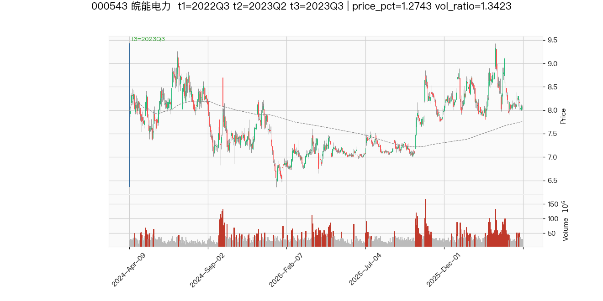

#### 🔍 检测依据 — 000543 皖能电力
> 最佳 triple: **2022Q3 → 2023Q2 → 2023Q3** ｜ B 触发: price_pct=1.27 vol_ratio=1.34 ｜ 候选 triple 数: 3

#### 📊 港中结持仓节奏 — 000543 皖能电力

| 季度     |   持股量(万股) |   持股市值(亿) |
|:-------|----------:|----------:|
| 2022Q4 |    2812.5 |      1.26 |
| 2023Q1 |    2462.6 |      1.21 |
| 2023Q2 |    1854.6 |      1.23 |
| 2023Q3 |    2184.4 |      1.33 |
| 2023Q4 |    2757.5 |      1.73 |
| 2024Q1 |    1658.2 |      1.33 |
| 2024Q2 |    2772.4 |      2.45 |
| 2024Q3 |    1968   |      1.69 |

#### ✍️ 人工复盘 — 000543 皖能电力

| 检查项 | 结果 |
|--------|------|
| t2 季度价格在近 250 日高位区间（视觉） | ⬜ |
| t2 季度出现明显放量 bar（红色高量） | ⬜ |
| t3 季度买回后股价未大幅上涨（非卖飞） | ⬜ |
| t1→t2→t3 三段节奏符合「建仓→出货→再建仓」 | ⬜ |

**决策**: ⬜ PASS（纳入关注名单）　⬜ REJECT（假信号）

**备注**: _（人工填写）_

### 600789 鲁抗医药 K 线 + 成交量
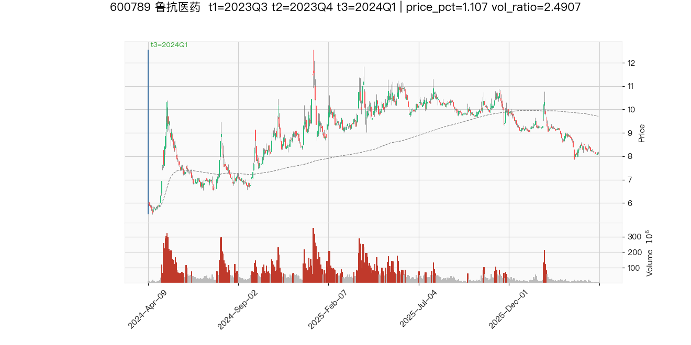

#### 🔍 检测依据 — 600789 鲁抗医药
> 最佳 triple: **2023Q3 → 2023Q4 → 2024Q1** ｜ B 触发: price_pct=1.11 vol_ratio=2.49 ｜ 候选 triple 数: 1

#### 📊 港中结持仓节奏 — 600789 鲁抗医药

| 季度     |   持股量(万股) |   持股市值(亿) |
|:-------|----------:|----------:|
| 2023Q1 |     334.6 |      0.23 |
| 2023Q2 |     179.1 |      0.11 |
| 2023Q3 |    1308.9 |      0.89 |
| 2023Q4 |     985.5 |      0.7  |
| 2024Q1 |    1184.5 |      0.73 |
| 2024Q2 |    1507.6 |      1.06 |
| 2024Q3 |    1681.3 |      1.28 |

#### ✍️ 人工复盘 — 600789 鲁抗医药

| 检查项 | 结果 |
|--------|------|
| t2 季度价格在近 250 日高位区间（视觉） | ⬜ |
| t2 季度出现明显放量 bar（红色高量） | ⬜ |
| t3 季度买回后股价未大幅上涨（非卖飞） | ⬜ |
| t1→t2→t3 三段节奏符合「建仓→出货→再建仓」 | ⬜ |

**决策**: ⬜ PASS（纳入关注名单）　⬜ REJECT（假信号）

**备注**: _（人工填写）_

### 002609 捷顺科技 K 线 + 成交量
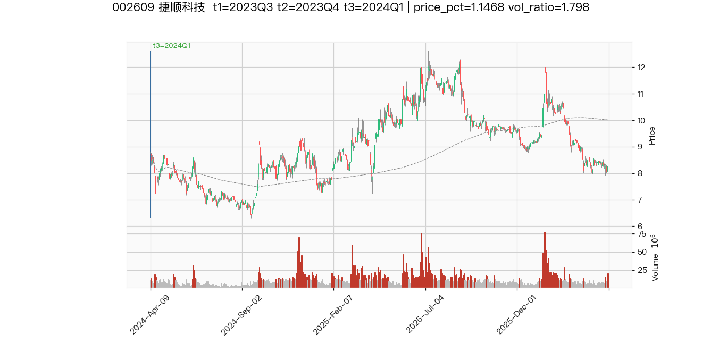

#### 🔍 检测依据 — 002609 捷顺科技
> 最佳 triple: **2023Q3 → 2023Q4 → 2024Q1** ｜ B 触发: price_pct=1.15 vol_ratio=1.80 ｜ 候选 triple 数: 2

#### 📊 港中结持仓节奏 — 002609 捷顺科技

| 季度     |   持股量(万股) |   持股市值(亿) |
|:-------|----------:|----------:|
| 2022Q4 |     349.8 |      0.31 |
| 2023Q1 |     332.3 |      0.37 |
| 2023Q2 |     493.4 |      0.54 |
| 2023Q3 |     607   |      0.66 |
| 2023Q4 |     452.7 |      0.52 |
| 2024Q1 |     477.7 |      0.45 |
| 2024Q2 |     313.5 |      0.24 |
| 2024Q3 |     474.8 |      0.34 |

#### ✍️ 人工复盘 — 002609 捷顺科技

| 检查项 | 结果 |
|--------|------|
| t2 季度价格在近 250 日高位区间（视觉） | ⬜ |
| t2 季度出现明显放量 bar（红色高量） | ⬜ |
| t3 季度买回后股价未大幅上涨（非卖飞） | ⬜ |
| t1→t2→t3 三段节奏符合「建仓→出货→再建仓」 | ⬜ |

**决策**: ⬜ PASS（纳入关注名单）　⬜ REJECT（假信号）

**备注**: _（人工填写）_

### 600037 歌华有线 K 线 + 成交量
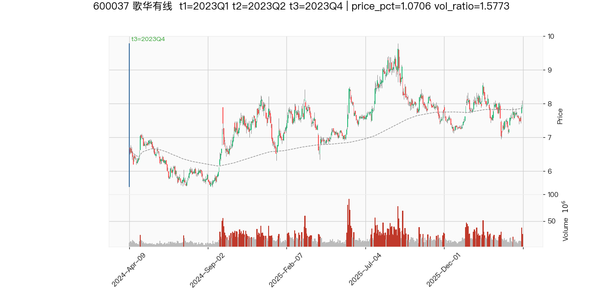

#### 🔍 检测依据 — 600037 歌华有线
> 最佳 triple: **2023Q1 → 2023Q2 → 2023Q4** ｜ B 触发: price_pct=1.07 vol_ratio=1.58 ｜ t2 后 60 日收益: 4.2% ｜ 候选 triple 数: 4

#### 📊 港中结持仓节奏 — 600037 歌华有线

| 季度     |   持股量(万股) |   持股市值(亿) |
|:-------|----------:|----------:|
| 2022Q4 |      16.9 |      0.01 |
| 2023Q1 |     765.7 |      0.73 |
| 2023Q2 |     618   |      0.51 |
| 2023Q3 |     349.6 |      0.28 |
| 2023Q4 |    1322.9 |      1.02 |
| 2024Q1 |     896.2 |      0.62 |
| 2024Q2 |     759.6 |      0.45 |
| 2024Q3 |    1051.2 |      0.63 |

#### ✍️ 人工复盘 — 600037 歌华有线

| 检查项 | 结果 |
|--------|------|
| t2 季度价格在近 250 日高位区间（视觉） | ⬜ |
| t2 季度出现明显放量 bar（红色高量） | ⬜ |
| t3 季度买回后股价未大幅上涨（非卖飞） | ⬜ |
| t1→t2→t3 三段节奏符合「建仓→出货→再建仓」 | ⬜ |

**决策**: ⬜ PASS（纳入关注名单）　⬜ REJECT（假信号）

**备注**: _（人工填写）_

### 600523 贵航股份 K 线 + 成交量
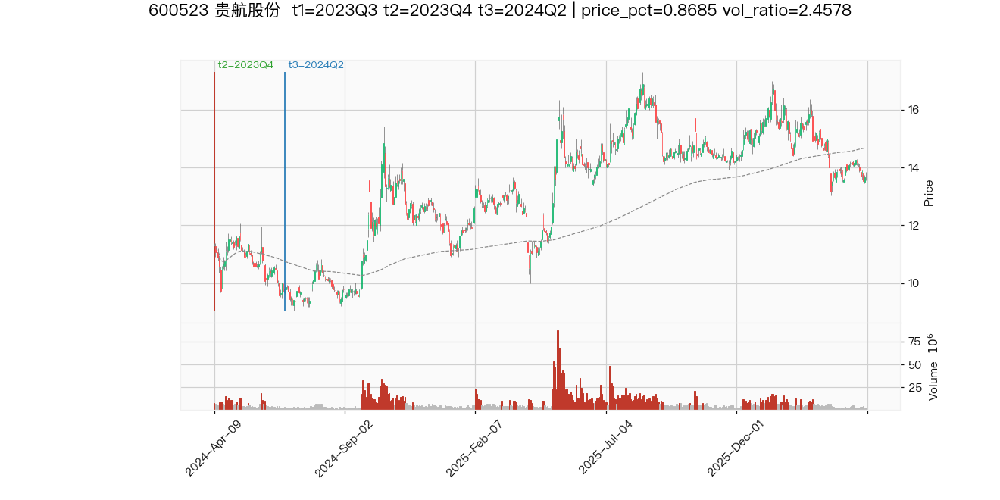

#### 🔍 检测依据 — 600523 贵航股份
> 最佳 triple: **2023Q3 → 2023Q4 → 2024Q2** ｜ B 触发: price_pct=0.87 vol_ratio=2.46 ｜ t2 后 60 日收益: 0.4% ｜ 候选 triple 数: 2

#### 📊 港中结持仓节奏 — 600523 贵航股份

| 季度     |   持股量(万股) |   持股市值(亿) |
|:-------|----------:|----------:|
| 2022Q4 |       0.1 |      0    |
| 2023Q1 |      61.4 |      0.09 |
| 2023Q2 |     201   |      0.29 |
| 2023Q3 |     345.9 |      0.45 |
| 2023Q4 |     298.6 |      0.41 |
| 2024Q1 |     261.3 |      0.32 |
| 2024Q2 |     347.6 |      0.34 |
| 2024Q3 |     387.5 |      0.39 |

#### ✍️ 人工复盘 — 600523 贵航股份

| 检查项 | 结果 |
|--------|------|
| t2 季度价格在近 250 日高位区间（视觉） | ⬜ |
| t2 季度出现明显放量 bar（红色高量） | ⬜ |
| t3 季度买回后股价未大幅上涨（非卖飞） | ⬜ |
| t1→t2→t3 三段节奏符合「建仓→出货→再建仓」 | ⬜ |

**决策**: ⬜ PASS（纳入关注名单）　⬜ REJECT（假信号）

**备注**: _（人工填写）_

### 603018 华设集团 K 线 + 成交量
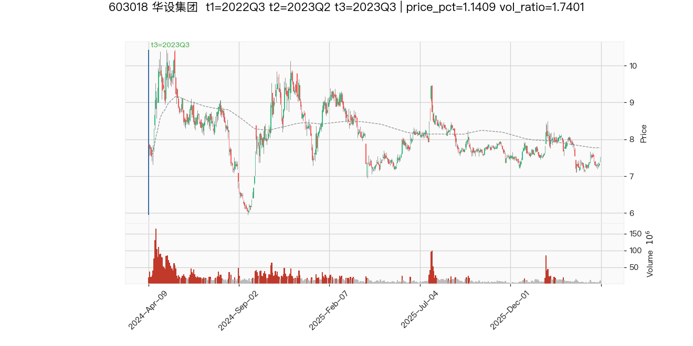

#### 🔍 检测依据 — 603018 华设集团
> 最佳 triple: **2022Q3 → 2023Q2 → 2023Q3** ｜ B 触发: price_pct=1.14 vol_ratio=1.74 ｜ 候选 triple 数: 2

#### 📊 港中结持仓节奏 — 603018 华设集团

| 季度     |   持股量(万股) |   持股市值(亿) |
|:-------|----------:|----------:|
| 2022Q4 |    3862   |      2.93 |
| 2023Q1 |    3340.6 |      3.07 |
| 2023Q2 |    1955.9 |      1.71 |
| 2023Q3 |    3564.3 |      2.96 |
| 2023Q4 |    1860.7 |      1.41 |
| 2024Q1 |    1879.7 |      1.6  |
| 2024Q2 |     674.2 |      0.61 |
| 2024Q3 |     528.3 |      0.41 |

#### ✍️ 人工复盘 — 603018 华设集团

| 检查项 | 结果 |
|--------|------|
| t2 季度价格在近 250 日高位区间（视觉） | ⬜ |
| t2 季度出现明显放量 bar（红色高量） | ⬜ |
| t3 季度买回后股价未大幅上涨（非卖飞） | ⬜ |
| t1→t2→t3 三段节奏符合「建仓→出货→再建仓」 | ⬜ |

**决策**: ⬜ PASS（纳入关注名单）　⬜ REJECT（假信号）

**备注**: _（人工填写）_

### 000560 我爱我家 K 线 + 成交量
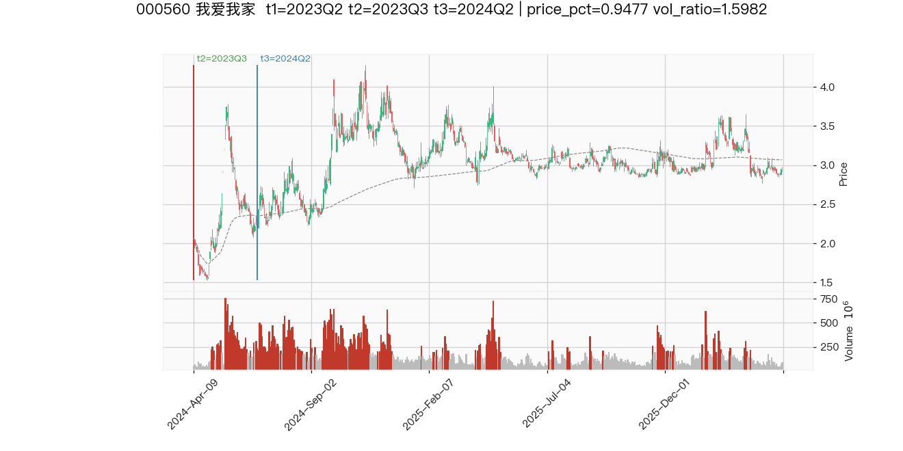

#### 🔍 检测依据 — 000560 我爱我家
> 最佳 triple: **2023Q2 → 2023Q3 → 2024Q2** ｜ B 触发: price_pct=0.95 vol_ratio=1.60 ｜ t2 后 60 日收益: 0.4% ｜ 候选 triple 数: 3

#### 📊 港中结持仓节奏 — 000560 我爱我家

| 季度     |   持股量(万股) |   持股市值(亿) |
|:-------|----------:|----------:|
| 2023Q1 |    2527.7 |      0.77 |
| 2023Q2 |    3294.5 |      0.86 |
| 2023Q3 |    2078.3 |      0.53 |
| 2023Q4 |    1426.5 |      0.32 |
| 2024Q1 |    1210.5 |      0.26 |
| 2024Q2 |    2138.9 |      0.47 |
| 2024Q3 |    2264.3 |      0.61 |

#### ✍️ 人工复盘 — 000560 我爱我家

| 检查项 | 结果 |
|--------|------|
| t2 季度价格在近 250 日高位区间（视觉） | ⬜ |
| t2 季度出现明显放量 bar（红色高量） | ⬜ |
| t3 季度买回后股价未大幅上涨（非卖飞） | ⬜ |
| t1→t2→t3 三段节奏符合「建仓→出货→再建仓」 | ⬜ |

**决策**: ⬜ PASS（纳入关注名单）　⬜ REJECT（假信号）

**备注**: _（人工填写）_

### 000690 宝新能源 K 线 + 成交量
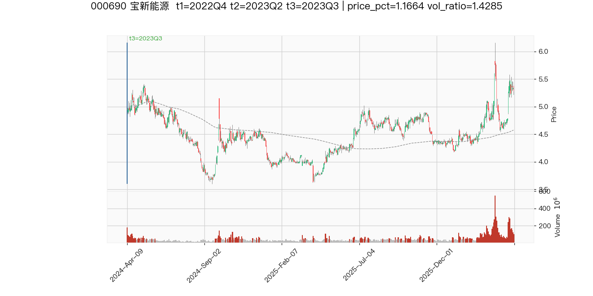

#### 🔍 检测依据 — 000690 宝新能源
> 最佳 triple: **2022Q4 → 2023Q2 → 2023Q3** ｜ B 触发: price_pct=1.17 vol_ratio=1.43 ｜ 候选 triple 数: 4

#### 📊 港中结持仓节奏 — 000690 宝新能源

| 季度     |   持股量(万股) |   持股市值(亿) |
|:-------|----------:|----------:|
| 2022Q4 |    5098.6 |      3.31 |
| 2023Q1 |    4094.1 |      2.48 |
| 2023Q2 |    3211   |      2.28 |
| 2023Q3 |    7242.1 |      3.9  |
| 2023Q4 |    3278.8 |      1.45 |
| 2024Q1 |    2588.4 |      1.26 |
| 2024Q2 |    4577.1 |      2.33 |
| 2024Q3 |    4547.5 |      2.05 |

#### ✍️ 人工复盘 — 000690 宝新能源

| 检查项 | 结果 |
|--------|------|
| t2 季度价格在近 250 日高位区间（视觉） | ⬜ |
| t2 季度出现明显放量 bar（红色高量） | ⬜ |
| t3 季度买回后股价未大幅上涨（非卖飞） | ⬜ |
| t1→t2→t3 三段节奏符合「建仓→出货→再建仓」 | ⬜ |

**决策**: ⬜ PASS（纳入关注名单）　⬜ REJECT（假信号）

**备注**: _（人工填写）_

### 002014 永新股份 K 线 + 成交量
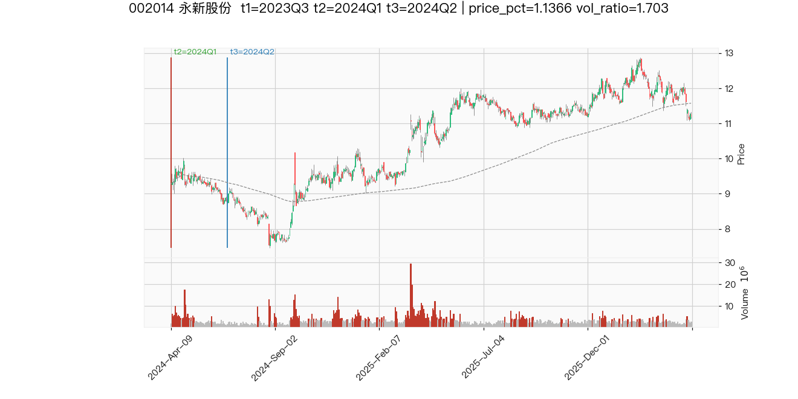

#### 🔍 检测依据 — 002014 永新股份
> 最佳 triple: **2023Q3 → 2024Q1 → 2024Q2** ｜ B 触发: price_pct=1.14 vol_ratio=1.70 ｜ 候选 triple 数: 1

#### 📊 港中结持仓节奏 — 002014 永新股份

| 季度     |   持股量(万股) |   持股市值(亿) |
|:-------|----------:|----------:|
| 2023Q1 |     418.1 |      0.38 |
| 2023Q2 |     559.2 |      0.48 |
| 2023Q3 |    1457.8 |      1.31 |
| 2023Q4 |     903.8 |      0.75 |
| 2024Q1 |     767.6 |      0.76 |
| 2024Q2 |     880.8 |      0.83 |
| 2024Q3 |     865.1 |      0.79 |

#### ✍️ 人工复盘 — 002014 永新股份

| 检查项 | 结果 |
|--------|------|
| t2 季度价格在近 250 日高位区间（视觉） | ⬜ |
| t2 季度出现明显放量 bar（红色高量） | ⬜ |
| t3 季度买回后股价未大幅上涨（非卖飞） | ⬜ |
| t1→t2→t3 三段节奏符合「建仓→出货→再建仓」 | ⬜ |

**决策**: ⬜ PASS（纳入关注名单）　⬜ REJECT（假信号）

**备注**: _（人工填写）_

### 600525 ST长园 K 线 + 成交量
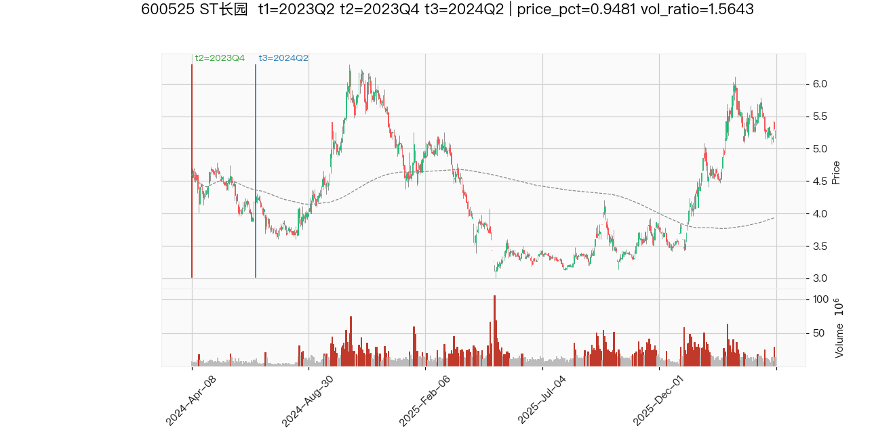

#### 🔍 检测依据 — 600525 ST长园
> 最佳 triple: **2023Q2 → 2023Q4 → 2024Q2** ｜ B 触发: price_pct=0.95 vol_ratio=1.56 ｜ t2 后 60 日收益: 0.9% ｜ 候选 triple 数: 2

#### 📊 港中结持仓节奏 — 600525 ST长园

| 季度     |   持股量(万股) |   持股市值(亿) |
|:-------|----------:|----------:|
| 2023Q1 |     794.1 |      0.44 |
| 2023Q2 |    2635.6 |      1.53 |
| 2023Q3 |    1190.3 |      0.59 |
| 2023Q4 |     874   |      0.47 |
| 2024Q1 |     812.9 |      0.38 |
| 2024Q2 |     982.4 |      0.42 |
| 2024Q3 |     929.9 |      0.35 |

#### ✍️ 人工复盘 — 600525 ST长园

| 检查项 | 结果 |
|--------|------|
| t2 季度价格在近 250 日高位区间（视觉） | ⬜ |
| t2 季度出现明显放量 bar（红色高量） | ⬜ |
| t3 季度买回后股价未大幅上涨（非卖飞） | ⬜ |
| t1→t2→t3 三段节奏符合「建仓→出货→再建仓」 | ⬜ |

**决策**: ⬜ PASS（纳入关注名单）　⬜ REJECT（假信号）

**备注**: _（人工填写）_

### 600508 上海能源 K 线 + 成交量
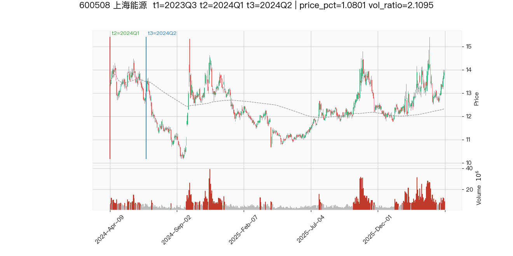

#### 🔍 检测依据 — 600508 上海能源
> 最佳 triple: **2023Q3 → 2024Q1 → 2024Q2** ｜ B 触发: price_pct=1.08 vol_ratio=2.11 ｜ 候选 triple 数: 2

#### 📊 港中结持仓节奏 — 600508 上海能源

| 季度     |   持股量(万股) |   持股市值(亿) |
|:-------|----------:|----------:|
| 2022Q2 |       0   |      0    |
| 2023Q1 |     524.7 |      0.74 |
| 2023Q2 |    1482.5 |      2.18 |
| 2023Q3 |    2437.5 |      3.51 |
| 2023Q4 |    2079.8 |      2.88 |
| 2024Q1 |    1891.5 |      2.59 |
| 2024Q2 |    2259.6 |      3.2  |
| 2024Q3 |    1703.6 |      2.03 |

#### ✍️ 人工复盘 — 600508 上海能源

| 检查项 | 结果 |
|--------|------|
| t2 季度价格在近 250 日高位区间（视觉） | ⬜ |
| t2 季度出现明显放量 bar（红色高量） | ⬜ |
| t3 季度买回后股价未大幅上涨（非卖飞） | ⬜ |
| t1→t2→t3 三段节奏符合「建仓→出货→再建仓」 | ⬜ |

**决策**: ⬜ PASS（纳入关注名单）　⬜ REJECT（假信号）

**备注**: _（人工填写）_

### 688378 奥来德 K 线 + 成交量
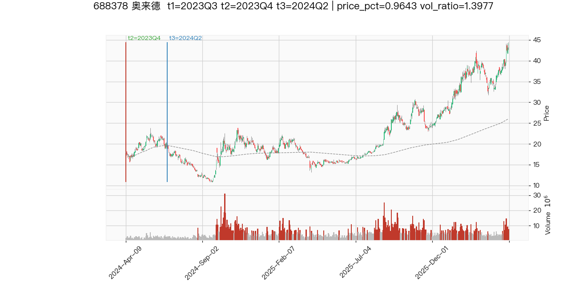

#### 🔍 检测依据 — 688378 奥来德
> 最佳 triple: **2023Q3 → 2023Q4 → 2024Q2** ｜ B 触发: price_pct=0.96 vol_ratio=1.40 ｜ t2 后 60 日收益: 1.6% ｜ 候选 triple 数: 2

#### 📊 港中结持仓节奏 — 688378 奥来德

| 季度     |   持股量(万股) |   持股市值(亿) |
|:-------|----------:|----------:|
| 2023Q2 |      27   |      0.13 |
| 2023Q3 |     153.7 |      0.59 |
| 2023Q4 |      87.8 |      0.42 |
| 2024Q1 |      73   |      0.25 |
| 2024Q2 |     130   |      0.3  |
| 2024Q3 |     256.6 |      0.44 |

#### ✍️ 人工复盘 — 688378 奥来德

| 检查项 | 结果 |
|--------|------|
| t2 季度价格在近 250 日高位区间（视觉） | ⬜ |
| t2 季度出现明显放量 bar（红色高量） | ⬜ |
| t3 季度买回后股价未大幅上涨（非卖飞） | ⬜ |
| t1→t2→t3 三段节奏符合「建仓→出货→再建仓」 | ⬜ |

**决策**: ⬜ PASS（纳入关注名单）　⬜ REJECT（假信号）

**备注**: _（人工填写）_

### 600326 西藏天路 K 线 + 成交量
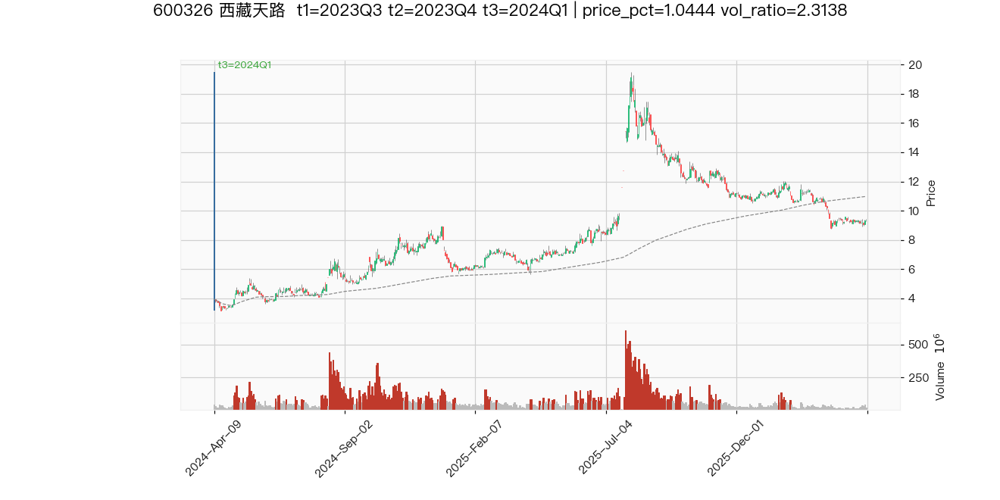

#### 🔍 检测依据 — 600326 西藏天路
> 最佳 triple: **2023Q3 → 2023Q4 → 2024Q1** ｜ B 触发: price_pct=1.04 vol_ratio=2.31 ｜ 候选 triple 数: 2

#### 📊 港中结持仓节奏 — 600326 西藏天路

| 季度     |   持股量(万股) |   持股市值(亿) |
|:-------|----------:|----------:|
| 2023Q1 |    1269.9 |      0.61 |
| 2023Q2 |    1095.1 |      0.73 |
| 2023Q3 |    1283.7 |      0.66 |
| 2023Q4 |     710.3 |      0.34 |
| 2024Q1 |    1314.2 |      0.51 |
| 2024Q2 |     348.6 |      0.16 |
| 2024Q3 |     929.2 |      0.56 |

#### ✍️ 人工复盘 — 600326 西藏天路

| 检查项 | 结果 |
|--------|------|
| t2 季度价格在近 250 日高位区间（视觉） | ⬜ |
| t2 季度出现明显放量 bar（红色高量） | ⬜ |
| t3 季度买回后股价未大幅上涨（非卖飞） | ⬜ |
| t1→t2→t3 三段节奏符合「建仓→出货→再建仓」 | ⬜ |

**决策**: ⬜ PASS（纳入关注名单）　⬜ REJECT（假信号）

**备注**: _（人工填写）_

### 000078 海王生物 K 线 + 成交量
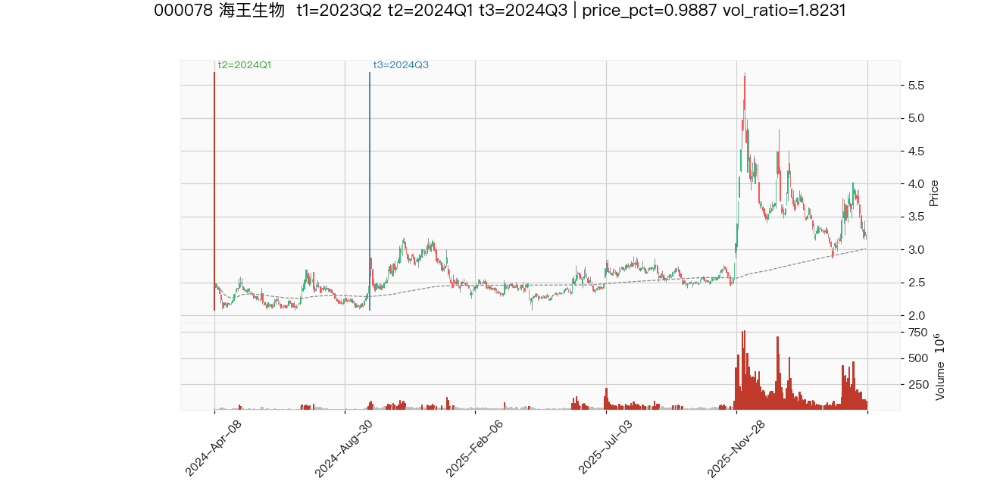

#### 🔍 检测依据 — 000078 海王生物
> 最佳 triple: **2023Q2 → 2024Q1 → 2024Q3** ｜ B 触发: price_pct=0.99 vol_ratio=1.82 ｜ t2 后 60 日收益: 4.1% ｜ 候选 triple 数: 2

#### 📊 港中结持仓节奏 — 000078 海王生物

| 季度     |   持股量(万股) |   持股市值(亿) |
|:-------|----------:|----------:|
| 2023Q1 |    2130.4 |      0.7  |
| 2023Q2 |    2270.6 |      0.72 |
| 2023Q3 |    2293.3 |      0.7  |
| 2023Q4 |    2184.4 |      0.69 |
| 2024Q1 |    1867.6 |      0.45 |
| 2024Q2 |    1249.5 |      0.26 |
| 2024Q3 |    3011.6 |      0.71 |

#### ✍️ 人工复盘 — 000078 海王生物

| 检查项 | 结果 |
|--------|------|
| t2 季度价格在近 250 日高位区间（视觉） | ⬜ |
| t2 季度出现明显放量 bar（红色高量） | ⬜ |
| t3 季度买回后股价未大幅上涨（非卖飞） | ⬜ |
| t1→t2→t3 三段节奏符合「建仓→出货→再建仓」 | ⬜ |

**决策**: ⬜ PASS（纳入关注名单）　⬜ REJECT（假信号）

**备注**: _（人工填写）_

### 002099 海翔药业 K 线 + 成交量
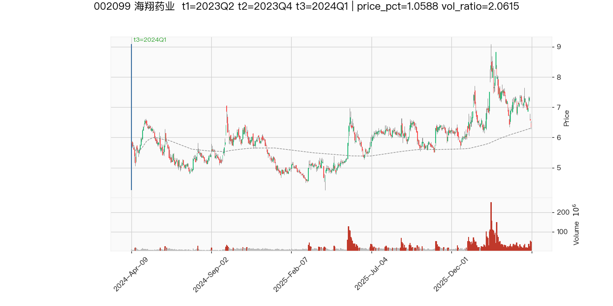

#### 🔍 检测依据 — 002099 海翔药业
> 最佳 triple: **2023Q2 → 2023Q4 → 2024Q1** ｜ B 触发: price_pct=1.06 vol_ratio=2.06 ｜ 候选 triple 数: 2

#### 📊 港中结持仓节奏 — 002099 海翔药业

| 季度     |   持股量(万股) |   持股市值(亿) |
|:-------|----------:|----------:|
| 2023Q1 |    1880.4 |      1.33 |
| 2023Q2 |    2250.4 |      1.86 |
| 2023Q3 |    1696.2 |      1.46 |
| 2023Q4 |    1509.2 |      1.09 |
| 2024Q1 |    1827.3 |      1.02 |
| 2024Q2 |    1782.6 |      0.91 |
| 2024Q3 |    1427.4 |      0.77 |

#### ✍️ 人工复盘 — 002099 海翔药业

| 检查项 | 结果 |
|--------|------|
| t2 季度价格在近 250 日高位区间（视觉） | ⬜ |
| t2 季度出现明显放量 bar（红色高量） | ⬜ |
| t3 季度买回后股价未大幅上涨（非卖飞） | ⬜ |
| t1→t2→t3 三段节奏符合「建仓→出货→再建仓」 | ⬜ |

**决策**: ⬜ PASS（纳入关注名单）　⬜ REJECT（假信号）

**备注**: _（人工填写）_

### 300005 探路者 K 线 + 成交量
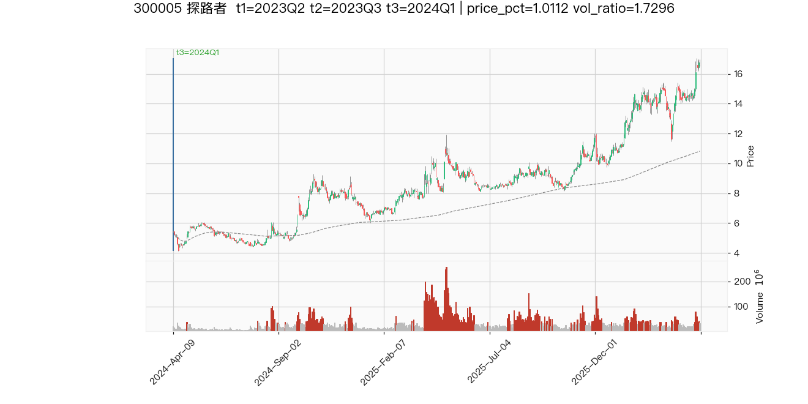

#### 🔍 检测依据 — 300005 探路者
> 最佳 triple: **2023Q2 → 2023Q3 → 2024Q1** ｜ B 触发: price_pct=1.01 vol_ratio=1.73 ｜ t2 后 60 日收益: 4.8% ｜ 候选 triple 数: 2

#### 📊 港中结持仓节奏 — 300005 探路者

| 季度     |   持股量(万股) |   持股市值(亿) |
|:-------|----------:|----------:|
| 2022Q4 |       0   |      0    |
| 2023Q1 |     117.7 |      0.1  |
| 2023Q2 |    2012.7 |      1.69 |
| 2023Q3 |    1109.6 |      0.88 |
| 2023Q4 |     572.6 |      0.38 |
| 2024Q1 |    1941.1 |      1.01 |
| 2024Q2 |     969.1 |      0.49 |
| 2024Q3 |     846   |      0.44 |

#### ✍️ 人工复盘 — 300005 探路者

| 检查项 | 结果 |
|--------|------|
| t2 季度价格在近 250 日高位区间（视觉） | ⬜ |
| t2 季度出现明显放量 bar（红色高量） | ⬜ |
| t3 季度买回后股价未大幅上涨（非卖飞） | ⬜ |
| t1→t2→t3 三段节奏符合「建仓→出货→再建仓」 | ⬜ |

**决策**: ⬜ PASS（纳入关注名单）　⬜ REJECT（假信号）

**备注**: _（人工填写）_

### 002171 楚江新材 K 线 + 成交量
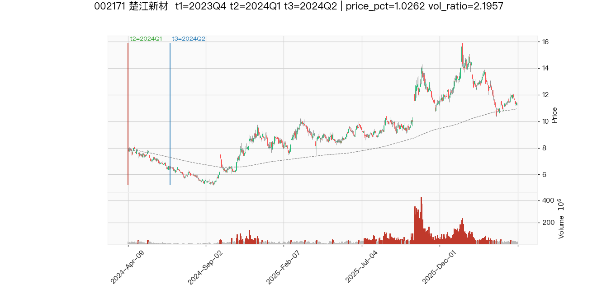

#### 🔍 检测依据 — 002171 楚江新材
> 最佳 triple: **2023Q4 → 2024Q1 → 2024Q2** ｜ B 触发: price_pct=1.03 vol_ratio=2.20 ｜ 候选 triple 数: 3

#### 📊 港中结持仓节奏 — 002171 楚江新材

| 季度     |   持股量(万股) |   持股市值(亿) |
|:-------|----------:|----------:|
| 2022Q4 |     819.6 |      0.6  |
| 2023Q1 |    1266.8 |      0.95 |
| 2023Q2 |    1141   |      0.8  |
| 2023Q3 |    1286.2 |      0.9  |
| 2023Q4 |    2171.7 |      1.62 |
| 2024Q1 |    1904.6 |      1.54 |
| 2024Q2 |    4273.5 |      2.82 |
| 2024Q3 |    2480   |      1.44 |

#### ✍️ 人工复盘 — 002171 楚江新材

| 检查项 | 结果 |
|--------|------|
| t2 季度价格在近 250 日高位区间（视觉） | ⬜ |
| t2 季度出现明显放量 bar（红色高量） | ⬜ |
| t3 季度买回后股价未大幅上涨（非卖飞） | ⬜ |
| t1→t2→t3 三段节奏符合「建仓→出货→再建仓」 | ⬜ |

**决策**: ⬜ PASS（纳入关注名单）　⬜ REJECT（假信号）

**备注**: _（人工填写）_

### 600850 电科数字 K 线 + 成交量
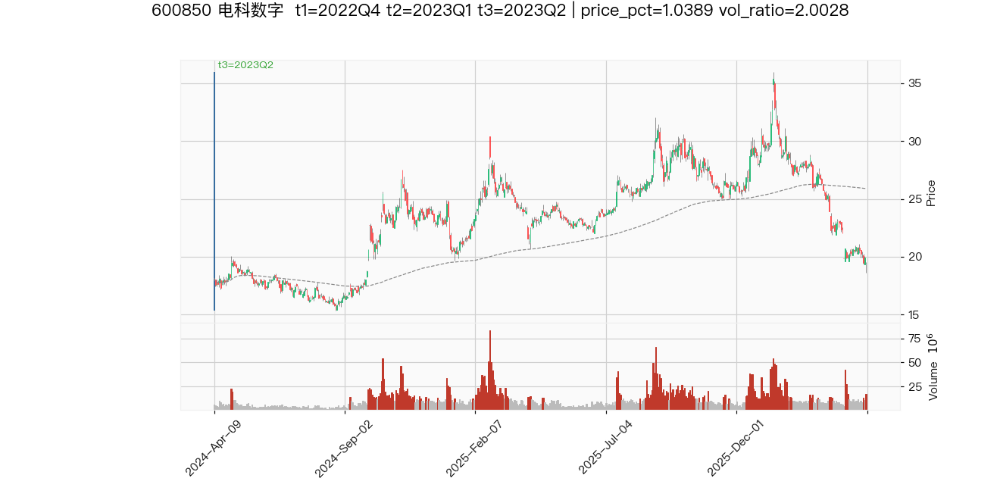

#### 🔍 检测依据 — 600850 电科数字
> 最佳 triple: **2022Q4 → 2023Q1 → 2023Q2** ｜ B 触发: price_pct=1.04 vol_ratio=2.00 ｜ 候选 triple 数: 3

#### 📊 港中结持仓节奏 — 600850 电科数字

| 季度     |   持股量(万股) |   持股市值(亿) |
|:-------|----------:|----------:|
| 2022Q4 |     546.2 |      1.1  |
| 2023Q1 |     431.4 |      1.19 |
| 2023Q2 |     654.2 |      1.53 |
| 2023Q3 |     388.6 |      0.91 |
| 2023Q4 |     525.4 |      1.14 |
| 2024Q1 |     779.6 |      1.53 |
| 2024Q2 |     479.2 |      0.87 |
| 2024Q3 |     455.1 |      0.75 |

#### ✍️ 人工复盘 — 600850 电科数字

| 检查项 | 结果 |
|--------|------|
| t2 季度价格在近 250 日高位区间（视觉） | ⬜ |
| t2 季度出现明显放量 bar（红色高量） | ⬜ |
| t3 季度买回后股价未大幅上涨（非卖飞） | ⬜ |
| t1→t2→t3 三段节奏符合「建仓→出货→再建仓」 | ⬜ |

**决策**: ⬜ PASS（纳入关注名单）　⬜ REJECT（假信号）

**备注**: _（人工填写）_

### 300348 长亮科技 K 线 + 成交量
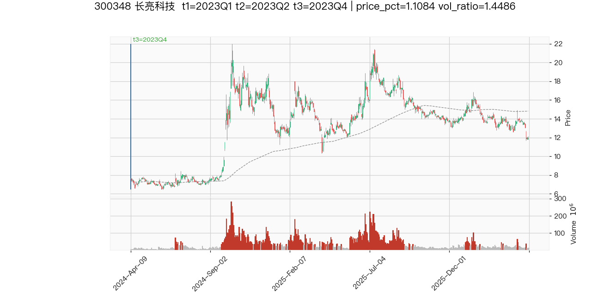

#### 🔍 检测依据 — 300348 长亮科技
> 最佳 triple: **2023Q1 → 2023Q2 → 2023Q4** ｜ B 触发: price_pct=1.11 vol_ratio=1.45 ｜ t2 后 60 日收益: 8.4% ｜ 候选 triple 数: 2

#### 📊 港中结持仓节奏 — 300348 长亮科技

| 季度     |   持股量(万股) |   持股市值(亿) |
|:-------|----------:|----------:|
| 2022Q4 |     674.7 |      0.69 |
| 2023Q1 |     994.2 |      1.31 |
| 2023Q2 |     429.5 |      0.45 |
| 2023Q3 |     352.6 |      0.35 |
| 2023Q4 |     551.1 |      0.57 |
| 2024Q1 |     881.4 |      0.71 |
| 2024Q2 |     545.7 |      0.37 |
| 2024Q3 |     430.6 |      0.3  |

#### ✍️ 人工复盘 — 300348 长亮科技

| 检查项 | 结果 |
|--------|------|
| t2 季度价格在近 250 日高位区间（视觉） | ⬜ |
| t2 季度出现明显放量 bar（红色高量） | ⬜ |
| t3 季度买回后股价未大幅上涨（非卖飞） | ⬜ |
| t1→t2→t3 三段节奏符合「建仓→出货→再建仓」 | ⬜ |

**决策**: ⬜ PASS（纳入关注名单）　⬜ REJECT（假信号）

**备注**: _（人工填写）_

### 000791 甘肃能源 K 线 + 成交量
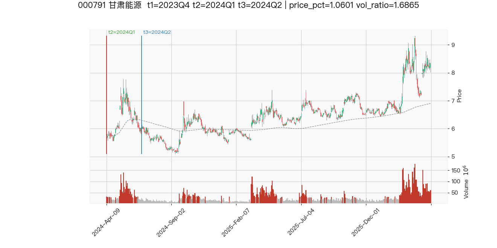

#### 🔍 检测依据 — 000791 甘肃能源
> 最佳 triple: **2023Q4 → 2024Q1 → 2024Q2** ｜ B 触发: price_pct=1.06 vol_ratio=1.69 ｜ 候选 triple 数: 3

#### 📊 港中结持仓节奏 — 000791 甘肃能源

| 季度     |   持股量(万股) |   持股市值(亿) |
|:-------|----------:|----------:|
| 2022Q4 |     298.1 |      0.16 |
| 2023Q1 |     174.2 |      0.09 |
| 2023Q2 |     450.3 |      0.24 |
| 2023Q3 |     522.6 |      0.29 |
| 2023Q4 |    1059.5 |      0.59 |
| 2024Q1 |     521.9 |      0.3  |
| 2024Q2 |     754.2 |      0.47 |
| 2024Q3 |     699.1 |      0.39 |

#### ✍️ 人工复盘 — 000791 甘肃能源

| 检查项 | 结果 |
|--------|------|
| t2 季度价格在近 250 日高位区间（视觉） | ⬜ |
| t2 季度出现明显放量 bar（红色高量） | ⬜ |
| t3 季度买回后股价未大幅上涨（非卖飞） | ⬜ |
| t1→t2→t3 三段节奏符合「建仓→出货→再建仓」 | ⬜ |

**决策**: ⬜ PASS（纳入关注名单）　⬜ REJECT（假信号）

**备注**: _（人工填写）_

### 002048 宁波华翔 K 线 + 成交量
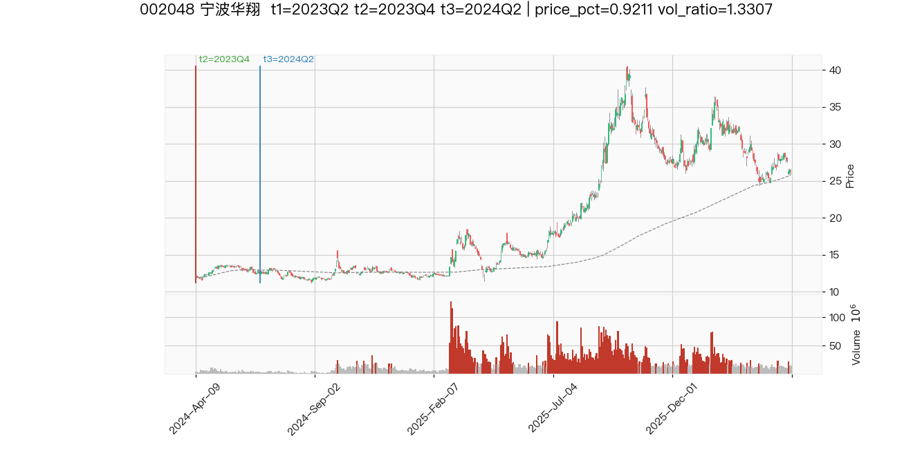

#### 🔍 检测依据 — 002048 宁波华翔
> 最佳 triple: **2023Q2 → 2023Q4 → 2024Q2** ｜ B 触发: price_pct=0.92 vol_ratio=1.33 ｜ t2 后 60 日收益: 1.5% ｜ 候选 triple 数: 2

#### 📊 港中结持仓节奏 — 002048 宁波华翔

| 季度     |   持股量(万股) |   持股市值(亿) |
|:-------|----------:|----------:|
| 2022Q4 |    4150.9 |      5.77 |
| 2023Q1 |    4594.5 |      6.8  |
| 2023Q2 |    4955.1 |      6.59 |
| 2023Q3 |    4661.7 |      6.65 |
| 2023Q4 |    1646.4 |      2.14 |
| 2024Q1 |    1178.9 |      1.51 |
| 2024Q2 |    1697.3 |      2.2  |
| 2024Q3 |    1578.4 |      1.93 |

#### ✍️ 人工复盘 — 002048 宁波华翔

| 检查项 | 结果 |
|--------|------|
| t2 季度价格在近 250 日高位区间（视觉） | ⬜ |
| t2 季度出现明显放量 bar（红色高量） | ⬜ |
| t3 季度买回后股价未大幅上涨（非卖飞） | ⬜ |
| t1→t2→t3 三段节奏符合「建仓→出货→再建仓」 | ⬜ |

**决策**: ⬜ PASS（纳入关注名单）　⬜ REJECT（假信号）

**备注**: _（人工填写）_

### 603610 麒盛科技 K 线 + 成交量
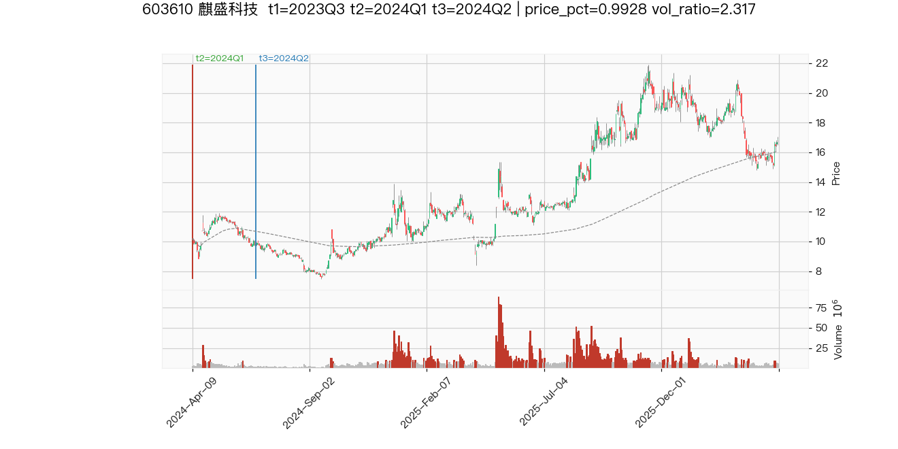

#### 🔍 检测依据 — 603610 麒盛科技
> 最佳 triple: **2023Q3 → 2024Q1 → 2024Q2** ｜ B 触发: price_pct=0.99 vol_ratio=2.32 ｜ 候选 triple 数: 3

#### 📊 港中结持仓节奏 — 603610 麒盛科技

| 季度     |   持股量(万股) |   持股市值(亿) |
|:-------|----------:|----------:|
| 2022Q4 |      91.5 |      0.11 |
| 2023Q1 |     178.8 |      0.21 |
| 2023Q2 |     141.7 |      0.16 |
| 2023Q3 |     625.5 |      0.76 |
| 2023Q4 |     343.5 |      0.41 |
| 2024Q1 |     231.6 |      0.25 |
| 2024Q2 |     342.3 |      0.34 |
| 2024Q3 |     403.1 |      0.37 |

#### ✍️ 人工复盘 — 603610 麒盛科技

| 检查项 | 结果 |
|--------|------|
| t2 季度价格在近 250 日高位区间（视觉） | ⬜ |
| t2 季度出现明显放量 bar（红色高量） | ⬜ |
| t3 季度买回后股价未大幅上涨（非卖飞） | ⬜ |
| t1→t2→t3 三段节奏符合「建仓→出货→再建仓」 | ⬜ |

**决策**: ⬜ PASS（纳入关注名单）　⬜ REJECT（假信号）

**备注**: _（人工填写）_

### 688658 悦康药业 K 线 + 成交量
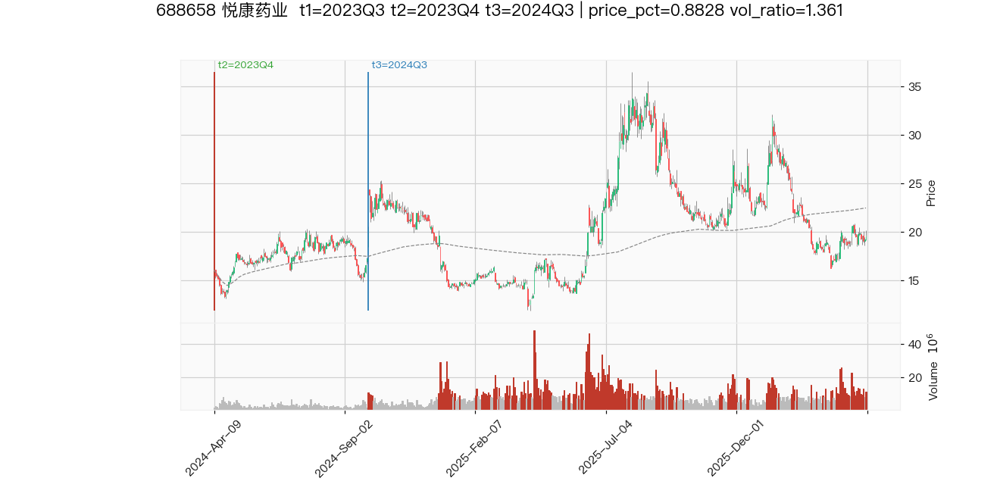

#### 🔍 检测依据 — 688658 悦康药业
> 最佳 triple: **2023Q3 → 2023Q4 → 2024Q3** ｜ B 触发: price_pct=0.88 vol_ratio=1.36 ｜ t2 后 60 日收益: 0.6% ｜ 候选 triple 数: 2

#### 📊 港中结持仓节奏 — 688658 悦康药业

| 季度     |   持股量(万股) |   持股市值(亿) |
|:-------|----------:|----------:|
| 2023Q1 |     122.1 |      0.25 |
| 2023Q2 |     284.9 |      0.59 |
| 2023Q3 |     616.4 |      1.12 |
| 2023Q4 |     155.3 |      0.32 |
| 2024Q1 |      62.7 |      0.11 |
| 2024Q2 |     143.3 |      0.26 |
| 2024Q3 |     272.1 |      0.53 |

#### ✍️ 人工复盘 — 688658 悦康药业

| 检查项 | 结果 |
|--------|------|
| t2 季度价格在近 250 日高位区间（视觉） | ⬜ |
| t2 季度出现明显放量 bar（红色高量） | ⬜ |
| t3 季度买回后股价未大幅上涨（非卖飞） | ⬜ |
| t1→t2→t3 三段节奏符合「建仓→出货→再建仓」 | ⬜ |

**决策**: ⬜ PASS（纳入关注名单）　⬜ REJECT（假信号）

**备注**: _（人工填写）_

### 600368 五洲交通 K 线 + 成交量
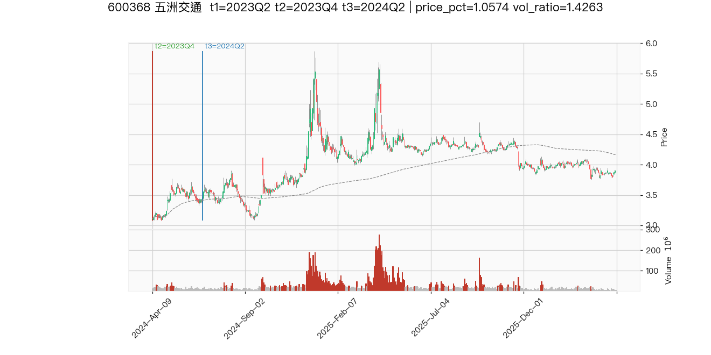

#### 🔍 检测依据 — 600368 五洲交通
> 最佳 triple: **2023Q2 → 2023Q4 → 2024Q2** ｜ B 触发: price_pct=1.06 vol_ratio=1.43 ｜ t2 后 60 日收益: 6.9% ｜ 候选 triple 数: 1

#### 📊 港中结持仓节奏 — 600368 五洲交通

| 季度     |   持股量(万股) |   持股市值(亿) |
|:-------|----------:|----------:|
| 2022Q4 |    2716.8 |      1.02 |
| 2023Q1 |    2617.3 |      1.01 |
| 2023Q2 |    2757.9 |      1    |
| 2023Q3 |    2663.6 |      1.03 |
| 2023Q4 |    2516.6 |      0.99 |
| 2024Q1 |    2491.9 |      0.99 |
| 2024Q2 |    3302.5 |      1.18 |
| 2024Q3 |    3841.2 |      1.43 |

#### ✍️ 人工复盘 — 600368 五洲交通

| 检查项 | 结果 |
|--------|------|
| t2 季度价格在近 250 日高位区间（视觉） | ⬜ |
| t2 季度出现明显放量 bar（红色高量） | ⬜ |
| t3 季度买回后股价未大幅上涨（非卖飞） | ⬜ |
| t1→t2→t3 三段节奏符合「建仓→出货→再建仓」 | ⬜ |

**决策**: ⬜ PASS（纳入关注名单）　⬜ REJECT（假信号）

**备注**: _（人工填写）_

### 605368 蓝天燃气 K 线 + 成交量
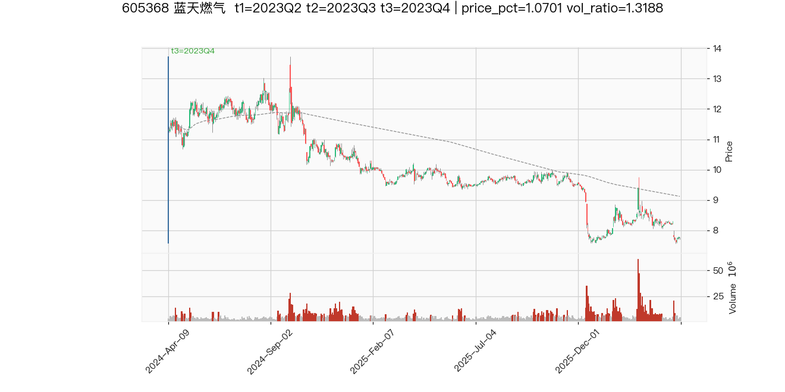

#### 🔍 检测依据 — 605368 蓝天燃气
> 最佳 triple: **2023Q2 → 2023Q3 → 2023Q4** ｜ B 触发: price_pct=1.07 vol_ratio=1.32 ｜ 候选 triple 数: 2

#### 📊 港中结持仓节奏 — 605368 蓝天燃气

| 季度     |   持股量(万股) |   持股市值(亿) |
|:-------|----------:|----------:|
| 2023Q1 |     154.8 |      0.21 |
| 2023Q2 |     288.1 |      0.28 |
| 2023Q3 |     236.4 |      0.24 |
| 2023Q4 |     422.8 |      0.46 |
| 2024Q1 |     355.9 |      0.47 |
| 2024Q2 |     674.4 |      0.92 |
| 2024Q3 |     869.4 |      1.2  |

#### ✍️ 人工复盘 — 605368 蓝天燃气

| 检查项 | 结果 |
|--------|------|
| t2 季度价格在近 250 日高位区间（视觉） | ⬜ |
| t2 季度出现明显放量 bar（红色高量） | ⬜ |
| t3 季度买回后股价未大幅上涨（非卖飞） | ⬜ |
| t1→t2→t3 三段节奏符合「建仓→出货→再建仓」 | ⬜ |

**决策**: ⬜ PASS（纳入关注名单）　⬜ REJECT（假信号）

**备注**: _（人工填写）_

### 600211 西藏药业 K 线 + 成交量
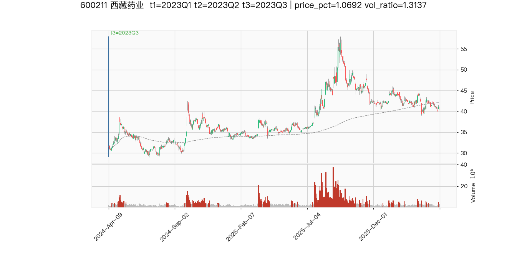

#### 🔍 检测依据 — 600211 西藏药业
> 最佳 triple: **2023Q1 → 2023Q2 → 2023Q3** ｜ B 触发: price_pct=1.07 vol_ratio=1.31 ｜ 候选 triple 数: 4

#### 📊 港中结持仓节奏 — 600211 西藏药业

| 季度     |   持股量(万股) |   持股市值(亿) |
|:-------|----------:|----------:|
| 2022Q4 |     182.8 |      0.66 |
| 2023Q1 |     291   |      1.54 |
| 2023Q2 |     222.7 |      1.32 |
| 2023Q3 |     278.9 |      1.4  |
| 2023Q4 |     225.8 |      1.1  |
| 2024Q1 |     141.2 |      0.63 |
| 2024Q2 |     259.3 |      0.84 |
| 2024Q3 |     296.2 |      1.06 |

#### ✍️ 人工复盘 — 600211 西藏药业

| 检查项 | 结果 |
|--------|------|
| t2 季度价格在近 250 日高位区间（视觉） | ⬜ |
| t2 季度出现明显放量 bar（红色高量） | ⬜ |
| t3 季度买回后股价未大幅上涨（非卖飞） | ⬜ |
| t1→t2→t3 三段节奏符合「建仓→出货→再建仓」 | ⬜ |

**决策**: ⬜ PASS（纳入关注名单）　⬜ REJECT（假信号）

**备注**: _（人工填写）_

### 600531 豫光金铅 K 线 + 成交量
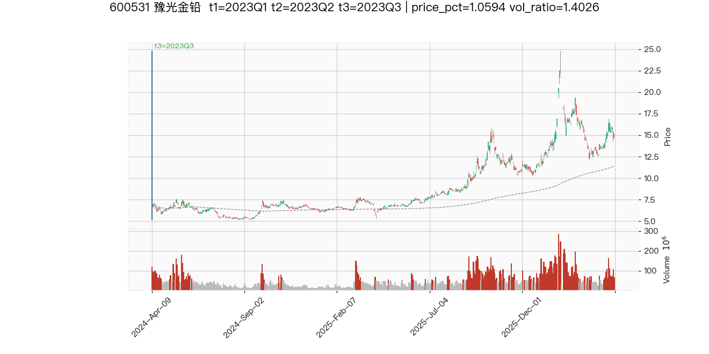

#### 🔍 检测依据 — 600531 豫光金铅
> 最佳 triple: **2023Q1 → 2023Q2 → 2023Q3** ｜ B 触发: price_pct=1.06 vol_ratio=1.40 ｜ 候选 triple 数: 3

#### 📊 港中结持仓节奏 — 600531 豫光金铅

| 季度     |   持股量(万股) |   持股市值(亿) |
|:-------|----------:|----------:|
| 2022Q4 |    1945.9 |      1.01 |
| 2023Q1 |    2086.7 |      1.28 |
| 2023Q2 |    1469   |      0.93 |
| 2023Q3 |    1728.9 |      1.14 |
| 2023Q4 |    1481.8 |      0.9  |
| 2024Q1 |    1516.5 |      0.97 |
| 2024Q2 |    3674.4 |      2.37 |
| 2024Q3 |     767   |      0.42 |

#### ✍️ 人工复盘 — 600531 豫光金铅

| 检查项 | 结果 |
|--------|------|
| t2 季度价格在近 250 日高位区间（视觉） | ⬜ |
| t2 季度出现明显放量 bar（红色高量） | ⬜ |
| t3 季度买回后股价未大幅上涨（非卖飞） | ⬜ |
| t1→t2→t3 三段节奏符合「建仓→出货→再建仓」 | ⬜ |

**决策**: ⬜ PASS（纳入关注名单）　⬜ REJECT（假信号）

**备注**: _（人工填写）_

### 002540 亚太科技 K 线 + 成交量
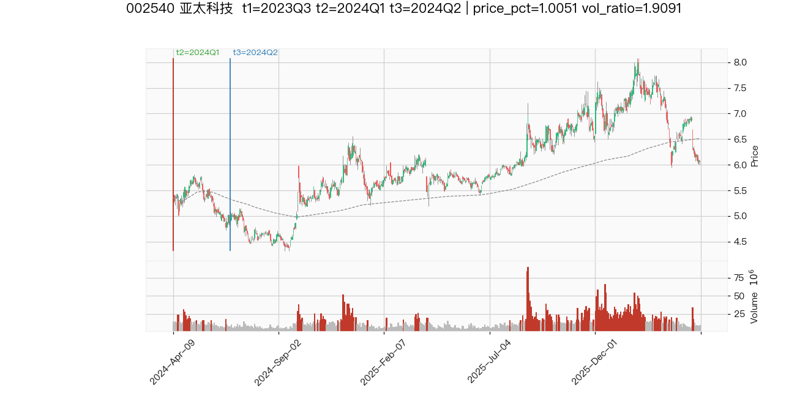

#### 🔍 检测依据 — 002540 亚太科技
> 最佳 triple: **2023Q3 → 2024Q1 → 2024Q2** ｜ B 触发: price_pct=1.01 vol_ratio=1.91 ｜ 候选 triple 数: 1

#### 📊 港中结持仓节奏 — 002540 亚太科技

| 季度     |   持股量(万股) |   持股市值(亿) |
|:-------|----------:|----------:|
| 2022Q4 |       0.2 |      0    |
| 2023Q1 |     624   |      0.37 |
| 2023Q2 |    1138.4 |      0.66 |
| 2023Q3 |    1603.8 |      0.95 |
| 2023Q4 |    1656.8 |      1.1  |
| 2024Q1 |     574.9 |      0.33 |
| 2024Q2 |     680.3 |      0.36 |
| 2024Q3 |     607.9 |      0.31 |

#### ✍️ 人工复盘 — 002540 亚太科技

| 检查项 | 结果 |
|--------|------|
| t2 季度价格在近 250 日高位区间（视觉） | ⬜ |
| t2 季度出现明显放量 bar（红色高量） | ⬜ |
| t3 季度买回后股价未大幅上涨（非卖飞） | ⬜ |
| t1→t2→t3 三段节奏符合「建仓→出货→再建仓」 | ⬜ |

**决策**: ⬜ PASS（纳入关注名单）　⬜ REJECT（假信号）

**备注**: _（人工填写）_

### 002803 吉宏股份 K 线 + 成交量
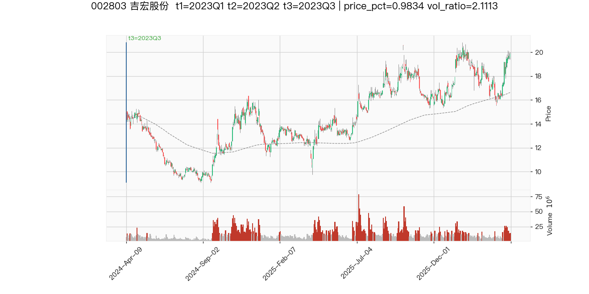

#### 🔍 检测依据 — 002803 吉宏股份
> 最佳 triple: **2023Q1 → 2023Q2 → 2023Q3** ｜ B 触发: price_pct=0.98 vol_ratio=2.11 ｜ 候选 triple 数: 2

#### 📊 港中结持仓节奏 — 002803 吉宏股份

| 季度     |   持股量(万股) |   持股市值(亿) |
|:-------|----------:|----------:|
| 2022Q4 |     565.1 |      0.9  |
| 2023Q1 |     887.6 |      2    |
| 2023Q2 |     196.5 |      0.4  |
| 2023Q3 |     524.7 |      0.96 |
| 2023Q4 |    2802.7 |      5.76 |
| 2024Q1 |    2800.3 |      4.71 |
| 2024Q2 |    2297.6 |      2.56 |
| 2024Q3 |    2529.9 |      2.63 |

#### ✍️ 人工复盘 — 002803 吉宏股份

| 检查项 | 结果 |
|--------|------|
| t2 季度价格在近 250 日高位区间（视觉） | ⬜ |
| t2 季度出现明显放量 bar（红色高量） | ⬜ |
| t3 季度买回后股价未大幅上涨（非卖飞） | ⬜ |
| t1→t2→t3 三段节奏符合「建仓→出货→再建仓」 | ⬜ |

**决策**: ⬜ PASS（纳入关注名单）　⬜ REJECT（假信号）

**备注**: _（人工填写）_

### 002948 青岛银行 K 线 + 成交量
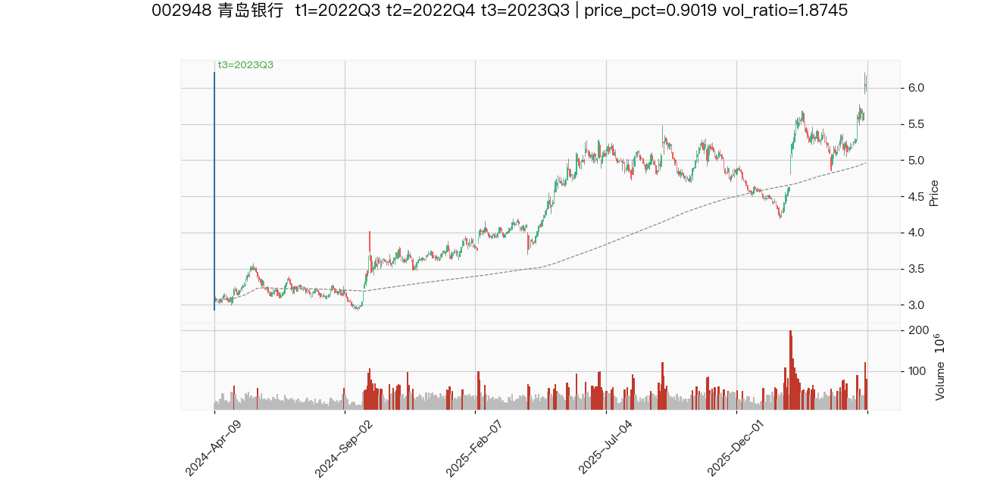

#### 🔍 检测依据 — 002948 青岛银行
> 最佳 triple: **2022Q3 → 2022Q4 → 2023Q3** ｜ B 触发: price_pct=0.90 vol_ratio=1.87 ｜ t2 后 60 日收益: 4.1% ｜ 候选 triple 数: 4

#### 📊 港中结持仓节奏 — 002948 青岛银行

| 季度     |   持股量(万股) |   持股市值(亿) |
|:-------|----------:|----------:|
| 2022Q4 |    2316.8 |      0.78 |
| 2023Q1 |    1548.4 |      0.51 |
| 2023Q2 |    2260.1 |      0.7  |
| 2023Q3 |    5904.5 |      2.05 |
| 2023Q4 |    3847.2 |      1.17 |
| 2024Q1 |    3648.8 |      1.17 |
| 2024Q2 |    4285.8 |      1.44 |
| 2024Q3 |    4286.2 |      1.41 |

#### ✍️ 人工复盘 — 002948 青岛银行

| 检查项 | 结果 |
|--------|------|
| t2 季度价格在近 250 日高位区间（视觉） | ⬜ |
| t2 季度出现明显放量 bar（红色高量） | ⬜ |
| t3 季度买回后股价未大幅上涨（非卖飞） | ⬜ |
| t1→t2→t3 三段节奏符合「建仓→出货→再建仓」 | ⬜ |

**决策**: ⬜ PASS（纳入关注名单）　⬜ REJECT（假信号）

**备注**: _（人工填写）_

### 600073 光明肉业 K 线 + 成交量
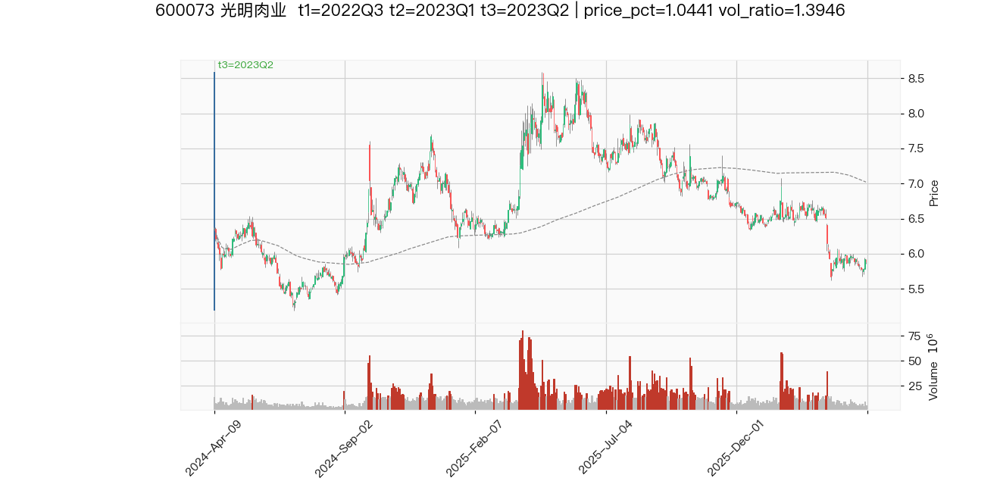

#### 🔍 检测依据 — 600073 光明肉业
> 最佳 triple: **2022Q3 → 2023Q1 → 2023Q2** ｜ B 触发: price_pct=1.04 vol_ratio=1.39 ｜ 候选 triple 数: 3

#### 📊 港中结持仓节奏 — 600073 光明肉业

| 季度     |   持股量(万股) |   持股市值(亿) |
|:-------|----------:|----------:|
| 2022Q4 |    1582.9 |      1.26 |
| 2023Q1 |     932.7 |      0.83 |
| 2023Q2 |    1008.5 |      0.74 |
| 2023Q3 |    1042   |      0.75 |
| 2023Q4 |     621   |      0.42 |
| 2024Q1 |     784   |      0.48 |
| 2024Q2 |     606.3 |      0.33 |
| 2024Q3 |     783.5 |      0.45 |

#### ✍️ 人工复盘 — 600073 光明肉业

| 检查项 | 结果 |
|--------|------|
| t2 季度价格在近 250 日高位区间（视觉） | ⬜ |
| t2 季度出现明显放量 bar（红色高量） | ⬜ |
| t3 季度买回后股价未大幅上涨（非卖飞） | ⬜ |
| t1→t2→t3 三段节奏符合「建仓→出货→再建仓」 | ⬜ |

**决策**: ⬜ PASS（纳入关注名单）　⬜ REJECT（假信号）

**备注**: _（人工填写）_

### 600551 时代出版 K 线 + 成交量
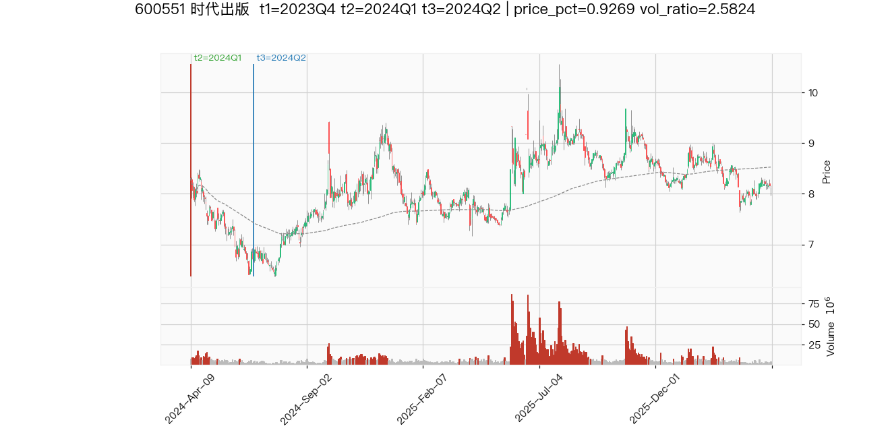

#### 🔍 检测依据 — 600551 时代出版
> 最佳 triple: **2023Q4 → 2024Q1 → 2024Q2** ｜ B 触发: price_pct=0.93 vol_ratio=2.58 ｜ 候选 triple 数: 1

#### 📊 港中结持仓节奏 — 600551 时代出版

| 季度     |   持股量(万股) |   持股市值(亿) |
|:-------|----------:|----------:|
| 2022Q4 |       0.8 |      0    |
| 2023Q1 |       0.8 |      0    |
| 2023Q2 |     153.4 |      0.17 |
| 2023Q3 |     719   |      0.82 |
| 2023Q4 |    1209.3 |      1.32 |
| 2024Q1 |    1060.1 |      1.38 |
| 2024Q2 |    2073.2 |      1.47 |
| 2024Q3 |    1971.9 |      1.51 |

#### ✍️ 人工复盘 — 600551 时代出版

| 检查项 | 结果 |
|--------|------|
| t2 季度价格在近 250 日高位区间（视觉） | ⬜ |
| t2 季度出现明显放量 bar（红色高量） | ⬜ |
| t3 季度买回后股价未大幅上涨（非卖飞） | ⬜ |
| t1→t2→t3 三段节奏符合「建仓→出货→再建仓」 | ⬜ |

**决策**: ⬜ PASS（纳入关注名单）　⬜ REJECT（假信号）

**备注**: _（人工填写）_

### 600217 中再资环 K 线 + 成交量
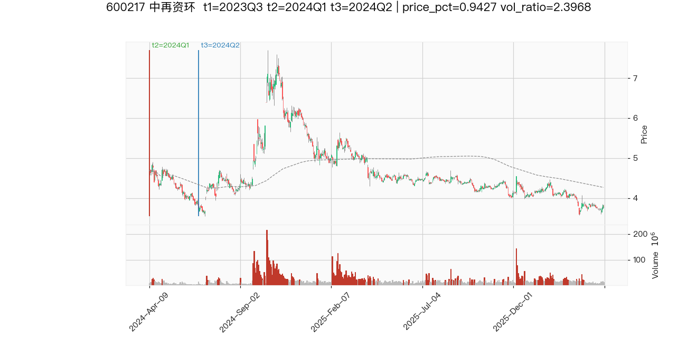

#### 🔍 检测依据 — 600217 中再资环
> 最佳 triple: **2023Q3 → 2024Q1 → 2024Q2** ｜ B 触发: price_pct=0.94 vol_ratio=2.40 ｜ 候选 triple 数: 2

#### 📊 港中结持仓节奏 — 600217 中再资环

| 季度     |   持股量(万股) |   持股市值(亿) |
|:-------|----------:|----------:|
| 2023Q1 |      40.1 |      0.02 |
| 2023Q2 |     298.8 |      0.14 |
| 2023Q3 |    1477.9 |      0.69 |
| 2023Q4 |     588.2 |      0.26 |
| 2024Q1 |     409.5 |      0.19 |
| 2024Q2 |     973.4 |      0.37 |
| 2024Q3 |    1200.6 |      0.52 |

#### ✍️ 人工复盘 — 600217 中再资环

| 检查项 | 结果 |
|--------|------|
| t2 季度价格在近 250 日高位区间（视觉） | ⬜ |
| t2 季度出现明显放量 bar（红色高量） | ⬜ |
| t3 季度买回后股价未大幅上涨（非卖飞） | ⬜ |
| t1→t2→t3 三段节奏符合「建仓→出货→再建仓」 | ⬜ |

**决策**: ⬜ PASS（纳入关注名单）　⬜ REJECT（假信号）

**备注**: _（人工填写）_

### 002075 沙钢股份 K 线 + 成交量
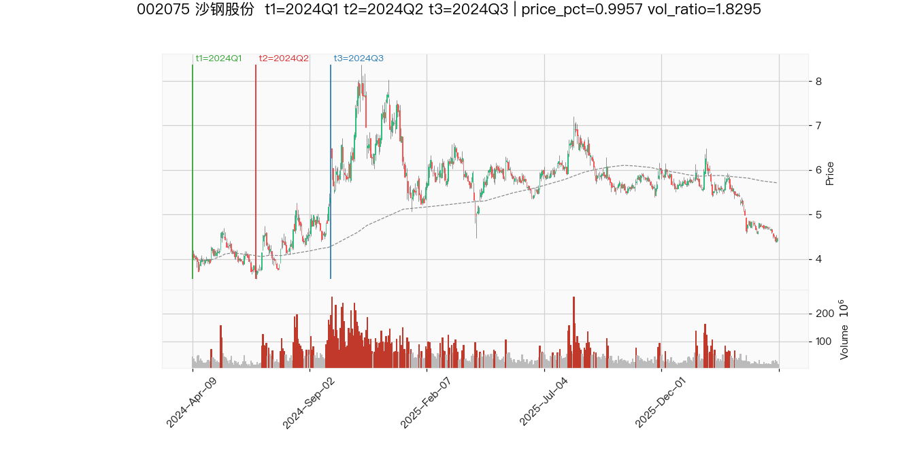

#### 🔍 检测依据 — 002075 沙钢股份
> 最佳 triple: **2024Q1 → 2024Q2 → 2024Q3** ｜ B 触发: price_pct=1.00 vol_ratio=1.83 ｜ 候选 triple 数: 1

#### 📊 港中结持仓节奏 — 002075 沙钢股份

| 季度     |   持股量(万股) |   持股市值(亿) |
|:-------|----------:|----------:|
| 2022Q4 |    3471.1 |      1.36 |
| 2023Q1 |    3513.8 |      1.46 |
| 2023Q2 |    2879.8 |      1.15 |
| 2023Q3 |    2898.3 |      1.15 |
| 2023Q4 |    2285.6 |      0.87 |
| 2024Q1 |    3496.4 |      1.52 |
| 2024Q2 |    2251.3 |      0.85 |
| 2024Q3 |    2597.5 |      1.31 |

#### ✍️ 人工复盘 — 002075 沙钢股份

| 检查项 | 结果 |
|--------|------|
| t2 季度价格在近 250 日高位区间（视觉） | ⬜ |
| t2 季度出现明显放量 bar（红色高量） | ⬜ |
| t3 季度买回后股价未大幅上涨（非卖飞） | ⬜ |
| t1→t2→t3 三段节奏符合「建仓→出货→再建仓」 | ⬜ |

**决策**: ⬜ PASS（纳入关注名单）　⬜ REJECT（假信号）

**备注**: _（人工填写）_

### 002151 北斗星通 K 线 + 成交量
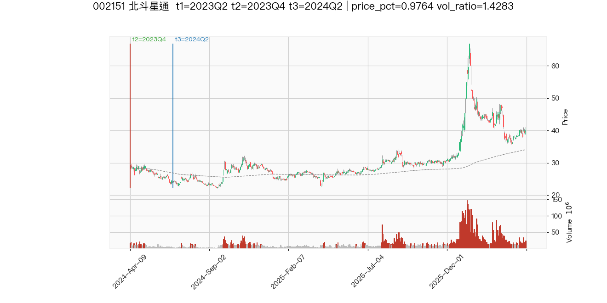

#### 🔍 检测依据 — 002151 北斗星通
> 最佳 triple: **2023Q2 → 2023Q4 → 2024Q2** ｜ B 触发: price_pct=0.98 vol_ratio=1.43 ｜ t2 后 60 日收益: 5.5% ｜ 候选 triple 数: 3

#### 📊 港中结持仓节奏 — 002151 北斗星通

| 季度     |   持股量(万股) |   持股市值(亿) |
|:-------|----------:|----------:|
| 2022Q4 |     417.5 |      1.17 |
| 2023Q1 |     461.7 |      1.47 |
| 2023Q2 |     879.7 |      3.07 |
| 2023Q3 |     545.8 |      1.69 |
| 2023Q4 |     515.4 |      1.63 |
| 2024Q1 |     398.9 |      1.29 |
| 2024Q2 |     574.7 |      1.39 |
| 2024Q3 |     420.3 |      1.01 |

#### ✍️ 人工复盘 — 002151 北斗星通

| 检查项 | 结果 |
|--------|------|
| t2 季度价格在近 250 日高位区间（视觉） | ⬜ |
| t2 季度出现明显放量 bar（红色高量） | ⬜ |
| t3 季度买回后股价未大幅上涨（非卖飞） | ⬜ |
| t1→t2→t3 三段节奏符合「建仓→出货→再建仓」 | ⬜ |

**决策**: ⬜ PASS（纳入关注名单）　⬜ REJECT（假信号）

**备注**: _（人工填写）_

### 002755 奥赛康 K 线 + 成交量
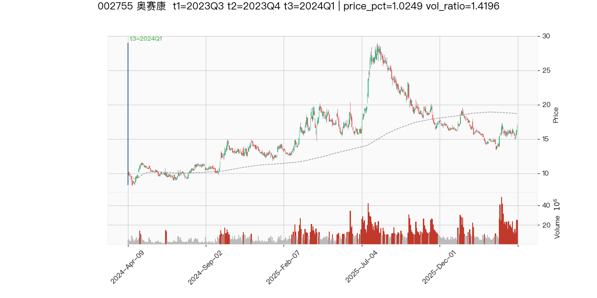

#### 🔍 检测依据 — 002755 奥赛康
> 最佳 triple: **2023Q3 → 2023Q4 → 2024Q1** ｜ B 触发: price_pct=1.02 vol_ratio=1.42 ｜ 候选 triple 数: 2

#### 📊 港中结持仓节奏 — 002755 奥赛康

| 季度     |   持股量(万股) |   持股市值(亿) |
|:-------|----------:|----------:|
| 2023Q1 |     181.2 |      0.16 |
| 2023Q2 |     318.4 |      0.28 |
| 2023Q3 |     496.1 |      0.45 |
| 2023Q4 |     350.6 |      0.38 |
| 2024Q1 |     864.1 |      0.86 |
| 2024Q2 |     578.4 |      0.56 |
| 2024Q3 |     706.8 |      0.81 |

#### ✍️ 人工复盘 — 002755 奥赛康

| 检查项 | 结果 |
|--------|------|
| t2 季度价格在近 250 日高位区间（视觉） | ⬜ |
| t2 季度出现明显放量 bar（红色高量） | ⬜ |
| t3 季度买回后股价未大幅上涨（非卖飞） | ⬜ |
| t1→t2→t3 三段节奏符合「建仓→出货→再建仓」 | ⬜ |

**决策**: ⬜ PASS（纳入关注名单）　⬜ REJECT（假信号）

**备注**: _（人工填写）_

### 001696 宗申动力 K 线 + 成交量
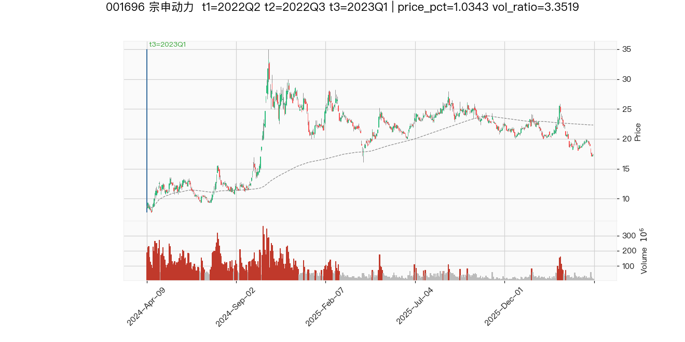

#### 🔍 检测依据 — 001696 宗申动力
> 最佳 triple: **2022Q2 → 2022Q3 → 2023Q1** ｜ B 触发: price_pct=1.03 vol_ratio=3.35 ｜ t2 后 60 日收益: 14.3% ｜ 候选 triple 数: 5

#### 📊 港中结持仓节奏 — 001696 宗申动力

| 季度     |   持股量(万股) |   持股市值(亿) |
|:-------|----------:|----------:|
| 2022Q4 |     780.4 |      0.46 |
| 2023Q1 |    1749.9 |      1.29 |
| 2023Q2 |    1391   |      0.98 |
| 2023Q3 |    1464.3 |      1    |
| 2023Q4 |    1298.2 |      0.86 |
| 2024Q1 |     827.4 |      0.61 |
| 2024Q2 |     830.2 |      0.88 |
| 2024Q3 |    1546.8 |      1.87 |

#### ✍️ 人工复盘 — 001696 宗申动力

| 检查项 | 结果 |
|--------|------|
| t2 季度价格在近 250 日高位区间（视觉） | ⬜ |
| t2 季度出现明显放量 bar（红色高量） | ⬜ |
| t3 季度买回后股价未大幅上涨（非卖飞） | ⬜ |
| t1→t2→t3 三段节奏符合「建仓→出货→再建仓」 | ⬜ |

**决策**: ⬜ PASS（纳入关注名单）　⬜ REJECT（假信号）

**备注**: _（人工填写）_

### 002111 威海广泰 K 线 + 成交量
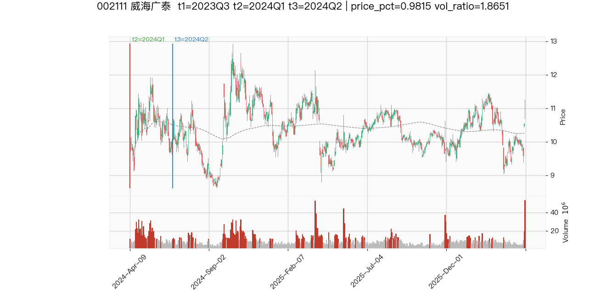

#### 🔍 检测依据 — 002111 威海广泰
> 最佳 triple: **2023Q3 → 2024Q1 → 2024Q2** ｜ B 触发: price_pct=0.98 vol_ratio=1.87 ｜ 候选 triple 数: 2

#### 📊 港中结持仓节奏 — 002111 威海广泰

| 季度     |   持股量(万股) |   持股市值(亿) |
|:-------|----------:|----------:|
| 2022Q4 |      26.6 |      0.03 |
| 2023Q1 |     219.5 |      0.23 |
| 2023Q2 |     556.4 |      0.53 |
| 2023Q3 |     585.5 |      0.55 |
| 2023Q4 |     524.6 |      0.48 |
| 2024Q1 |     154.1 |      0.17 |
| 2024Q2 |    1051.5 |      1.1  |
| 2024Q3 |     377.8 |      0.37 |

#### ✍️ 人工复盘 — 002111 威海广泰

| 检查项 | 结果 |
|--------|------|
| t2 季度价格在近 250 日高位区间（视觉） | ⬜ |
| t2 季度出现明显放量 bar（红色高量） | ⬜ |
| t3 季度买回后股价未大幅上涨（非卖飞） | ⬜ |
| t1→t2→t3 三段节奏符合「建仓→出货→再建仓」 | ⬜ |

**决策**: ⬜ PASS（纳入关注名单）　⬜ REJECT（假信号）

**备注**: _（人工填写）_

### 300364 中文在线 K 线 + 成交量
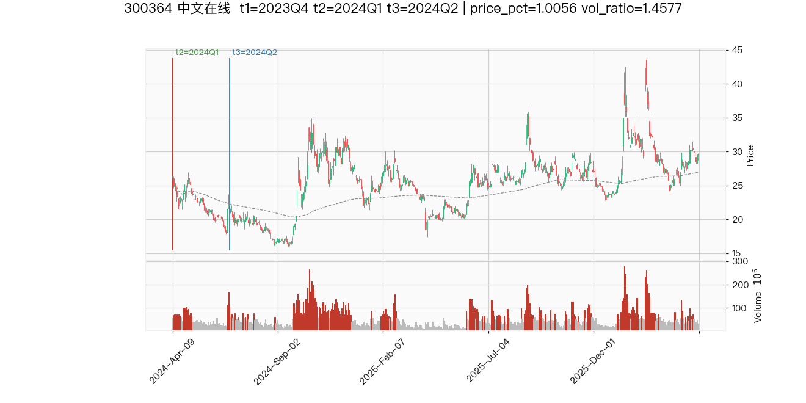

#### 🔍 检测依据 — 300364 中文在线
> 最佳 triple: **2023Q4 → 2024Q1 → 2024Q2** ｜ B 触发: price_pct=1.01 vol_ratio=1.46 ｜ 候选 triple 数: 1

#### 📊 港中结持仓节奏 — 300364 中文在线

| 季度     |   持股量(万股) |   持股市值(亿) |
|:-------|----------:|----------:|
| 2023Q1 |     971.1 |      1.98 |
| 2023Q2 |    1114.9 |      2    |
| 2023Q3 |    1293.9 |      1.85 |
| 2023Q4 |    2007.7 |      5.17 |
| 2024Q1 |     291.9 |      0.83 |
| 2024Q2 |     782.8 |      1.69 |
| 2024Q3 |     418   |      0.77 |

#### ✍️ 人工复盘 — 300364 中文在线

| 检查项 | 结果 |
|--------|------|
| t2 季度价格在近 250 日高位区间（视觉） | ⬜ |
| t2 季度出现明显放量 bar（红色高量） | ⬜ |
| t3 季度买回后股价未大幅上涨（非卖飞） | ⬜ |
| t1→t2→t3 三段节奏符合「建仓→出货→再建仓」 | ⬜ |

**决策**: ⬜ PASS（纳入关注名单）　⬜ REJECT（假信号）

**备注**: _（人工填写）_

### 601500 通用股份 K 线 + 成交量
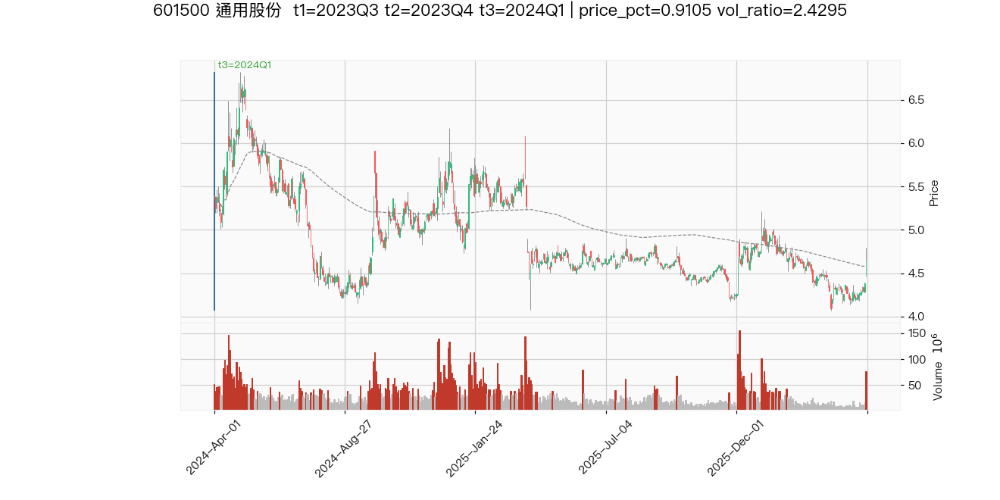

#### 🔍 检测依据 — 601500 通用股份
> 最佳 triple: **2023Q3 → 2023Q4 → 2024Q1** ｜ B 触发: price_pct=0.91 vol_ratio=2.43 ｜ 候选 triple 数: 1

#### 📊 港中结持仓节奏 — 601500 通用股份

| 季度     |   持股量(万股) |   持股市值(亿) |
|:-------|----------:|----------:|
| 2023Q1 |     197.6 |      0.08 |
| 2023Q2 |     520.1 |      0.21 |
| 2023Q3 |    1759   |      0.66 |
| 2023Q4 |    1204.5 |      0.5  |
| 2024Q1 |    1369.2 |      0.69 |
| 2024Q2 |    4306.4 |      2.3  |
| 2024Q3 |    1880.3 |      0.83 |

#### ✍️ 人工复盘 — 601500 通用股份

| 检查项 | 结果 |
|--------|------|
| t2 季度价格在近 250 日高位区间（视觉） | ⬜ |
| t2 季度出现明显放量 bar（红色高量） | ⬜ |
| t3 季度买回后股价未大幅上涨（非卖飞） | ⬜ |
| t1→t2→t3 三段节奏符合「建仓→出货→再建仓」 | ⬜ |

**决策**: ⬜ PASS（纳入关注名单）　⬜ REJECT（假信号）

**备注**: _（人工填写）_

### 002987 京北方 K 线 + 成交量
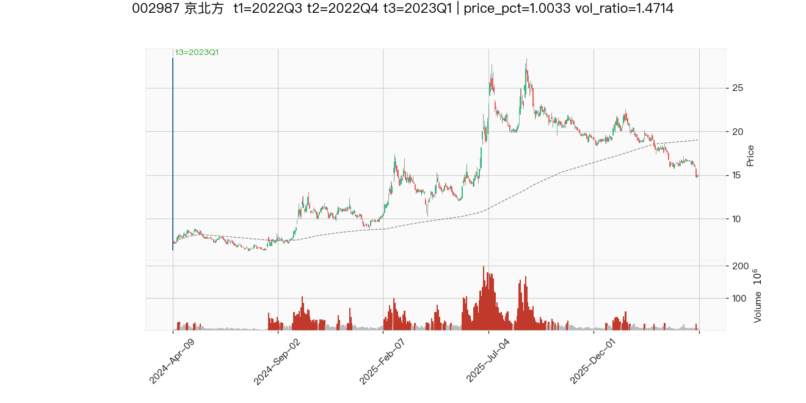

#### 🔍 检测依据 — 002987 京北方
> 最佳 triple: **2022Q3 → 2022Q4 → 2023Q1** ｜ B 触发: price_pct=1.00 vol_ratio=1.47 ｜ 候选 triple 数: 4

#### 📊 港中结持仓节奏 — 002987 京北方

| 季度     |   持股量(万股) |   持股市值(亿) |
|:-------|----------:|----------:|
| 2022Q4 |     204.3 |      0.54 |
| 2023Q1 |     241.9 |      0.81 |
| 2023Q2 |     323.5 |      0.7  |
| 2023Q3 |     247.6 |      0.47 |
| 2023Q4 |     227.5 |      0.42 |
| 2024Q1 |     360.7 |      0.56 |
| 2024Q2 |     311.8 |      0.33 |
| 2024Q3 |     370.1 |      0.34 |

#### ✍️ 人工复盘 — 002987 京北方

| 检查项 | 结果 |
|--------|------|
| t2 季度价格在近 250 日高位区间（视觉） | ⬜ |
| t2 季度出现明显放量 bar（红色高量） | ⬜ |
| t3 季度买回后股价未大幅上涨（非卖飞） | ⬜ |
| t1→t2→t3 三段节奏符合「建仓→出货→再建仓」 | ⬜ |

**决策**: ⬜ PASS（纳入关注名单）　⬜ REJECT（假信号）

**备注**: _（人工填写）_

### 000801 四川九洲 K 线 + 成交量
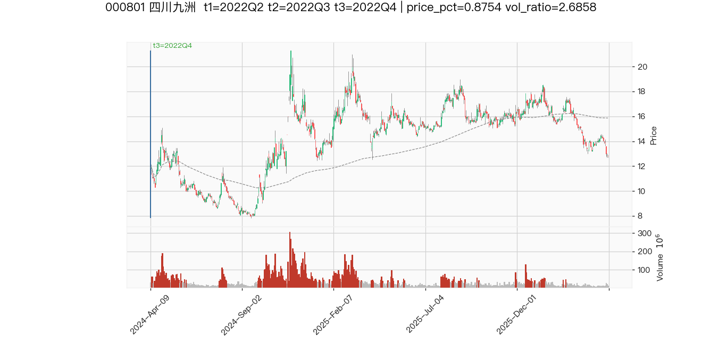

#### 🔍 检测依据 — 000801 四川九洲
> 最佳 triple: **2022Q2 → 2022Q3 → 2022Q4** ｜ B 触发: price_pct=0.88 vol_ratio=2.69 ｜ 候选 triple 数: 3

#### 📊 港中结持仓节奏 — 000801 四川九洲

| 季度     |   持股量(万股) |   持股市值(亿) |
|:-------|----------:|----------:|
| 2022Q4 |     841.6 |      0.55 |
| 2023Q1 |     953.8 |      0.68 |
| 2023Q2 |     821.7 |      0.6  |
| 2023Q3 |     781.7 |      0.62 |
| 2023Q4 |     910.9 |      0.7  |
| 2024Q1 |     625.4 |      0.82 |
| 2024Q2 |     949.3 |      0.95 |
| 2024Q3 |    1091.7 |      1.02 |

#### ✍️ 人工复盘 — 000801 四川九洲

| 检查项 | 结果 |
|--------|------|
| t2 季度价格在近 250 日高位区间（视觉） | ⬜ |
| t2 季度出现明显放量 bar（红色高量） | ⬜ |
| t3 季度买回后股价未大幅上涨（非卖飞） | ⬜ |
| t1→t2→t3 三段节奏符合「建仓→出货→再建仓」 | ⬜ |

**决策**: ⬜ PASS（纳入关注名单）　⬜ REJECT（假信号）

**备注**: _（人工填写）_

### 002303 美盈森 K 线 + 成交量
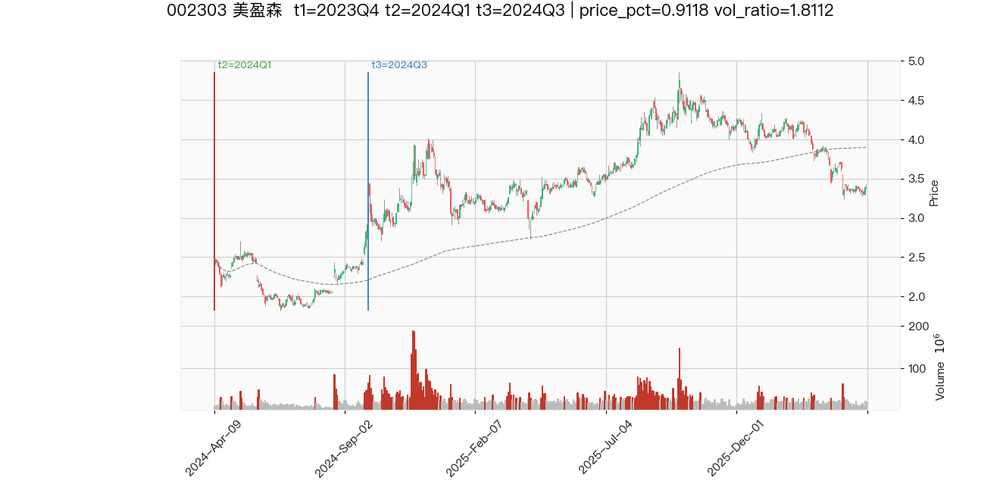

#### 🔍 检测依据 — 002303 美盈森
> 最佳 triple: **2023Q4 → 2024Q1 → 2024Q3** ｜ B 触发: price_pct=0.91 vol_ratio=1.81 ｜ t2 后 60 日收益: 6.2% ｜ 候选 triple 数: 1

#### 📊 港中结持仓节奏 — 002303 美盈森

| 季度     |   持股量(万股) |   持股市值(亿) |
|:-------|----------:|----------:|
| 2022Q4 |     247.4 |      0.09 |
| 2023Q1 |     573.8 |      0.21 |
| 2023Q2 |     583.7 |      0.19 |
| 2023Q3 |     874.9 |      0.31 |
| 2023Q4 |    1945   |      0.68 |
| 2024Q1 |    1381.3 |      0.42 |
| 2024Q2 |    1332.5 |      0.32 |
| 2024Q3 |    1414.4 |      0.36 |

#### ✍️ 人工复盘 — 002303 美盈森

| 检查项 | 结果 |
|--------|------|
| t2 季度价格在近 250 日高位区间（视觉） | ⬜ |
| t2 季度出现明显放量 bar（红色高量） | ⬜ |
| t3 季度买回后股价未大幅上涨（非卖飞） | ⬜ |
| t1→t2→t3 三段节奏符合「建仓→出货→再建仓」 | ⬜ |

**决策**: ⬜ PASS（纳入关注名单）　⬜ REJECT（假信号）

**备注**: _（人工填写）_

### 300708 聚灿光电 K 线 + 成交量
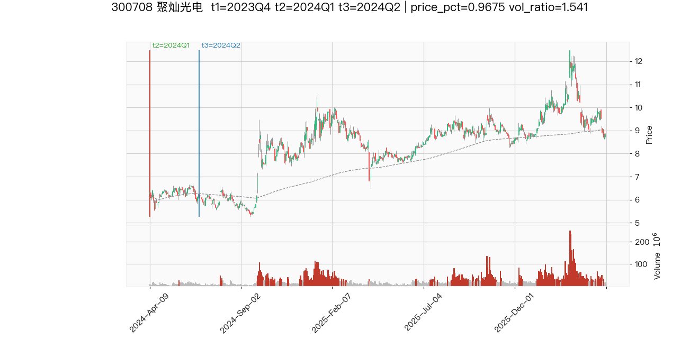

#### 🔍 检测依据 — 300708 聚灿光电
> 最佳 triple: **2023Q4 → 2024Q1 → 2024Q2** ｜ B 触发: price_pct=0.97 vol_ratio=1.54 ｜ 候选 triple 数: 1

#### 📊 港中结持仓节奏 — 300708 聚灿光电

| 季度     |   持股量(万股) |   持股市值(亿) |
|:-------|----------:|----------:|
| 2022Q4 |      14.8 |      0.01 |
| 2023Q1 |     166.2 |      0.18 |
| 2023Q2 |     192   |      0.19 |
| 2023Q3 |    1018.6 |      1.08 |
| 2023Q4 |    1081.3 |      1.22 |
| 2024Q1 |     171.6 |      0.15 |
| 2024Q2 |     395.3 |      0.36 |
| 2024Q3 |     416.8 |      0.38 |

#### ✍️ 人工复盘 — 300708 聚灿光电

| 检查项 | 结果 |
|--------|------|
| t2 季度价格在近 250 日高位区间（视觉） | ⬜ |
| t2 季度出现明显放量 bar（红色高量） | ⬜ |
| t3 季度买回后股价未大幅上涨（非卖飞） | ⬜ |
| t1→t2→t3 三段节奏符合「建仓→出货→再建仓」 | ⬜ |

**决策**: ⬜ PASS（纳入关注名单）　⬜ REJECT（假信号）

**备注**: _（人工填写）_

### 002698 博实股份 K 线 + 成交量
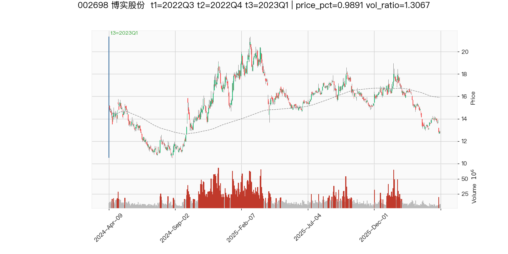

#### 🔍 检测依据 — 002698 博实股份
> 最佳 triple: **2022Q3 → 2022Q4 → 2023Q1** ｜ B 触发: price_pct=0.99 vol_ratio=1.31 ｜ 候选 triple 数: 4

#### 📊 港中结持仓节奏 — 002698 博实股份

| 季度     |   持股量(万股) |   持股市值(亿) |
|:-------|----------:|----------:|
| 2022Q4 |     734.3 |      1.03 |
| 2023Q1 |    1456.6 |      2.38 |
| 2023Q2 |    2234.9 |      4    |
| 2023Q3 |     815.8 |      1.31 |
| 2023Q4 |     739.9 |      1.12 |
| 2024Q1 |     587.5 |      0.98 |
| 2024Q2 |     954.4 |      1.17 |
| 2024Q3 |     662.7 |      0.79 |

#### ✍️ 人工复盘 — 002698 博实股份

| 检查项 | 结果 |
|--------|------|
| t2 季度价格在近 250 日高位区间（视觉） | ⬜ |
| t2 季度出现明显放量 bar（红色高量） | ⬜ |
| t3 季度买回后股价未大幅上涨（非卖飞） | ⬜ |
| t1→t2→t3 三段节奏符合「建仓→出货→再建仓」 | ⬜ |

**决策**: ⬜ PASS（纳入关注名单）　⬜ REJECT（假信号）

**备注**: _（人工填写）_

### 002375 亚厦股份 K 线 + 成交量
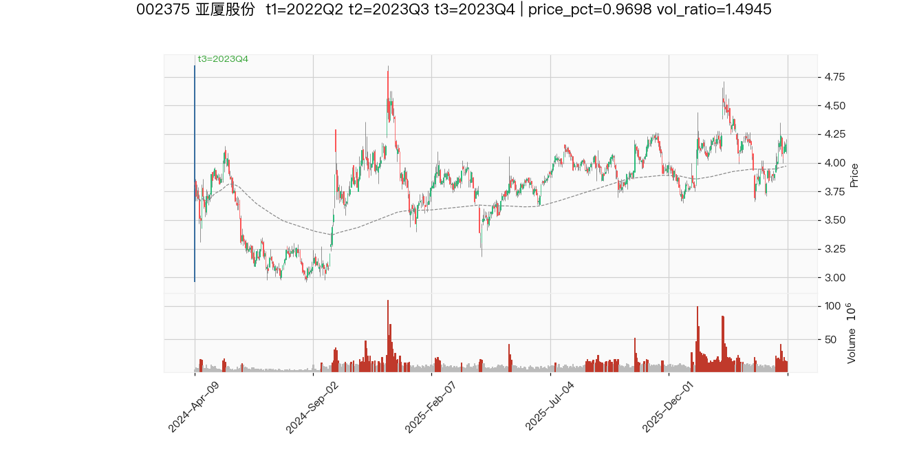

#### 🔍 检测依据 — 002375 亚厦股份
> 最佳 triple: **2022Q2 → 2023Q3 → 2023Q4** ｜ B 触发: price_pct=0.97 vol_ratio=1.49 ｜ 候选 triple 数: 3

#### 📊 港中结持仓节奏 — 002375 亚厦股份

| 季度     |   持股量(万股) |   持股市值(亿) |
|:-------|----------:|----------:|
| 2022Q4 |    1252.5 |      0.55 |
| 2023Q1 |    1299.4 |      0.63 |
| 2023Q2 |    1226.3 |      0.57 |
| 2023Q3 |    1026.7 |      0.55 |
| 2023Q4 |    1318.5 |      0.6  |
| 2024Q1 |    1303.7 |      0.5  |
| 2024Q2 |    1828.4 |      0.59 |
| 2024Q3 |    2006.9 |      0.64 |

#### ✍️ 人工复盘 — 002375 亚厦股份

| 检查项 | 结果 |
|--------|------|
| t2 季度价格在近 250 日高位区间（视觉） | ⬜ |
| t2 季度出现明显放量 bar（红色高量） | ⬜ |
| t3 季度买回后股价未大幅上涨（非卖飞） | ⬜ |
| t1→t2→t3 三段节奏符合「建仓→出货→再建仓」 | ⬜ |

**决策**: ⬜ PASS（纳入关注名单）　⬜ REJECT（假信号）

**备注**: _（人工填写）_

### 002400 省广集团 K 线 + 成交量
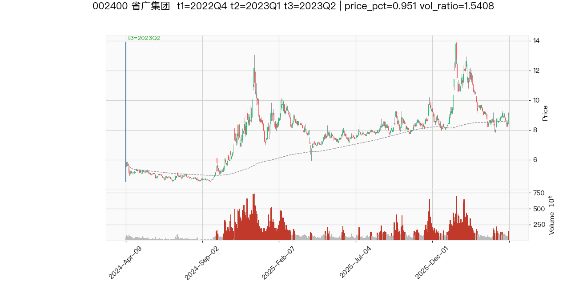

#### 🔍 检测依据 — 002400 省广集团
> 最佳 triple: **2022Q4 → 2023Q1 → 2023Q2** ｜ B 触发: price_pct=0.95 vol_ratio=1.54 ｜ 候选 triple 数: 2

#### 📊 港中结持仓节奏 — 002400 省广集团

| 季度     |   持股量(万股) |   持股市值(亿) |
|:-------|----------:|----------:|
| 2022Q4 |    1782.7 |      0.76 |
| 2023Q1 |    1616.3 |      0.94 |
| 2023Q2 |    1963.6 |      0.94 |
| 2023Q3 |     781.3 |      0.42 |
| 2023Q4 |    1531.3 |      0.85 |
| 2024Q1 |     892   |      0.52 |
| 2024Q2 |     892.4 |      0.43 |
| 2024Q3 |     895.7 |      0.43 |

#### ✍️ 人工复盘 — 002400 省广集团

| 检查项 | 结果 |
|--------|------|
| t2 季度价格在近 250 日高位区间（视觉） | ⬜ |
| t2 季度出现明显放量 bar（红色高量） | ⬜ |
| t3 季度买回后股价未大幅上涨（非卖飞） | ⬜ |
| t1→t2→t3 三段节奏符合「建仓→出货→再建仓」 | ⬜ |

**决策**: ⬜ PASS（纳入关注名单）　⬜ REJECT（假信号）

**备注**: _（人工填写）_

### 688595 芯海科技 K 线 + 成交量
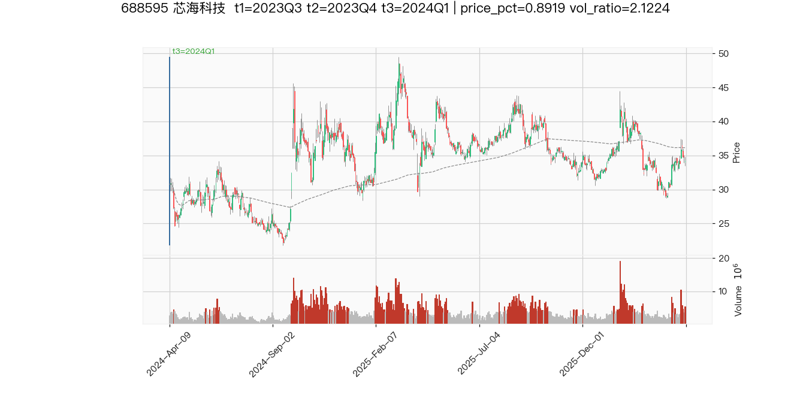

#### 🔍 检测依据 — 688595 芯海科技
> 最佳 triple: **2023Q3 → 2023Q4 → 2024Q1** ｜ B 触发: price_pct=0.89 vol_ratio=2.12 ｜ 候选 triple 数: 1

#### 📊 港中结持仓节奏 — 688595 芯海科技

| 季度     |   持股量(万股) |   持股市值(亿) |
|:-------|----------:|----------:|
| 2023Q1 |      40.5 |      0.19 |
| 2023Q2 |     105.7 |      0.33 |
| 2023Q3 |     161.7 |      0.47 |
| 2023Q4 |      76.1 |      0.33 |
| 2024Q1 |      82.3 |      0.25 |
| 2024Q2 |     205.6 |      0.62 |
| 2024Q3 |     146.3 |      0.37 |

#### ✍️ 人工复盘 — 688595 芯海科技

| 检查项 | 结果 |
|--------|------|
| t2 季度价格在近 250 日高位区间（视觉） | ⬜ |
| t2 季度出现明显放量 bar（红色高量） | ⬜ |
| t3 季度买回后股价未大幅上涨（非卖飞） | ⬜ |
| t1→t2→t3 三段节奏符合「建仓→出货→再建仓」 | ⬜ |

**决策**: ⬜ PASS（纳入关注名单）　⬜ REJECT（假信号）

**备注**: _（人工填写）_

### 002016 世荣兆业 K 线 + 成交量
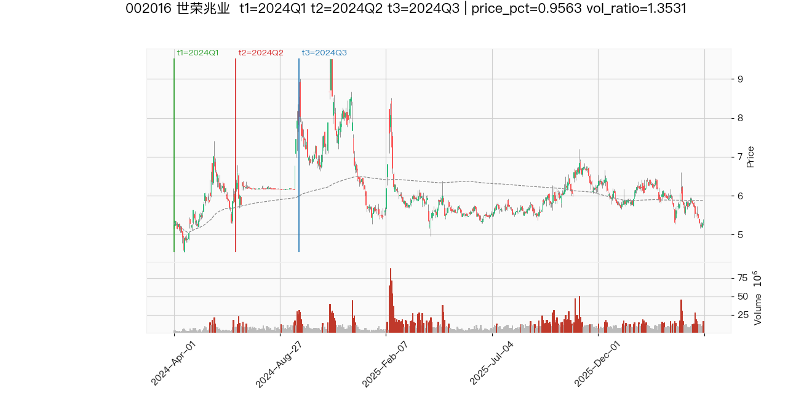

#### 🔍 检测依据 — 002016 世荣兆业
> 最佳 triple: **2024Q1 → 2024Q2 → 2024Q3** ｜ B 触发: price_pct=0.96 vol_ratio=1.35 ｜ 候选 triple 数: 1

#### 📊 港中结持仓节奏 — 002016 世荣兆业

| 季度     |   持股量(万股) |   持股市值(亿) |
|:-------|----------:|----------:|
| 2022Q4 |      78.3 |      0.05 |
| 2023Q1 |      78.3 |      0.05 |
| 2023Q2 |     134.9 |      0.09 |
| 2023Q3 |     292.8 |      0.19 |
| 2023Q4 |     433.2 |      0.27 |
| 2024Q1 |     491.4 |      0.25 |
| 2024Q2 |     351.1 |      0.22 |
| 2024Q3 |     885.9 |      0.55 |

#### ✍️ 人工复盘 — 002016 世荣兆业

| 检查项 | 结果 |
|--------|------|
| t2 季度价格在近 250 日高位区间（视觉） | ⬜ |
| t2 季度出现明显放量 bar（红色高量） | ⬜ |
| t3 季度买回后股价未大幅上涨（非卖飞） | ⬜ |
| t1→t2→t3 三段节奏符合「建仓→出货→再建仓」 | ⬜ |

**决策**: ⬜ PASS（纳入关注名单）　⬜ REJECT（假信号）

**备注**: _（人工填写）_

### 002055 ST得润 K 线 + 成交量
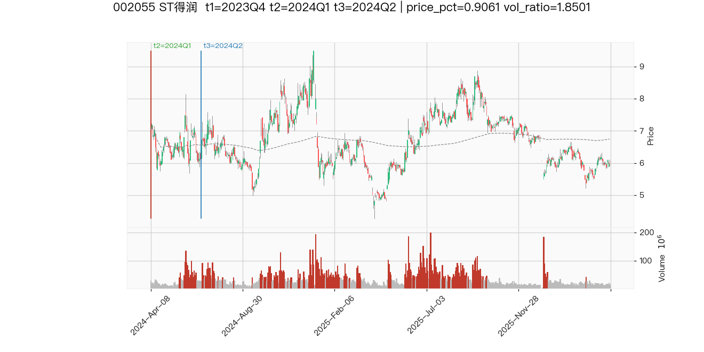

#### 🔍 检测依据 — 002055 ST得润
> 最佳 triple: **2023Q4 → 2024Q1 → 2024Q2** ｜ B 触发: price_pct=0.91 vol_ratio=1.85 ｜ 候选 triple 数: 1

#### 📊 港中结持仓节奏 — 002055 ST得润

| 季度     |   持股量(万股) |   持股市值(亿) |
|:-------|----------:|----------:|
| 2023Q1 |    2050.2 |      1.99 |
| 2023Q2 |     672.2 |      0.63 |
| 2023Q3 |     840.3 |      0.78 |
| 2023Q4 |     948.9 |      0.93 |
| 2024Q1 |     360.3 |      0.3  |
| 2024Q2 |     664.1 |      0.45 |
| 2024Q3 |     505   |      0.33 |

#### ✍️ 人工复盘 — 002055 ST得润

| 检查项 | 结果 |
|--------|------|
| t2 季度价格在近 250 日高位区间（视觉） | ⬜ |
| t2 季度出现明显放量 bar（红色高量） | ⬜ |
| t3 季度买回后股价未大幅上涨（非卖飞） | ⬜ |
| t1→t2→t3 三段节奏符合「建仓→出货→再建仓」 | ⬜ |

**决策**: ⬜ PASS（纳入关注名单）　⬜ REJECT（假信号）

**备注**: _（人工填写）_

### 601222 林洋能源 K 线 + 成交量
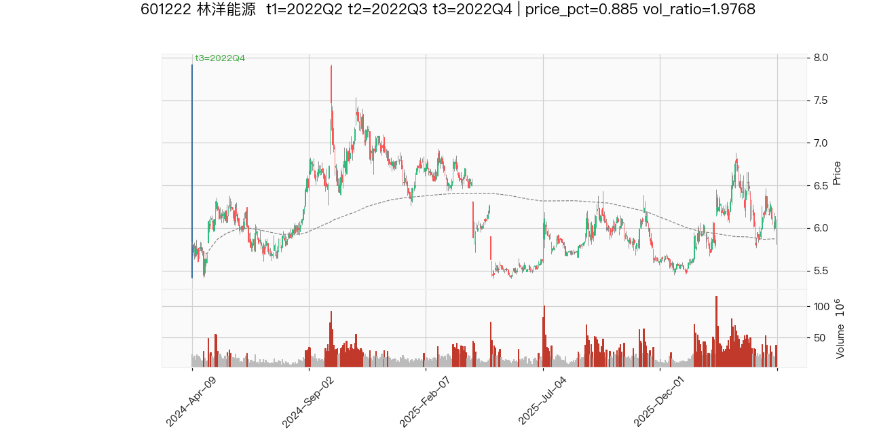

#### 🔍 检测依据 — 601222 林洋能源
> 最佳 triple: **2022Q2 → 2022Q3 → 2022Q4** ｜ B 触发: price_pct=0.89 vol_ratio=1.98 ｜ 候选 triple 数: 3

#### 📊 港中结持仓节奏 — 601222 林洋能源

| 季度     |   持股量(万股) |   持股市值(亿) |
|:-------|----------:|----------:|
| 2022Q4 |    3510.8 |      3.02 |
| 2023Q1 |    2100.6 |      1.66 |
| 2023Q2 |    4649.7 |      3.78 |
| 2023Q3 |    3107   |      2.22 |
| 2023Q4 |    2003.8 |      1.28 |
| 2024Q1 |    2615   |      1.66 |
| 2024Q2 |    2786.9 |      1.75 |
| 2024Q3 |    2434.3 |      1.53 |

#### ✍️ 人工复盘 — 601222 林洋能源

| 检查项 | 结果 |
|--------|------|
| t2 季度价格在近 250 日高位区间（视觉） | ⬜ |
| t2 季度出现明显放量 bar（红色高量） | ⬜ |
| t3 季度买回后股价未大幅上涨（非卖飞） | ⬜ |
| t1→t2→t3 三段节奏符合「建仓→出货→再建仓」 | ⬜ |

**决策**: ⬜ PASS（纳入关注名单）　⬜ REJECT（假信号）

**备注**: _（人工填写）_

### 000785 居然智家 K 线 + 成交量
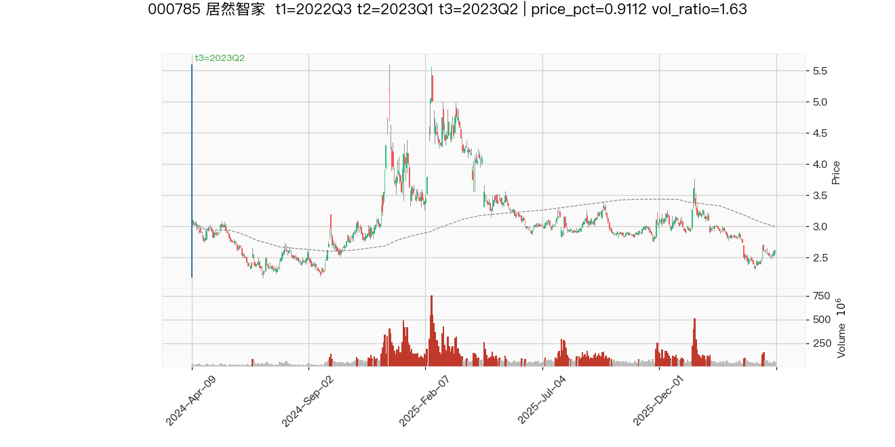

#### 🔍 检测依据 — 000785 居然智家
> 最佳 triple: **2022Q3 → 2023Q1 → 2023Q2** ｜ B 触发: price_pct=0.91 vol_ratio=1.63 ｜ 候选 triple 数: 2

#### 📊 港中结持仓节奏 — 000785 居然智家

| 季度     |   持股量(万股) |   持股市值(亿) |
|:-------|----------:|----------:|
| 2022Q4 |    2942   |      1.2  |
| 2023Q1 |    2228.7 |      1.03 |
| 2023Q2 |    2679.7 |      1.02 |
| 2023Q3 |    2338.7 |      0.86 |
| 2023Q4 |    2441.5 |      0.81 |
| 2024Q1 |    2505.6 |      0.71 |
| 2024Q2 |    2594.2 |      0.63 |
| 2024Q3 |    3830.5 |      0.95 |

#### ✍️ 人工复盘 — 000785 居然智家

| 检查项 | 结果 |
|--------|------|
| t2 季度价格在近 250 日高位区间（视觉） | ⬜ |
| t2 季度出现明显放量 bar（红色高量） | ⬜ |
| t3 季度买回后股价未大幅上涨（非卖飞） | ⬜ |
| t1→t2→t3 三段节奏符合「建仓→出货→再建仓」 | ⬜ |

**决策**: ⬜ PASS（纳入关注名单）　⬜ REJECT（假信号）

**备注**: _（人工填写）_

### 600198 大唐电信 K 线 + 成交量
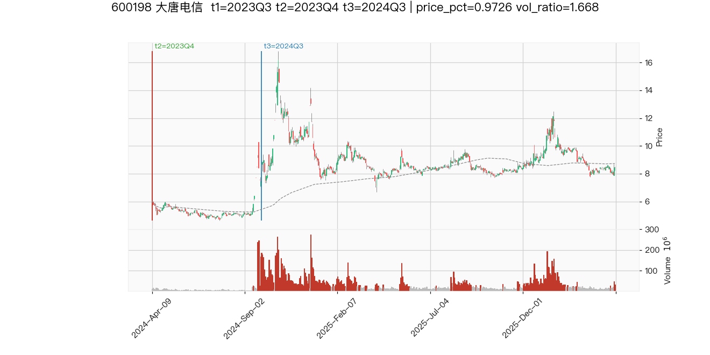

#### 🔍 检测依据 — 600198 大唐电信
> 最佳 triple: **2023Q3 → 2023Q4 → 2024Q3** ｜ B 触发: price_pct=0.97 vol_ratio=1.67 ｜ t2 后 60 日收益: 9.7% ｜ 候选 triple 数: 2

#### 📊 港中结持仓节奏 — 600198 大唐电信

| 季度     |   持股量(万股) |   持股市值(亿) |
|:-------|----------:|----------:|
| 2023Q1 |     225.9 |      0.17 |
| 2023Q2 |     771.5 |      0.52 |
| 2023Q3 |     907.7 |      0.63 |
| 2023Q4 |     579.7 |      0.38 |
| 2024Q1 |     101.9 |      0.07 |
| 2024Q2 |     233.6 |      0.12 |
| 2024Q3 |     590.7 |      0.3  |

#### ✍️ 人工复盘 — 600198 大唐电信

| 检查项 | 结果 |
|--------|------|
| t2 季度价格在近 250 日高位区间（视觉） | ⬜ |
| t2 季度出现明显放量 bar（红色高量） | ⬜ |
| t3 季度买回后股价未大幅上涨（非卖飞） | ⬜ |
| t1→t2→t3 三段节奏符合「建仓→出货→再建仓」 | ⬜ |

**决策**: ⬜ PASS（纳入关注名单）　⬜ REJECT（假信号）

**备注**: _（人工填写）_

### 600635 大众公用 K 线 + 成交量
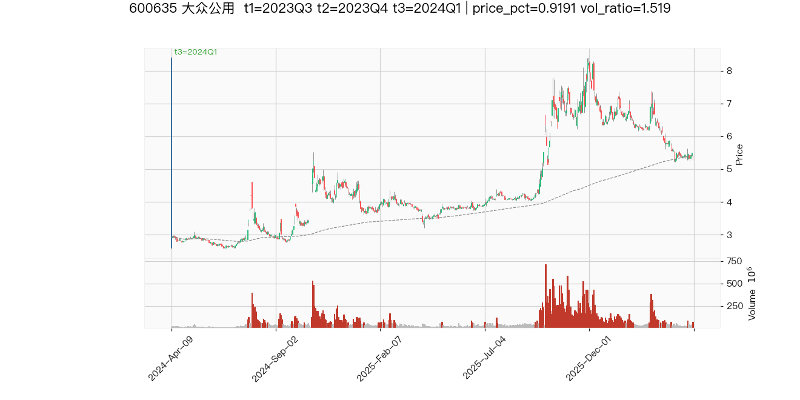

#### 🔍 检测依据 — 600635 大众公用
> 最佳 triple: **2023Q3 → 2023Q4 → 2024Q1** ｜ B 触发: price_pct=0.92 vol_ratio=1.52 ｜ 候选 triple 数: 3

#### 📊 港中结持仓节奏 — 600635 大众公用

| 季度     |   持股量(万股) |   持股市值(亿) |
|:-------|----------:|----------:|
| 2022Q4 |    1227.1 |      0.36 |
| 2023Q1 |    1497.3 |      0.45 |
| 2023Q2 |    3627.9 |      1.2  |
| 2023Q3 |    3985.5 |      1.3  |
| 2023Q4 |     978.2 |      0.3  |
| 2024Q1 |    1199.3 |      0.34 |
| 2024Q2 |    1047.2 |      0.28 |
| 2024Q3 |    1627.7 |      0.51 |

#### ✍️ 人工复盘 — 600635 大众公用

| 检查项 | 结果 |
|--------|------|
| t2 季度价格在近 250 日高位区间（视觉） | ⬜ |
| t2 季度出现明显放量 bar（红色高量） | ⬜ |
| t3 季度买回后股价未大幅上涨（非卖飞） | ⬜ |
| t1→t2→t3 三段节奏符合「建仓→出货→再建仓」 | ⬜ |

**决策**: ⬜ PASS（纳入关注名单）　⬜ REJECT（假信号）

**备注**: _（人工填写）_

### 600252 中恒集团 K 线 + 成交量
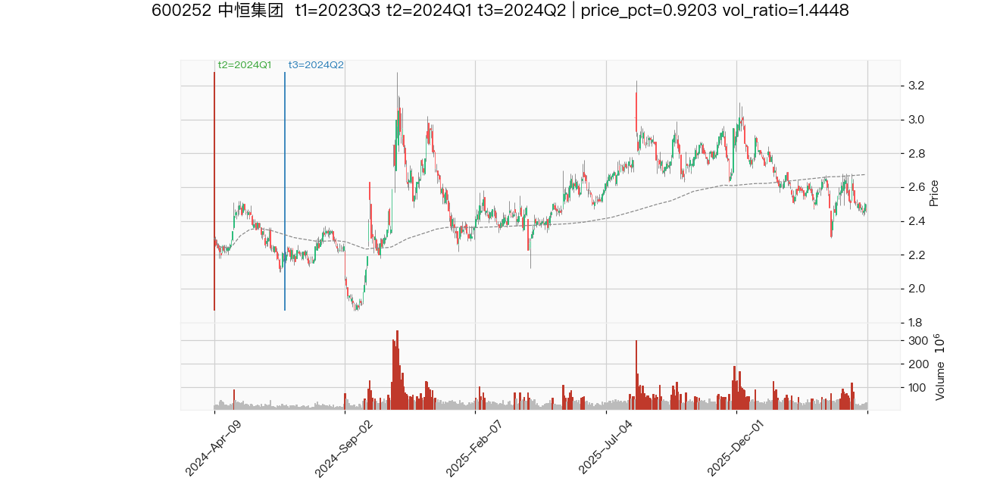

#### 🔍 检测依据 — 600252 中恒集团
> 最佳 triple: **2023Q3 → 2024Q1 → 2024Q2** ｜ B 触发: price_pct=0.92 vol_ratio=1.44 ｜ 候选 triple 数: 2

#### 📊 港中结持仓节奏 — 600252 中恒集团

| 季度     |   持股量(万股) |   持股市值(亿) |
|:-------|----------:|----------:|
| 2022Q4 |     787   |      0.21 |
| 2023Q1 |    1295.3 |      0.35 |
| 2023Q2 |     894.7 |      0.22 |
| 2023Q3 |    3635.1 |      0.98 |
| 2023Q4 |    3656.6 |      0.92 |
| 2024Q1 |    2746.9 |      0.63 |
| 2024Q2 |    2938.5 |      0.64 |
| 2024Q3 |    3838.6 |      0.89 |

#### ✍️ 人工复盘 — 600252 中恒集团

| 检查项 | 结果 |
|--------|------|
| t2 季度价格在近 250 日高位区间（视觉） | ⬜ |
| t2 季度出现明显放量 bar（红色高量） | ⬜ |
| t3 季度买回后股价未大幅上涨（非卖飞） | ⬜ |
| t1→t2→t3 三段节奏符合「建仓→出货→再建仓」 | ⬜ |

**决策**: ⬜ PASS（纳入关注名单）　⬜ REJECT（假信号）

**备注**: _（人工填写）_

### 301389 隆扬电子 K 线 + 成交量
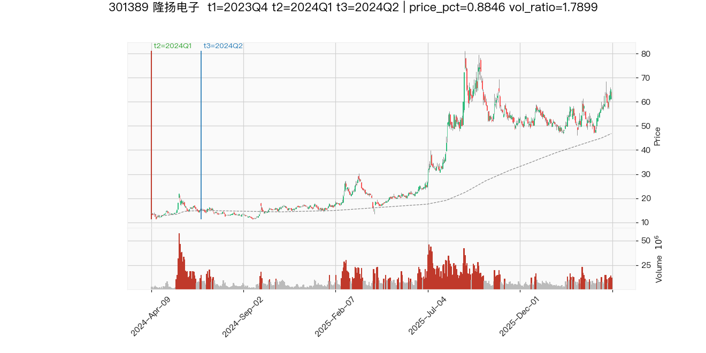

#### 🔍 检测依据 — 301389 隆扬电子
> 最佳 triple: **2023Q4 → 2024Q1 → 2024Q2** ｜ B 触发: price_pct=0.88 vol_ratio=1.79 ｜ 候选 triple 数: 1

#### 📊 港中结持仓节奏 — 301389 隆扬电子

| 季度     |   持股量(万股) |   持股市值(亿) |
|:-------|----------:|----------:|
| 2023Q1 |      10.7 |      0.02 |
| 2023Q2 |      66.7 |      0.12 |
| 2023Q3 |     103.6 |      0.18 |
| 2023Q4 |     246.5 |      0.47 |
| 2024Q1 |      36.9 |      0.05 |
| 2024Q2 |     368.5 |      0.58 |
| 2024Q3 |     254.8 |      0.36 |

#### ✍️ 人工复盘 — 301389 隆扬电子

| 检查项 | 结果 |
|--------|------|
| t2 季度价格在近 250 日高位区间（视觉） | ⬜ |
| t2 季度出现明显放量 bar（红色高量） | ⬜ |
| t3 季度买回后股价未大幅上涨（非卖飞） | ⬜ |
| t1→t2→t3 三段节奏符合「建仓→出货→再建仓」 | ⬜ |

**决策**: ⬜ PASS（纳入关注名单）　⬜ REJECT（假信号）

**备注**: _（人工填写）_

### 600810 神马股份 K 线 + 成交量
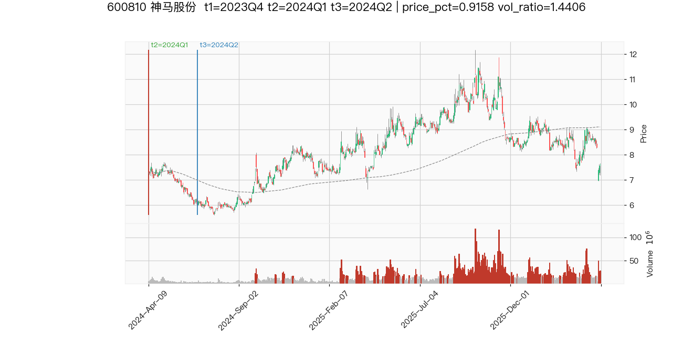

#### 🔍 检测依据 — 600810 神马股份
> 最佳 triple: **2023Q4 → 2024Q1 → 2024Q2** ｜ B 触发: price_pct=0.92 vol_ratio=1.44 ｜ 候选 triple 数: 1

#### 📊 港中结持仓节奏 — 600810 神马股份

| 季度     |   持股量(万股) |   持股市值(亿) |
|:-------|----------:|----------:|
| 2023Q1 |     124.9 |      0.1  |
| 2023Q2 |      38.8 |      0.03 |
| 2023Q3 |     469.6 |      0.35 |
| 2023Q4 |     811.8 |      0.6  |
| 2024Q1 |     496.5 |      0.34 |
| 2024Q2 |     664.7 |      0.41 |
| 2024Q3 |     566.3 |      0.34 |

#### ✍️ 人工复盘 — 600810 神马股份

| 检查项 | 结果 |
|--------|------|
| t2 季度价格在近 250 日高位区间（视觉） | ⬜ |
| t2 季度出现明显放量 bar（红色高量） | ⬜ |
| t3 季度买回后股价未大幅上涨（非卖飞） | ⬜ |
| t1→t2→t3 三段节奏符合「建仓→出货→再建仓」 | ⬜ |

**决策**: ⬜ PASS（纳入关注名单）　⬜ REJECT（假信号）

**备注**: _（人工填写）_

### 002547 春兴精工 K 线 + 成交量
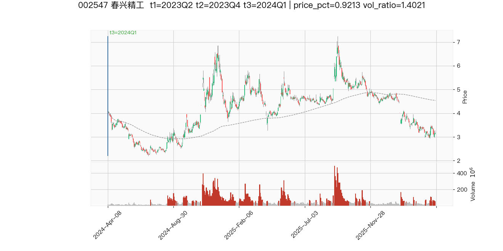

#### 🔍 检测依据 — 002547 春兴精工
> 最佳 triple: **2023Q2 → 2023Q4 → 2024Q1** ｜ B 触发: price_pct=0.92 vol_ratio=1.40 ｜ 候选 triple 数: 1

#### 📊 港中结持仓节奏 — 002547 春兴精工

| 季度     |   持股量(万股) |   持股市值(亿) |
|:-------|----------:|----------:|
| 2023Q1 |     313   |      0.16 |
| 2023Q2 |     618.7 |      0.3  |
| 2023Q3 |     611   |      0.31 |
| 2023Q4 |     407.3 |      0.19 |
| 2024Q1 |     701.8 |      0.29 |
| 2024Q2 |    1150.2 |      0.28 |
| 2024Q3 |    1331.1 |      0.37 |

#### ✍️ 人工复盘 — 002547 春兴精工

| 检查项 | 结果 |
|--------|------|
| t2 季度价格在近 250 日高位区间（视觉） | ⬜ |
| t2 季度出现明显放量 bar（红色高量） | ⬜ |
| t3 季度买回后股价未大幅上涨（非卖飞） | ⬜ |
| t1→t2→t3 三段节奏符合「建仓→出货→再建仓」 | ⬜ |

**决策**: ⬜ PASS（纳入关注名单）　⬜ REJECT（假信号）

**备注**: _（人工填写）_

### 000881 中广核技 K 线 + 成交量
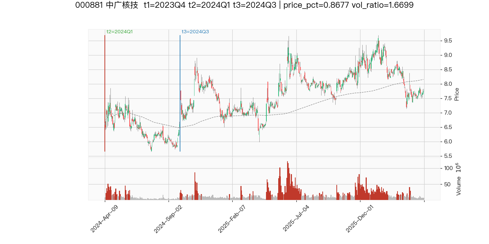

#### 🔍 检测依据 — 000881 中广核技
> 最佳 triple: **2023Q4 → 2024Q1 → 2024Q3** ｜ B 触发: price_pct=0.87 vol_ratio=1.67 ｜ t2 后 60 日收益: 6.8% ｜ 候选 triple 数: 2

#### 📊 港中结持仓节奏 — 000881 中广核技

| 季度     |   持股量(万股) |   持股市值(亿) |
|:-------|----------:|----------:|
| 2023Q1 |     611.3 |      0.49 |
| 2023Q2 |     581.9 |      0.48 |
| 2023Q3 |     645.8 |      0.51 |
| 2023Q4 |     944.4 |      0.68 |
| 2024Q1 |     584.6 |      0.39 |
| 2024Q2 |     533.2 |      0.34 |
| 2024Q3 |     656   |      0.41 |

#### ✍️ 人工复盘 — 000881 中广核技

| 检查项 | 结果 |
|--------|------|
| t2 季度价格在近 250 日高位区间（视觉） | ⬜ |
| t2 季度出现明显放量 bar（红色高量） | ⬜ |
| t3 季度买回后股价未大幅上涨（非卖飞） | ⬜ |
| t1→t2→t3 三段节奏符合「建仓→出货→再建仓」 | ⬜ |

**决策**: ⬜ PASS（纳入关注名单）　⬜ REJECT（假信号）

**备注**: _（人工填写）_

### 603533 掌阅科技 K 线 + 成交量
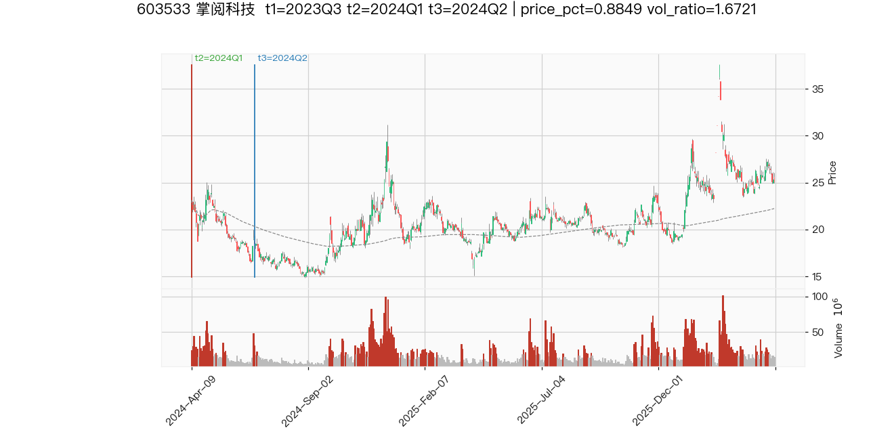

#### 🔍 检测依据 — 603533 掌阅科技
> 最佳 triple: **2023Q3 → 2024Q1 → 2024Q2** ｜ B 触发: price_pct=0.88 vol_ratio=1.67 ｜ 候选 triple 数: 2

#### 📊 港中结持仓节奏 — 603533 掌阅科技

| 季度     |   持股量(万股) |   持股市值(亿) |
|:-------|----------:|----------:|
| 2022Q4 |     121.2 |      0.18 |
| 2023Q1 |     244.1 |      0.61 |
| 2023Q2 |     698.3 |      2    |
| 2023Q3 |    1372.8 |      2.8  |
| 2023Q4 |     411.3 |      0.82 |
| 2024Q1 |     271.2 |      0.8  |
| 2024Q2 |     420.7 |      0.79 |
| 2024Q3 |     414.7 |      0.69 |

#### ✍️ 人工复盘 — 603533 掌阅科技

| 检查项 | 结果 |
|--------|------|
| t2 季度价格在近 250 日高位区间（视觉） | ⬜ |
| t2 季度出现明显放量 bar（红色高量） | ⬜ |
| t3 季度买回后股价未大幅上涨（非卖飞） | ⬜ |
| t1→t2→t3 三段节奏符合「建仓→出货→再建仓」 | ⬜ |

**决策**: ⬜ PASS（纳入关注名单）　⬜ REJECT（假信号）

**备注**: _（人工填写）_

### 603025 大豪科技 K 线 + 成交量
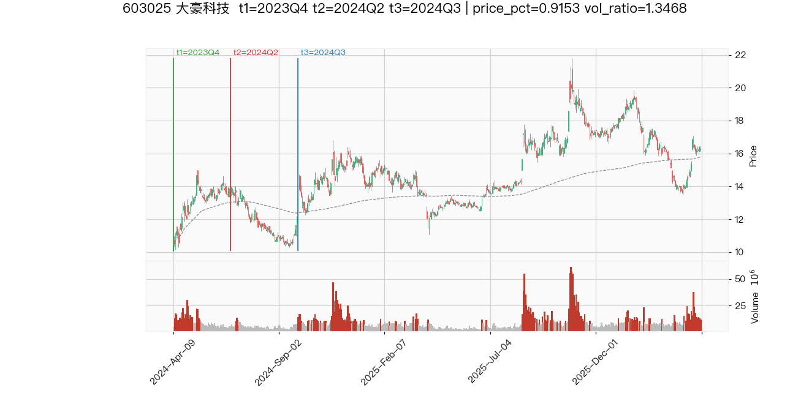

#### 🔍 检测依据 — 603025 大豪科技
> 最佳 triple: **2023Q4 → 2024Q2 → 2024Q3** ｜ B 触发: price_pct=0.92 vol_ratio=1.35 ｜ 候选 triple 数: 1

#### 📊 港中结持仓节奏 — 603025 大豪科技

| 季度     |   持股量(万股) |   持股市值(亿) |
|:-------|----------:|----------:|
| 2022Q4 |     195.5 |      0.37 |
| 2023Q1 |     186.4 |      0.3  |
| 2023Q2 |     260.3 |      0.32 |
| 2023Q3 |     344.1 |      0.44 |
| 2023Q4 |     450.2 |      0.6  |
| 2024Q1 |     460.3 |      0.48 |
| 2024Q2 |     348.3 |      0.48 |
| 2024Q3 |     572.6 |      0.67 |

#### ✍️ 人工复盘 — 603025 大豪科技

| 检查项 | 结果 |
|--------|------|
| t2 季度价格在近 250 日高位区间（视觉） | ⬜ |
| t2 季度出现明显放量 bar（红色高量） | ⬜ |
| t3 季度买回后股价未大幅上涨（非卖飞） | ⬜ |
| t1→t2→t3 三段节奏符合「建仓→出货→再建仓」 | ⬜ |

**决策**: ⬜ PASS（纳入关注名单）　⬜ REJECT（假信号）

**备注**: _（人工填写）_

### 002079 苏州固锝 K 线 + 成交量
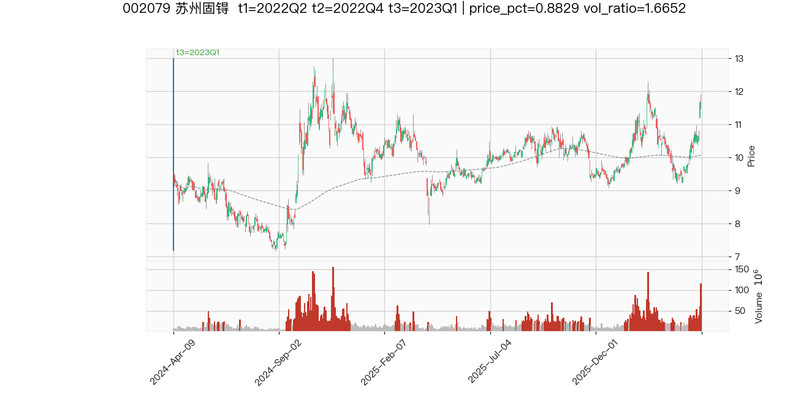

#### 🔍 检测依据 — 002079 苏州固锝
> 最佳 triple: **2022Q2 → 2022Q4 → 2023Q1** ｜ B 触发: price_pct=0.88 vol_ratio=1.67 ｜ 候选 triple 数: 4

#### 📊 港中结持仓节奏 — 002079 苏州固锝

| 季度     |   持股量(万股) |   持股市值(亿) |
|:-------|----------:|----------:|
| 2022Q4 |     598.9 |      0.8  |
| 2023Q1 |     997.8 |      1.57 |
| 2023Q2 |     823.6 |      1.2  |
| 2023Q3 |     605.2 |      0.71 |
| 2023Q4 |     928.8 |      1.05 |
| 2024Q1 |    1048   |      0.98 |
| 2024Q2 |     580.8 |      0.49 |
| 2024Q3 |     666.1 |      0.52 |

#### ✍️ 人工复盘 — 002079 苏州固锝

| 检查项 | 结果 |
|--------|------|
| t2 季度价格在近 250 日高位区间（视觉） | ⬜ |
| t2 季度出现明显放量 bar（红色高量） | ⬜ |
| t3 季度买回后股价未大幅上涨（非卖飞） | ⬜ |
| t1→t2→t3 三段节奏符合「建仓→出货→再建仓」 | ⬜ |

**决策**: ⬜ PASS（纳入关注名单）　⬜ REJECT（假信号）

**备注**: _（人工填写）_

### 002913 奥士康 K 线 + 成交量
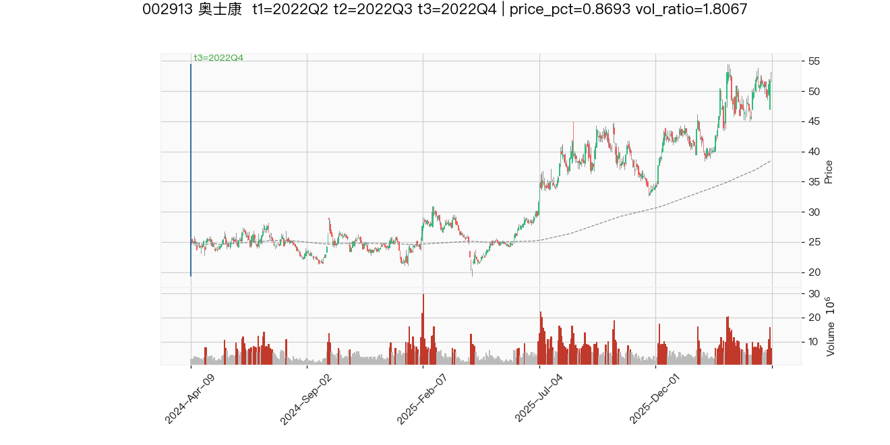

#### 🔍 检测依据 — 002913 奥士康
> 最佳 triple: **2022Q2 → 2022Q3 → 2022Q4** ｜ B 触发: price_pct=0.87 vol_ratio=1.81 ｜ 候选 triple 数: 2

#### 📊 港中结持仓节奏 — 002913 奥士康

| 季度     |   持股量(万股) |   持股市值(亿) |
|:-------|----------:|----------:|
| 2022Q4 |      76.5 |      0.19 |
| 2023Q1 |     129.9 |      0.45 |
| 2023Q2 |     220.8 |      0.82 |
| 2023Q3 |     349   |      1.12 |
| 2023Q4 |     305.5 |      0.94 |
| 2024Q1 |     249.7 |      0.69 |
| 2024Q2 |     294.9 |      0.79 |
| 2024Q3 |     184.7 |      0.46 |

#### ✍️ 人工复盘 — 002913 奥士康

| 检查项 | 结果 |
|--------|------|
| t2 季度价格在近 250 日高位区间（视觉） | ⬜ |
| t2 季度出现明显放量 bar（红色高量） | ⬜ |
| t3 季度买回后股价未大幅上涨（非卖飞） | ⬜ |
| t1→t2→t3 三段节奏符合「建仓→出货→再建仓」 | ⬜ |

**决策**: ⬜ PASS（纳入关注名单）　⬜ REJECT（假信号）

**备注**: _（人工填写）_

### 000957 中通客车 K 线 + 成交量
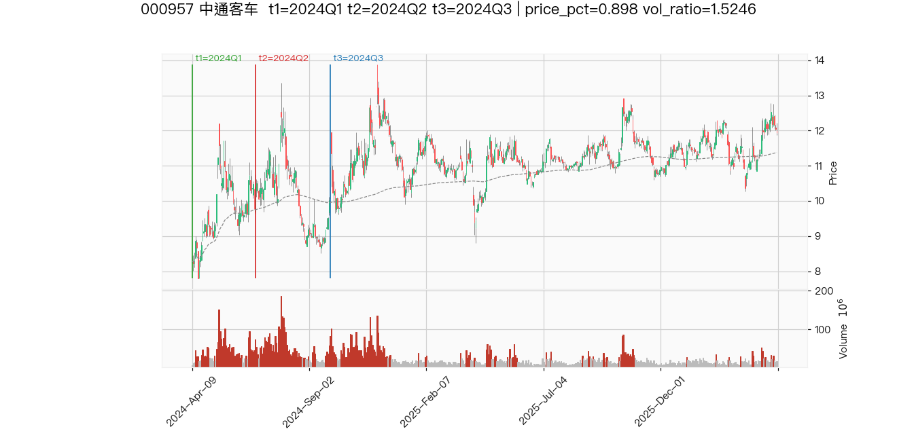

#### 🔍 检测依据 — 000957 中通客车
> 最佳 triple: **2024Q1 → 2024Q2 → 2024Q3** ｜ B 触发: price_pct=0.90 vol_ratio=1.52 ｜ 候选 triple 数: 2

#### 📊 港中结持仓节奏 — 000957 中通客车

| 季度     |   持股量(万股) |   持股市值(亿) |
|:-------|----------:|----------:|
| 2022Q4 |      58.3 |      0.07 |
| 2023Q1 |     825.7 |      0.9  |
| 2023Q2 |     686.2 |      0.71 |
| 2023Q3 |     248.4 |      0.24 |
| 2023Q4 |     333.2 |      0.3  |
| 2024Q1 |     663   |      0.55 |
| 2024Q2 |     382.9 |      0.4  |
| 2024Q3 |     638   |      0.67 |

#### ✍️ 人工复盘 — 000957 中通客车

| 检查项 | 结果 |
|--------|------|
| t2 季度价格在近 250 日高位区间（视觉） | ⬜ |
| t2 季度出现明显放量 bar（红色高量） | ⬜ |
| t3 季度买回后股价未大幅上涨（非卖飞） | ⬜ |
| t1→t2→t3 三段节奏符合「建仓→出货→再建仓」 | ⬜ |

**决策**: ⬜ PASS（纳入关注名单）　⬜ REJECT（假信号）

**备注**: _（人工填写）_

### 002662 峰璟股份 K 线 + 成交量
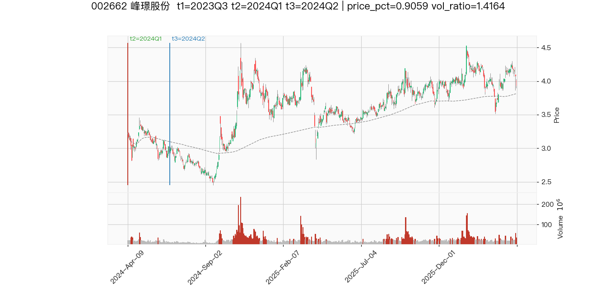

#### 🔍 检测依据 — 002662 峰璟股份
> 最佳 triple: **2023Q3 → 2024Q1 → 2024Q2** ｜ B 触发: price_pct=0.91 vol_ratio=1.42 ｜ 候选 triple 数: 1

#### 📊 港中结持仓节奏 — 002662 峰璟股份

| 季度     |   持股量(万股) |   持股市值(亿) |
|:-------|----------:|----------:|
| 2022Q4 |      19   |      0.01 |
| 2023Q1 |    1191   |      0.44 |
| 2023Q2 |    1832.1 |      0.61 |
| 2023Q3 |    2353.6 |      0.82 |
| 2023Q4 |    2113.7 |      0.74 |
| 2024Q1 |     880.4 |      0.28 |
| 2024Q2 |    1444   |      0.44 |
| 2024Q3 |    1449.2 |      0.41 |

#### ✍️ 人工复盘 — 002662 峰璟股份

| 检查项 | 结果 |
|--------|------|
| t2 季度价格在近 250 日高位区间（视觉） | ⬜ |
| t2 季度出现明显放量 bar（红色高量） | ⬜ |
| t3 季度买回后股价未大幅上涨（非卖飞） | ⬜ |
| t1→t2→t3 三段节奏符合「建仓→出货→再建仓」 | ⬜ |

**决策**: ⬜ PASS（纳入关注名单）　⬜ REJECT（假信号）

**备注**: _（人工填写）_

### 600395 盘江股份 K 线 + 成交量
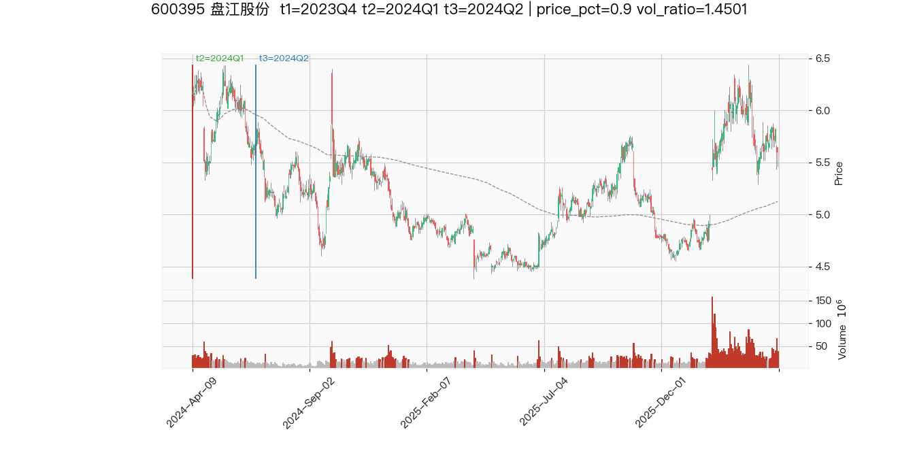

#### 🔍 检测依据 — 600395 盘江股份
> 最佳 triple: **2023Q4 → 2024Q1 → 2024Q2** ｜ B 触发: price_pct=0.90 vol_ratio=1.45 ｜ 候选 triple 数: 2

#### 📊 港中结持仓节奏 — 600395 盘江股份

| 季度     |   持股量(万股) |   持股市值(亿) |
|:-------|----------:|----------:|
| 2022Q4 |    3875.4 |      2.6  |
| 2023Q1 |    2833.3 |      2.05 |
| 2023Q2 |    1410.6 |      0.98 |
| 2023Q3 |    1679.5 |      1.04 |
| 2023Q4 |    2018.2 |      1.25 |
| 2024Q1 |    1320   |      0.79 |
| 2024Q2 |    2188.3 |      1.32 |
| 2024Q3 |    1366.2 |      0.76 |

#### ✍️ 人工复盘 — 600395 盘江股份

| 检查项 | 结果 |
|--------|------|
| t2 季度价格在近 250 日高位区间（视觉） | ⬜ |
| t2 季度出现明显放量 bar（红色高量） | ⬜ |
| t3 季度买回后股价未大幅上涨（非卖飞） | ⬜ |
| t1→t2→t3 三段节奏符合「建仓→出货→再建仓」 | ⬜ |

**决策**: ⬜ PASS（纳入关注名单）　⬜ REJECT（假信号）

**备注**: _（人工填写）_

### 002929 润建股份 K 线 + 成交量
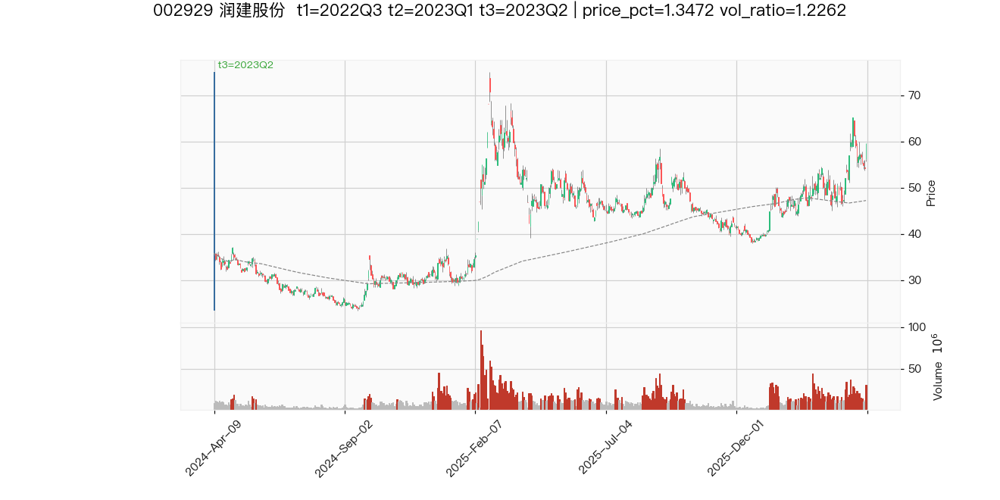

#### 🔍 检测依据 — 002929 润建股份
> 最佳 triple: **2022Q3 → 2023Q1 → 2023Q2** ｜ B 触发: price_pct=1.35 vol_ratio=1.23 ｜ 候选 triple 数: 4

#### 📊 港中结持仓节奏 — 002929 润建股份

| 季度     |   持股量(万股) |   持股市值(亿) |
|:-------|----------:|----------:|
| 2022Q4 |     136.3 |      0.54 |
| 2023Q1 |     114.9 |      0.55 |
| 2023Q2 |     237.5 |      1.03 |
| 2023Q3 |     135   |      0.5  |
| 2023Q4 |     143   |      0.6  |
| 2024Q1 |     124.2 |      0.51 |
| 2024Q2 |     182.3 |      0.53 |
| 2024Q3 |     221.5 |      0.59 |

#### ✍️ 人工复盘 — 002929 润建股份

| 检查项 | 结果 |
|--------|------|
| t2 季度价格在近 250 日高位区间（视觉） | ⬜ |
| t2 季度出现明显放量 bar（红色高量） | ⬜ |
| t3 季度买回后股价未大幅上涨（非卖飞） | ⬜ |
| t1→t2→t3 三段节奏符合「建仓→出货→再建仓」 | ⬜ |

**决策**: ⬜ PASS（纳入关注名单）　⬜ REJECT（假信号）

**备注**: _（人工填写）_

### 002320 海峡股份 K 线 + 成交量
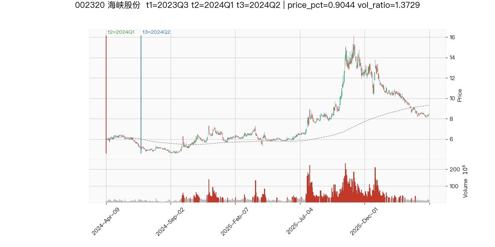

#### 🔍 检测依据 — 002320 海峡股份
> 最佳 triple: **2023Q3 → 2024Q1 → 2024Q2** ｜ B 触发: price_pct=0.90 vol_ratio=1.37 ｜ 候选 triple 数: 3

#### 📊 港中结持仓节奏 — 002320 海峡股份

| 季度     |   持股量(万股) |   持股市值(亿) |
|:-------|----------:|----------:|
| 2022Q4 |    1324.3 |      0.73 |
| 2023Q1 |    1516.2 |      0.93 |
| 2023Q2 |    3875.5 |      2.33 |
| 2023Q3 |    4504.5 |      2.61 |
| 2023Q4 |    4243.5 |      2.47 |
| 2024Q1 |    3934.4 |      2.56 |
| 2024Q2 |    4458.2 |      2.3  |
| 2024Q3 |    3341.4 |      1.71 |

#### ✍️ 人工复盘 — 002320 海峡股份

| 检查项 | 结果 |
|--------|------|
| t2 季度价格在近 250 日高位区间（视觉） | ⬜ |
| t2 季度出现明显放量 bar（红色高量） | ⬜ |
| t3 季度买回后股价未大幅上涨（非卖飞） | ⬜ |
| t1→t2→t3 三段节奏符合「建仓→出货→再建仓」 | ⬜ |

**决策**: ⬜ PASS（纳入关注名单）　⬜ REJECT（假信号）

**备注**: _（人工填写）_

### 600300 维维股份 K 线 + 成交量
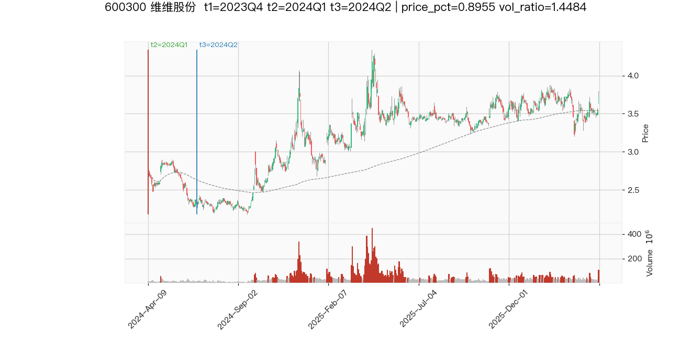

#### 🔍 检测依据 — 600300 维维股份
> 最佳 triple: **2023Q4 → 2024Q1 → 2024Q2** ｜ B 触发: price_pct=0.90 vol_ratio=1.45 ｜ 候选 triple 数: 1

#### 📊 港中结持仓节奏 — 600300 维维股份

| 季度     |   持股量(万股) |   持股市值(亿) |
|:-------|----------:|----------:|
| 2022Q4 |      27.6 |      0.01 |
| 2023Q1 |     168.8 |      0.05 |
| 2023Q2 |     285.3 |      0.09 |
| 2023Q3 |    1023.6 |      0.32 |
| 2023Q4 |    2700.3 |      0.84 |
| 2024Q1 |    1257.1 |      0.35 |
| 2024Q2 |    1508.7 |      0.36 |
| 2024Q3 |    1893.8 |      0.46 |

#### ✍️ 人工复盘 — 600300 维维股份

| 检查项 | 结果 |
|--------|------|
| t2 季度价格在近 250 日高位区间（视觉） | ⬜ |
| t2 季度出现明显放量 bar（红色高量） | ⬜ |
| t3 季度买回后股价未大幅上涨（非卖飞） | ⬜ |
| t1→t2→t3 三段节奏符合「建仓→出货→再建仓」 | ⬜ |

**决策**: ⬜ PASS（纳入关注名单）　⬜ REJECT（假信号）

**备注**: _（人工填写）_

### 300232 洲明科技 K 线 + 成交量
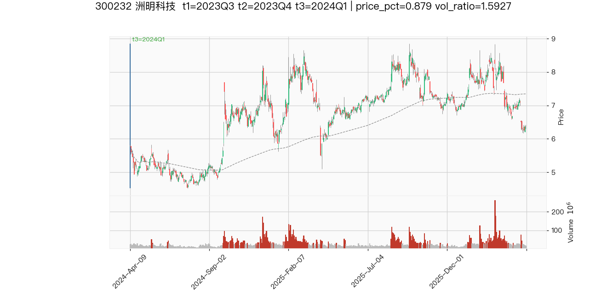

#### 🔍 检测依据 — 300232 洲明科技
> 最佳 triple: **2023Q3 → 2023Q4 → 2024Q1** ｜ B 触发: price_pct=0.88 vol_ratio=1.59 ｜ 候选 triple 数: 3

#### 📊 港中结持仓节奏 — 300232 洲明科技

| 季度     |   持股量(万股) |   持股市值(亿) |
|:-------|----------:|----------:|
| 2022Q4 |     631.6 |      0.35 |
| 2023Q1 |    3044.7 |      2.22 |
| 2023Q2 |    5739.1 |      5.45 |
| 2023Q3 |   10135.1 |      7.75 |
| 2023Q4 |    1026.3 |      0.9  |
| 2024Q1 |    1117.2 |      0.7  |
| 2024Q2 |    1028.7 |      0.54 |
| 2024Q3 |    1433.3 |      0.74 |

#### ✍️ 人工复盘 — 300232 洲明科技

| 检查项 | 结果 |
|--------|------|
| t2 季度价格在近 250 日高位区间（视觉） | ⬜ |
| t2 季度出现明显放量 bar（红色高量） | ⬜ |
| t3 季度买回后股价未大幅上涨（非卖飞） | ⬜ |
| t1→t2→t3 三段节奏符合「建仓→出货→再建仓」 | ⬜ |

**决策**: ⬜ PASS（纳入关注名单）　⬜ REJECT（假信号）

**备注**: _（人工填写）_

### 002275 桂林三金 K 线 + 成交量
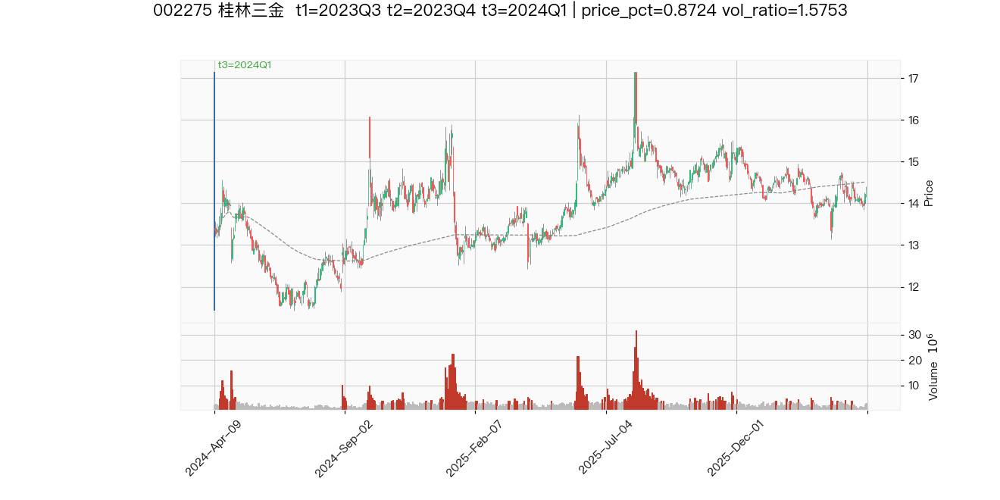

#### 🔍 检测依据 — 002275 桂林三金
> 最佳 triple: **2023Q3 → 2023Q4 → 2024Q1** ｜ B 触发: price_pct=0.87 vol_ratio=1.58 ｜ 候选 triple 数: 1

#### 📊 港中结持仓节奏 — 002275 桂林三金

| 季度     |   持股量(万股) |   持股市值(亿) |
|:-------|----------:|----------:|
| 2022Q4 |      22.2 |      0.03 |
| 2023Q1 |     133.1 |      0.22 |
| 2023Q2 |     385.9 |      0.7  |
| 2023Q3 |     818.1 |      1.38 |
| 2023Q4 |     234.7 |      0.34 |
| 2024Q1 |     301.5 |      0.42 |
| 2024Q2 |     299.8 |      0.37 |
| 2024Q3 |     293.4 |      0.39 |

#### ✍️ 人工复盘 — 002275 桂林三金

| 检查项 | 结果 |
|--------|------|
| t2 季度价格在近 250 日高位区间（视觉） | ⬜ |
| t2 季度出现明显放量 bar（红色高量） | ⬜ |
| t3 季度买回后股价未大幅上涨（非卖飞） | ⬜ |
| t1→t2→t3 三段节奏符合「建仓→出货→再建仓」 | ⬜ |

**决策**: ⬜ PASS（纳入关注名单）　⬜ REJECT（假信号）

**备注**: _（人工填写）_

### 603712 七一二 K 线 + 成交量
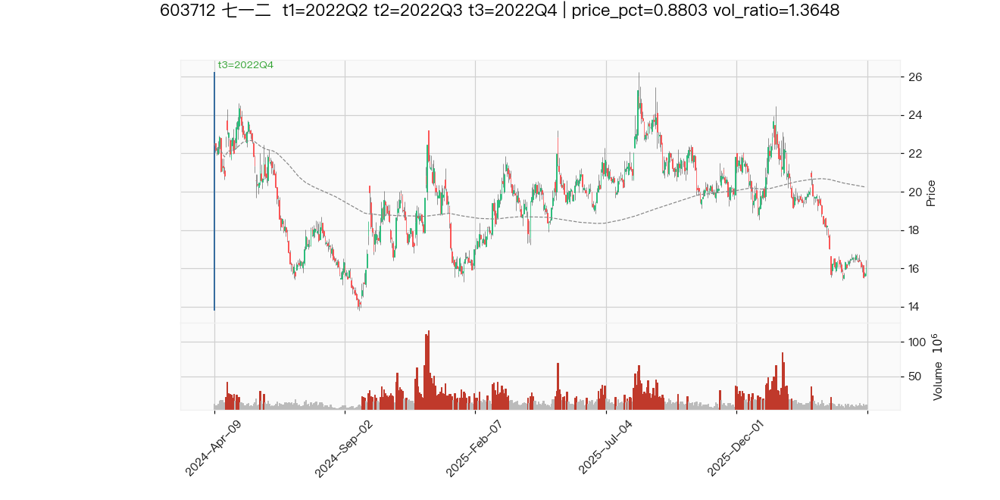

#### 🔍 检测依据 — 603712 七一二
> 最佳 triple: **2022Q2 → 2022Q3 → 2022Q4** ｜ B 触发: price_pct=0.88 vol_ratio=1.36 ｜ 候选 triple 数: 2

#### 📊 港中结持仓节奏 — 603712 七一二

| 季度     |   持股量(万股) |   持股市值(亿) |
|:-------|----------:|----------:|
| 2022Q4 |     932.2 |      3.26 |
| 2023Q1 |    1045.2 |      3.23 |
| 2023Q2 |     771   |      2.29 |
| 2023Q3 |     769.5 |      1.95 |
| 2023Q4 |    1335.8 |      4.21 |
| 2024Q1 |    2390.5 |      5.72 |
| 2024Q2 |     920.6 |      1.67 |
| 2024Q3 |     448.5 |      0.75 |

#### ✍️ 人工复盘 — 603712 七一二

| 检查项 | 结果 |
|--------|------|
| t2 季度价格在近 250 日高位区间（视觉） | ⬜ |
| t2 季度出现明显放量 bar（红色高量） | ⬜ |
| t3 季度买回后股价未大幅上涨（非卖飞） | ⬜ |
| t1→t2→t3 三段节奏符合「建仓→出货→再建仓」 | ⬜ |

**决策**: ⬜ PASS（纳入关注名单）　⬜ REJECT（假信号）

**备注**: _（人工填写）_

### 002034 旺能环境 K 线 + 成交量
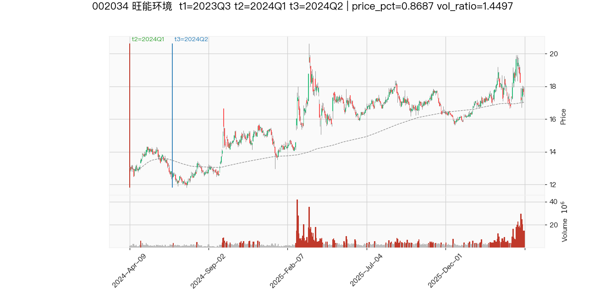

#### 🔍 检测依据 — 002034 旺能环境
> 最佳 triple: **2023Q3 → 2024Q1 → 2024Q2** ｜ B 触发: price_pct=0.87 vol_ratio=1.45 ｜ 候选 triple 数: 4

#### 📊 港中结持仓节奏 — 002034 旺能环境

| 季度     |   持股量(万股) |   持股市值(亿) |
|:-------|----------:|----------:|
| 2022Q4 |     172.4 |      0.31 |
| 2023Q1 |     210.8 |      0.38 |
| 2023Q2 |     194.6 |      0.31 |
| 2023Q3 |     272.3 |      0.43 |
| 2023Q4 |     221.2 |      0.34 |
| 2024Q1 |     171.7 |      0.23 |
| 2024Q2 |     286.3 |      0.37 |
| 2024Q3 |     253.5 |      0.35 |

#### ✍️ 人工复盘 — 002034 旺能环境

| 检查项 | 结果 |
|--------|------|
| t2 季度价格在近 250 日高位区间（视觉） | ⬜ |
| t2 季度出现明显放量 bar（红色高量） | ⬜ |
| t3 季度买回后股价未大幅上涨（非卖飞） | ⬜ |
| t1→t2→t3 三段节奏符合「建仓→出货→再建仓」 | ⬜ |

**决策**: ⬜ PASS（纳入关注名单）　⬜ REJECT（假信号）

**备注**: _（人工填写）_

### 002382 蓝帆医疗 K 线 + 成交量
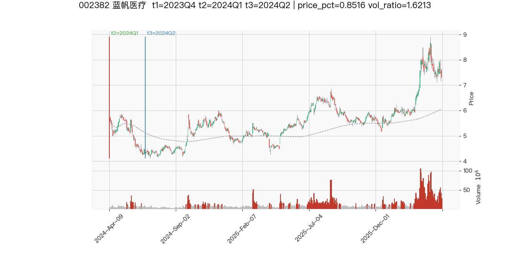

#### 🔍 检测依据 — 002382 蓝帆医疗
> 最佳 triple: **2023Q4 → 2024Q1 → 2024Q2** ｜ B 触发: price_pct=0.85 vol_ratio=1.62 ｜ 候选 triple 数: 1

#### 📊 港中结持仓节奏 — 002382 蓝帆医疗

| 季度     |   持股量(万股) |   持股市值(亿) |
|:-------|----------:|----------:|
| 2023Q1 |    1266.7 |      0.99 |
| 2023Q2 |     943.4 |      0.67 |
| 2023Q3 |    1240.7 |      0.85 |
| 2023Q4 |    1893.5 |      1.26 |
| 2024Q1 |     999.6 |      0.56 |
| 2024Q2 |    1655.5 |      0.72 |
| 2024Q3 |    1633.1 |      0.75 |

#### ✍️ 人工复盘 — 002382 蓝帆医疗

| 检查项 | 结果 |
|--------|------|
| t2 季度价格在近 250 日高位区间（视觉） | ⬜ |
| t2 季度出现明显放量 bar（红色高量） | ⬜ |
| t3 季度买回后股价未大幅上涨（非卖飞） | ⬜ |
| t1→t2→t3 三段节奏符合「建仓→出货→再建仓」 | ⬜ |

**决策**: ⬜ PASS（纳入关注名单）　⬜ REJECT（假信号）

**备注**: _（人工填写）_

### 600682 南京新百 K 线 + 成交量
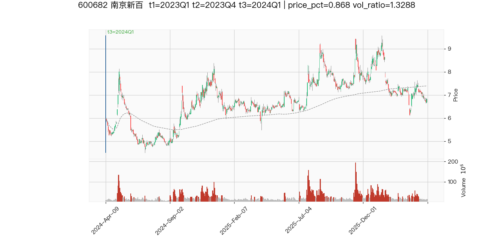

#### 🔍 检测依据 — 600682 南京新百
> 最佳 triple: **2023Q1 → 2023Q4 → 2024Q1** ｜ B 触发: price_pct=0.87 vol_ratio=1.33 ｜ 候选 triple 数: 2

#### 📊 港中结持仓节奏 — 600682 南京新百

| 季度     |   持股量(万股) |   持股市值(亿) |
|:-------|----------:|----------:|
| 2022Q4 |     590.7 |      0.54 |
| 2023Q1 |     713.5 |      0.65 |
| 2023Q2 |     605.7 |      0.49 |
| 2023Q3 |     625.3 |      0.51 |
| 2023Q4 |     534.7 |      0.41 |
| 2024Q1 |    1148.4 |      0.67 |
| 2024Q2 |    1442   |      0.72 |
| 2024Q3 |    1305   |      0.67 |

#### ✍️ 人工复盘 — 600682 南京新百

| 检查项 | 结果 |
|--------|------|
| t2 季度价格在近 250 日高位区间（视觉） | ⬜ |
| t2 季度出现明显放量 bar（红色高量） | ⬜ |
| t3 季度买回后股价未大幅上涨（非卖飞） | ⬜ |
| t1→t2→t3 三段节奏符合「建仓→出货→再建仓」 | ⬜ |

**决策**: ⬜ PASS（纳入关注名单）　⬜ REJECT（假信号）

**备注**: _（人工填写）_

### 002891 中宠股份 K 线 + 成交量
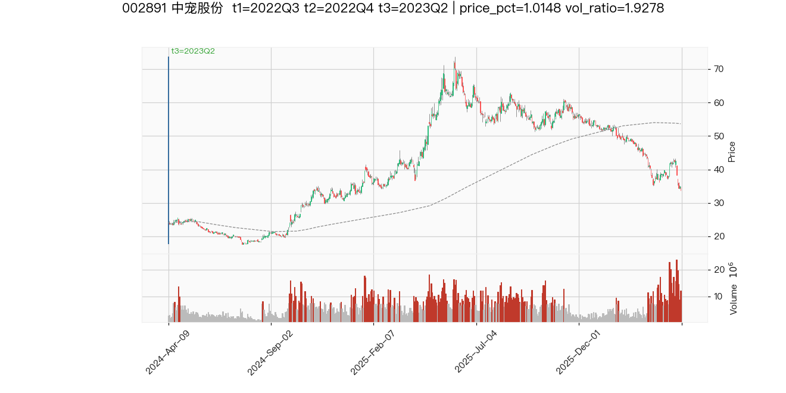

#### 🔍 检测依据 — 002891 中宠股份
> 最佳 triple: **2022Q3 → 2022Q4 → 2023Q2** ｜ B 触发: price_pct=1.01 vol_ratio=1.93 ｜ t2 后 60 日收益: 14.9% ｜ 候选 triple 数: 2

#### 📊 港中结持仓节奏 — 002891 中宠股份

| 季度     |   持股量(万股) |   持股市值(亿) |
|:-------|----------:|----------:|
| 2022Q4 |    1057.1 |      2.36 |
| 2023Q1 |    1015.7 |      2.41 |
| 2023Q2 |    1133.1 |      2.76 |
| 2023Q3 |     983.6 |      2.31 |
| 2023Q4 |    1435.9 |      3.78 |
| 2024Q1 |     974.7 |      2.24 |
| 2024Q2 |     894.2 |      1.87 |
| 2024Q3 |     889.8 |      1.66 |

#### ✍️ 人工复盘 — 002891 中宠股份

| 检查项 | 结果 |
|--------|------|
| t2 季度价格在近 250 日高位区间（视觉） | ⬜ |
| t2 季度出现明显放量 bar（红色高量） | ⬜ |
| t3 季度买回后股价未大幅上涨（非卖飞） | ⬜ |
| t1→t2→t3 三段节奏符合「建仓→出货→再建仓」 | ⬜ |

**决策**: ⬜ PASS（纳入关注名单）　⬜ REJECT（假信号）

**备注**: _（人工填写）_

### 605009 豪悦护理 K 线 + 成交量
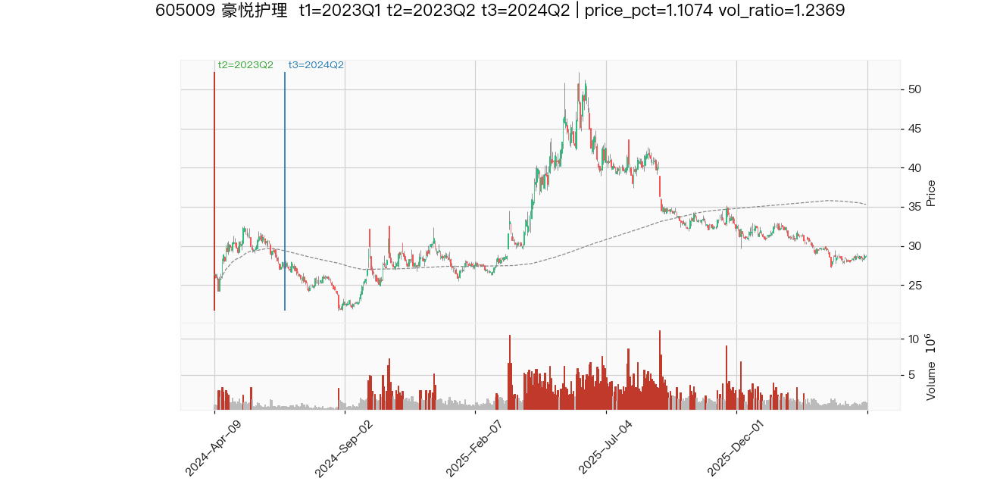

#### 🔍 检测依据 — 605009 豪悦护理
> 最佳 triple: **2023Q1 → 2023Q2 → 2024Q2** ｜ B 触发: price_pct=1.11 vol_ratio=1.24 ｜ t2 后 60 日收益: 1.1% ｜ 候选 triple 数: 3

#### 📊 港中结持仓节奏 — 605009 豪悦护理

| 季度     |   持股量(万股) |   持股市值(亿) |
|:-------|----------:|----------:|
| 2022Q4 |     472.4 |      2.45 |
| 2023Q1 |     532.4 |      2.45 |
| 2023Q2 |     494.7 |      2.37 |
| 2023Q3 |     275.1 |      1.18 |
| 2023Q4 |     247.3 |      0.94 |
| 2024Q1 |     317.3 |      1.22 |
| 2024Q2 |     555.2 |      2.19 |
| 2024Q3 |     556.3 |      2.04 |

#### ✍️ 人工复盘 — 605009 豪悦护理

| 检查项 | 结果 |
|--------|------|
| t2 季度价格在近 250 日高位区间（视觉） | ⬜ |
| t2 季度出现明显放量 bar（红色高量） | ⬜ |
| t3 季度买回后股价未大幅上涨（非卖飞） | ⬜ |
| t1→t2→t3 三段节奏符合「建仓→出货→再建仓」 | ⬜ |

**决策**: ⬜ PASS（纳入关注名单）　⬜ REJECT（假信号）

**备注**: _（人工填写）_

### 002726 龙大美食 K 线 + 成交量
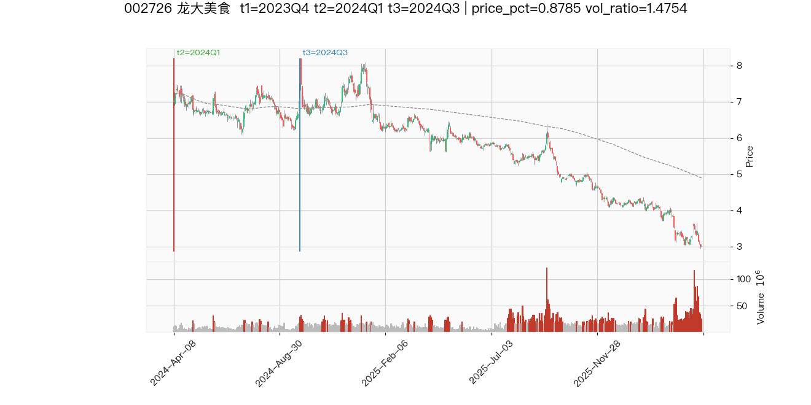

#### 🔍 检测依据 — 002726 龙大美食
> 最佳 triple: **2023Q4 → 2024Q1 → 2024Q3** ｜ B 触发: price_pct=0.88 vol_ratio=1.48 ｜ t2 后 60 日收益: 9.0% ｜ 候选 triple 数: 1

#### 📊 港中结持仓节奏 — 002726 龙大美食

| 季度     |   持股量(万股) |   持股市值(亿) |
|:-------|----------:|----------:|
| 2023Q1 |     584.1 |      0.51 |
| 2023Q2 |     471.3 |      0.39 |
| 2023Q3 |     560.4 |      0.42 |
| 2023Q4 |     792.8 |      0.64 |
| 2024Q1 |     426.7 |      0.29 |
| 2024Q2 |     406.8 |      0.27 |
| 2024Q3 |     784.5 |      0.56 |

#### ✍️ 人工复盘 — 002726 龙大美食

| 检查项 | 结果 |
|--------|------|
| t2 季度价格在近 250 日高位区间（视觉） | ⬜ |
| t2 季度出现明显放量 bar（红色高量） | ⬜ |
| t3 季度买回后股价未大幅上涨（非卖飞） | ⬜ |
| t1→t2→t3 三段节奏符合「建仓→出货→再建仓」 | ⬜ |

**决策**: ⬜ PASS（纳入关注名单）　⬜ REJECT（假信号）

**备注**: _（人工填写）_

### 002583 海能达 K 线 + 成交量
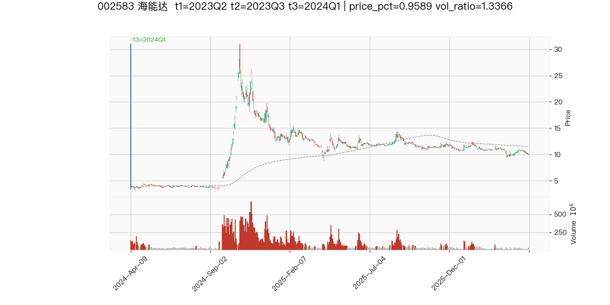

#### 🔍 检测依据 — 002583 海能达
> 最佳 triple: **2023Q2 → 2023Q3 → 2024Q1** ｜ B 触发: price_pct=0.96 vol_ratio=1.34 ｜ t2 后 60 日收益: 11.5% ｜ 候选 triple 数: 3

#### 📊 港中结持仓节奏 — 002583 海能达

| 季度     |   持股量(万股) |   持股市值(亿) |
|:-------|----------:|----------:|
| 2023Q1 |    2477.9 |      1.65 |
| 2023Q2 |    4219.2 |      2.4  |
| 2023Q3 |    3910.4 |      2.41 |
| 2023Q4 |    1862.9 |      1.11 |
| 2024Q1 |    4271.2 |      1.99 |
| 2024Q2 |    3762   |      1.53 |
| 2024Q3 |    4564.3 |      1.82 |

#### ✍️ 人工复盘 — 002583 海能达

| 检查项 | 结果 |
|--------|------|
| t2 季度价格在近 250 日高位区间（视觉） | ⬜ |
| t2 季度出现明显放量 bar（红色高量） | ⬜ |
| t3 季度买回后股价未大幅上涨（非卖飞） | ⬜ |
| t1→t2→t3 三段节奏符合「建仓→出货→再建仓」 | ⬜ |

**决策**: ⬜ PASS（纳入关注名单）　⬜ REJECT（假信号）

**备注**: _（人工填写）_

### 300894 火星人 K 线 + 成交量
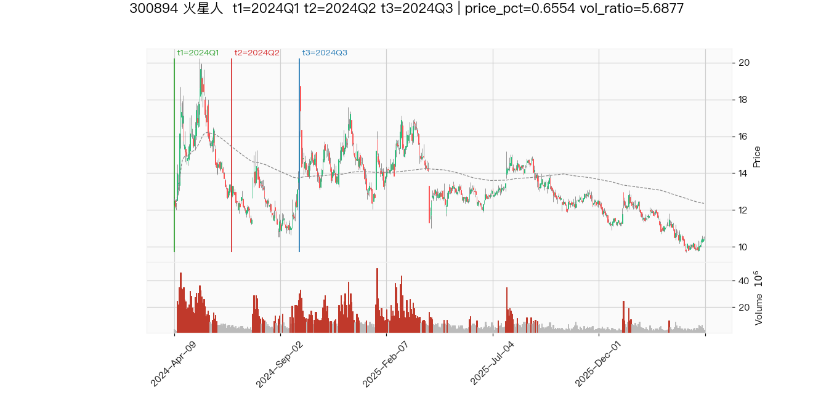

#### 🔍 检测依据 — 300894 火星人
> 最佳 triple: **2024Q1 → 2024Q2 → 2024Q3** ｜ B 触发: price_pct=0.66 vol_ratio=5.69 ｜ 候选 triple 数: 2

#### 📊 港中结持仓节奏 — 300894 火星人

| 季度     |   持股量(万股) |   持股市值(亿) |
|:-------|----------:|----------:|
| 2022Q4 |     156.2 |      0.39 |
| 2023Q1 |     165.1 |      0.51 |
| 2023Q2 |     158.7 |      0.41 |
| 2023Q3 |     360.1 |      0.7  |
| 2023Q4 |     306.8 |      0.5  |
| 2024Q1 |     352.5 |      0.45 |
| 2024Q2 |     202.7 |      0.26 |
| 2024Q3 |     360.7 |      0.44 |

#### ✍️ 人工复盘 — 300894 火星人

| 检查项 | 结果 |
|--------|------|
| t2 季度价格在近 250 日高位区间（视觉） | ⬜ |
| t2 季度出现明显放量 bar（红色高量） | ⬜ |
| t3 季度买回后股价未大幅上涨（非卖飞） | ⬜ |
| t1→t2→t3 三段节奏符合「建仓→出货→再建仓」 | ⬜ |

**决策**: ⬜ PASS（纳入关注名单）　⬜ REJECT（假信号）

**备注**: _（人工填写）_

### 603489 八方股份 K 线 + 成交量
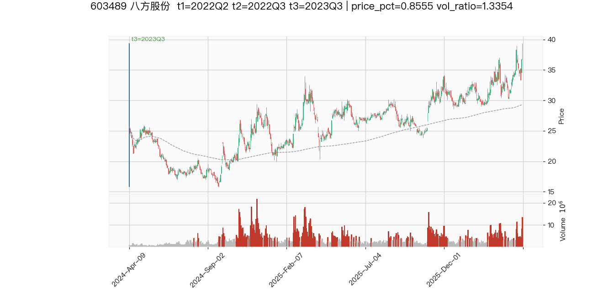

#### 🔍 检测依据 — 603489 八方股份
> 最佳 triple: **2022Q2 → 2022Q3 → 2023Q3** ｜ B 触发: price_pct=0.86 vol_ratio=1.34 ｜ t2 后 60 日收益: 9.3% ｜ 候选 triple 数: 5

#### 📊 港中结持仓节奏 — 603489 八方股份

| 季度     |   持股量(万股) |   持股市值(亿) |
|:-------|----------:|----------:|
| 2022Q4 |    1258   |     13.46 |
| 2023Q1 |    1127   |     11.93 |
| 2023Q2 |    1418.8 |      9.95 |
| 2023Q3 |    1528.8 |      8.76 |
| 2023Q4 |    1103.9 |      6.07 |
| 2024Q1 |    1169.9 |      4.32 |
| 2024Q2 |    1023.1 |      2.76 |
| 2024Q3 |    1395.1 |      2.68 |

#### ✍️ 人工复盘 — 603489 八方股份

| 检查项 | 结果 |
|--------|------|
| t2 季度价格在近 250 日高位区间（视觉） | ⬜ |
| t2 季度出现明显放量 bar（红色高量） | ⬜ |
| t3 季度买回后股价未大幅上涨（非卖飞） | ⬜ |
| t1→t2→t3 三段节奏符合「建仓→出货→再建仓」 | ⬜ |

**决策**: ⬜ PASS（纳入关注名单）　⬜ REJECT（假信号）

**备注**: _（人工填写）_

### 002832 比音勒芬 K 线 + 成交量
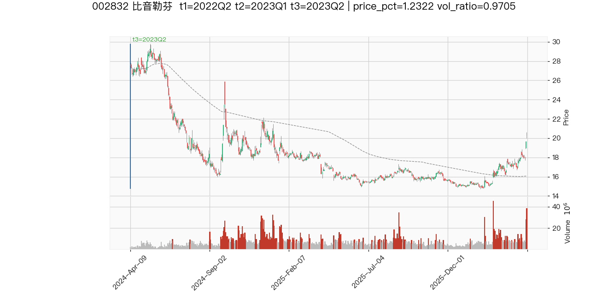

#### 🔍 检测依据 — 002832 比音勒芬
> 最佳 triple: **2022Q2 → 2023Q1 → 2023Q2** ｜ B 触发: price_pct=1.23 vol_ratio=0.97 ｜ 候选 triple 数: 4

#### 📊 港中结持仓节奏 — 002832 比音勒芬

| 季度     |   持股量(万股) |   持股市值(亿) |
|:-------|----------:|----------:|
| 2022Q4 |     984.8 |      2.52 |
| 2023Q1 |     929.6 |      2.99 |
| 2023Q2 |    1142.5 |      4.05 |
| 2023Q3 |     961.1 |      3.23 |
| 2023Q4 |     920.8 |      2.92 |
| 2024Q1 |     676.8 |      1.93 |
| 2024Q2 |     362.9 |      0.88 |
| 2024Q3 |     518.7 |      0.97 |

#### ✍️ 人工复盘 — 002832 比音勒芬

| 检查项 | 结果 |
|--------|------|
| t2 季度价格在近 250 日高位区间（视觉） | ⬜ |
| t2 季度出现明显放量 bar（红色高量） | ⬜ |
| t3 季度买回后股价未大幅上涨（非卖飞） | ⬜ |
| t1→t2→t3 三段节奏符合「建仓→出货→再建仓」 | ⬜ |

**决策**: ⬜ PASS（纳入关注名单）　⬜ REJECT（假信号）

**备注**: _（人工填写）_

### 603393 新天然气 K 线 + 成交量
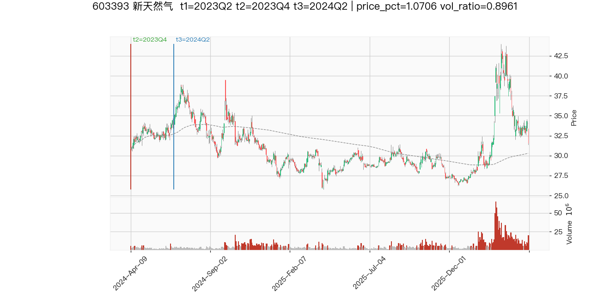

#### 🔍 检测依据 — 603393 新天然气
> 最佳 triple: **2023Q2 → 2023Q4 → 2024Q2** ｜ B 触发: price_pct=1.07 vol_ratio=0.90 ｜ t2 后 60 日收益: 2.0% ｜ 候选 triple 数: 2

#### 📊 港中结持仓节奏 — 603393 新天然气

| 季度     |   持股量(万股) |   持股市值(亿) |
|:-------|----------:|----------:|
| 2022Q4 |     361.5 |      0.79 |
| 2023Q1 |     513.4 |      1.19 |
| 2023Q2 |     927.5 |      2.49 |
| 2023Q3 |     835.6 |      2.44 |
| 2023Q4 |     494   |      1.51 |
| 2024Q1 |     439.7 |      1.34 |
| 2024Q2 |     571   |      1.98 |
| 2024Q3 |     506.6 |      1.78 |

#### ✍️ 人工复盘 — 603393 新天然气

| 检查项 | 结果 |
|--------|------|
| t2 季度价格在近 250 日高位区间（视觉） | ⬜ |
| t2 季度出现明显放量 bar（红色高量） | ⬜ |
| t3 季度买回后股价未大幅上涨（非卖飞） | ⬜ |
| t1→t2→t3 三段节奏符合「建仓→出货→再建仓」 | ⬜ |

**决策**: ⬜ PASS（纳入关注名单）　⬜ REJECT（假信号）

**备注**: _（人工填写）_

### 000922 佳电股份 K 线 + 成交量
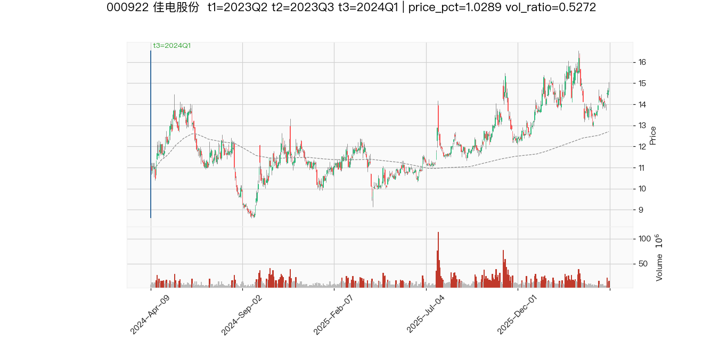

#### 🔍 检测依据 — 000922 佳电股份
> 最佳 triple: **2023Q2 → 2023Q3 → 2024Q1** ｜ B 触发: price_pct=1.03 vol_ratio=0.53 ｜ t2 后 60 日收益: 0.8% ｜ 候选 triple 数: 2

#### 📊 港中结持仓节奏 — 000922 佳电股份

| 季度     |   持股量(万股) |   持股市值(亿) |
|:-------|----------:|----------:|
| 2023Q1 |     267.9 |      0.31 |
| 2023Q2 |     651   |      0.86 |
| 2023Q3 |     569.9 |      0.62 |
| 2023Q4 |     427.3 |      0.44 |
| 2024Q1 |     706.1 |      0.83 |
| 2024Q2 |    1027.3 |      1.23 |
| 2024Q3 |     697.4 |      0.84 |

#### ✍️ 人工复盘 — 000922 佳电股份

| 检查项 | 结果 |
|--------|------|
| t2 季度价格在近 250 日高位区间（视觉） | ⬜ |
| t2 季度出现明显放量 bar（红色高量） | ⬜ |
| t3 季度买回后股价未大幅上涨（非卖飞） | ⬜ |
| t1→t2→t3 三段节奏符合「建仓→出货→再建仓」 | ⬜ |

**决策**: ⬜ PASS（纳入关注名单）　⬜ REJECT（假信号）

**备注**: _（人工填写）_

### 300633 开立医疗 K 线 + 成交量
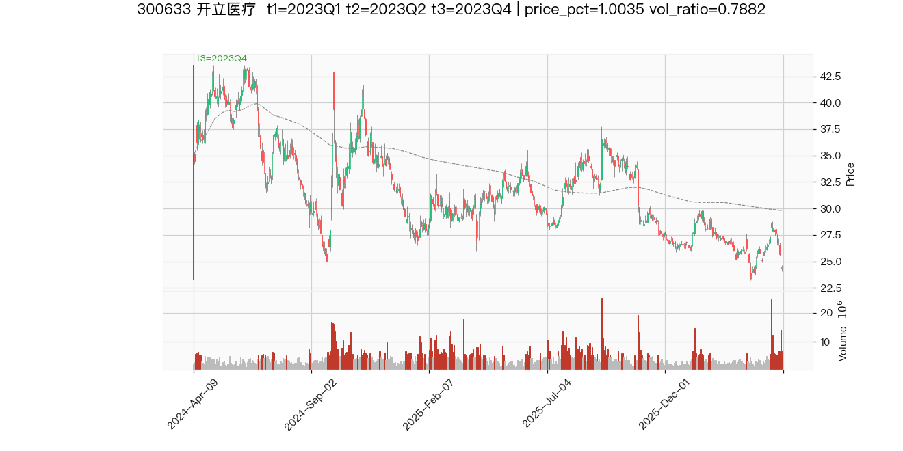

#### 🔍 检测依据 — 300633 开立医疗
> 最佳 triple: **2023Q1 → 2023Q2 → 2023Q4** ｜ B 触发: price_pct=1.00 vol_ratio=0.79 ｜ t2 后 60 日收益: -1.9% ｜ 候选 triple 数: 3

#### 📊 港中结持仓节奏 — 300633 开立医疗

| 季度     |   持股量(万股) |   持股市值(亿) |
|:-------|----------:|----------:|
| 2022Q4 |     972.9 |      5.33 |
| 2023Q1 |    1060.5 |      5.87 |
| 2023Q2 |     838.7 |      4.61 |
| 2023Q3 |     592.8 |      2.89 |
| 2023Q4 |     844.4 |      3.99 |
| 2024Q1 |    1294.9 |      4.88 |
| 2024Q2 |    1509.6 |      5.98 |
| 2024Q3 |    1297.7 |      4.32 |

#### ✍️ 人工复盘 — 300633 开立医疗

| 检查项 | 结果 |
|--------|------|
| t2 季度价格在近 250 日高位区间（视觉） | ⬜ |
| t2 季度出现明显放量 bar（红色高量） | ⬜ |
| t3 季度买回后股价未大幅上涨（非卖飞） | ⬜ |
| t1→t2→t3 三段节奏符合「建仓→出货→再建仓」 | ⬜ |

**决策**: ⬜ PASS（纳入关注名单）　⬜ REJECT（假信号）

**备注**: _（人工填写）_

### 600391 航发科技 K 线 + 成交量
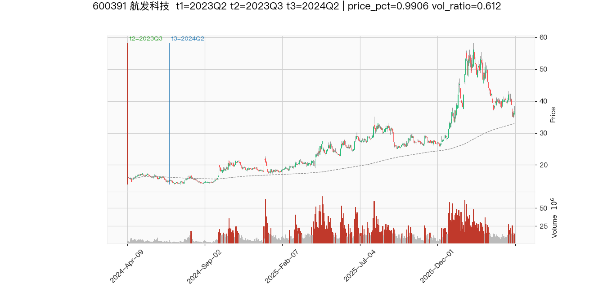

#### 🔍 检测依据 — 600391 航发科技
> 最佳 triple: **2023Q2 → 2023Q3 → 2024Q2** ｜ B 触发: price_pct=0.99 vol_ratio=0.61 ｜ t2 后 60 日收益: 0.8% ｜ 候选 triple 数: 1

#### 📊 港中结持仓节奏 — 600391 航发科技

| 季度     |   持股量(万股) |   持股市值(亿) |
|:-------|----------:|----------:|
| 2023Q1 |     211   |      0.46 |
| 2023Q2 |     481.3 |      1.16 |
| 2023Q3 |     288.2 |      0.58 |
| 2023Q4 |     288.8 |      0.55 |
| 2024Q1 |     302.8 |      0.52 |
| 2024Q2 |     443.5 |      0.68 |
| 2024Q3 |     344.8 |      0.52 |

#### ✍️ 人工复盘 — 600391 航发科技

| 检查项 | 结果 |
|--------|------|
| t2 季度价格在近 250 日高位区间（视觉） | ⬜ |
| t2 季度出现明显放量 bar（红色高量） | ⬜ |
| t3 季度买回后股价未大幅上涨（非卖飞） | ⬜ |
| t1→t2→t3 三段节奏符合「建仓→出货→再建仓」 | ⬜ |

**决策**: ⬜ PASS（纳入关注名单）　⬜ REJECT（假信号）

**备注**: _（人工填写）_

### 300406 九强生物 K 线 + 成交量
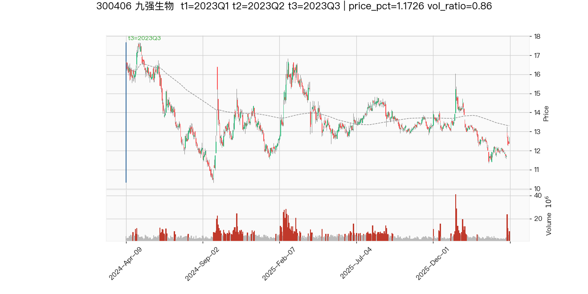

#### 🔍 检测依据 — 300406 九强生物
> 最佳 triple: **2023Q1 → 2023Q2 → 2023Q3** ｜ B 触发: price_pct=1.17 vol_ratio=0.86 ｜ 候选 triple 数: 1

#### 📊 港中结持仓节奏 — 300406 九强生物

| 季度     |   持股量(万股) |   持股市值(亿) |
|:-------|----------:|----------:|
| 2022Q4 |     333.2 |      0.55 |
| 2023Q1 |     529.5 |      1.11 |
| 2023Q2 |     387   |      0.88 |
| 2023Q3 |     434.7 |      0.87 |
| 2023Q4 |     472.7 |      0.9  |
| 2024Q1 |     478.6 |      0.89 |
| 2024Q2 |     455.3 |      0.7  |
| 2024Q3 |     474.9 |      0.65 |

#### ✍️ 人工复盘 — 300406 九强生物

| 检查项 | 结果 |
|--------|------|
| t2 季度价格在近 250 日高位区间（视觉） | ⬜ |
| t2 季度出现明显放量 bar（红色高量） | ⬜ |
| t3 季度买回后股价未大幅上涨（非卖飞） | ⬜ |
| t1→t2→t3 三段节奏符合「建仓→出货→再建仓」 | ⬜ |

**决策**: ⬜ PASS（纳入关注名单）　⬜ REJECT（假信号）

**备注**: _（人工填写）_

### 300593 新雷能 K 线 + 成交量
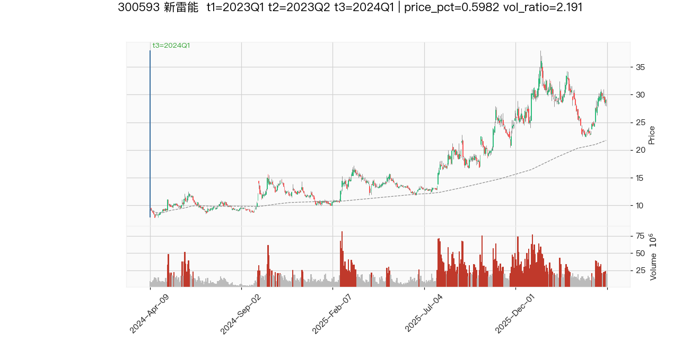

#### 🔍 检测依据 — 300593 新雷能
> 最佳 triple: **2023Q1 → 2023Q2 → 2024Q1** ｜ B 触发: price_pct=0.60 vol_ratio=2.19 ｜ t2 后 60 日收益: -1.2% ｜ 候选 triple 数: 3

#### 📊 港中结持仓节奏 — 300593 新雷能

| 季度     |   持股量(万股) |   持股市值(亿) |
|:-------|----------:|----------:|
| 2022Q4 |     607.8 |      2.58 |
| 2023Q1 |     850.7 |      2.68 |
| 2023Q2 |     739.3 |      1.64 |
| 2023Q3 |     508.7 |      0.93 |
| 2023Q4 |     629.1 |      0.93 |
| 2024Q1 |     986.7 |      0.98 |
| 2024Q2 |     386.7 |      0.38 |
| 2024Q3 |     447.5 |      0.43 |

#### ✍️ 人工复盘 — 300593 新雷能

| 检查项 | 结果 |
|--------|------|
| t2 季度价格在近 250 日高位区间（视觉） | ⬜ |
| t2 季度出现明显放量 bar（红色高量） | ⬜ |
| t3 季度买回后股价未大幅上涨（非卖飞） | ⬜ |
| t1→t2→t3 三段节奏符合「建仓→出货→再建仓」 | ⬜ |

**决策**: ⬜ PASS（纳入关注名单）　⬜ REJECT（假信号）

**备注**: _（人工填写）_

### 000065 北方国际 K 线 + 成交量
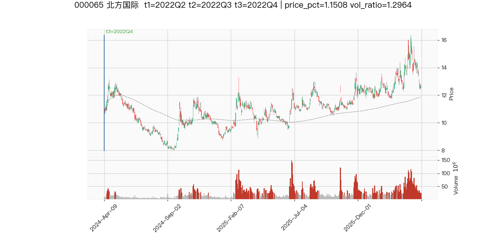

#### 🔍 检测依据 — 000065 北方国际
> 最佳 triple: **2022Q2 → 2022Q3 → 2022Q4** ｜ B 触发: price_pct=1.15 vol_ratio=1.30 ｜ 候选 triple 数: 1

#### 📊 港中结持仓节奏 — 000065 北方国际

| 季度     |   持股量(万股) |   持股市值(亿) |
|:-------|----------:|----------:|
| 2022Q4 |     366.4 |      0.3  |
| 2023Q1 |    2844.1 |      4.34 |
| 2023Q2 |    4752.8 |      7.09 |
| 2023Q3 |    4531.7 |      6.72 |
| 2023Q4 |    4151.8 |      4.66 |
| 2024Q1 |    4350.5 |      4.75 |
| 2024Q2 |    3501.3 |      3.63 |
| 2024Q3 |    2378.6 |      2.14 |

#### ✍️ 人工复盘 — 000065 北方国际

| 检查项 | 结果 |
|--------|------|
| t2 季度价格在近 250 日高位区间（视觉） | ⬜ |
| t2 季度出现明显放量 bar（红色高量） | ⬜ |
| t3 季度买回后股价未大幅上涨（非卖飞） | ⬜ |
| t1→t2→t3 三段节奏符合「建仓→出货→再建仓」 | ⬜ |

**决策**: ⬜ PASS（纳入关注名单）　⬜ REJECT（假信号）

**备注**: _（人工填写）_

### 301029 怡合达 K 线 + 成交量
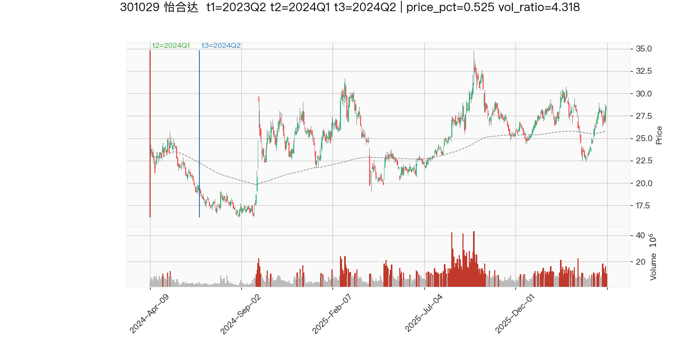

#### 🔍 检测依据 — 301029 怡合达
> 最佳 triple: **2023Q2 → 2024Q1 → 2024Q2** ｜ B 触发: price_pct=0.53 vol_ratio=4.32 ｜ 候选 triple 数: 1

#### 📊 港中结持仓节奏 — 301029 怡合达

| 季度     |   持股量(万股) |   持股市值(亿) |
|:-------|----------:|----------:|
| 2022Q4 |    1076.1 |      7.07 |
| 2023Q1 |    1601   |      8.45 |
| 2023Q2 |    2050.6 |      9.16 |
| 2023Q3 |    1888.8 |      6.74 |
| 2023Q4 |    1161   |      2.99 |
| 2024Q1 |     680.7 |      1.74 |
| 2024Q2 |     756   |      1.49 |
| 2024Q3 |     461.4 |      0.84 |

#### ✍️ 人工复盘 — 301029 怡合达

| 检查项 | 结果 |
|--------|------|
| t2 季度价格在近 250 日高位区间（视觉） | ⬜ |
| t2 季度出现明显放量 bar（红色高量） | ⬜ |
| t3 季度买回后股价未大幅上涨（非卖飞） | ⬜ |
| t1→t2→t3 三段节奏符合「建仓→出货→再建仓」 | ⬜ |

**决策**: ⬜ PASS（纳入关注名单）　⬜ REJECT（假信号）

**备注**: _（人工填写）_

### 000403 派林生物 K 线 + 成交量
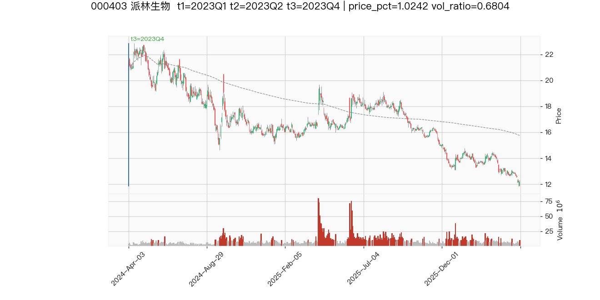

#### 🔍 检测依据 — 000403 派林生物
> 最佳 triple: **2023Q1 → 2023Q2 → 2023Q4** ｜ B 触发: price_pct=1.02 vol_ratio=0.68 ｜ t2 后 60 日收益: 3.4% ｜ 候选 triple 数: 3

#### 📊 港中结持仓节奏 — 000403 派林生物

| 季度     |   持股量(万股) |   持股市值(亿) |
|:-------|----------:|----------:|
| 2022Q4 |     557.8 |      1.27 |
| 2023Q1 |     846.7 |      2.01 |
| 2023Q2 |     782.8 |      1.59 |
| 2023Q3 |     584   |      1.24 |
| 2023Q4 |     985.4 |      2.68 |
| 2024Q1 |     831.7 |      2.25 |
| 2024Q2 |     853.7 |      2.28 |
| 2024Q3 |     883.4 |      2.26 |

#### ✍️ 人工复盘 — 000403 派林生物

| 检查项 | 结果 |
|--------|------|
| t2 季度价格在近 250 日高位区间（视觉） | ⬜ |
| t2 季度出现明显放量 bar（红色高量） | ⬜ |
| t3 季度买回后股价未大幅上涨（非卖飞） | ⬜ |
| t1→t2→t3 三段节奏符合「建仓→出货→再建仓」 | ⬜ |

**决策**: ⬜ PASS（纳入关注名单）　⬜ REJECT（假信号）

**备注**: _（人工填写）_

### 600662 外服控股 K 线 + 成交量
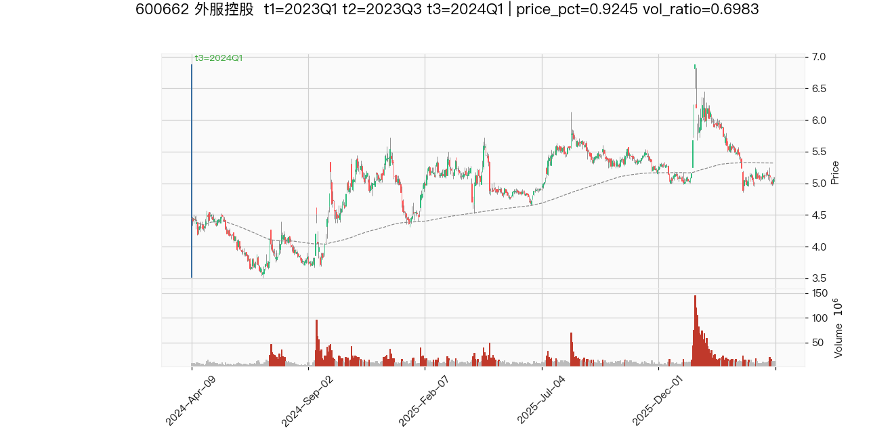

#### 🔍 检测依据 — 600662 外服控股
> 最佳 triple: **2023Q1 → 2023Q3 → 2024Q1** ｜ B 触发: price_pct=0.92 vol_ratio=0.70 ｜ t2 后 60 日收益: -1.0% ｜ 候选 triple 数: 2

#### 📊 港中结持仓节奏 — 600662 外服控股

| 季度     |   持股量(万股) |   持股市值(亿) |
|:-------|----------:|----------:|
| 2022Q4 |     530.3 |      0.32 |
| 2023Q1 |    1846.4 |      1.14 |
| 2023Q2 |    1312.2 |      0.75 |
| 2023Q3 |    1052.5 |      0.58 |
| 2023Q4 |     829.9 |      0.4  |
| 2024Q1 |    1067.9 |      0.48 |
| 2024Q2 |     900.4 |      0.36 |
| 2024Q3 |     930.4 |      0.38 |

#### ✍️ 人工复盘 — 600662 外服控股

| 检查项 | 结果 |
|--------|------|
| t2 季度价格在近 250 日高位区间（视觉） | ⬜ |
| t2 季度出现明显放量 bar（红色高量） | ⬜ |
| t3 季度买回后股价未大幅上涨（非卖飞） | ⬜ |
| t1→t2→t3 三段节奏符合「建仓→出货→再建仓」 | ⬜ |

**决策**: ⬜ PASS（纳入关注名单）　⬜ REJECT（假信号）

**备注**: _（人工填写）_

### 002214 *ST大立 K 线 + 成交量
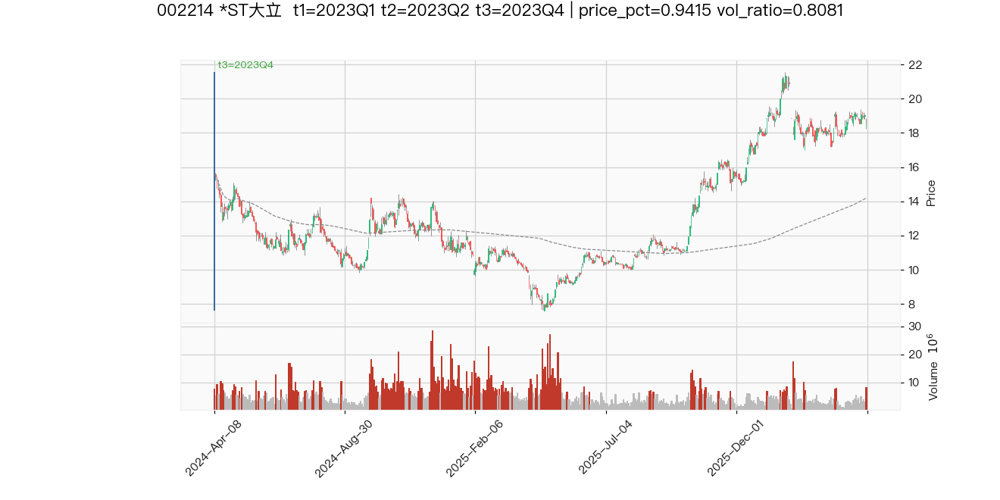

#### 🔍 检测依据 — 002214 *ST大立
> 最佳 triple: **2023Q1 → 2023Q2 → 2023Q4** ｜ B 触发: price_pct=0.94 vol_ratio=0.81 ｜ t2 后 60 日收益: 0.7% ｜ 候选 triple 数: 3

#### 📊 港中结持仓节奏 — 002214 *ST大立

| 季度     |   持股量(万股) |   持股市值(亿) |
|:-------|----------:|----------:|
| 2022Q4 |     524.7 |      0.69 |
| 2023Q1 |     802.5 |      1.2  |
| 2023Q2 |     758.2 |      1.03 |
| 2023Q3 |     645.3 |      0.77 |
| 2023Q4 |     954.4 |      1.09 |
| 2024Q1 |     633.8 |      0.95 |
| 2024Q2 |     752.5 |      0.85 |
| 2024Q3 |     968   |      1.1  |

#### ✍️ 人工复盘 — 002214 *ST大立

| 检查项 | 结果 |
|--------|------|
| t2 季度价格在近 250 日高位区间（视觉） | ⬜ |
| t2 季度出现明显放量 bar（红色高量） | ⬜ |
| t3 季度买回后股价未大幅上涨（非卖飞） | ⬜ |
| t1→t2→t3 三段节奏符合「建仓→出货→再建仓」 | ⬜ |

**决策**: ⬜ PASS（纳入关注名单）　⬜ REJECT（假信号）

**备注**: _（人工填写）_

### 002840 华统股份 K 线 + 成交量
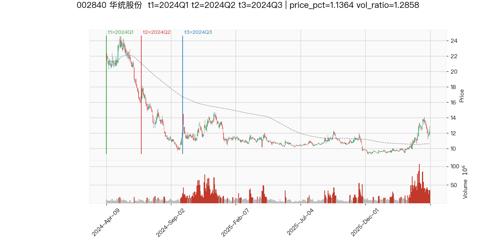

#### 🔍 检测依据 — 002840 华统股份
> 最佳 triple: **2024Q1 → 2024Q2 → 2024Q3** ｜ B 触发: price_pct=1.14 vol_ratio=1.29 ｜ 候选 triple 数: 1

#### 📊 港中结持仓节奏 — 002840 华统股份

| 季度     |   持股量(万股) |   持股市值(亿) |
|:-------|----------:|----------:|
| 2023Q1 |     178.7 |      0.32 |
| 2023Q2 |     169.7 |      0.26 |
| 2023Q3 |     183.5 |      0.26 |
| 2023Q4 |     198.9 |      0.41 |
| 2024Q1 |     361.5 |      0.7  |
| 2024Q2 |     284.7 |      0.47 |
| 2024Q3 |     472.7 |      0.58 |

#### ✍️ 人工复盘 — 002840 华统股份

| 检查项 | 结果 |
|--------|------|
| t2 季度价格在近 250 日高位区间（视觉） | ⬜ |
| t2 季度出现明显放量 bar（红色高量） | ⬜ |
| t3 季度买回后股价未大幅上涨（非卖飞） | ⬜ |
| t1→t2→t3 三段节奏符合「建仓→出货→再建仓」 | ⬜ |

**决策**: ⬜ PASS（纳入关注名单）　⬜ REJECT（假信号）

**备注**: _（人工填写）_

### 603169 兰石重装 K 线 + 成交量
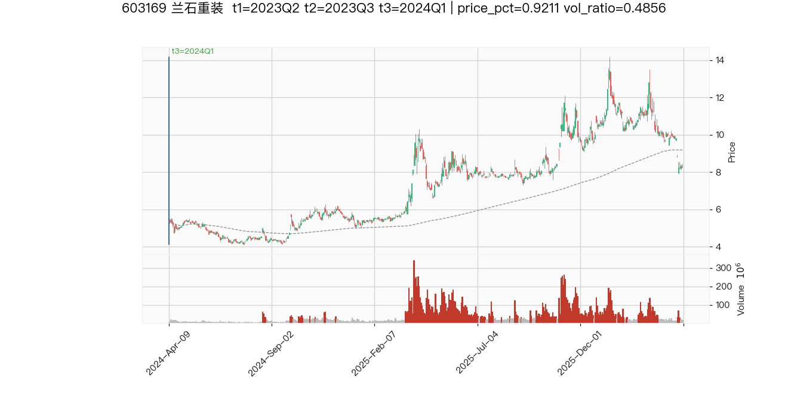

#### 🔍 检测依据 — 603169 兰石重装
> 最佳 triple: **2023Q2 → 2023Q3 → 2024Q1** ｜ B 触发: price_pct=0.92 vol_ratio=0.49 ｜ t2 后 60 日收益: 0.1% ｜ 候选 triple 数: 3

#### 📊 港中结持仓节奏 — 603169 兰石重装

| 季度     |   持股量(万股) |   持股市值(亿) |
|:-------|----------:|----------:|
| 2023Q1 |     113.7 |      0.09 |
| 2023Q2 |     419.6 |      0.31 |
| 2023Q3 |     388   |      0.25 |
| 2023Q4 |     347.7 |      0.21 |
| 2024Q1 |     700.2 |      0.37 |
| 2024Q2 |     506.5 |      0.23 |
| 2024Q3 |     687.6 |      0.31 |

#### ✍️ 人工复盘 — 603169 兰石重装

| 检查项 | 结果 |
|--------|------|
| t2 季度价格在近 250 日高位区间（视觉） | ⬜ |
| t2 季度出现明显放量 bar（红色高量） | ⬜ |
| t3 季度买回后股价未大幅上涨（非卖飞） | ⬜ |
| t1→t2→t3 三段节奏符合「建仓→出货→再建仓」 | ⬜ |

**决策**: ⬜ PASS（纳入关注名单）　⬜ REJECT（假信号）

**备注**: _（人工填写）_

### 002847 盐津铺子 K 线 + 成交量
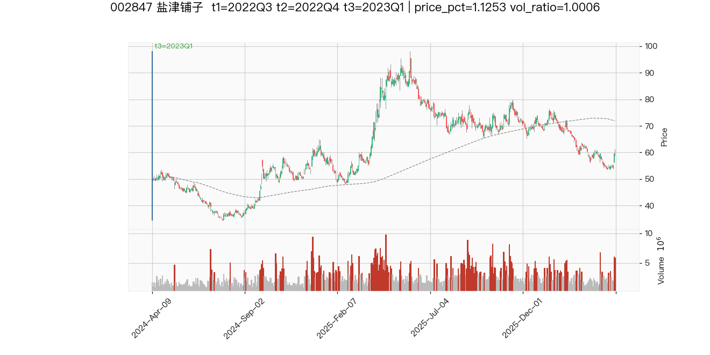

#### 🔍 检测依据 — 002847 盐津铺子
> 最佳 triple: **2022Q3 → 2022Q4 → 2023Q1** ｜ B 触发: price_pct=1.13 vol_ratio=1.00 ｜ 候选 triple 数: 3

#### 📊 港中结持仓节奏 — 002847 盐津铺子

| 季度     |   持股量(万股) |   持股市值(亿) |
|:-------|----------:|----------:|
| 2022Q4 |     195.7 |      2.12 |
| 2023Q1 |     344.6 |      4.65 |
| 2023Q2 |     261.8 |      2.23 |
| 2023Q3 |     604.8 |      4.5  |
| 2023Q4 |     362.5 |      2.52 |
| 2024Q1 |     360.5 |      2.74 |
| 2024Q2 |     711.7 |      3.04 |
| 2024Q3 |     779.1 |      3.01 |

#### ✍️ 人工复盘 — 002847 盐津铺子

| 检查项 | 结果 |
|--------|------|
| t2 季度价格在近 250 日高位区间（视觉） | ⬜ |
| t2 季度出现明显放量 bar（红色高量） | ⬜ |
| t3 季度买回后股价未大幅上涨（非卖飞） | ⬜ |
| t1→t2→t3 三段节奏符合「建仓→出货→再建仓」 | ⬜ |

**决策**: ⬜ PASS（纳入关注名单）　⬜ REJECT（假信号）

**备注**: _（人工填写）_

### 002867 周大生 K 线 + 成交量
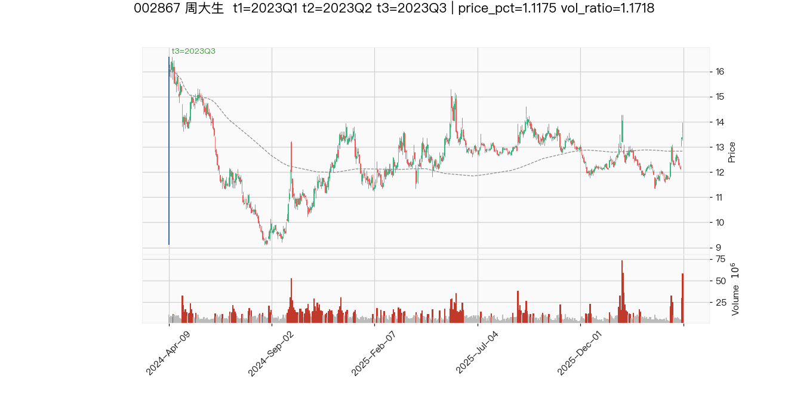

#### 🔍 检测依据 — 002867 周大生
> 最佳 triple: **2023Q1 → 2023Q2 → 2023Q3** ｜ B 触发: price_pct=1.12 vol_ratio=1.17 ｜ 候选 triple 数: 2

#### 📊 港中结持仓节奏 — 002867 周大生

| 季度     |   持股量(万股) |   持股市值(亿) |
|:-------|----------:|----------:|
| 2022Q4 |    2568.1 |      3.6  |
| 2023Q1 |    3488.8 |      5.53 |
| 2023Q2 |    2654.4 |      4.72 |
| 2023Q3 |    3276   |      5.8  |
| 2023Q4 |    2593.2 |      3.94 |
| 2024Q1 |    2756.6 |      5.08 |
| 2024Q2 |    2102.5 |      2.75 |
| 2024Q3 |    1024   |      1.08 |

#### ✍️ 人工复盘 — 002867 周大生

| 检查项 | 结果 |
|--------|------|
| t2 季度价格在近 250 日高位区间（视觉） | ⬜ |
| t2 季度出现明显放量 bar（红色高量） | ⬜ |
| t3 季度买回后股价未大幅上涨（非卖飞） | ⬜ |
| t1→t2→t3 三段节奏符合「建仓→出货→再建仓」 | ⬜ |

**决策**: ⬜ PASS（纳入关注名单）　⬜ REJECT（假信号）

**备注**: _（人工填写）_

### 002818 富森美 K 线 + 成交量
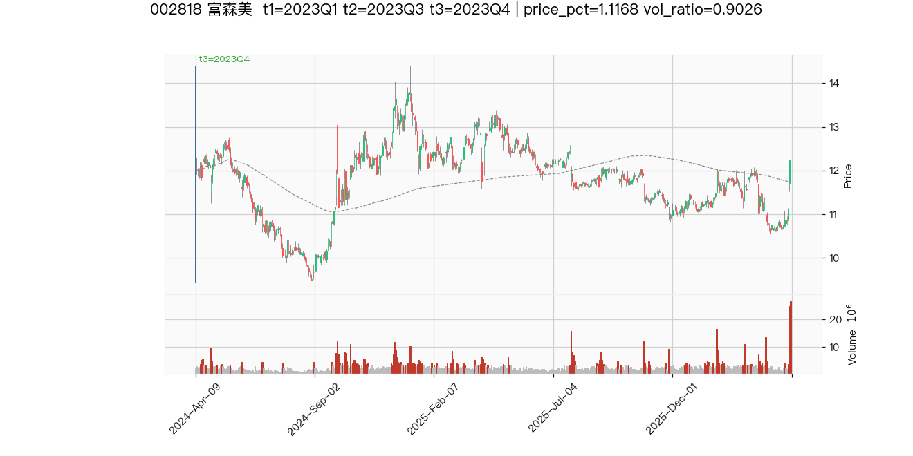

#### 🔍 检测依据 — 002818 富森美
> 最佳 triple: **2023Q1 → 2023Q3 → 2023Q4** ｜ B 触发: price_pct=1.12 vol_ratio=0.90 ｜ 候选 triple 数: 1

#### 📊 港中结持仓节奏 — 002818 富森美

| 季度     |   持股量(万股) |   持股市值(亿) |
|:-------|----------:|----------:|
| 2022Q4 |     299.7 |      0.37 |
| 2023Q1 |     422   |      0.58 |
| 2023Q2 |     433.8 |      0.56 |
| 2023Q3 |     391.2 |      0.55 |
| 2023Q4 |     787.4 |      0.98 |
| 2024Q1 |     869.1 |      1.17 |
| 2024Q2 |     575.3 |      0.71 |
| 2024Q3 |     508.5 |      0.57 |

#### ✍️ 人工复盘 — 002818 富森美

| 检查项 | 结果 |
|--------|------|
| t2 季度价格在近 250 日高位区间（视觉） | ⬜ |
| t2 季度出现明显放量 bar（红色高量） | ⬜ |
| t3 季度买回后股价未大幅上涨（非卖飞） | ⬜ |
| t1→t2→t3 三段节奏符合「建仓→出货→再建仓」 | ⬜ |

**决策**: ⬜ PASS（纳入关注名单）　⬜ REJECT（假信号）

**备注**: _（人工填写）_

### 300873 海晨股份 K 线 + 成交量
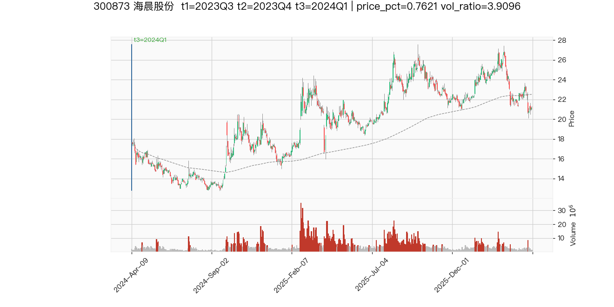

#### 🔍 检测依据 — 300873 海晨股份
> 最佳 triple: **2023Q3 → 2023Q4 → 2024Q1** ｜ B 触发: price_pct=0.76 vol_ratio=3.91 ｜ 候选 triple 数: 1

#### 📊 港中结持仓节奏 — 300873 海晨股份

| 季度     |   持股量(万股) |   持股市值(亿) |
|:-------|----------:|----------:|
| 2023Q1 |      81.2 |      0.24 |
| 2023Q2 |     147.7 |      0.29 |
| 2023Q3 |     187.4 |      0.34 |
| 2023Q4 |      60.9 |      0.14 |
| 2024Q1 |     243   |      0.44 |
| 2024Q2 |     274.7 |      0.4  |
| 2024Q3 |     351.1 |      0.5  |

#### ✍️ 人工复盘 — 300873 海晨股份

| 检查项 | 结果 |
|--------|------|
| t2 季度价格在近 250 日高位区间（视觉） | ⬜ |
| t2 季度出现明显放量 bar（红色高量） | ⬜ |
| t3 季度买回后股价未大幅上涨（非卖飞） | ⬜ |
| t1→t2→t3 三段节奏符合「建仓→出货→再建仓」 | ⬜ |

**决策**: ⬜ PASS（纳入关注名单）　⬜ REJECT（假信号）

**备注**: _（人工填写）_

### 301096 百诚医药 K 线 + 成交量
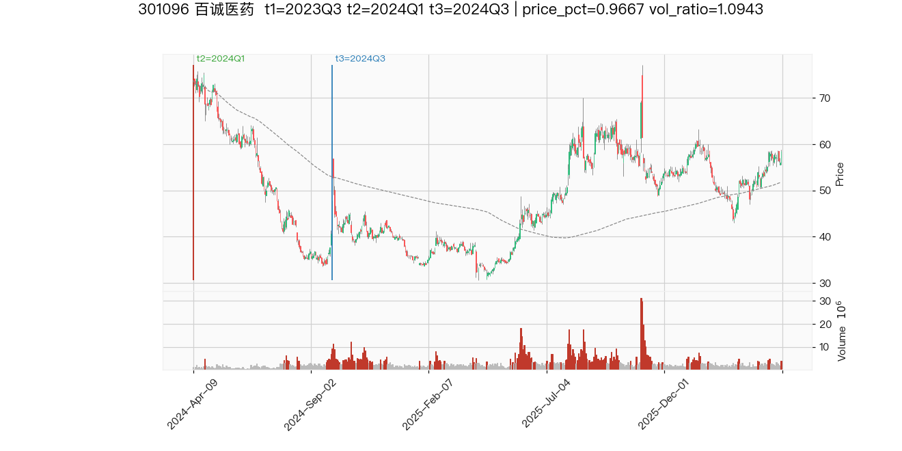

#### 🔍 检测依据 — 301096 百诚医药
> 最佳 triple: **2023Q3 → 2024Q1 → 2024Q3** ｜ B 触发: price_pct=0.97 vol_ratio=1.09 ｜ t2 后 60 日收益: 3.1% ｜ 候选 triple 数: 3

#### 📊 港中结持仓节奏 — 301096 百诚医药

| 季度     |   持股量(万股) |   持股市值(亿) |
|:-------|----------:|----------:|
| 2023Q1 |       4   |      0.03 |
| 2023Q2 |       8.5 |      0.05 |
| 2023Q3 |     122.9 |      0.85 |
| 2023Q4 |      63.8 |      0.42 |
| 2024Q1 |      53.5 |      0.4  |
| 2024Q2 |      48.9 |      0.28 |
| 2024Q3 |      87.9 |      0.34 |

#### ✍️ 人工复盘 — 301096 百诚医药

| 检查项 | 结果 |
|--------|------|
| t2 季度价格在近 250 日高位区间（视觉） | ⬜ |
| t2 季度出现明显放量 bar（红色高量） | ⬜ |
| t3 季度买回后股价未大幅上涨（非卖飞） | ⬜ |
| t1→t2→t3 三段节奏符合「建仓→出货→再建仓」 | ⬜ |

**决策**: ⬜ PASS（纳入关注名单）　⬜ REJECT（假信号）

**备注**: _（人工填写）_

### 002145 钛能化学 K 线 + 成交量
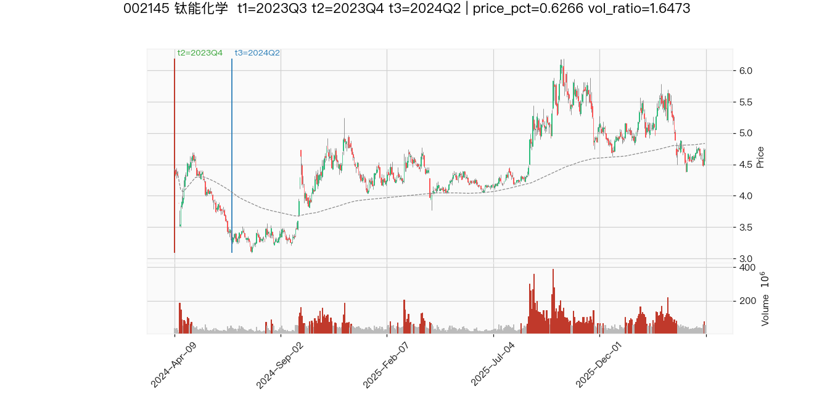

#### 🔍 检测依据 — 002145 钛能化学
> 最佳 triple: **2023Q3 → 2023Q4 → 2024Q2** ｜ B 触发: price_pct=0.63 vol_ratio=1.65 ｜ t2 后 60 日收益: 0.4% ｜ 候选 triple 数: 3

#### 📊 港中结持仓节奏 — 002145 钛能化学

| 季度     |   持股量(万股) |   持股市值(亿) |
|:-------|----------:|----------:|
| 2022Q4 |    3494.5 |      2.15 |
| 2023Q1 |    4374.7 |      2.84 |
| 2023Q2 |    3675.1 |      2.12 |
| 2023Q3 |    4890.1 |      2.26 |
| 2023Q4 |    4226.5 |      1.89 |
| 2024Q1 |    3274.3 |      1.34 |
| 2024Q2 |    4303.5 |      1.41 |
| 2024Q3 |    3781.1 |      1.27 |

#### ✍️ 人工复盘 — 002145 钛能化学

| 检查项 | 结果 |
|--------|------|
| t2 季度价格在近 250 日高位区间（视觉） | ⬜ |
| t2 季度出现明显放量 bar（红色高量） | ⬜ |
| t3 季度买回后股价未大幅上涨（非卖飞） | ⬜ |
| t1→t2→t3 三段节奏符合「建仓→出货→再建仓」 | ⬜ |

**决策**: ⬜ PASS（纳入关注名单）　⬜ REJECT（假信号）

**备注**: _（人工填写）_

### 300224 正海磁材 K 线 + 成交量
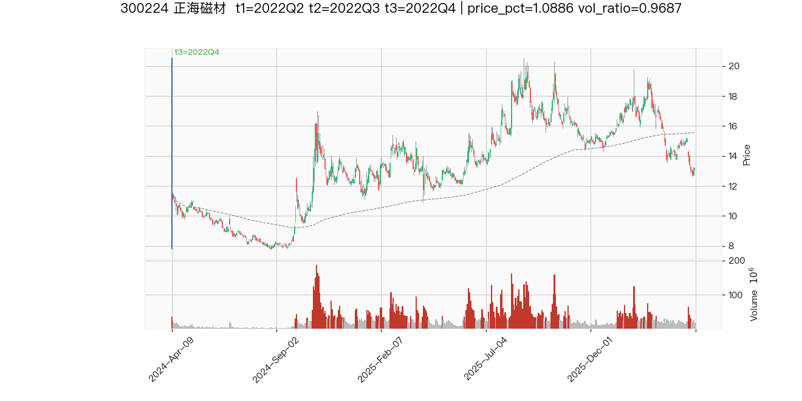

#### 🔍 检测依据 — 300224 正海磁材
> 最佳 triple: **2022Q2 → 2022Q3 → 2022Q4** ｜ B 触发: price_pct=1.09 vol_ratio=0.97 ｜ 候选 triple 数: 4

#### 📊 港中结持仓节奏 — 300224 正海磁材

| 季度     |   持股量(万股) |   持股市值(亿) |
|:-------|----------:|----------:|
| 2022Q4 |    1397.3 |      1.75 |
| 2023Q1 |     369.8 |      0.46 |
| 2023Q2 |     438.6 |      0.56 |
| 2023Q3 |     390.2 |      0.46 |
| 2023Q4 |     608.4 |      0.71 |
| 2024Q1 |     341.2 |      0.37 |
| 2024Q2 |     599   |      0.55 |
| 2024Q3 |     510.3 |      0.42 |

#### ✍️ 人工复盘 — 300224 正海磁材

| 检查项 | 结果 |
|--------|------|
| t2 季度价格在近 250 日高位区间（视觉） | ⬜ |
| t2 季度出现明显放量 bar（红色高量） | ⬜ |
| t3 季度买回后股价未大幅上涨（非卖飞） | ⬜ |
| t1→t2→t3 三段节奏符合「建仓→出货→再建仓」 | ⬜ |

**决策**: ⬜ PASS（纳入关注名单）　⬜ REJECT（假信号）

**备注**: _（人工填写）_

### 300009 安科生物 K 线 + 成交量
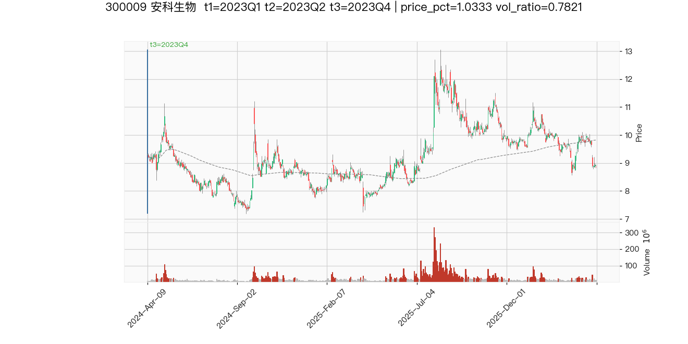

#### 🔍 检测依据 — 300009 安科生物
> 最佳 triple: **2023Q1 → 2023Q2 → 2023Q4** ｜ B 触发: price_pct=1.03 vol_ratio=0.78 ｜ t2 后 60 日收益: 5.6% ｜ 候选 triple 数: 2

#### 📊 港中结持仓节奏 — 300009 安科生物

| 季度     |   持股量(万股) |   持股市值(亿) |
|:-------|----------:|----------:|
| 2022Q4 |    2689   |      2.52 |
| 2023Q1 |    6976.6 |      7.71 |
| 2023Q2 |    4281.8 |      4.25 |
| 2023Q3 |    2562.2 |      2.55 |
| 2023Q4 |    4466.4 |      4.56 |
| 2024Q1 |    3895.8 |      3.75 |
| 2024Q2 |    2208.2 |      1.89 |
| 2024Q3 |    2171.2 |      1.86 |

#### ✍️ 人工复盘 — 300009 安科生物

| 检查项 | 结果 |
|--------|------|
| t2 季度价格在近 250 日高位区间（视觉） | ⬜ |
| t2 季度出现明显放量 bar（红色高量） | ⬜ |
| t3 季度买回后股价未大幅上涨（非卖飞） | ⬜ |
| t1→t2→t3 三段节奏符合「建仓→出货→再建仓」 | ⬜ |

**决策**: ⬜ PASS（纳入关注名单）　⬜ REJECT（假信号）

**备注**: _（人工填写）_

### 000156 华数传媒 K 线 + 成交量
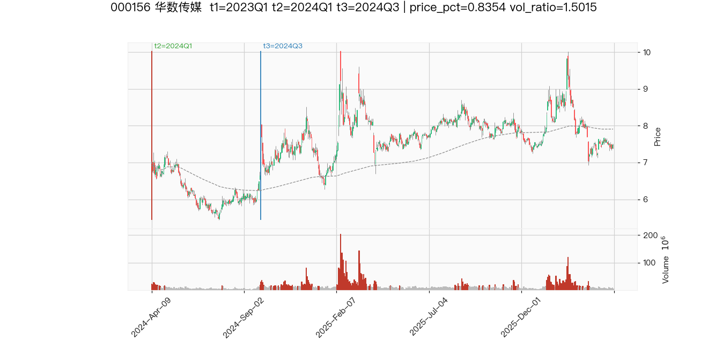

#### 🔍 检测依据 — 000156 华数传媒
> 最佳 triple: **2023Q1 → 2024Q1 → 2024Q3** ｜ B 触发: price_pct=0.84 vol_ratio=1.50 ｜ t2 后 60 日收益: -0.9% ｜ 候选 triple 数: 2

#### 📊 港中结持仓节奏 — 000156 华数传媒

| 季度     |   持股量(万股) |   持股市值(亿) |
|:-------|----------:|----------:|
| 2022Q4 |    2443.1 |      1.83 |
| 2023Q1 |    5008   |      4.48 |
| 2023Q2 |    4307.4 |      3.75 |
| 2023Q3 |    3572   |      2.74 |
| 2023Q4 |    2404.1 |      1.77 |
| 2024Q1 |    1192.5 |      1.03 |
| 2024Q2 |    1190.3 |      0.75 |
| 2024Q3 |    1532.3 |      0.99 |

#### ✍️ 人工复盘 — 000156 华数传媒

| 检查项 | 结果 |
|--------|------|
| t2 季度价格在近 250 日高位区间（视觉） | ⬜ |
| t2 季度出现明显放量 bar（红色高量） | ⬜ |
| t3 季度买回后股价未大幅上涨（非卖飞） | ⬜ |
| t1→t2→t3 三段节奏符合「建仓→出货→再建仓」 | ⬜ |

**决策**: ⬜ PASS（纳入关注名单）　⬜ REJECT（假信号）

**备注**: _（人工填写）_

### 000061 农产品 K 线 + 成交量
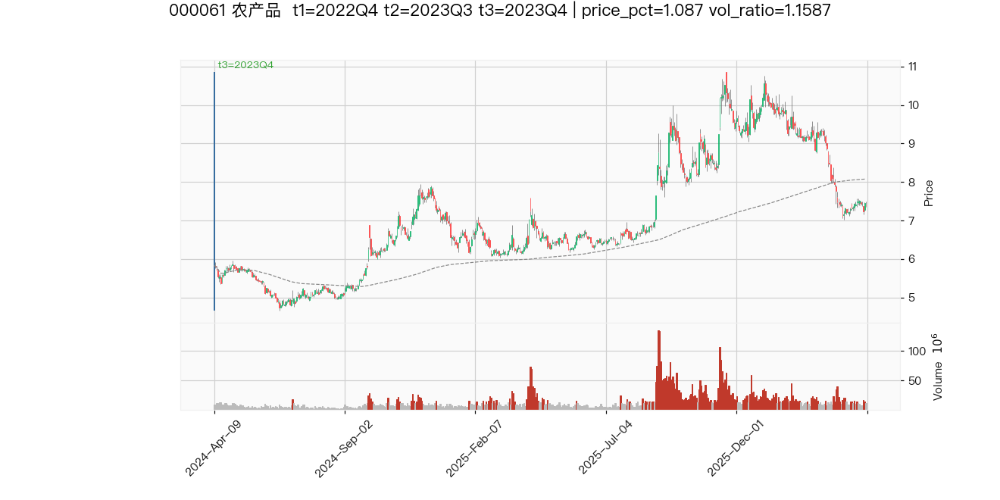

#### 🔍 检测依据 — 000061 农产品
> 最佳 triple: **2022Q4 → 2023Q3 → 2023Q4** ｜ B 触发: price_pct=1.09 vol_ratio=1.16 ｜ 候选 triple 数: 3

#### 📊 港中结持仓节奏 — 000061 农产品

| 季度     |   持股量(万股) |   持股市值(亿) |
|:-------|----------:|----------:|
| 2022Q4 |    1840   |      1.05 |
| 2023Q1 |    1569.5 |      0.9  |
| 2023Q2 |    1466.8 |      0.87 |
| 2023Q3 |    1206.4 |      0.83 |
| 2023Q4 |    1490.5 |      0.96 |
| 2024Q1 |    1689.7 |      0.99 |
| 2024Q2 |    1270.2 |      0.62 |
| 2024Q3 |     968.2 |      0.5  |

#### ✍️ 人工复盘 — 000061 农产品

| 检查项 | 结果 |
|--------|------|
| t2 季度价格在近 250 日高位区间（视觉） | ⬜ |
| t2 季度出现明显放量 bar（红色高量） | ⬜ |
| t3 季度买回后股价未大幅上涨（非卖飞） | ⬜ |
| t1→t2→t3 三段节奏符合「建仓→出货→再建仓」 | ⬜ |

**决策**: ⬜ PASS（纳入关注名单）　⬜ REJECT（假信号）

**备注**: _（人工填写）_

### 600452 涪陵电力 K 线 + 成交量
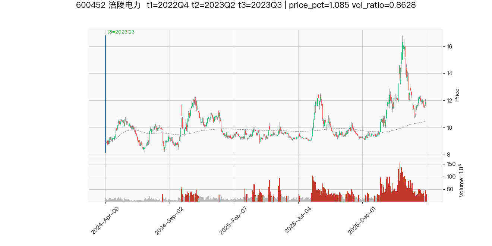

#### 🔍 检测依据 — 600452 涪陵电力
> 最佳 triple: **2022Q4 → 2023Q2 → 2023Q3** ｜ B 触发: price_pct=1.08 vol_ratio=0.86 ｜ 候选 triple 数: 3

#### 📊 港中结持仓节奏 — 600452 涪陵电力

| 季度     |   持股量(万股) |   持股市值(亿) |
|:-------|----------:|----------:|
| 2022Q4 |    1661.6 |      2.51 |
| 2023Q1 |    1516.3 |      2.92 |
| 2023Q2 |    1058.5 |      2.25 |
| 2023Q3 |    1195.9 |      1.55 |
| 2023Q4 |    1230   |      1.62 |
| 2024Q1 |     882.9 |      1.18 |
| 2024Q2 |    1494.9 |      1.89 |
| 2024Q3 |    1821.8 |      1.65 |

#### ✍️ 人工复盘 — 600452 涪陵电力

| 检查项 | 结果 |
|--------|------|
| t2 季度价格在近 250 日高位区间（视觉） | ⬜ |
| t2 季度出现明显放量 bar（红色高量） | ⬜ |
| t3 季度买回后股价未大幅上涨（非卖飞） | ⬜ |
| t1→t2→t3 三段节奏符合「建仓→出货→再建仓」 | ⬜ |

**决策**: ⬜ PASS（纳入关注名单）　⬜ REJECT（假信号）

**备注**: _（人工填写）_

### 600997 开滦股份 K 线 + 成交量
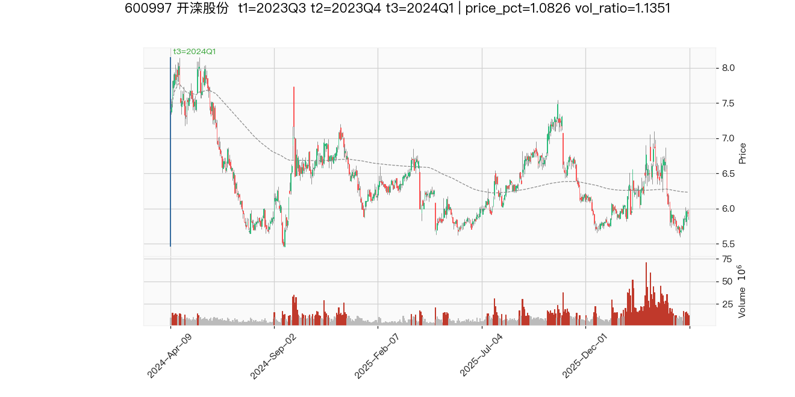

#### 🔍 检测依据 — 600997 开滦股份
> 最佳 triple: **2023Q3 → 2023Q4 → 2024Q1** ｜ B 触发: price_pct=1.08 vol_ratio=1.14 ｜ 候选 triple 数: 1

#### 📊 港中结持仓节奏 — 600997 开滦股份

| 季度     |   持股量(万股) |   持股市值(亿) |
|:-------|----------:|----------:|
| 2022Q4 |      16.2 |      0.01 |
| 2023Q1 |     421.5 |      0.29 |
| 2023Q2 |     735.1 |      0.44 |
| 2023Q3 |    1306.3 |      0.88 |
| 2023Q4 |    1117.8 |      0.85 |
| 2024Q1 |    2572.2 |      1.92 |
| 2024Q2 |    1880.3 |      1.29 |
| 2024Q3 |     785.3 |      0.48 |

#### ✍️ 人工复盘 — 600997 开滦股份

| 检查项 | 结果 |
|--------|------|
| t2 季度价格在近 250 日高位区间（视觉） | ⬜ |
| t2 季度出现明显放量 bar（红色高量） | ⬜ |
| t3 季度买回后股价未大幅上涨（非卖飞） | ⬜ |
| t1→t2→t3 三段节奏符合「建仓→出货→再建仓」 | ⬜ |

**决策**: ⬜ PASS（纳入关注名单）　⬜ REJECT（假信号）

**备注**: _（人工填写）_

### 000810 创维数字 K 线 + 成交量
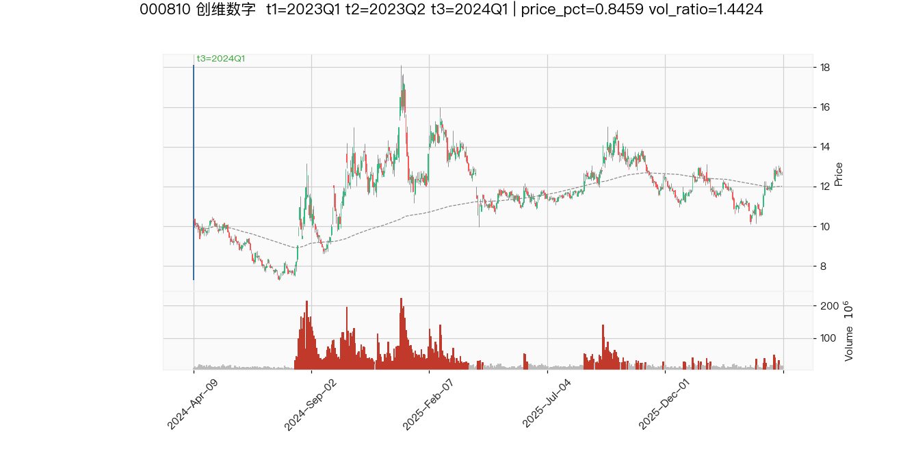

#### 🔍 检测依据 — 000810 创维数字
> 最佳 triple: **2023Q1 → 2023Q2 → 2024Q1** ｜ B 触发: price_pct=0.85 vol_ratio=1.44 ｜ t2 后 60 日收益: -2.0% ｜ 候选 triple 数: 3

#### 📊 港中结持仓节奏 — 000810 创维数字

| 季度     |   持股量(万股) |   持股市值(亿) |
|:-------|----------:|----------:|
| 2022Q4 |     569.4 |      0.79 |
| 2023Q1 |    1039.2 |      1.97 |
| 2023Q2 |     899.3 |      1.42 |
| 2023Q3 |     841.3 |      1.15 |
| 2023Q4 |     836.5 |      1.31 |
| 2024Q1 |    1733.9 |      1.9  |
| 2024Q2 |    1493.2 |      1.28 |
| 2024Q3 |     858.7 |      0.86 |

#### ✍️ 人工复盘 — 000810 创维数字

| 检查项 | 结果 |
|--------|------|
| t2 季度价格在近 250 日高位区间（视觉） | ⬜ |
| t2 季度出现明显放量 bar（红色高量） | ⬜ |
| t3 季度买回后股价未大幅上涨（非卖飞） | ⬜ |
| t1→t2→t3 三段节奏符合「建仓→出货→再建仓」 | ⬜ |

**决策**: ⬜ PASS（纳入关注名单）　⬜ REJECT（假信号）

**备注**: _（人工填写）_

### 002737 葵花药业 K 线 + 成交量
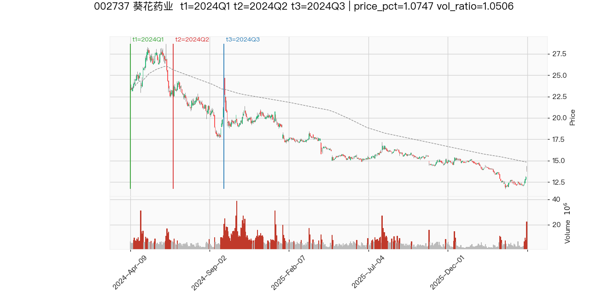

#### 🔍 检测依据 — 002737 葵花药业
> 最佳 triple: **2024Q1 → 2024Q2 → 2024Q3** ｜ B 触发: price_pct=1.07 vol_ratio=1.05 ｜ 候选 triple 数: 3

#### 📊 港中结持仓节奏 — 002737 葵花药业

| 季度     |   持股量(万股) |   持股市值(亿) |
|:-------|----------:|----------:|
| 2022Q4 |    1941.4 |      4.5  |
| 2023Q1 |    1212.3 |      2.67 |
| 2023Q2 |    1749.5 |      4.18 |
| 2023Q3 |    1586.6 |      3.96 |
| 2023Q4 |     984.7 |      2.56 |
| 2024Q1 |    1167.4 |      3.21 |
| 2024Q2 |     444.8 |      1.04 |
| 2024Q3 |     481.7 |      1.08 |

#### ✍️ 人工复盘 — 002737 葵花药业

| 检查项 | 结果 |
|--------|------|
| t2 季度价格在近 250 日高位区间（视觉） | ⬜ |
| t2 季度出现明显放量 bar（红色高量） | ⬜ |
| t3 季度买回后股价未大幅上涨（非卖飞） | ⬜ |
| t1→t2→t3 三段节奏符合「建仓→出货→再建仓」 | ⬜ |

**决策**: ⬜ PASS（纳入关注名单）　⬜ REJECT（假信号）

**备注**: _（人工填写）_

### 603619 中曼石油 K 线 + 成交量
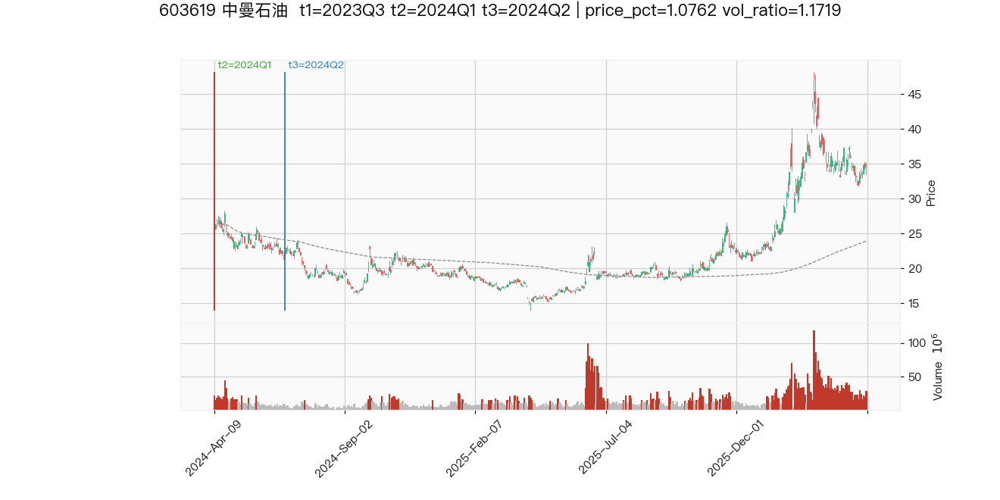

#### 🔍 检测依据 — 603619 中曼石油
> 最佳 triple: **2023Q3 → 2024Q1 → 2024Q2** ｜ B 触发: price_pct=1.08 vol_ratio=1.17 ｜ 候选 triple 数: 1

#### 📊 港中结持仓节奏 — 603619 中曼石油

| 季度     |   持股量(万股) |   持股市值(亿) |
|:-------|----------:|----------:|
| 2022Q4 |       0   |      0    |
| 2023Q1 |     252.9 |      0.41 |
| 2023Q2 |     577.8 |      0.98 |
| 2023Q3 |    1282.7 |      2.79 |
| 2023Q4 |    1234.8 |      2.29 |
| 2024Q1 |     330   |      0.77 |
| 2024Q2 |     566.4 |      1.33 |
| 2024Q3 |     379.9 |      0.77 |

#### ✍️ 人工复盘 — 603619 中曼石油

| 检查项 | 结果 |
|--------|------|
| t2 季度价格在近 250 日高位区间（视觉） | ⬜ |
| t2 季度出现明显放量 bar（红色高量） | ⬜ |
| t3 季度买回后股价未大幅上涨（非卖飞） | ⬜ |
| t1→t2→t3 三段节奏符合「建仓→出货→再建仓」 | ⬜ |

**决策**: ⬜ PASS（纳入关注名单）　⬜ REJECT（假信号）

**备注**: _（人工填写）_

### 600874 创业环保 K 线 + 成交量
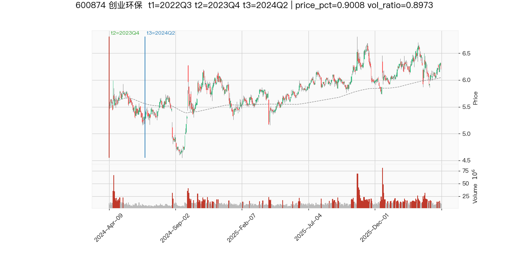

#### 🔍 检测依据 — 600874 创业环保
> 最佳 triple: **2022Q3 → 2023Q4 → 2024Q2** ｜ B 触发: price_pct=0.90 vol_ratio=0.90 ｜ t2 后 60 日收益: 1.5% ｜ 候选 triple 数: 2

#### 📊 港中结持仓节奏 — 600874 创业环保

| 季度     |   持股量(万股) |   持股市值(亿) |
|:-------|----------:|----------:|
| 2022Q4 |    1320.3 |      0.8  |
| 2023Q1 |    1138.4 |      0.67 |
| 2023Q2 |    1095.8 |      0.64 |
| 2023Q3 |    1120   |      0.65 |
| 2023Q4 |     920.6 |      0.51 |
| 2024Q1 |     881.9 |      0.49 |
| 2024Q2 |    1168.9 |      0.65 |
| 2024Q3 |    1247.7 |      0.72 |

#### ✍️ 人工复盘 — 600874 创业环保

| 检查项 | 结果 |
|--------|------|
| t2 季度价格在近 250 日高位区间（视觉） | ⬜ |
| t2 季度出现明显放量 bar（红色高量） | ⬜ |
| t3 季度买回后股价未大幅上涨（非卖飞） | ⬜ |
| t1→t2→t3 三段节奏符合「建仓→出货→再建仓」 | ⬜ |

**决策**: ⬜ PASS（纳入关注名单）　⬜ REJECT（假信号）

**备注**: _（人工填写）_

### 301345 涛涛车业 K 线 + 成交量
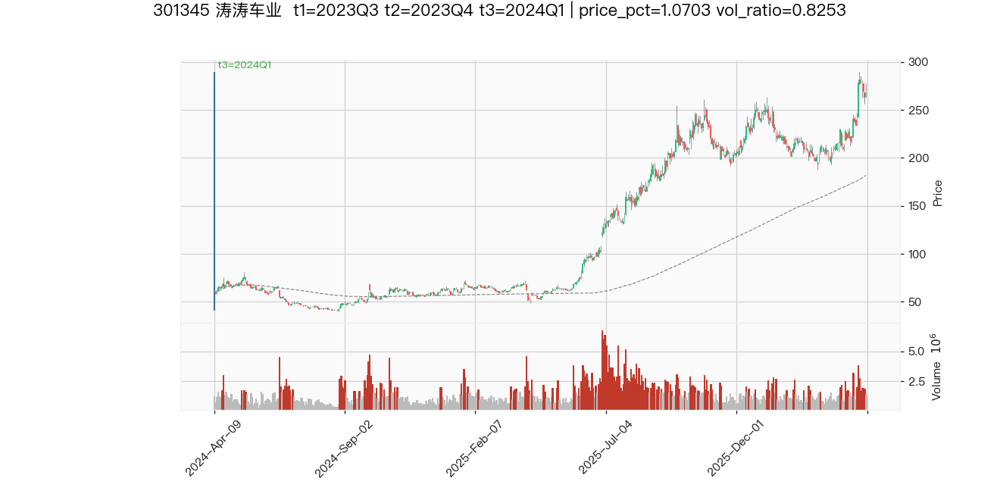

#### 🔍 检测依据 — 301345 涛涛车业
> 最佳 triple: **2023Q3 → 2023Q4 → 2024Q1** ｜ B 触发: price_pct=1.07 vol_ratio=0.83 ｜ 候选 triple 数: 1

#### 📊 港中结持仓节奏 — 301345 涛涛车业

| 季度     |   持股量(万股) |   持股市值(亿) |
|:-------|----------:|----------:|
| 2023Q2 |      24.9 |      0.12 |
| 2023Q3 |      58.4 |      0.29 |
| 2023Q4 |      17.8 |      0.11 |
| 2024Q1 |      21   |      0.13 |
| 2024Q2 |     142.9 |      0.79 |
| 2024Q3 |     217.3 |      0.96 |

#### ✍️ 人工复盘 — 301345 涛涛车业

| 检查项 | 结果 |
|--------|------|
| t2 季度价格在近 250 日高位区间（视觉） | ⬜ |
| t2 季度出现明显放量 bar（红色高量） | ⬜ |
| t3 季度买回后股价未大幅上涨（非卖飞） | ⬜ |
| t1→t2→t3 三段节奏符合「建仓→出货→再建仓」 | ⬜ |

**决策**: ⬜ PASS（纳入关注名单）　⬜ REJECT（假信号）

**备注**: _（人工填写）_

### 603456 九洲药业 K 线 + 成交量
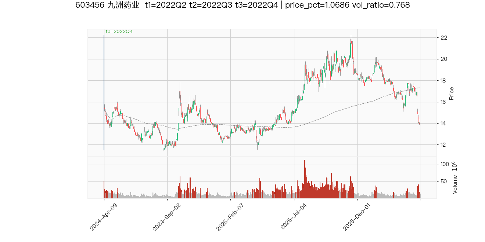

#### 🔍 检测依据 — 603456 九洲药业
> 最佳 triple: **2022Q2 → 2022Q3 → 2022Q4** ｜ B 触发: price_pct=1.07 vol_ratio=0.77 ｜ 候选 triple 数: 3

#### 📊 港中结持仓节奏 — 603456 九洲药业

| 季度     |   持股量(万股) |   持股市值(亿) |
|:-------|----------:|----------:|
| 2022Q4 |    1677.4 |      7.12 |
| 2023Q1 |    1644.2 |      5.47 |
| 2023Q2 |    1615.4 |      4.42 |
| 2023Q3 |    1523.9 |      4.42 |
| 2023Q4 |    1311   |      3.17 |
| 2024Q1 |    1399.4 |      2.53 |
| 2024Q2 |     658.5 |      0.9  |
| 2024Q3 |    1118.8 |      1.5  |

#### ✍️ 人工复盘 — 603456 九洲药业

| 检查项 | 结果 |
|--------|------|
| t2 季度价格在近 250 日高位区间（视觉） | ⬜ |
| t2 季度出现明显放量 bar（红色高量） | ⬜ |
| t3 季度买回后股价未大幅上涨（非卖飞） | ⬜ |
| t1→t2→t3 三段节奏符合「建仓→出货→再建仓」 | ⬜ |

**决策**: ⬜ PASS（纳入关注名单）　⬜ REJECT（假信号）

**备注**: _（人工填写）_

### 688598 金博股份 K 线 + 成交量
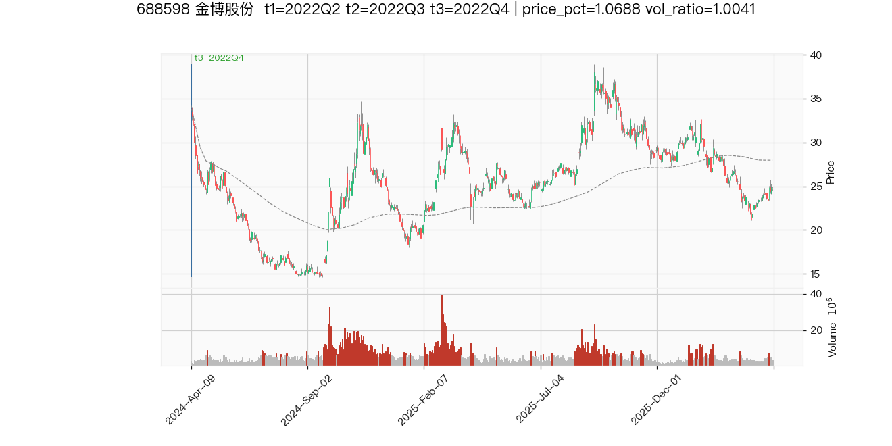

#### 🔍 检测依据 — 688598 金博股份
> 最佳 triple: **2022Q2 → 2022Q3 → 2022Q4** ｜ B 触发: price_pct=1.07 vol_ratio=1.00 ｜ 候选 triple 数: 4

#### 📊 港中结持仓节奏 — 688598 金博股份

| 季度     |   持股量(万股) |   持股市值(亿) |
|:-------|----------:|----------:|
| 2022Q4 |     172.4 |      3.78 |
| 2023Q1 |     134.4 |      2.52 |
| 2023Q2 |     138.1 |      2.37 |
| 2023Q3 |     273.7 |      2.17 |
| 2023Q4 |     236.5 |      1.65 |
| 2024Q1 |     140.4 |      0.69 |
| 2024Q2 |     267.6 |      0.76 |
| 2024Q3 |     265.6 |      0.41 |

#### ✍️ 人工复盘 — 688598 金博股份

| 检查项 | 结果 |
|--------|------|
| t2 季度价格在近 250 日高位区间（视觉） | ⬜ |
| t2 季度出现明显放量 bar（红色高量） | ⬜ |
| t3 季度买回后股价未大幅上涨（非卖飞） | ⬜ |
| t1→t2→t3 三段节奏符合「建仓→出货→再建仓」 | ⬜ |

**决策**: ⬜ PASS（纳入关注名单）　⬜ REJECT（假信号）

**备注**: _（人工填写）_

### 603060 国检集团 K 线 + 成交量
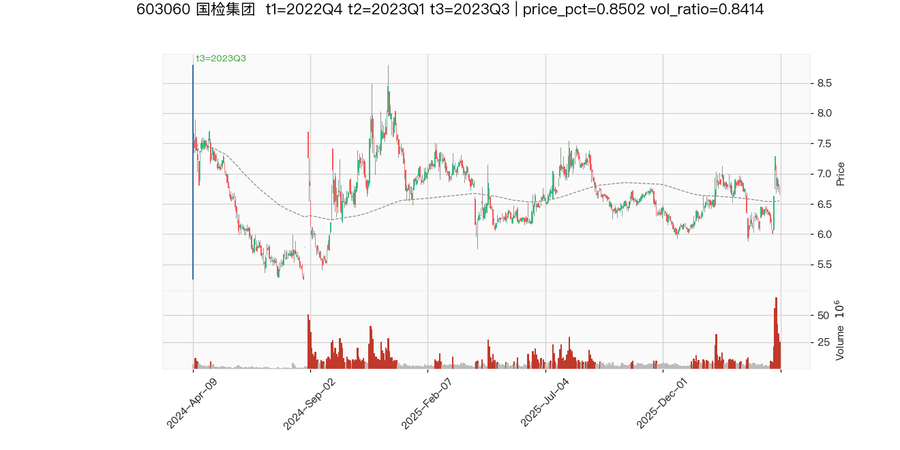

#### 🔍 检测依据 — 603060 国检集团
> 最佳 triple: **2022Q4 → 2023Q1 → 2023Q3** ｜ B 触发: price_pct=0.85 vol_ratio=0.84 ｜ t2 后 60 日收益: -1.2% ｜ 候选 triple 数: 1

#### 📊 港中结持仓节奏 — 603060 国检集团

| 季度     |   持股量(万股) |   持股市值(亿) |
|:-------|----------:|----------:|
| 2022Q4 |    1921.1 |      2.48 |
| 2023Q1 |    1817   |      2.34 |
| 2023Q2 |    1881.4 |      1.91 |
| 2023Q3 |    2315.2 |      2.52 |
| 2023Q4 |    2327.2 |      1.95 |
| 2024Q1 |    2139.1 |      1.58 |
| 2024Q2 |    2083.1 |      1.22 |
| 2024Q3 |    2145.8 |      1.23 |

#### ✍️ 人工复盘 — 603060 国检集团

| 检查项 | 结果 |
|--------|------|
| t2 季度价格在近 250 日高位区间（视觉） | ⬜ |
| t2 季度出现明显放量 bar（红色高量） | ⬜ |
| t3 季度买回后股价未大幅上涨（非卖飞） | ⬜ |
| t1→t2→t3 三段节奏符合「建仓→出货→再建仓」 | ⬜ |

**决策**: ⬜ PASS（纳入关注名单）　⬜ REJECT（假信号）

**备注**: _（人工填写）_

### 600108 亚盛集团 K 线 + 成交量
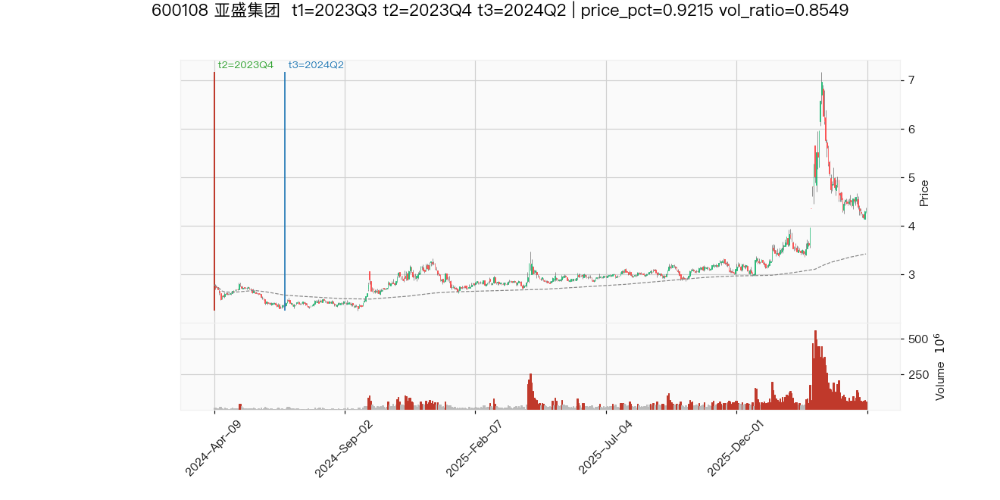

#### 🔍 检测依据 — 600108 亚盛集团
> 最佳 triple: **2023Q3 → 2023Q4 → 2024Q2** ｜ B 触发: price_pct=0.92 vol_ratio=0.85 ｜ t2 后 60 日收益: 2.5% ｜ 候选 triple 数: 2

#### 📊 港中结持仓节奏 — 600108 亚盛集团

| 季度     |   持股量(万股) |   持股市值(亿) |
|:-------|----------:|----------:|
| 2022Q4 |      21.9 |      0.01 |
| 2023Q1 |     141.2 |      0.04 |
| 2023Q2 |     155.3 |      0.05 |
| 2023Q3 |    1359.9 |      0.42 |
| 2023Q4 |     728.8 |      0.2  |
| 2024Q1 |     552.3 |      0.15 |
| 2024Q2 |     774.5 |      0.18 |
| 2024Q3 |    1334.6 |      0.32 |

#### ✍️ 人工复盘 — 600108 亚盛集团

| 检查项 | 结果 |
|--------|------|
| t2 季度价格在近 250 日高位区间（视觉） | ⬜ |
| t2 季度出现明显放量 bar（红色高量） | ⬜ |
| t3 季度买回后股价未大幅上涨（非卖飞） | ⬜ |
| t1→t2→t3 三段节奏符合「建仓→出货→再建仓」 | ⬜ |

**决策**: ⬜ PASS（纳入关注名单）　⬜ REJECT（假信号）

**备注**: _（人工填写）_

### 000059 华锦股份 K 线 + 成交量
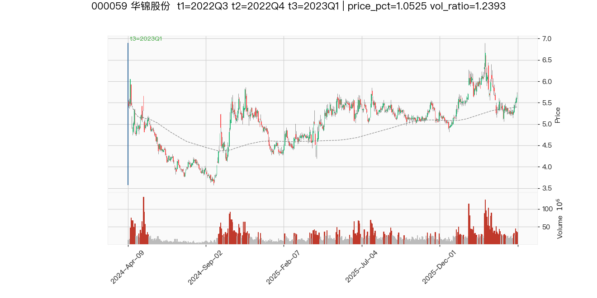

#### 🔍 检测依据 — 000059 华锦股份
> 最佳 triple: **2022Q3 → 2022Q4 → 2023Q1** ｜ B 触发: price_pct=1.05 vol_ratio=1.24 ｜ 候选 triple 数: 3

#### 📊 港中结持仓节奏 — 000059 华锦股份

| 季度     |   持股量(万股) |   持股市值(亿) |
|:-------|----------:|----------:|
| 2022Q4 |    2626.7 |      1.79 |
| 2023Q1 |    3319.9 |      2.47 |
| 2023Q2 |    3443.2 |      2.12 |
| 2023Q3 |    1683.4 |      0.99 |
| 2023Q4 |    1950.4 |      1.07 |
| 2024Q1 |    2304.3 |      1.18 |
| 2024Q2 |    1366.7 |      0.57 |
| 2024Q3 |    1514.3 |      0.61 |

#### ✍️ 人工复盘 — 000059 华锦股份

| 检查项 | 结果 |
|--------|------|
| t2 季度价格在近 250 日高位区间（视觉） | ⬜ |
| t2 季度出现明显放量 bar（红色高量） | ⬜ |
| t3 季度买回后股价未大幅上涨（非卖飞） | ⬜ |
| t1→t2→t3 三段节奏符合「建仓→出货→再建仓」 | ⬜ |

**决策**: ⬜ PASS（纳入关注名单）　⬜ REJECT（假信号）

**备注**: _（人工填写）_

### 600035 楚天高速 K 线 + 成交量
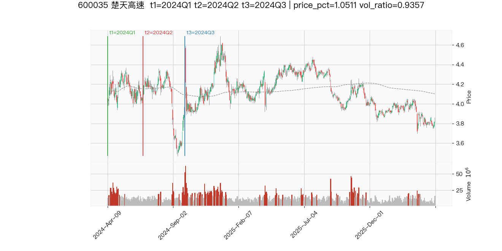

#### 🔍 检测依据 — 600035 楚天高速
> 最佳 triple: **2024Q1 → 2024Q2 → 2024Q3** ｜ B 触发: price_pct=1.05 vol_ratio=0.94 ｜ 候选 triple 数: 1

#### 📊 港中结持仓节奏 — 600035 楚天高速

| 季度     |   持股量(万股) |   持股市值(亿) |
|:-------|----------:|----------:|
| 2023Q1 |     627.7 |      0.22 |
| 2023Q2 |    2804.4 |      1.13 |
| 2023Q3 |    3872.5 |      1.53 |
| 2023Q4 |    4192.3 |      1.6  |
| 2024Q1 |    5038.5 |      2.16 |
| 2024Q2 |    4626.5 |      1.98 |
| 2024Q3 |    5296.6 |      2.36 |

#### ✍️ 人工复盘 — 600035 楚天高速

| 检查项 | 结果 |
|--------|------|
| t2 季度价格在近 250 日高位区间（视觉） | ⬜ |
| t2 季度出现明显放量 bar（红色高量） | ⬜ |
| t3 季度买回后股价未大幅上涨（非卖飞） | ⬜ |
| t1→t2→t3 三段节奏符合「建仓→出货→再建仓」 | ⬜ |

**决策**: ⬜ PASS（纳入关注名单）　⬜ REJECT（假信号）

**备注**: _（人工填写）_

### 002170 芭田股份 K 线 + 成交量
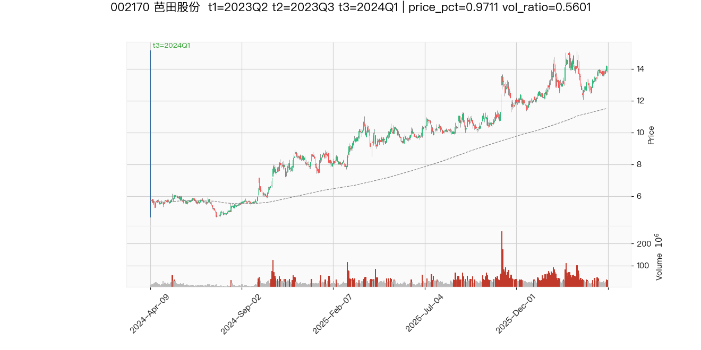

#### 🔍 检测依据 — 002170 芭田股份
> 最佳 triple: **2023Q2 → 2023Q3 → 2024Q1** ｜ B 触发: price_pct=0.97 vol_ratio=0.56 ｜ t2 后 60 日收益: 4.7% ｜ 候选 triple 数: 3

#### 📊 港中结持仓节奏 — 002170 芭田股份

| 季度     |   持股量(万股) |   持股市值(亿) |
|:-------|----------:|----------:|
| 2022Q4 |      47   |      0.03 |
| 2023Q1 |     221.2 |      0.14 |
| 2023Q2 |     798.4 |      0.55 |
| 2023Q3 |     505.6 |      0.28 |
| 2023Q4 |     456.9 |      0.25 |
| 2024Q1 |     546.8 |      0.32 |
| 2024Q2 |     425.3 |      0.26 |
| 2024Q3 |     540.5 |      0.3  |

#### ✍️ 人工复盘 — 002170 芭田股份

| 检查项 | 结果 |
|--------|------|
| t2 季度价格在近 250 日高位区间（视觉） | ⬜ |
| t2 季度出现明显放量 bar（红色高量） | ⬜ |
| t3 季度买回后股价未大幅上涨（非卖飞） | ⬜ |
| t1→t2→t3 三段节奏符合「建仓→出货→再建仓」 | ⬜ |

**决策**: ⬜ PASS（纳入关注名单）　⬜ REJECT（假信号）

**备注**: _（人工填写）_

### 600990 四创电子 K 线 + 成交量
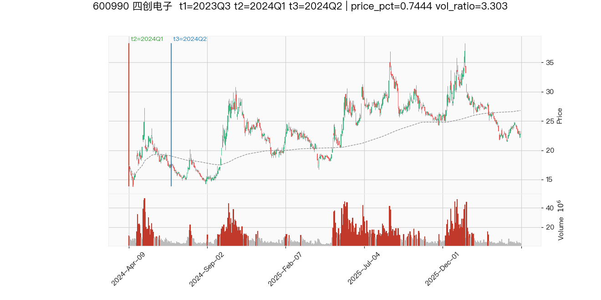

#### 🔍 检测依据 — 600990 四创电子
> 最佳 triple: **2023Q3 → 2024Q1 → 2024Q2** ｜ B 触发: price_pct=0.74 vol_ratio=3.30 ｜ 候选 triple 数: 2

#### 📊 港中结持仓节奏 — 600990 四创电子

| 季度     |   持股量(万股) |   持股市值(亿) |
|:-------|----------:|----------:|
| 2023Q1 |      70.8 |      0.23 |
| 2023Q2 |     160.2 |      0.5  |
| 2023Q3 |     185.6 |      0.4  |
| 2023Q4 |     157   |      0.31 |
| 2024Q1 |     113.6 |      0.21 |
| 2024Q2 |     258.8 |      0.45 |
| 2024Q3 |     294.7 |      0.47 |

#### ✍️ 人工复盘 — 600990 四创电子

| 检查项 | 结果 |
|--------|------|
| t2 季度价格在近 250 日高位区间（视觉） | ⬜ |
| t2 季度出现明显放量 bar（红色高量） | ⬜ |
| t3 季度买回后股价未大幅上涨（非卖飞） | ⬜ |
| t1→t2→t3 三段节奏符合「建仓→出货→再建仓」 | ⬜ |

**决策**: ⬜ PASS（纳入关注名单）　⬜ REJECT（假信号）

**备注**: _（人工填写）_

### 600827 百联股份 K 线 + 成交量
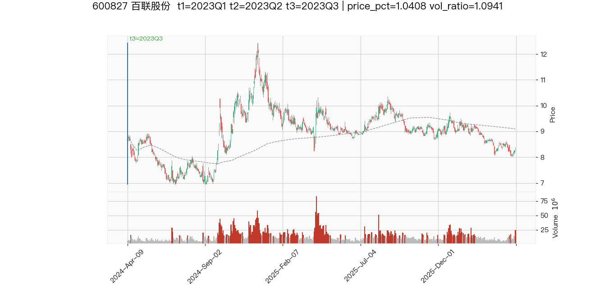

#### 🔍 检测依据 — 600827 百联股份
> 最佳 triple: **2023Q1 → 2023Q2 → 2023Q3** ｜ B 触发: price_pct=1.04 vol_ratio=1.09 ｜ 候选 triple 数: 1

#### 📊 港中结持仓节奏 — 600827 百联股份

| 季度     |   持股量(万股) |   持股市值(亿) |
|:-------|----------:|----------:|
| 2022Q4 |     329.4 |      0.4  |
| 2023Q1 |    1253.1 |      1.63 |
| 2023Q2 |     617.1 |      0.83 |
| 2023Q3 |     768.9 |      0.88 |
| 2023Q4 |     763.6 |      0.72 |
| 2024Q1 |    1077.4 |      0.94 |
| 2024Q2 |     802.3 |      0.59 |
| 2024Q3 |     833.1 |      0.64 |

#### ✍️ 人工复盘 — 600827 百联股份

| 检查项 | 结果 |
|--------|------|
| t2 季度价格在近 250 日高位区间（视觉） | ⬜ |
| t2 季度出现明显放量 bar（红色高量） | ⬜ |
| t3 季度买回后股价未大幅上涨（非卖飞） | ⬜ |
| t1→t2→t3 三段节奏符合「建仓→出货→再建仓」 | ⬜ |

**决策**: ⬜ PASS（纳入关注名单）　⬜ REJECT（假信号）

**备注**: _（人工填写）_

### 002992 宝明科技 K 线 + 成交量
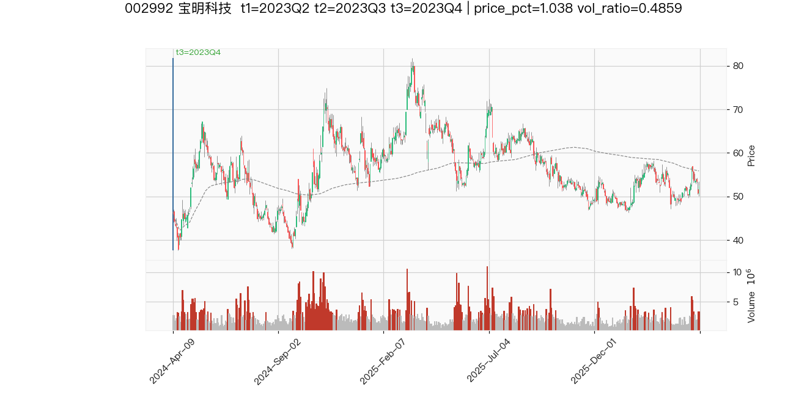

#### 🔍 检测依据 — 002992 宝明科技
> 最佳 triple: **2023Q2 → 2023Q3 → 2023Q4** ｜ B 触发: price_pct=1.04 vol_ratio=0.49 ｜ 候选 triple 数: 1

#### 📊 港中结持仓节奏 — 002992 宝明科技

| 季度     |   持股量(万股) |   持股市值(亿) |
|:-------|----------:|----------:|
| 2023Q1 |     224   |      0.85 |
| 2023Q2 |     298.4 |      1.69 |
| 2023Q3 |     218.2 |      1.36 |
| 2023Q4 |     355.6 |      2.77 |
| 2024Q1 |     217.8 |      0.99 |
| 2024Q2 |     163.2 |      0.93 |
| 2024Q3 |     146.9 |      0.69 |

#### ✍️ 人工复盘 — 002992 宝明科技

| 检查项 | 结果 |
|--------|------|
| t2 季度价格在近 250 日高位区间（视觉） | ⬜ |
| t2 季度出现明显放量 bar（红色高量） | ⬜ |
| t3 季度买回后股价未大幅上涨（非卖飞） | ⬜ |
| t1→t2→t3 三段节奏符合「建仓→出货→再建仓」 | ⬜ |

**决策**: ⬜ PASS（纳入关注名单）　⬜ REJECT（假信号）

**备注**: _（人工填写）_

### 603927 中科软 K 线 + 成交量
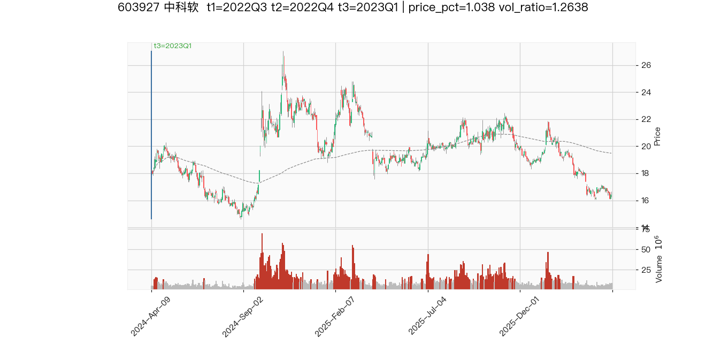

#### 🔍 检测依据 — 603927 中科软
> 最佳 triple: **2022Q3 → 2022Q4 → 2023Q1** ｜ B 触发: price_pct=1.04 vol_ratio=1.26 ｜ 候选 triple 数: 3

#### 📊 港中结持仓节奏 — 603927 中科软

| 季度     |   持股量(万股) |   持股市值(亿) |
|:-------|----------:|----------:|
| 2022Q4 |    1059.2 |      3.14 |
| 2023Q1 |    1191.7 |      4.3  |
| 2023Q2 |     913.9 |      3.55 |
| 2023Q3 |    1088.4 |      3.65 |
| 2023Q4 |    1019.4 |      3.06 |
| 2024Q1 |     742.2 |      2    |
| 2024Q2 |     489.9 |      0.89 |
| 2024Q3 |     522.1 |      0.84 |

#### ✍️ 人工复盘 — 603927 中科软

| 检查项 | 结果 |
|--------|------|
| t2 季度价格在近 250 日高位区间（视觉） | ⬜ |
| t2 季度出现明显放量 bar（红色高量） | ⬜ |
| t3 季度买回后股价未大幅上涨（非卖飞） | ⬜ |
| t1→t2→t3 三段节奏符合「建仓→出货→再建仓」 | ⬜ |

**决策**: ⬜ PASS（纳入关注名单）　⬜ REJECT（假信号）

**备注**: _（人工填写）_

### 688556 高测股份 K 线 + 成交量
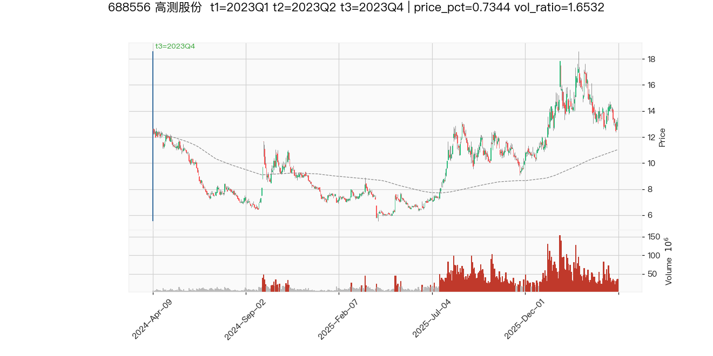

#### 🔍 检测依据 — 688556 高测股份
> 最佳 triple: **2023Q1 → 2023Q2 → 2023Q4** ｜ B 触发: price_pct=0.73 vol_ratio=1.65 ｜ t2 后 60 日收益: 2.2% ｜ 候选 triple 数: 3

#### 📊 港中结持仓节奏 — 688556 高测股份

| 季度     |   持股量(万股) |   持股市值(亿) |
|:-------|----------:|----------:|
| 2022Q4 |     760.1 |      5.7  |
| 2023Q1 |     905   |      6.44 |
| 2023Q2 |     486   |      2.58 |
| 2023Q3 |     401.8 |      1.85 |
| 2023Q4 |     544.6 |      2.12 |
| 2024Q1 |     392   |      1.24 |
| 2024Q2 |     451.2 |      0.54 |
| 2024Q3 |     520.4 |      0.58 |

#### ✍️ 人工复盘 — 688556 高测股份

| 检查项 | 结果 |
|--------|------|
| t2 季度价格在近 250 日高位区间（视觉） | ⬜ |
| t2 季度出现明显放量 bar（红色高量） | ⬜ |
| t3 季度买回后股价未大幅上涨（非卖飞） | ⬜ |
| t1→t2→t3 三段节奏符合「建仓→出货→再建仓」 | ⬜ |

**决策**: ⬜ PASS（纳入关注名单）　⬜ REJECT（假信号）

**备注**: _（人工填写）_

### 000048 京基智农 K 线 + 成交量
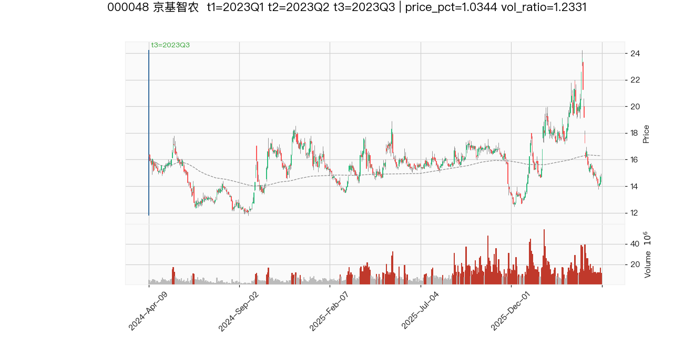

#### 🔍 检测依据 — 000048 京基智农
> 最佳 triple: **2023Q1 → 2023Q2 → 2023Q3** ｜ B 触发: price_pct=1.03 vol_ratio=1.23 ｜ 候选 triple 数: 3

#### 📊 港中结持仓节奏 — 000048 京基智农

| 季度     |   持股量(万股) |   持股市值(亿) |
|:-------|----------:|----------:|
| 2022Q4 |     332.4 |      0.59 |
| 2023Q1 |     380.3 |      0.88 |
| 2023Q2 |     236.5 |      0.46 |
| 2023Q3 |     274.2 |      0.58 |
| 2023Q4 |     176.2 |      0.32 |
| 2024Q1 |     142.9 |      0.25 |
| 2024Q2 |     180.6 |      0.25 |
| 2024Q3 |     293.5 |      0.42 |

#### ✍️ 人工复盘 — 000048 京基智农

| 检查项 | 结果 |
|--------|------|
| t2 季度价格在近 250 日高位区间（视觉） | ⬜ |
| t2 季度出现明显放量 bar（红色高量） | ⬜ |
| t3 季度买回后股价未大幅上涨（非卖飞） | ⬜ |
| t1→t2→t3 三段节奏符合「建仓→出货→再建仓」 | ⬜ |

**决策**: ⬜ PASS（纳入关注名单）　⬜ REJECT（假信号）

**备注**: _（人工填写）_

### 000718 苏宁环球 K 线 + 成交量
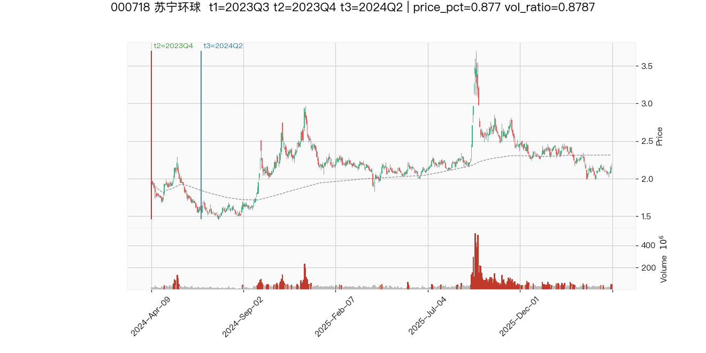

#### 🔍 检测依据 — 000718 苏宁环球
> 最佳 triple: **2023Q3 → 2023Q4 → 2024Q2** ｜ B 触发: price_pct=0.88 vol_ratio=0.88 ｜ t2 后 60 日收益: 2.1% ｜ 候选 triple 数: 3

#### 📊 港中结持仓节奏 — 000718 苏宁环球

| 季度     |   持股量(万股) |   持股市值(亿) |
|:-------|----------:|----------:|
| 2022Q4 |    3590.6 |      1.18 |
| 2023Q1 |    3154.3 |      0.97 |
| 2023Q2 |    2247.8 |      0.61 |
| 2023Q3 |    4258   |      1.2  |
| 2023Q4 |    3270.8 |      0.85 |
| 2024Q1 |    3294.7 |      0.69 |
| 2024Q2 |    3588.1 |      0.6  |
| 2024Q3 |    4428.3 |      0.74 |

#### ✍️ 人工复盘 — 000718 苏宁环球

| 检查项 | 结果 |
|--------|------|
| t2 季度价格在近 250 日高位区间（视觉） | ⬜ |
| t2 季度出现明显放量 bar（红色高量） | ⬜ |
| t3 季度买回后股价未大幅上涨（非卖飞） | ⬜ |
| t1→t2→t3 三段节奏符合「建仓→出货→再建仓」 | ⬜ |

**决策**: ⬜ PASS（纳入关注名单）　⬜ REJECT（假信号）

**备注**: _（人工填写）_

### 002544 普天科技 K 线 + 成交量
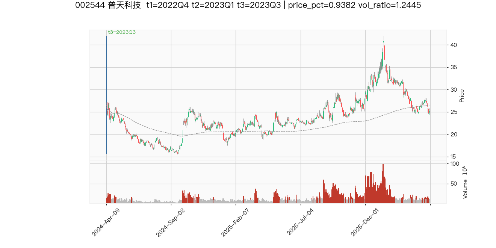

#### 🔍 检测依据 — 002544 普天科技
> 最佳 triple: **2022Q4 → 2023Q1 → 2023Q3** ｜ B 触发: price_pct=0.94 vol_ratio=1.24 ｜ t2 后 60 日收益: 4.2% ｜ 候选 triple 数: 2

#### 📊 港中结持仓节奏 — 002544 普天科技

| 季度     |   持股量(万股) |   持股市值(亿) |
|:-------|----------:|----------:|
| 2022Q4 |    2863.6 |      4.81 |
| 2023Q1 |    2301.4 |      5.25 |
| 2023Q2 |    2250.9 |      5.15 |
| 2023Q3 |    2561.1 |      5.37 |
| 2023Q4 |    2219.1 |      4.51 |
| 2024Q1 |    1335.9 |      3.2  |
| 2024Q2 |    2141.8 |      4    |
| 2024Q3 |    2117.1 |      3.6  |

#### ✍️ 人工复盘 — 002544 普天科技

| 检查项 | 结果 |
|--------|------|
| t2 季度价格在近 250 日高位区间（视觉） | ⬜ |
| t2 季度出现明显放量 bar（红色高量） | ⬜ |
| t3 季度买回后股价未大幅上涨（非卖飞） | ⬜ |
| t1→t2→t3 三段节奏符合「建仓→出货→再建仓」 | ⬜ |

**决策**: ⬜ PASS（纳入关注名单）　⬜ REJECT（假信号）

**备注**: _（人工填写）_

### 600059 古越龙山 K 线 + 成交量
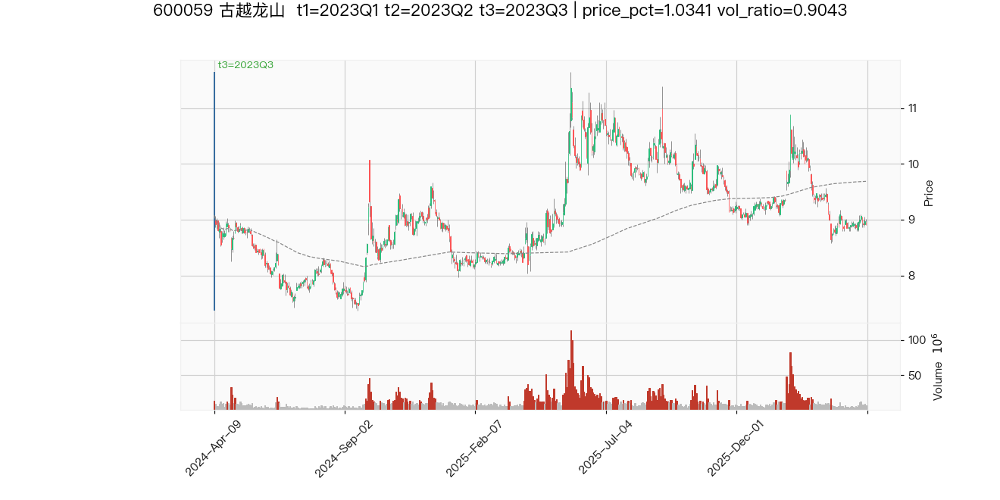

#### 🔍 检测依据 — 600059 古越龙山
> 最佳 triple: **2023Q1 → 2023Q2 → 2023Q3** ｜ B 触发: price_pct=1.03 vol_ratio=0.90 ｜ 候选 triple 数: 2

#### 📊 港中结持仓节奏 — 600059 古越龙山

| 季度     |   持股量(万股) |   持股市值(亿) |
|:-------|----------:|----------:|
| 2022Q4 |      21.1 |      0.02 |
| 2023Q1 |     381.3 |      0.4  |
| 2023Q2 |     234.7 |      0.24 |
| 2023Q3 |    1042.2 |      1.03 |
| 2023Q4 |    1033   |      0.96 |
| 2024Q1 |    1280.7 |      1.12 |
| 2024Q2 |     959.6 |      0.76 |
| 2024Q3 |    1211.2 |      0.98 |

#### ✍️ 人工复盘 — 600059 古越龙山

| 检查项 | 结果 |
|--------|------|
| t2 季度价格在近 250 日高位区间（视觉） | ⬜ |
| t2 季度出现明显放量 bar（红色高量） | ⬜ |
| t3 季度买回后股价未大幅上涨（非卖飞） | ⬜ |
| t1→t2→t3 三段节奏符合「建仓→出货→再建仓」 | ⬜ |

**决策**: ⬜ PASS（纳入关注名单）　⬜ REJECT（假信号）

**备注**: _（人工填写）_

### 000848 承德露露 K 线 + 成交量
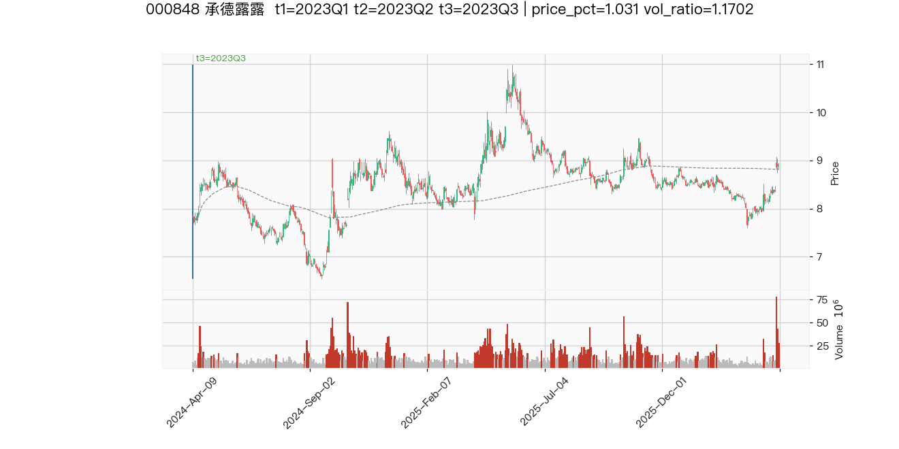

#### 🔍 检测依据 — 000848 承德露露
> 最佳 triple: **2023Q1 → 2023Q2 → 2023Q3** ｜ B 触发: price_pct=1.03 vol_ratio=1.17 ｜ 候选 triple 数: 2

#### 📊 港中结持仓节奏 — 000848 承德露露

| 季度     |   持股量(万股) |   持股市值(亿) |
|:-------|----------:|----------:|
| 2022Q4 |    3091.6 |      2.62 |
| 2023Q1 |    5326.9 |      4.71 |
| 2023Q2 |    1737.8 |      1.54 |
| 2023Q3 |    2175.8 |      1.87 |
| 2023Q4 |    2860.9 |      2.25 |
| 2024Q1 |    1578.4 |      1.29 |
| 2024Q2 |    2593.4 |      2.04 |
| 2024Q3 |    2684.8 |      2.14 |

#### ✍️ 人工复盘 — 000848 承德露露

| 检查项 | 结果 |
|--------|------|
| t2 季度价格在近 250 日高位区间（视觉） | ⬜ |
| t2 季度出现明显放量 bar（红色高量） | ⬜ |
| t3 季度买回后股价未大幅上涨（非卖飞） | ⬜ |
| t1→t2→t3 三段节奏符合「建仓→出货→再建仓」 | ⬜ |

**决策**: ⬜ PASS（纳入关注名单）　⬜ REJECT（假信号）

**备注**: _（人工填写）_

### 300494 盛天网络 K 线 + 成交量
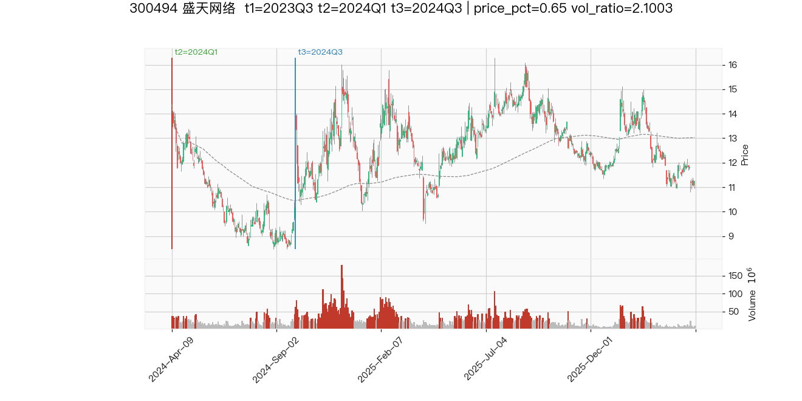

#### 🔍 检测依据 — 300494 盛天网络
> 最佳 triple: **2023Q3 → 2024Q1 → 2024Q3** ｜ B 触发: price_pct=0.65 vol_ratio=2.10 ｜ t2 后 60 日收益: 4.0% ｜ 候选 triple 数: 2

#### 📊 港中结持仓节奏 — 300494 盛天网络

| 季度     |   持股量(万股) |   持股市值(亿) |
|:-------|----------:|----------:|
| 2022Q4 |       0.1 |      0    |
| 2023Q1 |       0   |      0    |
| 2023Q2 |     199.4 |      0.48 |
| 2023Q3 |    1557.9 |      2.24 |
| 2023Q4 |     749.6 |      1.19 |
| 2024Q1 |     397   |      0.63 |
| 2024Q2 |     330   |      0.33 |
| 2024Q3 |     610.8 |      0.6  |

#### ✍️ 人工复盘 — 300494 盛天网络

| 检查项 | 结果 |
|--------|------|
| t2 季度价格在近 250 日高位区间（视觉） | ⬜ |
| t2 季度出现明显放量 bar（红色高量） | ⬜ |
| t3 季度买回后股价未大幅上涨（非卖飞） | ⬜ |
| t1→t2→t3 三段节奏符合「建仓→出货→再建仓」 | ⬜ |

**决策**: ⬜ PASS（纳入关注名单）　⬜ REJECT（假信号）

**备注**: _（人工填写）_

### 300775 三角防务 K 线 + 成交量
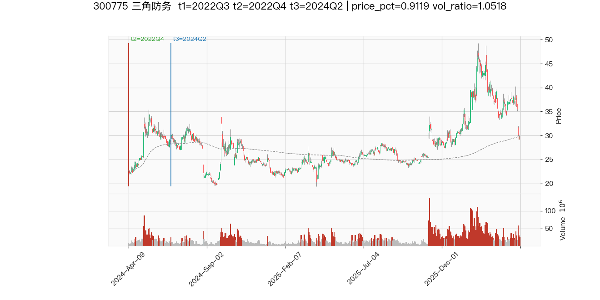

#### 🔍 检测依据 — 300775 三角防务
> 最佳 triple: **2022Q3 → 2022Q4 → 2024Q2** ｜ B 触发: price_pct=0.91 vol_ratio=1.05 ｜ t2 后 60 日收益: 3.6% ｜ 候选 triple 数: 3

#### 📊 港中结持仓节奏 — 300775 三角防务

| 季度     |   持股量(万股) |   持股市值(亿) |
|:-------|----------:|----------:|
| 2022Q4 |     649.3 |      2.47 |
| 2023Q1 |     205.9 |      0.71 |
| 2023Q2 |     375.4 |      1.27 |
| 2023Q3 |     464.5 |      1.49 |
| 2023Q4 |     351   |      0.98 |
| 2024Q1 |     515   |      1.24 |
| 2024Q2 |     667.5 |      2.04 |
| 2024Q3 |     470.3 |      1.36 |

#### ✍️ 人工复盘 — 300775 三角防务

| 检查项 | 结果 |
|--------|------|
| t2 季度价格在近 250 日高位区间（视觉） | ⬜ |
| t2 季度出现明显放量 bar（红色高量） | ⬜ |
| t3 季度买回后股价未大幅上涨（非卖飞） | ⬜ |
| t1→t2→t3 三段节奏符合「建仓→出货→再建仓」 | ⬜ |

**决策**: ⬜ PASS（纳入关注名单）　⬜ REJECT（假信号）

**备注**: _（人工填写）_

### 300083 创世纪 K 线 + 成交量
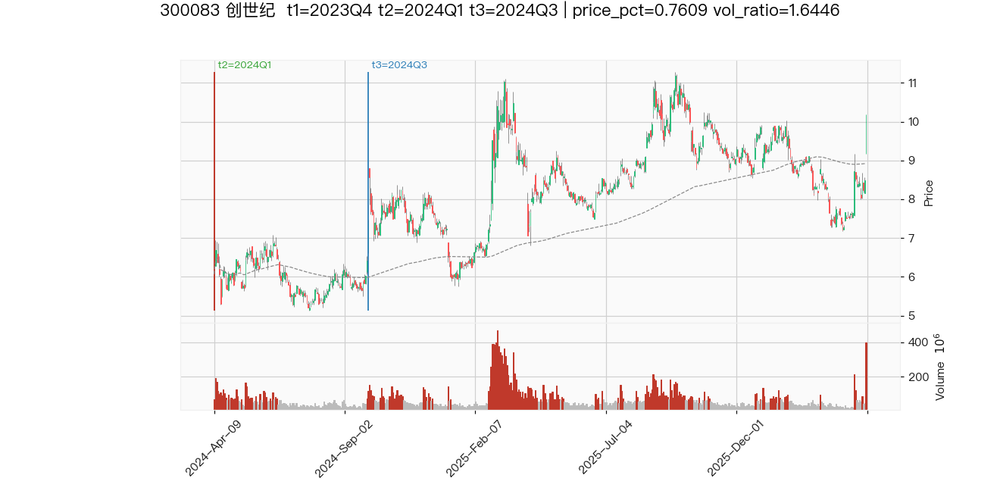

#### 🔍 检测依据 — 300083 创世纪
> 最佳 triple: **2023Q4 → 2024Q1 → 2024Q3** ｜ B 触发: price_pct=0.76 vol_ratio=1.64 ｜ t2 后 60 日收益: 2.6% ｜ 候选 triple 数: 2

#### 📊 港中结持仓节奏 — 300083 创世纪

| 季度     |   持股量(万股) |   持股市值(亿) |
|:-------|----------:|----------:|
| 2023Q1 |     818.4 |      0.7  |
| 2023Q2 |     992.6 |      0.72 |
| 2023Q3 |     941.3 |      0.62 |
| 2023Q4 |    1400.1 |      0.89 |
| 2024Q1 |     660.2 |      0.47 |
| 2024Q2 |     670.1 |      0.41 |
| 2024Q3 |    1710.8 |      0.99 |

#### ✍️ 人工复盘 — 300083 创世纪

| 检查项 | 结果 |
|--------|------|
| t2 季度价格在近 250 日高位区间（视觉） | ⬜ |
| t2 季度出现明显放量 bar（红色高量） | ⬜ |
| t3 季度买回后股价未大幅上涨（非卖飞） | ⬜ |
| t1→t2→t3 三段节奏符合「建仓→出货→再建仓」 | ⬜ |

**决策**: ⬜ PASS（纳入关注名单）　⬜ REJECT（假信号）

**备注**: _（人工填写）_

### 600054 黄山旅游 K 线 + 成交量
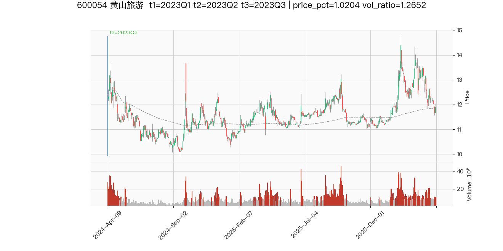

#### 🔍 检测依据 — 600054 黄山旅游
> 最佳 triple: **2023Q1 → 2023Q2 → 2023Q3** ｜ B 触发: price_pct=1.02 vol_ratio=1.27 ｜ 候选 triple 数: 2

#### 📊 港中结持仓节奏 — 600054 黄山旅游

| 季度     |   持股量(万股) |   持股市值(亿) |
|:-------|----------:|----------:|
| 2022Q4 |      54.1 |      0.07 |
| 2023Q1 |     459   |      0.65 |
| 2023Q2 |     309.3 |      0.39 |
| 2023Q3 |     360.8 |      0.45 |
| 2023Q4 |     621.9 |      0.68 |
| 2024Q1 |     398.5 |      0.48 |
| 2024Q2 |     269.8 |      0.3  |
| 2024Q3 |     283.8 |      0.31 |

#### ✍️ 人工复盘 — 600054 黄山旅游

| 检查项 | 结果 |
|--------|------|
| t2 季度价格在近 250 日高位区间（视觉） | ⬜ |
| t2 季度出现明显放量 bar（红色高量） | ⬜ |
| t3 季度买回后股价未大幅上涨（非卖飞） | ⬜ |
| t1→t2→t3 三段节奏符合「建仓→出货→再建仓」 | ⬜ |

**决策**: ⬜ PASS（纳入关注名单）　⬜ REJECT（假信号）

**备注**: _（人工填写）_

### 000682 东方电子 K 线 + 成交量
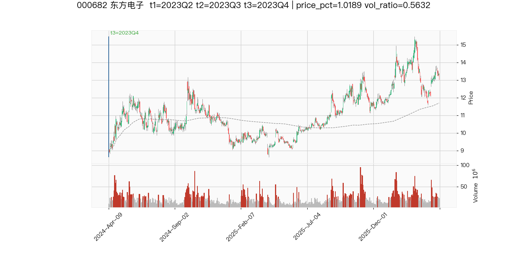

#### 🔍 检测依据 — 000682 东方电子
> 最佳 triple: **2023Q2 → 2023Q3 → 2023Q4** ｜ B 触发: price_pct=1.02 vol_ratio=0.56 ｜ 候选 triple 数: 1

#### 📊 港中结持仓节奏 — 000682 东方电子

| 季度     |   持股量(万股) |   持股市值(亿) |
|:-------|----------:|----------:|
| 2022Q4 |     442.9 |      0.36 |
| 2023Q1 |    1174.4 |      0.97 |
| 2023Q2 |    1533.8 |      1.49 |
| 2023Q3 |     800.4 |      0.66 |
| 2023Q4 |    1072.4 |      0.86 |
| 2024Q1 |    1576.5 |      1.43 |
| 2024Q2 |    2492.2 |      2.75 |
| 2024Q3 |    1736.1 |      1.86 |

#### ✍️ 人工复盘 — 000682 东方电子

| 检查项 | 结果 |
|--------|------|
| t2 季度价格在近 250 日高位区间（视觉） | ⬜ |
| t2 季度出现明显放量 bar（红色高量） | ⬜ |
| t3 季度买回后股价未大幅上涨（非卖飞） | ⬜ |
| t1→t2→t3 三段节奏符合「建仓→出货→再建仓」 | ⬜ |

**决策**: ⬜ PASS（纳入关注名单）　⬜ REJECT（假信号）

**备注**: _（人工填写）_

### 603328 依顿电子 K 线 + 成交量
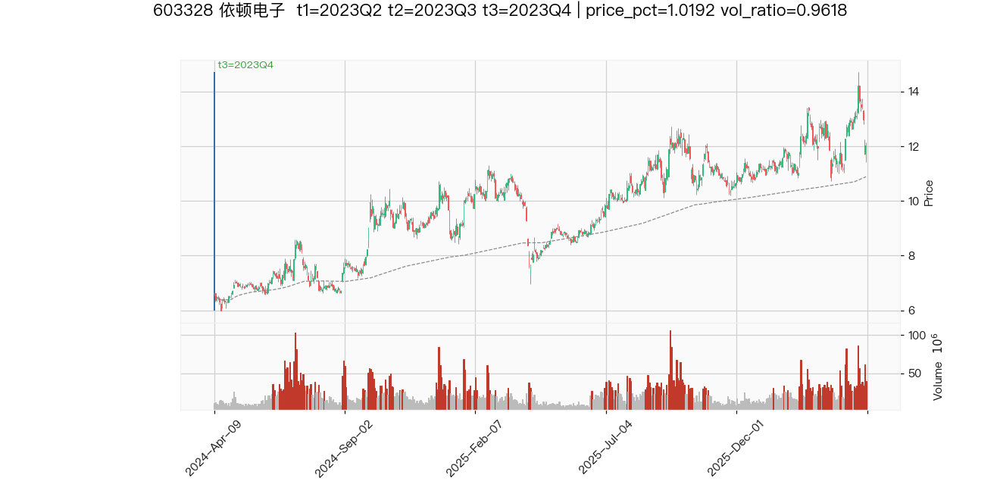

#### 🔍 检测依据 — 603328 依顿电子
> 最佳 triple: **2023Q2 → 2023Q3 → 2023Q4** ｜ B 触发: price_pct=1.02 vol_ratio=0.96 ｜ 候选 triple 数: 2

#### 📊 港中结持仓节奏 — 603328 依顿电子

| 季度     |   持股量(万股) |   持股市值(亿) |
|:-------|----------:|----------:|
| 2022Q4 |     197.9 |      0.13 |
| 2023Q1 |     584.1 |      0.44 |
| 2023Q2 |    1371.4 |      1.13 |
| 2023Q3 |    1048.9 |      0.82 |
| 2023Q4 |    1516.4 |      1.24 |
| 2024Q1 |    1001.7 |      0.71 |
| 2024Q2 |    1810.4 |      1.42 |
| 2024Q3 |    1680.4 |      1.19 |

#### ✍️ 人工复盘 — 603328 依顿电子

| 检查项 | 结果 |
|--------|------|
| t2 季度价格在近 250 日高位区间（视觉） | ⬜ |
| t2 季度出现明显放量 bar（红色高量） | ⬜ |
| t3 季度买回后股价未大幅上涨（非卖飞） | ⬜ |
| t1→t2→t3 三段节奏符合「建仓→出货→再建仓」 | ⬜ |

**决策**: ⬜ PASS（纳入关注名单）　⬜ REJECT（假信号）

**备注**: _（人工填写）_

### 000650 仁和药业 K 线 + 成交量
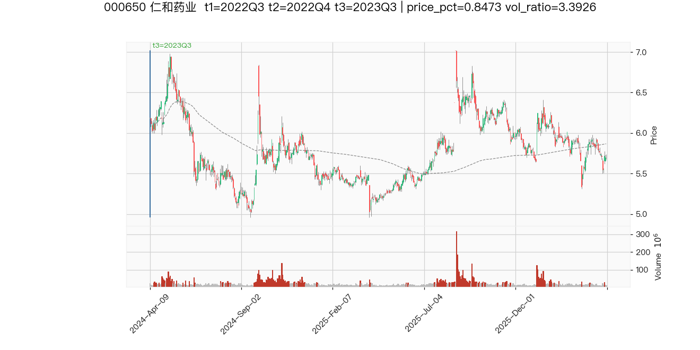

#### 🔍 检测依据 — 000650 仁和药业
> 最佳 triple: **2022Q3 → 2022Q4 → 2023Q3** ｜ B 触发: price_pct=0.85 vol_ratio=3.39 ｜ t2 后 60 日收益: 8.9% ｜ 候选 triple 数: 3

#### 📊 港中结持仓节奏 — 000650 仁和药业

| 季度     |   持股量(万股) |   持股市值(亿) |
|:-------|----------:|----------:|
| 2022Q4 |    1220.6 |      0.76 |
| 2023Q1 |     904.7 |      0.57 |
| 2023Q2 |     934.1 |      0.57 |
| 2023Q3 |    2414.5 |      1.73 |
| 2023Q4 |    1984.1 |      1.32 |
| 2024Q1 |    1628.9 |      1.06 |
| 2024Q2 |    1277.3 |      0.75 |
| 2024Q3 |    1469.8 |      0.82 |

#### ✍️ 人工复盘 — 000650 仁和药业

| 检查项 | 结果 |
|--------|------|
| t2 季度价格在近 250 日高位区间（视觉） | ⬜ |
| t2 季度出现明显放量 bar（红色高量） | ⬜ |
| t3 季度买回后股价未大幅上涨（非卖飞） | ⬜ |
| t1→t2→t3 三段节奏符合「建仓→出货→再建仓」 | ⬜ |

**决策**: ⬜ PASS（纳入关注名单）　⬜ REJECT（假信号）

**备注**: _（人工填写）_

### 002556 辉隆股份 K 线 + 成交量
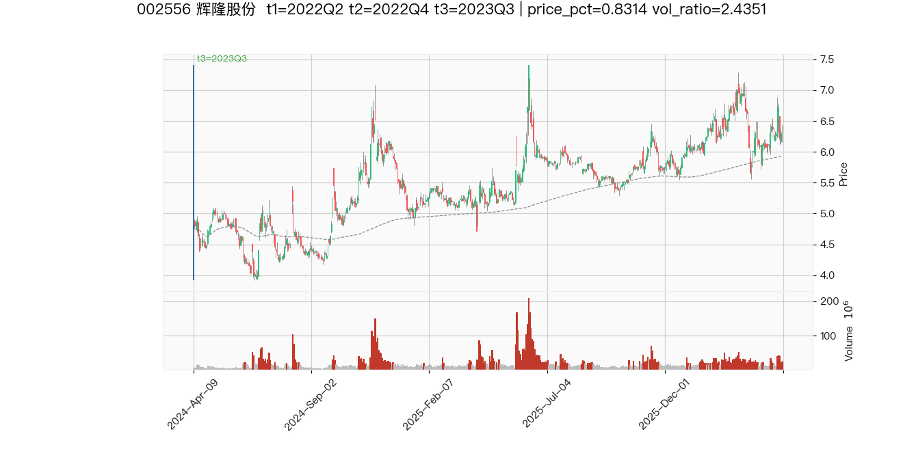

#### 🔍 检测依据 — 002556 辉隆股份
> 最佳 triple: **2022Q2 → 2022Q4 → 2023Q3** ｜ B 触发: price_pct=0.83 vol_ratio=2.44 ｜ t2 后 60 日收益: 5.8% ｜ 候选 triple 数: 4

#### 📊 港中结持仓节奏 — 002556 辉隆股份

| 季度     |   持股量(万股) |   持股市值(亿) |
|:-------|----------:|----------:|
| 2022Q4 |     502.6 |      0.44 |
| 2023Q1 |     430.5 |      0.37 |
| 2023Q2 |     381.9 |      0.28 |
| 2023Q3 |     570.7 |      0.41 |
| 2023Q4 |     862.2 |      0.51 |
| 2024Q1 |     700.4 |      0.35 |
| 2024Q2 |    1044.2 |      0.44 |
| 2024Q3 |     894   |      0.43 |

#### ✍️ 人工复盘 — 002556 辉隆股份

| 检查项 | 结果 |
|--------|------|
| t2 季度价格在近 250 日高位区间（视觉） | ⬜ |
| t2 季度出现明显放量 bar（红色高量） | ⬜ |
| t3 季度买回后股价未大幅上涨（非卖飞） | ⬜ |
| t1→t2→t3 三段节奏符合「建仓→出货→再建仓」 | ⬜ |

**决策**: ⬜ PASS（纳入关注名单）　⬜ REJECT（假信号）

**备注**: _（人工填写）_

### 300119 瑞普生物 K 线 + 成交量
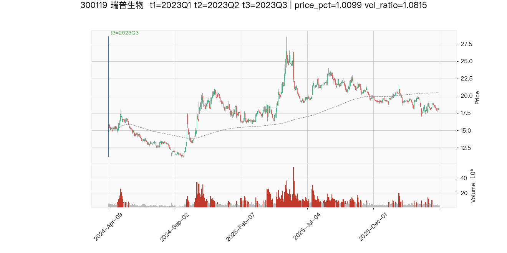

#### 🔍 检测依据 — 300119 瑞普生物
> 最佳 triple: **2023Q1 → 2023Q2 → 2023Q3** ｜ B 触发: price_pct=1.01 vol_ratio=1.08 ｜ 候选 triple 数: 1

#### 📊 港中结持仓节奏 — 300119 瑞普生物

| 季度     |   持股量(万股) |   持股市值(亿) |
|:-------|----------:|----------:|
| 2022Q4 |     870.3 |      1.62 |
| 2023Q1 |    1239.6 |      2.68 |
| 2023Q2 |     627.8 |      1.1  |
| 2023Q3 |     762.1 |      1.39 |
| 2023Q4 |     858.4 |      1.41 |
| 2024Q1 |     915.5 |      1.27 |
| 2024Q2 |     731.2 |      1    |
| 2024Q3 |     642.6 |      0.85 |

#### ✍️ 人工复盘 — 300119 瑞普生物

| 检查项 | 结果 |
|--------|------|
| t2 季度价格在近 250 日高位区间（视觉） | ⬜ |
| t2 季度出现明显放量 bar（红色高量） | ⬜ |
| t3 季度买回后股价未大幅上涨（非卖飞） | ⬜ |
| t1→t2→t3 三段节奏符合「建仓→出货→再建仓」 | ⬜ |

**决策**: ⬜ PASS（纳入关注名单）　⬜ REJECT（假信号）

**备注**: _（人工填写）_

### 002911 佛燃能源 K 线 + 成交量
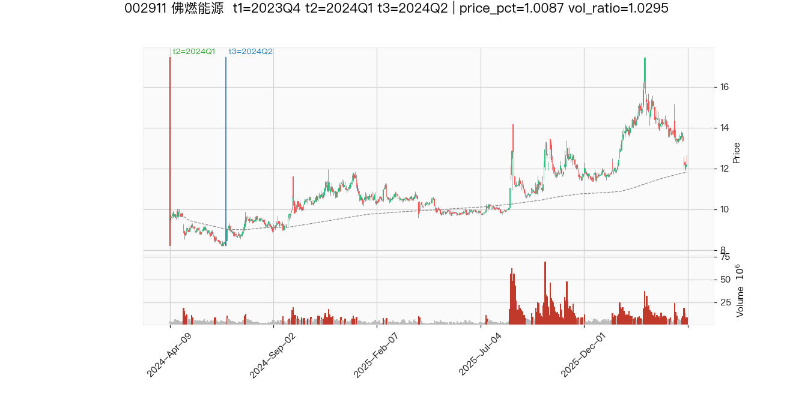

#### 🔍 检测依据 — 002911 佛燃能源
> 最佳 triple: **2023Q4 → 2024Q1 → 2024Q2** ｜ B 触发: price_pct=1.01 vol_ratio=1.03 ｜ 候选 triple 数: 3

#### 📊 港中结持仓节奏 — 002911 佛燃能源

| 季度     |   持股量(万股) |   持股市值(亿) |
|:-------|----------:|----------:|
| 2022Q4 |     335.6 |      0.4  |
| 2023Q1 |     273.1 |      0.36 |
| 2023Q2 |     298.9 |      0.39 |
| 2023Q3 |     308.4 |      0.37 |
| 2023Q4 |     454.3 |      0.52 |
| 2024Q1 |     407.7 |      0.55 |
| 2024Q2 |     731.7 |      0.67 |
| 2024Q3 |     924.7 |      0.95 |

#### ✍️ 人工复盘 — 002911 佛燃能源

| 检查项 | 结果 |
|--------|------|
| t2 季度价格在近 250 日高位区间（视觉） | ⬜ |
| t2 季度出现明显放量 bar（红色高量） | ⬜ |
| t3 季度买回后股价未大幅上涨（非卖飞） | ⬜ |
| t1→t2→t3 三段节奏符合「建仓→出货→再建仓」 | ⬜ |

**决策**: ⬜ PASS（纳入关注名单）　⬜ REJECT（假信号）

**备注**: _（人工填写）_

### 000913 钱江摩托 K 线 + 成交量
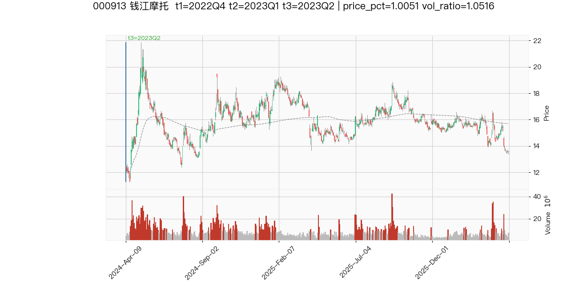

#### 🔍 检测依据 — 000913 钱江摩托
> 最佳 triple: **2022Q4 → 2023Q1 → 2023Q2** ｜ B 触发: price_pct=1.01 vol_ratio=1.05 ｜ 候选 triple 数: 3

#### 📊 港中结持仓节奏 — 000913 钱江摩托

| 季度     |   持股量(万股) |   持股市值(亿) |
|:-------|----------:|----------:|
| 2022Q4 |    2126   |      3.93 |
| 2023Q1 |    1144.8 |      2.68 |
| 2023Q2 |    1893.8 |      3.37 |
| 2023Q3 |     883.9 |      1.25 |
| 2023Q4 |     637.9 |      0.8  |
| 2024Q1 |     688.5 |      0.9  |
| 2024Q2 |    1467   |      2.31 |
| 2024Q3 |    2205.2 |      3.2  |

#### ✍️ 人工复盘 — 000913 钱江摩托

| 检查项 | 结果 |
|--------|------|
| t2 季度价格在近 250 日高位区间（视觉） | ⬜ |
| t2 季度出现明显放量 bar（红色高量） | ⬜ |
| t3 季度买回后股价未大幅上涨（非卖飞） | ⬜ |
| t1→t2→t3 三段节奏符合「建仓→出货→再建仓」 | ⬜ |

**决策**: ⬜ PASS（纳入关注名单）　⬜ REJECT（假信号）

**备注**: _（人工填写）_

### 600987 航民股份 K 线 + 成交量
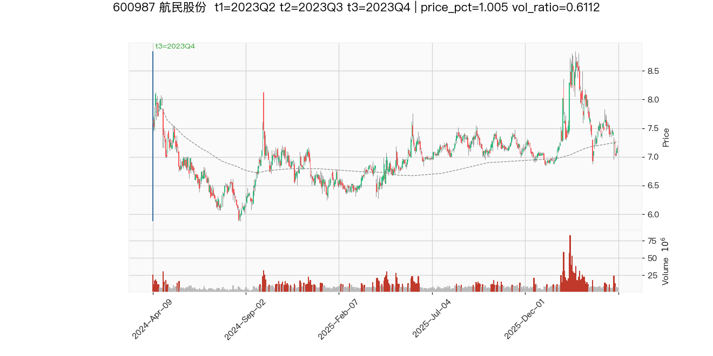

#### 🔍 检测依据 — 600987 航民股份
> 最佳 triple: **2023Q2 → 2023Q3 → 2023Q4** ｜ B 触发: price_pct=1.00 vol_ratio=0.61 ｜ 候选 triple 数: 1

#### 📊 港中结持仓节奏 — 600987 航民股份

| 季度     |   持股量(万股) |   持股市值(亿) |
|:-------|----------:|----------:|
| 2022Q4 |     194.5 |      0.14 |
| 2023Q1 |     893.3 |      0.75 |
| 2023Q2 |    1765.6 |      1.36 |
| 2023Q3 |    1363.4 |      1.03 |
| 2023Q4 |    1496.3 |      1.31 |
| 2024Q1 |    1878.5 |      1.29 |
| 2024Q2 |    1563.1 |      1.1  |
| 2024Q3 |    1180.4 |      0.78 |

#### ✍️ 人工复盘 — 600987 航民股份

| 检查项 | 结果 |
|--------|------|
| t2 季度价格在近 250 日高位区间（视觉） | ⬜ |
| t2 季度出现明显放量 bar（红色高量） | ⬜ |
| t3 季度买回后股价未大幅上涨（非卖飞） | ⬜ |
| t1→t2→t3 三段节奏符合「建仓→出货→再建仓」 | ⬜ |

**决策**: ⬜ PASS（纳入关注名单）　⬜ REJECT（假信号）

**备注**: _（人工填写）_

### 600064 南京高科 K 线 + 成交量
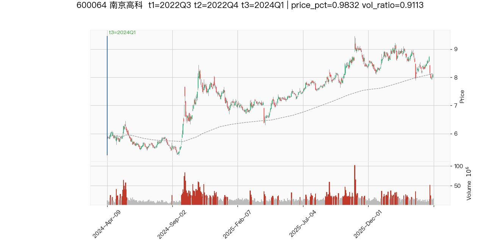

#### 🔍 检测依据 — 600064 南京高科
> 最佳 triple: **2022Q3 → 2022Q4 → 2024Q1** ｜ B 触发: price_pct=0.98 vol_ratio=0.91 ｜ t2 后 60 日收益: 6.7% ｜ 候选 triple 数: 5

#### 📊 港中结持仓节奏 — 600064 南京高科

| 季度     |   持股量(万股) |   持股市值(亿) |
|:-------|----------:|----------:|
| 2022Q4 |    2009.7 |      1.33 |
| 2023Q1 |    1329.7 |      0.88 |
| 2023Q2 |    1236.6 |      0.82 |
| 2023Q3 |    1403.8 |      0.89 |
| 2023Q4 |     890   |      0.54 |
| 2024Q1 |    2010.7 |      1.25 |
| 2024Q2 |     939.8 |      0.57 |
| 2024Q3 |    1138.4 |      0.69 |

#### ✍️ 人工复盘 — 600064 南京高科

| 检查项 | 结果 |
|--------|------|
| t2 季度价格在近 250 日高位区间（视觉） | ⬜ |
| t2 季度出现明显放量 bar（红色高量） | ⬜ |
| t3 季度买回后股价未大幅上涨（非卖飞） | ⬜ |
| t1→t2→t3 三段节奏符合「建仓→出货→再建仓」 | ⬜ |

**决策**: ⬜ PASS（纳入关注名单）　⬜ REJECT（假信号）

**备注**: _（人工填写）_

### 600846 同济科技 K 线 + 成交量
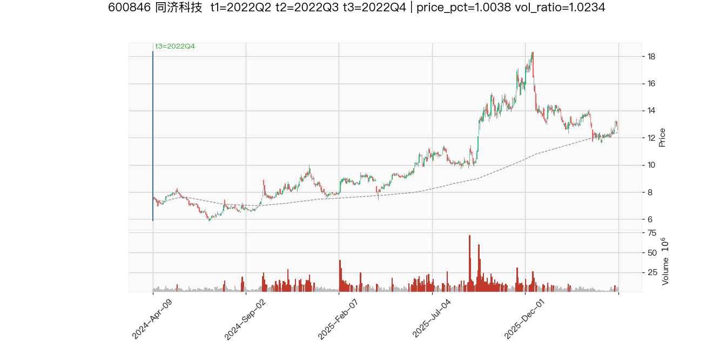

#### 🔍 检测依据 — 600846 同济科技
> 最佳 triple: **2022Q2 → 2022Q3 → 2022Q4** ｜ B 触发: price_pct=1.00 vol_ratio=1.02 ｜ 候选 triple 数: 2

#### 📊 港中结持仓节奏 — 600846 同济科技

| 季度     |   持股量(万股) |   持股市值(亿) |
|:-------|----------:|----------:|
| 2022Q4 |    2065   |      1.86 |
| 2023Q1 |    2072.5 |      1.81 |
| 2023Q2 |    1569.7 |      1.76 |
| 2023Q3 |    1034.8 |      1.02 |
| 2023Q4 |     866.9 |      0.81 |
| 2024Q1 |     700.2 |      0.56 |
| 2024Q2 |     581.3 |      0.4  |
| 2024Q3 |     624.1 |      0.43 |

#### ✍️ 人工复盘 — 600846 同济科技

| 检查项 | 结果 |
|--------|------|
| t2 季度价格在近 250 日高位区间（视觉） | ⬜ |
| t2 季度出现明显放量 bar（红色高量） | ⬜ |
| t3 季度买回后股价未大幅上涨（非卖飞） | ⬜ |
| t1→t2→t3 三段节奏符合「建仓→出货→再建仓」 | ⬜ |

**决策**: ⬜ PASS（纳入关注名单）　⬜ REJECT（假信号）

**备注**: _（人工填写）_

### 000501 武商集团 K 线 + 成交量
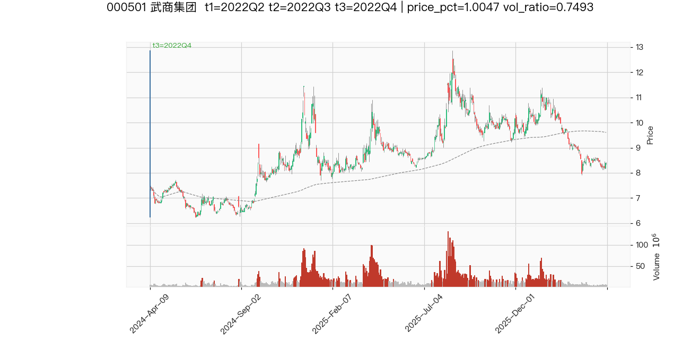

#### 🔍 检测依据 — 000501 武商集团
> 最佳 triple: **2022Q2 → 2022Q3 → 2022Q4** ｜ B 触发: price_pct=1.00 vol_ratio=0.75 ｜ 候选 triple 数: 3

#### 📊 港中结持仓节奏 — 000501 武商集团

| 季度     |   持股量(万股) |   持股市值(亿) |
|:-------|----------:|----------:|
| 2022Q4 |    1226.5 |      1.37 |
| 2023Q1 |    1636.5 |      1.96 |
| 2023Q2 |     781.7 |      0.77 |
| 2023Q3 |     455.4 |      0.42 |
| 2023Q4 |     413.3 |      0.35 |
| 2024Q1 |     521.5 |      0.38 |
| 2024Q2 |     643.7 |      0.43 |
| 2024Q3 |     767.4 |      0.54 |

#### ✍️ 人工复盘 — 000501 武商集团

| 检查项 | 结果 |
|--------|------|
| t2 季度价格在近 250 日高位区间（视觉） | ⬜ |
| t2 季度出现明显放量 bar（红色高量） | ⬜ |
| t3 季度买回后股价未大幅上涨（非卖飞） | ⬜ |
| t1→t2→t3 三段节奏符合「建仓→出货→再建仓」 | ⬜ |

**决策**: ⬜ PASS（纳入关注名单）　⬜ REJECT（假信号）

**备注**: _（人工填写）_

### 688639 华恒生物 K 线 + 成交量
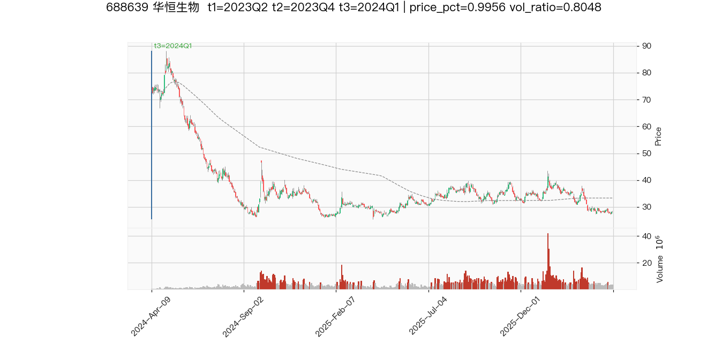

#### 🔍 检测依据 — 688639 华恒生物
> 最佳 triple: **2023Q2 → 2023Q4 → 2024Q1** ｜ B 触发: price_pct=1.00 vol_ratio=0.80 ｜ 候选 triple 数: 3

#### 📊 港中结持仓节奏 — 688639 华恒生物

| 季度     |   持股量(万股) |   持股市值(亿) |
|:-------|----------:|----------:|
| 2023Q1 |      20.7 |      0.35 |
| 2023Q2 |     234.5 |      2.12 |
| 2023Q3 |     155.6 |      1.59 |
| 2023Q4 |     138.8 |      1.75 |
| 2024Q1 |     176.7 |      1.98 |
| 2024Q2 |      91.4 |      0.7  |
| 2024Q3 |     179.4 |      0.65 |

#### ✍️ 人工复盘 — 688639 华恒生物

| 检查项 | 结果 |
|--------|------|
| t2 季度价格在近 250 日高位区间（视觉） | ⬜ |
| t2 季度出现明显放量 bar（红色高量） | ⬜ |
| t3 季度买回后股价未大幅上涨（非卖飞） | ⬜ |
| t1→t2→t3 三段节奏符合「建仓→出货→再建仓」 | ⬜ |

**决策**: ⬜ PASS（纳入关注名单）　⬜ REJECT（假信号）

**备注**: _（人工填写）_

### 002597 金禾实业 K 线 + 成交量
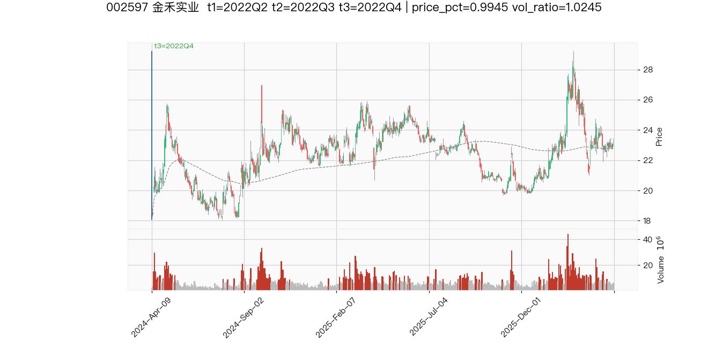

#### 🔍 检测依据 — 002597 金禾实业
> 最佳 triple: **2022Q2 → 2022Q3 → 2022Q4** ｜ B 触发: price_pct=0.99 vol_ratio=1.02 ｜ 候选 triple 数: 2

#### 📊 港中结持仓节奏 — 002597 金禾实业

| 季度     |   持股量(万股) |   持股市值(亿) |
|:-------|----------:|----------:|
| 2022Q4 |    1556.7 |      5.06 |
| 2023Q1 |     643.8 |      1.94 |
| 2023Q2 |     691.3 |      1.56 |
| 2023Q3 |     899.1 |      2.06 |
| 2023Q4 |    1068.9 |      2.34 |
| 2024Q1 |    1329.1 |      2.43 |
| 2024Q2 |    1176.2 |      2.34 |
| 2024Q3 |     924.6 |      1.77 |

#### ✍️ 人工复盘 — 002597 金禾实业

| 检查项 | 结果 |
|--------|------|
| t2 季度价格在近 250 日高位区间（视觉） | ⬜ |
| t2 季度出现明显放量 bar（红色高量） | ⬜ |
| t3 季度买回后股价未大幅上涨（非卖飞） | ⬜ |
| t1→t2→t3 三段节奏符合「建仓→出货→再建仓」 | ⬜ |

**决策**: ⬜ PASS（纳入关注名单）　⬜ REJECT（假信号）

**备注**: _（人工填写）_

### 600020 中原高速 K 线 + 成交量
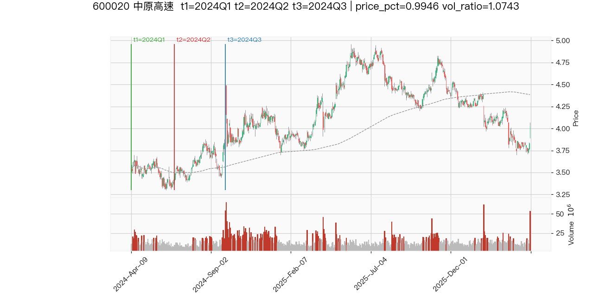

#### 🔍 检测依据 — 600020 中原高速
> 最佳 triple: **2024Q1 → 2024Q2 → 2024Q3** ｜ B 触发: price_pct=0.99 vol_ratio=1.07 ｜ 候选 triple 数: 1

#### 📊 港中结持仓节奏 — 600020 中原高速

| 季度     |   持股量(万股) |   持股市值(亿) |
|:-------|----------:|----------:|
| 2022Q4 |    1011.3 |      0.3  |
| 2023Q1 |     998.4 |      0.31 |
| 2023Q2 |    1037.9 |      0.37 |
| 2023Q3 |    3629.4 |      1.31 |
| 2023Q4 |    3645.3 |      1.34 |
| 2024Q1 |    4100.1 |      1.5  |
| 2024Q2 |    2247.1 |      0.8  |
| 2024Q3 |    2528.2 |      0.98 |

#### ✍️ 人工复盘 — 600020 中原高速

| 检查项 | 结果 |
|--------|------|
| t2 季度价格在近 250 日高位区间（视觉） | ⬜ |
| t2 季度出现明显放量 bar（红色高量） | ⬜ |
| t3 季度买回后股价未大幅上涨（非卖飞） | ⬜ |
| t1→t2→t3 三段节奏符合「建仓→出货→再建仓」 | ⬜ |

**决策**: ⬜ PASS（纳入关注名单）　⬜ REJECT（假信号）

**备注**: _（人工填写）_

### 002706 良信股份 K 线 + 成交量
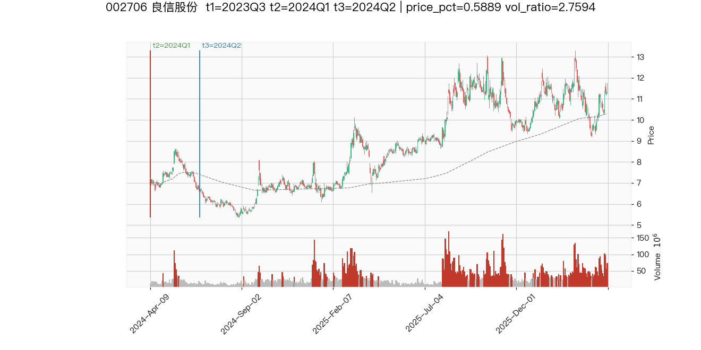

#### 🔍 检测依据 — 002706 良信股份
> 最佳 triple: **2023Q3 → 2024Q1 → 2024Q2** ｜ B 触发: price_pct=0.59 vol_ratio=2.76 ｜ 候选 triple 数: 1

#### 📊 港中结持仓节奏 — 002706 良信股份

| 季度     |   持股量(万股) |   持股市值(亿) |
|:-------|----------:|----------:|
| 2022Q4 |   11578.5 |     16.96 |
| 2023Q1 |   13094.9 |     16.7  |
| 2023Q2 |   13514.9 |     14.91 |
| 2023Q3 |   14217.1 |     15.91 |
| 2023Q4 |    9304.9 |      8.22 |
| 2024Q1 |    5971.2 |      4.53 |
| 2024Q2 |    6846.9 |      4.7  |
| 2024Q3 |    4933.3 |      2.98 |

#### ✍️ 人工复盘 — 002706 良信股份

| 检查项 | 结果 |
|--------|------|
| t2 季度价格在近 250 日高位区间（视觉） | ⬜ |
| t2 季度出现明显放量 bar（红色高量） | ⬜ |
| t3 季度买回后股价未大幅上涨（非卖飞） | ⬜ |
| t1→t2→t3 三段节奏符合「建仓→出货→再建仓」 | ⬜ |

**决策**: ⬜ PASS（纳入关注名单）　⬜ REJECT（假信号）

**备注**: _（人工填写）_

### 002626 金达威 K 线 + 成交量
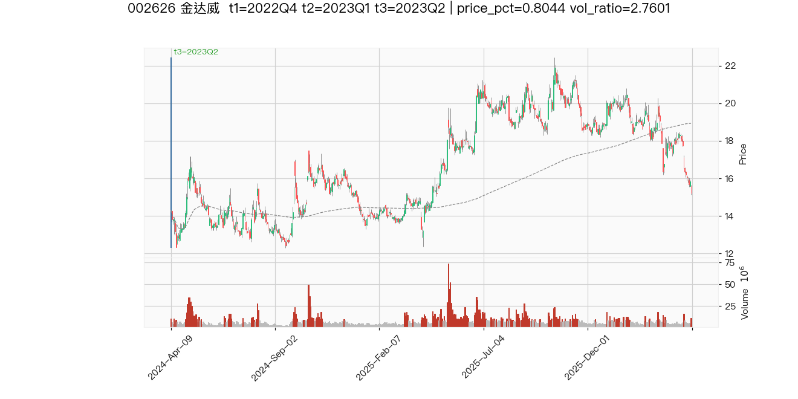

#### 🔍 检测依据 — 002626 金达威
> 最佳 triple: **2022Q4 → 2023Q1 → 2023Q2** ｜ B 触发: price_pct=0.80 vol_ratio=2.76 ｜ 候选 triple 数: 2

#### 📊 港中结持仓节奏 — 002626 金达威

| 季度     |   持股量(万股) |   持股市值(亿) |
|:-------|----------:|----------:|
| 2022Q4 |     804.4 |      1.67 |
| 2023Q1 |     345   |      0.84 |
| 2023Q2 |     407.6 |      0.75 |
| 2023Q3 |     510.2 |      0.92 |
| 2023Q4 |     585.9 |      0.96 |
| 2024Q1 |     720.4 |      1.11 |
| 2024Q2 |     597.9 |      0.86 |
| 2024Q3 |     775.1 |      1.12 |

#### ✍️ 人工复盘 — 002626 金达威

| 检查项 | 结果 |
|--------|------|
| t2 季度价格在近 250 日高位区间（视觉） | ⬜ |
| t2 季度出现明显放量 bar（红色高量） | ⬜ |
| t3 季度买回后股价未大幅上涨（非卖飞） | ⬜ |
| t1→t2→t3 三段节奏符合「建仓→出货→再建仓」 | ⬜ |

**决策**: ⬜ PASS（纳入关注名单）　⬜ REJECT（假信号）

**备注**: _（人工填写）_

### 600559 老白干酒 K 线 + 成交量
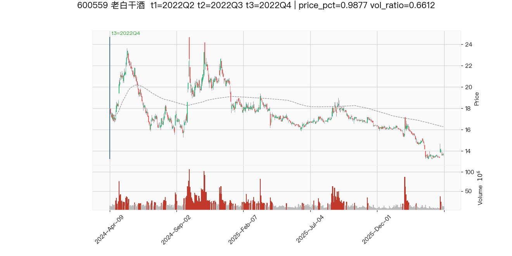

#### 🔍 检测依据 — 600559 老白干酒
> 最佳 triple: **2022Q2 → 2022Q3 → 2022Q4** ｜ B 触发: price_pct=0.99 vol_ratio=0.66 ｜ 候选 triple 数: 3

#### 📊 港中结持仓节奏 — 600559 老白干酒

| 季度     |   持股量(万股) |   持股市值(亿) |
|:-------|----------:|----------:|
| 2022Q4 |    3387.4 |      9.33 |
| 2023Q1 |    2281.8 |      8.46 |
| 2023Q2 |    1555.9 |      3.91 |
| 2023Q3 |     927.2 |      2.15 |
| 2023Q4 |    1258.2 |      2.84 |
| 2024Q1 |    1613.2 |      2.95 |
| 2024Q2 |    2004.3 |      3.64 |
| 2024Q3 |    1064   |      1.84 |

#### ✍️ 人工复盘 — 600559 老白干酒

| 检查项 | 结果 |
|--------|------|
| t2 季度价格在近 250 日高位区间（视觉） | ⬜ |
| t2 季度出现明显放量 bar（红色高量） | ⬜ |
| t3 季度买回后股价未大幅上涨（非卖飞） | ⬜ |
| t1→t2→t3 三段节奏符合「建仓→出货→再建仓」 | ⬜ |

**决策**: ⬜ PASS（纳入关注名单）　⬜ REJECT（假信号）

**备注**: _（人工填写）_

### 600389 江山股份 K 线 + 成交量
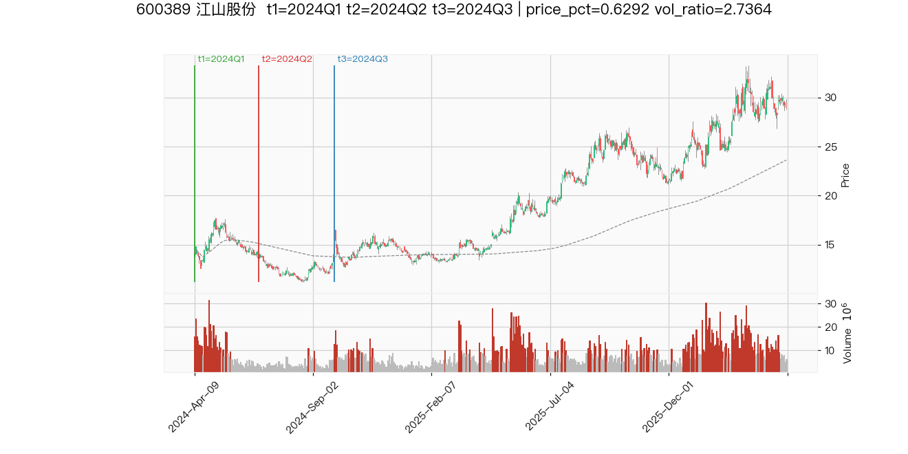

#### 🔍 检测依据 — 600389 江山股份
> 最佳 triple: **2024Q1 → 2024Q2 → 2024Q3** ｜ B 触发: price_pct=0.63 vol_ratio=2.74 ｜ 候选 triple 数: 1

#### 📊 港中结持仓节奏 — 600389 江山股份

| 季度     |   持股量(万股) |   持股市值(亿) |
|:-------|----------:|----------:|
| 2023Q1 |     274.1 |      1.1  |
| 2023Q2 |     230.5 |      0.54 |
| 2023Q3 |     290.9 |      0.6  |
| 2023Q4 |     411.8 |      0.72 |
| 2024Q1 |     466.5 |      0.59 |
| 2024Q2 |     340.9 |      0.48 |
| 2024Q3 |     399   |      0.47 |

#### ✍️ 人工复盘 — 600389 江山股份

| 检查项 | 结果 |
|--------|------|
| t2 季度价格在近 250 日高位区间（视觉） | ⬜ |
| t2 季度出现明显放量 bar（红色高量） | ⬜ |
| t3 季度买回后股价未大幅上涨（非卖飞） | ⬜ |
| t1→t2→t3 三段节奏符合「建仓→出货→再建仓」 | ⬜ |

**决策**: ⬜ PASS（纳入关注名单）　⬜ REJECT（假信号）

**备注**: _（人工填写）_

### 000795 英洛华 K 线 + 成交量
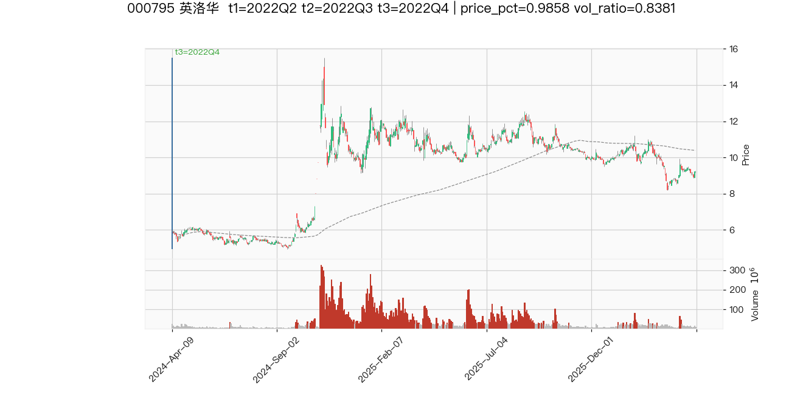

#### 🔍 检测依据 — 000795 英洛华
> 最佳 triple: **2022Q2 → 2022Q3 → 2022Q4** ｜ B 触发: price_pct=0.99 vol_ratio=0.84 ｜ 候选 triple 数: 3

#### 📊 港中结持仓节奏 — 000795 英洛华

| 季度     |   持股量(万股) |   持股市值(亿) |
|:-------|----------:|----------:|
| 2022Q4 |     395.1 |      0.26 |
| 2023Q1 |     510.1 |      0.34 |
| 2023Q2 |     429.3 |      0.32 |
| 2023Q3 |     627.3 |      0.39 |
| 2023Q4 |     920.4 |      0.57 |
| 2024Q1 |     719.1 |      0.4  |
| 2024Q2 |    1105.2 |      0.61 |
| 2024Q3 |     929.9 |      0.51 |

#### ✍️ 人工复盘 — 000795 英洛华

| 检查项 | 结果 |
|--------|------|
| t2 季度价格在近 250 日高位区间（视觉） | ⬜ |
| t2 季度出现明显放量 bar（红色高量） | ⬜ |
| t3 季度买回后股价未大幅上涨（非卖飞） | ⬜ |
| t1→t2→t3 三段节奏符合「建仓→出货→再建仓」 | ⬜ |

**决策**: ⬜ PASS（纳入关注名单）　⬜ REJECT（假信号）

**备注**: _（人工填写）_

### 600596 新安股份 K 线 + 成交量
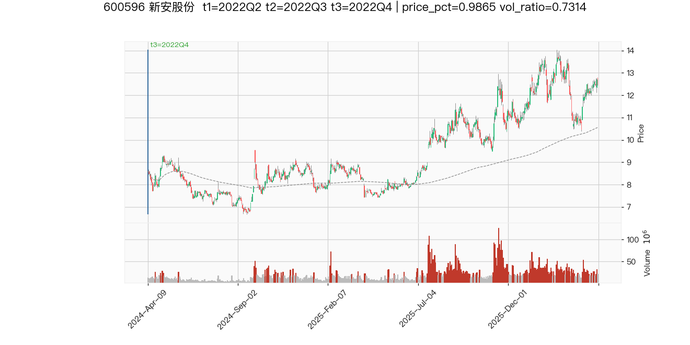

#### 🔍 检测依据 — 600596 新安股份
> 最佳 triple: **2022Q2 → 2022Q3 → 2022Q4** ｜ B 触发: price_pct=0.99 vol_ratio=0.73 ｜ 候选 triple 数: 3

#### 📊 港中结持仓节奏 — 600596 新安股份

| 季度     |   持股量(万股) |   持股市值(亿) |
|:-------|----------:|----------:|
| 2022Q4 |    1468.7 |      2.22 |
| 2023Q1 |    1065.6 |      1.62 |
| 2023Q2 |     864.2 |      0.92 |
| 2023Q3 |    1193.3 |      1.21 |
| 2023Q4 |    1255.4 |      1.14 |
| 2024Q1 |    1396.1 |      1.13 |
| 2024Q2 |    1557.4 |      1.18 |
| 2024Q3 |    1280   |      0.98 |

#### ✍️ 人工复盘 — 600596 新安股份

| 检查项 | 结果 |
|--------|------|
| t2 季度价格在近 250 日高位区间（视觉） | ⬜ |
| t2 季度出现明显放量 bar（红色高量） | ⬜ |
| t3 季度买回后股价未大幅上涨（非卖飞） | ⬜ |
| t1→t2→t3 三段节奏符合「建仓→出货→再建仓」 | ⬜ |

**决策**: ⬜ PASS（纳入关注名单）　⬜ REJECT（假信号）

**备注**: _（人工填写）_

### 002960 青鸟消防 K 线 + 成交量
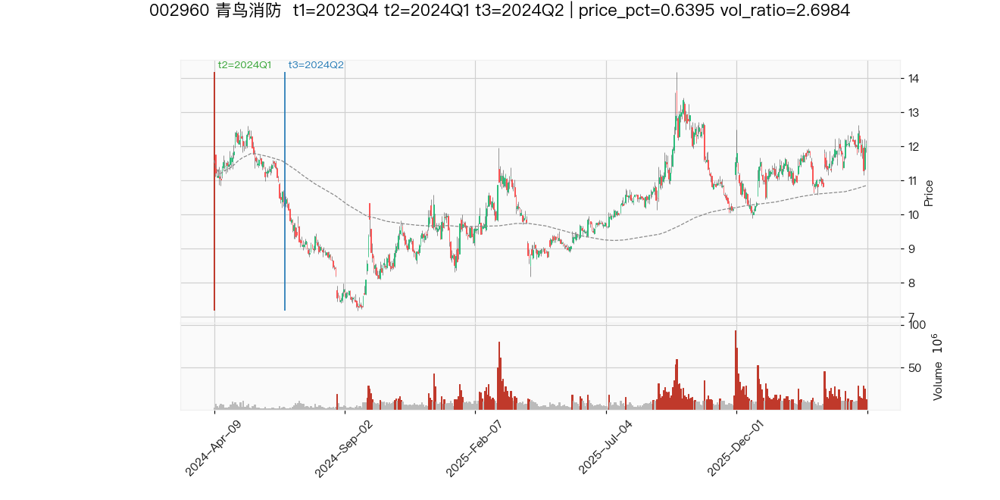

#### 🔍 检测依据 — 002960 青鸟消防
> 最佳 triple: **2023Q4 → 2024Q1 → 2024Q2** ｜ B 触发: price_pct=0.64 vol_ratio=2.70 ｜ 候选 triple 数: 2

#### 📊 港中结持仓节奏 — 002960 青鸟消防

| 季度     |   持股量(万股) |   持股市值(亿) |
|:-------|----------:|----------:|
| 2022Q4 |    2250.6 |      6.3  |
| 2023Q1 |    2335.6 |      6.25 |
| 2023Q2 |    3325.5 |      5.89 |
| 2023Q3 |    2798.8 |      4.66 |
| 2023Q4 |    3062.4 |      4.24 |
| 2024Q1 |    2792.2 |      4.25 |
| 2024Q2 |    3039.9 |      3.84 |
| 2024Q3 |    3028.3 |      3.21 |

#### ✍️ 人工复盘 — 002960 青鸟消防

| 检查项 | 结果 |
|--------|------|
| t2 季度价格在近 250 日高位区间（视觉） | ⬜ |
| t2 季度出现明显放量 bar（红色高量） | ⬜ |
| t3 季度买回后股价未大幅上涨（非卖飞） | ⬜ |
| t1→t2→t3 三段节奏符合「建仓→出货→再建仓」 | ⬜ |

**决策**: ⬜ PASS（纳入关注名单）　⬜ REJECT（假信号）

**备注**: _（人工填写）_

### 300185 通裕重工 K 线 + 成交量
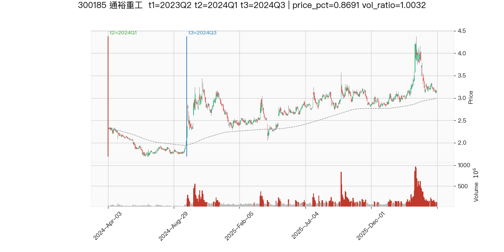

#### 🔍 检测依据 — 300185 通裕重工
> 最佳 triple: **2023Q2 → 2024Q1 → 2024Q3** ｜ B 触发: price_pct=0.87 vol_ratio=1.00 ｜ t2 后 60 日收益: 3.5% ｜ 候选 triple 数: 4

#### 📊 港中结持仓节奏 — 300185 通裕重工

| 季度     |   持股量(万股) |   持股市值(亿) |
|:-------|----------:|----------:|
| 2022Q4 |    2233.5 |      0.54 |
| 2023Q1 |    2094.7 |      0.52 |
| 2023Q2 |    5907   |      1.63 |
| 2023Q3 |    2903.6 |      0.74 |
| 2023Q4 |    2645.9 |      0.64 |
| 2024Q1 |    2415.5 |      0.55 |
| 2024Q2 |    2271.2 |      0.39 |
| 2024Q3 |    2458.1 |      0.46 |

#### ✍️ 人工复盘 — 300185 通裕重工

| 检查项 | 结果 |
|--------|------|
| t2 季度价格在近 250 日高位区间（视觉） | ⬜ |
| t2 季度出现明显放量 bar（红色高量） | ⬜ |
| t3 季度买回后股价未大幅上涨（非卖飞） | ⬜ |
| t1→t2→t3 三段节奏符合「建仓→出货→再建仓」 | ⬜ |

**决策**: ⬜ PASS（纳入关注名单）　⬜ REJECT（假信号）

**备注**: _（人工填写）_

### 300679 电连技术 K 线 + 成交量
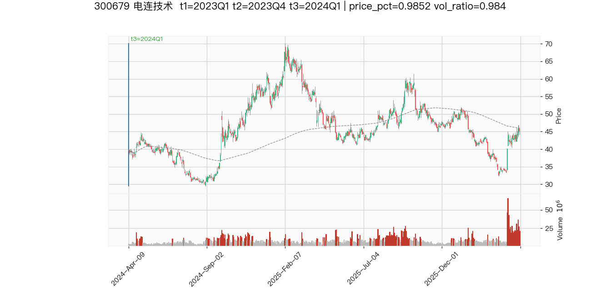

#### 🔍 检测依据 — 300679 电连技术
> 最佳 triple: **2023Q1 → 2023Q4 → 2024Q1** ｜ B 触发: price_pct=0.99 vol_ratio=0.98 ｜ 候选 triple 数: 3

#### 📊 港中结持仓节奏 — 300679 电连技术

| 季度     |   持股量(万股) |   持股市值(亿) |
|:-------|----------:|----------:|
| 2022Q4 |     233.1 |      0.86 |
| 2023Q1 |     482.5 |      1.67 |
| 2023Q2 |     417.6 |      1.33 |
| 2023Q3 |     316.3 |      1.12 |
| 2023Q4 |     288   |      1.2  |
| 2024Q1 |     398.2 |      1.56 |
| 2024Q2 |    1297.7 |      5.22 |
| 2024Q3 |    1085.8 |      3.44 |

#### ✍️ 人工复盘 — 300679 电连技术

| 检查项 | 结果 |
|--------|------|
| t2 季度价格在近 250 日高位区间（视觉） | ⬜ |
| t2 季度出现明显放量 bar（红色高量） | ⬜ |
| t3 季度买回后股价未大幅上涨（非卖飞） | ⬜ |
| t1→t2→t3 三段节奏符合「建仓→出货→再建仓」 | ⬜ |

**决策**: ⬜ PASS（纳入关注名单）　⬜ REJECT（假信号）

**备注**: _（人工填写）_

### 605333 沪光股份 K 线 + 成交量
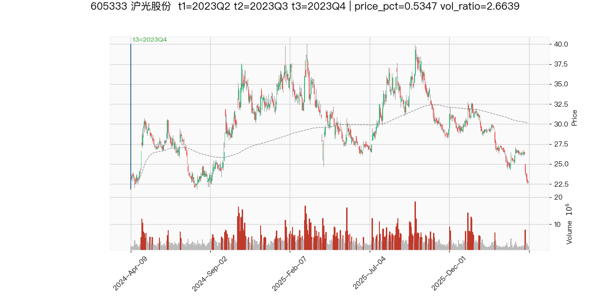

#### 🔍 检测依据 — 605333 沪光股份
> 最佳 triple: **2023Q2 → 2023Q3 → 2023Q4** ｜ B 触发: price_pct=0.53 vol_ratio=2.66 ｜ 候选 triple 数: 1

#### 📊 港中结持仓节奏 — 605333 沪光股份

| 季度     |   持股量(万股) |   持股市值(亿) |
|:-------|----------:|----------:|
| 2023Q1 |      67.2 |      0.13 |
| 2023Q2 |     373   |      0.6  |
| 2023Q3 |      32.6 |      0.06 |
| 2023Q4 |     214.3 |      0.43 |
| 2024Q1 |     287.3 |      0.69 |
| 2024Q2 |     618.5 |      1.72 |
| 2024Q3 |     870   |      2.07 |

#### ✍️ 人工复盘 — 605333 沪光股份

| 检查项 | 结果 |
|--------|------|
| t2 季度价格在近 250 日高位区间（视觉） | ⬜ |
| t2 季度出现明显放量 bar（红色高量） | ⬜ |
| t3 季度买回后股价未大幅上涨（非卖飞） | ⬜ |
| t1→t2→t3 三段节奏符合「建仓→出货→再建仓」 | ⬜ |

**决策**: ⬜ PASS（纳入关注名单）　⬜ REJECT（假信号）

**备注**: _（人工填写）_

### 002267 陕天然气 K 线 + 成交量
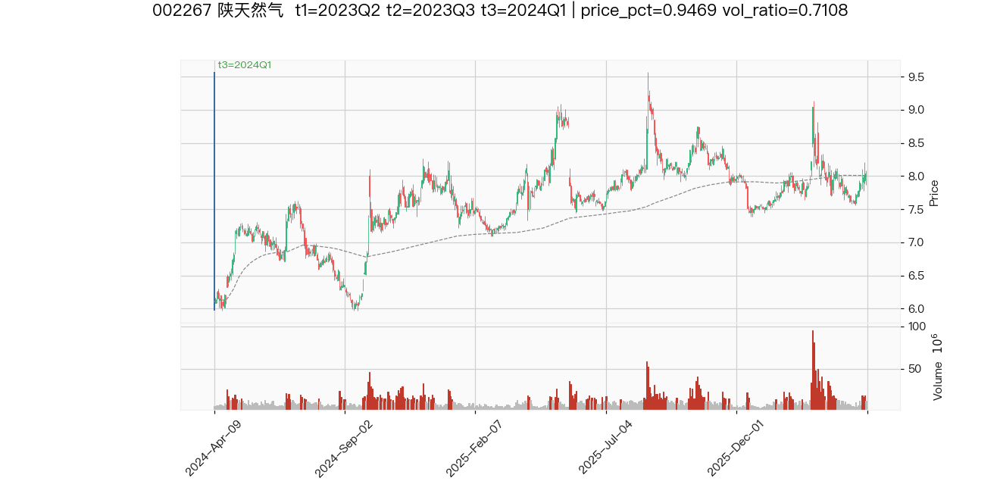

#### 🔍 检测依据 — 002267 陕天然气
> 最佳 triple: **2023Q2 → 2023Q3 → 2024Q1** ｜ B 触发: price_pct=0.95 vol_ratio=0.71 ｜ t2 后 60 日收益: 6.3% ｜ 候选 triple 数: 2

#### 📊 港中结持仓节奏 — 002267 陕天然气

| 季度     |   持股量(万股) |   持股市值(亿) |
|:-------|----------:|----------:|
| 2022Q4 |     135.6 |      0.1  |
| 2023Q1 |     250.8 |      0.18 |
| 2023Q2 |     833.3 |      0.66 |
| 2023Q3 |     626.9 |      0.45 |
| 2023Q4 |     481.5 |      0.35 |
| 2024Q1 |     676.1 |      0.43 |
| 2024Q2 |    1012.9 |      0.77 |
| 2024Q3 |     987.7 |      0.71 |

#### ✍️ 人工复盘 — 002267 陕天然气

| 检查项 | 结果 |
|--------|------|
| t2 季度价格在近 250 日高位区间（视觉） | ⬜ |
| t2 季度出现明显放量 bar（红色高量） | ⬜ |
| t3 季度买回后股价未大幅上涨（非卖飞） | ⬜ |
| t1→t2→t3 三段节奏符合「建仓→出货→再建仓」 | ⬜ |

**决策**: ⬜ PASS（纳入关注名单）　⬜ REJECT（假信号）

**备注**: _（人工填写）_

### 601827 三峰环境 K 线 + 成交量
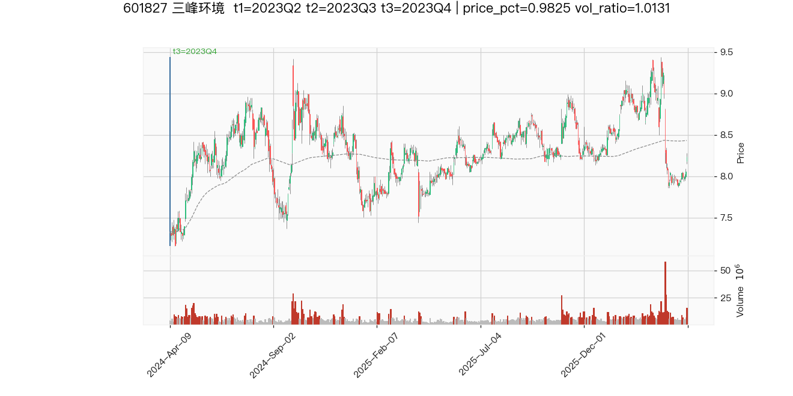

#### 🔍 检测依据 — 601827 三峰环境
> 最佳 triple: **2023Q2 → 2023Q3 → 2023Q4** ｜ B 触发: price_pct=0.98 vol_ratio=1.01 ｜ 候选 triple 数: 1

#### 📊 港中结持仓节奏 — 601827 三峰环境

| 季度     |   持股量(万股) |   持股市值(亿) |
|:-------|----------:|----------:|
| 2022Q4 |    1235.3 |      0.79 |
| 2023Q1 |    1468   |      1.03 |
| 2023Q2 |    2087.5 |      1.55 |
| 2023Q3 |    1702.5 |      1.28 |
| 2023Q4 |    2240.5 |      1.68 |
| 2024Q1 |    2737.4 |      2.19 |
| 2024Q2 |    3028.8 |      2.57 |
| 2024Q3 |    3066.3 |      2.74 |

#### ✍️ 人工复盘 — 601827 三峰环境

| 检查项 | 结果 |
|--------|------|
| t2 季度价格在近 250 日高位区间（视觉） | ⬜ |
| t2 季度出现明显放量 bar（红色高量） | ⬜ |
| t3 季度买回后股价未大幅上涨（非卖飞） | ⬜ |
| t1→t2→t3 三段节奏符合「建仓→出货→再建仓」 | ⬜ |

**决策**: ⬜ PASS（纳入关注名单）　⬜ REJECT（假信号）

**备注**: _（人工填写）_

### 300900 广联航空 K 线 + 成交量
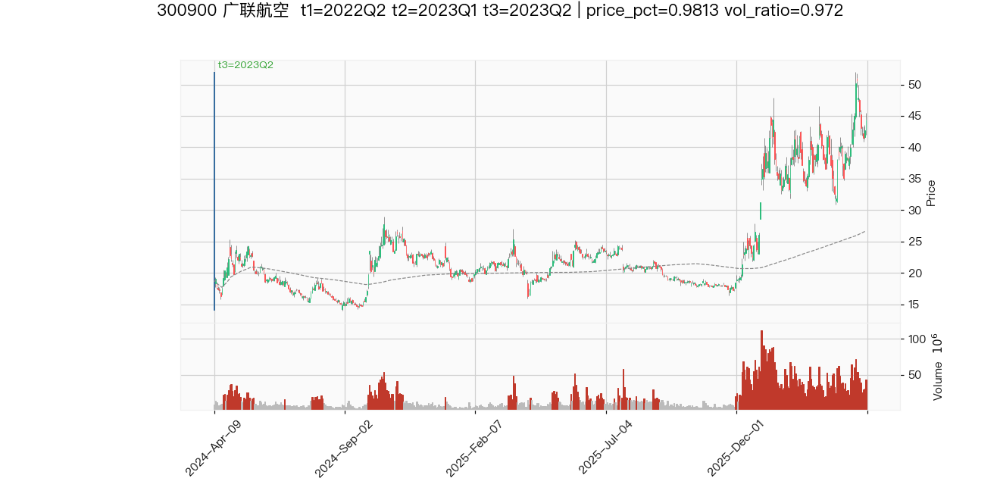

#### 🔍 检测依据 — 300900 广联航空
> 最佳 triple: **2022Q2 → 2023Q1 → 2023Q2** ｜ B 触发: price_pct=0.98 vol_ratio=0.97 ｜ 候选 triple 数: 5

#### 📊 港中结持仓节奏 — 300900 广联航空

| 季度     |   持股量(万股) |   持股市值(亿) |
|:-------|----------:|----------:|
| 2022Q4 |      56.1 |      0.16 |
| 2023Q1 |      51.4 |      0.16 |
| 2023Q2 |     147.2 |      0.42 |
| 2023Q3 |      93.5 |      0.23 |
| 2023Q4 |     144.9 |      0.36 |
| 2024Q1 |      99.7 |      0.29 |
| 2024Q2 |     171.8 |      0.32 |
| 2024Q3 |     239.5 |      0.39 |

#### ✍️ 人工复盘 — 300900 广联航空

| 检查项 | 结果 |
|--------|------|
| t2 季度价格在近 250 日高位区间（视觉） | ⬜ |
| t2 季度出现明显放量 bar（红色高量） | ⬜ |
| t3 季度买回后股价未大幅上涨（非卖飞） | ⬜ |
| t1→t2→t3 三段节奏符合「建仓→出货→再建仓」 | ⬜ |

**决策**: ⬜ PASS（纳入关注名单）　⬜ REJECT（假信号）

**备注**: _（人工填写）_

### 600713 南京医药 K 线 + 成交量
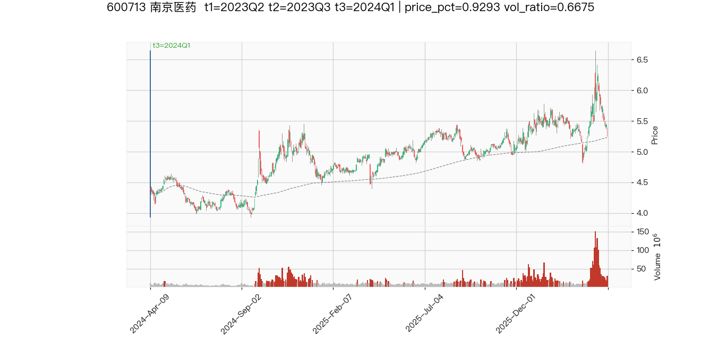

#### 🔍 检测依据 — 600713 南京医药
> 最佳 triple: **2023Q2 → 2023Q3 → 2024Q1** ｜ B 触发: price_pct=0.93 vol_ratio=0.67 ｜ t2 后 60 日收益: 5.8% ｜ 候选 triple 数: 2

#### 📊 港中结持仓节奏 — 600713 南京医药

| 季度     |   持股量(万股) |   持股市值(亿) |
|:-------|----------:|----------:|
| 2023Q1 |     214.8 |      0.11 |
| 2023Q2 |     492.2 |      0.26 |
| 2023Q3 |     342.5 |      0.18 |
| 2023Q4 |     258.3 |      0.13 |
| 2024Q1 |     430.5 |      0.19 |
| 2024Q2 |     456.1 |      0.19 |
| 2024Q3 |    1043.9 |      0.47 |

#### ✍️ 人工复盘 — 600713 南京医药

| 检查项 | 结果 |
|--------|------|
| t2 季度价格在近 250 日高位区间（视觉） | ⬜ |
| t2 季度出现明显放量 bar（红色高量） | ⬜ |
| t3 季度买回后股价未大幅上涨（非卖飞） | ⬜ |
| t1→t2→t3 三段节奏符合「建仓→出货→再建仓」 | ⬜ |

**决策**: ⬜ PASS（纳入关注名单）　⬜ REJECT（假信号）

**备注**: _（人工填写）_

### 600993 马应龙 K 线 + 成交量
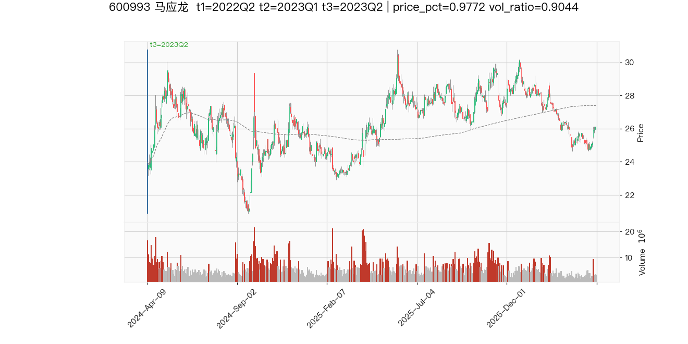

#### 🔍 检测依据 — 600993 马应龙
> 最佳 triple: **2022Q2 → 2023Q1 → 2023Q2** ｜ B 触发: price_pct=0.98 vol_ratio=0.90 ｜ 候选 triple 数: 4

#### 📊 港中结持仓节奏 — 600993 马应龙

| 季度     |   持股量(万股) |   持股市值(亿) |
|:-------|----------:|----------:|
| 2022Q4 |    1386.6 |      3.13 |
| 2023Q1 |     875.3 |      2.38 |
| 2023Q2 |    1035.4 |      2.88 |
| 2023Q3 |     488.7 |      1.13 |
| 2023Q4 |     514   |      1.24 |
| 2024Q1 |     393   |      0.87 |
| 2024Q2 |    1152.6 |      3.07 |
| 2024Q3 |    1474.2 |      3.97 |

#### ✍️ 人工复盘 — 600993 马应龙

| 检查项 | 结果 |
|--------|------|
| t2 季度价格在近 250 日高位区间（视觉） | ⬜ |
| t2 季度出现明显放量 bar（红色高量） | ⬜ |
| t3 季度买回后股价未大幅上涨（非卖飞） | ⬜ |
| t1→t2→t3 三段节奏符合「建仓→出货→再建仓」 | ⬜ |

**决策**: ⬜ PASS（纳入关注名单）　⬜ REJECT（假信号）

**备注**: _（人工填写）_

### 603983 丸美生物 K 线 + 成交量
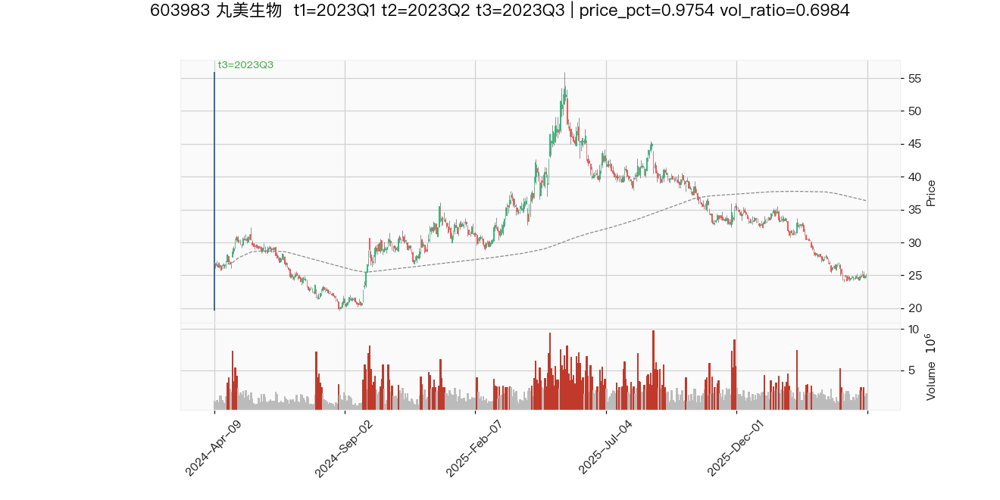

#### 🔍 检测依据 — 603983 丸美生物
> 最佳 triple: **2023Q1 → 2023Q2 → 2023Q3** ｜ B 触发: price_pct=0.98 vol_ratio=0.70 ｜ 候选 triple 数: 2

#### 📊 港中结持仓节奏 — 603983 丸美生物

| 季度     |   持股量(万股) |   持股市值(亿) |
|:-------|----------:|----------:|
| 2022Q4 |      12.8 |      0.04 |
| 2023Q1 |      92.9 |      0.35 |
| 2023Q2 |      65.8 |      0.21 |
| 2023Q3 |     249.5 |      0.62 |
| 2023Q4 |     164.5 |      0.42 |
| 2024Q1 |     167.1 |      0.48 |
| 2024Q2 |     405   |      1.11 |
| 2024Q3 |     251.4 |      0.57 |

#### ✍️ 人工复盘 — 603983 丸美生物

| 检查项 | 结果 |
|--------|------|
| t2 季度价格在近 250 日高位区间（视觉） | ⬜ |
| t2 季度出现明显放量 bar（红色高量） | ⬜ |
| t3 季度买回后股价未大幅上涨（非卖飞） | ⬜ |
| t1→t2→t3 三段节奏符合「建仓→出货→再建仓」 | ⬜ |

**决策**: ⬜ PASS（纳入关注名单）　⬜ REJECT（假信号）

**备注**: _（人工填写）_

### 002833 弘亚数控 K 线 + 成交量
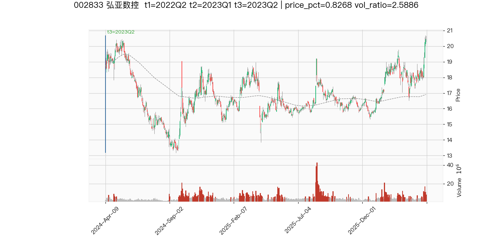

#### 🔍 检测依据 — 002833 弘亚数控
> 最佳 triple: **2022Q2 → 2023Q1 → 2023Q2** ｜ B 触发: price_pct=0.83 vol_ratio=2.59 ｜ 候选 triple 数: 4

#### 📊 港中结持仓节奏 — 002833 弘亚数控

| 季度     |   持股量(万股) |   持股市值(亿) |
|:-------|----------:|----------:|
| 2022Q4 |     529   |      0.65 |
| 2023Q1 |     463.4 |      0.81 |
| 2023Q2 |     487.5 |      0.96 |
| 2023Q3 |     854.1 |      1.67 |
| 2023Q4 |     690.7 |      1.23 |
| 2024Q1 |     902.2 |      1.69 |
| 2024Q2 |     628.7 |      1.15 |
| 2024Q3 |     283.8 |      0.45 |

#### ✍️ 人工复盘 — 002833 弘亚数控

| 检查项 | 结果 |
|--------|------|
| t2 季度价格在近 250 日高位区间（视觉） | ⬜ |
| t2 季度出现明显放量 bar（红色高量） | ⬜ |
| t3 季度买回后股价未大幅上涨（非卖飞） | ⬜ |
| t1→t2→t3 三段节奏符合「建仓→出货→再建仓」 | ⬜ |

**决策**: ⬜ PASS（纳入关注名单）　⬜ REJECT（假信号）

**备注**: _（人工填写）_

### 301267 华厦眼科 K 线 + 成交量
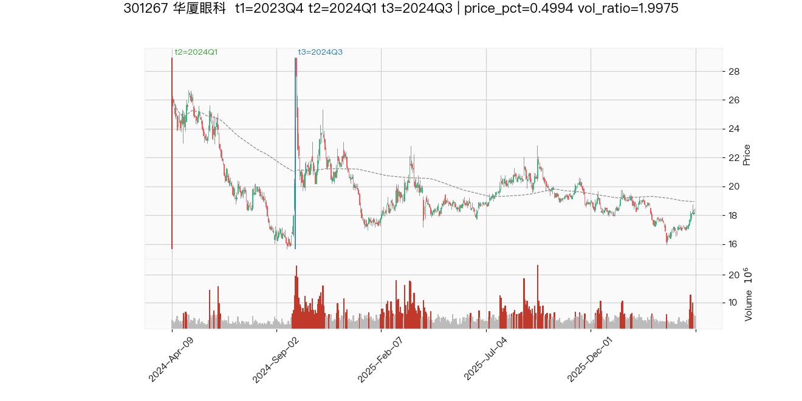

#### 🔍 检测依据 — 301267 华厦眼科
> 最佳 triple: **2023Q4 → 2024Q1 → 2024Q3** ｜ B 触发: price_pct=0.50 vol_ratio=2.00 ｜ t2 后 60 日收益: 5.6% ｜ 候选 triple 数: 2

#### 📊 港中结持仓节奏 — 301267 华厦眼科

| 季度     |   持股量(万股) |   持股市值(亿) |
|:-------|----------:|----------:|
| 2023Q1 |      92.7 |      0.69 |
| 2023Q2 |     253.5 |      1.54 |
| 2023Q3 |     127.9 |      0.57 |
| 2023Q4 |     323   |      1.04 |
| 2024Q1 |     275.9 |      0.72 |
| 2024Q2 |     285.7 |      0.59 |
| 2024Q3 |     381.4 |      0.73 |

#### ✍️ 人工复盘 — 301267 华厦眼科

| 检查项 | 结果 |
|--------|------|
| t2 季度价格在近 250 日高位区间（视觉） | ⬜ |
| t2 季度出现明显放量 bar（红色高量） | ⬜ |
| t3 季度买回后股价未大幅上涨（非卖飞） | ⬜ |
| t1→t2→t3 三段节奏符合「建仓→出货→再建仓」 | ⬜ |

**决策**: ⬜ PASS（纳入关注名单）　⬜ REJECT（假信号）

**备注**: _（人工填写）_

### 600755 厦门国贸 K 线 + 成交量
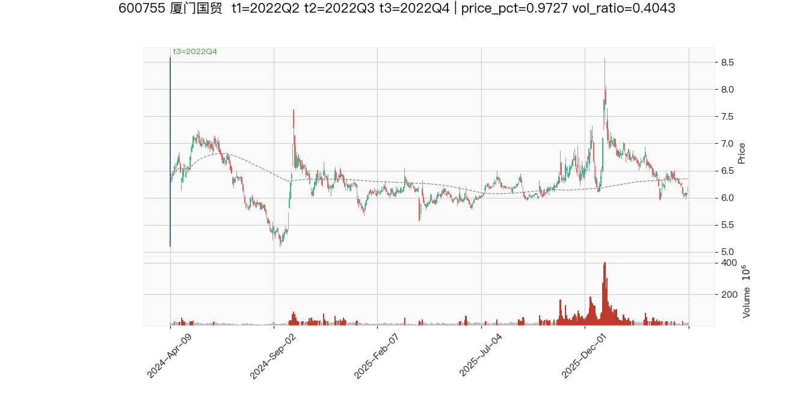

#### 🔍 检测依据 — 600755 厦门国贸
> 最佳 triple: **2022Q2 → 2022Q3 → 2022Q4** ｜ B 触发: price_pct=0.97 vol_ratio=0.40 ｜ 候选 triple 数: 3

#### 📊 港中结持仓节奏 — 600755 厦门国贸

| 季度     |   持股量(万股) |   持股市值(亿) |
|:-------|----------:|----------:|
| 2022Q4 |    6161.9 |      4.4  |
| 2023Q1 |    5080.6 |      4.38 |
| 2023Q2 |    7308.6 |      5.67 |
| 2023Q3 |    5845.1 |      4.61 |
| 2023Q4 |    2929.3 |      2.04 |
| 2024Q1 |    3001.5 |      2.16 |
| 2024Q2 |    1792.9 |      1.29 |
| 2024Q3 |    1882.8 |      1.17 |

#### ✍️ 人工复盘 — 600755 厦门国贸

| 检查项 | 结果 |
|--------|------|
| t2 季度价格在近 250 日高位区间（视觉） | ⬜ |
| t2 季度出现明显放量 bar（红色高量） | ⬜ |
| t3 季度买回后股价未大幅上涨（非卖飞） | ⬜ |
| t1→t2→t3 三段节奏符合「建仓→出货→再建仓」 | ⬜ |

**决策**: ⬜ PASS（纳入关注名单）　⬜ REJECT（假信号）

**备注**: _（人工填写）_

### 000600 建投能源 K 线 + 成交量
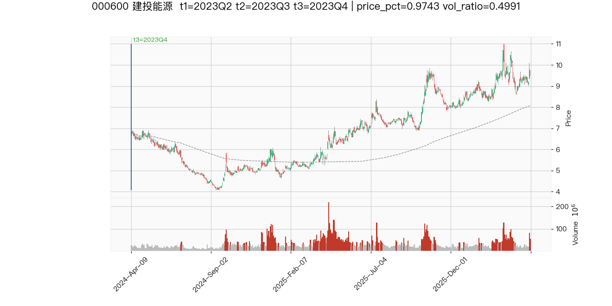

#### 🔍 检测依据 — 000600 建投能源
> 最佳 triple: **2023Q2 → 2023Q3 → 2023Q4** ｜ B 触发: price_pct=0.97 vol_ratio=0.50 ｜ 候选 triple 数: 3

#### 📊 港中结持仓节奏 — 000600 建投能源

| 季度     |   持股量(万股) |   持股市值(亿) |
|:-------|----------:|----------:|
| 2022Q4 |    1361.9 |      0.71 |
| 2023Q1 |    1465.8 |      0.75 |
| 2023Q2 |    1674.4 |      1.33 |
| 2023Q3 |    1167.3 |      0.67 |
| 2023Q4 |    1699.4 |      0.85 |
| 2024Q1 |     817.9 |      0.52 |
| 2024Q2 |    5404.6 |      3.4  |
| 2024Q3 |    6917.4 |      3.39 |

#### ✍️ 人工复盘 — 000600 建投能源

| 检查项 | 结果 |
|--------|------|
| t2 季度价格在近 250 日高位区间（视觉） | ⬜ |
| t2 季度出现明显放量 bar（红色高量） | ⬜ |
| t3 季度买回后股价未大幅上涨（非卖飞） | ⬜ |
| t1→t2→t3 三段节奏符合「建仓→出货→再建仓」 | ⬜ |

**决策**: ⬜ PASS（纳入关注名单）　⬜ REJECT（假信号）

**备注**: _（人工填写）_

### 002967 广电计量 K 线 + 成交量
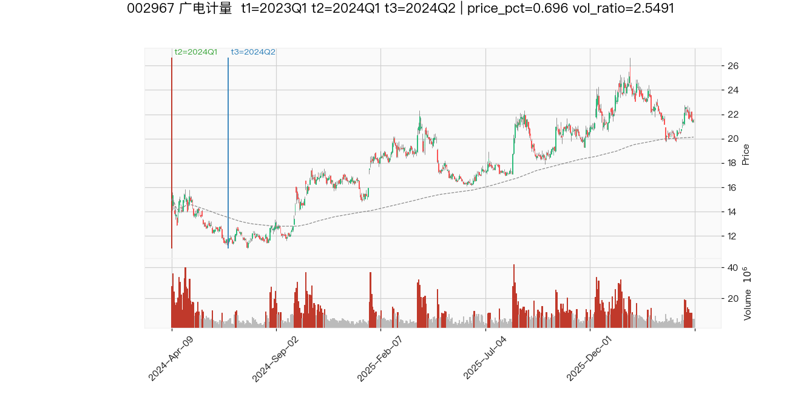

#### 🔍 检测依据 — 002967 广电计量
> 最佳 triple: **2023Q1 → 2024Q1 → 2024Q2** ｜ B 触发: price_pct=0.70 vol_ratio=2.55 ｜ 候选 triple 数: 1

#### 📊 港中结持仓节奏 — 002967 广电计量

| 季度     |   持股量(万股) |   持股市值(亿) |
|:-------|----------:|----------:|
| 2022Q4 |    1293   |      2.17 |
| 2023Q1 |    1364.5 |      2.76 |
| 2023Q2 |    1290.2 |      2.59 |
| 2023Q3 |     911.5 |      1.36 |
| 2023Q4 |     530.7 |      0.8  |
| 2024Q1 |     390.1 |      0.58 |
| 2024Q2 |     409.7 |      0.48 |
| 2024Q3 |     350.6 |      0.42 |

#### ✍️ 人工复盘 — 002967 广电计量

| 检查项 | 结果 |
|--------|------|
| t2 季度价格在近 250 日高位区间（视觉） | ⬜ |
| t2 季度出现明显放量 bar（红色高量） | ⬜ |
| t3 季度买回后股价未大幅上涨（非卖飞） | ⬜ |
| t1→t2→t3 三段节奏符合「建仓→出货→再建仓」 | ⬜ |

**决策**: ⬜ PASS（纳入关注名单）　⬜ REJECT（假信号）

**备注**: _（人工填写）_

### 603477 巨星农牧 K 线 + 成交量
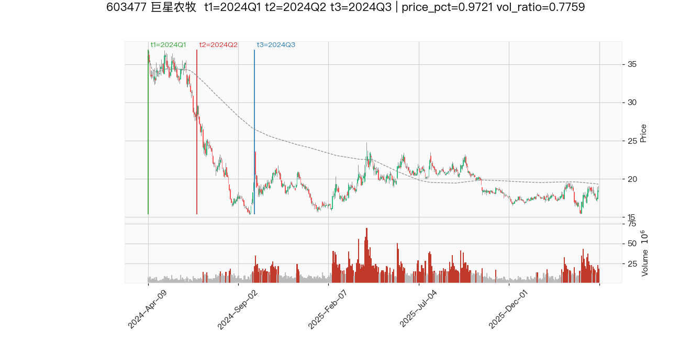

#### 🔍 检测依据 — 603477 巨星农牧
> 最佳 triple: **2024Q1 → 2024Q2 → 2024Q3** ｜ B 触发: price_pct=0.97 vol_ratio=0.78 ｜ 候选 triple 数: 1

#### 📊 港中结持仓节奏 — 603477 巨星农牧

| 季度     |   持股量(万股) |   持股市值(亿) |
|:-------|----------:|----------:|
| 2023Q1 |     298.1 |      0.83 |
| 2023Q2 |     207.6 |      0.72 |
| 2023Q3 |     109.4 |      0.3  |
| 2023Q4 |     143   |      0.54 |
| 2024Q1 |     365.1 |      1.25 |
| 2024Q2 |     189.3 |      0.54 |
| 2024Q3 |     274.8 |      0.54 |

#### ✍️ 人工复盘 — 603477 巨星农牧

| 检查项 | 结果 |
|--------|------|
| t2 季度价格在近 250 日高位区间（视觉） | ⬜ |
| t2 季度出现明显放量 bar（红色高量） | ⬜ |
| t3 季度买回后股价未大幅上涨（非卖飞） | ⬜ |
| t1→t2→t3 三段节奏符合「建仓→出货→再建仓」 | ⬜ |

**决策**: ⬜ PASS（纳入关注名单）　⬜ REJECT（假信号）

**备注**: _（人工填写）_

### 601139 深圳燃气 K 线 + 成交量
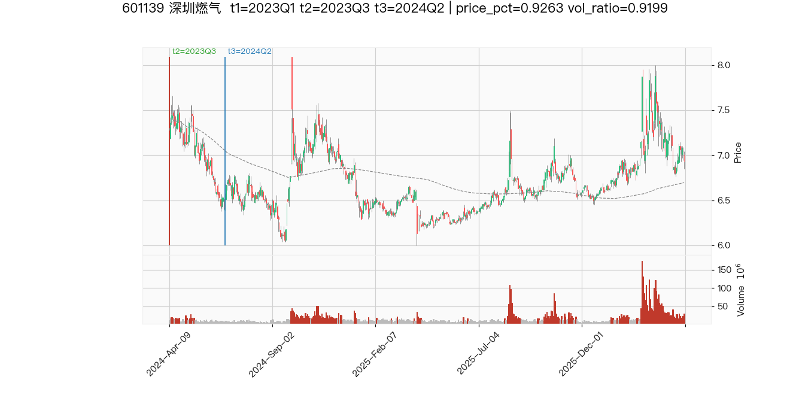

#### 🔍 检测依据 — 601139 深圳燃气
> 最佳 triple: **2023Q1 → 2023Q3 → 2024Q2** ｜ B 触发: price_pct=0.93 vol_ratio=0.92 ｜ t2 后 60 日收益: 6.1% ｜ 候选 triple 数: 3

#### 📊 港中结持仓节奏 — 601139 深圳燃气

| 季度     |   持股量(万股) |   持股市值(亿) |
|:-------|----------:|----------:|
| 2022Q4 |    3898.8 |      2.55 |
| 2023Q1 |    4663.6 |      3.2  |
| 2023Q2 |    4894.3 |      3.59 |
| 2023Q3 |    2874.5 |      1.97 |
| 2023Q4 |    2281.7 |      1.57 |
| 2024Q1 |    2571.5 |      1.88 |
| 2024Q2 |    3854.1 |      2.57 |
| 2024Q3 |    3697.9 |      2.49 |

#### ✍️ 人工复盘 — 601139 深圳燃气

| 检查项 | 结果 |
|--------|------|
| t2 季度价格在近 250 日高位区间（视觉） | ⬜ |
| t2 季度出现明显放量 bar（红色高量） | ⬜ |
| t3 季度买回后股价未大幅上涨（非卖飞） | ⬜ |
| t1→t2→t3 三段节奏符合「建仓→出货→再建仓」 | ⬜ |

**决策**: ⬜ PASS（纳入关注名单）　⬜ REJECT（假信号）

**备注**: _（人工填写）_

### 600449 宁夏建材 K 线 + 成交量
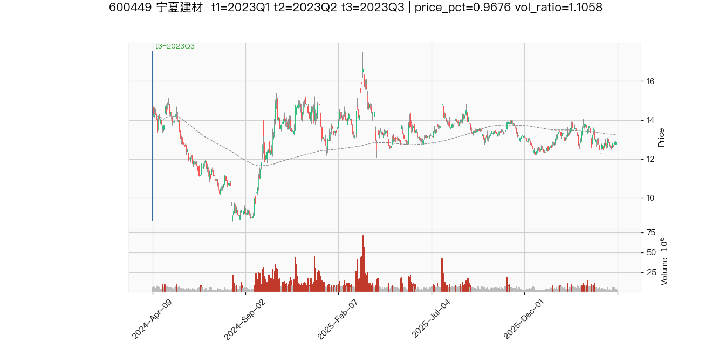

#### 🔍 检测依据 — 600449 宁夏建材
> 最佳 triple: **2023Q1 → 2023Q2 → 2023Q3** ｜ B 触发: price_pct=0.97 vol_ratio=1.11 ｜ 候选 triple 数: 2

#### 📊 港中结持仓节奏 — 600449 宁夏建材

| 季度     |   持股量(万股) |   持股市值(亿) |
|:-------|----------:|----------:|
| 2022Q4 |      39   |      0.05 |
| 2023Q1 |     171.4 |      0.28 |
| 2023Q2 |     155   |      0.24 |
| 2023Q3 |     166.1 |      0.28 |
| 2023Q4 |     446.1 |      0.8  |
| 2024Q1 |     439.8 |      0.73 |
| 2024Q2 |     323.5 |      0.38 |
| 2024Q3 |     605.1 |      0.57 |

#### ✍️ 人工复盘 — 600449 宁夏建材

| 检查项 | 结果 |
|--------|------|
| t2 季度价格在近 250 日高位区间（视觉） | ⬜ |
| t2 季度出现明显放量 bar（红色高量） | ⬜ |
| t3 季度买回后股价未大幅上涨（非卖飞） | ⬜ |
| t1→t2→t3 三段节奏符合「建仓→出货→再建仓」 | ⬜ |

**决策**: ⬜ PASS（纳入关注名单）　⬜ REJECT（假信号）

**备注**: _（人工填写）_

### 002925 盈趣科技 K 线 + 成交量
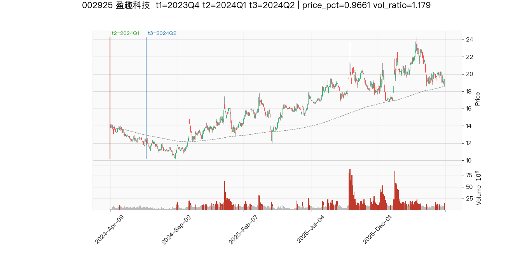

#### 🔍 检测依据 — 002925 盈趣科技
> 最佳 triple: **2023Q4 → 2024Q1 → 2024Q2** ｜ B 触发: price_pct=0.97 vol_ratio=1.18 ｜ 候选 triple 数: 3

#### 📊 港中结持仓节奏 — 002925 盈趣科技

| 季度     |   持股量(万股) |   持股市值(亿) |
|:-------|----------:|----------:|
| 2022Q4 |     392.8 |      0.65 |
| 2023Q1 |     641.5 |      1.34 |
| 2023Q2 |     814.6 |      1.55 |
| 2023Q3 |     456.4 |      0.84 |
| 2023Q4 |     683.6 |      1.33 |
| 2024Q1 |     492.1 |      0.76 |
| 2024Q2 |     608.7 |      0.77 |
| 2024Q3 |     518.4 |      0.61 |

#### ✍️ 人工复盘 — 002925 盈趣科技

| 检查项 | 结果 |
|--------|------|
| t2 季度价格在近 250 日高位区间（视觉） | ⬜ |
| t2 季度出现明显放量 bar（红色高量） | ⬜ |
| t3 季度买回后股价未大幅上涨（非卖飞） | ⬜ |
| t1→t2→t3 三段节奏符合「建仓→出货→再建仓」 | ⬜ |

**决策**: ⬜ PASS（纳入关注名单）　⬜ REJECT（假信号）

**备注**: _（人工填写）_

### 688700 东威科技 K 线 + 成交量
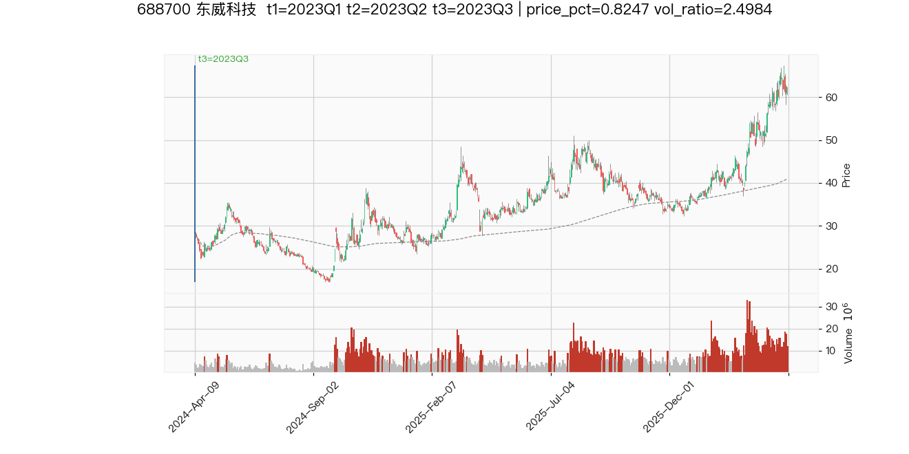

#### 🔍 检测依据 — 688700 东威科技
> 最佳 triple: **2023Q1 → 2023Q2 → 2023Q3** ｜ B 触发: price_pct=0.82 vol_ratio=2.50 ｜ 候选 triple 数: 2

#### 📊 港中结持仓节奏 — 688700 东威科技

| 季度     |   持股量(万股) |   持股市值(亿) |
|:-------|----------:|----------:|
| 2022Q4 |      68.3 |      0.98 |
| 2023Q1 |     499.6 |      4.98 |
| 2023Q2 |     155.7 |      1.37 |
| 2023Q3 |     471.4 |      2.48 |
| 2023Q4 |     374.7 |      2.29 |
| 2024Q1 |     451.2 |      1.61 |
| 2024Q2 |     448   |      1.17 |
| 2024Q3 |     405.2 |      0.93 |

#### ✍️ 人工复盘 — 688700 东威科技

| 检查项 | 结果 |
|--------|------|
| t2 季度价格在近 250 日高位区间（视觉） | ⬜ |
| t2 季度出现明显放量 bar（红色高量） | ⬜ |
| t3 季度买回后股价未大幅上涨（非卖飞） | ⬜ |
| t1→t2→t3 三段节奏符合「建仓→出货→再建仓」 | ⬜ |

**决策**: ⬜ PASS（纳入关注名单）　⬜ REJECT（假信号）

**备注**: _（人工填写）_

### 000901 航天科技 K 线 + 成交量
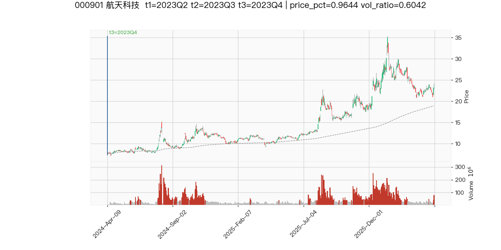

#### 🔍 检测依据 — 000901 航天科技
> 最佳 triple: **2023Q2 → 2023Q3 → 2023Q4** ｜ B 触发: price_pct=0.96 vol_ratio=0.60 ｜ 候选 triple 数: 3

#### 📊 港中结持仓节奏 — 000901 航天科技

| 季度     |   持股量(万股) |   持股市值(亿) |
|:-------|----------:|----------:|
| 2023Q1 |    1148.2 |      1.15 |
| 2023Q2 |    1294.1 |      1.38 |
| 2023Q3 |    1113.7 |      1.09 |
| 2023Q4 |    1256.1 |      1.17 |
| 2024Q1 |     990.4 |      0.8  |
| 2024Q2 |     678.7 |      0.59 |
| 2024Q3 |    1061.4 |      1.1  |

#### ✍️ 人工复盘 — 000901 航天科技

| 检查项 | 结果 |
|--------|------|
| t2 季度价格在近 250 日高位区间（视觉） | ⬜ |
| t2 季度出现明显放量 bar（红色高量） | ⬜ |
| t3 季度买回后股价未大幅上涨（非卖飞） | ⬜ |
| t1→t2→t3 三段节奏符合「建仓→出货→再建仓」 | ⬜ |

**决策**: ⬜ PASS（纳入关注名单）　⬜ REJECT（假信号）

**备注**: _（人工填写）_

### 002782 可立克 K 线 + 成交量
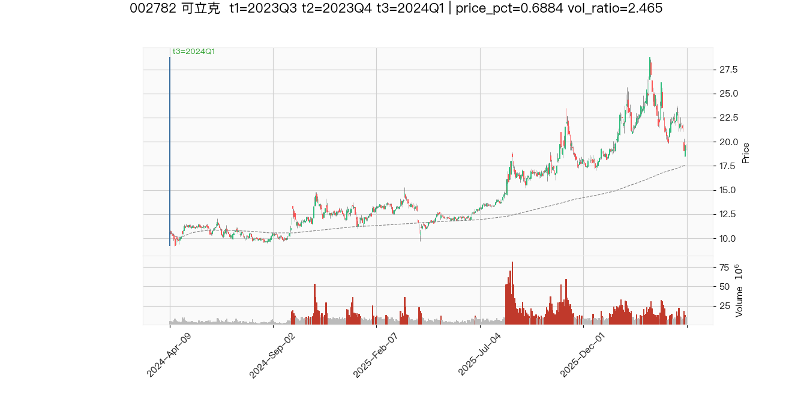

#### 🔍 检测依据 — 002782 可立克
> 最佳 triple: **2023Q3 → 2023Q4 → 2024Q1** ｜ B 触发: price_pct=0.69 vol_ratio=2.46 ｜ 候选 triple 数: 2

#### 📊 港中结持仓节奏 — 002782 可立克

| 季度     |   持股量(万股) |   持股市值(亿) |
|:-------|----------:|----------:|
| 2022Q4 |     161.6 |      0.28 |
| 2023Q1 |     566   |      1.03 |
| 2023Q2 |     831.3 |      1.25 |
| 2023Q3 |    1048.2 |      1.24 |
| 2023Q4 |     411.8 |      0.58 |
| 2024Q1 |     568.3 |      0.61 |
| 2024Q2 |     519.1 |      0.58 |
| 2024Q3 |     499.8 |      0.5  |

#### ✍️ 人工复盘 — 002782 可立克

| 检查项 | 结果 |
|--------|------|
| t2 季度价格在近 250 日高位区间（视觉） | ⬜ |
| t2 季度出现明显放量 bar（红色高量） | ⬜ |
| t3 季度买回后股价未大幅上涨（非卖飞） | ⬜ |
| t1→t2→t3 三段节奏符合「建仓→出货→再建仓」 | ⬜ |

**决策**: ⬜ PASS（纳入关注名单）　⬜ REJECT（假信号）

**备注**: _（人工填写）_

### 603118 共进股份 K 线 + 成交量
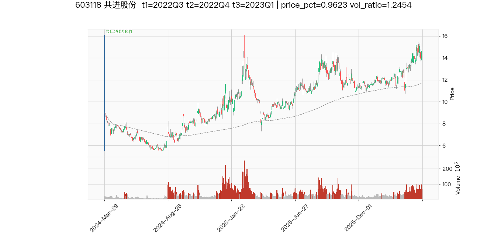

#### 🔍 检测依据 — 603118 共进股份
> 最佳 triple: **2022Q3 → 2022Q4 → 2023Q1** ｜ B 触发: price_pct=0.96 vol_ratio=1.25 ｜ 候选 triple 数: 3

#### 📊 港中结持仓节奏 — 603118 共进股份

| 季度     |   持股量(万股) |   持股市值(亿) |
|:-------|----------:|----------:|
| 2022Q4 |     965.2 |      0.77 |
| 2023Q1 |    2359.3 |      2.49 |
| 2023Q2 |    1265.4 |      1.53 |
| 2023Q3 |    1191.8 |      1.4  |
| 2023Q4 |     727.4 |      0.65 |
| 2024Q1 |    1113.1 |      0.99 |
| 2024Q2 |    1224.1 |      0.82 |
| 2024Q3 |    1285.1 |      0.77 |

#### ✍️ 人工复盘 — 603118 共进股份

| 检查项 | 结果 |
|--------|------|
| t2 季度价格在近 250 日高位区间（视觉） | ⬜ |
| t2 季度出现明显放量 bar（红色高量） | ⬜ |
| t3 季度买回后股价未大幅上涨（非卖飞） | ⬜ |
| t1→t2→t3 三段节奏符合「建仓→出货→再建仓」 | ⬜ |

**决策**: ⬜ PASS（纳入关注名单）　⬜ REJECT（假信号）

**备注**: _（人工填写）_

### 688066 航天宏图 K 线 + 成交量
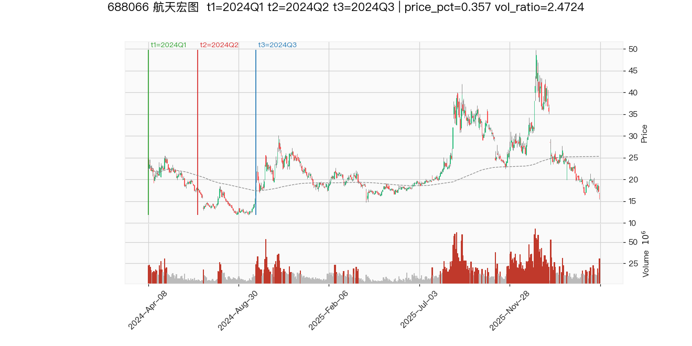

#### 🔍 检测依据 — 688066 航天宏图
> 最佳 triple: **2024Q1 → 2024Q2 → 2024Q3** ｜ B 触发: price_pct=0.36 vol_ratio=2.47 ｜ 候选 triple 数: 1

#### 📊 港中结持仓节奏 — 688066 航天宏图

| 季度     |   持股量(万股) |   持股市值(亿) |
|:-------|----------:|----------:|
| 2023Q1 |     184.8 |      1.86 |
| 2023Q2 |     234.6 |      1.41 |
| 2023Q3 |     225.5 |      1.15 |
| 2023Q4 |     388.9 |      1.64 |
| 2024Q1 |     519.4 |      1.28 |
| 2024Q2 |     163   |      0.29 |
| 2024Q3 |     302.5 |      0.42 |

#### ✍️ 人工复盘 — 688066 航天宏图

| 检查项 | 结果 |
|--------|------|
| t2 季度价格在近 250 日高位区间（视觉） | ⬜ |
| t2 季度出现明显放量 bar（红色高量） | ⬜ |
| t3 季度买回后股价未大幅上涨（非卖飞） | ⬜ |
| t1→t2→t3 三段节奏符合「建仓→出货→再建仓」 | ⬜ |

**决策**: ⬜ PASS（纳入关注名单）　⬜ REJECT（假信号）

**备注**: _（人工填写）_

### 002815 崇达技术 K 线 + 成交量
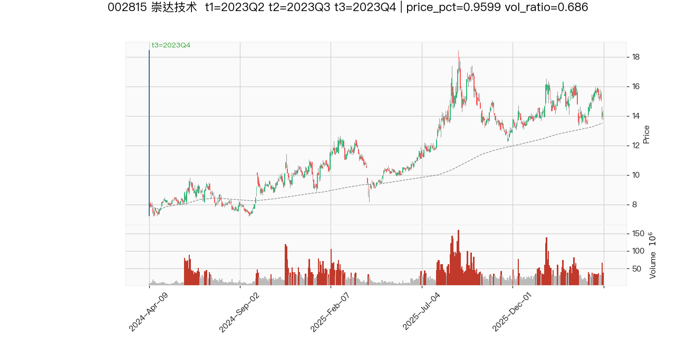

#### 🔍 检测依据 — 002815 崇达技术
> 最佳 triple: **2023Q2 → 2023Q3 → 2023Q4** ｜ B 触发: price_pct=0.96 vol_ratio=0.69 ｜ 候选 triple 数: 2

#### 📊 港中结持仓节奏 — 002815 崇达技术

| 季度     |   持股量(万股) |   持股市值(亿) |
|:-------|----------:|----------:|
| 2022Q4 |     589.3 |      0.58 |
| 2023Q1 |     877.7 |      1.11 |
| 2023Q2 |    1500.4 |      1.79 |
| 2023Q3 |    1114.8 |      1.26 |
| 2023Q4 |    1796   |      1.72 |
| 2024Q1 |    1388.7 |      1.19 |
| 2024Q2 |     814.8 |      0.76 |
| 2024Q3 |     876.9 |      0.73 |

#### ✍️ 人工复盘 — 002815 崇达技术

| 检查项 | 结果 |
|--------|------|
| t2 季度价格在近 250 日高位区间（视觉） | ⬜ |
| t2 季度出现明显放量 bar（红色高量） | ⬜ |
| t3 季度买回后股价未大幅上涨（非卖飞） | ⬜ |
| t1→t2→t3 三段节奏符合「建仓→出货→再建仓」 | ⬜ |

**决策**: ⬜ PASS（纳入关注名单）　⬜ REJECT（假信号）

**备注**: _（人工填写）_

### 603368 柳药集团 K 线 + 成交量
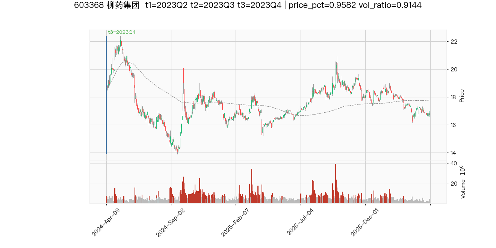

#### 🔍 检测依据 — 603368 柳药集团
> 最佳 triple: **2023Q2 → 2023Q3 → 2023Q4** ｜ B 触发: price_pct=0.96 vol_ratio=0.91 ｜ 候选 triple 数: 1

#### 📊 港中结持仓节奏 — 603368 柳药集团

| 季度     |   持股量(万股) |   持股市值(亿) |
|:-------|----------:|----------:|
| 2022Q4 |      85.9 |      0.16 |
| 2023Q1 |     403.2 |      0.99 |
| 2023Q2 |     790.5 |      1.78 |
| 2023Q3 |     313.4 |      0.68 |
| 2023Q4 |     400.3 |      0.76 |
| 2024Q1 |     605.5 |      1.28 |
| 2024Q2 |     489.9 |      0.86 |
| 2024Q3 |     418.1 |      0.71 |

#### ✍️ 人工复盘 — 603368 柳药集团

| 检查项 | 结果 |
|--------|------|
| t2 季度价格在近 250 日高位区间（视觉） | ⬜ |
| t2 季度出现明显放量 bar（红色高量） | ⬜ |
| t3 季度买回后股价未大幅上涨（非卖飞） | ⬜ |
| t1→t2→t3 三段节奏符合「建仓→出货→再建仓」 | ⬜ |

**决策**: ⬜ PASS（纳入关注名单）　⬜ REJECT（假信号）

**备注**: _（人工填写）_

### 001301 尚太科技 K 线 + 成交量
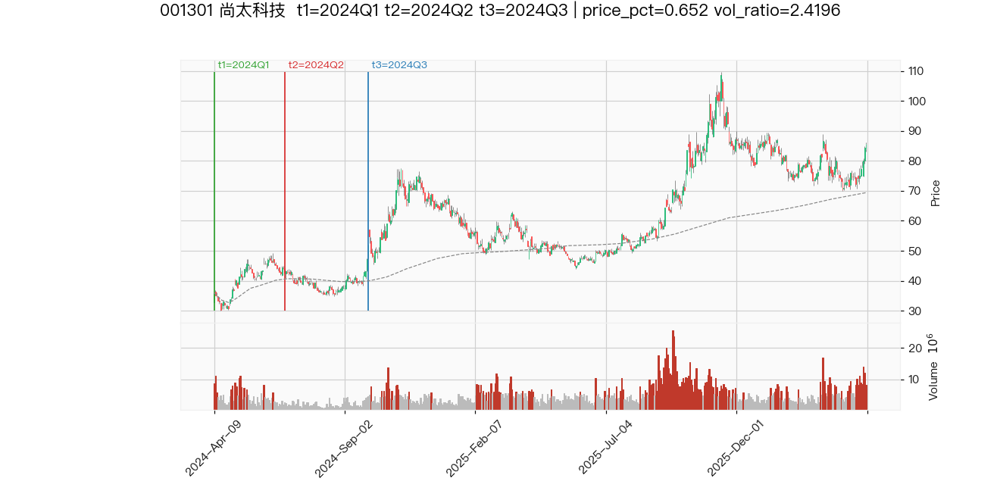

#### 🔍 检测依据 — 001301 尚太科技
> 最佳 triple: **2024Q1 → 2024Q2 → 2024Q3** ｜ B 触发: price_pct=0.65 vol_ratio=2.42 ｜ 候选 triple 数: 1

#### 📊 港中结持仓节奏 — 001301 尚太科技

| 季度     |   持股量(万股) |   持股市值(亿) |
|:-------|----------:|----------:|
| 2023Q1 |      31.6 |      0.22 |
| 2023Q2 |     108.1 |      0.6  |
| 2023Q3 |     108   |      0.52 |
| 2023Q4 |     114.1 |      0.42 |
| 2024Q1 |     177.3 |      0.53 |
| 2024Q2 |     142.4 |      0.62 |
| 2024Q3 |     189.5 |      0.73 |

#### ✍️ 人工复盘 — 001301 尚太科技

| 检查项 | 结果 |
|--------|------|
| t2 季度价格在近 250 日高位区间（视觉） | ⬜ |
| t2 季度出现明显放量 bar（红色高量） | ⬜ |
| t3 季度买回后股价未大幅上涨（非卖飞） | ⬜ |
| t1→t2→t3 三段节奏符合「建仓→出货→再建仓」 | ⬜ |

**决策**: ⬜ PASS（纳入关注名单）　⬜ REJECT（假信号）

**备注**: _（人工填写）_

### 600575 淮河能源 K 线 + 成交量
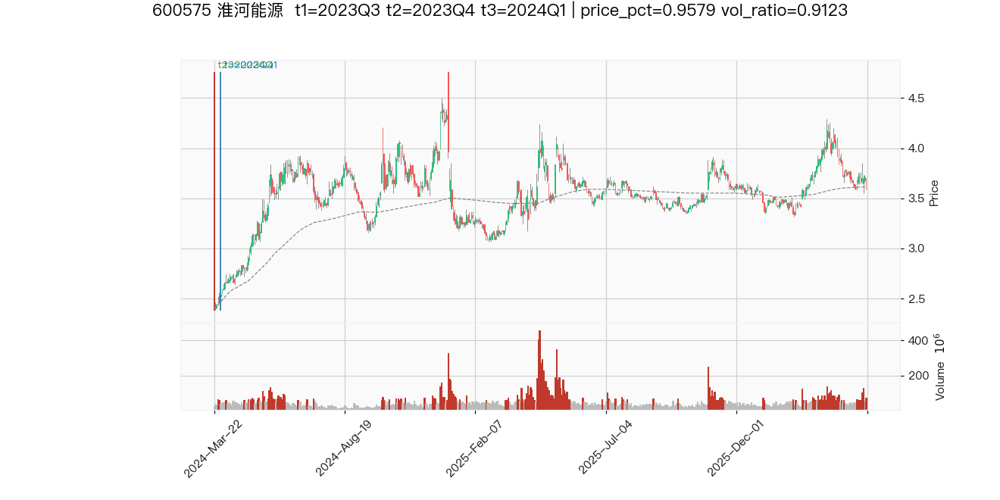

#### 🔍 检测依据 — 600575 淮河能源
> 最佳 triple: **2023Q3 → 2023Q4 → 2024Q1** ｜ B 触发: price_pct=0.96 vol_ratio=0.91 ｜ 候选 triple 数: 2

#### 📊 港中结持仓节奏 — 600575 淮河能源

| 季度     |   持股量(万股) |   持股市值(亿) |
|:-------|----------:|----------:|
| 2023Q1 |     172.1 |      0.04 |
| 2023Q2 |     404.5 |      0.1  |
| 2023Q3 |    1321.2 |      0.37 |
| 2023Q4 |     722.7 |      0.17 |
| 2024Q1 |    2271.7 |      0.59 |
| 2024Q2 |    1484.8 |      0.58 |
| 2024Q3 |    4602.5 |      1.75 |

#### ✍️ 人工复盘 — 600575 淮河能源

| 检查项 | 结果 |
|--------|------|
| t2 季度价格在近 250 日高位区间（视觉） | ⬜ |
| t2 季度出现明显放量 bar（红色高量） | ⬜ |
| t3 季度买回后股价未大幅上涨（非卖飞） | ⬜ |
| t1→t2→t3 三段节奏符合「建仓→出货→再建仓」 | ⬜ |

**决策**: ⬜ PASS（纳入关注名单）　⬜ REJECT（假信号）

**备注**: _（人工填写）_

### 603599 广信股份 K 线 + 成交量
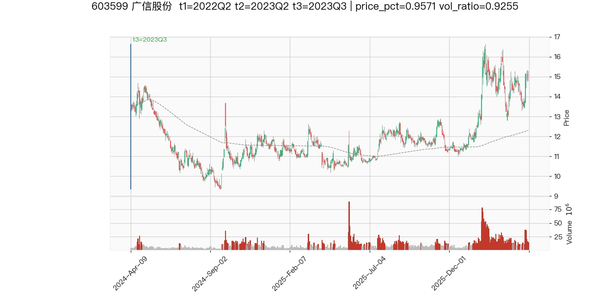

#### 🔍 检测依据 — 603599 广信股份
> 最佳 triple: **2022Q2 → 2023Q2 → 2023Q3** ｜ B 触发: price_pct=0.96 vol_ratio=0.93 ｜ 候选 triple 数: 2

#### 📊 港中结持仓节奏 — 603599 广信股份

| 季度     |   持股量(万股) |   持股市值(亿) |
|:-------|----------:|----------:|
| 2022Q4 |    3662.3 |     10.77 |
| 2023Q1 |    3189.7 |     10.52 |
| 2023Q2 |    1522.4 |      4.12 |
| 2023Q3 |    1827.7 |      3.67 |
| 2023Q4 |    1645.8 |      2.39 |
| 2024Q1 |    1417.1 |      2.07 |
| 2024Q2 |    1043   |      1.27 |
| 2024Q3 |    1179.5 |      1.22 |

#### ✍️ 人工复盘 — 603599 广信股份

| 检查项 | 结果 |
|--------|------|
| t2 季度价格在近 250 日高位区间（视觉） | ⬜ |
| t2 季度出现明显放量 bar（红色高量） | ⬜ |
| t3 季度买回后股价未大幅上涨（非卖飞） | ⬜ |
| t1→t2→t3 三段节奏符合「建仓→出货→再建仓」 | ⬜ |

**决策**: ⬜ PASS（纳入关注名单）　⬜ REJECT（假信号）

**备注**: _（人工填写）_

### 300590 移为通信 K 线 + 成交量
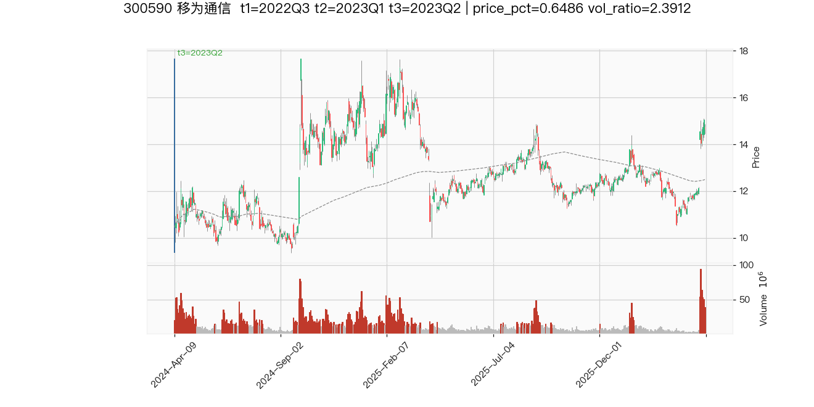

#### 🔍 检测依据 — 300590 移为通信
> 最佳 triple: **2022Q3 → 2023Q1 → 2023Q2** ｜ B 触发: price_pct=0.65 vol_ratio=2.39 ｜ 候选 triple 数: 5

#### 📊 港中结持仓节奏 — 300590 移为通信

| 季度     |   持股量(万股) |   持股市值(亿) |
|:-------|----------:|----------:|
| 2022Q4 |     131.4 |      0.13 |
| 2023Q1 |      87   |      0.11 |
| 2023Q2 |     375.8 |      0.45 |
| 2023Q3 |     350.6 |      0.4  |
| 2023Q4 |     280   |      0.34 |
| 2024Q1 |     309.7 |      0.28 |
| 2024Q2 |     173.2 |      0.2  |
| 2024Q3 |     883.8 |      0.96 |

#### ✍️ 人工复盘 — 300590 移为通信

| 检查项 | 结果 |
|--------|------|
| t2 季度价格在近 250 日高位区间（视觉） | ⬜ |
| t2 季度出现明显放量 bar（红色高量） | ⬜ |
| t3 季度买回后股价未大幅上涨（非卖飞） | ⬜ |
| t1→t2→t3 三段节奏符合「建仓→出货→再建仓」 | ⬜ |

**决策**: ⬜ PASS（纳入关注名单）　⬜ REJECT（假信号）

**备注**: _（人工填写）_

### 600125 铁龙物流 K 线 + 成交量
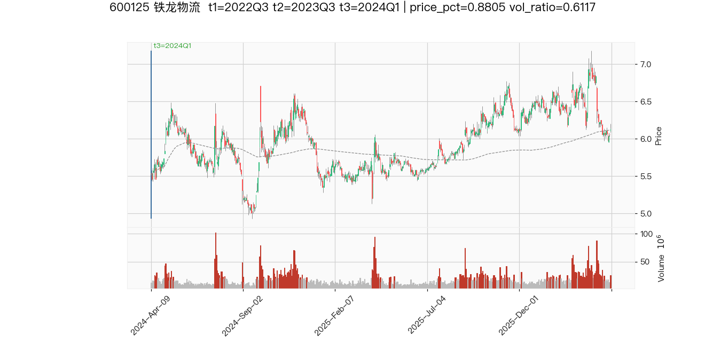

#### 🔍 检测依据 — 600125 铁龙物流
> 最佳 triple: **2022Q3 → 2023Q3 → 2024Q1** ｜ B 触发: price_pct=0.88 vol_ratio=0.61 ｜ t2 后 60 日收益: 4.9% ｜ 候选 triple 数: 2

#### 📊 港中结持仓节奏 — 600125 铁龙物流

| 季度     |   持股量(万股) |   持股市值(亿) |
|:-------|----------:|----------:|
| 2022Q4 |    9086.3 |      4.96 |
| 2023Q1 |    6967.7 |      3.92 |
| 2023Q2 |    6186.9 |      3.74 |
| 2023Q3 |    5628   |      3.48 |
| 2023Q4 |    5172.2 |      3.13 |
| 2024Q1 |    5713.2 |      3.21 |
| 2024Q2 |    5874.4 |      3.51 |
| 2024Q3 |    5894.8 |      3.5  |

#### ✍️ 人工复盘 — 600125 铁龙物流

| 检查项 | 结果 |
|--------|------|
| t2 季度价格在近 250 日高位区间（视觉） | ⬜ |
| t2 季度出现明显放量 bar（红色高量） | ⬜ |
| t3 季度买回后股价未大幅上涨（非卖飞） | ⬜ |
| t1→t2→t3 三段节奏符合「建仓→出货→再建仓」 | ⬜ |

**决策**: ⬜ PASS（纳入关注名单）　⬜ REJECT（假信号）

**备注**: _（人工填写）_

### 300296 利亚德 K 线 + 成交量
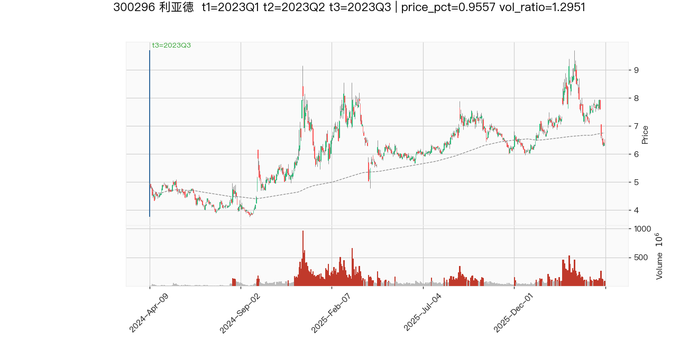

#### 🔍 检测依据 — 300296 利亚德
> 最佳 triple: **2023Q1 → 2023Q2 → 2023Q3** ｜ B 触发: price_pct=0.96 vol_ratio=1.30 ｜ 候选 triple 数: 2

#### 📊 港中结持仓节奏 — 300296 利亚德

| 季度     |   持股量(万股) |   持股市值(亿) |
|:-------|----------:|----------:|
| 2022Q4 |    2271.5 |      1.29 |
| 2023Q1 |    5749   |      3.92 |
| 2023Q2 |    2885.5 |      1.88 |
| 2023Q3 |    4120.3 |      2.69 |
| 2023Q4 |    2424.3 |      1.45 |
| 2024Q1 |    3280.5 |      1.66 |
| 2024Q2 |    3059.7 |      1.38 |
| 2024Q3 |    3125.6 |      1.41 |

#### ✍️ 人工复盘 — 300296 利亚德

| 检查项 | 结果 |
|--------|------|
| t2 季度价格在近 250 日高位区间（视觉） | ⬜ |
| t2 季度出现明显放量 bar（红色高量） | ⬜ |
| t3 季度买回后股价未大幅上涨（非卖飞） | ⬜ |
| t1→t2→t3 三段节奏符合「建仓→出货→再建仓」 | ⬜ |

**决策**: ⬜ PASS（纳入关注名单）　⬜ REJECT（假信号）

**备注**: _（人工填写）_

### 603267 鸿远电子 K 线 + 成交量
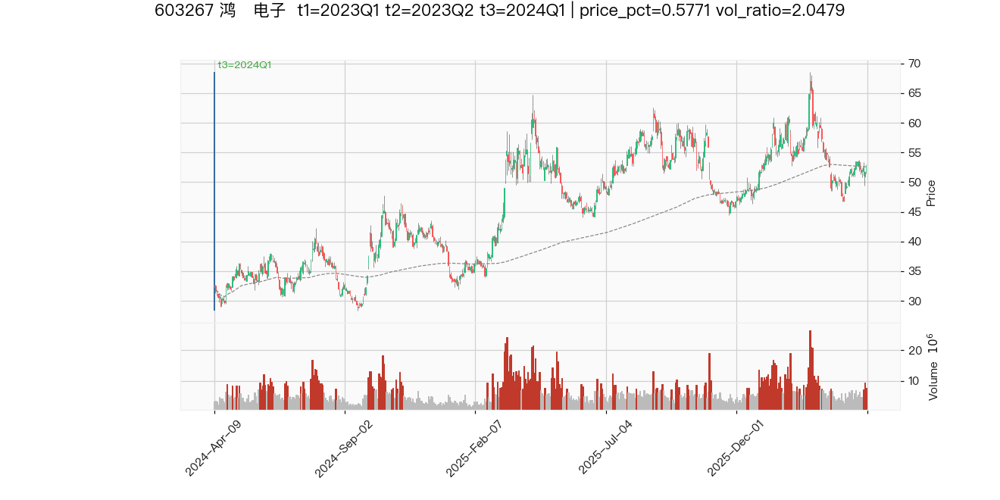

#### 🔍 检测依据 — 603267 鸿远电子
> 最佳 triple: **2023Q1 → 2023Q2 → 2024Q1** ｜ B 触发: price_pct=0.58 vol_ratio=2.05 ｜ t2 后 60 日收益: 6.4% ｜ 候选 triple 数: 2

#### 📊 港中结持仓节奏 — 603267 鸿远电子

| 季度     |   持股量(万股) |   持股市值(亿) |
|:-------|----------:|----------:|
| 2022Q4 |     284.1 |      2.87 |
| 2023Q1 |     347.9 |      2.68 |
| 2023Q2 |     196.5 |      1.21 |
| 2023Q3 |     153.5 |      0.95 |
| 2023Q4 |     188.5 |      0.95 |
| 2024Q1 |     353.8 |      1.2  |
| 2024Q2 |     179.6 |      0.61 |
| 2024Q3 |     148.5 |      0.54 |

#### ✍️ 人工复盘 — 603267 鸿远电子

| 检查项 | 结果 |
|--------|------|
| t2 季度价格在近 250 日高位区间（视觉） | ⬜ |
| t2 季度出现明显放量 bar（红色高量） | ⬜ |
| t3 季度买回后股价未大幅上涨（非卖飞） | ⬜ |
| t1→t2→t3 三段节奏符合「建仓→出货→再建仓」 | ⬜ |

**决策**: ⬜ PASS（纳入关注名单）　⬜ REJECT（假信号）

**备注**: _（人工填写）_

### 601200 上海环境 K 线 + 成交量
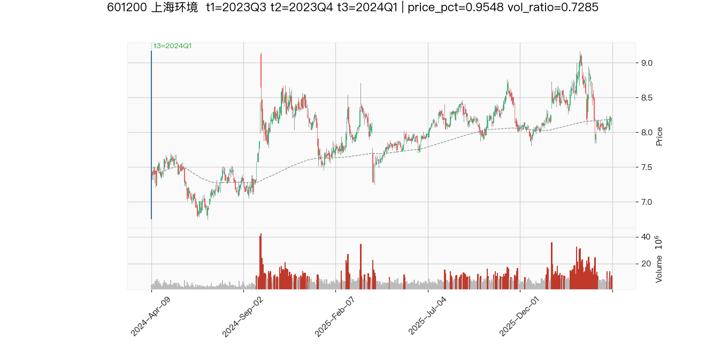

#### 🔍 检测依据 — 601200 上海环境
> 最佳 triple: **2023Q3 → 2023Q4 → 2024Q1** ｜ B 触发: price_pct=0.95 vol_ratio=0.73 ｜ 候选 triple 数: 4

#### 📊 港中结持仓节奏 — 601200 上海环境

| 季度     |   持股量(万股) |   持股市值(亿) |
|:-------|----------:|----------:|
| 2022Q4 |     376.8 |      0.34 |
| 2023Q1 |     232.9 |      0.22 |
| 2023Q2 |     333.4 |      0.32 |
| 2023Q3 |     913.7 |      0.89 |
| 2023Q4 |     591.8 |      0.53 |
| 2024Q1 |     973.9 |      0.86 |
| 2024Q2 |     994.5 |      0.85 |
| 2024Q3 |    1278.2 |      0.95 |

#### ✍️ 人工复盘 — 601200 上海环境

| 检查项 | 结果 |
|--------|------|
| t2 季度价格在近 250 日高位区间（视觉） | ⬜ |
| t2 季度出现明显放量 bar（红色高量） | ⬜ |
| t3 季度买回后股价未大幅上涨（非卖飞） | ⬜ |
| t1→t2→t3 三段节奏符合「建仓→出货→再建仓」 | ⬜ |

**决策**: ⬜ PASS（纳入关注名单）　⬜ REJECT（假信号）

**备注**: _（人工填写）_

### 603279 景津装备 K 线 + 成交量
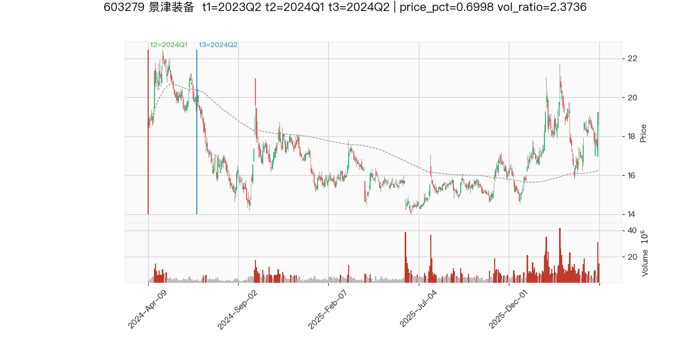

#### 🔍 检测依据 — 603279 景津装备
> 最佳 triple: **2023Q2 → 2024Q1 → 2024Q2** ｜ B 触发: price_pct=0.70 vol_ratio=2.37 ｜ 候选 triple 数: 2

#### 📊 港中结持仓节奏 — 603279 景津装备

| 季度     |   持股量(万股) |   持股市值(亿) |
|:-------|----------:|----------:|
| 2022Q4 |    1852.8 |      5.46 |
| 2023Q1 |    3298.9 |      9.37 |
| 2023Q2 |    4363.5 |     13.27 |
| 2023Q3 |    4488.9 |     11.94 |
| 2023Q4 |    3599.9 |      7.96 |
| 2024Q1 |    2307.5 |      4.58 |
| 2024Q2 |    2508.7 |      5.44 |
| 2024Q3 |    2128.3 |      3.69 |

#### ✍️ 人工复盘 — 603279 景津装备

| 检查项 | 结果 |
|--------|------|
| t2 季度价格在近 250 日高位区间（视觉） | ⬜ |
| t2 季度出现明显放量 bar（红色高量） | ⬜ |
| t3 季度买回后股价未大幅上涨（非卖飞） | ⬜ |
| t1→t2→t3 三段节奏符合「建仓→出货→再建仓」 | ⬜ |

**决策**: ⬜ PASS（纳入关注名单）　⬜ REJECT（假信号）

**备注**: _（人工填写）_

### 002538 司尔特 K 线 + 成交量
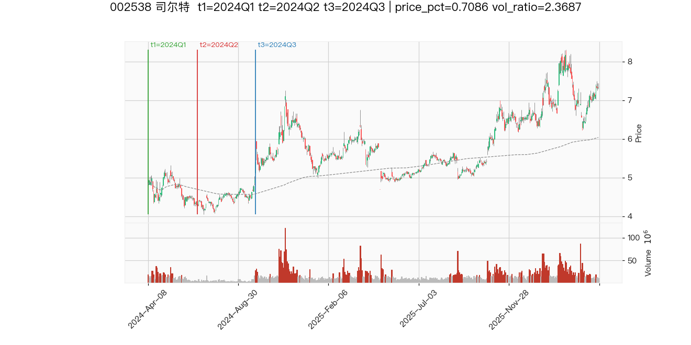

#### 🔍 检测依据 — 002538 司尔特
> 最佳 triple: **2024Q1 → 2024Q2 → 2024Q3** ｜ B 触发: price_pct=0.71 vol_ratio=2.37 ｜ 候选 triple 数: 1

#### 📊 港中结持仓节奏 — 002538 司尔特

| 季度     |   持股量(万股) |   持股市值(亿) |
|:-------|----------:|----------:|
| 2022Q4 |       0.4 |      0    |
| 2023Q1 |      95   |      0.08 |
| 2023Q2 |     151.4 |      0.1  |
| 2023Q3 |     190.6 |      0.12 |
| 2023Q4 |     481.7 |      0.29 |
| 2024Q1 |     621.4 |      0.3  |
| 2024Q2 |     301.3 |      0.13 |
| 2024Q3 |     655.4 |      0.31 |

#### ✍️ 人工复盘 — 002538 司尔特

| 检查项 | 结果 |
|--------|------|
| t2 季度价格在近 250 日高位区间（视觉） | ⬜ |
| t2 季度出现明显放量 bar（红色高量） | ⬜ |
| t3 季度买回后股价未大幅上涨（非卖飞） | ⬜ |
| t1→t2→t3 三段节奏符合「建仓→出货→再建仓」 | ⬜ |

**决策**: ⬜ PASS（纳入关注名单）　⬜ REJECT（假信号）

**备注**: _（人工填写）_

### 000016 深康佳A K 线 + 成交量
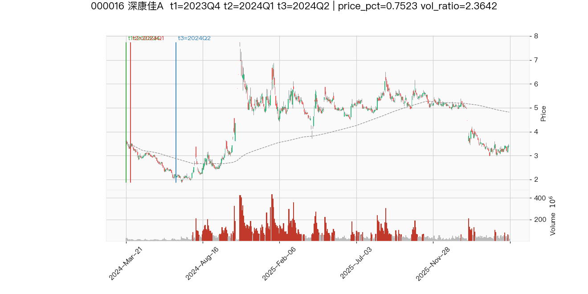

#### 🔍 检测依据 — 000016 深康佳A
> 最佳 triple: **2023Q4 → 2024Q1 → 2024Q2** ｜ B 触发: price_pct=0.75 vol_ratio=2.36 ｜ 候选 triple 数: 1

#### 📊 港中结持仓节奏 — 000016 深康佳A

| 季度     |   持股量(万股) |   持股市值(亿) |
|:-------|----------:|----------:|
| 2023Q1 |    1540.2 |      0.78 |
| 2023Q2 |    1264.6 |      0.59 |
| 2023Q3 |    1269.7 |      0.55 |
| 2023Q4 |    2229.3 |      0.93 |
| 2024Q1 |    1298.3 |      0.44 |
| 2024Q2 |    1626.6 |      0.35 |
| 2024Q3 |    1951.9 |      0.47 |

#### ✍️ 人工复盘 — 000016 深康佳A

| 检查项 | 结果 |
|--------|------|
| t2 季度价格在近 250 日高位区间（视觉） | ⬜ |
| t2 季度出现明显放量 bar（红色高量） | ⬜ |
| t3 季度买回后股价未大幅上涨（非卖飞） | ⬜ |
| t1→t2→t3 三段节奏符合「建仓→出货→再建仓」 | ⬜ |

**决策**: ⬜ PASS（纳入关注名单）　⬜ REJECT（假信号）

**备注**: _（人工填写）_

### 600507 方大特钢 K 线 + 成交量
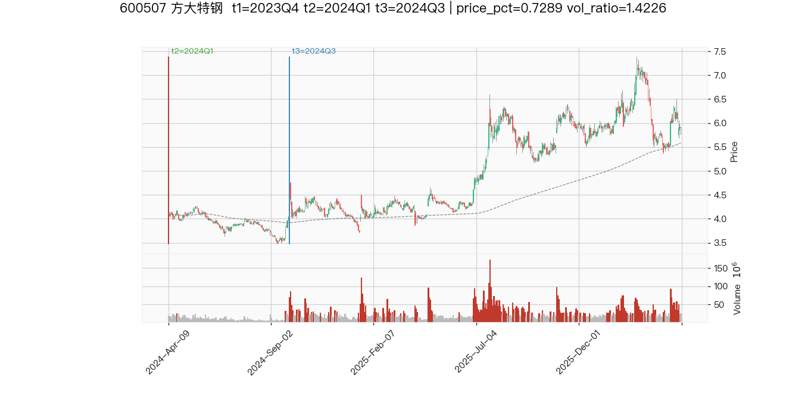

#### 🔍 检测依据 — 600507 方大特钢
> 最佳 triple: **2023Q4 → 2024Q1 → 2024Q3** ｜ B 触发: price_pct=0.73 vol_ratio=1.42 ｜ t2 后 60 日收益: 4.4% ｜ 候选 triple 数: 1

#### 📊 港中结持仓节奏 — 600507 方大特钢

| 季度     |   持股量(万股) |   持股市值(亿) |
|:-------|----------:|----------:|
| 2022Q4 |    3542.1 |      2.13 |
| 2023Q1 |    2662.6 |      1.49 |
| 2023Q2 |    2478.4 |      1.13 |
| 2023Q3 |    2419.7 |      1.14 |
| 2023Q4 |    2968   |      1.37 |
| 2024Q1 |    1481   |      0.62 |
| 2024Q2 |    1535.6 |      0.57 |
| 2024Q3 |    1992.9 |      0.78 |

#### ✍️ 人工复盘 — 600507 方大特钢

| 检查项 | 结果 |
|--------|------|
| t2 季度价格在近 250 日高位区间（视觉） | ⬜ |
| t2 季度出现明显放量 bar（红色高量） | ⬜ |
| t3 季度买回后股价未大幅上涨（非卖飞） | ⬜ |
| t1→t2→t3 三段节奏符合「建仓→出货→再建仓」 | ⬜ |

**决策**: ⬜ PASS（纳入关注名单）　⬜ REJECT（假信号）

**备注**: _（人工填写）_

### 300267 尔康制药 K 线 + 成交量
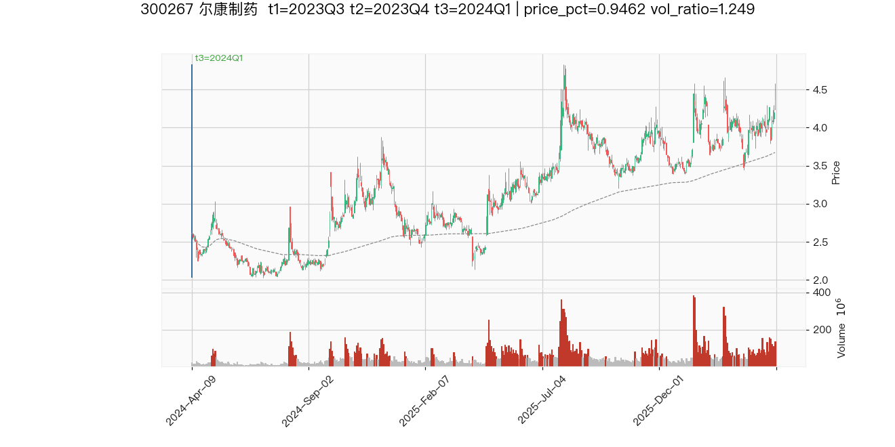

#### 🔍 检测依据 — 300267 尔康制药
> 最佳 triple: **2023Q3 → 2023Q4 → 2024Q1** ｜ B 触发: price_pct=0.95 vol_ratio=1.25 ｜ 候选 triple 数: 2

#### 📊 港中结持仓节奏 — 300267 尔康制药

| 季度     |   持股量(万股) |   持股市值(亿) |
|:-------|----------:|----------:|
| 2023Q1 |     939.8 |      0.31 |
| 2023Q2 |     838.3 |      0.27 |
| 2023Q3 |    2273.6 |      0.77 |
| 2023Q4 |    1140.6 |      0.37 |
| 2024Q1 |    1339.4 |      0.37 |
| 2024Q2 |    1112.4 |      0.23 |
| 2024Q3 |    1362.2 |      0.33 |

#### ✍️ 人工复盘 — 300267 尔康制药

| 检查项 | 结果 |
|--------|------|
| t2 季度价格在近 250 日高位区间（视觉） | ⬜ |
| t2 季度出现明显放量 bar（红色高量） | ⬜ |
| t3 季度买回后股价未大幅上涨（非卖飞） | ⬜ |
| t1→t2→t3 三段节奏符合「建仓→出货→再建仓」 | ⬜ |

**决策**: ⬜ PASS（纳入关注名单）　⬜ REJECT（假信号）

**备注**: _（人工填写）_

### 603919 金徽酒 K 线 + 成交量
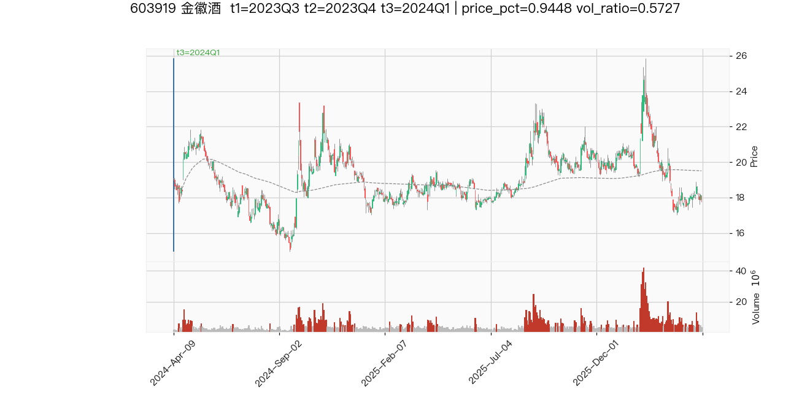

#### 🔍 检测依据 — 603919 金徽酒
> 最佳 triple: **2023Q3 → 2023Q4 → 2024Q1** ｜ B 触发: price_pct=0.94 vol_ratio=0.57 ｜ 候选 triple 数: 1

#### 📊 港中结持仓节奏 — 603919 金徽酒

| 季度     |   持股量(万股) |   持股市值(亿) |
|:-------|----------:|----------:|
| 2022Q4 |     177.8 |      0.48 |
| 2023Q1 |     379.3 |      1.04 |
| 2023Q2 |     446.2 |      1.04 |
| 2023Q3 |     942.2 |      2.67 |
| 2023Q4 |     344.8 |      0.85 |
| 2024Q1 |     457.2 |      0.91 |
| 2024Q2 |     418.4 |      0.76 |
| 2024Q3 |     335.9 |      0.61 |

#### ✍️ 人工复盘 — 603919 金徽酒

| 检查项 | 结果 |
|--------|------|
| t2 季度价格在近 250 日高位区间（视觉） | ⬜ |
| t2 季度出现明显放量 bar（红色高量） | ⬜ |
| t3 季度买回后股价未大幅上涨（非卖飞） | ⬜ |
| t1→t2→t3 三段节奏符合「建仓→出货→再建仓」 | ⬜ |

**决策**: ⬜ PASS（纳入关注名单）　⬜ REJECT（假信号）

**备注**: _（人工填写）_

### 000837 秦川机床 K 线 + 成交量
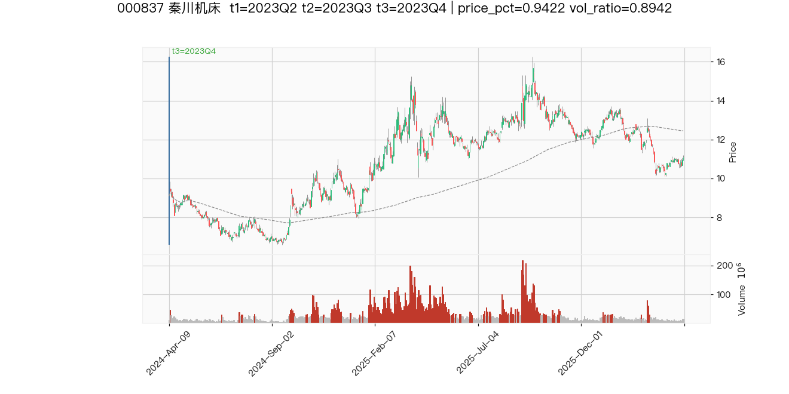

#### 🔍 检测依据 — 000837 秦川机床
> 最佳 triple: **2023Q2 → 2023Q3 → 2023Q4** ｜ B 触发: price_pct=0.94 vol_ratio=0.89 ｜ 候选 triple 数: 1

#### 📊 港中结持仓节奏 — 000837 秦川机床

| 季度     |   持股量(万股) |   持股市值(亿) |
|:-------|----------:|----------:|
| 2023Q1 |     326.6 |      0.35 |
| 2023Q2 |     525.7 |      0.84 |
| 2023Q3 |     453.8 |      0.58 |
| 2023Q4 |     602.9 |      0.65 |
| 2024Q1 |     631.2 |      0.6  |
| 2024Q2 |     923.6 |      0.68 |
| 2024Q3 |     511.1 |      0.38 |

#### ✍️ 人工复盘 — 000837 秦川机床

| 检查项 | 结果 |
|--------|------|
| t2 季度价格在近 250 日高位区间（视觉） | ⬜ |
| t2 季度出现明显放量 bar（红色高量） | ⬜ |
| t3 季度买回后股价未大幅上涨（非卖飞） | ⬜ |
| t1→t2→t3 三段节奏符合「建仓→出货→再建仓」 | ⬜ |

**决策**: ⬜ PASS（纳入关注名单）　⬜ REJECT（假信号）

**备注**: _（人工填写）_

### 600475 华光环能 K 线 + 成交量
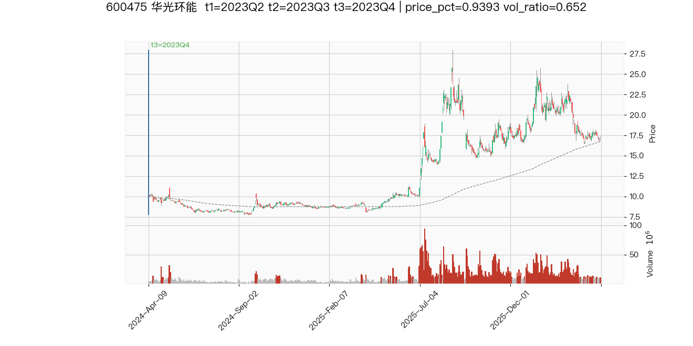

#### 🔍 检测依据 — 600475 华光环能
> 最佳 triple: **2023Q2 → 2023Q3 → 2023Q4** ｜ B 触发: price_pct=0.94 vol_ratio=0.65 ｜ 候选 triple 数: 1

#### 📊 港中结持仓节奏 — 600475 华光环能

| 季度     |   持股量(万股) |   持股市值(亿) |
|:-------|----------:|----------:|
| 2023Q1 |     280.9 |      0.32 |
| 2023Q2 |     728.3 |      0.88 |
| 2023Q3 |     339.3 |      0.35 |
| 2023Q4 |     439   |      0.46 |
| 2024Q1 |    1825.8 |      2.02 |
| 2024Q2 |     432.2 |      0.38 |
| 2024Q3 |     444   |      0.38 |

#### ✍️ 人工复盘 — 600475 华光环能

| 检查项 | 结果 |
|--------|------|
| t2 季度价格在近 250 日高位区间（视觉） | ⬜ |
| t2 季度出现明显放量 bar（红色高量） | ⬜ |
| t3 季度买回后股价未大幅上涨（非卖飞） | ⬜ |
| t1→t2→t3 三段节奏符合「建仓→出货→再建仓」 | ⬜ |

**决策**: ⬜ PASS（纳入关注名单）　⬜ REJECT（假信号）

**备注**: _（人工填写）_

### 688606 奥泰生物 K 线 + 成交量
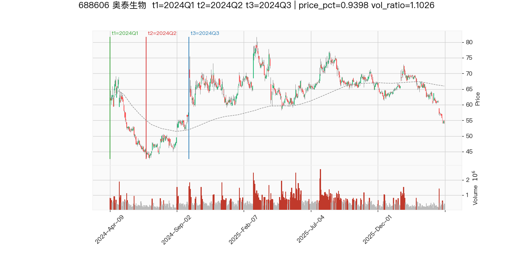

#### 🔍 检测依据 — 688606 奥泰生物
> 最佳 triple: **2024Q1 → 2024Q2 → 2024Q3** ｜ B 触发: price_pct=0.94 vol_ratio=1.10 ｜ 候选 triple 数: 1

#### 📊 港中结持仓节奏 — 688606 奥泰生物

| 季度     |   持股量(万股) |   持股市值(亿) |
|:-------|----------:|----------:|
| 2023Q1 |       1.7 |      0.02 |
| 2023Q2 |       3.9 |      0.02 |
| 2023Q3 |      10   |      0.06 |
| 2023Q4 |      44   |      0.3  |
| 2024Q1 |     155.9 |      0.93 |
| 2024Q2 |     125.8 |      0.59 |
| 2024Q3 |     153.8 |      0.79 |

#### ✍️ 人工复盘 — 688606 奥泰生物

| 检查项 | 结果 |
|--------|------|
| t2 季度价格在近 250 日高位区间（视觉） | ⬜ |
| t2 季度出现明显放量 bar（红色高量） | ⬜ |
| t3 季度买回后股价未大幅上涨（非卖飞） | ⬜ |
| t1→t2→t3 三段节奏符合「建仓→出货→再建仓」 | ⬜ |

**决策**: ⬜ PASS（纳入关注名单）　⬜ REJECT（假信号）

**备注**: _（人工填写）_

### 002215 诺普信 K 线 + 成交量
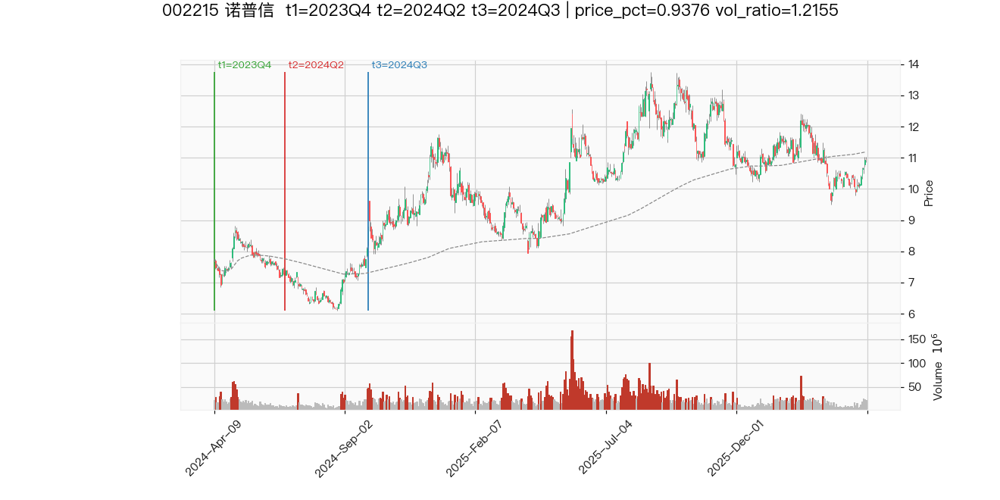

#### 🔍 检测依据 — 002215 诺普信
> 最佳 triple: **2023Q4 → 2024Q2 → 2024Q3** ｜ B 触发: price_pct=0.94 vol_ratio=1.22 ｜ 候选 triple 数: 1

#### 📊 港中结持仓节奏 — 002215 诺普信

| 季度     |   持股量(万股) |   持股市值(亿) |
|:-------|----------:|----------:|
| 2022Q4 |      66.5 |      0.04 |
| 2023Q1 |     356.1 |      0.26 |
| 2023Q2 |     826   |      0.61 |
| 2023Q3 |     792.3 |      0.58 |
| 2023Q4 |    1929.3 |      1.59 |
| 2024Q1 |    1403.9 |      1.28 |
| 2024Q2 |     751.3 |      0.56 |
| 2024Q3 |    1039   |      0.68 |

#### ✍️ 人工复盘 — 002215 诺普信

| 检查项 | 结果 |
|--------|------|
| t2 季度价格在近 250 日高位区间（视觉） | ⬜ |
| t2 季度出现明显放量 bar（红色高量） | ⬜ |
| t3 季度买回后股价未大幅上涨（非卖飞） | ⬜ |
| t1→t2→t3 三段节奏符合「建仓→出货→再建仓」 | ⬜ |

**决策**: ⬜ PASS（纳入关注名单）　⬜ REJECT（假信号）

**备注**: _（人工填写）_

### 300791 仙乐健康 K 线 + 成交量
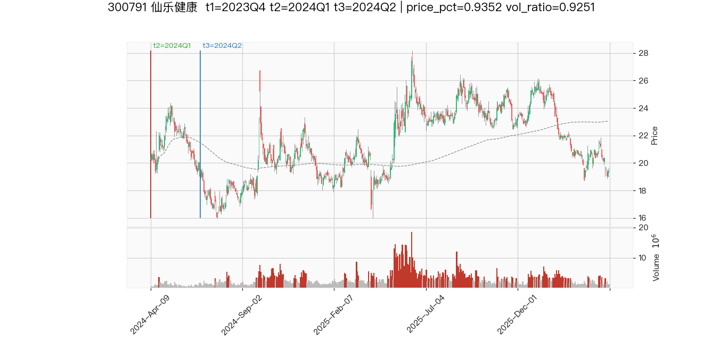

#### 🔍 检测依据 — 300791 仙乐健康
> 最佳 triple: **2023Q4 → 2024Q1 → 2024Q2** ｜ B 触发: price_pct=0.94 vol_ratio=0.93 ｜ 候选 triple 数: 3

#### 📊 港中结持仓节奏 — 300791 仙乐健康

| 季度     |   持股量(万股) |   持股市值(亿) |
|:-------|----------:|----------:|
| 2022Q4 |      96.5 |      0.35 |
| 2023Q1 |      98.4 |      0.35 |
| 2023Q2 |     156.6 |      0.45 |
| 2023Q3 |      79.8 |      0.21 |
| 2023Q4 |     207.8 |      0.72 |
| 2024Q1 |     104.7 |      0.38 |
| 2024Q2 |     481.7 |      1.21 |
| 2024Q3 |     395.2 |      0.97 |

#### ✍️ 人工复盘 — 300791 仙乐健康

| 检查项 | 结果 |
|--------|------|
| t2 季度价格在近 250 日高位区间（视觉） | ⬜ |
| t2 季度出现明显放量 bar（红色高量） | ⬜ |
| t3 季度买回后股价未大幅上涨（非卖飞） | ⬜ |
| t1→t2→t3 三段节奏符合「建仓→出货→再建仓」 | ⬜ |

**决策**: ⬜ PASS（纳入关注名单）　⬜ REJECT（假信号）

**备注**: _（人工填写）_

### 603185 弘元绿能 K 线 + 成交量

#### 🔍 检测依据 — 603185 弘元绿能
> 最佳 triple: **2023Q4 → 2024Q1 → 2024Q3** ｜ B 触发: price_pct=0.41 vol_ratio=1.59 ｜ t2 后 60 日收益: 5.6% ｜ 候选 triple 数: 2

#### 📊 港中结持仓节奏 — 603185 弘元绿能

| 季度     |   持股量(万股) |   持股市值(亿) |
|:-------|----------:|----------:|
| 2022Q4 |    1114.2 |     11.79 |
| 2023Q1 |     835   |      8.53 |
| 2023Q2 |    1220.1 |      9.1  |
| 2023Q3 |    1216.2 |      5.09 |
| 2023Q4 |    1476.8 |      4.91 |
| 2024Q1 |    1054.7 |      2.55 |
| 2024Q2 |    1033.7 |      1.77 |
| 2024Q3 |    1988.3 |      2.82 |

#### ✍️ 人工复盘 — 603185 弘元绿能

| 检查项 | 结果 |
|--------|------|
| t2 季度价格在近 250 日高位区间（视觉） | ⬜ |
| t2 季度出现明显放量 bar（红色高量） | ⬜ |
| t3 季度买回后股价未大幅上涨（非卖飞） | ⬜ |
| t1→t2→t3 三段节奏符合「建仓→出货→再建仓」 | ⬜ |

**决策**: ⬜ PASS（纳入关注名单）　⬜ REJECT（假信号）

**备注**: _（人工填写）_

### 688100 威胜信息 K 线 + 成交量
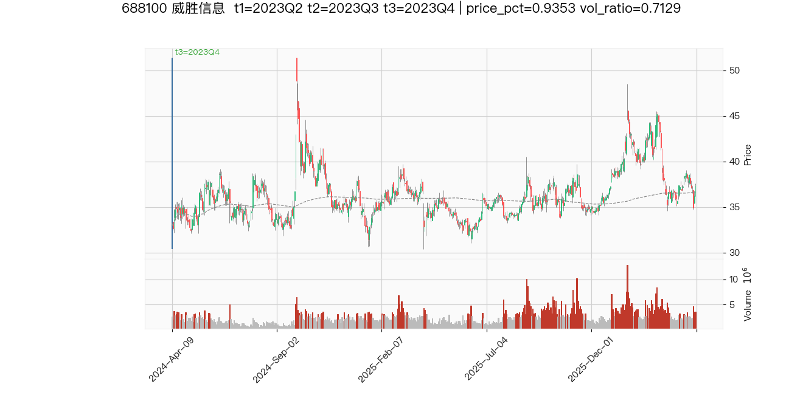

#### 🔍 检测依据 — 688100 威胜信息
> 最佳 triple: **2023Q2 → 2023Q3 → 2023Q4** ｜ B 触发: price_pct=0.94 vol_ratio=0.71 ｜ 候选 triple 数: 1

#### 📊 港中结持仓节奏 — 688100 威胜信息

| 季度     |   持股量(万股) |   持股市值(亿) |
|:-------|----------:|----------:|
| 2023Q1 |     168.5 |      0.51 |
| 2023Q2 |     394.4 |      1.2  |
| 2023Q3 |     199.9 |      0.59 |
| 2023Q4 |     300.4 |      0.87 |
| 2024Q1 |     797.3 |      2.77 |
| 2024Q2 |    1062.2 |      4.05 |
| 2024Q3 |    1042.2 |      3.95 |

#### ✍️ 人工复盘 — 688100 威胜信息

| 检查项 | 结果 |
|--------|------|
| t2 季度价格在近 250 日高位区间（视觉） | ⬜ |
| t2 季度出现明显放量 bar（红色高量） | ⬜ |
| t3 季度买回后股价未大幅上涨（非卖飞） | ⬜ |
| t1→t2→t3 三段节奏符合「建仓→出货→再建仓」 | ⬜ |

**决策**: ⬜ PASS（纳入关注名单）　⬜ REJECT（假信号）

**备注**: _（人工填写）_

### 600729 重庆百货 K 线 + 成交量
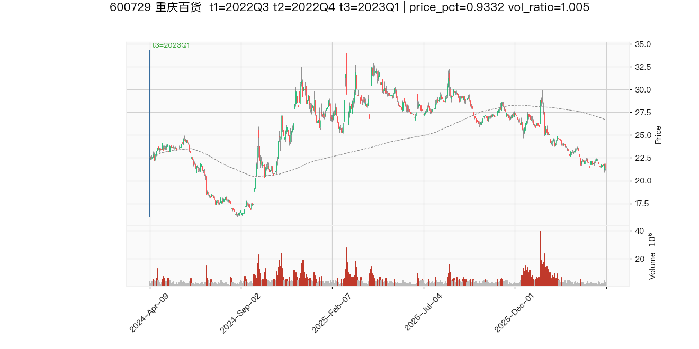

#### 🔍 检测依据 — 600729 重庆百货
> 最佳 triple: **2022Q3 → 2022Q4 → 2023Q1** ｜ B 触发: price_pct=0.93 vol_ratio=1.00 ｜ 候选 triple 数: 2

#### 📊 港中结持仓节奏 — 600729 重庆百货

| 季度     |   持股量(万股) |   持股市值(亿) |
|:-------|----------:|----------:|
| 2022Q4 |    1305.3 |      3.09 |
| 2023Q1 |    1546.3 |      4.19 |
| 2023Q2 |    1384.8 |      3.96 |
| 2023Q3 |    1560.5 |      5.14 |
| 2023Q4 |    1443.8 |      4.07 |
| 2024Q1 |    1335.4 |      3.59 |
| 2024Q2 |    1209.5 |      2.7  |
| 2024Q3 |    1241.7 |      2.21 |

#### ✍️ 人工复盘 — 600729 重庆百货

| 检查项 | 结果 |
|--------|------|
| t2 季度价格在近 250 日高位区间（视觉） | ⬜ |
| t2 季度出现明显放量 bar（红色高量） | ⬜ |
| t3 季度买回后股价未大幅上涨（非卖飞） | ⬜ |
| t1→t2→t3 三段节奏符合「建仓→出货→再建仓」 | ⬜ |

**决策**: ⬜ PASS（纳入关注名单）　⬜ REJECT（假信号）

**备注**: _（人工填写）_

### 002302 西部建设 K 线 + 成交量
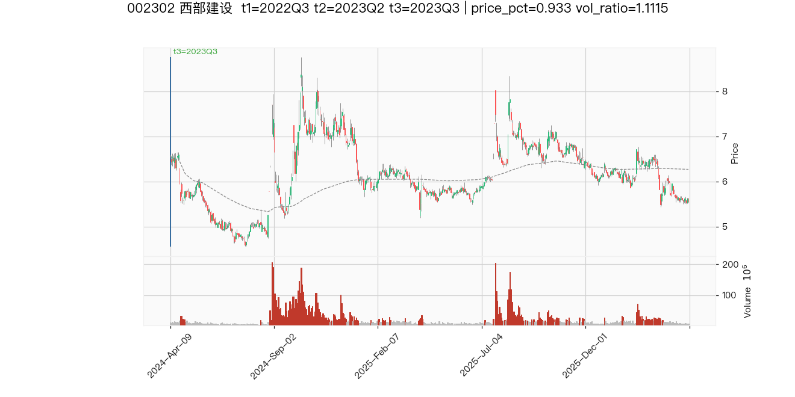

#### 🔍 检测依据 — 002302 西部建设
> 最佳 triple: **2022Q3 → 2023Q2 → 2023Q3** ｜ B 触发: price_pct=0.93 vol_ratio=1.11 ｜ 候选 triple 数: 4

#### 📊 港中结持仓节奏 — 002302 西部建设

| 季度     |   持股量(万股) |   持股市值(亿) |
|:-------|----------:|----------:|
| 2022Q4 |    1066.3 |      0.77 |
| 2023Q1 |    1016   |      0.8  |
| 2023Q2 |     867.2 |      0.62 |
| 2023Q3 |     988.5 |      0.74 |
| 2023Q4 |     784.9 |      0.51 |
| 2024Q1 |    1396.7 |      0.9  |
| 2024Q2 |     994.5 |      0.52 |
| 2024Q3 |    1289.5 |      0.65 |

#### ✍️ 人工复盘 — 002302 西部建设

| 检查项 | 结果 |
|--------|------|
| t2 季度价格在近 250 日高位区间（视觉） | ⬜ |
| t2 季度出现明显放量 bar（红色高量） | ⬜ |
| t3 季度买回后股价未大幅上涨（非卖飞） | ⬜ |
| t1→t2→t3 三段节奏符合「建仓→出货→再建仓」 | ⬜ |

**决策**: ⬜ PASS（纳入关注名单）　⬜ REJECT（假信号）

**备注**: _（人工填写）_

### 300319 麦捷科技 K 线 + 成交量
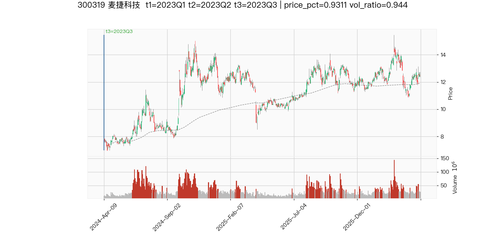

#### 🔍 检测依据 — 300319 麦捷科技
> 最佳 triple: **2023Q1 → 2023Q2 → 2023Q3** ｜ B 触发: price_pct=0.93 vol_ratio=0.94 ｜ 候选 triple 数: 3

#### 📊 港中结持仓节奏 — 300319 麦捷科技

| 季度     |   持股量(万股) |   持股市值(亿) |
|:-------|----------:|----------:|
| 2022Q4 |     375.7 |      0.29 |
| 2023Q1 |    1427   |      1.41 |
| 2023Q2 |     696.5 |      0.57 |
| 2023Q3 |    1967.1 |      1.77 |
| 2023Q4 |    2171.8 |      2.09 |
| 2024Q1 |    1254.3 |      1    |
| 2024Q2 |     580.2 |      0.54 |
| 2024Q3 |    1114.9 |      1    |

#### ✍️ 人工复盘 — 300319 麦捷科技

| 检查项 | 结果 |
|--------|------|
| t2 季度价格在近 250 日高位区间（视觉） | ⬜ |
| t2 季度出现明显放量 bar（红色高量） | ⬜ |
| t3 季度买回后股价未大幅上涨（非卖飞） | ⬜ |
| t1→t2→t3 三段节奏符合「建仓→出货→再建仓」 | ⬜ |

**决策**: ⬜ PASS（纳入关注名单）　⬜ REJECT（假信号）

**备注**: _（人工填写）_

### 300777 中简科技 K 线 + 成交量
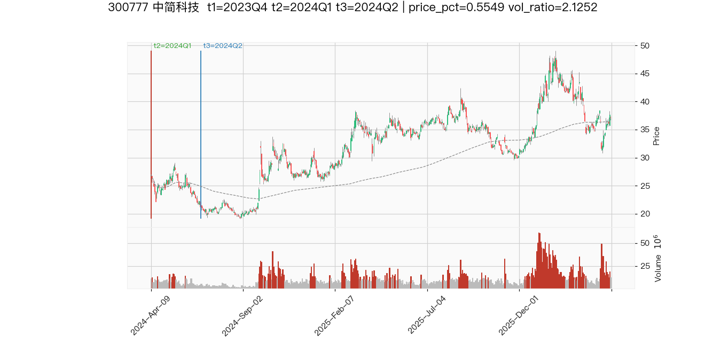

#### 🔍 检测依据 — 300777 中简科技
> 最佳 triple: **2023Q4 → 2024Q1 → 2024Q2** ｜ B 触发: price_pct=0.55 vol_ratio=2.13 ｜ 候选 triple 数: 2

#### 📊 港中结持仓节奏 — 300777 中简科技

| 季度     |   持股量(万股) |   持股市值(亿) |
|:-------|----------:|----------:|
| 2022Q4 |     409.9 |      2.01 |
| 2023Q1 |     487.8 |      2.48 |
| 2023Q2 |     466.1 |      2.12 |
| 2023Q3 |     488.6 |      1.71 |
| 2023Q4 |     554.7 |      1.65 |
| 2024Q1 |     279.6 |      0.89 |
| 2024Q2 |     363.4 |      0.78 |
| 2024Q3 |     243.8 |      0.5  |

#### ✍️ 人工复盘 — 300777 中简科技

| 检查项 | 结果 |
|--------|------|
| t2 季度价格在近 250 日高位区间（视觉） | ⬜ |
| t2 季度出现明显放量 bar（红色高量） | ⬜ |
| t3 季度买回后股价未大幅上涨（非卖飞） | ⬜ |
| t1→t2→t3 三段节奏符合「建仓→出货→再建仓」 | ⬜ |

**决策**: ⬜ PASS（纳入关注名单）　⬜ REJECT（假信号）

**备注**: _（人工填写）_

### 603520 司太立 K 线 + 成交量
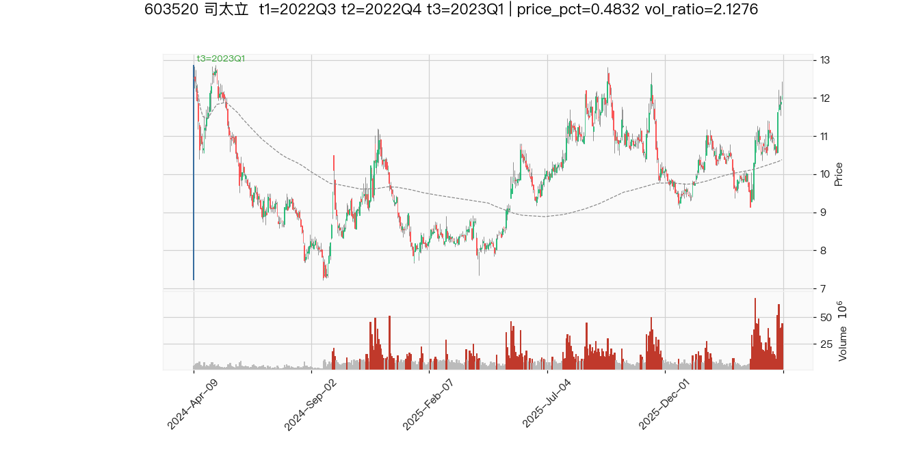

#### 🔍 检测依据 — 603520 司太立
> 最佳 triple: **2022Q3 → 2022Q4 → 2023Q1** ｜ B 触发: price_pct=0.48 vol_ratio=2.13 ｜ 候选 triple 数: 3

#### 📊 港中结持仓节奏 — 603520 司太立

| 季度     |   持股量(万股) |   持股市值(亿) |
|:-------|----------:|----------:|
| 2022Q4 |     660.8 |      1.29 |
| 2023Q1 |     841   |      1.6  |
| 2023Q2 |     555   |      0.93 |
| 2023Q3 |     719   |      1.11 |
| 2023Q4 |     457.7 |      0.64 |
| 2024Q1 |     319.6 |      0.38 |
| 2024Q2 |     326.5 |      0.31 |
| 2024Q3 |     427.4 |      0.39 |

#### ✍️ 人工复盘 — 603520 司太立

| 检查项 | 结果 |
|--------|------|
| t2 季度价格在近 250 日高位区间（视觉） | ⬜ |
| t2 季度出现明显放量 bar（红色高量） | ⬜ |
| t3 季度买回后股价未大幅上涨（非卖飞） | ⬜ |
| t1→t2→t3 三段节奏符合「建仓→出货→再建仓」 | ⬜ |

**决策**: ⬜ PASS（纳入关注名单）　⬜ REJECT（假信号）

**备注**: _（人工填写）_

### 002727 一心堂 K 线 + 成交量
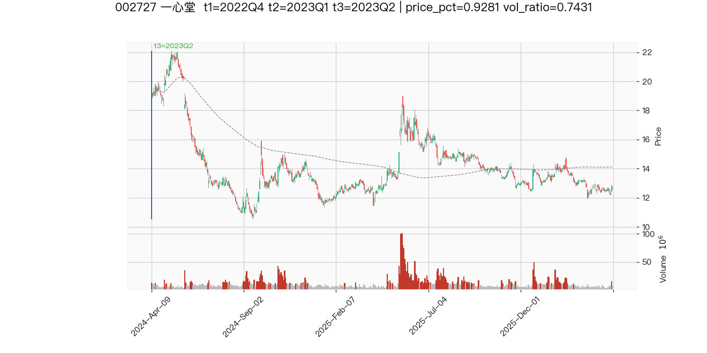

#### 🔍 检测依据 — 002727 一心堂
> 最佳 triple: **2022Q4 → 2023Q1 → 2023Q2** ｜ B 触发: price_pct=0.93 vol_ratio=0.74 ｜ 候选 triple 数: 2

#### 📊 港中结持仓节奏 — 002727 一心堂

| 季度     |   持股量(万股) |   持股市值(亿) |
|:-------|----------:|----------:|
| 2022Q4 |    4479.7 |     14.12 |
| 2023Q1 |    3671.2 |     13.01 |
| 2023Q2 |    4705.8 |     12.31 |
| 2023Q3 |    4742.7 |     11    |
| 2023Q4 |    3370.9 |      7.81 |
| 2024Q1 |    3075.9 |      5.91 |
| 2024Q2 |    2629.5 |      3.97 |
| 2024Q3 |    2805.3 |      3.54 |

#### ✍️ 人工复盘 — 002727 一心堂

| 检查项 | 结果 |
|--------|------|
| t2 季度价格在近 250 日高位区间（视觉） | ⬜ |
| t2 季度出现明显放量 bar（红色高量） | ⬜ |
| t3 季度买回后股价未大幅上涨（非卖飞） | ⬜ |
| t1→t2→t3 三段节奏符合「建仓→出货→再建仓」 | ⬜ |

**决策**: ⬜ PASS（纳入关注名单）　⬜ REJECT（假信号）

**备注**: _（人工填写）_

### 000900 现代投资 K 线 + 成交量
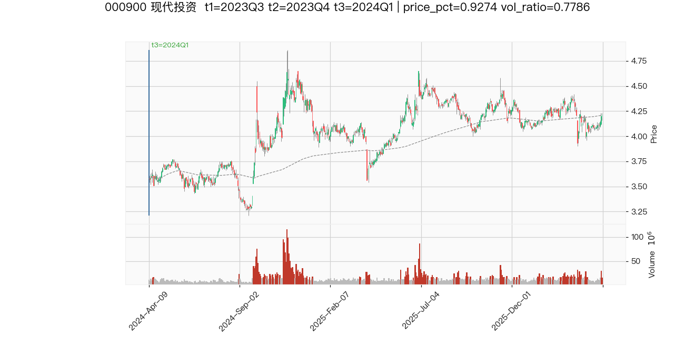

#### 🔍 检测依据 — 000900 现代投资
> 最佳 triple: **2023Q3 → 2023Q4 → 2024Q1** ｜ B 触发: price_pct=0.93 vol_ratio=0.78 ｜ 候选 triple 数: 1

#### 📊 港中结持仓节奏 — 000900 现代投资

| 季度     |   持股量(万股) |   持股市值(亿) |
|:-------|----------:|----------:|
| 2022Q4 |     122.1 |      0.05 |
| 2023Q1 |     496.3 |      0.21 |
| 2023Q2 |     503   |      0.2  |
| 2023Q3 |    1000.2 |      0.42 |
| 2023Q4 |     557.9 |      0.22 |
| 2024Q1 |     625.5 |      0.23 |
| 2024Q2 |     607.2 |      0.22 |
| 2024Q3 |    1401.9 |      0.54 |

#### ✍️ 人工复盘 — 000900 现代投资

| 检查项 | 结果 |
|--------|------|
| t2 季度价格在近 250 日高位区间（视觉） | ⬜ |
| t2 季度出现明显放量 bar（红色高量） | ⬜ |
| t3 季度买回后股价未大幅上涨（非卖飞） | ⬜ |
| t1→t2→t3 三段节奏符合「建仓→出货→再建仓」 | ⬜ |

**决策**: ⬜ PASS（纳入关注名单）　⬜ REJECT（假信号）

**备注**: _（人工填写）_

### 600273 嘉化能源 K 线 + 成交量
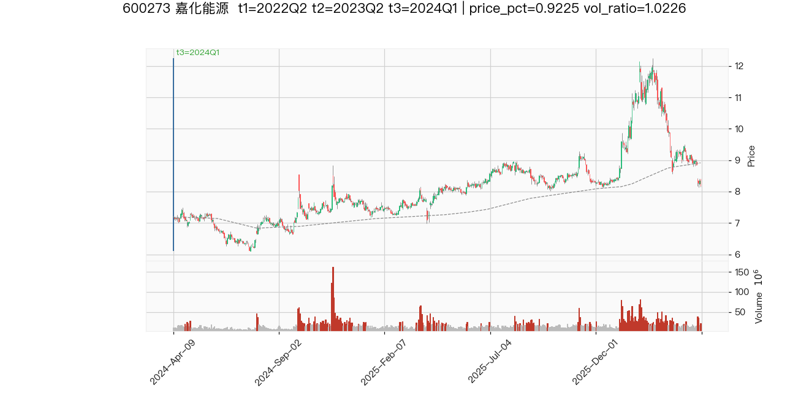

#### 🔍 检测依据 — 600273 嘉化能源
> 最佳 triple: **2022Q2 → 2023Q2 → 2024Q1** ｜ B 触发: price_pct=0.92 vol_ratio=1.02 ｜ t2 后 60 日收益: 7.3% ｜ 候选 triple 数: 3

#### 📊 港中结持仓节奏 — 600273 嘉化能源

| 季度     |   持股量(万股) |   持股市值(亿) |
|:-------|----------:|----------:|
| 2022Q4 |    3803.4 |      3.18 |
| 2023Q1 |    3756.7 |      3.26 |
| 2023Q2 |    2592.7 |      2.44 |
| 2023Q3 |    2629.7 |      2.19 |
| 2023Q4 |    2355.6 |      2.02 |
| 2024Q1 |    3200   |      2.52 |
| 2024Q2 |    2416.5 |      1.73 |
| 2024Q3 |    2581.8 |      1.98 |

#### ✍️ 人工复盘 — 600273 嘉化能源

| 检查项 | 结果 |
|--------|------|
| t2 季度价格在近 250 日高位区间（视觉） | ⬜ |
| t2 季度出现明显放量 bar（红色高量） | ⬜ |
| t3 季度买回后股价未大幅上涨（非卖飞） | ⬜ |
| t1→t2→t3 三段节奏符合「建仓→出货→再建仓」 | ⬜ |

**决策**: ⬜ PASS（纳入关注名单）　⬜ REJECT（假信号）

**备注**: _（人工填写）_

### 301080 百普赛斯 K 线 + 成交量
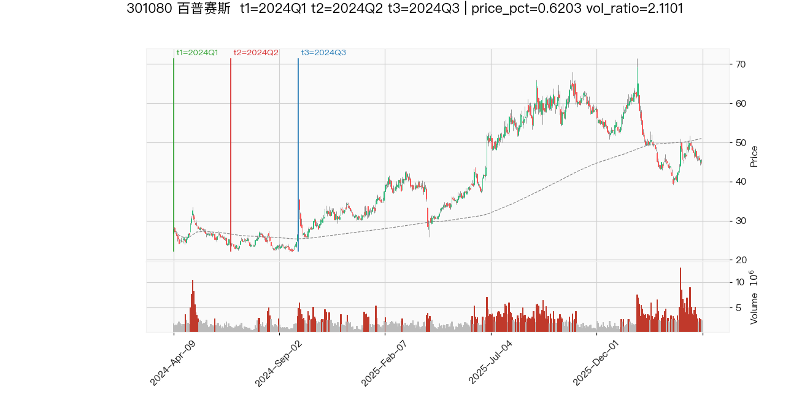

#### 🔍 检测依据 — 301080 百普赛斯
> 最佳 triple: **2024Q1 → 2024Q2 → 2024Q3** ｜ B 触发: price_pct=0.62 vol_ratio=2.11 ｜ 候选 triple 数: 2

#### 📊 港中结持仓节奏 — 301080 百普赛斯

| 季度     |   持股量(万股) |   持股市值(亿) |
|:-------|----------:|----------:|
| 2022Q4 |      96   |      0.99 |
| 2023Q1 |     134.4 |      1.49 |
| 2023Q2 |     150   |      0.94 |
| 2023Q3 |     151.3 |      1.06 |
| 2023Q4 |     131.6 |      0.78 |
| 2024Q1 |     316.3 |      1.29 |
| 2024Q2 |     298.2 |      1.04 |
| 2024Q3 |     316.3 |      1.19 |

#### ✍️ 人工复盘 — 301080 百普赛斯

| 检查项 | 结果 |
|--------|------|
| t2 季度价格在近 250 日高位区间（视觉） | ⬜ |
| t2 季度出现明显放量 bar（红色高量） | ⬜ |
| t3 季度买回后股价未大幅上涨（非卖飞） | ⬜ |
| t1→t2→t3 三段节奏符合「建仓→出货→再建仓」 | ⬜ |

**决策**: ⬜ PASS（纳入关注名单）　⬜ REJECT（假信号）

**备注**: _（人工填写）_

### 600855 航天长峰 K 线 + 成交量
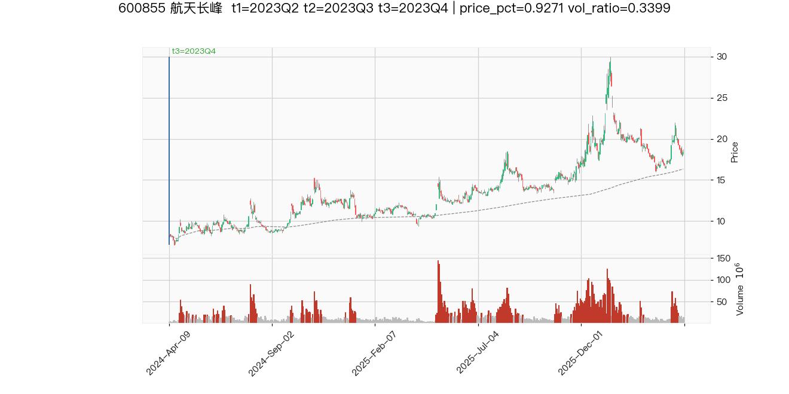

#### 🔍 检测依据 — 600855 航天长峰
> 最佳 triple: **2023Q2 → 2023Q3 → 2023Q4** ｜ B 触发: price_pct=0.93 vol_ratio=0.34 ｜ 候选 triple 数: 2

#### 📊 港中结持仓节奏 — 600855 航天长峰

| 季度     |   持股量(万股) |   持股市值(亿) |
|:-------|----------:|----------:|
| 2023Q1 |      85.2 |      0.11 |
| 2023Q2 |     242.5 |      0.31 |
| 2023Q3 |     136.5 |      0.16 |
| 2023Q4 |     163.9 |      0.18 |
| 2024Q1 |     326   |      0.28 |
| 2024Q2 |     200.4 |      0.2  |
| 2024Q3 |     368.2 |      0.35 |

#### ✍️ 人工复盘 — 600855 航天长峰

| 检查项 | 结果 |
|--------|------|
| t2 季度价格在近 250 日高位区间（视觉） | ⬜ |
| t2 季度出现明显放量 bar（红色高量） | ⬜ |
| t3 季度买回后股价未大幅上涨（非卖飞） | ⬜ |
| t1→t2→t3 三段节奏符合「建仓→出货→再建仓」 | ⬜ |

**决策**: ⬜ PASS（纳入关注名单）　⬜ REJECT（假信号）

**备注**: _（人工填写）_

### 688575 亚辉龙 K 线 + 成交量
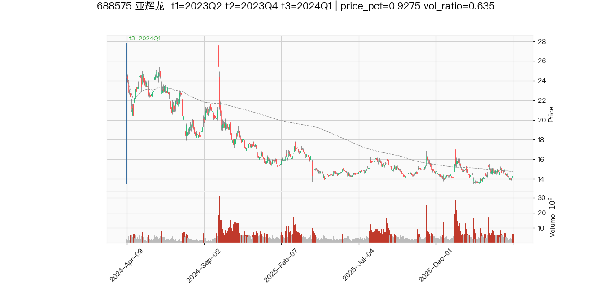

#### 🔍 检测依据 — 688575 亚辉龙
> 最佳 triple: **2023Q2 → 2023Q4 → 2024Q1** ｜ B 触发: price_pct=0.93 vol_ratio=0.64 ｜ 候选 triple 数: 2

#### 📊 港中结持仓节奏 — 688575 亚辉龙

| 季度     |   持股量(万股) |   持股市值(亿) |
|:-------|----------:|----------:|
| 2022Q4 |     527.3 |      1.04 |
| 2023Q1 |      70.9 |      0.13 |
| 2023Q2 |     209.3 |      0.39 |
| 2023Q3 |     218   |      0.42 |
| 2023Q4 |     202.4 |      0.46 |
| 2024Q1 |     401.3 |      0.92 |
| 2024Q2 |     294.4 |      0.69 |
| 2024Q3 |     361.8 |      0.68 |

#### ✍️ 人工复盘 — 688575 亚辉龙

| 检查项 | 结果 |
|--------|------|
| t2 季度价格在近 250 日高位区间（视觉） | ⬜ |
| t2 季度出现明显放量 bar（红色高量） | ⬜ |
| t3 季度买回后股价未大幅上涨（非卖飞） | ⬜ |
| t1→t2→t3 三段节奏符合「建仓→出货→再建仓」 | ⬜ |

**决策**: ⬜ PASS（纳入关注名单）　⬜ REJECT（假信号）

**备注**: _（人工填写）_

### 002004 华邦健康 K 线 + 成交量
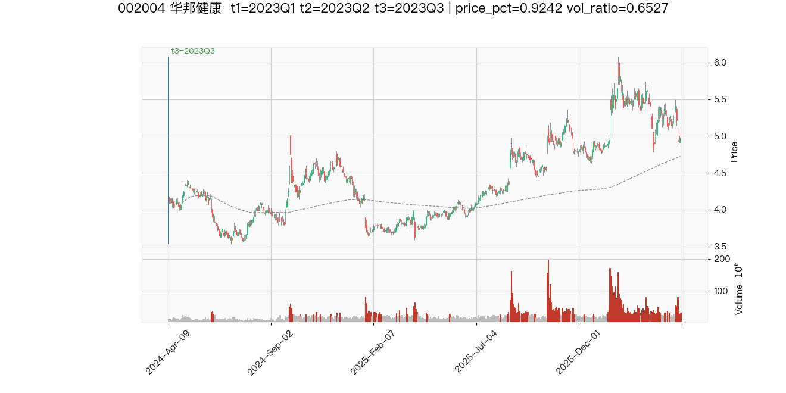

#### 🔍 检测依据 — 002004 华邦健康
> 最佳 triple: **2023Q1 → 2023Q2 → 2023Q3** ｜ B 触发: price_pct=0.92 vol_ratio=0.65 ｜ 候选 triple 数: 3

#### 📊 港中结持仓节奏 — 002004 华邦健康

| 季度     |   持股量(万股) |   持股市值(亿) |
|:-------|----------:|----------:|
| 2022Q4 |    1833   |      0.93 |
| 2023Q1 |    2618.6 |      1.47 |
| 2023Q2 |    1638   |      0.8  |
| 2023Q3 |    2072.9 |      1.04 |
| 2023Q4 |    1621.8 |      0.76 |
| 2024Q1 |    1990.9 |      0.85 |
| 2024Q2 |    2302.9 |      0.88 |
| 2024Q3 |    2942.5 |      1.25 |

#### ✍️ 人工复盘 — 002004 华邦健康

| 检查项 | 结果 |
|--------|------|
| t2 季度价格在近 250 日高位区间（视觉） | ⬜ |
| t2 季度出现明显放量 bar（红色高量） | ⬜ |
| t3 季度买回后股价未大幅上涨（非卖飞） | ⬜ |
| t1→t2→t3 三段节奏符合「建仓→出货→再建仓」 | ⬜ |

**决策**: ⬜ PASS（纳入关注名单）　⬜ REJECT（假信号）

**备注**: _（人工填写）_

### 603283 赛腾股份 K 线 + 成交量
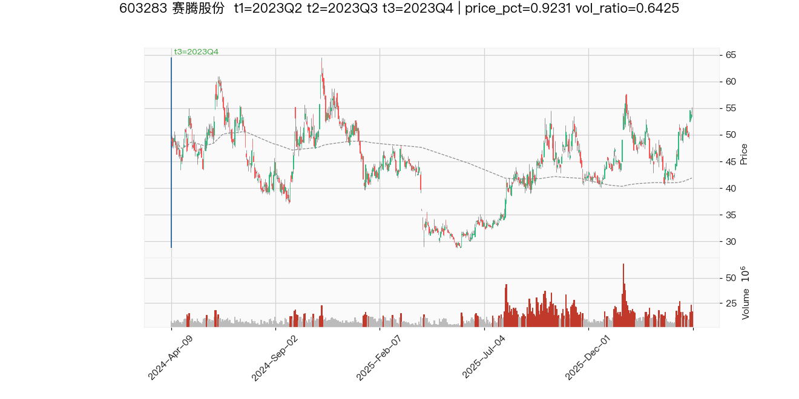

#### 🔍 检测依据 — 603283 赛腾股份
> 最佳 triple: **2023Q2 → 2023Q3 → 2023Q4** ｜ B 触发: price_pct=0.92 vol_ratio=0.64 ｜ 候选 triple 数: 1

#### 📊 港中结持仓节奏 — 603283 赛腾股份

| 季度     |   持股量(万股) |   持股市值(亿) |
|:-------|----------:|----------:|
| 2023Q1 |     306.4 |      1.43 |
| 2023Q2 |     621.3 |      2.58 |
| 2023Q3 |     113.9 |      0.54 |
| 2023Q4 |     651   |      4.72 |
| 2024Q1 |     497   |      3.76 |
| 2024Q2 |     506.1 |      3.87 |
| 2024Q3 |     452.4 |      2.54 |

#### ✍️ 人工复盘 — 603283 赛腾股份

| 检查项 | 结果 |
|--------|------|
| t2 季度价格在近 250 日高位区间（视觉） | ⬜ |
| t2 季度出现明显放量 bar（红色高量） | ⬜ |
| t3 季度买回后股价未大幅上涨（非卖飞） | ⬜ |
| t1→t2→t3 三段节奏符合「建仓→出货→再建仓」 | ⬜ |

**决策**: ⬜ PASS（纳入关注名单）　⬜ REJECT（假信号）

**备注**: _（人工填写）_

### 600740 山西焦化 K 线 + 成交量
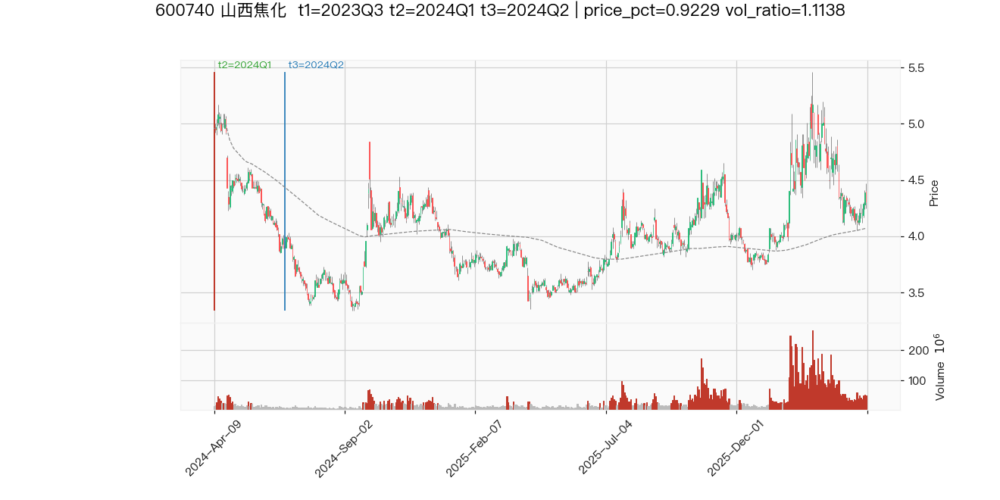

#### 🔍 检测依据 — 600740 山西焦化
> 最佳 triple: **2023Q3 → 2024Q1 → 2024Q2** ｜ B 触发: price_pct=0.92 vol_ratio=1.11 ｜ 候选 triple 数: 2

#### 📊 港中结持仓节奏 — 600740 山西焦化

| 季度     |   持股量(万股) |   持股市值(亿) |
|:-------|----------:|----------:|
| 2022Q4 |     862   |      0.47 |
| 2023Q1 |     897.5 |      0.5  |
| 2023Q2 |     883.6 |      0.45 |
| 2023Q3 |    1373.8 |      0.72 |
| 2023Q4 |    1392   |      0.7  |
| 2024Q1 |    1245.1 |      0.59 |
| 2024Q2 |    1526.7 |      0.6  |
| 2024Q3 |    1495.5 |      0.54 |

#### ✍️ 人工复盘 — 600740 山西焦化

| 检查项 | 结果 |
|--------|------|
| t2 季度价格在近 250 日高位区间（视觉） | ⬜ |
| t2 季度出现明显放量 bar（红色高量） | ⬜ |
| t3 季度买回后股价未大幅上涨（非卖飞） | ⬜ |
| t1→t2→t3 三段节奏符合「建仓→出货→再建仓」 | ⬜ |

**决策**: ⬜ PASS（纳入关注名单）　⬜ REJECT（假信号）

**备注**: _（人工填写）_

### 688366 昊海生科 K 线 + 成交量
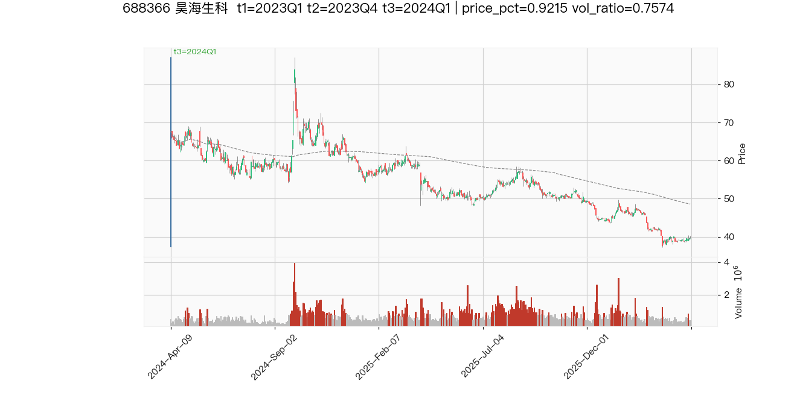

#### 🔍 检测依据 — 688366 昊海生科
> 最佳 triple: **2023Q1 → 2023Q4 → 2024Q1** ｜ B 触发: price_pct=0.92 vol_ratio=0.76 ｜ 候选 triple 数: 3

#### 📊 港中结持仓节奏 — 688366 昊海生科

| 季度     |   持股量(万股) |   持股市值(亿) |
|:-------|----------:|----------:|
| 2022Q4 |     105.7 |      1.03 |
| 2023Q1 |     122.3 |      1.24 |
| 2023Q2 |     123.6 |      1.04 |
| 2023Q3 |     107.8 |      1.22 |
| 2023Q4 |      61.4 |      0.66 |
| 2024Q1 |      80.8 |      0.82 |
| 2024Q2 |      75   |      0.46 |
| 2024Q3 |      80.8 |      0.48 |

#### ✍️ 人工复盘 — 688366 昊海生科

| 检查项 | 结果 |
|--------|------|
| t2 季度价格在近 250 日高位区间（视觉） | ⬜ |
| t2 季度出现明显放量 bar（红色高量） | ⬜ |
| t3 季度买回后股价未大幅上涨（非卖飞） | ⬜ |
| t1→t2→t3 三段节奏符合「建仓→出货→再建仓」 | ⬜ |

**决策**: ⬜ PASS（纳入关注名单）　⬜ REJECT（假信号）

**备注**: _（人工填写）_

### 300888 稳健医疗 K 线 + 成交量
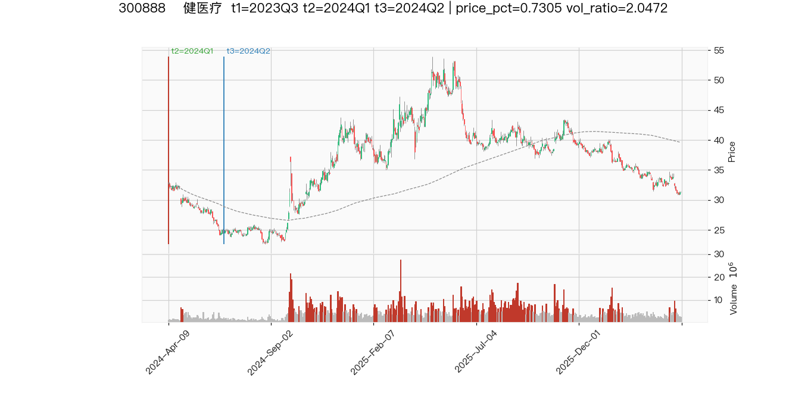

#### 🔍 检测依据 — 300888 稳健医疗
> 最佳 triple: **2023Q3 → 2024Q1 → 2024Q2** ｜ B 触发: price_pct=0.73 vol_ratio=2.05 ｜ 候选 triple 数: 2

#### 📊 港中结持仓节奏 — 300888 稳健医疗

| 季度     |   持股量(万股) |   持股市值(亿) |
|:-------|----------:|----------:|
| 2022Q4 |     307.3 |      2.2  |
| 2023Q1 |     326.1 |      2.16 |
| 2023Q2 |     182.2 |      0.76 |
| 2023Q3 |     254.1 |      1.04 |
| 2023Q4 |     247.3 |      0.92 |
| 2024Q1 |     218.8 |      0.76 |
| 2024Q2 |     379.5 |      0.96 |
| 2024Q3 |     313.9 |      0.81 |

#### ✍️ 人工复盘 — 300888 稳健医疗

| 检查项 | 结果 |
|--------|------|
| t2 季度价格在近 250 日高位区间（视觉） | ⬜ |
| t2 季度出现明显放量 bar（红色高量） | ⬜ |
| t3 季度买回后股价未大幅上涨（非卖飞） | ⬜ |
| t1→t2→t3 三段节奏符合「建仓→出货→再建仓」 | ⬜ |

**决策**: ⬜ PASS（纳入关注名单）　⬜ REJECT（假信号）

**备注**: _（人工填写）_

### 603297 永新光学 K 线 + 成交量
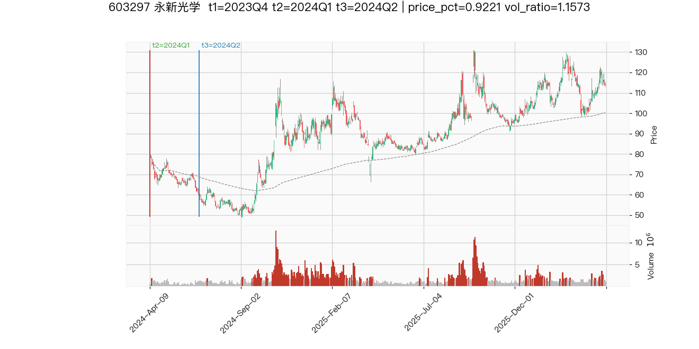

#### 🔍 检测依据 — 603297 永新光学
> 最佳 triple: **2023Q4 → 2024Q1 → 2024Q2** ｜ B 触发: price_pct=0.92 vol_ratio=1.16 ｜ 候选 triple 数: 1

#### 📊 港中结持仓节奏 — 603297 永新光学

| 季度     |   持股量(万股) |   持股市值(亿) |
|:-------|----------:|----------:|
| 2023Q1 |       6.1 |      0.05 |
| 2023Q2 |      25.8 |      0.21 |
| 2023Q3 |      33   |      0.29 |
| 2023Q4 |      58.4 |      0.58 |
| 2024Q1 |      33   |      0.27 |
| 2024Q2 |      64.9 |      0.39 |
| 2024Q3 |      63.1 |      0.36 |

#### ✍️ 人工复盘 — 603297 永新光学

| 检查项 | 结果 |
|--------|------|
| t2 季度价格在近 250 日高位区间（视觉） | ⬜ |
| t2 季度出现明显放量 bar（红色高量） | ⬜ |
| t3 季度买回后股价未大幅上涨（非卖飞） | ⬜ |
| t1→t2→t3 三段节奏符合「建仓→出货→再建仓」 | ⬜ |

**决策**: ⬜ PASS（纳入关注名单）　⬜ REJECT（假信号）

**备注**: _（人工填写）_

### 600229 城市传媒 K 线 + 成交量
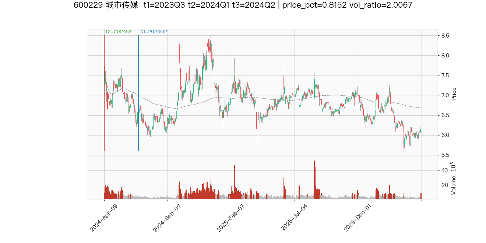

#### 🔍 检测依据 — 600229 城市传媒
> 最佳 triple: **2023Q3 → 2024Q1 → 2024Q2** ｜ B 触发: price_pct=0.82 vol_ratio=2.01 ｜ 候选 triple 数: 2

#### 📊 港中结持仓节奏 — 600229 城市传媒

| 季度     |   持股量(万股) |   持股市值(亿) |
|:-------|----------:|----------:|
| 2023Q2 |     384.2 |      0.33 |
| 2023Q3 |    1205   |      0.89 |
| 2023Q4 |     703.8 |      0.53 |
| 2024Q1 |     258.8 |      0.2  |
| 2024Q2 |     290.7 |      0.2  |
| 2024Q3 |     725.7 |      0.48 |

#### ✍️ 人工复盘 — 600229 城市传媒

| 检查项 | 结果 |
|--------|------|
| t2 季度价格在近 250 日高位区间（视觉） | ⬜ |
| t2 季度出现明显放量 bar（红色高量） | ⬜ |
| t3 季度买回后股价未大幅上涨（非卖飞） | ⬜ |
| t1→t2→t3 三段节奏符合「建仓→出货→再建仓」 | ⬜ |

**决策**: ⬜ PASS（纳入关注名单）　⬜ REJECT（假信号）

**备注**: _（人工填写）_

### 600458 时代新材 K 线 + 成交量
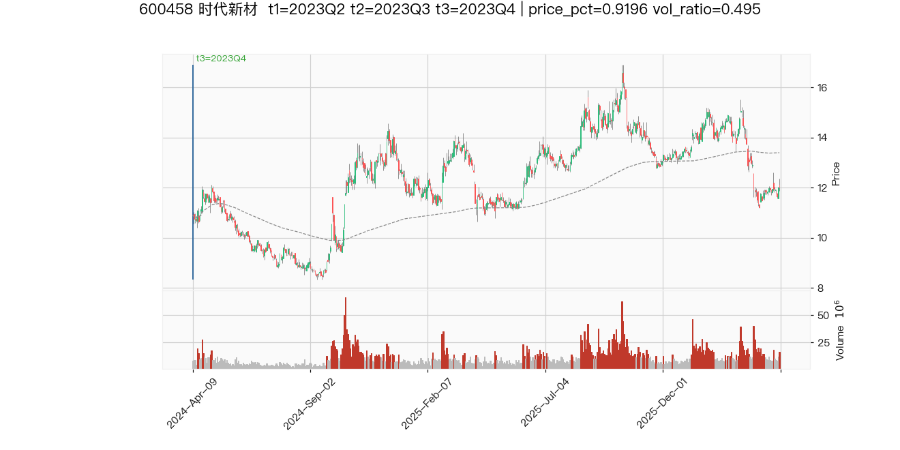

#### 🔍 检测依据 — 600458 时代新材
> 最佳 triple: **2023Q2 → 2023Q3 → 2023Q4** ｜ B 触发: price_pct=0.92 vol_ratio=0.49 ｜ 候选 triple 数: 2

#### 📊 港中结持仓节奏 — 600458 时代新材

| 季度     |   持股量(万股) |   持股市值(亿) |
|:-------|----------:|----------:|
| 2022Q4 |      10.8 |      0.01 |
| 2023Q1 |     457.4 |      0.52 |
| 2023Q2 |    1582.9 |      1.9  |
| 2023Q3 |     748.1 |      0.77 |
| 2023Q4 |    1047.6 |      0.96 |
| 2024Q1 |     536.1 |      0.59 |
| 2024Q2 |    1170.1 |      1.18 |
| 2024Q3 |    1180.1 |      1.07 |

#### ✍️ 人工复盘 — 600458 时代新材

| 检查项 | 结果 |
|--------|------|
| t2 季度价格在近 250 日高位区间（视觉） | ⬜ |
| t2 季度出现明显放量 bar（红色高量） | ⬜ |
| t3 季度买回后股价未大幅上涨（非卖飞） | ⬜ |
| t1→t2→t3 三段节奏符合「建仓→出货→再建仓」 | ⬜ |

**决策**: ⬜ PASS（纳入关注名单）　⬜ REJECT（假信号）

**备注**: _（人工填写）_

### 601339 百隆东方 K 线 + 成交量
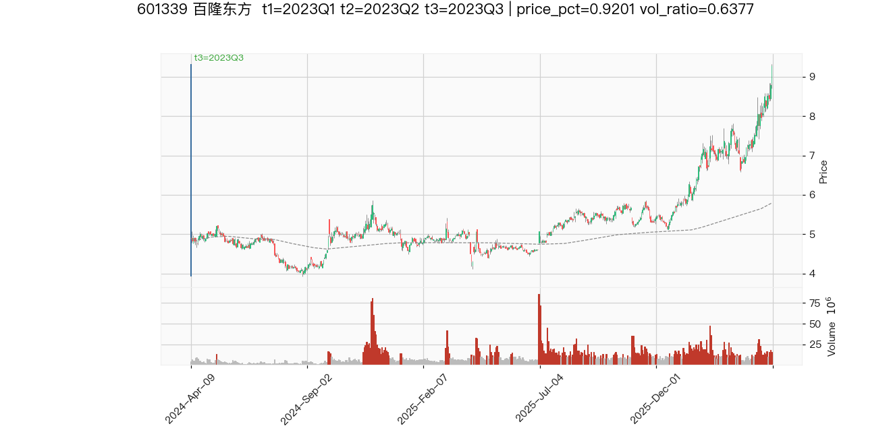

#### 🔍 检测依据 — 601339 百隆东方
> 最佳 triple: **2023Q1 → 2023Q2 → 2023Q3** ｜ B 触发: price_pct=0.92 vol_ratio=0.64 ｜ 候选 triple 数: 2

#### 📊 港中结持仓节奏 — 601339 百隆东方

| 季度     |   持股量(万股) |   持股市值(亿) |
|:-------|----------:|----------:|
| 2022Q4 |      85.6 |      0.05 |
| 2023Q1 |     917.9 |      0.63 |
| 2023Q2 |     343.9 |      0.19 |
| 2023Q3 |     362.8 |      0.2  |
| 2023Q4 |     455.6 |      0.22 |
| 2024Q1 |     400.6 |      0.22 |
| 2024Q2 |    1025.7 |      0.53 |
| 2024Q3 |     914.1 |      0.41 |

#### ✍️ 人工复盘 — 601339 百隆东方

| 检查项 | 结果 |
|--------|------|
| t2 季度价格在近 250 日高位区间（视觉） | ⬜ |
| t2 季度出现明显放量 bar（红色高量） | ⬜ |
| t3 季度买回后股价未大幅上涨（非卖飞） | ⬜ |
| t1→t2→t3 三段节奏符合「建仓→出货→再建仓」 | ⬜ |

**决策**: ⬜ PASS（纳入关注名单）　⬜ REJECT（假信号）

**备注**: _（人工填写）_

### 000778 新兴铸管 K 线 + 成交量
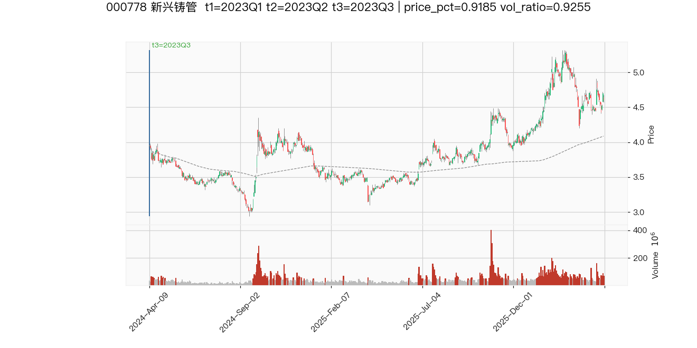

#### 🔍 检测依据 — 000778 新兴铸管
> 最佳 triple: **2023Q1 → 2023Q2 → 2023Q3** ｜ B 触发: price_pct=0.92 vol_ratio=0.93 ｜ 候选 triple 数: 2

#### 📊 港中结持仓节奏 — 000778 新兴铸管

| 季度     |   持股量(万股) |   持股市值(亿) |
|:-------|----------:|----------:|
| 2022Q4 |    5211.9 |      1.9  |
| 2023Q1 |    7233.7 |      2.92 |
| 2023Q2 |    4900.1 |      2    |
| 2023Q3 |    6360   |      2.63 |
| 2023Q4 |    4881   |      1.86 |
| 2024Q1 |    7560.8 |      2.92 |
| 2024Q2 |    2549.3 |      0.89 |
| 2024Q3 |    2532.7 |      0.9  |

#### ✍️ 人工复盘 — 000778 新兴铸管

| 检查项 | 结果 |
|--------|------|
| t2 季度价格在近 250 日高位区间（视觉） | ⬜ |
| t2 季度出现明显放量 bar（红色高量） | ⬜ |
| t3 季度买回后股价未大幅上涨（非卖飞） | ⬜ |
| t1→t2→t3 三段节奏符合「建仓→出货→再建仓」 | ⬜ |

**决策**: ⬜ PASS（纳入关注名单）　⬜ REJECT（假信号）

**备注**: _（人工填写）_

### 603997 继峰股份 K 线 + 成交量
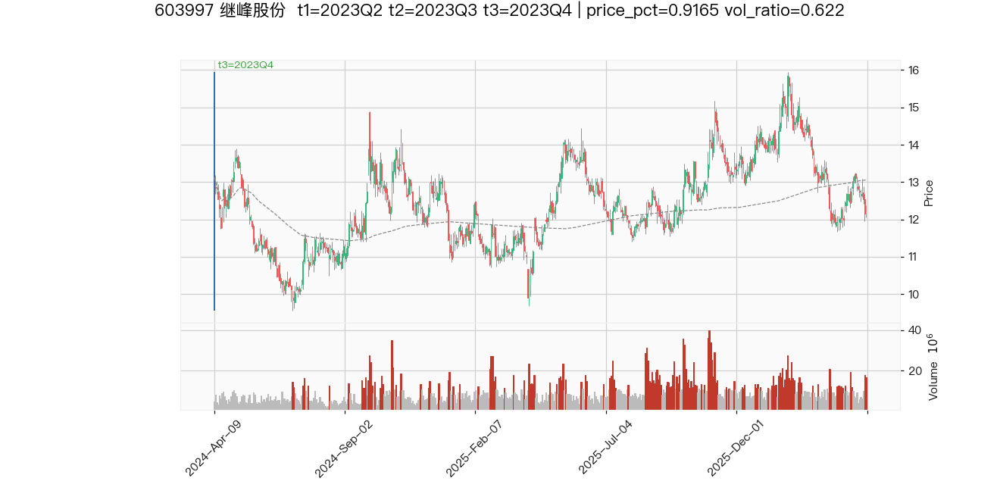

#### 🔍 检测依据 — 603997 继峰股份
> 最佳 triple: **2023Q2 → 2023Q3 → 2023Q4** ｜ B 触发: price_pct=0.92 vol_ratio=0.62 ｜ 候选 triple 数: 1

#### 📊 港中结持仓节奏 — 603997 继峰股份

| 季度     |   持股量(万股) |   持股市值(亿) |
|:-------|----------:|----------:|
| 2023Q1 |     189.3 |      0.28 |
| 2023Q2 |     368.5 |      0.53 |
| 2023Q3 |     285.1 |      0.42 |
| 2023Q4 |     451.1 |      0.61 |
| 2024Q1 |     602.5 |      0.79 |
| 2024Q2 |     831.7 |      0.85 |
| 2024Q3 |     481.6 |      0.54 |

#### ✍️ 人工复盘 — 603997 继峰股份

| 检查项 | 结果 |
|--------|------|
| t2 季度价格在近 250 日高位区间（视觉） | ⬜ |
| t2 季度出现明显放量 bar（红色高量） | ⬜ |
| t3 季度买回后股价未大幅上涨（非卖飞） | ⬜ |
| t1→t2→t3 三段节奏符合「建仓→出货→再建仓」 | ⬜ |

**决策**: ⬜ PASS（纳入关注名单）　⬜ REJECT（假信号）

**备注**: _（人工填写）_

### 605111 新洁能 K 线 + 成交量
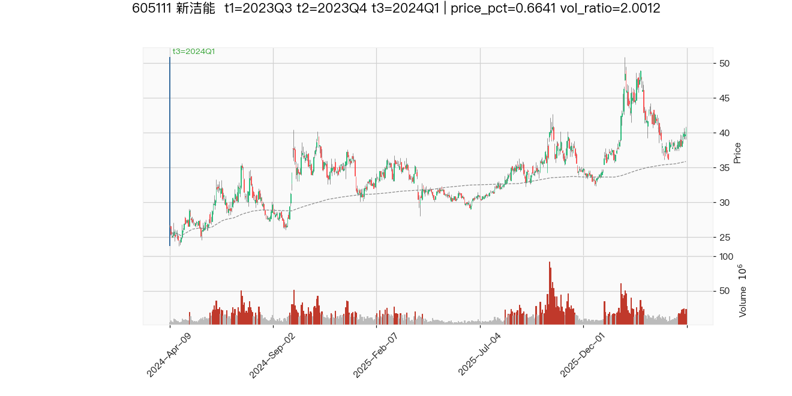

#### 🔍 检测依据 — 605111 新洁能
> 最佳 triple: **2023Q3 → 2023Q4 → 2024Q1** ｜ B 触发: price_pct=0.66 vol_ratio=2.00 ｜ 候选 triple 数: 2

#### 📊 港中结持仓节奏 — 605111 新洁能

| 季度     |   持股量(万股) |   持股市值(亿) |
|:-------|----------:|----------:|
| 2022Q4 |     507.2 |      3.93 |
| 2023Q1 |     216.9 |      1.8  |
| 2023Q2 |     273.6 |      1.17 |
| 2023Q3 |     376.7 |      1.28 |
| 2023Q4 |     315.4 |      1.19 |
| 2024Q1 |     792.3 |      3.04 |
| 2024Q2 |    1380.7 |      4.22 |
| 2024Q3 |    1040.6 |      3.09 |

#### ✍️ 人工复盘 — 605111 新洁能

| 检查项 | 结果 |
|--------|------|
| t2 季度价格在近 250 日高位区间（视觉） | ⬜ |
| t2 季度出现明显放量 bar（红色高量） | ⬜ |
| t3 季度买回后股价未大幅上涨（非卖飞） | ⬜ |
| t1→t2→t3 三段节奏符合「建仓→出货→再建仓」 | ⬜ |

**决策**: ⬜ PASS（纳入关注名单）　⬜ REJECT（假信号）

**备注**: _（人工填写）_

### 688739 成大生物 K 线 + 成交量
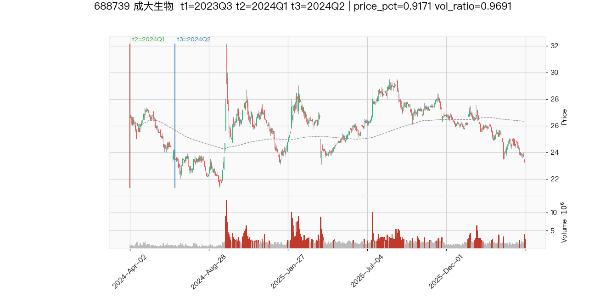

#### 🔍 检测依据 — 688739 成大生物
> 最佳 triple: **2023Q3 → 2024Q1 → 2024Q2** ｜ B 触发: price_pct=0.92 vol_ratio=0.97 ｜ 候选 triple 数: 2

#### 📊 港中结持仓节奏 — 688739 成大生物

| 季度     |   持股量(万股) |   持股市值(亿) |
|:-------|----------:|----------:|
| 2023Q1 |      38.9 |      0.13 |
| 2023Q2 |      84.5 |      0.27 |
| 2023Q3 |     214.5 |      0.74 |
| 2023Q4 |     181.6 |      0.59 |
| 2024Q1 |     118.7 |      0.33 |
| 2024Q2 |     148.1 |      0.36 |
| 2024Q3 |     226.9 |      0.55 |

#### ✍️ 人工复盘 — 688739 成大生物

| 检查项 | 结果 |
|--------|------|
| t2 季度价格在近 250 日高位区间（视觉） | ⬜ |
| t2 季度出现明显放量 bar（红色高量） | ⬜ |
| t3 季度买回后股价未大幅上涨（非卖飞） | ⬜ |
| t1→t2→t3 三段节奏符合「建仓→出货→再建仓」 | ⬜ |

**决策**: ⬜ PASS（纳入关注名单）　⬜ REJECT（假信号）

**备注**: _（人工填写）_

### 688776 国光电气 K 线 + 成交量
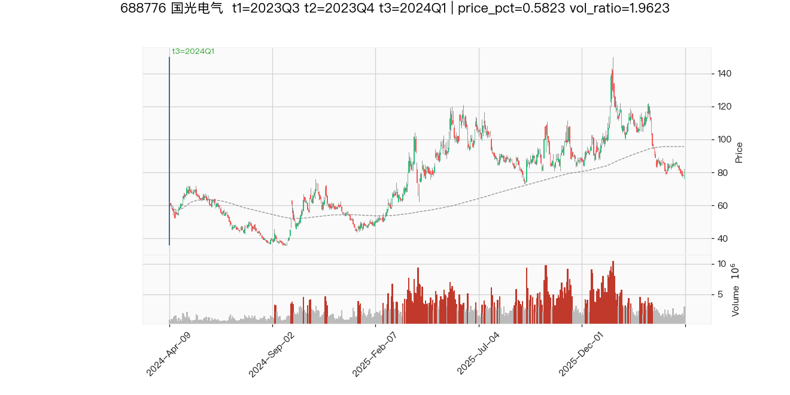

#### 🔍 检测依据 — 688776 国光电气
> 最佳 triple: **2023Q3 → 2023Q4 → 2024Q1** ｜ B 触发: price_pct=0.58 vol_ratio=1.96 ｜ 候选 triple 数: 1

#### 📊 港中结持仓节奏 — 688776 国光电气

| 季度     |   持股量(万股) |   持股市值(亿) |
|:-------|----------:|----------:|
| 2023Q1 |       2.6 |      0.04 |
| 2023Q2 |      38.1 |      0.31 |
| 2023Q3 |      42.5 |      0.36 |
| 2023Q4 |      35.1 |      0.34 |
| 2024Q1 |      52.2 |      0.31 |
| 2024Q2 |      52.9 |      0.29 |
| 2024Q3 |      88.2 |      0.37 |

#### ✍️ 人工复盘 — 688776 国光电气

| 检查项 | 结果 |
|--------|------|
| t2 季度价格在近 250 日高位区间（视觉） | ⬜ |
| t2 季度出现明显放量 bar（红色高量） | ⬜ |
| t3 季度买回后股价未大幅上涨（非卖飞） | ⬜ |
| t1→t2→t3 三段节奏符合「建仓→出货→再建仓」 | ⬜ |

**决策**: ⬜ PASS（纳入关注名单）　⬜ REJECT（假信号）

**备注**: _（人工填写）_

### 600129 太极集团 K 线 + 成交量
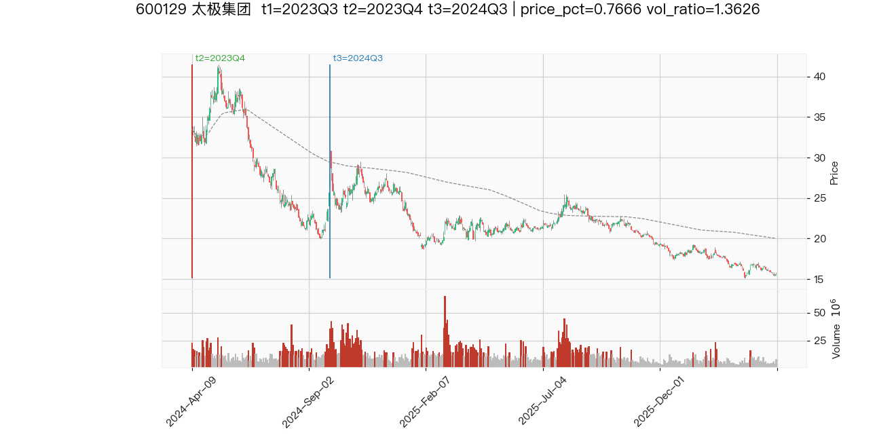

#### 🔍 检测依据 — 600129 太极集团
> 最佳 triple: **2023Q3 → 2023Q4 → 2024Q3** ｜ B 触发: price_pct=0.77 vol_ratio=1.36 ｜ t2 后 60 日收益: 5.5% ｜ 候选 triple 数: 2

#### 📊 港中结持仓节奏 — 600129 太极集团

| 季度     |   持股量(万股) |   持股市值(亿) |
|:-------|----------:|----------:|
| 2023Q1 |      83.8 |      0.36 |
| 2023Q2 |     507.9 |      3.09 |
| 2023Q3 |    1715.3 |      8    |
| 2023Q4 |     894.5 |      4.16 |
| 2024Q1 |     865.7 |      2.93 |
| 2024Q2 |     583.6 |      1.69 |
| 2024Q3 |    1282.3 |      3.1  |

#### ✍️ 人工复盘 — 600129 太极集团

| 检查项 | 结果 |
|--------|------|
| t2 季度价格在近 250 日高位区间（视觉） | ⬜ |
| t2 季度出现明显放量 bar（红色高量） | ⬜ |
| t3 季度买回后股价未大幅上涨（非卖飞） | ⬜ |
| t1→t2→t3 三段节奏符合「建仓→出货→再建仓」 | ⬜ |

**决策**: ⬜ PASS（纳入关注名单）　⬜ REJECT（假信号）

**备注**: _（人工填写）_

### 300841 康华生物 K 线 + 成交量
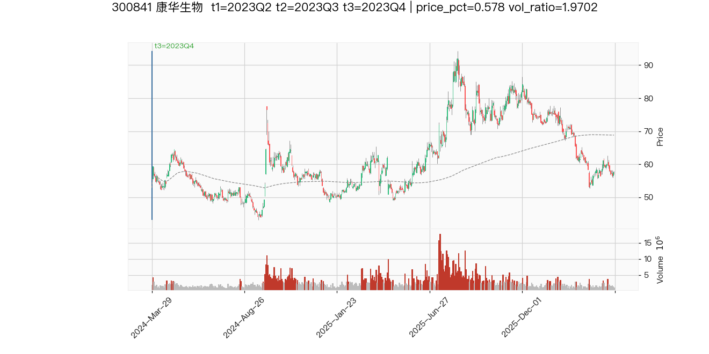

#### 🔍 检测依据 — 300841 康华生物
> 最佳 triple: **2023Q2 → 2023Q3 → 2023Q4** ｜ B 触发: price_pct=0.58 vol_ratio=1.97 ｜ 候选 triple 数: 1

#### 📊 港中结持仓节奏 — 300841 康华生物

| 季度     |   持股量(万股) |   持股市值(亿) |
|:-------|----------:|----------:|
| 2022Q4 |      55.8 |      0.47 |
| 2023Q1 |     102.5 |      0.95 |
| 2023Q2 |     113.7 |      0.74 |
| 2023Q3 |      85.6 |      0.57 |
| 2023Q4 |     146.8 |      1.14 |
| 2024Q1 |     159.6 |      0.86 |
| 2024Q2 |     156.2 |      0.79 |
| 2024Q3 |     190.7 |      1.03 |

#### ✍️ 人工复盘 — 300841 康华生物

| 检查项 | 结果 |
|--------|------|
| t2 季度价格在近 250 日高位区间（视觉） | ⬜ |
| t2 季度出现明显放量 bar（红色高量） | ⬜ |
| t3 季度买回后股价未大幅上涨（非卖飞） | ⬜ |
| t1→t2→t3 三段节奏符合「建仓→出货→再建仓」 | ⬜ |

**决策**: ⬜ PASS（纳入关注名单）　⬜ REJECT（假信号）

**备注**: _（人工填写）_

### 002752 昇兴股份 K 线 + 成交量
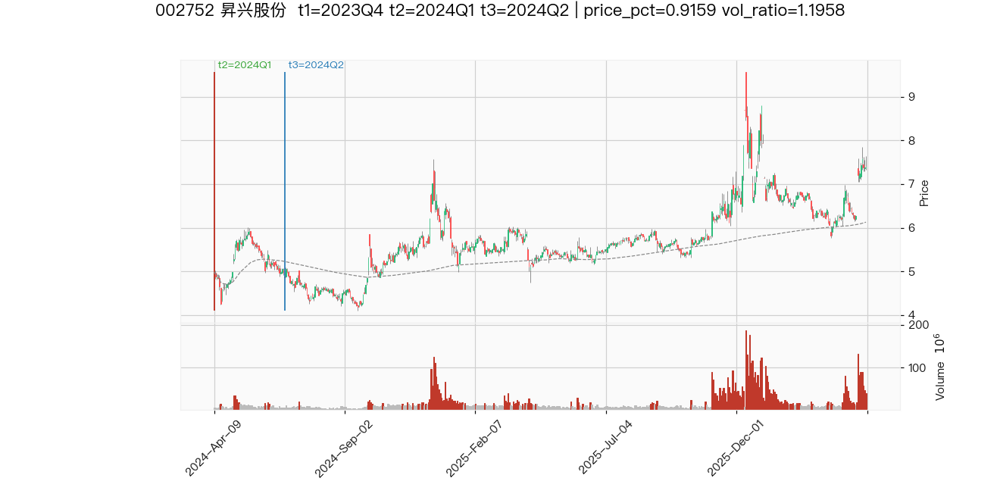

#### 🔍 检测依据 — 002752 昇兴股份
> 最佳 triple: **2023Q4 → 2024Q1 → 2024Q2** ｜ B 触发: price_pct=0.92 vol_ratio=1.20 ｜ 候选 triple 数: 1

#### 📊 港中结持仓节奏 — 002752 昇兴股份

| 季度     |   持股量(万股) |   持股市值(亿) |
|:-------|----------:|----------:|
| 2022Q4 |       3.7 |      0    |
| 2023Q1 |     201.9 |      0.11 |
| 2023Q2 |     429.9 |      0.2  |
| 2023Q3 |     795.7 |      0.42 |
| 2023Q4 |     890.6 |      0.46 |
| 2024Q1 |     432.9 |      0.21 |
| 2024Q2 |    1033.3 |      0.52 |
| 2024Q3 |     682.2 |      0.32 |

#### ✍️ 人工复盘 — 002752 昇兴股份

| 检查项 | 结果 |
|--------|------|
| t2 季度价格在近 250 日高位区间（视觉） | ⬜ |
| t2 季度出现明显放量 bar（红色高量） | ⬜ |
| t3 季度买回后股价未大幅上涨（非卖飞） | ⬜ |
| t1→t2→t3 三段节奏符合「建仓→出货→再建仓」 | ⬜ |

**决策**: ⬜ PASS（纳入关注名单）　⬜ REJECT（假信号）

**备注**: _（人工填写）_

### 002204 大连重工 K 线 + 成交量
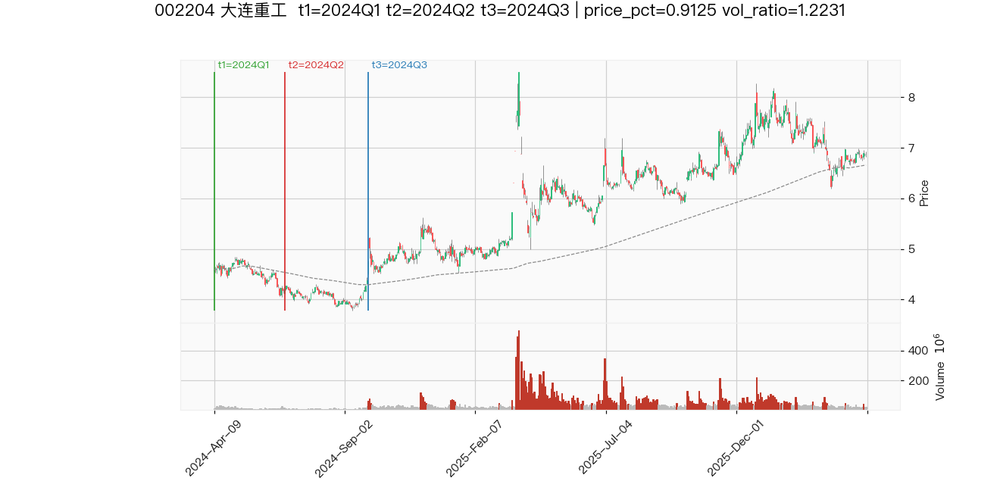

#### 🔍 检测依据 — 002204 大连重工
> 最佳 triple: **2024Q1 → 2024Q2 → 2024Q3** ｜ B 触发: price_pct=0.91 vol_ratio=1.22 ｜ 候选 triple 数: 4

#### 📊 港中结持仓节奏 — 002204 大连重工

| 季度     |   持股量(万股) |   持股市值(亿) |
|:-------|----------:|----------:|
| 2022Q4 |    4344.9 |      2.26 |
| 2023Q1 |    2411.6 |      1.25 |
| 2023Q2 |    2005.7 |      1.04 |
| 2023Q3 |    1226.8 |      0.58 |
| 2023Q4 |    1706.9 |      0.78 |
| 2024Q1 |    2718.5 |      1.25 |
| 2024Q2 |    1791.4 |      0.76 |
| 2024Q3 |    2070.9 |      0.85 |

#### ✍️ 人工复盘 — 002204 大连重工

| 检查项 | 结果 |
|--------|------|
| t2 季度价格在近 250 日高位区间（视觉） | ⬜ |
| t2 季度出现明显放量 bar（红色高量） | ⬜ |
| t3 季度买回后股价未大幅上涨（非卖飞） | ⬜ |
| t1→t2→t3 三段节奏符合「建仓→出货→再建仓」 | ⬜ |

**决策**: ⬜ PASS（纳入关注名单）　⬜ REJECT（假信号）

**备注**: _（人工填写）_

### 300776 帝尔激光 K 线 + 成交量
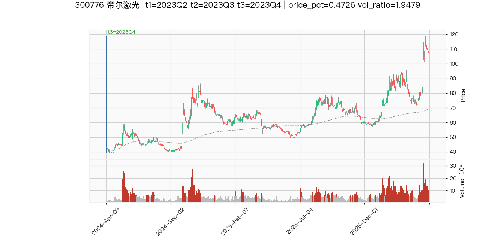

#### 🔍 检测依据 — 300776 帝尔激光
> 最佳 triple: **2023Q2 → 2023Q3 → 2023Q4** ｜ B 触发: price_pct=0.47 vol_ratio=1.95 ｜ 候选 triple 数: 2

#### 📊 港中结持仓节奏 — 300776 帝尔激光

| 季度     |   持股量(万股) |   持股市值(亿) |
|:-------|----------:|----------:|
| 2022Q4 |     310.9 |      3.92 |
| 2023Q1 |     426.4 |      4.62 |
| 2023Q2 |     597.6 |      3.81 |
| 2023Q3 |     382.3 |      2.74 |
| 2023Q4 |     403   |      2.43 |
| 2024Q1 |     406.7 |      1.8  |
| 2024Q2 |     456.1 |      2.1  |
| 2024Q3 |     325.7 |      1.41 |

#### ✍️ 人工复盘 — 300776 帝尔激光

| 检查项 | 结果 |
|--------|------|
| t2 季度价格在近 250 日高位区间（视觉） | ⬜ |
| t2 季度出现明显放量 bar（红色高量） | ⬜ |
| t3 季度买回后股价未大幅上涨（非卖飞） | ⬜ |
| t1→t2→t3 三段节奏符合「建仓→出货→再建仓」 | ⬜ |

**决策**: ⬜ PASS（纳入关注名单）　⬜ REJECT（假信号）

**备注**: _（人工填写）_

### 300855 图南股份 K 线 + 成交量
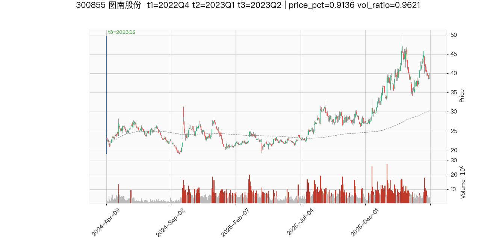

#### 🔍 检测依据 — 300855 图南股份
> 最佳 triple: **2022Q4 → 2023Q1 → 2023Q2** ｜ B 触发: price_pct=0.91 vol_ratio=0.96 ｜ 候选 triple 数: 3

#### 📊 港中结持仓节奏 — 300855 图南股份

| 季度     |   持股量(万股) |   持股市值(亿) |
|:-------|----------:|----------:|
| 2022Q4 |     290.6 |      1.36 |
| 2023Q1 |     186.3 |      0.85 |
| 2023Q2 |     353.8 |      1.21 |
| 2023Q3 |     285.3 |      0.89 |
| 2023Q4 |     281.7 |      0.85 |
| 2024Q1 |     239.1 |      0.55 |
| 2024Q2 |     296.1 |      0.78 |
| 2024Q3 |     267.2 |      0.62 |

#### ✍️ 人工复盘 — 300855 图南股份

| 检查项 | 结果 |
|--------|------|
| t2 季度价格在近 250 日高位区间（视觉） | ⬜ |
| t2 季度出现明显放量 bar（红色高量） | ⬜ |
| t3 季度买回后股价未大幅上涨（非卖飞） | ⬜ |
| t1→t2→t3 三段节奏符合「建仓→出货→再建仓」 | ⬜ |

**决策**: ⬜ PASS（纳入关注名单）　⬜ REJECT（假信号）

**备注**: _（人工填写）_

### 300598 诚迈科技 K 线 + 成交量
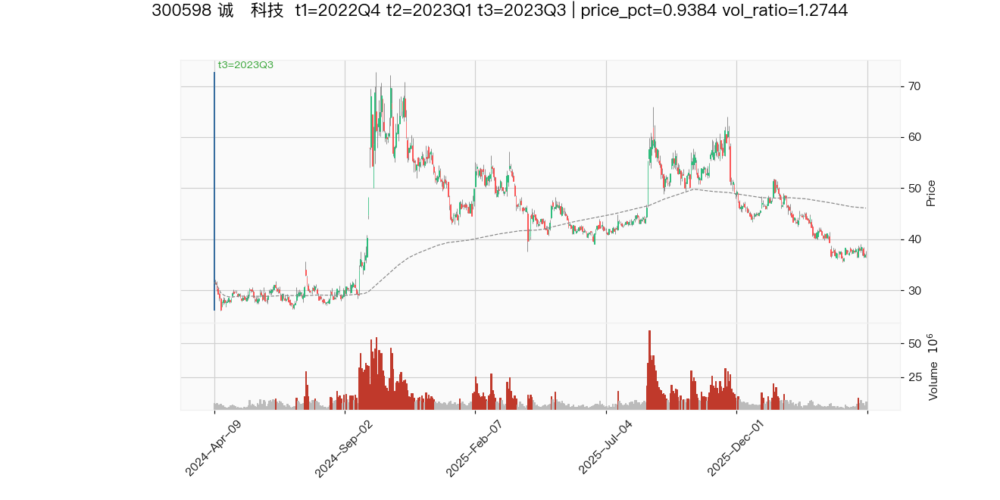

#### 🔍 检测依据 — 300598 诚迈科技
> 最佳 triple: **2022Q4 → 2023Q1 → 2023Q3** ｜ B 触发: price_pct=0.94 vol_ratio=1.27 ｜ t2 后 60 日收益: 8.4% ｜ 候选 triple 数: 3

#### 📊 港中结持仓节奏 — 300598 诚迈科技

| 季度     |   持股量(万股) |   持股市值(亿) |
|:-------|----------:|----------:|
| 2022Q4 |     213.6 |      1    |
| 2023Q1 |     100.4 |      0.55 |
| 2023Q2 |      98   |      0.45 |
| 2023Q3 |     114.6 |      0.54 |
| 2023Q4 |      60.6 |      0.26 |
| 2024Q1 |      66.3 |      0.26 |
| 2024Q2 |      95.2 |      0.27 |
| 2024Q3 |     157.6 |      0.46 |

#### ✍️ 人工复盘 — 300598 诚迈科技

| 检查项 | 结果 |
|--------|------|
| t2 季度价格在近 250 日高位区间（视觉） | ⬜ |
| t2 季度出现明显放量 bar（红色高量） | ⬜ |
| t3 季度买回后股价未大幅上涨（非卖飞） | ⬜ |
| t1→t2→t3 三段节奏符合「建仓→出货→再建仓」 | ⬜ |

**决策**: ⬜ PASS（纳入关注名单）　⬜ REJECT（假信号）

**备注**: _（人工填写）_

### 600167 联美控股 K 线 + 成交量
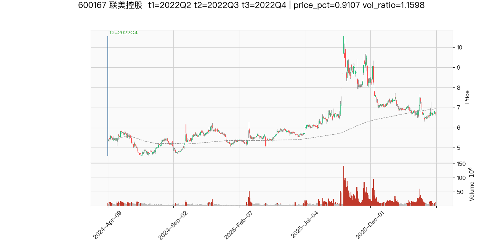

#### 🔍 检测依据 — 600167 联美控股
> 最佳 triple: **2022Q2 → 2022Q3 → 2022Q4** ｜ B 触发: price_pct=0.91 vol_ratio=1.16 ｜ 候选 triple 数: 5

#### 📊 港中结持仓节奏 — 600167 联美控股

| 季度     |   持股量(万股) |   持股市值(亿) |
|:-------|----------:|----------:|
| 2022Q4 |    2044.6 |      1.29 |
| 2023Q1 |    1929.5 |      1.2  |
| 2023Q2 |    2379.7 |      1.66 |
| 2023Q3 |    2040.4 |      1.24 |
| 2023Q4 |    1699.9 |      0.96 |
| 2024Q1 |    1508.1 |      0.84 |
| 2024Q2 |    2192.3 |      1.14 |
| 2024Q3 |    1591.3 |      0.91 |

#### ✍️ 人工复盘 — 600167 联美控股

| 检查项 | 结果 |
|--------|------|
| t2 季度价格在近 250 日高位区间（视觉） | ⬜ |
| t2 季度出现明显放量 bar（红色高量） | ⬜ |
| t3 季度买回后股价未大幅上涨（非卖飞） | ⬜ |
| t1→t2→t3 三段节奏符合「建仓→出货→再建仓」 | ⬜ |

**决策**: ⬜ PASS（纳入关注名单）　⬜ REJECT（假信号）

**备注**: _（人工填写）_

### 300199 翰宇药业 K 线 + 成交量
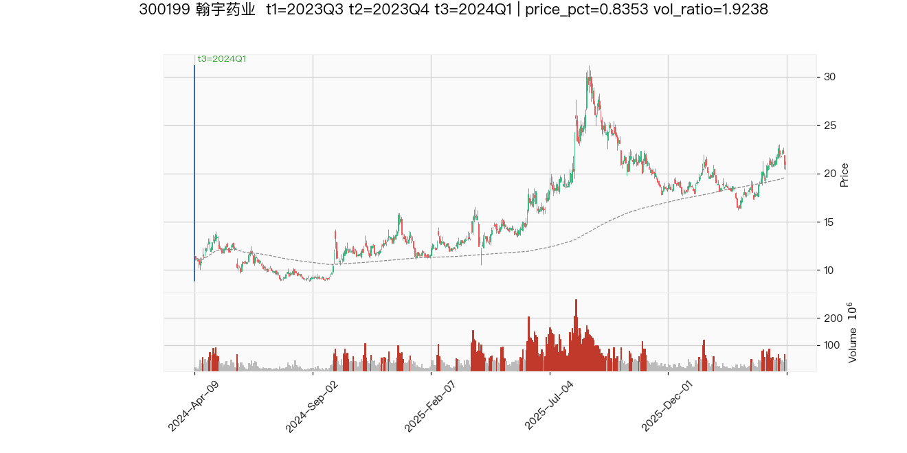

#### 🔍 检测依据 — 300199 翰宇药业
> 最佳 triple: **2023Q3 → 2023Q4 → 2024Q1** ｜ B 触发: price_pct=0.84 vol_ratio=1.92 ｜ 候选 triple 数: 1

#### 📊 港中结持仓节奏 — 300199 翰宇药业

| 季度     |   持股量(万股) |   持股市值(亿) |
|:-------|----------:|----------:|
| 2023Q1 |    1344.2 |      1.45 |
| 2023Q2 |     593.3 |      0.6  |
| 2023Q3 |     997.9 |      1.34 |
| 2023Q4 |     409.5 |      0.56 |
| 2024Q1 |     450.3 |      0.56 |
| 2024Q2 |     358.2 |      0.39 |
| 2024Q3 |     375.6 |      0.36 |

#### ✍️ 人工复盘 — 300199 翰宇药业

| 检查项 | 结果 |
|--------|------|
| t2 季度价格在近 250 日高位区间（视觉） | ⬜ |
| t2 季度出现明显放量 bar（红色高量） | ⬜ |
| t3 季度买回后股价未大幅上涨（非卖飞） | ⬜ |
| t1→t2→t3 三段节奏符合「建仓→出货→再建仓」 | ⬜ |

**决策**: ⬜ PASS（纳入关注名单）　⬜ REJECT（假信号）

**备注**: _（人工填写）_

### 002568 百润股份 K 线 + 成交量
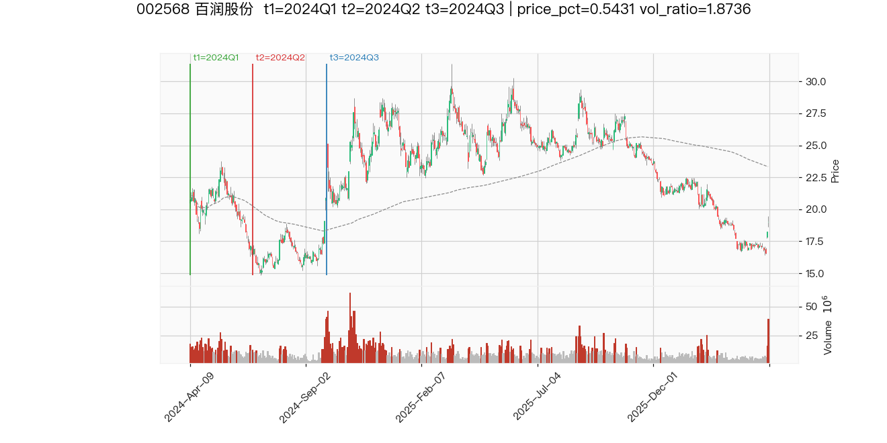

#### 🔍 检测依据 — 002568 百润股份
> 最佳 triple: **2024Q1 → 2024Q2 → 2024Q3** ｜ B 触发: price_pct=0.54 vol_ratio=1.87 ｜ 候选 triple 数: 2

#### 📊 港中结持仓节奏 — 002568 百润股份

| 季度     |   持股量(万股) |   持股市值(亿) |
|:-------|----------:|----------:|
| 2023Q1 |    3036.2 |     12.63 |
| 2023Q2 |    2507.7 |      9.04 |
| 2023Q3 |    2673   |      7.71 |
| 2023Q4 |    1236.9 |      3.04 |
| 2024Q1 |    1301.6 |      2.32 |
| 2024Q2 |     494.8 |      0.83 |
| 2024Q3 |     601.8 |      1.03 |

#### ✍️ 人工复盘 — 002568 百润股份

| 检查项 | 结果 |
|--------|------|
| t2 季度价格在近 250 日高位区间（视觉） | ⬜ |
| t2 季度出现明显放量 bar（红色高量） | ⬜ |
| t3 季度买回后股价未大幅上涨（非卖飞） | ⬜ |
| t1→t2→t3 三段节奏符合「建仓→出货→再建仓」 | ⬜ |

**决策**: ⬜ PASS（纳入关注名单）　⬜ REJECT（假信号）

**备注**: _（人工填写）_

### 600133 东湖高新 K 线 + 成交量
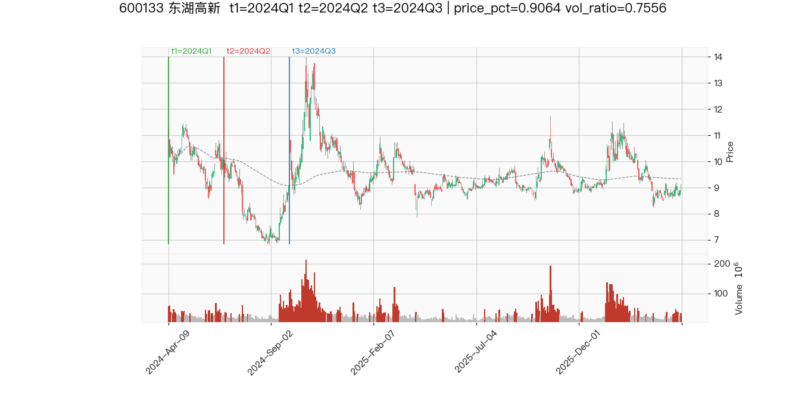

#### 🔍 检测依据 — 600133 东湖高新
> 最佳 triple: **2024Q1 → 2024Q2 → 2024Q3** ｜ B 触发: price_pct=0.91 vol_ratio=0.76 ｜ 候选 triple 数: 1

#### 📊 港中结持仓节奏 — 600133 东湖高新

| 季度     |   持股量(万股) |   持股市值(亿) |
|:-------|----------:|----------:|
| 2023Q4 |     320.6 |      0.35 |
| 2024Q1 |     649.2 |      0.77 |
| 2024Q2 |     272.5 |      0.28 |
| 2024Q3 |     594.9 |      0.45 |

#### ✍️ 人工复盘 — 600133 东湖高新

| 检查项 | 结果 |
|--------|------|
| t2 季度价格在近 250 日高位区间（视觉） | ⬜ |
| t2 季度出现明显放量 bar（红色高量） | ⬜ |
| t3 季度买回后股价未大幅上涨（非卖飞） | ⬜ |
| t1→t2→t3 三段节奏符合「建仓→出货→再建仓」 | ⬜ |

**决策**: ⬜ PASS（纳入关注名单）　⬜ REJECT（假信号）

**备注**: _（人工填写）_

### 002010 传化智联 K 线 + 成交量
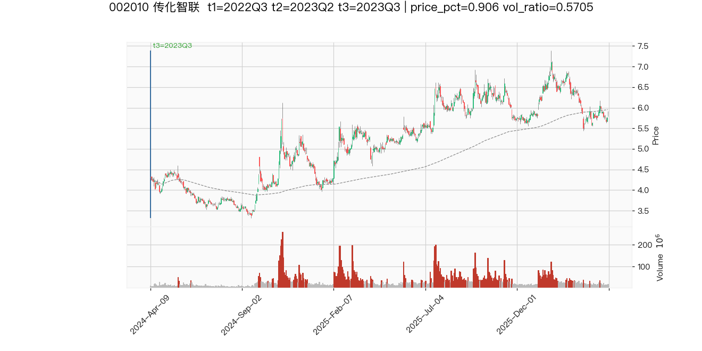

#### 🔍 检测依据 — 002010 传化智联
> 最佳 triple: **2022Q3 → 2023Q2 → 2023Q3** ｜ B 触发: price_pct=0.91 vol_ratio=0.57 ｜ 候选 triple 数: 3

#### 📊 港中结持仓节奏 — 002010 传化智联

| 季度     |   持股量(万股) |   持股市值(亿) |
|:-------|----------:|----------:|
| 2022Q4 |    3851.1 |      2.06 |
| 2023Q1 |    2611   |      1.59 |
| 2023Q2 |    1380.6 |      0.73 |
| 2023Q3 |    2239.9 |      1.17 |
| 2023Q4 |    1438.6 |      0.66 |
| 2024Q1 |    1807.7 |      0.78 |
| 2024Q2 |    1614.6 |      0.62 |
| 2024Q3 |    1710.9 |      0.65 |

#### ✍️ 人工复盘 — 002010 传化智联

| 检查项 | 结果 |
|--------|------|
| t2 季度价格在近 250 日高位区间（视觉） | ⬜ |
| t2 季度出现明显放量 bar（红色高量） | ⬜ |
| t3 季度买回后股价未大幅上涨（非卖飞） | ⬜ |
| t1→t2→t3 三段节奏符合「建仓→出货→再建仓」 | ⬜ |

**决策**: ⬜ PASS（纳入关注名单）　⬜ REJECT（假信号）

**备注**: _（人工填写）_

### 600888 新疆众和 K 线 + 成交量
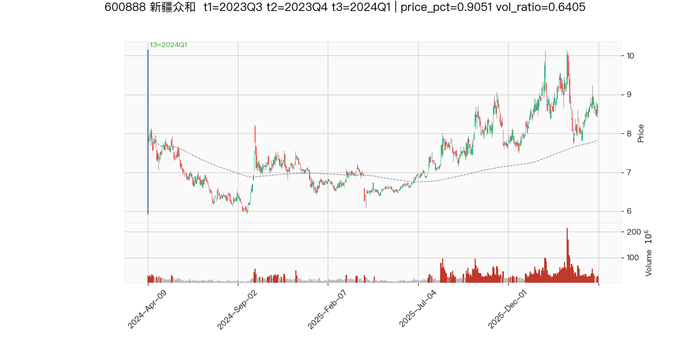

#### 🔍 检测依据 — 600888 新疆众和
> 最佳 triple: **2023Q3 → 2023Q4 → 2024Q1** ｜ B 触发: price_pct=0.91 vol_ratio=0.64 ｜ 候选 triple 数: 2

#### 📊 港中结持仓节奏 — 600888 新疆众和

| 季度     |   持股量(万股) |   持股市值(亿) |
|:-------|----------:|----------:|
| 2022Q4 |     183.8 |      0.15 |
| 2023Q1 |     619.4 |      0.54 |
| 2023Q2 |     584.2 |      0.46 |
| 2023Q3 |     926.7 |      0.74 |
| 2023Q4 |     739   |      0.54 |
| 2024Q1 |    1055.7 |      0.83 |
| 2024Q2 |    1112.2 |      0.79 |
| 2024Q3 |     734.6 |      0.49 |

#### ✍️ 人工复盘 — 600888 新疆众和

| 检查项 | 结果 |
|--------|------|
| t2 季度价格在近 250 日高位区间（视觉） | ⬜ |
| t2 季度出现明显放量 bar（红色高量） | ⬜ |
| t3 季度买回后股价未大幅上涨（非卖飞） | ⬜ |
| t1→t2→t3 三段节奏符合「建仓→出货→再建仓」 | ⬜ |

**决策**: ⬜ PASS（纳入关注名单）　⬜ REJECT（假信号）

**备注**: _（人工填写）_

### 300790 宇瞳光学 K 线 + 成交量
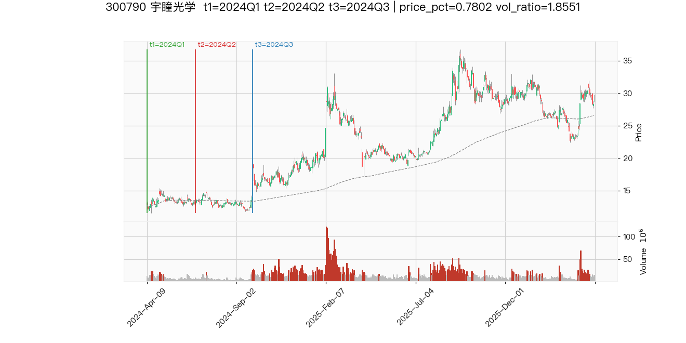

#### 🔍 检测依据 — 300790 宇瞳光学
> 最佳 triple: **2024Q1 → 2024Q2 → 2024Q3** ｜ B 触发: price_pct=0.78 vol_ratio=1.86 ｜ 候选 triple 数: 2

#### 📊 港中结持仓节奏 — 300790 宇瞳光学

| 季度     |   持股量(万股) |   持股市值(亿) |
|:-------|----------:|----------:|
| 2023Q1 |     132.3 |      0.23 |
| 2023Q2 |     304.3 |      0.46 |
| 2023Q3 |     262.4 |      0.37 |
| 2023Q4 |     368.1 |      0.6  |
| 2024Q1 |     418   |      0.5  |
| 2024Q2 |     360.8 |      0.49 |
| 2024Q3 |     396.5 |      0.55 |

#### ✍️ 人工复盘 — 300790 宇瞳光学

| 检查项 | 结果 |
|--------|------|
| t2 季度价格在近 250 日高位区间（视觉） | ⬜ |
| t2 季度出现明显放量 bar（红色高量） | ⬜ |
| t3 季度买回后股价未大幅上涨（非卖飞） | ⬜ |
| t1→t2→t3 三段节奏符合「建仓→出货→再建仓」 | ⬜ |

**决策**: ⬜ PASS（纳入关注名单）　⬜ REJECT（假信号）

**备注**: _（人工填写）_

### 002285 世联行 K 线 + 成交量
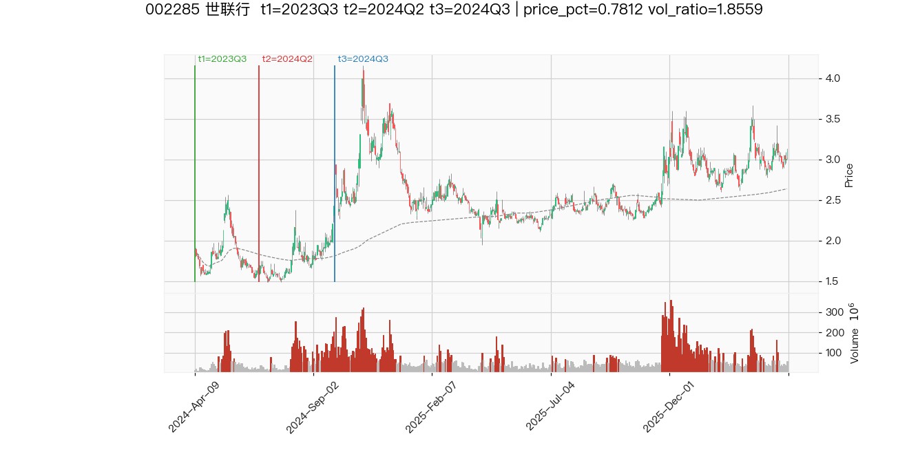

#### 🔍 检测依据 — 002285 世联行
> 最佳 triple: **2023Q3 → 2024Q2 → 2024Q3** ｜ B 触发: price_pct=0.78 vol_ratio=1.86 ｜ 候选 triple 数: 1

#### 📊 港中结持仓节奏 — 002285 世联行

| 季度     |   持股量(万股) |   持股市值(亿) |
|:-------|----------:|----------:|
| 2023Q1 |    2675.9 |      0.76 |
| 2023Q2 |    2545.3 |      0.63 |
| 2023Q3 |    3525.8 |      0.95 |
| 2023Q4 |    3402.7 |      0.82 |
| 2024Q1 |    3549.2 |      0.7  |
| 2024Q2 |    2863.2 |      0.46 |
| 2024Q3 |    3115.1 |      0.59 |

#### ✍️ 人工复盘 — 002285 世联行

| 检查项 | 结果 |
|--------|------|
| t2 季度价格在近 250 日高位区间（视觉） | ⬜ |
| t2 季度出现明显放量 bar（红色高量） | ⬜ |
| t3 季度买回后股价未大幅上涨（非卖飞） | ⬜ |
| t1→t2→t3 三段节奏符合「建仓→出货→再建仓」 | ⬜ |

**决策**: ⬜ PASS（纳入关注名单）　⬜ REJECT（假信号）

**备注**: _（人工填写）_

### 300973 立高食品 K 线 + 成交量
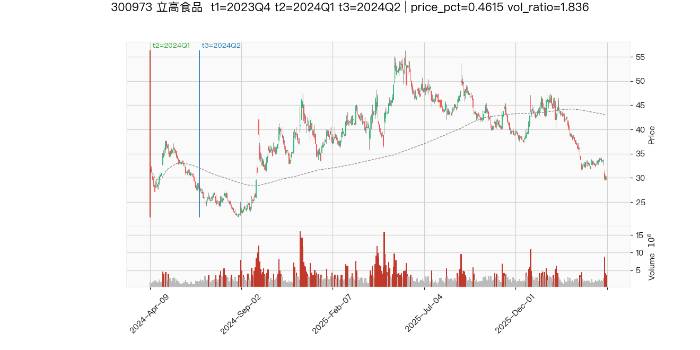

#### 🔍 检测依据 — 300973 立高食品
> 最佳 triple: **2023Q4 → 2024Q1 → 2024Q2** ｜ B 触发: price_pct=0.46 vol_ratio=1.84 ｜ 候选 triple 数: 1

#### 📊 港中结持仓节奏 — 300973 立高食品

| 季度     |   持股量(万股) |   持股市值(亿) |
|:-------|----------:|----------:|
| 2022Q4 |     118.7 |      1.14 |
| 2023Q1 |     133.3 |      1.41 |
| 2023Q2 |     242.7 |      1.64 |
| 2023Q3 |     248.8 |      1.58 |
| 2023Q4 |     289.2 |      1.4  |
| 2024Q1 |     255.6 |      0.85 |
| 2024Q2 |     342.4 |      0.96 |
| 2024Q3 |     293.4 |      0.71 |

#### ✍️ 人工复盘 — 300973 立高食品

| 检查项 | 结果 |
|--------|------|
| t2 季度价格在近 250 日高位区间（视觉） | ⬜ |
| t2 季度出现明显放量 bar（红色高量） | ⬜ |
| t3 季度买回后股价未大幅上涨（非卖飞） | ⬜ |
| t1→t2→t3 三段节奏符合「建仓→出货→再建仓」 | ⬜ |

**决策**: ⬜ PASS（纳入关注名单）　⬜ REJECT（假信号）

**备注**: _（人工填写）_

### 002458 益生股份 K 线 + 成交量
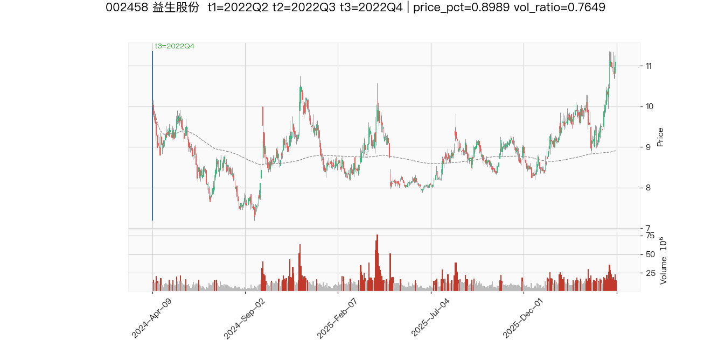

#### 🔍 检测依据 — 002458 益生股份
> 最佳 triple: **2022Q2 → 2022Q3 → 2022Q4** ｜ B 触发: price_pct=0.90 vol_ratio=0.76 ｜ 候选 triple 数: 5

#### 📊 港中结持仓节奏 — 002458 益生股份

| 季度     |   持股量(万股) |   持股市值(亿) |
|:-------|----------:|----------:|
| 2022Q4 |    2505.5 |      3.48 |
| 2023Q1 |     624.4 |      0.94 |
| 2023Q2 |    1233.3 |      1.51 |
| 2023Q3 |     783.6 |      0.88 |
| 2023Q4 |     561   |      0.6  |
| 2024Q1 |     752.5 |      0.77 |
| 2024Q2 |     607.8 |      0.53 |
| 2024Q3 |     823.3 |      0.68 |

#### ✍️ 人工复盘 — 002458 益生股份

| 检查项 | 结果 |
|--------|------|
| t2 季度价格在近 250 日高位区间（视觉） | ⬜ |
| t2 季度出现明显放量 bar（红色高量） | ⬜ |
| t3 季度买回后股价未大幅上涨（非卖飞） | ⬜ |
| t1→t2→t3 三段节奏符合「建仓→出货→再建仓」 | ⬜ |

**决策**: ⬜ PASS（纳入关注名单）　⬜ REJECT（假信号）

**备注**: _（人工填写）_

### 603662 柯力传感 K 线 + 成交量
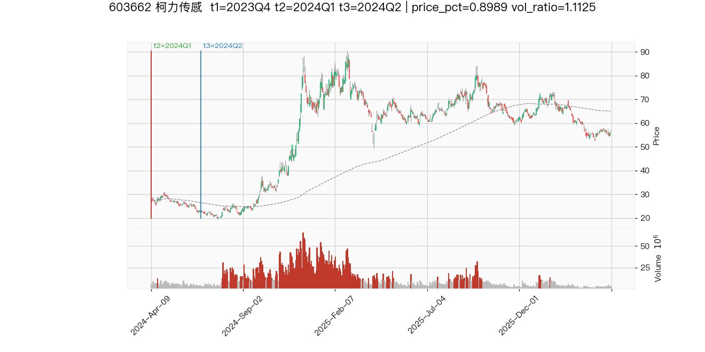

#### 🔍 检测依据 — 603662 柯力传感
> 最佳 triple: **2023Q4 → 2024Q1 → 2024Q2** ｜ B 触发: price_pct=0.90 vol_ratio=1.11 ｜ 候选 triple 数: 1

#### 📊 港中结持仓节奏 — 603662 柯力传感

| 季度     |   持股量(万股) |   持股市值(亿) |
|:-------|----------:|----------:|
| 2023Q2 |      34   |      0.13 |
| 2023Q3 |      30.3 |      0.1  |
| 2023Q4 |      84.6 |      0.3  |
| 2024Q1 |      77.4 |      0.24 |
| 2024Q2 |     195.8 |      0.46 |
| 2024Q3 |     118.1 |      0.3  |

#### ✍️ 人工复盘 — 603662 柯力传感

| 检查项 | 结果 |
|--------|------|
| t2 季度价格在近 250 日高位区间（视觉） | ⬜ |
| t2 季度出现明显放量 bar（红色高量） | ⬜ |
| t3 季度买回后股价未大幅上涨（非卖飞） | ⬜ |
| t1→t2→t3 三段节奏符合「建仓→出货→再建仓」 | ⬜ |

**决策**: ⬜ PASS（纳入关注名单）　⬜ REJECT（假信号）

**备注**: _（人工填写）_

### 002254 泰和新材 K 线 + 成交量
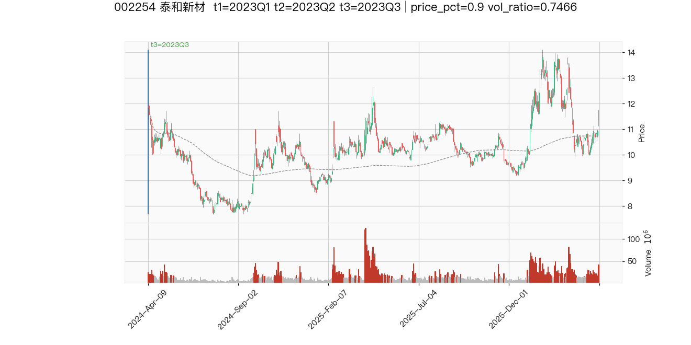

#### 🔍 检测依据 — 002254 泰和新材
> 最佳 triple: **2023Q1 → 2023Q2 → 2023Q3** ｜ B 触发: price_pct=0.90 vol_ratio=0.75 ｜ 候选 triple 数: 3

#### 📊 港中结持仓节奏 — 002254 泰和新材

| 季度     |   持股量(万股) |   持股市值(亿) |
|:-------|----------:|----------:|
| 2022Q4 |     744.2 |      1.58 |
| 2023Q1 |     983.7 |      2.36 |
| 2023Q2 |     924.6 |      2.25 |
| 2023Q3 |    1741   |      2.81 |
| 2023Q4 |    1080.8 |      1.62 |
| 2024Q1 |    1250.7 |      1.41 |
| 2024Q2 |     552.7 |      0.49 |
| 2024Q3 |     613.2 |      0.5  |

#### ✍️ 人工复盘 — 002254 泰和新材

| 检查项 | 结果 |
|--------|------|
| t2 季度价格在近 250 日高位区间（视觉） | ⬜ |
| t2 季度出现明显放量 bar（红色高量） | ⬜ |
| t3 季度买回后股价未大幅上涨（非卖飞） | ⬜ |
| t1→t2→t3 三段节奏符合「建仓→出货→再建仓」 | ⬜ |

**决策**: ⬜ PASS（纳入关注名单）　⬜ REJECT（假信号）

**备注**: _（人工填写）_

### 002643 万润股份 K 线 + 成交量
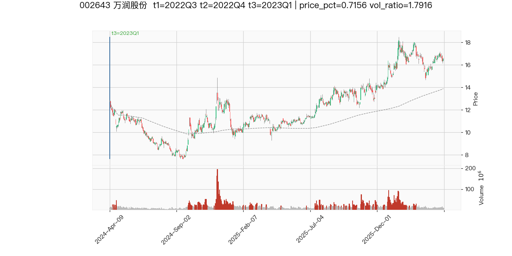

#### 🔍 检测依据 — 002643 万润股份
> 最佳 triple: **2022Q3 → 2022Q4 → 2023Q1** ｜ B 触发: price_pct=0.72 vol_ratio=1.79 ｜ 候选 triple 数: 4

#### 📊 港中结持仓节奏 — 002643 万润股份

| 季度     |   持股量(万股) |   持股市值(亿) |
|:-------|----------:|----------:|
| 2022Q4 |     950.9 |      1.39 |
| 2023Q1 |    1085.9 |      1.87 |
| 2023Q2 |     897.3 |      1.55 |
| 2023Q3 |     940.8 |      1.62 |
| 2023Q4 |    1212.1 |      2.01 |
| 2024Q1 |    1100.9 |      1.47 |
| 2024Q2 |     982.2 |      0.98 |
| 2024Q3 |    1330.6 |      1.17 |

#### ✍️ 人工复盘 — 002643 万润股份

| 检查项 | 结果 |
|--------|------|
| t2 季度价格在近 250 日高位区间（视觉） | ⬜ |
| t2 季度出现明显放量 bar（红色高量） | ⬜ |
| t3 季度买回后股价未大幅上涨（非卖飞） | ⬜ |
| t1→t2→t3 三段节奏符合「建仓→出货→再建仓」 | ⬜ |

**决策**: ⬜ PASS（纳入关注名单）　⬜ REJECT（假信号）

**备注**: _（人工填写）_

### 002701 奥瑞金 K 线 + 成交量
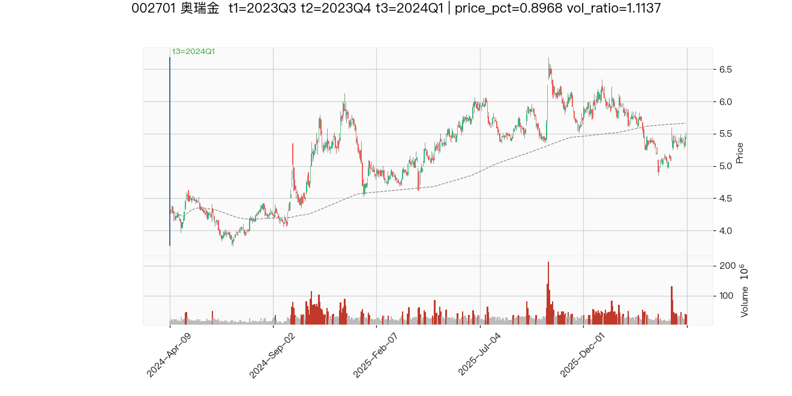

#### 🔍 检测依据 — 002701 奥瑞金
> 最佳 triple: **2023Q3 → 2023Q4 → 2024Q1** ｜ B 触发: price_pct=0.90 vol_ratio=1.11 ｜ 候选 triple 数: 2

#### 📊 港中结持仓节奏 — 002701 奥瑞金

| 季度     |   持股量(万股) |   持股市值(亿) |
|:-------|----------:|----------:|
| 2022Q4 |    6148.7 |      3.11 |
| 2023Q1 |    6526.4 |      3.37 |
| 2023Q2 |    6650.7 |      3    |
| 2023Q3 |    8571.1 |      3.99 |
| 2023Q4 |    5477.3 |      2.27 |
| 2024Q1 |    8491.9 |      3.59 |
| 2024Q2 |    7443.9 |      3.1  |
| 2024Q3 |    8081.1 |      3.59 |

#### ✍️ 人工复盘 — 002701 奥瑞金

| 检查项 | 结果 |
|--------|------|
| t2 季度价格在近 250 日高位区间（视觉） | ⬜ |
| t2 季度出现明显放量 bar（红色高量） | ⬜ |
| t3 季度买回后股价未大幅上涨（非卖飞） | ⬜ |
| t1→t2→t3 三段节奏符合「建仓→出货→再建仓」 | ⬜ |

**决策**: ⬜ PASS（纳入关注名单）　⬜ REJECT（假信号）

**备注**: _（人工填写）_

### 002287 奇正藏药 K 线 + 成交量
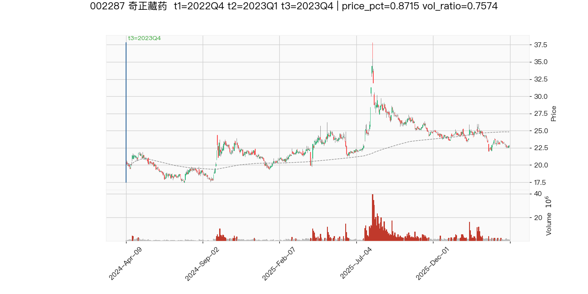

#### 🔍 检测依据 — 002287 奇正藏药
> 最佳 triple: **2022Q4 → 2023Q1 → 2023Q4** ｜ B 触发: price_pct=0.87 vol_ratio=0.76 ｜ t2 后 60 日收益: 6.6% ｜ 候选 triple 数: 4

#### 📊 港中结持仓节奏 — 002287 奇正藏药

| 季度     |   持股量(万股) |   持股市值(亿) |
|:-------|----------:|----------:|
| 2022Q4 |     227.9 |      0.52 |
| 2023Q1 |     168.8 |      0.43 |
| 2023Q2 |     157.6 |      0.38 |
| 2023Q3 |     161.8 |      0.42 |
| 2023Q4 |     224.3 |      0.5  |
| 2024Q1 |     159.2 |      0.34 |
| 2024Q2 |     163.4 |      0.32 |
| 2024Q3 |     209.9 |      0.42 |

#### ✍️ 人工复盘 — 002287 奇正藏药

| 检查项 | 结果 |
|--------|------|
| t2 季度价格在近 250 日高位区间（视觉） | ⬜ |
| t2 季度出现明显放量 bar（红色高量） | ⬜ |
| t3 季度买回后股价未大幅上涨（非卖飞） | ⬜ |
| t1→t2→t3 三段节奏符合「建仓→出货→再建仓」 | ⬜ |

**决策**: ⬜ PASS（纳入关注名单）　⬜ REJECT（假信号）

**备注**: _（人工填写）_

### 603383 顶点软件 K 线 + 成交量
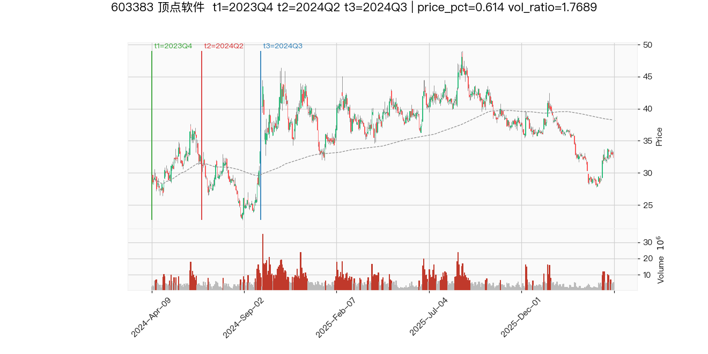

#### 🔍 检测依据 — 603383 顶点软件
> 最佳 triple: **2023Q4 → 2024Q2 → 2024Q3** ｜ B 触发: price_pct=0.61 vol_ratio=1.77 ｜ 候选 triple 数: 1

#### 📊 港中结持仓节奏 — 603383 顶点软件

| 季度     |   持股量(万股) |   持股市值(亿) |
|:-------|----------:|----------:|
| 2023Q1 |     442.1 |      2.32 |
| 2023Q2 |     408.5 |      2.23 |
| 2023Q3 |     311.4 |      1.94 |
| 2023Q4 |     666.5 |      3.29 |
| 2024Q1 |     479.6 |      1.76 |
| 2024Q2 |     277.2 |      0.89 |
| 2024Q3 |     353.9 |      1.01 |

#### ✍️ 人工复盘 — 603383 顶点软件

| 检查项 | 结果 |
|--------|------|
| t2 季度价格在近 250 日高位区间（视觉） | ⬜ |
| t2 季度出现明显放量 bar（红色高量） | ⬜ |
| t3 季度买回后股价未大幅上涨（非卖飞） | ⬜ |
| t1→t2→t3 三段节奏符合「建仓→出货→再建仓」 | ⬜ |

**决策**: ⬜ PASS（纳入关注名单）　⬜ REJECT（假信号）

**备注**: _（人工填写）_

### 600422 昆药集团 K 线 + 成交量
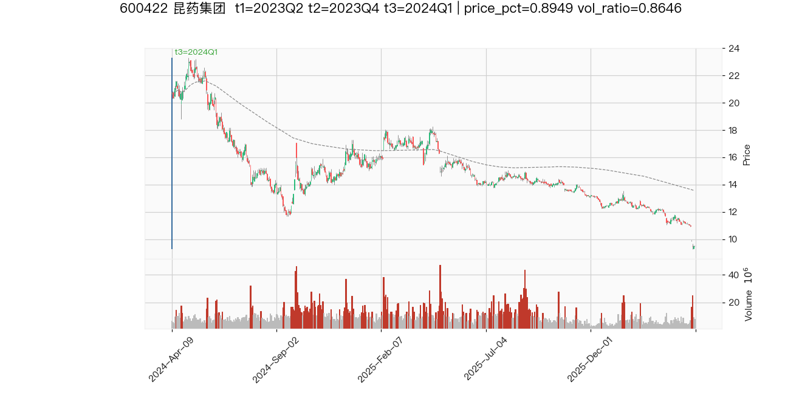

#### 🔍 检测依据 — 600422 昆药集团
> 最佳 triple: **2023Q2 → 2023Q4 → 2024Q1** ｜ B 触发: price_pct=0.89 vol_ratio=0.86 ｜ 候选 triple 数: 3

#### 📊 港中结持仓节奏 — 600422 昆药集团

| 季度     |   持股量(万股) |   持股市值(亿) |
|:-------|----------:|----------:|
| 2022Q4 |    2680.6 |      3.78 |
| 2023Q1 |     949.4 |      1.97 |
| 2023Q2 |    1159.8 |      2.4  |
| 2023Q3 |     991.6 |      1.9  |
| 2023Q4 |     743.8 |      1.55 |
| 2024Q1 |     792.7 |      1.68 |
| 2024Q2 |     818.3 |      1.46 |
| 2024Q3 |    1308.4 |      2.02 |

#### ✍️ 人工复盘 — 600422 昆药集团

| 检查项 | 结果 |
|--------|------|
| t2 季度价格在近 250 日高位区间（视觉） | ⬜ |
| t2 季度出现明显放量 bar（红色高量） | ⬜ |
| t3 季度买回后股价未大幅上涨（非卖飞） | ⬜ |
| t1→t2→t3 三段节奏符合「建仓→出货→再建仓」 | ⬜ |

**决策**: ⬜ PASS（纳入关注名单）　⬜ REJECT（假信号）

**备注**: _（人工填写）_

### 000088 盐田港 K 线 + 成交量
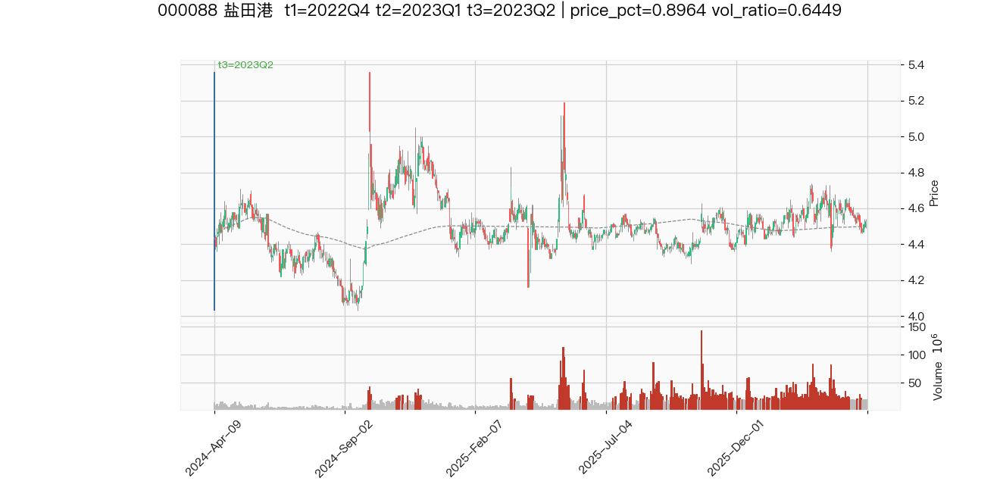

#### 🔍 检测依据 — 000088 盐田港
> 最佳 triple: **2022Q4 → 2023Q1 → 2023Q2** ｜ B 触发: price_pct=0.90 vol_ratio=0.64 ｜ 候选 triple 数: 2

#### 📊 港中结持仓节奏 — 000088 盐田港

| 季度     |   持股量(万股) |   持股市值(亿) |
|:-------|----------:|----------:|
| 2022Q4 |    1644.2 |      0.83 |
| 2023Q1 |    1490.3 |      0.75 |
| 2023Q2 |    1599   |      0.77 |
| 2023Q3 |    1970.8 |      0.99 |
| 2023Q4 |    1997.9 |      0.97 |
| 2024Q1 |    1652.9 |      0.78 |
| 2024Q2 |    2259.6 |      1.02 |
| 2024Q3 |    2099.8 |      0.94 |

#### ✍️ 人工复盘 — 000088 盐田港

| 检查项 | 结果 |
|--------|------|
| t2 季度价格在近 250 日高位区间（视觉） | ⬜ |
| t2 季度出现明显放量 bar（红色高量） | ⬜ |
| t3 季度买回后股价未大幅上涨（非卖飞） | ⬜ |
| t1→t2→t3 三段节奏符合「建仓→出货→再建仓」 | ⬜ |

**决策**: ⬜ PASS（纳入关注名单）　⬜ REJECT（假信号）

**备注**: _（人工填写）_

### 603613 国联股份 K 线 + 成交量
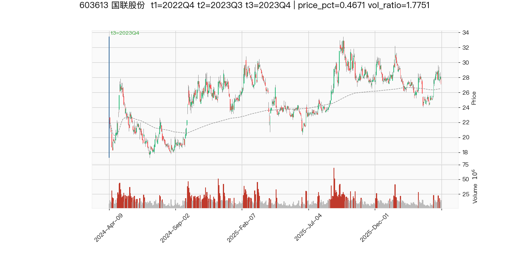

#### 🔍 检测依据 — 603613 国联股份
> 最佳 triple: **2022Q4 → 2023Q3 → 2023Q4** ｜ B 触发: price_pct=0.47 vol_ratio=1.78 ｜ 候选 triple 数: 2

#### 📊 港中结持仓节奏 — 603613 国联股份

| 季度     |   持股量(万股) |   持股市值(亿) |
|:-------|----------:|----------:|
| 2022Q4 |    2651.9 |     23.45 |
| 2023Q1 |    2752.8 |     22.83 |
| 2023Q2 |    2863.5 |     10.58 |
| 2023Q3 |    1942.1 |      6.45 |
| 2023Q4 |    2180   |      4.8  |
| 2024Q1 |    1203.7 |      2.83 |
| 2024Q2 |     432.4 |      0.85 |
| 2024Q3 |     508.8 |      0.97 |

#### ✍️ 人工复盘 — 603613 国联股份

| 检查项 | 结果 |
|--------|------|
| t2 季度价格在近 250 日高位区间（视觉） | ⬜ |
| t2 季度出现明显放量 bar（红色高量） | ⬜ |
| t3 季度买回后股价未大幅上涨（非卖飞） | ⬜ |
| t1→t2→t3 三段节奏符合「建仓→出货→再建仓」 | ⬜ |

**决策**: ⬜ PASS（纳入关注名单）　⬜ REJECT（假信号）

**备注**: _（人工填写）_

### 603985 恒润股份 K 线 + 成交量
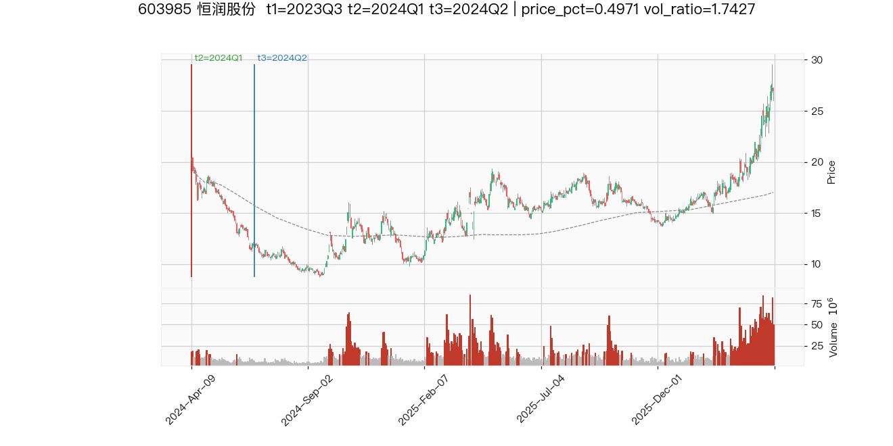

#### 🔍 检测依据 — 603985 恒润股份
> 最佳 triple: **2023Q3 → 2024Q1 → 2024Q2** ｜ B 触发: price_pct=0.50 vol_ratio=1.74 ｜ 候选 triple 数: 1

#### 📊 港中结持仓节奏 — 603985 恒润股份

| 季度     |   持股量(万股) |   持股市值(亿) |
|:-------|----------:|----------:|
| 2023Q1 |     668.1 |      1.5  |
| 2023Q2 |    1210.9 |      2.47 |
| 2023Q3 |    1544.2 |      4.22 |
| 2023Q4 |    1259.5 |      3.13 |
| 2024Q1 |     212.1 |      0.51 |
| 2024Q2 |     784.2 |      0.93 |
| 2024Q3 |     518.3 |      0.52 |

#### ✍️ 人工复盘 — 603985 恒润股份

| 检查项 | 结果 |
|--------|------|
| t2 季度价格在近 250 日高位区间（视觉） | ⬜ |
| t2 季度出现明显放量 bar（红色高量） | ⬜ |
| t3 季度买回后股价未大幅上涨（非卖飞） | ⬜ |
| t1→t2→t3 三段节奏符合「建仓→出货→再建仓」 | ⬜ |

**决策**: ⬜ PASS（纳入关注名单）　⬜ REJECT（假信号）

**备注**: _（人工填写）_

### 300034 钢研高纳 K 线 + 成交量
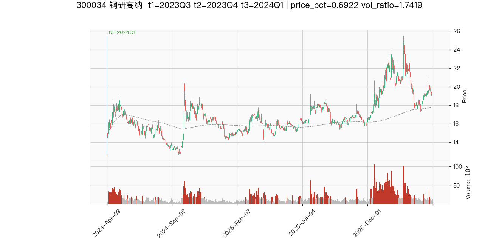

#### 🔍 检测依据 — 300034 钢研高纳
> 最佳 triple: **2023Q3 → 2023Q4 → 2024Q1** ｜ B 触发: price_pct=0.69 vol_ratio=1.74 ｜ 候选 triple 数: 2

#### 📊 港中结持仓节奏 — 300034 钢研高纳

| 季度     |   持股量(万股) |   持股市值(亿) |
|:-------|----------:|----------:|
| 2022Q4 |    1139.1 |      5.22 |
| 2023Q1 |    1300.6 |      4.9  |
| 2023Q2 |    1079.7 |      4.25 |
| 2023Q3 |    1344.1 |      3.27 |
| 2023Q4 |     634.3 |      1.29 |
| 2024Q1 |    1407   |      2.12 |
| 2024Q2 |     923   |      1.47 |
| 2024Q3 |     394.3 |      0.56 |

#### ✍️ 人工复盘 — 300034 钢研高纳

| 检查项 | 结果 |
|--------|------|
| t2 季度价格在近 250 日高位区间（视觉） | ⬜ |
| t2 季度出现明显放量 bar（红色高量） | ⬜ |
| t3 季度买回后股价未大幅上涨（非卖飞） | ⬜ |
| t1→t2→t3 三段节奏符合「建仓→出货→再建仓」 | ⬜ |

**决策**: ⬜ PASS（纳入关注名单）　⬜ REJECT（假信号）

**备注**: _（人工填写）_

### 002958 青农商行 K 线 + 成交量
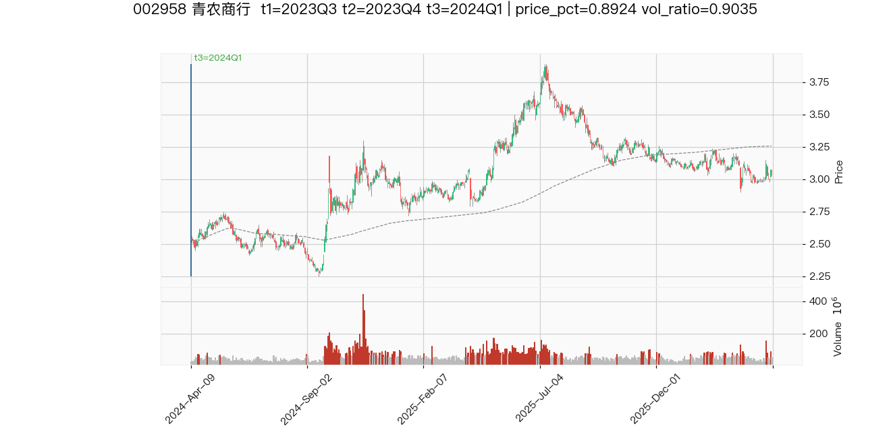

#### 🔍 检测依据 — 002958 青农商行
> 最佳 triple: **2023Q3 → 2023Q4 → 2024Q1** ｜ B 触发: price_pct=0.89 vol_ratio=0.90 ｜ 候选 triple 数: 1

#### 📊 港中结持仓节奏 — 002958 青农商行

| 季度     |   持股量(万股) |   持股市值(亿) |
|:-------|----------:|----------:|
| 2022Q4 |    4548.5 |      1.31 |
| 2023Q1 |    2900.3 |      0.82 |
| 2023Q2 |    3240.8 |      0.88 |
| 2023Q3 |    8783.9 |      2.44 |
| 2023Q4 |    7770.8 |      2.04 |
| 2024Q1 |   10993.1 |      2.95 |
| 2024Q2 |   15386.2 |      4.12 |
| 2024Q3 |   18725.4 |      4.85 |

#### ✍️ 人工复盘 — 002958 青农商行

| 检查项 | 结果 |
|--------|------|
| t2 季度价格在近 250 日高位区间（视觉） | ⬜ |
| t2 季度出现明显放量 bar（红色高量） | ⬜ |
| t3 季度买回后股价未大幅上涨（非卖飞） | ⬜ |
| t1→t2→t3 三段节奏符合「建仓→出货→再建仓」 | ⬜ |

**决策**: ⬜ PASS（纳入关注名单）　⬜ REJECT（假信号）

**备注**: _（人工填写）_

### 600116 三峡水利 K 线 + 成交量
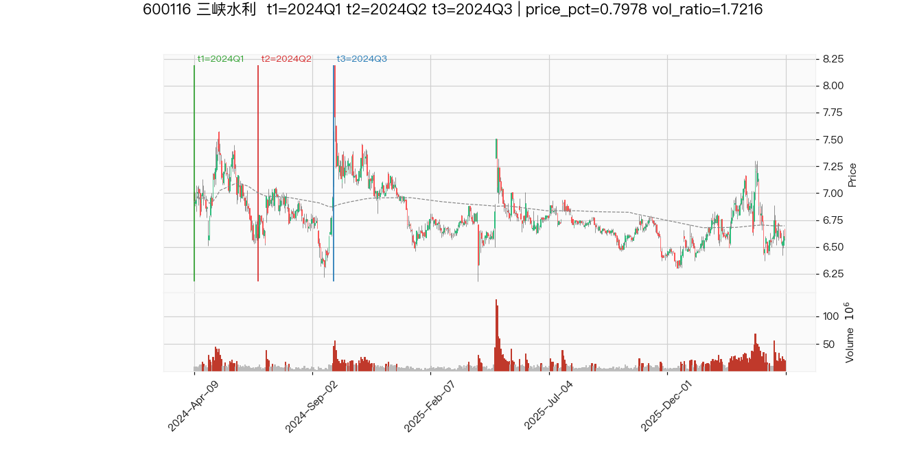

#### 🔍 检测依据 — 600116 三峡水利
> 最佳 triple: **2024Q1 → 2024Q2 → 2024Q3** ｜ B 触发: price_pct=0.80 vol_ratio=1.72 ｜ 候选 triple 数: 2

#### 📊 港中结持仓节奏 — 600116 三峡水利

| 季度     |   持股量(万股) |   持股市值(亿) |
|:-------|----------:|----------:|
| 2022Q4 |     697.2 |      0.6  |
| 2023Q1 |    1200.6 |      1.08 |
| 2023Q2 |    1343.1 |      1.22 |
| 2023Q3 |    1154.7 |      0.89 |
| 2023Q4 |    1501.9 |      1.13 |
| 2024Q1 |    1849.7 |      1.31 |
| 2024Q2 |    1300.1 |      0.9  |
| 2024Q3 |    1560.2 |      1.09 |

#### ✍️ 人工复盘 — 600116 三峡水利

| 检查项 | 结果 |
|--------|------|
| t2 季度价格在近 250 日高位区间（视觉） | ⬜ |
| t2 季度出现明显放量 bar（红色高量） | ⬜ |
| t3 季度买回后股价未大幅上涨（非卖飞） | ⬜ |
| t1→t2→t3 三段节奏符合「建仓→出货→再建仓」 | ⬜ |

**决策**: ⬜ PASS（纳入关注名单）　⬜ REJECT（假信号）

**备注**: _（人工填写）_

### 301153 中科江南 K 线 + 成交量
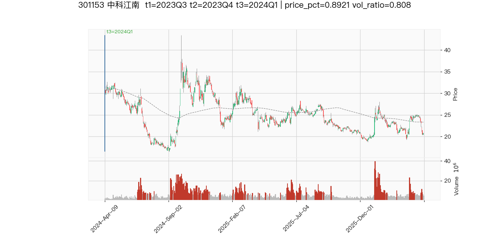

#### 🔍 检测依据 — 301153 中科江南
> 最佳 triple: **2023Q3 → 2023Q4 → 2024Q1** ｜ B 触发: price_pct=0.89 vol_ratio=0.81 ｜ 候选 triple 数: 1

#### 📊 港中结持仓节奏 — 301153 中科江南

| 季度     |   持股量(万股) |   持股市值(亿) |
|:-------|----------:|----------:|
| 2023Q1 |      10.6 |      0.14 |
| 2023Q2 |      63.7 |      0.48 |
| 2023Q3 |     111.3 |      0.68 |
| 2023Q4 |      78.7 |      0.62 |
| 2024Q1 |     146.3 |      0.9  |
| 2024Q2 |     191   |      0.54 |
| 2024Q3 |     329.5 |      0.61 |

#### ✍️ 人工复盘 — 301153 中科江南

| 检查项 | 结果 |
|--------|------|
| t2 季度价格在近 250 日高位区间（视觉） | ⬜ |
| t2 季度出现明显放量 bar（红色高量） | ⬜ |
| t3 季度买回后股价未大幅上涨（非卖飞） | ⬜ |
| t1→t2→t3 三段节奏符合「建仓→出货→再建仓」 | ⬜ |

**决策**: ⬜ PASS（纳入关注名单）　⬜ REJECT（假信号）

**备注**: _（人工填写）_

### 603638 艾迪精密 K 线 + 成交量
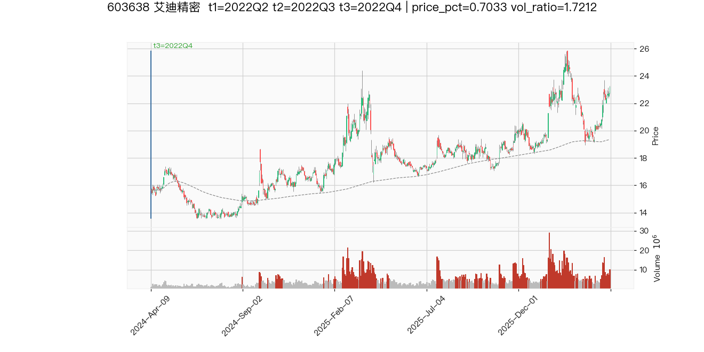

#### 🔍 检测依据 — 603638 艾迪精密
> 最佳 triple: **2022Q2 → 2022Q3 → 2022Q4** ｜ B 触发: price_pct=0.70 vol_ratio=1.72 ｜ 候选 triple 数: 3

#### 📊 港中结持仓节奏 — 603638 艾迪精密

| 季度     |   持股量(万股) |   持股市值(亿) |
|:-------|----------:|----------:|
| 2022Q4 |     505.5 |      0.75 |
| 2023Q1 |     394.5 |      0.71 |
| 2023Q2 |     424.6 |      0.88 |
| 2023Q3 |     398.2 |      0.71 |
| 2023Q4 |     530.8 |      0.86 |
| 2024Q1 |     571.7 |      0.91 |
| 2024Q2 |     603.8 |      0.85 |
| 2024Q3 |     485.3 |      0.68 |

#### ✍️ 人工复盘 — 603638 艾迪精密

| 检查项 | 结果 |
|--------|------|
| t2 季度价格在近 250 日高位区间（视觉） | ⬜ |
| t2 季度出现明显放量 bar（红色高量） | ⬜ |
| t3 季度买回后股价未大幅上涨（非卖飞） | ⬜ |
| t1→t2→t3 三段节奏符合「建仓→出货→再建仓」 | ⬜ |

**决策**: ⬜ PASS（纳入关注名单）　⬜ REJECT（假信号）

**备注**: _（人工填写）_

### 000885 城发环境 K 线 + 成交量
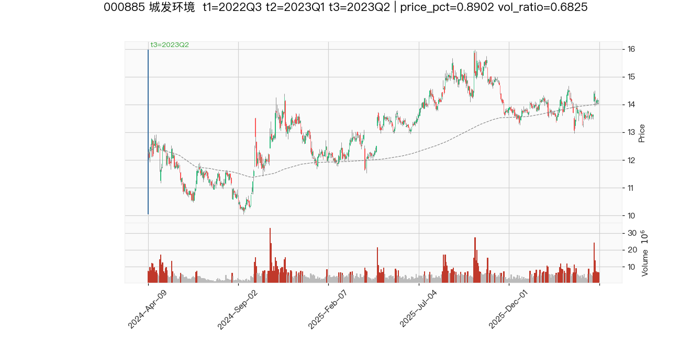

#### 🔍 检测依据 — 000885 城发环境
> 最佳 triple: **2022Q3 → 2023Q1 → 2023Q2** ｜ B 触发: price_pct=0.89 vol_ratio=0.68 ｜ 候选 triple 数: 4

#### 📊 港中结持仓节奏 — 000885 城发环境

| 季度     |   持股量(万股) |   持股市值(亿) |
|:-------|----------:|----------:|
| 2022Q4 |     651.4 |      0.62 |
| 2023Q1 |     503.4 |      0.55 |
| 2023Q2 |    1340.3 |      1.78 |
| 2023Q3 |     698.3 |      0.78 |
| 2023Q4 |     408   |      0.46 |
| 2024Q1 |     554.2 |      0.68 |
| 2024Q2 |     468.9 |      0.57 |
| 2024Q3 |     621.2 |      0.72 |

#### ✍️ 人工复盘 — 000885 城发环境

| 检查项 | 结果 |
|--------|------|
| t2 季度价格在近 250 日高位区间（视觉） | ⬜ |
| t2 季度出现明显放量 bar（红色高量） | ⬜ |
| t3 季度买回后股价未大幅上涨（非卖飞） | ⬜ |
| t1→t2→t3 三段节奏符合「建仓→出货→再建仓」 | ⬜ |

**决策**: ⬜ PASS（纳入关注名单）　⬜ REJECT（假信号）

**备注**: _（人工填写）_

### 002276 万马股份 K 线 + 成交量
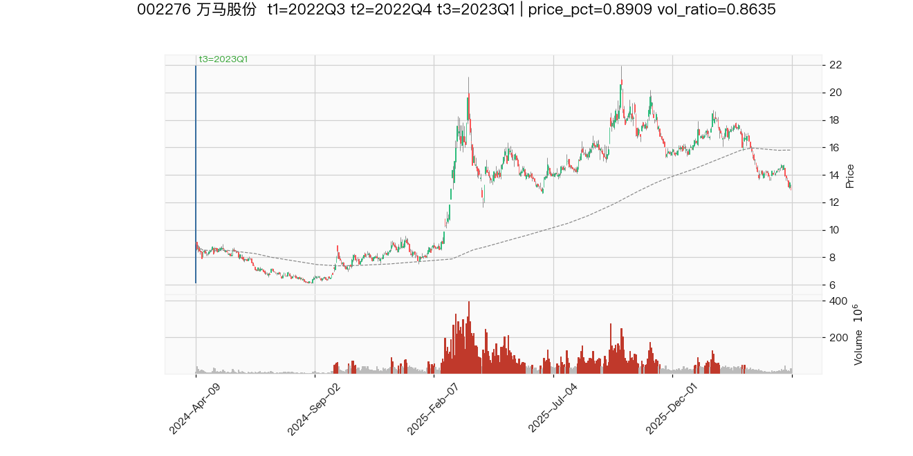

#### 🔍 检测依据 — 002276 万马股份
> 最佳 triple: **2022Q3 → 2022Q4 → 2023Q1** ｜ B 触发: price_pct=0.89 vol_ratio=0.86 ｜ 候选 triple 数: 1

#### 📊 港中结持仓节奏 — 002276 万马股份

| 季度     |   持股量(万股) |   持股市值(亿) |
|:-------|----------:|----------:|
| 2022Q4 |     743   |      0.61 |
| 2023Q1 |    1104.2 |      1.12 |
| 2023Q2 |    1467.8 |      1.72 |
| 2023Q3 |    1549.3 |      1.65 |
| 2023Q4 |    1537.5 |      1.57 |
| 2024Q1 |    2603.4 |      2.34 |
| 2024Q2 |    2379.8 |      1.71 |
| 2024Q3 |    2256.9 |      1.44 |

#### ✍️ 人工复盘 — 002276 万马股份

| 检查项 | 结果 |
|--------|------|
| t2 季度价格在近 250 日高位区间（视觉） | ⬜ |
| t2 季度出现明显放量 bar（红色高量） | ⬜ |
| t3 季度买回后股价未大幅上涨（非卖飞） | ⬜ |
| t1→t2→t3 三段节奏符合「建仓→出货→再建仓」 | ⬜ |

**决策**: ⬜ PASS（纳入关注名单）　⬜ REJECT（假信号）

**备注**: _（人工填写）_

### 002345 潮宏基 K 线 + 成交量
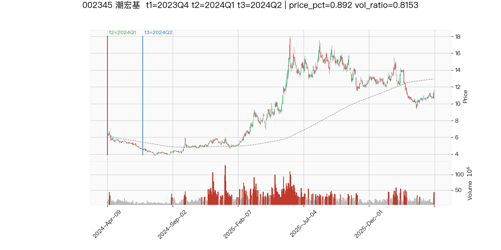

#### 🔍 检测依据 — 002345 潮宏基
> 最佳 triple: **2023Q4 → 2024Q1 → 2024Q2** ｜ B 触发: price_pct=0.89 vol_ratio=0.82 ｜ 候选 triple 数: 1

#### 📊 港中结持仓节奏 — 002345 潮宏基

| 季度     |   持股量(万股) |   持股市值(亿) |
|:-------|----------:|----------:|
| 2022Q4 |       2.9 |      0    |
| 2023Q1 |       2.9 |      0    |
| 2023Q2 |     384.1 |      0.3  |
| 2023Q3 |     534.7 |      0.36 |
| 2023Q4 |    2770.4 |      1.89 |
| 2024Q1 |    2292.4 |      1.46 |
| 2024Q2 |    2735.7 |      1.29 |
| 2024Q3 |    2662.9 |      1.12 |

#### ✍️ 人工复盘 — 002345 潮宏基

| 检查项 | 结果 |
|--------|------|
| t2 季度价格在近 250 日高位区间（视觉） | ⬜ |
| t2 季度出现明显放量 bar（红色高量） | ⬜ |
| t3 季度买回后股价未大幅上涨（非卖飞） | ⬜ |
| t1→t2→t3 三段节奏符合「建仓→出货→再建仓」 | ⬜ |

**决策**: ⬜ PASS（纳入关注名单）　⬜ REJECT（假信号）

**备注**: _（人工填写）_

### 002238 天威视讯 K 线 + 成交量
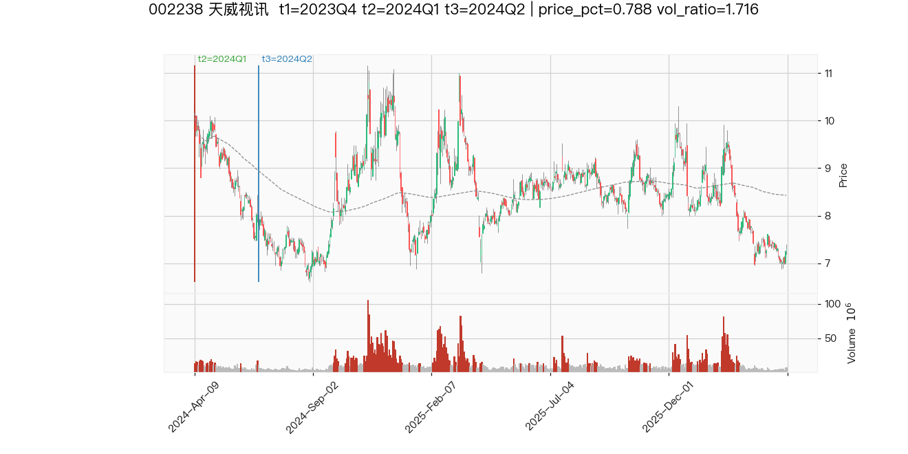

#### 🔍 检测依据 — 002238 天威视讯
> 最佳 triple: **2023Q4 → 2024Q1 → 2024Q2** ｜ B 触发: price_pct=0.79 vol_ratio=1.72 ｜ 候选 triple 数: 3

#### 📊 港中结持仓节奏 — 002238 天威视讯

| 季度     |   持股量(万股) |   持股市值(亿) |
|:-------|----------:|----------:|
| 2022Q4 |       0.6 |      0    |
| 2023Q1 |     385.3 |      0.31 |
| 2023Q2 |     353.1 |      0.24 |
| 2023Q3 |     183.7 |      0.12 |
| 2023Q4 |     451.2 |      0.7  |
| 2024Q1 |     421.6 |      0.49 |
| 2024Q2 |     682.7 |      0.54 |
| 2024Q3 |    1126.3 |      0.84 |

#### ✍️ 人工复盘 — 002238 天威视讯

| 检查项 | 结果 |
|--------|------|
| t2 季度价格在近 250 日高位区间（视觉） | ⬜ |
| t2 季度出现明显放量 bar（红色高量） | ⬜ |
| t3 季度买回后股价未大幅上涨（非卖飞） | ⬜ |
| t1→t2→t3 三段节奏符合「建仓→出货→再建仓」 | ⬜ |

**决策**: ⬜ PASS（纳入关注名单）　⬜ REJECT（假信号）

**备注**: _（人工填写）_

### 002243 力合科创 K 线 + 成交量
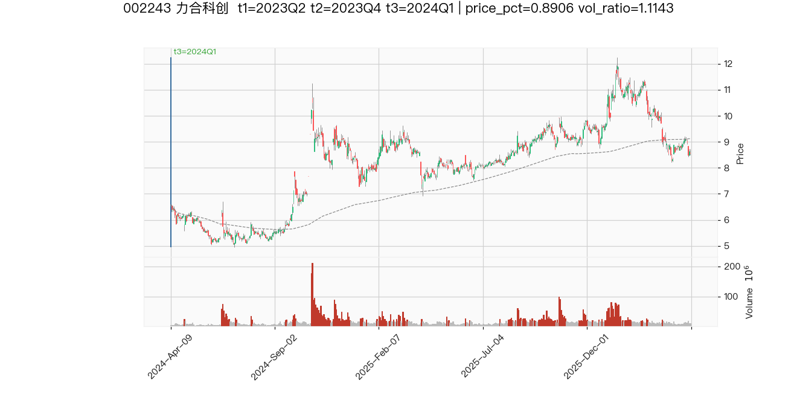

#### 🔍 检测依据 — 002243 力合科创
> 最佳 triple: **2023Q2 → 2023Q4 → 2024Q1** ｜ B 触发: price_pct=0.89 vol_ratio=1.11 ｜ 候选 triple 数: 2

#### 📊 港中结持仓节奏 — 002243 力合科创

| 季度     |   持股量(万股) |   持股市值(亿) |
|:-------|----------:|----------:|
| 2022Q4 |     597.2 |      0.46 |
| 2023Q1 |     693   |      0.63 |
| 2023Q2 |     918.6 |      0.77 |
| 2023Q3 |     945   |      0.81 |
| 2023Q4 |     717   |      0.57 |
| 2024Q1 |     798.8 |      0.54 |
| 2024Q2 |     666.2 |      0.37 |
| 2024Q3 |     742.1 |      0.41 |

#### ✍️ 人工复盘 — 002243 力合科创

| 检查项 | 结果 |
|--------|------|
| t2 季度价格在近 250 日高位区间（视觉） | ⬜ |
| t2 季度出现明显放量 bar（红色高量） | ⬜ |
| t3 季度买回后股价未大幅上涨（非卖飞） | ⬜ |
| t1→t2→t3 三段节奏符合「建仓→出货→再建仓」 | ⬜ |

**决策**: ⬜ PASS（纳入关注名单）　⬜ REJECT（假信号）

**备注**: _（人工填写）_

### 002741 光华科技 K 线 + 成交量
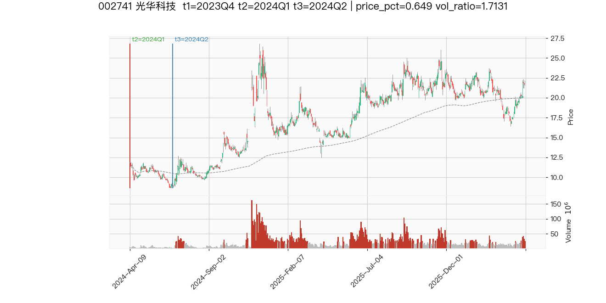

#### 🔍 检测依据 — 002741 光华科技
> 最佳 triple: **2023Q4 → 2024Q1 → 2024Q2** ｜ B 触发: price_pct=0.65 vol_ratio=1.71 ｜ 候选 triple 数: 1

#### 📊 港中结持仓节奏 — 002741 光华科技

| 季度     |   持股量(万股) |   持股市值(亿) |
|:-------|----------:|----------:|
| 2023Q1 |     436.4 |      0.83 |
| 2023Q2 |     395.3 |      0.63 |
| 2023Q3 |     373.4 |      0.54 |
| 2023Q4 |     507.8 |      0.76 |
| 2024Q1 |     416.3 |      0.47 |
| 2024Q2 |     466.5 |      0.42 |
| 2024Q3 |     546.2 |      0.55 |

#### ✍️ 人工复盘 — 002741 光华科技

| 检查项 | 结果 |
|--------|------|
| t2 季度价格在近 250 日高位区间（视觉） | ⬜ |
| t2 季度出现明显放量 bar（红色高量） | ⬜ |
| t3 季度买回后股价未大幅上涨（非卖飞） | ⬜ |
| t1→t2→t3 三段节奏符合「建仓→出货→再建仓」 | ⬜ |

**决策**: ⬜ PASS（纳入关注名单）　⬜ REJECT（假信号）

**备注**: _（人工填写）_

### 601921 浙版传媒 K 线 + 成交量
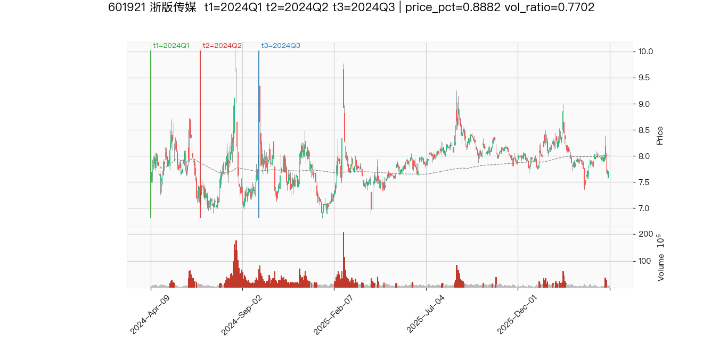

#### 🔍 检测依据 — 601921 浙版传媒
> 最佳 triple: **2024Q1 → 2024Q2 → 2024Q3** ｜ B 触发: price_pct=0.89 vol_ratio=0.77 ｜ 候选 triple 数: 1

#### 📊 港中结持仓节奏 — 601921 浙版传媒

| 季度     |   持股量(万股) |   持股市值(亿) |
|:-------|----------:|----------:|
| 2023Q2 |     825.9 |      0.72 |
| 2023Q3 |    1312.8 |      1.04 |
| 2023Q4 |    3172.2 |      2.42 |
| 2024Q1 |    5439.9 |      4.84 |
| 2024Q2 |    3720.8 |      2.84 |
| 2024Q3 |    3916.3 |      3.37 |

#### ✍️ 人工复盘 — 601921 浙版传媒

| 检查项 | 结果 |
|--------|------|
| t2 季度价格在近 250 日高位区间（视觉） | ⬜ |
| t2 季度出现明显放量 bar（红色高量） | ⬜ |
| t3 季度买回后股价未大幅上涨（非卖飞） | ⬜ |
| t1→t2→t3 三段节奏符合「建仓→出货→再建仓」 | ⬜ |

**决策**: ⬜ PASS（纳入关注名单）　⬜ REJECT（假信号）

**备注**: _（人工填写）_

### 300181 佐力药业 K 线 + 成交量
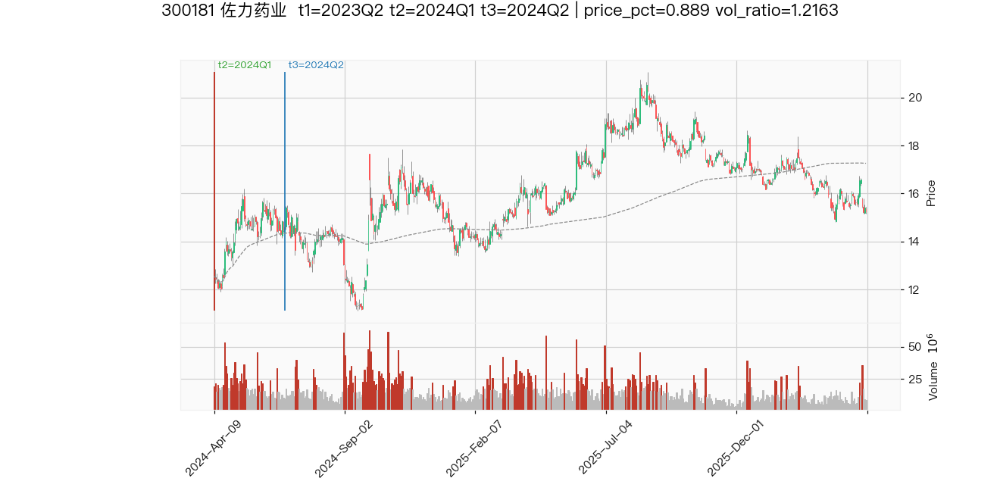

#### 🔍 检测依据 — 300181 佐力药业
> 最佳 triple: **2023Q2 → 2024Q1 → 2024Q2** ｜ B 触发: price_pct=0.89 vol_ratio=1.22 ｜ 候选 triple 数: 1

#### 📊 港中结持仓节奏 — 300181 佐力药业

| 季度     |   持股量(万股) |   持股市值(亿) |
|:-------|----------:|----------:|
| 2023Q1 |     860.2 |      1.29 |
| 2023Q2 |    2609.6 |      3.03 |
| 2023Q3 |     620.4 |      0.68 |
| 2023Q4 |     633.8 |      0.68 |
| 2024Q1 |     328.2 |      0.41 |
| 2024Q2 |     542.9 |      0.82 |
| 2024Q3 |     591.4 |      0.89 |

#### ✍️ 人工复盘 — 300181 佐力药业

| 检查项 | 结果 |
|--------|------|
| t2 季度价格在近 250 日高位区间（视觉） | ⬜ |
| t2 季度出现明显放量 bar（红色高量） | ⬜ |
| t3 季度买回后股价未大幅上涨（非卖飞） | ⬜ |
| t1→t2→t3 三段节奏符合「建仓→出货→再建仓」 | ⬜ |

**决策**: ⬜ PASS（纳入关注名单）　⬜ REJECT（假信号）

**备注**: _（人工填写）_

### 300244 迪安诊断 K 线 + 成交量
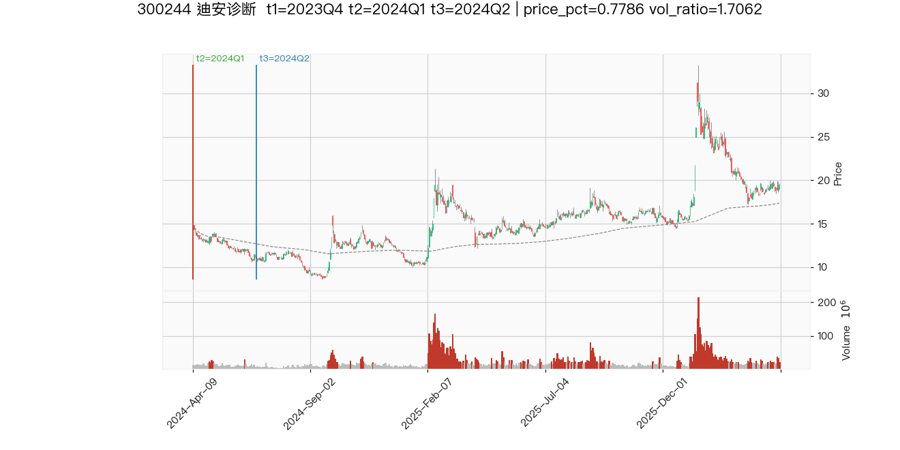

#### 🔍 检测依据 — 300244 迪安诊断
> 最佳 triple: **2023Q4 → 2024Q1 → 2024Q2** ｜ B 触发: price_pct=0.78 vol_ratio=1.71 ｜ 候选 triple 数: 1

#### 📊 港中结持仓节奏 — 300244 迪安诊断

| 季度     |   持股量(万股) |   持股市值(亿) |
|:-------|----------:|----------:|
| 2022Q4 |    4820.4 |     12.11 |
| 2023Q1 |    4958.9 |     14.21 |
| 2023Q2 |    4018.9 |     10.3  |
| 2023Q3 |    4036   |      9.48 |
| 2023Q4 |    4630.9 |     11.03 |
| 2024Q1 |    2916.7 |      5.18 |
| 2024Q2 |    3151.9 |      3.78 |
| 2024Q3 |    3419.9 |      4.25 |

#### ✍️ 人工复盘 — 300244 迪安诊断

| 检查项 | 结果 |
|--------|------|
| t2 季度价格在近 250 日高位区间（视觉） | ⬜ |
| t2 季度出现明显放量 bar（红色高量） | ⬜ |
| t3 季度买回后股价未大幅上涨（非卖飞） | ⬜ |
| t1→t2→t3 三段节奏符合「建仓→出货→再建仓」 | ⬜ |

**决策**: ⬜ PASS（纳入关注名单）　⬜ REJECT（假信号）

**备注**: _（人工填写）_

### 600022 山东钢铁 K 线 + 成交量
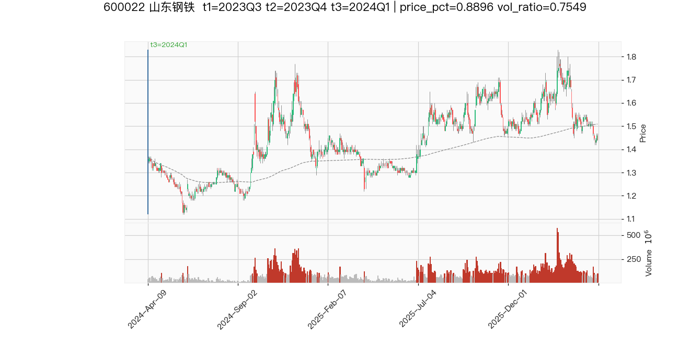

#### 🔍 检测依据 — 600022 山东钢铁
> 最佳 triple: **2023Q3 → 2023Q4 → 2024Q1** ｜ B 触发: price_pct=0.89 vol_ratio=0.75 ｜ 候选 triple 数: 1

#### 📊 港中结持仓节奏 — 600022 山东钢铁

| 季度     |   持股量(万股) |   持股市值(亿) |
|:-------|----------:|----------:|
| 2023Q1 |     679.9 |      0.1  |
| 2023Q2 |    1338.4 |      0.19 |
| 2023Q3 |    2971.1 |      0.43 |
| 2023Q4 |    2481.8 |      0.34 |
| 2024Q1 |    3318   |      0.44 |
| 2024Q2 |    3293.4 |      0.4  |
| 2024Q3 |    2835.2 |      0.36 |

#### ✍️ 人工复盘 — 600022 山东钢铁

| 检查项 | 结果 |
|--------|------|
| t2 季度价格在近 250 日高位区间（视觉） | ⬜ |
| t2 季度出现明显放量 bar（红色高量） | ⬜ |
| t3 季度买回后股价未大幅上涨（非卖飞） | ⬜ |
| t1→t2→t3 三段节奏符合「建仓→出货→再建仓」 | ⬜ |

**决策**: ⬜ PASS（纳入关注名单）　⬜ REJECT（假信号）

**备注**: _（人工填写）_

### 600017 日照港 K 线 + 成交量
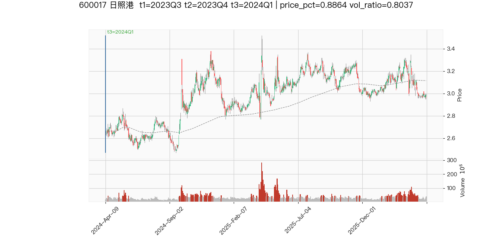

#### 🔍 检测依据 — 600017 日照港
> 最佳 triple: **2023Q3 → 2023Q4 → 2024Q1** ｜ B 触发: price_pct=0.89 vol_ratio=0.80 ｜ 候选 triple 数: 1

#### 📊 港中结持仓节奏 — 600017 日照港

| 季度     |   持股量(万股) |   持股市值(亿) |
|:-------|----------:|----------:|
| 2022Q4 |     154.8 |      0.04 |
| 2023Q1 |     473.5 |      0.13 |
| 2023Q2 |    1110.2 |      0.33 |
| 2023Q3 |    2948.9 |      0.88 |
| 2023Q4 |    1009.3 |      0.28 |
| 2024Q1 |    2102.7 |      0.58 |
| 2024Q2 |    2640.6 |      0.71 |
| 2024Q3 |    4781.8 |      1.35 |

#### ✍️ 人工复盘 — 600017 日照港

| 检查项 | 结果 |
|--------|------|
| t2 季度价格在近 250 日高位区间（视觉） | ⬜ |
| t2 季度出现明显放量 bar（红色高量） | ⬜ |
| t3 季度买回后股价未大幅上涨（非卖飞） | ⬜ |
| t1→t2→t3 三段节奏符合「建仓→出货→再建仓」 | ⬜ |

**决策**: ⬜ PASS（纳入关注名单）　⬜ REJECT（假信号）

**备注**: _（人工填写）_

### 601886 江河集团 K 线 + 成交量
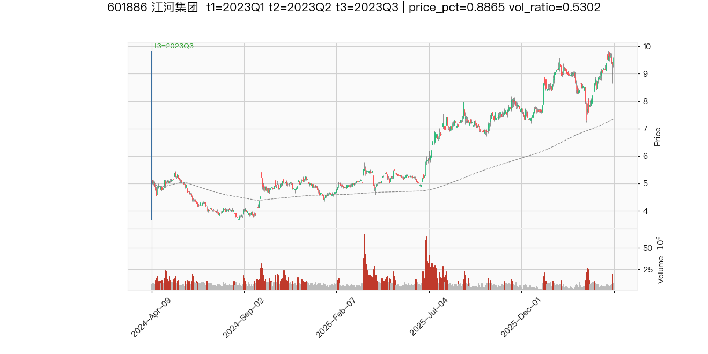

#### 🔍 检测依据 — 601886 江河集团
> 最佳 triple: **2023Q1 → 2023Q2 → 2023Q3** ｜ B 触发: price_pct=0.89 vol_ratio=0.53 ｜ 候选 triple 数: 2

#### 📊 港中结持仓节奏 — 601886 江河集团

| 季度     |   持股量(万股) |   持股市值(亿) |
|:-------|----------:|----------:|
| 2022Q4 |      66.1 |      0.05 |
| 2023Q1 |     267.9 |      0.19 |
| 2023Q2 |     205.7 |      0.18 |
| 2023Q3 |     741.3 |      0.57 |
| 2023Q4 |     362.3 |      0.24 |
| 2024Q1 |    1001.3 |      0.64 |
| 2024Q2 |    1499   |      0.73 |
| 2024Q3 |    1794.2 |      0.82 |

#### ✍️ 人工复盘 — 601886 江河集团

| 检查项 | 结果 |
|--------|------|
| t2 季度价格在近 250 日高位区间（视觉） | ⬜ |
| t2 季度出现明显放量 bar（红色高量） | ⬜ |
| t3 季度买回后股价未大幅上涨（非卖飞） | ⬜ |
| t1→t2→t3 三段节奏符合「建仓→出货→再建仓」 | ⬜ |

**决策**: ⬜ PASS（纳入关注名单）　⬜ REJECT（假信号）

**备注**: _（人工填写）_

### 600975 新五丰 K 线 + 成交量
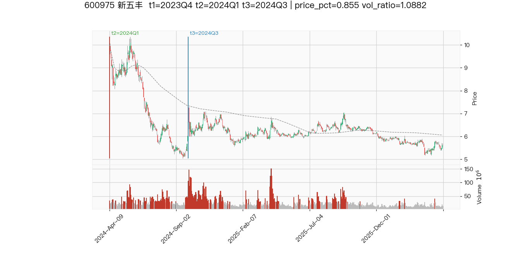

#### 🔍 检测依据 — 600975 新五丰
> 最佳 triple: **2023Q4 → 2024Q1 → 2024Q3** ｜ B 触发: price_pct=0.85 vol_ratio=1.09 ｜ t2 后 60 日收益: 6.4% ｜ 候选 triple 数: 2

#### 📊 港中结持仓节奏 — 600975 新五丰

| 季度     |   持股量(万股) |   持股市值(亿) |
|:-------|----------:|----------:|
| 2023Q1 |     572.5 |      0.57 |
| 2023Q2 |     776.7 |      0.75 |
| 2023Q3 |     212.3 |      0.19 |
| 2023Q4 |    1129.6 |      1.18 |
| 2024Q1 |     481.6 |      0.44 |
| 2024Q2 |     494.4 |      0.35 |
| 2024Q3 |     827.6 |      0.5  |

#### ✍️ 人工复盘 — 600975 新五丰

| 检查项 | 结果 |
|--------|------|
| t2 季度价格在近 250 日高位区间（视觉） | ⬜ |
| t2 季度出现明显放量 bar（红色高量） | ⬜ |
| t3 季度买回后股价未大幅上涨（非卖飞） | ⬜ |
| t1→t2→t3 三段节奏符合「建仓→出货→再建仓」 | ⬜ |

**决策**: ⬜ PASS（纳入关注名单）　⬜ REJECT（假信号）

**备注**: _（人工填写）_

### 300705 九典制药 K 线 + 成交量
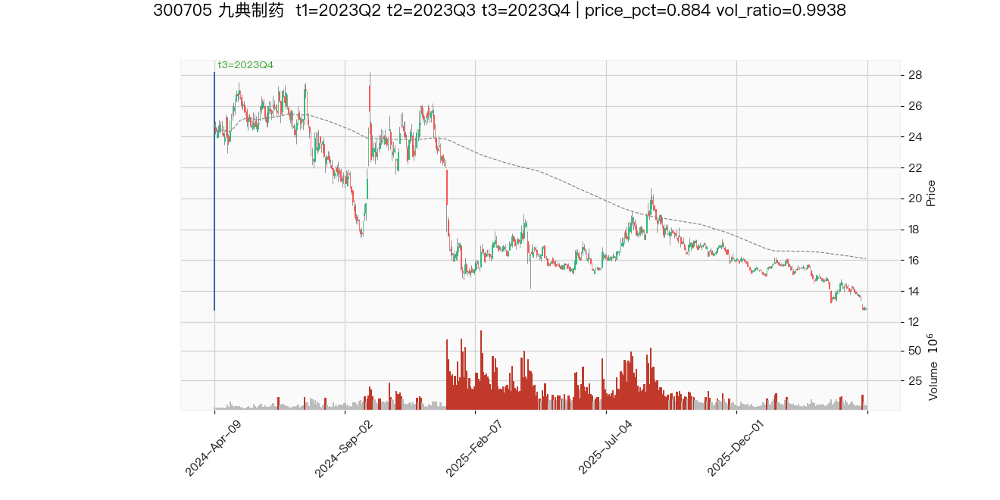

#### 🔍 检测依据 — 300705 九典制药
> 最佳 triple: **2023Q2 → 2023Q3 → 2023Q4** ｜ B 触发: price_pct=0.88 vol_ratio=0.99 ｜ 候选 triple 数: 2

#### 📊 港中结持仓节奏 — 300705 九典制药

| 季度     |   持股量(万股) |   持股市值(亿) |
|:-------|----------:|----------:|
| 2023Q1 |      95.6 |      0.27 |
| 2023Q2 |     132.1 |      0.34 |
| 2023Q3 |     107   |      0.25 |
| 2023Q4 |     386.8 |      1.29 |
| 2024Q1 |     140.2 |      0.54 |
| 2024Q2 |     247.4 |      0.66 |
| 2024Q3 |     322.7 |      0.73 |

#### ✍️ 人工复盘 — 300705 九典制药

| 检查项 | 结果 |
|--------|------|
| t2 季度价格在近 250 日高位区间（视觉） | ⬜ |
| t2 季度出现明显放量 bar（红色高量） | ⬜ |
| t3 季度买回后股价未大幅上涨（非卖飞） | ⬜ |
| t1→t2→t3 三段节奏符合「建仓→出货→再建仓」 | ⬜ |

**决策**: ⬜ PASS（纳入关注名单）　⬜ REJECT（假信号）

**备注**: _（人工填写）_

### 600877 电科芯片 K 线 + 成交量
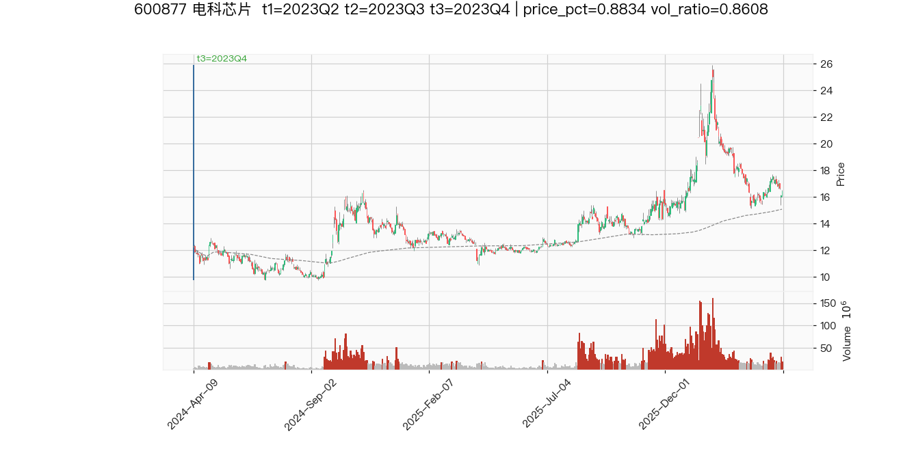

#### 🔍 检测依据 — 600877 电科芯片
> 最佳 triple: **2023Q2 → 2023Q3 → 2023Q4** ｜ B 触发: price_pct=0.88 vol_ratio=0.86 ｜ 候选 triple 数: 1

#### 📊 港中结持仓节奏 — 600877 电科芯片

| 季度     |   持股量(万股) |   持股市值(亿) |
|:-------|----------:|----------:|
| 2023Q1 |     195.7 |      0.32 |
| 2023Q2 |     295.6 |      0.44 |
| 2023Q3 |     195.1 |      0.27 |
| 2023Q4 |     318.8 |      0.45 |
| 2024Q1 |     574.1 |      0.71 |
| 2024Q2 |     589.6 |      0.63 |
| 2024Q3 |     481.5 |      0.51 |

#### ✍️ 人工复盘 — 600877 电科芯片

| 检查项 | 结果 |
|--------|------|
| t2 季度价格在近 250 日高位区间（视觉） | ⬜ |
| t2 季度出现明显放量 bar（红色高量） | ⬜ |
| t3 季度买回后股价未大幅上涨（非卖飞） | ⬜ |
| t1→t2→t3 三段节奏符合「建仓→出货→再建仓」 | ⬜ |

**决策**: ⬜ PASS（纳入关注名单）　⬜ REJECT（假信号）

**备注**: _（人工填写）_

### 600787 中储股份 K 线 + 成交量
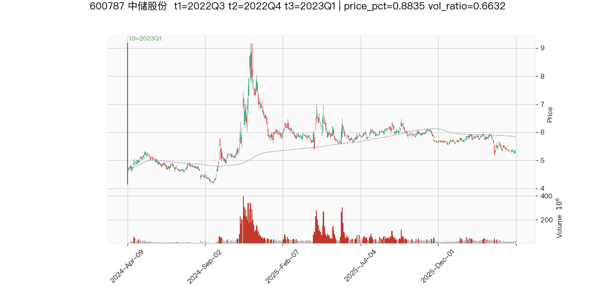

#### 🔍 检测依据 — 600787 中储股份
> 最佳 triple: **2022Q3 → 2022Q4 → 2023Q1** ｜ B 触发: price_pct=0.88 vol_ratio=0.66 ｜ 候选 triple 数: 2

#### 📊 港中结持仓节奏 — 600787 中储股份

| 季度     |   持股量(万股) |   持股市值(亿) |
|:-------|----------:|----------:|
| 2022Q4 |    4367.1 |      2.17 |
| 2023Q1 |    5010.5 |      2.65 |
| 2023Q2 |    3887.3 |      2.07 |
| 2023Q3 |    2238.2 |      1.19 |
| 2023Q4 |    2324.9 |      1.19 |
| 2024Q1 |    2737.3 |      1.3  |
| 2024Q2 |    3623   |      1.74 |
| 2024Q3 |    3249   |      1.55 |

#### ✍️ 人工复盘 — 600787 中储股份

| 检查项 | 结果 |
|--------|------|
| t2 季度价格在近 250 日高位区间（视觉） | ⬜ |
| t2 季度出现明显放量 bar（红色高量） | ⬜ |
| t3 季度买回后股价未大幅上涨（非卖飞） | ⬜ |
| t1→t2→t3 三段节奏符合「建仓→出货→再建仓」 | ⬜ |

**决策**: ⬜ PASS（纳入关注名单）　⬜ REJECT（假信号）

**备注**: _（人工填写）_

### 603305 旭升集团 K 线 + 成交量
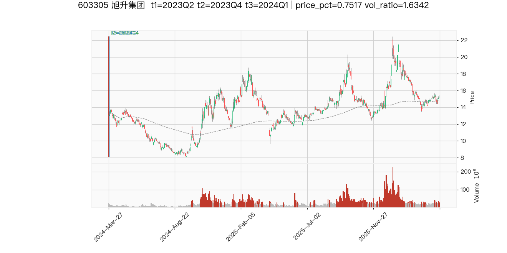

#### 🔍 检测依据 — 603305 旭升集团
> 最佳 triple: **2023Q2 → 2023Q4 → 2024Q1** ｜ B 触发: price_pct=0.75 vol_ratio=1.63 ｜ 候选 triple 数: 5

#### 📊 港中结持仓节奏 — 603305 旭升集团

| 季度     |   持股量(万股) |   持股市值(亿) |
|:-------|----------:|----------:|
| 2022Q4 |     854.1 |      2.75 |
| 2023Q1 |     518   |      2.02 |
| 2023Q2 |    1193.3 |      3.3  |
| 2023Q3 |     848.2 |      1.99 |
| 2023Q4 |     748.7 |      1.48 |
| 2024Q1 |     905.3 |      1.25 |
| 2024Q2 |     698.2 |      0.74 |
| 2024Q3 |     931   |      0.84 |

#### ✍️ 人工复盘 — 603305 旭升集团

| 检查项 | 结果 |
|--------|------|
| t2 季度价格在近 250 日高位区间（视觉） | ⬜ |
| t2 季度出现明显放量 bar（红色高量） | ⬜ |
| t3 季度买回后股价未大幅上涨（非卖飞） | ⬜ |
| t1→t2→t3 三段节奏符合「建仓→出货→再建仓」 | ⬜ |

**决策**: ⬜ PASS（纳入关注名单）　⬜ REJECT（假信号）

**备注**: _（人工填写）_

### 600959 江苏有线 K 线 + 成交量
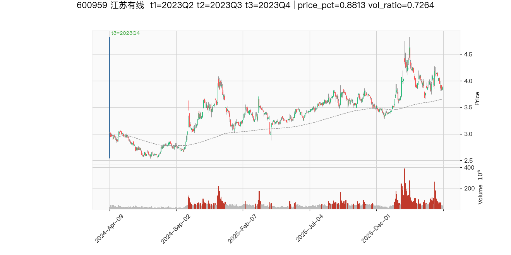

#### 🔍 检测依据 — 600959 江苏有线
> 最佳 triple: **2023Q2 → 2023Q3 → 2023Q4** ｜ B 触发: price_pct=0.88 vol_ratio=0.73 ｜ 候选 triple 数: 3

#### 📊 港中结持仓节奏 — 600959 江苏有线

| 季度     |   持股量(万股) |   持股市值(亿) |
|:-------|----------:|----------:|
| 2022Q4 |       0.1 |      0    |
| 2023Q1 |    1873   |      0.63 |
| 2023Q2 |    2168.1 |      0.73 |
| 2023Q3 |    1875   |      0.6  |
| 2023Q4 |    2541.5 |      0.8  |
| 2024Q1 |    1819.3 |      0.57 |
| 2024Q2 |    1401.4 |      0.37 |
| 2024Q3 |    2270.5 |      0.65 |

#### ✍️ 人工复盘 — 600959 江苏有线

| 检查项 | 结果 |
|--------|------|
| t2 季度价格在近 250 日高位区间（视觉） | ⬜ |
| t2 季度出现明显放量 bar（红色高量） | ⬜ |
| t3 季度买回后股价未大幅上涨（非卖飞） | ⬜ |
| t1→t2→t3 三段节奏符合「建仓→出货→再建仓」 | ⬜ |

**决策**: ⬜ PASS（纳入关注名单）　⬜ REJECT（假信号）

**备注**: _（人工填写）_

### 600552 凯盛科技 K 线 + 成交量
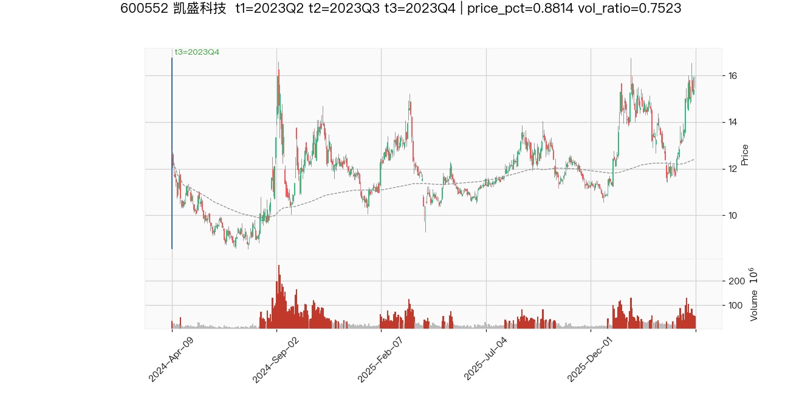

#### 🔍 检测依据 — 600552 凯盛科技
> 最佳 triple: **2023Q2 → 2023Q3 → 2023Q4** ｜ B 触发: price_pct=0.88 vol_ratio=0.75 ｜ 候选 triple 数: 2

#### 📊 港中结持仓节奏 — 600552 凯盛科技

| 季度     |   持股量(万股) |   持股市值(亿) |
|:-------|----------:|----------:|
| 2022Q4 |     161.4 |      0.15 |
| 2023Q1 |     371.4 |      0.43 |
| 2023Q2 |    1165   |      1.38 |
| 2023Q3 |     752   |      0.83 |
| 2023Q4 |    1717.2 |      2.29 |
| 2024Q1 |    1198.4 |      1.5  |
| 2024Q2 |    1333.3 |      1.26 |
| 2024Q3 |     809.7 |      0.81 |

#### ✍️ 人工复盘 — 600552 凯盛科技

| 检查项 | 结果 |
|--------|------|
| t2 季度价格在近 250 日高位区间（视觉） | ⬜ |
| t2 季度出现明显放量 bar（红色高量） | ⬜ |
| t3 季度买回后股价未大幅上涨（非卖飞） | ⬜ |
| t1→t2→t3 三段节奏符合「建仓→出货→再建仓」 | ⬜ |

**决策**: ⬜ PASS（纳入关注名单）　⬜ REJECT（假信号）

**备注**: _（人工填写）_

### 600258 首旅酒店 K 线 + 成交量
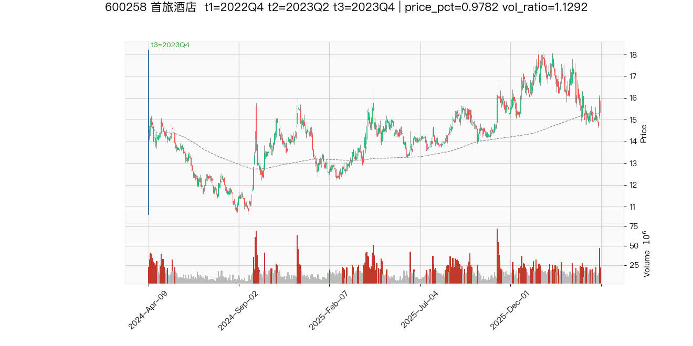

#### 🔍 检测依据 — 600258 首旅酒店
> 最佳 triple: **2022Q4 → 2023Q2 → 2023Q4** ｜ B 触发: price_pct=0.98 vol_ratio=1.13 ｜ t2 后 60 日收益: 10.9% ｜ 候选 triple 数: 1

#### 📊 港中结持仓节奏 — 600258 首旅酒店

| 季度     |   持股量(万股) |   持股市值(亿) |
|:-------|----------:|----------:|
| 2022Q4 |    2570.7 |      6.38 |
| 2023Q1 |    2679.8 |      6.25 |
| 2023Q2 |    1754   |      3.34 |
| 2023Q3 |    1722.3 |      2.97 |
| 2023Q4 |    2238.3 |      3.5  |
| 2024Q1 |    1570.1 |      2.34 |
| 2024Q2 |    1197.8 |      1.48 |
| 2024Q3 |    1200.3 |      1.43 |

#### ✍️ 人工复盘 — 600258 首旅酒店

| 检查项 | 结果 |
|--------|------|
| t2 季度价格在近 250 日高位区间（视觉） | ⬜ |
| t2 季度出现明显放量 bar（红色高量） | ⬜ |
| t3 季度买回后股价未大幅上涨（非卖飞） | ⬜ |
| t1→t2→t3 三段节奏符合「建仓→出货→再建仓」 | ⬜ |

**决策**: ⬜ PASS（纳入关注名单）　⬜ REJECT（假信号）

**备注**: _（人工填写）_

### 300769 德方纳米 K 线 + 成交量
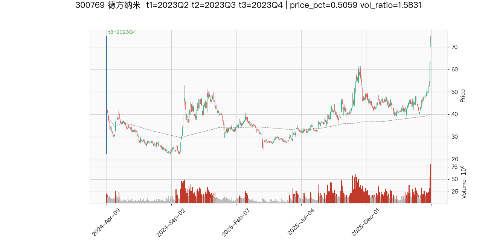

#### 🔍 检测依据 — 300769 德方纳米
> 最佳 triple: **2023Q2 → 2023Q3 → 2023Q4** ｜ B 触发: price_pct=0.51 vol_ratio=1.58 ｜ 候选 triple 数: 1

#### 📊 港中结持仓节奏 — 300769 德方纳米

| 季度     |   持股量(万股) |   持股市值(亿) |
|:-------|----------:|----------:|
| 2023Q1 |     572.6 |     11.05 |
| 2023Q2 |     957.8 |      8.8  |
| 2023Q3 |     694.3 |      5.32 |
| 2023Q4 |    1057.7 |      6.46 |
| 2024Q1 |     736.5 |      2.79 |
| 2024Q2 |     492.7 |      1.39 |
| 2024Q3 |     345   |      0.84 |

#### ✍️ 人工复盘 — 300769 德方纳米

| 检查项 | 结果 |
|--------|------|
| t2 季度价格在近 250 日高位区间（视觉） | ⬜ |
| t2 季度出现明显放量 bar（红色高量） | ⬜ |
| t3 季度买回后股价未大幅上涨（非卖飞） | ⬜ |
| t1→t2→t3 三段节奏符合「建仓→出货→再建仓」 | ⬜ |

**决策**: ⬜ PASS（纳入关注名单）　⬜ REJECT（假信号）

**备注**: _（人工填写）_

### 002440 闰土股份 K 线 + 成交量
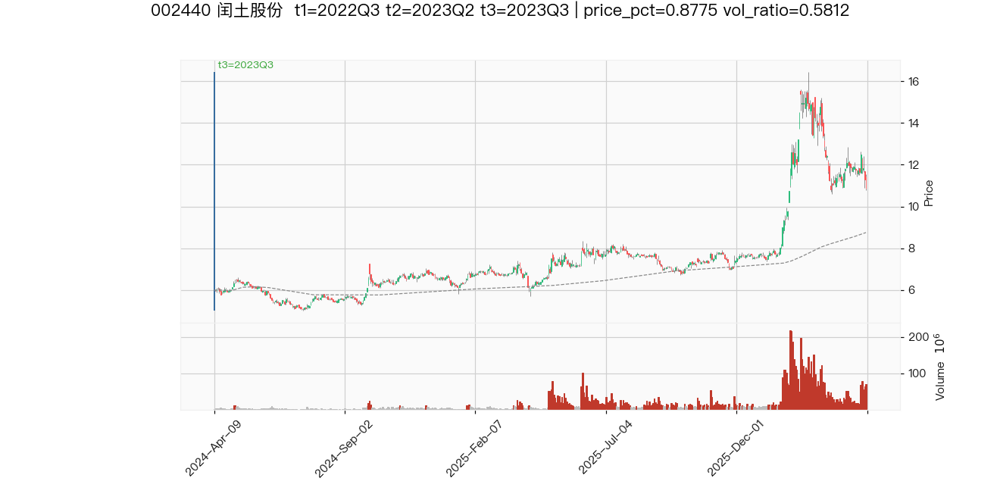

#### 🔍 检测依据 — 002440 闰土股份
> 最佳 triple: **2022Q3 → 2023Q2 → 2023Q3** ｜ B 触发: price_pct=0.88 vol_ratio=0.58 ｜ 候选 triple 数: 4

#### 📊 港中结持仓节奏 — 002440 闰土股份

| 季度     |   持股量(万股) |   持股市值(亿) |
|:-------|----------:|----------:|
| 2022Q4 |    1120.4 |      0.81 |
| 2023Q1 |    1025.5 |      0.79 |
| 2023Q2 |     858.7 |      0.57 |
| 2023Q3 |    1041.4 |      0.73 |
| 2023Q4 |     949.9 |      0.58 |
| 2024Q1 |     886.1 |      0.52 |
| 2024Q2 |    1068   |      0.58 |
| 2024Q3 |     822.4 |      0.47 |

#### ✍️ 人工复盘 — 002440 闰土股份

| 检查项 | 结果 |
|--------|------|
| t2 季度价格在近 250 日高位区间（视觉） | ⬜ |
| t2 季度出现明显放量 bar（红色高量） | ⬜ |
| t3 季度买回后股价未大幅上涨（非卖飞） | ⬜ |
| t1→t2→t3 三段节奏符合「建仓→出货→再建仓」 | ⬜ |

**决策**: ⬜ PASS（纳入关注名单）　⬜ REJECT（假信号）

**备注**: _（人工填写）_

### 688236 春立医疗 K 线 + 成交量
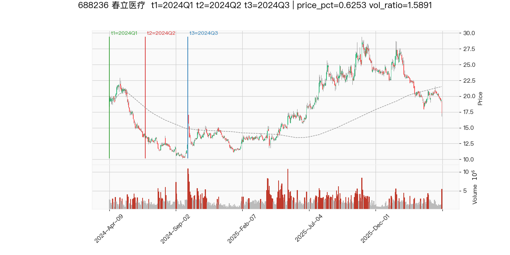

#### 🔍 检测依据 — 688236 春立医疗
> 最佳 triple: **2024Q1 → 2024Q2 → 2024Q3** ｜ B 触发: price_pct=0.63 vol_ratio=1.59 ｜ 候选 triple 数: 1

#### 📊 港中结持仓节奏 — 688236 春立医疗

| 季度     |   持股量(万股) |   持股市值(亿) |
|:-------|----------:|----------:|
| 2022Q4 |      57.9 |      0.14 |
| 2023Q1 |      75.7 |      0.23 |
| 2023Q2 |     154.4 |      0.38 |
| 2023Q3 |     147.1 |      0.37 |
| 2023Q4 |     226.1 |      0.59 |
| 2024Q1 |     264.4 |      0.48 |
| 2024Q2 |     230.1 |      0.33 |
| 2024Q3 |     355.1 |      0.44 |

#### ✍️ 人工复盘 — 688236 春立医疗

| 检查项 | 结果 |
|--------|------|
| t2 季度价格在近 250 日高位区间（视觉） | ⬜ |
| t2 季度出现明显放量 bar（红色高量） | ⬜ |
| t3 季度买回后股价未大幅上涨（非卖飞） | ⬜ |
| t1→t2→t3 三段节奏符合「建仓→出货→再建仓」 | ⬜ |

**决策**: ⬜ PASS（纳入关注名单）　⬜ REJECT（假信号）

**备注**: _（人工填写）_

### 002386 天原股份 K 线 + 成交量
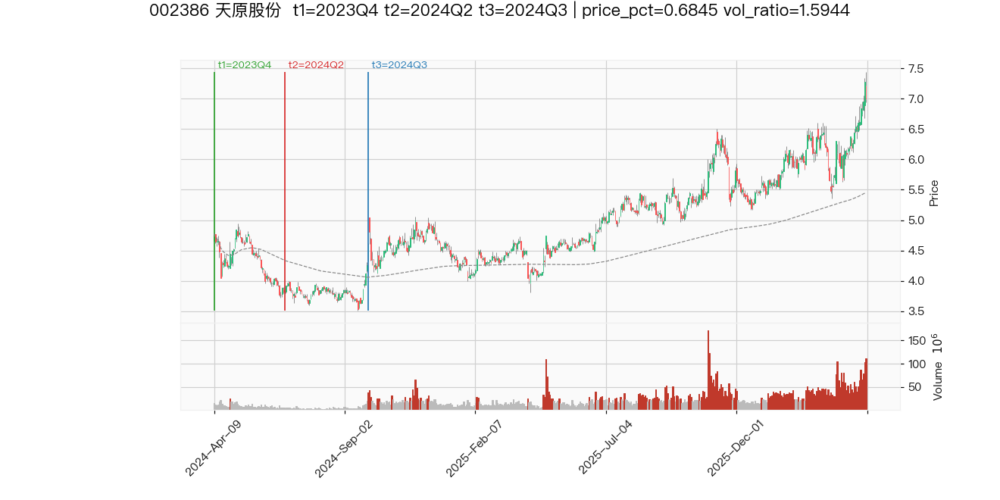

#### 🔍 检测依据 — 002386 天原股份
> 最佳 triple: **2023Q4 → 2024Q2 → 2024Q3** ｜ B 触发: price_pct=0.68 vol_ratio=1.59 ｜ 候选 triple 数: 4

#### 📊 港中结持仓节奏 — 002386 天原股份

| 季度     |   持股量(万股) |   持股市值(亿) |
|:-------|----------:|----------:|
| 2022Q4 |    1432.8 |      0.97 |
| 2023Q1 |     874.5 |      0.62 |
| 2023Q2 |     609.4 |      0.38 |
| 2023Q3 |     558   |      0.31 |
| 2023Q4 |    1187.7 |      0.61 |
| 2024Q1 |     866.8 |      0.38 |
| 2024Q2 |     731.6 |      0.28 |
| 2024Q3 |     815.8 |      0.31 |

#### ✍️ 人工复盘 — 002386 天原股份

| 检查项 | 结果 |
|--------|------|
| t2 季度价格在近 250 日高位区间（视觉） | ⬜ |
| t2 季度出现明显放量 bar（红色高量） | ⬜ |
| t3 季度买回后股价未大幅上涨（非卖飞） | ⬜ |
| t1→t2→t3 三段节奏符合「建仓→出货→再建仓」 | ⬜ |

**决策**: ⬜ PASS（纳入关注名单）　⬜ REJECT（假信号）

**备注**: _（人工填写）_

### 002291 遥望科技 K 线 + 成交量
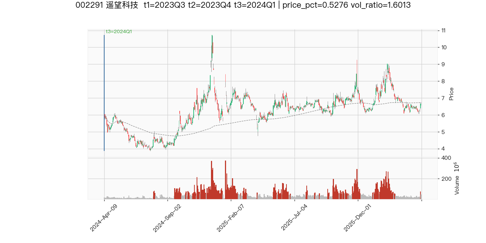

#### 🔍 检测依据 — 002291 遥望科技
> 最佳 triple: **2023Q3 → 2023Q4 → 2024Q1** ｜ B 触发: price_pct=0.53 vol_ratio=1.60 ｜ 候选 triple 数: 1

#### 📊 港中结持仓节奏 — 002291 遥望科技

| 季度     |   持股量(万股) |   持股市值(亿) |
|:-------|----------:|----------:|
| 2023Q1 |     221.5 |      0.34 |
| 2023Q2 |     564.2 |      0.73 |
| 2023Q3 |    1333.2 |      1.3  |
| 2023Q4 |     472.8 |      0.44 |
| 2024Q1 |    2288.3 |      1.53 |
| 2024Q2 |    1545.9 |      0.66 |
| 2024Q3 |    1247.4 |      0.55 |

#### ✍️ 人工复盘 — 002291 遥望科技

| 检查项 | 结果 |
|--------|------|
| t2 季度价格在近 250 日高位区间（视觉） | ⬜ |
| t2 季度出现明显放量 bar（红色高量） | ⬜ |
| t3 季度买回后股价未大幅上涨（非卖飞） | ⬜ |
| t1→t2→t3 三段节奏符合「建仓→出货→再建仓」 | ⬜ |

**决策**: ⬜ PASS（纳入关注名单）　⬜ REJECT（假信号）

**备注**: _（人工填写）_

### 601718 际华集团 K 线 + 成交量
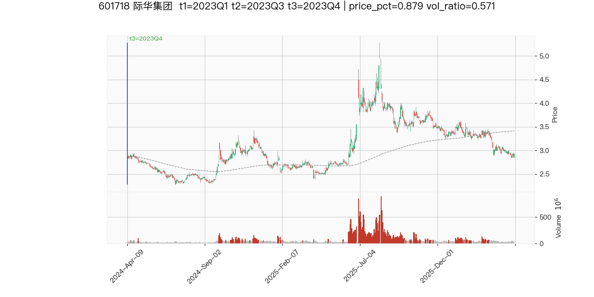

#### 🔍 检测依据 — 601718 际华集团
> 最佳 triple: **2023Q1 → 2023Q3 → 2023Q4** ｜ B 触发: price_pct=0.88 vol_ratio=0.57 ｜ 候选 triple 数: 2

#### 📊 港中结持仓节奏 — 601718 际华集团

| 季度     |   持股量(万股) |   持股市值(亿) |
|:-------|----------:|----------:|
| 2022Q4 |      11.4 |      0    |
| 2023Q1 |     914.1 |      0.3  |
| 2023Q2 |     927.6 |      0.28 |
| 2023Q3 |     671.5 |      0.2  |
| 2023Q4 |     931   |      0.26 |
| 2024Q1 |    1609.2 |      0.45 |
| 2024Q2 |    1231.5 |      0.31 |
| 2024Q3 |    2273   |      0.56 |

#### ✍️ 人工复盘 — 601718 际华集团

| 检查项 | 结果 |
|--------|------|
| t2 季度价格在近 250 日高位区间（视觉） | ⬜ |
| t2 季度出现明显放量 bar（红色高量） | ⬜ |
| t3 季度买回后股价未大幅上涨（非卖飞） | ⬜ |
| t1→t2→t3 三段节奏符合「建仓→出货→再建仓」 | ⬜ |

**决策**: ⬜ PASS（纳入关注名单）　⬜ REJECT（假信号）

**备注**: _（人工填写）_

### 600717 天津港 K 线 + 成交量
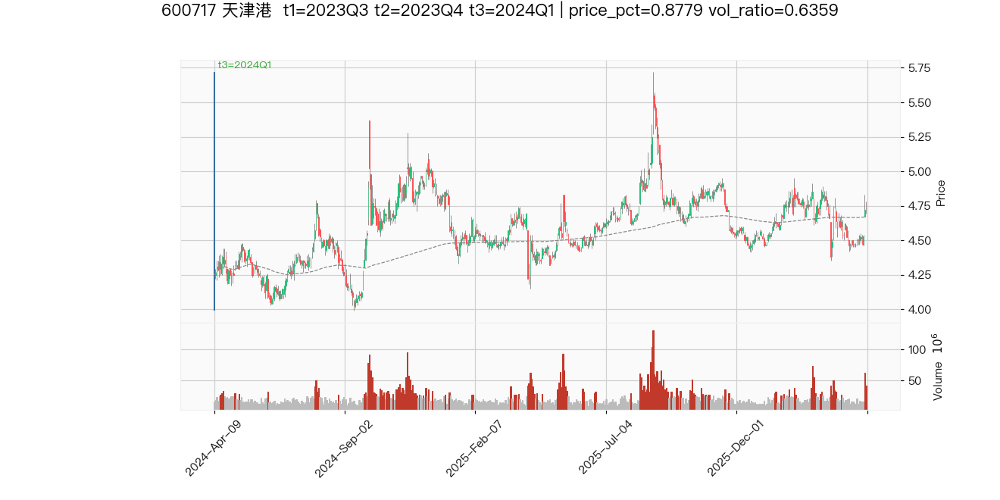

#### 🔍 检测依据 — 600717 天津港
> 最佳 triple: **2023Q3 → 2023Q4 → 2024Q1** ｜ B 触发: price_pct=0.88 vol_ratio=0.64 ｜ 候选 triple 数: 1

#### 📊 港中结持仓节奏 — 600717 天津港

| 季度     |   持股量(万股) |   持股市值(亿) |
|:-------|----------:|----------:|
| 2022Q4 |     139.6 |      0.06 |
| 2023Q1 |     751.5 |      0.31 |
| 2023Q2 |    2698.3 |      1.19 |
| 2023Q3 |    3557.2 |      1.57 |
| 2023Q4 |    2754.5 |      1.13 |
| 2024Q1 |    3899.4 |      1.67 |
| 2024Q2 |    4918.9 |      2.1  |
| 2024Q3 |    7338.7 |      3.36 |

#### ✍️ 人工复盘 — 600717 天津港

| 检查项 | 结果 |
|--------|------|
| t2 季度价格在近 250 日高位区间（视觉） | ⬜ |
| t2 季度出现明显放量 bar（红色高量） | ⬜ |
| t3 季度买回后股价未大幅上涨（非卖飞） | ⬜ |
| t1→t2→t3 三段节奏符合「建仓→出货→再建仓」 | ⬜ |

**决策**: ⬜ PASS（纳入关注名单）　⬜ REJECT（假信号）

**备注**: _（人工填写）_

### 688222 成都先导 K 线 + 成交量
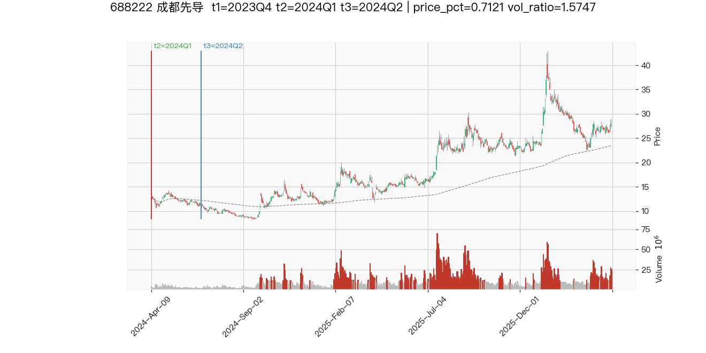

#### 🔍 检测依据 — 688222 成都先导
> 最佳 triple: **2023Q4 → 2024Q1 → 2024Q2** ｜ B 触发: price_pct=0.71 vol_ratio=1.57 ｜ 候选 triple 数: 1

#### 📊 港中结持仓节奏 — 688222 成都先导

| 季度     |   持股量(万股) |   持股市值(亿) |
|:-------|----------:|----------:|
| 2023Q2 |      11.1 |      0.02 |
| 2023Q3 |     179.5 |      0.28 |
| 2023Q4 |     297.8 |      0.45 |
| 2024Q1 |      75.2 |      0.1  |
| 2024Q2 |     114   |      0.13 |
| 2024Q3 |     331.9 |      0.32 |

#### ✍️ 人工复盘 — 688222 成都先导

| 检查项 | 结果 |
|--------|------|
| t2 季度价格在近 250 日高位区间（视觉） | ⬜ |
| t2 季度出现明显放量 bar（红色高量） | ⬜ |
| t3 季度买回后股价未大幅上涨（非卖飞） | ⬜ |
| t1→t2→t3 三段节奏符合「建仓→出货→再建仓」 | ⬜ |

**决策**: ⬜ PASS（纳入关注名单）　⬜ REJECT（假信号）

**备注**: _（人工填写）_

### 002993 奥海科技 K 线 + 成交量
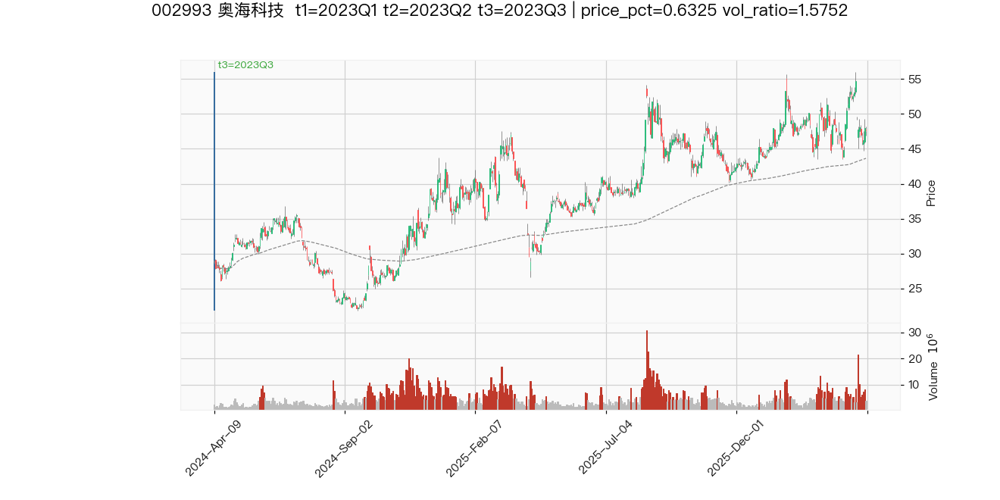

#### 🔍 检测依据 — 002993 奥海科技
> 最佳 triple: **2023Q1 → 2023Q2 → 2023Q3** ｜ B 触发: price_pct=0.63 vol_ratio=1.58 ｜ 候选 triple 数: 4

#### 📊 港中结持仓节奏 — 002993 奥海科技

| 季度     |   持股量(万股) |   持股市值(亿) |
|:-------|----------:|----------:|
| 2022Q4 |      81.7 |      0.28 |
| 2023Q1 |     264.9 |      0.88 |
| 2023Q2 |     127.6 |      0.41 |
| 2023Q3 |     177.6 |      0.65 |
| 2023Q4 |     124.7 |      0.47 |
| 2024Q1 |     200.1 |      0.62 |
| 2024Q2 |     155.9 |      0.58 |
| 2024Q3 |     213.6 |      0.62 |

#### ✍️ 人工复盘 — 002993 奥海科技

| 检查项 | 结果 |
|--------|------|
| t2 季度价格在近 250 日高位区间（视觉） | ⬜ |
| t2 季度出现明显放量 bar（红色高量） | ⬜ |
| t3 季度买回后股价未大幅上涨（非卖飞） | ⬜ |
| t1→t2→t3 三段节奏符合「建仓→出货→再建仓」 | ⬜ |

**决策**: ⬜ PASS（纳入关注名单）　⬜ REJECT（假信号）

**备注**: _（人工填写）_

### 002810 山东赫达 K 线 + 成交量
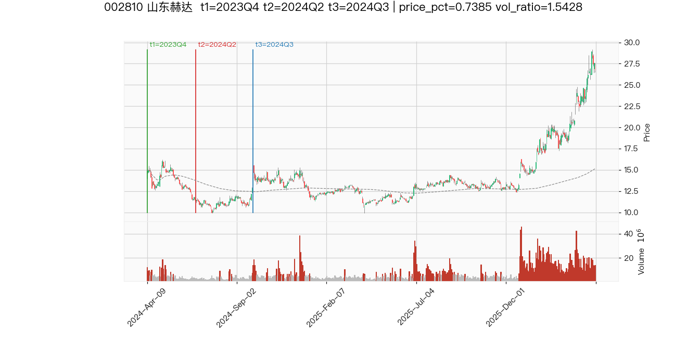

#### 🔍 检测依据 — 002810 山东赫达
> 最佳 triple: **2023Q4 → 2024Q2 → 2024Q3** ｜ B 触发: price_pct=0.74 vol_ratio=1.54 ｜ 候选 triple 数: 2

#### 📊 港中结持仓节奏 — 002810 山东赫达

| 季度     |   持股量(万股) |   持股市值(亿) |
|:-------|----------:|----------:|
| 2022Q4 |    1619.9 |      3.63 |
| 2023Q1 |     487.4 |      1.1  |
| 2023Q2 |     331.8 |      0.6  |
| 2023Q3 |     276.2 |      0.47 |
| 2023Q4 |     299.3 |      0.63 |
| 2024Q1 |     306.6 |      0.43 |
| 2024Q2 |     222.2 |      0.26 |
| 2024Q3 |     283   |      0.31 |

#### ✍️ 人工复盘 — 002810 山东赫达

| 检查项 | 结果 |
|--------|------|
| t2 季度价格在近 250 日高位区间（视觉） | ⬜ |
| t2 季度出现明显放量 bar（红色高量） | ⬜ |
| t3 季度买回后股价未大幅上涨（非卖飞） | ⬜ |
| t1→t2→t3 三段节奏符合「建仓→出货→再建仓」 | ⬜ |

**决策**: ⬜ PASS（纳入关注名单）　⬜ REJECT（假信号）

**备注**: _（人工填写）_

### 002651 利君股份 K 线 + 成交量
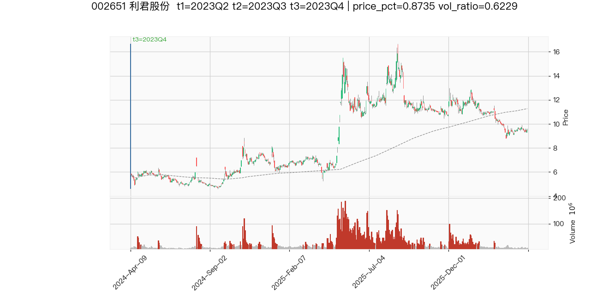

#### 🔍 检测依据 — 002651 利君股份
> 最佳 triple: **2023Q2 → 2023Q3 → 2023Q4** ｜ B 触发: price_pct=0.87 vol_ratio=0.62 ｜ 候选 triple 数: 2

#### 📊 港中结持仓节奏 — 002651 利君股份

| 季度     |   持股量(万股) |   持股市值(亿) |
|:-------|----------:|----------:|
| 2022Q4 |     402.7 |      0.26 |
| 2023Q1 |     629   |      0.47 |
| 2023Q2 |    1330.5 |      1.03 |
| 2023Q3 |    1156.6 |      0.91 |
| 2023Q4 |    1232.1 |      0.85 |
| 2024Q1 |     929.6 |      0.55 |
| 2024Q2 |     763.1 |      0.42 |
| 2024Q3 |     901.2 |      0.47 |

#### ✍️ 人工复盘 — 002651 利君股份

| 检查项 | 结果 |
|--------|------|
| t2 季度价格在近 250 日高位区间（视觉） | ⬜ |
| t2 季度出现明显放量 bar（红色高量） | ⬜ |
| t3 季度买回后股价未大幅上涨（非卖飞） | ⬜ |
| t1→t2→t3 三段节奏符合「建仓→出货→再建仓」 | ⬜ |

**决策**: ⬜ PASS（纳入关注名单）　⬜ REJECT（假信号）

**备注**: _（人工填写）_

### 603128 华贸物流 K 线 + 成交量
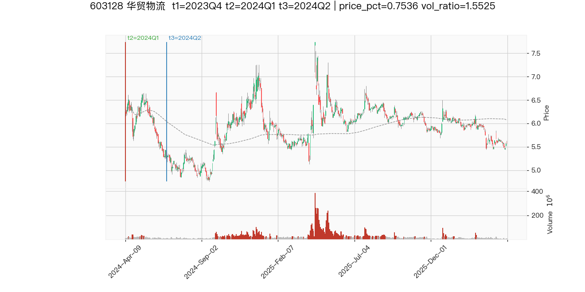

#### 🔍 检测依据 — 603128 华贸物流
> 最佳 triple: **2023Q4 → 2024Q1 → 2024Q2** ｜ B 触发: price_pct=0.75 vol_ratio=1.55 ｜ 候选 triple 数: 4

#### 📊 港中结持仓节奏 — 603128 华贸物流

| 季度     |   持股量(万股) |   持股市值(亿) |
|:-------|----------:|----------:|
| 2022Q4 |    2086.3 |      2.24 |
| 2023Q1 |    1451   |      1.38 |
| 2023Q2 |     808.5 |      0.74 |
| 2023Q3 |    1029.3 |      0.73 |
| 2023Q4 |    1756.7 |      1.3  |
| 2024Q1 |    1094.1 |      0.72 |
| 2024Q2 |    1525.4 |      0.88 |
| 2024Q3 |    1360.7 |      0.72 |

#### ✍️ 人工复盘 — 603128 华贸物流

| 检查项 | 结果 |
|--------|------|
| t2 季度价格在近 250 日高位区间（视觉） | ⬜ |
| t2 季度出现明显放量 bar（红色高量） | ⬜ |
| t3 季度买回后股价未大幅上涨（非卖飞） | ⬜ |
| t1→t2→t3 三段节奏符合「建仓→出货→再建仓」 | ⬜ |

**决策**: ⬜ PASS（纳入关注名单）　⬜ REJECT（假信号）

**备注**: _（人工填写）_

### 601311 骆驼股份 K 线 + 成交量
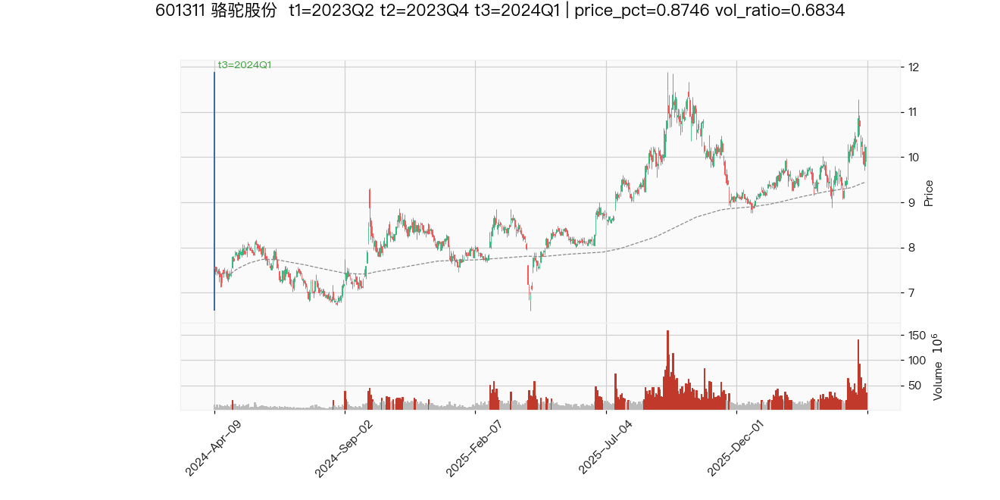

#### 🔍 检测依据 — 601311 骆驼股份
> 最佳 triple: **2023Q2 → 2023Q4 → 2024Q1** ｜ B 触发: price_pct=0.87 vol_ratio=0.68 ｜ 候选 triple 数: 3

#### 📊 港中结持仓节奏 — 601311 骆驼股份

| 季度     |   持股量(万股) |   持股市值(亿) |
|:-------|----------:|----------:|
| 2022Q4 |    1145.8 |      0.94 |
| 2023Q1 |    1598   |      1.57 |
| 2023Q2 |    2458.7 |      2.28 |
| 2023Q3 |    1456.5 |      1.21 |
| 2023Q4 |    1341.8 |      1.07 |
| 2024Q1 |    1909.8 |      1.46 |
| 2024Q2 |    2443.4 |      1.96 |
| 2024Q3 |    2271.5 |      1.59 |

#### ✍️ 人工复盘 — 601311 骆驼股份

| 检查项 | 结果 |
|--------|------|
| t2 季度价格在近 250 日高位区间（视觉） | ⬜ |
| t2 季度出现明显放量 bar（红色高量） | ⬜ |
| t3 季度买回后股价未大幅上涨（非卖飞） | ⬜ |
| t1→t2→t3 三段节奏符合「建仓→出货→再建仓」 | ⬜ |

**决策**: ⬜ PASS（纳入关注名单）　⬜ REJECT（假信号）

**备注**: _（人工填写）_

### 002258 利尔化学 K 线 + 成交量
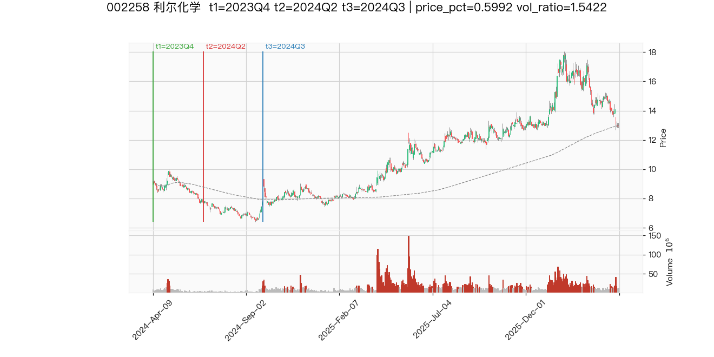

#### 🔍 检测依据 — 002258 利尔化学
> 最佳 triple: **2023Q4 → 2024Q2 → 2024Q3** ｜ B 触发: price_pct=0.60 vol_ratio=1.54 ｜ 候选 triple 数: 2

#### 📊 港中结持仓节奏 — 002258 利尔化学

| 季度     |   持股量(万股) |   持股市值(亿) |
|:-------|----------:|----------:|
| 2023Q1 |     770.2 |      1.32 |
| 2023Q2 |    1006.4 |      1.29 |
| 2023Q3 |     715.4 |      0.92 |
| 2023Q4 |     800.5 |      0.96 |
| 2024Q1 |     690.6 |      0.61 |
| 2024Q2 |     592.3 |      0.47 |
| 2024Q3 |     654.3 |      0.48 |

#### ✍️ 人工复盘 — 002258 利尔化学

| 检查项 | 结果 |
|--------|------|
| t2 季度价格在近 250 日高位区间（视觉） | ⬜ |
| t2 季度出现明显放量 bar（红色高量） | ⬜ |
| t3 季度买回后股价未大幅上涨（非卖飞） | ⬜ |
| t1→t2→t3 三段节奏符合「建仓→出货→再建仓」 | ⬜ |

**决策**: ⬜ PASS（纳入关注名单）　⬜ REJECT（假信号）

**备注**: _（人工填写）_

### 301171 易点天下 K 线 + 成交量
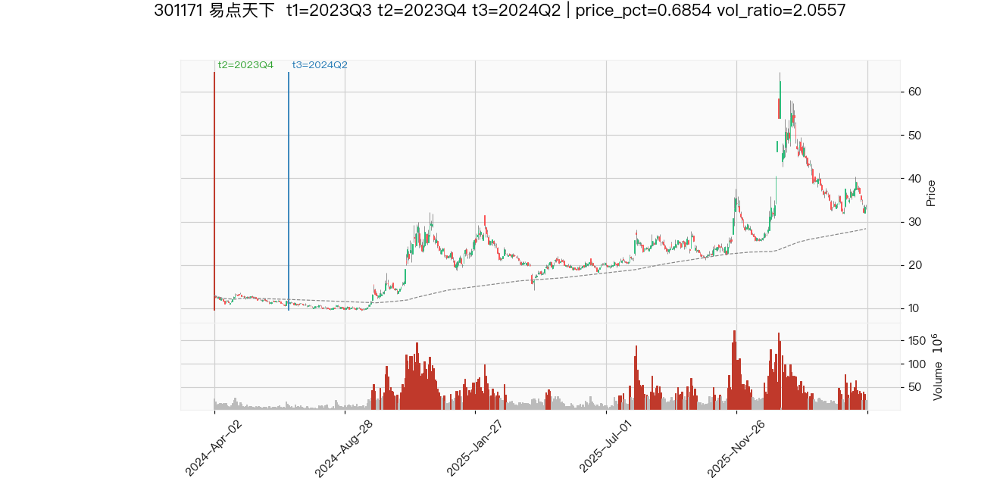

#### 🔍 检测依据 — 301171 易点天下
> 最佳 triple: **2023Q3 → 2023Q4 → 2024Q2** ｜ B 触发: price_pct=0.69 vol_ratio=2.06 ｜ t2 后 60 日收益: 9.2% ｜ 候选 triple 数: 1

#### 📊 港中结持仓节奏 — 301171 易点天下

| 季度     |   持股量(万股) |   持股市值(亿) |
|:-------|----------:|----------:|
| 2023Q1 |      92.5 |      0.3  |
| 2023Q2 |     121   |      0.27 |
| 2023Q3 |     518.9 |      0.9  |
| 2023Q4 |     118.6 |      0.23 |
| 2024Q1 |     115.1 |      0.2  |
| 2024Q2 |     208.1 |      0.31 |
| 2024Q3 |     249.5 |      0.33 |

#### ✍️ 人工复盘 — 301171 易点天下

| 检查项 | 结果 |
|--------|------|
| t2 季度价格在近 250 日高位区间（视觉） | ⬜ |
| t2 季度出现明显放量 bar（红色高量） | ⬜ |
| t3 季度买回后股价未大幅上涨（非卖飞） | ⬜ |
| t1→t2→t3 三段节奏符合「建仓→出货→再建仓」 | ⬜ |

**决策**: ⬜ PASS（纳入关注名单）　⬜ REJECT（假信号）

**备注**: _（人工填写）_

### 600120 浙江东方 K 线 + 成交量
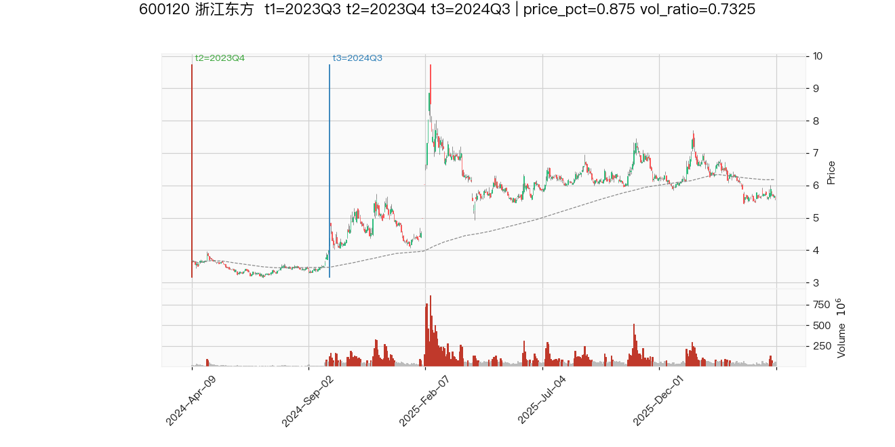

#### 🔍 检测依据 — 600120 浙江东方
> 最佳 triple: **2023Q3 → 2023Q4 → 2024Q3** ｜ B 触发: price_pct=0.88 vol_ratio=0.73 ｜ t2 后 60 日收益: 7.5% ｜ 候选 triple 数: 3

#### 📊 港中结持仓节奏 — 600120 浙江东方

| 季度     |   持股量(万股) |   持股市值(亿) |
|:-------|----------:|----------:|
| 2022Q4 |    2310.9 |      0.82 |
| 2023Q1 |    2419.1 |      0.96 |
| 2023Q2 |    2526.7 |      0.95 |
| 2023Q3 |    3977.6 |      1.5  |
| 2023Q4 |    2383.9 |      0.86 |
| 2024Q1 |    2200.9 |      0.82 |
| 2024Q2 |    1913.2 |      0.64 |
| 2024Q3 |    3408.7 |      1.21 |

#### ✍️ 人工复盘 — 600120 浙江东方

| 检查项 | 结果 |
|--------|------|
| t2 季度价格在近 250 日高位区间（视觉） | ⬜ |
| t2 季度出现明显放量 bar（红色高量） | ⬜ |
| t3 季度买回后股价未大幅上涨（非卖飞） | ⬜ |
| t1→t2→t3 三段节奏符合「建仓→出货→再建仓」 | ⬜ |

**决策**: ⬜ PASS（纳入关注名单）　⬜ REJECT（假信号）

**备注**: _（人工填写）_

### 603035 常熟汽饰 K 线 + 成交量
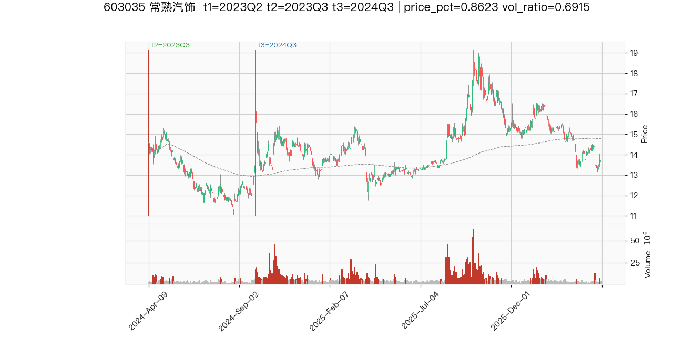

#### 🔍 检测依据 — 603035 常熟汽饰
> 最佳 triple: **2023Q2 → 2023Q3 → 2024Q3** ｜ B 触发: price_pct=0.86 vol_ratio=0.69 ｜ t2 后 60 日收益: 7.1% ｜ 候选 triple 数: 3

#### 📊 港中结持仓节奏 — 603035 常熟汽饰

| 季度     |   持股量(万股) |   持股市值(亿) |
|:-------|----------:|----------:|
| 2023Q1 |      57.9 |      0.11 |
| 2023Q2 |     258.6 |      0.5  |
| 2023Q3 |     160.8 |      0.31 |
| 2023Q4 |      97   |      0.18 |
| 2024Q1 |      92.7 |      0.14 |
| 2024Q2 |      58.6 |      0.07 |
| 2024Q3 |     327.3 |      0.4  |

#### ✍️ 人工复盘 — 603035 常熟汽饰

| 检查项 | 结果 |
|--------|------|
| t2 季度价格在近 250 日高位区间（视觉） | ⬜ |
| t2 季度出现明显放量 bar（红色高量） | ⬜ |
| t3 季度买回后股价未大幅上涨（非卖飞） | ⬜ |
| t1→t2→t3 三段节奏符合「建仓→出货→再建仓」 | ⬜ |

**决策**: ⬜ PASS（纳入关注名单）　⬜ REJECT（假信号）

**备注**: _（人工填写）_

### 601375 中原证券 K 线 + 成交量
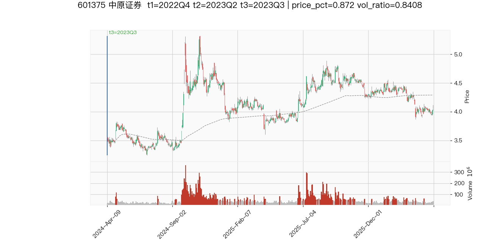

#### 🔍 检测依据 — 601375 中原证券
> 最佳 triple: **2022Q4 → 2023Q2 → 2023Q3** ｜ B 触发: price_pct=0.87 vol_ratio=0.84 ｜ 候选 triple 数: 4

#### 📊 港中结持仓节奏 — 601375 中原证券

| 季度     |   持股量(万股) |   持股市值(亿) |
|:-------|----------:|----------:|
| 2022Q4 |    2789.3 |      1.02 |
| 2023Q1 |    2382.3 |      0.89 |
| 2023Q2 |    1892.7 |      0.7  |
| 2023Q3 |    3296.9 |      1.31 |
| 2023Q4 |    2600.2 |      1    |
| 2024Q1 |    2096.4 |      0.76 |
| 2024Q2 |    2358.9 |      0.8  |
| 2024Q3 |    2951.6 |      1.05 |

#### ✍️ 人工复盘 — 601375 中原证券

| 检查项 | 结果 |
|--------|------|
| t2 季度价格在近 250 日高位区间（视觉） | ⬜ |
| t2 季度出现明显放量 bar（红色高量） | ⬜ |
| t3 季度买回后股价未大幅上涨（非卖飞） | ⬜ |
| t1→t2→t3 三段节奏符合「建仓→出货→再建仓」 | ⬜ |

**决策**: ⬜ PASS（纳入关注名单）　⬜ REJECT（假信号）

**备注**: _（人工填写）_

### 300072 海新能科 K 线 + 成交量
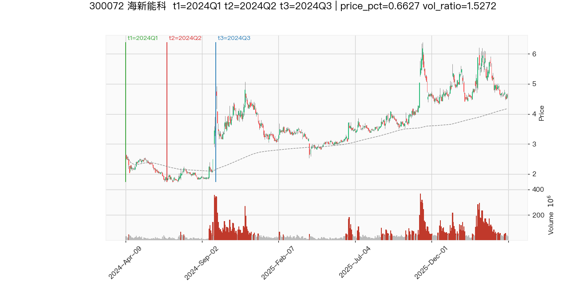

#### 🔍 检测依据 — 300072 海新能科
> 最佳 triple: **2024Q1 → 2024Q2 → 2024Q3** ｜ B 触发: price_pct=0.66 vol_ratio=1.53 ｜ 候选 triple 数: 3

#### 📊 港中结持仓节奏 — 300072 海新能科

| 季度     |   持股量(万股) |   持股市值(亿) |
|:-------|----------:|----------:|
| 2023Q1 |    2606.6 |      1.04 |
| 2023Q2 |    2946.8 |      0.99 |
| 2023Q3 |    1955.8 |      0.66 |
| 2023Q4 |    1627.7 |      0.57 |
| 2024Q1 |    2032.7 |      0.49 |
| 2024Q2 |    1642.6 |      0.3  |
| 2024Q3 |    1745.7 |      0.35 |

#### ✍️ 人工复盘 — 300072 海新能科

| 检查项 | 结果 |
|--------|------|
| t2 季度价格在近 250 日高位区间（视觉） | ⬜ |
| t2 季度出现明显放量 bar（红色高量） | ⬜ |
| t3 季度买回后股价未大幅上涨（非卖飞） | ⬜ |
| t1→t2→t3 三段节奏符合「建仓→出货→再建仓」 | ⬜ |

**决策**: ⬜ PASS（纳入关注名单）　⬜ REJECT（假信号）

**备注**: _（人工填写）_

### 600267 海正药业 K 线 + 成交量
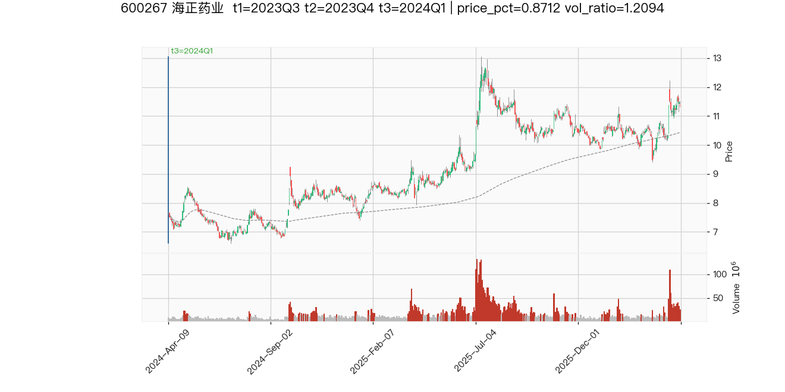

#### 🔍 检测依据 — 600267 海正药业
> 最佳 triple: **2023Q3 → 2023Q4 → 2024Q1** ｜ B 触发: price_pct=0.87 vol_ratio=1.21 ｜ 候选 triple 数: 2

#### 📊 港中结持仓节奏 — 600267 海正药业

| 季度     |   持股量(万股) |   持股市值(亿) |
|:-------|----------:|----------:|
| 2023Q1 |     132.7 |      0.14 |
| 2023Q2 |     670   |      0.75 |
| 2023Q3 |    1064.6 |      1.17 |
| 2023Q4 |     418   |      0.39 |
| 2024Q1 |    1132   |      0.87 |
| 2024Q2 |    1045.9 |      0.73 |
| 2024Q3 |    1386.7 |      1.07 |

#### ✍️ 人工复盘 — 600267 海正药业

| 检查项 | 结果 |
|--------|------|
| t2 季度价格在近 250 日高位区间（视觉） | ⬜ |
| t2 季度出现明显放量 bar（红色高量） | ⬜ |
| t3 季度买回后股价未大幅上涨（非卖飞） | ⬜ |
| t1→t2→t3 三段节奏符合「建仓→出货→再建仓」 | ⬜ |

**决策**: ⬜ PASS（纳入关注名单）　⬜ REJECT（假信号）

**备注**: _（人工填写）_

### 300455 航天智装 K 线 + 成交量
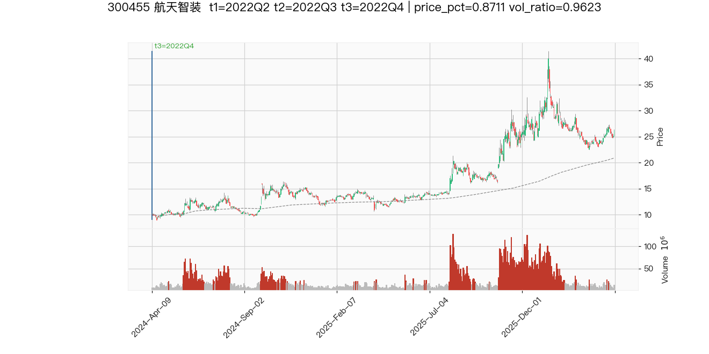

#### 🔍 检测依据 — 300455 航天智装
> 最佳 triple: **2022Q2 → 2022Q3 → 2022Q4** ｜ B 触发: price_pct=0.87 vol_ratio=0.96 ｜ 候选 triple 数: 3

#### 📊 港中结持仓节奏 — 300455 航天智装

| 季度     |   持股量(万股) |   持股市值(亿) |
|:-------|----------:|----------:|
| 2022Q4 |     321.8 |      0.24 |
| 2023Q1 |     475.4 |      0.47 |
| 2023Q2 |     744.9 |      0.85 |
| 2023Q3 |     423.5 |      0.45 |
| 2023Q4 |     513.5 |      0.61 |
| 2024Q1 |     751   |      0.8  |
| 2024Q2 |     462   |      0.57 |
| 2024Q3 |     494.8 |      0.56 |

#### ✍️ 人工复盘 — 300455 航天智装

| 检查项 | 结果 |
|--------|------|
| t2 季度价格在近 250 日高位区间（视觉） | ⬜ |
| t2 季度出现明显放量 bar（红色高量） | ⬜ |
| t3 季度买回后股价未大幅上涨（非卖飞） | ⬜ |
| t1→t2→t3 三段节奏符合「建仓→出货→再建仓」 | ⬜ |

**决策**: ⬜ PASS（纳入关注名单）　⬜ REJECT（假信号）

**备注**: _（人工填写）_

### 300260 新莱应材 K 线 + 成交量
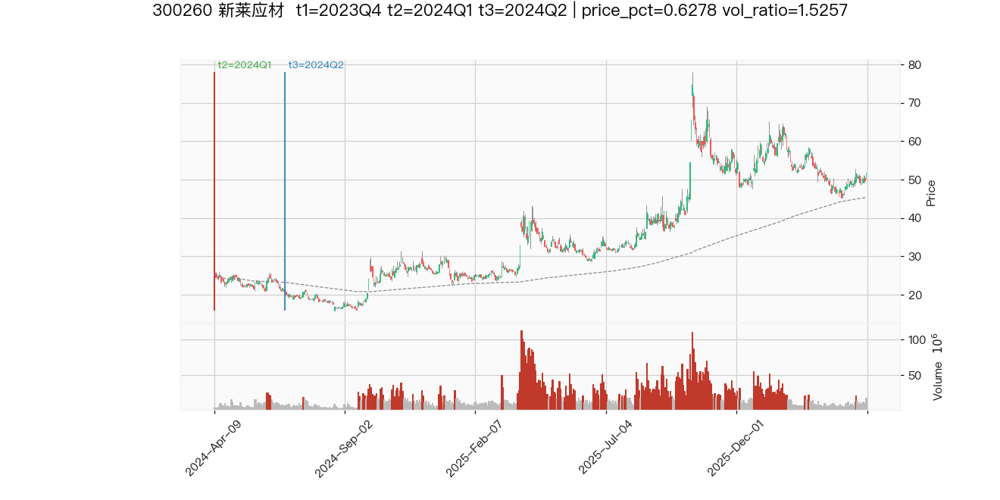

#### 🔍 检测依据 — 300260 新莱应材
> 最佳 triple: **2023Q4 → 2024Q1 → 2024Q2** ｜ B 触发: price_pct=0.63 vol_ratio=1.53 ｜ 候选 triple 数: 2

#### 📊 港中结持仓节奏 — 300260 新莱应材

| 季度     |   持股量(万股) |   持股市值(亿) |
|:-------|----------:|----------:|
| 2022Q4 |     319.5 |      2.14 |
| 2023Q1 |     172.6 |      1.18 |
| 2023Q2 |     188.9 |      0.75 |
| 2023Q3 |     215.2 |      0.82 |
| 2023Q4 |     238   |      0.72 |
| 2024Q1 |     189.4 |      0.53 |
| 2024Q2 |     278.5 |      0.58 |
| 2024Q3 |     338.5 |      0.62 |

#### ✍️ 人工复盘 — 300260 新莱应材

| 检查项 | 结果 |
|--------|------|
| t2 季度价格在近 250 日高位区间（视觉） | ⬜ |
| t2 季度出现明显放量 bar（红色高量） | ⬜ |
| t3 季度买回后股价未大幅上涨（非卖飞） | ⬜ |
| t1→t2→t3 三段节奏符合「建仓→出货→再建仓」 | ⬜ |

**决策**: ⬜ PASS（纳入关注名单）　⬜ REJECT（假信号）

**备注**: _（人工填写）_

### 605168 三人行 K 线 + 成交量
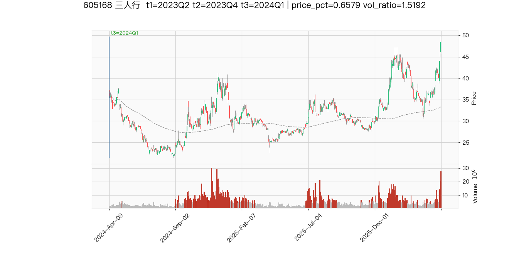

#### 🔍 检测依据 — 605168 三人行
> 最佳 triple: **2023Q2 → 2023Q4 → 2024Q1** ｜ B 触发: price_pct=0.66 vol_ratio=1.52 ｜ 候选 triple 数: 4

#### 📊 港中结持仓节奏 — 605168 三人行

| 季度     |   持股量(万股) |   持股市值(亿) |
|:-------|----------:|----------:|
| 2022Q4 |     142.8 |      1.27 |
| 2023Q1 |     177.5 |      2.77 |
| 2023Q2 |     325.2 |      2.84 |
| 2023Q3 |     184.4 |      1.25 |
| 2023Q4 |     172.1 |      1.09 |
| 2024Q1 |     197.7 |      1.25 |
| 2024Q2 |     185.9 |      0.49 |
| 2024Q3 |     207.2 |      0.51 |

#### ✍️ 人工复盘 — 605168 三人行

| 检查项 | 结果 |
|--------|------|
| t2 季度价格在近 250 日高位区间（视觉） | ⬜ |
| t2 季度出现明显放量 bar（红色高量） | ⬜ |
| t3 季度买回后股价未大幅上涨（非卖飞） | ⬜ |
| t1→t2→t3 三段节奏符合「建仓→出货→再建仓」 | ⬜ |

**决策**: ⬜ PASS（纳入关注名单）　⬜ REJECT（假信号）

**备注**: _（人工填写）_

### 000597 东北制药 K 线 + 成交量
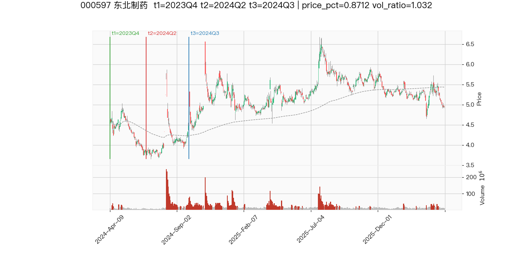

#### 🔍 检测依据 — 000597 东北制药
> 最佳 triple: **2023Q4 → 2024Q2 → 2024Q3** ｜ B 触发: price_pct=0.87 vol_ratio=1.03 ｜ 候选 triple 数: 2

#### 📊 港中结持仓节奏 — 000597 东北制药

| 季度     |   持股量(万股) |   持股市值(亿) |
|:-------|----------:|----------:|
| 2022Q4 |     168   |      0.11 |
| 2023Q1 |     420.7 |      0.25 |
| 2023Q2 |     309.5 |      0.16 |
| 2023Q3 |    1102.6 |      0.58 |
| 2023Q4 |    2158.1 |      1.15 |
| 2024Q1 |    1448.8 |      0.68 |
| 2024Q2 |     854.3 |      0.33 |
| 2024Q3 |    1100   |      0.5  |

#### ✍️ 人工复盘 — 000597 东北制药

| 检查项 | 结果 |
|--------|------|
| t2 季度价格在近 250 日高位区间（视觉） | ⬜ |
| t2 季度出现明显放量 bar（红色高量） | ⬜ |
| t3 季度买回后股价未大幅上涨（非卖飞） | ⬜ |
| t1→t2→t3 三段节奏符合「建仓→出货→再建仓」 | ⬜ |

**决策**: ⬜ PASS（纳入关注名单）　⬜ REJECT（假信号）

**备注**: _（人工填写）_

### 002646 天佑德酒 K 线 + 成交量
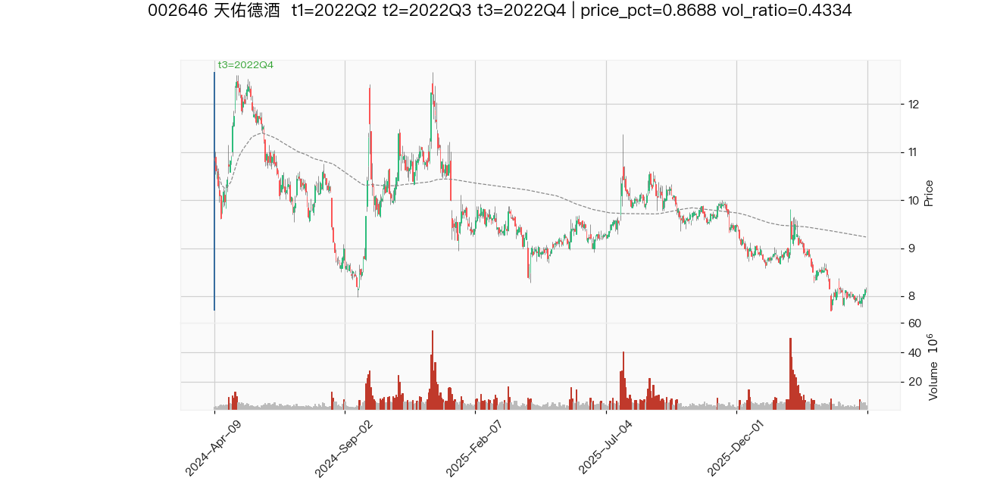

#### 🔍 检测依据 — 002646 天佑德酒
> 最佳 triple: **2022Q2 → 2022Q3 → 2022Q4** ｜ B 触发: price_pct=0.87 vol_ratio=0.43 ｜ 候选 triple 数: 4

#### 📊 港中结持仓节奏 — 002646 天佑德酒

| 季度     |   持股量(万股) |   持股市值(亿) |
|:-------|----------:|----------:|
| 2022Q4 |     352.9 |      0.54 |
| 2023Q1 |     300.9 |      0.47 |
| 2023Q2 |     216.9 |      0.29 |
| 2023Q3 |     412.4 |      0.59 |
| 2023Q4 |     632.5 |      0.86 |
| 2024Q1 |     499.3 |      0.54 |
| 2024Q2 |     669.9 |      0.69 |
| 2024Q3 |     625.3 |      0.64 |

#### ✍️ 人工复盘 — 002646 天佑德酒

| 检查项 | 结果 |
|--------|------|
| t2 季度价格在近 250 日高位区间（视觉） | ⬜ |
| t2 季度出现明显放量 bar（红色高量） | ⬜ |
| t3 季度买回后股价未大幅上涨（非卖飞） | ⬜ |
| t1→t2→t3 三段节奏符合「建仓→出货→再建仓」 | ⬜ |

**决策**: ⬜ PASS（纳入关注名单）　⬜ REJECT（假信号）

**备注**: _（人工填写）_

### 000012 南玻A K 线 + 成交量
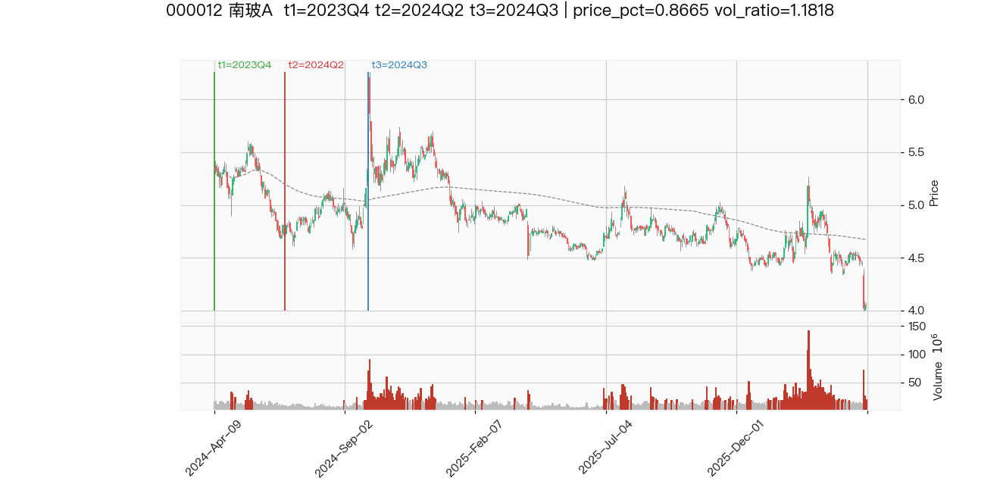

#### 🔍 检测依据 — 000012 南玻A
> 最佳 triple: **2023Q4 → 2024Q2 → 2024Q3** ｜ B 触发: price_pct=0.87 vol_ratio=1.18 ｜ 候选 triple 数: 2

#### 📊 港中结持仓节奏 — 000012 南玻A

| 季度     |   持股量(万股) |   持股市值(亿) |
|:-------|----------:|----------:|
| 2022Q4 |    2163.4 |      1.45 |
| 2023Q1 |    2479.7 |      1.66 |
| 2023Q2 |    3304.3 |      1.97 |
| 2023Q3 |    2321.3 |      1.31 |
| 2023Q4 |    2619.6 |      1.46 |
| 2024Q1 |    2695.3 |      1.46 |
| 2024Q2 |    2242.1 |      1.13 |
| 2024Q3 |    2873.4 |      1.47 |

#### ✍️ 人工复盘 — 000012 南玻A

| 检查项 | 结果 |
|--------|------|
| t2 季度价格在近 250 日高位区间（视觉） | ⬜ |
| t2 季度出现明显放量 bar（红色高量） | ⬜ |
| t3 季度买回后股价未大幅上涨（非卖飞） | ⬜ |
| t1→t2→t3 三段节奏符合「建仓→出货→再建仓」 | ⬜ |

**决策**: ⬜ PASS（纳入关注名单）　⬜ REJECT（假信号）

**备注**: _（人工填写）_

### 000089 深圳机场 K 线 + 成交量
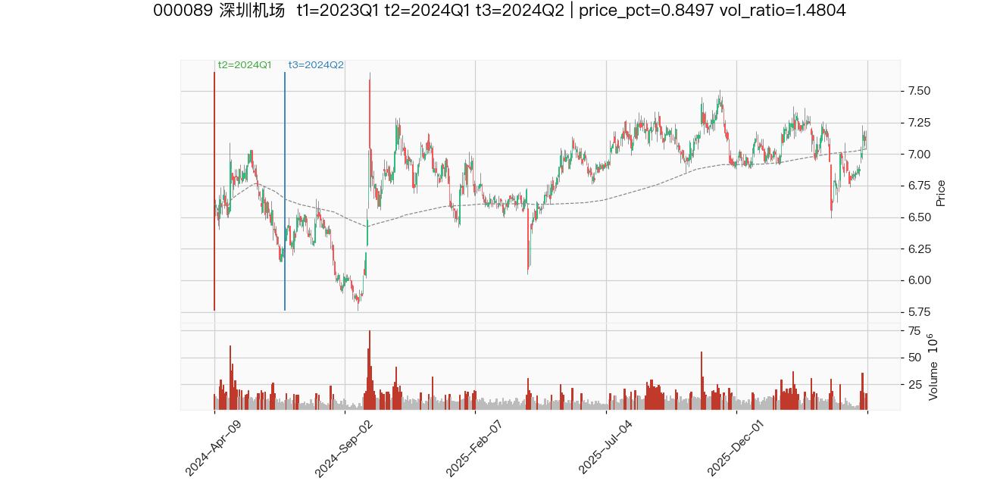

#### 🔍 检测依据 — 000089 深圳机场
> 最佳 triple: **2023Q1 → 2024Q1 → 2024Q2** ｜ B 触发: price_pct=0.85 vol_ratio=1.48 ｜ 候选 triple 数: 1

#### 📊 港中结持仓节奏 — 000089 深圳机场

| 季度     |   持股量(万股) |   持股市值(亿) |
|:-------|----------:|----------:|
| 2022Q4 |    7916.9 |      6.22 |
| 2023Q1 |    8560.5 |      6.24 |
| 2023Q2 |    6735.1 |      4.65 |
| 2023Q3 |    6429.7 |      4.37 |
| 2023Q4 |    5248.7 |      3.37 |
| 2024Q1 |    3601.6 |      2.42 |
| 2024Q2 |    4666.3 |      2.98 |
| 2024Q3 |    3632.3 |      2.32 |

#### ✍️ 人工复盘 — 000089 深圳机场

| 检查项 | 结果 |
|--------|------|
| t2 季度价格在近 250 日高位区间（视觉） | ⬜ |
| t2 季度出现明显放量 bar（红色高量） | ⬜ |
| t3 季度买回后股价未大幅上涨（非卖飞） | ⬜ |
| t1→t2→t3 三段节奏符合「建仓→出货→再建仓」 | ⬜ |

**决策**: ⬜ PASS（纳入关注名单）　⬜ REJECT（假信号）

**备注**: _（人工填写）_

### 600742 富维股份 K 线 + 成交量
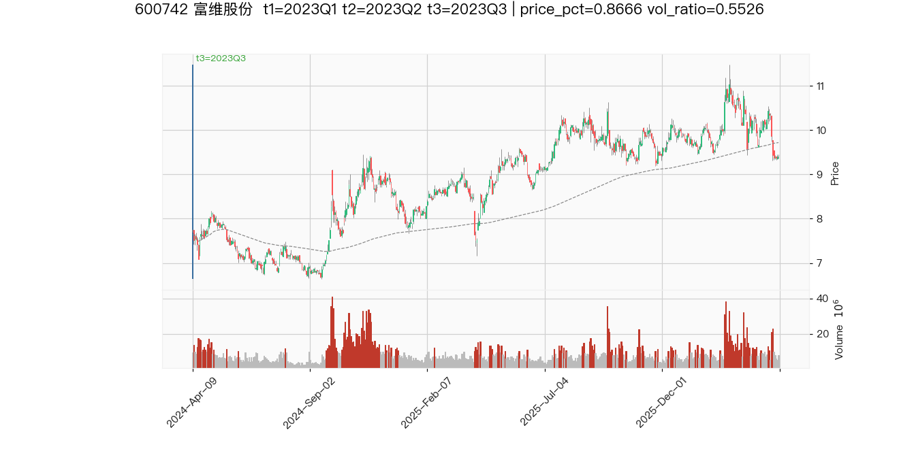

#### 🔍 检测依据 — 600742 富维股份
> 最佳 triple: **2023Q1 → 2023Q2 → 2023Q3** ｜ B 触发: price_pct=0.87 vol_ratio=0.55 ｜ 候选 triple 数: 1

#### 📊 港中结持仓节奏 — 600742 富维股份

| 季度     |   持股量(万股) |   持股市值(亿) |
|:-------|----------:|----------:|
| 2022Q4 |     783.7 |      0.66 |
| 2023Q1 |    1243.3 |      1.09 |
| 2023Q2 |    1070.2 |      0.9  |
| 2023Q3 |    2022   |      1.8  |
| 2023Q4 |    1086   |      1.04 |
| 2024Q1 |     849.8 |      0.76 |
| 2024Q2 |     638.3 |      0.48 |
| 2024Q3 |     642   |      0.49 |

#### ✍️ 人工复盘 — 600742 富维股份

| 检查项 | 结果 |
|--------|------|
| t2 季度价格在近 250 日高位区间（视觉） | ⬜ |
| t2 季度出现明显放量 bar（红色高量） | ⬜ |
| t3 季度买回后股价未大幅上涨（非卖飞） | ⬜ |
| t1→t2→t3 三段节奏符合「建仓→出货→再建仓」 | ⬜ |

**决策**: ⬜ PASS（纳入关注名单）　⬜ REJECT（假信号）

**备注**: _（人工填写）_

### 603113 金能科技 K 线 + 成交量
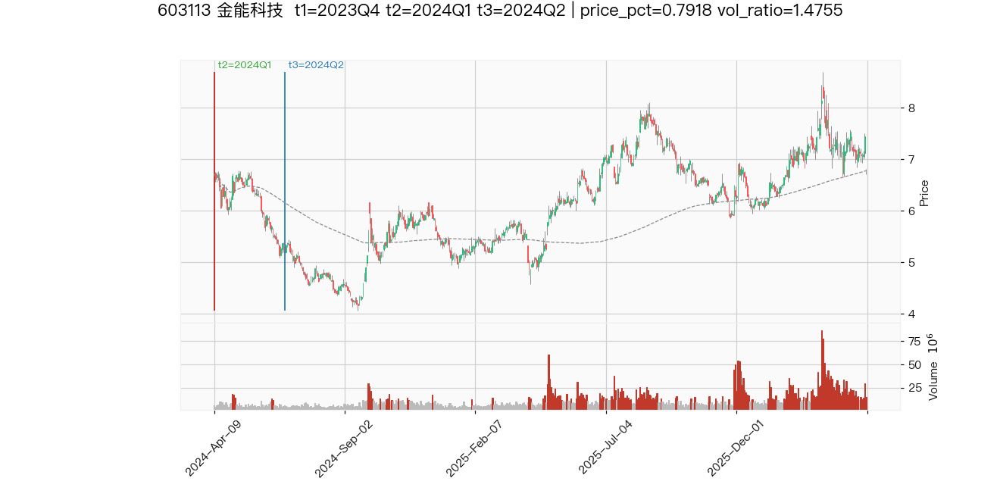

#### 🔍 检测依据 — 603113 金能科技
> 最佳 triple: **2023Q4 → 2024Q1 → 2024Q2** ｜ B 触发: price_pct=0.79 vol_ratio=1.48 ｜ 候选 triple 数: 3

#### 📊 港中结持仓节奏 — 603113 金能科技

| 季度     |   持股量(万股) |   持股市值(亿) |
|:-------|----------:|----------:|
| 2022Q4 |     840.3 |      0.76 |
| 2023Q1 |     908.3 |      0.9  |
| 2023Q2 |     833.6 |      0.67 |
| 2023Q3 |     963.6 |      0.81 |
| 2023Q4 |    1181.7 |      0.95 |
| 2024Q1 |    1046.2 |      0.7  |
| 2024Q2 |    1201.1 |      0.66 |
| 2024Q3 |    1117.2 |      0.55 |

#### ✍️ 人工复盘 — 603113 金能科技

| 检查项 | 结果 |
|--------|------|
| t2 季度价格在近 250 日高位区间（视觉） | ⬜ |
| t2 季度出现明显放量 bar（红色高量） | ⬜ |
| t3 季度买回后股价未大幅上涨（非卖飞） | ⬜ |
| t1→t2→t3 三段节奏符合「建仓→出货→再建仓」 | ⬜ |

**决策**: ⬜ PASS（纳入关注名单）　⬜ REJECT（假信号）

**备注**: _（人工填写）_

### 603100 川仪股份 K 线 + 成交量
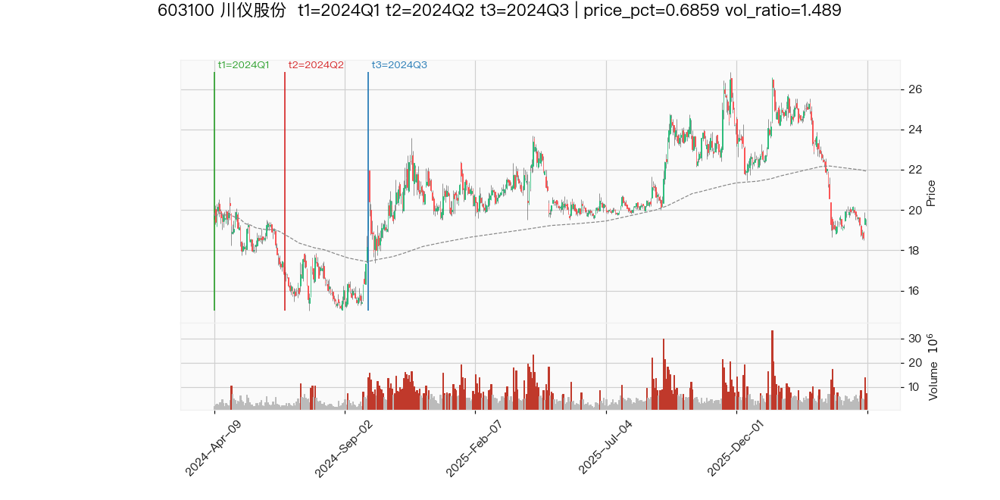

#### 🔍 检测依据 — 603100 川仪股份
> 最佳 triple: **2024Q1 → 2024Q2 → 2024Q3** ｜ B 触发: price_pct=0.69 vol_ratio=1.49 ｜ 候选 triple 数: 2

#### 📊 港中结持仓节奏 — 603100 川仪股份

| 季度     |   持股量(万股) |   持股市值(亿) |
|:-------|----------:|----------:|
| 2023Q1 |     156   |      0.59 |
| 2023Q2 |     306.5 |      1.19 |
| 2023Q3 |     351.5 |      1.15 |
| 2023Q4 |     282.4 |      0.78 |
| 2024Q1 |     408.6 |      1.14 |
| 2024Q2 |     240.7 |      0.57 |
| 2024Q3 |     375.8 |      0.62 |

#### ✍️ 人工复盘 — 603100 川仪股份

| 检查项 | 结果 |
|--------|------|
| t2 季度价格在近 250 日高位区间（视觉） | ⬜ |
| t2 季度出现明显放量 bar（红色高量） | ⬜ |
| t3 季度买回后股价未大幅上涨（非卖飞） | ⬜ |
| t1→t2→t3 三段节奏符合「建仓→出货→再建仓」 | ⬜ |

**决策**: ⬜ PASS（纳入关注名单）　⬜ REJECT（假信号）

**备注**: _（人工填写）_

### 002664 信质集团 K 线 + 成交量
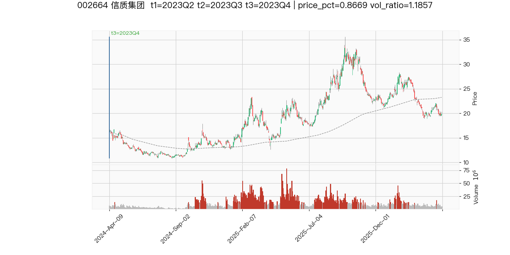

#### 🔍 检测依据 — 002664 信质集团
> 最佳 triple: **2023Q2 → 2023Q3 → 2023Q4** ｜ B 触发: price_pct=0.87 vol_ratio=1.19 ｜ 候选 triple 数: 2

#### 📊 港中结持仓节奏 — 002664 信质集团

| 季度     |   持股量(万股) |   持股市值(亿) |
|:-------|----------:|----------:|
| 2022Q4 |     242.1 |      0.32 |
| 2023Q1 |     436.5 |      0.6  |
| 2023Q2 |     564.3 |      0.78 |
| 2023Q3 |     406.2 |      0.64 |
| 2023Q4 |    1453.4 |      2.42 |
| 2024Q1 |     662   |      1.05 |
| 2024Q2 |     490.7 |      0.58 |
| 2024Q3 |     450.5 |      0.51 |

#### ✍️ 人工复盘 — 002664 信质集团

| 检查项 | 结果 |
|--------|------|
| t2 季度价格在近 250 日高位区间（视觉） | ⬜ |
| t2 季度出现明显放量 bar（红色高量） | ⬜ |
| t3 季度买回后股价未大幅上涨（非卖飞） | ⬜ |
| t1→t2→t3 三段节奏符合「建仓→出货→再建仓」 | ⬜ |

**决策**: ⬜ PASS（纳入关注名单）　⬜ REJECT（假信号）

**备注**: _（人工填写）_

### 300357 我武生物 K 线 + 成交量
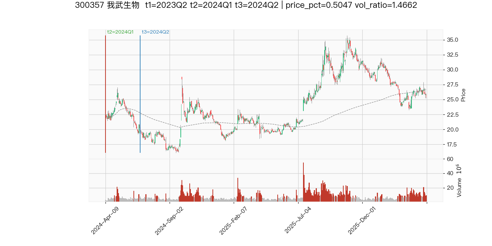

#### 🔍 检测依据 — 300357 我武生物
> 最佳 triple: **2023Q2 → 2024Q1 → 2024Q2** ｜ B 触发: price_pct=0.50 vol_ratio=1.47 ｜ 候选 triple 数: 1

#### 📊 港中结持仓节奏 — 300357 我武生物

| 季度     |   持股量(万股) |   持股市值(亿) |
|:-------|----------:|----------:|
| 2022Q4 |     986.7 |      5.44 |
| 2023Q1 |    1011.4 |      4.81 |
| 2023Q2 |    1332.5 |      4.48 |
| 2023Q3 |    1163.2 |      3.46 |
| 2023Q4 |     587.4 |      1.7  |
| 2024Q1 |     342.6 |      0.78 |
| 2024Q2 |     469.9 |      0.95 |
| 2024Q3 |     489.6 |      0.95 |

#### ✍️ 人工复盘 — 300357 我武生物

| 检查项 | 结果 |
|--------|------|
| t2 季度价格在近 250 日高位区间（视觉） | ⬜ |
| t2 季度出现明显放量 bar（红色高量） | ⬜ |
| t3 季度买回后股价未大幅上涨（非卖飞） | ⬜ |
| t1→t2→t3 三段节奏符合「建仓→出货→再建仓」 | ⬜ |

**决策**: ⬜ PASS（纳入关注名单）　⬜ REJECT（假信号）

**备注**: _（人工填写）_

### 688206 概伦电子 K 线 + 成交量
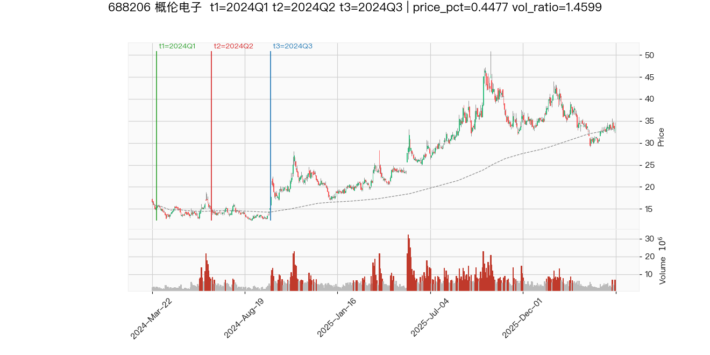

#### 🔍 检测依据 — 688206 概伦电子
> 最佳 triple: **2024Q1 → 2024Q2 → 2024Q3** ｜ B 触发: price_pct=0.45 vol_ratio=1.46 ｜ 候选 triple 数: 1

#### 📊 港中结持仓节奏 — 688206 概伦电子

| 季度     |   持股量(万股) |   持股市值(亿) |
|:-------|----------:|----------:|
| 2023Q1 |      35.2 |      0.12 |
| 2023Q2 |     119.2 |      0.32 |
| 2023Q3 |     145.2 |      0.37 |
| 2023Q4 |     246   |      0.54 |
| 2024Q1 |     311.7 |      0.47 |
| 2024Q2 |     276.4 |      0.41 |
| 2024Q3 |     303.1 |      0.42 |

#### ✍️ 人工复盘 — 688206 概伦电子

| 检查项 | 结果 |
|--------|------|
| t2 季度价格在近 250 日高位区间（视觉） | ⬜ |
| t2 季度出现明显放量 bar（红色高量） | ⬜ |
| t3 季度买回后股价未大幅上涨（非卖飞） | ⬜ |
| t1→t2→t3 三段节奏符合「建仓→出货→再建仓」 | ⬜ |

**决策**: ⬜ PASS（纳入关注名单）　⬜ REJECT（假信号）

**备注**: _（人工填写）_

### 002324 普利特 K 线 + 成交量
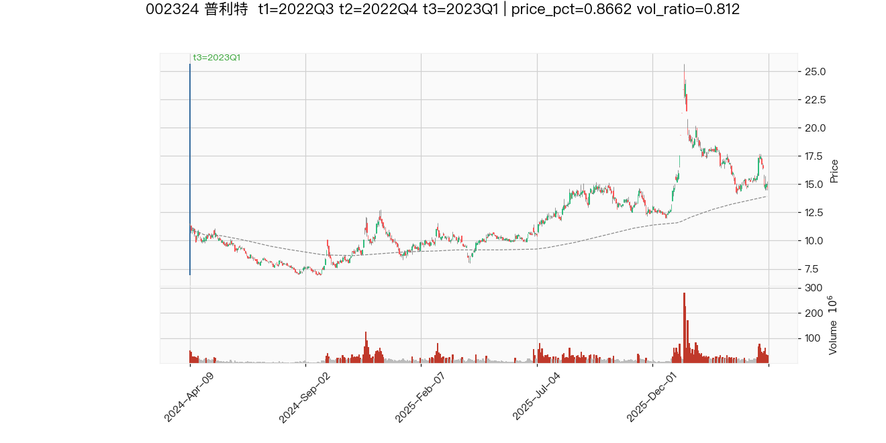

#### 🔍 检测依据 — 002324 普利特
> 最佳 triple: **2022Q3 → 2022Q4 → 2023Q1** ｜ B 触发: price_pct=0.87 vol_ratio=0.81 ｜ 候选 triple 数: 3

#### 📊 港中结持仓节奏 — 002324 普利特

| 季度     |   持股量(万股) |   持股市值(亿) |
|:-------|----------:|----------:|
| 2022Q4 |    1435.7 |      2.3  |
| 2023Q1 |    1889.8 |      2.75 |
| 2023Q2 |    1498.9 |      2.08 |
| 2023Q3 |    1072.3 |      1.37 |
| 2023Q4 |    1061.7 |      1.4  |
| 2024Q1 |    1512.5 |      1.4  |
| 2024Q2 |    1069.1 |      0.91 |
| 2024Q3 |     985   |      0.75 |

#### ✍️ 人工复盘 — 002324 普利特

| 检查项 | 结果 |
|--------|------|
| t2 季度价格在近 250 日高位区间（视觉） | ⬜ |
| t2 季度出现明显放量 bar（红色高量） | ⬜ |
| t3 季度买回后股价未大幅上涨（非卖飞） | ⬜ |
| t1→t2→t3 三段节奏符合「建仓→出货→再建仓」 | ⬜ |

**决策**: ⬜ PASS（纳入关注名单）　⬜ REJECT（假信号）

**备注**: _（人工填写）_

### 002975 博杰股份 K 线 + 成交量
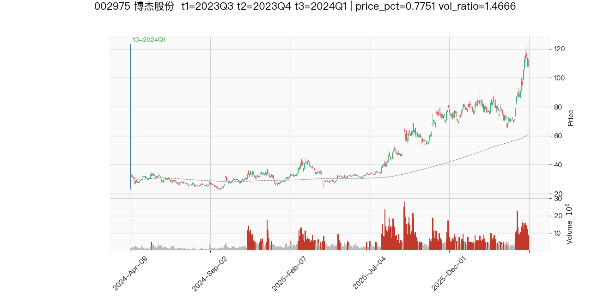

#### 🔍 检测依据 — 002975 博杰股份
> 最佳 triple: **2023Q3 → 2023Q4 → 2024Q1** ｜ B 触发: price_pct=0.78 vol_ratio=1.47 ｜ 候选 triple 数: 1

#### 📊 港中结持仓节奏 — 002975 博杰股份

| 季度     |   持股量(万股) |   持股市值(亿) |
|:-------|----------:|----------:|
| 2023Q1 |      31.9 |      0.14 |
| 2023Q2 |      52.2 |      0.22 |
| 2023Q3 |      72.4 |      0.25 |
| 2023Q4 |      57.9 |      0.22 |
| 2024Q1 |      98.7 |      0.33 |
| 2024Q2 |     196.6 |      0.59 |
| 2024Q3 |     209.9 |      0.57 |

#### ✍️ 人工复盘 — 002975 博杰股份

| 检查项 | 结果 |
|--------|------|
| t2 季度价格在近 250 日高位区间（视觉） | ⬜ |
| t2 季度出现明显放量 bar（红色高量） | ⬜ |
| t3 季度买回后股价未大幅上涨（非卖飞） | ⬜ |
| t1→t2→t3 三段节奏符合「建仓→出货→再建仓」 | ⬜ |

**决策**: ⬜ PASS（纳入关注名单）　⬜ REJECT（假信号）

**备注**: _（人工填写）_

### 600728 佳都科技 K 线 + 成交量
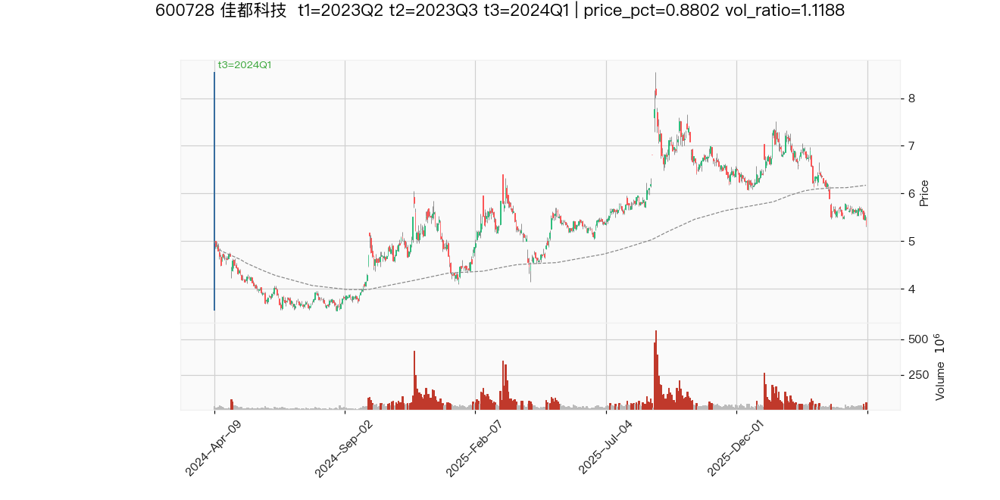

#### 🔍 检测依据 — 600728 佳都科技
> 最佳 triple: **2023Q2 → 2023Q3 → 2024Q1** ｜ B 触发: price_pct=0.88 vol_ratio=1.12 ｜ t2 后 60 日收益: 8.0% ｜ 候选 triple 数: 4

#### 📊 港中结持仓节奏 — 600728 佳都科技

| 季度     |   持股量(万股) |   持股市值(亿) |
|:-------|----------:|----------:|
| 2022Q4 |     815.6 |      0.43 |
| 2023Q1 |    2025.2 |      1.48 |
| 2023Q2 |    3197.4 |      2.28 |
| 2023Q3 |    1112.9 |      0.63 |
| 2023Q4 |     925.8 |      0.53 |
| 2024Q1 |    2142.1 |      1.07 |
| 2024Q2 |    1176.2 |      0.44 |
| 2024Q3 |    1810.1 |      0.67 |

#### ✍️ 人工复盘 — 600728 佳都科技

| 检查项 | 结果 |
|--------|------|
| t2 季度价格在近 250 日高位区间（视觉） | ⬜ |
| t2 季度出现明显放量 bar（红色高量） | ⬜ |
| t3 季度买回后股价未大幅上涨（非卖飞） | ⬜ |
| t1→t2→t3 三段节奏符合「建仓→出货→再建仓」 | ⬜ |

**决策**: ⬜ PASS（纳入关注名单）　⬜ REJECT（假信号）

**备注**: _（人工填写）_

### 600383 金地集团 K 线 + 成交量
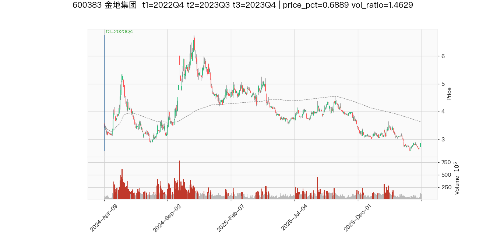

#### 🔍 检测依据 — 600383 金地集团
> 最佳 triple: **2022Q4 → 2023Q3 → 2023Q4** ｜ B 触发: price_pct=0.69 vol_ratio=1.46 ｜ 候选 triple 数: 3

#### 📊 港中结持仓节奏 — 600383 金地集团

| 季度     |   持股量(万股) |   持股市值(亿) |
|:-------|----------:|----------:|
| 2022Q4 |   19219   |     19.66 |
| 2023Q1 |   19644.7 |     16.5  |
| 2023Q2 |   15822.6 |     11.39 |
| 2023Q3 |   13518.2 |      9.22 |
| 2023Q4 |   20321.1 |      8.86 |
| 2024Q1 |    8873.7 |      3.42 |
| 2024Q2 |    5415.6 |      1.84 |
| 2024Q3 |    6723.3 |      2.35 |

#### ✍️ 人工复盘 — 600383 金地集团

| 检查项 | 结果 |
|--------|------|
| t2 季度价格在近 250 日高位区间（视觉） | ⬜ |
| t2 季度出现明显放量 bar（红色高量） | ⬜ |
| t3 季度买回后股价未大幅上涨（非卖飞） | ⬜ |
| t1→t2→t3 三段节奏符合「建仓→出货→再建仓」 | ⬜ |

**决策**: ⬜ PASS（纳入关注名单）　⬜ REJECT（假信号）

**备注**: _（人工填写）_

### 002326 永太科技 K 线 + 成交量
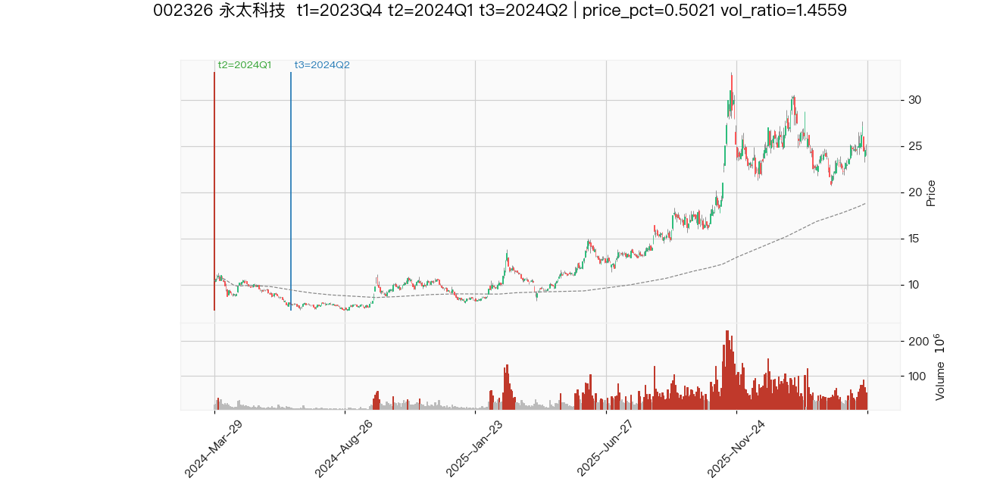

#### 🔍 检测依据 — 002326 永太科技
> 最佳 triple: **2023Q4 → 2024Q1 → 2024Q2** ｜ B 触发: price_pct=0.50 vol_ratio=1.46 ｜ 候选 triple 数: 1

#### 📊 港中结持仓节奏 — 002326 永太科技

| 季度     |   持股量(万股) |   持股市值(亿) |
|:-------|----------:|----------:|
| 2023Q1 |    1628.1 |      3.37 |
| 2023Q2 |    1155.7 |      1.73 |
| 2023Q3 |     649.8 |      0.83 |
| 2023Q4 |     787.8 |      0.92 |
| 2024Q1 |     447.9 |      0.47 |
| 2024Q2 |     493.5 |      0.39 |
| 2024Q3 |     531.7 |      0.41 |

#### ✍️ 人工复盘 — 002326 永太科技

| 检查项 | 结果 |
|--------|------|
| t2 季度价格在近 250 日高位区间（视觉） | ⬜ |
| t2 季度出现明显放量 bar（红色高量） | ⬜ |
| t3 季度买回后股价未大幅上涨（非卖飞） | ⬜ |
| t1→t2→t3 三段节奏符合「建仓→出货→再建仓」 | ⬜ |

**决策**: ⬜ PASS（纳入关注名单）　⬜ REJECT（假信号）

**备注**: _（人工填写）_

### 002838 道恩股份 K 线 + 成交量
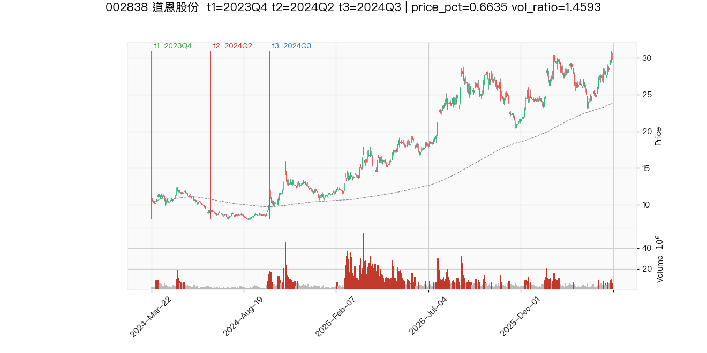

#### 🔍 检测依据 — 002838 道恩股份
> 最佳 triple: **2023Q4 → 2024Q2 → 2024Q3** ｜ B 触发: price_pct=0.66 vol_ratio=1.46 ｜ 候选 triple 数: 3

#### 📊 港中结持仓节奏 — 002838 道恩股份

| 季度     |   持股量(万股) |   持股市值(亿) |
|:-------|----------:|----------:|
| 2022Q4 |     264.8 |      0.47 |
| 2023Q1 |     207.4 |      0.35 |
| 2023Q2 |     316.9 |      0.53 |
| 2023Q3 |     315.3 |      0.43 |
| 2023Q4 |     468.6 |      0.6  |
| 2024Q1 |     392   |      0.41 |
| 2024Q2 |     319.9 |      0.29 |
| 2024Q3 |     363.9 |      0.31 |

#### ✍️ 人工复盘 — 002838 道恩股份

| 检查项 | 结果 |
|--------|------|
| t2 季度价格在近 250 日高位区间（视觉） | ⬜ |
| t2 季度出现明显放量 bar（红色高量） | ⬜ |
| t3 季度买回后股价未大幅上涨（非卖飞） | ⬜ |
| t1→t2→t3 三段节奏符合「建仓→出货→再建仓」 | ⬜ |

**决策**: ⬜ PASS（纳入关注名单）　⬜ REJECT（假信号）

**备注**: _（人工填写）_

### 688032 禾迈股份 K 线 + 成交量
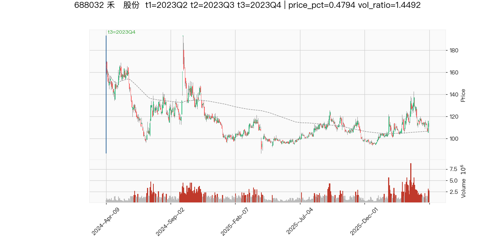

#### 🔍 检测依据 — 688032 禾迈股份
> 最佳 triple: **2023Q2 → 2023Q3 → 2023Q4** ｜ B 触发: price_pct=0.48 vol_ratio=1.45 ｜ 候选 triple 数: 1

#### 📊 港中结持仓节奏 — 688032 禾迈股份

| 季度     |   持股量(万股) |   持股市值(亿) |
|:-------|----------:|----------:|
| 2023Q1 |      81.9 |      5.45 |
| 2023Q2 |      99.1 |      3.38 |
| 2023Q3 |      91.4 |      2.51 |
| 2023Q4 |      97.7 |      2.64 |
| 2024Q1 |     112.6 |      2.45 |
| 2024Q2 |     203.7 |      2.34 |
| 2024Q3 |     104.6 |      1.47 |

#### ✍️ 人工复盘 — 688032 禾迈股份

| 检查项 | 结果 |
|--------|------|
| t2 季度价格在近 250 日高位区间（视觉） | ⬜ |
| t2 季度出现明显放量 bar（红色高量） | ⬜ |
| t3 季度买回后股价未大幅上涨（非卖飞） | ⬜ |
| t1→t2→t3 三段节奏符合「建仓→出货→再建仓」 | ⬜ |

**决策**: ⬜ PASS（纳入关注名单）　⬜ REJECT（假信号）

**备注**: _（人工填写）_

### 603915 国茂股份 K 线 + 成交量
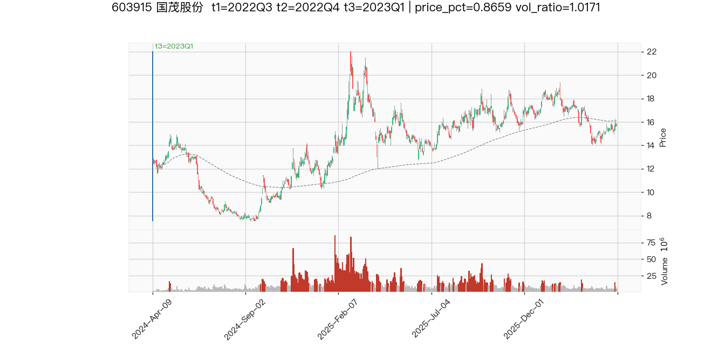

#### 🔍 检测依据 — 603915 国茂股份
> 最佳 triple: **2022Q3 → 2022Q4 → 2023Q1** ｜ B 触发: price_pct=0.87 vol_ratio=1.02 ｜ 候选 triple 数: 3

#### 📊 港中结持仓节奏 — 603915 国茂股份

| 季度     |   持股量(万股) |   持股市值(亿) |
|:-------|----------:|----------:|
| 2022Q4 |     669.3 |      1.39 |
| 2023Q1 |     834.3 |      1.64 |
| 2023Q2 |     498.3 |      1.06 |
| 2023Q3 |     469.2 |      0.82 |
| 2023Q4 |     514.1 |      0.85 |
| 2024Q1 |     490   |      0.67 |
| 2024Q2 |     706.3 |      0.73 |
| 2024Q3 |     697.8 |      0.59 |

#### ✍️ 人工复盘 — 603915 国茂股份

| 检查项 | 结果 |
|--------|------|
| t2 季度价格在近 250 日高位区间（视觉） | ⬜ |
| t2 季度出现明显放量 bar（红色高量） | ⬜ |
| t3 季度买回后股价未大幅上涨（非卖飞） | ⬜ |
| t1→t2→t3 三段节奏符合「建仓→出货→再建仓」 | ⬜ |

**决策**: ⬜ PASS（纳入关注名单）　⬜ REJECT（假信号）

**备注**: _（人工填写）_

### 600446 金证股份 K 线 + 成交量
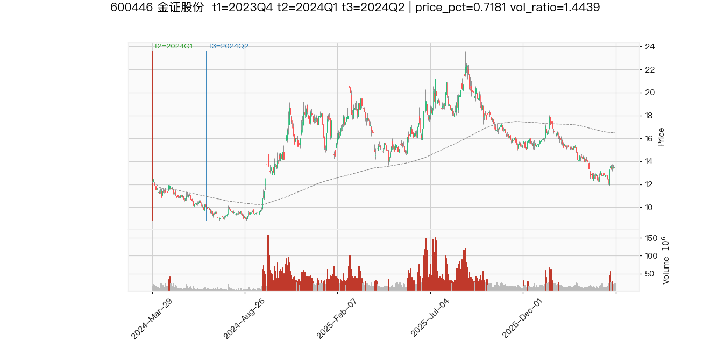

#### 🔍 检测依据 — 600446 金证股份
> 最佳 triple: **2023Q4 → 2024Q1 → 2024Q2** ｜ B 触发: price_pct=0.72 vol_ratio=1.44 ｜ 候选 triple 数: 2

#### 📊 港中结持仓节奏 — 600446 金证股份

| 季度     |   持股量(万股) |   持股市值(亿) |
|:-------|----------:|----------:|
| 2022Q4 |    1183.1 |      1.22 |
| 2023Q1 |    1449.9 |      2.04 |
| 2023Q2 |    1574.9 |      2.29 |
| 2023Q3 |    1106.8 |      1.4  |
| 2023Q4 |    1793.7 |      2.08 |
| 2024Q1 |    1569.1 |      1.9  |
| 2024Q2 |    1800.8 |      1.79 |
| 2024Q3 |    1758   |      1.67 |

#### ✍️ 人工复盘 — 600446 金证股份

| 检查项 | 结果 |
|--------|------|
| t2 季度价格在近 250 日高位区间（视觉） | ⬜ |
| t2 季度出现明显放量 bar（红色高量） | ⬜ |
| t3 季度买回后股价未大幅上涨（非卖飞） | ⬜ |
| t1→t2→t3 三段节奏符合「建仓→出货→再建仓」 | ⬜ |

**决策**: ⬜ PASS（纳入关注名单）　⬜ REJECT（假信号）

**备注**: _（人工填写）_

### 688088 虹软科技 K 线 + 成交量
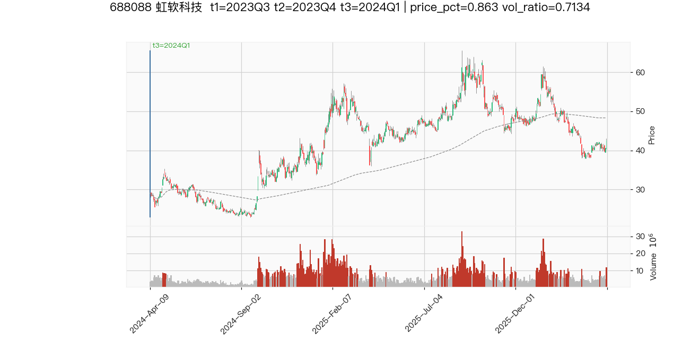

#### 🔍 检测依据 — 688088 虹软科技
> 最佳 triple: **2023Q3 → 2023Q4 → 2024Q1** ｜ B 触发: price_pct=0.86 vol_ratio=0.71 ｜ 候选 triple 数: 2

#### 📊 港中结持仓节奏 — 688088 虹软科技

| 季度     |   持股量(万股) |   持股市值(亿) |
|:-------|----------:|----------:|
| 2022Q4 |     124.8 |      0.28 |
| 2023Q1 |     637.8 |      2.29 |
| 2023Q2 |     668.8 |      2.86 |
| 2023Q3 |     948.8 |      3.85 |
| 2023Q4 |     374.6 |      1.54 |
| 2024Q1 |     540   |      1.73 |
| 2024Q2 |     316.4 |      0.91 |
| 2024Q3 |     343.8 |      0.86 |

#### ✍️ 人工复盘 — 688088 虹软科技

| 检查项 | 结果 |
|--------|------|
| t2 季度价格在近 250 日高位区间（视觉） | ⬜ |
| t2 季度出现明显放量 bar（红色高量） | ⬜ |
| t3 季度买回后股价未大幅上涨（非卖飞） | ⬜ |
| t1→t2→t3 三段节奏符合「建仓→出货→再建仓」 | ⬜ |

**决策**: ⬜ PASS（纳入关注名单）　⬜ REJECT（假信号）

**备注**: _（人工填写）_

### 002061 浙江交科 K 线 + 成交量
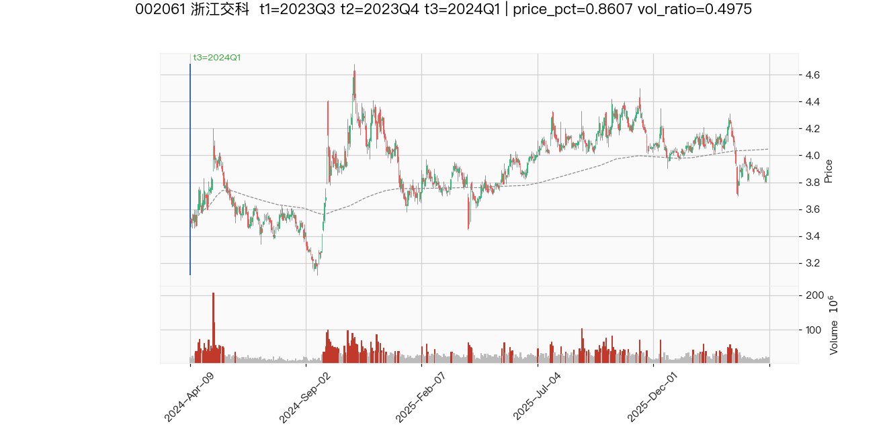

#### 🔍 检测依据 — 002061 浙江交科
> 最佳 triple: **2023Q3 → 2023Q4 → 2024Q1** ｜ B 触发: price_pct=0.86 vol_ratio=0.50 ｜ 候选 triple 数: 1

#### 📊 港中结持仓节奏 — 002061 浙江交科

| 季度     |   持股量(万股) |   持股市值(亿) |
|:-------|----------:|----------:|
| 2022Q4 |    1005.8 |      0.53 |
| 2023Q1 |    1808.1 |      1.11 |
| 2023Q2 |    1832.3 |      0.82 |
| 2023Q3 |    2191.6 |      0.9  |
| 2023Q4 |    1627.5 |      0.59 |
| 2024Q1 |    1763.2 |      0.64 |
| 2024Q2 |    3199.3 |      1.17 |
| 2024Q3 |    2977.8 |      1.09 |

#### ✍️ 人工复盘 — 002061 浙江交科

| 检查项 | 结果 |
|--------|------|
| t2 季度价格在近 250 日高位区间（视觉） | ⬜ |
| t2 季度出现明显放量 bar（红色高量） | ⬜ |
| t3 季度买回后股价未大幅上涨（非卖飞） | ⬜ |
| t1→t2→t3 三段节奏符合「建仓→出货→再建仓」 | ⬜ |

**决策**: ⬜ PASS（纳入关注名单）　⬜ REJECT（假信号）

**备注**: _（人工填写）_

### 002039 黔源电力 K 线 + 成交量
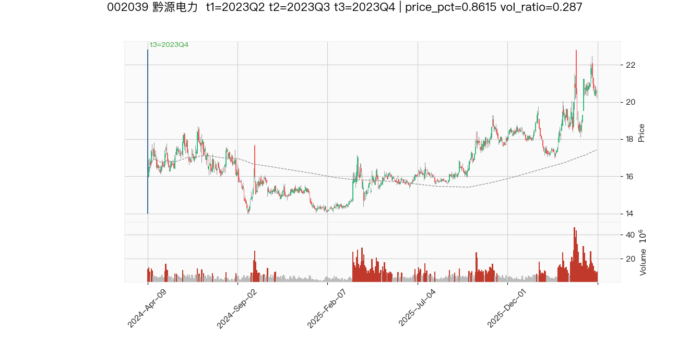

#### 🔍 检测依据 — 002039 黔源电力
> 最佳 triple: **2023Q2 → 2023Q3 → 2023Q4** ｜ B 触发: price_pct=0.86 vol_ratio=0.29 ｜ 候选 triple 数: 2

#### 📊 港中结持仓节奏 — 002039 黔源电力

| 季度     |   持股量(万股) |   持股市值(亿) |
|:-------|----------:|----------:|
| 2023Q1 |     127.9 |      0.19 |
| 2023Q2 |     232.4 |      0.33 |
| 2023Q3 |     117.8 |      0.16 |
| 2023Q4 |     280.2 |      0.39 |
| 2024Q1 |     217.6 |      0.34 |
| 2024Q2 |     217.6 |      0.38 |
| 2024Q3 |     351.9 |      0.61 |

#### ✍️ 人工复盘 — 002039 黔源电力

| 检查项 | 结果 |
|--------|------|
| t2 季度价格在近 250 日高位区间（视觉） | ⬜ |
| t2 季度出现明显放量 bar（红色高量） | ⬜ |
| t3 季度买回后股价未大幅上涨（非卖飞） | ⬜ |
| t1→t2→t3 三段节奏符合「建仓→出货→再建仓」 | ⬜ |

**决策**: ⬜ PASS（纳入关注名单）　⬜ REJECT（假信号）

**备注**: _（人工填写）_

### 603348 文灿股份 K 线 + 成交量
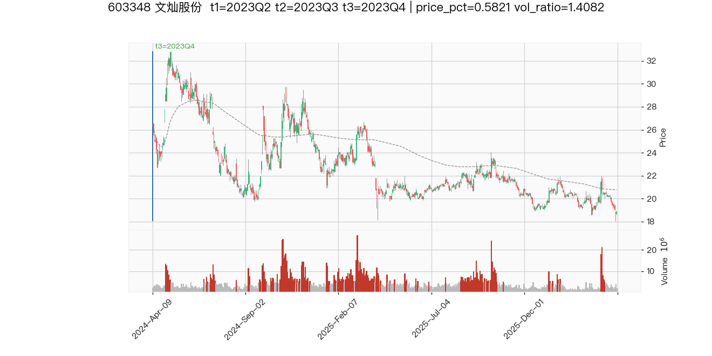

#### 🔍 检测依据 — 603348 文灿股份
> 最佳 triple: **2023Q2 → 2023Q3 → 2023Q4** ｜ B 触发: price_pct=0.58 vol_ratio=1.41 ｜ 候选 triple 数: 3

#### 📊 港中结持仓节奏 — 603348 文灿股份

| 季度     |   持股量(万股) |   持股市值(亿) |
|:-------|----------:|----------:|
| 2022Q4 |     366.4 |      2.11 |
| 2023Q1 |     243.8 |      1.24 |
| 2023Q2 |     436.8 |      1.91 |
| 2023Q3 |     180.4 |      0.74 |
| 2023Q4 |     223   |      0.87 |
| 2024Q1 |     370.1 |      1    |
| 2024Q2 |     406.1 |      1.12 |
| 2024Q3 |     204.8 |      0.46 |

#### ✍️ 人工复盘 — 603348 文灿股份

| 检查项 | 结果 |
|--------|------|
| t2 季度价格在近 250 日高位区间（视觉） | ⬜ |
| t2 季度出现明显放量 bar（红色高量） | ⬜ |
| t3 季度买回后股价未大幅上涨（非卖飞） | ⬜ |
| t1→t2→t3 三段节奏符合「建仓→出货→再建仓」 | ⬜ |

**决策**: ⬜ PASS（纳入关注名单）　⬜ REJECT（假信号）

**备注**: _（人工填写）_

### 002588 史丹利 K 线 + 成交量
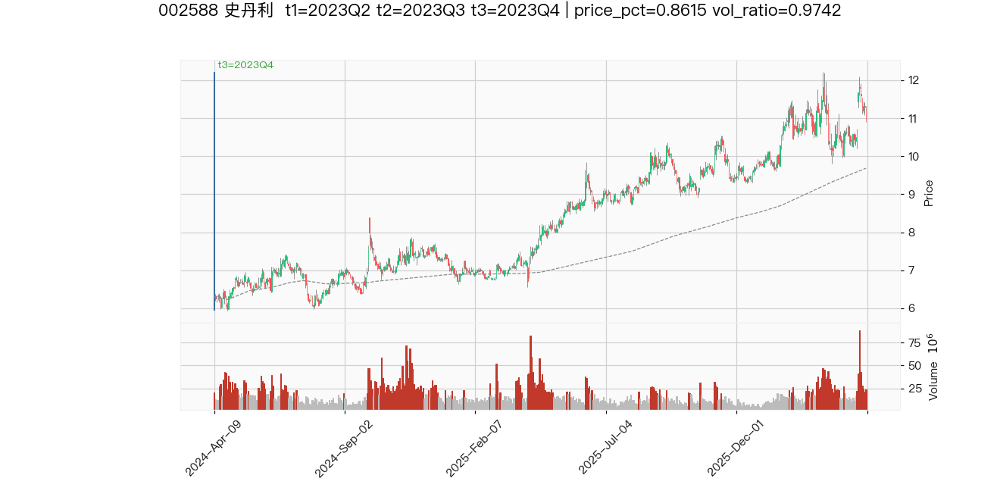

#### 🔍 检测依据 — 002588 史丹利
> 最佳 triple: **2023Q2 → 2023Q3 → 2023Q4** ｜ B 触发: price_pct=0.86 vol_ratio=0.97 ｜ 候选 triple 数: 2

#### 📊 港中结持仓节奏 — 002588 史丹利

| 季度     |   持股量(万股) |   持股市值(亿) |
|:-------|----------:|----------:|
| 2022Q4 |      20.1 |      0.01 |
| 2023Q1 |     111.7 |      0.07 |
| 2023Q2 |     429.5 |      0.26 |
| 2023Q3 |     330   |      0.19 |
| 2023Q4 |    2703.7 |      1.72 |
| 2024Q1 |    1986.4 |      1.23 |
| 2024Q2 |    3360   |      2.53 |
| 2024Q3 |    2692.2 |      1.86 |

#### ✍️ 人工复盘 — 002588 史丹利

| 检查项 | 结果 |
|--------|------|
| t2 季度价格在近 250 日高位区间（视觉） | ⬜ |
| t2 季度出现明显放量 bar（红色高量） | ⬜ |
| t3 季度买回后股价未大幅上涨（非卖飞） | ⬜ |
| t1→t2→t3 三段节奏符合「建仓→出货→再建仓」 | ⬜ |

**决策**: ⬜ PASS（纳入关注名单）　⬜ REJECT（假信号）

**备注**: _（人工填写）_

### 000719 中原传媒 K 线 + 成交量
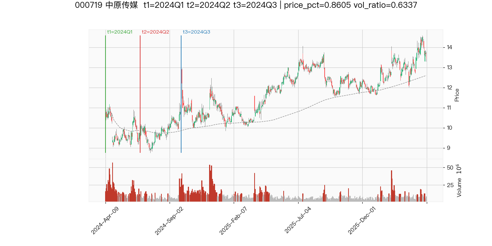

#### 🔍 检测依据 — 000719 中原传媒
> 最佳 triple: **2024Q1 → 2024Q2 → 2024Q3** ｜ B 触发: price_pct=0.86 vol_ratio=0.63 ｜ 候选 triple 数: 2

#### 📊 港中结持仓节奏 — 000719 中原传媒

| 季度     |   持股量(万股) |   持股市值(亿) |
|:-------|----------:|----------:|
| 2022Q4 |       6.8 |      0.01 |
| 2023Q1 |     821   |      0.85 |
| 2023Q2 |    5236.7 |      6.23 |
| 2023Q3 |    2859   |      3.04 |
| 2023Q4 |    2628.2 |      2.56 |
| 2024Q1 |    2815.7 |      3.67 |
| 2024Q2 |     876.9 |      0.89 |
| 2024Q3 |    1289.8 |      1.33 |

#### ✍️ 人工复盘 — 000719 中原传媒

| 检查项 | 结果 |
|--------|------|
| t2 季度价格在近 250 日高位区间（视觉） | ⬜ |
| t2 季度出现明显放量 bar（红色高量） | ⬜ |
| t3 季度买回后股价未大幅上涨（非卖飞） | ⬜ |
| t1→t2→t3 三段节奏符合「建仓→出货→再建仓」 | ⬜ |

**决策**: ⬜ PASS（纳入关注名单）　⬜ REJECT（假信号）

**备注**: _（人工填写）_

### 603733 仙鹤股份 K 线 + 成交量
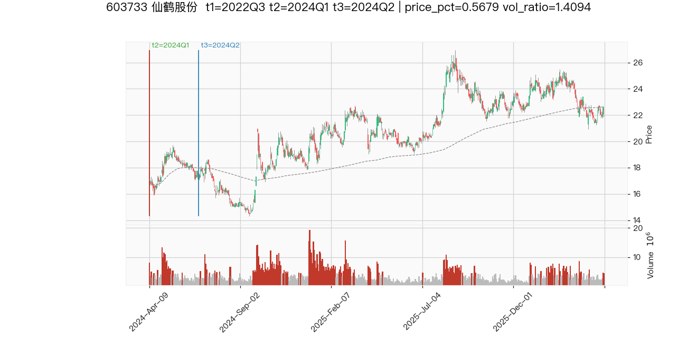

#### 🔍 检测依据 — 603733 仙鹤股份
> 最佳 triple: **2022Q3 → 2024Q1 → 2024Q2** ｜ B 触发: price_pct=0.57 vol_ratio=1.41 ｜ 候选 triple 数: 1

#### 📊 港中结持仓节奏 — 603733 仙鹤股份

| 季度     |   持股量(万股) |   持股市值(亿) |
|:-------|----------:|----------:|
| 2022Q4 |    3376.8 |     10.29 |
| 2023Q1 |    2551.1 |      6.46 |
| 2023Q2 |    1401.3 |      2.86 |
| 2023Q3 |    1047.5 |      1.92 |
| 2023Q4 |     913.8 |      1.47 |
| 2024Q1 |     763.7 |      1.28 |
| 2024Q2 |     805.7 |      1.42 |
| 2024Q3 |     741.2 |      1.16 |

#### ✍️ 人工复盘 — 603733 仙鹤股份

| 检查项 | 结果 |
|--------|------|
| t2 季度价格在近 250 日高位区间（视觉） | ⬜ |
| t2 季度出现明显放量 bar（红色高量） | ⬜ |
| t3 季度买回后股价未大幅上涨（非卖飞） | ⬜ |
| t1→t2→t3 三段节奏符合「建仓→出货→再建仓」 | ⬜ |

**决策**: ⬜ PASS（纳入关注名单）　⬜ REJECT（假信号）

**备注**: _（人工填写）_

### 003012 东鹏控股 K 线 + 成交量
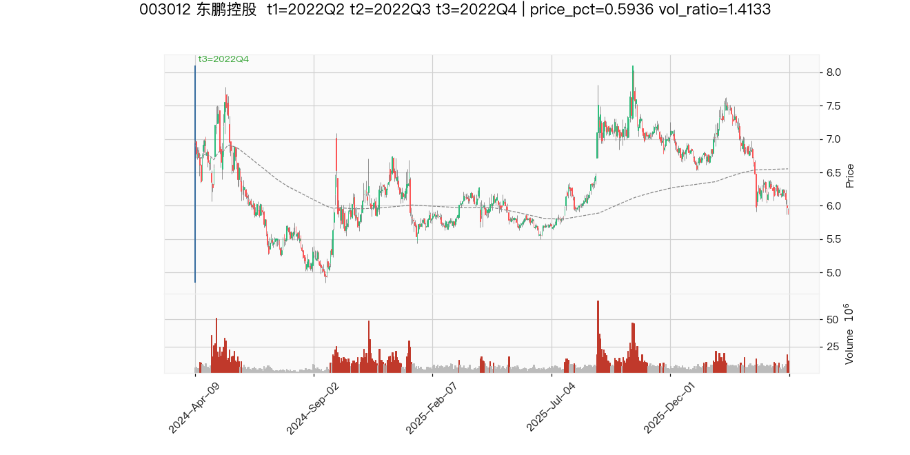

#### 🔍 检测依据 — 003012 东鹏控股
> 最佳 triple: **2022Q2 → 2022Q3 → 2022Q4** ｜ B 触发: price_pct=0.59 vol_ratio=1.41 ｜ 候选 triple 数: 2

#### 📊 港中结持仓节奏 — 003012 东鹏控股

| 季度     |   持股量(万股) |   持股市值(亿) |
|:-------|----------:|----------:|
| 2022Q4 |     651.5 |      0.51 |
| 2023Q1 |     649.8 |      0.57 |
| 2023Q2 |     560.9 |      0.45 |
| 2023Q3 |    2651.1 |      2.82 |
| 2023Q4 |    4699.9 |      3.88 |
| 2024Q1 |    2414.7 |      1.8  |
| 2024Q2 |    1118.8 |      0.68 |
| 2024Q3 |    1044.3 |      0.59 |

#### ✍️ 人工复盘 — 003012 东鹏控股

| 检查项 | 结果 |
|--------|------|
| t2 季度价格在近 250 日高位区间（视觉） | ⬜ |
| t2 季度出现明显放量 bar（红色高量） | ⬜ |
| t3 季度买回后股价未大幅上涨（非卖飞） | ⬜ |
| t1→t2→t3 三段节奏符合「建仓→出货→再建仓」 | ⬜ |

**决策**: ⬜ PASS（纳入关注名单）　⬜ REJECT（假信号）

**备注**: _（人工填写）_

### 002807 江阴银行 K 线 + 成交量
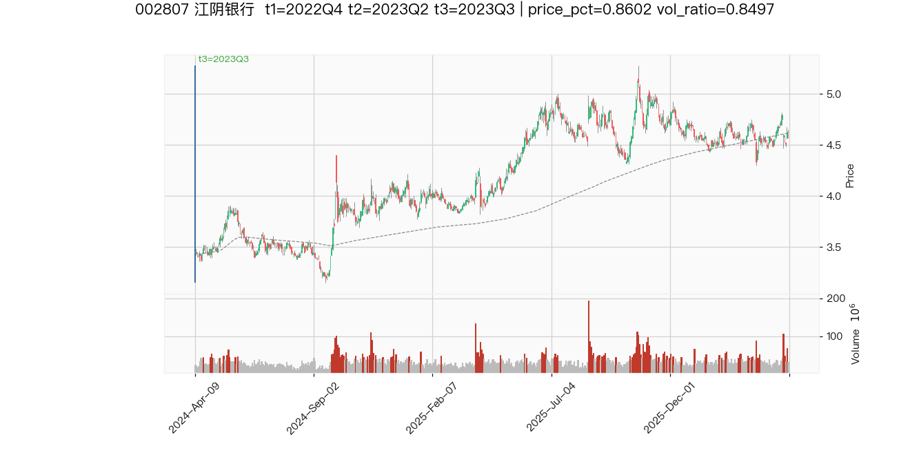

#### 🔍 检测依据 — 002807 江阴银行
> 最佳 triple: **2022Q4 → 2023Q2 → 2023Q3** ｜ B 触发: price_pct=0.86 vol_ratio=0.85 ｜ 候选 triple 数: 2

#### 📊 港中结持仓节奏 — 002807 江阴银行

| 季度     |   持股量(万股) |   持股市值(亿) |
|:-------|----------:|----------:|
| 2022Q4 |    8475   |      3.36 |
| 2023Q1 |    8752.3 |      3.49 |
| 2023Q2 |    6136.2 |      2.24 |
| 2023Q3 |    8749   |      3.34 |
| 2023Q4 |    7192.2 |      2.55 |
| 2024Q1 |   10043.6 |      3.7  |
| 2024Q2 |    9933.9 |      3.75 |
| 2024Q3 |   10330   |      3.81 |

#### ✍️ 人工复盘 — 002807 江阴银行

| 检查项 | 结果 |
|--------|------|
| t2 季度价格在近 250 日高位区间（视觉） | ⬜ |
| t2 季度出现明显放量 bar（红色高量） | ⬜ |
| t3 季度买回后股价未大幅上涨（非卖飞） | ⬜ |
| t1→t2→t3 三段节奏符合「建仓→出货→再建仓」 | ⬜ |

**决策**: ⬜ PASS（纳入关注名单）　⬜ REJECT（假信号）

**备注**: _（人工填写）_

### 688116 天奈科技 K 线 + 成交量
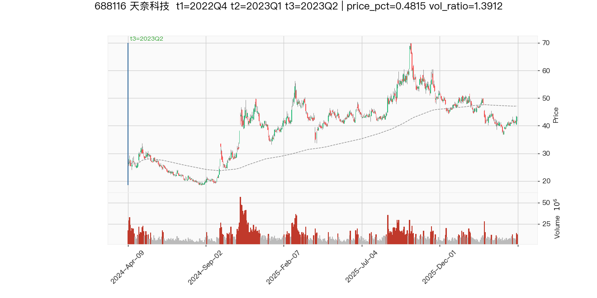

#### 🔍 检测依据 — 688116 天奈科技
> 最佳 triple: **2022Q4 → 2023Q1 → 2023Q2** ｜ B 触发: price_pct=0.48 vol_ratio=1.39 ｜ 候选 triple 数: 4

#### 📊 港中结持仓节奏 — 688116 天奈科技

| 季度     |   持股量(万股) |   持股市值(亿) |
|:-------|----------:|----------:|
| 2022Q4 |     784.9 |      6.05 |
| 2023Q1 |     377.4 |      2.56 |
| 2023Q2 |     967.1 |      4.14 |
| 2023Q3 |     658.9 |      1.72 |
| 2023Q4 |     561.6 |      1.63 |
| 2024Q1 |     329.7 |      0.71 |
| 2024Q2 |     912.7 |      2.11 |
| 2024Q3 |     374   |      0.72 |

#### ✍️ 人工复盘 — 688116 天奈科技

| 检查项 | 结果 |
|--------|------|
| t2 季度价格在近 250 日高位区间（视觉） | ⬜ |
| t2 季度出现明显放量 bar（红色高量） | ⬜ |
| t3 季度买回后股价未大幅上涨（非卖飞） | ⬜ |
| t1→t2→t3 三段节奏符合「建仓→出货→再建仓」 | ⬜ |

**决策**: ⬜ PASS（纳入关注名单）　⬜ REJECT（假信号）

**备注**: _（人工填写）_

### 002907 华森制药 K 线 + 成交量
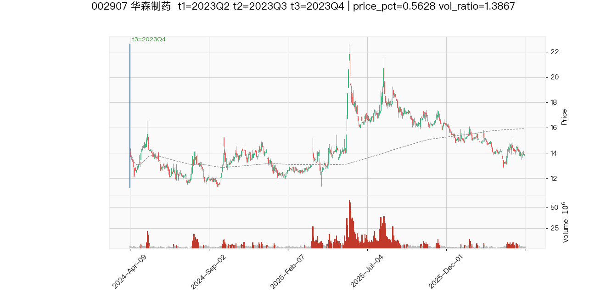

#### 🔍 检测依据 — 002907 华森制药
> 最佳 triple: **2023Q2 → 2023Q3 → 2023Q4** ｜ B 触发: price_pct=0.56 vol_ratio=1.39 ｜ 候选 triple 数: 1

#### 📊 港中结持仓节奏 — 002907 华森制药

| 季度     |   持股量(万股) |   持股市值(亿) |
|:-------|----------:|----------:|
| 2022Q4 |      14   |      0.03 |
| 2023Q1 |     129.5 |      0.23 |
| 2023Q2 |     378.8 |      0.58 |
| 2023Q3 |      92.3 |      0.16 |
| 2023Q4 |     126.8 |      0.2  |
| 2024Q1 |     175.8 |      0.25 |
| 2024Q2 |     184.1 |      0.23 |
| 2024Q3 |     256.5 |      0.34 |

#### ✍️ 人工复盘 — 002907 华森制药

| 检查项 | 结果 |
|--------|------|
| t2 季度价格在近 250 日高位区间（视觉） | ⬜ |
| t2 季度出现明显放量 bar（红色高量） | ⬜ |
| t3 季度买回后股价未大幅上涨（非卖飞） | ⬜ |
| t1→t2→t3 三段节奏符合「建仓→出货→再建仓」 | ⬜ |

**决策**: ⬜ PASS（纳入关注名单）　⬜ REJECT（假信号）

**备注**: _（人工填写）_

### 600821 金开新能 K 线 + 成交量
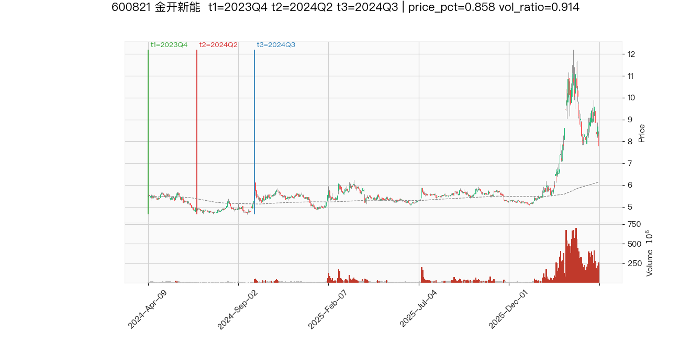

#### 🔍 检测依据 — 600821 金开新能
> 最佳 triple: **2023Q4 → 2024Q2 → 2024Q3** ｜ B 触发: price_pct=0.86 vol_ratio=0.91 ｜ 候选 triple 数: 2

#### 📊 港中结持仓节奏 — 600821 金开新能

| 季度     |   持股量(万股) |   持股市值(亿) |
|:-------|----------:|----------:|
| 2023Q1 |     222.9 |      0.15 |
| 2023Q2 |     746   |      0.51 |
| 2023Q3 |     833.8 |      0.55 |
| 2023Q4 |    1509   |      0.92 |
| 2024Q1 |    1274.7 |      0.74 |
| 2024Q2 |    1018.4 |      0.52 |
| 2024Q3 |    1343.8 |      0.75 |

#### ✍️ 人工复盘 — 600821 金开新能

| 检查项 | 结果 |
|--------|------|
| t2 季度价格在近 250 日高位区间（视觉） | ⬜ |
| t2 季度出现明显放量 bar（红色高量） | ⬜ |
| t3 季度买回后股价未大幅上涨（非卖飞） | ⬜ |
| t1→t2→t3 三段节奏符合「建仓→出货→再建仓」 | ⬜ |

**决策**: ⬜ PASS（纳入关注名单）　⬜ REJECT（假信号）

**备注**: _（人工填写）_

### 603855 华荣股份 K 线 + 成交量
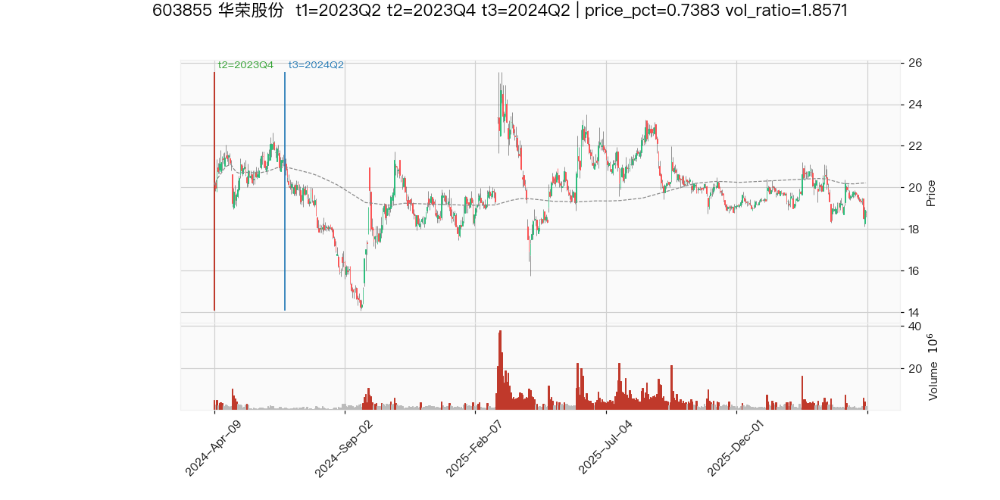

#### 🔍 检测依据 — 603855 华荣股份
> 最佳 triple: **2023Q2 → 2023Q4 → 2024Q2** ｜ B 触发: price_pct=0.74 vol_ratio=1.86 ｜ t2 后 60 日收益: 9.1% ｜ 候选 triple 数: 2

#### 📊 港中结持仓节奏 — 603855 华荣股份

| 季度     |   持股量(万股) |   持股市值(亿) |
|:-------|----------:|----------:|
| 2023Q1 |     454.6 |      1.3  |
| 2023Q2 |    1113.8 |      2.86 |
| 2023Q3 |     889.5 |      1.94 |
| 2023Q4 |     767.3 |      1.53 |
| 2024Q1 |     477.8 |      0.95 |
| 2024Q2 |     830.4 |      1.84 |
| 2024Q3 |     646.2 |      1.23 |

#### ✍️ 人工复盘 — 603855 华荣股份

| 检查项 | 结果 |
|--------|------|
| t2 季度价格在近 250 日高位区间（视觉） | ⬜ |
| t2 季度出现明显放量 bar（红色高量） | ⬜ |
| t3 季度买回后股价未大幅上涨（非卖飞） | ⬜ |
| t1→t2→t3 三段节奏符合「建仓→出货→再建仓」 | ⬜ |

**决策**: ⬜ PASS（纳入关注名单）　⬜ REJECT（假信号）

**备注**: _（人工填写）_

### 600597 光明乳业 K 线 + 成交量
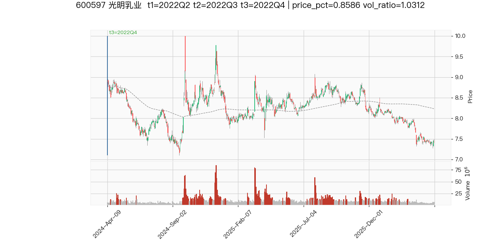

#### 🔍 检测依据 — 600597 光明乳业
> 最佳 triple: **2022Q2 → 2022Q3 → 2022Q4** ｜ B 触发: price_pct=0.86 vol_ratio=1.03 ｜ 候选 triple 数: 4

#### 📊 港中结持仓节奏 — 600597 光明乳业

| 季度     |   持股量(万股) |   持股市值(亿) |
|:-------|----------:|----------:|
| 2022Q4 |    1556   |      1.67 |
| 2023Q1 |    1369.8 |      1.46 |
| 2023Q2 |    1880.1 |      1.93 |
| 2023Q3 |    1575.1 |      1.62 |
| 2023Q4 |    1070.7 |      0.93 |
| 2024Q1 |    1124.7 |      1.02 |
| 2024Q2 |    1003.8 |      0.78 |
| 2024Q3 |    1319.6 |      1.07 |

#### ✍️ 人工复盘 — 600597 光明乳业

| 检查项 | 结果 |
|--------|------|
| t2 季度价格在近 250 日高位区间（视觉） | ⬜ |
| t2 季度出现明显放量 bar（红色高量） | ⬜ |
| t3 季度买回后股价未大幅上涨（非卖飞） | ⬜ |
| t1→t2→t3 三段节奏符合「建仓→出货→再建仓」 | ⬜ |

**决策**: ⬜ PASS（纳入关注名单）　⬜ REJECT（假信号）

**备注**: _（人工填写）_

### 600649 城投控股 K 线 + 成交量
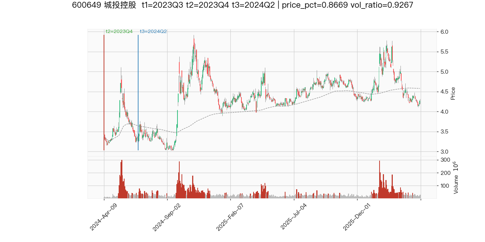

#### 🔍 检测依据 — 600649 城投控股
> 最佳 triple: **2023Q3 → 2023Q4 → 2024Q2** ｜ B 触发: price_pct=0.87 vol_ratio=0.93 ｜ t2 后 60 日收益: 7.8% ｜ 候选 triple 数: 2

#### 📊 港中结持仓节奏 — 600649 城投控股

| 季度     |   持股量(万股) |   持股市值(亿) |
|:-------|----------:|----------:|
| 2022Q4 |     247.4 |      0.1  |
| 2023Q1 |     371.7 |      0.14 |
| 2023Q2 |     801.1 |      0.31 |
| 2023Q3 |    1809.1 |      0.79 |
| 2023Q4 |    1223.5 |      0.45 |
| 2024Q1 |     945.1 |      0.33 |
| 2024Q2 |    2209.5 |      0.73 |
| 2024Q3 |    1856.7 |      0.62 |

#### ✍️ 人工复盘 — 600649 城投控股

| 检查项 | 结果 |
|--------|------|
| t2 季度价格在近 250 日高位区间（视觉） | ⬜ |
| t2 季度出现明显放量 bar（红色高量） | ⬜ |
| t3 季度买回后股价未大幅上涨（非卖飞） | ⬜ |
| t1→t2→t3 三段节奏符合「建仓→出货→再建仓」 | ⬜ |

**决策**: ⬜ PASS（纳入关注名单）　⬜ REJECT（假信号）

**备注**: _（人工填写）_

### 603866 桃李面包 K 线 + 成交量
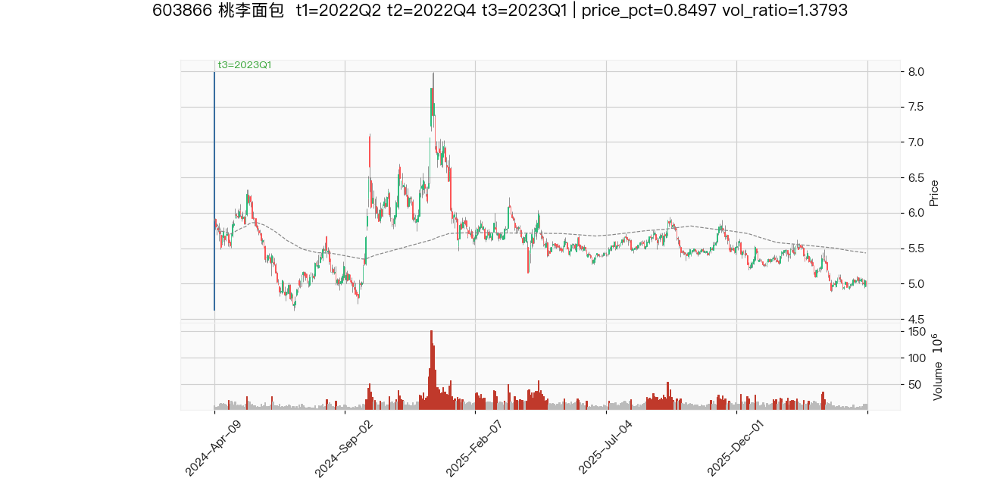

#### 🔍 检测依据 — 603866 桃李面包
> 最佳 triple: **2022Q2 → 2022Q4 → 2023Q1** ｜ B 触发: price_pct=0.85 vol_ratio=1.38 ｜ 候选 triple 数: 2

#### 📊 港中结持仓节奏 — 603866 桃李面包

| 季度     |   持股量(万股) |   持股市值(亿) |
|:-------|----------:|----------:|
| 2022Q4 |    6313.5 |      9.72 |
| 2023Q1 |   11191.4 |     17.43 |
| 2023Q2 |   12677.6 |     12.83 |
| 2023Q3 |    8015.3 |      6.73 |
| 2023Q4 |    6102.9 |      4.67 |
| 2024Q1 |    4930.4 |      3.07 |
| 2024Q2 |    4986.3 |      2.53 |
| 2024Q3 |    4942.8 |      2.68 |

#### ✍️ 人工复盘 — 603866 桃李面包

| 检查项 | 结果 |
|--------|------|
| t2 季度价格在近 250 日高位区间（视觉） | ⬜ |
| t2 季度出现明显放量 bar（红色高量） | ⬜ |
| t3 季度买回后股价未大幅上涨（非卖飞） | ⬜ |
| t1→t2→t3 三段节奏符合「建仓→出货→再建仓」 | ⬜ |

**决策**: ⬜ PASS（纳入关注名单）　⬜ REJECT（假信号）

**备注**: _（人工填写）_

### 000860 顺鑫农业 K 线 + 成交量
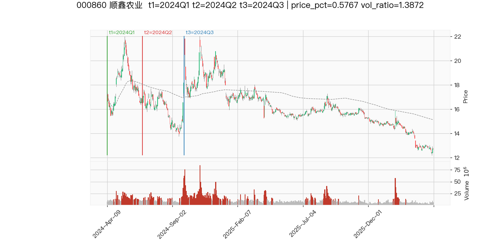

#### 🔍 检测依据 — 000860 顺鑫农业
> 最佳 triple: **2024Q1 → 2024Q2 → 2024Q3** ｜ B 触发: price_pct=0.58 vol_ratio=1.39 ｜ 候选 triple 数: 1

#### 📊 港中结持仓节奏 — 000860 顺鑫农业

| 季度     |   持股量(万股) |   持股市值(亿) |
|:-------|----------:|----------:|
| 2023Q1 |    1616.3 |      5.59 |
| 2023Q2 |     958.8 |      3.29 |
| 2023Q3 |     813   |      1.88 |
| 2023Q4 |     415.2 |      0.88 |
| 2024Q1 |     841.3 |      1.51 |
| 2024Q2 |     589.3 |      0.99 |
| 2024Q3 |     865.2 |      1.43 |

#### ✍️ 人工复盘 — 000860 顺鑫农业

| 检查项 | 结果 |
|--------|------|
| t2 季度价格在近 250 日高位区间（视觉） | ⬜ |
| t2 季度出现明显放量 bar（红色高量） | ⬜ |
| t3 季度买回后股价未大幅上涨（非卖飞） | ⬜ |
| t1→t2→t3 三段节奏符合「建仓→出货→再建仓」 | ⬜ |

**决策**: ⬜ PASS（纳入关注名单）　⬜ REJECT（假信号）

**备注**: _（人工填写）_

### 002839 张家港行 K 线 + 成交量
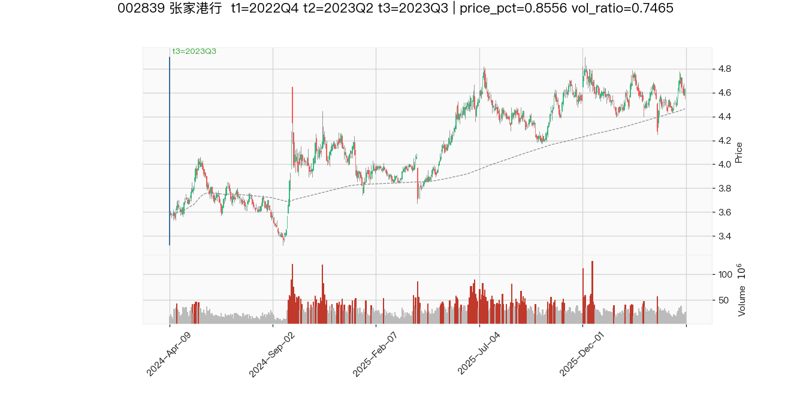

#### 🔍 检测依据 — 002839 张家港行
> 最佳 triple: **2022Q4 → 2023Q2 → 2023Q3** ｜ B 触发: price_pct=0.86 vol_ratio=0.75 ｜ 候选 triple 数: 2

#### 📊 港中结持仓节奏 — 002839 张家港行

| 季度     |   持股量(万股) |   持股市值(亿) |
|:-------|----------:|----------:|
| 2022Q4 |    6511.2 |      3    |
| 2023Q1 |    6727.1 |      3.01 |
| 2023Q2 |    4443.4 |      1.85 |
| 2023Q3 |    7316.6 |      3.27 |
| 2023Q4 |    5388.9 |      2.09 |
| 2024Q1 |    8156.1 |      3.24 |
| 2024Q2 |   10304.5 |      4.14 |
| 2024Q3 |   10199.6 |      3.99 |

#### ✍️ 人工复盘 — 002839 张家港行

| 检查项 | 结果 |
|--------|------|
| t2 季度价格在近 250 日高位区间（视觉） | ⬜ |
| t2 季度出现明显放量 bar（红色高量） | ⬜ |
| t3 季度买回后股价未大幅上涨（非卖飞） | ⬜ |
| t1→t2→t3 三段节奏符合「建仓→出货→再建仓」 | ⬜ |

**决策**: ⬜ PASS（纳入关注名单）　⬜ REJECT（假信号）

**备注**: _（人工填写）_

### 688006 杭可科技 K 线 + 成交量
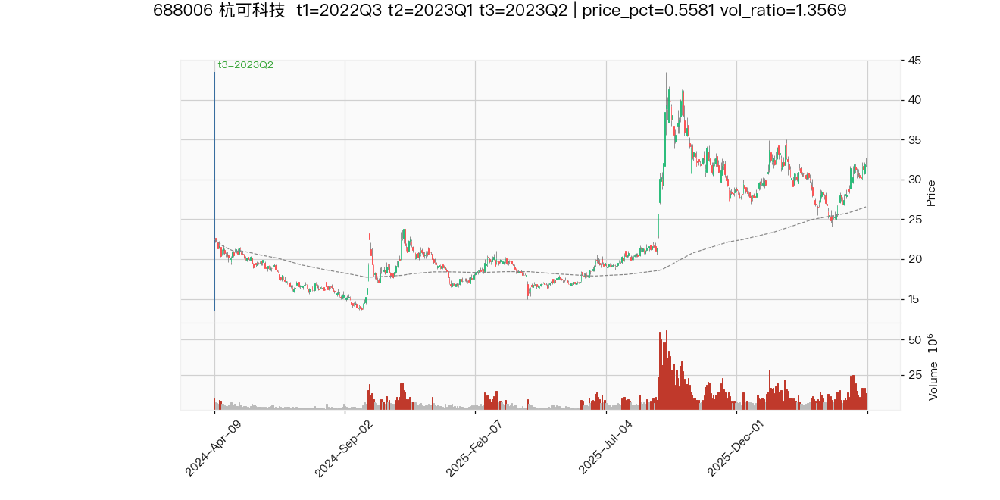

#### 🔍 检测依据 — 688006 杭可科技
> 最佳 triple: **2022Q3 → 2023Q1 → 2023Q2** ｜ B 触发: price_pct=0.56 vol_ratio=1.36 ｜ 候选 triple 数: 2

#### 📊 港中结持仓节奏 — 688006 杭可科技

| 季度     |   持股量(万股) |   持股市值(亿) |
|:-------|----------:|----------:|
| 2022Q4 |    1963.9 |      8.6  |
| 2023Q1 |    1678.9 |      7.52 |
| 2023Q2 |    2163.7 |      6.52 |
| 2023Q3 |    1777.8 |      4.65 |
| 2023Q4 |    1205.4 |      2.83 |
| 2024Q1 |     595.6 |      1.26 |
| 2024Q2 |     307.3 |      0.54 |
| 2024Q3 |     274.3 |      0.46 |

#### ✍️ 人工复盘 — 688006 杭可科技

| 检查项 | 结果 |
|--------|------|
| t2 季度价格在近 250 日高位区间（视觉） | ⬜ |
| t2 季度出现明显放量 bar（红色高量） | ⬜ |
| t3 季度买回后股价未大幅上涨（非卖飞） | ⬜ |
| t1→t2→t3 三段节奏符合「建仓→出货→再建仓」 | ⬜ |

**决策**: ⬜ PASS（纳入关注名单）　⬜ REJECT（假信号）

**备注**: _（人工填写）_

### 300693 盛弘股份 K 线 + 成交量
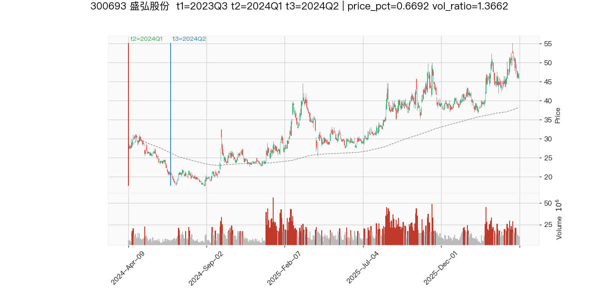

#### 🔍 检测依据 — 300693 盛弘股份
> 最佳 triple: **2023Q3 → 2024Q1 → 2024Q2** ｜ B 触发: price_pct=0.67 vol_ratio=1.37 ｜ 候选 triple 数: 1

#### 📊 港中结持仓节奏 — 300693 盛弘股份

| 季度     |   持股量(万股) |   持股市值(亿) |
|:-------|----------:|----------:|
| 2023Q1 |     168.7 |      1    |
| 2023Q2 |     324.4 |      1.17 |
| 2023Q3 |     829.4 |      2.53 |
| 2023Q4 |     435.2 |      1.3  |
| 2024Q1 |     189.2 |      0.56 |
| 2024Q2 |     265.9 |      0.56 |
| 2024Q3 |     285.1 |      0.56 |

#### ✍️ 人工复盘 — 300693 盛弘股份

| 检查项 | 结果 |
|--------|------|
| t2 季度价格在近 250 日高位区间（视觉） | ⬜ |
| t2 季度出现明显放量 bar（红色高量） | ⬜ |
| t3 季度买回后股价未大幅上涨（非卖飞） | ⬜ |
| t1→t2→t3 三段节奏符合「建仓→出货→再建仓」 | ⬜ |

**决策**: ⬜ PASS（纳入关注名单）　⬜ REJECT（假信号）

**备注**: _（人工填写）_

### 600210 紫江企业 K 线 + 成交量
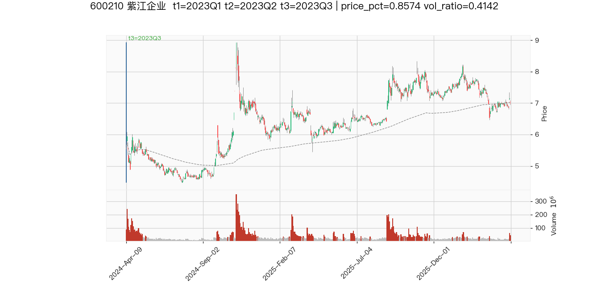

#### 🔍 检测依据 — 600210 紫江企业
> 最佳 triple: **2023Q1 → 2023Q2 → 2023Q3** ｜ B 触发: price_pct=0.86 vol_ratio=0.41 ｜ 候选 triple 数: 3

#### 📊 港中结持仓节奏 — 600210 紫江企业

| 季度     |   持股量(万股) |   持股市值(亿) |
|:-------|----------:|----------:|
| 2022Q4 |    2527.7 |      1.26 |
| 2023Q1 |    2741.5 |      1.55 |
| 2023Q2 |    1657.1 |      0.88 |
| 2023Q3 |    4448.5 |      2.39 |
| 2023Q4 |    1733.2 |      0.81 |
| 2024Q1 |    1299.5 |      0.68 |
| 2024Q2 |    4598.9 |      2.45 |
| 2024Q3 |    3437.6 |      1.67 |

#### ✍️ 人工复盘 — 600210 紫江企业

| 检查项 | 结果 |
|--------|------|
| t2 季度价格在近 250 日高位区间（视觉） | ⬜ |
| t2 季度出现明显放量 bar（红色高量） | ⬜ |
| t3 季度买回后股价未大幅上涨（非卖飞） | ⬜ |
| t1→t2→t3 三段节奏符合「建仓→出货→再建仓」 | ⬜ |

**决策**: ⬜ PASS（纳入关注名单）　⬜ REJECT（假信号）

**备注**: _（人工填写）_

### 002063 远光软件 K 线 + 成交量
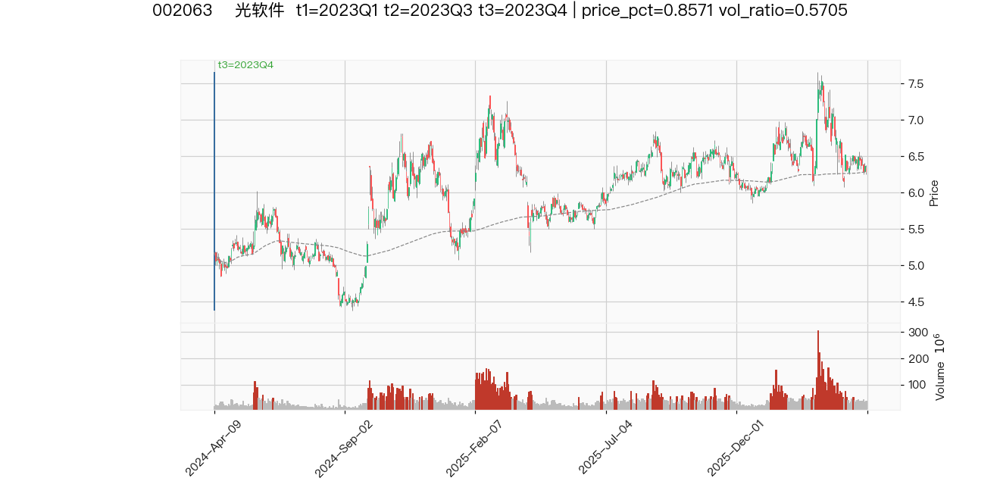

#### 🔍 检测依据 — 002063 远光软件
> 最佳 triple: **2023Q1 → 2023Q3 → 2023Q4** ｜ B 触发: price_pct=0.86 vol_ratio=0.57 ｜ 候选 triple 数: 2

#### 📊 港中结持仓节奏 — 002063 远光软件

| 季度     |   持股量(万股) |   持股市值(亿) |
|:-------|----------:|----------:|
| 2022Q4 |    1366.7 |      1.04 |
| 2023Q1 |    2868.8 |      2.68 |
| 2023Q2 |    2730.5 |      1.98 |
| 2023Q3 |    1841.8 |      1.13 |
| 2023Q4 |    2195.7 |      1.36 |
| 2024Q1 |    2449.2 |      1.31 |
| 2024Q2 |    1500.1 |      0.79 |
| 2024Q3 |    1402.6 |      0.72 |

#### ✍️ 人工复盘 — 002063 远光软件

| 检查项 | 结果 |
|--------|------|
| t2 季度价格在近 250 日高位区间（视觉） | ⬜ |
| t2 季度出现明显放量 bar（红色高量） | ⬜ |
| t3 季度买回后股价未大幅上涨（非卖飞） | ⬜ |
| t1→t2→t3 三段节奏符合「建仓→出货→再建仓」 | ⬜ |

**决策**: ⬜ PASS（纳入关注名单）　⬜ REJECT（假信号）

**备注**: _（人工填写）_

### 000589 贵州轮胎 K 线 + 成交量
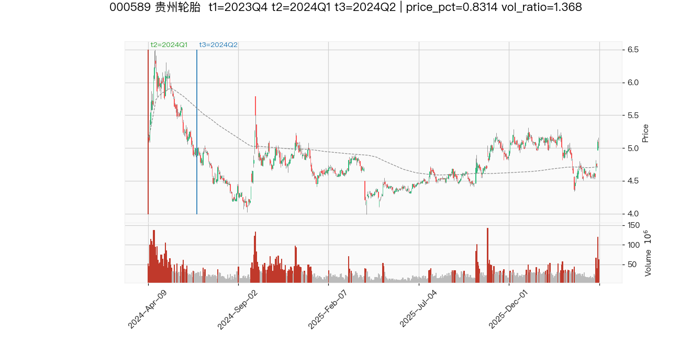

#### 🔍 检测依据 — 000589 贵州轮胎
> 最佳 triple: **2023Q4 → 2024Q1 → 2024Q2** ｜ B 触发: price_pct=0.83 vol_ratio=1.37 ｜ 候选 triple 数: 1

#### 📊 港中结持仓节奏 — 000589 贵州轮胎

| 季度     |   持股量(万股) |   持股市值(亿) |
|:-------|----------:|----------:|
| 2023Q1 |     402   |      0.21 |
| 2023Q2 |    1466.9 |      0.81 |
| 2023Q3 |    1902.8 |      1.28 |
| 2023Q4 |    2906.7 |      1.78 |
| 2024Q1 |    1903.6 |      1.06 |
| 2024Q2 |    2942.7 |      1.49 |
| 2024Q3 |     741.1 |      0.34 |

#### ✍️ 人工复盘 — 000589 贵州轮胎

| 检查项 | 结果 |
|--------|------|
| t2 季度价格在近 250 日高位区间（视觉） | ⬜ |
| t2 季度出现明显放量 bar（红色高量） | ⬜ |
| t3 季度买回后股价未大幅上涨（非卖飞） | ⬜ |
| t1→t2→t3 三段节奏符合「建仓→出货→再建仓」 | ⬜ |

**决策**: ⬜ PASS（纳入关注名单）　⬜ REJECT（假信号）

**备注**: _（人工填写）_

### 002212 天融信 K 线 + 成交量
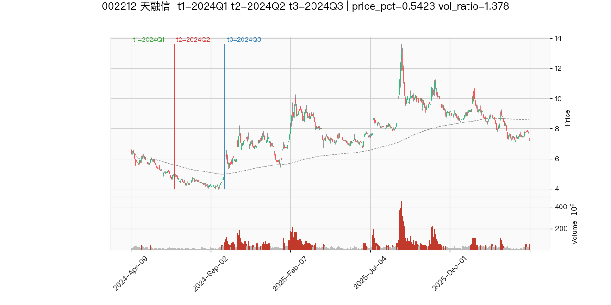

#### 🔍 检测依据 — 002212 天融信
> 最佳 triple: **2024Q1 → 2024Q2 → 2024Q3** ｜ B 触发: price_pct=0.54 vol_ratio=1.38 ｜ 候选 triple 数: 1

#### 📊 港中结持仓节奏 — 002212 天融信

| 季度     |   持股量(万股) |   持股市值(亿) |
|:-------|----------:|----------:|
| 2023Q1 |    2299.3 |      2.77 |
| 2023Q2 |    2124.9 |      2.05 |
| 2023Q3 |    1459.1 |      1.31 |
| 2023Q4 |    1834.5 |      1.79 |
| 2024Q1 |    3953.7 |      2.77 |
| 2024Q2 |    2888.7 |      1.41 |
| 2024Q3 |    3509.4 |      1.52 |

#### ✍️ 人工复盘 — 002212 天融信

| 检查项 | 结果 |
|--------|------|
| t2 季度价格在近 250 日高位区间（视觉） | ⬜ |
| t2 季度出现明显放量 bar（红色高量） | ⬜ |
| t3 季度买回后股价未大幅上涨（非卖飞） | ⬜ |
| t1→t2→t3 三段节奏符合「建仓→出货→再建仓」 | ⬜ |

**决策**: ⬜ PASS（纳入关注名单）　⬜ REJECT（假信号）

**备注**: _（人工填写）_

### 603595 ST东尼 K 线 + 成交量
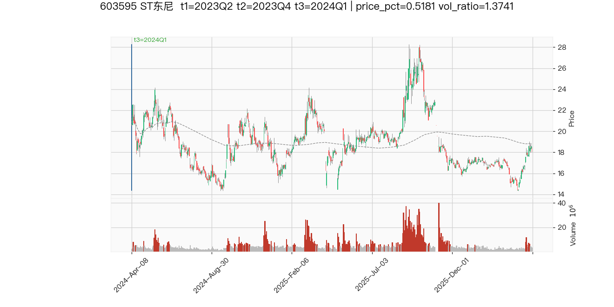

#### 🔍 检测依据 — 603595 ST东尼
> 最佳 triple: **2023Q2 → 2023Q4 → 2024Q1** ｜ B 触发: price_pct=0.52 vol_ratio=1.37 ｜ 候选 triple 数: 3

#### 📊 港中结持仓节奏 — 603595 ST东尼

| 季度     |   持股量(万股) |   持股市值(亿) |
|:-------|----------:|----------:|
| 2023Q1 |     147.4 |      0.72 |
| 2023Q2 |     316   |      1.23 |
| 2023Q3 |     119.6 |      0.4  |
| 2023Q4 |      97.3 |      0.36 |
| 2024Q1 |     442.8 |      0.97 |
| 2024Q2 |     372.6 |      0.77 |
| 2024Q3 |     423.5 |      0.69 |

#### ✍️ 人工复盘 — 603595 ST东尼

| 检查项 | 结果 |
|--------|------|
| t2 季度价格在近 250 日高位区间（视觉） | ⬜ |
| t2 季度出现明显放量 bar（红色高量） | ⬜ |
| t3 季度买回后股价未大幅上涨（非卖飞） | ⬜ |
| t1→t2→t3 三段节奏符合「建仓→出货→再建仓」 | ⬜ |

**决策**: ⬜ PASS（纳入关注名单）　⬜ REJECT（假信号）

**备注**: _（人工填写）_

### 600195 中牧股份 K 线 + 成交量
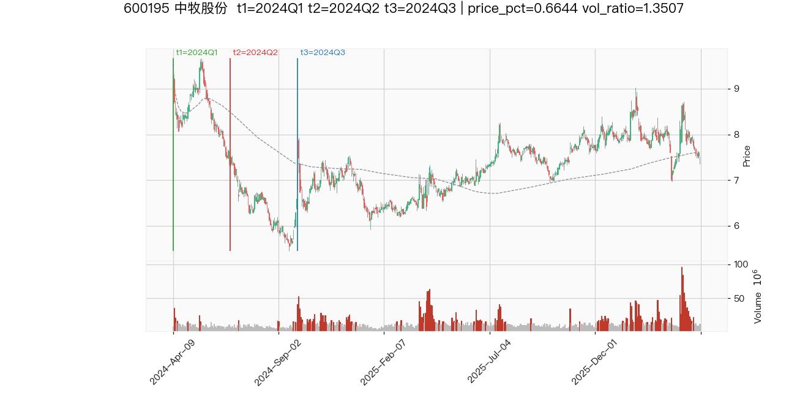

#### 🔍 检测依据 — 600195 中牧股份
> 最佳 triple: **2024Q1 → 2024Q2 → 2024Q3** ｜ B 触发: price_pct=0.66 vol_ratio=1.35 ｜ 候选 triple 数: 1

#### 📊 港中结持仓节奏 — 600195 中牧股份

| 季度     |   持股量(万股) |   持股市值(亿) |
|:-------|----------:|----------:|
| 2022Q4 |      20.2 |      0.02 |
| 2023Q1 |     234.3 |      0.35 |
| 2023Q2 |     410.6 |      0.48 |
| 2023Q3 |     400.1 |      0.45 |
| 2023Q4 |     463   |      0.55 |
| 2024Q1 |     909.7 |      0.85 |
| 2024Q2 |     695.1 |      0.52 |
| 2024Q3 |     978.7 |      0.63 |

#### ✍️ 人工复盘 — 600195 中牧股份

| 检查项 | 结果 |
|--------|------|
| t2 季度价格在近 250 日高位区间（视觉） | ⬜ |
| t2 季度出现明显放量 bar（红色高量） | ⬜ |
| t3 季度买回后股价未大幅上涨（非卖飞） | ⬜ |
| t1→t2→t3 三段节奏符合「建仓→出货→再建仓」 | ⬜ |

**决策**: ⬜ PASS（纳入关注名单）　⬜ REJECT（假信号）

**备注**: _（人工填写）_

### 688139 海尔生物 K 线 + 成交量
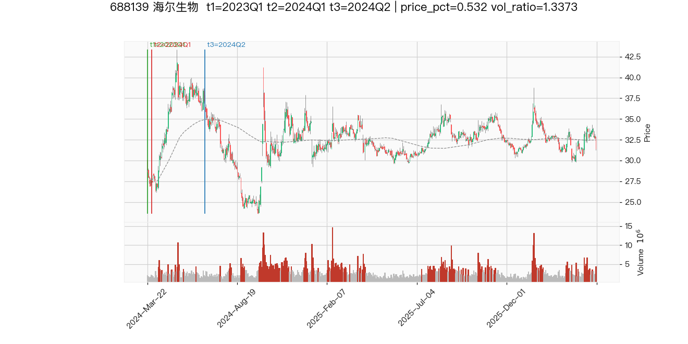

#### 🔍 检测依据 — 688139 海尔生物
> 最佳 triple: **2023Q1 → 2024Q1 → 2024Q2** ｜ B 触发: price_pct=0.53 vol_ratio=1.34 ｜ 候选 triple 数: 1

#### 📊 港中结持仓节奏 — 688139 海尔生物

| 季度     |   持股量(万股) |   持股市值(亿) |
|:-------|----------:|----------:|
| 2022Q4 |    3136.5 |     19.85 |
| 2023Q1 |    3898.1 |     25.92 |
| 2023Q2 |    3680.7 |     18.71 |
| 2023Q3 |    3088   |     11.82 |
| 2023Q4 |    2836.7 |     11.49 |
| 2024Q1 |    2399.3 |      6.79 |
| 2024Q2 |    2649.7 |      9.86 |
| 2024Q3 |    1693.2 |      4.99 |

#### ✍️ 人工复盘 — 688139 海尔生物

| 检查项 | 结果 |
|--------|------|
| t2 季度价格在近 250 日高位区间（视觉） | ⬜ |
| t2 季度出现明显放量 bar（红色高量） | ⬜ |
| t3 季度买回后股价未大幅上涨（非卖飞） | ⬜ |
| t1→t2→t3 三段节奏符合「建仓→出货→再建仓」 | ⬜ |

**决策**: ⬜ PASS（纳入关注名单）　⬜ REJECT（假信号）

**备注**: _（人工填写）_

### 002959 小熊电器 K 线 + 成交量
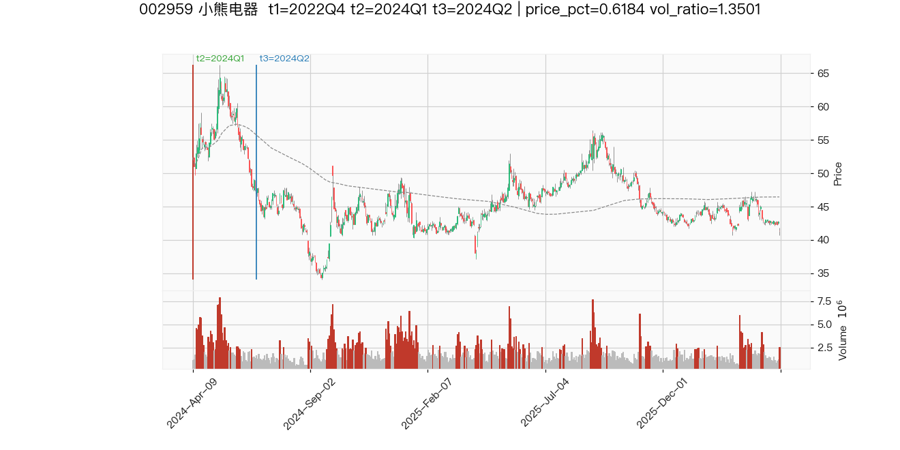

#### 🔍 检测依据 — 002959 小熊电器
> 最佳 triple: **2022Q4 → 2024Q1 → 2024Q2** ｜ B 触发: price_pct=0.62 vol_ratio=1.35 ｜ 候选 triple 数: 1

#### 📊 港中结持仓节奏 — 002959 小熊电器

| 季度     |   持股量(万股) |   持股市值(亿) |
|:-------|----------:|----------:|
| 2022Q4 |     743   |      4.48 |
| 2023Q1 |     666.9 |      4.7  |
| 2023Q2 |     518   |      4.44 |
| 2023Q3 |     402.5 |      2.34 |
| 2023Q4 |     144.6 |      0.75 |
| 2024Q1 |      75.7 |      0.42 |
| 2024Q2 |      91.5 |      0.44 |
| 2024Q3 |      83.1 |      0.38 |

#### ✍️ 人工复盘 — 002959 小熊电器

| 检查项 | 结果 |
|--------|------|
| t2 季度价格在近 250 日高位区间（视觉） | ⬜ |
| t2 季度出现明显放量 bar（红色高量） | ⬜ |
| t3 季度买回后股价未大幅上涨（非卖飞） | ⬜ |
| t1→t2→t3 三段节奏符合「建仓→出货→再建仓」 | ⬜ |

**决策**: ⬜ PASS（纳入关注名单）　⬜ REJECT（假信号）

**备注**: _（人工填写）_

### 300088 长信科技 K 线 + 成交量
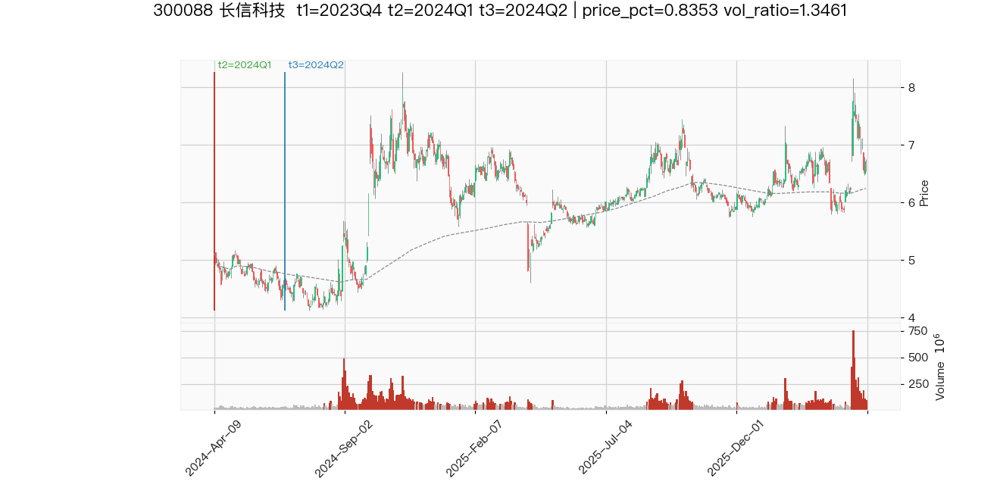

#### 🔍 检测依据 — 300088 长信科技
> 最佳 triple: **2023Q4 → 2024Q1 → 2024Q2** ｜ B 触发: price_pct=0.84 vol_ratio=1.35 ｜ 候选 triple 数: 2

#### 📊 港中结持仓节奏 — 300088 长信科技

| 季度     |   持股量(万股) |   持股市值(亿) |
|:-------|----------:|----------:|
| 2022Q4 |    1343   |      0.8  |
| 2023Q1 |    3989.3 |      2.8  |
| 2023Q2 |    1534.1 |      0.91 |
| 2023Q3 |    2393.7 |      1.47 |
| 2023Q4 |    4439.2 |      2.97 |
| 2024Q1 |    3012.9 |      1.57 |
| 2024Q2 |    3321.5 |      1.56 |
| 2024Q3 |    2343.5 |      1.09 |

#### ✍️ 人工复盘 — 300088 长信科技

| 检查项 | 结果 |
|--------|------|
| t2 季度价格在近 250 日高位区间（视觉） | ⬜ |
| t2 季度出现明显放量 bar（红色高量） | ⬜ |
| t3 季度买回后股价未大幅上涨（非卖飞） | ⬜ |
| t1→t2→t3 三段节奏符合「建仓→出货→再建仓」 | ⬜ |

**决策**: ⬜ PASS（纳入关注名单）　⬜ REJECT（假信号）

**备注**: _（人工填写）_

### 002675 东诚药业 K 线 + 成交量
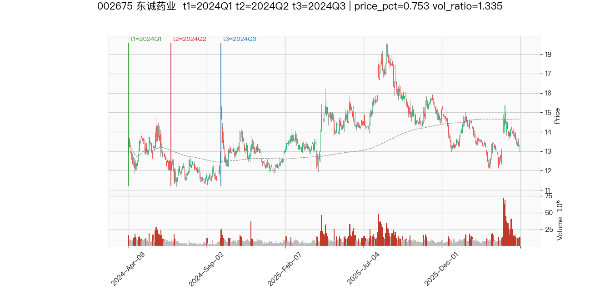

#### 🔍 检测依据 — 002675 东诚药业
> 最佳 triple: **2024Q1 → 2024Q2 → 2024Q3** ｜ B 触发: price_pct=0.75 vol_ratio=1.33 ｜ 候选 triple 数: 2

#### 📊 港中结持仓节奏 — 002675 东诚药业

| 季度     |   持股量(万股) |   持股市值(亿) |
|:-------|----------:|----------:|
| 2022Q4 |    3311.5 |      5.48 |
| 2023Q1 |    2477.1 |      4.04 |
| 2023Q2 |    1100.3 |      1.64 |
| 2023Q3 |    1241   |      2.06 |
| 2023Q4 |    1315.8 |      2.41 |
| 2024Q1 |    1599.7 |      2.24 |
| 2024Q2 |     706.8 |      0.87 |
| 2024Q3 |     852.9 |      1.04 |

#### ✍️ 人工复盘 — 002675 东诚药业

| 检查项 | 结果 |
|--------|------|
| t2 季度价格在近 250 日高位区间（视觉） | ⬜ |
| t2 季度出现明显放量 bar（红色高量） | ⬜ |
| t3 季度买回后股价未大幅上涨（非卖飞） | ⬜ |
| t1→t2→t3 三段节奏符合「建仓→出货→再建仓」 | ⬜ |

**决策**: ⬜ PASS（纳入关注名单）　⬜ REJECT（假信号）

**备注**: _（人工填写）_

### 300130 新国都 K 线 + 成交量
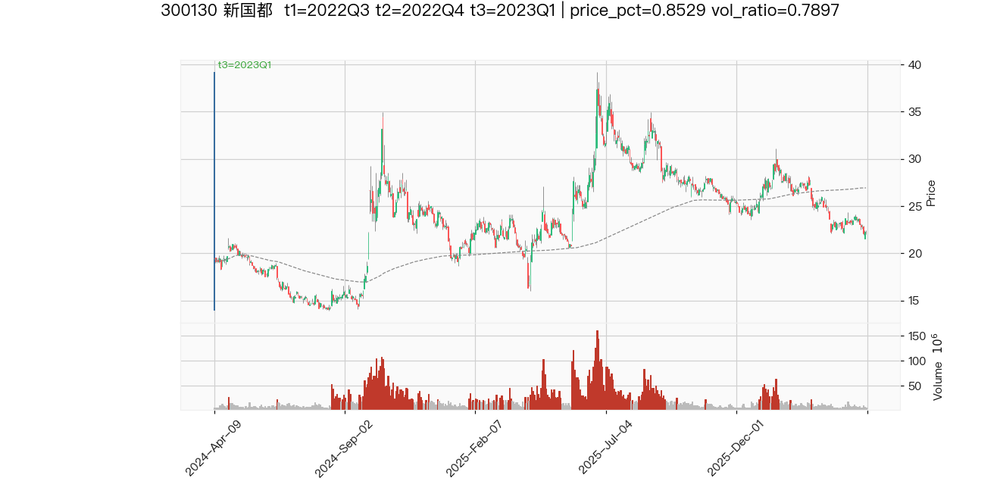

#### 🔍 检测依据 — 300130 新国都
> 最佳 triple: **2022Q3 → 2022Q4 → 2023Q1** ｜ B 触发: price_pct=0.85 vol_ratio=0.79 ｜ 候选 triple 数: 3

#### 📊 港中结持仓节奏 — 300130 新国都

| 季度     |   持股量(万股) |   持股市值(亿) |
|:-------|----------:|----------:|
| 2022Q4 |     300.9 |      0.36 |
| 2023Q1 |     447.5 |      0.81 |
| 2023Q2 |    1071.4 |      2.82 |
| 2023Q3 |    1147.9 |      2.83 |
| 2023Q4 |     590   |      1.43 |
| 2024Q1 |     682.4 |      1.47 |
| 2024Q2 |     508.9 |      0.85 |
| 2024Q3 |     580   |      0.85 |

#### ✍️ 人工复盘 — 300130 新国都

| 检查项 | 结果 |
|--------|------|
| t2 季度价格在近 250 日高位区间（视觉） | ⬜ |
| t2 季度出现明显放量 bar（红色高量） | ⬜ |
| t3 季度买回后股价未大幅上涨（非卖飞） | ⬜ |
| t1→t2→t3 三段节奏符合「建仓→出货→再建仓」 | ⬜ |

**决策**: ⬜ PASS（纳入关注名单）　⬜ REJECT（假信号）

**备注**: _（人工填写）_

### 688212 澳华内镜 K 线 + 成交量
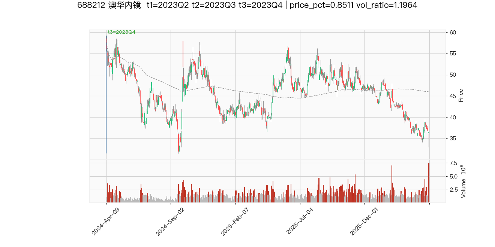

#### 🔍 检测依据 — 688212 澳华内镜
> 最佳 triple: **2023Q2 → 2023Q3 → 2023Q4** ｜ B 触发: price_pct=0.85 vol_ratio=1.20 ｜ 候选 triple 数: 2

#### 📊 港中结持仓节奏 — 688212 澳华内镜

| 季度     |   持股量(万股) |   持股市值(亿) |
|:-------|----------:|----------:|
| 2023Q1 |      23.5 |      0.15 |
| 2023Q2 |      59.1 |      0.41 |
| 2023Q3 |      48.4 |      0.29 |
| 2023Q4 |     142.6 |      0.88 |
| 2024Q1 |      96.2 |      0.57 |
| 2024Q2 |     104.6 |      0.42 |
| 2024Q3 |      79.3 |      0.33 |

#### ✍️ 人工复盘 — 688212 澳华内镜

| 检查项 | 结果 |
|--------|------|
| t2 季度价格在近 250 日高位区间（视觉） | ⬜ |
| t2 季度出现明显放量 bar（红色高量） | ⬜ |
| t3 季度买回后股价未大幅上涨（非卖飞） | ⬜ |
| t1→t2→t3 三段节奏符合「建仓→出货→再建仓」 | ⬜ |

**决策**: ⬜ PASS（纳入关注名单）　⬜ REJECT（假信号）

**备注**: _（人工填写）_

### 601595 上海电影 K 线 + 成交量
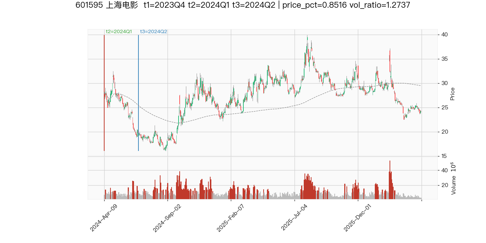

#### 🔍 检测依据 — 601595 上海电影
> 最佳 triple: **2023Q4 → 2024Q1 → 2024Q2** ｜ B 触发: price_pct=0.85 vol_ratio=1.27 ｜ 候选 triple 数: 2

#### 📊 港中结持仓节奏 — 601595 上海电影

| 季度     |   持股量(万股) |   持股市值(亿) |
|:-------|----------:|----------:|
| 2022Q4 |       0.1 |      0    |
| 2023Q1 |       0   |      0    |
| 2023Q2 |     237.6 |      0.67 |
| 2023Q3 |     165.6 |      0.36 |
| 2023Q4 |     373.9 |      0.97 |
| 2024Q1 |     169.7 |      0.52 |
| 2024Q2 |     290.2 |      0.57 |
| 2024Q3 |     405.7 |      0.75 |

#### ✍️ 人工复盘 — 601595 上海电影

| 检查项 | 结果 |
|--------|------|
| t2 季度价格在近 250 日高位区间（视觉） | ⬜ |
| t2 季度出现明显放量 bar（红色高量） | ⬜ |
| t3 季度买回后股价未大幅上涨（非卖飞） | ⬜ |
| t1→t2→t3 三段节奏符合「建仓→出货→再建仓」 | ⬜ |

**决策**: ⬜ PASS（纳入关注名单）　⬜ REJECT（假信号）

**备注**: _（人工填写）_

### 603711 香飘飘 K 线 + 成交量
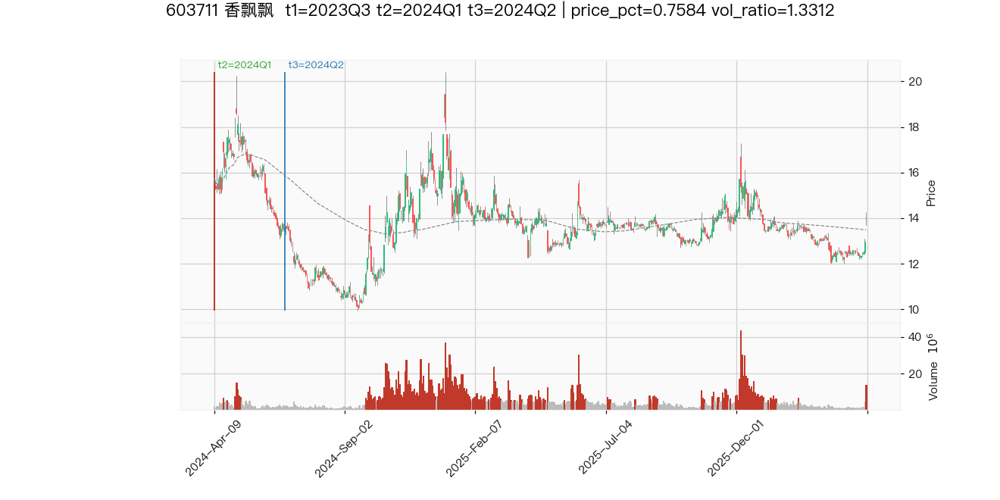

#### 🔍 检测依据 — 603711 香飘飘
> 最佳 triple: **2023Q3 → 2024Q1 → 2024Q2** ｜ B 触发: price_pct=0.76 vol_ratio=1.33 ｜ 候选 triple 数: 1

#### 📊 港中结持仓节奏 — 603711 香飘飘

| 季度     |   持股量(万股) |   持股市值(亿) |
|:-------|----------:|----------:|
| 2022Q4 |      34.5 |      0.05 |
| 2023Q1 |     224   |      0.43 |
| 2023Q2 |     307.3 |      0.63 |
| 2023Q3 |     590.3 |      0.97 |
| 2023Q4 |     497.1 |      0.85 |
| 2024Q1 |     292.8 |      0.46 |
| 2024Q2 |     363.5 |      0.5  |
| 2024Q3 |     460.6 |      0.53 |

#### ✍️ 人工复盘 — 603711 香飘飘

| 检查项 | 结果 |
|--------|------|
| t2 季度价格在近 250 日高位区间（视觉） | ⬜ |
| t2 季度出现明显放量 bar（红色高量） | ⬜ |
| t3 季度买回后股价未大幅上涨（非卖飞） | ⬜ |
| t1→t2→t3 三段节奏符合「建仓→出货→再建仓」 | ⬜ |

**决策**: ⬜ PASS（纳入关注名单）　⬜ REJECT（假信号）

**备注**: _（人工填写）_

### 000823 超声电子 K 线 + 成交量
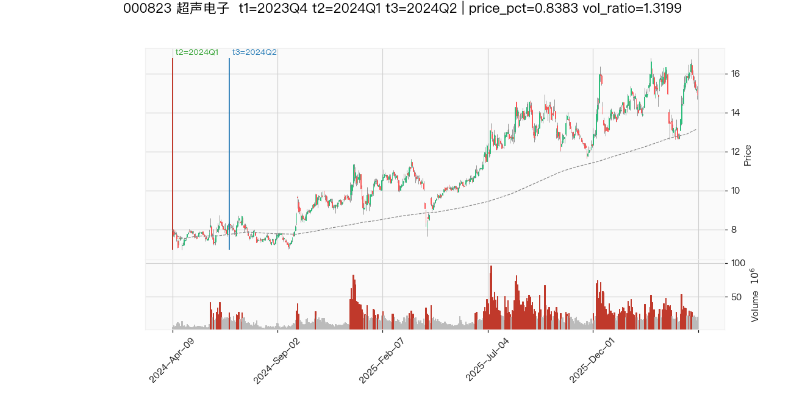

#### 🔍 检测依据 — 000823 超声电子
> 最佳 triple: **2023Q4 → 2024Q1 → 2024Q2** ｜ B 触发: price_pct=0.84 vol_ratio=1.32 ｜ 候选 triple 数: 2

#### 📊 港中结持仓节奏 — 000823 超声电子

| 季度     |   持股量(万股) |   持股市值(亿) |
|:-------|----------:|----------:|
| 2022Q4 |      66.1 |      0.06 |
| 2023Q1 |     317.7 |      0.36 |
| 2023Q2 |     790.7 |      0.74 |
| 2023Q3 |     758.3 |      0.7  |
| 2023Q4 |    1291.5 |      1.24 |
| 2024Q1 |     616.5 |      0.51 |
| 2024Q2 |     882.3 |      0.75 |
| 2024Q3 |     981.9 |      0.77 |

#### ✍️ 人工复盘 — 000823 超声电子

| 检查项 | 结果 |
|--------|------|
| t2 季度价格在近 250 日高位区间（视觉） | ⬜ |
| t2 季度出现明显放量 bar（红色高量） | ⬜ |
| t3 季度买回后股价未大幅上涨（非卖飞） | ⬜ |
| t1→t2→t3 三段节奏符合「建仓→出货→再建仓」 | ⬜ |

**决策**: ⬜ PASS（纳入关注名单）　⬜ REJECT（假信号）

**备注**: _（人工填写）_

### 300761 立华股份 K 线 + 成交量
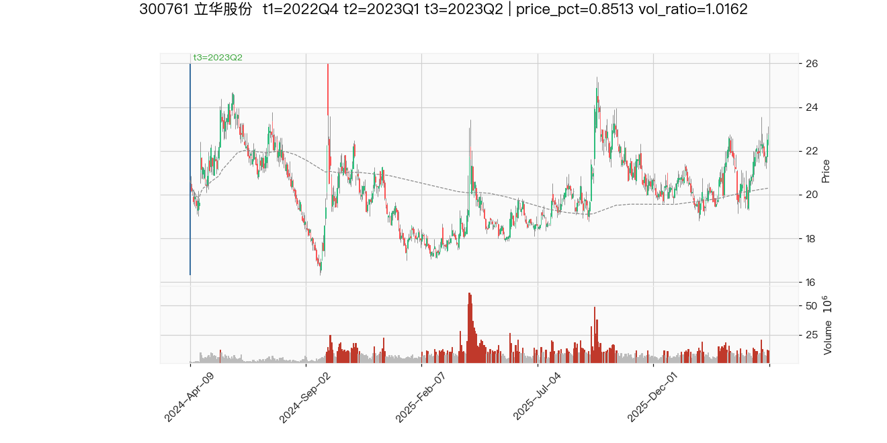

#### 🔍 检测依据 — 300761 立华股份
> 最佳 triple: **2022Q4 → 2023Q1 → 2023Q2** ｜ B 触发: price_pct=0.85 vol_ratio=1.02 ｜ 候选 triple 数: 2

#### 📊 港中结持仓节奏 — 300761 立华股份

| 季度     |   持股量(万股) |   持股市值(亿) |
|:-------|----------:|----------:|
| 2022Q4 |     445.7 |      1.53 |
| 2023Q1 |     325.9 |      1.29 |
| 2023Q2 |     401.9 |      0.74 |
| 2023Q3 |     395.8 |      0.68 |
| 2023Q4 |     411.2 |      0.86 |
| 2024Q1 |     407.8 |      0.82 |
| 2024Q2 |     433.7 |      0.98 |
| 2024Q3 |     526.8 |      1.11 |

#### ✍️ 人工复盘 — 300761 立华股份

| 检查项 | 结果 |
|--------|------|
| t2 季度价格在近 250 日高位区间（视觉） | ⬜ |
| t2 季度出现明显放量 bar（红色高量） | ⬜ |
| t3 季度买回后股价未大幅上涨（非卖飞） | ⬜ |
| t1→t2→t3 三段节奏符合「建仓→出货→再建仓」 | ⬜ |

**决策**: ⬜ PASS（纳入关注名单）　⬜ REJECT（假信号）

**备注**: _（人工填写）_

### 600179 安通控股 K 线 + 成交量
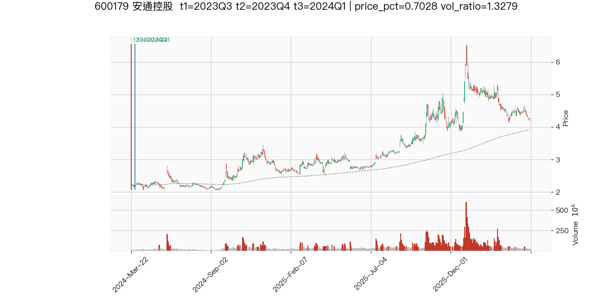

#### 🔍 检测依据 — 600179 安通控股
> 最佳 triple: **2023Q3 → 2023Q4 → 2024Q1** ｜ B 触发: price_pct=0.70 vol_ratio=1.33 ｜ 候选 triple 数: 1

#### 📊 港中结持仓节奏 — 600179 安通控股

| 季度     |   持股量(万股) |   持股市值(亿) |
|:-------|----------:|----------:|
| 2023Q1 |    1074   |      0.35 |
| 2023Q2 |    1027.6 |      0.28 |
| 2023Q3 |    1498.7 |      0.42 |
| 2023Q4 |    1161.8 |      0.29 |
| 2024Q1 |    1448.6 |      0.32 |
| 2024Q2 |    1756   |      0.41 |
| 2024Q3 |    1603.5 |      0.35 |

#### ✍️ 人工复盘 — 600179 安通控股

| 检查项 | 结果 |
|--------|------|
| t2 季度价格在近 250 日高位区间（视觉） | ⬜ |
| t2 季度出现明显放量 bar（红色高量） | ⬜ |
| t3 季度买回后股价未大幅上涨（非卖飞） | ⬜ |
| t1→t2→t3 三段节奏符合「建仓→出货→再建仓」 | ⬜ |

**决策**: ⬜ PASS（纳入关注名单）　⬜ REJECT（假信号）

**备注**: _（人工填写）_

### 300725 药石科技 K 线 + 成交量
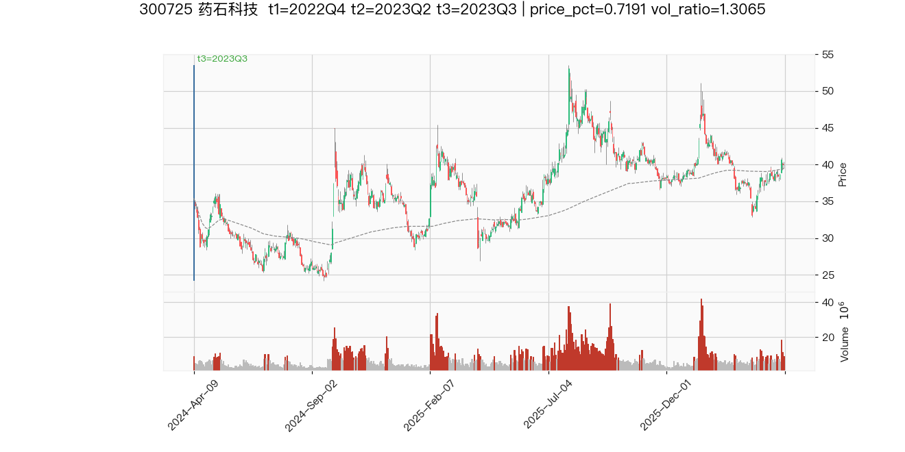

#### 🔍 检测依据 — 300725 药石科技
> 最佳 triple: **2022Q4 → 2023Q2 → 2023Q3** ｜ B 触发: price_pct=0.72 vol_ratio=1.31 ｜ 候选 triple 数: 4

#### 📊 港中结持仓节奏 — 300725 药石科技

| 季度     |   持股量(万股) |   持股市值(亿) |
|:-------|----------:|----------:|
| 2022Q4 |     208.9 |      1.68 |
| 2023Q1 |     169   |      1.19 |
| 2023Q2 |      98.4 |      0.47 |
| 2023Q3 |     271.4 |      1.23 |
| 2023Q4 |     125.9 |      0.49 |
| 2024Q1 |      78.5 |      0.31 |
| 2024Q2 |     245.3 |      0.66 |
| 2024Q3 |     220.6 |      0.65 |

#### ✍️ 人工复盘 — 300725 药石科技

| 检查项 | 结果 |
|--------|------|
| t2 季度价格在近 250 日高位区间（视觉） | ⬜ |
| t2 季度出现明显放量 bar（红色高量） | ⬜ |
| t3 季度买回后股价未大幅上涨（非卖飞） | ⬜ |
| t1→t2→t3 三段节奏符合「建仓→出货→再建仓」 | ⬜ |

**决策**: ⬜ PASS（纳入关注名单）　⬜ REJECT（假信号）

**备注**: _（人工填写）_

### 300324 旋极信息 K 线 + 成交量
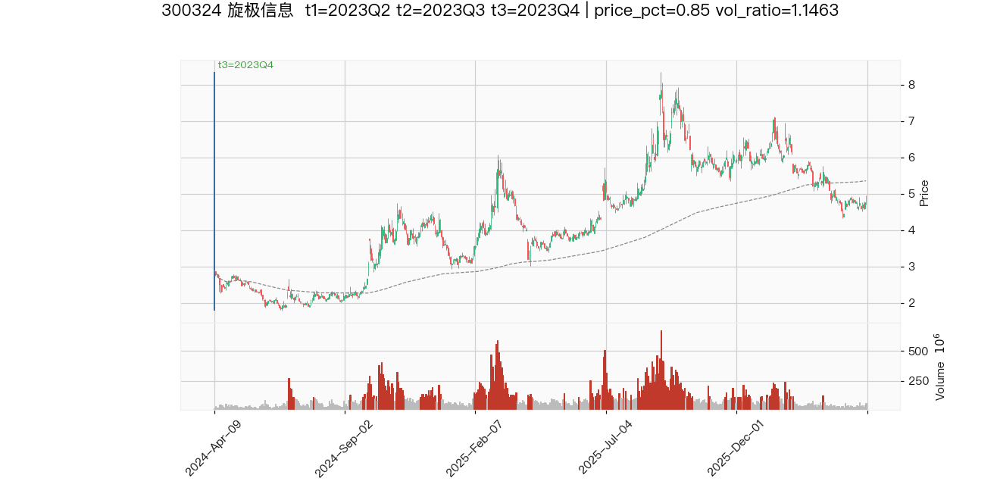

#### 🔍 检测依据 — 300324 旋极信息
> 最佳 triple: **2023Q2 → 2023Q3 → 2023Q4** ｜ B 触发: price_pct=0.85 vol_ratio=1.15 ｜ 候选 triple 数: 1

#### 📊 港中结持仓节奏 — 300324 旋极信息

| 季度     |   持股量(万股) |   持股市值(亿) |
|:-------|----------:|----------:|
| 2023Q1 |    1226.2 |      0.4  |
| 2023Q2 |    1593.2 |      0.51 |
| 2023Q3 |     941.4 |      0.3  |
| 2023Q4 |    1047   |      0.35 |
| 2024Q1 |    1031.6 |      0.31 |
| 2024Q2 |    1055   |      0.2  |
| 2024Q3 |    1444.5 |      0.32 |

#### ✍️ 人工复盘 — 300324 旋极信息

| 检查项 | 结果 |
|--------|------|
| t2 季度价格在近 250 日高位区间（视觉） | ⬜ |
| t2 季度出现明显放量 bar（红色高量） | ⬜ |
| t3 季度买回后股价未大幅上涨（非卖飞） | ⬜ |
| t1→t2→t3 三段节奏符合「建仓→出货→再建仓」 | ⬜ |

**决策**: ⬜ PASS（纳入关注名单）　⬜ REJECT（假信号）

**备注**: _（人工填写）_

### 002226 江南化工 K 线 + 成交量
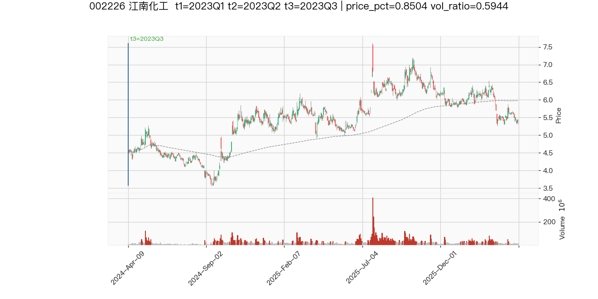

#### 🔍 检测依据 — 002226 江南化工
> 最佳 triple: **2023Q1 → 2023Q2 → 2023Q3** ｜ B 触发: price_pct=0.85 vol_ratio=0.59 ｜ 候选 triple 数: 2

#### 📊 港中结持仓节奏 — 002226 江南化工

| 季度     |   持股量(万股) |   持股市值(亿) |
|:-------|----------:|----------:|
| 2022Q4 |    1498.5 |      0.73 |
| 2023Q1 |    1685.1 |      0.9  |
| 2023Q2 |    1543.9 |      0.78 |
| 2023Q3 |    1987.2 |      1.02 |
| 2023Q4 |    1842.5 |      0.81 |
| 2024Q1 |    1909.6 |      0.87 |
| 2024Q2 |    3440.8 |      1.54 |
| 2024Q3 |    3478   |      1.52 |

#### ✍️ 人工复盘 — 002226 江南化工

| 检查项 | 结果 |
|--------|------|
| t2 季度价格在近 250 日高位区间（视觉） | ⬜ |
| t2 季度出现明显放量 bar（红色高量） | ⬜ |
| t3 季度买回后股价未大幅上涨（非卖飞） | ⬜ |
| t1→t2→t3 三段节奏符合「建仓→出货→再建仓」 | ⬜ |

**决策**: ⬜ PASS（纳入关注名单）　⬜ REJECT（假信号）

**备注**: _（人工填写）_

### 002416 爱施德 K 线 + 成交量
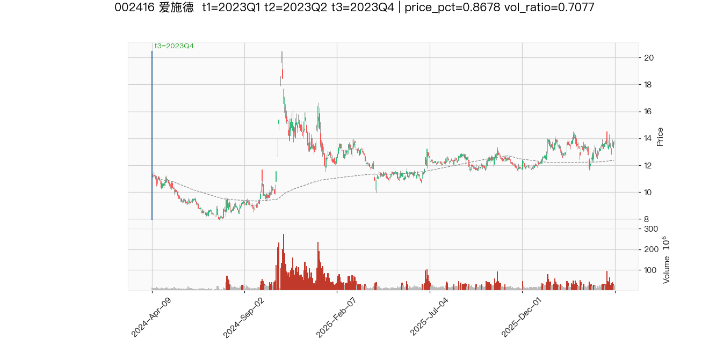

#### 🔍 检测依据 — 002416 爱施德
> 最佳 triple: **2023Q1 → 2023Q2 → 2023Q4** ｜ B 触发: price_pct=0.87 vol_ratio=0.71 ｜ t2 后 60 日收益: 8.1% ｜ 候选 triple 数: 2

#### 📊 港中结持仓节奏 — 002416 爱施德

| 季度     |   持股量(万股) |   持股市值(亿) |
|:-------|----------:|----------:|
| 2022Q4 |    1425.8 |      1.35 |
| 2023Q1 |    2479.3 |      2.28 |
| 2023Q2 |    1080.7 |      0.79 |
| 2023Q3 |    1002.8 |      0.75 |
| 2023Q4 |    2535.2 |      2.36 |
| 2024Q1 |    4592.2 |      5.24 |
| 2024Q2 |    2787   |      2.47 |
| 2024Q3 |     675.4 |      0.63 |

#### ✍️ 人工复盘 — 002416 爱施德

| 检查项 | 结果 |
|--------|------|
| t2 季度价格在近 250 日高位区间（视觉） | ⬜ |
| t2 季度出现明显放量 bar（红色高量） | ⬜ |
| t3 季度买回后股价未大幅上涨（非卖飞） | ⬜ |
| t1→t2→t3 三段节奏符合「建仓→出货→再建仓」 | ⬜ |

**决策**: ⬜ PASS（纳入关注名单）　⬜ REJECT（假信号）

**备注**: _（人工填写）_

### 601528 瑞丰银行 K 线 + 成交量
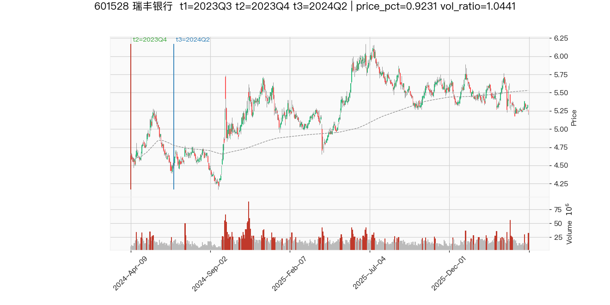

#### 🔍 检测依据 — 601528 瑞丰银行
> 最佳 triple: **2023Q3 → 2023Q4 → 2024Q2** ｜ B 触发: price_pct=0.92 vol_ratio=1.04 ｜ t2 后 60 日收益: 10.5% ｜ 候选 triple 数: 2

#### 📊 港中结持仓节奏 — 601528 瑞丰银行

| 季度     |   持股量(万股) |   持股市值(亿) |
|:-------|----------:|----------:|
| 2023Q1 |     308.2 |      0.22 |
| 2023Q2 |     228.4 |      0.11 |
| 2023Q3 |    2746.8 |      1.54 |
| 2023Q4 |    1709.6 |      0.85 |
| 2024Q1 |    1295.8 |      0.64 |
| 2024Q2 |    2600.5 |      1.23 |
| 2024Q3 |    3430.5 |      1.65 |

#### ✍️ 人工复盘 — 601528 瑞丰银行

| 检查项 | 结果 |
|--------|------|
| t2 季度价格在近 250 日高位区间（视觉） | ⬜ |
| t2 季度出现明显放量 bar（红色高量） | ⬜ |
| t3 季度买回后股价未大幅上涨（非卖飞） | ⬜ |
| t1→t2→t3 三段节奏符合「建仓→出货→再建仓」 | ⬜ |

**决策**: ⬜ PASS（纳入关注名单）　⬜ REJECT（假信号）

**备注**: _（人工填写）_

### 002745 木林森 K 线 + 成交量
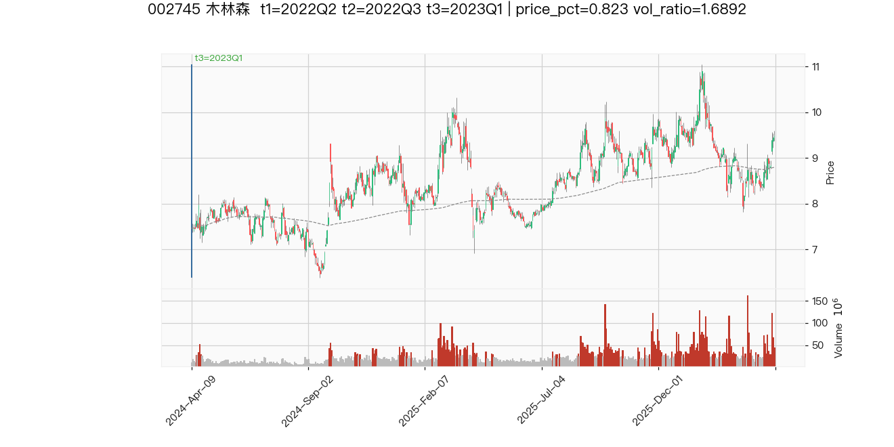

#### 🔍 检测依据 — 002745 木林森
> 最佳 triple: **2022Q2 → 2022Q3 → 2023Q1** ｜ B 触发: price_pct=0.82 vol_ratio=1.69 ｜ t2 后 60 日收益: 9.6% ｜ 候选 triple 数: 4

#### 📊 港中结持仓节奏 — 002745 木林森

| 季度     |   持股量(万股) |   持股市值(亿) |
|:-------|----------:|----------:|
| 2022Q4 |    2509.8 |      2.04 |
| 2023Q1 |    4796.8 |      4.5  |
| 2023Q2 |    4082.5 |      3.76 |
| 2023Q3 |    4447.7 |      3.98 |
| 2023Q4 |    7473.1 |      6.47 |
| 2024Q1 |    5954.9 |      4.63 |
| 2024Q2 |    6424.1 |      5.18 |
| 2024Q3 |    6030.2 |      4.77 |

#### ✍️ 人工复盘 — 002745 木林森

| 检查项 | 结果 |
|--------|------|
| t2 季度价格在近 250 日高位区间（视觉） | ⬜ |
| t2 季度出现明显放量 bar（红色高量） | ⬜ |
| t3 季度买回后股价未大幅上涨（非卖飞） | ⬜ |
| t1→t2→t3 三段节奏符合「建仓→出货→再建仓」 | ⬜ |

**决策**: ⬜ PASS（纳入关注名单）　⬜ REJECT（假信号）

**备注**: _（人工填写）_

### 000680 山推股份 K 线 + 成交量
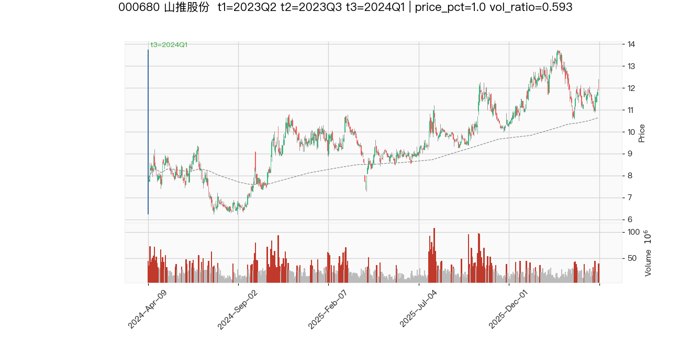

#### 🔍 检测依据 — 000680 山推股份
> 最佳 triple: **2023Q2 → 2023Q3 → 2024Q1** ｜ B 触发: price_pct=1.00 vol_ratio=0.59 ｜ t2 后 60 日收益: 13.5% ｜ 候选 triple 数: 3

#### 📊 港中结持仓节奏 — 000680 山推股份

| 季度     |   持股量(万股) |   持股市值(亿) |
|:-------|----------:|----------:|
| 2022Q4 |    1081.1 |      0.45 |
| 2023Q1 |    1338.4 |      0.62 |
| 2023Q2 |    2475.4 |      1.38 |
| 2023Q3 |    2334.1 |      1.12 |
| 2023Q4 |    1802.8 |      0.89 |
| 2024Q1 |    4926.7 |      3.87 |
| 2024Q2 |    3424.1 |      3.17 |
| 2024Q3 |    3632   |      2.35 |

#### ✍️ 人工复盘 — 000680 山推股份

| 检查项 | 结果 |
|--------|------|
| t2 季度价格在近 250 日高位区间（视觉） | ⬜ |
| t2 季度出现明显放量 bar（红色高量） | ⬜ |
| t3 季度买回后股价未大幅上涨（非卖飞） | ⬜ |
| t1→t2→t3 三段节奏符合「建仓→出货→再建仓」 | ⬜ |

**决策**: ⬜ PASS（纳入关注名单）　⬜ REJECT（假信号）

**备注**: _（人工填写）_

### 002194 武汉凡谷 K 线 + 成交量
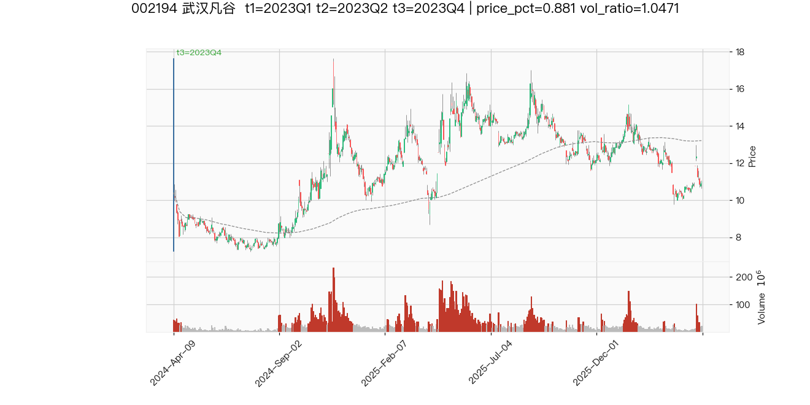

#### 🔍 检测依据 — 002194 武汉凡谷
> 最佳 triple: **2023Q1 → 2023Q2 → 2023Q4** ｜ B 触发: price_pct=0.88 vol_ratio=1.05 ｜ t2 后 60 日收益: 9.6% ｜ 候选 triple 数: 5

#### 📊 港中结持仓节奏 — 002194 武汉凡谷

| 季度     |   持股量(万股) |   持股市值(亿) |
|:-------|----------:|----------:|
| 2022Q4 |     484.2 |      0.45 |
| 2023Q1 |    1881.7 |      2.09 |
| 2023Q2 |     668.4 |      0.72 |
| 2023Q3 |     631.2 |      0.69 |
| 2023Q4 |    1306.3 |      1.29 |
| 2024Q1 |     619   |      0.57 |
| 2024Q2 |     447.6 |      0.36 |
| 2024Q3 |     696.3 |      0.55 |

#### ✍️ 人工复盘 — 002194 武汉凡谷

| 检查项 | 结果 |
|--------|------|
| t2 季度价格在近 250 日高位区间（视觉） | ⬜ |
| t2 季度出现明显放量 bar（红色高量） | ⬜ |
| t3 季度买回后股价未大幅上涨（非卖飞） | ⬜ |
| t1→t2→t3 三段节奏符合「建仓→出货→再建仓」 | ⬜ |

**决策**: ⬜ PASS（纳入关注名单）　⬜ REJECT（假信号）

**备注**: _（人工填写）_

### 000420 吉林化纤 K 线 + 成交量
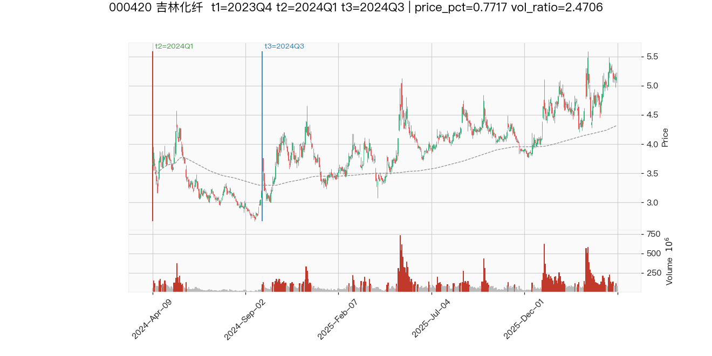

#### 🔍 检测依据 — 000420 吉林化纤
> 最佳 triple: **2023Q4 → 2024Q1 → 2024Q3** ｜ B 触发: price_pct=0.77 vol_ratio=2.47 ｜ t2 后 60 日收益: 12.6% ｜ 候选 triple 数: 2

#### 📊 港中结持仓节奏 — 000420 吉林化纤

| 季度     |   持股量(万股) |   持股市值(亿) |
|:-------|----------:|----------:|
| 2023Q1 |     649.3 |      0.28 |
| 2023Q2 |    1155.1 |      0.41 |
| 2023Q3 |    1206.9 |      0.38 |
| 2023Q4 |    1442.3 |      0.42 |
| 2024Q1 |    1103.1 |      0.42 |
| 2024Q2 |     851.8 |      0.27 |
| 2024Q3 |    1415.2 |      0.43 |

#### ✍️ 人工复盘 — 000420 吉林化纤

| 检查项 | 结果 |
|--------|------|
| t2 季度价格在近 250 日高位区间（视觉） | ⬜ |
| t2 季度出现明显放量 bar（红色高量） | ⬜ |
| t3 季度买回后股价未大幅上涨（非卖飞） | ⬜ |
| t1→t2→t3 三段节奏符合「建仓→出货→再建仓」 | ⬜ |

**决策**: ⬜ PASS（纳入关注名单）　⬜ REJECT（假信号）

**备注**: _（人工填写）_

### 002237 恒邦股份 K 线 + 成交量
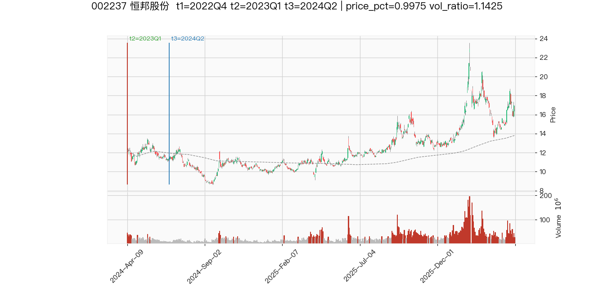

#### 🔍 检测依据 — 002237 恒邦股份
> 最佳 triple: **2022Q4 → 2023Q1 → 2024Q2** ｜ B 触发: price_pct=1.00 vol_ratio=1.14 ｜ t2 后 60 日收益: 13.8% ｜ 候选 triple 数: 3

#### 📊 港中结持仓节奏 — 002237 恒邦股份

| 季度     |   持股量(万股) |   持股市值(亿) |
|:-------|----------:|----------:|
| 2022Q4 |    2555   |      2.69 |
| 2023Q1 |    1531.5 |      1.79 |
| 2023Q2 |    1059.7 |      1.14 |
| 2023Q3 |    1315.4 |      1.59 |
| 2023Q4 |    1131.8 |      1.22 |
| 2024Q1 |    1309   |      1.41 |
| 2024Q2 |    3310.6 |      3.81 |
| 2024Q3 |    3429.2 |      3.51 |

#### ✍️ 人工复盘 — 002237 恒邦股份

| 检查项 | 结果 |
|--------|------|
| t2 季度价格在近 250 日高位区间（视觉） | ⬜ |
| t2 季度出现明显放量 bar（红色高量） | ⬜ |
| t3 季度买回后股价未大幅上涨（非卖飞） | ⬜ |
| t1→t2→t3 三段节奏符合「建仓→出货→再建仓」 | ⬜ |

**决策**: ⬜ PASS（纳入关注名单）　⬜ REJECT（假信号）

**备注**: _（人工填写）_

### 603707 健友股份 K 线 + 成交量
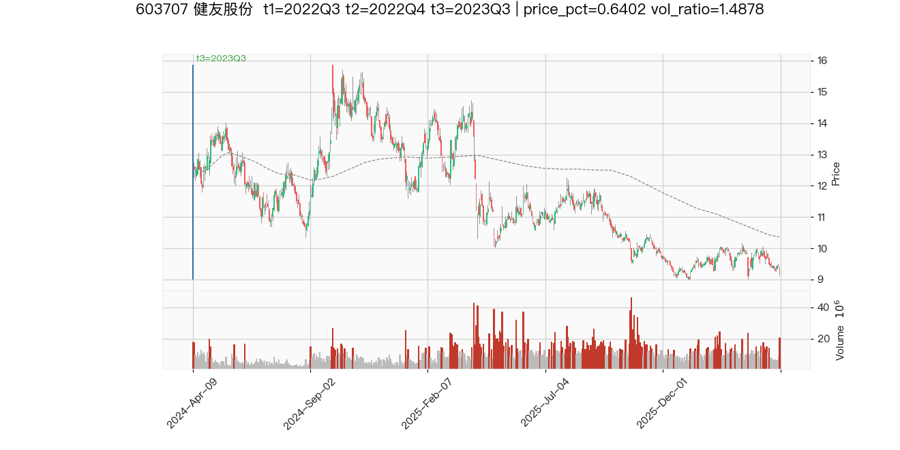

#### 🔍 检测依据 — 603707 健友股份
> 最佳 triple: **2022Q3 → 2022Q4 → 2023Q3** ｜ B 触发: price_pct=0.64 vol_ratio=1.49 ｜ t2 后 60 日收益: 9.7% ｜ 候选 triple 数: 2

#### 📊 港中结持仓节奏 — 603707 健友股份

| 季度     |   持股量(万股) |   持股市值(亿) |
|:-------|----------:|----------:|
| 2022Q4 |    2094.7 |      3.78 |
| 2023Q1 |    1877.3 |      3.06 |
| 2023Q2 |    1863.5 |      2.52 |
| 2023Q3 |    2799.3 |      3.55 |
| 2023Q4 |    1898.9 |      2.85 |
| 2024Q1 |    1607.1 |      1.78 |
| 2024Q2 |     888.5 |      1.06 |
| 2024Q3 |     895   |      1.04 |

#### ✍️ 人工复盘 — 603707 健友股份

| 检查项 | 结果 |
|--------|------|
| t2 季度价格在近 250 日高位区间（视觉） | ⬜ |
| t2 季度出现明显放量 bar（红色高量） | ⬜ |
| t3 季度买回后股价未大幅上涨（非卖飞） | ⬜ |
| t1→t2→t3 三段节奏符合「建仓→出货→再建仓」 | ⬜ |

**决策**: ⬜ PASS（纳入关注名单）　⬜ REJECT（假信号）

**备注**: _（人工填写）_

### 000563 陕国投A K 线 + 成交量
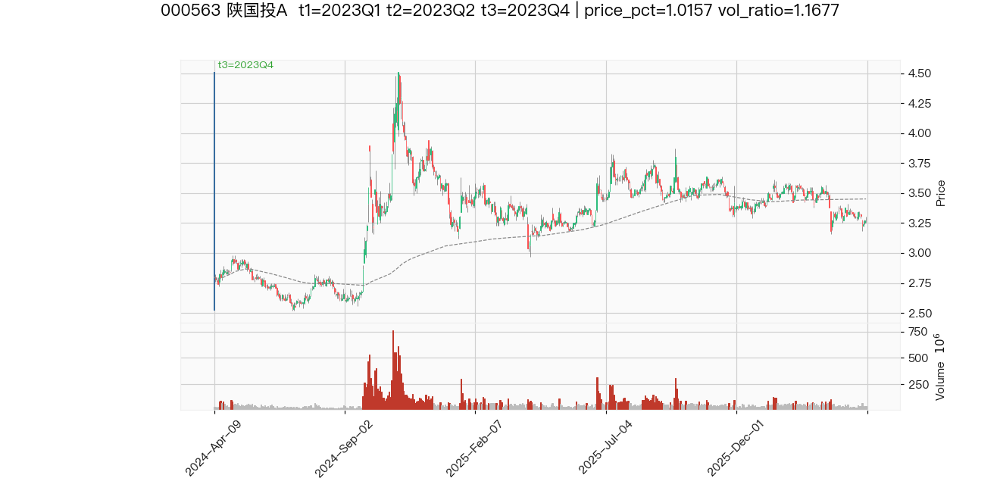

#### 🔍 检测依据 — 000563 陕国投A
> 最佳 triple: **2023Q1 → 2023Q2 → 2023Q4** ｜ B 触发: price_pct=1.02 vol_ratio=1.17 ｜ t2 后 60 日收益: 14.8% ｜ 候选 triple 数: 2

#### 📊 港中结持仓节奏 — 000563 陕国投A

| 季度     |   持股量(万股) |   持股市值(亿) |
|:-------|----------:|----------:|
| 2022Q4 |    4129.8 |      1.25 |
| 2023Q1 |    5268.8 |      1.68 |
| 2023Q2 |    4454.5 |      1.35 |
| 2023Q3 |    4304.8 |      1.31 |
| 2023Q4 |    4742.7 |      1.44 |
| 2024Q1 |    2843.2 |      0.83 |
| 2024Q2 |    4293.2 |      1.18 |
| 2024Q3 |    6826   |      1.97 |

#### ✍️ 人工复盘 — 000563 陕国投A

| 检查项 | 结果 |
|--------|------|
| t2 季度价格在近 250 日高位区间（视觉） | ⬜ |
| t2 季度出现明显放量 bar（红色高量） | ⬜ |
| t3 季度买回后股价未大幅上涨（非卖飞） | ⬜ |
| t1→t2→t3 三段节奏符合「建仓→出货→再建仓」 | ⬜ |

**决策**: ⬜ PASS（纳入关注名单）　⬜ REJECT（假信号）

**备注**: _（人工填写）_

### 300709 精研科技 K 线 + 成交量
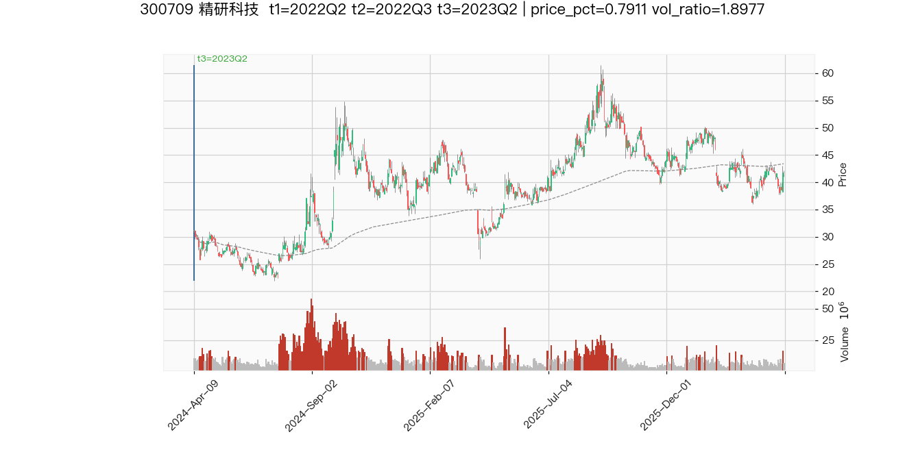

#### 🔍 检测依据 — 300709 精研科技
> 最佳 triple: **2022Q2 → 2022Q3 → 2023Q2** ｜ B 触发: price_pct=0.79 vol_ratio=1.90 ｜ t2 后 60 日收益: 11.3% ｜ 候选 triple 数: 4

#### 📊 港中结持仓节奏 — 300709 精研科技

| 季度     |   持股量(万股) |   持股市值(亿) |
|:-------|----------:|----------:|
| 2022Q4 |      19.7 |      0.06 |
| 2023Q1 |      95.3 |      0.23 |
| 2023Q2 |     181.6 |      0.44 |
| 2023Q3 |     171.5 |      0.38 |
| 2023Q4 |     728.4 |      2.27 |
| 2024Q1 |     334.2 |      1.08 |
| 2024Q2 |     539   |      1.36 |
| 2024Q3 |     148   |      0.43 |

#### ✍️ 人工复盘 — 300709 精研科技

| 检查项 | 结果 |
|--------|------|
| t2 季度价格在近 250 日高位区间（视觉） | ⬜ |
| t2 季度出现明显放量 bar（红色高量） | ⬜ |
| t3 季度买回后股价未大幅上涨（非卖飞） | ⬜ |
| t1→t2→t3 三段节奏符合「建仓→出货→再建仓」 | ⬜ |

**决策**: ⬜ PASS（纳入关注名单）　⬜ REJECT（假信号）

**备注**: _（人工填写）_

### 300785 值得买 K 线 + 成交量
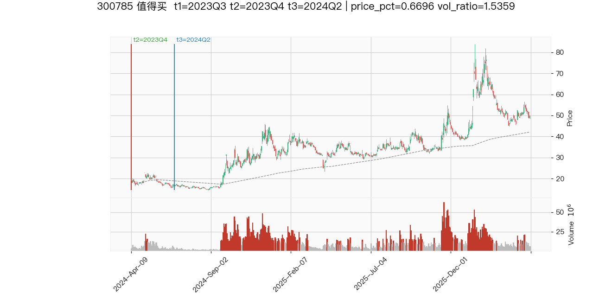

#### 🔍 检测依据 — 300785 值得买
> 最佳 triple: **2023Q3 → 2023Q4 → 2024Q2** ｜ B 触发: price_pct=0.67 vol_ratio=1.54 ｜ t2 后 60 日收益: 11.1% ｜ 候选 triple 数: 2

#### 📊 港中结持仓节奏 — 300785 值得买

| 季度     |   持股量(万股) |   持股市值(亿) |
|:-------|----------:|----------:|
| 2022Q4 |       5.3 |      0.02 |
| 2023Q1 |       5.1 |      0.03 |
| 2023Q2 |     234.2 |      0.61 |
| 2023Q3 |     277.8 |      0.62 |
| 2023Q4 |     104.3 |      0.23 |
| 2024Q1 |      87.8 |      0.19 |
| 2024Q2 |     129   |      0.22 |
| 2024Q3 |     251.2 |      0.4  |

#### ✍️ 人工复盘 — 300785 值得买

| 检查项 | 结果 |
|--------|------|
| t2 季度价格在近 250 日高位区间（视觉） | ⬜ |
| t2 季度出现明显放量 bar（红色高量） | ⬜ |
| t3 季度买回后股价未大幅上涨（非卖飞） | ⬜ |
| t1→t2→t3 三段节奏符合「建仓→出货→再建仓」 | ⬜ |

**决策**: ⬜ PASS（纳入关注名单）　⬜ REJECT（假信号）

**备注**: _（人工填写）_

### 603989 艾华集团 K 线 + 成交量
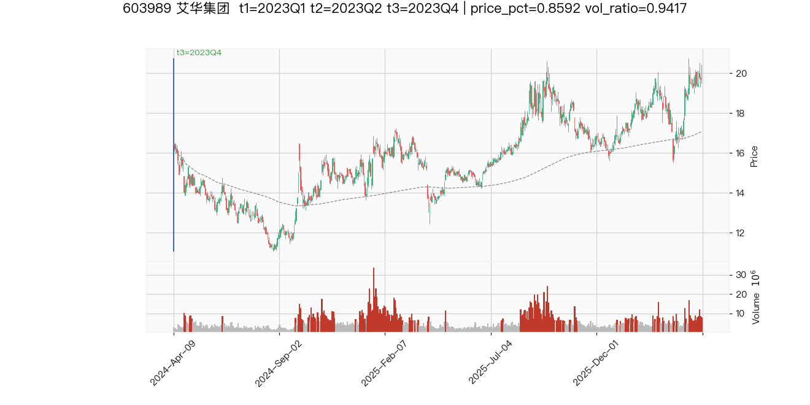

#### 🔍 检测依据 — 603989 艾华集团
> 最佳 triple: **2023Q1 → 2023Q2 → 2023Q4** ｜ B 触发: price_pct=0.86 vol_ratio=0.94 ｜ t2 后 60 日收益: 10.7% ｜ 候选 triple 数: 3

#### 📊 港中结持仓节奏 — 603989 艾华集团

| 季度     |   持股量(万股) |   持股市值(亿) |
|:-------|----------:|----------:|
| 2022Q4 |     192.3 |      0.49 |
| 2023Q1 |     397.1 |      1.04 |
| 2023Q2 |     354.5 |      0.74 |
| 2023Q3 |     243.3 |      0.52 |
| 2023Q4 |     409.3 |      0.88 |
| 2024Q1 |     324.8 |      0.54 |
| 2024Q2 |     411   |      0.58 |
| 2024Q3 |     370   |      0.44 |

#### ✍️ 人工复盘 — 603989 艾华集团

| 检查项 | 结果 |
|--------|------|
| t2 季度价格在近 250 日高位区间（视觉） | ⬜ |
| t2 季度出现明显放量 bar（红色高量） | ⬜ |
| t3 季度买回后股价未大幅上涨（非卖飞） | ⬜ |
| t1→t2→t3 三段节奏符合「建仓→出货→再建仓」 | ⬜ |

**决策**: ⬜ PASS（纳入关注名单）　⬜ REJECT（假信号）

**备注**: _（人工填写）_

### 301050 雷电微力 K 线 + 成交量
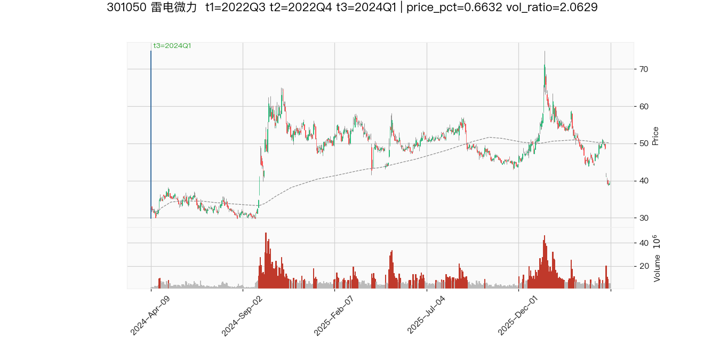

#### 🔍 检测依据 — 301050 雷电微力
> 最佳 triple: **2022Q3 → 2022Q4 → 2024Q1** ｜ B 触发: price_pct=0.66 vol_ratio=2.06 ｜ t2 后 60 日收益: 13.9% ｜ 候选 triple 数: 3

#### 📊 港中结持仓节奏 — 301050 雷电微力

| 季度     |   持股量(万股) |   持股市值(亿) |
|:-------|----------:|----------:|
| 2022Q4 |     122.9 |      0.95 |
| 2023Q1 |      33.8 |      0.26 |
| 2023Q2 |      88.2 |      0.57 |
| 2023Q3 |      88.6 |      0.53 |
| 2023Q4 |      56.7 |      0.33 |
| 2024Q1 |     141.6 |      0.68 |
| 2024Q2 |     185.7 |      0.89 |
| 2024Q3 |     117   |      0.53 |

#### ✍️ 人工复盘 — 301050 雷电微力

| 检查项 | 结果 |
|--------|------|
| t2 季度价格在近 250 日高位区间（视觉） | ⬜ |
| t2 季度出现明显放量 bar（红色高量） | ⬜ |
| t3 季度买回后股价未大幅上涨（非卖飞） | ⬜ |
| t1→t2→t3 三段节奏符合「建仓→出货→再建仓」 | ⬜ |

**决策**: ⬜ PASS（纳入关注名单）　⬜ REJECT（假信号）

**备注**: _（人工填写）_

### 000685 中山公用 K 线 + 成交量
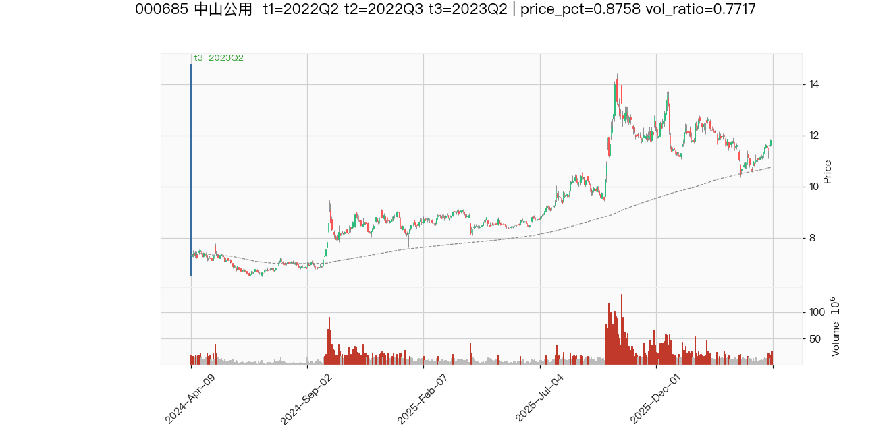

#### 🔍 检测依据 — 000685 中山公用
> 最佳 triple: **2022Q2 → 2022Q3 → 2023Q2** ｜ B 触发: price_pct=0.88 vol_ratio=0.77 ｜ t2 后 60 日收益: 12.3% ｜ 候选 triple 数: 2

#### 📊 港中结持仓节奏 — 000685 中山公用

| 季度     |   持股量(万股) |   持股市值(亿) |
|:-------|----------:|----------:|
| 2022Q4 |    1716.7 |      1.21 |
| 2023Q1 |    1229.6 |      0.87 |
| 2023Q2 |    3225.2 |      2.44 |
| 2023Q3 |    2796.1 |      2.1  |
| 2023Q4 |    2648.6 |      1.94 |
| 2024Q1 |    2224.5 |      1.67 |
| 2024Q2 |    1642.5 |      1.18 |
| 2024Q3 |    1471.3 |      1.08 |

#### ✍️ 人工复盘 — 000685 中山公用

| 检查项 | 结果 |
|--------|------|
| t2 季度价格在近 250 日高位区间（视觉） | ⬜ |
| t2 季度出现明显放量 bar（红色高量） | ⬜ |
| t3 季度买回后股价未大幅上涨（非卖飞） | ⬜ |
| t1→t2→t3 三段节奏符合「建仓→出货→再建仓」 | ⬜ |

**决策**: ⬜ PASS（纳入关注名单）　⬜ REJECT（假信号）

**备注**: _（人工填写）_

### 002928 华夏航空 K 线 + 成交量
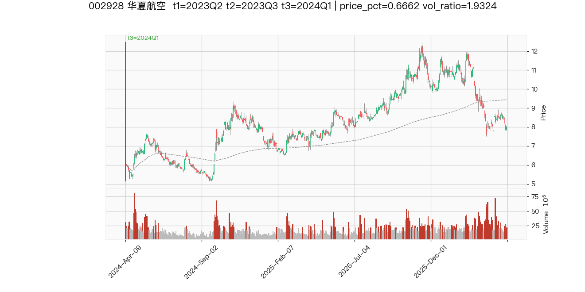

#### 🔍 检测依据 — 002928 华夏航空
> 最佳 triple: **2023Q2 → 2023Q3 → 2024Q1** ｜ B 触发: price_pct=0.67 vol_ratio=1.93 ｜ t2 后 60 日收益: 14.1% ｜ 候选 triple 数: 2

#### 📊 港中结持仓节奏 — 002928 华夏航空

| 季度     |   持股量(万股) |   持股市值(亿) |
|:-------|----------:|----------:|
| 2023Q1 |     905.3 |      1.05 |
| 2023Q2 |    1716   |      1.42 |
| 2023Q3 |     900.2 |      0.65 |
| 2023Q4 |     860.8 |      0.61 |
| 2024Q1 |    1414.9 |      0.74 |
| 2024Q2 |    1046   |      0.66 |
| 2024Q3 |    1116.2 |      0.65 |

#### ✍️ 人工复盘 — 002928 华夏航空

| 检查项 | 结果 |
|--------|------|
| t2 季度价格在近 250 日高位区间（视觉） | ⬜ |
| t2 季度出现明显放量 bar（红色高量） | ⬜ |
| t3 季度买回后股价未大幅上涨（非卖飞） | ⬜ |
| t1→t2→t3 三段节奏符合「建仓→出货→再建仓」 | ⬜ |

**决策**: ⬜ PASS（纳入关注名单）　⬜ REJECT（假信号）

**备注**: _（人工填写）_

## 全部诊断（A 段命中股的 BCD 数值）

### 000008 
- A=False BCD=False triples=0 monotonic_up=False

### 000012 
- A=True BCD=True triples=2 monotonic_up=False

| t1     | t2     | t3     | B     | C    | D    |   price_pct |   vol_ratio | post_ret_60d   |
|:-------|:-------|:-------|:------|:-----|:-----|------------:|------------:|:---------------|
| 2023Q2 | 2023Q3 | 2023Q4 | False | True | True |      0.8227 |      0.321  |                |
| 2023Q4 | 2024Q2 | 2024Q3 | True  | True | True |      0.8665 |      1.1818 |                |

### 000016 
- A=True BCD=True triples=1 monotonic_up=False

| t1     | t2     | t3     | B    | C    | D    |   price_pct |   vol_ratio | post_ret_60d   |
|:-------|:-------|:-------|:-----|:-----|:-----|------------:|------------:|:---------------|
| 2023Q4 | 2024Q1 | 2024Q2 | True | True | True |      0.7523 |      2.3642 |                |

### 000030 
- A=True BCD=True triples=2 monotonic_up=False

| t1     | t2     | t3     | B    | C    | D    |   price_pct |   vol_ratio |   post_ret_60d |
|:-------|:-------|:-------|:-----|:-----|:-----|------------:|------------:|---------------:|
| 2023Q3 | 2023Q4 | 2024Q2 | True | True | True |      1.1103 |      2.2168 |          0.006 |
| 2023Q3 | 2024Q1 | 2024Q2 | True | True | True |      0.8711 |      1.2904 |        nan     |

### 000031 
- A=True BCD=False triples=1 monotonic_up=False

| t1     | t2     | t3     | B     | C    | D    |   price_pct |   vol_ratio |   post_ret_60d |
|:-------|:-------|:-------|:------|:-----|:-----|------------:|------------:|---------------:|
| 2023Q3 | 2023Q4 | 2024Q2 | False | True | True |      0.7714 |      0.7565 |         0.0337 |

### 000048 
- A=True BCD=True triples=3 monotonic_up=False

| t1     | t2     | t3     | B     | C    | D    |   price_pct |   vol_ratio |   post_ret_60d |
|:-------|:-------|:-------|:------|:-----|:-----|------------:|------------:|---------------:|
| 2023Q1 | 2023Q2 | 2023Q3 | True  | True | True |      1.0344 |      1.2331 |       nan      |
| 2023Q3 | 2023Q4 | 2024Q2 | True  | True | True |      0.8637 |      1.0263 |         0.0176 |
| 2023Q3 | 2024Q1 | 2024Q2 | False | True | True |      0.7688 |      1.089  |       nan      |

### 000049 
- A=True BCD=False triples=3 monotonic_up=False

| t1     | t2     | t3     | B     | C     | D    |   price_pct |   vol_ratio |   post_ret_60d |
|:-------|:-------|:-------|:------|:------|:-----|------------:|------------:|---------------:|
| 2022Q3 | 2022Q4 | 2023Q2 | True  | False | True |      0.9097 |      0.9679 |         0.1725 |
| 2022Q3 | 2023Q1 | 2023Q2 | False | True  | True |      0.8072 |      0.7066 |       nan      |
| 2023Q2 | 2023Q3 | 2023Q4 | False | True  | True |      0.577  |      0.2662 |       nan      |

### 000050 
- A=True BCD=False triples=2 monotonic_up=False

| t1     | t2     | t3     | B     | C    | D     |   price_pct |   vol_ratio | post_ret_60d   |
|:-------|:-------|:-------|:------|:-----|:------|------------:|------------:|:---------------|
| 2023Q2 | 2023Q3 | 2023Q4 | True  | True | False |      0.8685 |      0.7769 |                |
| 2023Q4 | 2024Q2 | 2024Q3 | False | True | True  |      0.7946 |      1.0791 |                |

### 000059 
- A=True BCD=True triples=3 monotonic_up=False

| t1     | t2     | t3     | B     | C    | D    |   price_pct |   vol_ratio | post_ret_60d   |
|:-------|:-------|:-------|:------|:-----|:-----|------------:|------------:|:---------------|
| 2022Q3 | 2022Q4 | 2023Q1 | True  | True | True |      1.0525 |      1.2393 |                |
| 2023Q1 | 2023Q3 | 2023Q4 | False | True | True |      0.7633 |      0.3407 |                |
| 2024Q1 | 2024Q2 | 2024Q3 | True  | True | True |      0.716  |      2.1272 |                |

### 000061 
- A=True BCD=True triples=3 monotonic_up=False

| t1     | t2     | t3     | B     | C     | D    |   price_pct |   vol_ratio |   post_ret_60d |
|:-------|:-------|:-------|:------|:------|:-----|------------:|------------:|---------------:|
| 2022Q4 | 2023Q1 | 2024Q1 | False | False | True |      0.8285 |      0.4334 |         0.1646 |
| 2022Q4 | 2023Q2 | 2023Q4 | True  | False | True |      0.936  |      0.8664 |         0.2069 |
| 2022Q4 | 2023Q3 | 2023Q4 | True  | True  | True |      1.087  |      1.1587 |       nan      |

### 000065 
- A=True BCD=True triples=1 monotonic_up=False

| t1     | t2     | t3     | B    | C    | D    |   price_pct |   vol_ratio | post_ret_60d   |
|:-------|:-------|:-------|:-----|:-----|:-----|------------:|------------:|:---------------|
| 2022Q2 | 2022Q3 | 2022Q4 | True | True | True |      1.1508 |      1.2964 |                |

### 000069 
- A=False BCD=False triples=0 monotonic_up=False

### 000078 
- A=True BCD=True triples=2 monotonic_up=False

| t1     | t2     | t3     | B     | C    | D    |   price_pct |   vol_ratio |   post_ret_60d |
|:-------|:-------|:-------|:------|:-----|:-----|------------:|------------:|---------------:|
| 2023Q2 | 2024Q1 | 2024Q3 | True  | True | True |      0.9887 |      1.8231 |         0.0412 |
| 2023Q2 | 2024Q2 | 2024Q3 | False | True | True |      0.7208 |      0.9026 |       nan      |

### 000088 
- A=True BCD=True triples=2 monotonic_up=False

| t1     | t2     | t3     | B    | C    | D    |   price_pct |   vol_ratio | post_ret_60d   |
|:-------|:-------|:-------|:-----|:-----|:-----|------------:|------------:|:---------------|
| 2022Q4 | 2023Q1 | 2023Q2 | True | True | True |      0.8964 |      0.6449 |                |
| 2023Q3 | 2024Q1 | 2024Q2 | True | True | True |      0.9069 |      1.5759 |                |

### 000089 
- A=True BCD=True triples=1 monotonic_up=False

| t1     | t2     | t3     | B    | C    | D    |   price_pct |   vol_ratio | post_ret_60d   |
|:-------|:-------|:-------|:-----|:-----|:-----|------------:|------------:|:---------------|
| 2023Q1 | 2024Q1 | 2024Q2 | True | True | True |      0.8497 |      1.4804 |                |

### 000090 
- A=True BCD=False triples=2 monotonic_up=False

| t1     | t2     | t3     | B     | C    | D    |   price_pct |   vol_ratio | post_ret_60d   |
|:-------|:-------|:-------|:------|:-----|:-----|------------:|------------:|:---------------|
| 2022Q4 | 2023Q2 | 2023Q3 | False | True | True |      0.7581 |      0.5452 |                |
| 2023Q3 | 2024Q2 | 2024Q3 | False | True | True |      0.6792 |      0.8898 |                |

### 000096 
- A=False BCD=False triples=0 monotonic_up=False

### 000099 
- A=True BCD=True triples=2 monotonic_up=False

| t1     | t2     | t3     | B     | C    | D    |   price_pct |   vol_ratio | post_ret_60d   |
|:-------|:-------|:-------|:------|:-----|:-----|------------:|------------:|:---------------|
| 2023Q1 | 2023Q2 | 2023Q3 | True  | True | True |      1.2581 |      2.5253 |                |
| 2023Q3 | 2023Q4 | 2024Q1 | False | True | True |      0.8292 |      0.7072 |                |

### 000156 
- A=True BCD=True triples=2 monotonic_up=False

| t1     | t2     | t3     | B     | C    | D    |   price_pct |   vol_ratio |   post_ret_60d |
|:-------|:-------|:-------|:------|:-----|:-----|------------:|------------:|---------------:|
| 2022Q2 | 2022Q3 | 2022Q4 | False | True | True |      0.8433 |      0.4141 |       nan      |
| 2023Q1 | 2024Q1 | 2024Q3 | True  | True | True |      0.8354 |      1.5015 |        -0.0088 |

### 000401 
- A=True BCD=False triples=1 monotonic_up=False

| t1     | t2     | t3     | B     | C    | D    |   price_pct |   vol_ratio | post_ret_60d   |
|:-------|:-------|:-------|:------|:-----|:-----|------------:|------------:|:---------------|
| 2023Q3 | 2024Q2 | 2024Q3 | False | True | True |      0.6132 |      1.2035 |                |

### 000402 
- A=True BCD=False triples=1 monotonic_up=False

| t1     | t2     | t3     | B     | C    | D    |   price_pct |   vol_ratio | post_ret_60d   |
|:-------|:-------|:-------|:------|:-----|:-----|------------:|------------:|:---------------|
| 2023Q4 | 2024Q1 | 2024Q2 | False | True | True |      0.6673 |      1.2831 |                |

### 000403 
- A=True BCD=True triples=3 monotonic_up=False

| t1     | t2     | t3     | B     | C     | D    |   price_pct |   vol_ratio |   post_ret_60d |
|:-------|:-------|:-------|:------|:------|:-----|------------:|------------:|---------------:|
| 2022Q2 | 2022Q3 | 2023Q1 | False | False | True |      0.8046 |      1.0947 |         0.3713 |
| 2023Q1 | 2023Q2 | 2023Q4 | True  | True  | True |      1.0242 |      0.6804 |         0.0344 |
| 2023Q1 | 2023Q3 | 2023Q4 | False | True  | True |      0.8304 |      0.5755 |       nan      |

### 000410 
- A=False BCD=False triples=0 monotonic_up=False

### 000420 
- A=True BCD=True triples=2 monotonic_up=False

| t1     | t2     | t3     | B    | C    | D    |   price_pct |   vol_ratio |   post_ret_60d |
|:-------|:-------|:-------|:-----|:-----|:-----|------------:|------------:|---------------:|
| 2023Q4 | 2024Q1 | 2024Q3 | True | True | True |      0.7717 |      2.4706 |         0.1257 |
| 2023Q4 | 2024Q2 | 2024Q3 | True | True | True |      0.9663 |      3.4113 |       nan      |

### 000498 
- A=True BCD=False triples=3 monotonic_up=False

| t1     | t2     | t3     | B     | C    | D     |   price_pct |   vol_ratio |   post_ret_60d |
|:-------|:-------|:-------|:------|:-----|:------|------------:|------------:|---------------:|
| 2022Q2 | 2022Q4 | 2023Q1 | False | True | False |      0.7521 |      0.5178 |       nan      |
| 2023Q1 | 2023Q2 | 2023Q3 | False | True | True  |      0.701  |      0.5079 |       nan      |
| 2023Q3 | 2023Q4 | 2024Q2 | False | True | True  |      0.7547 |      0.513  |         0.0019 |

### 000501 
- A=True BCD=True triples=3 monotonic_up=False

| t1     | t2     | t3     | B     | C    | D    |   price_pct |   vol_ratio |   post_ret_60d |
|:-------|:-------|:-------|:------|:-----|:-----|------------:|------------:|---------------:|
| 2022Q2 | 2022Q3 | 2022Q4 | True  | True | True |      1.0047 |      0.7493 |       nan      |
| 2023Q1 | 2023Q3 | 2024Q1 | True  | True | True |      0.8592 |      0.7193 |        -0.0046 |
| 2023Q1 | 2023Q4 | 2024Q1 | False | True | True |      0.7702 |      0.8896 |       nan      |

### 000516 
- A=True BCD=False triples=1 monotonic_up=False

| t1     | t2     | t3     | B     | C    | D    |   price_pct |   vol_ratio | post_ret_60d   |
|:-------|:-------|:-------|:------|:-----|:-----|------------:|------------:|:---------------|
| 2023Q3 | 2024Q1 | 2024Q2 | False | True | True |      0.6365 |      0.9773 |                |

### 000517 
- A=True BCD=False triples=1 monotonic_up=False

| t1     | t2     | t3     | B     | C    | D    |   price_pct |   vol_ratio | post_ret_60d   |
|:-------|:-------|:-------|:------|:-----|:-----|------------:|------------:|:---------------|
| 2023Q1 | 2023Q2 | 2023Q3 | False | True | True |      0.8188 |       0.411 |                |

### 000541 
- A=True BCD=False triples=1 monotonic_up=False

| t1     | t2     | t3     | B     | C    | D     |   price_pct |   vol_ratio | post_ret_60d   |
|:-------|:-------|:-------|:------|:-----|:------|------------:|------------:|:---------------|
| 2023Q2 | 2023Q3 | 2023Q4 | False | True | False |      0.7323 |       0.475 |                |

### 000543 
- A=True BCD=True triples=3 monotonic_up=False

| t1     | t2     | t3     | B    | C     | D    |   price_pct |   vol_ratio |   post_ret_60d |
|:-------|:-------|:-------|:-----|:------|:-----|------------:|------------:|---------------:|
| 2022Q3 | 2023Q1 | 2023Q4 | True | False | True |      0.9241 |      0.6852 |         0.4825 |
| 2022Q3 | 2023Q2 | 2023Q3 | True | True  | True |      1.2743 |      1.3423 |       nan      |
| 2023Q4 | 2024Q1 | 2024Q2 | True | True  | True |      1.1464 |      1.0691 |       nan      |

### 000546 
- A=True BCD=False triples=1 monotonic_up=False

| t1     | t2     | t3     | B     | C    | D    |   price_pct |   vol_ratio | post_ret_60d   |
|:-------|:-------|:-------|:------|:-----|:-----|------------:|------------:|:---------------|
| 2024Q1 | 2024Q2 | 2024Q3 | False | True | True |      0.6051 |      0.6731 |                |

### 000552 
- A=False BCD=False triples=0 monotonic_up=False

### 000553 
- A=True BCD=False triples=1 monotonic_up=False

| t1     | t2     | t3     | B     | C    | D    |   price_pct |   vol_ratio | post_ret_60d   |
|:-------|:-------|:-------|:------|:-----|:-----|------------:|------------:|:---------------|
| 2023Q4 | 2024Q1 | 2024Q2 | False | True | True |      0.6657 |      1.2598 |                |

### 000555 
- A=True BCD=False triples=2 monotonic_up=False

| t1     | t2     | t3     | B     | C    | D     |   price_pct |   vol_ratio | post_ret_60d   |
|:-------|:-------|:-------|:------|:-----|:------|------------:|------------:|:---------------|
| 2023Q1 | 2023Q3 | 2023Q4 | False | True | True  |      0.8422 |      0.8766 |                |
| 2023Q4 | 2024Q1 | 2024Q2 | True  | True | False |      0.8567 |      1.4398 |                |

### 000557 
- A=True BCD=False triples=1 monotonic_up=False

| t1     | t2     | t3     | B     | C    | D    |   price_pct |   vol_ratio | post_ret_60d   |
|:-------|:-------|:-------|:------|:-----|:-----|------------:|------------:|:---------------|
| 2023Q3 | 2023Q4 | 2024Q1 | False | True | True |      0.8408 |      0.9527 |                |

### 000560 
- A=True BCD=True triples=3 monotonic_up=False

| t1     | t2     | t3     | B     | C    | D    |   price_pct |   vol_ratio |   post_ret_60d |
|:-------|:-------|:-------|:------|:-----|:-----|------------:|------------:|---------------:|
| 2023Q2 | 2023Q3 | 2024Q2 | True  | True | True |      0.9477 |      1.5982 |         0.0039 |
| 2023Q2 | 2023Q4 | 2024Q2 | False | True | True |      0.708  |      0.5856 |         0.0044 |
| 2023Q2 | 2024Q1 | 2024Q2 | False | True | True |      0.6226 |      1.0011 |       nan      |

### 000563 
- A=True BCD=True triples=2 monotonic_up=False

| t1     | t2     | t3     | B    | C    | D    |   price_pct |   vol_ratio |   post_ret_60d |
|:-------|:-------|:-------|:-----|:-----|:-----|------------:|------------:|---------------:|
| 2023Q1 | 2023Q2 | 2023Q4 | True | True | True |      1.0157 |      1.1677 |         0.1484 |
| 2023Q4 | 2024Q1 | 2024Q2 | True | True | True |      0.9077 |      1.5332 |       nan      |

### 000567 
- A=True BCD=False triples=4 monotonic_up=False

| t1     | t2     | t3     | B    | C    | D     |   price_pct |   vol_ratio |   post_ret_60d |
|:-------|:-------|:-------|:-----|:-----|:------|------------:|------------:|---------------:|
| 2022Q2 | 2022Q3 | 2023Q1 | True | True | False |      1.0689 |      1.5078 |         0.1338 |
| 2022Q2 | 2022Q4 | 2023Q1 | True | True | False |      0.9101 |      0.7422 |       nan      |
| 2023Q1 | 2023Q2 | 2023Q4 | True | True | False |      1.0886 |      0.9341 |         0.0521 |
| 2023Q1 | 2023Q3 | 2023Q4 | True | True | False |      0.99   |      0.8808 |       nan      |

### 000572 
- A=True BCD=False triples=1 monotonic_up=False

| t1     | t2     | t3     | B     | C    | D    |   price_pct |   vol_ratio | post_ret_60d   |
|:-------|:-------|:-------|:------|:-----|:-----|------------:|------------:|:---------------|
| 2023Q4 | 2024Q2 | 2024Q3 | False | True | True |      0.6895 |      0.4429 |                |

### 000589 
- A=True BCD=True triples=1 monotonic_up=False

| t1     | t2     | t3     | B    | C    | D    |   price_pct |   vol_ratio | post_ret_60d   |
|:-------|:-------|:-------|:-----|:-----|:-----|------------:|------------:|:---------------|
| 2023Q4 | 2024Q1 | 2024Q2 | True | True | True |      0.8314 |       1.368 |                |

### 000597 
- A=True BCD=True triples=2 monotonic_up=False

| t1     | t2     | t3     | B     | C    | D    |   price_pct |   vol_ratio | post_ret_60d   |
|:-------|:-------|:-------|:------|:-----|:-----|------------:|------------:|:---------------|
| 2023Q1 | 2023Q2 | 2023Q3 | False | True | True |      0.6671 |      0.4558 |                |
| 2023Q4 | 2024Q2 | 2024Q3 | True  | True | True |      0.8712 |      1.032  |                |

### 000600 
- A=True BCD=True triples=3 monotonic_up=False

| t1     | t2     | t3     | B     | C    | D     |   price_pct |   vol_ratio | post_ret_60d   |
|:-------|:-------|:-------|:------|:-----|:------|------------:|------------:|:---------------|
| 2022Q3 | 2022Q4 | 2023Q1 | True  | True | False |      0.9788 |      1.8105 |                |
| 2023Q2 | 2023Q3 | 2023Q4 | True  | True | True  |      0.9743 |      0.4991 |                |
| 2023Q4 | 2024Q1 | 2024Q2 | False | True | True  |      0.8203 |      0.9282 |                |

### 000601 
- A=False BCD=False triples=0 monotonic_up=False

### 000612 
- A=True BCD=False triples=2 monotonic_up=False

| t1     | t2     | t3     | B     | C    | D     |   price_pct |   vol_ratio | post_ret_60d   |
|:-------|:-------|:-------|:------|:-----|:------|------------:|------------:|:---------------|
| 2023Q1 | 2023Q2 | 2023Q3 | False | True | True  |      0.8424 |      0.4661 |                |
| 2023Q4 | 2024Q1 | 2024Q2 | True  | True | False |      0.9947 |      1.7469 |                |

### 000628 
- A=False BCD=False triples=0 monotonic_up=False

### 000650 
- A=True BCD=True triples=3 monotonic_up=False

| t1     | t2     | t3     | B     | C    | D    |   price_pct |   vol_ratio |   post_ret_60d |
|:-------|:-------|:-------|:------|:-----|:-----|------------:|------------:|---------------:|
| 2022Q3 | 2022Q4 | 2023Q3 | True  | True | True |      0.8473 |      3.3926 |         0.0887 |
| 2022Q3 | 2023Q1 | 2023Q3 | False | True | True |      0.6792 |      0.817  |         0.0659 |
| 2023Q3 | 2024Q2 | 2024Q3 | True  | True | True |      1.0281 |      1.0004 |       nan      |

### 000676 
- A=True BCD=False triples=1 monotonic_up=False

| t1     | t2     | t3     | B     | C    | D     |   price_pct |   vol_ratio | post_ret_60d   |
|:-------|:-------|:-------|:------|:-----|:------|------------:|------------:|:---------------|
| 2024Q1 | 2024Q2 | 2024Q3 | False | True | False |       0.748 |      0.5348 |                |

### 000680 
- A=True BCD=True triples=3 monotonic_up=False

| t1     | t2     | t3     | B    | C    | D     |   price_pct |   vol_ratio |   post_ret_60d |
|:-------|:-------|:-------|:-----|:-----|:------|------------:|------------:|---------------:|
| 2023Q2 | 2023Q3 | 2024Q1 | True | True | True  |      1      |      0.593  |         0.1352 |
| 2023Q2 | 2023Q4 | 2024Q1 | True | True | True  |      0.9396 |      1.1111 |       nan      |
| 2024Q1 | 2024Q2 | 2024Q3 | True | True | False |      1.1395 |      1.306  |       nan      |

### 000681 
- A=True BCD=True triples=2 monotonic_up=False

| t1     | t2     | t3     | B     | C    | D    |   price_pct |   vol_ratio |   post_ret_60d |
|:-------|:-------|:-------|:------|:-----|:-----|------------:|------------:|---------------:|
| 2023Q1 | 2023Q2 | 2023Q3 | True  | True | True |      1.2468 |      2.5765 |       nan      |
| 2023Q4 | 2024Q1 | 2024Q3 | False | True | True |      0.6489 |      0.527  |         0.0424 |

### 000682 
- A=True BCD=True triples=1 monotonic_up=False

| t1     | t2     | t3     | B    | C    | D    |   price_pct |   vol_ratio | post_ret_60d   |
|:-------|:-------|:-------|:-----|:-----|:-----|------------:|------------:|:---------------|
| 2023Q2 | 2023Q3 | 2023Q4 | True | True | True |      1.0189 |      0.5632 |                |

### 000685 
- A=True BCD=True triples=2 monotonic_up=False

| t1     | t2     | t3     | B     | C    | D    |   price_pct |   vol_ratio |   post_ret_60d |
|:-------|:-------|:-------|:------|:-----|:-----|------------:|------------:|---------------:|
| 2022Q2 | 2022Q3 | 2023Q2 | True  | True | True |      0.8758 |      0.7717 |         0.1229 |
| 2022Q2 | 2023Q1 | 2023Q2 | False | True | True |      0.8476 |      0.8301 |       nan      |

### 000690 
- A=True BCD=True triples=4 monotonic_up=False

| t1     | t2     | t3     | B    | C     | D    |   price_pct |   vol_ratio |   post_ret_60d |
|:-------|:-------|:-------|:-----|:------|:-----|------------:|------------:|---------------:|
| 2022Q4 | 2023Q1 | 2023Q3 | True | False | True |      1.01   |      0.7598 |         0.2967 |
| 2022Q4 | 2023Q2 | 2023Q3 | True | True  | True |      1.1664 |      1.4285 |       nan      |
| 2023Q3 | 2023Q4 | 2024Q2 | True | False | True |      0.6949 |      1.3125 |         0.1617 |
| 2023Q3 | 2024Q1 | 2024Q2 | True | True  | True |      0.6596 |      1.5227 |       nan      |

### 000712 
- A=True BCD=True triples=1 monotonic_up=False

| t1     | t2     | t3     | B    | C    | D    |   price_pct |   vol_ratio | post_ret_60d   |
|:-------|:-------|:-------|:-----|:-----|:-----|------------:|------------:|:---------------|
| 2023Q3 | 2023Q4 | 2024Q1 | True | True | True |      1.0591 |      4.6374 |                |

### 000718 
- A=True BCD=True triples=3 monotonic_up=False

| t1     | t2     | t3     | B     | C    | D    |   price_pct |   vol_ratio |   post_ret_60d |
|:-------|:-------|:-------|:------|:-----|:-----|------------:|------------:|---------------:|
| 2022Q4 | 2023Q1 | 2023Q3 | False | True | True |       0.709 |      0.5126 |         0.0182 |
| 2022Q4 | 2023Q2 | 2023Q3 | False | True | True |       0.678 |      0.498  |       nan      |
| 2023Q3 | 2023Q4 | 2024Q2 | True  | True | True |       0.877 |      0.8787 |         0.0207 |

### 000719 
- A=True BCD=True triples=2 monotonic_up=False

| t1     | t2     | t3     | B     | C    | D     |   price_pct |   vol_ratio | post_ret_60d   |
|:-------|:-------|:-------|:------|:-----|:------|------------:|------------:|:---------------|
| 2023Q2 | 2023Q4 | 2024Q1 | False | True | False |      0.7996 |      0.9591 |                |
| 2024Q1 | 2024Q2 | 2024Q3 | True  | True | True  |      0.8605 |      0.6337 |                |

### 000723 
- A=False BCD=False triples=0 monotonic_up=False

### 000727 
- A=False BCD=False triples=0 monotonic_up=False

### 000735 
- A=True BCD=False triples=1 monotonic_up=False

| t1     | t2     | t3     | B     | C    | D    |   price_pct |   vol_ratio | post_ret_60d   |
|:-------|:-------|:-------|:------|:-----|:-----|------------:|------------:|:---------------|
| 2022Q4 | 2023Q3 | 2023Q4 | False | True | True |      0.8239 |      0.5663 |                |

### 000778 
- A=True BCD=True triples=2 monotonic_up=False

| t1     | t2     | t3     | B    | C    | D    |   price_pct |   vol_ratio | post_ret_60d   |
|:-------|:-------|:-------|:-----|:-----|:-----|------------:|------------:|:---------------|
| 2023Q1 | 2023Q2 | 2023Q3 | True | True | True |      0.9185 |      0.9255 |                |
| 2023Q3 | 2023Q4 | 2024Q1 | True | True | True |      0.9268 |      1.0434 |                |

### 000785 
- A=True BCD=True triples=2 monotonic_up=False

| t1     | t2     | t3     | B    | C    | D    |   price_pct |   vol_ratio |   post_ret_60d |
|:-------|:-------|:-------|:-----|:-----|:-----|------------:|------------:|---------------:|
| 2022Q3 | 2023Q1 | 2023Q2 | True | True | True |      0.9112 |      1.63   |            nan |
| 2023Q2 | 2023Q3 | 2024Q3 | True | True | True |      0.9954 |      1.5182 |              0 |

### 000789 
- A=False BCD=False triples=0 monotonic_up=False

### 000791 
- A=True BCD=True triples=3 monotonic_up=False

| t1     | t2     | t3     | B     | C    | D    |   price_pct |   vol_ratio |   post_ret_60d |
|:-------|:-------|:-------|:------|:-----|:-----|------------:|------------:|---------------:|
| 2022Q3 | 2022Q4 | 2023Q2 | False | True | True |      0.7709 |      0.3591 |         0.0401 |
| 2022Q3 | 2023Q1 | 2023Q2 | False | True | True |      0.7621 |      0.3863 |       nan      |
| 2023Q4 | 2024Q1 | 2024Q2 | True  | True | True |      1.0601 |      1.6865 |       nan      |

### 000795 
- A=True BCD=True triples=3 monotonic_up=False

| t1     | t2     | t3     | B     | C    | D    |   price_pct |   vol_ratio | post_ret_60d   |
|:-------|:-------|:-------|:------|:-----|:-----|------------:|------------:|:---------------|
| 2022Q2 | 2022Q3 | 2022Q4 | True  | True | True |      0.9858 |      0.8381 |                |
| 2023Q1 | 2023Q2 | 2023Q3 | True  | True | True |      0.8858 |      0.5167 |                |
| 2023Q4 | 2024Q1 | 2024Q2 | False | True | True |      0.7703 |      0.7595 |                |

### 000799 
- A=True BCD=False triples=4 monotonic_up=False

| t1     | t2     | t3     | B     | C     | D    |   price_pct |   vol_ratio |   post_ret_60d |
|:-------|:-------|:-------|:------|:------|:-----|------------:|------------:|---------------:|
| 2022Q2 | 2022Q4 | 2023Q2 | False | False | True |      0.6995 |      1.2775 |         0.1899 |
| 2022Q2 | 2023Q1 | 2023Q2 | False | True  | True |      0.7889 |      1.149  |       nan      |
| 2023Q2 | 2023Q3 | 2023Q4 | False | True  | True |      0.5774 |      0.9223 |       nan      |
| 2023Q4 | 2024Q2 | 2024Q3 | False | True  | True |      0.461  |      1.034  |       nan      |

### 000801 
- A=True BCD=True triples=3 monotonic_up=False

| t1     | t2     | t3     | B    | C     | D     |   price_pct |   vol_ratio |   post_ret_60d |
|:-------|:-------|:-------|:-----|:------|:------|------------:|------------:|---------------:|
| 2022Q2 | 2022Q3 | 2022Q4 | True | True  | True  |      0.8754 |      2.6858 |       nan      |
| 2023Q1 | 2023Q2 | 2023Q4 | True | False | True  |      0.8784 |      0.6104 |         0.1949 |
| 2023Q4 | 2024Q1 | 2024Q2 | True | True  | False |      1.6059 |      2.8852 |       nan      |

### 000810 
- A=True BCD=True triples=3 monotonic_up=False

| t1     | t2     | t3     | B     | C     | D    |   price_pct |   vol_ratio |   post_ret_60d |
|:-------|:-------|:-------|:------|:------|:-----|------------:|------------:|---------------:|
| 2022Q3 | 2022Q4 | 2023Q1 | False | True  | True |      0.7064 |      0.778  |       nan      |
| 2023Q1 | 2023Q2 | 2024Q1 | True  | True  | True |      0.8459 |      1.4424 |        -0.0197 |
| 2023Q1 | 2023Q3 | 2024Q1 | False | False | True |      0.6207 |      0.3704 |         0.1521 |

### 000818 
- A=True BCD=False triples=1 monotonic_up=False

| t1     | t2     | t3     | B     | C     | D    |   price_pct |   vol_ratio |   post_ret_60d |
|:-------|:-------|:-------|:------|:------|:-----|------------:|------------:|---------------:|
| 2023Q2 | 2023Q3 | 2024Q1 | False | False | True |      0.7941 |      0.7564 |          0.194 |

### 000821 
- A=True BCD=False triples=3 monotonic_up=False

| t1     | t2     | t3     | B     | C    | D     |   price_pct |   vol_ratio |   post_ret_60d |
|:-------|:-------|:-------|:------|:-----|:------|------------:|------------:|---------------:|
| 2023Q2 | 2023Q3 | 2023Q4 | False | True | False |      0.7996 |      0.3538 |       nan      |
| 2023Q4 | 2024Q1 | 2024Q3 | False | True | True  |      0.6507 |      1.1954 |         0.1045 |
| 2023Q4 | 2024Q2 | 2024Q3 | False | True | True  |      0.6198 |      0.7248 |       nan      |

### 000823 
- A=True BCD=True triples=2 monotonic_up=False

| t1     | t2     | t3     | B     | C    | D    |   price_pct |   vol_ratio | post_ret_60d   |
|:-------|:-------|:-------|:------|:-----|:-----|------------:|------------:|:---------------|
| 2022Q3 | 2022Q4 | 2023Q1 | False | True | True |      0.7381 |      0.5286 |                |
| 2023Q4 | 2024Q1 | 2024Q2 | True  | True | True |      0.8383 |      1.3199 |                |

### 000828 
- A=True BCD=False triples=1 monotonic_up=False

| t1     | t2     | t3     | B     | C    | D    |   price_pct |   vol_ratio | post_ret_60d   |
|:-------|:-------|:-------|:------|:-----|:-----|------------:|------------:|:---------------|
| 2023Q4 | 2024Q2 | 2024Q3 | False | True | True |      0.7608 |       0.785 |                |

### 000837 
- A=True BCD=True triples=1 monotonic_up=False

| t1     | t2     | t3     | B    | C    | D    |   price_pct |   vol_ratio | post_ret_60d   |
|:-------|:-------|:-------|:-----|:-----|:-----|------------:|------------:|:---------------|
| 2023Q2 | 2023Q3 | 2023Q4 | True | True | True |      0.9422 |      0.8942 |                |

### 000848 
- A=True BCD=True triples=2 monotonic_up=False

| t1     | t2     | t3     | B    | C    | D    |   price_pct |   vol_ratio | post_ret_60d   |
|:-------|:-------|:-------|:-----|:-----|:-----|------------:|------------:|:---------------|
| 2023Q1 | 2023Q2 | 2023Q3 | True | True | True |      1.031  |      1.1702 |                |
| 2023Q4 | 2024Q1 | 2024Q2 | True | True | True |      0.8786 |      0.7147 |                |

### 000860 
- A=True BCD=True triples=1 monotonic_up=False

| t1     | t2     | t3     | B    | C    | D    |   price_pct |   vol_ratio | post_ret_60d   |
|:-------|:-------|:-------|:-----|:-----|:-----|------------:|------------:|:---------------|
| 2024Q1 | 2024Q2 | 2024Q3 | True | True | True |      0.5767 |      1.3872 |                |

### 000881 
- A=True BCD=True triples=2 monotonic_up=False

| t1     | t2     | t3     | B    | C    | D    |   price_pct |   vol_ratio |   post_ret_60d |
|:-------|:-------|:-------|:-----|:-----|:-----|------------:|------------:|---------------:|
| 2023Q4 | 2024Q1 | 2024Q3 | True | True | True |      0.8677 |      1.6699 |         0.0682 |
| 2023Q4 | 2024Q2 | 2024Q3 | True | True | True |      0.847  |      2.0614 |       nan      |

### 000885 
- A=True BCD=True triples=4 monotonic_up=False

| t1     | t2     | t3     | B     | C     | D    |   price_pct |   vol_ratio |   post_ret_60d |
|:-------|:-------|:-------|:------|:------|:-----|------------:|------------:|---------------:|
| 2022Q3 | 2022Q4 | 2023Q2 | True  | False | True |      0.9405 |      0.8363 |         0.1919 |
| 2022Q3 | 2023Q1 | 2023Q2 | True  | True  | True |      0.8902 |      0.6825 |       nan      |
| 2023Q2 | 2023Q4 | 2024Q1 | False | True  | True |      0.7591 |      0.5813 |       nan      |
| 2024Q1 | 2024Q2 | 2024Q3 | True  | True  | True |      0.8961 |      0.9073 |       nan      |

### 000888 
- A=False BCD=False triples=0 monotonic_up=False

### 000898 
- A=False BCD=False triples=0 monotonic_up=False

### 000899 
- A=True BCD=False triples=2 monotonic_up=False

| t1     | t2     | t3     | B     | C    | D     |   price_pct |   vol_ratio | post_ret_60d   |
|:-------|:-------|:-------|:------|:-----|:------|------------:|------------:|:---------------|
| 2023Q1 | 2023Q2 | 2023Q3 | False | True | True  |      0.5759 |      0.4125 |                |
| 2023Q4 | 2024Q1 | 2024Q2 | False | True | False |      0.7749 |      1.1552 |                |

### 000900 
- A=True BCD=True triples=1 monotonic_up=False

| t1     | t2     | t3     | B    | C    | D    |   price_pct |   vol_ratio | post_ret_60d   |
|:-------|:-------|:-------|:-----|:-----|:-----|------------:|------------:|:---------------|
| 2023Q3 | 2023Q4 | 2024Q1 | True | True | True |      0.9274 |      0.7786 |                |

### 000901 
- A=True BCD=True triples=3 monotonic_up=False

| t1     | t2     | t3     | B     | C    | D    |   price_pct |   vol_ratio |   post_ret_60d |
|:-------|:-------|:-------|:------|:-----|:-----|------------:|------------:|---------------:|
| 2023Q2 | 2023Q3 | 2023Q4 | True  | True | True |      0.9644 |      0.6042 |       nan      |
| 2023Q4 | 2024Q1 | 2024Q3 | False | True | True |      0.8461 |      0.739  |         0.1245 |
| 2023Q4 | 2024Q2 | 2024Q3 | True  | True | True |      0.8579 |      1.74   |       nan      |

### 000902 
- A=True BCD=False triples=3 monotonic_up=False

| t1     | t2     | t3     | B     | C    | D    |   price_pct |   vol_ratio |   post_ret_60d |
|:-------|:-------|:-------|:------|:-----|:-----|------------:|------------:|---------------:|
| 2022Q3 | 2022Q4 | 2023Q4 | False | True | True |      0.6924 |      1.0196 |         0.0981 |
| 2022Q3 | 2023Q1 | 2023Q4 | False | True | True |      0.6527 |      0.9712 |         0.0764 |
| 2022Q3 | 2023Q2 | 2023Q4 | False | True | True |      0.5971 |      0.7127 |         0.1283 |

### 000906 
- A=False BCD=False triples=0 monotonic_up=False

### 000913 
- A=True BCD=True triples=3 monotonic_up=False

| t1     | t2     | t3     | B     | C    | D    |   price_pct |   vol_ratio |   post_ret_60d |
|:-------|:-------|:-------|:------|:-----|:-----|------------:|------------:|---------------:|
| 2022Q4 | 2023Q1 | 2023Q2 | True  | True | True |      1.0051 |      1.0516 |       nan      |
| 2023Q2 | 2023Q3 | 2024Q2 | False | True | True |      0.653  |      0.9778 |         0.0226 |
| 2023Q2 | 2023Q4 | 2024Q1 | False | True | True |      0.5167 |      0.9914 |       nan      |

### 000915 
- A=True BCD=False triples=2 monotonic_up=False

| t1     | t2     | t3     | B     | C    | D    |   price_pct |   vol_ratio |   post_ret_60d |
|:-------|:-------|:-------|:------|:-----|:-----|------------:|------------:|---------------:|
| 2023Q1 | 2023Q2 | 2023Q4 | False | True | True |      0.787  |      0.8946 |         0.0298 |
| 2023Q1 | 2023Q3 | 2023Q4 | False | True | True |      0.7436 |      0.6062 |       nan      |

### 000922 
- A=True BCD=True triples=2 monotonic_up=False

| t1     | t2     | t3     | B     | C    | D    |   price_pct |   vol_ratio |   post_ret_60d |
|:-------|:-------|:-------|:------|:-----|:-----|------------:|------------:|---------------:|
| 2023Q2 | 2023Q3 | 2024Q1 | True  | True | True |      1.0289 |      0.5272 |         0.0075 |
| 2023Q2 | 2023Q4 | 2024Q1 | False | True | True |      0.7707 |      1.1079 |       nan      |

### 000949 
- A=True BCD=False triples=1 monotonic_up=False

| t1     | t2     | t3     | B    | C    | D     |   price_pct |   vol_ratio | post_ret_60d   |
|:-------|:-------|:-------|:-----|:-----|:------|------------:|------------:|:---------------|
| 2023Q4 | 2024Q1 | 2024Q2 | True | True | False |      0.8665 |       1.552 |                |

### 000950 
- A=True BCD=False triples=2 monotonic_up=False

| t1     | t2     | t3     | B     | C    | D     |   price_pct |   vol_ratio | post_ret_60d   |
|:-------|:-------|:-------|:------|:-----|:------|------------:|------------:|:---------------|
| 2022Q4 | 2023Q1 | 2023Q2 | True  | True | False |      0.9058 |      0.5944 |                |
| 2023Q2 | 2024Q1 | 2024Q2 | False | True | False |      0.6671 |      0.6793 |                |

### 000957 
- A=True BCD=True triples=2 monotonic_up=False

| t1     | t2     | t3     | B     | C    | D    |   price_pct |   vol_ratio | post_ret_60d   |
|:-------|:-------|:-------|:------|:-----|:-----|------------:|------------:|:---------------|
| 2023Q1 | 2023Q3 | 2023Q4 | False | True | True |      0.5201 |      0.7468 |                |
| 2024Q1 | 2024Q2 | 2024Q3 | True  | True | True |      0.898  |      1.5246 |                |

### 000968 
- A=True BCD=False triples=3 monotonic_up=False

| t1     | t2     | t3     | B     | C    | D    |   price_pct |   vol_ratio |   post_ret_60d |
|:-------|:-------|:-------|:------|:-----|:-----|------------:|------------:|---------------:|
| 2022Q3 | 2022Q4 | 2023Q1 | False | True | True |      0.7735 |      0.4191 |        nan     |
| 2023Q3 | 2023Q4 | 2024Q3 | False | True | True |      0.8165 |      1.1733 |          0.016 |
| 2023Q3 | 2024Q1 | 2024Q2 | False | True | True |      0.7952 |      1.0733 |        nan     |

### 000970 
- A=True BCD=False triples=4 monotonic_up=False

| t1     | t2     | t3     | B     | C    | D    |   price_pct |   vol_ratio |   post_ret_60d |
|:-------|:-------|:-------|:------|:-----|:-----|------------:|------------:|---------------:|
| 2022Q3 | 2023Q1 | 2024Q2 | False | True | True |      0.727  |      0.8596 |         0.0318 |
| 2022Q3 | 2023Q2 | 2024Q2 | False | True | True |      0.6348 |      0.3872 |         0.0393 |
| 2022Q3 | 2023Q3 | 2023Q4 | False | True | True |      0.631  |      0.2818 |       nan      |
| 2023Q4 | 2024Q1 | 2024Q2 | False | True | True |      0.673  |      0.6988 |       nan      |

### 000990 
- A=True BCD=False triples=1 monotonic_up=False

| t1     | t2     | t3     | B     | C    | D    |   price_pct |   vol_ratio |   post_ret_60d |
|:-------|:-------|:-------|:------|:-----|:-----|------------:|------------:|---------------:|
| 2022Q2 | 2022Q3 | 2023Q1 | False | True | True |      0.6873 |      0.6435 |         0.0645 |

### 000998 
- A=True BCD=False triples=1 monotonic_up=False

| t1     | t2     | t3     | B     | C    | D    |   price_pct |   vol_ratio |   post_ret_60d |
|:-------|:-------|:-------|:------|:-----|:-----|------------:|------------:|---------------:|
| 2023Q1 | 2024Q1 | 2024Q3 | False | True | True |      0.7546 |      1.0234 |         0.0094 |

### 001227 
- A=True BCD=False triples=1 monotonic_up=False

| t1     | t2     | t3     | B     | C    | D    |   price_pct |   vol_ratio | post_ret_60d   |
|:-------|:-------|:-------|:------|:-----|:-----|------------:|------------:|:---------------|
| 2023Q4 | 2024Q1 | 2024Q2 | False | True | True |      0.7267 |      1.0807 |                |

### 001269 
- A=True BCD=False triples=1 monotonic_up=False

| t1     | t2     | t3     | B    | C    | D     |   price_pct |   vol_ratio | post_ret_60d   |
|:-------|:-------|:-------|:-----|:-----|:------|------------:|------------:|:---------------|
| 2023Q2 | 2024Q1 | 2024Q2 | True | True | False |      0.5961 |      2.0795 |                |

### 001301 
- A=True BCD=True triples=1 monotonic_up=False

| t1     | t2     | t3     | B    | C    | D    |   price_pct |   vol_ratio | post_ret_60d   |
|:-------|:-------|:-------|:-----|:-----|:-----|------------:|------------:|:---------------|
| 2024Q1 | 2024Q2 | 2024Q3 | True | True | True |       0.652 |      2.4196 |                |

### 001338 
- A=True BCD=False triples=1 monotonic_up=False

| t1     | t2     | t3     | B     | C    | D    |   price_pct |   vol_ratio | post_ret_60d   |
|:-------|:-------|:-------|:------|:-----|:-----|------------:|------------:|:---------------|
| 2024Q1 | 2024Q2 | 2024Q3 | False | True | True |      0.5777 |      1.0724 |                |

### 001339 
- A=True BCD=False triples=1 monotonic_up=False

| t1     | t2     | t3     | B     | C    | D     |   price_pct |   vol_ratio | post_ret_60d   |
|:-------|:-------|:-------|:------|:-----|:------|------------:|------------:|:---------------|
| 2024Q1 | 2024Q2 | 2024Q3 | False | True | False |      0.7597 |      1.0593 |                |

### 001696 
- A=True BCD=True triples=5 monotonic_up=False

| t1     | t2     | t3     | B    | C     | D    |   price_pct |   vol_ratio |   post_ret_60d |
|:-------|:-------|:-------|:-----|:------|:-----|------------:|------------:|---------------:|
| 2022Q2 | 2022Q3 | 2023Q1 | True | True  | True |      1.0343 |      3.3519 |         0.1431 |
| 2022Q2 | 2022Q4 | 2023Q1 | True | True  | True |      0.9207 |      0.663  |       nan      |
| 2023Q1 | 2023Q2 | 2023Q3 | True | True  | True |      0.9914 |      0.7256 |       nan      |
| 2023Q3 | 2023Q4 | 2024Q3 | True | False | True |      0.9601 |      1.1968 |         0.3401 |
| 2023Q3 | 2024Q1 | 2024Q3 | True | False | True |      1.1239 |      2.3148 |         0.6857 |

### 001914 
- A=False BCD=False triples=0 monotonic_up=False

### 002003 
- A=True BCD=True triples=3 monotonic_up=False

| t1     | t2     | t3     | B     | C    | D     |   price_pct |   vol_ratio |   post_ret_60d |
|:-------|:-------|:-------|:------|:-----|:------|------------:|------------:|---------------:|
| 2022Q4 | 2023Q1 | 2024Q3 | True  | True | False |      0.8687 |      0.8858 |         0.0485 |
| 2022Q4 | 2023Q2 | 2023Q3 | False | True | False |      0.7612 |      0.7119 |       nan      |
| 2024Q1 | 2024Q2 | 2024Q3 | True  | True | True  |      1.2699 |      1.6368 |       nan      |

### 002004 
- A=True BCD=True triples=3 monotonic_up=False

| t1     | t2     | t3     | B     | C    | D    |   price_pct |   vol_ratio | post_ret_60d   |
|:-------|:-------|:-------|:------|:-----|:-----|------------:|------------:|:---------------|
| 2022Q3 | 2022Q4 | 2023Q1 | False | True | True |      0.8269 |      1.2181 |                |
| 2023Q1 | 2023Q2 | 2023Q3 | True  | True | True |      0.9242 |      0.6527 |                |
| 2023Q3 | 2023Q4 | 2024Q1 | True  | True | True |      0.9041 |      0.7186 |                |

### 002010 
- A=True BCD=True triples=3 monotonic_up=False

| t1     | t2     | t3     | B     | C    | D    |   price_pct |   vol_ratio | post_ret_60d   |
|:-------|:-------|:-------|:------|:-----|:-----|------------:|------------:|:---------------|
| 2022Q3 | 2023Q2 | 2023Q3 | True  | True | True |      0.906  |      0.5705 |                |
| 2023Q3 | 2023Q4 | 2024Q1 | True  | True | True |      0.8503 |      0.5515 |                |
| 2024Q1 | 2024Q2 | 2024Q3 | False | True | True |      0.7682 |      1.2155 |                |

### 002011 
- A=True BCD=False triples=1 monotonic_up=False

| t1     | t2     | t3     | B     | C    | D    |   price_pct |   vol_ratio | post_ret_60d   |
|:-------|:-------|:-------|:------|:-----|:-----|------------:|------------:|:---------------|
| 2023Q2 | 2023Q4 | 2024Q1 | False | True | True |      0.8456 |      0.6493 |                |

### 002014 
- A=True BCD=True triples=1 monotonic_up=False

| t1     | t2     | t3     | B    | C    | D    |   price_pct |   vol_ratio | post_ret_60d   |
|:-------|:-------|:-------|:-----|:-----|:-----|------------:|------------:|:---------------|
| 2023Q3 | 2024Q1 | 2024Q2 | True | True | True |      1.1366 |       1.703 |                |

### 002016 
- A=True BCD=True triples=1 monotonic_up=False

| t1     | t2     | t3     | B    | C    | D    |   price_pct |   vol_ratio | post_ret_60d   |
|:-------|:-------|:-------|:-----|:-----|:-----|------------:|------------:|:---------------|
| 2024Q1 | 2024Q2 | 2024Q3 | True | True | True |      0.9563 |      1.3531 |                |

### 002034 
- A=True BCD=True triples=4 monotonic_up=False

| t1     | t2     | t3     | B     | C    | D    |   price_pct |   vol_ratio |   post_ret_60d |
|:-------|:-------|:-------|:------|:-----|:-----|------------:|------------:|---------------:|
| 2022Q3 | 2022Q4 | 2023Q1 | False | True | True |      0.7811 |      0.736  |       nan      |
| 2023Q1 | 2023Q2 | 2023Q3 | False | True | True |      0.7043 |      0.58   |       nan      |
| 2023Q3 | 2023Q4 | 2024Q2 | False | True | True |      0.828  |      0.8566 |         0.0538 |
| 2023Q3 | 2024Q1 | 2024Q2 | True  | True | True |      0.8687 |      1.4497 |       nan      |

### 002036 
- A=True BCD=False triples=1 monotonic_up=False

| t1     | t2     | t3     | B     | C    | D    |   price_pct |   vol_ratio | post_ret_60d   |
|:-------|:-------|:-------|:------|:-----|:-----|------------:|------------:|:---------------|
| 2023Q3 | 2024Q1 | 2024Q2 | False | True | True |      0.7227 |      1.0028 |                |

### 002039 
- A=True BCD=True triples=2 monotonic_up=False

| t1     | t2     | t3     | B    | C     | D    |   price_pct |   vol_ratio |   post_ret_60d |
|:-------|:-------|:-------|:-----|:------|:-----|------------:|------------:|---------------:|
| 2023Q2 | 2023Q3 | 2023Q4 | True | True  | True |      0.8615 |      0.287  |       nan      |
| 2023Q4 | 2024Q1 | 2024Q3 | True | False | True |      1.0246 |      1.5162 |         0.1701 |

### 002041 
- A=True BCD=False triples=2 monotonic_up=False

| t1     | t2     | t3     | B     | C    | D    |   price_pct |   vol_ratio | post_ret_60d   |
|:-------|:-------|:-------|:------|:-----|:-----|------------:|------------:|:---------------|
| 2022Q4 | 2023Q1 | 2023Q2 | False | True | True |      0.8116 |      0.4342 |                |
| 2023Q2 | 2023Q3 | 2023Q4 | False | True | True |      0.7091 |      0.6227 |                |

### 002042 
- A=True BCD=False triples=1 monotonic_up=False

| t1     | t2     | t3     | B    | C    | D     |   price_pct |   vol_ratio | post_ret_60d   |
|:-------|:-------|:-------|:-----|:-----|:------|------------:|------------:|:---------------|
| 2023Q4 | 2024Q2 | 2024Q3 | True | True | False |      0.9026 |       1.029 |                |

### 002043 
- A=True BCD=False triples=3 monotonic_up=False

| t1     | t2     | t3     | B     | C    | D     |   price_pct |   vol_ratio | post_ret_60d   |
|:-------|:-------|:-------|:------|:-----|:------|------------:|------------:|:---------------|
| 2022Q2 | 2022Q3 | 2022Q4 | True  | True | False |      0.9282 |      0.7725 |                |
| 2023Q1 | 2023Q2 | 2023Q3 | False | True | False |      0.7249 |      0.8515 |                |
| 2023Q3 | 2023Q4 | 2024Q1 | False | True | True  |      0.6015 |      0.3393 |                |

### 002045 
- A=True BCD=False triples=1 monotonic_up=False

| t1     | t2     | t3     | B     | C    | D    |   price_pct |   vol_ratio | post_ret_60d   |
|:-------|:-------|:-------|:------|:-----|:-----|------------:|------------:|:---------------|
| 2023Q3 | 2023Q4 | 2024Q1 | False | True | True |      0.8062 |      0.9414 |                |

### 002048 
- A=True BCD=True triples=2 monotonic_up=False

| t1     | t2     | t3     | B     | C    | D    |   price_pct |   vol_ratio |   post_ret_60d |
|:-------|:-------|:-------|:------|:-----|:-----|------------:|------------:|---------------:|
| 2023Q2 | 2023Q4 | 2024Q2 | True  | True | True |      0.9211 |      1.3307 |         0.0149 |
| 2023Q2 | 2024Q1 | 2024Q2 | False | True | True |      0.8435 |      0.829  |       nan      |

### 002051 
- A=True BCD=False triples=3 monotonic_up=False

| t1     | t2     | t3     | B     | C    | D     |   price_pct |   vol_ratio | post_ret_60d   |
|:-------|:-------|:-------|:------|:-----|:------|------------:|------------:|:---------------|
| 2022Q4 | 2023Q1 | 2023Q2 | True  | True | False |      1.2266 |      1.2002 |                |
| 2023Q2 | 2023Q3 | 2023Q4 | False | True | False |      0.818  |      0.6958 |                |
| 2023Q4 | 2024Q2 | 2024Q3 | False | True | True  |      0.5412 |      0.4979 |                |

### 002053 
- A=True BCD=False triples=1 monotonic_up=False

| t1     | t2     | t3     | B     | C    | D    |   price_pct |   vol_ratio | post_ret_60d   |
|:-------|:-------|:-------|:------|:-----|:-----|------------:|------------:|:---------------|
| 2023Q2 | 2023Q3 | 2023Q4 | False | True | True |      0.8299 |      0.8125 |                |

### 002055 
- A=True BCD=True triples=1 monotonic_up=False

| t1     | t2     | t3     | B    | C    | D    |   price_pct |   vol_ratio | post_ret_60d   |
|:-------|:-------|:-------|:-----|:-----|:-----|------------:|------------:|:---------------|
| 2023Q4 | 2024Q1 | 2024Q2 | True | True | True |      0.9061 |      1.8501 |                |

### 002060 
- A=False BCD=False triples=0 monotonic_up=False

### 002061 
- A=True BCD=True triples=1 monotonic_up=False

| t1     | t2     | t3     | B    | C    | D    |   price_pct |   vol_ratio | post_ret_60d   |
|:-------|:-------|:-------|:-----|:-----|:-----|------------:|------------:|:---------------|
| 2023Q3 | 2023Q4 | 2024Q1 | True | True | True |      0.8607 |      0.4975 |                |

### 002063 
- A=True BCD=True triples=2 monotonic_up=False

| t1     | t2     | t3     | B    | C    | D     |   price_pct |   vol_ratio | post_ret_60d   |
|:-------|:-------|:-------|:-----|:-----|:------|------------:|------------:|:---------------|
| 2022Q2 | 2022Q3 | 2022Q4 | True | True | False |      0.8654 |      1.4964 |                |
| 2023Q1 | 2023Q3 | 2023Q4 | True | True | True  |      0.8571 |      0.5705 |                |

### 002068 
- A=True BCD=False triples=1 monotonic_up=False

| t1     | t2     | t3     | B     | C    | D    |   price_pct |   vol_ratio | post_ret_60d   |
|:-------|:-------|:-------|:------|:-----|:-----|------------:|------------:|:---------------|
| 2023Q3 | 2023Q4 | 2024Q1 | False | True | True |      0.6754 |      0.8955 |                |

### 002073 
- A=True BCD=False triples=1 monotonic_up=False

| t1     | t2     | t3     | B     | C    | D    |   price_pct |   vol_ratio | post_ret_60d   |
|:-------|:-------|:-------|:------|:-----|:-----|------------:|------------:|:---------------|
| 2023Q2 | 2023Q3 | 2023Q4 | False | True | True |      0.8144 |      0.6285 |                |

### 002075 
- A=True BCD=True triples=1 monotonic_up=False

| t1     | t2     | t3     | B    | C    | D    |   price_pct |   vol_ratio | post_ret_60d   |
|:-------|:-------|:-------|:-----|:-----|:-----|------------:|------------:|:---------------|
| 2024Q1 | 2024Q2 | 2024Q3 | True | True | True |      0.9957 |      1.8295 |                |

### 002079 
- A=True BCD=True triples=4 monotonic_up=False

| t1     | t2     | t3     | B     | C    | D    |   price_pct |   vol_ratio |   post_ret_60d |
|:-------|:-------|:-------|:------|:-----|:-----|------------:|------------:|---------------:|
| 2022Q2 | 2022Q4 | 2023Q1 | True  | True | True |      0.8829 |      1.6652 |       nan      |
| 2023Q1 | 2023Q2 | 2023Q4 | True  | True | True |      0.9112 |      0.742  |        -0.0021 |
| 2023Q1 | 2023Q3 | 2023Q4 | False | True | True |      0.803  |      0.3696 |       nan      |
| 2024Q1 | 2024Q2 | 2024Q3 | False | True | True |      0.595  |      0.6956 |       nan      |

### 002081 
- A=True BCD=False triples=2 monotonic_up=False

| t1     | t2     | t3     | B     | C    | D    |   price_pct |   vol_ratio | post_ret_60d   |
|:-------|:-------|:-------|:------|:-----|:-----|------------:|------------:|:---------------|
| 2022Q4 | 2023Q4 | 2024Q1 | False | True | True |      0.7901 |      0.92   |                |
| 2024Q1 | 2024Q2 | 2024Q3 | False | True | True |      0.7104 |      1.2037 |                |

### 002091 
- A=False BCD=False triples=0 monotonic_up=False

### 002093 
- A=True BCD=False triples=3 monotonic_up=False

| t1     | t2     | t3     | B     | C     | D     |   price_pct |   vol_ratio |   post_ret_60d |
|:-------|:-------|:-------|:------|:------|:------|------------:|------------:|---------------:|
| 2022Q2 | 2022Q3 | 2023Q1 | False | False | False |      0.8077 |      0.406  |          1.172 |
| 2022Q2 | 2022Q4 | 2023Q1 | True  | True  | False |      1.4149 |      5.6774 |        nan     |
| 2023Q2 | 2023Q3 | 2023Q4 | False | True  | True  |      0.8025 |      0.3144 |        nan     |

### 002096 
- A=False BCD=False triples=0 monotonic_up=False

### 002097 
- A=True BCD=False triples=1 monotonic_up=False

| t1     | t2     | t3     | B    | C    | D     |   price_pct |   vol_ratio |   post_ret_60d |
|:-------|:-------|:-------|:-----|:-----|:------|------------:|------------:|---------------:|
| 2023Q2 | 2023Q3 | 2024Q2 | True | True | False |       0.924 |      0.9007 |         0.1032 |

### 002099 
- A=True BCD=True triples=2 monotonic_up=False

| t1     | t2     | t3     | B    | C     | D    |   price_pct |   vol_ratio |   post_ret_60d |
|:-------|:-------|:-------|:-----|:------|:-----|------------:|------------:|---------------:|
| 2023Q2 | 2023Q3 | 2024Q1 | True | False | True |      0.9198 |      0.6224 |         0.1512 |
| 2023Q2 | 2023Q4 | 2024Q1 | True | True  | True |      1.0588 |      2.0615 |       nan      |

### 002100 
- A=False BCD=False triples=0 monotonic_up=False

### 002101 
- A=True BCD=False triples=1 monotonic_up=False

| t1     | t2     | t3     | B     | C    | D    |   price_pct |   vol_ratio | post_ret_60d   |
|:-------|:-------|:-------|:------|:-----|:-----|------------:|------------:|:---------------|
| 2023Q2 | 2023Q3 | 2023Q4 | False | True | True |      0.5851 |      0.5837 |                |

### 002108 
- A=True BCD=False triples=2 monotonic_up=False

| t1     | t2     | t3     | B     | C    | D    |   price_pct |   vol_ratio | post_ret_60d   |
|:-------|:-------|:-------|:------|:-----|:-----|------------:|------------:|:---------------|
| 2022Q4 | 2023Q1 | 2023Q2 | False | True | True |      0.6387 |      0.6902 |                |
| 2023Q3 | 2024Q1 | 2024Q2 | False | True | True |      0.8344 |      1.1328 |                |

### 002110 
- A=False BCD=False triples=0 monotonic_up=False

### 002111 
- A=True BCD=True triples=2 monotonic_up=False

| t1     | t2     | t3     | B    | C     | D    |   price_pct |   vol_ratio |   post_ret_60d |
|:-------|:-------|:-------|:-----|:------|:-----|------------:|------------:|---------------:|
| 2023Q3 | 2023Q4 | 2024Q2 | True | False | True |      0.8689 |      0.5792 |         0.2107 |
| 2023Q3 | 2024Q1 | 2024Q2 | True | True  | True |      0.9815 |      1.8651 |       nan      |

### 002117 
- A=True BCD=False triples=1 monotonic_up=False

| t1     | t2     | t3     | B     | C    | D    |   price_pct |   vol_ratio | post_ret_60d   |
|:-------|:-------|:-------|:------|:-----|:-----|------------:|------------:|:---------------|
| 2024Q1 | 2024Q2 | 2024Q3 | False | True | True |      0.7175 |      0.4249 |                |

### 002121 
- A=False BCD=False triples=0 monotonic_up=False

### 002122 
- A=True BCD=False triples=2 monotonic_up=False

| t1     | t2     | t3     | B     | C    | D     |   price_pct |   vol_ratio | post_ret_60d   |
|:-------|:-------|:-------|:------|:-----|:------|------------:|------------:|:---------------|
| 2023Q2 | 2023Q3 | 2023Q4 | False | True | False |       0.819 |      0.9243 |                |
| 2023Q4 | 2024Q1 | 2024Q2 | False | True | True  |       0.819 |      0.7996 |                |

### 002123 
- A=True BCD=False triples=2 monotonic_up=False

| t1     | t2     | t3     | B     | C     | D     |   price_pct |   vol_ratio |   post_ret_60d |
|:-------|:-------|:-------|:------|:------|:------|------------:|------------:|---------------:|
| 2022Q3 | 2022Q4 | 2023Q2 | False | False | False |      0.7044 |      0.7623 |         0.4223 |
| 2023Q2 | 2023Q3 | 2023Q4 | True  | True  | False |      0.9088 |      1.3013 |       nan      |

### 002125 
- A=True BCD=False triples=1 monotonic_up=False

| t1     | t2     | t3     | B     | C    | D    |   price_pct |   vol_ratio | post_ret_60d   |
|:-------|:-------|:-------|:------|:-----|:-----|------------:|------------:|:---------------|
| 2023Q4 | 2024Q1 | 2024Q2 | False | True | True |      0.6193 |      0.8391 |                |

### 002139 
- A=True BCD=False triples=2 monotonic_up=False

| t1     | t2     | t3     | B     | C    | D    |   price_pct |   vol_ratio |   post_ret_60d |
|:-------|:-------|:-------|:------|:-----|:-----|------------:|------------:|---------------:|
| 2023Q1 | 2023Q4 | 2024Q2 | False | True | True |      0.8185 |      0.8406 |        -0.0124 |
| 2023Q1 | 2024Q1 | 2024Q2 | False | True | True |      0.7244 |      0.9651 |       nan      |

### 002145 
- A=True BCD=True triples=3 monotonic_up=False

| t1     | t2     | t3     | B     | C    | D    |   price_pct |   vol_ratio |   post_ret_60d |
|:-------|:-------|:-------|:------|:-----|:-----|------------:|------------:|---------------:|
| 2023Q1 | 2023Q2 | 2023Q3 | False | True | True |      0.6624 |      0.4018 |       nan      |
| 2023Q3 | 2023Q4 | 2024Q2 | True  | True | True |      0.6266 |      1.6473 |         0.0045 |
| 2023Q3 | 2024Q1 | 2024Q2 | False | True | True |      0.562  |      1.1283 |       nan      |

### 002146 
- A=True BCD=False triples=2 monotonic_up=False

| t1     | t2     | t3     | B     | C    | D    |   price_pct |   vol_ratio |   post_ret_60d |
|:-------|:-------|:-------|:------|:-----|:-----|------------:|------------:|---------------:|
| 2023Q3 | 2023Q4 | 2024Q2 | False | True | True |      0.6941 |      1.0375 |        -0.0117 |
| 2023Q3 | 2024Q1 | 2024Q2 | False | True | True |      0.5559 |      0.5622 |       nan      |

### 002151 
- A=True BCD=True triples=3 monotonic_up=False

| t1     | t2     | t3     | B     | C     | D    |   price_pct |   vol_ratio |   post_ret_60d |
|:-------|:-------|:-------|:------|:------|:-----|------------:|------------:|---------------:|
| 2023Q2 | 2023Q3 | 2024Q2 | True  | False | True |      0.9285 |      1.113  |         0.2374 |
| 2023Q2 | 2023Q4 | 2024Q2 | True  | True  | True |      0.9764 |      1.4283 |         0.0548 |
| 2023Q2 | 2024Q1 | 2024Q2 | False | True  | True |      0.8488 |      1.2083 |       nan      |

### 002153 
- A=True BCD=False triples=2 monotonic_up=False

| t1     | t2     | t3     | B    | C     | D     |   price_pct |   vol_ratio |   post_ret_60d |
|:-------|:-------|:-------|:-----|:------|:------|------------:|------------:|---------------:|
| 2022Q2 | 2022Q4 | 2023Q3 | True | False | True  |      0.6816 |      2.0678 |         0.8217 |
| 2022Q2 | 2023Q1 | 2023Q2 | True | True  | False |      1.0897 |      1.8526 |       nan      |

### 002154 
- A=False BCD=False triples=0 monotonic_up=False

### 002163 
- A=False BCD=False triples=0 monotonic_up=False

### 002167 
- A=True BCD=False triples=1 monotonic_up=False

| t1     | t2     | t3     | B     | C    | D     |   price_pct |   vol_ratio | post_ret_60d   |
|:-------|:-------|:-------|:------|:-----|:------|------------:|------------:|:---------------|
| 2023Q4 | 2024Q1 | 2024Q2 | False | True | False |      0.6807 |      0.7798 |                |

### 002170 
- A=True BCD=True triples=3 monotonic_up=False

| t1     | t2     | t3     | B     | C    | D    |   price_pct |   vol_ratio |   post_ret_60d |
|:-------|:-------|:-------|:------|:-----|:-----|------------:|------------:|---------------:|
| 2023Q2 | 2023Q3 | 2024Q1 | True  | True | True |      0.9711 |      0.5601 |          0.047 |
| 2023Q2 | 2023Q4 | 2024Q1 | False | True | True |      0.832  |      0.6233 |        nan     |
| 2024Q1 | 2024Q2 | 2024Q3 | True  | True | True |      0.9471 |      1.3235 |        nan     |

### 002171 
- A=True BCD=True triples=3 monotonic_up=False

| t1     | t2     | t3     | B     | C    | D    |   price_pct |   vol_ratio | post_ret_60d   |
|:-------|:-------|:-------|:------|:-----|:-----|------------:|------------:|:---------------|
| 2022Q2 | 2022Q4 | 2023Q1 | False | True | True |      0.7407 |      0.929  |                |
| 2023Q1 | 2023Q2 | 2023Q3 | False | True | True |      0.69   |      0.5277 |                |
| 2023Q4 | 2024Q1 | 2024Q2 | True  | True | True |      1.0262 |      2.1957 |                |

### 002182 
- A=True BCD=False triples=2 monotonic_up=False

| t1     | t2     | t3     | B     | C    | D    |   price_pct |   vol_ratio | post_ret_60d   |
|:-------|:-------|:-------|:------|:-----|:-----|------------:|------------:|:---------------|
| 2023Q2 | 2023Q3 | 2023Q4 | False | True | True |      0.7727 |      0.323  |                |
| 2023Q4 | 2024Q1 | 2024Q2 | False | True | True |      0.7461 |      1.0442 |                |

### 002183 
- A=True BCD=False triples=3 monotonic_up=False

| t1     | t2     | t3     | B     | C    | D    |   price_pct |   vol_ratio |   post_ret_60d |
|:-------|:-------|:-------|:------|:-----|:-----|------------:|------------:|---------------:|
| 2023Q1 | 2023Q2 | 2024Q1 | False | True | True |      0.6222 |      0.2278 |         0.0572 |
| 2023Q1 | 2023Q3 | 2023Q4 | False | True | True |      0.7507 |      0.5183 |       nan      |
| 2024Q1 | 2024Q2 | 2024Q3 | False | True | True |      0.6444 |      0.8811 |       nan      |

### 002190 
- A=True BCD=False triples=3 monotonic_up=False

| t1     | t2     | t3     | B     | C    | D    |   price_pct |   vol_ratio | post_ret_60d   |
|:-------|:-------|:-------|:------|:-----|:-----|------------:|------------:|:---------------|
| 2022Q2 | 2022Q3 | 2022Q4 | False | True | True |      0.8211 |      0.7176 |                |
| 2023Q2 | 2023Q3 | 2023Q4 | False | True | True |      0.719  |      0.4689 |                |
| 2023Q4 | 2024Q1 | 2024Q2 | False | True | True |      0.6062 |      0.7249 |                |

### 002191 
- A=True BCD=False triples=2 monotonic_up=False

| t1     | t2     | t3     | B     | C    | D    |   price_pct |   vol_ratio |   post_ret_60d |
|:-------|:-------|:-------|:------|:-----|:-----|------------:|------------:|---------------:|
| 2022Q4 | 2023Q2 | 2023Q4 | False | True | True |      0.5443 |      0.3676 |         0.1469 |
| 2022Q4 | 2023Q3 | 2023Q4 | False | True | True |      0.6435 |      0.5886 |       nan      |

### 002194 
- A=True BCD=True triples=5 monotonic_up=False

| t1     | t2     | t3     | B     | C    | D    |   price_pct |   vol_ratio |   post_ret_60d |
|:-------|:-------|:-------|:------|:-----|:-----|------------:|------------:|---------------:|
| 2022Q2 | 2022Q3 | 2022Q4 | False | True | True |      0.8324 |      1.1093 |       nan      |
| 2023Q1 | 2023Q2 | 2023Q4 | True  | True | True |      0.881  |      1.0471 |         0.0959 |
| 2023Q1 | 2023Q3 | 2023Q4 | True  | True | True |      1.0129 |      0.9164 |       nan      |
| 2023Q4 | 2024Q1 | 2024Q3 | False | True | True |      0.8045 |      1.0262 |         0.0765 |
| 2023Q4 | 2024Q2 | 2024Q3 | False | True | True |      0.8498 |      0.7454 |       nan      |

### 002204 
- A=True BCD=True triples=4 monotonic_up=False

| t1     | t2     | t3     | B     | C    | D    |   price_pct |   vol_ratio |   post_ret_60d |
|:-------|:-------|:-------|:------|:-----|:-----|------------:|------------:|---------------:|
| 2022Q4 | 2023Q1 | 2024Q1 | False | True | True |      0.6212 |      0.3974 |         0.0375 |
| 2022Q4 | 2023Q2 | 2024Q1 | False | True | True |      0.5644 |      0.2498 |         0.0119 |
| 2022Q4 | 2023Q3 | 2023Q4 | False | True | True |      0.5461 |      0.1629 |       nan      |
| 2024Q1 | 2024Q2 | 2024Q3 | True  | True | True |      0.9125 |      1.2231 |       nan      |

### 002206 
- A=True BCD=False triples=1 monotonic_up=False

| t1     | t2     | t3     | B     | C    | D    |   price_pct |   vol_ratio | post_ret_60d   |
|:-------|:-------|:-------|:------|:-----|:-----|------------:|------------:|:---------------|
| 2022Q4 | 2023Q1 | 2023Q2 | False | True | True |      0.7822 |      0.7558 |                |

### 002212 
- A=True BCD=True triples=1 monotonic_up=False

| t1     | t2     | t3     | B    | C    | D    |   price_pct |   vol_ratio | post_ret_60d   |
|:-------|:-------|:-------|:-----|:-----|:-----|------------:|------------:|:---------------|
| 2024Q1 | 2024Q2 | 2024Q3 | True | True | True |      0.5423 |       1.378 |                |

### 002214 
- A=True BCD=True triples=3 monotonic_up=False

| t1     | t2     | t3     | B     | C    | D    |   price_pct |   vol_ratio |   post_ret_60d |
|:-------|:-------|:-------|:------|:-----|:-----|------------:|------------:|---------------:|
| 2023Q1 | 2023Q2 | 2023Q4 | True  | True | True |      0.9415 |      0.8081 |         0.0066 |
| 2023Q1 | 2023Q3 | 2023Q4 | False | True | True |      0.8341 |      0.5741 |       nan      |
| 2023Q4 | 2024Q1 | 2024Q2 | True  | True | True |      0.985  |      2.446  |       nan      |

### 002215 
- A=True BCD=True triples=1 monotonic_up=False

| t1     | t2     | t3     | B    | C    | D    |   price_pct |   vol_ratio | post_ret_60d   |
|:-------|:-------|:-------|:-----|:-----|:-----|------------:|------------:|:---------------|
| 2023Q4 | 2024Q2 | 2024Q3 | True | True | True |      0.9376 |      1.2155 |                |

### 002216 
- A=False BCD=False triples=0 monotonic_up=False

### 002219 
- A=False BCD=False triples=0 monotonic_up=False

### 002226 
- A=True BCD=True triples=2 monotonic_up=False

| t1     | t2     | t3     | B     | C    | D    |   price_pct |   vol_ratio |   post_ret_60d |
|:-------|:-------|:-------|:------|:-----|:-----|------------:|------------:|---------------:|
| 2023Q1 | 2023Q2 | 2023Q3 | True  | True | True |      0.8504 |      0.5944 |       nan      |
| 2023Q3 | 2023Q4 | 2024Q2 | False | True | True |      0.8471 |      0.94   |         0.0845 |

### 002229 
- A=False BCD=False triples=0 monotonic_up=True

### 002232 
- A=True BCD=False triples=2 monotonic_up=False

| t1     | t2     | t3     | B     | C    | D     |   price_pct |   vol_ratio | post_ret_60d   |
|:-------|:-------|:-------|:------|:-----|:------|------------:|------------:|:---------------|
| 2023Q2 | 2023Q3 | 2023Q4 | True  | True | False |      0.89   |      0.8069 |                |
| 2023Q4 | 2024Q2 | 2024Q3 | False | True | False |      0.7145 |      0.5894 |                |

### 002237 
- A=True BCD=True triples=3 monotonic_up=False

| t1     | t2     | t3     | B    | C    | D    |   price_pct |   vol_ratio |   post_ret_60d |
|:-------|:-------|:-------|:-----|:-----|:-----|------------:|------------:|---------------:|
| 2022Q4 | 2023Q1 | 2024Q2 | True | True | True |      0.9975 |      1.1425 |         0.1382 |
| 2022Q4 | 2023Q2 | 2023Q3 | True | True | True |      1.0717 |      1.1647 |       nan      |
| 2023Q3 | 2023Q4 | 2024Q1 | True | True | True |      0.9178 |      0.5783 |       nan      |

### 002238 
- A=True BCD=True triples=3 monotonic_up=False

| t1     | t2     | t3     | B     | C    | D     |   price_pct |   vol_ratio |   post_ret_60d |
|:-------|:-------|:-------|:------|:-----|:------|------------:|------------:|---------------:|
| 2023Q1 | 2023Q2 | 2023Q4 | False | True | False |      0.8419 |      0.7755 |         0.0352 |
| 2023Q1 | 2023Q3 | 2023Q4 | False | True | False |      0.7429 |      0.322  |       nan      |
| 2023Q4 | 2024Q1 | 2024Q2 | True  | True | True  |      0.788  |      1.716  |       nan      |

### 002239 
- A=True BCD=True triples=1 monotonic_up=False

| t1     | t2     | t3     | B    | C    | D    |   price_pct |   vol_ratio | post_ret_60d   |
|:-------|:-------|:-------|:-----|:-----|:-----|------------:|------------:|:---------------|
| 2023Q2 | 2023Q4 | 2024Q1 | True | True | True |      1.3225 |      4.0029 |                |

### 002242 
- A=False BCD=False triples=0 monotonic_up=False

### 002243 
- A=True BCD=True triples=2 monotonic_up=False

| t1     | t2     | t3     | B     | C    | D    |   price_pct |   vol_ratio | post_ret_60d   |
|:-------|:-------|:-------|:------|:-----|:-----|------------:|------------:|:---------------|
| 2023Q2 | 2023Q4 | 2024Q1 | True  | True | True |      0.8906 |      1.1143 |                |
| 2024Q1 | 2024Q2 | 2024Q3 | False | True | True |      0.7307 |      1.0914 |                |

### 002254 
- A=True BCD=True triples=3 monotonic_up=False

| t1     | t2     | t3     | B     | C    | D    |   price_pct |   vol_ratio | post_ret_60d   |
|:-------|:-------|:-------|:------|:-----|:-----|------------:|------------:|:---------------|
| 2023Q1 | 2023Q2 | 2023Q3 | True  | True | True |      0.9    |      0.7466 |                |
| 2023Q3 | 2023Q4 | 2024Q1 | False | True | True |      0.6128 |      0.7578 |                |
| 2024Q1 | 2024Q2 | 2024Q3 | True  | True | True |      0.512  |      2.1284 |                |

### 002258 
- A=True BCD=True triples=2 monotonic_up=False

| t1     | t2     | t3     | B     | C    | D    |   price_pct |   vol_ratio | post_ret_60d   |
|:-------|:-------|:-------|:------|:-----|:-----|------------:|------------:|:---------------|
| 2023Q2 | 2023Q3 | 2023Q4 | False | True | True |      0.6094 |      0.5684 |                |
| 2023Q4 | 2024Q2 | 2024Q3 | True  | True | True |      0.5992 |      1.5422 |                |

### 002267 
- A=True BCD=True triples=2 monotonic_up=False

| t1     | t2     | t3     | B    | C    | D    |   price_pct |   vol_ratio |   post_ret_60d |
|:-------|:-------|:-------|:-----|:-----|:-----|------------:|------------:|---------------:|
| 2023Q2 | 2023Q3 | 2024Q1 | True | True | True |      0.9469 |      0.7108 |         0.0626 |
| 2023Q2 | 2023Q4 | 2024Q1 | True | True | True |      0.9482 |      0.7142 |       nan      |

### 002268 
- A=True BCD=False triples=1 monotonic_up=False

| t1     | t2     | t3     | B     | C    | D     |   price_pct |   vol_ratio |   post_ret_60d |
|:-------|:-------|:-------|:------|:-----|:------|------------:|------------:|---------------:|
| 2023Q2 | 2024Q1 | 2024Q3 | False | True | False |      0.5126 |      0.7851 |          0.049 |

### 002275 
- A=True BCD=True triples=1 monotonic_up=False

| t1     | t2     | t3     | B    | C    | D    |   price_pct |   vol_ratio | post_ret_60d   |
|:-------|:-------|:-------|:-----|:-----|:-----|------------:|------------:|:---------------|
| 2023Q3 | 2023Q4 | 2024Q1 | True | True | True |      0.8724 |      1.5753 |                |

### 002276 
- A=True BCD=True triples=1 monotonic_up=False

| t1     | t2     | t3     | B    | C    | D    |   price_pct |   vol_ratio | post_ret_60d   |
|:-------|:-------|:-------|:-----|:-----|:-----|------------:|------------:|:---------------|
| 2022Q3 | 2022Q4 | 2023Q1 | True | True | True |      0.8909 |      0.8635 |                |

### 002279 
- A=True BCD=False triples=1 monotonic_up=False

| t1     | t2     | t3     | B     | C    | D     |   price_pct |   vol_ratio | post_ret_60d   |
|:-------|:-------|:-------|:------|:-----|:------|------------:|------------:|:---------------|
| 2023Q2 | 2023Q3 | 2023Q4 | False | True | False |      0.8109 |      0.9362 |                |

### 002283 
- A=True BCD=False triples=2 monotonic_up=False

| t1     | t2     | t3     | B     | C    | D    |   price_pct |   vol_ratio | post_ret_60d   |
|:-------|:-------|:-------|:------|:-----|:-----|------------:|------------:|:---------------|
| 2022Q2 | 2022Q3 | 2022Q4 | False | True | True |      0.7126 |      0.8964 |                |
| 2023Q3 | 2024Q2 | 2024Q3 | False | True | True |      0.79   |      0.9097 |                |

### 002285 
- A=True BCD=True triples=1 monotonic_up=False

| t1     | t2     | t3     | B    | C    | D    |   price_pct |   vol_ratio | post_ret_60d   |
|:-------|:-------|:-------|:-----|:-----|:-----|------------:|------------:|:---------------|
| 2023Q3 | 2024Q2 | 2024Q3 | True | True | True |      0.7812 |      1.8559 |                |

### 002287 
- A=True BCD=True triples=4 monotonic_up=False

| t1     | t2     | t3     | B     | C    | D    |   price_pct |   vol_ratio |   post_ret_60d |
|:-------|:-------|:-------|:------|:-----|:-----|------------:|------------:|---------------:|
| 2022Q2 | 2022Q3 | 2022Q4 | False | True | True |      0.8323 |      0.2718 |       nan      |
| 2022Q4 | 2023Q1 | 2023Q4 | True  | True | True |      0.8715 |      0.7574 |         0.066  |
| 2022Q4 | 2023Q2 | 2023Q4 | True  | True | True |      0.8995 |      1.2339 |         0.0795 |
| 2023Q4 | 2024Q1 | 2024Q3 | True  | True | True |      0.8542 |      0.8582 |         0.0734 |

### 002291 
- A=True BCD=True triples=1 monotonic_up=False

| t1     | t2     | t3     | B    | C    | D    |   price_pct |   vol_ratio | post_ret_60d   |
|:-------|:-------|:-------|:-----|:-----|:-----|------------:|------------:|:---------------|
| 2023Q3 | 2023Q4 | 2024Q1 | True | True | True |      0.5276 |      1.6013 |                |

### 002292 
- A=True BCD=False triples=2 monotonic_up=False

| t1     | t2     | t3     | B     | C    | D    |   price_pct |   vol_ratio | post_ret_60d   |
|:-------|:-------|:-------|:------|:-----|:-----|------------:|------------:|:---------------|
| 2023Q3 | 2023Q4 | 2024Q1 | False | True | True |      0.8439 |      1.2444 |                |
| 2024Q1 | 2024Q2 | 2024Q3 | False | True | True |      0.6114 |      0.3663 |                |

### 002302 
- A=True BCD=True triples=4 monotonic_up=False

| t1     | t2     | t3     | B     | C     | D    |   price_pct |   vol_ratio |   post_ret_60d |
|:-------|:-------|:-------|:------|:------|:-----|------------:|------------:|---------------:|
| 2022Q3 | 2022Q4 | 2024Q1 | False | False | True |      0.7991 |      0.6792 |         0.1752 |
| 2022Q3 | 2023Q2 | 2023Q3 | True  | True  | True |      0.933  |      1.1115 |       nan      |
| 2023Q3 | 2023Q4 | 2024Q1 | False | True  | True |      0.8041 |      0.5351 |       nan      |
| 2024Q1 | 2024Q2 | 2024Q3 | False | True  | True |      0.7517 |      1.0052 |       nan      |

### 002303 
- A=True BCD=True triples=1 monotonic_up=False

| t1     | t2     | t3     | B    | C    | D    |   price_pct |   vol_ratio |   post_ret_60d |
|:-------|:-------|:-------|:-----|:-----|:-----|------------:|------------:|---------------:|
| 2023Q4 | 2024Q1 | 2024Q3 | True | True | True |      0.9118 |      1.8112 |         0.0622 |

### 002314 
- A=True BCD=False triples=1 monotonic_up=False

| t1     | t2     | t3     | B     | C    | D    |   price_pct |   vol_ratio | post_ret_60d   |
|:-------|:-------|:-------|:------|:-----|:-----|------------:|------------:|:---------------|
| 2024Q1 | 2024Q2 | 2024Q3 | False | True | True |      0.6658 |      1.0446 |                |

### 002315 
- A=True BCD=False triples=1 monotonic_up=False

| t1     | t2     | t3     | B     | C    | D    |   price_pct |   vol_ratio | post_ret_60d   |
|:-------|:-------|:-------|:------|:-----|:-----|------------:|------------:|:---------------|
| 2023Q3 | 2023Q4 | 2024Q1 | False | True | True |      0.7936 |       0.699 |                |

### 002317 
- A=True BCD=False triples=2 monotonic_up=False

| t1     | t2     | t3     | B     | C    | D     |   price_pct |   vol_ratio | post_ret_60d   |
|:-------|:-------|:-------|:------|:-----|:------|------------:|------------:|:---------------|
| 2022Q4 | 2023Q2 | 2023Q3 | False | True | False |      0.569  |      0.7731 |                |
| 2023Q3 | 2023Q4 | 2024Q1 | False | True | True  |      0.5126 |      0.8692 |                |

### 002320 
- A=True BCD=True triples=3 monotonic_up=False

| t1     | t2     | t3     | B     | C     | D     |   price_pct |   vol_ratio |   post_ret_60d |
|:-------|:-------|:-------|:------|:------|:------|------------:|------------:|---------------:|
| 2022Q2 | 2022Q3 | 2022Q4 | False | True  | False |      0.8401 |      0.7367 |       nan      |
| 2023Q3 | 2023Q4 | 2024Q2 | False | False | True  |      0.813  |      0.7567 |         0.1558 |
| 2023Q3 | 2024Q1 | 2024Q2 | True  | True  | True  |      0.9044 |      1.3729 |       nan      |

### 002324 
- A=True BCD=True triples=3 monotonic_up=False

| t1     | t2     | t3     | B     | C     | D    |   price_pct |   vol_ratio |   post_ret_60d |
|:-------|:-------|:-------|:------|:------|:-----|------------:|------------:|---------------:|
| 2022Q3 | 2022Q4 | 2023Q1 | True  | True  | True |      0.8662 |      0.812  |       nan      |
| 2023Q1 | 2023Q2 | 2024Q1 | False | True  | True |      0.7461 |      0.8662 |         0.0341 |
| 2023Q1 | 2023Q3 | 2024Q1 | False | False | True |      0.7142 |      0.7203 |         0.1667 |

### 002326 
- A=True BCD=True triples=1 monotonic_up=False

| t1     | t2     | t3     | B    | C    | D    |   price_pct |   vol_ratio | post_ret_60d   |
|:-------|:-------|:-------|:-----|:-----|:-----|------------:|------------:|:---------------|
| 2023Q4 | 2024Q1 | 2024Q2 | True | True | True |      0.5021 |      1.4559 |                |

### 002327 
- A=False BCD=False triples=0 monotonic_up=False

### 002345 
- A=True BCD=True triples=1 monotonic_up=False

| t1     | t2     | t3     | B    | C    | D    |   price_pct |   vol_ratio | post_ret_60d   |
|:-------|:-------|:-------|:-----|:-----|:-----|------------:|------------:|:---------------|
| 2023Q4 | 2024Q1 | 2024Q2 | True | True | True |       0.892 |      0.8153 |                |

### 002349 
- A=True BCD=False triples=3 monotonic_up=False

| t1     | t2     | t3     | B     | C    | D    |   price_pct |   vol_ratio |   post_ret_60d |
|:-------|:-------|:-------|:------|:-----|:-----|------------:|------------:|---------------:|
| 2022Q4 | 2023Q1 | 2023Q3 | False | True | True |      0.4966 |      0.2789 |         0.0251 |
| 2022Q4 | 2023Q2 | 2023Q3 | False | True | True |      0.4207 |      0.3448 |       nan      |
| 2023Q3 | 2023Q4 | 2024Q1 | False | True | True |      0.6037 |      0.5991 |       nan      |

### 002351 
- A=True BCD=True triples=3 monotonic_up=False

| t1     | t2     | t3     | B     | C    | D    |   price_pct |   vol_ratio | post_ret_60d   |
|:-------|:-------|:-------|:------|:-----|:-----|------------:|------------:|:---------------|
| 2022Q3 | 2022Q4 | 2023Q1 | False | True | True |      0.7919 |      1.1514 |                |
| 2023Q1 | 2023Q2 | 2023Q3 | True  | True | True |      1.3738 |      3.7416 |                |
| 2023Q3 | 2023Q4 | 2024Q1 | True  | True | True |      0.924  |      1.0989 |                |

### 002354 
- A=True BCD=False triples=1 monotonic_up=False

| t1     | t2     | t3     | B     | C    | D    |   price_pct |   vol_ratio | post_ret_60d   |
|:-------|:-------|:-------|:------|:-----|:-----|------------:|------------:|:---------------|
| 2023Q3 | 2023Q4 | 2024Q1 | False | True | True |      0.7976 |      0.7789 |                |

### 002362 
- A=True BCD=False triples=2 monotonic_up=False

| t1     | t2     | t3     | B     | C    | D    |   price_pct |   vol_ratio | post_ret_60d   |
|:-------|:-------|:-------|:------|:-----|:-----|------------:|------------:|:---------------|
| 2023Q3 | 2023Q4 | 2024Q1 | False | True | True |      0.7576 |      0.7875 |                |
| 2024Q1 | 2024Q2 | 2024Q3 | False | True | True |      0.6228 |      0.3326 |                |

### 002366 
- A=True BCD=False triples=1 monotonic_up=False

| t1     | t2     | t3     | B     | C    | D    |   price_pct |   vol_ratio | post_ret_60d   |
|:-------|:-------|:-------|:------|:-----|:-----|------------:|------------:|:---------------|
| 2023Q3 | 2024Q1 | 2024Q2 | False | True | True |       0.717 |         1.3 |                |

### 002368 
- A=True BCD=False triples=6 monotonic_up=False

| t1     | t2     | t3     | B     | C     | D     |   price_pct |   vol_ratio |   post_ret_60d |
|:-------|:-------|:-------|:------|:------|:------|------------:|------------:|---------------:|
| 2022Q2 | 2022Q3 | 2022Q4 | False | True  | False |      0.7255 |      0.7479 |       nan      |
| 2022Q4 | 2023Q1 | 2023Q3 | True  | False | False |      1.4632 |      2.5587 |         0.2083 |
| 2022Q4 | 2023Q2 | 2023Q3 | True  | True  | False |      1.0776 |      1.6059 |       nan      |
| 2023Q3 | 2023Q4 | 2024Q3 | False | True  | True  |      0.634  |      0.6329 |        -0.0158 |
| 2023Q3 | 2024Q1 | 2024Q3 | False | True  | True  |      0.5725 |      0.9803 |         0.0313 |
| 2023Q3 | 2024Q2 | 2024Q3 | False | True  | True  |      0.4993 |      0.6218 |       nan      |

### 002375 
- A=True BCD=True triples=3 monotonic_up=False

| t1     | t2     | t3     | B     | C     | D    |   price_pct |   vol_ratio |   post_ret_60d |
|:-------|:-------|:-------|:------|:------|:-----|------------:|------------:|---------------:|
| 2022Q2 | 2022Q3 | 2023Q4 | False | True  | True |      0.7608 |      1.2679 |         0.1171 |
| 2022Q2 | 2023Q2 | 2023Q4 | True  | False | True |      0.8612 |      1.1045 |         0.1842 |
| 2022Q2 | 2023Q3 | 2023Q4 | True  | True  | True |      0.9698 |      1.4945 |       nan      |

### 002376 
- A=False BCD=False triples=0 monotonic_up=False

### 002382 
- A=True BCD=True triples=1 monotonic_up=False

| t1     | t2     | t3     | B    | C    | D    |   price_pct |   vol_ratio | post_ret_60d   |
|:-------|:-------|:-------|:-----|:-----|:-----|------------:|------------:|:---------------|
| 2023Q4 | 2024Q1 | 2024Q2 | True | True | True |      0.8516 |      1.6213 |                |

### 002385 
- A=False BCD=False triples=0 monotonic_up=False

### 002386 
- A=True BCD=True triples=4 monotonic_up=False

| t1     | t2     | t3     | B     | C    | D    |   price_pct |   vol_ratio |   post_ret_60d |
|:-------|:-------|:-------|:------|:-----|:-----|------------:|------------:|---------------:|
| 2022Q3 | 2023Q1 | 2023Q4 | False | True | True |      0.8136 |      0.5595 |         0.0058 |
| 2022Q3 | 2023Q2 | 2023Q4 | False | True | True |      0.7127 |      0.3275 |         0.0276 |
| 2022Q3 | 2023Q3 | 2023Q4 | False | True | True |      0.6529 |      0.3396 |       nan      |
| 2023Q4 | 2024Q2 | 2024Q3 | True  | True | True |      0.6845 |      1.5944 |       nan      |

### 002387 
- A=False BCD=False triples=0 monotonic_up=False

### 002390 
- A=True BCD=False triples=2 monotonic_up=False

| t1     | t2     | t3     | B     | C    | D    |   price_pct |   vol_ratio | post_ret_60d   |
|:-------|:-------|:-------|:------|:-----|:-----|------------:|------------:|:---------------|
| 2023Q1 | 2023Q2 | 2023Q3 | False | True | True |      0.7182 |      0.5001 |                |
| 2023Q4 | 2024Q2 | 2024Q3 | False | True | True |      0.7907 |      0.8915 |                |

### 002396 
- A=True BCD=False triples=4 monotonic_up=False

| t1     | t2     | t3     | B     | C    | D     |   price_pct |   vol_ratio |   post_ret_60d |
|:-------|:-------|:-------|:------|:-----|:------|------------:|------------:|---------------:|
| 2022Q2 | 2022Q3 | 2022Q4 | False | True | True  |      0.8436 |      0.4958 |       nan      |
| 2023Q2 | 2023Q3 | 2024Q1 | True  | True | False |      0.9008 |      0.814  |         0.0138 |
| 2023Q2 | 2023Q4 | 2024Q1 | False | True | False |      0.7662 |      0.4296 |       nan      |
| 2024Q1 | 2024Q2 | 2024Q3 | False | True | True  |      0.6802 |      0.5718 |       nan      |

### 002399 
- A=False BCD=False triples=0 monotonic_up=False

### 002400 
- A=True BCD=True triples=2 monotonic_up=False

| t1     | t2     | t3     | B    | C    | D    |   price_pct |   vol_ratio | post_ret_60d   |
|:-------|:-------|:-------|:-----|:-----|:-----|------------:|------------:|:---------------|
| 2022Q4 | 2023Q1 | 2023Q2 | True | True | True |      0.951  |      1.5408 |                |
| 2023Q2 | 2023Q3 | 2023Q4 | True | True | True |      1.0989 |      2.5218 |                |

### 002408 
- A=True BCD=False triples=1 monotonic_up=False

| t1     | t2     | t3     | B     | C    | D    |   price_pct |   vol_ratio | post_ret_60d   |
|:-------|:-------|:-------|:------|:-----|:-----|------------:|------------:|:---------------|
| 2023Q1 | 2023Q2 | 2023Q3 | False | True | True |      0.8191 |      0.5376 |                |

### 002416 
- A=True BCD=True triples=2 monotonic_up=False

| t1     | t2     | t3     | B     | C    | D    |   price_pct |   vol_ratio |   post_ret_60d |
|:-------|:-------|:-------|:------|:-----|:-----|------------:|------------:|---------------:|
| 2023Q1 | 2023Q2 | 2023Q4 | True  | True | True |      0.8678 |      0.7077 |         0.0811 |
| 2023Q1 | 2023Q3 | 2023Q4 | False | True | True |      0.7814 |      0.6884 |       nan      |

### 002419 
- A=True BCD=False triples=1 monotonic_up=False

| t1     | t2     | t3     | B     | C    | D     |   price_pct |   vol_ratio | post_ret_60d   |
|:-------|:-------|:-------|:------|:-----|:------|------------:|------------:|:---------------|
| 2022Q2 | 2022Q3 | 2022Q4 | False | True | False |      0.8363 |      0.5732 |                |

### 002421 
- A=True BCD=False triples=2 monotonic_up=False

| t1     | t2     | t3     | B     | C    | D    |   price_pct |   vol_ratio | post_ret_60d   |
|:-------|:-------|:-------|:------|:-----|:-----|------------:|------------:|:---------------|
| 2023Q1 | 2023Q4 | 2024Q1 | False | True | True |      0.7986 |      0.8865 |                |
| 2024Q1 | 2024Q2 | 2024Q3 | False | True | True |      0.6979 |      0.5938 |                |

### 002434 
- A=True BCD=False triples=2 monotonic_up=False

| t1     | t2     | t3     | B     | C    | D    |   price_pct |   vol_ratio | post_ret_60d   |
|:-------|:-------|:-------|:------|:-----|:-----|------------:|------------:|:---------------|
| 2022Q3 | 2022Q4 | 2023Q1 | False | True | True |      0.6242 |      0.4985 |                |
| 2023Q2 | 2024Q2 | 2024Q3 | False | True | True |      0.6426 |      0.8549 |                |

### 002437 
- A=True BCD=False triples=2 monotonic_up=False

| t1     | t2     | t3     | B     | C    | D     |   price_pct |   vol_ratio |   post_ret_60d |
|:-------|:-------|:-------|:------|:-----|:------|------------:|------------:|---------------:|
| 2023Q4 | 2024Q1 | 2024Q3 | True  | True | False |      0.8707 |      1.0502 |         0.0234 |
| 2023Q4 | 2024Q2 | 2024Q3 | False | True | False |      0.7449 |      0.5892 |       nan      |

### 002438 
- A=True BCD=False triples=2 monotonic_up=False

| t1     | t2     | t3     | B     | C    | D    |   price_pct |   vol_ratio |   post_ret_60d |
|:-------|:-------|:-------|:------|:-----|:-----|------------:|------------:|---------------:|
| 2023Q2 | 2023Q3 | 2024Q1 | False | True | True |      0.7699 |      0.676  |         0.1335 |
| 2023Q2 | 2023Q4 | 2024Q1 | False | True | True |      0.8434 |      0.9114 |       nan      |

### 002440 
- A=True BCD=True triples=4 monotonic_up=False

| t1     | t2     | t3     | B     | C    | D    |   price_pct |   vol_ratio |   post_ret_60d |
|:-------|:-------|:-------|:------|:-----|:-----|------------:|------------:|---------------:|
| 2022Q3 | 2023Q1 | 2023Q3 | False | True | True |      0.8337 |      0.5714 |         0.0042 |
| 2022Q3 | 2023Q2 | 2023Q3 | True  | True | True |      0.8775 |      0.5812 |       nan      |
| 2023Q3 | 2023Q4 | 2024Q2 | True  | True | True |      0.8584 |      0.9486 |         0.0223 |
| 2023Q3 | 2024Q1 | 2024Q2 | False | True | True |      0.8087 |      1.1777 |       nan      |

### 002446 
- A=True BCD=False triples=1 monotonic_up=False

| t1     | t2     | t3     | B     | C     | D    |   price_pct |   vol_ratio |   post_ret_60d |
|:-------|:-------|:-------|:------|:------|:-----|------------:|------------:|---------------:|
| 2023Q2 | 2023Q3 | 2024Q1 | False | False | True |      0.8244 |       0.803 |         0.1704 |

### 002449 
- A=True BCD=False triples=2 monotonic_up=False

| t1     | t2     | t3     | B    | C    | D     |   price_pct |   vol_ratio |   post_ret_60d |
|:-------|:-------|:-------|:-----|:-----|:------|------------:|------------:|---------------:|
| 2023Q2 | 2023Q3 | 2024Q1 | True | True | False |      0.8954 |      0.4306 |         0.1363 |
| 2023Q2 | 2023Q4 | 2024Q1 | True | True | False |      0.9679 |      0.9743 |       nan      |

### 002455 
- A=True BCD=False triples=1 monotonic_up=False

| t1     | t2     | t3     | B     | C    | D    |   price_pct |   vol_ratio | post_ret_60d   |
|:-------|:-------|:-------|:------|:-----|:-----|------------:|------------:|:---------------|
| 2023Q2 | 2023Q3 | 2023Q4 | False | True | True |      0.5757 |      0.6114 |                |

### 002458 
- A=True BCD=True triples=5 monotonic_up=False

| t1     | t2     | t3     | B     | C    | D    |   price_pct |   vol_ratio |   post_ret_60d |
|:-------|:-------|:-------|:------|:-----|:-----|------------:|------------:|---------------:|
| 2022Q2 | 2022Q3 | 2022Q4 | True  | True | True |      0.8989 |      0.7649 |       nan      |
| 2022Q4 | 2023Q1 | 2023Q2 | True  | True | True |      0.9444 |      1.1531 |       nan      |
| 2023Q2 | 2023Q3 | 2024Q3 | False | True | True |      0.8081 |      0.5721 |         0.0472 |
| 2023Q2 | 2023Q4 | 2024Q1 | False | True | True |      0.6779 |      0.7692 |       nan      |
| 2024Q1 | 2024Q2 | 2024Q3 | False | True | True |      0.6813 |      0.8266 |       nan      |

### 002467 
- A=True BCD=False triples=1 monotonic_up=False

| t1     | t2     | t3     | B     | C    | D    |   price_pct |   vol_ratio | post_ret_60d   |
|:-------|:-------|:-------|:------|:-----|:-----|------------:|------------:|:---------------|
| 2023Q3 | 2023Q4 | 2024Q1 | False | True | True |      0.7533 |       0.347 |                |

### 002488 
- A=True BCD=False triples=1 monotonic_up=False

| t1     | t2     | t3     | B     | C    | D    |   price_pct |   vol_ratio | post_ret_60d   |
|:-------|:-------|:-------|:------|:-----|:-----|------------:|------------:|:---------------|
| 2022Q3 | 2022Q4 | 2023Q1 | False | True | True |      0.7646 |      0.6908 |                |

### 002491 
- A=True BCD=False triples=1 monotonic_up=False

| t1     | t2     | t3     | B     | C    | D    |   price_pct |   vol_ratio |   post_ret_60d |
|:-------|:-------|:-------|:------|:-----|:-----|------------:|------------:|---------------:|
| 2023Q3 | 2024Q1 | 2024Q3 | False | True | True |      0.7102 |      0.5573 |         0.0279 |

### 002511 
- A=True BCD=False triples=1 monotonic_up=False

| t1     | t2     | t3     | B     | C    | D    |   price_pct |   vol_ratio | post_ret_60d   |
|:-------|:-------|:-------|:------|:-----|:-----|------------:|------------:|:---------------|
| 2023Q1 | 2023Q3 | 2023Q4 | False | True | True |      0.8045 |      0.5714 |                |

### 002519 
- A=True BCD=False triples=2 monotonic_up=False

| t1     | t2     | t3     | B    | C    | D     |   price_pct |   vol_ratio | post_ret_60d   |
|:-------|:-------|:-------|:-----|:-----|:------|------------:|------------:|:---------------|
| 2023Q1 | 2023Q2 | 2023Q3 | True | True | False |      1.2003 |      2.0799 |                |
| 2023Q3 | 2023Q4 | 2024Q1 | True | True | False |      0.9058 |      1.0154 |                |

### 002534 
- A=True BCD=False triples=1 monotonic_up=False

| t1     | t2     | t3     | B     | C    | D    |   price_pct |   vol_ratio | post_ret_60d   |
|:-------|:-------|:-------|:------|:-----|:-----|------------:|------------:|:---------------|
| 2023Q1 | 2023Q3 | 2023Q4 | False | True | True |        0.67 |       0.291 |                |

### 002537 
- A=True BCD=False triples=1 monotonic_up=False

| t1     | t2     | t3     | B     | C    | D    |   price_pct |   vol_ratio | post_ret_60d   |
|:-------|:-------|:-------|:------|:-----|:-----|------------:|------------:|:---------------|
| 2023Q3 | 2023Q4 | 2024Q1 | False | True | True |      0.7468 |      0.3958 |                |

### 002538 
- A=True BCD=True triples=1 monotonic_up=False

| t1     | t2     | t3     | B    | C    | D    |   price_pct |   vol_ratio | post_ret_60d   |
|:-------|:-------|:-------|:-----|:-----|:-----|------------:|------------:|:---------------|
| 2024Q1 | 2024Q2 | 2024Q3 | True | True | True |      0.7086 |      2.3687 |                |

### 002539 
- A=True BCD=False triples=1 monotonic_up=False

| t1     | t2     | t3     | B     | C    | D    |   price_pct |   vol_ratio | post_ret_60d   |
|:-------|:-------|:-------|:------|:-----|:-----|------------:|------------:|:---------------|
| 2022Q3 | 2022Q4 | 2023Q1 | False | True | True |      0.6996 |      0.4309 |                |

### 002540 
- A=True BCD=True triples=1 monotonic_up=False

| t1     | t2     | t3     | B    | C    | D    |   price_pct |   vol_ratio | post_ret_60d   |
|:-------|:-------|:-------|:-----|:-----|:-----|------------:|------------:|:---------------|
| 2023Q3 | 2024Q1 | 2024Q2 | True | True | True |      1.0051 |      1.9091 |                |

### 002541 
- A=False BCD=False triples=0 monotonic_up=False

### 002543 
- A=True BCD=False triples=1 monotonic_up=False

| t1     | t2     | t3     | B     | C    | D    |   price_pct |   vol_ratio | post_ret_60d   |
|:-------|:-------|:-------|:------|:-----|:-----|------------:|------------:|:---------------|
| 2023Q1 | 2023Q2 | 2023Q3 | False | True | True |      0.6006 |       0.245 |                |

### 002544 
- A=True BCD=True triples=2 monotonic_up=False

| t1     | t2     | t3     | B    | C    | D    |   price_pct |   vol_ratio |   post_ret_60d |
|:-------|:-------|:-------|:-----|:-----|:-----|------------:|------------:|---------------:|
| 2022Q4 | 2023Q1 | 2023Q3 | True | True | True |      0.9382 |      1.2445 |          0.042 |
| 2023Q3 | 2024Q1 | 2024Q2 | True | True | True |      1.0024 |      1.8778 |        nan     |

### 002547 
- A=True BCD=True triples=1 monotonic_up=False

| t1     | t2     | t3     | B    | C    | D    |   price_pct |   vol_ratio | post_ret_60d   |
|:-------|:-------|:-------|:-----|:-----|:-----|------------:|------------:|:---------------|
| 2023Q2 | 2023Q4 | 2024Q1 | True | True | True |      0.9213 |      1.4021 |                |

### 002550 
- A=True BCD=False triples=1 monotonic_up=False

| t1     | t2     | t3     | B     | C    | D    |   price_pct |   vol_ratio | post_ret_60d   |
|:-------|:-------|:-------|:------|:-----|:-----|------------:|------------:|:---------------|
| 2023Q3 | 2023Q4 | 2024Q1 | False | True | True |      0.7197 |      0.7402 |                |

### 002556 
- A=True BCD=True triples=4 monotonic_up=False

| t1     | t2     | t3     | B     | C    | D    |   price_pct |   vol_ratio |   post_ret_60d |
|:-------|:-------|:-------|:------|:-----|:-----|------------:|------------:|---------------:|
| 2022Q2 | 2022Q4 | 2023Q3 | True  | True | True |      0.8314 |      2.4351 |         0.0578 |
| 2022Q2 | 2023Q1 | 2023Q3 | False | True | True |      0.7303 |      0.6164 |        -0.004  |
| 2022Q2 | 2023Q2 | 2023Q3 | False | True | True |      0.6931 |      0.5189 |       nan      |
| 2023Q4 | 2024Q1 | 2024Q2 | True  | True | True |      0.6622 |      1.5648 |       nan      |

### 002567 
- A=True BCD=False triples=1 monotonic_up=False

| t1     | t2     | t3     | B     | C    | D    |   price_pct |   vol_ratio | post_ret_60d   |
|:-------|:-------|:-------|:------|:-----|:-----|------------:|------------:|:---------------|
| 2023Q4 | 2024Q1 | 2024Q2 | False | True | True |      0.8444 |      1.0893 |                |

### 002568 
- A=True BCD=True triples=2 monotonic_up=False

| t1     | t2     | t3     | B     | C    | D    |   price_pct |   vol_ratio | post_ret_60d   |
|:-------|:-------|:-------|:------|:-----|:-----|------------:|------------:|:---------------|
| 2023Q3 | 2023Q4 | 2024Q1 | False | True | True |      0.6595 |      0.794  |                |
| 2024Q1 | 2024Q2 | 2024Q3 | True  | True | True |      0.5431 |      1.8736 |                |

### 002583 
- A=True BCD=True triples=3 monotonic_up=False

| t1     | t2     | t3     | B    | C    | D    |   price_pct |   vol_ratio |   post_ret_60d |
|:-------|:-------|:-------|:-----|:-----|:-----|------------:|------------:|---------------:|
| 2023Q2 | 2023Q3 | 2024Q1 | True | True | True |      0.9589 |      1.3366 |         0.1153 |
| 2023Q2 | 2023Q4 | 2024Q1 | True | True | True |      1.0088 |      2.2662 |       nan      |
| 2024Q1 | 2024Q2 | 2024Q3 | True | True | True |      0.7162 |      1.5671 |       nan      |

### 002585 
- A=True BCD=False triples=3 monotonic_up=False

| t1     | t2     | t3     | B     | C     | D     |   price_pct |   vol_ratio |   post_ret_60d |
|:-------|:-------|:-------|:------|:------|:------|------------:|------------:|---------------:|
| 2022Q3 | 2022Q4 | 2023Q3 | True  | False | False |      0.5785 |      1.552  |         0.1961 |
| 2022Q3 | 2023Q1 | 2023Q3 | False | True  | False |      0.5447 |      0.6111 |         0.0065 |
| 2023Q3 | 2023Q4 | 2024Q1 | False | True  | True  |      0.5569 |      0.4064 |       nan      |

### 002588 
- A=True BCD=True triples=2 monotonic_up=False

| t1     | t2     | t3     | B    | C    | D    |   price_pct |   vol_ratio | post_ret_60d   |
|:-------|:-------|:-------|:-----|:-----|:-----|------------:|------------:|:---------------|
| 2023Q2 | 2023Q3 | 2023Q4 | True | True | True |      0.8615 |      0.9742 |                |
| 2023Q4 | 2024Q1 | 2024Q2 | True | True | True |      1.0114 |      1.4849 |                |

### 002589 
- A=True BCD=False triples=3 monotonic_up=False

| t1     | t2     | t3     | B     | C    | D    |   price_pct |   vol_ratio |   post_ret_60d |
|:-------|:-------|:-------|:------|:-----|:-----|------------:|------------:|---------------:|
| 2023Q1 | 2023Q2 | 2023Q3 | False | True | True |      0.6323 |      0.209  |         nan    |
| 2023Q4 | 2024Q1 | 2024Q3 | False | True | True |      0.7303 |      1.2098 |           0.02 |
| 2023Q4 | 2024Q2 | 2024Q3 | False | True | True |      0.7612 |      1.2055 |         nan    |

### 002590 
- A=False BCD=False triples=0 monotonic_up=False

### 002597 
- A=True BCD=True triples=2 monotonic_up=False

| t1     | t2     | t3     | B     | C    | D    |   price_pct |   vol_ratio | post_ret_60d   |
|:-------|:-------|:-------|:------|:-----|:-----|------------:|------------:|:---------------|
| 2022Q2 | 2022Q3 | 2022Q4 | True  | True | True |      0.9945 |      1.0245 |                |
| 2022Q4 | 2023Q1 | 2023Q2 | False | True | True |      0.7344 |      1.1736 |                |

### 002605 
- A=True BCD=True triples=2 monotonic_up=False

| t1     | t2     | t3     | B     | C    | D    |   price_pct |   vol_ratio | post_ret_60d   |
|:-------|:-------|:-------|:------|:-----|:-----|------------:|------------:|:---------------|
| 2022Q4 | 2023Q2 | 2023Q3 | True  | True | True |      1.8084 |      2.8116 |                |
| 2023Q3 | 2024Q2 | 2024Q3 | False | True | True |      0.5467 |      0.4433 |                |

### 002607 
- A=False BCD=False triples=0 monotonic_up=False

### 002609 
- A=True BCD=True triples=2 monotonic_up=False

| t1     | t2     | t3     | B     | C    | D    |   price_pct |   vol_ratio | post_ret_60d   |
|:-------|:-------|:-------|:------|:-----|:-----|------------:|------------:|:---------------|
| 2023Q3 | 2023Q4 | 2024Q1 | True  | True | True |      1.1468 |      1.798  |                |
| 2024Q1 | 2024Q2 | 2024Q3 | False | True | True |      0.6851 |      0.8256 |                |

### 002617 
- A=True BCD=False triples=2 monotonic_up=False

| t1     | t2     | t3     | B     | C    | D    |   price_pct |   vol_ratio |   post_ret_60d |
|:-------|:-------|:-------|:------|:-----|:-----|------------:|------------:|---------------:|
| 2023Q2 | 2023Q3 | 2024Q1 | False | True | True |      0.5212 |      0.599  |         0.0246 |
| 2024Q1 | 2024Q2 | 2024Q3 | False | True | True |      0.6329 |      0.6896 |       nan      |

### 002626 
- A=True BCD=True triples=2 monotonic_up=False

| t1     | t2     | t3     | B    | C    | D    |   price_pct |   vol_ratio | post_ret_60d   |
|:-------|:-------|:-------|:-----|:-----|:-----|------------:|------------:|:---------------|
| 2022Q4 | 2023Q1 | 2023Q2 | True | True | True |      0.8044 |      2.7601 |                |
| 2024Q1 | 2024Q2 | 2024Q3 | True | True | True |      0.706  |      2.2011 |                |

### 002641 
- A=True BCD=True triples=2 monotonic_up=False

| t1     | t2     | t3     | B     | C    | D    |   price_pct |   vol_ratio |   post_ret_60d |
|:-------|:-------|:-------|:------|:-----|:-----|------------:|------------:|---------------:|
| 2023Q4 | 2024Q1 | 2024Q3 | True  | True | True |      1.1738 |      3.5146 |         0.0216 |
| 2023Q4 | 2024Q2 | 2024Q3 | False | True | True |      0.7562 |      0.8004 |       nan      |

### 002643 
- A=True BCD=True triples=4 monotonic_up=False

| t1     | t2     | t3     | B    | C    | D    |   price_pct |   vol_ratio |   post_ret_60d |
|:-------|:-------|:-------|:-----|:-----|:-----|------------:|------------:|---------------:|
| 2022Q3 | 2022Q4 | 2023Q1 | True | True | True |      0.7156 |      1.7916 |       nan      |
| 2023Q1 | 2023Q2 | 2023Q4 | True | True | True |      0.8736 |      0.6715 |         0.078  |
| 2023Q4 | 2024Q1 | 2024Q3 | True | True | True |      0.8749 |      1.2136 |         0.0413 |
| 2023Q4 | 2024Q2 | 2024Q3 | True | True | True |      0.7383 |      2.5669 |       nan      |

### 002645 
- A=True BCD=False triples=2 monotonic_up=False

| t1     | t2     | t3     | B     | C     | D    |   price_pct |   vol_ratio |   post_ret_60d |
|:-------|:-------|:-------|:------|:------|:-----|------------:|------------:|---------------:|
| 2023Q2 | 2023Q3 | 2024Q1 | False | False | True |      0.515  |      0.6417 |         0.2073 |
| 2023Q2 | 2023Q4 | 2024Q1 | False | True  | True |      0.5611 |      0.9683 |       nan      |

### 002646 
- A=True BCD=True triples=4 monotonic_up=False

| t1     | t2     | t3     | B     | C    | D    |   price_pct |   vol_ratio |   post_ret_60d |
|:-------|:-------|:-------|:------|:-----|:-----|------------:|------------:|---------------:|
| 2022Q2 | 2022Q3 | 2022Q4 | True  | True | True |      0.8688 |      0.4334 |       nan      |
| 2022Q4 | 2023Q1 | 2023Q3 | True  | True | True |      0.7821 |      1.5292 |         0.0222 |
| 2022Q4 | 2023Q2 | 2023Q3 | False | True | True |      0.8184 |      0.4578 |       nan      |
| 2023Q4 | 2024Q1 | 2024Q2 | False | True | True |      0.7789 |      0.7062 |       nan      |

### 002649 
- A=False BCD=False triples=0 monotonic_up=False

### 002651 
- A=True BCD=True triples=2 monotonic_up=False

| t1     | t2     | t3     | B    | C    | D    |   price_pct |   vol_ratio | post_ret_60d   |
|:-------|:-------|:-------|:-----|:-----|:-----|------------:|------------:|:---------------|
| 2023Q2 | 2023Q3 | 2023Q4 | True | True | True |      0.8735 |      0.6229 |                |
| 2023Q4 | 2024Q2 | 2024Q3 | True | True | True |      0.7936 |      1.4386 |                |

### 002654 
- A=False BCD=False triples=0 monotonic_up=False

### 002657 
- A=True BCD=False triples=2 monotonic_up=False

| t1     | t2     | t3     | B     | C    | D     |   price_pct |   vol_ratio |   post_ret_60d |
|:-------|:-------|:-------|:------|:-----|:------|------------:|------------:|---------------:|
| 2023Q4 | 2024Q1 | 2024Q3 | False | True | False |      0.735  |      1.1884 |         0.0138 |
| 2023Q4 | 2024Q2 | 2024Q3 | False | True | False |      0.6244 |      0.4329 |       nan      |

### 002662 
- A=True BCD=True triples=1 monotonic_up=False

| t1     | t2     | t3     | B    | C    | D    |   price_pct |   vol_ratio | post_ret_60d   |
|:-------|:-------|:-------|:-----|:-----|:-----|------------:|------------:|:---------------|
| 2023Q3 | 2024Q1 | 2024Q2 | True | True | True |      0.9059 |      1.4164 |                |

### 002664 
- A=True BCD=True triples=2 monotonic_up=False

| t1     | t2     | t3     | B    | C     | D    |   price_pct |   vol_ratio |   post_ret_60d |
|:-------|:-------|:-------|:-----|:------|:-----|------------:|------------:|---------------:|
| 2022Q2 | 2022Q3 | 2023Q1 | True | False | True |      0.9374 |      1.1113 |         0.1584 |
| 2023Q2 | 2023Q3 | 2023Q4 | True | True  | True |      0.8669 |      1.1857 |       nan      |

### 002675 
- A=True BCD=True triples=2 monotonic_up=False

| t1     | t2     | t3     | B    | C    | D     |   price_pct |   vol_ratio | post_ret_60d   |
|:-------|:-------|:-------|:-----|:-----|:------|------------:|------------:|:---------------|
| 2022Q4 | 2023Q2 | 2023Q3 | True | True | False |      0.8612 |      1.1116 |                |
| 2024Q1 | 2024Q2 | 2024Q3 | True | True | True  |      0.753  |      1.335  |                |

### 002677 
- A=True BCD=False triples=1 monotonic_up=False

| t1     | t2     | t3     | B     | C    | D    |   price_pct |   vol_ratio | post_ret_60d   |
|:-------|:-------|:-------|:------|:-----|:-----|------------:|------------:|:---------------|
| 2023Q1 | 2023Q2 | 2023Q3 | False | True | True |      0.8481 |      0.9496 |                |

### 002681 
- A=True BCD=False triples=1 monotonic_up=False

| t1     | t2     | t3     | B     | C    | D    |   price_pct |   vol_ratio |   post_ret_60d |
|:-------|:-------|:-------|:------|:-----|:-----|------------:|------------:|---------------:|
| 2023Q4 | 2024Q1 | 2024Q3 | False | True | True |      0.7747 |      0.6095 |         0.0167 |

### 002698 
- A=True BCD=True triples=4 monotonic_up=False

| t1     | t2     | t3     | B     | C     | D    |   price_pct |   vol_ratio |   post_ret_60d |
|:-------|:-------|:-------|:------|:------|:-----|------------:|------------:|---------------:|
| 2022Q3 | 2022Q4 | 2023Q1 | True  | True  | True |      0.9891 |      1.3067 |        nan     |
| 2023Q2 | 2023Q3 | 2024Q2 | True  | True  | True |      1.1109 |      1.5735 |          0     |
| 2023Q2 | 2023Q4 | 2024Q2 | False | False | True |      0.8163 |      1.2932 |          0.279 |
| 2023Q2 | 2024Q1 | 2024Q2 | True  | True  | True |      0.99   |      2.0385 |        nan     |

### 002701 
- A=True BCD=True triples=2 monotonic_up=False

| t1     | t2     | t3     | B    | C    | D    |   price_pct |   vol_ratio | post_ret_60d   |
|:-------|:-------|:-------|:-----|:-----|:-----|------------:|------------:|:---------------|
| 2023Q3 | 2023Q4 | 2024Q1 | True | True | True |      0.8968 |      1.1137 |                |
| 2024Q1 | 2024Q2 | 2024Q3 | True | True | True |      0.9501 |      1.2006 |                |

### 002706 
- A=True BCD=True triples=1 monotonic_up=False

| t1     | t2     | t3     | B    | C    | D    |   price_pct |   vol_ratio | post_ret_60d   |
|:-------|:-------|:-------|:-----|:-----|:-----|------------:|------------:|:---------------|
| 2023Q3 | 2024Q1 | 2024Q2 | True | True | True |      0.5889 |      2.7594 |                |

### 002707 
- A=True BCD=False triples=2 monotonic_up=False

| t1     | t2     | t3     | B     | C    | D     |   price_pct |   vol_ratio | post_ret_60d   |
|:-------|:-------|:-------|:------|:-----|:------|------------:|------------:|:---------------|
| 2023Q2 | 2023Q3 | 2023Q4 | False | True | False |      0.7925 |      0.5782 |                |
| 2024Q1 | 2024Q2 | 2024Q3 | False | True | True  |      0.7045 |      0.9268 |                |

### 002726 
- A=True BCD=True triples=1 monotonic_up=False

| t1     | t2     | t3     | B    | C    | D    |   price_pct |   vol_ratio |   post_ret_60d |
|:-------|:-------|:-------|:-----|:-----|:-----|------------:|------------:|---------------:|
| 2023Q4 | 2024Q1 | 2024Q3 | True | True | True |      0.8785 |      1.4754 |         0.0901 |

### 002727 
- A=True BCD=True triples=2 monotonic_up=False

| t1     | t2     | t3     | B     | C    | D    |   price_pct |   vol_ratio | post_ret_60d   |
|:-------|:-------|:-------|:------|:-----|:-----|------------:|------------:|:---------------|
| 2022Q4 | 2023Q1 | 2023Q2 | True  | True | True |      0.9281 |      0.7431 |                |
| 2023Q2 | 2024Q2 | 2024Q3 | False | True | True |      0.6606 |      1.1777 |                |

### 002737 
- A=True BCD=True triples=3 monotonic_up=False

| t1     | t2     | t3     | B    | C    | D     |   price_pct |   vol_ratio | post_ret_60d   |
|:-------|:-------|:-------|:-----|:-----|:------|------------:|------------:|:---------------|
| 2022Q4 | 2023Q1 | 2023Q2 | True | True | False |      0.8544 |      0.8107 |                |
| 2023Q2 | 2023Q4 | 2024Q1 | True | True | False |      0.9548 |      0.7559 |                |
| 2024Q1 | 2024Q2 | 2024Q3 | True | True | True  |      1.0747 |      1.0506 |                |

### 002741 
- A=True BCD=True triples=1 monotonic_up=False

| t1     | t2     | t3     | B    | C    | D    |   price_pct |   vol_ratio | post_ret_60d   |
|:-------|:-------|:-------|:-----|:-----|:-----|------------:|------------:|:---------------|
| 2023Q4 | 2024Q1 | 2024Q2 | True | True | True |       0.649 |      1.7131 |                |

### 002745 
- A=True BCD=True triples=4 monotonic_up=False

| t1     | t2     | t3     | B     | C    | D    |   price_pct |   vol_ratio |   post_ret_60d |
|:-------|:-------|:-------|:------|:-----|:-----|------------:|------------:|---------------:|
| 2022Q2 | 2022Q3 | 2023Q1 | True  | True | True |      0.823  |      1.6892 |         0.0959 |
| 2022Q2 | 2022Q4 | 2023Q1 | False | True | True |      0.602  |      0.679  |       nan      |
| 2023Q1 | 2023Q2 | 2023Q3 | False | True | True |      0.7956 |      0.7434 |       nan      |
| 2023Q4 | 2024Q1 | 2024Q2 | True  | True | True |      0.8849 |      1.2817 |       nan      |

### 002752 
- A=True BCD=True triples=1 monotonic_up=False

| t1     | t2     | t3     | B    | C    | D    |   price_pct |   vol_ratio | post_ret_60d   |
|:-------|:-------|:-------|:-----|:-----|:-----|------------:|------------:|:---------------|
| 2023Q4 | 2024Q1 | 2024Q2 | True | True | True |      0.9159 |      1.1958 |                |

### 002755 
- A=True BCD=True triples=2 monotonic_up=False

| t1     | t2     | t3     | B    | C    | D    |   price_pct |   vol_ratio | post_ret_60d   |
|:-------|:-------|:-------|:-----|:-----|:-----|------------:|------------:|:---------------|
| 2023Q3 | 2023Q4 | 2024Q1 | True | True | True |      1.0249 |      1.4196 |                |
| 2024Q1 | 2024Q2 | 2024Q3 | True | True | True |      0.9572 |      0.848  |                |

### 002777 
- A=True BCD=False triples=3 monotonic_up=False

| t1     | t2     | t3     | B     | C    | D     |   price_pct |   vol_ratio | post_ret_60d   |
|:-------|:-------|:-------|:------|:-----|:------|------------:|------------:|:---------------|
| 2022Q3 | 2022Q4 | 2023Q1 | True  | True | False |      0.888  |      4.9026 |                |
| 2023Q1 | 2023Q2 | 2023Q3 | True  | True | False |      1.4661 |      2.8907 |                |
| 2023Q3 | 2023Q4 | 2024Q1 | False | True | True  |      0.6909 |      0.6871 |                |

### 002782 
- A=True BCD=True triples=2 monotonic_up=False

| t1     | t2     | t3     | B     | C    | D     |   price_pct |   vol_ratio | post_ret_60d   |
|:-------|:-------|:-------|:------|:-----|:------|------------:|------------:|:---------------|
| 2022Q3 | 2022Q4 | 2023Q1 | False | True | False |      0.837  |      1.1858 |                |
| 2023Q3 | 2023Q4 | 2024Q1 | True  | True | True  |      0.6884 |      2.465  |                |

### 002791 
- A=True BCD=False triples=1 monotonic_up=False

| t1     | t2     | t3     | B     | C    | D    |   price_pct |   vol_ratio | post_ret_60d   |
|:-------|:-------|:-------|:------|:-----|:-----|------------:|------------:|:---------------|
| 2023Q1 | 2023Q3 | 2023Q4 | False | True | True |      0.5163 |      1.0492 |                |

### 002792 
- A=True BCD=False triples=1 monotonic_up=False

| t1     | t2     | t3     | B    | C    | D     |   price_pct |   vol_ratio | post_ret_60d   |
|:-------|:-------|:-------|:-----|:-----|:------|------------:|------------:|:---------------|
| 2023Q2 | 2024Q1 | 2024Q2 | True | True | False |      0.8535 |      0.7105 |                |

### 002803 
- A=True BCD=True triples=2 monotonic_up=False

| t1     | t2     | t3     | B     | C    | D    |   price_pct |   vol_ratio | post_ret_60d   |
|:-------|:-------|:-------|:------|:-----|:-----|------------:|------------:|:---------------|
| 2023Q1 | 2023Q2 | 2023Q3 | True  | True | True |      0.9834 |      2.1113 |                |
| 2023Q4 | 2024Q2 | 2024Q3 | False | True | True |      0.7061 |      0.4382 |                |

### 002807 
- A=True BCD=True triples=2 monotonic_up=False

| t1     | t2     | t3     | B    | C    | D    |   price_pct |   vol_ratio | post_ret_60d   |
|:-------|:-------|:-------|:-----|:-----|:-----|------------:|------------:|:---------------|
| 2022Q4 | 2023Q2 | 2023Q3 | True | True | True |      0.8602 |      0.8497 |                |
| 2023Q3 | 2023Q4 | 2024Q1 | True | True | True |      0.866  |      0.6061 |                |

### 002810 
- A=True BCD=True triples=2 monotonic_up=False

| t1     | t2     | t3     | B     | C    | D    |   price_pct |   vol_ratio | post_ret_60d   |
|:-------|:-------|:-------|:------|:-----|:-----|------------:|------------:|:---------------|
| 2022Q3 | 2023Q3 | 2023Q4 | False | True | True |      0.437  |      0.4838 |                |
| 2023Q4 | 2024Q2 | 2024Q3 | True  | True | True |      0.7385 |      1.5428 |                |

### 002815 
- A=True BCD=True triples=2 monotonic_up=False

| t1     | t2     | t3     | B    | C    | D    |   price_pct |   vol_ratio | post_ret_60d   |
|:-------|:-------|:-------|:-----|:-----|:-----|------------:|------------:|:---------------|
| 2023Q2 | 2023Q3 | 2023Q4 | True | True | True |      0.9599 |      0.686  |                |
| 2023Q4 | 2024Q2 | 2024Q3 | True | True | True |      0.7471 |      2.1772 |                |

### 002818 
- A=True BCD=True triples=1 monotonic_up=False

| t1     | t2     | t3     | B    | C    | D    |   price_pct |   vol_ratio | post_ret_60d   |
|:-------|:-------|:-------|:-----|:-----|:-----|------------:|------------:|:---------------|
| 2023Q1 | 2023Q3 | 2023Q4 | True | True | True |      1.1168 |      0.9026 |                |

### 002832 
- A=True BCD=True triples=4 monotonic_up=False

| t1     | t2     | t3     | B    | C     | D    |   price_pct |   vol_ratio |   post_ret_60d |
|:-------|:-------|:-------|:-----|:------|:-----|------------:|------------:|---------------:|
| 2022Q2 | 2022Q3 | 2023Q2 | True | False | True |      0.9391 |      1.0363 |         0.1774 |
| 2022Q2 | 2022Q4 | 2023Q2 | True | False | True |      0.9797 |      0.9666 |         0.2728 |
| 2022Q2 | 2023Q1 | 2023Q2 | True | True  | True |      1.2322 |      0.9705 |       nan      |
| 2023Q2 | 2024Q2 | 2024Q3 | True | True  | True |      0.8721 |      1.5489 |       nan      |

### 002833 
- A=True BCD=True triples=4 monotonic_up=False

| t1     | t2     | t3     | B     | C     | D    |   price_pct |   vol_ratio |   post_ret_60d |
|:-------|:-------|:-------|:------|:------|:-----|------------:|------------:|---------------:|
| 2022Q2 | 2022Q3 | 2023Q3 | True  | False | True |      0.757  |      1.3561 |         0.2392 |
| 2022Q2 | 2022Q4 | 2023Q3 | False | False | True |      0.7037 |      1.1669 |         0.5174 |
| 2022Q2 | 2023Q1 | 2023Q2 | True  | True  | True |      0.8268 |      2.5886 |       nan      |
| 2023Q3 | 2023Q4 | 2024Q1 | True  | True  | True |      0.9262 |      0.6441 |       nan      |

### 002838 
- A=True BCD=True triples=3 monotonic_up=False

| t1     | t2     | t3     | B     | C    | D    |   price_pct |   vol_ratio |   post_ret_60d |
|:-------|:-------|:-------|:------|:-----|:-----|------------:|------------:|---------------:|
| 2022Q3 | 2022Q4 | 2023Q2 | False | True | True |      0.8362 |      1.1267 |         0.0905 |
| 2022Q3 | 2023Q1 | 2023Q2 | False | True | True |      0.6538 |      0.841  |       nan      |
| 2023Q4 | 2024Q2 | 2024Q3 | True  | True | True |      0.6635 |      1.4593 |       nan      |

### 002839 
- A=True BCD=True triples=2 monotonic_up=False

| t1     | t2     | t3     | B    | C    | D    |   price_pct |   vol_ratio | post_ret_60d   |
|:-------|:-------|:-------|:-----|:-----|:-----|------------:|------------:|:---------------|
| 2022Q4 | 2023Q2 | 2023Q3 | True | True | True |      0.8556 |      0.7465 |                |
| 2023Q3 | 2023Q4 | 2024Q1 | True | True | True |      0.936  |      0.8499 |                |

### 002840 
- A=True BCD=True triples=1 monotonic_up=False

| t1     | t2     | t3     | B    | C    | D    |   price_pct |   vol_ratio | post_ret_60d   |
|:-------|:-------|:-------|:-----|:-----|:-----|------------:|------------:|:---------------|
| 2024Q1 | 2024Q2 | 2024Q3 | True | True | True |      1.1364 |      1.2858 |                |

### 002847 
- A=True BCD=True triples=3 monotonic_up=False

| t1     | t2     | t3     | B    | C    | D    |   price_pct |   vol_ratio |   post_ret_60d |
|:-------|:-------|:-------|:-----|:-----|:-----|------------:|------------:|---------------:|
| 2022Q3 | 2022Q4 | 2023Q1 | True | True | True |      1.1253 |      1.0006 |       nan      |
| 2023Q1 | 2023Q2 | 2023Q3 | True | True | True |      1.0206 |      1.0074 |       nan      |
| 2023Q3 | 2023Q4 | 2024Q2 | True | True | True |      0.9209 |      1.2052 |         0.0954 |

### 002855 
- A=False BCD=False triples=0 monotonic_up=False

### 002865 
- A=True BCD=False triples=1 monotonic_up=False

| t1     | t2     | t3     | B     | C    | D    |   price_pct |   vol_ratio | post_ret_60d   |
|:-------|:-------|:-------|:------|:-----|:-----|------------:|------------:|:---------------|
| 2023Q4 | 2024Q2 | 2024Q3 | False | True | True |      0.4368 |      0.9683 |                |

### 002866 
- A=False BCD=False triples=0 monotonic_up=False

### 002867 
- A=True BCD=True triples=2 monotonic_up=False

| t1     | t2     | t3     | B    | C    | D    |   price_pct |   vol_ratio | post_ret_60d   |
|:-------|:-------|:-------|:-----|:-----|:-----|------------:|------------:|:---------------|
| 2023Q1 | 2023Q2 | 2023Q3 | True | True | True |      1.1175 |      1.1718 |                |
| 2023Q3 | 2023Q4 | 2024Q1 | True | True | True |      0.966  |      0.8672 |                |

### 002876 
- A=True BCD=False triples=4 monotonic_up=False

| t1     | t2     | t3     | B     | C     | D    |   price_pct |   vol_ratio |   post_ret_60d |
|:-------|:-------|:-------|:------|:------|:-----|------------:|------------:|---------------:|
| 2022Q3 | 2022Q4 | 2023Q4 | False | False | True |      0.6389 |      1.0491 |         0.3655 |
| 2022Q3 | 2023Q1 | 2023Q4 | False | True  | True |      0.708  |      0.9057 |         0.0141 |
| 2022Q3 | 2023Q2 | 2023Q3 | False | True  | True |      0.6843 |      0.9558 |       nan      |
| 2023Q4 | 2024Q1 | 2024Q2 | False | True  | True |      0.7254 |      0.9446 |       nan      |

### 002891 
- A=True BCD=True triples=2 monotonic_up=False

| t1     | t2     | t3     | B     | C    | D    |   price_pct |   vol_ratio |   post_ret_60d |
|:-------|:-------|:-------|:------|:-----|:-----|------------:|------------:|---------------:|
| 2022Q3 | 2022Q4 | 2023Q2 | True  | True | True |      1.0148 |      1.9278 |         0.1492 |
| 2023Q2 | 2023Q3 | 2023Q4 | False | True | True |      0.8416 |      0.7161 |       nan      |

### 002897 
- A=True BCD=False triples=1 monotonic_up=False

| t1     | t2     | t3     | B     | C    | D    |   price_pct |   vol_ratio | post_ret_60d   |
|:-------|:-------|:-------|:------|:-----|:-----|------------:|------------:|:---------------|
| 2023Q4 | 2024Q1 | 2024Q2 | False | True | True |      0.5878 |       1.218 |                |

### 002901 
- A=True BCD=False triples=3 monotonic_up=False

| t1     | t2     | t3     | B     | C    | D     |   price_pct |   vol_ratio | post_ret_60d   |
|:-------|:-------|:-------|:------|:-----|:------|------------:|------------:|:---------------|
| 2022Q4 | 2023Q1 | 2023Q2 | False | True | False |      0.7529 |      1.1267 |                |
| 2023Q2 | 2023Q3 | 2023Q4 | False | True | True  |      0.7141 |      0.4453 |                |
| 2023Q4 | 2024Q2 | 2024Q3 | False | True | True  |      0.7954 |      0.9067 |                |

### 002906 
- A=True BCD=False triples=1 monotonic_up=False

| t1     | t2     | t3     | B     | C    | D    |   price_pct |   vol_ratio |   post_ret_60d |
|:-------|:-------|:-------|:------|:-----|:-----|------------:|------------:|---------------:|
| 2022Q2 | 2023Q1 | 2023Q3 | False | True | True |      0.6544 |      0.9411 |         0.0351 |

### 002907 
- A=True BCD=True triples=1 monotonic_up=False

| t1     | t2     | t3     | B    | C    | D    |   price_pct |   vol_ratio | post_ret_60d   |
|:-------|:-------|:-------|:-----|:-----|:-----|------------:|------------:|:---------------|
| 2023Q2 | 2023Q3 | 2023Q4 | True | True | True |      0.5628 |      1.3867 |                |

### 002911 
- A=True BCD=True triples=3 monotonic_up=False

| t1     | t2     | t3     | B     | C     | D     |   price_pct |   vol_ratio |   post_ret_60d |
|:-------|:-------|:-------|:------|:------|:------|------------:|------------:|---------------:|
| 2022Q3 | 2022Q4 | 2023Q4 | True  | False | False |      0.8443 |      1.379  |         0.1682 |
| 2022Q3 | 2023Q1 | 2023Q2 | False | True  | False |      0.7844 |      0.6932 |       nan      |
| 2023Q4 | 2024Q1 | 2024Q2 | True  | True  | True  |      1.0087 |      1.0295 |       nan      |

### 002913 
- A=True BCD=True triples=2 monotonic_up=False

| t1     | t2     | t3     | B    | C    | D    |   price_pct |   vol_ratio | post_ret_60d   |
|:-------|:-------|:-------|:-----|:-----|:-----|------------:|------------:|:---------------|
| 2022Q2 | 2022Q3 | 2022Q4 | True | True | True |      0.8693 |      1.8067 |                |
| 2023Q3 | 2024Q1 | 2024Q2 | True | True | True |      0.6908 |      1.3238 |                |

### 002922 
- A=True BCD=False triples=1 monotonic_up=False

| t1     | t2     | t3     | B     | C    | D    |   price_pct |   vol_ratio | post_ret_60d   |
|:-------|:-------|:-------|:------|:-----|:-----|------------:|------------:|:---------------|
| 2023Q2 | 2023Q3 | 2023Q4 | False | True | True |      0.7456 |      0.8615 |                |

### 002925 
- A=True BCD=True triples=3 monotonic_up=False

| t1     | t2     | t3     | B     | C    | D     |   price_pct |   vol_ratio | post_ret_60d   |
|:-------|:-------|:-------|:------|:-----|:------|------------:|------------:|:---------------|
| 2022Q2 | 2022Q4 | 2023Q1 | False | True | True  |      0.5948 |      0.9973 |                |
| 2023Q2 | 2023Q3 | 2023Q4 | False | True | False |      0.8123 |      0.5985 |                |
| 2023Q4 | 2024Q1 | 2024Q2 | True  | True | True  |      0.9661 |      1.179  |                |

### 002928 
- A=True BCD=True triples=2 monotonic_up=False

| t1     | t2     | t3     | B    | C    | D    |   price_pct |   vol_ratio |   post_ret_60d |
|:-------|:-------|:-------|:-----|:-----|:-----|------------:|------------:|---------------:|
| 2023Q2 | 2023Q3 | 2024Q1 | True | True | True |      0.6662 |      1.9324 |         0.1411 |
| 2024Q1 | 2024Q2 | 2024Q3 | True | True | True |      0.6455 |      1.8384 |       nan      |

### 002929 
- A=True BCD=True triples=4 monotonic_up=False

| t1     | t2     | t3     | B    | C     | D    |   price_pct |   vol_ratio |   post_ret_60d |
|:-------|:-------|:-------|:-----|:------|:-----|------------:|------------:|---------------:|
| 2022Q3 | 2022Q4 | 2023Q2 | True | False | True |      0.9832 |      0.7086 |         0.3702 |
| 2022Q3 | 2023Q1 | 2023Q2 | True | True  | True |      1.3472 |      1.2262 |       nan      |
| 2023Q2 | 2023Q3 | 2023Q4 | True | True  | True |      0.8136 |      2.6336 |       nan      |
| 2023Q4 | 2024Q1 | 2024Q2 | True | True  | True |      0.8753 |      1.6984 |       nan      |

### 002930 
- A=False BCD=False triples=0 monotonic_up=False

### 002937 
- A=False BCD=False triples=0 monotonic_up=False

### 002941 
- A=True BCD=False triples=3 monotonic_up=False

| t1     | t2     | t3     | B     | C    | D     |   price_pct |   vol_ratio | post_ret_60d   |
|:-------|:-------|:-------|:------|:-----|:------|------------:|------------:|:---------------|
| 2022Q3 | 2022Q4 | 2023Q1 | False | True | True  |      0.755  |      0.3386 |                |
| 2023Q2 | 2023Q3 | 2023Q4 | True  | True | False |      0.9023 |      1.8528 |                |
| 2023Q4 | 2024Q2 | 2024Q3 | False | True | True  |      0.5467 |      0.3483 |                |

### 002947 
- A=True BCD=True triples=2 monotonic_up=False

| t1     | t2     | t3     | B    | C    | D    |   price_pct |   vol_ratio | post_ret_60d   |
|:-------|:-------|:-------|:-----|:-----|:-----|------------:|------------:|:---------------|
| 2023Q3 | 2023Q4 | 2024Q1 | True | True | True |      1.3786 |      3.0087 |                |
| 2024Q1 | 2024Q2 | 2024Q3 | True | True | True |      1.0602 |      1.1985 |                |

### 002948 
- A=True BCD=True triples=4 monotonic_up=False

| t1     | t2     | t3     | B     | C    | D    |   price_pct |   vol_ratio |   post_ret_60d |
|:-------|:-------|:-------|:------|:-----|:-----|------------:|------------:|---------------:|
| 2022Q3 | 2022Q4 | 2023Q3 | True  | True | True |      0.9019 |      1.8745 |         0.0407 |
| 2022Q3 | 2023Q1 | 2023Q2 | False | True | True |      0.8143 |      0.9591 |       nan      |
| 2023Q3 | 2023Q4 | 2024Q2 | True  | True | True |      0.9529 |      0.8131 |         0.0851 |
| 2023Q3 | 2024Q1 | 2024Q2 | True  | True | True |      0.9358 |      1.3465 |       nan      |

### 002950 
- A=True BCD=False triples=2 monotonic_up=False

| t1     | t2     | t3     | B     | C    | D    |   price_pct |   vol_ratio |   post_ret_60d |
|:-------|:-------|:-------|:------|:-----|:-----|------------:|------------:|---------------:|
| 2022Q2 | 2022Q3 | 2022Q4 | False | True | True |      0.7215 |      0.859  |        nan     |
| 2023Q1 | 2023Q2 | 2023Q4 | False | True | True |      0.8407 |      0.4672 |          0.036 |

### 002955 
- A=True BCD=False triples=1 monotonic_up=False

| t1     | t2     | t3     | B     | C    | D    |   price_pct |   vol_ratio | post_ret_60d   |
|:-------|:-------|:-------|:------|:-----|:-----|------------:|------------:|:---------------|
| 2023Q1 | 2023Q2 | 2023Q3 | False | True | True |      0.7954 |      0.9696 |                |

### 002958 
- A=True BCD=True triples=1 monotonic_up=False

| t1     | t2     | t3     | B    | C    | D    |   price_pct |   vol_ratio | post_ret_60d   |
|:-------|:-------|:-------|:-----|:-----|:-----|------------:|------------:|:---------------|
| 2023Q3 | 2023Q4 | 2024Q1 | True | True | True |      0.8924 |      0.9035 |                |

### 002959 
- A=True BCD=True triples=1 monotonic_up=False

| t1     | t2     | t3     | B    | C    | D    |   price_pct |   vol_ratio | post_ret_60d   |
|:-------|:-------|:-------|:-----|:-----|:-----|------------:|------------:|:---------------|
| 2022Q4 | 2024Q1 | 2024Q2 | True | True | True |      0.6184 |      1.3501 |                |

### 002960 
- A=True BCD=True triples=2 monotonic_up=False

| t1     | t2     | t3     | B     | C    | D    |   price_pct |   vol_ratio | post_ret_60d   |
|:-------|:-------|:-------|:------|:-----|:-----|------------:|------------:|:---------------|
| 2023Q2 | 2023Q3 | 2023Q4 | False | True | True |      0.7288 |      0.878  |                |
| 2023Q4 | 2024Q1 | 2024Q2 | True  | True | True |      0.6395 |      2.6984 |                |

### 002967 
- A=True BCD=True triples=1 monotonic_up=False

| t1     | t2     | t3     | B    | C    | D    |   price_pct |   vol_ratio | post_ret_60d   |
|:-------|:-------|:-------|:-----|:-----|:-----|------------:|------------:|:---------------|
| 2023Q1 | 2024Q1 | 2024Q2 | True | True | True |       0.696 |      2.5491 |                |

### 002970 
- A=False BCD=False triples=0 monotonic_up=False

### 002975 
- A=True BCD=True triples=1 monotonic_up=False

| t1     | t2     | t3     | B    | C    | D    |   price_pct |   vol_ratio | post_ret_60d   |
|:-------|:-------|:-------|:-----|:-----|:-----|------------:|------------:|:---------------|
| 2023Q3 | 2023Q4 | 2024Q1 | True | True | True |      0.7751 |      1.4666 |                |

### 002978 
- A=True BCD=False triples=1 monotonic_up=False

| t1     | t2     | t3     | B     | C    | D    |   price_pct |   vol_ratio | post_ret_60d   |
|:-------|:-------|:-------|:------|:-----|:-----|------------:|------------:|:---------------|
| 2023Q4 | 2024Q1 | 2024Q2 | False | True | True |      0.7811 |      1.1543 |                |

### 002987 
- A=True BCD=True triples=4 monotonic_up=False

| t1     | t2     | t3     | B     | C    | D    |   price_pct |   vol_ratio |   post_ret_60d |
|:-------|:-------|:-------|:------|:-----|:-----|------------:|------------:|---------------:|
| 2022Q3 | 2022Q4 | 2023Q1 | True  | True | True |      1.0033 |      1.4714 |       nan      |
| 2023Q2 | 2023Q3 | 2024Q1 | True  | True | True |      0.8584 |      0.5003 |         0.0787 |
| 2023Q2 | 2023Q4 | 2024Q1 | False | True | True |      0.7891 |      0.5155 |       nan      |
| 2024Q1 | 2024Q2 | 2024Q3 | True  | True | True |      0.6879 |      1.5211 |       nan      |

### 002992 
- A=True BCD=True triples=1 monotonic_up=False

| t1     | t2     | t3     | B    | C    | D    |   price_pct |   vol_ratio | post_ret_60d   |
|:-------|:-------|:-------|:-----|:-----|:-----|------------:|------------:|:---------------|
| 2023Q2 | 2023Q3 | 2023Q4 | True | True | True |       1.038 |      0.4859 |                |

### 002993 
- A=True BCD=True triples=4 monotonic_up=False

| t1     | t2     | t3     | B     | C    | D     |   price_pct |   vol_ratio | post_ret_60d   |
|:-------|:-------|:-------|:------|:-----|:------|------------:|------------:|:---------------|
| 2022Q3 | 2022Q4 | 2023Q1 | False | True | False |      0.7905 |      0.7825 |                |
| 2023Q1 | 2023Q2 | 2023Q3 | True  | True | True  |      0.6325 |      1.5752 |                |
| 2023Q3 | 2023Q4 | 2024Q1 | True  | True | False |      1.001  |      1.1051 |                |
| 2024Q1 | 2024Q2 | 2024Q3 | True  | True | False |      0.8745 |      0.8391 |                |

### 002997 
- A=True BCD=False triples=1 monotonic_up=False

| t1     | t2     | t3     | B     | C    | D    |   price_pct |   vol_ratio | post_ret_60d   |
|:-------|:-------|:-------|:------|:-----|:-----|------------:|------------:|:---------------|
| 2024Q1 | 2024Q2 | 2024Q3 | False | True | True |      0.6559 |      0.9524 |                |

### 003000 
- A=False BCD=False triples=0 monotonic_up=False

### 003006 
- A=True BCD=False triples=3 monotonic_up=False

| t1     | t2     | t3     | B    | C    | D     |   price_pct |   vol_ratio |   post_ret_60d |
|:-------|:-------|:-------|:-----|:-----|:------|------------:|------------:|---------------:|
| 2022Q3 | 2022Q4 | 2023Q1 | True | True | False |      0.8012 |      2.3523 |       nan      |
| 2023Q3 | 2023Q4 | 2024Q2 | True | True | False |      0.8954 |      0.6375 |         0.1297 |
| 2023Q3 | 2024Q1 | 2024Q2 | True | True | False |      0.8699 |      0.8133 |       nan      |

### 003012 
- A=True BCD=True triples=2 monotonic_up=False

| t1     | t2     | t3     | B    | C    | D     |   price_pct |   vol_ratio | post_ret_60d   |
|:-------|:-------|:-------|:-----|:-----|:------|------------:|------------:|:---------------|
| 2022Q2 | 2022Q3 | 2022Q4 | True | True | True  |      0.5936 |      1.4133 |                |
| 2022Q4 | 2023Q2 | 2023Q3 | True | True | False |      0.8948 |      0.607  |                |

### 300002 
- A=True BCD=True triples=2 monotonic_up=False

| t1     | t2     | t3     | B     | C    | D    |   price_pct |   vol_ratio | post_ret_60d   |
|:-------|:-------|:-------|:------|:-----|:-----|------------:|------------:|:---------------|
| 2023Q1 | 2023Q2 | 2023Q3 | True  | True | True |      1.6469 |      4.2537 |                |
| 2023Q3 | 2024Q2 | 2024Q3 | False | True | True |      0.6308 |      0.5027 |                |

### 300005 
- A=True BCD=True triples=2 monotonic_up=False

| t1     | t2     | t3     | B    | C    | D    |   price_pct |   vol_ratio |   post_ret_60d |
|:-------|:-------|:-------|:-----|:-----|:-----|------------:|------------:|---------------:|
| 2023Q2 | 2023Q3 | 2024Q1 | True | True | True |      1.0112 |      1.7296 |         0.0483 |
| 2023Q2 | 2023Q4 | 2024Q1 | True | True | True |      0.9156 |      1.504  |       nan      |

### 300009 
- A=True BCD=True triples=2 monotonic_up=False

| t1     | t2     | t3     | B    | C    | D    |   price_pct |   vol_ratio |   post_ret_60d |
|:-------|:-------|:-------|:-----|:-----|:-----|------------:|------------:|---------------:|
| 2023Q1 | 2023Q2 | 2023Q4 | True | True | True |      1.0333 |      0.7821 |          0.056 |
| 2023Q1 | 2023Q3 | 2023Q4 | True | True | True |      0.8952 |      0.5844 |        nan     |

### 300026 
- A=True BCD=False triples=3 monotonic_up=False

| t1     | t2     | t3     | B     | C    | D    |   price_pct |   vol_ratio | post_ret_60d   |
|:-------|:-------|:-------|:------|:-----|:-----|------------:|------------:|:---------------|
| 2022Q3 | 2022Q4 | 2023Q1 | False | True | True |      0.7954 |      0.7193 |                |
| 2023Q1 | 2023Q2 | 2023Q3 | False | True | True |      0.7744 |      0.4663 |                |
| 2023Q3 | 2023Q4 | 2024Q1 | False | True | True |      0.662  |      0.8133 |                |

### 300031 
- A=True BCD=False triples=2 monotonic_up=False

| t1     | t2     | t3     | B     | C    | D    |   price_pct |   vol_ratio |   post_ret_60d |
|:-------|:-------|:-------|:------|:-----|:-----|------------:|------------:|---------------:|
| 2023Q3 | 2023Q4 | 2024Q3 | False | True | True |      0.7399 |      1.0789 |        -0.0169 |
| 2023Q3 | 2024Q2 | 2024Q3 | False | True | True |      0.4903 |      0.5438 |       nan      |

### 300034 
- A=True BCD=True triples=2 monotonic_up=False

| t1     | t2     | t3     | B     | C    | D    |   price_pct |   vol_ratio | post_ret_60d   |
|:-------|:-------|:-------|:------|:-----|:-----|------------:|------------:|:---------------|
| 2023Q1 | 2023Q2 | 2023Q3 | False | True | True |      0.6948 |      0.6369 |                |
| 2023Q3 | 2023Q4 | 2024Q1 | True  | True | True |      0.6922 |      1.7419 |                |

### 300036 
- A=True BCD=False triples=2 monotonic_up=False

| t1     | t2     | t3     | B     | C    | D    |   price_pct |   vol_ratio |   post_ret_60d |
|:-------|:-------|:-------|:------|:-----|:-----|------------:|------------:|---------------:|
| 2022Q4 | 2024Q1 | 2024Q3 | False | True | True |      0.7837 |      1.2099 |         0.0124 |
| 2022Q4 | 2024Q2 | 2024Q3 | False | True | True |      0.7252 |      0.9663 |       nan      |

### 300039 
- A=True BCD=False triples=4 monotonic_up=False

| t1     | t2     | t3     | B     | C    | D    |   price_pct |   vol_ratio |   post_ret_60d |
|:-------|:-------|:-------|:------|:-----|:-----|------------:|------------:|---------------:|
| 2022Q4 | 2023Q1 | 2023Q3 | False | True | True |      0.7176 |      0.9037 |         0.0923 |
| 2022Q4 | 2023Q2 | 2023Q3 | False | True | True |      0.6412 |      0.7742 |       nan      |
| 2023Q3 | 2023Q4 | 2024Q1 | False | True | True |      0.6117 |      0.5414 |       nan      |
| 2024Q1 | 2024Q2 | 2024Q3 | False | True | True |      0.79   |      0.4279 |       nan      |

### 300045 
- A=True BCD=True triples=2 monotonic_up=False

| t1     | t2     | t3     | B     | C    | D    |   price_pct |   vol_ratio |   post_ret_60d |
|:-------|:-------|:-------|:------|:-----|:-----|------------:|------------:|---------------:|
| 2023Q3 | 2023Q4 | 2024Q2 | True  | True | True |      1.2131 |      2.4483 |         0.0686 |
| 2023Q3 | 2024Q1 | 2024Q2 | False | True | True |      0.732  |      1.2012 |       nan      |

### 300049 
- A=True BCD=False triples=2 monotonic_up=False

| t1     | t2     | t3     | B    | C    | D     |   price_pct |   vol_ratio | post_ret_60d   |
|:-------|:-------|:-------|:-----|:-----|:------|------------:|------------:|:---------------|
| 2023Q3 | 2023Q4 | 2024Q1 | True | True | False |      1.2708 |      1.203  |                |
| 2024Q1 | 2024Q2 | 2024Q3 | True | True | False |      0.9808 |      0.5981 |                |

### 300053 
- A=True BCD=False triples=1 monotonic_up=False

| t1     | t2     | t3     | B     | C    | D    |   price_pct |   vol_ratio | post_ret_60d   |
|:-------|:-------|:-------|:------|:-----|:-----|------------:|------------:|:---------------|
| 2023Q3 | 2024Q2 | 2024Q3 | False | True | True |      0.7639 |      0.7155 |                |

### 300065 
- A=True BCD=False triples=1 monotonic_up=False

| t1     | t2     | t3     | B     | C    | D    |   price_pct |   vol_ratio | post_ret_60d   |
|:-------|:-------|:-------|:------|:-----|:-----|------------:|------------:|:---------------|
| 2023Q3 | 2023Q4 | 2024Q1 | False | True | True |      0.6168 |       0.836 |                |

### 300068 
- A=True BCD=False triples=1 monotonic_up=False

| t1     | t2     | t3     | B    | C     | D     |   price_pct |   vol_ratio |   post_ret_60d |
|:-------|:-------|:-------|:-----|:------|:------|------------:|------------:|---------------:|
| 2022Q3 | 2022Q4 | 2023Q2 | True | False | False |      0.8014 |      1.3182 |         0.2753 |

### 300072 
- A=True BCD=True triples=3 monotonic_up=False

| t1     | t2     | t3     | B     | C    | D    |   price_pct |   vol_ratio |   post_ret_60d |
|:-------|:-------|:-------|:------|:-----|:-----|------------:|------------:|---------------:|
| 2023Q2 | 2023Q3 | 2024Q1 | False | True | True |      0.6667 |      0.6771 |         0.1206 |
| 2023Q2 | 2023Q4 | 2024Q1 | False | True | True |      0.8411 |      1.0021 |       nan      |
| 2024Q1 | 2024Q2 | 2024Q3 | True  | True | True |      0.6627 |      1.5272 |       nan      |

### 300075 
- A=True BCD=True triples=5 monotonic_up=False

| t1     | t2     | t3     | B     | C     | D    |   price_pct |   vol_ratio |   post_ret_60d |
|:-------|:-------|:-------|:------|:------|:-----|------------:|------------:|---------------:|
| 2022Q4 | 2023Q1 | 2024Q3 | True  | False | True |      0.8516 |      1.0964 |         0.3357 |
| 2022Q4 | 2023Q2 | 2024Q1 | True  | True  | True |      1.2655 |      1.6431 |         0.0466 |
| 2022Q4 | 2023Q3 | 2024Q1 | False | True  | True |      0.8143 |      0.6778 |         0.0469 |
| 2022Q4 | 2023Q4 | 2024Q1 | False | True  | True |      0.7589 |      0.4486 |       nan      |
| 2024Q1 | 2024Q2 | 2024Q3 | False | True  | True |      0.6611 |      0.8336 |       nan      |

### 300077 
- A=True BCD=False triples=2 monotonic_up=False

| t1     | t2     | t3     | B     | C    | D    |   price_pct |   vol_ratio |   post_ret_60d |
|:-------|:-------|:-------|:------|:-----|:-----|------------:|------------:|---------------:|
| 2023Q3 | 2023Q4 | 2024Q2 | False | True | True |      0.6611 |      0.5892 |         0.0142 |
| 2023Q3 | 2024Q1 | 2024Q2 | False | True | True |      0.5933 |      1.0427 |       nan      |

### 300083 
- A=True BCD=True triples=2 monotonic_up=False

| t1     | t2     | t3     | B     | C    | D    |   price_pct |   vol_ratio |   post_ret_60d |
|:-------|:-------|:-------|:------|:-----|:-----|------------:|------------:|---------------:|
| 2023Q2 | 2023Q3 | 2023Q4 | False | True | True |      0.5846 |      0.6967 |       nan      |
| 2023Q4 | 2024Q1 | 2024Q3 | True  | True | True |      0.7609 |      1.6446 |         0.0264 |

### 300088 
- A=True BCD=True triples=2 monotonic_up=False

| t1     | t2     | t3     | B     | C    | D    |   price_pct |   vol_ratio | post_ret_60d   |
|:-------|:-------|:-------|:------|:-----|:-----|------------:|------------:|:---------------|
| 2023Q1 | 2023Q2 | 2023Q3 | False | True | True |      0.8492 |      0.5988 |                |
| 2023Q4 | 2024Q1 | 2024Q2 | True  | True | True |      0.8353 |      1.3461 |                |

### 300098 
- A=True BCD=True triples=2 monotonic_up=False

| t1     | t2     | t3     | B    | C     | D    |   price_pct |   vol_ratio |   post_ret_60d |
|:-------|:-------|:-------|:-----|:------|:-----|------------:|------------:|---------------:|
| 2023Q2 | 2023Q3 | 2024Q1 | True | False | True |      0.8844 |      1.2848 |         0.3523 |
| 2023Q2 | 2023Q4 | 2024Q1 | True | True  | True |      1.2506 |      3.6635 |       nan      |

### 300101 
- A=True BCD=False triples=2 monotonic_up=False

| t1     | t2     | t3     | B     | C    | D     |   price_pct |   vol_ratio | post_ret_60d   |
|:-------|:-------|:-------|:------|:-----|:------|------------:|------------:|:---------------|
| 2023Q2 | 2023Q3 | 2023Q4 | False | True | False |      0.7319 |      1.0071 |                |
| 2024Q1 | 2024Q2 | 2024Q3 | False | True | True  |      0.5934 |      0.9064 |                |

### 300113 
- A=True BCD=False triples=2 monotonic_up=False

| t1     | t2     | t3     | B     | C    | D     |   price_pct |   vol_ratio | post_ret_60d   |
|:-------|:-------|:-------|:------|:-----|:------|------------:|------------:|:---------------|
| 2022Q4 | 2023Q1 | 2023Q2 | True  | True | False |      0.9911 |      2.228  |                |
| 2024Q1 | 2024Q2 | 2024Q3 | False | True | True  |      0.622  |      0.4492 |                |

### 300118 
- A=True BCD=False triples=2 monotonic_up=False

| t1     | t2     | t3     | B     | C    | D     |   price_pct |   vol_ratio |   post_ret_60d |
|:-------|:-------|:-------|:------|:-----|:------|------------:|------------:|---------------:|
| 2022Q2 | 2022Q3 | 2023Q1 | True  | True | False |      1.1495 |      0.9459 |            0.1 |
| 2023Q1 | 2023Q2 | 2023Q3 | False | True | False |      0.7786 |      0.7364 |          nan   |

### 300119 
- A=True BCD=True triples=1 monotonic_up=False

| t1     | t2     | t3     | B    | C    | D    |   price_pct |   vol_ratio | post_ret_60d   |
|:-------|:-------|:-------|:-----|:-----|:-----|------------:|------------:|:---------------|
| 2023Q1 | 2023Q2 | 2023Q3 | True | True | True |      1.0099 |      1.0815 |                |

### 300130 
- A=True BCD=True triples=3 monotonic_up=False

| t1     | t2     | t3     | B     | C    | D    |   price_pct |   vol_ratio | post_ret_60d   |
|:-------|:-------|:-------|:------|:-----|:-----|------------:|------------:|:---------------|
| 2022Q3 | 2022Q4 | 2023Q1 | True  | True | True |      0.8529 |      0.7897 |                |
| 2023Q3 | 2023Q4 | 2024Q1 | True  | True | True |      0.8618 |      0.527  |                |
| 2024Q1 | 2024Q2 | 2024Q3 | False | True | True |      0.7383 |      0.4804 |                |

### 300133 
- A=True BCD=False triples=3 monotonic_up=False

| t1     | t2     | t3     | B    | C     | D     |   price_pct |   vol_ratio |   post_ret_60d |
|:-------|:-------|:-------|:-----|:------|:------|------------:|------------:|---------------:|
| 2022Q4 | 2023Q1 | 2023Q2 | True | True  | False |      1.0936 |      1.2305 |       nan      |
| 2023Q2 | 2023Q4 | 2024Q2 | True | False | False |      0.7555 |      1.374  |         0.8847 |
| 2023Q2 | 2024Q1 | 2024Q2 | True | True  | False |      1.1538 |      1.7927 |       nan      |

### 300134 
- A=True BCD=False triples=2 monotonic_up=False

| t1     | t2     | t3     | B     | C    | D     |   price_pct |   vol_ratio | post_ret_60d   |
|:-------|:-------|:-------|:------|:-----|:------|------------:|------------:|:---------------|
| 2023Q2 | 2023Q3 | 2023Q4 | True  | True | False |      1.0115 |      1.3937 |                |
| 2023Q4 | 2024Q1 | 2024Q2 | False | True | False |      0.714  |      0.828  |                |

### 300143 
- A=True BCD=False triples=1 monotonic_up=False

| t1     | t2     | t3     | B     | C    | D    |   price_pct |   vol_ratio | post_ret_60d   |
|:-------|:-------|:-------|:------|:-----|:-----|------------:|------------:|:---------------|
| 2023Q3 | 2024Q2 | 2024Q3 | False | True | True |      0.7062 |      0.7843 |                |

### 300146 
- A=False BCD=False triples=0 monotonic_up=False

### 300166 
- A=True BCD=False triples=2 monotonic_up=False

| t1     | t2     | t3     | B     | C    | D     |   price_pct |   vol_ratio | post_ret_60d   |
|:-------|:-------|:-------|:------|:-----|:------|------------:|------------:|:---------------|
| 2023Q2 | 2023Q3 | 2023Q4 | False | True | False |      0.7315 |      0.9605 |                |
| 2023Q4 | 2024Q1 | 2024Q2 | False | True | True  |      0.5986 |      0.6424 |                |

### 300168 
- A=True BCD=False triples=1 monotonic_up=False

| t1     | t2     | t3     | B     | C    | D     |   price_pct |   vol_ratio | post_ret_60d   |
|:-------|:-------|:-------|:------|:-----|:------|------------:|------------:|:---------------|
| 2023Q2 | 2023Q4 | 2024Q1 | False | True | False |      0.6211 |      0.6344 |                |

### 300170 
- A=True BCD=False triples=4 monotonic_up=False

| t1     | t2     | t3     | B     | C    | D     |   price_pct |   vol_ratio |   post_ret_60d |
|:-------|:-------|:-------|:------|:-----|:------|------------:|------------:|---------------:|
| 2022Q2 | 2022Q3 | 2022Q4 | True  | True | False |      0.9849 |      0.8057 |       nan      |
| 2022Q4 | 2023Q1 | 2024Q2 | True  | True | False |      1.6211 |      2.4928 |         0.0136 |
| 2022Q4 | 2023Q4 | 2024Q2 | False | True | False |      0.6521 |      0.5419 |        -0.0121 |
| 2022Q4 | 2024Q1 | 2024Q2 | False | True | False |      0.5418 |      0.5877 |       nan      |

### 300171 
- A=False BCD=False triples=0 monotonic_up=False

### 300180 
- A=False BCD=False triples=0 monotonic_up=False

### 300181 
- A=True BCD=True triples=1 monotonic_up=False

| t1     | t2     | t3     | B    | C    | D    |   price_pct |   vol_ratio | post_ret_60d   |
|:-------|:-------|:-------|:-----|:-----|:-----|------------:|------------:|:---------------|
| 2023Q2 | 2024Q1 | 2024Q2 | True | True | True |       0.889 |      1.2163 |                |

### 300182 
- A=True BCD=False triples=2 monotonic_up=False

| t1     | t2     | t3     | B     | C     | D    |   price_pct |   vol_ratio |   post_ret_60d |
|:-------|:-------|:-------|:------|:------|:-----|------------:|------------:|---------------:|
| 2023Q2 | 2023Q3 | 2024Q2 | False | False | True |      0.7771 |      0.5307 |         0.1654 |
| 2023Q2 | 2024Q1 | 2024Q2 | False | True  | True |      0.8219 |      1.0912 |       nan      |

### 300183 
- A=True BCD=False triples=3 monotonic_up=False

| t1     | t2     | t3     | B     | C    | D     |   price_pct |   vol_ratio |   post_ret_60d |
|:-------|:-------|:-------|:------|:-----|:------|------------:|------------:|---------------:|
| 2023Q2 | 2023Q3 | 2024Q2 | False | True | False |      0.8165 |      0.5629 |         0.0677 |
| 2023Q2 | 2023Q4 | 2024Q2 | False | True | False |      0.8272 |      1.0302 |        -0.0007 |
| 2023Q2 | 2024Q1 | 2024Q2 | False | True | False |      0.764  |      0.9868 |       nan      |

### 300184 
- A=True BCD=False triples=2 monotonic_up=False

| t1     | t2     | t3     | B     | C    | D     |   price_pct |   vol_ratio | post_ret_60d   |
|:-------|:-------|:-------|:------|:-----|:------|------------:|------------:|:---------------|
| 2023Q2 | 2023Q3 | 2023Q4 | True  | True | False |      1.1322 |      2.5966 |                |
| 2023Q4 | 2024Q1 | 2024Q2 | False | True | True  |      0.7812 |      1.2023 |                |

### 300185 
- A=True BCD=True triples=4 monotonic_up=False

| t1     | t2     | t3     | B     | C    | D    |   price_pct |   vol_ratio |   post_ret_60d |
|:-------|:-------|:-------|:------|:-----|:-----|------------:|------------:|---------------:|
| 2022Q2 | 2022Q4 | 2023Q2 | False | True | True |      0.7393 |      0.4964 |         0.1159 |
| 2022Q2 | 2023Q1 | 2023Q2 | False | True | True |      0.745  |      0.6044 |       nan      |
| 2023Q2 | 2024Q1 | 2024Q3 | True  | True | True |      0.8691 |      1.0032 |         0.0352 |
| 2023Q2 | 2024Q2 | 2024Q3 | True  | True | True |      0.8545 |      0.9381 |       nan      |

### 300199 
- A=True BCD=True triples=1 monotonic_up=False

| t1     | t2     | t3     | B    | C    | D    |   price_pct |   vol_ratio | post_ret_60d   |
|:-------|:-------|:-------|:-----|:-----|:-----|------------:|------------:|:---------------|
| 2023Q3 | 2023Q4 | 2024Q1 | True | True | True |      0.8353 |      1.9238 |                |

### 300203 
- A=True BCD=False triples=1 monotonic_up=False

| t1     | t2     | t3     | B     | C    | D    |   price_pct |   vol_ratio | post_ret_60d   |
|:-------|:-------|:-------|:------|:-----|:-----|------------:|------------:|:---------------|
| 2023Q2 | 2023Q4 | 2024Q1 | False | True | True |       0.473 |      1.0032 |                |

### 300212 
- A=False BCD=False triples=0 monotonic_up=False

### 300224 
- A=True BCD=True triples=4 monotonic_up=False

| t1     | t2     | t3     | B     | C    | D    |   price_pct |   vol_ratio | post_ret_60d   |
|:-------|:-------|:-------|:------|:-----|:-----|------------:|------------:|:---------------|
| 2022Q2 | 2022Q3 | 2022Q4 | True  | True | True |      1.0886 |      0.9687 |                |
| 2022Q4 | 2023Q1 | 2023Q2 | False | True | True |      0.7811 |      0.5241 |                |
| 2023Q2 | 2023Q3 | 2023Q4 | False | True | True |      0.7742 |      0.7943 |                |
| 2023Q4 | 2024Q1 | 2024Q2 | False | True | True |      0.8313 |      1.0279 |                |

### 300229 
- A=True BCD=False triples=3 monotonic_up=False

| t1     | t2     | t3     | B     | C    | D     |   price_pct |   vol_ratio | post_ret_60d   |
|:-------|:-------|:-------|:------|:-----|:------|------------:|------------:|:---------------|
| 2022Q3 | 2022Q4 | 2023Q1 | True  | True | False |      0.9232 |      1.314  |                |
| 2023Q1 | 2023Q2 | 2023Q3 | True  | True | False |      1.0679 |      2.7008 |                |
| 2023Q3 | 2023Q4 | 2024Q1 | False | True | True  |      0.5917 |      0.5499 |                |

### 300232 
- A=True BCD=True triples=3 monotonic_up=False

| t1     | t2     | t3     | B     | C    | D    |   price_pct |   vol_ratio | post_ret_60d   |
|:-------|:-------|:-------|:------|:-----|:-----|------------:|------------:|:---------------|
| 2022Q2 | 2022Q3 | 2022Q4 | False | True | True |      0.7188 |      0.727  |                |
| 2023Q3 | 2023Q4 | 2024Q1 | True  | True | True |      0.879  |      1.5927 |                |
| 2024Q1 | 2024Q2 | 2024Q3 | False | True | True |      0.6632 |      0.6813 |                |

### 300233 
- A=True BCD=False triples=2 monotonic_up=False

| t1     | t2     | t3     | B     | C    | D    |   price_pct |   vol_ratio |   post_ret_60d |
|:-------|:-------|:-------|:------|:-----|:-----|------------:|------------:|---------------:|
| 2022Q2 | 2022Q3 | 2023Q1 | False | True | True |      0.7777 |      0.4364 |         0.1464 |
| 2023Q1 | 2023Q2 | 2023Q3 | False | True | True |      0.5429 |      0.4419 |       nan      |

### 300244 
- A=True BCD=True triples=1 monotonic_up=False

| t1     | t2     | t3     | B    | C    | D    |   price_pct |   vol_ratio | post_ret_60d   |
|:-------|:-------|:-------|:-----|:-----|:-----|------------:|------------:|:---------------|
| 2023Q4 | 2024Q1 | 2024Q2 | True | True | True |      0.7786 |      1.7062 |                |

### 300253 
- A=False BCD=False triples=0 monotonic_up=False

### 300260 
- A=True BCD=True triples=2 monotonic_up=False

| t1     | t2     | t3     | B    | C    | D     |   price_pct |   vol_ratio | post_ret_60d   |
|:-------|:-------|:-------|:-----|:-----|:------|------------:|------------:|:---------------|
| 2022Q4 | 2023Q1 | 2023Q2 | True | True | False |      0.7964 |      2.1383 |                |
| 2023Q4 | 2024Q1 | 2024Q2 | True | True | True  |      0.6278 |      1.5257 |                |

### 300267 
- A=True BCD=True triples=2 monotonic_up=False

| t1     | t2     | t3     | B     | C    | D    |   price_pct |   vol_ratio | post_ret_60d   |
|:-------|:-------|:-------|:------|:-----|:-----|------------:|------------:|:---------------|
| 2023Q3 | 2023Q4 | 2024Q1 | True  | True | True |      0.9462 |      1.249  |                |
| 2024Q1 | 2024Q2 | 2024Q3 | False | True | True |      0.7751 |      1.1898 |                |

### 300284 
- A=True BCD=False triples=3 monotonic_up=False

| t1     | t2     | t3     | B     | C     | D     |   price_pct |   vol_ratio |   post_ret_60d |
|:-------|:-------|:-------|:------|:------|:------|------------:|------------:|---------------:|
| 2022Q3 | 2022Q4 | 2023Q1 | False | True  | True  |      0.7306 |      0.3457 |       nan      |
| 2023Q3 | 2023Q4 | 2024Q2 | False | False | False |      0.836  |      0.4668 |         0.1566 |
| 2023Q3 | 2024Q1 | 2024Q2 | True  | True  | False |      0.8975 |      0.9719 |       nan      |

### 300292 
- A=True BCD=False triples=1 monotonic_up=False

| t1     | t2     | t3     | B    | C    | D     |   price_pct |   vol_ratio | post_ret_60d   |
|:-------|:-------|:-------|:-----|:-----|:------|------------:|------------:|:---------------|
| 2023Q4 | 2024Q1 | 2024Q2 | True | True | False |      0.9129 |       1.048 |                |

### 300296 
- A=True BCD=True triples=2 monotonic_up=False

| t1     | t2     | t3     | B    | C    | D    |   price_pct |   vol_ratio | post_ret_60d   |
|:-------|:-------|:-------|:-----|:-----|:-----|------------:|------------:|:---------------|
| 2023Q1 | 2023Q2 | 2023Q3 | True | True | True |      0.9557 |      1.2951 |                |
| 2023Q3 | 2023Q4 | 2024Q1 | True | True | True |      0.9392 |      0.9056 |                |

### 300302 
- A=True BCD=False triples=1 monotonic_up=False

| t1     | t2     | t3     | B     | C    | D    |   price_pct |   vol_ratio | post_ret_60d   |
|:-------|:-------|:-------|:------|:-----|:-----|------------:|------------:|:---------------|
| 2024Q1 | 2024Q2 | 2024Q3 | False | True | True |      0.7487 |       0.417 |                |

### 300303 
- A=True BCD=True triples=4 monotonic_up=False

| t1     | t2     | t3     | B     | C    | D     |   price_pct |   vol_ratio | post_ret_60d   |
|:-------|:-------|:-------|:------|:-----|:------|------------:|------------:|:---------------|
| 2022Q2 | 2022Q3 | 2022Q4 | False | True | True  |      0.8167 |      1.0429 |                |
| 2023Q1 | 2023Q2 | 2023Q3 | True  | True | True  |      1.3086 |      5.9227 |                |
| 2023Q3 | 2023Q4 | 2024Q1 | True  | True | False |      0.9096 |      0.9449 |                |
| 2024Q1 | 2024Q2 | 2024Q3 | False | True | False |      0.7795 |      0.477  |                |

### 300315 
- A=True BCD=False triples=1 monotonic_up=False

| t1     | t2     | t3     | B    | C    | D     |   price_pct |   vol_ratio |   post_ret_60d |
|:-------|:-------|:-------|:-----|:-----|:------|------------:|------------:|---------------:|
| 2023Q3 | 2024Q1 | 2024Q3 | True | True | False |       0.798 |      1.3886 |         0.0236 |

### 300319 
- A=True BCD=True triples=3 monotonic_up=False

| t1     | t2     | t3     | B     | C     | D     |   price_pct |   vol_ratio |   post_ret_60d |
|:-------|:-------|:-------|:------|:------|:------|------------:|------------:|---------------:|
| 2022Q2 | 2022Q3 | 2023Q1 | False | False | True  |      0.7844 |      1.0842 |         0.2419 |
| 2023Q1 | 2023Q2 | 2023Q3 | True  | True  | True  |      0.9311 |      0.944  |       nan      |
| 2023Q4 | 2024Q2 | 2024Q3 | False | True  | False |      0.8054 |      1.284  |       nan      |

### 300323 
- A=False BCD=False triples=0 monotonic_up=False

### 300324 
- A=True BCD=True triples=1 monotonic_up=False

| t1     | t2     | t3     | B    | C    | D    |   price_pct |   vol_ratio | post_ret_60d   |
|:-------|:-------|:-------|:-----|:-----|:-----|------------:|------------:|:---------------|
| 2023Q2 | 2023Q3 | 2023Q4 | True | True | True |        0.85 |      1.1463 |                |

### 300327 
- A=True BCD=False triples=1 monotonic_up=False

| t1     | t2     | t3     | B     | C    | D    |   price_pct |   vol_ratio | post_ret_60d   |
|:-------|:-------|:-------|:------|:-----|:-----|------------:|------------:|:---------------|
| 2023Q2 | 2023Q3 | 2023Q4 | False | True | True |      0.5982 |      0.6026 |                |

### 300331 
- A=True BCD=False triples=1 monotonic_up=False

| t1     | t2     | t3     | B    | C    | D     |   price_pct |   vol_ratio | post_ret_60d   |
|:-------|:-------|:-------|:-----|:-----|:------|------------:|------------:|:---------------|
| 2023Q2 | 2023Q3 | 2023Q4 | True | True | False |      1.1785 |      1.8987 |                |

### 300337 
- A=True BCD=False triples=4 monotonic_up=False

| t1     | t2     | t3     | B     | C    | D    |   price_pct |   vol_ratio |   post_ret_60d |
|:-------|:-------|:-------|:------|:-----|:-----|------------:|------------:|---------------:|
| 2022Q4 | 2023Q1 | 2023Q2 | False | True | True |      0.5998 |      0.5888 |       nan      |
| 2023Q2 | 2023Q3 | 2023Q4 | False | True | True |      0.4359 |      0.544  |       nan      |
| 2023Q4 | 2024Q1 | 2024Q3 | False | True | True |      0.6898 |      1.055  |         0.1331 |
| 2023Q4 | 2024Q2 | 2024Q3 | False | True | True |      0.701  |      1.2251 |       nan      |

### 300348 
- A=True BCD=True triples=2 monotonic_up=False

| t1     | t2     | t3     | B     | C    | D    |   price_pct |   vol_ratio |   post_ret_60d |
|:-------|:-------|:-------|:------|:-----|:-----|------------:|------------:|---------------:|
| 2023Q1 | 2023Q2 | 2023Q4 | True  | True | True |      1.1084 |      1.4486 |         0.0836 |
| 2023Q1 | 2023Q3 | 2023Q4 | False | True | True |      0.7259 |      0.6477 |       nan      |

### 300349 
- A=False BCD=False triples=0 monotonic_up=False

### 300352 
- A=False BCD=False triples=0 monotonic_up=False

### 300357 
- A=True BCD=True triples=1 monotonic_up=False

| t1     | t2     | t3     | B    | C    | D    |   price_pct |   vol_ratio | post_ret_60d   |
|:-------|:-------|:-------|:-----|:-----|:-----|------------:|------------:|:---------------|
| 2023Q2 | 2024Q1 | 2024Q2 | True | True | True |      0.5047 |      1.4662 |                |

### 300360 
- A=False BCD=False triples=0 monotonic_up=False

### 300363 
- A=True BCD=False triples=3 monotonic_up=False

| t1     | t2     | t3     | B     | C    | D    |   price_pct |   vol_ratio |   post_ret_60d |
|:-------|:-------|:-------|:------|:-----|:-----|------------:|------------:|---------------:|
| 2022Q4 | 2023Q1 | 2023Q2 | False | True | True |      0.5155 |      1.1699 |       nan      |
| 2023Q3 | 2023Q4 | 2024Q2 | False | True | True |      0.6306 |      1.0455 |        -0.0246 |
| 2023Q3 | 2024Q1 | 2024Q2 | False | True | True |      0.4961 |      1.0062 |       nan      |

### 300364 
- A=True BCD=True triples=1 monotonic_up=False

| t1     | t2     | t3     | B    | C    | D    |   price_pct |   vol_ratio | post_ret_60d   |
|:-------|:-------|:-------|:-----|:-----|:-----|------------:|------------:|:---------------|
| 2023Q4 | 2024Q1 | 2024Q2 | True | True | True |      1.0056 |      1.4577 |                |

### 300369 
- A=True BCD=False triples=1 monotonic_up=False

| t1     | t2     | t3     | B     | C    | D    |   price_pct |   vol_ratio | post_ret_60d   |
|:-------|:-------|:-------|:------|:-----|:-----|------------:|------------:|:---------------|
| 2023Q3 | 2023Q4 | 2024Q1 | False | True | True |      0.5677 |      0.7038 |                |

### 300378 
- A=True BCD=False triples=2 monotonic_up=False

| t1     | t2     | t3     | B     | C    | D     |   price_pct |   vol_ratio | post_ret_60d   |
|:-------|:-------|:-------|:------|:-----|:------|------------:|------------:|:---------------|
| 2023Q2 | 2023Q3 | 2023Q4 | True  | True | False |      1.0367 |      2.341  |                |
| 2023Q4 | 2024Q1 | 2024Q2 | False | True | True  |      0.5849 |      0.8324 |                |

### 300379 
- A=True BCD=False triples=2 monotonic_up=False

| t1     | t2     | t3     |
|:-------|:-------|:-------|
| 2023Q2 | 2023Q3 | 2024Q1 |
| 2023Q2 | 2023Q4 | 2024Q1 |

### 300401 
- A=True BCD=True triples=5 monotonic_up=False

| t1     | t2     | t3     | B     | C     | D    |   price_pct |   vol_ratio |   post_ret_60d |
|:-------|:-------|:-------|:------|:------|:-----|------------:|------------:|---------------:|
| 2022Q3 | 2023Q1 | 2023Q3 | False | True  | True |      0.7643 |      0.7438 |         0.0068 |
| 2022Q3 | 2023Q2 | 2023Q3 | False | True  | True |      0.6563 |      0.3374 |       nan      |
| 2023Q3 | 2023Q4 | 2024Q3 | False | True  | True |      0.6412 |      0.862  |        -0.0112 |
| 2023Q3 | 2024Q1 | 2024Q3 | False | False | True |      0.7432 |      1.1409 |         0.5151 |
| 2023Q3 | 2024Q2 | 2024Q3 | True  | True  | True |      1.0393 |      5.0809 |       nan      |

### 300406 
- A=True BCD=True triples=1 monotonic_up=False

| t1     | t2     | t3     | B    | C    | D    |   price_pct |   vol_ratio | post_ret_60d   |
|:-------|:-------|:-------|:-----|:-----|:-----|------------:|------------:|:---------------|
| 2023Q1 | 2023Q2 | 2023Q3 | True | True | True |      1.1726 |        0.86 |                |

### 300409 
- A=True BCD=False triples=3 monotonic_up=False

| t1     | t2     | t3     | B     | C    | D    |   price_pct |   vol_ratio | post_ret_60d   |
|:-------|:-------|:-------|:------|:-----|:-----|------------:|------------:|:---------------|
| 2022Q2 | 2022Q4 | 2023Q1 | False | True | True |      0.6456 |      0.9426 |                |
| 2023Q2 | 2023Q3 | 2023Q4 | False | True | True |      0.4825 |      0.402  |                |
| 2023Q4 | 2024Q1 | 2024Q2 | False | True | True |      0.6433 |      1.2138 |                |

### 300415 
- A=False BCD=False triples=0 monotonic_up=False

### 300416 
- A=True BCD=False triples=2 monotonic_up=False

| t1     | t2     | t3     | B     | C     | D    |   price_pct |   vol_ratio |   post_ret_60d |
|:-------|:-------|:-------|:------|:------|:-----|------------:|------------:|---------------:|
| 2023Q2 | 2023Q3 | 2024Q2 | True  | False | True |      0.7889 |      1.535  |         0.1554 |
| 2023Q2 | 2023Q4 | 2024Q1 | False | True  | True |      0.7096 |      1.2485 |       nan      |

### 300428 
- A=True BCD=False triples=2 monotonic_up=False

| t1     | t2     | t3     | B     | C    | D     |   price_pct |   vol_ratio | post_ret_60d   |
|:-------|:-------|:-------|:------|:-----|:------|------------:|------------:|:---------------|
| 2022Q3 | 2022Q4 | 2023Q1 | False | True | False |      0.7473 |      0.6095 |                |
| 2023Q1 | 2024Q2 | 2024Q3 | False | True | True  |      0.8059 |      1.2945 |                |

### 300455 
- A=True BCD=True triples=3 monotonic_up=False

| t1     | t2     | t3     | B    | C    | D     |   price_pct |   vol_ratio | post_ret_60d   |
|:-------|:-------|:-------|:-----|:-----|:------|------------:|------------:|:---------------|
| 2022Q2 | 2022Q3 | 2022Q4 | True | True | True  |      0.8711 |      0.9623 |                |
| 2023Q2 | 2023Q3 | 2023Q4 | True | True | False |      1.2284 |      2.5129 |                |
| 2024Q1 | 2024Q2 | 2024Q3 | True | True | True  |      0.8933 |      1.2911 |                |

### 300457 
- A=True BCD=True triples=4 monotonic_up=False

| t1     | t2     | t3     | B     | C    | D     |   price_pct |   vol_ratio |   post_ret_60d |
|:-------|:-------|:-------|:------|:-----|:------|------------:|------------:|---------------:|
| 2022Q2 | 2023Q1 | 2023Q2 | False | True | False |      0.6472 |      0.9024 |       nan      |
| 2023Q2 | 2023Q3 | 2024Q2 | True  | True | True  |      0.9416 |      3.9694 |        -0.0262 |
| 2023Q2 | 2023Q4 | 2024Q2 | False | True | True  |      0.7391 |      1.2952 |         0.0275 |
| 2023Q2 | 2024Q1 | 2024Q2 | False | True | True  |      0.6184 |      0.8577 |       nan      |

### 300459 
- A=True BCD=False triples=2 monotonic_up=False

| t1     | t2     | t3     | B     | C    | D    |   price_pct |   vol_ratio |   post_ret_60d |
|:-------|:-------|:-------|:------|:-----|:-----|------------:|------------:|---------------:|
| 2023Q2 | 2023Q4 | 2024Q3 | False | True | True |      0.651  |      0.7658 |         0.0223 |
| 2023Q2 | 2024Q1 | 2024Q3 | False | True | True |      0.5407 |      0.6624 |         0.0243 |

### 300482 
- A=True BCD=False triples=2 monotonic_up=False

| t1     | t2     | t3     | B     | C    | D    |   price_pct |   vol_ratio |   post_ret_60d |
|:-------|:-------|:-------|:------|:-----|:-----|------------:|------------:|---------------:|
| 2022Q4 | 2023Q1 | 2023Q3 | False | True | True |      0.5761 |      0.4529 |         0.0189 |
| 2022Q4 | 2023Q2 | 2023Q3 | False | True | True |      0.6102 |      0.2973 |       nan      |

### 300492 
- A=True BCD=True triples=1 monotonic_up=False

| t1     | t2     | t3     | B    | C    | D    |   price_pct |   vol_ratio | post_ret_60d   |
|:-------|:-------|:-------|:-----|:-----|:-----|------------:|------------:|:---------------|
| 2023Q4 | 2024Q1 | 2024Q2 | True | True | True |      1.2823 |      1.6925 |                |

### 300494 
- A=True BCD=True triples=2 monotonic_up=False

| t1     | t2     | t3     | B     | C    | D    |   price_pct |   vol_ratio |   post_ret_60d |
|:-------|:-------|:-------|:------|:-----|:-----|------------:|------------:|---------------:|
| 2023Q3 | 2024Q1 | 2024Q3 | True  | True | True |      0.65   |      2.1003 |         0.0405 |
| 2023Q3 | 2024Q2 | 2024Q3 | False | True | True |      0.5805 |      0.5692 |       nan      |

### 300525 
- A=True BCD=False triples=2 monotonic_up=False

| t1     | t2     | t3     | B     | C    | D    |   price_pct |   vol_ratio | post_ret_60d   |
|:-------|:-------|:-------|:------|:-----|:-----|------------:|------------:|:---------------|
| 2023Q1 | 2023Q3 | 2023Q4 | False | True | True |      0.7996 |      0.7987 |                |
| 2023Q4 | 2024Q2 | 2024Q3 | False | True | True |      0.6331 |      0.781  |                |

### 300552 
- A=False BCD=False triples=0 monotonic_up=False

### 300568 
- A=False BCD=False triples=0 monotonic_up=False

### 300576 
- A=True BCD=False triples=4 monotonic_up=False

| t1     | t2     | t3     | B     | C     | D     |   price_pct |   vol_ratio |   post_ret_60d |
|:-------|:-------|:-------|:------|:------|:------|------------:|------------:|---------------:|
| 2022Q3 | 2022Q4 | 2023Q2 | False | False | False |      0.7949 |      0.9224 |         0.9383 |
| 2022Q3 | 2023Q1 | 2023Q2 | True  | True  | False |      1.2305 |      2.8118 |       nan      |
| 2023Q3 | 2023Q4 | 2024Q2 | True  | True  | False |      0.912  |      0.9483 |         0.0958 |
| 2023Q3 | 2024Q1 | 2024Q2 | False | True  | False |      0.8056 |      0.7184 |       nan      |

### 300590 
- A=True BCD=True triples=5 monotonic_up=False

| t1     | t2     | t3     | B     | C     | D    |   price_pct |   vol_ratio |   post_ret_60d |
|:-------|:-------|:-------|:------|:------|:-----|------------:|------------:|---------------:|
| 2022Q3 | 2022Q4 | 2023Q2 | False | False | True |      0.5948 |      1.0752 |         0.3847 |
| 2022Q3 | 2023Q1 | 2023Q2 | True  | True  | True |      0.6486 |      2.3912 |       nan      |
| 2023Q2 | 2023Q3 | 2024Q3 | False | True  | True |      0.8368 |      0.6495 |         0.0805 |
| 2023Q2 | 2023Q4 | 2024Q1 | True  | True  | True |      0.876  |      0.7928 |       nan      |
| 2024Q1 | 2024Q2 | 2024Q3 | True  | True  | True |      0.8921 |      2.2435 |       nan      |

### 300593 
- A=True BCD=True triples=3 monotonic_up=False

| t1     | t2     | t3     | B    | C    | D    |   price_pct |   vol_ratio |   post_ret_60d |
|:-------|:-------|:-------|:-----|:-----|:-----|------------:|------------:|---------------:|
| 2023Q1 | 2023Q2 | 2024Q1 | True | True | True |      0.5982 |      2.191  |        -0.0119 |
| 2023Q1 | 2023Q3 | 2023Q4 | True | True | True |      0.5503 |      1.5421 |       nan      |
| 2024Q1 | 2024Q2 | 2024Q3 | True | True | True |      0.4818 |      1.9629 |       nan      |

### 300595 
- A=True BCD=False triples=2 monotonic_up=False

| t1     | t2     | t3     | B     | C    | D    |   price_pct |   vol_ratio |   post_ret_60d |
|:-------|:-------|:-------|:------|:-----|:-----|------------:|------------:|---------------:|
| 2022Q3 | 2023Q2 | 2023Q4 | False | True | True |      0.6312 |      0.7281 |         0.1379 |
| 2023Q4 | 2024Q1 | 2024Q2 | False | True | True |      0.5712 |      1.078  |       nan      |

### 300596 
- A=False BCD=False triples=0 monotonic_up=False

### 300598 
- A=True BCD=True triples=3 monotonic_up=False

| t1     | t2     | t3     | B     | C    | D    |   price_pct |   vol_ratio |   post_ret_60d |
|:-------|:-------|:-------|:------|:-----|:-----|------------:|------------:|---------------:|
| 2022Q2 | 2022Q3 | 2022Q4 | False | True | True |      0.7557 |      1.1137 |        nan     |
| 2022Q4 | 2023Q1 | 2023Q3 | True  | True | True |      0.9384 |      1.2744 |          0.084 |
| 2023Q3 | 2023Q4 | 2024Q1 | False | True | True |      0.793  |      0.7461 |        nan     |

### 300601 
- A=True BCD=False triples=2 monotonic_up=False

| t1     | t2     | t3     | B    | C     | D     |   price_pct |   vol_ratio |   post_ret_60d |
|:-------|:-------|:-------|:-----|:------|:------|------------:|------------:|---------------:|
| 2022Q2 | 2022Q3 | 2023Q1 | True | False | False |      0.7749 |      1.3131 |         0.2518 |
| 2022Q2 | 2022Q4 | 2023Q1 | True | True  | False |      0.6354 |      1.4339 |       nan      |

### 300602 
- A=True BCD=False triples=2 monotonic_up=False

| t1     | t2     | t3     | B    | C    | D     |   price_pct |   vol_ratio |   post_ret_60d |
|:-------|:-------|:-------|:-----|:-----|:------|------------:|------------:|---------------:|
| 2023Q2 | 2023Q3 | 2024Q1 | True | True | False |      0.8905 |      1.5903 |         0.0764 |
| 2023Q2 | 2023Q4 | 2024Q1 | True | True | False |      0.9329 |      1.588  |       nan      |

### 300618 
- A=True BCD=False triples=3 monotonic_up=False

| t1     | t2     | t3     | B     | C    | D    |   price_pct |   vol_ratio | post_ret_60d   |
|:-------|:-------|:-------|:------|:-----|:-----|------------:|------------:|:---------------|
| 2022Q2 | 2022Q3 | 2022Q4 | False | True | True |      0.82   |      1.1156 |                |
| 2022Q4 | 2023Q1 | 2023Q2 | False | True | True |      0.5795 |      0.7243 |                |
| 2023Q2 | 2023Q3 | 2023Q4 | False | True | True |      0.5394 |      0.7208 |                |

### 300624 
- A=True BCD=False triples=1 monotonic_up=False

| t1     | t2     | t3     | B     | C    | D    |   price_pct |   vol_ratio | post_ret_60d   |
|:-------|:-------|:-------|:------|:-----|:-----|------------:|------------:|:---------------|
| 2023Q3 | 2023Q4 | 2024Q1 | False | True | True |      0.6654 |      1.0358 |                |

### 300630 
- A=True BCD=False triples=1 monotonic_up=False

| t1     | t2     | t3     |
|:-------|:-------|:-------|
| 2023Q4 | 2024Q1 | 2024Q2 |

### 300633 
- A=True BCD=True triples=3 monotonic_up=False

| t1     | t2     | t3     | B    | C    | D     |   price_pct |   vol_ratio |   post_ret_60d |
|:-------|:-------|:-------|:-----|:-----|:------|------------:|------------:|---------------:|
| 2022Q3 | 2022Q4 | 2023Q1 | True | True | False |      1.3165 |      1.7933 |       nan      |
| 2023Q1 | 2023Q2 | 2023Q4 | True | True | True  |      1.0035 |      0.7882 |        -0.0186 |
| 2023Q1 | 2023Q3 | 2023Q4 | True | True | True  |      0.8772 |      0.7655 |       nan      |

### 300634 
- A=True BCD=False triples=3 monotonic_up=False

| t1     | t2     | t3     | B     | C    | D     |   price_pct |   vol_ratio | post_ret_60d   |
|:-------|:-------|:-------|:------|:-----|:------|------------:|------------:|:---------------|
| 2022Q4 | 2023Q1 | 2023Q2 | True  | True | False |      1.5666 |      2.7463 |                |
| 2023Q3 | 2023Q4 | 2024Q1 | False | True | False |      0.769  |      0.954  |                |
| 2024Q1 | 2024Q2 | 2024Q3 | False | True | True  |      0.6136 |      0.6379 |                |

### 300638 
- A=True BCD=False triples=1 monotonic_up=False

| t1     | t2     | t3     | B     | C    | D    |   price_pct |   vol_ratio | post_ret_60d   |
|:-------|:-------|:-------|:------|:-----|:-----|------------:|------------:|:---------------|
| 2022Q3 | 2022Q4 | 2023Q1 | False | True | True |      0.6043 |      1.2007 |                |

### 300657 
- A=True BCD=False triples=1 monotonic_up=False

| t1     | t2     | t3     | B    | C    | D     |   price_pct |   vol_ratio | post_ret_60d   |
|:-------|:-------|:-------|:-----|:-----|:------|------------:|------------:|:---------------|
| 2023Q2 | 2023Q3 | 2023Q4 | True | True | False |      0.9567 |      1.8776 |                |

### 300671 
- A=True BCD=False triples=2 monotonic_up=False

| t1     | t2     | t3     | B     | C    | D    |   price_pct |   vol_ratio |   post_ret_60d |
|:-------|:-------|:-------|:------|:-----|:-----|------------:|------------:|---------------:|
| 2023Q3 | 2023Q4 | 2024Q3 | False | True | True |      0.6164 |      0.4842 |        -0.0189 |
| 2023Q3 | 2024Q1 | 2024Q2 | False | True | True |      0.5252 |      1.0498 |       nan      |

### 300674 
- A=True BCD=False triples=2 monotonic_up=False

| t1     | t2     | t3     | B     | C    | D     |   price_pct |   vol_ratio |   post_ret_60d |
|:-------|:-------|:-------|:------|:-----|:------|------------:|------------:|---------------:|
| 2023Q2 | 2024Q1 | 2024Q3 | False | True | False |      0.7335 |       0.619 |         0.0464 |
| 2023Q2 | 2024Q2 | 2024Q3 | False | True | False |      0.6349 |       0.449 |       nan      |

### 300678 
- A=True BCD=False triples=1 monotonic_up=False

| t1     | t2     | t3     | B     | C    | D    |   price_pct |   vol_ratio | post_ret_60d   |
|:-------|:-------|:-------|:------|:-----|:-----|------------:|------------:|:---------------|
| 2023Q3 | 2023Q4 | 2024Q1 | False | True | True |      0.5789 |      0.7962 |                |

### 300679 
- A=True BCD=True triples=3 monotonic_up=False

| t1     | t2     | t3     | B     | C     | D    |   price_pct |   vol_ratio |   post_ret_60d |
|:-------|:-------|:-------|:------|:------|:-----|------------:|------------:|---------------:|
| 2023Q1 | 2023Q2 | 2024Q2 | False | False | True |      0.6721 |      1.1403 |         0.1604 |
| 2023Q1 | 2023Q3 | 2024Q1 | False | False | True |      0.7006 |      1.0408 |         0.1822 |
| 2023Q1 | 2023Q4 | 2024Q1 | True  | True  | True |      0.9852 |      0.984  |       nan      |

### 300682 
- A=False BCD=False triples=0 monotonic_up=False

### 300684 
- A=True BCD=False triples=1 monotonic_up=False

| t1     | t2     | t3     | B     | C    | D    |   price_pct |   vol_ratio | post_ret_60d   |
|:-------|:-------|:-------|:------|:-----|:-----|------------:|------------:|:---------------|
| 2023Q3 | 2023Q4 | 2024Q1 | False | True | True |      0.6862 |      0.9219 |                |

### 300687 
- A=True BCD=False triples=3 monotonic_up=False

| t1     | t2     | t3     | B     | C    | D     |   price_pct |   vol_ratio | post_ret_60d   |
|:-------|:-------|:-------|:------|:-----|:------|------------:|------------:|:---------------|
| 2022Q4 | 2023Q1 | 2023Q2 | True  | True | False |      1.2685 |      2.7332 |                |
| 2023Q2 | 2023Q3 | 2023Q4 | True  | True | False |      0.6595 |      1.4197 |                |
| 2023Q4 | 2024Q1 | 2024Q2 | False | True | True  |      0.5024 |      1.0088 |                |

### 300693 
- A=True BCD=True triples=1 monotonic_up=False

| t1     | t2     | t3     | B    | C    | D    |   price_pct |   vol_ratio | post_ret_60d   |
|:-------|:-------|:-------|:-----|:-----|:-----|------------:|------------:|:---------------|
| 2023Q3 | 2024Q1 | 2024Q2 | True | True | True |      0.6692 |      1.3662 |                |

### 300702 
- A=True BCD=False triples=1 monotonic_up=False

| t1     | t2     | t3     | B     | C     | D    |   price_pct |   vol_ratio |   post_ret_60d |
|:-------|:-------|:-------|:------|:------|:-----|------------:|------------:|---------------:|
| 2022Q4 | 2023Q1 | 2023Q3 | False | False | True |      0.4659 |      0.7054 |         0.2197 |

### 300705 
- A=True BCD=True triples=2 monotonic_up=False

| t1     | t2     | t3     | B    | C    | D    |   price_pct |   vol_ratio | post_ret_60d   |
|:-------|:-------|:-------|:-----|:-----|:-----|------------:|------------:|:---------------|
| 2023Q2 | 2023Q3 | 2023Q4 | True | True | True |      0.884  |      0.9938 |                |
| 2023Q4 | 2024Q1 | 2024Q2 | True | True | True |      1.0511 |      0.7833 |                |

### 300708 
- A=True BCD=True triples=1 monotonic_up=False

| t1     | t2     | t3     | B    | C    | D    |   price_pct |   vol_ratio | post_ret_60d   |
|:-------|:-------|:-------|:-----|:-----|:-----|------------:|------------:|:---------------|
| 2023Q4 | 2024Q1 | 2024Q2 | True | True | True |      0.9675 |       1.541 |                |

### 300709 
- A=True BCD=True triples=4 monotonic_up=False

| t1     | t2     | t3     | B     | C    | D     |   price_pct |   vol_ratio |   post_ret_60d |
|:-------|:-------|:-------|:------|:-----|:------|------------:|------------:|---------------:|
| 2022Q2 | 2022Q3 | 2023Q2 | True  | True | True  |      0.7911 |      1.8977 |         0.1126 |
| 2022Q2 | 2022Q4 | 2023Q1 | False | True | True  |      0.6321 |      0.9575 |       nan      |
| 2023Q2 | 2023Q3 | 2023Q4 | False | True | False |      0.7009 |      0.7798 |       nan      |
| 2023Q4 | 2024Q1 | 2024Q2 | True  | True | False |      1.164  |      1.5698 |       nan      |

### 300725 
- A=True BCD=True triples=4 monotonic_up=False

| t1     | t2     | t3     | B     | C    | D    |   price_pct |   vol_ratio |   post_ret_60d |
|:-------|:-------|:-------|:------|:-----|:-----|------------:|------------:|---------------:|
| 2022Q4 | 2023Q1 | 2023Q3 | False | True | True |      0.7282 |      1.0701 |         0.0853 |
| 2022Q4 | 2023Q2 | 2023Q3 | True  | True | True |      0.7191 |      1.3065 |       nan      |
| 2023Q3 | 2023Q4 | 2024Q2 | False | True | True |      0.5248 |      1.0201 |         0.07   |
| 2023Q3 | 2024Q1 | 2024Q2 | True  | True | True |      0.463  |      1.7763 |       nan      |

### 300735 
- A=True BCD=False triples=5 monotonic_up=False

| t1     | t2     | t3     | B     | C     | D     |   price_pct |   vol_ratio |   post_ret_60d |
|:-------|:-------|:-------|:------|:------|:------|------------:|------------:|---------------:|
| 2022Q2 | 2022Q3 | 2023Q2 | True  | True  | False |      0.9965 |      3.0042 |         0.0707 |
| 2022Q2 | 2022Q4 | 2023Q2 | False | False | False |      0.6947 |      0.5609 |         0.3388 |
| 2022Q2 | 2023Q1 | 2023Q2 | False | True  | False |      0.7942 |      1.1806 |       nan      |
| 2023Q2 | 2023Q3 | 2023Q4 | True  | True  | False |      1.1493 |      1.6274 |       nan      |
| 2023Q4 | 2024Q1 | 2024Q2 | True  | True  | False |      0.9355 |      2.0571 |       nan      |

### 300747 
- A=True BCD=False triples=1 monotonic_up=False

| t1     | t2     | t3     | B     | C    | D    |   price_pct |   vol_ratio | post_ret_60d   |
|:-------|:-------|:-------|:------|:-----|:-----|------------:|------------:|:---------------|
| 2022Q3 | 2022Q4 | 2023Q1 | False | True | True |      0.6661 |      1.2838 |                |

### 300755 
- A=True BCD=False triples=2 monotonic_up=False

| t1     | t2     | t3     | B     | C    | D    |   price_pct |   vol_ratio | post_ret_60d   |
|:-------|:-------|:-------|:------|:-----|:-----|------------:|------------:|:---------------|
| 2023Q1 | 2023Q2 | 2023Q3 | False | True | True |      0.6792 |      0.6349 |                |
| 2023Q4 | 2024Q2 | 2024Q3 | False | True | True |      0.6026 |      0.7767 |                |

### 300761 
- A=True BCD=True triples=2 monotonic_up=False

| t1     | t2     | t3     | B    | C    | D     |   price_pct |   vol_ratio | post_ret_60d   |
|:-------|:-------|:-------|:-----|:-----|:------|------------:|------------:|:---------------|
| 2022Q2 | 2022Q3 | 2022Q4 | True | True | False |      1.135  |      1.1299 |                |
| 2022Q4 | 2023Q1 | 2023Q2 | True | True | True  |      0.8513 |      1.0162 |                |

### 300766 
- A=True BCD=False triples=1 monotonic_up=False

| t1     | t2     | t3     | B     | C    | D     |   price_pct |   vol_ratio | post_ret_60d   |
|:-------|:-------|:-------|:------|:-----|:------|------------:|------------:|:---------------|
| 2023Q2 | 2023Q3 | 2023Q4 | False | True | False |      0.7235 |       1.143 |                |

### 300768 
- A=True BCD=False triples=2 monotonic_up=False

| t1     | t2     | t3     | B    | C    | D     |   price_pct |   vol_ratio | post_ret_60d   |
|:-------|:-------|:-------|:-----|:-----|:------|------------:|------------:|:---------------|
| 2022Q4 | 2023Q1 | 2023Q2 | True | True | False |      0.721  |      1.4757 |                |
| 2023Q2 | 2024Q2 | 2024Q3 | True | True | False |      0.6501 |      1.456  |                |

### 300769 
- A=True BCD=True triples=1 monotonic_up=False

| t1     | t2     | t3     | B    | C    | D    |   price_pct |   vol_ratio | post_ret_60d   |
|:-------|:-------|:-------|:-----|:-----|:-----|------------:|------------:|:---------------|
| 2023Q2 | 2023Q3 | 2023Q4 | True | True | True |      0.5059 |      1.5831 |                |

### 300770 
- A=True BCD=False triples=1 monotonic_up=False

| t1     | t2     | t3     | B     | C    | D    |   price_pct |   vol_ratio | post_ret_60d   |
|:-------|:-------|:-------|:------|:-----|:-----|------------:|------------:|:---------------|
| 2023Q3 | 2024Q2 | 2024Q3 | False | True | True |      0.7558 |      0.6102 |                |

### 300772 
- A=True BCD=False triples=2 monotonic_up=False

| t1     | t2     | t3     | B     | C    | D    |   price_pct |   vol_ratio | post_ret_60d   |
|:-------|:-------|:-------|:------|:-----|:-----|------------:|------------:|:---------------|
| 2022Q4 | 2023Q1 | 2023Q2 | False | True | True |      0.6313 |      0.6859 |                |
| 2023Q2 | 2023Q4 | 2024Q1 | False | True | True |      0.5572 |      0.5866 |                |

### 300773 
- A=True BCD=False triples=4 monotonic_up=False

| t1     | t2     | t3     | B     | C    | D     |   price_pct |   vol_ratio |   post_ret_60d |
|:-------|:-------|:-------|:------|:-----|:------|------------:|------------:|---------------:|
| 2022Q3 | 2022Q4 | 2023Q1 | False | True | True  |      0.5582 |      1.1408 |       nan      |
| 2023Q2 | 2023Q3 | 2024Q1 | True  | True | False |      0.9676 |      1.1217 |         0.0214 |
| 2023Q2 | 2023Q4 | 2024Q1 | False | True | False |      0.8453 |      0.5146 |       nan      |
| 2024Q1 | 2024Q2 | 2024Q3 | False | True | True  |      0.6827 |      0.537  |       nan      |

### 300775 
- A=True BCD=True triples=3 monotonic_up=False

| t1     | t2     | t3     | B     | C    | D    |   price_pct |   vol_ratio |   post_ret_60d |
|:-------|:-------|:-------|:------|:-----|:-----|------------:|------------:|---------------:|
| 2022Q3 | 2022Q4 | 2024Q2 | True  | True | True |      0.9119 |      1.0518 |         0.0361 |
| 2022Q3 | 2023Q1 | 2023Q2 | False | True | True |      0.7671 |      0.9891 |       nan      |
| 2023Q3 | 2023Q4 | 2024Q1 | False | True | True |      0.6809 |      0.9155 |       nan      |

### 300776 
- A=True BCD=True triples=2 monotonic_up=False

| t1     | t2     | t3     | B    | C    | D     |   price_pct |   vol_ratio | post_ret_60d   |
|:-------|:-------|:-------|:-----|:-----|:------|------------:|------------:|:---------------|
| 2022Q3 | 2022Q4 | 2023Q1 | True | True | False |      0.7568 |      1.9595 |                |
| 2023Q2 | 2023Q3 | 2023Q4 | True | True | True  |      0.4726 |      1.9479 |                |

### 300777 
- A=True BCD=True triples=2 monotonic_up=False

| t1     | t2     | t3     | B     | C    | D     |   price_pct |   vol_ratio | post_ret_60d   |
|:-------|:-------|:-------|:------|:-----|:------|------------:|------------:|:---------------|
| 2022Q2 | 2022Q3 | 2022Q4 | False | True | False |      0.8307 |      1.1462 |                |
| 2023Q4 | 2024Q1 | 2024Q2 | True  | True | True  |      0.5549 |      2.1252 |                |

### 300779 
- A=False BCD=False triples=0 monotonic_up=True

### 300785 
- A=True BCD=True triples=2 monotonic_up=False

| t1     | t2     | t3     | B     | C    | D    |   price_pct |   vol_ratio |   post_ret_60d |
|:-------|:-------|:-------|:------|:-----|:-----|------------:|------------:|---------------:|
| 2023Q3 | 2023Q4 | 2024Q2 | True  | True | True |      0.6696 |      1.5359 |         0.1107 |
| 2023Q3 | 2024Q1 | 2024Q2 | False | True | True |      0.62   |      1.1939 |       nan      |

### 300790 
- A=True BCD=True triples=2 monotonic_up=False

| t1     | t2     | t3     | B     | C    | D     |   price_pct |   vol_ratio | post_ret_60d   |
|:-------|:-------|:-------|:------|:-----|:------|------------:|------------:|:---------------|
| 2023Q2 | 2023Q3 | 2023Q4 | False | True | False |      0.7462 |      1.2757 |                |
| 2024Q1 | 2024Q2 | 2024Q3 | True  | True | True  |      0.7802 |      1.8551 |                |

### 300791 
- A=True BCD=True triples=3 monotonic_up=False

| t1     | t2     | t3     | B     | C    | D    |   price_pct |   vol_ratio | post_ret_60d   |
|:-------|:-------|:-------|:------|:-----|:-----|------------:|------------:|:---------------|
| 2022Q2 | 2022Q3 | 2022Q4 | False | True | True |      0.7466 |      1.1485 |                |
| 2023Q2 | 2023Q3 | 2023Q4 | False | True | True |      0.7726 |      0.5522 |                |
| 2023Q4 | 2024Q1 | 2024Q2 | True  | True | True |      0.9352 |      0.9251 |                |

### 300821 
- A=False BCD=False triples=0 monotonic_up=False

### 300827 
- A=True BCD=False triples=2 monotonic_up=False

| t1     | t2     | t3     | B     | C    | D     |   price_pct |   vol_ratio | post_ret_60d   |
|:-------|:-------|:-------|:------|:-----|:------|------------:|------------:|:---------------|
| 2022Q4 | 2023Q1 | 2023Q2 | True  | True | False |      0.9593 |      0.8738 |                |
| 2023Q2 | 2024Q1 | 2024Q2 | False | True | True  |      0.5712 |      1.0852 |                |

### 300833 
- A=False BCD=False triples=0 monotonic_up=True

### 300841 
- A=True BCD=True triples=1 monotonic_up=False

| t1     | t2     | t3     | B    | C    | D    |   price_pct |   vol_ratio | post_ret_60d   |
|:-------|:-------|:-------|:-----|:-----|:-----|------------:|------------:|:---------------|
| 2023Q2 | 2023Q3 | 2023Q4 | True | True | True |       0.578 |      1.9702 |                |

### 300850 
- A=True BCD=False triples=1 monotonic_up=False

| t1     | t2     | t3     | B     | C    | D    |   price_pct |   vol_ratio | post_ret_60d   |
|:-------|:-------|:-------|:------|:-----|:-----|------------:|------------:|:---------------|
| 2022Q3 | 2024Q1 | 2024Q2 | False | True | True |       0.491 |      0.9739 |                |

### 300855 
- A=True BCD=True triples=3 monotonic_up=False

| t1     | t2     | t3     | B     | C    | D    |   price_pct |   vol_ratio |   post_ret_60d |
|:-------|:-------|:-------|:------|:-----|:-----|------------:|------------:|---------------:|
| 2022Q4 | 2023Q1 | 2023Q2 | True  | True | True |      0.9136 |      0.9621 |       nan      |
| 2023Q2 | 2023Q3 | 2024Q2 | True  | True | True |      0.9045 |      1.0994 |         0.0046 |
| 2023Q2 | 2024Q1 | 2024Q2 | False | True | True |      0.7934 |      1.2131 |       nan      |

### 300861 
- A=True BCD=False triples=2 monotonic_up=False

| t1     | t2     | t3     | B     | C    | D    |   price_pct |   vol_ratio | post_ret_60d   |
|:-------|:-------|:-------|:------|:-----|:-----|------------:|------------:|:---------------|
| 2022Q3 | 2022Q4 | 2023Q1 | False | True | True |      0.7415 |      1.2453 |                |
| 2023Q1 | 2023Q3 | 2023Q4 | False | True | True |      0.5682 |      0.5305 |                |

### 300873 
- A=True BCD=True triples=1 monotonic_up=False

| t1     | t2     | t3     | B    | C    | D    |   price_pct |   vol_ratio | post_ret_60d   |
|:-------|:-------|:-------|:-----|:-----|:-----|------------:|------------:|:---------------|
| 2023Q3 | 2023Q4 | 2024Q1 | True | True | True |      0.7621 |      3.9096 |                |

### 300888 
- A=True BCD=True triples=2 monotonic_up=False

| t1     | t2     | t3     | B     | C    | D    |   price_pct |   vol_ratio | post_ret_60d   |
|:-------|:-------|:-------|:------|:-----|:-----|------------:|------------:|:---------------|
| 2023Q1 | 2023Q2 | 2023Q3 | False | True | True |      0.8098 |      0.8643 |                |
| 2023Q3 | 2024Q1 | 2024Q2 | True  | True | True |      0.7305 |      2.0472 |                |

### 300894 
- A=True BCD=True triples=2 monotonic_up=False

| t1     | t2     | t3     | B     | C    | D    |   price_pct |   vol_ratio | post_ret_60d   |
|:-------|:-------|:-------|:------|:-----|:-----|------------:|------------:|:---------------|
| 2023Q3 | 2023Q4 | 2024Q1 | False | True | True |      0.5715 |      1.1474 |                |
| 2024Q1 | 2024Q2 | 2024Q3 | True  | True | True |      0.6554 |      5.6877 |                |

### 300900 
- A=True BCD=True triples=5 monotonic_up=False

| t1     | t2     | t3     | B     | C     | D     |   price_pct |   vol_ratio |   post_ret_60d |
|:-------|:-------|:-------|:------|:------|:------|------------:|------------:|---------------:|
| 2022Q2 | 2022Q3 | 2024Q2 | True  | False | False |      0.865  |      1.2061 |         0.2565 |
| 2022Q2 | 2022Q4 | 2023Q2 | True  | False | True  |      0.8849 |      0.9421 |         0.2171 |
| 2022Q2 | 2023Q1 | 2023Q2 | True  | True  | True  |      0.9813 |      0.972  |       nan      |
| 2023Q2 | 2023Q3 | 2023Q4 | False | True  | True  |      0.8406 |      0.493  |       nan      |
| 2023Q4 | 2024Q1 | 2024Q2 | True  | True  | False |      0.8455 |      2.2341 |       nan      |

### 300973 
- A=True BCD=True triples=1 monotonic_up=False

| t1     | t2     | t3     | B    | C    | D    |   price_pct |   vol_ratio | post_ret_60d   |
|:-------|:-------|:-------|:-----|:-----|:-----|------------:|------------:|:---------------|
| 2023Q4 | 2024Q1 | 2024Q2 | True | True | True |      0.4615 |       1.836 |                |

### 300997 
- A=False BCD=False triples=0 monotonic_up=False

### 301015 
- A=True BCD=True triples=2 monotonic_up=False

| t1     | t2     | t3     | B    | C     | D    |   price_pct |   vol_ratio |   post_ret_60d |
|:-------|:-------|:-------|:-----|:------|:-----|------------:|------------:|---------------:|
| 2023Q2 | 2023Q3 | 2024Q2 | True | False | True |      0.9648 |      1.0254 |         0.6795 |
| 2023Q2 | 2023Q4 | 2024Q1 | True | True  | True |      1.3665 |      1.8078 |       nan      |

### 301029 
- A=True BCD=True triples=1 monotonic_up=False

| t1     | t2     | t3     | B    | C    | D    |   price_pct |   vol_ratio | post_ret_60d   |
|:-------|:-------|:-------|:-----|:-----|:-----|------------:|------------:|:---------------|
| 2023Q2 | 2024Q1 | 2024Q2 | True | True | True |       0.525 |       4.318 |                |

### 301039 
- A=False BCD=False triples=0 monotonic_up=False

### 301047 
- A=True BCD=False triples=2 monotonic_up=False

| t1     | t2     | t3     | B     | C    | D    |   price_pct |   vol_ratio | post_ret_60d   |
|:-------|:-------|:-------|:------|:-----|:-----|------------:|------------:|:---------------|
| 2023Q2 | 2023Q3 | 2023Q4 | False | True | True |      0.6992 |      0.6687 |                |
| 2023Q4 | 2024Q1 | 2024Q2 | False | True | True |      0.6962 |      1.0451 |                |

### 301050 
- A=True BCD=True triples=3 monotonic_up=False

| t1     | t2     | t3     | B     | C    | D    |   price_pct |   vol_ratio |   post_ret_60d |
|:-------|:-------|:-------|:------|:-----|:-----|------------:|------------:|---------------:|
| 2022Q3 | 2022Q4 | 2024Q1 | True  | True | True |      0.6632 |      2.0629 |         0.1392 |
| 2022Q3 | 2023Q1 | 2023Q2 | True  | True | True |      0.651  |      1.8789 |       nan      |
| 2023Q2 | 2023Q4 | 2024Q1 | False | True | True |      0.7582 |      1.1752 |       nan      |

### 301061 
- A=False BCD=False triples=0 monotonic_up=False

### 301078 
- A=True BCD=False triples=2 monotonic_up=False

| t1     | t2     | t3     | B     | C    | D    |   price_pct |   vol_ratio | post_ret_60d   |
|:-------|:-------|:-------|:------|:-----|:-----|------------:|------------:|:---------------|
| 2023Q2 | 2023Q3 | 2023Q4 | False | True | True |      0.7134 |      0.7268 |                |
| 2024Q1 | 2024Q2 | 2024Q3 | False | True | True |      0.5034 |      0.7266 |                |

### 301080 
- A=True BCD=True triples=2 monotonic_up=False

| t1     | t2     | t3     | B     | C    | D    |   price_pct |   vol_ratio | post_ret_60d   |
|:-------|:-------|:-------|:------|:-----|:-----|------------:|------------:|:---------------|
| 2023Q2 | 2023Q4 | 2024Q1 | False | True | True |      0.7994 |      1.2083 |                |
| 2024Q1 | 2024Q2 | 2024Q3 | True  | True | True |      0.6203 |      2.1101 |                |

### 301096 
- A=True BCD=True triples=3 monotonic_up=False

| t1     | t2     | t3     | B    | C     | D    |   price_pct |   vol_ratio |   post_ret_60d |
|:-------|:-------|:-------|:-----|:------|:-----|------------:|------------:|---------------:|
| 2023Q3 | 2023Q4 | 2024Q3 | True | False | True |      0.8701 |      0.924  |         0.1596 |
| 2023Q3 | 2024Q1 | 2024Q3 | True | True  | True |      0.9667 |      1.0943 |         0.0309 |
| 2023Q3 | 2024Q2 | 2024Q3 | True | True  | True |      1.0309 |      0.9414 |       nan      |

### 301153 
- A=True BCD=True triples=1 monotonic_up=False

| t1     | t2     | t3     | B    | C    | D    |   price_pct |   vol_ratio | post_ret_60d   |
|:-------|:-------|:-------|:-----|:-----|:-----|------------:|------------:|:---------------|
| 2023Q3 | 2023Q4 | 2024Q1 | True | True | True |      0.8921 |       0.808 |                |

### 301155 
- A=False BCD=False triples=0 monotonic_up=False

### 301171 
- A=True BCD=True triples=1 monotonic_up=False

| t1     | t2     | t3     | B    | C    | D    |   price_pct |   vol_ratio |   post_ret_60d |
|:-------|:-------|:-------|:-----|:-----|:-----|------------:|------------:|---------------:|
| 2023Q3 | 2023Q4 | 2024Q2 | True | True | True |      0.6854 |      2.0557 |         0.0925 |

### 301207 
- A=False BCD=False triples=0 monotonic_up=False

### 301219 
- A=True BCD=False triples=1 monotonic_up=False

| t1     | t2     | t3     | B     | C    | D     |   price_pct |   vol_ratio | post_ret_60d   |
|:-------|:-------|:-------|:------|:-----|:------|------------:|------------:|:---------------|
| 2023Q4 | 2024Q1 | 2024Q2 | False | True | False |      0.7031 |      1.2549 |                |

### 301238 
- A=True BCD=False triples=1 monotonic_up=False

| t1     | t2     | t3     | B    | C    | D     |   price_pct |   vol_ratio | post_ret_60d   |
|:-------|:-------|:-------|:-----|:-----|:------|------------:|------------:|:---------------|
| 2023Q4 | 2024Q1 | 2024Q2 | True | True | False |      0.6873 |      2.3098 |                |

### 301239 
- A=False BCD=False triples=0 monotonic_up=False

### 301267 
- A=True BCD=True triples=2 monotonic_up=False

| t1     | t2     | t3     | B    | C    | D     |   price_pct |   vol_ratio |   post_ret_60d |
|:-------|:-------|:-------|:-----|:-----|:------|------------:|------------:|---------------:|
| 2023Q2 | 2023Q3 | 2023Q4 | True | True | False |      0.7283 |      1.3369 |       nan      |
| 2023Q4 | 2024Q1 | 2024Q3 | True | True | True  |      0.4994 |      1.9975 |         0.0557 |

### 301293 
- A=True BCD=False triples=1 monotonic_up=False

| t1     | t2     | t3     | B     | C    | D    |   price_pct |   vol_ratio | post_ret_60d   |
|:-------|:-------|:-------|:------|:-----|:-----|------------:|------------:|:---------------|
| 2023Q4 | 2024Q1 | 2024Q2 | False | True | True |      0.6296 |      0.8956 |                |

### 301327 
- A=True BCD=False triples=2 monotonic_up=False

| t1     | t2     | t3     | B     | C     | D    |   price_pct |   vol_ratio |   post_ret_60d |
|:-------|:-------|:-------|:------|:------|:-----|------------:|------------:|---------------:|
| 2023Q2 | 2023Q3 | 2024Q1 | False | False | True |      0.3953 |      0.8101 |         0.1789 |
| 2023Q2 | 2023Q4 | 2024Q1 | False | True  | True |      0.3696 |      0.696  |       nan      |

### 301345 
- A=True BCD=True triples=1 monotonic_up=False

| t1     | t2     | t3     | B    | C    | D    |   price_pct |   vol_ratio | post_ret_60d   |
|:-------|:-------|:-------|:-----|:-----|:-----|------------:|------------:|:---------------|
| 2023Q3 | 2023Q4 | 2024Q1 | True | True | True |      1.0703 |      0.8253 |                |

### 301363 
- A=True BCD=False triples=1 monotonic_up=False

| t1     | t2     | t3     | B     | C    | D    |   price_pct |   vol_ratio | post_ret_60d   |
|:-------|:-------|:-------|:------|:-----|:-----|------------:|------------:|:---------------|
| 2024Q1 | 2024Q2 | 2024Q3 | False | True | True |       0.624 |      1.1689 |                |

### 301367 
- A=True BCD=False triples=2 monotonic_up=False

| t1     | t2     | t3     | B     | C    | D    |   price_pct |   vol_ratio |   post_ret_60d |
|:-------|:-------|:-------|:------|:-----|:-----|------------:|------------:|---------------:|
| 2023Q3 | 2023Q4 | 2024Q2 | False | True | True |      0.3981 |      0.7855 |        -0.0308 |
| 2023Q3 | 2024Q1 | 2024Q2 | False | True | True |      0.4384 |      0.9025 |       nan      |

### 301376 
- A=False BCD=False triples=0 monotonic_up=False

### 301389 
- A=True BCD=True triples=1 monotonic_up=False

| t1     | t2     | t3     | B    | C    | D    |   price_pct |   vol_ratio | post_ret_60d   |
|:-------|:-------|:-------|:-----|:-----|:-----|------------:|------------:|:---------------|
| 2023Q4 | 2024Q1 | 2024Q2 | True | True | True |      0.8846 |      1.7899 |                |

### 301498 
- A=True BCD=False triples=1 monotonic_up=False

| t1     | t2     | t3     | B     | C    | D    |   price_pct |   vol_ratio | post_ret_60d   |
|:-------|:-------|:-------|:------|:-----|:-----|------------:|------------:|:---------------|
| 2023Q4 | 2024Q1 | 2024Q2 | False | True | True |      0.7538 |      0.4768 |                |

### 600006 
- A=True BCD=False triples=1 monotonic_up=False

| t1     | t2     | t3     | B     | C    | D    |   price_pct |   vol_ratio | post_ret_60d   |
|:-------|:-------|:-------|:------|:-----|:-----|------------:|------------:|:---------------|
| 2023Q2 | 2023Q3 | 2023Q4 | False | True | True |       0.741 |      0.6735 |                |

### 600017 
- A=True BCD=True triples=1 monotonic_up=False

| t1     | t2     | t3     | B    | C    | D    |   price_pct |   vol_ratio | post_ret_60d   |
|:-------|:-------|:-------|:-----|:-----|:-----|------------:|------------:|:---------------|
| 2023Q3 | 2023Q4 | 2024Q1 | True | True | True |      0.8864 |      0.8037 |                |

### 600020 
- A=True BCD=True triples=1 monotonic_up=False

| t1     | t2     | t3     | B    | C    | D    |   price_pct |   vol_ratio | post_ret_60d   |
|:-------|:-------|:-------|:-----|:-----|:-----|------------:|------------:|:---------------|
| 2024Q1 | 2024Q2 | 2024Q3 | True | True | True |      0.9946 |      1.0743 |                |

### 600022 
- A=True BCD=True triples=1 monotonic_up=False

| t1     | t2     | t3     | B    | C    | D    |   price_pct |   vol_ratio | post_ret_60d   |
|:-------|:-------|:-------|:-----|:-----|:-----|------------:|------------:|:---------------|
| 2023Q3 | 2023Q4 | 2024Q1 | True | True | True |      0.8896 |      0.7549 |                |

### 600033 
- A=False BCD=False triples=0 monotonic_up=True

### 600035 
- A=True BCD=True triples=1 monotonic_up=False

| t1     | t2     | t3     | B    | C    | D    |   price_pct |   vol_ratio | post_ret_60d   |
|:-------|:-------|:-------|:-----|:-----|:-----|------------:|------------:|:---------------|
| 2024Q1 | 2024Q2 | 2024Q3 | True | True | True |      1.0511 |      0.9357 |                |

### 600037 
- A=True BCD=True triples=4 monotonic_up=False

| t1     | t2     | t3     | B     | C    | D    |   price_pct |   vol_ratio |   post_ret_60d |
|:-------|:-------|:-------|:------|:-----|:-----|------------:|------------:|---------------:|
| 2023Q1 | 2023Q2 | 2023Q4 | True  | True | True |      1.0706 |      1.5773 |         0.0425 |
| 2023Q1 | 2023Q3 | 2023Q4 | False | True | True |      0.8089 |      0.5175 |       nan      |
| 2023Q4 | 2024Q1 | 2024Q3 | False | True | True |      0.7279 |      0.7357 |         0.0323 |
| 2023Q4 | 2024Q2 | 2024Q3 | False | True | True |      0.6629 |      0.5267 |       nan      |

### 600054 
- A=True BCD=True triples=2 monotonic_up=False

| t1     | t2     | t3     | B    | C    | D    |   price_pct |   vol_ratio | post_ret_60d   |
|:-------|:-------|:-------|:-----|:-----|:-----|------------:|------------:|:---------------|
| 2023Q1 | 2023Q2 | 2023Q3 | True | True | True |      1.0204 |      1.2652 |                |
| 2023Q4 | 2024Q2 | 2024Q3 | True | True | True |      0.9421 |      1.3373 |                |

### 600055 
- A=False BCD=False triples=0 monotonic_up=True

### 600057 
- A=True BCD=False triples=3 monotonic_up=False

| t1     | t2     | t3     | B     | C    | D     |   price_pct |   vol_ratio |   post_ret_60d |
|:-------|:-------|:-------|:------|:-----|:------|------------:|------------:|---------------:|
| 2022Q4 | 2023Q1 | 2023Q2 | True  | True | False |      0.9581 |      0.5296 |       nan      |
| 2023Q2 | 2023Q3 | 2024Q2 | False | True | True  |      0.7257 |      0.9348 |         0.0386 |
| 2023Q2 | 2023Q4 | 2024Q1 | False | True | True  |      0.6152 |      0.8299 |       nan      |

### 600058 
- A=False BCD=False triples=0 monotonic_up=False

### 600059 
- A=True BCD=True triples=2 monotonic_up=False

| t1     | t2     | t3     | B     | C    | D    |   price_pct |   vol_ratio | post_ret_60d   |
|:-------|:-------|:-------|:------|:-----|:-----|------------:|------------:|:---------------|
| 2023Q1 | 2023Q2 | 2023Q3 | True  | True | True |      1.0341 |      0.9043 |                |
| 2024Q1 | 2024Q2 | 2024Q3 | False | True | True |      0.8093 |      0.8754 |                |

### 600062 
- A=True BCD=False triples=2 monotonic_up=False

| t1     | t2     | t3     | B     | C    | D     |   price_pct |   vol_ratio | post_ret_60d   |
|:-------|:-------|:-------|:------|:-----|:------|------------:|------------:|:---------------|
| 2022Q3 | 2022Q4 | 2023Q1 | False | True | False |      0.7235 |      1.0268 |                |
| 2023Q1 | 2023Q2 | 2023Q3 | False | True | True  |      0.641  |      0.4299 |                |

### 600064 
- A=True BCD=True triples=5 monotonic_up=False

| t1     | t2     | t3     | B    | C    | D    |   price_pct |   vol_ratio |   post_ret_60d |
|:-------|:-------|:-------|:-----|:-----|:-----|------------:|------------:|---------------:|
| 2022Q3 | 2022Q4 | 2024Q1 | True | True | True |      0.9832 |      0.9113 |         0.0668 |
| 2022Q3 | 2023Q1 | 2023Q3 | True | True | True |      0.9296 |      0.8519 |         0.0981 |
| 2022Q3 | 2023Q2 | 2023Q3 | True | True | True |      0.9602 |      1.0465 |       nan      |
| 2023Q3 | 2023Q4 | 2024Q1 | True | True | True |      0.8949 |      0.7701 |       nan      |
| 2024Q1 | 2024Q2 | 2024Q3 | True | True | True |      0.9722 |      1.3753 |       nan      |

### 600073 
- A=True BCD=True triples=3 monotonic_up=False

| t1     | t2     | t3     | B     | C    | D    |   price_pct |   vol_ratio | post_ret_60d   |
|:-------|:-------|:-------|:------|:-----|:-----|------------:|------------:|:---------------|
| 2022Q3 | 2023Q1 | 2023Q2 | True  | True | True |      1.0441 |      1.3946 |                |
| 2023Q2 | 2023Q4 | 2024Q1 | False | True | True |      0.8188 |      0.6745 |                |
| 2024Q1 | 2024Q2 | 2024Q3 | False | True | True |      0.748  |      0.9069 |                |

### 600088 
- A=False BCD=False triples=0 monotonic_up=False

### 600106 
- A=False BCD=False triples=0 monotonic_up=False

### 600108 
- A=True BCD=True triples=2 monotonic_up=False

| t1     | t2     | t3     | B    | C    | D    |   price_pct |   vol_ratio |   post_ret_60d |
|:-------|:-------|:-------|:-----|:-----|:-----|------------:|------------:|---------------:|
| 2023Q3 | 2023Q4 | 2024Q2 | True | True | True |      0.9215 |      0.8549 |         0.0253 |
| 2023Q3 | 2024Q1 | 2024Q2 | True | True | True |      0.858  |      1.1074 |       nan      |

### 600110 
- A=False BCD=False triples=0 monotonic_up=False

### 600116 
- A=True BCD=True triples=2 monotonic_up=False

| t1     | t2     | t3     | B     | C    | D    |   price_pct |   vol_ratio | post_ret_60d   |
|:-------|:-------|:-------|:------|:-----|:-----|------------:|------------:|:---------------|
| 2023Q2 | 2023Q3 | 2023Q4 | False | True | True |      0.7475 |      0.4778 |                |
| 2024Q1 | 2024Q2 | 2024Q3 | True  | True | True |      0.7978 |      1.7216 |                |

### 600120 
- A=True BCD=True triples=3 monotonic_up=False

| t1     | t2     | t3     | B    | C    | D    |   price_pct |   vol_ratio |   post_ret_60d |
|:-------|:-------|:-------|:-----|:-----|:-----|------------:|------------:|---------------:|
| 2023Q3 | 2023Q4 | 2024Q3 | True | True | True |      0.875  |      0.7325 |         0.0751 |
| 2023Q3 | 2024Q1 | 2024Q3 | True | True | True |      0.8918 |      1.297  |         0.0861 |
| 2023Q3 | 2024Q2 | 2024Q3 | True | True | True |      0.9399 |      0.8782 |       nan      |

### 600125 
- A=True BCD=True triples=2 monotonic_up=False

| t1     | t2     | t3     | B    | C    | D    |   price_pct |   vol_ratio |   post_ret_60d |
|:-------|:-------|:-------|:-----|:-----|:-----|------------:|------------:|---------------:|
| 2022Q3 | 2023Q3 | 2024Q1 | True | True | True |      0.8805 |      0.6117 |         0.0489 |
| 2022Q3 | 2023Q4 | 2024Q1 | True | True | True |      0.9067 |      0.8463 |       nan      |

### 600129 
- A=True BCD=True triples=2 monotonic_up=False

| t1     | t2     | t3     | B     | C    | D    |   price_pct |   vol_ratio |   post_ret_60d |
|:-------|:-------|:-------|:------|:-----|:-----|------------:|------------:|---------------:|
| 2023Q3 | 2023Q4 | 2024Q3 | True  | True | True |      0.7666 |      1.3626 |         0.0549 |
| 2023Q3 | 2024Q2 | 2024Q3 | False | True | True |      0.6153 |      1.2018 |       nan      |

### 600133 
- A=True BCD=True triples=1 monotonic_up=False

| t1     | t2     | t3     | B    | C    | D    |   price_pct |   vol_ratio | post_ret_60d   |
|:-------|:-------|:-------|:-----|:-----|:-----|------------:|------------:|:---------------|
| 2024Q1 | 2024Q2 | 2024Q3 | True | True | True |      0.9064 |      0.7556 |                |

### 600138 
- A=True BCD=False triples=2 monotonic_up=False

| t1     | t2     | t3     | B     | C    | D    |   price_pct |   vol_ratio | post_ret_60d   |
|:-------|:-------|:-------|:------|:-----|:-----|------------:|------------:|:---------------|
| 2023Q2 | 2023Q3 | 2023Q4 | False | True | True |      0.8309 |      0.5681 |                |
| 2024Q1 | 2024Q2 | 2024Q3 | False | True | True |      0.7455 |      1.2718 |                |

### 600158 
- A=True BCD=False triples=2 monotonic_up=False

| t1     | t2     | t3     | B     | C    | D    |   price_pct |   vol_ratio | post_ret_60d   |
|:-------|:-------|:-------|:------|:-----|:-----|------------:|------------:|:---------------|
| 2023Q2 | 2023Q3 | 2023Q4 | False | True | True |      0.8368 |      0.6042 |                |
| 2024Q1 | 2024Q2 | 2024Q3 | False | True | True |      0.7577 |      0.9106 |                |

### 600162 
- A=False BCD=False triples=0 monotonic_up=False

### 600163 
- A=False BCD=False triples=0 monotonic_up=True

### 600167 
- A=True BCD=True triples=5 monotonic_up=False

| t1     | t2     | t3     | B     | C    | D    |   price_pct |   vol_ratio |   post_ret_60d |
|:-------|:-------|:-------|:------|:-----|:-----|------------:|------------:|---------------:|
| 2022Q2 | 2022Q3 | 2022Q4 | True  | True | True |      0.9107 |      1.1598 |       nan      |
| 2022Q4 | 2023Q1 | 2023Q2 | False | True | True |      0.7547 |      0.609  |       nan      |
| 2023Q2 | 2023Q3 | 2024Q2 | True  | True | True |      0.8743 |      1.0416 |        -0.0126 |
| 2023Q2 | 2023Q4 | 2024Q2 | True  | True | True |      0.8589 |      0.8821 |         0.0793 |
| 2023Q2 | 2024Q1 | 2024Q2 | True  | True | True |      0.8746 |      1.6666 |       nan      |

### 600179 
- A=True BCD=True triples=1 monotonic_up=False

| t1     | t2     | t3     | B    | C    | D    |   price_pct |   vol_ratio | post_ret_60d   |
|:-------|:-------|:-------|:-----|:-----|:-----|------------:|------------:|:---------------|
| 2023Q3 | 2023Q4 | 2024Q1 | True | True | True |      0.7028 |      1.3279 |                |

### 600185 
- A=True BCD=False triples=1 monotonic_up=False

| t1     | t2     | t3     | B     | C    | D    |   price_pct |   vol_ratio | post_ret_60d   |
|:-------|:-------|:-------|:------|:-----|:-----|------------:|------------:|:---------------|
| 2023Q2 | 2023Q4 | 2024Q1 | False | True | True |      0.6414 |       0.652 |                |

### 600186 
- A=False BCD=False triples=0 monotonic_up=False

### 600195 
- A=True BCD=True triples=1 monotonic_up=False

| t1     | t2     | t3     | B    | C    | D    |   price_pct |   vol_ratio | post_ret_60d   |
|:-------|:-------|:-------|:-----|:-----|:-----|------------:|------------:|:---------------|
| 2024Q1 | 2024Q2 | 2024Q3 | True | True | True |      0.6644 |      1.3507 |                |

### 600198 
- A=True BCD=True triples=2 monotonic_up=False

| t1     | t2     | t3     | B    | C    | D    |   price_pct |   vol_ratio |   post_ret_60d |
|:-------|:-------|:-------|:-----|:-----|:-----|------------:|------------:|---------------:|
| 2023Q3 | 2023Q4 | 2024Q3 | True | True | True |      0.9726 |      1.668  |         0.0974 |
| 2023Q3 | 2024Q1 | 2024Q2 | True | True | True |      0.8979 |      1.2512 |       nan      |

### 600199 
- A=False BCD=False triples=0 monotonic_up=False

### 600200 
- A=True BCD=False triples=1 monotonic_up=False

| t1     | t2     | t3     |
|:-------|:-------|:-------|
| 2023Q4 | 2024Q1 | 2024Q2 |

### 600201 
- A=False BCD=False triples=0 monotonic_up=False

### 600210 
- A=True BCD=True triples=3 monotonic_up=False

| t1     | t2     | t3     | B    | C    | D    |   price_pct |   vol_ratio |   post_ret_60d |
|:-------|:-------|:-------|:-----|:-----|:-----|------------:|------------:|---------------:|
| 2023Q1 | 2023Q2 | 2023Q3 | True | True | True |      0.8574 |      0.4142 |       nan      |
| 2023Q3 | 2023Q4 | 2024Q2 | True | True | True |      0.9121 |      0.9947 |         0.1332 |
| 2023Q3 | 2024Q1 | 2024Q2 | True | True | True |      0.9065 |      1.0288 |       nan      |

### 600211 
- A=True BCD=True triples=4 monotonic_up=False

| t1     | t2     | t3     | B     | C     | D    |   price_pct |   vol_ratio |   post_ret_60d |
|:-------|:-------|:-------|:------|:------|:-----|------------:|------------:|---------------:|
| 2022Q2 | 2022Q3 | 2023Q1 | False | False | True |      0.7769 |      0.5182 |         0.3169 |
| 2023Q1 | 2023Q2 | 2023Q3 | True  | True  | True |      1.0692 |      1.3137 |       nan      |
| 2023Q3 | 2023Q4 | 2024Q2 | True  | True  | True |      0.8516 |      0.7238 |         0.0052 |
| 2023Q3 | 2024Q1 | 2024Q2 | False | True  | True |      0.7868 |      0.6807 |       nan      |

### 600217 
- A=True BCD=True triples=2 monotonic_up=False

| t1     | t2     | t3     | B     | C    | D    |   price_pct |   vol_ratio |   post_ret_60d |
|:-------|:-------|:-------|:------|:-----|:-----|------------:|------------:|---------------:|
| 2023Q3 | 2023Q4 | 2024Q2 | False | True | True |      0.8372 |      0.3892 |         0.1356 |
| 2023Q3 | 2024Q1 | 2024Q2 | True  | True | True |      0.9427 |      2.3968 |       nan      |

### 600229 
- A=True BCD=True triples=2 monotonic_up=False

| t1     | t2     | t3     | B    | C     | D    |   price_pct |   vol_ratio |   post_ret_60d |
|:-------|:-------|:-------|:-----|:------|:-----|------------:|------------:|---------------:|
| 2023Q3 | 2023Q4 | 2024Q3 | True | False | True |      0.8562 |      1.7831 |         0.1939 |
| 2023Q3 | 2024Q1 | 2024Q2 | True | True  | True |      0.8152 |      2.0067 |       nan      |

### 600248 
- A=True BCD=False triples=2 monotonic_up=False

| t1     | t2     | t3     | B     | C    | D     |   price_pct |   vol_ratio | post_ret_60d   |
|:-------|:-------|:-------|:------|:-----|:------|------------:|------------:|:---------------|
| 2022Q2 | 2022Q4 | 2023Q1 | False | True | False |      0.683  |      0.3687 |                |
| 2023Q2 | 2023Q4 | 2024Q1 | False | True | False |      0.6163 |      0.4911 |                |

### 600252 
- A=True BCD=True triples=2 monotonic_up=False

| t1     | t2     | t3     | B     | C    | D    |   price_pct |   vol_ratio | post_ret_60d   |
|:-------|:-------|:-------|:------|:-----|:-----|------------:|------------:|:---------------|
| 2023Q1 | 2023Q2 | 2023Q3 | False | True | True |      0.7717 |      0.6594 |                |
| 2023Q3 | 2024Q1 | 2024Q2 | True  | True | True |      0.9203 |      1.4448 |                |

### 600258 
- A=True BCD=True triples=1 monotonic_up=False

| t1     | t2     | t3     | B    | C    | D    |   price_pct |   vol_ratio |   post_ret_60d |
|:-------|:-------|:-------|:-----|:-----|:-----|------------:|------------:|---------------:|
| 2022Q4 | 2023Q2 | 2023Q4 | True | True | True |      0.9782 |      1.1292 |         0.1092 |

### 600266 
- A=False BCD=False triples=0 monotonic_up=False

### 600267 
- A=True BCD=True triples=2 monotonic_up=False

| t1     | t2     | t3     | B     | C    | D    |   price_pct |   vol_ratio | post_ret_60d   |
|:-------|:-------|:-------|:------|:-----|:-----|------------:|------------:|:---------------|
| 2023Q3 | 2023Q4 | 2024Q1 | True  | True | True |      0.8712 |      1.2094 |                |
| 2024Q1 | 2024Q2 | 2024Q3 | False | True | True |      0.6677 |      0.6928 |                |

### 600269 
- A=False BCD=False triples=0 monotonic_up=False

### 600271 
- A=True BCD=False triples=1 monotonic_up=False

| t1     | t2     | t3     | B     | C    | D    |   price_pct |   vol_ratio | post_ret_60d   |
|:-------|:-------|:-------|:------|:-----|:-----|------------:|------------:|:---------------|
| 2023Q2 | 2024Q2 | 2024Q3 | False | True | True |       0.601 |      0.8222 |                |

### 600273 
- A=True BCD=True triples=3 monotonic_up=False

| t1     | t2     | t3     | B     | C    | D    |   price_pct |   vol_ratio |   post_ret_60d |
|:-------|:-------|:-------|:------|:-----|:-----|------------:|------------:|---------------:|
| 2022Q2 | 2023Q2 | 2024Q1 | True  | True | True |      0.9225 |      1.0226 |         0.0731 |
| 2022Q2 | 2023Q4 | 2024Q1 | True  | True | True |      0.905  |      1.0251 |       nan      |
| 2024Q1 | 2024Q2 | 2024Q3 | False | True | True |      0.8291 |      0.9946 |       nan      |

### 600284 
- A=True BCD=False triples=1 monotonic_up=False

| t1     | t2     | t3     | B     | C    | D    |   price_pct |   vol_ratio | post_ret_60d   |
|:-------|:-------|:-------|:------|:-----|:-----|------------:|------------:|:---------------|
| 2023Q1 | 2023Q2 | 2023Q3 | False | True | True |      0.8113 |      0.4279 |                |

### 600285 
- A=True BCD=False triples=2 monotonic_up=False

| t1     | t2     | t3     | B     | C     | D     |   price_pct |   vol_ratio |   post_ret_60d |
|:-------|:-------|:-------|:------|:------|:------|------------:|------------:|---------------:|
| 2022Q2 | 2022Q3 | 2022Q4 | False | True  | False |      0.7845 |      0.7388 |       nan      |
| 2022Q4 | 2024Q1 | 2024Q3 | True  | False | False |      1.1978 |      1.0499 |         0.2472 |

### 600300 
- A=True BCD=True triples=1 monotonic_up=False

| t1     | t2     | t3     | B    | C    | D    |   price_pct |   vol_ratio | post_ret_60d   |
|:-------|:-------|:-------|:-----|:-----|:-----|------------:|------------:|:---------------|
| 2023Q4 | 2024Q1 | 2024Q2 | True | True | True |      0.8955 |      1.4484 |                |

### 600315 
- A=True BCD=False triples=1 monotonic_up=False

| t1     | t2     | t3     | B     | C    | D    |   price_pct |   vol_ratio | post_ret_60d   |
|:-------|:-------|:-------|:------|:-----|:-----|------------:|------------:|:---------------|
| 2023Q1 | 2023Q2 | 2023Q3 | False | True | True |      0.7197 |      0.8387 |                |

### 600325 
- A=True BCD=False triples=2 monotonic_up=False

| t1     | t2     | t3     | B    | C    | D     |   price_pct |   vol_ratio | post_ret_60d   |
|:-------|:-------|:-------|:-----|:-----|:------|------------:|------------:|:---------------|
| 2022Q2 | 2022Q3 | 2022Q4 | True | True | False |      1.3665 |      1.0384 |                |
| 2022Q4 | 2023Q1 | 2023Q2 | True | True | False |      1.0267 |      0.6824 |                |

### 600326 
- A=True BCD=True triples=2 monotonic_up=False

| t1     | t2     | t3     | B    | C    | D    |   price_pct |   vol_ratio | post_ret_60d   |
|:-------|:-------|:-------|:-----|:-----|:-----|------------:|------------:|:---------------|
| 2023Q3 | 2023Q4 | 2024Q1 | True | True | True |      1.0444 |      2.3138 |                |
| 2024Q1 | 2024Q2 | 2024Q3 | True | True | True |      0.8232 |      1.4538 |                |

### 600335 
- A=True BCD=False triples=1 monotonic_up=False

| t1     | t2     | t3     | B    | C    | D     |   price_pct |   vol_ratio | post_ret_60d   |
|:-------|:-------|:-------|:-----|:-----|:------|------------:|------------:|:---------------|
| 2023Q3 | 2023Q4 | 2024Q1 | True | True | False |      0.8293 |      1.7735 |                |

### 600361 
- A=True BCD=False triples=1 monotonic_up=False

| t1     | t2     | t3     | B     | C    | D    |   price_pct |   vol_ratio | post_ret_60d   |
|:-------|:-------|:-------|:------|:-----|:-----|------------:|------------:|:---------------|
| 2023Q3 | 2023Q4 | 2024Q1 | False | True | True |        0.74 |       0.786 |                |

### 600366 
- A=False BCD=False triples=0 monotonic_up=False

### 600368 
- A=True BCD=True triples=1 monotonic_up=False

| t1     | t2     | t3     | B    | C    | D    |   price_pct |   vol_ratio |   post_ret_60d |
|:-------|:-------|:-------|:-----|:-----|:-----|------------:|------------:|---------------:|
| 2023Q2 | 2023Q4 | 2024Q2 | True | True | True |      1.0574 |      1.4263 |         0.0694 |

### 600376 
- A=False BCD=False triples=0 monotonic_up=False

### 600383 
- A=True BCD=True triples=3 monotonic_up=False

| t1     | t2     | t3     | B     | C     | D    |   price_pct |   vol_ratio |   post_ret_60d |
|:-------|:-------|:-------|:------|:------|:-----|------------:|------------:|---------------:|
| 2022Q4 | 2023Q2 | 2023Q4 | False | False | True |      0.6254 |      0.9065 |         0.2156 |
| 2022Q4 | 2023Q3 | 2023Q4 | True  | True  | True |      0.6889 |      1.4629 |       nan      |
| 2023Q4 | 2024Q2 | 2024Q3 | True  | True  | True |      0.6068 |      2.0304 |       nan      |

### 600389 
- A=True BCD=True triples=1 monotonic_up=False

| t1     | t2     | t3     | B    | C    | D    |   price_pct |   vol_ratio | post_ret_60d   |
|:-------|:-------|:-------|:-----|:-----|:-----|------------:|------------:|:---------------|
| 2024Q1 | 2024Q2 | 2024Q3 | True | True | True |      0.6292 |      2.7364 |                |

### 600391 
- A=True BCD=True triples=1 monotonic_up=False

| t1     | t2     | t3     | B    | C    | D    |   price_pct |   vol_ratio |   post_ret_60d |
|:-------|:-------|:-------|:-----|:-----|:-----|------------:|------------:|---------------:|
| 2023Q2 | 2023Q3 | 2024Q2 | True | True | True |      0.9906 |       0.612 |          0.008 |

### 600395 
- A=True BCD=True triples=2 monotonic_up=False

| t1     | t2     | t3     | B     | C    | D    |   price_pct |   vol_ratio | post_ret_60d   |
|:-------|:-------|:-------|:------|:-----|:-----|------------:|------------:|:---------------|
| 2022Q3 | 2023Q2 | 2023Q3 | False | True | True |      0.7297 |      0.4998 |                |
| 2023Q4 | 2024Q1 | 2024Q2 | True  | True | True |      0.9    |      1.4501 |                |

### 600399 
- A=True BCD=False triples=1 monotonic_up=False

| t1     | t2     | t3     | B     | C    | D    |   price_pct |   vol_ratio | post_ret_60d   |
|:-------|:-------|:-------|:------|:-----|:-----|------------:|------------:|:---------------|
| 2023Q2 | 2023Q3 | 2023Q4 | False | True | True |      0.5548 |      1.0715 |                |

### 600409 
- A=True BCD=False triples=2 monotonic_up=False

| t1     | t2     | t3     | B     | C     | D    |   price_pct |   vol_ratio |   post_ret_60d |
|:-------|:-------|:-------|:------|:------|:-----|------------:|------------:|---------------:|
| 2022Q4 | 2023Q2 | 2024Q2 | False | False | True |      0.7607 |      0.5722 |         0.1591 |
| 2022Q4 | 2023Q3 | 2023Q4 | False | True  | True |      0.7747 |      1.1771 |       nan      |

### 600416 
- A=False BCD=False triples=0 monotonic_up=True

### 600420 
- A=True BCD=False triples=1 monotonic_up=False

| t1     | t2     | t3     | B     | C    | D    |   price_pct |   vol_ratio |   post_ret_60d |
|:-------|:-------|:-------|:------|:-----|:-----|------------:|------------:|---------------:|
| 2023Q2 | 2023Q3 | 2024Q1 | False | True | True |      0.7886 |      0.8373 |         0.0193 |

### 600422 
- A=True BCD=True triples=3 monotonic_up=False

| t1     | t2     | t3     | B     | C    | D     |   price_pct |   vol_ratio |   post_ret_60d |
|:-------|:-------|:-------|:------|:-----|:------|------------:|------------:|---------------:|
| 2022Q4 | 2023Q1 | 2023Q2 | True  | True | False |      1.2446 |      0.6595 |       nan      |
| 2023Q2 | 2023Q3 | 2024Q3 | False | True | True  |      0.7806 |      1.1553 |         0.1483 |
| 2023Q2 | 2023Q4 | 2024Q1 | True  | True | True  |      0.8949 |      0.8646 |       nan      |

### 600446 
- A=True BCD=True triples=2 monotonic_up=False

| t1     | t2     | t3     | B     | C    | D     |   price_pct |   vol_ratio | post_ret_60d   |
|:-------|:-------|:-------|:------|:-----|:------|------------:|------------:|:---------------|
| 2023Q2 | 2023Q3 | 2023Q4 | False | True | False |      0.8346 |      0.9623 |                |
| 2023Q4 | 2024Q1 | 2024Q2 | True  | True | True  |      0.7181 |      1.4439 |                |

### 600449 
- A=True BCD=True triples=2 monotonic_up=False

| t1     | t2     | t3     | B     | C    | D     |   price_pct |   vol_ratio | post_ret_60d   |
|:-------|:-------|:-------|:------|:-----|:------|------------:|------------:|:---------------|
| 2023Q1 | 2023Q2 | 2023Q3 | True  | True | True  |      0.9676 |      1.1058 |                |
| 2023Q4 | 2024Q2 | 2024Q3 | False | True | False |      0.7599 |      0.3965 |                |

### 600452 
- A=True BCD=True triples=3 monotonic_up=False

| t1     | t2     | t3     | B     | C     | D    |   price_pct |   vol_ratio |   post_ret_60d |
|:-------|:-------|:-------|:------|:------|:-----|------------:|------------:|---------------:|
| 2022Q4 | 2023Q1 | 2024Q3 | True  | False | True |      1.2405 |      1.2204 |         0.1537 |
| 2022Q4 | 2023Q2 | 2023Q3 | True  | True  | True |      1.085  |      0.8628 |       nan      |
| 2023Q3 | 2024Q1 | 2024Q2 | False | True  | True |      0.7097 |      1.0631 |       nan      |

### 600456 
- A=False BCD=False triples=0 monotonic_up=False

### 600458 
- A=True BCD=True triples=2 monotonic_up=False

| t1     | t2     | t3     | B    | C    | D    |   price_pct |   vol_ratio | post_ret_60d   |
|:-------|:-------|:-------|:-----|:-----|:-----|------------:|------------:|:---------------|
| 2023Q2 | 2023Q3 | 2023Q4 | True | True | True |      0.9196 |      0.495  |                |
| 2023Q4 | 2024Q1 | 2024Q2 | True | True | True |      0.98   |      1.3447 |                |

### 600461 
- A=False BCD=False triples=0 monotonic_up=False

### 600475 
- A=True BCD=True triples=1 monotonic_up=False

| t1     | t2     | t3     | B    | C    | D    |   price_pct |   vol_ratio | post_ret_60d   |
|:-------|:-------|:-------|:-----|:-----|:-----|------------:|------------:|:---------------|
| 2023Q2 | 2023Q3 | 2023Q4 | True | True | True |      0.9393 |       0.652 |                |

### 600477 
- A=True BCD=False triples=4 monotonic_up=False

| t1     | t2     | t3     | B     | C    | D     |   price_pct |   vol_ratio |   post_ret_60d |
|:-------|:-------|:-------|:------|:-----|:------|------------:|------------:|---------------:|
| 2022Q2 | 2022Q3 | 2023Q1 | True  | True | False |      1.3356 |      2.5633 |         0.1253 |
| 2022Q2 | 2022Q4 | 2023Q1 | False | True | False |      0.7317 |      0.6564 |       nan      |
| 2023Q1 | 2023Q3 | 2023Q4 | False | True | False |      0.6808 |      0.2495 |       nan      |
| 2023Q4 | 2024Q1 | 2024Q3 | False | True | True  |      0.5475 |      0.435  |         0.0458 |

### 600480 
- A=True BCD=False triples=1 monotonic_up=False

| t1     | t2     | t3     | B    | C    | D     |   price_pct |   vol_ratio | post_ret_60d   |
|:-------|:-------|:-------|:-----|:-----|:------|------------:|------------:|:---------------|
| 2023Q3 | 2024Q1 | 2024Q2 | True | True | False |      1.0246 |      2.5496 |                |

### 600481 
- A=True BCD=False triples=3 monotonic_up=False

| t1     | t2     | t3     | B     | C    | D    |   price_pct |   vol_ratio | post_ret_60d   |
|:-------|:-------|:-------|:------|:-----|:-----|------------:|------------:|:---------------|
| 2022Q4 | 2023Q1 | 2023Q2 | False | True | True |      0.7974 |      1.2375 |                |
| 2023Q2 | 2023Q3 | 2023Q4 | False | True | True |      0.7172 |      0.6748 |                |
| 2023Q4 | 2024Q1 | 2024Q2 | False | True | True |      0.5459 |      1.2052 |                |

### 600488 
- A=True BCD=False triples=1 monotonic_up=False

| t1     | t2     | t3     | B     | C    | D    |   price_pct |   vol_ratio | post_ret_60d   |
|:-------|:-------|:-------|:------|:-----|:-----|------------:|------------:|:---------------|
| 2024Q1 | 2024Q2 | 2024Q3 | False | True | True |      0.7192 |      0.7929 |                |

### 600490 
- A=True BCD=False triples=1 monotonic_up=False

| t1     | t2     | t3     | B     | C    | D    |   price_pct |   vol_ratio | post_ret_60d   |
|:-------|:-------|:-------|:------|:-----|:-----|------------:|------------:|:---------------|
| 2023Q3 | 2023Q4 | 2024Q1 | False | True | True |      0.7578 |      0.6771 |                |

### 600496 
- A=True BCD=False triples=1 monotonic_up=False

| t1     | t2     | t3     | B     | C    | D    |   price_pct |   vol_ratio |   post_ret_60d |
|:-------|:-------|:-------|:------|:-----|:-----|------------:|------------:|---------------:|
| 2023Q3 | 2023Q4 | 2024Q2 | False | True | True |      0.8115 |      0.7187 |         0.0069 |

### 600507 
- A=True BCD=True triples=1 monotonic_up=False

| t1     | t2     | t3     | B    | C    | D    |   price_pct |   vol_ratio |   post_ret_60d |
|:-------|:-------|:-------|:-----|:-----|:-----|------------:|------------:|---------------:|
| 2023Q4 | 2024Q1 | 2024Q3 | True | True | True |      0.7289 |      1.4226 |         0.0442 |

### 600508 
- A=True BCD=True triples=2 monotonic_up=False

| t1     | t2     | t3     | B    | C     | D    |   price_pct |   vol_ratio |   post_ret_60d |
|:-------|:-------|:-------|:-----|:------|:-----|------------:|------------:|---------------:|
| 2023Q3 | 2023Q4 | 2024Q2 | True | False | True |      0.8803 |      0.6209 |          0.175 |
| 2023Q3 | 2024Q1 | 2024Q2 | True | True  | True |      1.0801 |      2.1095 |        nan     |

### 600523 
- A=True BCD=True triples=2 monotonic_up=False

| t1     | t2     | t3     | B    | C    | D    |   price_pct |   vol_ratio |   post_ret_60d |
|:-------|:-------|:-------|:-----|:-----|:-----|------------:|------------:|---------------:|
| 2023Q3 | 2023Q4 | 2024Q2 | True | True | True |      0.8685 |      2.4578 |         0.0044 |
| 2023Q3 | 2024Q1 | 2024Q2 | True | True | True |      0.6922 |      1.3924 |       nan      |

### 600525 
- A=True BCD=True triples=2 monotonic_up=False

| t1     | t2     | t3     | B    | C    | D    |   price_pct |   vol_ratio |   post_ret_60d |
|:-------|:-------|:-------|:-----|:-----|:-----|------------:|------------:|---------------:|
| 2023Q2 | 2023Q4 | 2024Q2 | True | True | True |      0.9481 |      1.5643 |         0.0093 |
| 2023Q2 | 2024Q1 | 2024Q2 | True | True | True |      0.9045 |      0.8227 |       nan      |

### 600531 
- A=True BCD=True triples=3 monotonic_up=False

| t1     | t2     | t3     | B     | C    | D     |   price_pct |   vol_ratio |   post_ret_60d |
|:-------|:-------|:-------|:------|:-----|:------|------------:|------------:|---------------:|
| 2022Q2 | 2022Q3 | 2022Q4 | True  | True | False |      0.9982 |      1.1311 |       nan      |
| 2023Q1 | 2023Q2 | 2023Q3 | True  | True | True  |      1.0594 |      1.4026 |       nan      |
| 2023Q3 | 2023Q4 | 2024Q2 | False | True | True  |      0.8089 |      0.6763 |         0.0976 |

### 600551 
- A=True BCD=True triples=1 monotonic_up=False

| t1     | t2     | t3     | B    | C    | D    |   price_pct |   vol_ratio | post_ret_60d   |
|:-------|:-------|:-------|:-----|:-----|:-----|------------:|------------:|:---------------|
| 2023Q4 | 2024Q1 | 2024Q2 | True | True | True |      0.9269 |      2.5824 |                |

### 600552 
- A=True BCD=True triples=2 monotonic_up=False

| t1     | t2     | t3     | B    | C    | D    |   price_pct |   vol_ratio | post_ret_60d   |
|:-------|:-------|:-------|:-----|:-----|:-----|------------:|------------:|:---------------|
| 2023Q2 | 2023Q3 | 2023Q4 | True | True | True |      0.8814 |      0.7523 |                |
| 2023Q4 | 2024Q1 | 2024Q2 | True | True | True |      0.9465 |      1.0479 |                |

### 600556 
- A=True BCD=False triples=1 monotonic_up=False

| t1     | t2     | t3     | B     | C    | D    |   price_pct |   vol_ratio | post_ret_60d   |
|:-------|:-------|:-------|:------|:-----|:-----|------------:|------------:|:---------------|
| 2023Q1 | 2023Q3 | 2023Q4 | False | True | True |       0.736 |      0.5865 |                |

### 600557 
- A=True BCD=False triples=1 monotonic_up=False

| t1     | t2     | t3     | B     | C    | D    |   price_pct |   vol_ratio | post_ret_60d   |
|:-------|:-------|:-------|:------|:-----|:-----|------------:|------------:|:---------------|
| 2023Q3 | 2023Q4 | 2024Q1 | False | True | True |      0.6535 |      1.0401 |                |

### 600559 
- A=True BCD=True triples=3 monotonic_up=False

| t1     | t2     | t3     | B     | C     | D    |   price_pct |   vol_ratio |   post_ret_60d |
|:-------|:-------|:-------|:------|:------|:-----|------------:|------------:|---------------:|
| 2022Q2 | 2022Q3 | 2022Q4 | True  | True  | True |      0.9877 |      0.6612 |       nan      |
| 2022Q4 | 2023Q2 | 2024Q1 | True  | False | True |      0.9927 |      0.7687 |         0.1575 |
| 2022Q4 | 2023Q3 | 2023Q4 | False | True  | True |      0.7492 |      1.1023 |       nan      |

### 600572 
- A=True BCD=False triples=1 monotonic_up=False

| t1     | t2     | t3     | B     | C    | D    |   price_pct |   vol_ratio | post_ret_60d   |
|:-------|:-------|:-------|:------|:-----|:-----|------------:|------------:|:---------------|
| 2023Q3 | 2024Q1 | 2024Q2 | False | True | True |      0.7239 |      0.7938 |                |

### 600575 
- A=True BCD=True triples=2 monotonic_up=False

| t1     | t2     | t3     | B    | C    | D    |   price_pct |   vol_ratio | post_ret_60d   |
|:-------|:-------|:-------|:-----|:-----|:-----|------------:|------------:|:---------------|
| 2023Q3 | 2023Q4 | 2024Q1 | True | True | True |      0.9579 |      0.9123 |                |
| 2024Q1 | 2024Q2 | 2024Q3 | True | True | True |      1.3649 |      2.0383 |                |

### 600586 
- A=True BCD=False triples=3 monotonic_up=False

| t1     | t2     | t3     | B     | C    | D    |   price_pct |   vol_ratio |   post_ret_60d |
|:-------|:-------|:-------|:------|:-----|:-----|------------:|------------:|---------------:|
| 2022Q4 | 2023Q3 | 2023Q4 | False | True | True |      0.68   |      0.3425 |       nan      |
| 2023Q4 | 2024Q1 | 2024Q3 | False | True | True |      0.5673 |      0.7855 |         0.1382 |
| 2023Q4 | 2024Q2 | 2024Q3 | False | True | True |      0.7094 |      0.749  |       nan      |

### 600587 
- A=True BCD=False triples=1 monotonic_up=False

| t1     | t2     | t3     | B     | C    | D    |   price_pct |   vol_ratio | post_ret_60d   |
|:-------|:-------|:-------|:------|:-----|:-----|------------:|------------:|:---------------|
| 2023Q3 | 2023Q4 | 2024Q1 | False | True | True |      0.7505 |      0.9887 |                |

### 600596 
- A=True BCD=True triples=3 monotonic_up=False

| t1     | t2     | t3     | B     | C    | D    |   price_pct |   vol_ratio |   post_ret_60d |
|:-------|:-------|:-------|:------|:-----|:-----|------------:|------------:|---------------:|
| 2022Q2 | 2022Q3 | 2022Q4 | True  | True | True |      0.9865 |      0.7314 |       nan      |
| 2022Q4 | 2023Q1 | 2023Q3 | False | True | True |      0.6883 |      0.3679 |         0.0065 |
| 2022Q4 | 2023Q2 | 2023Q3 | False | True | True |      0.626  |      0.3825 |       nan      |

### 600597 
- A=True BCD=True triples=4 monotonic_up=False

| t1     | t2     | t3     | B     | C    | D    |   price_pct |   vol_ratio | post_ret_60d   |
|:-------|:-------|:-------|:------|:-----|:-----|------------:|------------:|:---------------|
| 2022Q2 | 2022Q3 | 2022Q4 | True  | True | True |      0.8586 |      1.0312 |                |
| 2022Q4 | 2023Q1 | 2023Q2 | False | True | True |      0.7514 |      0.7863 |                |
| 2023Q2 | 2023Q4 | 2024Q1 | True  | True | True |      0.8978 |      0.8443 |                |
| 2024Q1 | 2024Q2 | 2024Q3 | False | True | True |      0.8287 |      1.0815 |                |

### 600618 
- A=False BCD=False triples=0 monotonic_up=True

### 600619 
- A=False BCD=False triples=0 monotonic_up=False

### 600621 
- A=True BCD=True triples=2 monotonic_up=False

| t1     | t2     | t3     | B     | C    | D    |   price_pct |   vol_ratio |   post_ret_60d |
|:-------|:-------|:-------|:------|:-----|:-----|------------:|------------:|---------------:|
| 2023Q1 | 2023Q2 | 2023Q3 | False | True | True |      0.838  |      0.428  |       nan      |
| 2023Q4 | 2024Q1 | 2024Q3 | True  | True | True |      1.1669 |      3.1001 |         0.0381 |

### 600633 
- A=True BCD=False triples=1 monotonic_up=False

| t1     | t2     | t3     | B     | C    | D    |   price_pct |   vol_ratio | post_ret_60d   |
|:-------|:-------|:-------|:------|:-----|:-----|------------:|------------:|:---------------|
| 2023Q2 | 2024Q1 | 2024Q2 | False | True | True |      0.6981 |      0.7204 |                |

### 600635 
- A=True BCD=True triples=3 monotonic_up=False

| t1     | t2     | t3     | B     | C    | D     |   price_pct |   vol_ratio | post_ret_60d   |
|:-------|:-------|:-------|:------|:-----|:------|------------:|------------:|:---------------|
| 2022Q3 | 2022Q4 | 2023Q1 | False | True | True  |      0.8209 |      0.7079 |                |
| 2023Q3 | 2023Q4 | 2024Q1 | True  | True | True  |      0.9191 |      1.519  |                |
| 2024Q1 | 2024Q2 | 2024Q3 | True  | True | False |      0.8642 |      0.9312 |                |

### 600645 
- A=False BCD=False triples=0 monotonic_up=False

### 600649 
- A=True BCD=True triples=2 monotonic_up=False

| t1     | t2     | t3     | B     | C    | D    |   price_pct |   vol_ratio |   post_ret_60d |
|:-------|:-------|:-------|:------|:-----|:-----|------------:|------------:|---------------:|
| 2023Q3 | 2023Q4 | 2024Q2 | True  | True | True |      0.8669 |      0.9267 |         0.0776 |
| 2023Q3 | 2024Q1 | 2024Q2 | False | True | True |      0.8087 |      1.1903 |       nan      |

### 600657 
- A=True BCD=False triples=1 monotonic_up=False

| t1     | t2     | t3     | B     | C    | D    |   price_pct |   vol_ratio | post_ret_60d   |
|:-------|:-------|:-------|:------|:-----|:-----|------------:|------------:|:---------------|
| 2023Q3 | 2023Q4 | 2024Q1 | False | True | True |      0.6406 |      0.5737 |                |

### 600662 
- A=True BCD=True triples=2 monotonic_up=False

| t1     | t2     | t3     | B     | C    | D    |   price_pct |   vol_ratio |   post_ret_60d |
|:-------|:-------|:-------|:------|:-----|:-----|------------:|------------:|---------------:|
| 2023Q1 | 2023Q3 | 2024Q1 | True  | True | True |      0.9245 |      0.6983 |        -0.0098 |
| 2023Q1 | 2023Q4 | 2024Q1 | False | True | True |      0.8259 |      0.8118 |       nan      |

### 600675 
- A=True BCD=False triples=2 monotonic_up=False

| t1     | t2     | t3     | B     | C    | D     |   price_pct |   vol_ratio | post_ret_60d   |
|:-------|:-------|:-------|:------|:-----|:------|------------:|------------:|:---------------|
| 2023Q1 | 2023Q2 | 2023Q3 | False | True | False |      0.6674 |      0.5417 |                |
| 2023Q3 | 2023Q4 | 2024Q1 | True  | True | False |      0.867  |      0.8591 |                |

### 600682 
- A=True BCD=True triples=2 monotonic_up=False

| t1     | t2     | t3     | B     | C    | D    |   price_pct |   vol_ratio |   post_ret_60d |
|:-------|:-------|:-------|:------|:-----|:-----|------------:|------------:|---------------:|
| 2023Q1 | 2023Q2 | 2024Q1 | False | True | True |      0.8298 |      0.8635 |         0.1376 |
| 2023Q1 | 2023Q4 | 2024Q1 | True  | True | True |      0.868  |      1.3288 |       nan      |

### 600686 
- A=False BCD=False triples=0 monotonic_up=False

### 600694 
- A=False BCD=False triples=0 monotonic_up=False

### 600702 
- A=True BCD=False triples=2 monotonic_up=False

| t1     | t2     | t3     | B     | C    | D    |   price_pct |   vol_ratio | post_ret_60d   |
|:-------|:-------|:-------|:------|:-----|:-----|------------:|------------:|:---------------|
| 2023Q2 | 2023Q3 | 2023Q4 | False | True | True |      0.7481 |      1.1377 |                |
| 2023Q4 | 2024Q2 | 2024Q3 | False | True | True |      0.4084 |      0.8915 |                |

### 600710 
- A=True BCD=False triples=1 monotonic_up=False

| t1     | t2     | t3     | B     | C    | D    |   price_pct |   vol_ratio | post_ret_60d   |
|:-------|:-------|:-------|:------|:-----|:-----|------------:|------------:|:---------------|
| 2023Q3 | 2023Q4 | 2024Q1 | False | True | True |      0.8319 |      0.5065 |                |

### 600713 
- A=True BCD=True triples=2 monotonic_up=False

| t1     | t2     | t3     | B    | C    | D    |   price_pct |   vol_ratio |   post_ret_60d |
|:-------|:-------|:-------|:-----|:-----|:-----|------------:|------------:|---------------:|
| 2023Q2 | 2023Q3 | 2024Q1 | True | True | True |      0.9293 |      0.6675 |          0.058 |
| 2023Q2 | 2023Q4 | 2024Q1 | True | True | True |      0.9028 |      0.8748 |        nan     |

### 600717 
- A=True BCD=True triples=1 monotonic_up=False

| t1     | t2     | t3     | B    | C    | D    |   price_pct |   vol_ratio | post_ret_60d   |
|:-------|:-------|:-------|:-----|:-----|:-----|------------:|------------:|:---------------|
| 2023Q3 | 2023Q4 | 2024Q1 | True | True | True |      0.8779 |      0.6359 |                |

### 600718 
- A=True BCD=False triples=1 monotonic_up=False

| t1     | t2     | t3     | B     | C    | D     |   price_pct |   vol_ratio | post_ret_60d   |
|:-------|:-------|:-------|:------|:-----|:------|------------:|------------:|:---------------|
| 2023Q2 | 2023Q3 | 2023Q4 | False | True | False |      0.8365 |      0.7119 |                |

### 600728 
- A=True BCD=True triples=4 monotonic_up=False

| t1     | t2     | t3     | B     | C    | D    |   price_pct |   vol_ratio |   post_ret_60d |
|:-------|:-------|:-------|:------|:-----|:-----|------------:|------------:|---------------:|
| 2022Q2 | 2022Q3 | 2023Q1 | False | True | True |      0.7717 |      0.8411 |         0.1248 |
| 2023Q2 | 2023Q3 | 2024Q1 | True  | True | True |      0.8802 |      1.1188 |         0.0799 |
| 2023Q2 | 2023Q4 | 2024Q1 | False | True | True |      0.7917 |      1.1068 |       nan      |
| 2024Q1 | 2024Q2 | 2024Q3 | False | True | True |      0.6745 |      0.5533 |       nan      |

### 600729 
- A=True BCD=True triples=2 monotonic_up=False

| t1     | t2     | t3     | B    | C    | D    |   price_pct |   vol_ratio | post_ret_60d   |
|:-------|:-------|:-------|:-----|:-----|:-----|------------:|------------:|:---------------|
| 2022Q3 | 2022Q4 | 2023Q1 | True | True | True |      0.9332 |      1.005  |                |
| 2023Q1 | 2023Q2 | 2023Q3 | True | True | True |      1.1868 |      0.8077 |                |

### 600739 
- A=False BCD=False triples=0 monotonic_up=False

### 600740 
- A=True BCD=True triples=2 monotonic_up=False

| t1     | t2     | t3     | B     | C    | D    |   price_pct |   vol_ratio |   post_ret_60d |
|:-------|:-------|:-------|:------|:-----|:-----|------------:|------------:|---------------:|
| 2022Q3 | 2022Q4 | 2023Q3 | False | True | True |      0.8395 |      0.3607 |          0.092 |
| 2023Q3 | 2024Q1 | 2024Q2 | True  | True | True |      0.9229 |      1.1138 |        nan     |

### 600742 
- A=True BCD=True triples=1 monotonic_up=False

| t1     | t2     | t3     | B    | C    | D    |   price_pct |   vol_ratio | post_ret_60d   |
|:-------|:-------|:-------|:-----|:-----|:-----|------------:|------------:|:---------------|
| 2023Q1 | 2023Q2 | 2023Q3 | True | True | True |      0.8666 |      0.5526 |                |

### 600755 
- A=True BCD=True triples=3 monotonic_up=False

| t1     | t2     | t3     | B    | C    | D    |   price_pct |   vol_ratio | post_ret_60d   |
|:-------|:-------|:-------|:-----|:-----|:-----|------------:|------------:|:---------------|
| 2022Q2 | 2022Q3 | 2022Q4 | True | True | True |      0.9727 |      0.4043 |                |
| 2022Q4 | 2023Q1 | 2023Q2 | True | True | True |      1.0988 |      0.6945 |                |
| 2023Q2 | 2024Q2 | 2024Q3 | True | True | True |      0.9228 |      1.0101 |                |

### 600757 
- A=True BCD=False triples=1 monotonic_up=False

| t1     | t2     | t3     | B     | C    | D    |   price_pct |   vol_ratio | post_ret_60d   |
|:-------|:-------|:-------|:------|:-----|:-----|------------:|------------:|:---------------|
| 2023Q4 | 2024Q2 | 2024Q3 | False | True | True |      0.7184 |        0.69 |                |

### 600761 
- A=False BCD=False triples=0 monotonic_up=False

### 600763 
- A=True BCD=False triples=3 monotonic_up=False

| t1     | t2     | t3     | B     | C    | D    |   price_pct |   vol_ratio |   post_ret_60d |
|:-------|:-------|:-------|:------|:-----|:-----|------------:|------------:|---------------:|
| 2022Q4 | 2023Q2 | 2023Q3 | False | True | True |      0.7234 |      0.6937 |        nan     |
| 2023Q3 | 2023Q4 | 2024Q3 | False | True | True |      0.5318 |      0.7961 |         -0.034 |
| 2023Q3 | 2024Q2 | 2024Q3 | False | True | True |      0.5037 |      1.1344 |        nan     |

### 600770 
- A=False BCD=False triples=0 monotonic_up=False

### 600771 
- A=True BCD=False triples=1 monotonic_up=False

| t1     | t2     | t3     | B     | C    | D    |   price_pct |   vol_ratio |   post_ret_60d |
|:-------|:-------|:-------|:------|:-----|:-----|------------:|------------:|---------------:|
| 2023Q3 | 2023Q4 | 2024Q2 | False | True | True |      0.7596 |      0.6621 |         0.0056 |

### 600779 
- A=True BCD=False triples=3 monotonic_up=False

| t1     | t2     | t3     | B     | C     | D    |   price_pct |   vol_ratio |   post_ret_60d |
|:-------|:-------|:-------|:------|:------|:-----|------------:|------------:|---------------:|
| 2022Q4 | 2023Q2 | 2024Q1 | False | False | True |      0.8295 |      0.6499 |         0.277  |
| 2022Q4 | 2023Q3 | 2024Q1 | False | True  | True |      0.8195 |      0.8555 |         0.0222 |
| 2022Q4 | 2023Q4 | 2024Q1 | False | True  | True |      0.6927 |      0.6266 |       nan      |

### 600780 
- A=True BCD=False triples=1 monotonic_up=False

| t1     | t2     | t3     | B     | C    | D    |   price_pct |   vol_ratio | post_ret_60d   |
|:-------|:-------|:-------|:------|:-----|:-----|------------:|------------:|:---------------|
| 2023Q4 | 2024Q2 | 2024Q3 | False | True | True |      0.6492 |      0.8678 |                |

### 600782 
- A=True BCD=False triples=1 monotonic_up=False

| t1     | t2     | t3     | B     | C    | D    |   price_pct |   vol_ratio | post_ret_60d   |
|:-------|:-------|:-------|:------|:-----|:-----|------------:|------------:|:---------------|
| 2022Q4 | 2023Q2 | 2023Q3 | False | True | True |      0.7158 |      0.5635 |                |

### 600787 
- A=True BCD=True triples=2 monotonic_up=False

| t1     | t2     | t3     | B    | C    | D    |   price_pct |   vol_ratio |   post_ret_60d |
|:-------|:-------|:-------|:-----|:-----|:-----|------------:|------------:|---------------:|
| 2022Q3 | 2022Q4 | 2023Q1 | True | True | True |      0.8835 |      0.6632 |        nan     |
| 2023Q1 | 2023Q3 | 2024Q1 | True | True | True |      0.9422 |      0.4817 |          0.002 |

### 600789 
- A=True BCD=True triples=1 monotonic_up=False

| t1     | t2     | t3     | B    | C    | D    |   price_pct |   vol_ratio | post_ret_60d   |
|:-------|:-------|:-------|:-----|:-----|:-----|------------:|------------:|:---------------|
| 2023Q3 | 2023Q4 | 2024Q1 | True | True | True |       1.107 |      2.4907 |                |

### 600810 
- A=True BCD=True triples=1 monotonic_up=False

| t1     | t2     | t3     | B    | C    | D    |   price_pct |   vol_ratio | post_ret_60d   |
|:-------|:-------|:-------|:-----|:-----|:-----|------------:|------------:|:---------------|
| 2023Q4 | 2024Q1 | 2024Q2 | True | True | True |      0.9158 |      1.4406 |                |

### 600821 
- A=True BCD=True triples=2 monotonic_up=False

| t1     | t2     | t3     | B     | C    | D    |   price_pct |   vol_ratio |   post_ret_60d |
|:-------|:-------|:-------|:------|:-----|:-----|------------:|------------:|---------------:|
| 2023Q4 | 2024Q1 | 2024Q3 | False | True | True |      0.7905 |      0.8229 |         0.0369 |
| 2023Q4 | 2024Q2 | 2024Q3 | True  | True | True |      0.858  |      0.914  |       nan      |

### 600827 
- A=True BCD=True triples=1 monotonic_up=False

| t1     | t2     | t3     | B    | C    | D    |   price_pct |   vol_ratio | post_ret_60d   |
|:-------|:-------|:-------|:-----|:-----|:-----|------------:|------------:|:---------------|
| 2023Q1 | 2023Q2 | 2023Q3 | True | True | True |      1.0408 |      1.0941 |                |

### 600846 
- A=True BCD=True triples=2 monotonic_up=False

| t1     | t2     | t3     | B     | C    | D    |   price_pct |   vol_ratio | post_ret_60d   |
|:-------|:-------|:-------|:------|:-----|:-----|------------:|------------:|:---------------|
| 2022Q2 | 2022Q3 | 2022Q4 | True  | True | True |      1.0038 |      1.0234 |                |
| 2022Q4 | 2024Q2 | 2024Q3 | False | True | True |      0.74   |      0.4204 |                |

### 600850 
- A=True BCD=True triples=3 monotonic_up=False

| t1     | t2     | t3     | B     | C    | D    |   price_pct |   vol_ratio | post_ret_60d   |
|:-------|:-------|:-------|:------|:-----|:-----|------------:|------------:|:---------------|
| 2022Q2 | 2022Q3 | 2022Q4 | False | True | True |      0.759  |      0.8736 |                |
| 2022Q4 | 2023Q1 | 2023Q2 | True  | True | True |      1.0389 |      2.0028 |                |
| 2023Q2 | 2023Q3 | 2023Q4 | True  | True | True |      0.9674 |      1.0575 |                |

### 600855 
- A=True BCD=True triples=2 monotonic_up=False

| t1     | t2     | t3     | B    | C    | D    |   price_pct |   vol_ratio | post_ret_60d   |
|:-------|:-------|:-------|:-----|:-----|:-----|------------:|------------:|:---------------|
| 2023Q2 | 2023Q3 | 2023Q4 | True | True | True |      0.9271 |      0.3399 |                |
| 2024Q1 | 2024Q2 | 2024Q3 | True | True | True |      0.7555 |      3.6583 |                |

### 600859 
- A=True BCD=False triples=1 monotonic_up=False

| t1     | t2     | t3     | B     | C    | D    |   price_pct |   vol_ratio | post_ret_60d   |
|:-------|:-------|:-------|:------|:-----|:-----|------------:|------------:|:---------------|
| 2023Q1 | 2023Q2 | 2023Q3 | False | True | True |      0.8017 |      0.6046 |                |

### 600864 
- A=True BCD=True triples=3 monotonic_up=False

| t1     | t2     | t3     | B     | C    | D    |   price_pct |   vol_ratio |   post_ret_60d |
|:-------|:-------|:-------|:------|:-----|:-----|------------:|------------:|---------------:|
| 2023Q2 | 2023Q3 | 2024Q1 | True  | True | True |      1.3009 |      3.1367 |         0.0841 |
| 2023Q2 | 2023Q4 | 2024Q1 | True  | True | True |      0.8422 |      1.3865 |       nan      |
| 2024Q1 | 2024Q2 | 2024Q3 | False | True | True |      0.7293 |      0.4915 |       nan      |

### 600866 
- A=True BCD=False triples=1 monotonic_up=False

| t1     | t2     | t3     | B     | C    | D    |   price_pct |   vol_ratio | post_ret_60d   |
|:-------|:-------|:-------|:------|:-----|:-----|------------:|------------:|:---------------|
| 2023Q4 | 2024Q1 | 2024Q2 | False | True | True |      0.7167 |      1.2646 |                |

### 600874 
- A=True BCD=True triples=2 monotonic_up=False

| t1     | t2     | t3     | B     | C    | D    |   price_pct |   vol_ratio |   post_ret_60d |
|:-------|:-------|:-------|:------|:-----|:-----|------------:|------------:|---------------:|
| 2022Q3 | 2023Q1 | 2024Q2 | False | True | True |      0.8234 |      0.4231 |         0.0535 |
| 2022Q3 | 2023Q4 | 2024Q2 | True  | True | True |      0.9008 |      0.8973 |         0.0153 |

### 600877 
- A=True BCD=True triples=1 monotonic_up=False

| t1     | t2     | t3     | B    | C    | D    |   price_pct |   vol_ratio | post_ret_60d   |
|:-------|:-------|:-------|:-----|:-----|:-----|------------:|------------:|:---------------|
| 2023Q2 | 2023Q3 | 2023Q4 | True | True | True |      0.8834 |      0.8608 |                |

### 600882 
- A=True BCD=False triples=2 monotonic_up=False

| t1     | t2     | t3     | B     | C    | D    |   price_pct |   vol_ratio |   post_ret_60d |
|:-------|:-------|:-------|:------|:-----|:-----|------------:|------------:|---------------:|
| 2023Q2 | 2023Q3 | 2024Q1 | False | True | True |       0.488 |      0.7372 |         0.0431 |
| 2023Q2 | 2023Q4 | 2024Q1 | False | True | True |       0.475 |      0.6273 |       nan      |

### 600888 
- A=True BCD=True triples=2 monotonic_up=False

| t1     | t2     | t3     | B     | C    | D    |   price_pct |   vol_ratio | post_ret_60d   |
|:-------|:-------|:-------|:------|:-----|:-----|------------:|------------:|:---------------|
| 2023Q1 | 2023Q2 | 2023Q3 | False | True | True |      0.8178 |      0.4434 |                |
| 2023Q3 | 2023Q4 | 2024Q1 | True  | True | True |      0.9051 |      0.6405 |                |

### 600894 
- A=False BCD=False triples=0 monotonic_up=False

### 600906 
- A=True BCD=False triples=2 monotonic_up=False

| t1     | t2     | t3     | B     | C    | D    |   price_pct |   vol_ratio |   post_ret_60d |
|:-------|:-------|:-------|:------|:-----|:-----|------------:|------------:|---------------:|
| 2022Q4 | 2023Q1 | 2023Q3 | False | True | True |      0.7288 |      0.7766 |         0.0329 |
| 2023Q3 | 2023Q4 | 2024Q2 | False | True | True |      0.8267 |      0.8052 |         0.0608 |

### 600933 
- A=True BCD=False triples=2 monotonic_up=False

| t1     | t2     | t3     | B    | C    | D     |   price_pct |   vol_ratio |   post_ret_60d |
|:-------|:-------|:-------|:-----|:-----|:------|------------:|------------:|---------------:|
| 2023Q1 | 2023Q3 | 2024Q2 | True | True | False |      0.9808 |      0.5481 |         0.0314 |
| 2023Q1 | 2024Q1 | 2024Q2 | True | True | False |      0.8518 |      0.8838 |       nan      |

### 600959 
- A=True BCD=True triples=3 monotonic_up=False

| t1     | t2     | t3     | B     | C    | D    |   price_pct |   vol_ratio |   post_ret_60d |
|:-------|:-------|:-------|:------|:-----|:-----|------------:|------------:|---------------:|
| 2023Q2 | 2023Q3 | 2023Q4 | True  | True | True |      0.8813 |      0.7264 |       nan      |
| 2023Q4 | 2024Q1 | 2024Q3 | False | True | True |      0.8131 |      0.932  |         0.0162 |
| 2023Q4 | 2024Q2 | 2024Q3 | False | True | True |      0.7904 |      0.6272 |       nan      |

### 600961 
- A=True BCD=False triples=2 monotonic_up=False

| t1     | t2     | t3     | B    | C     | D     |   price_pct |   vol_ratio |   post_ret_60d |
|:-------|:-------|:-------|:-----|:------|:------|------------:|------------:|---------------:|
| 2023Q3 | 2023Q4 | 2024Q2 | True | False | False |      0.8782 |      1.6191 |         0.4234 |
| 2023Q3 | 2024Q1 | 2024Q2 | True | True  | False |      1.25   |      2.3409 |       nan      |

### 600975 
- A=True BCD=True triples=2 monotonic_up=False

| t1     | t2     | t3     | B     | C    | D    |   price_pct |   vol_ratio |   post_ret_60d |
|:-------|:-------|:-------|:------|:-----|:-----|------------:|------------:|---------------:|
| 2023Q2 | 2023Q3 | 2023Q4 | False | True | True |      0.8076 |      0.8405 |       nan      |
| 2023Q4 | 2024Q1 | 2024Q3 | True  | True | True |      0.855  |      1.0882 |         0.0642 |

### 600976 
- A=True BCD=False triples=2 monotonic_up=False

| t1     | t2     | t3     | B     | C     | D    |   price_pct |   vol_ratio |   post_ret_60d |
|:-------|:-------|:-------|:------|:------|:-----|------------:|------------:|---------------:|
| 2023Q3 | 2024Q1 | 2024Q3 | False | False | True |      0.8435 |      1.0984 |         0.1673 |
| 2023Q3 | 2024Q2 | 2024Q3 | False | True  | True |      0.8427 |      0.9818 |       nan      |

### 600986 
- A=True BCD=False triples=2 monotonic_up=False

| t1     | t2     | t3     | B     | C    | D    |   price_pct |   vol_ratio | post_ret_60d   |
|:-------|:-------|:-------|:------|:-----|:-----|------------:|------------:|:---------------|
| 2023Q2 | 2023Q3 | 2023Q4 | False | True | True |      0.7982 |      0.5907 |                |
| 2023Q4 | 2024Q2 | 2024Q3 | False | True | True |      0.7024 |      0.7623 |                |

### 600987 
- A=True BCD=True triples=1 monotonic_up=False

| t1     | t2     | t3     | B    | C    | D    |   price_pct |   vol_ratio | post_ret_60d   |
|:-------|:-------|:-------|:-----|:-----|:-----|------------:|------------:|:---------------|
| 2023Q2 | 2023Q3 | 2023Q4 | True | True | True |       1.005 |      0.6112 |                |

### 600990 
- A=True BCD=True triples=2 monotonic_up=False

| t1     | t2     | t3     | B     | C    | D    |   price_pct |   vol_ratio |   post_ret_60d |
|:-------|:-------|:-------|:------|:-----|:-----|------------:|------------:|---------------:|
| 2023Q3 | 2023Q4 | 2024Q2 | False | True | True |      0.8397 |      1.2743 |          0.002 |
| 2023Q3 | 2024Q1 | 2024Q2 | True  | True | True |      0.7444 |      3.303  |        nan     |

### 600993 
- A=True BCD=True triples=4 monotonic_up=False

| t1     | t2     | t3     | B     | C     | D     |   price_pct |   vol_ratio |   post_ret_60d |
|:-------|:-------|:-------|:------|:------|:------|------------:|------------:|---------------:|
| 2022Q2 | 2022Q4 | 2024Q3 | True  | False | True  |      0.8619 |      1.047  |         0.2345 |
| 2022Q2 | 2023Q1 | 2023Q2 | True  | True  | True  |      0.9772 |      0.9044 |       nan      |
| 2023Q2 | 2023Q3 | 2023Q4 | True  | True  | True  |      0.8811 |      0.8109 |       nan      |
| 2023Q4 | 2024Q1 | 2024Q2 | False | True  | False |      0.8043 |      0.7445 |       nan      |

### 600996 
- A=False BCD=False triples=0 monotonic_up=False

### 600997 
- A=True BCD=True triples=1 monotonic_up=False

| t1     | t2     | t3     | B    | C    | D    |   price_pct |   vol_ratio | post_ret_60d   |
|:-------|:-------|:-------|:-----|:-----|:-----|------------:|------------:|:---------------|
| 2023Q3 | 2023Q4 | 2024Q1 | True | True | True |      1.0826 |      1.1351 |                |

### 601005 
- A=True BCD=False triples=1 monotonic_up=False

| t1     | t2     | t3     | B     | C    | D    |   price_pct |   vol_ratio | post_ret_60d   |
|:-------|:-------|:-------|:------|:-----|:-----|------------:|------------:|:---------------|
| 2023Q4 | 2024Q1 | 2024Q2 | False | True | True |       0.733 |      0.7993 |                |

### 601028 
- A=True BCD=False triples=1 monotonic_up=False

| t1     | t2     | t3     |
|:-------|:-------|:-------|
| 2023Q3 | 2023Q4 | 2024Q1 |

### 601101 
- A=False BCD=False triples=0 monotonic_up=False

### 601107 
- A=False BCD=False triples=0 monotonic_up=False

### 601137 
- A=False BCD=False triples=0 monotonic_up=False

### 601139 
- A=True BCD=True triples=3 monotonic_up=False

| t1     | t2     | t3     | B     | C    | D    |   price_pct |   vol_ratio |   post_ret_60d |
|:-------|:-------|:-------|:------|:-----|:-----|------------:|------------:|---------------:|
| 2022Q2 | 2022Q4 | 2023Q1 | False | True | True |      0.8213 |      0.8349 |       nan      |
| 2023Q1 | 2023Q3 | 2024Q2 | True  | True | True |      0.9263 |      0.9199 |         0.0612 |
| 2023Q1 | 2023Q4 | 2024Q1 | True  | True | True |      0.9366 |      1.0898 |       nan      |

### 601163 
- A=False BCD=False triples=0 monotonic_up=False

### 601200 
- A=True BCD=True triples=4 monotonic_up=False

| t1     | t2     | t3     | B     | C    | D    |   price_pct |   vol_ratio |   post_ret_60d |
|:-------|:-------|:-------|:------|:-----|:-----|------------:|------------:|---------------:|
| 2022Q2 | 2022Q3 | 2023Q3 | False | True | True |      0.8158 |      0.7827 |         0.0558 |
| 2022Q2 | 2022Q4 | 2023Q3 | False | True | True |      0.7378 |      0.8345 |         0.0765 |
| 2022Q2 | 2023Q1 | 2023Q2 | False | True | True |      0.7544 |      0.8229 |       nan      |
| 2023Q3 | 2023Q4 | 2024Q1 | True  | True | True |      0.9548 |      0.7285 |       nan      |

### 601222 
- A=True BCD=True triples=3 monotonic_up=False

| t1     | t2     | t3     | B     | C    | D    |   price_pct |   vol_ratio | post_ret_60d   |
|:-------|:-------|:-------|:------|:-----|:-----|------------:|------------:|:---------------|
| 2022Q2 | 2022Q3 | 2022Q4 | True  | True | True |      0.885  |      1.9768 |                |
| 2022Q4 | 2023Q1 | 2023Q2 | False | True | True |      0.8048 |      0.6366 |                |
| 2023Q2 | 2023Q4 | 2024Q1 | False | True | True |      0.7593 |      0.5428 |                |

### 601311 
- A=True BCD=True triples=3 monotonic_up=False

| t1     | t2     | t3     | B     | C    | D    |   price_pct |   vol_ratio |   post_ret_60d |
|:-------|:-------|:-------|:------|:-----|:-----|------------:|------------:|---------------:|
| 2022Q2 | 2022Q4 | 2023Q1 | False | True | True |      0.6297 |      0.6405 |       nan      |
| 2023Q2 | 2023Q3 | 2024Q1 | False | True | True |      0.7405 |      0.5363 |         0.0155 |
| 2023Q2 | 2023Q4 | 2024Q1 | True  | True | True |      0.8746 |      0.6834 |       nan      |

### 601326 
- A=True BCD=False triples=2 monotonic_up=False

| t1     | t2     | t3     | B     | C    | D     |   price_pct |   vol_ratio |   post_ret_60d |
|:-------|:-------|:-------|:------|:-----|:------|------------:|------------:|---------------:|
| 2023Q2 | 2023Q3 | 2024Q2 | False | True | False |      0.7534 |      0.9333 |        -0.0162 |
| 2023Q2 | 2023Q4 | 2024Q2 | False | True | False |      0.6918 |      0.5633 |         0.1476 |

### 601339 
- A=True BCD=True triples=2 monotonic_up=False

| t1     | t2     | t3     | B    | C    | D    |   price_pct |   vol_ratio | post_ret_60d   |
|:-------|:-------|:-------|:-----|:-----|:-----|------------:|------------:|:---------------|
| 2023Q1 | 2023Q2 | 2023Q3 | True | True | True |      0.9201 |      0.6377 |                |
| 2023Q4 | 2024Q1 | 2024Q2 | True | True | True |      0.8386 |      1.353  |                |

### 601369 
- A=True BCD=False triples=1 monotonic_up=False

| t1     | t2     | t3     | B     | C    | D    |   price_pct |   vol_ratio |   post_ret_60d |
|:-------|:-------|:-------|:------|:-----|:-----|------------:|------------:|---------------:|
| 2023Q2 | 2023Q3 | 2024Q1 | False | True | True |      0.6978 |      0.4912 |         0.0386 |

### 601375 
- A=True BCD=True triples=4 monotonic_up=False

| t1     | t2     | t3     | B     | C    | D    |   price_pct |   vol_ratio |   post_ret_60d |
|:-------|:-------|:-------|:------|:-----|:-----|------------:|------------:|---------------:|
| 2022Q4 | 2023Q1 | 2023Q3 | False | True | True |      0.7387 |      0.5737 |         0.0954 |
| 2022Q4 | 2023Q2 | 2023Q3 | True  | True | True |      0.872  |      0.8408 |       nan      |
| 2023Q3 | 2023Q4 | 2024Q3 | False | True | True |      0.8499 |      0.7631 |         0.0106 |
| 2023Q3 | 2024Q1 | 2024Q2 | False | True | True |      0.8097 |      0.7747 |       nan      |

### 601500 
- A=True BCD=True triples=1 monotonic_up=False

| t1     | t2     | t3     | B    | C    | D    |   price_pct |   vol_ratio | post_ret_60d   |
|:-------|:-------|:-------|:-----|:-----|:-----|------------:|------------:|:---------------|
| 2023Q3 | 2023Q4 | 2024Q1 | True | True | True |      0.9105 |      2.4295 |                |

### 601515 
- A=False BCD=False triples=0 monotonic_up=False

### 601528 
- A=True BCD=True triples=2 monotonic_up=False

| t1     | t2     | t3     | B    | C    | D    |   price_pct |   vol_ratio |   post_ret_60d |
|:-------|:-------|:-------|:-----|:-----|:-----|------------:|------------:|---------------:|
| 2023Q3 | 2023Q4 | 2024Q2 | True | True | True |      0.9231 |      1.0441 |         0.1046 |
| 2023Q3 | 2024Q1 | 2024Q2 | True | True | True |      0.8864 |      1.7765 |       nan      |

### 601566 
- A=True BCD=False triples=1 monotonic_up=False

| t1     | t2     | t3     | B     | C    | D    |   price_pct |   vol_ratio | post_ret_60d   |
|:-------|:-------|:-------|:------|:-----|:-----|------------:|------------:|:---------------|
| 2023Q3 | 2023Q4 | 2024Q1 | False | True | True |       0.775 |      0.3008 |                |

### 601568 
- A=False BCD=False triples=0 monotonic_up=True

### 601595 
- A=True BCD=True triples=2 monotonic_up=False

| t1     | t2     | t3     | B    | C    | D     |   price_pct |   vol_ratio | post_ret_60d   |
|:-------|:-------|:-------|:-----|:-----|:------|------------:|------------:|:---------------|
| 2023Q2 | 2023Q3 | 2023Q4 | True | True | False |      0.711  |      1.373  |                |
| 2023Q4 | 2024Q1 | 2024Q2 | True | True | True  |      0.8516 |      1.2737 |                |

### 601609 
- A=False BCD=False triples=0 monotonic_up=False

### 601619 
- A=True BCD=False triples=1 monotonic_up=False

| t1     | t2     | t3     | B     | C    | D    |   price_pct |   vol_ratio | post_ret_60d   |
|:-------|:-------|:-------|:------|:-----|:-----|------------:|------------:|:---------------|
| 2023Q2 | 2024Q1 | 2024Q2 | False | True | True |      0.7333 |      0.9861 |                |

### 601636 
- A=True BCD=False triples=1 monotonic_up=False

| t1     | t2     | t3     | B     | C    | D    |   price_pct |   vol_ratio | post_ret_60d   |
|:-------|:-------|:-------|:------|:-----|:-----|------------:|------------:|:---------------|
| 2023Q2 | 2024Q1 | 2024Q2 | False | True | True |      0.6105 |      1.1098 |                |

### 601678 
- A=True BCD=False triples=1 monotonic_up=False

| t1     | t2     | t3     | B     | C    | D    |   price_pct |   vol_ratio | post_ret_60d   |
|:-------|:-------|:-------|:------|:-----|:-----|------------:|------------:|:---------------|
| 2023Q1 | 2023Q2 | 2023Q3 | False | True | True |      0.8384 |      0.4635 |                |

### 601702 
- A=True BCD=False triples=2 monotonic_up=False

| t1     | t2     | t3     | B     | C     | D    |   price_pct |   vol_ratio |   post_ret_60d |
|:-------|:-------|:-------|:------|:------|:-----|------------:|------------:|---------------:|
| 2022Q4 | 2023Q1 | 2023Q4 | False | False | True |      0.7262 |      0.6563 |         0.1828 |
| 2022Q4 | 2023Q2 | 2023Q4 | False | False | True |      0.6252 |      0.8588 |         0.2026 |

### 601718 
- A=True BCD=True triples=2 monotonic_up=False

| t1     | t2     | t3     | B    | C    | D    |   price_pct |   vol_ratio | post_ret_60d   |
|:-------|:-------|:-------|:-----|:-----|:-----|------------:|------------:|:---------------|
| 2023Q1 | 2023Q3 | 2023Q4 | True | True | True |      0.879  |      0.571  |                |
| 2024Q1 | 2024Q2 | 2024Q3 | True | True | True |      0.8988 |      0.9402 |                |

### 601801 
- A=True BCD=False triples=1 monotonic_up=False

| t1     | t2     | t3     | B     | C    | D    |   price_pct |   vol_ratio | post_ret_60d   |
|:-------|:-------|:-------|:------|:-----|:-----|------------:|------------:|:---------------|
| 2023Q3 | 2024Q2 | 2024Q3 | False | True | True |      0.7427 |      0.4537 |                |

### 601811 
- A=True BCD=False triples=2 monotonic_up=False

| t1     | t2     | t3     | B     | C    | D    |   price_pct |   vol_ratio |   post_ret_60d |
|:-------|:-------|:-------|:------|:-----|:-----|------------:|------------:|---------------:|
| 2023Q3 | 2023Q4 | 2024Q2 | False | True | True |      0.727  |      0.6693 |         0.1337 |
| 2023Q3 | 2024Q1 | 2024Q2 | False | True | True |      0.7407 |      0.6913 |       nan      |

### 601827 
- A=True BCD=True triples=1 monotonic_up=False

| t1     | t2     | t3     | B    | C    | D    |   price_pct |   vol_ratio | post_ret_60d   |
|:-------|:-------|:-------|:-----|:-----|:-----|------------:|------------:|:---------------|
| 2023Q2 | 2023Q3 | 2023Q4 | True | True | True |      0.9825 |      1.0131 |                |

### 601828 
- A=False BCD=False triples=0 monotonic_up=False

### 601860 
- A=True BCD=False triples=1 monotonic_up=False

| t1     | t2     | t3     | B     | C    | D    |   price_pct |   vol_ratio | post_ret_60d   |
|:-------|:-------|:-------|:------|:-----|:-----|------------:|------------:|:---------------|
| 2023Q3 | 2023Q4 | 2024Q1 | False | True | True |      0.8379 |      0.6702 |                |

### 601886 
- A=True BCD=True triples=2 monotonic_up=False

| t1     | t2     | t3     | B     | C    | D    |   price_pct |   vol_ratio | post_ret_60d   |
|:-------|:-------|:-------|:------|:-----|:-----|------------:|------------:|:---------------|
| 2023Q1 | 2023Q2 | 2023Q3 | True  | True | True |      0.8865 |      0.5302 |                |
| 2023Q3 | 2023Q4 | 2024Q1 | False | True | True |      0.7855 |      0.8525 |                |

### 601890 
- A=True BCD=False triples=3 monotonic_up=False

| t1     | t2     | t3     | B     | C    | D     |   price_pct |   vol_ratio |   post_ret_60d |
|:-------|:-------|:-------|:------|:-----|:------|------------:|------------:|---------------:|
| 2023Q2 | 2023Q3 | 2024Q1 | True  | True | False |      0.9921 |      0.4597 |         0.0322 |
| 2023Q2 | 2023Q4 | 2024Q1 | False | True | False |      0.8437 |      0.4018 |       nan      |
| 2024Q1 | 2024Q2 | 2024Q3 | False | True | False |      0.7182 |      0.825  |       nan      |

### 601900 
- A=True BCD=False triples=1 monotonic_up=False

| t1     | t2     | t3     | B     | C    | D    |   price_pct |   vol_ratio | post_ret_60d   |
|:-------|:-------|:-------|:------|:-----|:-----|------------:|------------:|:---------------|
| 2023Q3 | 2024Q2 | 2024Q3 | False | True | True |      0.5958 |      0.4383 |                |

### 601908 
- A=True BCD=False triples=3 monotonic_up=False

| t1     | t2     | t3     | B     | C    | D    |   price_pct |   vol_ratio |   post_ret_60d |
|:-------|:-------|:-------|:------|:-----|:-----|------------:|------------:|---------------:|
| 2022Q3 | 2023Q1 | 2023Q4 | False | True | True |      0.6935 |      0.3865 |         0.0183 |
| 2022Q3 | 2023Q3 | 2023Q4 | False | True | True |      0.59   |      0.4004 |       nan      |
| 2023Q4 | 2024Q2 | 2024Q3 | False | True | True |      0.5841 |      1.2    |       nan      |

### 601921 
- A=True BCD=True triples=1 monotonic_up=False

| t1     | t2     | t3     | B    | C    | D    |   price_pct |   vol_ratio | post_ret_60d   |
|:-------|:-------|:-------|:-----|:-----|:-----|------------:|------------:|:---------------|
| 2024Q1 | 2024Q2 | 2024Q3 | True | True | True |      0.8882 |      0.7702 |                |

### 601952 
- A=True BCD=False triples=1 monotonic_up=False

| t1     | t2     | t3     | B     | C    | D    |   price_pct |   vol_ratio |   post_ret_60d |
|:-------|:-------|:-------|:------|:-----|:-----|------------:|------------:|---------------:|
| 2022Q3 | 2022Q4 | 2023Q4 | False | True | True |      0.7905 |      0.4734 |         0.0722 |

### 601992 
- A=True BCD=False triples=1 monotonic_up=False

| t1     | t2     | t3     | B     | C    | D    |   price_pct |   vol_ratio | post_ret_60d   |
|:-------|:-------|:-------|:------|:-----|:-----|------------:|------------:|:---------------|
| 2023Q1 | 2023Q4 | 2024Q1 | False | True | True |      0.8193 |      0.9267 |                |

### 603008 
- A=False BCD=False triples=0 monotonic_up=False

### 603013 
- A=True BCD=True triples=1 monotonic_up=False

| t1     | t2     | t3     | B    | C    | D    |   price_pct |   vol_ratio | post_ret_60d   |
|:-------|:-------|:-------|:-----|:-----|:-----|------------:|------------:|:---------------|
| 2023Q3 | 2023Q4 | 2024Q1 | True | True | True |       1.254 |      2.5387 |                |

### 603018 
- A=True BCD=True triples=2 monotonic_up=False

| t1     | t2     | t3     | B    | C     | D    |   price_pct |   vol_ratio |   post_ret_60d |
|:-------|:-------|:-------|:-----|:------|:-----|------------:|------------:|---------------:|
| 2022Q3 | 2023Q1 | 2023Q3 | True | False | True |      0.9958 |      0.9389 |         0.2671 |
| 2022Q3 | 2023Q2 | 2023Q3 | True | True  | True |      1.1409 |      1.7401 |       nan      |

### 603025 
- A=True BCD=True triples=1 monotonic_up=False

| t1     | t2     | t3     | B    | C    | D    |   price_pct |   vol_ratio | post_ret_60d   |
|:-------|:-------|:-------|:-----|:-----|:-----|------------:|------------:|:---------------|
| 2023Q4 | 2024Q2 | 2024Q3 | True | True | True |      0.9153 |      1.3468 |                |

### 603027 
- A=False BCD=False triples=0 monotonic_up=False

### 603033 
- A=True BCD=False triples=1 monotonic_up=False

| t1     | t2     | t3     | B     | C    | D    |   price_pct |   vol_ratio | post_ret_60d   |
|:-------|:-------|:-------|:------|:-----|:-----|------------:|------------:|:---------------|
| 2024Q1 | 2024Q2 | 2024Q3 | False | True | True |      0.8337 |      1.0125 |                |

### 603035 
- A=True BCD=True triples=3 monotonic_up=False

| t1     | t2     | t3     | B     | C    | D    |   price_pct |   vol_ratio |   post_ret_60d |
|:-------|:-------|:-------|:------|:-----|:-----|------------:|------------:|---------------:|
| 2023Q2 | 2023Q3 | 2024Q3 | True  | True | True |      0.8623 |      0.6915 |         0.0715 |
| 2023Q2 | 2023Q4 | 2024Q3 | False | True | True |      0.8442 |      0.7558 |        -0.0269 |
| 2023Q2 | 2024Q2 | 2024Q3 | False | True | True |      0.7635 |      0.8829 |       nan      |

### 603039 
- A=True BCD=False triples=1 monotonic_up=False

| t1     | t2     | t3     | B     | C    | D    |   price_pct |   vol_ratio | post_ret_60d   |
|:-------|:-------|:-------|:------|:-----|:-----|------------:|------------:|:---------------|
| 2023Q3 | 2023Q4 | 2024Q1 | False | True | True |      0.5978 |      0.8939 |                |

### 603043 
- A=False BCD=False triples=0 monotonic_up=False

### 603053 
- A=False BCD=False triples=0 monotonic_up=False

### 603055 
- A=True BCD=False triples=1 monotonic_up=False

| t1     | t2     | t3     | B     | C    | D    |   price_pct |   vol_ratio | post_ret_60d   |
|:-------|:-------|:-------|:------|:-----|:-----|------------:|------------:|:---------------|
| 2023Q2 | 2023Q3 | 2023Q4 | False | True | True |      0.7248 |      0.5161 |                |

### 603056 
- A=True BCD=False triples=3 monotonic_up=False

| t1     | t2     | t3     |
|:-------|:-------|:-------|
| 2022Q2 | 2022Q4 | 2023Q1 |
| 2023Q1 | 2023Q2 | 2024Q2 |
| 2023Q1 | 2023Q3 | 2023Q4 |

### 603060 
- A=True BCD=True triples=1 monotonic_up=False

| t1     | t2     | t3     | B    | C    | D    |   price_pct |   vol_ratio |   post_ret_60d |
|:-------|:-------|:-------|:-----|:-----|:-----|------------:|------------:|---------------:|
| 2022Q4 | 2023Q1 | 2023Q3 | True | True | True |      0.8502 |      0.8414 |        -0.0116 |

### 603071 
- A=False BCD=False triples=0 monotonic_up=False

### 603093 
- A=False BCD=False triples=0 monotonic_up=False

### 603100 
- A=True BCD=True triples=2 monotonic_up=False

| t1     | t2     | t3     | B     | C    | D    |   price_pct |   vol_ratio | post_ret_60d   |
|:-------|:-------|:-------|:------|:-----|:-----|------------:|------------:|:---------------|
| 2023Q3 | 2023Q4 | 2024Q1 | False | True | True |      0.751  |      0.5648 |                |
| 2024Q1 | 2024Q2 | 2024Q3 | True  | True | True |      0.6859 |      1.489  |                |

### 603113 
- A=True BCD=True triples=3 monotonic_up=False

| t1     | t2     | t3     | B     | C    | D    |   price_pct |   vol_ratio | post_ret_60d   |
|:-------|:-------|:-------|:------|:-----|:-----|------------:|------------:|:---------------|
| 2022Q3 | 2022Q4 | 2023Q1 | False | True | True |      0.6266 |      0.4672 |                |
| 2023Q1 | 2023Q2 | 2023Q3 | False | True | True |      0.8106 |      0.6104 |                |
| 2023Q4 | 2024Q1 | 2024Q2 | True  | True | True |      0.7918 |      1.4755 |                |

### 603118 
- A=True BCD=True triples=3 monotonic_up=False

| t1     | t2     | t3     | B    | C    | D    |   price_pct |   vol_ratio |   post_ret_60d |
|:-------|:-------|:-------|:-----|:-----|:-----|------------:|------------:|---------------:|
| 2022Q3 | 2022Q4 | 2023Q1 | True | True | True |      0.9623 |      1.2454 |       nan      |
| 2023Q1 | 2023Q3 | 2024Q2 | True | True | True |      1.0651 |      2.447  |         0.0486 |
| 2023Q1 | 2023Q4 | 2024Q1 | True | True | True |      0.8684 |      1.4115 |       nan      |

### 603128 
- A=True BCD=True triples=4 monotonic_up=False

| t1     | t2     | t3     | B     | C    | D     |   price_pct |   vol_ratio |   post_ret_60d |
|:-------|:-------|:-------|:------|:-----|:------|------------:|------------:|---------------:|
| 2022Q2 | 2022Q3 | 2022Q4 | True  | True | False |      0.7945 |      1.3863 |       nan      |
| 2022Q4 | 2023Q1 | 2023Q4 | False | True | False |      0.8065 |      0.7825 |         0.0977 |
| 2022Q4 | 2023Q2 | 2023Q3 | False | True | False |      0.806  |      0.8503 |       nan      |
| 2023Q4 | 2024Q1 | 2024Q2 | True  | True | True  |      0.7536 |      1.5525 |       nan      |

### 603169 
- A=True BCD=True triples=3 monotonic_up=False

| t1     | t2     | t3     | B     | C    | D    |   price_pct |   vol_ratio |   post_ret_60d |
|:-------|:-------|:-------|:------|:-----|:-----|------------:|------------:|---------------:|
| 2023Q2 | 2023Q3 | 2024Q1 | True  | True | True |      0.9211 |      0.4856 |         0.0015 |
| 2023Q2 | 2023Q4 | 2024Q1 | False | True | True |      0.7778 |      0.5444 |       nan      |
| 2024Q1 | 2024Q2 | 2024Q3 | False | True | True |      0.6631 |      0.512  |       nan      |

### 603185 
- A=True BCD=True triples=2 monotonic_up=False

| t1     | t2     | t3     | B     | C    | D    |   price_pct |   vol_ratio |   post_ret_60d |
|:-------|:-------|:-------|:------|:-----|:-----|------------:|------------:|---------------:|
| 2022Q4 | 2023Q1 | 2023Q2 | False | True | True |      0.6535 |      0.7773 |       nan      |
| 2023Q4 | 2024Q1 | 2024Q3 | True  | True | True |      0.4051 |      1.5887 |         0.0557 |

### 603220 
- A=True BCD=False triples=1 monotonic_up=False

| t1     | t2     | t3     | B    | C    | D     |   price_pct |   vol_ratio | post_ret_60d   |
|:-------|:-------|:-------|:-----|:-----|:------|------------:|------------:|:---------------|
| 2023Q4 | 2024Q1 | 2024Q2 | True | True | False |       0.752 |      1.4755 |                |

### 603223 
- A=True BCD=False triples=2 monotonic_up=False

| t1     | t2     | t3     | B     | C    | D    |   price_pct |   vol_ratio |   post_ret_60d |
|:-------|:-------|:-------|:------|:-----|:-----|------------:|------------:|---------------:|
| 2023Q4 | 2024Q1 | 2024Q3 | False | True | True |      0.6088 |      0.9153 |         0.0551 |
| 2023Q4 | 2024Q2 | 2024Q3 | False | True | True |      0.5716 |      0.7517 |       nan      |

### 603227 
- A=True BCD=False triples=3 monotonic_up=False

| t1     | t2     | t3     | B     | C    | D    |   price_pct |   vol_ratio |   post_ret_60d |
|:-------|:-------|:-------|:------|:-----|:-----|------------:|------------:|---------------:|
| 2023Q2 | 2023Q3 | 2023Q4 | False | True | True |      0.7407 |      0.3929 |       nan      |
| 2023Q4 | 2024Q1 | 2024Q3 | False | True | True |      0.7177 |      1.0004 |         0.0472 |
| 2023Q4 | 2024Q2 | 2024Q3 | False | True | True |      0.7342 |      1.2761 |       nan      |

### 603229 
- A=True BCD=False triples=3 monotonic_up=False

| t1     | t2     | t3     | B     | C     | D    |   price_pct |   vol_ratio |   post_ret_60d |
|:-------|:-------|:-------|:------|:------|:-----|------------:|------------:|---------------:|
| 2022Q3 | 2022Q4 | 2023Q2 | False | False | True |      0.4941 |      1.0189 |         0.2042 |
| 2022Q3 | 2023Q1 | 2023Q2 | False | True  | True |      0.4644 |      0.3978 |       nan      |
| 2024Q1 | 2024Q2 | 2024Q3 | False | True  | True |      0.7022 |      1.0021 |       nan      |

### 603236 
- A=True BCD=False triples=1 monotonic_up=False

| t1     | t2     | t3     | B    | C     | D     |   price_pct |   vol_ratio |   post_ret_60d |
|:-------|:-------|:-------|:-----|:------|:------|------------:|------------:|---------------:|
| 2022Q3 | 2022Q4 | 2023Q2 | True | False | False |      0.7049 |      2.0386 |         0.2651 |

### 603258 
- A=True BCD=True triples=1 monotonic_up=False

| t1     | t2     | t3     | B    | C    | D    |   price_pct |   vol_ratio |   post_ret_60d |
|:-------|:-------|:-------|:-----|:-----|:-----|------------:|------------:|---------------:|
| 2023Q1 | 2023Q2 | 2023Q4 | True | True | True |      1.9232 |      5.9015 |        -0.0999 |

### 603267 
- A=True BCD=True triples=2 monotonic_up=False

| t1     | t2     | t3     | B    | C    | D    |   price_pct |   vol_ratio |   post_ret_60d |
|:-------|:-------|:-------|:-----|:-----|:-----|------------:|------------:|---------------:|
| 2023Q1 | 2023Q2 | 2024Q1 | True | True | True |      0.5771 |      2.0479 |         0.0639 |
| 2023Q1 | 2023Q3 | 2023Q4 | True | True | True |      0.4979 |      2.5394 |       nan      |

### 603279 
- A=True BCD=True triples=2 monotonic_up=False

| t1     | t2     | t3     | B    | C    | D     |   price_pct |   vol_ratio | post_ret_60d   |
|:-------|:-------|:-------|:-----|:-----|:------|------------:|------------:|:---------------|
| 2022Q2 | 2022Q3 | 2022Q4 | True | True | False |      1.1401 |      1.9021 |                |
| 2023Q2 | 2024Q1 | 2024Q2 | True | True | True  |      0.6998 |      2.3736 |                |

### 603283 
- A=True BCD=True triples=1 monotonic_up=False

| t1     | t2     | t3     | B    | C    | D    |   price_pct |   vol_ratio | post_ret_60d   |
|:-------|:-------|:-------|:-----|:-----|:-----|------------:|------------:|:---------------|
| 2023Q2 | 2023Q3 | 2023Q4 | True | True | True |      0.9231 |      0.6425 |                |

### 603297 
- A=True BCD=True triples=1 monotonic_up=False

| t1     | t2     | t3     | B    | C    | D    |   price_pct |   vol_ratio | post_ret_60d   |
|:-------|:-------|:-------|:-----|:-----|:-----|------------:|------------:|:---------------|
| 2023Q4 | 2024Q1 | 2024Q2 | True | True | True |      0.9221 |      1.1573 |                |

### 603299 
- A=True BCD=False triples=1 monotonic_up=False

| t1     | t2     | t3     | B     | C    | D    |   price_pct |   vol_ratio |   post_ret_60d |
|:-------|:-------|:-------|:------|:-----|:-----|------------:|------------:|---------------:|
| 2023Q3 | 2023Q4 | 2024Q2 | False | True | True |      0.7966 |       0.476 |         0.0476 |

### 603303 
- A=True BCD=False triples=2 monotonic_up=False

| t1     | t2     | t3     | B     | C    | D    |   price_pct |   vol_ratio |   post_ret_60d |
|:-------|:-------|:-------|:------|:-----|:-----|------------:|------------:|---------------:|
| 2023Q2 | 2023Q3 | 2024Q1 | False | True | True |      0.7194 |      0.512  |         0.0141 |
| 2023Q2 | 2023Q4 | 2024Q1 | False | True | True |      0.6819 |      0.8014 |       nan      |

### 603305 
- A=True BCD=True triples=5 monotonic_up=False

| t1     | t2     | t3     | B     | C     | D     |   price_pct |   vol_ratio |   post_ret_60d |
|:-------|:-------|:-------|:------|:------|:------|------------:|------------:|---------------:|
| 2022Q3 | 2022Q4 | 2023Q2 | True  | False | False |      0.9503 |      1.004  |         0.3275 |
| 2022Q3 | 2023Q1 | 2023Q2 | True  | True  | False |      0.9144 |      1.0779 |       nan      |
| 2023Q2 | 2023Q3 | 2024Q1 | False | True  | True  |      0.848  |      0.9654 |         0.0129 |
| 2023Q2 | 2023Q4 | 2024Q1 | True  | True  | True  |      0.7517 |      1.6342 |       nan      |
| 2024Q1 | 2024Q2 | 2024Q3 | False | True  | True  |      0.4858 |      0.8836 |       nan      |

### 603317 
- A=True BCD=False triples=1 monotonic_up=False

| t1     | t2     | t3     | B     | C    | D    |   price_pct |   vol_ratio | post_ret_60d   |
|:-------|:-------|:-------|:------|:-----|:-----|------------:|------------:|:---------------|
| 2023Q1 | 2023Q3 | 2023Q4 | False | True | True |      0.7203 |      0.7266 |                |

### 603327 
- A=True BCD=False triples=4 monotonic_up=False

| t1     | t2     | t3     | B     | C    | D     |   price_pct |   vol_ratio |   post_ret_60d |
|:-------|:-------|:-------|:------|:-----|:------|------------:|------------:|---------------:|
| 2022Q3 | 2022Q4 | 2023Q2 | True  | True | False |      0.7276 |      1.3433 |         0.0805 |
| 2022Q3 | 2023Q1 | 2023Q2 | False | True | False |      0.7113 |      0.8713 |       nan      |
| 2023Q2 | 2023Q3 | 2023Q4 | False | True | True  |      0.7015 |      0.8057 |       nan      |
| 2023Q4 | 2024Q1 | 2024Q2 | True  | True | False |      1.4163 |      4.8241 |       nan      |

### 603328 
- A=True BCD=True triples=2 monotonic_up=False

| t1     | t2     | t3     | B    | C    | D    |   price_pct |   vol_ratio | post_ret_60d   |
|:-------|:-------|:-------|:-----|:-----|:-----|------------:|------------:|:---------------|
| 2023Q2 | 2023Q3 | 2023Q4 | True | True | True |      1.0192 |      0.9618 |                |
| 2023Q4 | 2024Q1 | 2024Q2 | True | True | True |      0.9688 |      1.0844 |                |

### 603348 
- A=True BCD=True triples=3 monotonic_up=False

| t1     | t2     | t3     | B     | C     | D     |   price_pct |   vol_ratio |   post_ret_60d |
|:-------|:-------|:-------|:------|:------|:------|------------:|------------:|---------------:|
| 2022Q3 | 2022Q4 | 2023Q2 | False | False | False |      0.8383 |      0.8807 |         0.1847 |
| 2022Q3 | 2023Q1 | 2023Q2 | False | True  | False |      0.7028 |      1.0768 |       nan      |
| 2023Q2 | 2023Q3 | 2023Q4 | True  | True  | True  |      0.5821 |      1.4082 |       nan      |

### 603355 
- A=False BCD=False triples=0 monotonic_up=False

### 603357 
- A=False BCD=False triples=0 monotonic_up=False

### 603368 
- A=True BCD=True triples=1 monotonic_up=False

| t1     | t2     | t3     | B    | C    | D    |   price_pct |   vol_ratio | post_ret_60d   |
|:-------|:-------|:-------|:-----|:-----|:-----|------------:|------------:|:---------------|
| 2023Q2 | 2023Q3 | 2023Q4 | True | True | True |      0.9582 |      0.9144 |                |

### 603383 
- A=True BCD=True triples=1 monotonic_up=False

| t1     | t2     | t3     | B    | C    | D    |   price_pct |   vol_ratio | post_ret_60d   |
|:-------|:-------|:-------|:-----|:-----|:-----|------------:|------------:|:---------------|
| 2023Q4 | 2024Q2 | 2024Q3 | True | True | True |       0.614 |      1.7689 |                |

### 603393 
- A=True BCD=True triples=2 monotonic_up=False

| t1     | t2     | t3     | B    | C    | D    |   price_pct |   vol_ratio |   post_ret_60d |
|:-------|:-------|:-------|:-----|:-----|:-----|------------:|------------:|---------------:|
| 2023Q2 | 2023Q4 | 2024Q2 | True | True | True |      1.0706 |      0.8961 |         0.0201 |
| 2023Q2 | 2024Q1 | 2024Q2 | True | True | True |      0.9757 |      0.775  |       nan      |

### 603396 
- A=True BCD=False triples=3 monotonic_up=False

| t1     | t2     | t3     | B     | C    | D    |   price_pct |   vol_ratio |   post_ret_60d |
|:-------|:-------|:-------|:------|:-----|:-----|------------:|------------:|---------------:|
| 2023Q2 | 2023Q3 | 2024Q1 | False | True | True |      0.4701 |      0.3949 |         0.0674 |
| 2023Q2 | 2023Q4 | 2024Q1 | False | True | True |      0.4956 |      0.5243 |       nan      |
| 2024Q1 | 2024Q2 | 2024Q3 | False | True | True |      0.6093 |      0.843  |       nan      |

### 603416 
- A=True BCD=False triples=2 monotonic_up=False

| t1     | t2     | t3     | B     | C    | D    |   price_pct |   vol_ratio |   post_ret_60d |
|:-------|:-------|:-------|:------|:-----|:-----|------------:|------------:|---------------:|
| 2023Q2 | 2023Q3 | 2024Q1 | False | True | True |      0.7827 |      0.9016 |        -0.0174 |
| 2024Q1 | 2024Q2 | 2024Q3 | False | True | True |      0.7416 |      1.0505 |       nan      |

### 603439 
- A=True BCD=False triples=1 monotonic_up=False

| t1     | t2     | t3     | B     | C    | D    |   price_pct |   vol_ratio | post_ret_60d   |
|:-------|:-------|:-------|:------|:-----|:-----|------------:|------------:|:---------------|
| 2023Q3 | 2024Q2 | 2024Q3 | False | True | True |      0.8172 |       0.631 |                |

### 603456 
- A=True BCD=True triples=3 monotonic_up=False

| t1     | t2     | t3     | B     | C    | D    |   price_pct |   vol_ratio | post_ret_60d   |
|:-------|:-------|:-------|:------|:-----|:-----|------------:|------------:|:---------------|
| 2022Q2 | 2022Q3 | 2022Q4 | True  | True | True |      1.0686 |      0.768  |                |
| 2022Q4 | 2023Q4 | 2024Q1 | False | True | True |      0.6521 |      1.2423 |                |
| 2024Q1 | 2024Q2 | 2024Q3 | True  | True | True |      0.4858 |      1.6796 |                |

### 603477 
- A=True BCD=True triples=1 monotonic_up=False

| t1     | t2     | t3     | B    | C    | D    |   price_pct |   vol_ratio | post_ret_60d   |
|:-------|:-------|:-------|:-----|:-----|:-----|------------:|------------:|:---------------|
| 2024Q1 | 2024Q2 | 2024Q3 | True | True | True |      0.9721 |      0.7759 |                |

### 603489 
- A=True BCD=True triples=5 monotonic_up=False

| t1     | t2     | t3     | B     | C     | D    |   price_pct |   vol_ratio |   post_ret_60d |
|:-------|:-------|:-------|:------|:------|:-----|------------:|------------:|---------------:|
| 2022Q2 | 2022Q3 | 2023Q3 | True  | True  | True |      0.8555 |      1.3354 |         0.0932 |
| 2022Q2 | 2022Q4 | 2023Q2 | True  | False | True |      0.5567 |      1.9146 |         0.259  |
| 2022Q2 | 2023Q1 | 2023Q2 | True  | True  | True |      0.5839 |      1.5058 |       nan      |
| 2023Q3 | 2023Q4 | 2024Q1 | True  | True  | True |      0.6464 |      1.9896 |       nan      |
| 2024Q1 | 2024Q2 | 2024Q3 | False | True  | True |      0.5059 |      1.1053 |       nan      |

### 603496 
- A=False BCD=False triples=0 monotonic_up=False

### 603505 
- A=True BCD=False triples=3 monotonic_up=False

| t1     | t2     | t3     | B     | C    | D     |   price_pct |   vol_ratio | post_ret_60d   |
|:-------|:-------|:-------|:------|:-----|:------|------------:|------------:|:---------------|
| 2022Q2 | 2022Q3 | 2022Q4 | True  | True | False |      1.3548 |      1.273  |                |
| 2022Q4 | 2023Q1 | 2023Q2 | True  | True | False |      0.8734 |      0.659  |                |
| 2023Q2 | 2023Q3 | 2023Q4 | False | True | True  |      0.8137 |      0.9283 |                |

### 603515 
- A=True BCD=False triples=1 monotonic_up=False

| t1     | t2     | t3     | B     | C    | D    |   price_pct |   vol_ratio | post_ret_60d   |
|:-------|:-------|:-------|:------|:-----|:-----|------------:|------------:|:---------------|
| 2022Q2 | 2022Q3 | 2022Q4 | False | True | True |      0.8261 |      0.8236 |                |

### 603520 
- A=True BCD=True triples=3 monotonic_up=False

| t1     | t2     | t3     | B     | C    | D    |   price_pct |   vol_ratio |   post_ret_60d |
|:-------|:-------|:-------|:------|:-----|:-----|------------:|------------:|---------------:|
| 2022Q3 | 2022Q4 | 2023Q1 | True  | True | True |      0.4832 |      2.1276 |       nan      |
| 2023Q1 | 2023Q2 | 2023Q3 | False | True | True |      0.4392 |      0.5508 |       nan      |
| 2023Q3 | 2024Q1 | 2024Q3 | True  | True | True |      0.617  |      1.4271 |         0.0873 |

### 603533 
- A=True BCD=True triples=2 monotonic_up=False

| t1     | t2     | t3     | B    | C     | D    |   price_pct |   vol_ratio |   post_ret_60d |
|:-------|:-------|:-------|:-----|:------|:-----|------------:|------------:|---------------:|
| 2023Q3 | 2023Q4 | 2024Q2 | True | False | True |      0.7344 |      1.6479 |         0.6344 |
| 2023Q3 | 2024Q1 | 2024Q2 | True | True  | True |      0.8849 |      1.6721 |       nan      |

### 603567 
- A=True BCD=False triples=1 monotonic_up=False

| t1     | t2     | t3     | B     | C    | D    |   price_pct |   vol_ratio | post_ret_60d   |
|:-------|:-------|:-------|:------|:-----|:-----|------------:|------------:|:---------------|
| 2023Q3 | 2024Q1 | 2024Q2 | False | True | True |      0.7029 |      0.6154 |                |

### 603595 
- A=True BCD=True triples=3 monotonic_up=False

| t1     | t2     | t3     | B     | C     | D    |   price_pct |   vol_ratio |   post_ret_60d |
|:-------|:-------|:-------|:------|:------|:-----|------------:|------------:|---------------:|
| 2023Q2 | 2023Q3 | 2024Q1 | False | False | True |      0.5626 |      0.4701 |         0.2588 |
| 2023Q2 | 2023Q4 | 2024Q1 | True  | True  | True |      0.5181 |      1.3741 |       nan      |
| 2024Q1 | 2024Q2 | 2024Q3 | True  | True  | True |      0.4494 |      1.4139 |       nan      |

### 603599 
- A=True BCD=True triples=2 monotonic_up=False

| t1     | t2     | t3     | B     | C    | D    |   price_pct |   vol_ratio | post_ret_60d   |
|:-------|:-------|:-------|:------|:-----|:-----|------------:|------------:|:---------------|
| 2022Q2 | 2023Q2 | 2023Q3 | True  | True | True |      0.9571 |      0.9255 |                |
| 2023Q3 | 2024Q2 | 2024Q3 | False | True | True |      0.689  |      1.293  |                |

### 603609 
- A=True BCD=False triples=1 monotonic_up=False

| t1     | t2     | t3     | B     | C    | D    |   price_pct |   vol_ratio | post_ret_60d   |
|:-------|:-------|:-------|:------|:-----|:-----|------------:|------------:|:---------------|
| 2023Q4 | 2024Q1 | 2024Q2 | False | True | True |      0.6826 |      1.0166 |                |

### 603610 
- A=True BCD=True triples=3 monotonic_up=False

| t1     | t2     | t3     | B     | C    | D    |   price_pct |   vol_ratio |   post_ret_60d |
|:-------|:-------|:-------|:------|:-----|:-----|------------:|------------:|---------------:|
| 2023Q1 | 2023Q2 | 2023Q3 | False | True | True |      0.8145 |      0.5413 |       nan      |
| 2023Q3 | 2023Q4 | 2024Q3 | False | True | True |      0.8152 |      0.8629 |         0.1419 |
| 2023Q3 | 2024Q1 | 2024Q2 | True  | True | True |      0.9928 |      2.317  |       nan      |

### 603612 
- A=True BCD=False triples=2 monotonic_up=False

| t1     | t2     | t3     | B     | C    | D    |   price_pct |   vol_ratio | post_ret_60d   |
|:-------|:-------|:-------|:------|:-----|:-----|------------:|------------:|:---------------|
| 2023Q2 | 2023Q3 | 2023Q4 | False | True | True |      0.4058 |      0.5262 |                |
| 2023Q4 | 2024Q1 | 2024Q2 | False | True | True |      0.5459 |      1.0331 |                |

### 603613 
- A=True BCD=True triples=2 monotonic_up=False

| t1     | t2     | t3     | B    | C    | D    |   price_pct |   vol_ratio | post_ret_60d   |
|:-------|:-------|:-------|:-----|:-----|:-----|------------:|------------:|:---------------|
| 2022Q4 | 2023Q3 | 2023Q4 | True | True | True |      0.4671 |      1.7751 |                |
| 2023Q4 | 2024Q2 | 2024Q3 | True | True | True |      0.4659 |      1.5341 |                |

### 603619 
- A=True BCD=True triples=1 monotonic_up=False

| t1     | t2     | t3     | B    | C    | D    |   price_pct |   vol_ratio | post_ret_60d   |
|:-------|:-------|:-------|:-----|:-----|:-----|------------:|------------:|:---------------|
| 2023Q3 | 2024Q1 | 2024Q2 | True | True | True |      1.0762 |      1.1719 |                |

### 603638 
- A=True BCD=True triples=3 monotonic_up=False

| t1     | t2     | t3     | B    | C    | D    |   price_pct |   vol_ratio | post_ret_60d   |
|:-------|:-------|:-------|:-----|:-----|:-----|------------:|------------:|:---------------|
| 2022Q2 | 2022Q3 | 2022Q4 | True | True | True |      0.7033 |      1.7212 |                |
| 2022Q4 | 2023Q1 | 2023Q2 | True | True | True |      0.6593 |      1.877  |                |
| 2023Q2 | 2023Q3 | 2023Q4 | True | True | True |      0.8736 |      0.7489 |                |

### 603662 
- A=True BCD=True triples=1 monotonic_up=False

| t1     | t2     | t3     | B    | C    | D    |   price_pct |   vol_ratio | post_ret_60d   |
|:-------|:-------|:-------|:-----|:-----|:-----|------------:|------------:|:---------------|
| 2023Q4 | 2024Q1 | 2024Q2 | True | True | True |      0.8989 |      1.1125 |                |

### 603707 
- A=True BCD=True triples=2 monotonic_up=False

| t1     | t2     | t3     | B     | C    | D    |   price_pct |   vol_ratio |   post_ret_60d |
|:-------|:-------|:-------|:------|:-----|:-----|------------:|------------:|---------------:|
| 2022Q3 | 2022Q4 | 2023Q3 | True  | True | True |      0.6402 |      1.4878 |         0.0967 |
| 2022Q3 | 2023Q1 | 2023Q3 | False | True | True |      0.6697 |      0.9531 |         0.039  |

### 603711 
- A=True BCD=True triples=1 monotonic_up=False

| t1     | t2     | t3     | B    | C    | D    |   price_pct |   vol_ratio | post_ret_60d   |
|:-------|:-------|:-------|:-----|:-----|:-----|------------:|------------:|:---------------|
| 2023Q3 | 2024Q1 | 2024Q2 | True | True | True |      0.7584 |      1.3312 |                |

### 603712 
- A=True BCD=True triples=2 monotonic_up=False

| t1     | t2     | t3     | B    | C    | D    |   price_pct |   vol_ratio |   post_ret_60d |
|:-------|:-------|:-------|:-----|:-----|:-----|------------:|------------:|---------------:|
| 2022Q2 | 2022Q3 | 2022Q4 | True | True | True |      0.8803 |      1.3648 |       nan      |
| 2023Q1 | 2023Q2 | 2023Q4 | True | True | True |      0.8586 |      1.2049 |         0.0166 |

### 603719 
- A=True BCD=False triples=2 monotonic_up=False

| t1     | t2     | t3     | B     | C    | D    |   price_pct |   vol_ratio |   post_ret_60d |
|:-------|:-------|:-------|:------|:-----|:-----|------------:|------------:|---------------:|
| 2023Q2 | 2023Q3 | 2024Q1 | False | True | True |      0.6659 |      1.0905 |         0.0747 |
| 2024Q1 | 2024Q2 | 2024Q3 | False | True | True |      0.4753 |      0.9809 |       nan      |

### 603733 
- A=True BCD=True triples=1 monotonic_up=False

| t1     | t2     | t3     | B    | C    | D    |   price_pct |   vol_ratio | post_ret_60d   |
|:-------|:-------|:-------|:-----|:-----|:-----|------------:|------------:|:---------------|
| 2022Q3 | 2024Q1 | 2024Q2 | True | True | True |      0.5679 |      1.4094 |                |

### 603801 
- A=True BCD=False triples=1 monotonic_up=False

| t1     | t2     | t3     | B    | C    | D     |   price_pct |   vol_ratio | post_ret_60d   |
|:-------|:-------|:-------|:-----|:-----|:------|------------:|------------:|:---------------|
| 2023Q1 | 2023Q2 | 2023Q3 | True | True | False |      1.0441 |      1.0794 |                |

### 603855 
- A=True BCD=True triples=2 monotonic_up=False

| t1     | t2     | t3     | B    | C    | D    |   price_pct |   vol_ratio |   post_ret_60d |
|:-------|:-------|:-------|:-----|:-----|:-----|------------:|------------:|---------------:|
| 2023Q2 | 2023Q4 | 2024Q2 | True | True | True |      0.7383 |      1.8571 |         0.0908 |
| 2023Q2 | 2024Q1 | 2024Q2 | True | True | True |      0.7598 |      1.3475 |       nan      |

### 603858 
- A=True BCD=False triples=2 monotonic_up=False

| t1     | t2     | t3     | B     | C    | D     |   price_pct |   vol_ratio | post_ret_60d   |
|:-------|:-------|:-------|:------|:-----|:------|------------:|------------:|:---------------|
| 2022Q2 | 2022Q3 | 2022Q4 | False | True | False |      0.75   |      0.2911 |                |
| 2023Q1 | 2024Q2 | 2024Q3 | False | True | True  |      0.7947 |      0.824  |                |

### 603863 
- A=False BCD=False triples=0 monotonic_up=False

### 603866 
- A=True BCD=True triples=2 monotonic_up=False

| t1     | t2     | t3     | B    | C     | D    |   price_pct |   vol_ratio |   post_ret_60d |
|:-------|:-------|:-------|:-----|:------|:-----|------------:|------------:|---------------:|
| 2022Q2 | 2022Q3 | 2023Q1 | True | False | True |      0.8597 |      1.165  |          0.266 |
| 2022Q2 | 2022Q4 | 2023Q1 | True | True  | True |      0.8497 |      1.3793 |        nan     |

### 603868 
- A=True BCD=False triples=1 monotonic_up=False

| t1     | t2     | t3     | B     | C    | D    |   price_pct |   vol_ratio |   post_ret_60d |
|:-------|:-------|:-------|:------|:-----|:-----|------------:|------------:|---------------:|
| 2022Q4 | 2023Q4 | 2024Q2 | False | True | True |      0.7614 |      0.9158 |         0.0054 |

### 603871 
- A=False BCD=False triples=0 monotonic_up=False

### 603877 
- A=True BCD=False triples=1 monotonic_up=False

| t1     | t2     | t3     | B     | C    | D    |   price_pct |   vol_ratio | post_ret_60d   |
|:-------|:-------|:-------|:------|:-----|:-----|------------:|------------:|:---------------|
| 2022Q3 | 2023Q1 | 2023Q2 | False | True | True |       0.803 |      0.8507 |                |

### 603888 
- A=True BCD=False triples=2 monotonic_up=False

| t1     | t2     | t3     | B    | C    | D     |   price_pct |   vol_ratio | post_ret_60d   |
|:-------|:-------|:-------|:-----|:-----|:------|------------:|------------:|:---------------|
| 2022Q4 | 2023Q1 | 2023Q2 | True | True | False |      1.1218 |      2.6268 |                |
| 2023Q2 | 2023Q3 | 2023Q4 | True | True | False |      0.9268 |      1.6156 |                |

### 603906 
- A=False BCD=False triples=0 monotonic_up=False

### 603915 
- A=True BCD=True triples=3 monotonic_up=False

| t1     | t2     | t3     | B    | C    | D    |   price_pct |   vol_ratio |   post_ret_60d |
|:-------|:-------|:-------|:-----|:-----|:-----|------------:|------------:|---------------:|
| 2022Q3 | 2022Q4 | 2023Q1 | True | True | True |      0.8659 |      1.0171 |       nan      |
| 2023Q1 | 2023Q2 | 2023Q4 | True | True | True |      0.9006 |      1.2507 |        -0.0241 |
| 2023Q1 | 2023Q3 | 2023Q4 | True | True | True |      0.8677 |      0.7287 |       nan      |

### 603918 
- A=False BCD=False triples=0 monotonic_up=False

### 603919 
- A=True BCD=True triples=1 monotonic_up=False

| t1     | t2     | t3     | B    | C    | D    |   price_pct |   vol_ratio | post_ret_60d   |
|:-------|:-------|:-------|:-----|:-----|:-----|------------:|------------:|:---------------|
| 2023Q3 | 2023Q4 | 2024Q1 | True | True | True |      0.9448 |      0.5727 |                |

### 603927 
- A=True BCD=True triples=3 monotonic_up=False

| t1     | t2     | t3     | B     | C    | D    |   price_pct |   vol_ratio | post_ret_60d   |
|:-------|:-------|:-------|:------|:-----|:-----|------------:|------------:|:---------------|
| 2022Q3 | 2022Q4 | 2023Q1 | True  | True | True |      1.038  |      1.2638 |                |
| 2023Q1 | 2023Q2 | 2023Q3 | True  | True | True |      1.1892 |      1.8388 |                |
| 2023Q3 | 2024Q2 | 2024Q3 | False | True | True |      0.6691 |      1.0706 |                |

### 603960 
- A=True BCD=True triples=2 monotonic_up=False

| t1     | t2     | t3     | B     | C    | D    |   price_pct |   vol_ratio | post_ret_60d   |
|:-------|:-------|:-------|:------|:-----|:-----|------------:|------------:|:---------------|
| 2023Q2 | 2023Q3 | 2023Q4 | False | True | True |      0.7288 |      0.998  |                |
| 2023Q4 | 2024Q1 | 2024Q2 | True  | True | True |      1.9595 |      6.8018 |                |

### 603983 
- A=True BCD=True triples=2 monotonic_up=False

| t1     | t2     | t3     | B     | C     | D    |   price_pct |   vol_ratio |   post_ret_60d |
|:-------|:-------|:-------|:------|:------|:-----|------------:|------------:|---------------:|
| 2023Q1 | 2023Q2 | 2023Q3 | True  | True  | True |      0.9754 |      0.6984 |       nan      |
| 2023Q3 | 2023Q4 | 2024Q2 | False | False | True |      0.6685 |      0.7619 |         0.2753 |

### 603985 
- A=True BCD=True triples=1 monotonic_up=False

| t1     | t2     | t3     | B    | C    | D    |   price_pct |   vol_ratio | post_ret_60d   |
|:-------|:-------|:-------|:-----|:-----|:-----|------------:|------------:|:---------------|
| 2023Q3 | 2024Q1 | 2024Q2 | True | True | True |      0.4971 |      1.7427 |                |

### 603989 
- A=True BCD=True triples=3 monotonic_up=False

| t1     | t2     | t3     | B     | C    | D    |   price_pct |   vol_ratio |   post_ret_60d |
|:-------|:-------|:-------|:------|:-----|:-----|------------:|------------:|---------------:|
| 2023Q1 | 2023Q2 | 2023Q4 | True  | True | True |      0.8592 |      0.9417 |         0.1066 |
| 2023Q1 | 2023Q3 | 2023Q4 | False | True | True |      0.783  |      0.8438 |       nan      |
| 2023Q4 | 2024Q1 | 2024Q2 | True  | True | True |      0.7684 |      1.6347 |       nan      |

### 603995 
- A=False BCD=False triples=0 monotonic_up=False

### 603997 
- A=True BCD=True triples=1 monotonic_up=False

| t1     | t2     | t3     | B    | C    | D    |   price_pct |   vol_ratio | post_ret_60d   |
|:-------|:-------|:-------|:-----|:-----|:-----|------------:|------------:|:---------------|
| 2023Q2 | 2023Q3 | 2023Q4 | True | True | True |      0.9165 |       0.622 |                |

### 605009 
- A=True BCD=True triples=3 monotonic_up=False

| t1     | t2     | t3     | B     | C    | D    |   price_pct |   vol_ratio |   post_ret_60d |
|:-------|:-------|:-------|:------|:-----|:-----|------------:|------------:|---------------:|
| 2023Q1 | 2023Q2 | 2024Q2 | True  | True | True |      1.1074 |      1.2369 |         0.0113 |
| 2023Q1 | 2023Q3 | 2024Q1 | False | True | True |      0.8449 |      0.5781 |        -0.0035 |
| 2023Q1 | 2023Q4 | 2024Q1 | False | True | True |      0.7416 |      0.4916 |       nan      |

### 605108 
- A=True BCD=False triples=1 monotonic_up=False

| t1     | t2     | t3     | B     | C    | D    |   price_pct |   vol_ratio | post_ret_60d   |
|:-------|:-------|:-------|:------|:-----|:-----|------------:|------------:|:---------------|
| 2023Q3 | 2023Q4 | 2024Q1 | False | True | True |      0.8291 |      0.3019 |                |

### 605111 
- A=True BCD=True triples=2 monotonic_up=False

| t1     | t2     | t3     | B     | C    | D    |   price_pct |   vol_ratio | post_ret_60d   |
|:-------|:-------|:-------|:------|:-----|:-----|------------:|------------:|:---------------|
| 2022Q4 | 2023Q1 | 2023Q2 | False | True | True |      0.6716 |      0.7855 |                |
| 2023Q3 | 2023Q4 | 2024Q1 | True  | True | True |      0.6641 |      2.0012 |                |

### 605116 
- A=False BCD=False triples=0 monotonic_up=False

### 605118 
- A=True BCD=False triples=1 monotonic_up=False

| t1     | t2     | t3     | B    | C    | D     |   price_pct |   vol_ratio | post_ret_60d   |
|:-------|:-------|:-------|:-----|:-----|:------|------------:|------------:|:---------------|
| 2023Q3 | 2023Q4 | 2024Q1 | True | True | False |      1.1115 |      1.9949 |                |

### 605168 
- A=True BCD=True triples=4 monotonic_up=False

| t1     | t2     | t3     | B     | C    | D    |   price_pct |   vol_ratio |   post_ret_60d |
|:-------|:-------|:-------|:------|:-----|:-----|------------:|------------:|---------------:|
| 2022Q2 | 2022Q3 | 2022Q4 | False | True | True |      0.7326 |      0.8954 |        nan     |
| 2023Q2 | 2023Q3 | 2024Q1 | False | True | True |      0.7153 |      0.9893 |          0.126 |
| 2023Q2 | 2023Q4 | 2024Q1 | True  | True | True |      0.6579 |      1.5192 |        nan     |
| 2024Q1 | 2024Q2 | 2024Q3 | False | True | True |      0.5541 |      1.03   |        nan     |

### 605222 
- A=True BCD=False triples=3 monotonic_up=False

| t1     | t2     | t3     | B     | C    | D    |   price_pct |   vol_ratio |   post_ret_60d |
|:-------|:-------|:-------|:------|:-----|:-----|------------:|------------:|---------------:|
| 2023Q2 | 2023Q3 | 2024Q2 | False | True | True |      0.6801 |      0.534  |         0.1367 |
| 2023Q2 | 2023Q4 | 2024Q2 | False | True | True |      0.6595 |      0.7389 |         0.0068 |
| 2023Q2 | 2024Q1 | 2024Q2 | False | True | True |      0.6283 |      1.2102 |       nan      |

### 605333 
- A=True BCD=True triples=1 monotonic_up=False

| t1     | t2     | t3     | B    | C    | D    |   price_pct |   vol_ratio | post_ret_60d   |
|:-------|:-------|:-------|:-----|:-----|:-----|------------:|------------:|:---------------|
| 2023Q2 | 2023Q3 | 2023Q4 | True | True | True |      0.5347 |      2.6639 |                |

### 605365 
- A=False BCD=False triples=0 monotonic_up=False

### 605368 
- A=True BCD=True triples=2 monotonic_up=False

| t1     | t2     | t3     | B    | C    | D    |   price_pct |   vol_ratio | post_ret_60d   |
|:-------|:-------|:-------|:-----|:-----|:-----|------------:|------------:|:---------------|
| 2023Q2 | 2023Q3 | 2023Q4 | True | True | True |      1.0701 |      1.3188 |                |
| 2023Q4 | 2024Q1 | 2024Q2 | True | True | True |      1.1969 |      1.5066 |                |

### 605555 
- A=True BCD=True triples=2 monotonic_up=False

| t1     | t2     | t3     | B    | C    | D    |   price_pct |   vol_ratio |   post_ret_60d |
|:-------|:-------|:-------|:-----|:-----|:-----|------------:|------------:|---------------:|
| 2023Q3 | 2023Q4 | 2024Q2 | True | True | True |      1.2377 |      2.3987 |        -0.0377 |
| 2023Q3 | 2024Q1 | 2024Q2 | True | True | True |      0.8813 |      1.314  |       nan      |

### 605577 
- A=False BCD=False triples=0 monotonic_up=False

### 605599 
- A=False BCD=False triples=0 monotonic_up=False

### 688006 
- A=True BCD=True triples=2 monotonic_up=False

| t1     | t2     | t3     | B     | C     | D    |   price_pct |   vol_ratio |   post_ret_60d |
|:-------|:-------|:-------|:------|:------|:-----|------------:|------------:|---------------:|
| 2022Q3 | 2022Q4 | 2023Q2 | False | False | True |      0.5387 |      0.9503 |         0.3306 |
| 2022Q3 | 2023Q1 | 2023Q2 | True  | True  | True |      0.5581 |      1.3569 |       nan      |

### 688016 
- A=True BCD=False triples=3 monotonic_up=False

| t1     | t2     | t3     | B     | C    | D     |   price_pct |   vol_ratio |   post_ret_60d |
|:-------|:-------|:-------|:------|:-----|:------|------------:|------------:|---------------:|
| 2022Q2 | 2022Q3 | 2022Q4 | True  | True | False |      0.8703 |      1.7625 |       nan      |
| 2023Q1 | 2023Q2 | 2023Q3 | False | True | True  |      0.7621 |      0.6616 |       nan      |
| 2023Q3 | 2023Q4 | 2024Q2 | False | True | True  |      0.8394 |      0.7328 |        -0.0081 |

### 688029 
- A=False BCD=False triples=0 monotonic_up=True

### 688032 
- A=True BCD=True triples=1 monotonic_up=False

| t1     | t2     | t3     | B    | C    | D    |   price_pct |   vol_ratio | post_ret_60d   |
|:-------|:-------|:-------|:-----|:-----|:-----|------------:|------------:|:---------------|
| 2023Q2 | 2023Q3 | 2023Q4 | True | True | True |      0.4794 |      1.4492 |                |

### 688062 
- A=True BCD=True triples=1 monotonic_up=False

| t1     | t2     | t3     | B    | C    | D    |   price_pct |   vol_ratio | post_ret_60d   |
|:-------|:-------|:-------|:-----|:-----|:-----|------------:|------------:|:---------------|
| 2023Q3 | 2023Q4 | 2024Q1 | True | True | True |      1.3469 |      1.5052 |                |

### 688063 
- A=True BCD=False triples=3 monotonic_up=False

| t1     | t2     | t3     | B     | C    | D    |   price_pct |   vol_ratio |   post_ret_60d |
|:-------|:-------|:-------|:------|:-----|:-----|------------:|------------:|---------------:|
| 2023Q1 | 2023Q2 | 2024Q1 | False | True | True |      0.5492 |      1.2765 |         0.0567 |
| 2023Q1 | 2023Q3 | 2024Q1 | False | True | True |      0.4241 |      0.8504 |         0.0071 |
| 2023Q1 | 2023Q4 | 2024Q1 | False | True | True |      0.3072 |      1.0281 |       nan      |

### 688066 
- A=True BCD=True triples=1 monotonic_up=False

| t1     | t2     | t3     | B    | C    | D    |   price_pct |   vol_ratio | post_ret_60d   |
|:-------|:-------|:-------|:-----|:-----|:-----|------------:|------------:|:---------------|
| 2024Q1 | 2024Q2 | 2024Q3 | True | True | True |       0.357 |      2.4724 |                |

### 688076 
- A=True BCD=True triples=1 monotonic_up=False

| t1     | t2     | t3     | B    | C    | D    |   price_pct |   vol_ratio | post_ret_60d   |
|:-------|:-------|:-------|:-----|:-----|:-----|------------:|------------:|:---------------|
| 2023Q3 | 2023Q4 | 2024Q1 | True | True | True |      1.2808 |      1.6001 |                |

### 688083 
- A=True BCD=False triples=2 monotonic_up=False

| t1     | t2     | t3     | B     | C    | D     |   price_pct |   vol_ratio | post_ret_60d   |
|:-------|:-------|:-------|:------|:-----|:------|------------:|------------:|:---------------|
| 2022Q3 | 2022Q4 | 2023Q1 | True  | True | False |      0.9123 |      1.6062 |                |
| 2023Q4 | 2024Q2 | 2024Q3 | False | True | True  |      0.4671 |      1.0053 |                |

### 688088 
- A=True BCD=True triples=2 monotonic_up=False

| t1     | t2     | t3     | B     | C    | D    |   price_pct |   vol_ratio | post_ret_60d   |
|:-------|:-------|:-------|:------|:-----|:-----|------------:|------------:|:---------------|
| 2023Q3 | 2023Q4 | 2024Q1 | True  | True | True |       0.863 |      0.7134 |                |
| 2024Q1 | 2024Q2 | 2024Q3 | False | True | True |       0.672 |      0.5916 |                |

### 688095 
- A=True BCD=False triples=1 monotonic_up=False

| t1     | t2     | t3     | B     | C    | D    |   price_pct |   vol_ratio | post_ret_60d   |
|:-------|:-------|:-------|:------|:-----|:-----|------------:|------------:|:---------------|
| 2024Q1 | 2024Q2 | 2024Q3 | False | True | True |      0.4138 |      0.7999 |                |

### 688100 
- A=True BCD=True triples=1 monotonic_up=False

| t1     | t2     | t3     | B    | C    | D    |   price_pct |   vol_ratio | post_ret_60d   |
|:-------|:-------|:-------|:-----|:-----|:-----|------------:|------------:|:---------------|
| 2023Q2 | 2023Q3 | 2023Q4 | True | True | True |      0.9353 |      0.7129 |                |

### 688105 
- A=True BCD=False triples=1 monotonic_up=False

| t1     | t2     | t3     | B     | C    | D    |   price_pct |   vol_ratio | post_ret_60d   |
|:-------|:-------|:-------|:------|:-----|:-----|------------:|------------:|:---------------|
| 2023Q3 | 2023Q4 | 2024Q1 | False | True | True |      0.5502 |      1.2542 |                |

### 688116 
- A=True BCD=True triples=4 monotonic_up=False

| t1     | t2     | t3     | B    | C     | D    |   price_pct |   vol_ratio |   post_ret_60d |
|:-------|:-------|:-------|:-----|:------|:-----|------------:|------------:|---------------:|
| 2022Q4 | 2023Q1 | 2023Q2 | True | True  | True |      0.4815 |      1.3912 |       nan      |
| 2023Q2 | 2023Q3 | 2024Q2 | True | False | True |      0.2534 |      1.3805 |         0.1833 |
| 2023Q2 | 2023Q4 | 2024Q2 | True | True  | True |      0.3817 |      1.5102 |        -0.0199 |
| 2023Q2 | 2024Q1 | 2024Q2 | True | True  | True |      0.4844 |      1.5946 |       nan      |

### 688123 
- A=False BCD=False triples=0 monotonic_up=False

### 688131 
- A=False BCD=False triples=0 monotonic_up=False

### 688138 
- A=False BCD=False triples=0 monotonic_up=False

### 688139 
- A=True BCD=True triples=1 monotonic_up=False

| t1     | t2     | t3     | B    | C    | D    |   price_pct |   vol_ratio | post_ret_60d   |
|:-------|:-------|:-------|:-----|:-----|:-----|------------:|------------:|:---------------|
| 2023Q1 | 2024Q1 | 2024Q2 | True | True | True |       0.532 |      1.3373 |                |

### 688153 
- A=False BCD=False triples=0 monotonic_up=False

### 688161 
- A=True BCD=False triples=1 monotonic_up=False

| t1     | t2     | t3     | B     | C    | D    |   price_pct |   vol_ratio | post_ret_60d   |
|:-------|:-------|:-------|:------|:-----|:-----|------------:|------------:|:---------------|
| 2024Q1 | 2024Q2 | 2024Q3 | False | True | True |      0.4466 |      1.2849 |                |

### 688177 
- A=True BCD=True triples=1 monotonic_up=False

| t1     | t2     | t3     | B    | C    | D    |   price_pct |   vol_ratio | post_ret_60d   |
|:-------|:-------|:-------|:-----|:-----|:-----|------------:|------------:|:---------------|
| 2023Q3 | 2023Q4 | 2024Q1 | True | True | True |      1.3801 |      1.8501 |                |

### 688202 
- A=True BCD=False triples=1 monotonic_up=False

| t1     | t2     | t3     | B     | C    | D    |   price_pct |   vol_ratio | post_ret_60d   |
|:-------|:-------|:-------|:------|:-----|:-----|------------:|------------:|:---------------|
| 2023Q3 | 2023Q4 | 2024Q1 | False | True | True |      0.4096 |      1.2552 |                |

### 688206 
- A=True BCD=True triples=1 monotonic_up=False

| t1     | t2     | t3     | B    | C    | D    |   price_pct |   vol_ratio | post_ret_60d   |
|:-------|:-------|:-------|:-----|:-----|:-----|------------:|------------:|:---------------|
| 2024Q1 | 2024Q2 | 2024Q3 | True | True | True |      0.4477 |      1.4599 |                |

### 688212 
- A=True BCD=True triples=2 monotonic_up=False

| t1     | t2     | t3     | B     | C    | D    |   price_pct |   vol_ratio | post_ret_60d   |
|:-------|:-------|:-------|:------|:-----|:-----|------------:|------------:|:---------------|
| 2023Q2 | 2023Q3 | 2023Q4 | True  | True | True |      0.8511 |      1.1964 |                |
| 2023Q4 | 2024Q1 | 2024Q2 | False | True | True |      0.8167 |      0.7523 |                |

### 688222 
- A=True BCD=True triples=1 monotonic_up=False

| t1     | t2     | t3     | B    | C    | D    |   price_pct |   vol_ratio | post_ret_60d   |
|:-------|:-------|:-------|:-----|:-----|:-----|------------:|------------:|:---------------|
| 2023Q4 | 2024Q1 | 2024Q2 | True | True | True |      0.7121 |      1.5747 |                |

### 688232 
- A=False BCD=False triples=0 monotonic_up=False

### 688236 
- A=True BCD=True triples=1 monotonic_up=False

| t1     | t2     | t3     | B    | C    | D    |   price_pct |   vol_ratio | post_ret_60d   |
|:-------|:-------|:-------|:-----|:-----|:-----|------------:|------------:|:---------------|
| 2024Q1 | 2024Q2 | 2024Q3 | True | True | True |      0.6253 |      1.5891 |                |

### 688262 
- A=True BCD=False triples=1 monotonic_up=False

| t1     | t2     | t3     | B     | C    | D    |   price_pct |   vol_ratio | post_ret_60d   |
|:-------|:-------|:-------|:------|:-----|:-----|------------:|------------:|:---------------|
| 2023Q3 | 2023Q4 | 2024Q1 | False | True | True |      0.6264 |      1.2839 |                |

### 688289 
- A=True BCD=False triples=3 monotonic_up=False

| t1     | t2     | t3     | B     | C    | D    |   price_pct |   vol_ratio |   post_ret_60d |
|:-------|:-------|:-------|:------|:-----|:-----|------------:|------------:|---------------:|
| 2022Q4 | 2023Q1 | 2024Q2 | False | True | True |      0.4914 |      0.7728 |         0.0258 |
| 2022Q4 | 2023Q2 | 2023Q3 | False | True | True |      0.7294 |      0.8349 |       nan      |
| 2023Q3 | 2023Q4 | 2024Q1 | False | True | True |      0.7622 |      1.2257 |       nan      |

### 688298 
- A=True BCD=False triples=1 monotonic_up=False

| t1     | t2     | t3     | B     | C    | D    |   price_pct |   vol_ratio | post_ret_60d   |
|:-------|:-------|:-------|:------|:-----|:-----|------------:|------------:|:---------------|
| 2023Q3 | 2024Q2 | 2024Q3 | False | True | True |      0.6149 |      0.9311 |                |

### 688321 
- A=True BCD=False triples=1 monotonic_up=False

| t1     | t2     | t3     | B     | C    | D    |   price_pct |   vol_ratio | post_ret_60d   |
|:-------|:-------|:-------|:------|:-----|:-----|------------:|------------:|:---------------|
| 2023Q3 | 2023Q4 | 2024Q1 | False | True | True |      0.7989 |      1.1354 |                |

### 688337 
- A=False BCD=False triples=0 monotonic_up=False

### 688348 
- A=True BCD=False triples=1 monotonic_up=False

| t1     | t2     | t3     | B     | C    | D    |   price_pct |   vol_ratio | post_ret_60d   |
|:-------|:-------|:-------|:------|:-----|:-----|------------:|------------:|:---------------|
| 2024Q1 | 2024Q2 | 2024Q3 | False | True | True |      0.3093 |       0.873 |                |

### 688366 
- A=True BCD=True triples=3 monotonic_up=False

| t1     | t2     | t3     | B     | C    | D    |   price_pct |   vol_ratio | post_ret_60d   |
|:-------|:-------|:-------|:------|:-----|:-----|------------:|------------:|:---------------|
| 2022Q2 | 2022Q3 | 2022Q4 | False | True | True |      0.831  |      0.8273 |                |
| 2023Q1 | 2023Q4 | 2024Q1 | True  | True | True |      0.9215 |      0.7574 |                |
| 2024Q1 | 2024Q2 | 2024Q3 | True  | True | True |      0.8557 |      0.693  |                |

### 688378 
- A=True BCD=True triples=2 monotonic_up=False

| t1     | t2     | t3     | B    | C    | D    |   price_pct |   vol_ratio |   post_ret_60d |
|:-------|:-------|:-------|:-----|:-----|:-----|------------:|------------:|---------------:|
| 2023Q3 | 2023Q4 | 2024Q2 | True | True | True |      0.9643 |      1.3977 |         0.0162 |
| 2023Q3 | 2024Q1 | 2024Q2 | True | True | True |      0.9223 |      1.2175 |       nan      |

### 688408 
- A=True BCD=False triples=2 monotonic_up=False

| t1     | t2     | t3     | B     | C    | D    |   price_pct |   vol_ratio |   post_ret_60d |
|:-------|:-------|:-------|:------|:-----|:-----|------------:|------------:|---------------:|
| 2023Q2 | 2023Q3 | 2024Q1 | False | True | True |      0.5432 |      0.6418 |         0.0513 |
| 2023Q2 | 2023Q4 | 2024Q1 | False | True | True |      0.6063 |      0.6029 |       nan      |

### 688439 
- A=False BCD=False triples=0 monotonic_up=False

### 688520 
- A=True BCD=False triples=1 monotonic_up=False

| t1     | t2     | t3     | B     | C    | D    |   price_pct |   vol_ratio | post_ret_60d   |
|:-------|:-------|:-------|:------|:-----|:-----|------------:|------------:|:---------------|
| 2023Q3 | 2023Q4 | 2024Q1 | False | True | True |       0.594 |      0.9955 |                |

### 688556 
- A=True BCD=True triples=3 monotonic_up=False

| t1     | t2     | t3     | B     | C    | D    |   price_pct |   vol_ratio |   post_ret_60d |
|:-------|:-------|:-------|:------|:-----|:-----|------------:|------------:|---------------:|
| 2023Q1 | 2023Q2 | 2023Q4 | True  | True | True |      0.7344 |      1.6532 |         0.0225 |
| 2023Q1 | 2023Q3 | 2023Q4 | False | True | True |      0.7485 |      0.9705 |       nan      |
| 2023Q4 | 2024Q1 | 2024Q2 | True  | True | True |      0.6574 |      1.5613 |       nan      |

### 688567 
- A=False BCD=False triples=0 monotonic_up=False

### 688575 
- A=True BCD=True triples=2 monotonic_up=False

| t1     | t2     | t3     | B    | C    | D    |   price_pct |   vol_ratio | post_ret_60d   |
|:-------|:-------|:-------|:-----|:-----|:-----|------------:|------------:|:---------------|
| 2023Q2 | 2023Q4 | 2024Q1 | True | True | True |      0.9275 |      0.635  |                |
| 2024Q1 | 2024Q2 | 2024Q3 | True | True | True |      0.9781 |      0.9915 |                |

### 688595 
- A=True BCD=True triples=1 monotonic_up=False

| t1     | t2     | t3     | B    | C    | D    |   price_pct |   vol_ratio | post_ret_60d   |
|:-------|:-------|:-------|:-----|:-----|:-----|------------:|------------:|:---------------|
| 2023Q3 | 2023Q4 | 2024Q1 | True | True | True |      0.8919 |      2.1224 |                |

### 688596 
- A=False BCD=False triples=0 monotonic_up=False

### 688598 
- A=True BCD=True triples=4 monotonic_up=False

| t1     | t2     | t3     | B     | C    | D    |   price_pct |   vol_ratio |   post_ret_60d |
|:-------|:-------|:-------|:------|:-----|:-----|------------:|------------:|---------------:|
| 2022Q2 | 2022Q3 | 2022Q4 | True  | True | True |      1.0688 |      1.0041 |       nan      |
| 2022Q4 | 2023Q1 | 2023Q3 | False | True | True |      0.6597 |      0.7217 |         0.0479 |
| 2023Q3 | 2023Q4 | 2024Q2 | True  | True | True |      0.4261 |      1.7892 |        -0.0206 |
| 2023Q3 | 2024Q1 | 2024Q2 | True  | True | True |      0.4024 |      2.0694 |       nan      |

### 688601 
- A=False BCD=False triples=0 monotonic_up=False

### 688606 
- A=True BCD=True triples=1 monotonic_up=False

| t1     | t2     | t3     | B    | C    | D    |   price_pct |   vol_ratio | post_ret_60d   |
|:-------|:-------|:-------|:-----|:-----|:-----|------------:|------------:|:---------------|
| 2024Q1 | 2024Q2 | 2024Q3 | True | True | True |      0.9398 |      1.1026 |                |

### 688609 
- A=False BCD=False triples=0 monotonic_up=False

### 688626 
- A=False BCD=False triples=0 monotonic_up=False

### 688639 
- A=True BCD=True triples=3 monotonic_up=False

| t1     | t2     | t3     | B     | C     | D    |   price_pct |   vol_ratio |   post_ret_60d |
|:-------|:-------|:-------|:------|:------|:-----|------------:|------------:|---------------:|
| 2023Q2 | 2023Q3 | 2024Q1 | False | False | True |      0.8203 |      1.0112 |         0.2329 |
| 2023Q2 | 2023Q4 | 2024Q1 | True  | True  | True |      0.9956 |      0.8048 |       nan      |
| 2024Q1 | 2024Q2 | 2024Q3 | True  | True  | True |      1.0042 |      1.5866 |       nan      |

### 688658 
- A=True BCD=True triples=2 monotonic_up=False

| t1     | t2     | t3     | B     | C    | D    |   price_pct |   vol_ratio |   post_ret_60d |
|:-------|:-------|:-------|:------|:-----|:-----|------------:|------------:|---------------:|
| 2023Q3 | 2023Q4 | 2024Q3 | True  | True | True |      0.8828 |      1.361  |         0.0058 |
| 2023Q3 | 2024Q1 | 2024Q2 | False | True | True |      0.7958 |      0.6156 |       nan      |

### 688677 
- A=True BCD=False triples=2 monotonic_up=False

| t1     | t2     | t3     | B     | C    | D    |   price_pct |   vol_ratio | post_ret_60d   |
|:-------|:-------|:-------|:------|:-----|:-----|------------:|------------:|:---------------|
| 2023Q2 | 2023Q3 | 2023Q4 | False | True | True |      0.5755 |      1.0819 |                |
| 2023Q4 | 2024Q1 | 2024Q2 | False | True | True |      0.6459 |      0.9232 |                |

### 688686 
- A=False BCD=False triples=0 monotonic_up=True

### 688690 
- A=True BCD=False triples=2 monotonic_up=False

| t1     | t2     | t3     | B     | C    | D    |   price_pct |   vol_ratio | post_ret_60d   |
|:-------|:-------|:-------|:------|:-----|:-----|------------:|------------:|:---------------|
| 2023Q1 | 2023Q2 | 2023Q3 | False | True | True |      0.6353 |      1.2398 |                |
| 2023Q3 | 2023Q4 | 2024Q1 | False | True | True |      0.4434 |      0.9392 |                |

### 688700 
- A=True BCD=True triples=2 monotonic_up=False

| t1     | t2     | t3     | B     | C    | D    |   price_pct |   vol_ratio | post_ret_60d   |
|:-------|:-------|:-------|:------|:-----|:-----|------------:|------------:|:---------------|
| 2023Q1 | 2023Q2 | 2023Q3 | True  | True | True |      0.8247 |      2.4984 |                |
| 2023Q3 | 2023Q4 | 2024Q1 | False | True | True |      0.568  |      1.1617 |                |

### 688739 
- A=True BCD=True triples=2 monotonic_up=False

| t1     | t2     | t3     | B     | C    | D    |   price_pct |   vol_ratio |   post_ret_60d |
|:-------|:-------|:-------|:------|:-----|:-----|------------:|------------:|---------------:|
| 2023Q3 | 2023Q4 | 2024Q3 | False | True | True |      0.7803 |      0.7583 |        -0.0023 |
| 2023Q3 | 2024Q1 | 2024Q2 | True  | True | True |      0.9171 |      0.9691 |       nan      |

### 688772 
- A=False BCD=False triples=0 monotonic_up=False

### 688776 
- A=True BCD=True triples=1 monotonic_up=False

| t1     | t2     | t3     | B    | C    | D    |   price_pct |   vol_ratio | post_ret_60d   |
|:-------|:-------|:-------|:-----|:-----|:-----|------------:|------------:|:---------------|
| 2023Q3 | 2023Q4 | 2024Q1 | True | True | True |      0.5823 |      1.9623 |                |

### 688789 
- A=False BCD=False triples=0 monotonic_up=False

### 688798 
- A=False BCD=False triples=0 monotonic_up=False
